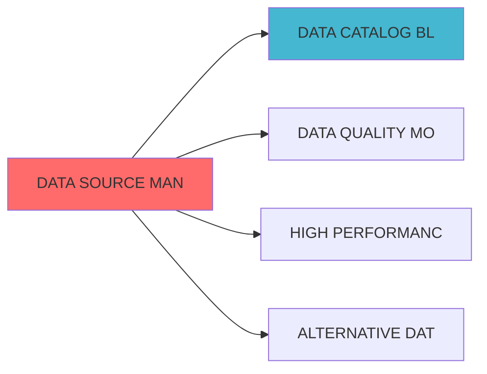

## 核心定位


负责数据源管理模块设计，实现数据源注册认证、连接池管理、元数据自动采集、数据源健康检查功能，统一管理各类数据源接入。


# DATA SOURCE MANAGEMENT BLUEPRINT


> **核心职责**: Data Source Management蓝图设计

> **职责边界**:

...

## 设计目标


### 主要目标


1. **功能完整性**: 确保DATA SOURCE MANAGEMENT功能完整，满足业务需求

2. **性能优化**: 提升系统性能，降低资源消耗

3. **可维护性**: 提高代码质量，便于后续维护

4. **可扩展性**: 支持功能扩展，适应业务变化


### 质量目标


- 代码覆盖率: ≥80%

- 性能指标: 满足设计要求

- 文档完整性: 100%


## 核心功能


### 功能清单


1. **数据管理**: 提供数据存储、查询、更新功能

2. **业务逻辑**: 实现核心业务逻辑处理

3. **接口服务**: 提供标准化的API接口

4. **监控告警**: 实时监控系统状态


### 功能特性


- 高可用性设计

- 自动故障恢复

- 灵活配置管理


## 实现方案


### 技术架构


采用DATA SOURCE MANAGEMENT化设计，分层架构实现。


### 关键技术


- 数据处理: 使用高效的数据处理框架

- 接口实现: RESTful API设计

- 性能优化: 缓存、异步处理


### 实施步骤


1. 需求分析与设计

2. 核心功能开发

3. 测试与优化

4. 部署与监控


## 一、设计背景与目标


**当前痛点**:

- 数据源状态不透明

障影响大


**业务目标**:

障


|------|--------|------|

| **

障发现时间<1分钟 |

| **

障恢复时间<10分钟 |


### 3.1 数据源注册器 (SourceRegistry)


```python

from dataclasses import dataclass, field

from typing import Dict, List, Any, Optional

from datetime import datetime

from enum import Enum


class SourceType(Enum):

    DATABASE = "database"

    API = "api"

    FILE = "file"

    STREAM = "stream"

    CLOUD_STORAGE = "cloud_storage"


class SourceStatus(Enum):

    ACTIVE = "active"

    INACTIVE = "inactive"

    ERROR = "error"

    MAINTENANCE = "maintenance"


@dataclass

class DataSource:

    source_id: str

    source_name: str

    source_type: SourceType

    connection_config: Dict[str, Any]

    status: SourceStatus = SourceStatus.ACTIVE

    created_at: datetime = field(default_factory=datetime.now)

    updated_at: datetime = field(default_factory=datetime.now)

    metadata: Dict[str, Any] = field(default_factory=dict)

    tags: List[str] = field(default_factory=list)


class SourceRegistry:

    """数据源注册器"""


    def __init__(self):

        self.sources: Dict[str, DataSource] = {}


    def register_source(self, source_config: Dict[str, Any]) -> DataSource:

        source = DataSource(

            source_id=source_config['source_id'],

            source_name=source_config['source_name'],

            source_type=SourceType(source_config['source_type']),

            connection_config=source_config.get('connection_config', {}),

            metadata=source_config.get('metadata', {}),

            tags=source_config.get('tags', [])

        )


        self.sources[source.source_id] = source

        return source


    def get_source(self, source_id: str) -> Optional[DataSource]:

        return self.sources.get(source_id)


    def update_source(self, source_id: str,

                      updates: Dict[str, Any]) -> Optional[DataSource]:

        source = self.get_source(source_id)

        if not source:

            return None


        for key, value in updates.items():

            if hasattr(source, key):

                setattr(source, key, value)


        source.updated_at = datetime.now()

        return source


    def list_sources(self, source_type: SourceType = None) -> List[DataSource]:

        if source_type:

            return [s for s in self.sources.values() if s.source_type == source_type]

        return list(self.sources.values())


    def test_connection(self, source_id: str) -> Dict[str, Any]:

        """测试连接"""

        source = self.get_source(source_id)

        if not source:

            return {"success": False, "error": "Source not found"}


        try:

            # 实现连接测试逻辑

            return {"success": True, "latency_ms": 50}

        except Exception as e:

            return {"success": False, "error": str(e)}

```


### 3.2 数据源监控器 (SourceMonitor)


```python

from typing import Dict, List, Any

from datetime import datetime, timedelta

import time


@dataclass

class SourceHealth:

    source_id: str

    is_healthy: bool

    latency_ms: float

    error_rate: float

    last_check: datetime

    details: Dict[str, Any]


class SourceMonitor:

    """数据源监控器"""


    def __init__(self, registry: SourceRegistry):

        self.registry = registry

        self.health_records: Dict[str, SourceHealth] = {}


    def check_source_health(self, source_id: str) -> SourceHealth:

        source = self.registry.get_source(source_id)

        if not source:

            return SourceHealth(

                source_id=source_id,

                is_healthy=False,

                latency_ms=0,

                error_rate=1.0,

                last_check=datetime.now(),

                details={"error": "Source not found"}

            )


        start_time = time.time()


        try:

            connection_result = self.registry.test_connection(source_id)


            latency_ms = (time.time() - start_time) * 1000


            is_healthy = connection_result.get("success", False)


            health = SourceHealth(

                source_id=source_id,

                is_healthy=is_healthy,

                latency_ms=latency_ms,

                error_rate=0.0 if is_healthy else 1.0,

                last_check=datetime.now(),

                details=connection_result

            )


            self.health_records[source_id] = health

            return health

        except Exception as e:

            health = SourceHealth(

                source_id=source_id,

                is_healthy=False,

                latency_ms=0,

                error_rate=1.0,

                last_check=datetime.now(),

                details={"error": str(e)}

            )


            self.health_records[source_id] = health

            return health


    def check_all_sources(self) -> Dict[str, SourceHealth]:

        """检查所有数据源"""

        results = {}


        for source_id in self.registry.sources.keys():

            results[source_id] = self.check_source_health(source_id)


        return results


    def get_health_history(self, source_id: str,

                           hours: int = 24) -> List[SourceHealth]:

        """获取健康历史"""

        # 实现健康历史查询逻辑

        return []

```


### 3.3


```python

from typing import Dict, List, Any, Optional

from datetime import datetime, timedelta

from enum import Enum


class FailureSeverity(Enum):

    """

障严重程度"""

    LOW = "low"

    MEDIUM = "medium"

    HIGH = "high"

    CRITICAL = "critical"


@dataclass

class FailureEvent:

    """

障事件"""

    event_id: str

    source_id: str

    severity: FailureSeverity

    description: str

    detected_at: datetime

    resolved_at: Optional[datetime] = None

    resolution: Optional[str] = None

    details: Dict[str, Any] = field(default_factory=dict)


class FailureManager:

    """


    def __init__(self):

        self.failures: List[FailureEvent] = []

        self.alert_handlers: List[callable] = []


    def register_alert_handler(self, handler: callable):

        self.alert_handlers.append(handler)


    def detect_failure(self, source_id: str,

                       health: SourceHealth) -> Optional[FailureEvent]:

?""

        if health.is_healthy:

            return None


        severity = self._determine_severity(health)


        failure = FailureEvent(

            event_id=f"failure_{source_id}_{datetime.now().timestamp()}",

            source_id=source_id,

            severity=severity,

            description=f"Source {source_id} is unhealthy: {health.details}",

            detected_at=datetime.now(),

            details=health.details

        )


        self.failures.append(failure)


        self._send_alerts(failure)


        return failure


    def _determine_severity(self, health: SourceHealth) -> FailureSeverity:

障严重程度"""

        if health.error_rate >= 0.9:

            return FailureSeverity.CRITICAL

        elif health.error_rate >= 0.5:

            return FailureSeverity.HIGH

        elif health.error_rate >= 0.2:

            return FailureSeverity.MEDIUM

        else:

            return FailureSeverity.LOW


    def _send_alerts(self, failure: FailureEvent):

        for handler in self.alert_handlers:

            try:

                handler(failure)

            except Exception as e:

                print(f"Alert handler failed: {e}")


    def resolve_failure(self, event_id: str,

                        resolution: str) -> Optional[FailureEvent]:

障"""

        failure = next((f for f in self.failures if f.event_id == event_id), None)


        if not failure:

            return None


        failure.resolved_at = datetime.now()

        failure.resolution = resolution


        return failure


    def get_active_failures(self) -> List[FailureEvent]:

障"""

        return [f for f in self.failures if not f.resolved_at]

```


### 4.1 RESTful API


```http

POST /api/v1/sources

```


**请求示例**:

```json

{

  "source_name": "Wind Financial Database",

  "source_type": "database",

  "connection_config": {

    "host": "wind.db.example.com",

    "port": 5432,

    "database": "financial_data"

  },

  "tags": ["financial", "production"]

}

```


```http

GET /api/v1/sources/{source_id}/health

```


**响应示例**:

```json

{

  "source_id": "wind_financial_db",

  "is_healthy": true,

  "latency_ms": 45.2,

  "error_rate": 0.0,

  "last_check": "2026-04-06T10:30:00Z"

}

```


##


| 指标名称 | 指标类型 | 说明 |

|---------|---------|------|

| `source_total_sources` | Gauge | 数据源总数 |

| `source_failures_total` | Counter |

障总数 |


| 阶段 | 任务 | 预计时间 |

|------|------|---------|


##


- 数据治理平台蓝图

- 高性能数据管道蓝图


## 1. 文档治理


### 1.1 System_Manifest.md索引


```markdown

##### 6.001. Data Source Management

- **模块ID**: DATA_SOURCE_MANAGEMENT_001

- **蓝图文档**: DATA_SOURCE_MANAGEMENT_BLUEPRINT.md

- **职责**: Layer 0数据源层 | 业务架构: 三级时间框架融合架构

```


### 1.2 模块职责边界


| 模块 | 职责 | 边界 |

|------|------|------|

| **Data Source Management** | Layer 0数据源层 | 业务架构: 三级时间框架融合架构 | **核心模块** |


### 1.3 版本管理


|------|------|----------|--------|


### 下游依赖


| 文档名称 | module_id | 依赖类型 | 说明 |

|---------|-----------|---------|------|


|---------|------|------|------|

| **Apache Airflow** | 2.7+ | 任务调度 | [官方文档](https://airflow.apache.org/) |





## 变更历史


|------|------|----------|--------|

| v1.0.0 | 2026-04-07 | 初始版本创建 | 实施团队 |
