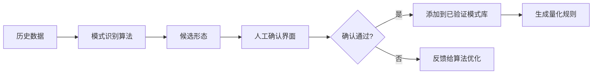
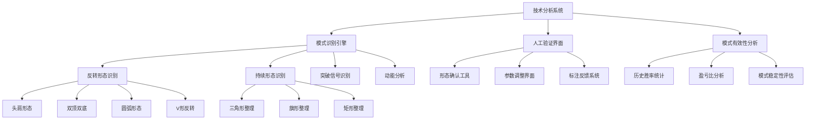

---
module_id: ARCHIVE_V4_DEV_PLAN_001
version: 1.0.1
status: Active
created_date: 2026-04-01
last_updated: 2026-04-01
owner: 首席文档架构?
standard_type: 专业量化机构文档
applicable_scope: 全系?
compliance_level: 初始标准
parent_document: ../INDEX.md
implementation_status: 进行?
responsibility:
  - 归档文档、历史版本

---
---

# A股量化交易系?.0开发方?
> **核心职责**: 文档内容说明
> **职责边界**: 
> - ✅ 本文档负责：文档内容说明相关内容
> - ❌ 本文档不负责：其他模块内容


## 系统概述
确保每个模块都可以独立开发、测试和复用?

## 开发环?

## 研究阶段系统

### 1. 研究环境与工作流管理系统
这是研究?操作系统"，确保所有研究都在受控环境中进行?
- 容器化研究环境：为每个研究项目提供隔离的、环境一致的Docker容器
- 依赖管理：统一管理Python包、R包、数据库驱动等依赖版?
- 研究项目模板：标准化的项目结构、配置文件、启动脚?
- 工作流编排：定义和执行复杂的研究流水线（如：数据预处??特征工程 ?模型训练?

### 2. 研究项目管理与协作平台（暂时不用开发协作部分，仅我一个人使用?
解决团队协作和研究资产管理问题?
- 研究项目登记：记录研究目标、负责人、时间线、状?
- 研究笔记与文档：关联代码、数据、结果的研究笔记系统
- 知识库：积累研究经验、失败教训、最佳实?
- 团队权限管理：项目级的代码、数据、结果访问控?

### 3. 研究资产管理系统
管理研究过程中产生的所?中间产物"?
- 特征/因子库：不仅仅是最终因子，包括所有测试过的特征版?
- 模型仓库：存储训练好的模型文件、超参数、性能指标
- 研究结果存储：结构化存储每次研究的输入、输出、配?
- 实验数据版本：记录研究使用的数据快照版本

### 4. 研究实验追踪系统
这是实现研究可复现性的核心?
- 实验自动记录：自动捕获每次实验的代码版本、参数、数据版?
- 实验对比看板：可视化对比不同实验配置的结果差?
- 超参数搜索管理：管理网格搜索、贝叶斯优化等参数搜索过?
- 实验血缘关系：追踪实验之间的衍生关系（基于哪个实验改进?

### 5. 研究效能分析系统
优化研究过程本身，提升研究效率?
- 研究周期分析：统计从想法到验证的平均时间
- 计算资源使用分析：监控研究过程中的CPU/GPU/内存使用情况
- 成功率统计：分析不同类型研究的成功率和价?
- 瓶颈识别：识别研究流程中的效率瓶颈点

## 探索性分析系?

### 数据获取与交互接?
统一数据门户：提供一个统一的界面，让研究员能够无缝访问数据管理系统中的所有数据，包括?
- 股票、期货、期权等标的的价量数?
- 基本面数?
- 宏观数据
- 另类数据

灵活的数据查询语言：支持类似SQL的查询，或更高级的面向对象的API，方便研究人员快速提取和组合所需数据?

交互式环境集成：深度集成 Jupyter Notebook, Jupyter Lab 或类似的交互式编程环境，这是进行探索性分析的主要工作台?

### 基本统计分析工具
- **描述性统?*：自动计算数据的均值、中位数、标准差、偏度、峰度、分位数等?

- **分布分析**?
  - 绘制分布直方图、KDE图?
  - 与正态分布、对数正态分布等进行对比?
  - QQ图，用于检验数据分布?

- **稳定性分?*?
  - 检查数据的平稳性（ADF检验）?
  - 分析数据统计特性（如均值、方差）随时间的变化?

### 相关性分?
- 截面相关性：不同标的在同一时间点的相关性分析?
- 时间序列相关性：分析不同时间序列之间的领先滞后关系（交叉相关性）?
- 滚动相关性：计算两个变量在一段滚动窗口内的相关性，观察其动态变化?
- 相关性矩阵与热力图：可视化大量标的之间的相关性结构?

### 深度模式挖掘
这是探索性分析的核心，旨在发现市场中可能存在的、可供利用的规律?

- **市场状态分?*?
  - 使用聚类算法（如K-Means, GMM）对市场状态（如高波动牛市、低波动熊市）进行识别和划分?
  - 分析不同市场状态下，各类资产和因子的表现差异?

- **季节?周期性分?*?
  - 月份效应、星期效应、日内效?的统计检验与可视化?
  - 利用傅里叶变换或小波分析探测隐藏的周期?

- **波动性分?*?
  - 检验波动率的聚集效应?
  - 分析已实现波动率与不同频率的关系?

- **因子灵感挖掘（预研究?*?
  - 进行大规模的"因子穷举"测试，快速验证成千上万种简单数据组合的预测能力，筛选出有潜力的方向，供因子研究系统进行深度加工?

- **事件研究分析**?
  - 定义特定事件（如财报发布、央行降准），分析事件前后标的收益率的平均表现?

### 交互式可视化工具
"一图胜千言"，可视化是探索性分析成功的关键?

- 灵活的时间序列绘图：支持轻松绘制多个时间序列，并能够进行缩放、平移、对比?
- 交互式散点图与回归线：用于直观观察变量间关系?
- 动画：展示某些模式或关系随时间的变化（例如，动态的散点图）?
- 标注工具：允许研究员在图表上手动标注重要事件或区域?

### 研究报告生成?
- 一键生成探索报告：将上述分析（统计表格、图表、检验结果）自动组合成一个格式化的报告（HTML/PDF）?
- 可复现性保障：报告应包含所有分析的数据版本、代码版本和参数设置，确保任何分析都是可复现的?

### 探索性分析系统的输入与输?
**输入**：来自数据管理系统的各类原始数据和初步加工数据?

**核心活动**：自由的数据漫游、可视化、统计检验和假设生成?

**输出**?
- 有价值的假设：例?A指标在B市场状态下对C类股票有显著的预测能??
- 有潜力的因子雏形：移交至 因子研究系统 进行严谨的工业化生产?
- 策略灵感：移交至 策略开发系?进行逻辑实现和回测?
- 数据分析报告：沉淀下来的研究知识和市场洞察?

这个系统是整个量化平台的"智慧源泉"，它通过降低探索门槛，极大地激发了研究人员的创造力，是驱动策略迭代和创新的核心引擎?

## 数据管理系统
为所有下游提供统一数据接口

### 数据下载系统

#### 股票数据下载系统

##### 多数据源适配器系?
```python
class 多数据源适配?
    """统一的多数据源接入管?""
    数据源配?= {
        'Baostock': {
            '类型': '官方API',
            '权限': '免费注册',
            '速率限制': '无明确限?,
            '数据质量': '⭐⭐⭐⭐?,
            '适用场景': ['历史行情', '财务数据', '复权因子']
        },
        'AkShare': {
            '类型': '开源库',
            '权限': '完全免费',
            '速率限制': '依赖源网?,
            '数据质量': '⭐⭐⭐⭐',
            '适用场景': ['实时行情', '概念板块', '资金流向', '宏观数据']
        },
        'Efinance': {
            '类型': '开源库',
            '权限': '完全免费',
            '速率限制': '依赖源网?,
            '数据质量': '⭐⭐⭐⭐',
            '适用场景': ['资金流向', '北向资金', '实时行情']
        },
        'Tushare Pro': {
            '类型': '官方API',
            '权限': '积分?,
            '速率限制': '根据积分等级',
            '数据质量': '⭐⭐⭐⭐?,
            '适用场景': ['深度数据', '因子数据', '专业指标']
        },
        '新浪财经': {
            '类型': '网络API',
            '权限': '完全免费',
            '速率限制': 'IP限制',
            '数据质量': '⭐⭐?,
            '适用场景': ['实时行情备用', '历史数据']
        },
        '腾讯财经': {
            '类型': '网络API',
            '权限': '完全免费',
            '速率限制': 'IP限制',
            '数据质量': '⭐⭐?,
            '适用场景': ['实时行情备用', '基础数据']
        }
    }
    
    def 获取数据(self, 数据类型, 参数, 优先级数据源=None):
        """智能数据源选择与回退"""
        可用数据?= self._筛选适用数据?数据类型)
        排序数据?= self._按优先级排序(可用数据? 优先级数据源)
        
        for 数据?in 排序数据?
            try:
                data = self._从数据源获取(数据? 数据类型, 参数)
                if self.数据质量检查器.检查数据质?data, 数据类型):
                    self.数据统计.记录成功(数据? 数据类型)
                    return data
            except Exception as e:
                self.数据统计.记录失败(数据? 数据类型, str(e))
                continue
        
        raise Exception(f"所有数据源获取失败: {数据类型}")
```

#### 新闻数据爬虫系统
```python
class 爬虫管理系统:
    """统一管理各类网络爬虫"""
    
    def __init__(self):
        self.爬虫注册?= {}
        self.爬虫监控 = 爬虫监控?)
    
    def 注册爬虫(self, 爬虫名称, 爬虫配置):
        """注册新的数据爬虫"""
        self.爬虫注册表[爬虫名称] = {
            '配置': 爬虫配置,
            '状?: '就绪',
            '最后运?: None,
            '成功?: 100.0,
            '监控': self.爬虫监控.创建监控?爬虫名称)
        }
    
    def 管理爬虫类型(self):
        """管理的爬虫类?""
        return {
            '新闻数据爬虫': {
                '目标网站': ['新浪财经', '东方财富', '同花?],
                '采集频率': '?0分钟',
                '数据内容': ['财经新闻', '公告', '研报'],
                '处理方式': '情感分析 + 关键词提?
            },
            '风控舆论爬虫': {
                '目标网站': ['雪球', '股吧', '微博财经'],
                '采集频率': '?5分钟',
                '数据内容': ['投资者情?, '舆论热点', '风险事件'],
                '处理方式': '情感分析 + 风险识别'
            },
            '其他数据爬虫': {
                '目标网站': ['宏观经济网站', '行业数据平台'],
                '采集频率': '每日/每周',
                '数据内容': ['宏观指标', '行业数据', '政策信息'],
                '处理方式': '结构化存?+ 时间序列?
            }
        }
```

#### 其他数据爬虫系统
- 其他数据因子
- 未来即将发生的事件、如发布会等等?

#### 智能下载调度?
```python
class 智能下载调度?
    """基于时间和优先级的智能下载调?""
    
    def __init__(self):
        self.任务队列 = PriorityQueue()
        self.调度规则 = self._初始化调度规?)
    
    def _初始化调度规?self):
        """定义不同时间段的下载任务"""
        return {
            '盘前准备': {
                '时间': '06:00-09:00',
                '任务': [
                    {'06:00': '下载前日收盘数据'},
                    {'07:00': '更新财务数据和基本面'},
                    {'08:00': '更新概念板块和行业数?},
                    {'08:30': '更新交易日历和停复牌信息'}
                ],
                '优先?: '?
            },
            '交易时段': {
                '时间': '09:00-15:00',
                '任务': [
                    {'09:00': '启动实时行情监控'},
                    {'09:15': '更新分钟线数?},
                    {'11:30': '上午数据汇?},
                    {'13:00': '继续实时数据更新'},
                    {'14:30': '准备收盘数据下载'}
                ],
                '优先?: '实时'
            },
            '盘后处理': {
                '时间': '15:00-24:00',
                '任务': [
                    {'15:05': '下载当日完整行情数据'},
                    {'16:00': '更新资金流向数据'},
                    {'17:00': '下载龙虎榜数?},
                    {'18:00': '更新融资融券数据'},
                    {'20:00': '数据质量校验和修?},
                    {'22:00': '生成数据质量报告'}
                ],
                '优先?: '?
            }
        }
    
    def 添加下载任务(self, 任务类型, 参数, 优先?'?, 重试策略=None):
        """添加下载任务到调度队?""
        任务 = {
            '任务ID': self._生成任务ID(),
            '任务类型': 任务类型,
            '参数': 参数,
            '优先?: self._解析优先?优先?,
            '状?: '等待',
            '创建时间': datetime.now(),
            '重试策略': 重试策略 or {'最大重试次?: 3, '重试间隔': [5, 10, 30]},
            '超时设置': 300  # 5分钟超时
        }
        self.任务队列.put((任务['优先?], 任务))
    
    def 执行调度循环(self):
        """主调度循?""
        while not self.任务队列.empty():
            优先? 任务 = self.任务队列.get_nowait()
            if self._应该执行(任务):
                self._执行任务(任务)
```

#### 数据质量控制

#### 数据清洗
```python
class 数据清洗引擎:
    """自动化数据清洗与转换"""
    
    def 清洗股票数据(self, 原始数据, 数据类型):
        """股票数据标准化清?""
        清洗规则 = {
            '行情数据': {
                '去重': ['股票代码', '交易日期', '时间?],
                '填充': {'前收盘价': '前向填充', '成交?: '0'},
                '修正': ['价格异常?, '成交量异?],
                '转换': ['日期格式?, '数值类型转?]
            },
            '财务数据': {
                '去重': ['股票代码', '报告?],
                '填充': {'缺失字段': '行业平均?},
                '修正': ['单位统一', '会计准则调整'],
                '转换': ['同比计算', '环比计算']
            },
            '资金流向': {
                '去重': ['股票代码', '日期'],
                '填充': {'缺失?: '0'},
                '修正': ['数据一致性校?],
                '转换': ['净流入计算', '占比计算']
            }
        }
        
        规则 = 清洗规则.get(数据类型, {})
        清洗后数?= 原始数据.copy()
        
        # 执行清洗流程
        if '去重' in 规则:
            清洗后数?= self._去重处理(清洗后数? 规则['去重'])
        if '填充' in 规则:
            清洗后数?= self._缺失值填?清洗后数? 规则['填充'])
        if '修正' in 规则:
            清洗后数?= self._数据修正(清洗后数? 规则['修正'])
        if '转换' in 规则:
            清洗后数?= self._数据转换(清洗后数? 规则['转换'])
        
        return 清洗后数?
```

#### 数据库选型矩阵
```python
# 基于您的硬件配置优化
STORAGE_CONFIG = {
    '实时数据': {
        'database': 'Redis',
        '配置': '内存64GB，持久化开?,
        '优势': '毫秒级响应，适合实时监控'
    },
    '历史行情': {
        'database': 'ClickHouse', 
        '配置': 'SSD存储，列式压?,
        '优势': '快速聚合查询，适合回测'
    },
    '关系数据': {
        'database': 'PostgreSQL',
        '配置': '事务安全，关系型',
        '优势': '财务数据、元数据管理'
    },
    '文件存储': {
        'format': 'Parquet + 分区',
        '配置': '按股票代?日期分区',
        '优势': '高效读取，适合批量处理'
    }
}
```

#### 数据治理模块
```python
class DataGovernance:
    """数据治理 - 保证数据质量与一致?""
    
    def data_lifecycle_management(self):
        """数据生命周期管理"""
        return {
            '采集': '多源校验、去重合?,
            '存储': '分级存储、压缩加?, 
            '处理': '标准化、特征工?,
            '使用': '权限控制、访问审?,
            '归档': '自动归档、定期清?
        }
    
    def metadata_management(self):
        """元数据管?""
        metadata = {
            '数据血?: '记录数据来源和转换过?,
            '数据质量': '完整性、准确性评?,
            '使用统计': '访问频率、用户行?,
            '版本控制': '数据变更历史追溯'
        }
        return metadata
```

#### 每日数据流水?
```python
def daily_data_pipeline():
    """每日数据自动化流水线"""
    steps = [
        # 阶段1: 数据采集
        {'06:00': '下载前日收盘数据'},
        {'09:00': '更新实时数据连接'}, 
        {'15:00': '下载当日完整数据'},
        
        # 阶段2: 数据处理
        {'16:00': '数据清洗和质量检?},
        {'17:00': '生成衍生指标和因?},
        {'18:00': '更新数据库和缓存'},
        
        # 阶段3: 数据验证
        {'19:00': '跨数据源一致性验?},
        {'20:00': '生成数据质量报告'},
        {'21:00': '异常数据人工复核'}
    ]
    return steps
```

#### 容错与恢复机?
```python
class FaultToleranceSystem:
    """容错处理系统"""
    
    def error_recovery(self):
        """错误恢复策略"""
        strategies = {
            '网络中断': '自动重试 + 切换数据?,
            '数据缺失': '多源补全 + 标记处理',
            '格式错误': '自动修正 + 人工审核',
            '存储异常': '冗余备份 + 快速恢?
        }
        return strategies
    
    def backup_strategy(self):
        """备份策略"""
        return {
            '实时备份': '数据库主从复?,
            '定时备份': '每日全量快照', 
            '异地备份': '关键数据云存?,
            '版本回溯': '支持数据版本回退'
        }
```

#### 预期性能指标
| 操作类型 | 预期性能 | 优化措施 |
|---------|---------|---------|
| 实时数据更新 | < 100ms | 内存缓存 + 异步写入 |
| 历史数据查询 | < 1s | 列式存储 + 分区优化 |
| 因子计算 | < 5s | GPU加?+ 并行处理 |
| 全量回测 | < 10分钟 | 数据预处?+ 批量计算 |

### 存储系统

#### 行情数据
- **股票**
  - 实时Tick、分钟线、日?
    - 多数据源校验、实时更?
- **题材概念行业同花顺板?*
  - 分钟线、日?
- **同花顺情绪指?*
  - 同花顺情绪指?83404

```python
class 增强数据流水?
    """增强的自动化数据流水?""
    
    def 完整每日流水?self):
        """完整的每日数据处理流水线"""
        return {
            '阶段1: 盘前准备 (06:00-09:00)': [
                {'06:00': '下载前日收盘数据', '超时': '30分钟', '重试': 3},
                {'06:30': '更新财务数据和基本面', '超时': '1小时', '重试': 2},
                {'07:30': '更新概念板块数据', '超时': '30分钟', '重试': 2},
                {'08:00': '更新行业分类数据', '超时': '20分钟', '重试': 2},
                {'08:30': '生成盘前数据报告', '超时': '15分钟', '重试': 1}
            ],
            '阶段2: 交易时段 (09:00-15:00)': [
                {'09:00': '启动实时行情监控', '超时': '实时', '重试': '无限'},
                {'09:15': '开始分钟线数据采集', '超时': '实时', '重试': '无限'},
                {'11:30': '上午数据初步汇?, '超时': '10分钟', '重试': 1},
                {'13:00': '继续实时数据更新', '超时': '实时', '重试': '无限'},
                {'14:55': '准备收盘数据处理', '超时': '5分钟', '重试': 2}
            ],
            '阶段3: 盘后处理 (15:00-20:00)': [
                {'15:05': '下载当日完整行情', '超时': '30分钟', '重试': 3},
                {'15:45': '更新资金流向数据', '超时': '45分钟', '重试': 2},
                {'16:30': '下载龙虎榜数?, '超时': '30分钟', '重试': 2},
                {'17:30': '更新融资融券数据', '超时': '30分钟', '重试': 2},
                {'18:30': '数据质量校验', '超时': '1小时', '重试': 1}
            ],
            '阶段4: 夜间处理 (20:00-06:00)': [
                {'20:00': '生成数据质量报告', '超时': '30分钟', '重试': 1},
                {'21:00': '执行数据备份', '超时': '2小时', '重试': 2},
                {'23:00': '系统维护和优?, '超时': '1小时', '重试': 1},
                {'02:00': '历史数据归档', '超时': '3小时', '重试': 1}
            ]
        }
```

#### 技术指标数?

##### 趋势跟踪指标
| 指标名称 | 计算公式 | 用?| 参数 |
|---------|---------|------|------|
| 布林?(BB) | 中轨=MA(N)，上下轨=中轨K标准?| 波动率判断、超买超?| N=20, K=2 |
| 抛物线指?(SAR) | 加速因子AF逐步增加，跟踪极点价?| 趋势跟踪、止损止?| AF=0.02, MAX=0.2 |
| 平均趋向指数 (ADX) | +DI?DI的标准化差?| 趋势强度判断 | N=14 |
| 三重指数平均?(TRIX) | 三重平滑的EMA变化?| 过滤噪音、识别趋?| N=12, M=9 |

##### 动量振荡指标
| 指标名称 | 计算公式 | 用?| 参数 |
|---------|---------|------|------|
| 相对强弱指数 (RSI) | RS = 平均涨幅/平均跌幅，RSI=100-100/(1+RS) | 超买超卖判断 | N=6,12,24 |
| 威廉指标 (W%R) | (N日内最?收盘)/(N日内最?N日内最?100 | 极端行情判断 | N=10,6 |
| 商品通道指数 (CCI) | (TP-MA)/(0.015MD)，TP=(???/3 | 趋势转折点识?| N=20 |
| 动量指标 (MOM) | 收盘?- N日前收盘?| 价格变动速度 | N=10 |
| 变动率指?(ROC) | (收盘?N日前收盘?/N日前收盘价?00 | 价格变动百分?| N=12,25 |

##### 成交量指?
| 指标名称 | 计算公式 | 用?| 参数 |
|---------|---------|------|------|
| 成交量加权平均价 (VWAP) | Σ(价格成交?/Σ成交?| 日内交易基准 | 日内分时 |
| 能量?(OBV) | 当日收盘>前收：OBV=前OBV+成交量，反之递减 | 量价确认 | - |
| 资金流量指标 (MFI) | 典型价成交量，分正负资金?| 带成交量的RSI | N=14 |
| 成交量比?(VR) | N日内上涨日成交量/(下跌日成交量2) | 成交量相对强?| N=26 |

##### 波动率指?
| 指标名称 | 计算公式 | 用?| 参数 |
|---------|---------|------|------|
| 平均真实波幅 (ATR) | Max(当日?? 前收-当日? 前收-当日?的MA | 波动性测量、止损设?| N=14 |
| 标准?(StdDev) | 收盘价的N日标准差 | 波动率量?| N=20 |
| 布林带宽?| (上轨-下轨)/中轨 | 波动率变?| N=20, K=2 |

##### 市场广度指标
| 指标名称 | 计算公式 | 用?| 参数 |
|---------|---------|------|------|
| 涨跌比率 (ADR) | N日内上涨家数/下跌家数 | 市场情绪 | N=10,25 |
| 腾落指标 (ADL) | 每日上涨-下跌家数的累?| 趋势确认 | - |
| 麦克连指?(MCL) | 基于ADL的动量振?| 广度动量 | 短期=19,长期=39 |

##### 其他个人指标
- 昨日今日成交对比
- 当日均价
- 同花顺指标：日线和当日的"市场情绪指数" 有过热线和过冷线
- 机构目标?
- 因子分析推导目标?

#### 回测数据
- 新闻回测数据
- 策略回测数据

#### 宏观数据
- **中国宏观成绩?*
  - 中国
    - 中国-MM恐惧与贪婪指数vs.沪深300
      - https://sc.macromicro.me/charts/128743/chinaus-mm-fear-and-greed-index-vs-csi-300
    - 中国-国债收益率
    - 中国-城镇调查失业?
    - 中国-房地产开发投?累计同比)
    - 中国-工业增加?(同比)
    - 中国-固定资产投资完成?累计同比)
    - 中国-社会消费品零售总额 (同比)
    - 中国-贷款市场报价利率[LPR]-1年期
    - 中国-GDP综合指标
      - https://sc.macromicro.me/macro/cn
    - 中国-月中经济数据
    - 中国-消费
    - 中国-投资
    - 中国-物价
    - 中国-对外贸易
    - 中国-房地?
    - 中国-制?服务
    - 中國-市场指标
    - 香港-市场指标
    - 中国-新质生产?
  - **全球**
    - 景气衰退
      - 全球-MM景气衰退概率
    - 工业/製造业
      - MM制造业周期指标
    - 科技巨头
      - NASDAQ 100
    - AI 情绪量化
      - 美国-MM AI 美联储声明稿鹰鸽指数
    - 利差
      - 美国-10年期-2年期国债收益率
    - 波动?
      - CBOE-VIX波动率指数[VIX]
    - 高频数据
      - 全球-每日航班?
    - 情绪指标
      - 美国-CNN恐惧与贪婪指?
    - 地缘政治
      - 全球-地缘政治风险指数
    - 加密货币
      - 比特?美元
    - 稳定?
      - 稳定?市?
    - 新能?
      - 全球-地表均温异常?平均)
    - 去美元化
      - IMF-官方外汇储备货币占比(美元)
  - **债市**
    - 美?
      - 美国-10年期国债收益率
    - 美国-公司?
      - 美国-美银美林CCC级或以下高收益债券有效收益?
    - 新兴市场-股债市
      - 新兴市场-美银美林高收益公司加分类指数有效收益?
  - **大宗商品**
    - 原油
      - NYMEX-WTI西德州原油期货价?
    - 黄金
      - NYMEX-黄金期货价格
    - 白银
      - NYMEX-白银期货价格
    - 铁矿?
      - 中国-铁矿砂价?
    - ?
      - NYMEX-铜期货价?
    - 黄豆
      - CBOT-黄豆期货价格
    - 玉米
      - CBOT-玉米期货价格
    - 小麦
      - CBOT-小麦期货价格
    - 棉花
      - NYBOT-棉花期货价格
    - 咖啡
      - ICE-咖啡期货价格
    - 天然?
      - NYMEX-亨利港天然气期货价格
    - 稀?
      - 中国-稀土价?钕镨氧化?美元/公斤)
  - **期货市场**
  - **汇市**
    - 美元
      - 美元指数
    - 欧元
      - 欧元/美元
  - **全球股市**
    - 全球-股市
      - MSCI全世界指数[ACWI]
    - 美国-股市
      - 美国-S&P 500
    - 欧洲-股市
      - MSCI欧洲指数
    - 日本-股市
      - 日本-日经Nikkei 225
    - 台湾-股市
      - 台湾-加权股价指数
    - 中国-股市
      - 中国-沪深300
    - 香港-股市
      - 香港-恒生指数
    - 俄罗?股市
      - 俄罗?RTS Index
    - 巴西-股市
      - 巴西-Bovespa index
    - 印度-股市
      - 印度 - S&P BSE SENSEX 30 Index
    - 澳洲-股市
      - 澳洲-ASX All Ordinaries Index
  - **特朗普专?*
    - 特朗普事?言?
  - **美联储专?*
    - 降息
    - 缩表
    - cpi
    - 其他数据
  - **政策专区**
    - 风云政策计算?
      - http://www.fyzcjsq.com/policy/info?q=form~%7B%22keyword%22%3A%22%22%7C%22policyType%22%3A%22%22%7C%22policySystem%22%3A%22%22%7C%22industryType%22%3A%22%22%7C%22publishTimeRange%22%3A%5B%5D%7C%22applyTimeRange%22%3A%5B%5D%7C%22category%22%3A%22%22%7C%22area%22%3A%5B%5D%7D,sortProp~%7B%22orderField%22%3A%22publishTime%22%7C%22orderValue%22%3A%22DESC%22%7D,pagination~%7B%22pageSize%22%3A10%7C%22total%22%3A50%7C%22currentPage%22%3A1%7C%22currentTotal%22%3A19893%7D,control~%7B%22areaLevel%22%3A-2%7C%22searchTagItems%22%3A%5B%5D%7D,
    - 其他渠道
      - 官方发布部门
        - 中国证监会：最直接相关，发布上市公司监管、市场交易规则等直接影响A股的政策?
        - 中国人民银行：发布货币政策（如利率、存款准备金率）、信贷政策等，对市场流动性有重大影响
        - 财政部：发布财政政策、税收调整等，影响宏观经济和特定行业的盈利能力?
        - 国务院：发布国家重大战略、行业发展规划等顶层设计，对市场有长期和方向性影响?
      - 专业信息平台
        - 国研网：汇集并深度解读宏观经济和金融政策，信息集中，便于系统性研究?
        - 中国政府网：官方政策总入口，权威性高，信息全面，是追溯政策原文的可靠来源?
    - 十五五规?

#### 基本面数?
- 财报、宏观、行?
  - 数据标准化、时间对?

#### 交易日、日历表数据

#### 另类数据
- 新闻、舆情、网络数?
  - NLP处理、情感分?

#### 数据存储
- 时序数据库、数据仓?
  - 快速查询、数据压?

#### 因子映射?

##### 核心功能模块
| 模块 | 功能描述 | 技术实?|
|------|---------|---------|
| 因子分类体系 | 因子分类、标签管?| 树状结构 + 标签系统 |
| 因子参数配置 | 参数模板、默认值管?| JSON Schema + 参数验证 |
| 因子依赖关系 | 因子计算依赖?| DAG（有向无环图?|
| 因子版本管理 | 因子定义版本控制 | Git-like 版本管理 |
| 因子元数?| 因子描述、性能统计 | 元数据数据库 |

```python
class 因子映射?
    """因子映射?- 统一管理所有因子定义和关系"""
    
    def __init__(self):
        self.因子分类体系 = self._初始化分类体?)
        self.因子参数?= self._初始化参数库()
        self.因子依赖?= self._构建依赖?)
    
    def _初始化分类体?self):
        """建立完整的因子分类体?""
        return {
            '技术指?: {
                '趋势?: ['MA', 'EMA', 'MACD', '布林?, 'SAR'],
                '动量?: ['RSI', 'KDJ', '威廉指标', 'CCI', 'ROC'],
                '波动?: ['ATR', '标准?, '布林带宽?],
                '成交量类': ['OBV', 'VWAP', 'MFI', 'VR']
            },
            '基本?: {
                '估值类': ['PE', 'PB', 'PS', '股息?],
                '成长?: ['营收增长?, '净利润增长?, 'ROE增长?],
                '质量?: ['ROE', 'ROA', '毛利?, '负债率'],
                '规模?: ['总市?, '流通市?, '自由流通市?]
            },
            '资金流向': {
                '主力资金': ['主力净流入', '超大单净流入'],
                '北向资金': ['北向净买入', '北向持仓比例'],
                '融资融券': ['融资余额', '融券余额', '融资买入?]
            },
            '另类数据': {
                '新闻舆情': ['情感得分', '关键词热?],
                '网络搜索': ['搜索指数', '关注度变?],
                '社交媒体': ['讨论热度', '情绪指数']
            }
        }
```

```python
class 因子参数配置:
    """因子参数配置管理?""
    
    因子参数模板 = {
        'MA': {
            'description': '移动平均?,
            'parameters': {
                'periods': {
                    'type': 'list',
                    'default': [5, 10, 20, 30, 60],
                    'description': '计算周期列表'
                }
            },
            'output_columns': ['MA5', 'MA10', 'MA20', 'MA30', 'MA60']
        },
        'RSI': {
            'description': '相对强弱指数',
            'parameters': {
                'periods': {
                    'type': 'list',
                    'default': [6, 12, 24],
                    'description': 'RSI计算周期'
                }
            },
            'output_columns': ['RSI6', 'RSI12', 'RSI24']
        },
        'MACD': {
            'description': '指数平滑异同移动平均?,
            'parameters': {
                'fast_period': {'type': 'int', 'default': 12},
                'slow_period': {'type': 'int', 'default': 26},
                'signal_period': {'type': 'int', 'default': 9}
            },
            'output_columns': ['DIF', 'DEA', 'MACD']
        }
    }
    
    def 获取因子参数(self, 因子名称, 自定义参?None):
        """获取因子完整参数配置"""
        基础配置 = self.因子参数模板.get(因子名称, {}).copy()
        if 自定义参?
            基础配置['parameters'].update(自定义参?
        return 基础配置
```

```python
class 因子依赖管理?
    """管理因子间的依赖关系"""
    
    因子依赖?= {
        'MACD': {
            'dependencies': ['EMA'],
            'description': '依赖EMA计算'
        },
        '布林?: {
            'dependencies': ['MA', '标准?],
            'description': '依赖MA和标准差'
        },
        'RSI': {
            'dependencies': ['价格变化'],
            'description': '依赖价格差分'
        },
        '自定义复合因?: {
            'dependencies': ['RSI', 'MACD', '资金流向'],
            'description': '多因子组?
        }
    }
    
    def 解析依赖?self, 目标因子):
        """解析因子的完整依赖链"""
        依赖?= []
        self._递归解析依赖(目标因子, 依赖? set())
        return 依赖?
    
    def _递归解析依赖(self, 当前因子, 依赖? 已访?:
        if 当前因子 in 已访?
            return
        已访?add(当前因子)
        
        依赖因子 = self.因子依赖?get(当前因子, {}).get('dependencies', [])
        for 依赖 in 依赖因子:
            self._递归解析依赖(依赖, 依赖? 已访?
        
        依赖?append(当前因子)
```

```python
def 因子处理流水?因子列表, 开始日? 结束日期):
    """完整的因子计算流水线"""
    # 阶段1: 因子定义解析
    因子定义 = 因子映射?解析因子定义(因子列表)
    依赖?= 因子依赖管理?解析依赖?因子定义)
    
    # 阶段2: 数据准备
    原始数据 = 数据管理系统.获取所需数据(依赖? 开始日? 结束日期)
    
    # 阶段3: 因子计算（按依赖顺序?
    因子结果 = {}
    for 因子 in 依赖?
        因子配置 = 因子参数配置.获取因子参数(因子)
        因子数据 = 因子计算引擎.计算因子(因子, 原始数据, 因子配置)
        因子结果[因子] = 因子数据
    
    # 阶段4: 质量检?
    质量报告 = 因子质量监控.检查因子质?因子结果)
    
    # 阶段5: 存储结果
    因子存储管理.存储因子数据(因子结果, 质量报告)
    
    return 因子结果, 质量报告
```

```python
class 智能因子管理系统:
    """AI增强的因子管理系?""
    
    def __init__(self):
        self.因子映射?= 因子映射?)
        self.ai助手 = DeepSeek量化助手()
        self.可视化界?= 因子可视化界?)
    
    def 自然语言创建因子(self, 用户描述):
        """通过自然语言创建因子"""
        # AI解析用户意图
        因子定义 = self.ai助手.解析因子描述(用户描述)
        
        # 验证因子可行?
        可行性检?= self.验证因子可行?因子定义)
        if 可行性检查['可行']:
            # 自动生成因子代码
            因子代码 = self.生成因子代码(因子定义)
            
            # 注册到因子映射库
            self.因子映射?注册新因?因子定义, 因子代码)
            
            return {
                'status': 'success',
                'factor_code': 因子代码,
                'factor_id': 因子定义['id']
            }
        else:
            return {
                'status': 'failed',
                'reason': 可行性检查['原因']
            }
    
    def 智能因子优化(self, 基础因子, 优化目标):
        """AI辅助因子优化"""
        优化建议 = self.ai助手.分析因子优化(基础因子, 优化目标)
        
        优化方案 = {
            '参数优化': 优化建议.get('参数优化', []),
            '组合建议': 优化建议.get('因子组合', []),
            '频率调整': 优化建议.get('计算频率', '日线')
        }
        
        return 优化方案
```

```python
class 因子可视化界?
    """因子管理的可视化操作界面"""
    
    def 创建因子面板(self):
        """因子创建和配置面?""
        return {
            '因子库浏?: self.因子库树状视?),
            '因子创建向导': self.自然语言因子创建(),
            '参数配置界面': self.可视化参数配?),
            '依赖关系?: self.因子依赖可视?),
            '性能分析': self.因子绩效分析面板()
        }
    
    def 自然语言因子创建(self):
        """自然语言因子创建界面"""
        return """
        -- 因子定义?
        CREATE TABLE factor_definitions (
            factor_id VARCHAR(50) PRIMARY KEY,
            factor_name VARCHAR(100),
            factor_type ENUM('technical', 'fundamental', 'flow', 'alternative'),
            category VARCHAR(50),
            description TEXT,
            formula_expression TEXT,
            parameters JSON,
            dependencies JSON,
            created_time DATETIME,
            updated_time DATETIME,
            version INT DEFAULT 1,
            status ENUM('active', 'deprecated', 'testing')
        );
        
        -- 因子参数?
        CREATE TABLE factor_parameters (
            param_id VARCHAR(50) PRIMARY KEY,
            factor_id VARCHAR(50),
            param_name VARCHAR(50),
            param_type ENUM('int', 'float', 'list', 'string'),
            default_value JSON,
            value_range JSON,
            description TEXT,
            FOREIGN KEY (factor_id) REFERENCES factor_definitions(factor_id)
        );
        
        -- 因子数据?
        CREATE TABLE factor_values (
            stock_code VARCHAR(20),
            trade_date DATE,
            factor_id VARCHAR(50),
            factor_value DECIMAL(20,6),
            data_source VARCHAR(50),
            calculated_time DATETIME,
            PRIMARY KEY (stock_code, trade_date, factor_id)
        );
        """
```

##### 因子映射库开发阶?
- **第一阶段：基础因子映射?*
  1. 建立因子分类体系
  2. 实现因子参数配置管理
  3. 构建基础因子依赖关系
  4. 创建因子元数据存?

- **第二阶段：AI增强功能**
  1. 集成DeepSeek进行自然语言因子创建
  2. 实现因子智能优化建议
  3. 开发因子可视化配置界面
  4. 添加因子自动验证功能

- **第三阶段：高级功?*
  1. 因子组合挖掘
  2. 因子绩效分析
  3. 因子衰减监控
  4. 自动化因子流水线

##### 因子管理系统特?
?统一的因子管理：所有因子集中管理，避免重复计算
?智能因子创建：通过自然语言快速创建新因子
?可视化操作：直观的因子配置和依赖关系查看
?质量保证：自动化的因子质量检查和验证
?高效计算：基于依赖关系的优化计算顺序

```python
def 因子存储性能优化():
    """基于您硬件配置的存储优化"""
    优化策略 = {
        '内存缓存': {
            '策略': '热点因子数据内存缓存',
            '大小': '分配16GB内存用于因子缓存',
            '效果': '提升因子查询速度10?'
        },
        'GPU加?: {
            '策略': '使用RTX 3090加速因子计?,
            '场景': '批量因子计算、矩阵运?,
            '效果': '计算速度提升5-20?
        },
        '存储优化': {
            '策略': 'SSD存储 + 数据分区',
            '方案': '按时?股票代码双重分区',
            '效果': '查询性能提升3-5?
        }
    }
    return 优化策略
```

```python
def 因子数据处理流水?因子列表, 开始日? 结束日期):
    """完整的因子数据处理流?""
    # 阶段1: 从因子定义库获取因子配置（策略研究系统）
    因子定义 = 因子管理系统.获取因子定义(因子列表)
    
    # 阶段2: 从数据存储系统获取基础数据（数据管理系统）
    基础数据 = 数据存储系统.获取因子基础数据(因子定义, 开始日? 结束日期)
    
    # 阶段3: 计算因子数值（策略研究系统?
    因子数?= 因子计算引擎.计算因子(因子定义, 基础数据)
    
    # 阶段4: 存储计算结果到数据存储系统（数据管理系统?
    数据存储系统.存储因子数据(因子数? 因子定义)
    
    # 阶段5: 更新因子元数据（混合存储?
    因子管理系统.更新因子元数?因子定义, 因子数?
    
    return 因子数?
```

##### 因子数据的存储架?

| 存储类型 | 数据内容 | 存储位置 | 更新频率 | 使用场景 |
|---------|---------|---------|---------|---------|
| 因子定义?| 因子公式、参数、依赖关?| 策略研究系统 | 低频 | 因子开发、配置管?|
| 因子基础数据 | 计算因子所需的原始数?| 数据存储系统 | 中高?| 因子计算、回?|
| 因子计算结果 | 已计算的因子数?| 数据存储系统 | 中高?| 策略信号、分?|
| 因子元数?| 因子性能、质量统?| 混合存储 | 低频 | 因子筛选、监?|

```python
class 多级存储架构:
    """基于访问频率的多级存储优?""
    
    def __init__(self):
        self.存储配置 = self._优化存储配置()
    
    def _优化存储配置(self):
        """基于硬件配置的存储优?""
        return {
            '热存储层': {
                '存储引擎': 'Redis + 内存数据?,
                '容量规划': '16GB 内存分配',
                '数据内容': ['实时行情', '当前持仓', '监控数据'],
                '访问特点': '毫秒级响应，高频读写',
                '备份策略': '实时主从复制',
                '预期性能': '< 10ms 访问延迟'
            },
            '温存储层': {
                '存储引擎': 'ClickHouse + PostgreSQL',
                '容量规划': 'SSD 1TB 主要存储',
                '数据内容': ['日线数据', '技术指?, '因子数据', '基本面数?],
                '访问特点': '秒级响应，批量查?,
                '备份策略': '每日增量备份',
                '预期性能': '< 1s 查询响应'
            },
            '冷存储层': {
                '存储引擎': 'Parquet + 压缩文件',
                '容量规划': 'HDD 2TB 归档存储',
                '数据内容': ['历史完整数据', '备份快照', '原始数据'],
                '访问特点': '分钟级响应，低频访问',
                '备份策略': '每周全量备份',
                '预期性能': '< 30s 数据加载'
            },
            '元数据存?: {
                '存储引擎': 'PostgreSQL',
                '容量规划': 'SSD 100GB',
                '数据内容': ['数据血?, '质量报告', '系统日志'],
                '访问特点': '事务安全，关系查?,
                '备份策略': '事务日志备份',
                '预期性能': '< 100ms 事务处理'
            }
        }
```

```python
class 元数据管理系?
    """全面的元数据管理"""
    
    def 元数据架?self):
        """元数据管理架?""
        return {
            '技术元数据': {
                '内容': ['数据结构', '存储位置', '数据格式', '数据血?],
                '管理方式': '自动采集 + 系统注册',
                '更新频率': '实时更新'
            },
            '业务元数?: {
                '内容': ['业务含义', '数据质量', '使用指南', '负责?],
                '管理方式': '手动维护 + 自动补充',
                '更新频率': '按需更新'
            },
            '操作元数?: {
                '内容': ['访问日志', '性能统计', '错误记录', '使用模式'],
                '管理方式': '自动采集 + 统计分析',
                '更新频率': '实时采集'
            },
            '管理元数?: {
                '内容': ['生命周期', '权限控制', '版本信息', '备份策略'],
                '管理方式': '策略配置 + 自动执行',
                '更新频率': '策略变更?
            }
        }
    
    def 数据血缘追?self):
        """数据血缘关系追?""
        return {
            '上游依赖': {
                '数据?: '记录数据来源和获取方?,
                '处理过程': '记录数据清洗和转换步?,
                '质量检?: '记录质量检查和修复历史'
            },
            '下游影响': {
                '使用场景': '记录数据被哪些系统使?,
                '衍生数据': '记录生成的新数据和指?,
                '业务影响': '记录对业务决策的影响范围'
            },
            '版本控制': {
                '数据版本': '记录数据变更历史和版?,
                'schema版本': '记录数据结构变更历史',
                '质量版本': '记录质量标准的版本变?
            }
        }
```

```python
class 增强容错系统:
    """全面的容错与恢复机制"""
    
    def 错误恢复策略(self):
        """分层错误恢复策略"""
        return {
            '网络层错?: {
                '检测方?: '心跳检?+ 超时监控',
                '恢复策略': ['自动重试', '切换数据?, '使用缓存数据'],
                '重试策略': {'最大重?: 5, '间隔': [1, 5, 10, 30, 60]},
                '降级方案': '返回最近可用数?
            },
            '数据层错?: {
                '检测方?: '数据校验 + 完整性检?,
                '恢复策略': ['多源补全', '数据修复', '标记异常'],
                '修复策略': {'自动修复': True, '人工审核': True},
                '补偿方案': '增量更新 + 数据同步'
            },
            '系统层错?: {
                '检测方?: '健康检?+ 性能监控',
                '恢复策略': ['服务重启', '故障转移', '系统回滚'],
                '备份策略': {'实时备份': True, '快速恢?: True},
                '应急方?: '切换到备用系?
            },
            '业务层错?: {
                '检测方?: '业务规则校验 + 逻辑检?,
                '恢复策略': ['业务流程回退', '数据版本回滚'],
                '审计策略': {'操作日志': True, '变更追踪': True},
                '补救方案': '人工干预 + 流程修正'
            }
        }
    
    def 备份策略增强(self):
        """多层次备份策?""
        return {
            '实时备份': {
                '策略': '数据库主从复?+ 实时同步',
                '范围': '关键业务数据',
                'RPO': '秒级',  # 恢复点目?
                'RTO': '分钟?  # 恢复时间目标
            },
            '定时备份': {
                '策略': '每日增量备份 + 每周全量备份',
                '范围': '全部业务数据',
                'RPO': '24小时',
                'RTO': '小时?
            },
            '异地备份': {
                '策略': '关键数据云存储备?,
                '范围': '核心数据和配?,
                'RPO': '4小时',
                'RTO': '小时?
            },
            '版本回溯': {
                '策略': '数据版本管理 + 快照功能',
                '范围': '重要数据变更',
                'RPO': '按版?,
                'RTO': '分钟?
            }
        }
```

```python
class 性能监控系统:
    """全面的性能监控与优?""
    
    def 性能指标定义(self):
        """定义关键性能指标"""
        return {
            '实时数据更新': {
                '预期性能': '< 100ms',
                '优化措施': ['内存缓存', '异步写入', '连接池优?],
                '监控指标': ['更新延迟', '成功?, '吞吐?],
                '告警阈?: {'延迟': '200ms', '失败?: '1%'}
            },
            '历史数据查询': {
                '预期性能': '< 1s',
                '优化措施': ['列式存储', '分区优化', '索引优化'],
                '监控指标': ['查询响应时间', '并发查询?, '缓存命中?],
                '告警阈?: {'响应时间': '2s', '错误?: '0.5%'}
            },
            '因子计算': {
                '预期性能': '< 5s',
                '优化措施': ['GPU加?, '并行处理', '算法优化'],
                '监控指标': ['计算时间', '资源使用?, '计算精度'],
                '告警阈?: {'计算时间': '10s', '内存使用': '80%'}
            },
            '全量回测': {
                '预期性能': '< 10分钟',
                '优化措施': ['数据预处?, '批量计算', '分布式处?],
                '监控指标': ['回测时间', '数据加载时间', '内存峰?],
                '告警阈?: {'总时?: '20分钟', '内存溢出': '90%'}
            },
            '系统整体': {
                '预期性能': '724稳定运行',
                '优化措施': ['资源监控', '自动扩缩?, '负载均衡'],
                '监控指标': ['CPU使用?, '内存使用', '磁盘IO', '网络带宽'],
                '告警阈?: {'CPU': '85%', '内存': '90%', '磁盘': '95%'}
            }
        }
```

### 目标

#### 第一阶段：基础框架搭建
- **优先级：?* - 建立可运行的基础系统
- **实施任务**?
  ```python
  ['搭建多数据源适配器基础框架',
   '实现基础数据下载调度',
   '配置核心数据?Redis + PostgreSQL)',
   '建立基础数据质量检?,
   '实现每日流水线核心功?]
  ```

#### 第二阶段：功能完?
- **优先级：?* - 增强系统功能和稳定?
- **实施任务**?
  ```python
  ['完善数据清洗和质量控制系?,
   '实现多级存储架构',
   '搭建元数据管理系?,
   '增强容错和恢复机?,
   '优化性能监控体系']
  ```

#### 第三阶段：高级功?
- **优先级：?* - 提升系统智能化水?
- **实施任务**?
  ```python
  ['实现智能数据源选择算法',
   '搭建自动化数据治理平?,
   '开发高级性能优化功能',
   '实现预测性维护和自愈能力']
  ```

### 重要注意事项
1. **数据质量保障**
   - 建立数据质量闭环管理：检??报告 ?修复 ?验证
   - 实施多源数据交叉验证机制
   - 建立数据质量评分和预警体?

2. **系统稳定?*
   - 实现 graceful shutdown 机制
   - 建立系统健康检查和自愈能力
   - 实施资源使用监控和预?

3. **安全与合?*
   - 实施数据访问权限控制
   - 建立操作审计日志
   - 遵守数据隐私和保护规?

4. **性能优化**
   - 基于硬件特性的性能调优
   - 实施缓存策略和查询优?
   - 建立性能基准和持续监?

## 技术分析研究平?

### 模式识别算法库：





#### 图形形?
技术分析图形模式完整分?

##### 反转形?
- **头肩形?*
  - 头肩?- 经典反转形?
  - 头肩?- 头肩顶的镜像，底部反转信?
  - 复合头肩?- 多个肩部或头部的复杂变体
- **双顶双底**
  - 双顶 - "W?的专业术?
  - 双底 - "W?的专业术?
  - 三重?- 更强的阻力确?
  - 三重?- 更强的支撑确?
- **圆弧形?*
  - 圆弧?- 也称"圆形?
  - 圆弧?- 也称"圆形?
  - 碟形形?- 圆弧形态的变体，坡度更?
- **V形反?*
  - V形顶 - 尖锐顶部反转
  - V形底 - 尖锐底部反转
  - 延伸V?- 带短暂平台的V形变?

##### 持续形?
- **三角形整?*
  - 对称三角?- "三角收敛（横盘形?
  - 上升三角?- "三角收敛（上升形?
  - 下降三角?- "三角收敛（下降形?
  - 扩散三角?- 波动幅度逐渐扩大的喇叭形
- **旗形与三角旗?*
  - 旗形整理 - 与主要趋势相反的小矩形通道
  - 三角旗形 - 小型的对称三角形整理
  - 楔形整理 - 倾斜度与主要趋势相反的收敛形?
- **矩形整理**
  - 矩形整理 - "平台整理"?框内运动"
  - 箱体震荡 - 矩形的另一种表?

##### 突破与动能形?
- **突破形?*
  - 水平突破 - 对重要支撑阻力位的突?
  - 趋势线突?- 对趋势线的突?
  - 形态突?- 对整理形态边界的突破
- **动能确认形?*
  - 动量背离 - 价格与动量指标的背离
  - 动能衰竭 - "动能减弱"的专业术?
  - 量价背离 - 价格与成交量的背?
- **缺口形?*
  - 突破缺口 - 形态突破时出现的缺?
  - 中继缺口 - 趋势中途的测量缺口
  - 衰竭缺口 - 趋势末端的回光返?

- **趋势线自动绘制与验证**
- **支撑/阻力位识?*

#### 波浪理论计数算法
#### 缠论笔、段、中枢识?
#### 蜡烛图模式识?
#### 斐波那契回撤位计?

### 交互式研究界面：
- **图表标注工具**：允许您在图表上手动绘制和调整技术形?
- **模式确认工作?*：展示算法识别的形??您进行确?拒绝/调整 ?系统学习您的判断标准
- **模式有效性回溯测?*：对您确认的形态进行历史回测，验证其预测能?
- **模式参数优化**：调整识别算法的敏感度参数，找到最优设?

#### 关键设计：人机交互研究循?
您提到的"交互界面确认 ?多次验证"过程非常关键，这应该是一个机器学习增强的研究循环?

**交互式研究流?*?
1. 算法初筛：技术分析算法在历史数据上识别出潜在的形态模
2. 人工精标：您通过交互界面确认哪些?真正有效"的形态，修正算法的错误识?
3. 反馈学习：系统记录您的判断标准，逐步优化识别算法
4. 批量验证：对您确认的形态进行大规模历史回测，统计其胜率、盈亏比等指?
5. 规则固化：将验证有效的形态转化为可执行的量化规则

**技术实现建?*?
- 使用主动学习策略，让系统优先展示置信度低的形态供您确
- 建立标注数据集，存储您确认的正负样本，用于后续模型训?
- 设计多人标注机制（如果团队有多个分析师），通过投票机制确定形态有效?

### 技术指标因子化?
- 将确认有效的技术形态转化为二值信号因子（如：出现W?1，否?0?
- 或将技术指标（如RSI背离程度）转化为连续数值因?

## 因子研究管理系统

### 因子挖掘与测试平?

#### 新闻分析系统
将非结构化的文本数据转化为结构化的量化信号，本质上是一种另类因子?
- 新闻情感分析（正?负面/中性）
- 事件类型识别（财报发布、政策变动、并购重组等?
- 影响程度量化评分
- 主题建模与热点追?
- 与价格变动的关联性分?

### 1. 因子生成与表?
这是将原始数据转化为因子概念的环节?
				数据源接入：

				价量数据（高开低收、成交量、持仓量等）

				基本面数据（财务报表、估值指标、股东信息等?

				另类数据（新闻舆情、社交媒体、供应链数据、卫星图像等?

				宏观数据
				因子表达式引擎：

				支持一种或多种编程语言（如Python, R）进行因子计算?

				内置常用的算子库（如滚动窗口计算、差分、归一化、去极值等）?

				允许用户通过公式或配置文件自定义因子逻辑?
				标准因子库：

				技术指标因子：MA, RSI, MACD, Bollinger Bands等?

				基本面因子：P/E, P/B, ROE, 营收增长率等?

				跨截面因子：行业中性化、市值中性化后的因子?

				智能因子：通过机器学习/AI模型（如PCA?深度学习）自动生成的因子?
		2. 因子数据处理
			确保因子数据的质量是后续分析可靠性的基础?
				确保因子数据的质量是后续分析可靠性的基础?

				数据清洗?

				处理缺失值（填充、剔除）?

				异常值处理（如中位数去极值、MAD法）?

				标准?归一化：

				将不同量纲的因子统一到同一尺度（如Z-Score、Rank归一化）?

				中性化处理?

				消除行业、市值等风格因子的影响，确保因子的“纯净度”?

				因子对齐?

				确保所有因子在时间戳和股票代码上对齐，避免“未来函数”?
		3. 因子分析评估
			这是因子研究系统的核心，用于判断一个因子是否“有效”?
				因子IC分析?

				IC值：计算因子值与未来一段时间收益率的信息系数，衡量预测能力?

				IC均值：IC值的平均值，理想状态下应显著不??

				IC标准差：IC值的波动，衡量因子表现的稳定性?

				ICIR：IC均值与标准差的比值，综合衡量因子的稳定性和有效性?

				因子收益率分析：

				通过横截面回归分析，计算因子的纯收益?

				检验因子收益率的显著性和稳定性?

				分层回测分析?

				十分组测试：按因子值从高到低将股票分为10组，回测各组的收益表现?

				观察多空组合（Top?- Bottom组）的收益、夏普比率、最大回撤等?

				分析收益的单调性（是否第一组最好，第十组最差）?

				因子衰减分析?

				测试因子的预测能力在不同持有周期?天， 5天， 10?..）下的衰减情况?

				因子换手率分析：

				计算因子的自相关性，以及基于该因子构建的组合的换手率，评估交易成本?
		4. 因子库管?
				对已验证的因子进行系统化的存储和管理?

				因子元信息管理：

				记录因子的名称、创建者、创建时间、逻辑描述、参数、所属类别等?

				因子版本控制?

				跟踪每个因子的逻辑和计算方法的变更历史?

				因子状态管理：

				标记因子的状态（如“测试中”、“已上线”、“已失效”、“已废弃”）?

				因子依赖关系?

				记录因子计算所依赖的原始数据和其他因子?
		5. 因子衰减监控
				因子不是一成不变的，其有效性会衰减?

				因子有效性监控面板：

				定期（如每日/每周）计算已上线因子的ICIR、收益率等关键指标?

				因子失效预警?

				设置阈值，当因子表现持续低于阈值时自动发出预警?
		6. 研究工具与工作流
				提升研究效率的辅助系统?

				因子研究模板/ Notebook?

				提供标准化的Jupyter Notebook或脚本模板，让研究员能快速开始一个新的因子分析?

				可视化分析工具：

				自动生成因子分析报告，包括IC曲线、分层收益图、衰减曲线等?

				批量研究框架?

				支持同时对多个因子或同一因子的不同参数进行批量测试，快速筛选?
		因子衰减预警
			将因子研究系统细化到以上程度，可以确保：

				标准化：所有因子的研究流程一致，结果可比?

				工业化：能够高效、批量地生产和检验因子?

				可追溯：因子的来源、变化和表现都有迹可循?

				自动化：能够自动监控因子的生命周期，及时发现问题?

				这个系统与您的数据分析系统、策略开发系统、回测系统和AI委员会（可用于自动因子化）都将产生紧密的耦合，是量化策略大厦的基石?
	策略开发系?
		策略框架与模?
			策略模板?
				不同类型策略的标准模?
					进阶趋势跟踪策略模板
					价值回归策略模?
					市场中性策略模?
					套利策略模板
					事件驱动策略模板
					多因子选股模板
					择时策略模板
				策略基类与接?
					# 示例：策略基类设?
					class StrategyBase:
					    def initialize(self)
					    def handle_data(self, data)
					    def calculate_signal(self)
					    def risk_check(self)
					    def on_order_status(self, order)
			策略逻辑开?
			3.信号生成模块
				多因子信号合成算?

				技术指标信号计?

				机器学习模型信号融合

				信号权重分配逻辑

				信号过滤与确认机?
			4. 仓位管理模块
				固定分数仓位管理
				凯利公式仓位计算
				风险平价仓位分配
				动态仓位调整逻辑
				金字塔加?减码策略
			订单生成模块
				订单类型选择（市价、限价、条件单?

			智能下单算法（VWAP、TWAP?

			大单拆分逻辑

			冲击成本模型

			订单优化?
	策略配置与参?
		参数管理系统
			参数空间定义
			参数约束设置
			参数敏感度分析工?
			参数优化配置
			参数版本控制
		资产与合约配?
			交易品种配置
			合约乘数与保证金设置
			交易时间与节假日配置
			涨跌停板处理规则
			流动性过滤器设置
	策略验证框架
		快速验证工?
			样本?样本外测试框?
			策略逻辑验证?
			参数敏感性测?
			过拟合检验工?
			策略鲁棒性评?
		策略分析?
			策略逻辑流程图生?
			代码静态分?
			性能基准测试
			资源消耗评?
			依赖关系分析
	策略文档与版?
		策略文档生成
			自动生成策略说明文档
			参数文档?
			性能预期文档
			风险披露文档
			维护手册生成
		版本控制系统
			策略代码版本管理
			参数版本跟踪
			性能结果版本关联
			回测报告版本存档
			策略迭代历史记录
	策略风控集成
		风控规则嵌入
			策略层风控规则配?
			最大回撤控制逻辑
			仓位限制检?
			流动性风控规?
			市场状态风控开?
		异常处理机制
			数据异常处理逻辑
			信号异常检?
			订单异常处理
			系统异常恢复
			人工干预接口
	系统集成接口
		数据接口适配
			统一数据接口
			实时数据订阅
			历史数据查询
			数据质量检?
			数据缓存管理
		执行系统接口
			订单接口标准?
			持仓同步接口
			资金查询接口
			成交回报接口
			撤单接口
	开发工作流支持
		开发环境工?
			Jupyter Notebook集成
			策略调试工具
			单元测试框架
			性能分析工具
			代码审查工具
		协作开发支?
			（暂时不用，仅个人使用）
			策略共享?
			代码审查流程
			知识管理系统
			团队权限管理
			开发规范检?
	策略生命周期管理
		策略流水?


		策略状态管?
			策略状态机设计
			策略启停控制
			策略迁移工具
			策略退役流?
			策略归档管理
	实用开发建?
		模块化设计：确保每个策略组件都可以独立开发、测试和复用
		配置驱动：将易变的参数和规则外置到配置文件中，减少代码修改?
		标准化接口：定义清晰的输入输出接口，便于策略组合和系统集成?
		文档即代码：将文档生成集成到开发流程中，确保文档与代码同步?
		这个策略开发系统与您的因子研究系统、回测系统、风控系统紧密衔接，形成了一个完整的策略生产流水线?
验证阶段系统
	回测系统
		业绩归因系统
回测业绩归因 - 分析基于历史数据的模拟交易结果，用于策略可行性评估?
		收益来源分析
		风险贡献分解
		策略有效性评?
		Benchmark对比分析
	业绩归因
	风控验证
运行阶段系统
	事件驱动引擎
		市场事件处理
		定时任务调度
		条件触发机制
		消息队列管理
	信号生成系统
		实时模式检测：在实时数据流中运行已验证的模式识别算?
		技术信号计算：输出标准化的技术信号（如：突破信号、背离信号、形态完成信号）
		信号质量评估：结合成交量、波动率等确认信号的可靠?
		信号集成：将技术信号与其他因子信号进行融合
		信号权重分配
		信号质量评估
		信号衰减处理
	资产组合管理系统
		多策略资金分配与权重优化
		风险预算分配
		组合再平衡引?
	交易系统执行系统
		订单管理系统(OMS)
		智能订单路由
		交易成本分析(TCA)
		执行算法?VWAP/TWAP?
监控阶段系统
	实时监控系统
		策略运行状态监?
		性能实时追踪
		异常检测与报警
		系统健康度检?
	业绩归因分析
实盘业绩归因 - 分析基于真实交易数据的结果，用于诊断实盘策略表现?
	风险控制系统
	性能评估系统
	信号质量评估 ?监控阶段（信号有效性监控）
优化阶段系统
	AI委员会系?
		战略决策中心
			策略选择：基于市场状态，决定当前最优的策略组合及权重?
			参数调优：在优化阶段指导参数搜索的方向?
			风险预算调整：根据业绩和市场波动，动态调整各策略的风险敞口?
			异常诊断：对监控系统发现的复杂异常进行根因分析?
	架构优化系统
	策略迭代系统
配置管理系统
	策略参数配置
	系统运行配置
	环境配置管理
	版本控制集成
可视化系