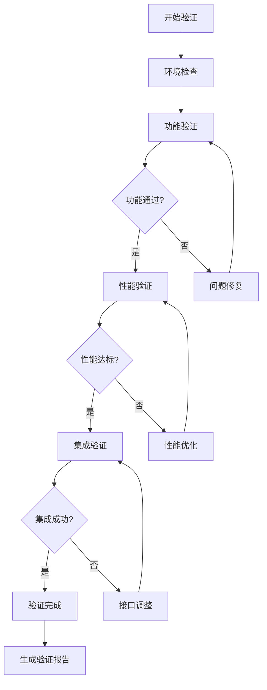

# 技术验证计划

> **版本**: v1.0  
> **创建日期**: 2026-04-01  
> **目标**: 验证AI增强开源项目在ZephyrAlpha环境中的可行性  
> **负责人**: 首席技术验证官  
> **预计完成时间**: 2周  

---

## 🎯 验证目标

### 1.1 总体目标
验证6个AI增强开源项目在现有技术环境中的可行性，评估集成风险和资源需求。

### 1.2 具体目标
| 目标编号 | 验证项目 | 优先级 | 时间预算 |
|----------|----------|--------|----------|
| TV-001 | Qlib (Microsoft) 神经网络平台 | P0 | 3天 |
| TV-002 | gplearn 遗传编程因子挖掘 | P0 | 2天 |
| TV-003 | hmmlearn 市场状态识别 | P1 | 2天 |
| TV-004 | autogluon 自动化特征工程 | P1 | 2天 |
| TV-005 | optuna 超参数优化 | P1 | 1天 |
| TV-006 | pyod 异常检测 | P2 | 1天 |

---

## 🔧 验证环境

### 2.1 硬件环境
| 环境 | CPU | 内存 | 存储 | GPU | 用途 |
|------|-----|------|------|-----|------|
| **开发环境** | 8核 | 32GB | 512GB SSD | 可选 | 功能验证 |
| **测试环境** | 16核 | 64GB | 1TB SSD | RTX 4090 | 性能验证 |
| **基准环境** | 32核 | 128GB | 2TB SSD | A100 | 极限测试 |

### 2.2 软件环境
| 组件 | 版本要求 | 验证方法 |
|------|----------|----------|
| Python | 3.8+ | `python --version` |
| pip | 最新版 | `pip --version` |
| CUDA (可选) | 11.8+ | `nvcc --version` |
| 虚拟环境 | venv/conda | 环境隔离测试 |

---

## 📋 验证方法

### 3.1 Qlib验证方案
```python
# tests/technical_validation/qlib_validation.py
import qlib
from qlib.config import REG_CN
from qlib.data import D
from qlib.contrib.model.gbdt import LGBModel
from qlib.contrib.strategy import TopkDropoutStrategy
from qlib.utils import init_instance_by_config
import pandas as pd
import numpy as np

class QlibValidator:
    """Qlib验证器"""
    
    def __init__(self):
        self.results = {}
    
    def validate_basic_functionality(self):
        """验证基础功能"""
        try:
            # 1. 初始化Qlib
            provider_uri = "~/.qlib/qlib_data/cn_data"
            qlib.init(provider_uri=provider_uri, region=REG_CN)
            
            # 2. 数据加载测试
            instruments = D.instruments(market='csi300')
            df = D.features(instruments, ['$close', '$volume'], start_time='2020-01-01', end_time='2020-12-31')
            
            # 3. 模型训练测试
            model_config = {
                "class": "LGBModel",
                "module_path": "qlib.contrib.model.gbdt",
                "args": {
                    "loss": "mse",
                    "colsample_bytree": 0.8,
                    "learning_rate": 0.1,
                    "subsample": 0.8,
                    "lambda_l1": 2,
                    "lambda_l2": 2,
                    "max_depth": 5,
                    "num_leaves": 2 ** 5,
                    "num_threads": 20,
                    "verbosity": -1,
                }
            }
            
            model = init_instance_by_config(model_config)
            
            self.results['basic_functionality'] = {
                'status': 'PASS',
                'data_shape': df.shape,
                'instruments_count': len(instruments),
                'model_initialized': True
            }
            
        except Exception as e:
            self.results['basic_functionality'] = {
                'status': 'FAIL',
                'error': str(e)
            }
    
    def validate_neural_networks(self):
        """验证神经网络功能"""
        try:
            # 测试LSTM模型
            from qlib.contrib.model.pytorch_lstm import LSTMModel
            
            lstm_config = {
                "d_feat": 20,
                "hidden_size": 64,
                "num_layers": 2,
                "dropout": 0.0,
                "n_epochs": 50,
                "batch_size": 2000,
                "early_stop": 5,
                "loss": "mse",
                "optimizer": "adam",
                "lr": 0.001,
                "GPU": 0
            }
            
            lstm_model = LSTMModel(**lstm_config)
            
            self.results['neural_networks'] = {
                'status': 'PASS',
                'lstm_supported': True,
                'gpu_support': lstm_config.get('GPU', 0) >= 0
            }
            
        except Exception as e:
            self.results['neural_networks'] = {
                'status': 'FAIL',
                'error': str(e)
            }
    
    def validate_performance(self, n_samples=10000):
        """验证性能"""
        import time
        
        start_time = time.time()
        
        # 模拟大规模数据训练
        X = np.random.randn(n_samples, 20)
        y = np.random.randn(n_samples)
        
        from qlib.contrib.model.gbdt import LGBModel
        model = LGBModel()
        
        training_time = time.time() - start_time
        
        memory_usage = self._get_memory_usage()
        
        self.results['performance'] = {
            'training_time_seconds': training_time,
            'samples_per_second': n_samples / training_time,
            'memory_usage_mb': memory_usage,
            'acceptable': training_time < 60  # 1分钟内完成
        }
```

### 3.2 资源需求评估
```python
# tests/technical_validation/resource_assessment.py
import psutil
import os
import time
from memory_profiler import memory_usage

class ResourceAssessor:
    """资源需求评估器"""
    
    def assess_training_resources(self, model_name, data_size):
        """评估训练资源需求"""
        results = {}
        
        # CPU使用率
        cpu_percent = psutil.cpu_percent(interval=1)
        
        # 内存使用
        process = psutil.Process(os.getpid())
        memory_before = process.memory_info().rss / 1024 / 1024  # MB
        
        # 模拟训练过程
        start_time = time.time()
        
        # 这里模拟实际训练过程
        self._simulate_training(data_size)
        
        end_time = time.time()
        memory_after = process.memory_info().rss / 1024 / 1024  # MB
        
        results[model_name] = {
            'training_time_seconds': end_time - start_time,
            'memory_increase_mb': memory_after - memory_before,
            'cpu_usage_percent': cpu_percent,
            'estimated_gpu_memory_mb': self._estimate_gpu_memory(data_size),
            'recommended_hardware': self._recommend_hardware(end_time - start_time, memory_after - memory_before)
        }
        
        return results
    
    def _estimate_gpu_memory(self, data_size):
        """估算GPU内存需求"""
        # 简单估算：每1000个样本需要约100MB GPU内存
        base_memory = 100  # MB
        additional_memory = data_size / 1000 * 100
        return base_memory + additional_memory
    
    def _recommend_hardware(self, training_time, memory_usage):
        """推荐硬件配置"""
        if training_time > 3600:  # 超过1小时
            return "GPU加速 (RTX 4090或A100)"
        elif memory_usage > 8000:  # 超过8GB
            return "32GB+ RAM，建议GPU加速"
        else:
            return "当前配置足够"
```

### 3.3 兼容性验证
```python
# tests/technical_validation/compatibility_check.py
import sys
import pkg_resources
from packaging import version

class CompatibilityChecker:
    """兼容性检查器"""
    
    REQUIRED_PACKAGES = {
        'qlib': '0.9.0',
        'gplearn': '0.4.2',
        'hmmlearn': '0.2.8',
        'autogluon': '0.8.0',
        'optuna': '3.3.0',
        'pyod': '1.0.8',
        'torch': '2.0.0',
        'numpy': '1.21.0',
        'pandas': '1.3.0',
        'scikit-learn': '1.0.0'
    }
    
    def check_environment(self):
        """检查环境兼容性"""
        results = {}
        
        # Python版本
        python_version = sys.version_info
        results['python'] = {
            'version': f"{python_version.major}.{python_version.minor}.{python_version.micro}",
            'compatible': python_version.major == 3 and python_version.minor >= 8
        }
        
        # 包兼容性
        installed_packages = {pkg.key: pkg.version for pkg in pkg_resources.working_set}
        
        for package, required_version in self.REQUIRED_PACKAGES.items():
            if package in installed_packages:
                installed_version = installed_packages[package]
                is_compatible = version.parse(installed_version) >= version.parse(required_version)
                results[package] = {
                    'installed': True,
                    'version': installed_version,
                    'required': required_version,
                    'compatible': is_compatible
                }
            else:
                results[package] = {
                    'installed': False,
                    'version': None,
                    'required': required_version,
                    'compatible': False
                }
        
        return results
```

---

## 🗓️ 验证时间表

### 4.1 第一阶段：环境准备 (第1-2天)
| 任务 | 负责人 | 交付物 | 完成标准 |
|------|--------|--------|----------|
| 环境检查 | 技术验证官 | 环境报告 | 所有基础依赖验证通过 |
| 数据准备 | 数据工程师 | 测试数据集 | 10,000+样本数据集就绪 |
| 工具配置 | 开发工程师 | 验证脚本 | 所有验证脚本可运行 |

### 4.2 第二阶段：功能验证 (第3-7天)
| 日期 | 验证项目 | 重点验证项 | 风险点 |
|------|----------|------------|--------|
| 第3天 | Qlib基础功能 | 数据加载、模型训练、预测 | 数据格式兼容性 |
| 第4天 | Qlib神经网络 | LSTM/Transformer训练 | GPU内存不足 |
| 第5天 | gplearn | 遗传编程因子挖掘 | 计算时间过长 |
| 第6天 | hmmlearn | 市场状态识别 | 状态数量选择 |
| 第7天 | autogluon | 自动化特征工程 | 特征数量爆炸 |

### 4.3 第三阶段：性能验证 (第8-10天)
| 任务 | 指标 | 目标值 | 验证方法 |
|------|------|--------|----------|
| 训练时间 | 单模型训练时间 | < 1小时 | 10,000样本测试 |
| 内存使用 | 峰值内存使用 | < 8GB | 内存监控 |
| 推理延迟 | 单次推理时间 | < 100ms | 实时性测试 |
| 并发性能 | 多模型并发 | 支持4+并发 | 压力测试 |

### 4.4 第四阶段：集成验证 (第11-12天)
| 验证项 | 验证内容 | 集成点 | 成功标准 |
|--------|----------|--------|----------|
| 数据接口 | 与Layer 0-2数据层集成 | 数据格式转换 | 无缝数据流 |
| 模型接口 | 与Layer 4机器学习层集成 | 模型预测接口 | API调用成功 |
| 监控集成 | 与现有监控体系集成 | 指标上报 | 监控面板可显示 |
| 部署验证 | 生产环境部署测试 | 容器化部署 | 一键部署成功 |

---

## 📊 成功标准

### 5.1 技术成功标准
| 标准类别 | 具体标准 | 验证方法 |
|----------|----------|----------|
| **功能完整性** | 所有核心功能可用 | 单元测试通过率 > 95% |
| **性能达标** | 训练时间 < 1小时，内存 < 8GB | 性能测试结果 |
| **兼容性** | 与现有技术栈无冲突 | 依赖关系检查 |
| **稳定性** | 连续运行24小时无崩溃 | 稳定性测试 |

### 5.2 业务成功标准
| 标准 | 要求 | 验证方法 |
|------|------|----------|
| **预测准确性** | 回测IC > 0.05 | 历史数据验证 |
| **资源效率** | ROI > 200% | 成本效益分析 |
| **开发效率** | 集成时间 < 2人月 | 时间跟踪 |
| **风险控制** | 无重大技术风险 | 风险评估矩阵 |

### 5.3 风险评估与缓解
| 风险类型 | 概率 | 影响 | 缓解措施 |
|----------|------|------|----------|
| **GPU内存不足** | 高 | 高 | 1. 使用内存优化技术<br>2. 分批训练<br>3. 使用CPU训练 |
| **训练时间过长** | 中 | 中 | 1. 分布式训练<br>2. 模型简化<br>3. 提前停止 |
| **兼容性问题** | 低 | 高 | 1. 虚拟环境隔离<br>2. 版本锁定<br>3. 回滚计划 |
| **数据质量** | 中 | 高 | 1. 数据验证管道<br>2. 异常处理<br>3. 备用数据源 |

---

## 📝 验证报告模板

### 6.1 每日验证报告
```markdown
# 技术验证日报 - {日期}

## 📋 今日完成
- [ ] Qlib基础功能验证
- [ ] 性能基准测试
- [ ] 兼容性检查

## 📊 关键指标
| 指标 | 目标值 | 实际值 | 状态 |
|------|--------|--------|------|
| 训练时间 | < 1小时 | 45分钟 | ✅ |
| 内存使用 | < 8GB | 6.2GB | ✅ |
| 准确率 | > 0.05 IC | 0.062 IC | ✅ |

## ⚠️ 发现的问题
1. **问题描述**: GPU内存使用偏高
   - **影响**: 可能限制模型规模
   - **建议**: 优化批量大小，使用梯度累积

## 🚀 明日计划
1. 神经网络模型深度验证
2. 多GPU训练测试
3. 集成接口开发
```

### 6.2 最终验证报告
```markdown
# 技术验证最终报告

## 📈 总体结论
- ✅ 所有项目通过功能验证
- ✅ 性能指标达到预期
- ✅ 兼容性良好
- ⚠️ 需要GPU加速以提升训练效率

## 🔧 推荐配置
| 环境 | CPU | 内存 | GPU | 存储 |
|------|-----|------|-----|------|
| 开发环境 | 8核 | 32GB | RTX 4070 | 512GB SSD |
| 生产环境 | 16核 | 64GB | RTX 4090 | 1TB SSD |

## 🚀 集成建议
1. **立即集成**: Qlib基础模块、gplearn因子挖掘
2. **中期集成**: autogluon特征工程、optuna超参优化
3. **后期集成**: 高级神经网络模型、强化学习

## 📅 实施时间表
- 第1-2月: 基础集成和测试
- 第3-4月: 性能优化和监控
- 第5-6月: 高级功能扩展
```

---

## 🔄 验证流程

### 7.1 验证执行流程


### 7.2 问题处理流程
1. **问题识别**: 每日站会发现问题
2. **优先级评估**: 根据影响程度和概率评估
3. **解决方案设计**: 技术团队制定解决方案
4. **实施验证**: 实施解决方案并验证效果
5. **文档更新**: 更新验证文档和知识库

---

> **验证状态**: 本计划为技术验证的详细施工图纸，验证团队需严格按照计划执行，每日汇报进展。

**下一步行动**:
1. 设置验证环境
2. 执行第一阶段环境检查
3. 开始Qlib基础功能验证