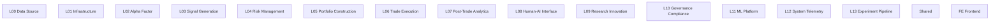

# 5.4 Mermaid 架构图

5.4 Mermaid 架构图

```mermaid
graph TD
    L00[L00 Data Source]
    L01[L01 Infrastructure]
    L02[L02 Alpha Factor]
    L03[L03 Signal Generation]
    L04[L04 Risk Management]
    L05[L05 Portfolio Construction]
    L06[L06 Trade Execution]
    L07[L07 Post-Trade Analytics]
    L08[L08 Human-AI Interface]
    L09[L09 Research Innovation]
    L10[L10 Governance Compliance]
    L11[L11 ML Platform]
    L12[L12 System Telemetry]
    L13[L13 Experiment Pipeline]
    SH[Shared]
    FE[FE Frontend]
```

**节点 ID 规则**：
- 业务层：`L{XX}`（大写 L + 两位数字）
- 特殊分区：`SH`（Shared）、`FE`（Frontend）
- 节点标签：`L{XX} {English Name}`

**禁止**在 Mermaid 图中使用 docs 目录编号作为节点 ID。
