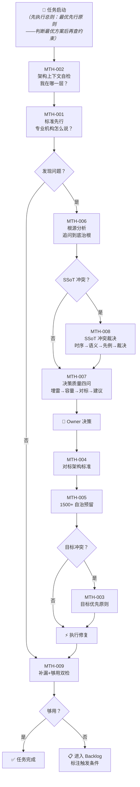

# 决策流程总图（Decision Flow Map）

决策流程总图（Decision Flow Map）

> **AI 导航指引**：此图为 MTH-001~009 的完整决策链路。每次承担治理任务时，先执行总则（最优先行——判断"怎么做最好"），再从此图入口开始，按箭头方向执行。方法论细节见各 MTH-XXX 条目。



**ASCII 速查版**（纯文本 AI session）：

```
  START ──→ [总则:最优先行] ──→ MTH-002 ──→ MTH-001
                ↓
          [发现问题?]── 否 ──→ MTH-009 ──→ [够用?]── 是 ──→ ✅
                ↓ 是                          ↓ 否
           MTH-006 (追问到底)              📋 Backlog
                ↓
          [SSoT冲突?]── 是 ──→ MTH-008 ──┐
                ↓ 否                      ↓
           MTH-007 (四问) ←──────────────┘
                ↓
           👤 Owner 决策
                ↓
           MTH-004 → MTH-005 → [目标冲突?]── 是 ──→ MTH-003
                                     ↓ 否              ↓
                                    ⚡执行 ←──────────┘
                                       ↓
                                    MTH-009 → ...
```

---
