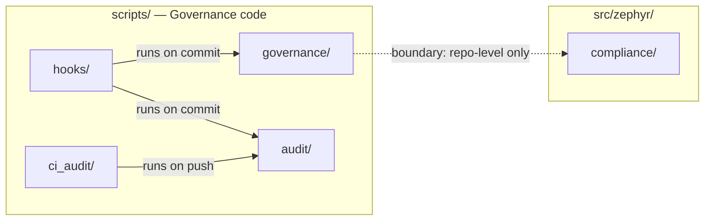

---
module_id: KE-461
status: active
title: 5.2 Trigger topology / 触发拓扑图
category: documentation
---

# 5.2 Trigger topology / 触发拓扑图

5.2 Trigger topology / 触发拓扑图

> Source: `diagrams/scripts_topology.mmd`

> *简化版，完整双语版见 [`diagrams/scripts_topology.mmd`](diagrams/scripts_topology.mmd)*

---
