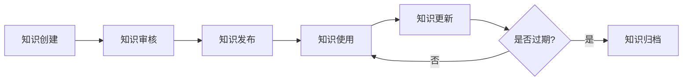

# ZephyrAlpha知识库索引

## 📋 知识库概要

**知识库路径**: `docs/08_KNOWLEDGE_BASE/`
**知识库职责**: 积累、共享和传承ZephyrAlpha项目知识资产
**创建日期**: 2026-04-07
**知识条目**: 0个（初始创建）

---

## 🎯 知识库目标

### 核心目标

1. **知识积累**: 系统化积累项目知识资产
2. **知识共享**: 促进团队成员知识共享
3. **知识传承**: 实现知识的有效传承
4. **知识创新**: 支持基于知识的创新

---

### 质量目标

| 指标 | 目标值 | 当前值 |
|------|--------|--------|
| **知识准确率** | ≥95% | N/A |
| **知识完整性** | ≥90% | N/A |
| **知识时效性** | ≥90% | N/A |
| **用户满意度** | ≥85% | N/A |

---

## 📁 知识分类

### 一级分类

| 分类ID | 分类名称 | 描述 | 条目数 |
|--------|---------|------|--------|
| **KB_01** | 技术知识 | 系统架构、技术方案、最佳实践 | 0 |
| **KB_02** | 业务知识 | 业务流程、业务规则、业务场景 | 0 |
| **KB_03** | 运维知识 | 部署流程、监控配置、故障处理 | 0 |
| **KB_04** | 管理知识 | 项目管理、团队协作、流程规范 | 0 |

---

## 📊 知识统计

### 总体统计

| 指标 | 数值 |
|------|------|
| **总知识条目** | 0 |
| **技术知识条目** | 0 |
| **业务知识条目** | 0 |
| **运维知识条目** | 0 |
| **管理知识条目** | 0 |

---

### 分类统计

| 分类 | 条目数 | 占比 |
|------|--------|------|
| **技术知识** | 0 | 0% |
| **业务知识** | 0 | 0% |
| **运维知识** | 0 | 0% |
| **管理知识** | 0 | 0% |

---

## 🔍 知识检索

### 快速检索

**按关键词检索**:
- 使用全局搜索功能
- 支持模糊匹配
- 支持高级搜索语法

**按分类检索**:
- 浏览分类目录
- 查看分类索引
- 使用分类标签

---

### 热门知识

暂无热门知识（知识库初始创建）

---

### 最新知识

暂无最新知识（知识库初始创建）

---

## 📝 知识贡献

### 贡献流程

1. **识别知识需求**: 发现需要记录的知识
2. **收集知识素材**: 收集相关知识素材
3. **编写知识文档**: 使用标准模板编写
4. **提交知识审核**: 提交给知识管理员审核
5. **发布知识文档**: 审核通过后发布

---

### 贡献指南

**知识文档要求**:
- 使用标准模板
- 内容准确完整
- 结构清晰易懂
- 标签分类正确

**知识质量标准**:
- 准确性 ≥95%
- 完整性 ≥90%
- 时效性 ≥90%
- 可读性 ≥85分

---

## 🛠️ 知识管理工具

### 核心工具

| 工具名称 | 功能 | 状态 |
|---------|------|------|
| **知识索引工具** | 自动生成知识索引 | ✅ 已实现 |
| **知识检索工具** | 快速检索知识内容 | 🔄 待开发 |
| **知识更新工具** | 自动化知识更新 | 🔄 待开发 |
| **知识质量工具** | 自动化质量检查 | 🔄 待开发 |

---

## 📚 知识架构

### 架构文档

- [知识库架构设计](KNOWLEDGE_BASE_ARCHITECTURE.md) - 知识库完整架构设计

---

## 📈 知识演进

### 知识生命周期

---

### 知识更新频率

| 知识类型 | 更新频率 | 审核周期 |
|---------|---------|---------|
| **技术知识** | 每月 | 每季度 |
| **业务知识** | 每周 | 每月 |
| **运维知识** | 每周 | 每月 |
| **管理知识** | 每月 | 每季度 |

---

## 🔗 相关文档

- [知识库架构设计](KNOWLEDGE_BASE_ARCHITECTURE.md)
- 知识库建设计划
- 文档体系完善计划

---

## 📝 维护记录

| 日期 | 操作 | 操作人 | 备注 |
|------|------|--------|------|
| 2026-04-07 | 创建知识库 | Audit Sentinel | 初始创建知识库 |

---

**知识库状态**: ✅ 已创建
**知识条目**: 0个
**知识覆盖率**: N/A（初始创建）
