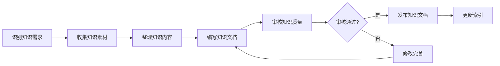
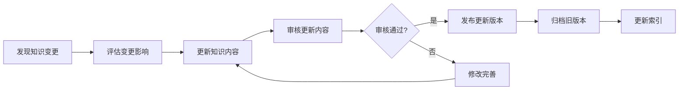

# 知识库架构设计

## 📋 设计概要

**设计目标**: 建立完整的ZephyrAlpha知识库，实现知识的积累、共享和传承
**设计原则**: 结构化、可检索、易维护、可扩展
**设计版本**: v1.0.0

---

## 🎯 知识分类体系

### 一级分类

| 分类ID | 分类名称 | 描述 | 优先级 |
|--------|---------|------|--------|
| **KB_01** | 技术知识 | 系统架构、技术方案、最佳实践 | P0 |
| **KB_02** | 业务知识 | 业务流程、业务规则、业务场景 | P1 |
| **KB_03** | 运维知识 | 部署流程、监控配置、故障处理 | P1 |
| **KB_04** | 管理知识 | 项目管理、团队协作、流程规范 | P2 |

---

### 二级分类

#### KB_01 技术知识

| 分类ID | 分类名称 | 描述 |
|--------|---------|------|
| **KB_01_01** | 架构设计 | 系统架构、模块设计、技术选型 |
| **KB_01_02** | 算法实现 | 核心算法、优化方法、性能调优 |
| **KB_01_03** | 最佳实践 | 编码规范、设计模式、最佳实践 |
| **KB_01_04** | 技术规范 | 技术标准、接口规范、数据规范 |

#### KB_02 业务知识

| 分类ID | 分类名称 | 描述 |
|--------|---------|------|
| **KB_02_01** | 业务规则 | 交易规则、风控规则、合规规则 |
| **KB_02_02** | 业务流程 | 交易流程、结算流程、风控流程 |
| **KB_02_03** | 业务场景 | 典型场景、异常场景、边界场景 |

#### KB_03 运维知识

| 分类ID | 分类名称 | 描述 |
|--------|---------|------|
| **KB_03_01** | 部署运维 | 部署流程、环境配置、系统升级 |
| **KB_03_02** | 监控告警 | 监控指标、告警规则、故障诊断 |
| **KB_03_03** | 故障处理 | 故障案例、处理流程、预防措施 |

#### KB_04 管理知识

| 分类ID | 分类名称 | 描述 |
|--------|---------|------|
| **KB_04_01** | 项目管理 | 项目规划、进度管理、风险管理 |
| **KB_04_02** | 团队协作 | 协作流程、沟通机制、知识共享 |
| **KB_04_03** | 流程规范 | 开发流程、测试流程、发布流程 |

---

## 📁 知识存储结构

### 目录结构

```
docs/08_KNOWLEDGE_BASE/
├── INDEX.md                          # 知识库总索引
├── 01_TECHNICAL_KNOWLEDGE/           # 技术知识
│   ├── INDEX.md
│   ├── ARCHITECTURE/                 # 架构设计
│   │   ├── INDEX.md
│   │   ├── SYSTEM_ARCHITECTURE.md
│   │   ├── MODULE_DESIGN.md
│   │   └── TECHNICAL_SELECTION.md
│   ├── ALGORITHMS/                   # 算法实现
│   │   ├── INDEX.md
│   │   ├── CORE_ALGORITHMS.md
│   │   ├── OPTIMIZATION_METHODS.md
│   │   └── PERFORMANCE_TUNING.md
│   ├── BEST_PRACTICES/               # 最佳实践
│   │   ├── INDEX.md
│   │   ├── CODING_STANDARDS.md
│   │   ├── DESIGN_PATTERNS.md
│   │   └── BEST_PRACTICES_GUIDE.md
│   └── TECHNICAL_SPECS/              # 技术规范
│       ├── INDEX.md
│       ├── TECHNICAL_STANDARDS.md
│       ├── INTERFACE_SPECS.md
│       └── DATA_SPECS.md
├── 02_BUSINESS_KNOWLEDGE/            # 业务知识
│   ├── INDEX.md
│   ├── BUSINESS_RULES/               # 业务规则
│   │   ├── INDEX.md
│   │   ├── TRADING_RULES.md
│   │   ├── RISK_CONTROL_RULES.md
│   │   └── COMPLIANCE_RULES.md
│   ├── BUSINESS_PROCESSES/           # 业务流程
│   │   ├── INDEX.md
│   │   ├── TRADING_PROCESS.md
│   │   ├── SETTLEMENT_PROCESS.md
│   │   └── RISK_CONTROL_PROCESS.md
│   └── BUSINESS_SCENARIOS/           # 业务场景
│       ├── INDEX.md
│       ├── TYPICAL_SCENARIOS.md
│       ├── EXCEPTION_SCENARIOS.md
│       └── EDGE_CASES.md
├── 03_OPERATIONS_KNOWLEDGE/          # 运维知识
│   ├── INDEX.md
│   ├── DEPLOYMENT/                   # 部署运维
│   │   ├── INDEX.md
│   │   ├── DEPLOYMENT_PROCESS.md
│   │   ├── ENVIRONMENT_CONFIG.md
│   │   └── SYSTEM_UPGRADE.md
│   ├── MONITORING/                   # 监控告警
│   │   ├── INDEX.md
│   │   ├── MONITORING_METRICS.md
│   │   ├── ALERT_RULES.md
│   │   └── FAULT_DIAGNOSIS.md
│   └── TROUBLESHOOTING/              # 故障处理
│       ├── INDEX.md
│       ├── FAULT_CASES.md
│       ├── HANDLING_PROCESS.md
│       └── PREVENTION_MEASURES.md
└── 04_MANAGEMENT_KNOWLEDGE/          # 管理知识
    ├── INDEX.md
    ├── PROJECT_MANAGEMENT/           # 项目管理
    │   ├── INDEX.md
    │   ├── PROJECT_PLANNING.md
    │   ├── PROGRESS_MANAGEMENT.md
    │   └── RISK_MANAGEMENT.md
    ├── TEAM_COLLABORATION/           # 团队协作
    │   ├── INDEX.md
    │   ├── COLLABORATION_PROCESS.md
    │   ├── COMMUNICATION_MECHANISM.md
    │   └── KNOWLEDGE_SHARING.md
    └── PROCESS_STANDARDS/            # 流程规范
        ├── INDEX.md
        ├── DEVELOPMENT_PROCESS.md
        ├── TESTING_PROCESS.md
        └── RELEASE_PROCESS.md
```

---

## 🔍 知识检索机制

### 检索方式

| 检索方式 | 描述 | 实现方法 |
|---------|------|---------|
| **关键词检索** | 根据关键词搜索知识 | 全文搜索 |
| **分类检索** | 根据分类浏览知识 | 目录导航 |
| **标签检索** | 根据标签筛选知识 | 标签过滤 |
| **关联检索** | 根据关联关系查找知识 | 知识图谱 |

---

### 检索优化

**索引优化**:
- 为所有知识文档建立索引
- 支持多字段检索（标题、内容、标签）
- 实现模糊搜索和精确搜索

**搜索优化**:
- 支持高级搜索语法
- 实现搜索结果排序
- 提供搜索建议和自动补全

---

## 🔄 知识更新流程

### 知识创建流程



---

### 知识更新流程



---

### 知识归档流程


---

## 📊 知识质量标准

### 质量指标

| 指标 | 标准 | 测量方法 |
|------|------|---------|
| **准确性** | ≥95% | 专家评审 |
| **完整性** | ≥90% | 内容检查 |
| **时效性** | ≥90% | 更新频率 |
| **可读性** | ≥85分 | 可读性评分 |

---

### 质量保证

**审核机制**:
- 知识创建前审核
- 知识更新时审核
- 定期质量评估

**反馈机制**:
- 用户反馈收集
- 问题跟踪处理
- 持续改进优化

---

## 🛠️ 知识管理工具

### 核心工具

| 工具名称 | 功能 | 状态 |
|---------|------|------|
| **知识索引工具** | 自动生成知识索引 | ✅ 已实现 |
| **知识检索工具** | 快速检索知识内容 | 🔄 待开发 |
| **知识更新工具** | 自动化知识更新 | 🔄 待开发 |
| **知识质量工具** | 自动化质量检查 | 🔄 待开发 |

---

### 辅助工具

| 工具名称 | 功能 | 状态 |
|---------|------|------|
| **知识标签工具** | 自动标签管理 | 🔄 待开发 |
| **知识关联工具** | 自动关联发现 | 🔄 待开发 |
| **知识统计工具** | 知识统计分析 | 🔄 待开发 |
| **知识导出工具** | 多格式导出 | 🔄 待开发 |

---

## 📝 知识模板

### 知识文档模板

```markdown
---
module_id: KB_XX_XX_XXX
version: 1.0.0
status: Active
created_date: YYYY-MM-DD
last_updated: YYYY-MM-DD
owner: 知识负责人
standard_type: 专业量化机构知识
applicable_scope: 适用范围
tags: [标签1, 标签2, 标签3]
---

# 知识标题

## 📋 知识概要

**知识类型**: [技术知识/业务知识/运维知识/管理知识]
**知识分类**: [二级分类]
**适用场景**: [适用场景描述]

---

## 📖 知识内容

### 背景介绍

[知识背景介绍]

### 核心内容

[知识核心内容]

### 应用场景

[知识应用场景]

### 注意事项

[知识注意事项]

---

## 🔗 相关知识

- [相关知识1](链接)
- [相关知识2](链接)

---

## 📚 参考资料

- [参考资料1](链接)
- [参考资料2](链接)

---

**知识版本**: v1.0.0 | **创建日期**: YYYY-MM-DD | **状态**: Active
```

---

## 🎯 实施计划

### 第一阶段（第1-2周）

- [ ] 创建知识库目录结构
- [ ] 编写知识库索引
- [ ] 创建知识文档模板
- [ ] 开发知识索引工具

---

### 第二阶段（第3-4周）

- [ ] 收集技术知识
- [ ] 收集业务知识
- [ ] 收集运维知识
- [ ] 收集管理知识

---

### 第三阶段（第5-6周）

- [ ] 开发知识检索工具
- [ ] 开发知识更新工具
- [ ] 开发知识质量工具
- [ ] 建立知识审核机制

---

### 第四阶段（第7-8周）

- [ ] 知识库试运行
- [ ] 用户培训
- [ ] 收集反馈
- [ ] 持续优化

---

## 📈 成功指标

### 数量指标

| 指标 | 目标值 | 测量周期 |
|------|--------|---------|
| **技术知识条目** | 100条 | 1个月 |
| **业务知识条目** | 50条 | 1个月 |
| **运维知识条目** | 50条 | 1个月 |
| **管理知识条目** | 30条 | 1个月 |

---

### 质量指标

| 指标 | 目标值 | 测量周期 |
|------|--------|---------|
| **知识准确率** | ≥95% | 持续 |
| **知识完整性** | ≥90% | 持续 |
| **知识时效性** | ≥90% | 持续 |
| **用户满意度** | ≥85% | 季度 |

---

## 🔗 相关文档

- [知识库建设计划](file:///D:/ZephyrAlpha/docs/09_AUDIT/CONFIG/KNOWLEDGE_BASE_BUILDING_PLAN.md)
- [文档体系完善计划](file:///D:/ZephyrAlpha/docs/09_AUDIT/CONFIG/DOCUMENT_SYSTEM_PERFECTION_PLAN.md)
- [审计工具优化计划](file:///D:/ZephyrAlpha/docs/09_AUDIT/CONFIG/AUDIT_TOOLS_OPTIMIZATION_PLAN.md)

---

**架构版本**: v1.0.0 | **创建日期**: 2026-04-07 | **状态**: Active
