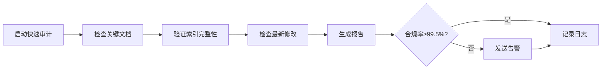
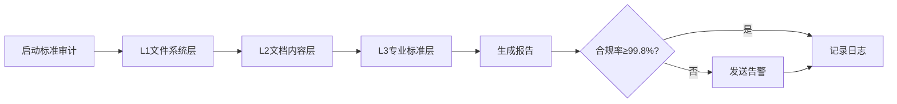
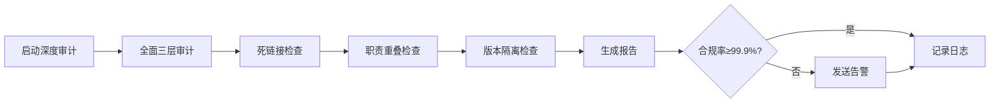

# 定期审计机制配置文件

## 📋 审计配置

**配置版本**: v1.0.0
**最后更新**: 2026-04-07
**配置状态**: Active

---

## 🕐 审计频率

### 快速审计（每日）

**执行时间**: 每天凌晨2:00
**审计范围**: 关键文档和索引
**审计内容**:
- 检查关键文档是否存在
- 验证索引文件完整性
- 检查最新修改的文档

**预期时间**: 5分钟

---

### 标准审计（每周）

**执行时间**: 每周一凌晨3:00
**审计范围**: 全系统文档
**审计内容**:
- L1文件系统层审计
- L2文档内容层审计
- L3专业标准层审计

**预期时间**: 30分钟

---

### 深度审计（每月）

**执行时间**: 每月1日凌晨4:00
**审计范围**: 全系统文档 + 代码
**审计内容**:
- 全面三层审计
- 死链接检查
- 职责重叠检查
- 版本隔离检查

**预期时间**: 60分钟

---

## 📊 审计指标

### 合规率目标

| 审计类型 | 目标合规率 | 告警阈值 |
|---------|-----------|---------|
| **快速审计** | ≥99.5% | <99.0% |
| **标准审计** | ≥99.8% | <99.5% |
| **深度审计** | ≥99.9% | <99.8% |

### 问题优先级

| 优先级 | 描述 | 响应时间 | 解决时间 |
|--------|------|---------|---------|
| **P0** | 严重问题 | 1小时 | 4小时 |
| **P1** | 重要问题 | 4小时 | 24小时 |
| **P2** | 次要问题 | 24小时 | 7天 |
| **P3** | 建议优化 | 7天 | 30天 |

---

## 🔔 告警配置

### 告警渠道

| 渠道 | 类型 | 用途 |
|------|------|------|
| **日志文件** | 本地 | 记录所有审计结果 |
| **邮件通知** | SMTP | 发送告警邮件 |
| **系统通知** | Windows | 弹窗通知 |

### 告警规则

| 规则 | 条件 | 级别 | 通知 |
|------|------|------|------|
| **合规率下降** | 合规率 < 告警阈值 | P1 | 邮件 + 系统通知 |
| **发现P0问题** | 发现严重问题 | P0 | 邮件 + 系统通知 |
| **审计失败** | 审计脚本执行失败 | P1 | 邮件 + 系统通知 |
| **死链接激增** | 死链接数 > 100 | P2 | 邮件 |

---

## 📁 审计报告

### 报告存储

**存储路径**: `docs/09_AUDIT/REPORTS/`
**命名格式**: `{AUDIT_TYPE}_REPORT_{DATE}.md`
**保留期限**: 90天

### 报告类型

| 报告类型 | 文件名前缀 | 频率 |
|---------|-----------|------|
| **快速审计报告** | QUICK_AUDIT | 每日 |
| **标准审计报告** | STANDARD_AUDIT | 每周 |
| **深度审计报告** | DEEP_AUDIT | 每月 |
| **专项审计报告** | SPECIAL_AUDIT | 按需 |

---

## 🛠️ 审计工具

### 核心工具

| 工具名称 | 脚本路径 | 用途 |
|---------|---------|------|
| **快速审计工具** | scripts/quick_audit.py | 快速审计 |
| **标准审计工具** | scripts/standard_audit.py | 标准审计 |
| **深度审计工具** | scripts/comprehensive_deep_audit.py | 深度审计 |
| **死链接检查工具** | scripts/comprehensive_dead_link_fixer.py | 死链接检查 |

### 辅助工具

| 工具名称 | 脚本路径 | 用途 |
|---------|---------|------|
| **合规率验证工具** | scripts/verify_compliance.py | 合规率验证 |
| **索引检查工具** | scripts/find_missing_index.py | 索引检查 |
| **职责检测工具** | scripts/responsibility_detector.py | 职责检测 |

---

## 📝 审计流程

### 快速审计流程

### 标准审计流程

### 深度审计流程

---

## 👥 责任分配

### 审计责任人

| 角色 | 职责 | 联系方式 |
|------|------|---------|
| **审计主管** | 审计计划制定、结果审核 | - |
| **审计执行者** | 审计脚本执行、报告生成 | - |
| **问题修复者** | 问题修复、验证 | - |

### 审核流程

1. **审计执行**: 自动化脚本执行审计
2. **报告生成**: 自动生成审计报告
3. **结果审核**: 审计主管审核结果
4. **问题分配**: 分配问题给责任人
5. **修复验证**: 验证修复效果
6. **归档记录**: 归档审计记录

---

## 📈 持续改进

### 改进机制

1. **定期回顾**: 每月回顾审计效果
2. **指标优化**: 根据实际情况调整指标
3. **工具升级**: 优化审计工具
4. **流程改进**: 改进审计流程

### 知识积累

1. **问题库**: 积累常见问题和解决方案
2. **最佳实践**: 总结审计最佳实践
3. **经验分享**: 定期分享审计经验

---

**配置状态**: ✅ 已激活
**下次审计**: 2026-04-08 02:00
**审计频率**: 每日/每周/每月
