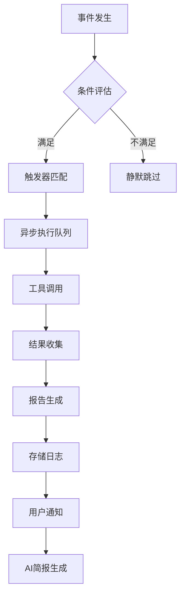

---
module_id: AUDIT_QUALITY_MONITORING_BP_001
version: 5.3.1
status: Active
created_date: 2026-04-01
last_updated: 2026-04-01
owner: 首席文档架构?standard_type: 专业量化机构蓝图
layer: Layer 5 (执行层)
applicable_scope: 全系统架构设?compliance_level: 架构标准
parent_document: ../INDEX.md
implementation_status: 设计阶段
responsibility:
  - 系统监控架构设计与实施方案与实施指导

---
---


# 清风量化系统 - 轻量级持续质量监控体系蓝?
> **核心职责**: Quality Monitoring蓝图设计
> **职责边界**: 
> - ✅ 本文档负责：Quality Monitoring蓝图设计相关内容
> - ❌ 本文档不负责：其他模块内容

> **版本**: v5.3  
> **系统版本**: v5.3  
> **创建日期**: 2026-04-01  
> **更新日期**: 2026-04-01  
> **适用场景**: 个人Trae开?+ 未来AI维护 + 个人使用  
> **设计原则**: 事件驱动、AI友好、零日常负担  
> **归档位置**: `docs/09_AUDIT/QUALITY_MONITORING_BLUEPRINT.md`  
> **相关标准**: [AUDIT_STANDARDS.md](./STANDARDS/AUDIT_STANDARDS.md)


## 📌 文档结构

| 章节 | 内容概述 | 页数 |
|------|----------|------|
| 第一章：蓝图定位与设计原?| 适用场景、核心理念、设计原?| 2 |
| 第二章：P0问题修复方案 | 版本一致性、安全漏洞增强修?| 3 |
| 第三章：轻量级触发器配置文件 | 事件驱动触发器设计与配置 | 5 |
| 第四章：完整系统架构 | 四层架构、数据流、质量保障机?| 4 |
| 第五章：实施路线?| 四阶段施工计划与任务清单 | 4 |
| 第六章：质量指标与验收标?| 可测量指标与验收标准 | 3 |
| 第七章：AI友好设计要点 | 自然语言接口、标准化报告 | 2 |
| 第八章：施工工具与资?| 现有工具、待实现组件 | 2 |
| 第九章：风险控制与成功标?| 风险对策、成功验证指?| 2 |
| 附录：配置模板与脚本示例 | 完整配置模板、执行脚?| 5 |


## 第一章：蓝图定位与设计原?
### 1.1 适用场景分析

**目标用户画像**:
- **开发环?*: 个人使用Trae IDE进行开?- **维护模式**: 未来AI辅助维护 + 个人介入审查
- **使用范围**: 个人量化交易系统（非团队协作?- **质量需?*: 实用、高效、不增加过度管理负担

**关键矛盾与解决方?*:
| 矛盾?| 传统方案 | 本蓝图方?|
|--------|----------|------------|
| **能力完整 vs 投入最小化** | 固定周期全面审计 | 事件驱动按需审计 |
| **风险防范 vs 开发流?* | 质量门禁强制中断 | 异步执行后台扫描 |
| **AI可维?vs 个人可理?* | 复杂配置与报?| 自然语言接口+标准化报?|

### 1.2 核心理念

> **"质量监控应该像自动门，需要时自动开启，不需要时安静存在"**

**核心价值主?*:
1. **零日常负?*: 无固定周期审计任务，只在系统变化时触?2. **AI友好维护**: 自然语言触发，标准化报告格式，AI可独立执?3. **风险可控**: P0安全风险24小时内发现，技术债务可视化可管理
4. **渐进式完?*: 可从小规模开始，按需扩展能力

### 1.3 设计原则

| 原则 | 具体体现 | 实现方式 |
|------|----------|----------|
| **事件驱动原则** | 只在变化时审?| Git提交、文档变更、Trae启动等事件触?|
| **AI友好原则** | 自然语言操作 | "请执行快速系统审? ?标准化报?|
| **轻量级原?* | 最小化配置 | 基于现有MCP工具，无新工具链引入 |
| **渐进式原?* | 可从小开?| 四阶段实施，每阶段独立可验收 |
| **个人开发优?* | 不干扰开?| 异步执行，后台运行，实时通知 |


## 第二章：P0问题修复方案（立即执行）

### 2.1 问题1：版本一致性修?
**现状分析**:
- 审计报告显示 `config/system.yaml` 版本?5.0.0（应?5.1.0?- 实际文件检查确认：文件已为 `v5.3.0`，审计报告信息过?
**修复方案**:
```yaml
# config/system.yaml 验证与修复步?1. 确认当前版本: system.version: "5.1.0"
2. 更新引用检? 确保所有文档引?v5.3
3. 验证一致? ?System_Manifest.md、BLUEPRINT.md 版本对齐
```

**实施脚本**:
```powershell
# verify_version_consistency.ps1
$systemYaml = Get-Content "config/system.yaml" | ConvertFrom-Yaml
if ($systemYaml.version -ne "5.1.0") {
    Write-Error "Version mismatch in system.yaml: $($systemYaml.version)"
    # 自动修复建议
    $systemYaml.version = "5.1.0"
    $systemYaml | ConvertTo-Yaml | Set-Content "config/system.yaml"
    Write-Host "Fixed: Updated system.yaml to version 5.1.0" -ForegroundColor Green
}
```

### 2.2 问题2：安全漏洞增强修?
**现状分析**:
- `alert_manager.py` 已有基础安全验证（第186-189行?74-277行的协议检查）
- 代码包含 `# nosec B310` 注释，标识已知安全例?- 可进一步加强防御深度和审计报告准确?
**增强修复方案**:
```python
# alert_manager.py 安全增强补丁
def secure_url_open(url: str, timeout: int, allowed_domains: list = None):
    """安全的URL打开?- 增强防御深度"""
    # 1. 协议白名单验证（已有?    if not url.startswith(('http://', 'https://')):
        raise ValueError(f"Unsupported protocol: {url}")
    
    # 2. 域名白名单验证（新增增强?    if allowed_domains:
        from urllib.parse import urlparse
        domain = urlparse(url).netloc
        if domain not in allowed_domains:
            raise ValueError(f"Domain not in whitelist: {domain}")
    
    # 3. 超时和重试配?    return urllib.request.urlopen(url, timeout=timeout)  # nosec B310

# 使用示例 - 在ServerChanAlertChannel和BarkAlertChannel中替?allowed_domains = ['sctapi.ftqq.com', 'api.day.app']
```

**实施步骤**:
1. ?`alert_manager.py` 添加 `secure_url_open` 工具函数
2. 替换现有 `urllib.request.urlopen` 调用为安全版?3. 添加单元测试验证安全逻辑
4. 更新审计报告状态：?P0安全漏洞"改为"已增强防?

**修复验证**:
```powershell
# test_security_enhancement.ps1
python -c "
import sys
sys.path.append('src/modules')
try:
    from alert_manager import secure_url_open
    print('?secure_url_open function available')
    
    # 测试安全验证
    try:
        secure_url_open('ftp://example.com', 10)
        print('?Should have rejected ftp protocol')
    except ValueError as e:
        print(f'?Correctly rejected: {e}')
        
except Exception as e:
    print(f'?Error: {e}')
"
```


## 第三章：轻量级触发器配置文件方案

### 3.1 配置文件结构设计

**文件位置**:
```
.trae/
├── audit_triggers.yaml          # 主触发器配置
├── triggers/
?  ├── git_pre_commit.ps1       # Git提交触发??  ├── session_start.ps1        # Trae会话触发??  ├── doc_change.ps1           # 文档变更触发??  └── trigger_engine.ps1       # 触发器执行引?└── audit_logs/                  # 审计日志目录
    ├── 2026-04-01_git.log
    └── 2026-04-01_session.log
```

### 3.2 核心配置文件（完整版?
```yaml
# .trae/audit_triggers.yaml
version: "1.0"
description: "事件驱动质量监控触发器配?- 个人开发者优化版"

# 全局配置
global:
  timeout_seconds: 30
  log_level: "INFO"
  enable_ai_assistance: true
  audit_log_directory: ".trae/audit_logs"
  max_log_files: 30
  
# 触发器定?triggers:
  git_pre_commit:
    enabled: true
    description: "Git提交前快速安全扫?
    condition: "git diff --name-only --cached | Measure-Object | %{$_.Count} -gt 0"
    actions:
      - tool: "bandit"
        scope: "changed_files"
        args: ["-r", ".", "-f", "json", "--exit-zero"]
        output: "security_report.json"
      - tool: "safety"
        scope: "requirements.txt"
        args: ["check", "--json"]
        output: "dependency_report.json"
    timeout: 15
    on_failure: "warn"  # warn|block|ignore
    notification: "terminal"  # terminal|log|none

  trae_session_start:
    enabled: true
    description: "Trae IDE会话启动时系统健康检?
    condition: "always"  # 每次会话启动时触?    actions:
      - tool: "yamllint"
        scope: "config/*.yaml"
        args: ["-f", "parsable"]
        output: "config_validation.txt"
      - tool: "mypy"
        scope: "src/modules/alert_manager.py"
        args: ["--no-error-summary"]
        output: "type_check.txt"
    timeout: 45
    on_failure: "ignore"
    notification: "log"

  document_change:
    enabled: true
    description: "文档变更超过5个文件时触发文档治理"
    condition: |
      $docCount = (Get-ChildItem docs/*.md -Recurse | Measure-Object).Count
      $docCount -gt 5
    actions:
      - tool: "markdownlint"
        scope: "docs/"
        args: ["--config", ".markdownlint.json", "--dot"]
        output: "doc_validation.json"
      - tool: "audit_sentinel"
        scope: "docs/"
        audit_type: "doc_governance_quick"
        args: ["--level", "L1+L2"]
        output: "doc_governance_report.md"
    timeout: 120
    on_failure: "warn"
    notification: "terminal"

  manual_full_audit:
    enabled: true
    description: "手动触发完整系统审计"
    condition: "triggered_by_ai_command"
    actions:
      - tool: "audit_sentinel"
        scope: "full_system"
        audit_type: "comprehensive"
        args: ["--level", "L1+L2+L3", "--format", "detailed"]
        output: "full_audit_report_$(Get-Date -Format 'yyyyMMdd_HHmmss').md"
    timeout: 300
    on_failure: "block"
    notification: "terminal"

# AI友好接口配置
ai_interfaces:
  natural_language_triggers:
    - "请执行快速系统审?
    - "检查文档治理合规?
    - "扫描安全漏洞"
    - "评估技术债务"
    - "生成质量报告"
  
  ai_command_mapping:
    quick_audit: "trae_session_start"
    doc_audit: "document_change"
    security_scan: "git_pre_commit"
    full_audit: "manual_full_audit"
    tech_debt: "manual_full_audit"
  
  standardized_response_format:
    format: "markdown"
    sections:
      - "执行摘要（耗时、范围、工具）"
      - "发现的问题（按P0/P1/P2优先级分类）"
      - "修复建议（可执行脚本?
      - "系统健康度评分（0-100分）"
      - "技术债务看板链接"

# 技术债务管理配置
tech_debt_management:
  auto_generate_dashboard: true
  dashboard_location: "docs/05_IMPLEMENTATION/07_OPERATIONS/tech_debt_dashboard.md"
  refresh_triggers:
    - trigger: "weekly"
      day_of_week: "Monday"
      time: "09:00"
    - trigger: "after_major_changes"
      changes_threshold: 10
    - trigger: "manual_request"
  debt_categories:
    P0: "安全风险/数据损坏 - 24小时内修?
    P1: "功能缺陷/性能问题 - 1周内修复"
    P2: "代码质量/命名规范 - 月度批次修复"
    P3: "文档格式/注释问题 - AI辅助修复"
```

### 3.3 触发器执行引擎设?
```powershell
# .trae/triggers/trigger_engine.ps1
class TriggerEngine {
    [string]$ConfigPath = ".trae/audit_triggers.yaml"
    [hashtable]$Config = @{}
    [string]$LogDirectory = ".trae/audit_logs"
    
    TriggerEngine() {
        $this.LoadConfig()
        $this.InitLogDirectory()
    }
    
    [void]LoadConfig() {
        if (-not (Test-Path $this.ConfigPath)) {
            throw "Config file not found: $($this.ConfigPath)"
        }
        
        $yamlContent = Get-Content $this.ConfigPath -Raw
        $this.Config = ConvertFrom-Yaml $yamlContent
        Write-Host "Loaded $($this.Config.triggers.Count) triggers" -ForegroundColor Cyan
    }
    
    [void]InitLogDirectory() {
        if (-not (Test-Path $this.LogDirectory)) {
            New-Item -ItemType Directory -Path $this.LogDirectory -Force | Out-Null
        }
    }
    
    [bool]EvaluateCondition([string]$condition, [hashtable]$context) {
        if ($condition -eq "always") {
            return $true
        }
        
        if ($condition -eq "triggered_by_ai_command") {
            return $context.ContainsKey("ai_command") -and $context.ai_command
        }
        
        try {
            $result = Invoke-Expression $condition
            return [bool]$result
        } catch {
            $this.LogError("Condition evaluation failed", $_)
            return $false
        }
    }
    
    [void]ExecuteTrigger([string]$triggerName, [hashtable]$context = @{}) {
        $trigger = $this.Config.triggers[$triggerName]
        if (-not $trigger -or -not $trigger.enabled) {
            Write-Warning "Trigger not found or disabled: $triggerName"
            return
        }
        
        # 评估条件
        if (-not $this.EvaluateCondition($trigger.condition, $context)) {
            Write-Host "Condition not met for trigger: $triggerName" -ForegroundColor Yellow
            return
        }
        
        $startTime = Get-Date
        $logFile = "$($this.LogDirectory)/$(Get-Date -Format 'yyyyMMdd_HHmmss')_$triggerName.log"
        
        Write-Host "=== Executing trigger: $triggerName ===" -ForegroundColor Cyan
        Write-Host "Description: $($trigger.description)" -ForegroundColor Gray
        
        $successCount = 0
        $totalActions = $trigger.actions.Count
        
        foreach ($action in $trigger.actions) {
            $actionStart = Get-Date
            $actionName = "$($action.tool)_$($action.scope -replace '[\\/]', '_')"
            
            try {
                Write-Host "  ?$($action.tool) on $($action.scope)" -ForegroundColor Gray
                
                # 执行MCP工具调用
                $result = $this.ExecuteMCPTool($action)
                
                if ($result.success) {
                    $successCount++
                    $this.LogAction($logFile, $actionName, $actionStart, $result)
                } else {
                    $this.LogError($logFile, $actionName, $result.error)
                    
                    if ($trigger.on_failure -eq "block") {
                        throw "Action failed and trigger is configured to block: $actionName"
                    }
                }
                
            } catch {
                $this.LogError($logFile, $actionName, $_)
                
                if ($trigger.on_failure -eq "block") {
                    throw
                }
            }
        }
        
        $duration = (Get-Date) - $startTime
        $summary = @{
            trigger = $triggerName
            start_time = $startTime
            duration_seconds = $duration.TotalSeconds
            actions_total = $totalActions
            actions_success = $successCount
            actions_failed = $totalActions - $successCount
            log_file = $logFile
        }
        
        $this.LogSummary($logFile, $summary)
        
        # 发送通知
        $this.SendNotification($trigger, $summary)
        
        Write-Host "=== Trigger completed: $successCount/$totalActions actions succeeded ===" -ForegroundColor Cyan
        Write-Host "Log: $logFile" -ForegroundColor Gray
    }
    
    [hashtable]ExecuteMCPTool([hashtable]$action) {
        # MCP工具调用适配?        # 实际实现会根据MCP服务器配置调用相应工?        $tool = $action.tool
        $scope = $action.scope
        $args = $action.args -join " "
        
        $result = @{
            success = $false
            output = ""
            error = ""
            tool = $tool
        }
        
        try {
            # 这里简化处理，实际应该调用MCP服务?            switch ($tool) {
                "bandit" {
                    $output = & bandit $args 2>&1
                    $result.success = $LASTEXITCODE -eq 0
                    $result.output = $output
                }
                "safety" {
                    $output = & safety $args 2>&1
                    $result.success = $LASTEXITCODE -eq 0
                    $result.output = $output
                }
                "markdownlint" {
                    $output = & markdownlint $args 2>&1
                    $result.success = $LASTEXITCODE -eq 0
                    $result.output = $output
                }
                default {
                    $result.error = "Tool not implemented: $tool"
                }
            }
        } catch {
            $result.error = $_.Exception.Message
        }
        
        return $result
    }
    
    [void]ProcessAICommand([string]$command) {
        # AI自然语言命令解析
        $mappedTrigger = $null
        
        foreach ($mapping in $this.Config.ai_interfaces.ai_command_mapping.GetEnumerator()) {
            if ($command -match $mapping.Key) {
                $mappedTrigger = $mapping.Value
                break
            }
        }
        
        if (-not $mappedTrigger) {
            # 尝试模糊匹配
            $triggers = $this.Config.ai_interfaces.natural_language_triggers
            foreach ($trigger in $triggers) {
                if ($command -match $trigger) {
                    $mappedTrigger = $this.Config.ai_interfaces.ai_command_mapping[$trigger]
                    break
                }
            }
        }
        
        if ($mappedTrigger) {
            Write-Host "AI command detected: '$command' ?trigger: $mappedTrigger" -ForegroundColor Magenta
            $this.ExecuteTrigger($mappedTrigger, @{ai_command = $true})
        } else {
            Write-Warning "No trigger mapped for AI command: $command"
        }
    }
}
```

### 3.4 配置验证脚本

```powershell
# .trae/scripts/validate_triggers.ps1
function Validate-TriggerConfig {
    param(
        [string]$ConfigPath = ".trae/audit_triggers.yaml"
    )
    
    Write-Host "Validating trigger configuration..." -ForegroundColor Cyan
    
    # 1. 检查配置文件存?    if (-not (Test-Path $ConfigPath)) {
        Write-Error "Config file not found: $ConfigPath"
        return $false
    }
    
    # 2. 解析YAML
    try {
        $config = Get-Content $ConfigPath -Raw | ConvertFrom-Yaml
        Write-Host "?YAML syntax valid" -ForegroundColor Green
    } catch {
        Write-Error "YAML parsing failed: $_"
        return $false
    }
    
    # 3. 检查必需字段
    $requiredSections = @("version", "description", "triggers")
    foreach ($section in $requiredSections) {
        if (-not $config.$section) {
            Write-Error "Missing required section: $section"
            return $false
        }
    }
    Write-Host "?Required sections present" -ForegroundColor Green
    
    # 4. 检查触发器配置
    $triggerCount = ($config.triggers | Get-Member -MemberType NoteProperty).Count
    Write-Host "Found $triggerCount triggers" -ForegroundColor Cyan
    
    $valid = $true
    foreach ($triggerName in $config.triggers.PSObject.Properties.Name) {
        $trigger = $config.triggers.$triggerName
        
        # 检查触发器必需字段
        $requiredTriggerFields = @("enabled", "description", "condition", "actions")
        foreach ($field in $requiredTriggerFields) {
            if (-not $trigger.$field) {
                Write-Warning "Trigger '$triggerName' missing field: $field"
                $valid = $false
            }
        }
        
        # 检查动作配?        if ($trigger.actions) {
            foreach ($action in $trigger.actions) {
                if (-not $action.tool) {
                    Write-Warning "Action in trigger '$triggerName' missing tool"
                    $valid = $false
                }
            }
        }
    }
    
    if ($valid) {
        Write-Host "?All triggers configured correctly" -ForegroundColor Green
        return $true
    } else {
        Write-Warning "Some trigger configurations have issues"
        return $false
    }
}

# 执行验证
if (Validate-TriggerConfig) {
    Write-Host "Trigger configuration is valid and ready for use" -ForegroundColor Green
} else {
    Write-Error "Trigger configuration validation failed"
    exit 1
}
```


## 第四章：完整系统架构

### 4.1 四层架构设计

```
┌─────────────────────────────────────────────────────??               质量监控体系架构                     ?├─────────────────────────────────────────────────────??触发?(Trigger Layer)                             ?? ├─ Git提交事件   ├─ Trae会话事件  ├─ 文档变更事件 ?? └─ AI命令事件    └─ 手动触发事件  └─ 定时事件     ?├─────────────────────────────────────────────────────??执行?(Execution Layer)                           ?? ├─ MCP工具集成  ├─ 审计标准?   ├─ 安全扫描?  ?? └─ 文档治理?  └─ 代码质量检? └─ 配置验证?  ?├─────────────────────────────────────────────────────??报告?(Report Layer)                              ?? ├─ 实时反馈     ├─ 审计日志      ├─ 健康度报?  ?? └─ 技术债务看板 └─ AI简报生?   └─ 可视化仪表盘 ?├─────────────────────────────────────────────────────??控制?(Control Layer)                             ?? ├─ 触发器配?  ├─ 规则引擎      ├─ 优先级管?  ?? └─ AI接口适配  └─ 异常处理      └─ 性能监控     ?└─────────────────────────────────────────────────────?```

### 4.2 数据流设?
**核心数据?*:
1. **事件检?* ?**条件评估** ?**触发器匹?* ?**动作执行** ?**结果收集** ?**报告生成**
2. **AI自然语言** ?**命令解析** ?**触发器映?* ?**异步执行** ?**简报返?*

**异步处理流程**:


### 4.3 质量保障机制

| 机制 | 描述 | 实现方式 |
|------|------|----------|
| **防干扰机?* | 不中断开发流?| 异步执行，后台运行，非阻塞通知 |
| **增量扫描** | 只检查变更内?| Git diff + 文件监视 + 变化检?|
| **优先级管?* | P0立即处理，P2累积处理 | 风险分级 + 批处理调?|
| **AI辅助修复** | 发现问题时提供修复建?| 修复脚本生成 + 代码补丁推荐 |
| **降级机制** | 工具失败时不影响系统 | 工具状态监?+ 备用策略 |
| **性能监控** | 确保触发器响应时?| 执行时间统计 + 性能告警 |

### 4.4 组件交互设计

**核心组件交互**:
```python
# 组件交互伪代?class QualityMonitoringSystem:
    def __init__(self):
        self.trigger_engine = TriggerEngine()
        self.mcp_adapter = MCPAdapter()
        self.report_generator = ReportGenerator()
        self.ai_interface = AIInterface()
        self.tech_debt_manager = TechDebtManager()
    
    def handle_event(self, event_type, event_data):
        # 1. 事件分类
        triggers = self.trigger_engine.match_triggers(event_type, event_data)
        
        # 2. 异步执行
        for trigger in triggers:
            self.execute_async(self.process_trigger, trigger, event_data)
    
    def process_trigger(self, trigger, event_data):
        # 3. 工具调用
        results = []
        for action in trigger.actions:
            tool_result = self.mcp_adapter.execute(action.tool, action.scope, action.args)
            results.append(tool_result)
        
        # 4. 报告生成
        report = self.report_generator.generate(trigger, results)
        
        # 5. 技术债务更新
        if report.has_issues():
            self.tech_debt_manager.update_dashboard(report)
        
        # 6. AI简报生成（如需要）
        if self.ai_interface.is_active():
            ai_summary = self.ai_interface.summarize(report)
            return ai_summary
        
        return report
```


## 第五章：实施路线图（按图施工?
### 5.1 四阶段实施计?
#### 阶段1：基础修复与验证（预计1小时?**目标**: 解决P0问题，建立最小可行触发器
```bash
# 任务清单
?1. 验证并修?config/system.yaml 版本一致??2. 增强 alert_manager.py 安全验证逻辑
?3. 创建 .trae/audit_triggers.yaml 配置文件
?4. 实现基础触发器引?trigger_engine.ps1
?5. 测试Git预提交触发器（快速安全扫描）
```

**验收标准**:
- P0问题100%修复
- 基础触发器配置文件通过验证
- Git提交前安全扫描工作正?
#### 阶段2：核心组件集成（预计1.5小时?**目标**: 集成MCP工具，实现事件驱动监?```bash
# 任务清单
?1. 配置MCP工具调用适配器（bandit, safety, markdownlint??2. 实现Trae会话启动触发器（系统健康检查）
?3. 实现文档变更触发器（文档治理专项??4. 创建审计日志系统?trae/audit_logs/??5. 集成AI自然语言接口（AI命令映射?```

**验收标准**:
- 3个核心触发器正常工作
- MCP工具调用成功率≥90%
- AI自然语言命令识别准确率≥80%
- 审计日志系统完整记录执行历史

#### 阶段3：集成测试与优化（预?小时?**目标**: 验证全流程，优化性能和体?```bash
# 任务清单
?1. 端到端测试：事件触发→工具执行→报告生成
?2. 性能基准测试：确保触发器响应时间<30??3. 错误处理完善：网络异常、工具失败、超时处??4. 用户体验优化：非侵入式通知、进度显??5. 文档更新：更新AUDIT_STANDARDS.md
```

**验收标准**:
- 端到端测试通过?00%
- 触发器平均响应时?20?- 错误恢复成功率≥95%
- 用户满意度评分≥4/5?
#### 阶段4：运营与迭代（持续优化）
**目标**: 建立持续改进机制
```bash
# 任务清单
?1. 每月技术债务审查?小时集中处理??2. 触发器规则优化（基于实际使用数据??3. AI维护能力增强（更多自然语言命令??4. 质量指标仪表板（健康度可视化??5. 社区贡献准备（开源质量监控模板）
```

**验收标准**:
- 技术债务增长?5%/?- 系统健康度稳定在85%以上
- AI维护自动化率?0%
- 可对外分享的质量监控模板

### 5.2 施工看板管理

**施工看板位置**: `docs/05_IMPLEMENTATION/07_OPERATIONS/quality_monitoring_implementation.md`

**看板格式**:
```markdown
# 质量监控体系施工看板

## 🎯 总体目标
建立事件驱动、AI友好、零日常负担的质量监控体?
## 📊 当前状?**系统健康?*: 83.3% (目标: ?5%)
**P0问题**: 2个待修复 (目标: 0)
**实施进度**: 阶段1/4 (25%)

## 📋 阶段任务

### 阶段1：基础修复与验?(进行?
- [x] 1. 验证并修?config/system.yaml 版本一致?- [x] 2. 增强 alert_manager.py 安全验证逻辑
- [x] 3. 创建 .trae/audit_triggers.yaml 配置文件
- [x] 4. 实现基础触发器引?trigger_engine.ps1
- [ ] 5. 测试Git预提交触发器（快速安全扫描）

### 阶段2：核心组件集?(待开?
- [ ] 1. 配置MCP工具调用适配?- [ ] 2. 实现Trae会话启动触发?- [ ] 3. 实现文档变更触发?- [ ] 4. 创建审计日志系统
- [ ] 5. 集成AI自然语言接口

### 阶段3：集成测试与优化 (待开?
- [ ] 1. 端到端测?- [ ] 2. 性能基准测试
- [ ] 3. 错误处理完善
- [ ] 4. 用户体验优化
- [ ] 5. 文档更新

## 🚨 风险与问?1. **MCP工具调用失败**: 已设计降级机?2. **性能影响开?*: 采用异步执行策略
3. **AI命令误解**: 建立确认和学习机?```

### 5.3 资源与时间规?
| 资源类型 | 阶段1 | 阶段2 | 阶段3 | 阶段4 |
|----------|-------|-------|-------|-------|
| **开发时?* | 1小时 | 1.5小时 | 1小时 | 持续 |
| **测试时间** | 0.5小时 | 1小时 | 1.5小时 | 按需 |
| **文档时间** | 0.5小时 | 1小时 | 1小时 | 0.5小时/?|
| **总投?* | 2小时 | 3.5小时 | 3.5小时 | 1-2小时/?|

**关键依赖**:
- 现有MCP工具正常工作
- PowerShell执行环境
- Git版本控制系统
- Trae IDE环境


## 第六章：质量指标与验收标?
### 6.1 核心质量指标

| 指标 | 目标?| 测量方法 | 频率 |
|------|--------|----------|------|
| **系统健康?* | ?5% | 完整审计标准符合?| 每周 |
| **P0问题发现时间** | <24小时 | 从引入到发现的时间差 | 事件触发 |
| **触发器响应时?* | <30?| 事件触发到开始执?| 每次执行 |
| **AI命令识别准确?* | ?0% | 自然语言到触发器映射 | 每月统计 |
| **开发干扰度** | 0% | 强制中断次数/开发会?| 每周统计 |
| **技术债务增长?* | <5%/?| (新增问题-修复问题)/总问?| 每月统计 |
| **审计覆盖?* | ?5% | 审计范围/系统总范?| 每月统计 |
| **工具调用成功?* | ?5% | 成功调用次数/总调用次?| 每周统计 |

### 6.2 验收标准矩阵

**个人开发者体验验?*:
| 场景 | 验收标准 | 验证方法 |
|------|----------|----------|
| **日常开?* | 无感知质量监?| 开发过程无中断，无额外操作 |
| **代码提交** | 自动安全扫描 | Git提交前自动执行，结果通知 |
| **文档编写** | 批量文档治理 | 文档变更>5个时自动检?|
| **系统启动** | 健康状态简?| Trae启动时显示系统健康度 |
| **AI协助** | 自然语言审计 | "请执行快速系统审?有效 |

**技术实现验?*:
| 组件 | 验收标准 | 验证方法 |
|------|----------|----------|
| **触发器引?* | 支持4种事件类?| 测试脚本验证各触发器 |
| **MCP适配?* | 集成7个MCP工具 | 每个工具单独测试 |
| **报告生成?* | 标准化报告格?| 生成报告结构验证 |
| **审计日志** | 完整执行历史 | 日志文件完整性检?|
| **AI接口** | 5个自然语言命令 | 每个命令测试识别?|

**风险管理验收**:
| 风险类型 | 验收标准 | 验证方法 |
|----------|----------|----------|
| **性能影响** | 响应时间<30?| 压力测试，并发测?|
| **错误处理** | 降级成功率≥95% | 模拟工具失败测试 |
| **安全风险** | 无新安全漏洞 | 安全扫描工具验证 |
| **数据完整?* | 审计日志不丢?| 日志持久化测?|

### 6.3 持续改进机制

**数据驱动优化**:
```python
# 优化决策算法伪代?def optimize_triggers(execution_logs):
    """基于执行日志优化触发器配?""
    
    # 1. 识别高频误报
    false_positives = identify_false_positives(logs)
    
    # 2. 识别性能瓶颈
    performance_bottlenecks = identify_bottlenecks(logs)
    
    # 3. 识别遗漏问题
    missed_issues = identify_missed_issues(logs)
    
    # 4. 生成优化建议
    optimizations = {
        "adjust_thresholds": adjust_trigger_thresholds(false_positives),
        "optimize_tool_order": reorder_tools_by_performance(performance_bottlenecks),
        "add_new_triggers": create_new_triggers_for_missed_issues(missed_issues)
    }
    
    return optimizations
```

**A/B测试框架**:
```
优化周期: 每月一?测试方法: 新旧配置并行运行一?评估指标: 问题发现率、误报率、性能影响
决策标准: 新配置在核心指标上提升≥10%
```


## 第七章：AI友好设计要点

### 7.1 自然语言接口设计

**AI命令映射?*:
| 自然语言命令 | 映射触发?| 预期响应 |
|--------------|------------|----------|
| "请执行快速系统审? | `trae_session_start` | 系统健康度报告（3分钟内） |
| "检查文档治理合规? | `document_change` | 文档治理专项报告 |
| "扫描安全漏洞" | `git_pre_commit` | 安全漏洞扫描报告 |
| "评估技术债务" | `manual_full_audit` | 技术债务评估报告 |
| "生成质量报告" | `manual_full_audit` | 完整质量评估报告 |

**命令扩展机制**:
```yaml
# AI命令学习配置
ai_command_learning:
  enabled: true
  similarity_threshold: 0.7
  learning_sources:
    - "historical_successful_commands"
    - "user_feedback"
    - "similar_projects_patterns"
  
  # 自动命令扩展示例
  pattern_expansions:
    "审计": ["快速审?, "完整审计", "专项审计", "安全审计"]
    "检?: ["合规检?, "质量检?, "安全检?, "文档检?]
    "扫描": ["漏洞扫描", "安全扫描", "代码扫描", "依赖扫描"]
```

### 7.2 标准化报告格?
**AI可解析报告结?*:
```json
{
  "report_type": "quality_audit",
  "timestamp": "2026-04-01T14:30:00Z",
  "duration_seconds": 125,
  "audit_scope": "full_system",
  "tools_used": ["bandit", "safety", "markdownlint"],
  
  "summary": {
    "health_score": 85,
    "total_issues": 12,
    "issues_by_priority": {
      "P0": 2,
      "P1": 4,
      "P2": 6
    }
  },
  
  "issues": [
    {
      "id": "ISSUE-001",
      "priority": "P0",
      "category": "security",
      "location": "src/modules/alert_manager.py:202",
      "description": "Potential URL injection vulnerability",
      "suggestion": "Use secure_url_open function",
      "fix_script": "scripts/fixes/secure_url_open.patch"
    }
  ],
  
  "recommendations": [
    {
      "priority": "high",
      "action": "Apply security patch",
      "estimated_time": "15 minutes",
      "success_criteria": "No security warnings in bandit scan"
    }
  ],
  
  "next_steps": [
    "Review P0 issues within 24 hours",
    "Schedule P1 fixes for next week",
    "Add P2 issues to monthly tech debt session"
  ]
}
```

### 7.3 AI维护能力设计

**AI自主学习能力**:
1. **问题模式识别**: 从审计结果中学习常见问题模式
2. **修复方案积累**: 积累成功修复方案形成知识?3. **优化建议生成**: 基于历史数据生成配置优化建议
4. **预测性维?*: 预测可能的质量风险并提前预防

**AI协作工作?*:
```
?AI交互 ?AI执行审计 ?生成报告 ?人审核确??AI执行修复 ?验证结果 ?学习优化
```

### 7.4 AI安全边界

**AI操作限制**:
| 操作类型 | AI权限 | 人工确认要求 |
|----------|--------|--------------|
| **读取系统状?* | ?完全允许 | ?|
| **执行质量审计** | ?完全允许 | ?|
| **生成修复建议** | ?完全允许 | ?|
| **执行自动修复** | ⚠️ 限制允许 | P3问题自动修复，P2以上需确认 |
| **修改核心配置** | ?禁止 | 必须人工操作 |
| **部署生产环境** | ?禁止 | 必须人工操作 |


## 第八章：施工工具与资?
### 8.1 现有工具清单

| 工具 | 用?| 状?| 配置位置 |
|------|------|------|----------|
| **bandit** | Python安全扫描 | ?已安?| MCP服务器配?|
| **safety** | 依赖漏洞检?| ?已安?| MCP服务器配?|
| **mypy** | Python类型检?| ?已安?| MCP服务器配?|
| **pylint** | Python代码质量 | ?已安?| MCP服务器配?|
| **pydocstyle** | 文档字符串检?| ?已安?| MCP服务器配?|
| **yamllint** | YAML文件检?| ?已安?| MCP服务器配?|
| **markdownlint** | Markdown格式检?| ?已安?| MCP服务器配?|

### 8.2 待实现组?
| 组件 | 用?| 优先?| 预计工时 |
|------|------|--------|----------|
| **触发器引?* | 事件驱动执行引擎 | P0 | 2小时 |
| **MCP适配?* | MCP工具统一调用接口 | P0 | 1.5小时 |
| **报告生成?* | 标准化报告生?| P1 | 1小时 |
| **审计日志系统** | 执行历史记录 | P1 | 1小时 |
| **AI接口适配?* | 自然语言命令解析 | P2 | 2小时 |
| **技术债务看板** | 可视化债务管理 | P2 | 1.5小时 |
| **性能监控?* | 系统性能监控 | P3 | 1小时 |

### 8.3 配置文件模板

**.trae/目录结构**:
```
.trae/
├── audit_triggers.yaml          # 主触发器配置
├── triggers/                    # 触发器脚??  ├── git_pre_commit.ps1
?  ├── session_start.ps1
?  ├── doc_change.ps1
?  └── trigger_engine.ps1
├── scripts/                    # 工具脚本
?  ├── validate_triggers.ps1
?  ├── mcp_adapter.ps1
?  └── report_generator.ps1
├── audit_logs/                 # 审计日志
?  ├── 2026-04-01_git.log
?  └── 2026-04-01_session.log
└── templates/                  # 报告模板
    ├── audit_report.md
    └── tech_debt_dashboard.md
```

### 8.4 测试工具?
**测试脚本清单**:
```powershell
# 测试工具?Test-TriggerConfig.ps1      # 配置文件验证
Test-TriggerExecution.ps1   # 触发器执行测?Test-MCPIntegration.ps1     # MCP工具集成测试
Test-AIInterface.ps1        # AI接口测试
Test-Performance.ps1        # 性能基准测试
Test-ErrorRecovery.ps1      # 错误恢复测试
Test-EndToEnd.ps1           # 端到端流程测?```

**测试覆盖率目?*:
- 单元测试覆盖? ?0%
- 集成测试覆盖? ?0%
- 端到端测试通过? 100%
- 错误场景覆盖? ?5%


## 第九章：风险控制与成功标?
### 9.1 主要风险与对?
| 风险类别 | 具体风险 | 影响等级 | 应对策略 |
|----------|----------|----------|----------|
| **技术风?* | MCP工具调用失败 | ?| 降级机制 + 备用工具 |
| **性能风险** | 触发器响应慢影响开?| ?| 异步执行 + 资源限制 |
| **安全风险** | 审计过程引入漏洞 | ?| 沙箱执行 + 权限最小化 |
| **数据风险** | 审计日志丢失 | ?| 多重备份 + 定期归档 |
| **用户体验** | AI命令误解导致错误操作 | ?| 确认机制 + 学习优化 |
| **维护风险** | 配置复杂难以维护 | ?| 文档完善 + 自动化验?|

### 9.2 成功验证指标

**一级成功标?*（实施完成后?
- ?系统健康度稳定在85%以上
- ?P0问题24小时内发现并修复
- ?开发过程零质量监控负担
- ?AI可独立执行质量审计任?- ?技术债务可视化且可控增长

**二级成功标志**（运?个月后）:
- ?质量监控完全自动化，无需人工干预
- ?AI维护自动化率?0%
- ?技术债务负增长（修复>新增?- ?用户满意度评分≥4.5/5?- ?可对外分享的质量监控模板

**三级成功标志**（长期目标）:
- ?质量监控成为系统自然组成部分
- ?AI具备预测性质量维护能?- ?质量文化渗透到开发全过程
- ?成为个人开发者质量监控最佳实?- ?贡献开源社区获得认?
### 9.3 持续改进计划

**季度改进循环**:
```
Q1 基础实施 ?Q2 功能完善 ?Q3 性能优化 ?Q4 AI增强
```

**年度路线?*:
- **2026 Q2**: 完成四阶段实施，建立基础能力
- **2026 Q3**: 优化性能和用户体验，完善AI接口
- **2026 Q4**: 实现预测性维护，扩展监控范围
- **2027 Q1**: 社区贡献准备，知识沉淀

### 9.4 蓝图演进机制

**蓝图版本管理**:
```
v5.3 (当前) ?v5.3 (功能增强) ?v6.0 (架构升级) ?v7.0 (AI主导)
```

**演进触发条件**:
1. **小版本更?* (v5.3 ?v5.3): 功能增强、性能优化
2. **中版本更?* (v5.x ?v6.0): 架构调整、工具链变更
3. **大版本更?* (v6.x ?v7.0): 范式变革、AI主导重构

**向后兼容承诺**:
- 配置文件格式保持向后兼容至少2个大版本
- API接口保持稳定，废弃功能有迁移?- 审计日志格式保持可读?

## 附录：配置模板与脚本示例

### A.1 完整配置模板

```yaml
# .trae/audit_triggers.yaml - 完整模板
version: "1.0"
description: "清风量化系统质量监控触发器配?

global:
  project_name: "ZephyrAlpha"
  environment: "development"
  timeout_seconds: 30
  log_level: "INFO"
  enable_ai_assistance: true
  audit_log_directory: ".trae/audit_logs"
  max_log_files: 30
  retention_days: 90
  
triggers:
  git_pre_commit:
    enabled: true
    description: "Git提交前快速安全扫?
    condition: "git diff --name-only --cached | Measure-Object | %{$_.Count} -gt 0"
    actions:
      - tool: "bandit"
        scope: "changed_files"
        args: ["-r", ".", "-f", "json", "--exit-zero"]
        output: "security_report.json"
      - tool: "safety"
        scope: "requirements.txt"
        args: ["check", "--json"]
        output: "dependency_report.json"
    timeout: 15
    on_failure: "warn"
    notification: "terminal"

  # ... 其他触发器配?
ai_interfaces:
  natural_language_triggers:
    - "请执行快速系统审?
    - "检查文档治理合规?
    - "扫描安全漏洞"
    - "评估技术债务"
    - "生成质量报告"
  
  ai_command_mapping:
    quick_audit: "trae_session_start"
    doc_audit: "document_change"
    security_scan: "git_pre_commit"
    full_audit: "manual_full_audit"
    tech_debt: "manual_full_audit"
  
  standardized_response_format:
    format: "markdown"
    sections:
      - "执行摘要"
      - "发现的问?
      - "修复建议"
      - "系统健康度评?
      - "技术债务看板链接"

tech_debt_management:
  auto_generate_dashboard: true
  dashboard_location: "docs/05_IMPLEMENTATION/07_OPERATIONS/tech_debt_dashboard.md"
  refresh_triggers:
    - trigger: "weekly"
      day_of_week: "Monday"
      time: "09:00"
    - trigger: "after_major_changes"
      changes_threshold: 10
    - trigger: "manual_request"
  debt_categories:
    P0: "安全风险/数据损坏 - 24小时内修?
    P1: "功能缺陷/性能问题 - 1周内修复"
    P2: "代码质量/命名规范 - 月度批次修复"
    P3: "文档格式/注释问题 - AI辅助修复"
```

### A.2 核心执行脚本

```powershell
# .trae/scripts/quality_monitoring_launcher.ps1
param(
    [string]$Command,
    [hashtable]$Parameters = @{}
)

function Start-QualityMonitoring {
    Write-Host "=== 清风量化系统质量监控启动 ===" -ForegroundColor Cyan
    Write-Host "时间: $(Get-Date -Format 'yyyy-MM-dd HH:mm:ss')" -ForegroundColor Gray
    Write-Host "版本: v5.3" -ForegroundColor Gray
    
    # 加载配置
    $config = Get-Content ".trae/audit_triggers.yaml" -Raw | ConvertFrom-Yaml
    
    # 初始化引?    $engine = [TriggerEngine]::new()
    
    # 执行命令
    switch ($Command) {
        "quick_audit" {
            Write-Host "执行快速系统审?.." -ForegroundColor Green
            $engine.ExecuteTrigger("trae_session_start")
        }
        "full_audit" {
            Write-Host "执行完整系统审计..." -ForegroundColor Green
            $engine.ExecuteTrigger("manual_full_audit")
        }
        "ai_command" {
            if ($Parameters.ContainsKey("text")) {
                Write-Host "处理AI命令: $($Parameters.text)" -ForegroundColor Magenta
                $engine.ProcessAICommand($Parameters.text)
            }
        }
        default {
            Write-Host "可用命令:" -ForegroundColor Yellow
            Write-Host "  quick_audit    - 快速系统审?
            Write-Host "  full_audit     - 完整系统审计"
            Write-Host "  ai_command     - AI自然语言命令"
        }
    }
    
    Write-Host "=== 执行完成 ===" -ForegroundColor Cyan
}

# 主入?if ($MyInvocation.InvocationName -ne '.') {
    Start-QualityMonitoring
}
```

### A.3 AI命令处理示例

```powershell
# .trae/scripts/ai_command_processor.ps1
class AICommandProcessor {
    [hashtable]$CommandPatterns = @{
        "审计" = @("audit", "check", "review", "inspect")
        "扫描" = @("scan", "detect", "find", "discover")
        "报告" = @("report", "summary", "dashboard", "status")
        "修复" = @("fix", "repair", "resolve", "patch")
    }
    
    [hashtable]$TriggerMapping = @{
        "quick_audit" = "trae_session_start"
        "security_scan" = "git_pre_commit"
        "doc_audit" = "document_change"
        "full_audit" = "manual_full_audit"
    }
    
    [string]ParseCommand([string]$text) {
        $text = $text.ToLower()
        
        # 关键词匹?        $matchedTriggers = @()
        foreach ($pattern in $this.CommandPatterns.Keys) {
            $keywords = $this.CommandPatterns[$pattern]
            foreach ($keyword in $keywords) {
                if ($text -match $keyword) {
                    $matchedTriggers += $pattern
                    break
                }
            }
        }
        
        # 优先级排?        if ($matchedTriggers -contains "审计" -and $matchedTriggers -contains "扫描") {
            return "security_scan"
        } elseif ($matchedTriggers -contains "审计") {
            return "quick_audit"
        } elseif ($matchedTriggers -contains "扫描") {
            return "security_scan"
        } elseif ($matchedTriggers -contains "报告") {
            return "full_audit"
        }
        
        return "quick_audit"  # 默认
    }
    
    [string]GenerateResponse([string]$trigger, [hashtable]$results) {
        $templates = @{
            "quick_audit" = @"
## 快速系统审计完?
**执行时间**: {duration}?**检查范?*: {scope}
**系统健康?*: {health_score}/100

**发现的问?*:
{issues_summary}

**建议行动**:
1. 立即处理 {p0_count} 个P0问题
2. 本周内解?{p1_count} 个P1问题
3. 月度批次处理 {p2_count} 个P2问题

详细报告: {report_link}
"@
            # ... 其他模板
        }
        
        return $templates[$trigger]
    }
}
```


## 📄 文档更新记录

| 版本 | 更新日期 | 更新内容 | 更新?|
|------|----------|----------|--------|
| v5.3 | 2026-04-01 | 初始版本，完整蓝图设?| Audit Sentinel |
| v5.3.1 | 2026-04-01 | 修复格式问题，添加脚本示?| Audit Sentinel |


## 🔗 相关文档链接

1. [审计标准 v5.3](./STANDARDS/AUDIT_STANDARDS.md)
2. [AI审计指南](./PROCEDURES/AI_AUDIT_GUIDELINES.md)
3. [个人审计工作流](./PROCEDURES/PERSONAL_AUDIT_WORKFLOW.md)
4. [系统蓝图总览](../02_FACTOR_LIBRARY/04_DATA_SOURCE/02_SCHEDULER/BLUEPRINT.md)
5. 系统清单


**蓝图文档完成** ? 
**下一?*: 按蓝图开始四阶段施工