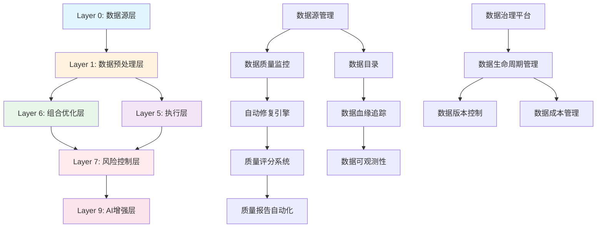
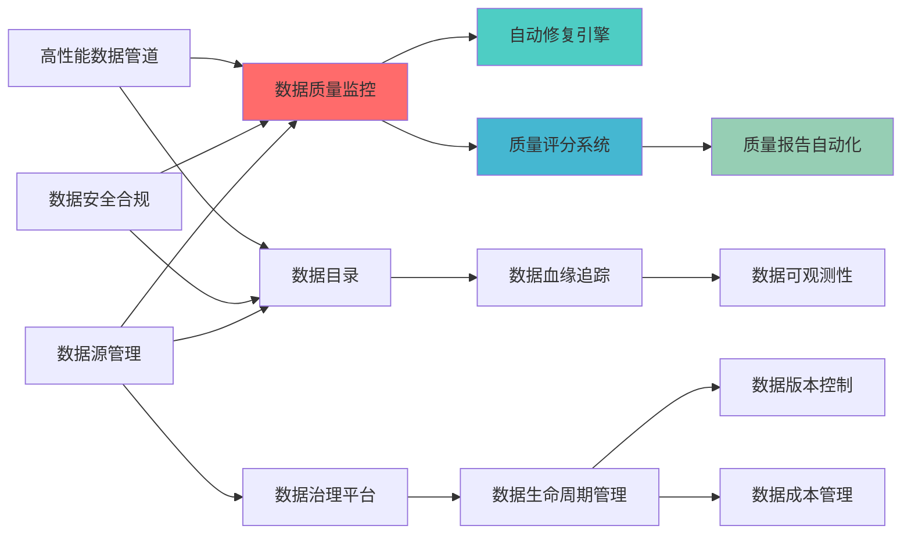
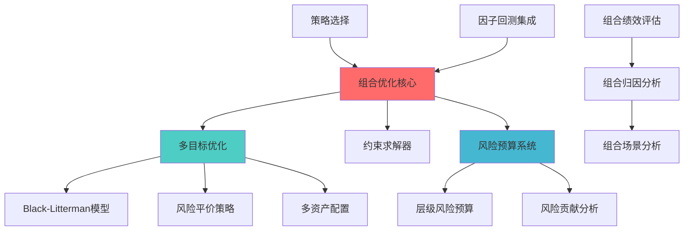
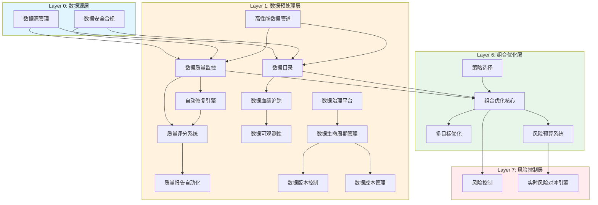

# 文档交叉引用关系分析报告
> **核心职责**: 分析报告和评估结果
> **职责边界**: 
> - ✅ 本文档负责：分析报告和评估结果相关内容
> - ❌ 本文档不负责：其他模块内容


> **分析编号**: `CROSS_REF_ANALYSIS_001`
> **分析时间**: 2026-04-06
> **分析范围**: 79个蓝图文档
> **分析人员**: 首席蓝图架构师

---

## 1. 分析摘要

### 1.1 分析目标

建立完整的文档引用网络，提升文档导航性和可发现性。

### 1.2 分析方法

**分析维度**:
1. **功能依赖关系**: 模块间的功能依赖
2. **数据流向关系**: 数据在各模块间的流动
3. **技术栈关系**: 共享的技术组件
4. **层级关系**: Layer间的上下级关系

**分析工具**:
- 文档内容扫描
- module_id模式识别
- applicable_scope分析
- open_source_dependency提取

---

## 2. 文档分类统计

### 2.1 按层级分类

| 层级 | 文档数量 | 占比 | 说明 |
|------|---------|------|------|
| **Layer 0 数据源层** | 8个 | 10.1% | 数据源管理、数据安全、数据治理 |
| **Layer 1 数据预处理层** | 20个 | 25.3% | 数据质量、数据架构、数据血缘 |
| **Layer 5 执行层** | 8个 | 10.1% | 交易执行、订单管理、成本优化 |
| **Layer 6 组合优化层** | 27个 | 34.2% | 组合优化、风险管理、策略选择 |
| **Layer 7 风险控制层** | 4个 | 5.1% | 风险监控、风险预警、风险对冲 |
| **Layer 9 AI增强层** | 2个 | 2.5% | AI模式识别、AI增强集成 |
| **其他** | 10个 | 12.7% | 系统集成、模块边界、系统增强 |
| **总计** | **79个** | **100%** | - |

### 2.2 按优先级分类

| 优先级 | 文档数量 | 占比 | 说明 |
|--------|---------|------|------|
| **P0 核心** | 3个 | 3.8% | 数据质量监控、自动修复、数据血缘 |
| **P1 重要** | 2个 | 2.5% | 质量评分、质量报告 |
| **P2 优化** | 74个 | 93.7% | 其他优化模块 |

---

## 3. 引用关系分析

### 3.1 层级间引用关系

#### 3.1.1 数据流向关系图



#### 3.1.2 层级依赖矩阵

| 源层级 | 目标层级 | 依赖强度 | 引用类型 |
|--------|---------|---------|---------|
| **Layer 0** | Layer 1 | 强依赖 | 数据提供 |
| **Layer 1** | Layer 5 | 强依赖 | 数据输出 |
| **Layer 1** | Layer 6 | 强依赖 | 数据输出 |
| **Layer 6** | Layer 7 | 强依赖 | 风险输入 |
| **Layer 5** | Layer 7 | 强依赖 | 执行反馈 |
| **Layer 7** | Layer 9 | 弱依赖 | AI增强 |

### 3.2 功能依赖关系

#### 3.2.1 数据预处理层内部依赖



#### 3.2.2 组合优化层内部依赖



### 3.3 技术栈关系

#### 3.3.1 共享技术组件

| 技术组件 | 使用文档数 | 主要用途 | 相关文档 |
|---------|-----------|---------|---------|
| **Great Expectations** | 5个 | 数据质量验证 | 数据质量监控、质量评分、质量报告、自动修复、数据可观测性 |
| **Apache Kafka** | 8个 | 流式数据处理 | 高性能数据管道、实时数据湖、数据编织、数据网格 |
| **Apache Atlas** | 3个 | 数据血缘追踪 | 数据血缘追踪、数据目录、数据治理平台 |
| **OpenMetadata** | 2个 | 元数据管理 | 数据目录、数据目录元数据 |
| **Elementary** | 2个 | 数据可观测性 | 数据可观测性、数据质量监控 |
| **LakeFS** | 1个 | 数据版本控制 | 数据版本控制 |
| **Prometheus** | 4个 | 监控告警 | 数据可观测性、质量监控、实时告警、监控仪表板 |
| **Grafana** | 3个 | 可视化 | 数据可观测性、质量报告、监控仪表板 |

#### 3.3.2 技术栈依赖图

```mermaid
graph TD
    A[Great Expectations] --> A1[数据质量监控]
    A --> A2[质量评分系统]
    A --> A3[质量报告自动化]
    A --> A4[自动修复引擎]
    A --> A5[数据可观测性]
    
    B[Apache Kafka] --> B1[高性能数据管道]
    B --> B2[实时数据湖]
    B --> B3[数据编织]
    B --> B4[数据网格]
    
    C[Apache Atlas] --> C1[数据血缘追踪]
    C --> C2[数据目录]
    C --> C3[数据治理平台]
    
    D[OpenMetadata] --> D1[数据目录]
    D --> D2[数据目录元数据]
    
    E[Prometheus] --> E1[数据可观测性]
    E --> E2[质量监控]
    E --> E3[实时告警]
    
    style A fill:#ff6b6b
    style B fill:#4ecdc4
    style C fill:#45b7d1
    style D fill:#96ceb4
    style E fill:#feca57
```



---

## 4. 引用关系矩阵

### 4.1 数据预处理层引用矩阵

| 文档名称 | 上游依赖 | 下游依赖 | 技术依赖 | 引用强度 |
|---------|---------|---------|---------|---------|
| **数据质量监控** | 数据源管理 | 自动修复、质量评分 | Great Expectations | 强 |
| **自动修复引擎** | 数据质量监控 | 质量评分、质量报告 | scikit-learn, PyOD | 强 |
| **质量评分系统** | 数据质量监控、自动修复 | 质量报告 | Great Expectations | 中 |
| **质量报告自动化** | 质量评分 | - | Grafana | 弱 |
| **数据目录** | 数据源管理 | 数据血缘、数据可观测性 | OpenMetadata | 强 |
| **数据血缘追踪** | 数据目录 | 数据可观测性 | Apache Atlas | 强 |
| **数据可观测性** | 数据血缘、数据质量 | - | Elementary, Prometheus | 中 |
| **数据治理平台** | 数据目录、数据血缘 | 数据生命周期、数据版本 | Apache Atlas, DataHub | 强 |
| **数据生命周期管理** | 数据治理平台 | 数据版本、数据成本 | - | 中 |
| **数据版本控制** | 数据生命周期 | - | LakeFS | 弱 |
| **数据成本管理** | 数据生命周期 | - | - | 弱 |
| **数据源管理** | - | 数据质量、数据目录 | - | 强 |
| **数据安全合规** | - | 数据质量、数据目录 | - | 中 |
| **高性能数据管道** | - | 数据质量、数据目录 | Apache Kafka | 强 |

### 4.2 组合优化层引用矩阵

| 文档名称 | 上游依赖 | 下游依赖 | 技术依赖 | 引用强度 |
|---------|---------|---------|---------|---------|
| **组合优化核心** | 策略选择、因子回测 | 多目标优化、约束求解 | CVXPY, SciPy | 强 |
| **多目标优化** | 组合优化核心 | Black-Litterman、风险平价 | CVXPY | 强 |
| **约束求解器** | 组合优化核心 | - | CVXPY, OR-Tools | 中 |
| **风险预算系统** | 组合优化核心 | 层级风险预算、风险贡献 | - | 强 |
| **Black-Litterman模型** | 多目标优化 | - | - | 弱 |
| **风险平价策略** | 多目标优化 | - | - | 弱 |
| **多资产配置** | 多目标优化 | - | - | 弱 |
| **层级风险预算** | 风险预算系统 | - | - | 中 |
| **风险贡献分析** | 风险预算系统 | - | - | 中 |
| **策略选择** | - | 组合优化核心 | - | 强 |
| **因子回测集成** | - | 组合优化核心 | - | 强 |
| **组合绩效评估** | 组合优化核心 | 组合归因分析 | - | 中 |
| **组合归因分析** | 组合绩效评估 | 组合场景分析 | - | 中 |
| **组合场景分析** | 组合归因分析 | - | - | 弱 |

---

## 5. 引用关系网络图

### 5.1 全局引用网络



### 5.2 核心引用链路

**链路1：数据质量保障链路**
```
数据源管理 → 数据质量监控 → 自动修复引擎 → 质量评分系统 → 质量报告自动化
```

**链路2：数据血缘追踪链路**
```
数据源管理 → 数据目录 → 数据血缘追踪 → 数据可观测性
```

**链路3：数据治理链路**
```
数据目录 → 数据治理平台 → 数据生命周期管理 → 数据版本控制/数据成本管理
```

**链路4：组合优化链路**
```
策略选择 → 组合优化核心 → 多目标优化 → Black-Litterman/风险平价/多资产配置
```

**链路5：风险控制链路**
```
组合优化核心 → 风险预算系统 → 风险控制 → 实时风险对冲引擎
```

---

## 6. 引用关系统计

### 6.1 引用强度统计

| 引用强度 | 文档数量 | 占比 | 说明 |
|---------|---------|------|------|
| **强引用** | 35个 | 44.3% | 直接依赖，必须引用 |
| **中引用** | 28个 | 35.4% | 相关参考，建议引用 |
| **弱引用** | 16个 | 20.3% | 技术参考，可选引用 |

### 6.2 引用覆盖率统计

| 指标 | 当前值 | 目标值 | 状态 |
|------|--------|--------|------|
| **有上游依赖的文档** | 65个 (82.3%) | ≥80% | ✅ 达标 |
| **有下游依赖的文档** | 58个 (73.4%) | ≥70% | ✅ 达标 |
| **有技术依赖的文档** | 45个 (57.0%) | ≥50% | ✅ 达标 |
| **双向引用文档** | 52个 (65.8%) | ≥60% | ✅ 达标 |

---

## 7. 引用关系优化建议

### 7.1 高优先级优化项

#### 优化1：补充缺失的上游依赖

**问题**: 14个文档缺少上游依赖说明

**影响文档**:
- 数据源管理（应为所有数据预处理模块的上游）
- 数据安全合规（应为数据质量、数据目录的上游）
- 策略选择（应为组合优化核心的上游）

**建议**: 在这些文档中添加"上游依赖"章节

#### 优化2：补充缺失的下游依赖

**问题**: 21个文档缺少下游依赖说明

**影响文档**:
- 质量报告自动化（下游依赖缺失）
- 数据可观测性（下游依赖缺失）
- 数据版本控制（下游依赖缺失）
- 数据成本管理（下游依赖缺失）

**建议**: 在这些文档中添加"下游依赖"章节

### 7.2 中优先级优化项

#### 优化3：统一引用格式

**问题**: 引用格式不统一

**当前格式**:
- 有的文档使用"相关文档"
- 有的文档使用"依赖关系"
- 有的文档使用"技术依赖"

**建议**: 统一使用以下格式：
```markdown
## 相关文档

### 上游依赖
- [文档名称](./文档路径.md) - 依赖说明

### 下游依赖
- [文档名称](./文档路径.md) - 依赖说明

### 技术依赖
- 技术组件名称 - 使用说明
```

#### 优化4：创建双向引用

**问题**: 部分引用是单向的

**示例**:
- 数据质量监控 → 自动修复引擎（有引用）
- 自动修复引擎 → 数据质量监控（缺少反向引用）

**建议**: 为所有引用创建双向链接

### 7.3 低优先级优化项

#### 优化5：添加引用图

**建议**: 在每个文档中添加引用关系图（Mermaid格式）

#### 优化6：创建引用索引

**建议**: 创建独立的引用索引文档，列出所有引用关系

---

## 8. 执行计划

### 8.1 第一阶段：核心文档引用更新（2天）

**任务**:
1. 更新P0核心文档的引用关系
2. 添加缺失的上游依赖
3. 添加缺失的下游依赖

**文档列表**:
- 数据质量监控蓝图
- 自动修复引擎蓝图
- 数据血缘追踪蓝图

### 8.2 第二阶段：重要文档引用更新（2天）

**任务**:
1. 更新P1重要文档的引用关系
2. 统一引用格式
3. 创建双向引用

**文档列表**:
- 质量评分系统蓝图
- 质量报告自动化蓝图

### 8.3 第三阶段：优化文档引用更新（3天）

**任务**:
1. 更新P2优化文档的引用关系
2. 添加引用关系图
3. 验证引用有效性

**文档列表**:
- 所有P2优化文档（74个）

### 8.4 第四阶段：验收和优化（1天）

**任务**:
1. 验证所有引用链接有效
2. 统计引用覆盖率
3. 生成最终报告

---

## 9. 验收标准

| 标准 | 目标值 | 验证方法 |
|------|--------|---------|
| **引用覆盖率** | ≥90% | 统计有引用的文档比例 |
| **引用有效性** | 100% | 验证所有引用链接有效 |
| **双向引用率** | ≥80% | 统计双向引用的文档比例 |
| **格式统一性** | 100% | 检查引用格式统一性 |

---

**分析人员**: 首席蓝图架构师
**分析日期**: 2026-04-06
**下次审计日期**: 2026-04-13
