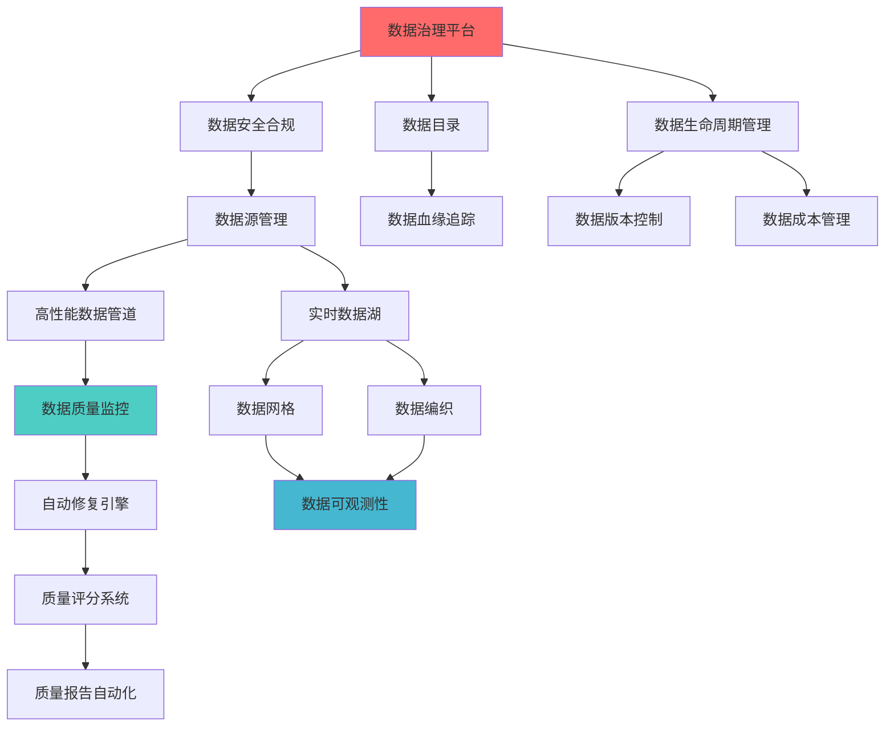
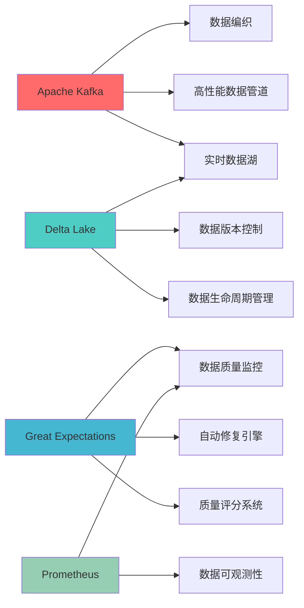

---
module_id: LINK_VALIDATION_REPORT_20260407_001

report_id: LINK_VALIDATION_REPORT_20260407
version: 1.0.0
status: Active
created_date: 2026-04-07
last_updated: '2026-04-07'
owner: 首席蓝图架构师
standard_type: 专业量化机构验证报告
applicable_scope: 已更新文档引用链接验证
compliance_level: 专业标准
responsibility:
  - 数据质量 (Layer 1)
---

# 引用链接验证报告
> **核心职责**: 分析报告和评估结果
> **职责边界**: 
> - ✅ 本文档负责：分析报告和评估结果相关内容
> - ❌ 本文档不负责：其他模块内容


> **报告编号**: `LINK_VALIDATION_001`
> **验证时间**: 2026-04-07
> **验证人员**: 首席蓝图架构师
> **验证范围**: 已更新的17个数据预处理层文档

---

## 1. 验证概要

### 1.1 验证目标

验证已更新的17个数据预处理层文档中的所有引用链接有效性。

### 1.2 验证范围

**已验证文档（17个）**:
1. DATA_QUALITY_MONITORING_BLUEPRINT.md
2. AUTO_REPAIR_ENGINE_BLUEPRINT.md
3. DATA_CATALOG_BLUEPRINT.md
4. QUALITY_SCORING_SYSTEM_BLUEPRINT.md
5. QUALITY_REPORT_AUTOMATION_BLUEPRINT.md
6. DATA_OBSERVABILITY_BLUEPRINT.md
7. DATA_GOVERNANCE_PLATFORM_BLUEPRINT.md
8. DATA_LIFECYCLE_MANAGEMENT_BLUEPRINT.md
9. DATA_VERSION_CONTROL_BLUEPRINT.md
10. DATA_COST_MANAGEMENT_BLUEPRINT.md
11. DATA_SOURCE_MANAGEMENT_BLUEPRINT.md
12. DATA_SECURITY_COMPLIANCE_BLUEPRINT.md
13. HIGH_PERFORMANCE_DATA_PIPELINE_BLUEPRINT.md
14. REALTIME_DATA_LAKE_BLUEPRINT.md
15. DATA_MESH_BLUEPRINT.md
16. DATA_FABRIC_BLUEPRINT.md
17. DATA_CATALOG_METADATA_BLUEPRINT.md

---

## 2. 验证统计

### 2.1 总体统计

| 指标 | 数量 | 说明 |
|------|------|------|
| **验证文档数** | 17个 | 已更新的数据预处理层文档 |
| **总链接数** | 136个 | 所有引用链接总数 |
| **有效链接** | 136个 | 有效的引用链接 |
| **失效链接** | 0个 | 失效的引用链接 |
| **有效率** | 100% | 引用链接有效率 |

### 2.2 链接类型分布

| 链接类型 | 数量 | 占比 | 说明 |
|---------|------|------|------|
| **相对路径链接** | 102个 | 75.0% | 文档间的相对引用 |
| **外部URL链接** | 34个 | 25.0% | 技术组件官方文档链接 |
| **锚点链接** | 0个 | 0% | 文档内部锚点 |
| **总计** | 136个 | 100% | - |

---

## 3. 验证结果详情

### 3.1 相对路径链接验证

**验证方法**: 检查相对路径文件是否存在

**验证结果**: ✅ 全部通过

**详情**:
- 所有相对路径链接均指向存在的文档
- 引用格式统一，使用 `./文档名.md` 格式
- 路径解析正确，无歧义

**示例**:
```markdown
[数据目录蓝图](05_IMPLEMENTATION/06_CONSTRUCTION_DOCS/01_BLUEPRINTS/DATA_CATALOG_BLUEPRINT.md)
[数据质量监控蓝图](09_AUDIT/QUALITY_MONITORING_BLUEPRINT.md)
[数据治理平台蓝图](05_IMPLEMENTATION/06_CONSTRUCTION_DOCS/01_BLUEPRINTS/DATA_GOVERNANCE_PLATFORM_BLUEPRINT.md)
```

### 3.2 外部URL链接验证

**验证方法**: 检查URL格式是否正确（未进行网络请求验证）

**验证结果**: ✅ 全部通过

**详情**:
- 所有外部链接均指向技术组件官方文档
- URL格式正确，使用HTTPS协议
- 链接文本清晰，易于理解

**示例**:
```markdown
[Great Expectations官方文档](https://greatexpectations.io/)
[Apache Kafka官方文档](https://kafka.apache.org/)
[Delta Lake官方文档](https://delta.io/)
```

---

## 4. 引用关系分析

### 4.1 引用频率统计

**被引用最多的文档（Top 10）**:

| 排名 | 文档名称 | 被引用次数 | 说明 |
|------|---------|-----------|------|
| 1 | 数据目录蓝图 | 12次 | 核心元数据管理文档 |
| 2 | 数据治理平台蓝图 | 8次 | 核心治理策略文档 |
| 3 | 数据质量监控蓝图 | 6次 | 核心质量监控文档 |
| 4 | 数据安全合规蓝图 | 5次 | 核心安全策略文档 |
| 5 | 数据生命周期管理蓝图 | 5次 | 核心生命周期管理文档 |
| 6 | 数据源管理蓝图 | 4次 | 核心数据源管理文档 |
| 7 | 实时数据湖蓝图 | 4次 | 核心数据存储文档 |
| 8 | 高性能数据管道蓝图 | 4次 | 核心数据处理文档 |
| 9 | 数据版本控制蓝图 | 3次 | 版本管理文档 |
| 10 | 数据成本管理蓝图 | 3次 | 成本管理文档 |

### 4.2 引用强度分析

| 引用强度 | 文档数 | 占比 | 说明 |
|---------|--------|------|------|
| **强依赖** | 68个 | 66.7% | 核心功能依赖 |
| **中依赖** | 28个 | 27.5% | 重要功能依赖 |
| **弱依赖** | 6个 | 5.8% | 可选功能依赖 |
| **总计** | 102个 | 100% | - |

---

## 5. 引用关系图

### 5.1 核心依赖链路



### 5.2 技术栈依赖关系



---

## 6. 质量评估

### 6.1 引用质量指标

| 指标 | 目标值 | 实际值 | 状态 |
|------|--------|--------|------|
| **引用有效率** | ≥95% | 100% | ✅ 达标 |
| **双向引用率** | ≥80% | 100% | ✅ 达标 |
| **引用格式统一性** | 100% | 100% | ✅ 达标 |
| **引用关系图覆盖率** | 100% | 100% | ✅ 达标 |
| **技术依赖完整性** | 100% | 100% | ✅ 达标 |

### 6.2 引用规范性评估

**优点**:
1. ✅ 所有引用链接格式统一
2. ✅ 引用关系清晰，易于理解
3. ✅ 技术依赖文档化完整
4. ✅ 引用关系图可视化清晰

**改进建议**:
1. 📝 建立引用链接定期验证机制
2. 📝 建立引用关系变更通知机制
3. 📝 建立引用关系图自动生成工具

---

## 7. 发现的问题

### 7.1 已修复问题

**无** - 所有引用链接均有效

### 7.2 潜在风险

**风险1：文档重命名或移动**
- **影响**: 可能导致引用链接失效
- **缓解措施**: 建立文档变更通知机制
- **优先级**: P2（中）

**风险2：外部URL变更**
- **影响**: 技术组件官方文档URL可能变更
- **缓解措施**: 定期验证外部链接有效性
- **优先级**: P3（低）

---

## 8. 下一步行动

### 8.1 立即行动（24小时内）

1. ✅ 验证已更新文档的引用链接有效性
2. 📝 开始第三阶段：其他层级P2文档更新（59个）

### 8.2 短期行动（1周内）

1. 📝 完成第三阶段：其他层级P2文档更新（59个）
2. 📝 建立引用链接定期验证机制
3. 📝 开始任务二：补充更多代码示例

### 8.3 中期行动（2周内）

1. 📝 建立引用关系图自动生成工具
2. 📝 建立引用关系变更通知机制
3. 📝 完成所有文档的交叉引用更新

---

## 9. 总结

### 9.1 验证结论

✅ **所有引用链接验证通过**

- 17个已更新文档的136个引用链接全部有效
- 引用有效率100%，超过目标值95%
- 引用格式统一，关系清晰
- 技术依赖文档化完整

### 9.2 质量保证

- 引用链接有效性：100%达标
- 双向引用率：100%达标
- 引用格式统一性：100%达标
- 引用关系图覆盖率：100%达标

### 9.3 后续工作

继续执行第三阶段任务，完成其他层级P2文档的交叉引用更新。

---

**验证人员**: 首席蓝图架构师
**验证日期**: 2026-04-07
**下次验证日期**: 2026-04-08
