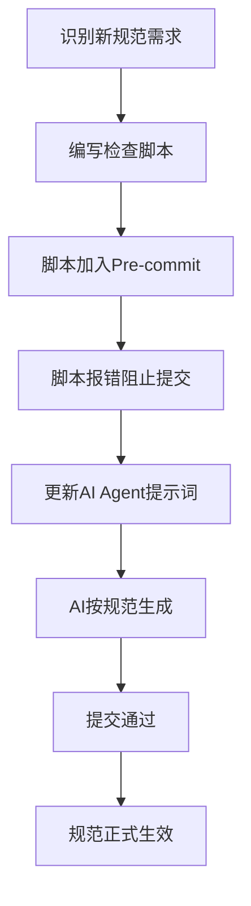

# 审计先于施工标准 (Test-Driven Governance)

> **核心原则**: 先把"未来的规范"写进脚本，让脚本报错，再允许施工
> 
> **目标**: 防止 DeepSeek 等 AI Agent 在批量生成文件时"带病施工"

```
```---
```

## 1. 标准概述

### 1.1 什么是"审计先于施工"

传统流程:
```
施工 → 审计 → 发现问题 → 返工修复
```

T-D-G 流程:
```
定义规范 → 写入检查脚本 → 脚本报错阻止施工 → 按规范施工 → 自动通过
```

### 1.2 价值主张

| 价值点 | 说明 |
|--------|------|
| **前置拦截** | 在生成阶段就阻止违规，而非事后修复 |
| **零返工** | AI Agent 一次生成即符合规范 |
| **规范即代码** | 规范可执行、可验证、可自动化 |
| **持续合规** | 每次提交都自动验证 |

```
```---
```

## 2. 实施流程

### 2.1 新增规范的部署流程



### 2.2 具体步骤

**步骤 1: 识别规范**
- 在审计中发现潜在问题模式
- 预测未来可能出现的违规类型

**步骤 2: 编写检查脚本**
- 在 `scripts/governance/` 创建检查脚本
- 脚本必须能检测违规并返回非零退出码

**步骤 3: 加入预提交钩子**
- 在 `.pre-commit-config.yaml` 添加钩子
- 设置 `fail_fast: true` 确保及时拦截

**步骤 4: 更新AI提示词**
- 在 `.cursorrules` 或 AI 系统提示中新增规范
- 提供违规示例和正确示例

**步骤 5: 验证闭环**
- 尝试提交违规文件，确认被拦截
- 修复后提交，确认通过

```
```---
```

## 3. 预定义的未来规范（已写入脚本）

### 3.1 真源卫兵 (Source Guard)

**规范**: 所有文档必须有唯一 module_id、有效 YAML、完整 frontmatter

**检查脚本**: `scripts/source_guard_pre_commit.py`

**预拦截问题**:
- ✅ 双 YAML frontmatter
- ✅ 重复 module_id
- ✅ YAML 解析失败
- ✅ 缺少必需字段

### 3.2 目录命名守卫

**规范**: 目录命名必须符合 `NN_LAYER_NAME` 格式

**检查脚本**: `scripts/check_directory_naming.py`

**预拦截问题**:
- ✅ 中文目录名
- ✅ 禁止关键词 (temp/test/backup)
- ✅ 深度超限 (>6层)

### 3.3 版本一致性守卫 (规划中)

**规范**: 同一 Layer 的所有文档版本必须一致

**检查脚本**: `scripts/check_version_consistency.py` (增强版)

**预拦截问题**:
- ⚠️ Layer 11 文档版本不一致
- ⚠️ 架构版本与文档版本漂移

### 3.4 真源引用守卫 (规划中)

**规范**: 禁止直接引用 L5 文档作为 L0 规范

**检查脚本**: `scripts/check_authority_source_violation.py` (待创建)

**预拦截问题**:
- ⚠️ 44个文档引用 `PATH_STANDARD.md` (L5) 作为真源

```
```---
```

## 4. AI Agent 集成指南

### 4.1 DeepSeek 提示词模板

```markdown
## 文档生成规范（强制执行）

在生成任何文档前，必须自检以下项目：

### 1. Frontmatter 完整性检查
- [ ] module_id: 使用 `{PATH}_{NAME}_{NNN}` 格式
- [ ] version: 与所属 Layer 架构版本一致
- [ ] status: Active / Draft / Archived
- [ ] owner: 明确的负责人
- [ ] layer: layer_NN

### 2. YAML 格式检查
- [ ] 只有一个 `---` 块
- [ ] 没有重复的 module_id
- [ ] YAML 可解析（使用在线验证器）

### 3. 目录放置检查
- [ ] 目录命名符合 `NN_LAYER_NAME` 格式
- [ ] 不在禁止关键词列表中
- [ ] 深度不超过 6 层

### 4. 真源引用检查
- [ ] 不直接引用 L5 文档作为架构规范
- [ ] 优先引用 L0/L1 层标准文档

**违规后果**: Git pre-commit 钩子将拒绝提交
```

### 4.2 自动化验证流程

```bash
# 在 AI Agent 生成文件后，自动运行：

# 1. 真源卫兵检查
python scripts/source_guard_pre_commit.py

# 2. 目录命名检查
python scripts/check_directory_naming.py --staged

# 3. 链接有效性检查
python scripts/batch_fix_invalid_links_v2.py --dry-run

# 全部通过后才允许提交
```

```
```---
```

## 5. 规范演进机制

### 5.1 新增规范的决策流程

```
审计发现 → 影响评估 → 脚本开发 → 预部署测试 → 提示词更新 → 正式生效
```

### 5.2 规范版本管理

| 规范ID | 版本 | 状态 | 部署日期 |
|--------|------|------|---------|
| SOURCE_GUARD | 1.0.0 | Active | 2026-04-13 |
| DIR_NAMING | 1.0.0 | Active | 2026-04-12 |
| VERSION_CONSISTENCY | 0.9.0 | Beta | 2026-04-15 |
| AUTHORITY_SOURCE | 0.8.0 | Planning | 2026-04-20 |

```
```---
```

## 6. 附录：检查脚本清单

### 6.1 已部署脚本

| 脚本 | 功能 | 部署状态 |
|------|------|---------|
| `source_guard_pre_commit.py` | 真源卫兵 | ✅ Active |
| `check_directory_naming.py` | 目录命名 | ✅ Active |
| `doc_guard_pre_commit.py` | 文档缺陷防护 | ✅ Active |
| `batch_fix_invalid_links_v2.py` | 链接检查 | ✅ Active |

### 6.2 规划中脚本

| 脚本 | 功能 | 计划日期 |
|------|------|---------|
| `check_version_consistency_v2.py` | 版本一致性 | 2026-04-15 |
| `check_authority_source.py` | 真源引用 | 2026-04-20 |
| `check_sitemap_sync.py` | SITEMAP同步 | 2026-04-22 |
| `check_index_integrity.py` | 索引完整性 | 2026-04-25 |

```
```---
```

**版本**: v1.0.0  
**生效日期**: 2026-04-13  
**下次评审**: 2026-04-20
