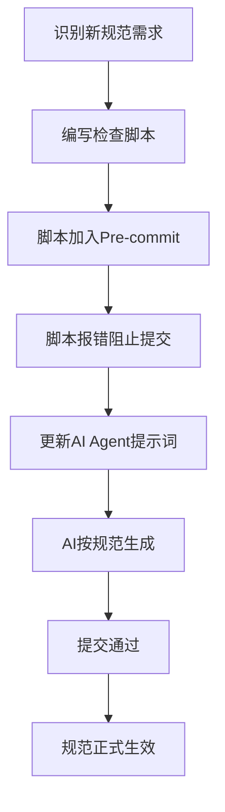

# 测试与缺陷预防合并标准

> 由原 `test_driven_governance_standard.md` 与 `document-defect-prevention-standard.md` 合并。

## 第一部分：测试驱动治理

# 审计先于施工标准 (Test-Driven Governance)

> **核心原则**: 先把"未来的规范"写进脚本，让脚本报错，再允许施工
> 
> **目标**: 防止 DeepSeek 等 AI Agent 在批量生成文件时"带病施工"

```
```---
```

## 1. 标准概述

### 1.1 什么是"审计先于施工"

传统流程:
```
施工 → 审计 → 发现问题 → 返工修复
```

T-D-G 流程:
```
定义规范 → 写入检查脚本 → 脚本报错阻止施工 → 按规范施工 → 自动通过
```

### 1.2 价值主张

| 价值点 | 说明 |
|--------|------|
| **前置拦截** | 在生成阶段就阻止违规，而非事后修复 |
| **零返工** | AI Agent 一次生成即符合规范 |
| **规范即代码** | 规范可执行、可验证、可自动化 |
| **持续合规** | 每次提交都自动验证 |

```
```---
```

## 2. 实施流程

### 2.1 新增规范的部署流程



### 2.2 具体步骤

**步骤 1: 识别规范**
- 在审计中发现潜在问题模式
- 预测未来可能出现的违规类型

**步骤 2: 编写检查脚本**
- 在 `scripts/governance/` 创建检查脚本
- 脚本必须能检测违规并返回非零退出码

**步骤 3: 加入预提交钩子**
- 在 `.pre-commit-config.yaml` 添加钩子
- 设置 `fail_fast: true` 确保及时拦截

**步骤 4: 更新AI提示词**
- 在 `.cursorrules` 或 AI 系统提示中新增规范
- 提供违规示例和正确示例

**步骤 5: 验证闭环**
- 尝试提交违规文件，确认被拦截
- 修复后提交，确认通过

```
```---
```

## 3. 预定义的未来规范（已写入脚本）

### 3.1 真源卫兵 (Source Guard)

**规范**: 所有文档必须有唯一 module_id、有效 YAML、完整 frontmatter

**检查脚本**: `scripts/source_guard_pre_commit.py`

**预拦截问题**:
- ✅ 双 YAML frontmatter
- ✅ 重复 module_id
- ✅ YAML 解析失败
- ✅ 缺少必需字段

### 3.2 目录命名守卫

**规范**: 目录命名必须符合 `NN_LAYER_NAME` 格式

**检查脚本**: `scripts/check_directory_naming.py`

**预拦截问题**:
- ✅ 中文目录名
- ✅ 禁止关键词 (temp/test/backup)
- ✅ 深度超限 (>6层)

### 3.3 版本一致性守卫 (规划中)

**规范**: 同一 Layer 的所有文档版本必须一致

**检查脚本**: `scripts/check_version_consistency.py` (增强版)

**预拦截问题**:
- ⚠️ Layer 11 文档版本不一致
- ⚠️ 架构版本与文档版本漂移

### 3.4 真源引用守卫 (规划中)

**规范**: 禁止直接引用 L5 文档作为 L0 规范

**检查脚本**: `scripts/check_authority_source_violation.py` (待创建)

**预拦截问题**:
- ⚠️ 44个文档引用 `PATH_STANDARD.md` (L5) 作为真源

```
```---
```

## 4. AI Agent 集成指南

### 4.1 DeepSeek 提示词模板

```markdown
## 文档生成规范（强制执行）

在生成任何文档前，必须自检以下项目：

### 1. Frontmatter 完整性检查
- [ ] module_id: 使用 `{PATH}_{NAME}_{NNN}` 格式
- [ ] version: 与所属 Layer 架构版本一致
- [ ] status: Active / Draft / Archived
- [ ] owner: 明确的负责人
- [ ] layer: layer_NN

### 2. YAML 格式检查
- [ ] 只有一个 `---` 块
- [ ] 没有重复的 module_id
- [ ] YAML 可解析（使用在线验证器）

### 3. 目录放置检查
- [ ] 目录命名符合 `NN_LAYER_NAME` 格式
- [ ] 不在禁止关键词列表中
- [ ] 深度不超过 6 层

### 4. 真源引用检查
- [ ] 不直接引用 L5 文档作为架构规范
- [ ] 优先引用 L0/L1 层标准文档

**违规后果**: Git pre-commit 钩子将拒绝提交
```

### 4.2 自动化验证流程

```bash
# 在 AI Agent 生成文件后，自动运行：

# 1. 真源卫兵检查
python scripts/source_guard_pre_commit.py

# 2. 目录命名检查
python scripts/check_directory_naming.py --staged

# 3. 链接有效性检查
python scripts/batch_fix_invalid_links_v2.py --dry-run

# 全部通过后才允许提交
```

```
```---
```

## 5. 规范演进机制

### 5.1 新增规范的决策流程

```
审计发现 → 影响评估 → 脚本开发 → 预部署测试 → 提示词更新 → 正式生效
```

### 5.2 规范版本管理

| 规范ID | 版本 | 状态 | 部署日期 |
|--------|------|------|---------|
| SOURCE_GUARD | 1.0.0 | Active | 2026-04-13 |
| DIR_NAMING | 1.0.0 | Active | 2026-04-12 |
| VERSION_CONSISTENCY | 0.9.0 | Beta | 2026-04-15 |
| AUTHORITY_SOURCE | 0.8.0 | Planning | 2026-04-20 |

```
```---
```

## 6. 附录：检查脚本清单

### 6.1 已部署脚本

| 脚本 | 功能 | 部署状态 |
|------|------|---------|
| `source_guard_pre_commit.py` | 真源卫兵 | ✅ Active |
| `check_directory_naming.py` | 目录命名 | ✅ Active |
| `doc_guard_pre_commit.py` | 文档缺陷防护 | ✅ Active |
| `batch_fix_invalid_links_v2.py` | 链接检查 | ✅ Active |

### 6.2 规划中脚本

| 脚本 | 功能 | 计划日期 |
|------|------|---------|
| `check_version_consistency_v2.py` | 版本一致性 | 2026-04-15 |
| `check_authority_source.py` | 真源引用 | 2026-04-20 |
| `check_sitemap_sync.py` | SITEMAP同步 | 2026-04-22 |
| `check_index_integrity.py` | 索引完整性 | 2026-04-25 |

```
```---
```

**版本**: v1.0.0  
**生效日期**: 2026-04-13  
**下次评审**: 2026-04-20

---

## 第二部分：文档缺陷预防

# 文档缺陷预防标准

> **核心职责**: 定义文档缺陷的分类、预防机制、检测门禁与修复流程，确保已修复问题不再复发

> **职责边界**:
> - ✅ 本文档负责：6 类文档缺陷的预防规范、pre-commit 钩子标准、CI/CD 门禁定义
> - ❌ 本文档不负责：具体脚本实现（见 `scripts/`）、审计执行流程（见审计方案）

```
```---
```

## 1. 缺陷分类与根因分析

基于 2026-04-03 至 2026-04-13 的治理实践，归纳 6 类文档缺陷及其根因：

| 缺陷编号 | 缺陷类型 | 根因 | 历史影响规模 | 严重度 |
|----------|----------|------|-------------|--------|
| D-01 | 双 YAML frontmatter | 编辑器/脚本追加而非替换头部；批量脚本未检测已有 `---` | 830+ 篇 | P0 |
| D-02 | BOM 不一致 | 项目标准为 UTF-8 BOM（验收证确认 3369/3369 = 100%）；缺陷定义为**缺少 BOM** 或 **BOM 与内容编码不一致**，而非 BOM 本身 | N/A | P2 |
| D-03 | 无效内链 | 文件移动/归档后未更新引用路径；归档区子目录深度变化 | 7449 条 | P0 |
| D-04 | 重复 module_id | 批量脚本使用通用 ID 模板；双 YAML 导致同一文件两个 ID | 238 组 | P0 |
| D-05 | 编码损坏（乱码） | 编码转换工具错误；BOM 与非 BOM 混合处理 | 17 篇 P0 | P0 |
| D-06 | 目录映射缺失 | 新建 Layer 目录未同步 SITEMAP/INDEX；归档区缺少 INDEX.md | 5 个 Layer | P1 |

```
```---
```

## 2. 三层防护体系

### 2.1 L0 实时防护（Pre-commit Hook）

**目标**: 在 `git commit` 时拦截缺陷，零延迟反馈

| 钩子名称 | 检测项 | 对应缺陷 | 拦截策略 |
|----------|--------|---------|---------|
| `check-single-frontmatter` | 文件内 `---` 分隔符 ≤ 1 对 | D-01 | 阻止提交 |
| `check-bom-consistency` | 文件编码与 BOM 标记一致 | D-02 | 警告 |
| `check-valid-internal-links` | Markdown 内链目标文件存在 | D-03 | 警告（不阻止，因全量扫描耗时） |
| `check-unique-module-id` | 首道 FM 的 module_id 全局唯一 | D-04 | 阻止提交 |
| `check-utf8-encoding` | 文件可被 UTF-8 解码且无非 ASCII 乱码 | D-05 | 阻止提交 |
| `check-sitemap-sync` | 新建目录在 SITEMAP.md 中有映射 | D-06 | 警告 |

**执行入口**: `scripts/doc_guard_pre_commit.py`

**配置位置**: `.pre-commit-config.yaml`

### 2.2 L1 CI/CD 防护（自动化流水线）

**目标**: 每次推送/合并请求时全量扫描，确保 L0 漏网之鱼被捕获

| 检查项 | 脚本 | 门禁标准 | 对应缺陷 |
|--------|------|---------|---------|
| 全量内链检查 | `scripts/ci_cd_link_checker.py` | 无效链接 = 0 | D-03 |
| 双 YAML 扫描 | `scripts/merge_double_yaml_frontmatter.py --list` | 双 YAML = 0 | D-01 |
| module_id 去重 | `scripts/dedupe_module_id_frontmatter.py --dry-run` | 重复组 = 0 | D-04 |
| BOM 一致性 | `scripts/doc_guard_pre_commit.py --scan-bom` | BOM 不一致文件 = 0 | D-02 |
| 编码可读性 | `scripts/check_encoding_readability.py` | 乱码字符 = 0 | D-05 |

**报告输出**: `docs/05_IMPLEMENTATION/04_OPERATIONS/audit_state/CI_CD_LINK_CHECK_YYYYMMDD.json`

### 2.3 L2 周期防护（定期深度审计）

**目标**: 每月/每季度执行全系统文档审计，发现 L0/L1 无法检测的语义问题

| 审计类型 | 频率 | 执行方案 | 对应缺陷 |
|----------|------|---------|---------|
| 全系统文档审计 A-H | 每季度 | `FULL_SYSTEM_DOCUMENT_AUDIT_PLAN` | D-01~D-06 |
| 架构缺口审计 | 每月 | `ARCH_MODULE_GAP_REGISTER` | D-06 |
| 归档区健康检查 | 每月 | 归档区 INDEX 完整性 + 链接有效性 | D-03, D-06 |

```
```---
```

## 3. 缺陷修复标准流程

### 3.1 修复原则

1. **单次修复原则**: 每个缺陷只修复一次，修复后 pre-commit 钩子确保不再复发
2. **最小变更原则**: 修复仅针对缺陷本身，不重构无关内容
3. **验证闭环原则**: 修复后必须运行对应 L0/L1 检查确认通过
4. **归档区特殊规则**: 归档区文件修复采用"保留文本、移除链接"策略，不新增引用

### 3.2 各缺陷修复 SOP

#### D-01 双 YAML frontmatter

```
检测: merge_double_yaml_frontmatter.py --list
修复: merge_double_yaml_frontmatter.py --apply
验证: merge_double_yaml_frontmatter.py --list → 0
预防: pre-commit check-single-frontmatter
```

**合并规则**: 保留第一个 `---` 块的完整内容，丢弃后续 `---` 块。若后续块有独有字段，合并到第一个块中。

#### D-02 BOM 一致性

```
检测: doc_guard_pre_commit.py --scan-bom
修复: doc_guard_pre_commit.py --strip-bom（移除 BOM）或添加 BOM
验证: BOM 一致性 = 100%
预防: pre-commit check-bom-consistency（警告级）
```

**编码标准**: 项目标准为 **UTF-8 BOM**（验收证确认 3369/3369 = 100%）。Python 脚本读取文件使用 `encoding='utf-8-sig'`（自动处理 BOM），写入文件使用 `encoding='utf-8'` 后手动添加 BOM（`\xEF\xBB\xBF`）以保持一致性。

#### D-03 无效内链

```
检测: ci_cd_link_checker.py
修复: batch_fix_invalid_links_v2.py（三策略：路径修正 > 锚点剥离 > 链接移除）
验证: ci_cd_link_checker.py → invalid = 0
预防: pre-commit check-valid-internal-links + CI/CD 全量扫描
```

**归档区链接规则**:
- 归档区文件引用非归档区文件：使用正确的相对路径深度（`../../` 而非 `../`）
- 归档区文件引用已不存在的文件：移除链接，保留文本，标注 `(已归档)`
- 归档区 INDEX.md：必须存在，作为 `../INDEX.md` 的有效目标

#### D-04 重复 module_id

```
检测: dedupe_module_id_frontmatter.py --dry-run
修复: dedupe_module_id_frontmatter.py --apply（按 ADR-OC-003 规则）
验证: dedupe_module_id_frontmatter.py --dry-run → 0 组
预防: pre-commit check-unique-module-id
```

**去重规则** (ADR-OC-003):
- 每组重复中指定一篇为 canonical（路径最符合职责、或最新维护的）
- 非 canonical 文档：`module_id` 改为 `原ID_ARCHIVED` 或 `原ID_YYYYMMDD`
- 同一批次内后缀风格统一

#### D-05 编码损坏

```
检测: check_encoding_readability.py
修复: 人工确认后重写（编码损坏不可自动修复）
验证: check_encoding_readability.py → 0 乱码字符
预防: pre-commit check-utf8-encoding
```

**不可自动修复原则**: 编码损坏涉及字符映射错误，自动修复可能引入新错误。必须人工确认原始内容后重写。

#### D-06 目录映射缺失

```
检测: SITEMAP.md 与实际目录对比
修复: 在 SITEMAP.md 添加目录映射 + 创建 INDEX.md
验证: 目录存在 INDEX.md 且 SITEMAP.md 有对应条目
预防: pre-commit check-sitemap-sync（警告级）
```

```
```---
```

## 4. Pre-commit 钩子技术规范

### 4.1 统一入口脚本

所有文档质量检查统一通过 `scripts/doc_guard_pre_commit.py` 入口：

```bash
# 单文件检查（pre-commit 模式，仅检查暂存文件）
python scripts/doc_guard_pre_commit.py --check single --file path/to/file.md

# 全量扫描（CI/CD 模式）
python scripts/doc_guard_pre_commit.py --check full

# 单项扫描
python scripts/doc_guard_pre_commit.py --scan-bom
python scripts/doc_guard_pre_commit.py --scan-double-yaml
python scripts/doc_guard_pre_commit.py --scan-encoding
```

### 4.2 性能要求

| 模式 | 目标耗时 | 适用场景 |
|------|---------|---------|
| 单文件检查 | < 2 秒 | pre-commit |
| 增量扫描（仅暂存文件） | < 30 秒 | pre-commit |
| 全量扫描 | < 5 分钟 | CI/CD |

### 4.3 退出码规范

| 退出码 | 含义 | 处理方式 |
|--------|------|---------|
| 0 | 全部通过 | 正常提交 |
| 1 | 阻止提交的缺陷（D-01, D-02, D-04, D-05） | 必须修复后重新提交 |
| 2 | 警告（D-03 增量, D-06） | 允许提交，但需在 24 小时内处理 |

```
```---
```

## 5. 脚本编写规范

### 5.1 编码处理

```python
# ✅ 正确：统一使用 utf-8
with open(file_path, 'r', encoding='utf-8') as f:
    content = f.read()

# ❌ 错误：使用 utf-8-sig 会保留/引入 BOM
with open(file_path, 'r', encoding='utf-8-sig') as f:
    content = f.read()
```

### 5.2 路径处理（Windows 兼容）

```python
# ✅ 正确：resolve() 后确保与基准路径同为绝对路径
docs_root = Path('docs').resolve()
target = raw_path.resolve()
relative = target.relative_to(docs_root)

# ✅ 正确：路径长度检查（Windows 260 字符限制）
if len(str(full_path)) > 240:
    continue  # 跳过超长路径

# ❌ 错误：resolve() 返回绝对路径但基准路径为相对路径
docs_root = Path('docs')  # 相对路径
target = raw_path.resolve()  # 绝对路径
target.relative_to(docs_root)  # ValueError!
```

### 5.3 Frontmatter 解析

```python
# ✅ 正确：仅解析第一个 --- 块
import re
def parse_first_frontmatter(content: str) -> tuple[dict, str]:
    match = re.match(r'^---\s*\n(.*?)\n---\s*\n', content, re.DOTALL)
    if not match:
        return {}, content
    yaml_str = match.group(1)
    body = content[match.end():]
    metadata = yaml.safe_load(yaml_str) or {}
    return metadata, body

# ❌ 错误：使用 yaml.safe_load_all 会解析所有 --- 块
```

```
```---
```

## 6. 培训与文化建设

### 6.1 新成员入职检查清单

- [ ] 阅读本文档 §1-§3（缺陷分类与防护体系）
- [ ] 阅读 `DOCUMENT_REPOSITORY_LAYOUT_STANDARD`（目录布局标准）
- [ ] 阅读 `document-metadata-and-versioning-standard`（元数据与版本命名）
- [ ] 确认 pre-commit 钩子已安装并正常运行
- [ ] 完成一次模拟缺陷修复练习

### 6.2 定期培训

| 培训内容 | 频率 | 对象 |
|----------|------|------|
| 文档治理标准更新 | 每季度 | 全体开发 |
| 缺陷趋势分析 | 每月 | 文档 Owner |
| Pre-commit 钩子维护 | 每半年 | DevOps |

```
```---
```

## 7. 度量与持续改进

### 7.1 关键指标

| 指标 | 目标值 | 采集方式 | 报告频率 |
|------|--------|---------|---------|
| 无效内链数 | 0 | `ci_cd_link_checker.py` | 每次推送 |
| 双 YAML 文件数 | 0 | `merge_double_yaml_frontmatter.py` | 每次推送 |
| 重复 module_id 组数 | 0 | `dedupe_module_id_frontmatter.py` | 每次推送 |
| BOM 污染文件数 | 0 | `doc_guard_pre_commit.py --scan-bom` | 每次推送 |
| 编码损坏文件数 | 0 | `check_encoding_readability.py` | 每次推送 |
| pre-commit 拦截次数 | 趋势下降 | Git hook 日志 | 每月 |
| 缺陷复发率 | 0% | 对比历史修复记录 | 每季度 |

### 7.2 持续改进流程

1. **月度回顾**: 分析 pre-commit 拦截日志，识别高频缺陷模式
2. **季度评估**: 评估防护体系有效性，更新检测规则
3. **年度审计**: 全系统文档审计，验证防护体系覆盖率

```
```---
```

## 8. 变更历史

| 版本 | 日期 | 说明 |
|------|------|------|
| 1.0.0 | 2026-04-13 | 初始版本：基于 2026-04-03~04-13 治理实践归纳 6 类缺陷与三层防护体系 |
