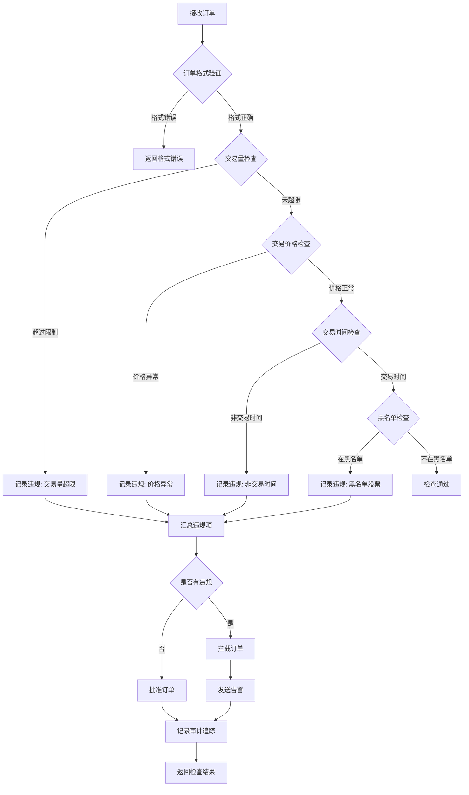
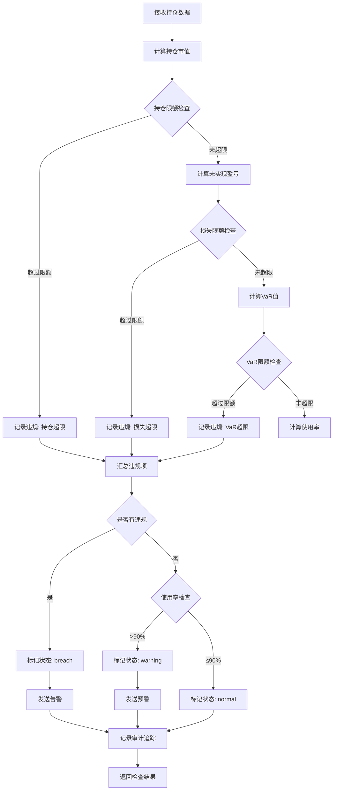
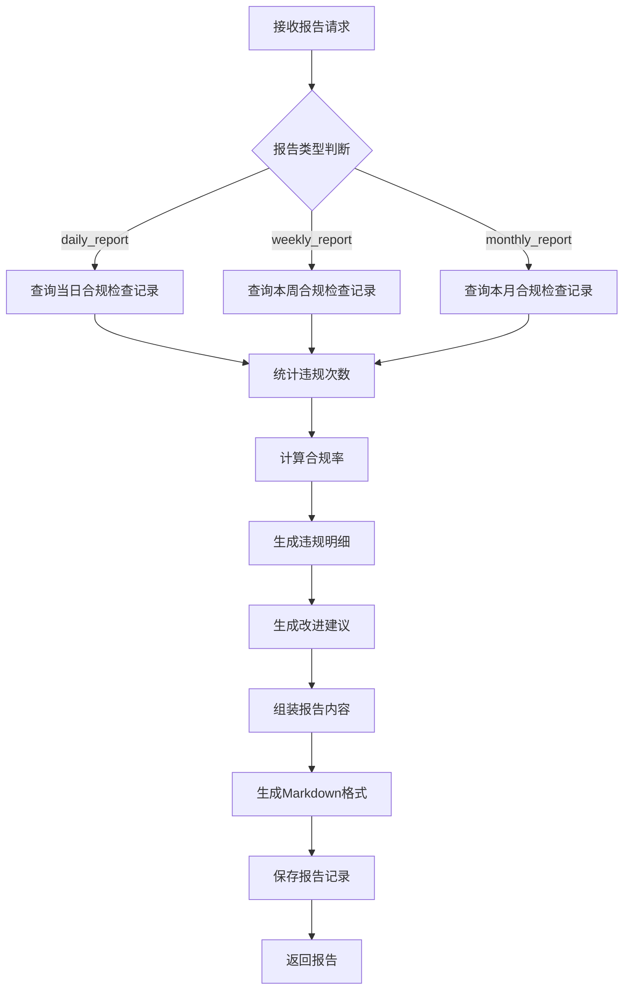
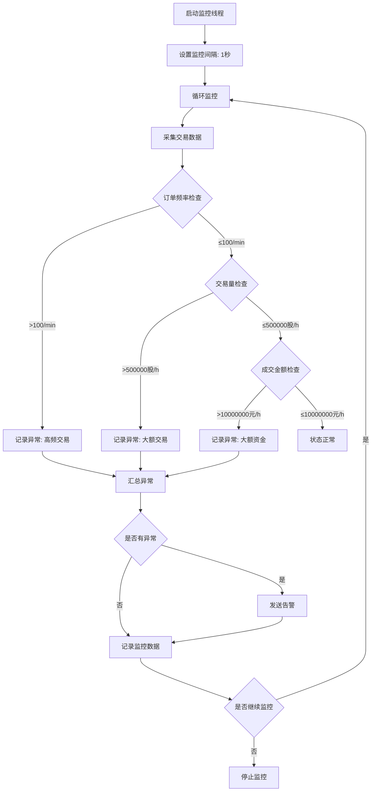
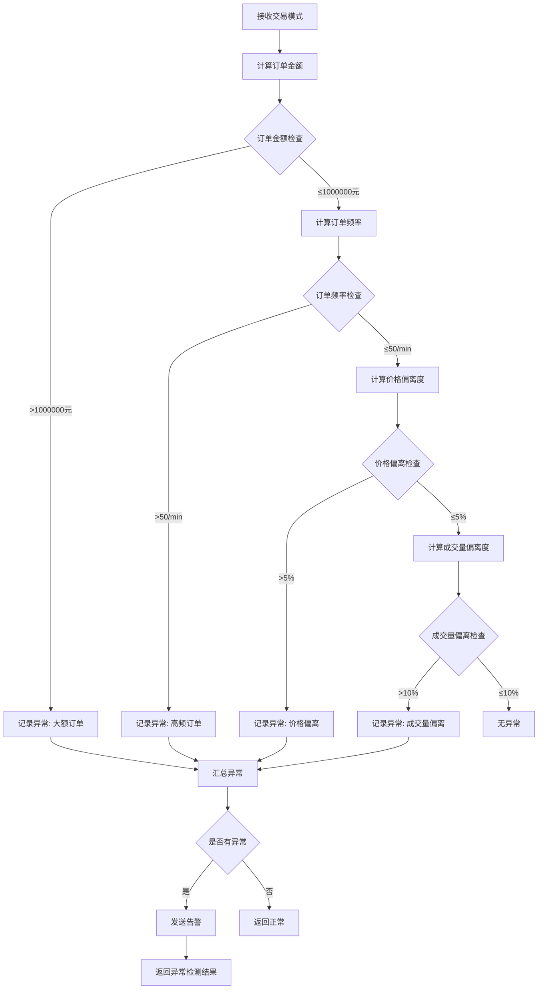
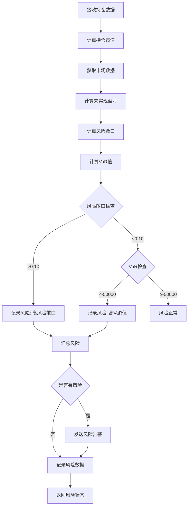
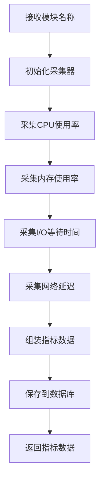
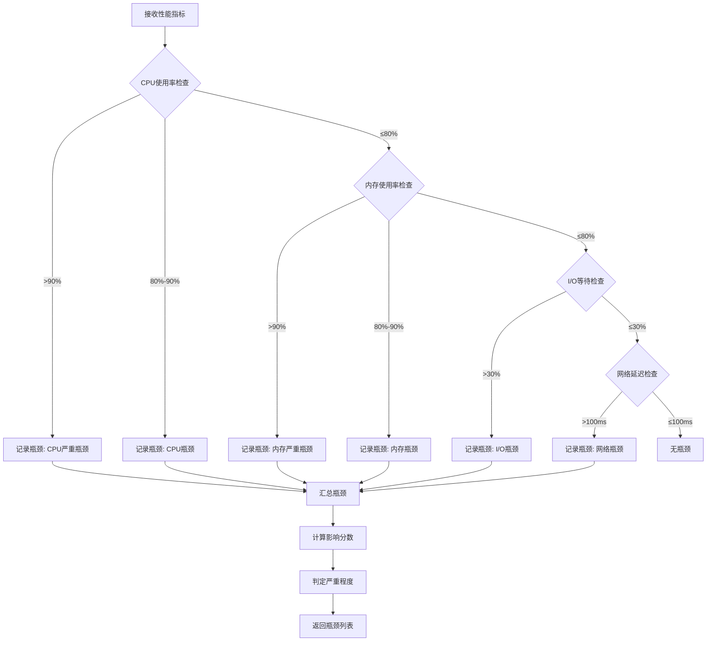
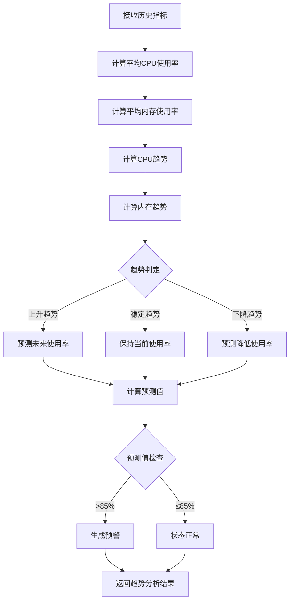

# 算法流程图补充文档

> **版本**: v1.0
> **创建日期**: 2026-04-02
> **目的**: 为所有新建模块补充详细的算法流程图说明

---

## 一、合规监控模块算法流程图

### 1.1 交易合规检查算法流程

**算法说明**:
1. **订单格式验证**: 检查订单字段是否完整、数据类型是否正确
2. **交易量检查**: 验证交易量是否超过预设限额（默认100000股）
3. **交易价格检查**: 验证价格是否在合理范围内（涨跌停板限制）
4. **交易时间检查**: 验证是否在交易时间内（9:30-11:30, 13:00-15:00）
5. **黑名单检查**: 验证股票是否在黑名单中
6. **决策逻辑**: 如果有任何违规项，拦截订单并发送告警；否则批准订单

**复杂度分析**:
- 时间复杂度: O(n)，n为检查规则数量
- 空间复杂度: O(1)

---

### 1.2 风控合规检查算法流程

**算法说明**:
1. **持仓限额检查**: 验证持仓市值是否超过预设限额
2. **损失限额检查**: 验证未实现盈亏是否超过损失限额
3. **VaR限额检查**: 验证VaR值是否超过风险限额
4. **使用率计算**: 计算当前使用率（持仓市值/限额）
5. **状态判定**: 根据违规项和使用率判定风险状态

**复杂度分析**:
- 时间复杂度: O(1)
- 空间复杂度: O(1)

---

### 1.3 监管报告生成算法流程

**算法说明**:
1. **数据查询**: 根据报告类型查询相应时间范围的合规检查记录
2. **统计计算**: 统计违规次数、计算合规率
3. **明细生成**: 生成违规明细列表
4. **建议生成**: 根据违规类型生成改进建议
5. **报告组装**: 将所有内容组装成Markdown格式报告

**复杂度分析**:
- 时间复杂度: O(n)，n为合规检查记录数量
- 空间复杂度: O(n)

---

## 二、实盘监控模块算法流程图

### 2.1 实时交易监控算法流程

**算法说明**:
1. **数据采集**: 每秒采集一次交易数据
2. **频率检查**: 验证订单频率是否超过阈值
3. **交易量检查**: 验证交易量是否超过阈值
4. **金额检查**: 验证成交金额是否超过阈值
5. **异常处理**: 发现异常立即发送告警

**复杂度分析**:
- 时间复杂度: O(1)（每次监控）
- 空间复杂度: O(1)

---

### 2.2 异常交易检测算法流程

**算法说明**:
1. **订单金额检查**: 验证单笔订单金额是否异常大
2. **订单频率检查**: 验证订单频率是否异常高
3. **价格偏离检查**: 验证价格偏离度是否超过阈值
4. **成交量偏离检查**: 验证成交量偏离度是否超过阈值
5. **异常汇总**: 汇总所有异常项并判定严重程度

**复杂度分析**:
- 时间复杂度: O(1)
- 空间复杂度: O(1)

---

### 2.3 持仓风险监控算法流程

**算法说明**:
1. **市值计算**: 计算当前持仓市值
2. **盈亏计算**: 计算未实现盈亏
3. **风险敞口计算**: 计算风险敞口（未实现盈亏/持仓市值）
4. **VaR计算**: 使用历史模拟法计算VaR值
5. **风险判定**: 根据风险敞口和VaR值判定风险状态

**复杂度分析**:
- 时间复杂度: O(n)，n为历史数据数量（VaR计算）
- 空间复杂度: O(n)

---

## 三、性能分析模块算法流程图

### 3.1 性能指标采集算法流程

**算法说明**:
1. **CPU采集**: 使用psutil.cpu_percent()采集CPU使用率
2. **内存采集**: 使用psutil.virtual_memory().percent采集内存使用率
3. **I/O采集**: 使用psutil.cpu_times_percent().iowait采集I/O等待时间
4. **网络采集**: 使用ping命令采集网络延迟
5. **数据组装**: 将所有指标组装成字典格式

**复杂度分析**:
- 时间复杂度: O(1)
- 空间复杂度: O(1)

---

### 3.2 性能瓶颈识别算法流程

**算法说明**:
1. **CPU检查**: 根据CPU使用率判定瓶颈严重程度
2. **内存检查**: 根据内存使用率判定瓶颈严重程度
3. **I/O检查**: 根据I/O等待时间判定瓶颈
4. **网络检查**: 根据网络延迟判定瓶颈
5. **影响分数计算**: 根据使用率计算影响分数

**复杂度分析**:
- 时间复杂度: O(1)
- 空间复杂度: O(1)

---

### 3.3 性能趋势分析算法流程

**算法说明**:
1. **平均值计算**: 计算历史指标的平均值
2. **趋势计算**: 使用线性回归计算趋势
3. **趋势判定**: 判定趋势类型（上升/稳定/下降）
4. **预测计算**: 根据趋势预测未来使用率
5. **预警生成**: 如果预测值超过阈值，生成预警

**复杂度分析**:
- 时间复杂度: O(n)，n为历史数据数量
- 空间复杂度: O(n)

---

## 四、算法参数配置

### 4.1 合规监控参数

| 参数名 | 默认值 | 说明 | 调整建议 |
|--------|--------|------|----------|
| volume_limit | 100000 | 单笔交易量上限 | 根据账户规模调整 |
| price_deviation_limit | 0.05 | 价格偏离度上限 | 根据市场波动调整 |
| position_limit | 1000000 | 持仓市值上限 | 根据资金规模调整 |
| loss_limit | -100000 | 损失限额 | 根据风险承受能力调整 |
| var_limit | -20000 | VaR限额 | 根据风险偏好调整 |

### 4.2 实盘监控参数

| 参数名 | 默认值 | 说明 | 调整建议 |
|--------|--------|------|----------|
| order_frequency_limit | 100 | 订单频率上限(次/分钟) | 根据交易策略调整 |
| volume_per_hour_limit | 500000 | 每小时交易量上限 | 根据账户规模调整 |
| turnover_per_hour_limit | 10000000 | 每小时成交金额上限 | 根据资金规模调整 |
| order_amount_limit | 1000000 | 单笔订单金额上限 | 根据风险承受能力调整 |

### 4.3 性能分析参数

| 参数名 | 默认值 | 说明 | 调整建议 |
|--------|--------|------|----------|
| cpu_warning_threshold | 0.80 | CPU预警阈值 | 根据服务器配置调整 |
| cpu_critical_threshold | 0.90 | CPU临界阈值 | 根据服务器配置调整 |
| memory_warning_threshold | 0.80 | 内存预警阈值 | 根据服务器配置调整 |
| memory_critical_threshold | 0.90 | 内存临界阈值 | 根据服务器配置调整 |
| io_wait_threshold | 0.30 | I/O等待阈值 | 根据磁盘性能调整 |
| network_latency_threshold | 100 | 网络延迟阈值(ms) | 根据网络环境调整 |

---

**版本**: v1.0 | **更新**: 2026-04-02 | **状态**: ✅ 活跃
