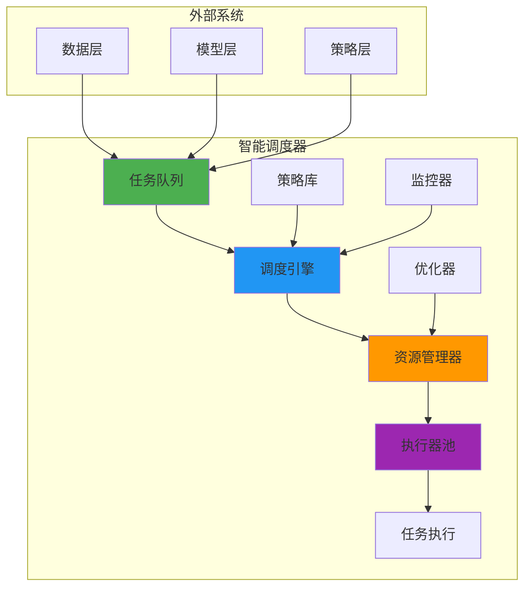

---
module_id: INTELLIGENT_SCHEDULER_001
version: 1.0.0
status: Active
created_date: 2026-04-07
last_updated: 2026-04-07
owner: AI工作流团队
standard_type: 专业量化机构蓝图
applicable_scope: Layer 10 - AI工作流层
compliance_level: 专业标准
responsibility:
  - 智能任务调度
  - 资源优化分配
  - 调度策略管理
layer: Layer 10 (AI工作流)
---

## 核心定位

负责智能调度器的设计与实现，提供任务调度、资源优化和调度策略管理功能，支持AI工作流的高效执行。

# 智能调度器蓝图 (Intelligent Scheduler Blueprint)

> **核心职责**: 智能任务调度，优化资源分配，管理调度策略
> **职责边界**:
> - ✅ 本文档负责：任务调度、资源优化、调度策略、执行监控
> - ❌ 本文档不负责：任务执行、数据处理、模型训练

---

## 📋 一、智能调度器概述

### 1.1 定义

智能调度器是AI工作流层的核心组件，负责：
- 智能任务调度与排队
- 资源动态分配与优化
- 调度策略管理与执行
- 任务执行监控与告警

### 1.2 核心功能

| 功能 | 描述 | 优先级 |
|------|------|--------|
| **任务调度** | 智能调度任务执行顺序 | P0 |
| **资源分配** | 动态分配计算资源 | P0 |
| **策略管理** | 管理调度策略 | P1 |
| **执行监控** | 监控任务执行状态 | P1 |
| **性能优化** | 优化调度性能 | P2 |

---

## 📊 二、调度架构

### 2.1 架构图



### 2.2 核心组件

#### 2.2.1 任务队列

**职责**: 管理待执行任务

**功能**:
- 任务入队与出队
- 优先级管理
- 任务依赖处理
- 任务超时管理

#### 2.2.2 调度引擎

**职责**: 执行调度决策

**功能**:
- 任务调度算法
- 资源匹配
- 执行计划生成
- 调度策略应用

#### 2.2.3 资源管理器

**职责**: 管理计算资源

**功能**:
- 资源注册与发现
- 资源状态监控
- 资源分配与回收
- 资源使用统计

---

## 🎯 三、调度策略

### 3.1 调度策略类型

| 策略类型 | 描述 | 适用场景 |
|---------|------|---------|
| **FIFO** | 先进先出 | 简单任务 |
| **优先级** | 按优先级调度 | 紧急任务 |
| **公平调度** | 公平分配资源 | 多用户场景 |
| **容量调度** | 保证最小资源 | 资源受限场景 |
| **智能调度** | AI优化调度 | 复杂场景 |

### 3.2 智能调度算法

**基于强化学习的调度优化**:

```python
class IntelligentScheduler:
    def __init__(self, rl_model):
        self.rl_model = rl_model
        self.resource_manager = ResourceManager()
        self.task_queue = TaskQueue()
    
    def schedule(self, task):
        """智能调度决策"""
        # 获取当前状态
        state = self.get_current_state()
        
        # 使用RL模型选择动作
        action = self.rl_model.predict(state)
        
        # 执行调度决策
        resource = self.resource_manager.allocate(action)
        
        # 执行任务
        result = self.execute_task(task, resource)
        
        # 更新模型
        reward = self.calculate_reward(result)
        self.rl_model.update(state, action, reward)
        
        return result
```

---

## 📈 四、资源管理

### 4.1 资源类型

| 资源类型 | 描述 | 管理方式 |
|---------|------|---------|
| **CPU** | 计算资源 | 动态分配 |
| **GPU** | 加速资源 | 独占/共享 |
| **内存** | 存储资源 | 动态分配 |
| **存储** | 持久化资源 | 配额管理 |
| **网络** | 通信资源 | 带宽限制 |

### 4.2 资源分配策略

**动态资源分配**:

```python
class ResourceAllocator:
    def allocate(self, task_requirements):
        """动态资源分配"""
        # 计算资源需求
        cpu_needed = task_requirements['cpu']
        gpu_needed = task_requirements.get('gpu', 0)
        memory_needed = task_requirements['memory']
        
        # 查找可用资源
        available = self.get_available_resources()
        
        # 分配资源
        if self.can_allocate(available, cpu_needed, gpu_needed, memory_needed):
            allocation = self.create_allocation(cpu_needed, gpu_needed, memory_needed)
            return allocation
        else:
            return None
```

---

## 🔍 五、执行监控

### 5.1 监控指标

| 指标 | 描述 | 告警阈值 |
|------|------|---------|
| **任务等待时间** | 任务在队列中的等待时间 | > 5分钟 |
| **任务执行时间** | 任务实际执行时间 | > 预期2倍 |
| **资源利用率** | 资源使用效率 | < 50% |
| **调度成功率** | 调度成功任务比例 | < 95% |
| **任务失败率** | 任务失败比例 | > 5% |

### 5.2 告警规则

**告警级别**:
- P0: 立即处理（调度成功率 < 90%）
- P1: 尽快处理（资源利用率 < 40%）
- P2: 计划处理（任务等待时间 > 10分钟）

---

## 🔗 六、与其他模块的关系

### 6.1 上游依赖

- **数据层**: 提供任务所需的数据
- **模型层**: 提供任务所需的模型
- **策略层**: 提供任务所需的策略

### 6.2 下游服务

- **执行引擎**: 执行调度后的任务
- **监控系统**: 监控任务执行状态
- **日志系统**: 记录任务执行日志

---

## 📝 七、实施计划

### 7.1 实施阶段

| 阶段 | 任务 | 时间 | 负责人 |
|------|------|------|--------|
| **阶段1** | 设计调度架构 | Week 1 | 架构师 |
| **阶段2** | 实现基础调度 | Week 2-3 | 开发团队 |
| **阶段3** | 实现资源管理 | Week 4-5 | 开发团队 |
| **阶段4** | 实现智能调度 | Week 6-7 | AI团队 |
| **阶段5** | 集成测试 | Week 8 | 测试团队 |

### 7.2 验收标准

- ✅ 调度成功率 > 95%
- ✅ 资源利用率 > 70%
- ✅ 任务等待时间 < 5分钟
- ✅ 系统可用性 > 99.9%

---

## 📚 八、参考文档


---

**蓝图版本**: v1.0.0 | **创建日期**: 2026-04-07 | **状态**: Active
