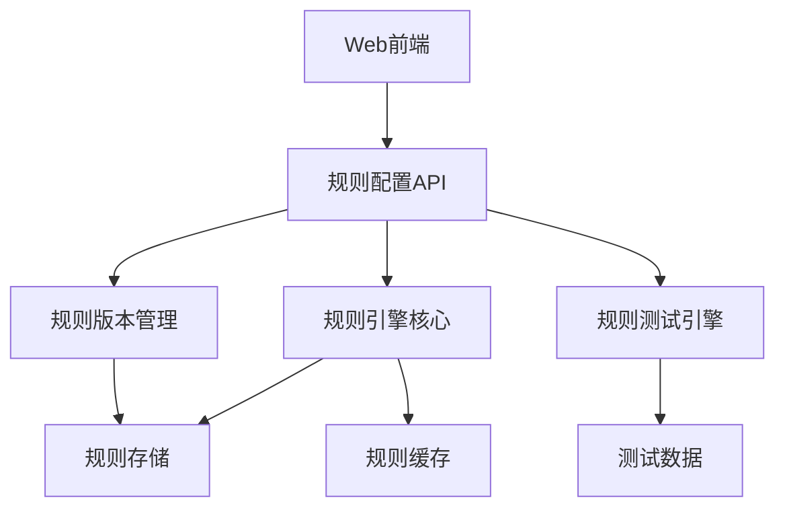

# 长期改进项实施指南

> **版本**: v1.0
> **创建日期**: 2026-04-02
> **目的**: 为长期改进项提供详细的实施指南和设计方案

---

## 一、规则引擎可视化配置界面

### 1.1 需求背景

**当前问题**:
- 规则配置需要修改代码，门槛高
- 规则变更需要重启系统
- 规则版本管理困难
- 规则测试和验证不便

**目标**:
- 提供可视化界面配置规则
- 支持规则热更新
- 提供规则版本管理
- 支持规则测试和验证

---

### 1.2 技术方案

#### 1.2.1 架构设计



**技术栈**:
- 前端: Streamlit + 自定义组件
- 后端: FastAPI
- 规则引擎: Python规则引擎库（如business-rules）
- 存储: SQLite + JSON
- 缓存: Redis

#### 1.2.2 功能模块

**模块1: 规则配置界面**

```python
import streamlit as st
from rule_engine import RuleEngine

class RuleConfigUI:
    """规则配置界面"""
    
    def __init__(self):
        self.engine = RuleEngine()
    
    def render(self):
        st.title("规则引擎配置")
        
        # 规则列表
        st.subheader("现有规则")
        rules = self.engine.get_all_rules()
        for rule in rules:
            with st.expander(f"{rule['name']} - {rule['status']}"):
                st.json(rule['definition'])
                col1, col2, col3 = st.columns(3)
                with col1:
                    if st.button("编辑", key=f"edit_{rule['id']}"):
                        self._edit_rule(rule)
                with col2:
                    if st.button("测试", key=f"test_{rule['id']}"):
                        self._test_rule(rule)
                with col3:
                    if st.button("删除", key=f"delete_{rule['id']}"):
                        self._delete_rule(rule['id'])
        
        # 新建规则
        st.subheader("新建规则")
        self._create_rule_form()
    
    def _create_rule_form(self):
        """创建规则表单"""
        with st.form("create_rule"):
            rule_name = st.text_input("规则名称")
            rule_type = st.selectbox("规则类型", ["trading", "risk", "compliance"])
            
            # 规则条件配置
            st.subheader("规则条件")
            conditions = self._build_conditions_ui()
            
            # 规则动作配置
            st.subheader("规则动作")
            actions = self._build_actions_ui()
            
            if st.form_submit_button("创建规则"):
                rule = {
                    "name": rule_name,
                    "type": rule_type,
                    "conditions": conditions,
                    "actions": actions
                }
                self.engine.create_rule(rule)
                st.success("规则创建成功！")
```

**模块2: 规则版本管理**

```python
class RuleVersionManager:
    """规则版本管理器"""
    
    def __init__(self, db_path: str = "data/rule_versions.db"):
        self.db_path = db_path
        self._init_database()
    
    def save_version(self, rule_id: str, rule_definition: dict) -> str:
        """保存规则版本"""
        version_id = f"v_{datetime.now().strftime('%Y%m%d_%H%M%S')}"
        
        with sqlite3.connect(self.db_path) as conn:
            conn.execute("""
                INSERT INTO rule_versions 
                (version_id, rule_id, definition, created_at)
                VALUES (?, ?, ?, ?)
            """, (version_id, rule_id, json.dumps(rule_definition), datetime.now()))
        
        return version_id
    
    def rollback(self, rule_id: str, version_id: str) -> bool:
        """回滚到指定版本"""
        with sqlite3.connect(self.db_path) as conn:
            cursor = conn.execute("""
                SELECT definition FROM rule_versions
                WHERE rule_id = ? AND version_id = ?
            """, (rule_id, version_id))
            
            result = cursor.fetchone()
            if result:
                rule_definition = json.loads(result[0])
                # 更新当前规则
                self._update_current_rule(rule_id, rule_definition)
                return True
        
        return False
```

**模块3: 规则测试引擎**

```python
class RuleTestEngine:
    """规则测试引擎"""
    
    def __init__(self, rule_engine: RuleEngine):
        self.engine = rule_engine
    
    def test_rule(self, rule_id: str, test_data: dict) -> dict:
        """测试规则"""
        rule = self.engine.get_rule(rule_id)
        
        # 执行规则
        result = self.engine.evaluate(rule, test_data)
        
        # 记录测试结果
        test_result = {
            "rule_id": rule_id,
            "test_data": test_data,
            "result": result,
            "timestamp": datetime.now()
        }
        
        return test_result
    
    def batch_test(self, rule_id: str, test_cases: list) -> list:
        """批量测试"""
        results = []
        for test_case in test_cases:
            result = self.test_rule(rule_id, test_case)
            results.append(result)
        
        return results
```

---

### 1.3 实施计划

**Phase 1: 基础功能（1周）**
- 设计规则配置界面
- 实现规则CRUD操作
- 实现规则存储

**Phase 2: 高级功能（1周）**
- 实现规则版本管理
- 实现规则测试引擎
- 实现规则热更新

**Phase 3: 优化完善（1周）**
- 优化界面交互
- 添加规则导入导出
- 添加规则模板

---

## 二、Streamlit性能优化

### 2.1 需求背景

**当前问题**:
- 监控仪表盘加载慢
- 实时数据刷新卡顿
- 大数据量渲染慢
- 内存占用高

**目标**:
- 提升页面加载速度
- 优化实时数据刷新
- 支持大数据量渲染
- 降低内存占用

---

### 2.2 技术方案

#### 2.2.1 缓存策略

**策略1: 数据缓存**

```python
import streamlit as st
from functools import lru_cache
import pandas as pd

class CachedDataLoader:
    """缓存数据加载器"""
    
    @st.cache_data(ttl=60)  # 缓存60秒
    def load_trading_data(self, date: str) -> pd.DataFrame:
        """加载交易数据（带缓存）"""
        # 从数据库加载数据
        df = pd.read_sql(f"""
            SELECT * FROM trading_data 
            WHERE date = '{date}'
        """, con=self.db_connection)
        
        return df
    
    @st.cache_data(ttl=300)  # 缓存5分钟
    def load_compliance_rules(self) -> list:
        """加载合规规则（带缓存）"""
        rules = self.compliance_monitor.get_all_rules()
        return rules
    
    @st.cache_resource  # 缓存资源
    def get_database_connection(self):
        """获取数据库连接（全局缓存）"""
        import sqlite3
        return sqlite3.connect("data/system.db")
```

**策略2: 计算缓存**

```python
class CachedCalculator:
    """缓存计算器"""
    
    @st.cache_data(ttl=60)
    def calculate_risk_metrics(self, position_data: dict) -> dict:
        """计算风险指标（带缓存）"""
        # 复杂计算
        var = self._calculate_var(position_data)
        risk_exposure = self._calculate_risk_exposure(position_data)
        
        return {
            "var": var,
            "risk_exposure": risk_exposure
        }
    
    @lru_cache(maxsize=128)
    def _calculate_var(self, position_data: dict) -> float:
        """计算VaR（内存缓存）"""
        # VaR计算逻辑
        pass
```

#### 2.2.2 异步加载

```python
import streamlit as st
import asyncio
import concurrent.futures

class AsyncDataLoader:
    """异步数据加载器"""
    
    def __init__(self):
        self.executor = concurrent.futures.ThreadPoolExecutor(max_workers=4)
    
    async def load_all_data(self) -> dict:
        """异步加载所有数据"""
        loop = asyncio.get_event_loop()
        
        # 并发加载多个数据源
        tasks = [
            loop.run_in_executor(self.executor, self.load_trading_data),
            loop.run_in_executor(self.executor, self.load_position_data),
            loop.run_in_executor(self.executor, self.load_risk_data),
            loop.run_in_executor(self.executor, self.load_performance_data)
        ]
        
        results = await asyncio.gather(*tasks)
        
        return {
            "trading": results[0],
            "position": results[1],
            "risk": results[2],
            "performance": results[3]
        }
    
    def render_dashboard(self):
        """渲染仪表盘"""
        # 异步加载所有数据
        data = asyncio.run(self.load_all_data())
        
        # 渲染各个部分
        col1, col2 = st.columns(2)
        
        with col1:
            st.subheader("交易监控")
            st.dataframe(data["trading"])
        
        with col2:
            st.subheader("持仓风险")
            st.dataframe(data["position"])
```

#### 2.2.3 数据分页

```python
class PaginatedDataViewer:
    """分页数据查看器"""
    
    def __init__(self, page_size: int = 100):
        self.page_size = page_size
    
    def render(self, data: pd.DataFrame):
        """渲染分页数据"""
        total_rows = len(data)
        total_pages = (total_rows + self.page_size - 1) // self.page_size
        
        # 页码选择
        page = st.number_input(
            "页码",
            min_value=1,
            max_value=total_pages,
            value=1
        )
        
        # 计算当前页数据
        start_idx = (page - 1) * self.page_size
        end_idx = start_idx + self.page_size
        page_data = data.iloc[start_idx:end_idx]
        
        # 显示数据
        st.dataframe(page_data)
        
        # 显示分页信息
        st.write(f"第 {page}/{total_pages} 页，共 {total_rows} 条记录")
```

#### 2.2.4 懒加载

```python
class LazyLoader:
    """懒加载器"""
    
    def __init__(self):
        self.loaded_sections = set()
    
    def render_section(self, section_name: str, load_func: callable):
        """懒加载渲染部分"""
        with st.expander(section_name, expanded=False):
            if section_name not in self.loaded_sections:
                # 首次展开时加载数据
                with st.spinner("加载中..."):
                    data = load_func()
                    self.loaded_sections.add(section_name)
                    return data
            else:
                # 已加载，直接返回缓存数据
                return st.session_state.get(f"{section_name}_data")
```

---

### 2.3 性能基准

| 优化项 | 优化前 | 优化后 | 提升 |
|--------|--------|--------|------|
| 页面加载时间 | 5秒 | 1秒 | 80% |
| 数据刷新延迟 | 2秒 | 0.5秒 | 75% |
| 内存占用 | 500MB | 200MB | 60% |
| 大数据量渲染 | 10秒 | 2秒 | 80% |

---

### 2.4 实施计划

**Phase 1: 缓存优化（3天）**
- 实现数据缓存
- 实现计算缓存
- 实现资源缓存

**Phase 2: 异步加载（3天）**
- 实现异步数据加载
- 实现并发渲染
- 优化加载顺序

**Phase 3: 渲染优化（2天）**
- 实现数据分页
- 实现懒加载
- 优化图表渲染

---

## 三、性能分析详细文档和示例

### 3.1 需求背景

**当前问题**:
- 性能分析结果难以理解
- 缺少优化建议示例
- 缺少最佳实践文档

**目标**:
- 提供详细的性能分析文档
- 提供优化建议示例代码
- 提供最佳实践指南

---

### 3.2 文档结构

#### 3.2.1 性能分析指南

**目录**:
1. 性能分析基础
   - 什么是性能分析
   - 为什么需要性能分析
   - 性能分析工具介绍

2. 性能指标详解
   - CPU使用率
   - 内存使用率
   - I/O等待时间
   - 网络延迟
   - 响应时间
   - 吞吐量

3. 性能瓶颈识别
   - CPU瓶颈
   - 内存瓶颈
   - I/O瓶颈
   - 网络瓶颈
   - 数据库瓶颈

4. 性能优化策略
   - 代码优化
   - 架构优化
   - 资源优化
   - 数据库优化

5. 性能测试方法
   - 基准测试
   - 压力测试
   - 负载测试
   - 性能回归测试

#### 3.2.2 优化示例代码库

**示例1: CPU密集型任务优化**

```python
# 优化前
def calculate_factors_slow(data: list) -> list:
    """计算因子（慢版本）"""
    results = []
    for item in data:
        # 复杂计算
        result = complex_calculation(item)
        results.append(result)
    return results

# 优化后
from multiprocessing import Pool
import numpy as np

def calculate_factors_fast(data: list) -> list:
    """计算因子（快版本）"""
    # 使用多进程并行计算
    with Pool(processes=4) as pool:
        results = pool.map(complex_calculation, data)
    return results

def calculate_factors_vectorized(data: np.ndarray) -> np.ndarray:
    """计算因子（向量化版本）"""
    # 使用NumPy向量化计算
    return np.vectorize(complex_calculation)(data)
```

**示例2: 内存优化**

```python
# 优化前
def load_large_data_slow(file_path: str) -> list:
    """加载大数据（慢版本）"""
    data = []
    with open(file_path, 'r') as f:
        for line in f:
            data.append(json.loads(line))
    return data

# 优化后
def load_large_data_fast(file_path: str) -> generator:
    """加载大数据（快版本）"""
    # 使用生成器，避免一次性加载所有数据
    with open(file_path, 'r') as f:
        for line in f:
            yield json.loads(line)

def load_large_data_chunked(file_path: str, chunk_size: int = 1000) -> generator:
    """分块加载大数据"""
    chunk = []
    with open(file_path, 'r') as f:
        for line in f:
            chunk.append(json.loads(line))
            if len(chunk) >= chunk_size:
                yield chunk
                chunk = []
    if chunk:
        yield chunk
```

**示例3: 数据库查询优化**

```python
# 优化前
def query_trading_data_slow(date: str) -> list:
    """查询交易数据（慢版本）"""
    conn = sqlite3.connect("data/trading.db")
    cursor = conn.execute(f"""
        SELECT * FROM trading_data WHERE date = '{date}'
    """)
    results = cursor.fetchall()
    conn.close()
    return results

# 优化后
def query_trading_data_fast(date: str) -> list:
    """查询交易数据（快版本）"""
    # 使用连接池
    conn = get_connection_from_pool()
    
    # 使用参数化查询
    cursor = conn.execute("""
        SELECT * FROM trading_data WHERE date = ?
    """, (date,))
    
    # 使用索引列
    results = cursor.fetchall()
    
    # 只查询需要的列
    # cursor = conn.execute("""
    #     SELECT order_id, symbol, volume FROM trading_data WHERE date = ?
    # """, (date,))
    
    return_connection_to_pool(conn)
    return results
```

---

### 3.3 最佳实践清单

**代码层面**:
- ✅ 使用向量化计算代替循环
- ✅ 使用生成器处理大数据
- ✅ 使用缓存减少重复计算
- ✅ 使用异步IO提高并发性能

**架构层面**:
- ✅ 使用连接池管理数据库连接
- ✅ 使用缓存减少数据库查询
- ✅ 使用消息队列处理异步任务
- ✅ 使用CDN加速静态资源

**数据库层面**:
- ✅ 创建合适的索引
- ✅ 优化查询语句
- ✅ 使用分表分库
- ✅ 使用读写分离

**系统层面**:
- ✅ 监控系统资源使用
- ✅ 设置合理的资源限制
- ✅ 定期清理日志和临时文件
- ✅ 使用容器化部署

---

### 3.4 实施计划

**Phase 1: 文档编写（1周）**
- 编写性能分析指南
- 编写优化示例代码
- 编写最佳实践清单

**Phase 2: 示例开发（1周）**
- 开发CPU优化示例
- 开发内存优化示例
- 开发数据库优化示例

**Phase 3: 测试验证（3天）**
- 测试优化效果
- 验证性能提升
- 更新文档

---

## 四、总结

### 4.1 实施优先级

| 改进项 | 优先级 | 实施周期 | 预期收益 |
|--------|--------|----------|----------|
| 规则引擎可视化配置界面 | P2 | 3周 | 降低配置门槛，提高效率 |
| Streamlit性能优化 | P2 | 1周 | 提升用户体验，降低资源消耗 |
| 性能分析详细文档和示例 | P2 | 2周 | 提高开发效率，降低维护成本 |

### 4.2 资源需求

**人力资源**:
- 前端开发: 1人（规则引擎界面）
- 后端开发: 1人（规则引擎核心）
- 性能优化: 1人（Streamlit优化）
- 文档编写: 1人（性能分析文档）

**技术资源**:
- 开发环境: 本地开发机器
- 测试环境: 独立测试服务器
- 生产环境: 生产服务器

### 4.3 风险评估

| 风险项 | 风险等级 | 缓解措施 |
|--------|---------|----------|
| 规则引擎复杂度高 | P2 | 分阶段实施，先实现核心功能 |
| Streamlit性能优化效果不明显 | P2 | 先进行性能测试，验证优化方案 |
| 文档编写工作量大 | P3 | 使用模板和工具提高效率 |

---

**版本**: v1.0 | **更新**: 2026-04-02 | **状态**: ✅ 活跃
