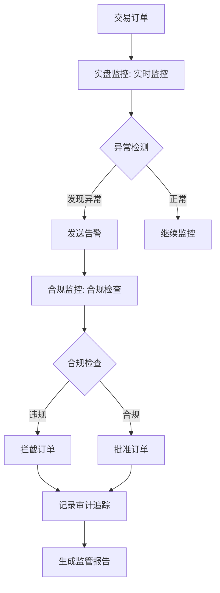

# 合规监控与实盘监控职责划分说明

> **版本**: v1.0
> **创建日期**: 2026-04-02
> **目的**: 明确合规监控模块与实盘监控模块的风险监控职责划分，避免功能重叠

---

## 一、核心定位差异

### 1.1 合规监控模块

**核心定位**: **监管合规与规则遵循**

**关注重点**:
- ✅ 监管机构要求的合规性检查
- ✅ 交易规则和限制的执行
- ✅ 监管报告的生成和提交
- ✅ 审计追踪和合规记录

**时间维度**: **事前检查 + 事后审计**

**典型场景**:
- 📋 检查交易是否符合监管要求
- 📋 验证持仓是否超过限额
- 📋 生成监管机构要求的报告
- 📋 记录所有合规检查过程

---

### 1.2 实盘监控模块

**核心定位**: **交易行为与市场风险**

**关注重点**:
- ✅ 实时交易行为的监控
- ✅ 市场风险的识别和预警
- ✅ 异常交易模式的检测
- ✅ 系统性能的监控

**时间维度**: **实时监控 + 即时响应**

**典型场景**:
- 📋 实时监控交易频率和成交量
- 📋 检测异常交易模式
- 📋 监控持仓风险敞口
- 📋 预警系统性能问题

---

## 二、职责边界详细划分

### 2.1 风险监控职责对比表

| 监控维度 | 合规监控模块 | 实盘监控模块 | 协作关系 |
|---------|-------------|-------------|----------|
| **交易量监控** | 检查是否超过监管限额 | 监控交易量异常波动 | 合规检查限额，实盘监控异常 |
| **持仓监控** | 检查是否超过持仓限额 | 监控持仓风险敞口 | 合规检查限额，实盘监控风险 |
| **价格监控** | 检查是否在涨跌停板内 | 检测价格异常波动 | 合规检查规则，实盘监控异常 |
| **频率监控** | 检查是否符合交易时间规定 | 检测高频交易异常 | 合规检查时间，实盘监控频率 |
| **报告生成** | 生成监管报告 | 生成交易报告 | 各自生成不同类型报告 |

---

### 2.2 具体职责划分

#### 合规监控模块职责

**1. 交易合规检查**
- ✅ 检查交易量是否超过监管限额
- ✅ 检查交易价格是否在涨跌停板内
- ✅ 检查交易时间是否符合规定
- ✅ 检查股票是否在黑名单中
- ✅ 检查交易对手是否符合要求

**2. 风控合规检查**
- ✅ 检查持仓是否超过限额
- ✅ 检查损失是否超过限额
- ✅ 检查VaR是否超过限额
- ✅ 检查杠杆率是否符合要求

**3. 监管报告生成**
- ✅ 生成日报、周报、月报
- ✅ 生成监管机构要求的专项报告
- ✅ 生成合规检查统计报告

**4. 审计追踪**
- ✅ 记录所有合规检查过程
- ✅ 记录所有违规事件
- ✅ 记录所有监管报告生成过程

**5. 违规预警**
- ✅ 发现违规立即拦截
- ✅ 发送合规预警通知
- ✅ 记录违规处理过程

---

#### 实盘监控模块职责

**1. 实时交易监控**
- ✅ 监控订单频率是否异常
- ✅ 监控交易量是否异常
- ✅ 监控成交金额是否异常
- ✅ 监控交易行为模式

**2. 持仓风险监控**
- ✅ 监控持仓市值变化
- ✅ 监控未实现盈亏变化
- ✅ 监控风险敞口变化
- ✅ 监控VaR值变化

**3. 异常交易检测**
- ✅ 检测大额订单异常
- ✅ 检测高频交易异常
- ✅ 检测价格偏离异常
- ✅ 检测成交量偏离异常

**4. 系统性能监控**
- ✅ 监控系统延迟
- ✅ 监控系统吞吐量
- ✅ 监控系统资源使用
- ✅ 监控系统稳定性

**5. 多渠道告警**
- ✅ 系统内告警
- ✅ 邮件告警
- ✅ 短信告警
- ✅ 即时通讯告警

---

## 三、协作关系说明

### 3.1 数据共享

**合规监控 → 实盘监控**:
- 提供合规检查结果（pass/fail）
- 提供违规事件记录
- 提供监管报告内容

**实盘监控 → 合规监控**:
- 提供实时交易数据
- 提供持仓风险数据
- 提供异常交易记录

### 3.2 工作流程协作



### 3.3 告警分级协作

| 告警级别 | 触发条件 | 处理模块 | 处理方式 |
|---------|---------|---------|----------|
| **P0 - 阻断** | 违反监管规定 | 合规监控 | 立即拦截，发送告警 |
| **P1 - 高危** | 接近监管限额 | 合规监控 | 发送预警，建议调整 |
| **P2 - 中危** | 异常交易模式 | 实盘监控 | 发送告警，人工确认 |
| **P3 - 低危** | 轻微异常 | 实盘监控 | 记录日志，持续监控 |

---

## 四、典型场景对比

### 4.1 交易量超限场景

**合规监控处理**:
```
场景: 单笔交易量150000股，超过限额100000股
处理流程:
1. 检查交易量 → 发现超限
2. 记录违规项: {"type": "volume_limit_exceeded", "details": "150000 > 100000"}
3. 拦截订单 → action_taken: "blocked"
4. 发送告警 → 通知相关人员
5. 记录审计追踪
```

**实盘监控处理**:
```
场景: 1小时内交易量600000股，超过阈值500000股
处理流程:
1. 监控交易量 → 发现异常
2. 记录异常: {"type": "high_volume", "severity": "high"}
3. 发送告警 → 通知相关人员
4. 持续监控 → 观察后续交易行为
```

**区别**:
- 合规监控: 检查是否超过**监管限额**（硬性规则）
- 实盘监控: 检查是否出现**异常波动**（行为模式）

---

### 4.2 持仓风险场景

**合规监控处理**:
```
场景: 持仓市值1050000元，超过限额1000000元
处理流程:
1. 检查持仓限额 → 发现超限
2. 记录违规项: {"type": "position_limit_exceeded", "details": "1050000 > 1000000"}
3. 标记状态: "breach"
4. 发送告警 → 通知相关人员
5. 建议减仓
```

**实盘监控处理**:
```
场景: 持仓风险敞口从0.05突然上升到0.15
处理流程:
1. 监控风险敞口 → 发现异常上升
2. 记录异常: {"type": "risk_exposure_spike", "severity": "high"}
3. 发送告警 → 通知相关人员
4. 分析原因 → 市场波动还是持仓变化
5. 建议调整策略
```

**区别**:
- 合规监控: 检查是否超过**风险限额**（静态阈值）
- 实盘监控: 检查是否出现**风险变化**（动态监控）

---

### 4.3 异常交易场景

**合规监控处理**:
```
场景: 交易价格偏离涨跌停板
处理流程:
1. 检查价格范围 → 发现偏离
2. 记录违规项: {"type": "price_out_of_range", "details": "价格超出涨跌停板"}
3. 拦截订单 → action_taken: "blocked"
4. 发送告警
5. 记录审计追踪
```

**实盘监控处理**:
```
场景: 订单频率突然从20次/分钟上升到80次/分钟
处理流程:
1. 监控订单频率 → 发现异常上升
2. 记录异常: {"type": "high_frequency", "severity": "medium"}
3. 发送告警 → 通知相关人员
4. 分析原因 → 策略调整还是系统异常
5. 持续监控
```

**区别**:
- 合规监控: 检查是否违反**交易规则**（硬性约束）
- 实盘监控: 检查是否出现**行为异常**（模式识别）

---

## 五、实施建议

### 5.1 系统集成建议

**数据层集成**:
- 共享数据库，但使用不同的表
- 合规监控使用: compliance_checks, risk_limits, regulatory_reports
- 实盘监控使用: realtime_monitoring, position_risk, anomaly_alerts

**接口层集成**:
- 合规监控提供接口: check_trading_compliance, check_risk_compliance
- 实盘监控提供接口: monitor_realtime_trading, detect_anomaly

**告警层集成**:
- 统一告警渠道: 系统内、邮件、短信
- 分级告警机制: P0-P3四级告警

### 5.2 运维建议

**监控看板**:
- 合规监控看板: 显示合规检查结果、违规统计、监管报告
- 实盘监控看板: 显示实时交易、持仓风险、异常告警

**日志管理**:
- 合规监控日志: 记录所有合规检查和审计追踪
- 实盘监控日志: 记录所有监控数据和异常事件

**性能优化**:
- 合规监控: 优化规则引擎性能，使用缓存
- 实盘监控: 优化实时数据处理，使用流式计算

---

## 六、总结

### 6.1 核心区别

| 维度 | 合规监控 | 实盘监控 |
|------|---------|---------|
| **核心定位** | 监管合规与规则遵循 | 交易行为与市场风险 |
| **关注重点** | 监管要求、规则限制 | 行为模式、风险变化 |
| **时间维度** | 事前检查 + 事后审计 | 实时监控 + 即时响应 |
| **处理方式** | 硬性规则、拦截违规 | 模式识别、预警异常 |
| **报告类型** | 监管报告、审计报告 | 交易报告、风险报告 |

### 6.2 协作原则

1. **职责清晰**: 各自负责不同维度的监控，避免功能重叠
2. **数据共享**: 共享必要的数据，提高监控效率
3. **告警分级**: 统一告警渠道，分级处理
4. **协同工作**: 在关键节点协作，共同保障交易安全

---

**版本**: v1.0 | **更新**: 2026-04-02 | **状态**: ✅ 活跃
