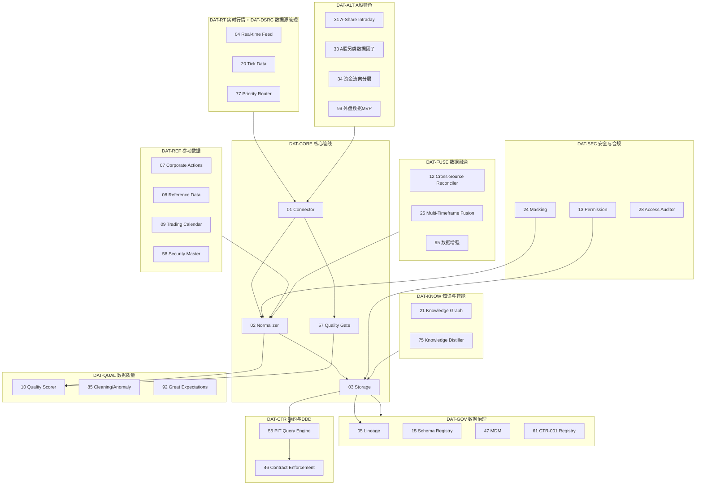

# 02 — D-DATA 数据域

> **状态**: DRAFT | **核心层**: L00 数据接入 | **成熟度**: L2 🟡 骨架
> **一句话**: 把市场数据接进来

## §0 域定义

| 维度 | 内容 |
|------|------|
| 核心Aggregate | AGG-003 NormalizedMarketData |
| 核心事件 | E-DT-01 DataQualityDegraded / E-DT-02 DataGapDetected / E-DT-03 DataSchemaChanged |
| 开发状态 | 骨架——基础ABC+默认实现，缺子模块 |
| 优先级 | P0（核心价值链起点） |
| 激活前提 | D-AUTONOMY 就绪 |

## §1 子模块清单

### 主观交易经验→量化框架转化

| 原模块 | 原主观概念 | 量化框架转化 | 转化方式 |
|--------|-----------|-------------|---------|
| D-DATA-33 | 游资席位追踪 | 异常交易行为因子 | 统计方法识别异常交易模式→IC验证→因子入库 |
| D-DATA-34 | 主力资金四线(机构/主力/大户/散户) | 资金流向分层分析 | 按订单量统计分布分层，替代主观分类 |
| D-DATA-36 | 政策主线/热点概念/卡脖子技术 | 政策事件因子库 | NLP提取+统计验证，替代主观热点判断 |
| D-DATA-37 | 题材 | 概念因子映射引擎 | 统计验证的概念-股票映射，替代主观题材分类 |
| D-DATA-39 | 辅助判断 | 高频信号增强器 | 多频率统计信号融合，替代人工辅助判断 |
| D-DATA-52 | 舆情挖掘+直播录制 | 文本情感因子提取器 | NLP情感分析→IC测试→因子入库 |
| D-DATA-71 | 交易思维/画图标注 | 交易决策标注数据集 | 标注数据用于监督学习训练 |
| D-DATA-86 | 题材概念行业板块 | 板块因子数据管理器 | 板块数据→统计因子，替代主观题材分类 |
| D-DATA-89 | 龙虎榜 | 异常交易披露数据采集器 | 监管披露数据→统计因子 |
| D-ALT-DATA-20 | 五类资金追踪(国家队/机构/游资/北向/散户) | 资金流向分层分析器 | 按订单量统计分布分层，替代主观主力/散户分类 |
| D-ALT-DATA-21 | 窗口指导/预期管理/信息优势交易 | 政策预期量化因子 | NLP提取政策信号→IC验证→因子入库 |
| D-ALT-DATA-22 | 事件征兆/事件连锁/隔夜外盘影响 | 事件因果推理因子 | 统计因果检验→IC验证→因子入库 |
| D-ALT-DATA-11 | LLM市场解读(主观) | LLM市场结构化提取器 | LLM提取→事实校验→结构化因子 |

### 子模块清单

建设状态：✅=可建设 | 🚧=受限（门禁条件见"门禁"列）

| ID | 名称 | 职责 | 优先级 | 建设 | 门禁 | 对标 | 合并自 |
|----|------|------|:------:|:----:|------|------|--------|
| **DAT-CORE 核心管线** | | | | | | | |
| 01 | Connector | 连接外部数据源+智能调度(时间窗口/优先级队列/分时段任务/重试)+限流适配(iFind QPS分时段:盘前15/集合竞价5/盘中8/盘后15/夜间10)+星级评分+数据源认证(API Key+请求签名)+格式校验+PIT一致性检查+另类数据接入审批(HB-SEC-06)；产出RawMarketData | P0 | ✅ | — | AkShare/BaoStock/Qlib | 67,82,84,95,114,121,38 |
| 02 | Normalizer | 数据标准化+字段映射(四级递进精确→子串→difflib→token)+数值解析(亿/万/百分比)+清洗规则DSL+转换验证+术语标准化(口语→标准术语如"五天线"→"MA5")+去重(精确/近似SimHash/跨源)+去噪(口语填充词/重复语句)+说话人分离；产出CTR-001 | P0 | ✅ | — | Qlib RobustZScoreNorm | 35,41,42,43,26,120,60 |
| 03 | Storage | 冷热分层存储(热:Redis<10ms/温:DuckDB+Parquet<1s/冷:归档Parquet<30s)+缓存(LRU/LFU/TTL)+分区(日线按年/分钟按月)+备份(治理实时/行情批量)+性能监控+容量预警+SLA监控+元数据(zalpha_market_data.db)+Event Store(Parquet追加写入+幂等+CQRS读端DuckDB视图+日快照+5分钟增量快照)+Feature Store(离线Parquet+在线Redis HSET+Registry SQLite四维索引)+UFL确定性事实层(is_deterministic=True追加式不可修改)+D→E盘双副本(实时AOF/每小时Parquet/每小时模型)+RTO/RPO分级(L1<5min/≤1s~L6<240min/≤24h)+数据恢复流程(Redis≤1s/Parquet≤1h/D盘全故障≤4h)+WAL Checkpoint监控；产出CTR-001查询接口 | P0 | ✅ | — | DuckDB/Parquet | 48,50,51,56,63,64,65,75,90,106,107,109,119,125 |
| 06 | PIT Manager | Point-in-Time正确性保证：PIT三条公理(因子值时间不可逆/财务数据公告日约束/幸存者偏差修正)+Embargo期(财务5交易日/业绩预告3日/限售解禁1日/指数成分5日)+双时态建模(Parquet增加system_time列)+NTP时钟同步(≤1ms精度/MiFID II RTS 25)+PIT校验规则(因子时间戳/财务公告日/幸存者偏差/Embargo/跨平面一致性)+PIT验证测试框架(CI/CD偏差>1%告警/>5%阻断)+PIT股票池必须包含退市/ST股 | P0 | ✅ | — | DuckDB AS OF JOIN | — |
| 57 | Quality Gate | Quality Gate贯穿Connector→Normalizer→Storage全流程；L1格式→L2逻辑→L3统计→L4血缘四级检查+数据写入时治理检查(关键路径≤1ms/非关键≤10ms/默认阻断)+数据源污染防护(异常值隔离+iFind交叉验证)+架构不变量验证(SSOT/PIT正确性)+数据投毒防护(四维校验+专项检测预留) | P0 | ✅ | — | — | — |
| **DAT-RT 实时行情** | | | | | | | |
| 04 | Real-time Feed Manager | 实时行情推送管理：Kafka/Flink管道+事件时间对齐+水位线+滑动窗口聚合+订阅管理(QoS/断点续传) | P0 | 🚧 | Kafka/Flink基础设施部署(4核8Gx3)+AUM>500万 | Bloomberg/Wind实时架构 | 29 |
| 20 | Tick Data Manager | Tick数据存储(列存+Delta编码)+聚合(1min/5min/日K)+复权Tick+回放引擎 | P0 | 🚧 | Level-2逐笔数据源采购(年费$10K+)+AUM>500万+TSDB部署 | Gorilla压缩 | — |
| 31 | A-Share Intraday Data | A股分时数据：板块/题材/个股/大盘分时(价格/成交量/成交额/大单) | P0 | ✅ | — | A股分时 | — |
| 32 | A-Share Auction Data | A股集合竞价数据：竞价快照(9:15-9:25/14:57-15:00)+竞价量价+竞价委托+竞价匹配 | P0 | ✅ | — | A股竞价 | — |
| 34 | 资金流向分层分析器 | Level-2行情+大单追踪+订单簿行为(撤单率/冰山订单检测)+资金流向统计分层(按订单量分布替代主观主力/散户分类)+五类资金追踪(北向/融资融券/大宗交易/龙虎榜/主力资金) | P0 | 🚧 | Level-2数据源许可 | 订单流分析 | 原:Order Flow Data Manager |
| 18 | Data Subscription Manager | 订阅注册/取消+QoS等级+推送调度+断点续传+订阅者健康监控 | P1 | ✅ | — | Pub/Sub | — |
| 19 | Microstructure Analyzer | 订单簿重建+买卖价差分解+成交量剖面+市场冲击模型+Kyle Lambda+Amihud非流动性 | P2 | 🚧 | Level-2逐笔数据源 | O'Hara/Stoll | — |
| **DAT-ALT A股特色** | | | | | | | |
| 33 | A股另类数据因子管理器 | 龙虎榜(营业部买卖明细→异常交易行为因子)+融资融券(余额/买入额)+券商目标价+大宗交易(折溢价率)+限售解禁 | P0 | ✅ | — | A股另类数据 | 89 |
| 36 | 政策事件因子库 | 产业链关键词(AI→算力→光模块等)+政策事件因子(新质生产力/数字经济等)+技术卡脖子因子(芯片/光刻机等)+热度追踪+政策预期量化(窗口指导检测+预期管理协同+信息优势交易检测)；NLP提取+IC验证→因子入库 | P1 | ✅ | — | 产业经济学 | 原:Industry Chain Keyword KB |
| 37 | 概念因子映射引擎 | Excel→解析分号分隔概念字段→构建股票↔概念映射字典+逆向索引+质量校验；统计验证的概念-股票映射替代主观题材分类 | P1 | ✅ | — | ETL | 原:Theme-Stock Excel Importer |
| 39 | 高频信号增强器 | 5分钟K线滞后时用1分钟K线增强趋势转折信号+1min/5min融合分析+转折点确认；多频率统计信号融合替代人工辅助判断 | P2 | ✅ | — | 多时间框架 | 原:1-Min K-Line Auxiliary Judge |
| 86 | 板块因子数据管理器 | 题材/概念/行业/同花顺板块分钟线+日线+成分股+板块轮动；板块数据→统计因子替代主观题材分类 | P1 | ✅ | — | 板块数据 | 原:Thematic Concept Board Data Manager |
| 87 | Macro Data Manager | 中国宏观成绩单+全球宏观景气衰退+工业制造业+宏观数据标准化+定时自动采集+GDP/CPI/PMI/利率/汇率+多源采集+频率对齐+预测值管理 | P1 | ✅ | — | 宏观数据 | 115 |
| 99 | 外盘数据适配器(MVP) | AkShare获取隔夜外盘数据+全球市场传导量化(隔夜传导系数β+传导衰减+波动率传导)；MVP替代D-CROSS-ASSET域(原域门禁:AUM≥500万+多市场交易权限+第二位开发人员) | P1 | ✅ | — | AkShare | 原:D-CROSS-ASSET-01降级 |
| **DAT-DSRC 数据源管理** | | | | | | | |
| 77 | Multi-Source Priority Router | AkShare+Tushare+Wind+聚宽多源优先级路由+健康监控+自动切换+成本控制+API密钥管理+星级评分+三源投票仲裁(6种场景)+故障检测(心跳3秒+连续3次失败)+自动切换+恢复试探(30秒)+降级容量预算(备源QPS容量预计算)+Data Vendor SLA监控(QPS/延迟/可用率) | P0 | 🚧 | Tushare token/Wind license获取 | FinOps | 78,100,103,104,105 |
| 96 | Sina+Tencent Real-Time | 新浪财经+腾讯财经免费实时行情API | P1 | 🚧 | API稳定性验证+数据使用合规审批 | 免费API | — |
| 98 | yfinance Adapter | yfinance雅虎财经历史行情+基本面数据 | P2 | 🚧 | 网络访问合规+API可用性验证 | yfinance | — |
| 14 | Data Cost Tracker | 数据成本追踪：用量计量+成本分摊+预算管控+ROI分析+供应商账单对账+另类数据采购成本优化(按需订阅+QPS分配) | P1 | ✅ | — | FinOps | — |
| **DAT-QUAL 数据质量** | | | | | | | |
| 10 | Data Quality Scorer | 6维质量评分(完整性/准确性/一致性/时效性/唯一性/有效性)+异常检测(Isolation Forest/Z-score/DBSCAN/LOF/Bayesian变点)+根因定位+告警+追踪+补全+下载校验+质量流水线+信号质量历史存储+BCBS 239数据聚合原则(准确性/完整性/时效性/适应性/独立性)+质量SLA分级(P0关键99.99%/P1重要99.9%/P2背景99%)+质量SLA违约预测+数据漂移检测(KS检验p<0.01/Wasserstein距离/PELT变点)+自动化质量检查流水线(盘前08:00/盘中实时/盘后15:00)+违约处理闭环(检测→告警→降级→修复→验证)+质量记分卡+数据质量降级4级模式(正常→延迟→日频→停摆)+自动恢复(L1→L0连续5分钟正常/L2→L1主源恢复/L3→L2需人工确认) | P1 | ✅ | — | Great Expectations/BCBS 239 | 101,110,111,112,113,116,117,126 |
| 85 | Cleaning & Anomaly Engine | 自动化数据清洗+异常检测+标记+自动修复+人工审核 | P1 | ✅ | — | 数据清洗 | — |
| 92 | Great Expectations Governance | Great Expectations自动化数据质量检查+修复+验证+质量闭环+可执行数据契约执行层 | P1 | ✅ | — | Great Expectations | — |
| 93 | Multi-Source Cross Validator | 多源数据交叉验证+数据比对算法+同步冲突检测与解决+品种差异化阈值(A股0.1%/可转债0.5%/期权2.0%)+风险数据双源校验(因子计算偏差率<0.1%) | P1 | ✅ | — | 交叉验证 | 118 |
| **DAT-GOV 数据治理** | | | | | | | |
| 05 | Data Lineage Tracker | 血缘DAG构建+列级溯源+变换算子注册+版本快照关联+影响分析引擎+CTR-TRACE-001自动追踪(1500模块)+注入/采集/查询+血缘图可视化+断裂检测+OpenLineage标准对接+列级血缘(SQL AST解析器)+AI治理血缘(feature_version→model_version→prediction→action)+内容指纹(SHA-256)+血缘运行时发现+血缘变更检测 | P1 | ✅ | — | OpenLineage/DataHub | 45,59,102 |
| 11 | Data Version Manager | 版本快照(时间戳+哈希)+分支/标签+增量Delta存储+版本回滚+PIT版本绑定+数据模型版本演进+迁移脚本+向后兼容检查+知识版本管理(Git-like变更diff+回退生效指针) | P1 | ✅ | — | DVC/LakeFS | 99 |
| 15 | Data Schema Registry | Schema注册/验证/演化+兼容性检查(Forward/Backward/Full)+序列化格式(Avro/Protobuf/JSON Schema)+字典版本控制+字段Schema版本管理+迁移+事件Schema版本化(v1→v2消费者按版本号订阅) | P1 | ✅ | — | Confluent Schema Registry | 30,122 |
| 47 | Metadata Registry MDM | 1500模块元数据注册(数据源/血缘/质量)+Security Master/Calendar/CorporateAction+THS指标定义(943个)+指标数据源映射+元数据版本+查询接口 | P1 | ✅ | — | DataHub/Apache Atlas | 127,128 |
| 61 | CTR-001 Contract Registry | 全系统唯一数据契约注册中心：契约定义/版本/消费者/生产者+契约查询/变更通知/兼容性检查 | P1 | ✅ | — | — | — |
| 17 | Data Catalog | 元数据索引(技术/业务/操作)+搜索引擎(Elasticsearch)+标签/分类体系+血缘可视化+使用统计 | P0 | ✅ | — | DataHub/Apache Atlas | — |
| **DAT-REF 参考数据** | | | | | | | |
| 07 | Corporate Actions Processor | 公司行为处理(分红/拆股/配股/合并/要约收购)+复权计算(前复权/后复权/点对点复权)+公司行为日历+影响分析+HSTR Snapshot+Delta PIT模式(年报Snapshot+季报Snapshot+公告Delta+AS OF JOIN合并)+Qlib PIT Revision Chain参考(revision_seq字段) | P1 | ✅ | — | 专业标配 | 49,97 |
| 08 | Reference Data Manager | 参考数据管理：标的主库+分类树(GICS/申万)+多源ID映射+变更事件发布 | P1 | ✅ | — | GICS/MDM | — |
| 09 | Trading Calendar Manager | 多市场日历引擎+交易日/结算日/交割日计算+特殊安排(半日/临时休市)+跨市场对齐+财报披露窗口期+业绩预告截止日+长假休市安排 | P1 | ✅ | — | exchange_calendars | — |
| 58 | Security Master Manager | MDM归Storage子模块管理+证券主数据/证券标识映射/证券生命周期+主数据版本管理 | P1 | ✅ | — | Security Master | — |
| 80 | Financial Data Parser | 财务数据quarterly/annual解析+财务指标计算+财务比率+财务健康度 | P1 | ✅ | — | 财务分析 | — |
| **DAT-SEC 安全与合规** | | | | | | | |
| 13 | Data Permission Manager | RBAC/ABAC权限策略+4级数据分类(L0公开/L1内部/L2机密/L3绝密)+动态脱敏+访问审计日志+数据降级规则(L3→L2部分脱敏/L3→L1完全脱敏/L2→L1标准脱敏)+DLP数据防泄漏(出站内容检查+敏感模式检测正则+ML)+AI Agent专用DLP(5通道:LLM请求/响应/MCP调用/Agent委派/记忆操作)+B-011数据不外传(禁止AI将持仓/交易/策略发送到外部API)+B-012禁止AI自动订阅付费数据源+数据分级访问规则(每级对Trader/Admin/AI/System的读/写权限矩阵)+数据访问异常检测(非交易时段/异常频率/异常范围) | P0 | ✅ | — | RBAC/ABAC | — |
| 24 | Data Masking Engine | 静态/动态脱敏+格式保留加密(FPE)+差分隐私噪声注入(epsilon=1.0)+脱敏策略路由+数值差分隐私加噪/范围化+文本NER替换+时间偏移+标识哈希替换 | P3 | ✅ | — | K-匿名/差分隐私 | — |
| 16 | Data Retention Manager | 保留策略引擎(按类型/法规/业务)+自动归档/删除调度+法律保留覆盖+生命周期管理+过期自动清理 | P1 | ✅ | — | GDPR/SEC 17a-4 | 27,108 |
| 28 | Data Access Auditor | 细粒度访问日志+查询模式分析+异常访问检测+敏感数据追踪+合规报告+数据成本追踪(用量计量/成本分摊/ROI)+审计链(L1:SHA-256哈希链事件完整性+L2:Merkle树集合完整性每日/周/月批量证明)+5类日志分级存储(交易≥7年/决策≥3年/合规≥7年/模型≥5年/系统≥1年)+决策溯源9字段标准(decision_id/timestamp/input_hash/model_version/feature_attribution/confidence/human_approval/prev_hash/compliance_check)+模型注册表不可变存储(model_id/version/code_hash/param_hash/training_data_hash/approval_ts/active/performance) | P1 | ✅ | — | 审计理论/MiFID II | 14 |
| **DAT-KNOW 知识与智能** | | | | | | | |
| 21 | Financial Knowledge Graph | 实体/关系抽取+SPO三元组存储+图推理引擎+产业链KG(238K实体+551K关系)+政策→新闻→产业链→个股因果推理链+GCN图传播+GraphRAG图增强检索(KG引导准确率+24%/token消耗-84.5%)+KG引导多跳推理(比纯文本检索正确率+24%)+Causal KG因果方向标注(A→B/A←B/A↔B)+Dynamic KG动态知识图谱(时间有效性标注+增量更新)+时序KG预测(边增加时间维度)+风险传播建模(NetworkX级联传播)+关联方识别(高管关系/股权穿透/共管账户)+法规知识图谱(法规-条文-合规义务-控制措施)+合规证据图(Neo4j DAG+密码学证据包)+知识Write Guard(写保护+审批+审计)+知识快照回滚(快照+回滚+差异对比) | P1 | 🚧 | 大规模实体关系数据集(238K+实体)构建完成 | Neo4j/FIBO | 53 |
| 52 | 文本情感因子提取器 | 多数据源NLP情感分析(finBERT+vaderSentiment双引擎)+情感评分→IC测试→因子入库+舆情热度追踪；替代主观舆情判断 | P2 | 🚧 | 网络爬虫合规审批通过 | NLP情感分析 | 原:Auto Web Sentiment Miner |
| 68 | Local File Auto-Parser | 本地文件自动解析+格式识别+内容提取+知识结构化 | P2 | ✅ | — | 文件解析 | — |
| 69 | Web Data Crawler | 网络数据智能爬取+反反爬+数据清洗+质量校验+爬虫调度管理 | P1 | 🚧 | 网络爬虫合规审批通过 | 爬虫/反反爬 | 83 |
| 72 | Research Report Collector | 研究报告+新闻事件+宏观经济数据采集+NLP提取+事件标注+Filing NLP Engine(公告文本结构化提取:标题/摘要/关键数据/事件类型) | P1 | ✅ | — | NLP/事件提取 | — |
| 73 | Training Dataset Manager | 多源训练数据集管理+数据版本+血缘+质量+分割+知识去重合并+训练数据质量检查(标签分布/缺失率/异常值/特征漂移)+数据增强(SMOTE+噪声+时间窗口滑动)+分层采样+训练数据指纹(SHA-256)+训练数据偏差评估(EU AI Act Art.10) | P1 | ✅ | — | 数据集管理 | 129 |
| 74 | AI Auto Feature Discoverer | AI自动特征发现+特征评估+特征选择 | P1 | ✅ | — | 特征工程 | — |
| 71 | 交易决策标注数据集 | 用户交易决策标注+画图标注+反馈数据采集+存储+标注；标注数据用于监督学习训练，替代记录主观交易思维 | P2 | 🚧 | 交互UI系统就绪(D-UI域) | 用户数据采集 | 原:User Interaction Data Collector |
| 75 | Knowledge Distiller | 从代码/日志/蓝图等非结构化源提取结构化知识+LLM+规则混合提取+研究结论自动沉淀(实验结果+研究笔记→结构化知识自动归档) | P2 | ✅ | — | 知识提取 | — |
| **DAT-FUSE 数据融合** | | | | | | | |
| 12 | Cross-Source Reconciler | 多源数据对齐+差异检测+冲突解决+对账报告+多源自动融合验证+一致性校验+独立风险数据接入管道(BCBS 239独立性原则) | P1 | ✅ | — | 对账理论 | 70 |
| 25 | Multi-Timeframe Fusion | 跨频率数据对齐(分钟/日/周/月/季/年)+时间戳统一+前向填充+频率转换+融合质量评分+多频率聚合(1m/5m/15m/30m/1h/1d)+频率自动对齐 | P1 | ✅ | — | MIDAS回归 | 79,123 |
| 91 | Incremental Update Engine | 仅更新变化的数据+变更检测+增量同步+数据一致性校验+增量因子计算(incremental_compute()滑动窗口避免全量重算) | P1 | ✅ | — | 增量更新 | — |
| 88 | Pre/Post Market Pipeline | 盘前准备+交易时段+盘后处理3时段流水线编排+时间触发+隔夜外盘影响处理 | P1 | ✅ | — | 流水线编排 | — |
| 23 | Data Observability Engine | 数据新鲜度监控+Schema漂移检测+流量异常检测+端到端延迟追踪+自动根因关联+SLA仪表盘+新鲜度检查点(CP-01~CP-07七个检查点+延迟预算+超限动作) | P0 | ✅ | — | Monte Carlo/Datadog | — |
| 94 | Airflow Pipeline | Airflow工作流+自动化数据采集/处理/验证/存储+DAG定义 | P1 | 🚧 | Airflow基础设施部署 | Airflow/DAG | — |
| 95 | 金融时序数据增强 | 轻量增强(时间扭曲/幅度缩放/切片混合/Jittering/Permutation)+GAN/VAE增强(TimeGAN/RTSGAN)+FWT检索增强扩散(港科大2025)+GBM-Diffusion(乘性噪声替代加性)+生成数据质量管理(KS test/增强比例≤30%/synthetic=True标注) | P2 | ✅ | — | TimeGAN/FWT | — |
| **DAT-CTR 契约与DDD** | | | | | | | |
| 46 | Contract Enforcement | CTR-001契约强制执行+契约变更检测+兼容性检查+版本管理 | P1 | ✅ | — | — | — |
| 54 | Pydantic V2 Code Generator | YAML→Pydantic V2 frozen dataclass代码生成+类型强制/序列化/零运行时开销 | P1 | ✅ | — | Pydantic V2 | — |
| 55 | PIT Query Engine | DuckDB AS OF JOIN PIT查询+防幸存者偏差+查询性能优化+结果缓存+三平面统一(训练Offline Store+回测Event Store+推理Online Store一致性保证) | P1 | ✅ | — | DuckDB AS OF JOIN | — |
| 62 | Data Isolation Manager | zalpha_metadata.db治理数据与zalpha_market_data.db行情元数据隔离+隔离规则/校验/跨库查询协调 | P1 | ✅ | — | — | — |
| 66 | Financial Instrument Contract Library | contracts/ Instrument+Money+Timestamp等金融工具共享契约定义+契约字段/校验/版本 | P1 | ✅ | — | — | — |
| 81 | Unified Data Portal | 统一界面访问所有数据+SQL查询+面向对象API+Jupyter集成 | P1 | ✅ | — | SQL/OOP API | — |
| 76 | ClickHouse Analyzer | ClickHouse时序数据存储+高性能查询+列式存储+数据压缩 | P2 | 🚧 | ClickHouse基础设施部署(AUM>200万) | ClickHouse | — |
| 124 | Vector DB Switch Manager | Chroma→FAISS/Milvus迁移策略+数据迁移+兼容性适配 | P1 | 🚧 | 向量数据库迁移需求明确 | FAISS/Milvus | — |
| 130~136 | DDD聚合根与生命周期 | 聚合根(MarketData/Instrument)生命周期管理+仓储接口+值对象(Bar/OHLCV/FinancialReport)+恢复演练验证+跨域保留归档策略协调+仿真回测数据生命周期+风控审计数据归档 | P2 | ✅ | — | DDD | — |
| 44 | VaR Compute Data Prefetcher | VaR计算时DuckDB读Parquet预取历史收益数据+预取缓冲区管理+预取策略(顺序/按需/全量缓存)+I/O瓶颈监控+预取命中率追踪 | P2 | ✅ | — | 数据预取/I/O优化 | — |

### C轨L00层子模块映射

| C轨子模块 | 对应D-DATA子模块 | 说明 |
|-----------|-----------------|------|
| l00-connectors | 01 Connector | 数据源连接与抓取 |
| l00-normalizers | 02 Normalizer | 数据标准化清洗 |
| l00-storage | 03 Storage | 数据存储与Feature Store |
| l00-cache | 03 Storage(热缓存) | 内存DataFrame缓存层 |
| l00-quality | 10 Data Quality Scorer | 数据质量评分与门控 |
| l00-connectors-default | 01 Connector(AkShare默认实现) | 默认数据源Provider |

### 子模块架构图

```
D-DATA 数据域子模块架构

┌──────────────────────────────────────────────────┐
│ 01: Connector（连接器）                            │
│ 职责：连接外部数据源，拉原始数据                    │
│ 实现：DataSourceBase ABC + 各 Provider             │
│ 产出：RawMarketData（原始格式，不保证标准化）       │
├──────────────────────────────────────────────────┤
│ 02: Normalizer（标准化器）                         │
│ 职责：原始数据 → CTR-001 NormalizedMarketData      │
│ 实现：NormalizerBase ABC + 各 Normalizer           │
│ 关键：CTR-001 Python dataclass 在这里生成          │
│ 产出：CTR-001（frozen，全系统唯一数据契约）         │
├──────────────────────────────────────────────────┤
│ 03: Storage（存储服务）                            │
│ 职责：冷热分层 + PIT 查询 + 缓存 + MDM            │
│ 实现：                                            │
│   热层：Redis（盘中Tick/实时因子/交易信号）          │
│   温层：DuckDB + Parquet（日线/因子/基本面）        │
│   冷层：归档 Parquet（历史归档/审计日志/模型版本）  │
│   Event Store：Parquet追加写入+CQRS读端DuckDB视图  │
│   Feature Store：离线Parquet+在线Redis+Registry    │
│   UFL：确定性事实层(is_deterministic=True追加式)    │
│   PIT：DuckDB AS OF JOIN 实现                     │
│   元数据：SQLite（zalpha_market_data.db）           │
│   备份：D→E盘双副本(实时AOF/每小时Parquet)         │
│ 产出：CTR-001 查询接口（给下游域用）               │
└──────────────────────────────────────────────────┘

横切：Quality Gate 贯穿 Connector→Normalizer→Storage 全流程
      数据血缘通过 CTR-TRACE-001 自动追踪
```

### 数据目录结构

```
data/
├── zalpha_metadata.db      ← 治理数据（SQLite WAL）
├── zalpha_market_data.db   ← 行情元数据（SQLite WAL）
├── market_data/            ← 行情数据文件
│   ├── daily/              ← 日线 Parquet（按年分区）
│   ├── intraday/           ← 分钟线 Parquet（按月分区）
│   └── cache/              ← 热数据内存映射
├── events/                 ← Event Store（Parquet追加写入）
├── features/               ← Feature Store（离线Parquet+Registry SQLite）
└── shard_00/               ← 现有分片
E:/backup/                  ← E盘双副本备份
├── redis/                  ← Redis AOF+RDB
├── data/parquet/           ← Parquet增量备份
├── data/models/            ← 模型文件备份
└── integration/baselines/  ← 契约基线快照
```

### 冷热分层详细设计

| 层级 | 存储 | 数据 | 访问延迟 | 淘汰策略 |
|:----:|------|------|:-------:|:-------:|
| 热 | Redis | 盘中Tick/实时因子值/交易信号/风控指标/持仓状态(~200MB) | <10ms | TTL管理 |
| 温 | DuckDB + Parquet | 日线/因子/信号历史/基本面/宏观(D:\zalpha\data\) | ~10ms | 无 |
| 冷 | 归档 Parquet（SSD） | 历史归档/事件历史/审计日志/快照历史/模型版本(E:\zalpha\archive\) | ~100ms | 无 |

**容量规划**: 热~200MB→1GB / 温~50GB→400GB / 冷~20GB→300GB

### Quality Gate 分级

| 级别 | 检查项 | 通过条件 | 不通过动作 |
|:----:|--------|---------|-----------|
| L1 格式检查 | 字段完整性/类型/null率 | null率 < 5% | 拒绝入库 |
| L2 逻辑检查 | OHLC关系/涨跌幅范围/停牌标记 | 无逻辑矛盾 | 标记可疑 + 告警 |
| L3 统计检查 | 异常值检测/分布漂移 | Z-score < 4σ | 标记异常 + 降权使用 |
| L4 血缘检查 | 数据来源可追溯 | 有 CTR-TRACE-001 | 拒绝无血缘数据 |

### Feature Store 接口（服务 D-ML）

| 接口 | 签名 | 说明 |
|------|------|------|
| get_features | `(feature_names, symbols, start, end, as_of=None) → pd.DataFrame` | ML训练和推理共享特征数据 |
| register_feature | `(feature_name, description, compute_logic_ref) → None` | 注册新特征到Feature Store |
| get_feature_lineage | `(feature_name) → list[dict]` | 查询特征血缘（从哪个因子/数据源计算） |

**PIT保证**: `as_of`参数通过DuckDB AS OF JOIN实现，防止训练-推理数据泄漏。

**特征生命周期**: PROPOSED→EXPERIMENTAL→PRODUCTION→DORMANT→REACTIVATED→DEPRECATED→RETIRED

**训练-服务一致性**: 单一定义原则+PIT正确性+版本对齐，回测Sharpe与模拟盘Sharpe偏差<15%

### 数据源扩展策略

| 优先级 | 数据源 | 类型 | 接入方式 |
|:------:|--------|------|---------|
| P0 | AkShare（已有） | A股行情 | AkshareProvider ✅ |
| P0 | 内存数据（已有） | 测试/模拟 | MemoryProvider ✅ |
| P1 | Tushare | A股行情+基本面+新闻9源 | TushareProvider（需token） |
| P1 | Wind | 机构级行情 | WindProvider（需license） |
| P1 | miniQMT | A股实时行情+交易数据 | QmtProvider（本地IPC无限频次） |
| P1 | iFind | 研究数据+国际市场(QPS=20需限流) | iFindProvider（需API Key+请求签名） |
| P1 | BaoStock | 历史K线+财务数据(回测/交叉验证) | BaoStockProvider |
| P2 | 另类数据 | 新闻/舆情/供应链 | 需按数据源定制Provider |
| P2 | 宏观数据 | CPI/PMI/利率 | MacroProvider |

**扩展模式**: 新数据源只需实现 DataSourceBase ABC → 注册到 Provider Registry → Normalizer 负责统一到 CTR-001。

**新数据源接入流程**: 评估→审批(HB-SEC-06)→开发→验证→灰度→全量

### 子域分组（136→71模块）

| 子域ID | 子域名称 | 优先级 | 子模块IDs | 职责 | 覆盖能力 |
|--------|---------|:------:|-----------|------|---------|
| DAT-CORE | 核心管线 | P0 | 01, 02, 03, 06, 57 | 数据接入→标准化→存储→PIT核心管线，产出CTR-001 | 接入+标准化+存储+PIT+质量门禁+Event Store+Feature Store+UFL |
| DAT-RT | 实时行情 | P0 | 04, 20, 31, 32, 34, 18, 19 | 实时行情接入与推送 | 实时Feed+Tick+分时+竞价+资金流向+订阅+微观结构 |
| DAT-ALT | A股特色 | P0/P1 | 33, 36, 37, 39, 86, 87, 99 | A股特色数据源管理+外盘MVP | 另类数据因子+政策事件因子+概念因子+信号增强+板块因子+宏观+外盘MVP |
| DAT-DSRC | 数据源管理 | P0 | 77, 96, 98, 14 | 多数据源路由、健康、降级、成本 | 路由+健康+切换+限流+星级评分+调度+仲裁+成本 |
| DAT-QUAL | 数据质量 | P1 | 10, 85, 92, 93 | 数据质量6维评分+异常检测+闭环 | 评分+清洗+验证+异常+补全+告警+追踪+漂移+BCBS239 |
| DAT-GOV | 数据治理 | P1 | 05, 11, 15, 17, 47, 61 | 血缘/版本/Schema/MDM/目录治理 | 血缘+版本+Schema+MDM+注册+可视化+目录+OpenLineage |
| DAT-REF | 参考数据 | P1 | 07, 08, 09, 58, 80 | 证券主数据/日历/公司行为 | 公司行为+参考数据+日历+Security Master+复权+财务+PIT Revision |
| DAT-SEC | 安全与合规 | P0/P1 | 13, 24, 16, 28 | 权限/脱敏/保留/审计/成本 | RBAC+脱敏+保留+审计+成本+DLP+审计链+哈希链+Merkle树 |
| DAT-KNOW | 知识与智能 | P1/P2 | 21, 52, 68, 69, 72, 73, 74, 71, 75 | 知识图谱/情感因子/爬虫/特征发现/知识蒸馏 | KG+情感因子+爬虫+研报+训练集+特征发现+标注数据+知识蒸馏+GraphRAG |
| DAT-FUSE | 数据融合 | P1 | 12, 25, 91, 88, 23, 94, 95 | 多源融合/频率对齐/生命周期/数据增强 | 对账+融合+聚合+增量+编排+可观测+增强 |
| DAT-CTR | 契约与DDD | P1/P2 | 44, 46, 54, 55, 62, 66, 81, 76, 124, 130~136 | 契约执行/PIT/DDD聚合根/VaR预取 | 契约+PIT+隔离+门户+聚合根+跨域生命周期+预取 |

## §2 域内依赖图



### 三计算平面映射

| 子域 | 3秒高频 | 60秒中频 | 盘后低频 |
|------|---------|---------|---------|
| DAT-CORE | Connector增量拉取 | Normalizer截面标准化 | Storage全量回算 |
| DAT-RT | ✅ 全量 | ❌ | ❌ |
| DAT-ALT | ❌ | ✅ 部分A股数据 | ✅ 全量 |
| DAT-DSRC | ✅ 实时源 | ✅ 路由切换 | ✅ 补算 |
| DAT-QUAL | ✅ L1格式检查 | ✅ L2逻辑检查 | ✅ L3统计+L4血缘 |
| DAT-GOV | ❌ | ✅ Schema变更检测 | ✅ 血缘全量追踪 |
| DAT-REF | ❌ | ✅ 公司行为更新 | ✅ 日历/主数据 |
| DAT-SEC | ✅ 权限检查 | ❌ | ✅ 审计报告 |
| DAT-KNOW | ❌ | ❌ | ✅ 全量 |
| DAT-FUSE | ❌ | ✅ 频率对齐 | ✅ 多源融合 |
| DAT-CTR | ✅ CTR-001发布 | ❌ | ✅ PIT全量验证 |

## §3 域间依赖

| 消费什么 | 来自哪个域 | 契约/事件 | 类型 |
|---------|-----------|---------|:----:|
| 权限校验 | D-AUTONOMY | CTR-TRACE-001 | H |
| 审计追踪 | D-AUTONOMY | 审计接口 | H |
| 遥测上报 | D-AUTONOMY | 遥测接口 | H |

| 产出什么 | 去往哪个域 | 契约/事件 | 类型 |
|---------|-----------|---------|:----:|
| NormalizedMarketData | D-FACTOR | CTR-001 | H |
| NormalizedMarketData | D-RISK | CTR-001 | H |
| NormalizedMarketData | D-ML | CTR-001 | H |
| NormalizedMarketData | D-REPORTING | CTR-001 | H |
| Feature Store查询 | D-ML | get_features() | S |
| DataQualityDegraded | *(all) | E-DT-01 | E |
| DataGapDetected | *(all) | E-DT-02 | E |

### CTR-001 接口定义

```python
@dataclass(frozen=True)
class NormalizedMarketData:
    symbol: str
    timestamp: datetime
    open: float
    high: float
    low: float
    close: float
    volume: float
    amount: float
    frequency: str
    source: str
    quality_score: float
    asof_ts: datetime
    trace_id: str
```

### 流水线对接

| 时段 | 流程 | 说明 |
|------|------|------|
| 03:00 隔夜数据 | DAT-DSRC→DAT-CORE | Connector批量拉取隔夜数据 |
| 09:15 盘前基线 | DAT-ALT→DAT-CORE→DAT-QUAL | 集合竞价数据→L1检查 |
| 09:30-15:00 盘中实时 | DAT-RT→DAT-CORE→DAT-QUAL→CTR-001发布 | 3秒增量→L1+L2检查→契约发布 |
| 15:00 盘后清算 | DAT-CORE→DAT-QUAL→DAT-GOV | 全量回算→L3+L4检查→血缘追踪 |
| 晚间研究 | DAT-KNOW→DAT-CTR | PIT验证 |

## §4 域事件流

| 事件ID | 事件名 | 触发条件 | 载荷 | 消费者 | 延迟要求 |
|--------|--------|---------|------|--------|---------|
| E-DT-01 | DataQualityDegraded | quality_score < 0.7 持续3个检查点 | {symbol, quality_score, dimension, threshold} | D-FACTOR, D-RISK, D-ML | <1s |
| E-DT-02 | DataGapDetected | 预期数据未到达超过30秒 | {symbol, frequency, expected_ts, gap_duration} | D-FACTOR, D-REPORTING | <500ms |
| E-DT-03 | DataSchemaChanged | Schema版本变更检测 | {schema_name, old_version, new_version, breaking_change} | D-FACTOR, D-ML | <2s |
| E-OP-01 | DataIngestionFailed | Connector连续3次拉取失败 | {source, error_type, retry_count, last_success_ts} | D-AUTONOMY | <500ms |

## §5 激活前提与就绪条件

| 级别 | 前提 | 就绪标准 | 依赖 |
|------|------|---------|------|
| P0 | D-AUTONOMY 就绪 | RBAC/审计/遥测可用 | — |
| P0 | CTR-001 可发布 | NormalizedMarketData契约实现+Pydantic V2 frozen | DAT-CORE(01+02+03) |
| P0 | 数据源至少1个可用 | AkShare/BaoStock至少1个连接成功 | DAT-DSRC(01) |
| P0 | Quality Gate L1就绪 | 格式检查+null率<5% | DAT-QUAL(10+57) |
| P1 | PIT查询可用 | DuckDB AS OF JOIN实现 | DAT-CTR(55) |
| P1 | 数据血缘可追踪 | CTR-TRACE-001注入 | DAT-GOV(05) |
| P1 | 冷热分层存储就绪 | 热/温/冷三层可读写 | DAT-CORE(03) |
| P1 | A股特色数据源就绪 | 龙虎榜/融资融券至少1个 | DAT-ALT(33) |
| P2 | 知识图谱就绪 | 产业链KG可查询 | DAT-KNOW(21) |
| P2 | 数据版本管理就绪 | Schema版本+数据版本可追踪 | DAT-GOV(11+15) |
| P2 | 多源融合就绪 | 跨源对账+频率对齐 | DAT-FUSE(12+25) |
| P2 | 合规审计就绪 | 访问审计+脱敏+保留策略 | DAT-SEC(13+24+16) |
| P2 | DDD聚合根就绪 | MarketData/Instrument聚合根实现 | DAT-CTR(130~132) |

## §6 设计决策记录

| 日期 | 决策 | 理由 | 对标来源 |
|------|------|------|---------|
| 2026-05-12 | Feature Store归03 Storage | 避免重复建设；PIT正确性由数据域保证 | Qlib Data Handler |
| 2026-05-12 | 因子预处理管线归02 Normalizer | 预处理是数据标准化的一部分 | Qlib RobustZScoreNorm; MSCI Barra Winsorize ±3std |
| 2026-05-12 | 智能下载调度器归01 Connector | 分时段调度是数据源连接的职责 | Wind/Bloomberg分时段调度 |
| 2026-05-12 | 退市/ST股票数据采集归01 Connector | 幸存者偏差修正的前置条件 | 专业标配 |
| 2026-05-12 | 核心契约：NormalizedMarketData (CTR-001) | 数据域的核心产出是标准化行情数据，全系统共享 | CTR-001 |
| 2026-05-12 | PIT正确性是数据域第一原则 | 未来函数是量化最致命的bug，PIT保证是数据域核心承诺 | DuckDB AS OF JOIN |
| 2026-05-12 | 冷热温三级存储架构 | 热(Redis<10ms)/温(SSD+Parquet<1s)/冷(HDD+Parquet<30s) | 专业标配 |
| 2026-05-12 | 多源数据交叉验证 | 同一数据多源获取→交叉比对→不一致时标记/取中值/取可信源 | 02 Normalizer扩展 |
| 2026-05-12 | 三层架构：Ingestion→Storage→Serving | 专业机构标准架构，职责清晰分层 | 专业标准 |
| 2026-05-12 | Connector和Normalizer必须分离 | 同一数据源可能换格式，同一格式可能多数据源；耦合则改一个要改另一个 | 专业标准 |
| 2026-05-12 | 行情数据与治理数据不同.db文件 | 行情写入频率压垮WAL checkpoint影响治理数据；备份策略不同 | — |
| 2026-05-12 | CTR-001实现：Pydantic V2 frozen dataclass | 类型强制+序列化+零运行时开销；项目已用Pydantic V2 | CTR-001 |
| 2026-05-12 | 行情存储格式：Parquet + DuckDB | 列式压缩10:1；DuckDB直接读Parquet零拷贝 | — |
| 2026-05-12 | 热数据缓存：polars/LazyFrame内存映射 | 64GB RAM热缓存约5000只股票3年日线(~2GB) | — |
| 2026-05-12 | 元数据注册表(MDM)管理 | 1500个模块需统一元数据注册表 | DataHub/Apache Atlas |
| 2026-05-12 | Event Store+CQRS | 写端Parquet追加+读端DuckDB视图+最终一致性；事件不可变序列支持故障恢复/审计/回测 | CQRS/Event Sourcing |
| 2026-05-12 | UFL确定性事实层 | Feature Store子集is_deterministic=True；财务/交易/宏观数据不含ML预测；追加式不可修改 | VeNRA |
| 2026-05-12 | 风险数据流独立于交易数据流(RD-03) | 独立管道避免故障传导；BCBS 239独立性原则 | BCBS 239 |
| 2026-05-26 | ADR-DAT-001: 双模式推送架构 | 3秒增量推送(盘中)+批量拉取(盘后)双模式 | 交易决策架构§13 |
| 2026-05-26 | ADR-DAT-002: 数据源自动切换 | DAT-DSRC多源路由+健康监控+自动切换+星级评分 | 数据源全景清单 |
| 2026-05-26 | ADR-DAT-003: Quality Gate四级贯穿 | L1格式→L2逻辑→L3统计→L4血缘贯穿全管线 | 交易决策架构§2 |
| 2026-05-26 | ADR-DAT-004: 治理数据与行情数据隔离 | zalpha_metadata.db vs zalpha_market_data.db | 已有决策 |
| 2026-05-26 | ADR-DAT-005: 五层筛选漏斗数据支撑 | DAT-RT支撑第一层3秒筛选，DAT-ALT支撑第二三层60秒筛选 | 交易决策架构§13 |
| 2026-05-26 | ADR-DAT-006: D-ALT-DATA MVP降级纳入D-DATA | A股另类数据(龙虎榜/融资融券/北向资金/大宗交易)纳入D-DATA域作为数据源子模块 | Agent架构LP-017 |
| 2026-05-26 | ADR-DAT-007: D-CROSS-ASSET MVP降级通过D-DATA | 隔夜外盘数据通过D-DATA域AkShare适配器获取 | Agent架构LP-018 |

## §7 合规约束(A6)

> 源自合规架构(A6)§7.1中国法规+§3.1.4 Crypto-Shredding+INV-014幸存者偏差。以下合规约束由D-DATA数据域执行，A6门禁未激活期间由A5安全架构代管。

### §7.1 中国法规——数据域执行条款

| 法规编号 | 法规 | 关键条款 | D-DATA执行方式 |
|---------|------|---------|---------------|
| CN-007 | 《数据安全法》 | 数据分类分级+跨境传输限制 | 13数据权限管理器→数据分类分级(公开/内部/机密/绝密)+跨境传输限制策略 |
| CN-006 | 《个人信息保护法》 | 个人信息处理需告知同意 | 24数据脱敏引擎→PII脱敏+13数据权限管理器→个人信息访问控制+告知同意记录 |

### §7.2 Crypto-Shredding

Crypto-Shredding解决GDPR被遗忘权与MiFID II记录留存的监管悖论：每个数据主体用独立密钥加密个人数据→收到被遗忘权请求时销毁对应密钥→明文永久不可恢复+密文仍在哈希链中→完整性不受影响→GDPR合规+MiFID II审计完整性不受影响。

| 执行项 | 说明 | 当前状态 | D-DATA执行方式 |
|--------|------|---------|---------------|
| 日志独立加密基础设施 | 每个数据主体用独立密钥加密；哈希链基于密文计算→完整性独立于明文可恢复性 | ✅能建 | 03 Storage扩展日志独立加密层→密文哈希链完整性保证 |
| 密钥销毁预留接口 | 销毁对应密钥→明文永久不可恢复→GDPR合规；生成"销毁证书" | ❌不能建 | GATE-004/GATE-006激活后→11数据版本管理器扩展密钥销毁+销毁证书功能 |

**当前适用性**：单人使用不触发GDPR被遗忘权。GATE-004或GATE-006激活后，Crypto-Shredding是解决GDPR-MiFID II悖论的必要技术。

### §7.3 INV-014 Survivorship Bias零容忍

回测数据集必须包含退市/停牌标的。违反则回测结果不可信。

| 执行项 | D-DATA子模块 |
|--------|-------------|
| PIT股票池必须严格等于"Day T仍在正常交易的股票"(含当时尚未退市/未被ST的股票) | 06 PIT Manager→PIT股票池查询 |
| 退市/ST股票数据必须纳入数据源 | 01 Connector→退市/ST股票数据采集 |
| IC回测报告必须标注"是否包含退市股"——未包含的IC报告不可作为因子入池依据 | 55 PIT查询引擎→IC报告PIT合规检查 |
| 退市后的日期不产生记录(Survivorship Bias防护) | 73训练数据集管理器→退市股记录规则 |

### §7.4 BCBS 239数据聚合原则

| 原则 | 要求 | D-DATA执行方式 |
|------|------|---------------|
| 准确性 | 双源校验+因子计算偏差率<0.1% | 93 Cross Validator |
| 完整性 | 覆盖所有持仓+所有风险因子 | 10 Quality Scorer |
| 时效性 | L1<1秒/L2≤5秒/L3≤30分钟 | 23 Data Observability |
| 适应性 | 新增风险因子/策略无需改管道架构 | 15 Schema Registry |
| 独立性 | 风险管道独立于交易管道(RD-03) | 12 Cross-Source Reconciler |

## §8 学习系统数据采集与质量架构

> 来源：学习系统架构文档 §3/§4/§10 数据域相关内容迁移

### §8.1 采集源分类

| 采集源类型 | 输入格式 | 采集方式 | 典型场景 | 优先级 |
|---|---|---|---|---|
| 直播语音 | 音频流 | 定时抓取+Whisper转写 | 分析师直播解读 | P1 |
| 视频 | 视频流 | 定时抓取+Whisper+OCR | 分析师视频复盘 | P1 |
| PDF文档 | PDF | 解析提取 | 研报/策略文档 | P1 |
| 网址 | HTML | 爬虫+正文提取 | 专栏文章/论坛帖子 | P1 |
| 文字 | 纯文本 | 直接入池 | 用户粘贴/分析师文字版 | P0 |
| 语音消息 | 音频文件 | Whisper转写 | 微信语音/录音 | P2 |
| 社交媒体 | API/爬虫 | 结构化提取 | 雪球/股吧/微博 | P2 |

> 行情数据源(AkShare/Tushare/Wind等)产出结构化行情数据(CTR-001 NormalizedMarketData)，多模态采集源产出非结构化/半结构化知识数据(RawKnowledgePacket)。两者在数据域内共存，分别走行情管线和知识管线。

### §8.2 采集增强能力

#### PIT门控

1. 所有采集数据标注时间戳
2. 财务数据强制延迟60-90天（报告延迟期）
3. 特征存储验证：确保无前瞻偏差

PIT门控消费Feature Store的PIT查询结果来验证正确性，Feature Store依赖06 PIT Manager提供底层数据支撑。

#### K线分词机制

将K线序列视为"金融语言"进行分词和自回归预训练→行情数据→token序列→预训练模型→原生语义理解→kline_tokens字段写入RawKnowledgePacket。分词模型归D-ML，K线数据供给归D-DATA。

#### 时序基础模型骨干

行情数据→TimesFM/TTM时序基础模型→预测+不确定性估计→tsfm_prediction字段写入RawKnowledgePacket。模型推理归D-ML，时序数据供给归D-DATA。

#### A股特色数据

五类资金追踪(北向/融资融券/大宗交易/龙虎榜/主力资金)+政策预期量化。门禁: Level-2数据源+政策事件数据库就绪。当前门禁未满足，北向资金+政策量化待扩展。

#### 漂移感知调度

监控数据分布变化(ADWIN/DDM/共形漂移/多尺度漂移/表示学习漂移)，检测到漂移→自动调整采集频率/数据增强策略。

### §8.3 输出契约：RawKnowledgePacket

```
S0输出: RawKnowledgePacket
  ├─ schema_version: string
  ├─ source_id: 唯一标识(来源+时间戳哈希)
  ├─ source_type: voice|video|pdf|url|text|audio_file|social
  ├─ source_url: 原始链接(如有)
  ├─ author: 作者/分析师标识
  ├─ timestamp: 采集时间(UTC)
  ├─ content_original: 原始内容(音频/视频/PDF为二进制,文字为UTF-8)
  ├─ metadata: {title, duration, language, ...}
  ├─ collection_mode: scheduled|event_triggered|manual|drift_aware|human_ai_collab
  ├─ drift_info: {drift_detected: bool, drift_type, drift_scale} | null
  ├─ vlm_result: {chart_type, trend, support, resistance, pattern, signal} | null
  ├─ pit_validated: bool
  ├─ tsfm_prediction: {forecast, uncertainty} | null
  ├─ kline_tokens: [int] | null
  ├─ sentiment_score: {score: float, engine: string} | null
  ├─ filing_nlp_result: {title, summary, key_data, event_type} | null
  ├─ multimodal_fusion_result: {fusion_type, fused_features} | null
  ├─ feature_store_id: string | null
  ├─ pit_snapshot_id: string | null
  └─ trading_nlp_result: {intents, entities, terms} | null
```

> CTR-001 NormalizedMarketData是行情数据核心契约（结构化OHLCV），RawKnowledgePacket是知识数据核心契约（多模态非结构化）。两者并行产出，RawKnowledgePacket的`pit_validated`字段依赖D-DATA PIT基础设施验证。

### §8.4 数据质量与信号提取

#### Data Quality Scorer

6维数据质量评分(完整性/一致性/时效性/准确性/唯一性/有效性)+纯Python统计方法(缺失率/异常值/分布偏移/重复率等)。与D-DATA-10功能对齐，建议统一：D-DATA-10作为数据域统一质量评分服务，学习系统复用而非重复建设。

与Knowledge Quality Assessor的边界：Data Quality Scorer评估数据本身的统计质量（"数据有没有问题"），Knowledge Quality Assessor评估知识的语义质量（"知识对不对"）。数据质量是知识质量的必要非充分条件。

#### Signal Extractor

特征工程(从清洗后文本中提取交易信号特征)+IC测试(因子IC/ICIR检验+显著性判定)+信号衰减分析(IC随时间衰减曲线+半衰期估计)+正交化(与已有因子正交化去冗Gram-Schmidt)。

与D-DATA-74的边界：D-DATA-74负责特征发现(从数据中挖掘新特征)，Signal Extractor负责信号验证(IC测试+衰减+正交化)。发现→验证，构成完整因子工程闭环。

### §8.5 输出契约：StructuredKnowledgeFragment

```
S1输出: StructuredKnowledgeFragment
  ├─ schema_version: string
  ├─ fragment_id: 唯一标识
  ├─ source_id: 关联的RawKnowledgePacket
  ├─ content_cleaned: 清洗后文本
  ├─ speaker: 说话人标识(如有)
  ├─ timestamp_start/end: 内容时间范围
  ├─ entities_mentioned: [{type, code, name}]
  ├─ quality_score: {credibility, timeliness, completeness}
  ├─ information_value: {relevance, timeliness, information_gain, reliability, composite}
  ├─ quality_gate: PASS|REVIEW|REJECT
  ├─ knowledge_quality: {outdated, conflict, credibility, freshness} | null
  ├─ data_quality: {completeness, consistency, timeliness, accuracy, uniqueness, validity} | null
  ├─ signal_extraction: {features, ic_test, decay_analysis, orthogonalization} | null
  ├─ training_data_ref: {dataset_id, version, sampling_method} | null
  └─ cleaning_log: [清洗操作记录]
```

### §8.6 数据血缘追踪

OpenLineage标准数据血缘追踪，追踪范围：数据源→特征→因子→信号→策略→交易→PnL全链路。影响分析：数据源变更→自动评估受影响的下游模块。由D-DATA-05实现OpenLineage标准对接，扩展追踪范围覆盖全链路。

### §8.7 学习系统与D-DATA子模块映射

| 学习系统组件 | D-DATA子模块 | 关系 |
|-------------|-------------|------|
| PIT门控 | 06 PIT Manager + 55 PIT Query Engine | PIT门控消费PIT Manager/Query Engine的查询结果进行验证 |
| K线分词 | 03 Storage | K线数据由Storage供给，分词模型归D-ML |
| 时序基础模型骨干 | 03 Storage + 76 ClickHouse | 时序数据由Storage/ClickHouse供给，模型归D-ML |
| A股特色数据 | 33/34 | 门禁未满足，北向资金+政策量化待扩展 |
| RawKnowledgePacket | 01 Connector(扩展) | 多模态采集源需扩展Connector支持非行情数据 |
| Data Quality Scorer | 10 | 功能对齐，建议复用D-DATA-10 |
| Signal Extractor | 74 | 验证与发现互补：发现→验证 |
| StructuredKnowledgeFragment | 02 Normalizer(扩展) | 知识清洗管线需扩展Normalizer支持非行情数据 |
| 数据血缘追踪 | 05 | 扩展OpenLineage标准+全链路追踪范围 |
| Knowledge Distiller | 75 | 从非结构化源提取结构化知识 |
| 金融时序数据增强 | 95 | FWT/GBM-Diffusion/轻量增强 |
