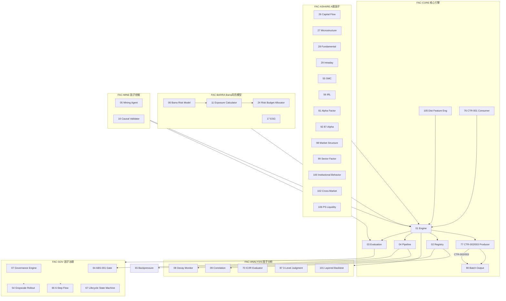

# 03 — D-FACTOR 因子域

> **状态**: DRAFT | **核心层**: L02 Alpha因子 | **成熟度**: L1 🔵 骨架
> **一句话**: 从数据里算出因子
> **域描述**: 因子计算+评估+多重回归校验+PIT合规 🆕
> **蓝图**: MOD-L02-001 (partial) 🆕

## §0 域定义

| 维度 | 内容 |
|------|------|
| 核心Aggregate | AGG-005 FactorSignal |
| 核心事件 | E-RS-01 FactorResearched / E-RS-02 FactorRejected / E-RS-03 ModelValidated |
| 开发状态 | 骨架——基础ABC+默认实现，缺子模块 |
| 优先级 | P0（核心价值链第二环） |
| 激活前提 | D-DATA 就绪 + CTR-001 可用 |
| 进程归属 🆕 | P2 signal_engine (D-FACTOR+D-SIGNAL, CPU核4-7, 内存16GB) |
| 安全域归属 🆕 | 数据域安全域(D-DATA/D-FACTOR/D-SIGNAL/D-DATA-ENG/D-ALT-DATA/D-ML-TRAIN) |

## §1 子模块清单

### §1.1 主模块

| ID | 名称 | 职责 | 优先级 | 建设状态 | 受限门禁 |
|----|------|------|:------:|:--------:|---------|
| D-FACTOR-01 | Engine | 因子计算引擎：表达式AST解析+算子库(300+)+增量计算调度+OCP扩展点+Barra因子类别+行业因子+正交化处理+标准化/去极值+因子中性化(行业/市值/风格)。🆕声明式因子定义(YAML DSL)→批/流双执行计划。🆕incremental_compute()滑动窗口类因子避免全量重算。🆕consistency_check()日终离线/在线偏差检测。🆕UFL确定性事实层(is_deterministic=True, Feature Store子集)。🆕DSL算子定义(6类预定义算子，LLM只能在DSL空间内组合，不可自由生成任意Python代码)：数学算子(abs/log/sign/power/sqrt) / 时序算子(ts_mean/ts_std/ts_rank/ts_delta/ts_sum/ts_max/ts_min) / 截面算子(cs_rank/cs_zscore/cs_demean/cs_quantile) / 逻辑算子(if_then/and/or/not) / 比较算子(gt/lt/eq/ge/le) / 聚合算子(group_mean/group_sum/group_rank)。实现：FactorBase(ABC)+各因子实现。产出：CTR-002/CTR-003 FactorSignal。消费：CTR-001 NormalizedMarketData | P0 | ✅能建 | — |
| D-FACTOR-02 | Registry | 因子注册表：因子元数据Schema+版本树+依赖图+废弃流程状态机+因子血缘字段+因子相关性去重。🆕四维索引(名称/类别/状态/SLA) | P0 | ✅能建 | — |
| D-FACTOR-03 | Evaluation | 因子评估+过拟合检测3维度(Walk-Forward/参数敏感性/泛化能力)+前视偏差检测+策略交叉验证。🆕因子计算偏差率监控(偏差>0.1%→否决推理结果)。🆕CUSUM控制图检测因子IC趋势(k=0.5×IC标准差, 预警>2σ, 行动>4σ)。🆕多重回归校验: 因子值对收益率的多元回归t统计量显著性检验+VIF方差膨胀因子检测多重共线性+残差自相关Durbin-Watson检验 | P0 | ✅能建 | — |
| D-FACTOR-04 | Pipeline | 因子管线+Walk-Forward扩展+全量回算/增量计算/调度+因子依赖图DAG调度。双模运行：🆕盘前全量(03:00-09:15, 7000+标的×N_max-4因子从头计算) / 🆕盘中增量(09:30-15:00, 事件驱动受影响标的重算, <5秒)。🆕因子池管理(运行上限N_max≈64, 设计容量≥150; 活跃池≤N_max-4≈60, 休眠≤4; 核心因子标记不参与末位淘汰)。Stage编排器/缓存策略/断点续跑/血缘追踪。背压CTR-BP-001~003反压到数据域 | P0 | ✅能建 | — |
| D-FACTOR-05 | Factor Mining Agent | 并发AI因子挖掘(多Agent并行)+去重(相关性>0.85丢弃)+自动验证闭环+自动入库。因子发现方法：表达式组合(Phase1)/遗传编程(Phase2)/LLM辅助qwen3:8b(Phase2)/深度学习(Phase3)。🆕实现机制：(1)FactorMAD投票: 3-5Agent独立生成因子假设后投票选最优；(2)AST沙箱三层安全: 白名单验证(禁止import/exec/eval/open)+复杂度约束(嵌套≤5/参数≤10/节点≤50)+语义验证(输出范围/NaN/无穷大/类型检查)；(3)三重语义一致性: 假设(Hypothesis)⇄因子表达式(Expression)⇄可执行代码(Code)三者语义必须一致，不一致→拒绝生成；(4)进化式代码生成: 单次生成→多轮进化迭代(LLM生成→回测→分析弱点→重写→收敛)，每轮进化存入技能库供复用。🆕偏差评估报告(EU AI Act Art.10): 评估因子池是否偏向大盘股等，生成偏差评估报告 | P1 | ⛔受限 | GATE-05-01~03 |
| D-FACTOR-06 | Barra Risk Model | Barra风格因子(10大)+行业因子(28申万)+正交化+因子中性化(行业/市值/风格中性)。FactorBase新增neutralize(method, group_data)可选方法 | P0 | ⛔受限 | GATE-06-01~03 |
| D-FACTOR-07 | Factor Governance Engine | 因子治理引擎：准入门禁+运行时监控+废弃审批+漂移检测器(39类)。治理方法论13原则/门禁引擎/漂移检测。🆕因子-模型联合优化(R&D-Agent-Quant): 因子IC衰减时评估模型对因子变化的敏感度; 模型精度下降时反向评估高贡献因子→优先保留(高贡献因子保留率>80%) | P1 | ⛔受限 | GATE-07-01~03 |
| D-FACTOR-08 | Factor Decay Monitor | 因子衰减监控：IC时序追踪+半衰期估计+制度转换检测+衰减预警。🆕CUSUM控制图(k=0.5×IC标准差, 预警>2σ, 行动>4σ, 比滚动IC更早发现衰减趋势)。🆕因子池IC-Based Factor Replacement(原"末位淘汰"): 活跃池满N_max-4时新因子逐个对比池内IC最低者。🆕Batch Factor Pruning(原"批量裁剪"): 全池≥64时按IC从休眠/观察中裁撤 | P1 | ⛔受限 | GATE-08-01~02 |
| D-FACTOR-09 | Factor Correlation Analyzer | 因子相关性分析：滚动相关矩阵+条件相关性+聚类分析+共线性检测。🆕因子语义去重(LLM判断经济学逻辑等价性)：数值不同但逻辑等价→保留IC高者+标记"语义冗余"；逻辑不等价但数值相关→保留两者+标记"数值相关但逻辑独立"(LLM Factor Factory WorldQuant 2025) | P1 | ⛔受限 | GATE-09-01~02 |
| D-FACTOR-10 | Factor Turnover Analyzer | 因子换手率分析：换手率计算+成本衰减模型+自相关系数+买卖价差估算 | P2 | ⛔受限 | GATE-10-01~02 |
| D-FACTOR-11 🆕 | Factor Exposure Calculator | 因子暴露计算器：实时因子暴露+截面因子暴露+行业偏离+风格暴露约束。L1实时监控(<1秒/每Tick)+L2日频因子风险模型(≤5秒P99)的因子暴露输入 | P1 | ⛔受限 | GATE-11-01: 需06 Barra Risk Model就绪 |
| D-FACTOR-24 🆕 | Factor Risk Budget Allocator | 因子风险预算分配器：按因子IC/IR分配风险预算+因子暴露约束+风险限额检查 | P2 | ⛔受限 | GATE-24-01: 需06+11就绪; GATE-24-02: 需D-RISK域就绪 |

### §1.2 子模块与建设状态

| 子域 | 子模块ID | 名称 | 建设状态 | 受限门禁 |
|------|---------|------|:--------:|---------|
| FAC-CORE | 76 | CTR-001 Consumer | ✅能建 | Engine内部组件 |
| FAC-CORE | 77 | CTR-002/003 Producer | ✅能建 | Engine内部组件 🆕CTR-003: ranked因子输出 |
| FAC-CORE | 80 | Batch Output | ✅能建 | Pipeline内部组件 |
| FAC-CORE | 65 | Backpressure | ✅能建 | Pipeline内部组件 |
| FAC-CORE | 53 | 因子依赖图DAG | ✅能建 | Pipeline DAG子组件 |
| FAC-CORE | 103 | 参数配置管理器 | ✅能建 | 配置管理 |
| FAC-CORE | 104 | 因子依赖DAG管理器 | ✅能建 | 基于53扩展 |
| FAC-CORE | 105 🆕 | Distribution Feature Engineering | ⛔受限 | GATE-105-01: 需01 Engine+因子池≥10因子就绪; 产出不进入因子池IC评估体系，专供密度预测模型 |
| FAC-ASHARE | 26 | Capital Flow | ✅能建 | 基于miniQMT资金流数据 |
| FAC-ASHARE | 27 | Microstructure | ⛔受限 | GATE-27-01: 需Level-2逐笔成交数据 |
| FAC-ASHARE | 28 | Fundamental | ✅能建 | 基于iFind财务数据 |
| FAC-ASHARE | 29 | Intraday | ⛔受限 | GATE-29-01: 需3秒Tick管线稳定运行 |
| FAC-ASHARE | 55 | SMC | ⛔受限 | GATE-55-01~02 |
| FAC-ASHARE | 56 | IRL | ⛔受限 | GATE-56-01 |
| FAC-ASHARE | 81 | Alpha Factor | ✅能建 | 基于Engine扩展(量价/动量/价值/情绪因子) |
| FAC-ASHARE | 92 | 87-Alpha | ⛔受限 | GATE-92-01 |
| FAC-ASHARE | 96 | 技术指标因子 | ✅能建 | 基于Engine扩展(MA/MACD/RSI等) |
| FAC-ASHARE | 97 | 形态→信号转化 | ⛔受限 | GATE-97-01 |
| FAC-ASHARE | 98 🆕 | Market Structure Factor | ✅能建 | 涨跌家数比/涨停家数/市场宽度/NHNL/封单率，3秒级miniQMT数据 |
| FAC-ASHARE | 99 🆕 | Sector Factor | ✅能建 | 板块强度/板块RS/风格因子暴露/资金流入，miniQMT+iFind分钟频 |
| FAC-ASHARE | 100 🆕 | Institutional Behavior Factor | ⛔受限 | GATE-100-01: 需iFind龙虎榜+北向+大宗数据; 筹码集中度/机构净流入/龙虎榜机构占比/北向持仓变化 |
| FAC-ASHARE | 102 🆕 | Cross-Market Factor | ⛔受限 | GATE-102-01: 需iFind全球市场数据; 传导系数/VIX/美债利差/汇率/A50期货 |
| FAC-ASHARE | 106 🆕 | Pastor-Stambaugh Liquidity Factor | ⛔受限 | GATE-106-01: 需iFind全球市场数据+统计回归库; 系统性流动性风险因子 |
| FAC-ANALYSIS | 70 | IC/IR Evaluator | ✅能建 | Rank IC+ICIR计算，Evaluation子组件 |
| FAC-ANALYSIS | 89 | IC_IR计算 | ✅能建 | 70子组件 |
| FAC-ANALYSIS | 87 | 3-Level Judgment | ⛔受限 | GATE-87-01 |
| FAC-ANALYSIS | 101 | Layered Backtest | ⛔受限 | GATE-101-01 |
| FAC-ANALYSIS | 88 | IC衰减分析器 | ⛔受限 | GATE-88-01 |
| FAC-ANALYSIS | 84 | 多因子合成验证器 | ⛔受限 | GATE-84-01 |
| FAC-ANALYSIS | 110 | 相关性去冗余 | ⛔受限 | GATE-110-01 |
| FAC-ANALYSIS | 111 | 因子组合优化 | ⛔受限 | GATE-111-01 |
| FAC-GOV | 54 | Grayscale Rollout | ⛔受限 | GATE-54-01 |
| FAC-GOV | 66 | 6-Step Flow | ⛔受限 | GATE-66-01 |
| FAC-GOV | 67 | Lifecycle State Machine | ⛔受限 | GATE-67-01 |
| FAC-GOV | 64 | ABS-001 Gate | ⛔受限 | GATE-64-01 |
| FAC-BARRA | 17 | ESG | ⛔受限 | GATE-17-01~02 |
| FAC-MINE | 16 | Causal Validator | ⛔受限 | GATE-16-01~02; 🆕实现机制: DoWhy/DML因果因子验证(区分相关因子vs因果因子→因果因子加权提升)+因果发现三阶段(阶段1:工具变量法利用外生冲击识别因果效应 / 阶段2:Do-calculus干预推理 / 阶段3:反事实推理辅助评估) |
| FAC-ANALYSIS | 112 🆕 | Factor Attribution | ⛔受限 | GATE-112-01: 需06+11就绪; 各因子对组合收益/风险的贡献度分析(区别于因子暴露=当前风险度量，归因=历史收益归因) |

## §2 域内依赖图



## §3 域间依赖与接口

### 消费

| 消费什么 | 来自 | 契约/事件 | 类型 |
|---------|------|---------|:----:|
| NormalizedMarketData | D-DATA | CTR-001 | H |
| 数据更新通知 🆕 | D-DATA | Redis Pub/Sub (C-001→C-009) | E |
| ML模型产出 | D-ML | E-RS-03 ModelValidated | E |
| 权限/审计/遥测 | D-AUTONOMY | CTR-TRACE-001 | H |
| 因子知识注入 🆕 | D-KNOWLEDGE | ClassifiedKnowledgePackage(knowledge_type=factor)→C-027入池审批 | E |

> 🆕 **因子知识注入约束**: IC测试+Point-in-Time验证+与已有因子相关性<0.7

### 产出

| 产出什么 | 去往 | 契约/事件 | 类型 |
|---------|------|---------|:----:|
| FactorSignal | D-SIGNAL | CTR-002 | H |
| Ranked FactorSignal 🆕 | D-SIGNAL/D-RISK | CTR-003 | S |
| 因子暴露度 | D-RISK | CTR-002 | S |
| 因子暴露度 | D-PORTFOLIO | CTR-002 | E |
| FactorResearched | D-ML | E-RS-01 | E |
| 因子值+信号 🆕 | D-EX-CORE(交易域) | 数据签名+完整性校验 | H |

### CTR-002 FactorSignal 接口定义

```python
@dataclass(frozen=True)
class FactorSignal:
    factor_id: str
    symbol: str
    timestamp: datetime
    value: float
    direction: str
    confidence: float
    asof_ts: datetime
    trace_id: str
```

### OCP-001 FactorBase 扩展点

```python
class FactorBase(ABC):
    @abstractmethod
    def compute(self, data: NormalizedMarketData) -> list[FactorSignal]: ...

    🆕@abstractmethod
    def incremental_compute(self, data: NormalizedMarketData, window: int) -> list[FactorSignal]: ...

    @property
    @abstractmethod
    def factor_id(self) -> str: ...
```

### C-027 vs C-009 职责边界 🆕

| 维度 | C-027 因子工厂(管理角色) | C-009 生产线(执行角色) |
|------|----------------------|---------------------|
| 职责 | 因子发现/解析/代码生成/IC回测/入池审批/退役 | 盘前全量计算/盘中增量修正/因子值输出 |
| 产出 | 因子代码+因子池 | 因子值+信号 |
| 对应域 | D-FACTOR(01/02/03/05/07) | D-FACTOR(04)+D-SIGNAL |
| 循环依赖 | C-009启动用默认因子列表快照, C-027异步注册新因子→时序分离无死锁 |

## §4 域事件流

| 事件ID | 事件名 | 触发条件 | 载荷 | 消费者 | 延迟要求 |
|--------|--------|---------|------|--------|---------|
| E-RS-01 | FactorResearched | 新因子通过Evaluation验证 | {factor_id, ic, ir, category} | D-ML | <5s |
| E-RS-02 | FactorRejected | 因子验证未通过(过拟合/IC<0.03) | {factor_id, reason, metrics} | D-AUTONOMY(审计) | <5s |
| E-RS-03 | ModelValidated | ML模型验证通过 | {model_id, oos_sharpe, factor_ids} | D-FACTOR(增强因子) | <10s |
| E-DT-01 | DataQualityDegraded(消费) | quality_score < 0.7 | {symbol, quality_score} | FAC-CORE(降级计算) | <1s |
| E-FS-01~09 🆕 | FeatureCreated/Validated/Registered/Online/Decaying/Deprecated/Dormant/Reactivated/Retired | 生命周期状态转换 | {factor_name, status, metrics} | D-SIGNAL/D-RISK/D-ML-TRAIN/D-GOVERNANCE | <5s |

## §5 激活前提与就绪条件

| 级别 | 前提 | 就绪标准 | 依赖 |
|------|------|---------|------|
| P0 | D-DATA 就绪 | CTR-001 NormalizedMarketData可用 | DAT-CORE |
| P0 | FAC-CORE骨架就绪 | Engine+Registry+Evaluation+Pipeline ABC实现 | FAC-CORE(01-04) |
| P0 | CTR-002/003 可发布 | FactorSignal契约实现 | FAC-CORE(77) |
| P0 | FactorBase统一 | SSoT确认，base.py删除 | FAC-GOV(69) |
| P1 | PIT数据保证 | DuckDB AS OF JOIN可用 | DAT-CTR(55) |
| P1 | A股因子至少5个 | 资金流+微观结构+基本面至少各1个 | FAC-ASHARE(26-28) |
| P1 | IC/IR评估就绪 | Rank IC+IC_IR计算可用 | FAC-ANALYSIS(70+89) |
| P1 | 因子治理6步就绪 | 入职流程自动化 | FAC-GOV(66) |
| P1 | Barra风险模型就绪 | 10风格+28行业因子 | FAC-BARRA(06) |
| P2 | AI因子挖掘就绪 | Mining Agent可运行 | FAC-MINE(05) |
| P2 | 因子灰度上线就绪 | 5%→20%→全权重流程 | FAC-GOV(54) |
| P2 | DDD聚合根就绪 | Factor/FactorVersion聚合根实现 | FAC-GOV(74+75) |

## §6 设计决策总表

| 编号 | 决策 | 理由 | 替代方案 |
|------|------|------|---------|
| DD-06-01 | Feature Store归D-DATA-03 | 避免重复建设；PIT正确性由数据域保证 | — |
| DD-06-02 | Barra风险模型归D-FACTOR-06 | 因子计算是Barra的核心 | — |
| DD-06-03 | 因子预处理管线归D-DATA-02 | 预处理是数据标准化 | — |
| DD-06-04 | 过拟合检测3维度归D-FACTOR-03 | Walk-Forward/参数敏感性/泛化能力 | — |
| DD-06-05 | 前视偏差检测归D-FACTOR-03 | 逐日验证信号时间戳≤数据时间戳 | — |
| DD-06-06 | 退市/ST数据采集归D-DATA-01 | 幸存者偏差修正 | — |
| DD-06-07 | 核心契约FactorSignal(CTR-002) | 因子域核心产出供信号域消费 | — |
| DD-06-08 | 核心事件E-FT-01 FactorComputed | 因子计算完成后发布，驱动信号生成 | — |
| DD-06-09 | 因子IC>0.03是有效性最低门槛 | IC低于0.03不具备统计显著性 | — |
| DD-06-10 | 因子分类八大类 🆕 | 量价/波动率/成交量/市场结构/Alpha/板块风格/主力行为/跨市场 | 六大类(缺波动率/成交量/市场结构/主力行为/跨市场) |
| DD-06-11 | 因子衰减三级自动处置：MILD/MODERATE/SEVERE | 渐进式处置，与D-AUTONOMY自愈引擎联动 | — |
| DD-06-12 | compute()返回类型统一为list[FactorSignal] | 消除factor_base.py vs base.py的类型矛盾 | — |
| DD-06-13 | factor_base.py为唯一SSoT，删除base.py | 两套FactorBase并存是隐患 | — |
| ADR-FAC-001 | DAG调度因子计算 | 因子依赖图DAG拓扑排序，循环依赖拒绝注册 | — |
| ADR-FAC-002 | 双模运行 🆕 | 盘前全量(03:00-09:15)+盘中增量(09:30-15:00, <5秒) | — |
| ADR-FAC-003 | 因子衰减三级自动处置 | MILD/MODERATE/SEVERE | — |
| ADR-FAC-004 | OCP-001 FactorBase扩展点 | FactorBase ABC+compute()+🆕incremental_compute() | — |
| ADR-FAC-005 | 五层筛选漏斗因子支撑 | 每层使用不同深度因子，从5因子到60+因子递进 | — |
| ADR-FAC-006 🆕 | 因子池容量管理 | N_max≈64(运行上限), 设计容量≥150; 活跃≤N_max-4, 休眠≤4; 核心因子(Fama-French等)不参与IC-Based Replacement | 无容量管理→因子膨胀失控 |
| ADR-FAC-007 🆕 | Distribution Feature Engineering产出不入因子池 | 避免海量交互项/滞后项冲击因子池IC评估/末位淘汰体系，专供密度预测模型 | 入池→因子池管理复杂度爆炸 |
| ADR-FAC-008 🆕 | 因子-模型联合优化(R&D-Agent-Quant) | 因子IC衰减时评估模型敏感度; 模型精度下降时反向保留高贡献因子 | 单向因子替换→模型精度恢复慢 |
| DD-P3-01 | 窄表存储因子值 | Schema稳定，新增因子不改变表结构 | 宽表：ALTER TABLE维护成本高 |
| DD-P3-02 | 因子IC入池阈值分级 | 量价>0.03/基本面>0.02/另类>0.025 | 统一阈值 |
| DD-P3-03 | 盘中快照仅保留3个月 | 年475GB超出单机存储预算 | 全量保留 |
| DD-11-01 | 离线+在线双存储 | 训练需PIT(~100ms)，推理需<5ms | 单一存储 |
| DD-11-02 | 注册表用SQLite | 元数据查询需要SQL能力 | Redis：查询能力弱 |
| DD-11-03 | 单一定义原则消除偏差 | 双写后校验只能发现偏差无法消除根因 | 双写后校验 |
| DD-11-04 | 十阶段生命周期状态机 | 明确门禁+灰色地带(DORMANT/REACTIVATED) | 三阶段 |
| DD-11-05 | 窄表存储因子值 | 同DD-P3-01 | 宽表 |
| DD-11-06 | 自建Feature Store而非Feast | 单机场景Feast过重 | Feast |
| DD-11-07 | 盘中快照仅保留3个月 | 同DD-P3-03 | 全量保留 |
| DD-13-01 | 财务数据5个交易日Embargo | 覆盖更正公告窗口 | 无Embargo |
| DD-13-02 | DuckDB QUALIFY ROW_NUMBER()实现PIT语义 | 原生支持 | 自建索引 |
| DD-13-03 | PIT股票池每日截面快照 | 避免幸存者偏差 | 当前股票池 |
| DD-13-04 | 跨平面一致性校验 | 训练/回测/推理三平面因子值一致 | 不校验 |

## §7 风险架构交叉

### 因子风险三层度量体系

| 层级 | 方法 | 延迟目标 | 触发频率 | 因子域职责 |
|------|------|---------|---------|-----------|
| L1 实时监控 | 实时P&L+因子暴露+集中度+Amihud非流动性 | <1秒 | 每Tick(3秒) | D-FACTOR-11 Factor Exposure Calculator提供实时因子暴露 |
| L2 日频因子风险模型 | 申万31行业+4风格因子+VaR/CVaR/ES+CUSUM | ≤5秒(P99) | 每日收盘后 | D-FACTOR-06+D-FACTOR-09+D-FACTOR-11联合产出 |
| L3 压力测试 | 历史回放+假设情景+程式化冲击+反向压力测试 | ≤30分钟 | 每周+市场异动 | D-FACTOR-06 Barra因子暴露+D-FACTOR-09相关性矩阵作为输入 |

### 因子暴露与相关性风险

| 子类 | 识别方法 | 度量方法 | 处置机制 | 否决阈值 |
|------|---------|---------|---------|---------|
| 价格风险(因子暴露维度) | 实时P&L监控+因子暴露监控 | VaR(95%/99%)+CVaR+密度感知VaR | 减仓/对冲/暂停开仓 | VaR超限→否决新开仓 |
| 相关性风险(因子相关性维度) | 滚动相关矩阵+条件相关性 | 条件CVaR+分散化比率 | 相关性结构崩塌→减集中度 | 分散化比率<0.3→否决集中持仓 |
| 模型风险(因子偏差维度) 🆕 | 训练-服务一致性校验+代码审计 | 因子计算偏差率+推理偏差 | 修复+回滚 | 因子偏差>0.1%→否决推理结果 |

### CUSUM控制图——因子IC趋势 🆕

| 检测对象 | CUSUM参数 | 预警阈值 | 行动阈值 | 优势 |
|---------|----------|---------|---------|------|
| 因子IC趋势 | k=0.5×IC标准差 | IC CUSUM>2σ | IC CUSUM>4σ | 比滚动IC更早发现衰减趋势 |

## §8 安全架构约束

### 资产分类与信任等级

| 资产类型 | 信任等级 | 分类 | 示例 |
|---------|---------|------|------|
| 因子公式 | 绝密（L3） | 核心资产 | Alpha因子表达式、因子构造逻辑 |
| 信号逻辑 | 绝密（L3） | 核心资产 | 信号生成算法、信号组合权重 |
| PIT数据 | 机密（L2） | 敏感资产 | 历史时点正确数据、复权因子 |
| 另类数据 | 机密（L2） | 敏感资产 | 舆情数据、供应链数据 |
| 原始行情 | 内部（L1） | 业务资产 | Tick数据、K线数据 |

### 安全控制要求

- 因子公式和信号逻辑存储时使用AES-256加密，运行时解密到受保护内存区域
- PIT数据必须有时点标记和完整性校验，防止未来信息泄露（look-ahead bias）
- iFind API凭证仅在数据域进程内可见，禁止跨域传递
- 另类数据接入必须经过人工审批（HB-SEC-06），审批记录写入审计链
- HB-SEC-02(全域硬边界)：因子公式和信号逻辑禁止以未脱敏形式发送到外部LLM 🆕
- 🆕 L3→L1数据降级：因子公式→占位符(替换化)后，方可通过白名单LLM代理通道(llm_proxy.exe)发送到外部LLM
- 🆕 L5身份与访问控制：因子/信号访问控制，仅授权进程可读取L3资产
- 🆕 数据流入规则：行情数据、因子值、信号→数据签名验证+时间戳校验
- 🆕 数据流出规则：行情、因子值、信号→交易域→数据签名+完整性校验

## §9 主观交易术语→量化框架转换

> 文档中以下术语源自主观交易经验，非专业量化框架内容。均可转化为量化因子，转化后纳入对应子模块。

| 主观术语 | 来源 | 量化框架等价物 | 归属模块 | 量化方法 |
|---------|------|--------------|---------|---------|
| 一高七矮 | 日内量能 | Volume Profile HVN/LVN节点分布 | D-FACTOR-27 Microstructure | Volume Profile计算HVN/LVN |
| 量能体制（缩量/平量/放量） | 学习系统 | Volume Regime Classification | D-FACTOR-12 Timing Engine | GMM/阈值分类：成交量相对20日均值的分位数 |
| 放量突破前高后回踩不破支撑位→继续上涨 | 学习系统 | Breakout-Retest Momentum Factor | D-FACTOR-81 Alpha Factor | 突破N日高点+回踩幅度<突破幅度×k+量能>MA(vol,20)×1.5 |
| 增量格局→大盘蓝筹有效/缩量格局→小盘题材有效 | 学习系统 | Regime-Conditional Factor Effectiveness | D-FACTOR-12 Timing Engine | 条件IC分析：按Volume Regime分组计算因子IC |
| 逆向资金买点 | 逆势资金流 | Contrarian Capital Flow Factor | D-FACTOR-26 Capital Flow | 大盘下跌时个股资金净流入/大盘跌幅=逆势强度比 |
| 主力吸筹 | CVD | Accumulation Factor | D-FACTOR-27 Microstructure | CVD上升+价格横盘/下跌=买方压力积累 |
| 主力派发 | CVD | Distribution Factor | D-FACTOR-27 Microstructure | CVD下降+价格横盘/上涨=卖方压力释放 |
| 主力洗盘 | VPIN | Shakeout Factor | D-FACTOR-27 Microstructure | VPIN高+价格急跌后快速恢复=知情交易者洗盘 |
| 缠论笔/线段/中枢/背驰 | 图形识别 | Statistical Consolidation Zone + Divergence Detection | D-FACTOR-97 形态→信号 | 笔=顶底分型连线；中枢=重叠区间价格范围；背驰=MACD背离统计检测 |
| 支撑位/阻力位 | 图形识别 | Support/Resistance Level Detection | D-FACTOR-97 形态→信号 | 局部极值点+成交量聚集价位+DTW匹配 |
| 头肩顶/双底/W底/三角形/旗形 | 图形识别 | Chart Pattern Recognition (DTW/CNN) | D-FACTOR-97 形态→信号 | DTW相似度匹配/CNN分类23种图形+置信度 |
| 冰山单 | 竞价微结构 | Hidden Order Detection Factor | D-FACTOR-27 Microstructure | 不可撤单阶段大额限价单占比=隐藏意图指标 |
| 高开=强/低开=弱 | 竞价微结构 | Opening Gap Factor | D-FACTOR-29 Intraday | (开盘价-前收盘)/前收盘×匹配量权重 |
| 抗跌 | 逆势识别 | Downside Resistance Factor | D-FACTOR-26 Capital Flow | 大盘跌X%时个股跌幅<X×0.3 |
| 逆涨 | 逆势识别 | Contrarian Return Factor | D-FACTOR-26 Capital Flow | 大盘跌X%时个股涨Y% |
| 知情交易者晚下单 | 竞价微结构 | Late Order Arrival Factor | D-FACTOR-29 Intraday | 9:20-9:25下单比例(Moinas 2025) |
| 小市值因子在缩量环境下失效 | 学习系统 | Regime-Conditional Factor Decay | D-FACTOR-08 Decay Monitor | 按Volume Regime分组追踪因子IC时序变化 |
| 主力行为 🆕 | 交易决策L2-B | Institutional Behavior Analysis | D-FACTOR-100 Institutional Behavior Factor | 筹码集中度/机构净流入/龙虎榜机构占比/北向持仓变化 |
| 庄家行为模式识别 🆕 | 交易决策C-035 | Market Manipulation Pattern Detection | D-FACTOR-27 Microstructure | 异常交易模式识别(自成交/对倒/拉抬/打压) |
| 群体博弈模拟 🆕 | 交易决策C-036 | Game-Theoretic Agent Simulation | D-FACTOR-27 Microstructure | 多Agent博弈均衡价格偏离度 |
| 筹码集中度 🆕 | 交易决策 | Ownership Concentration Factor | D-FACTOR-100 Institutional Behavior Factor | 股东户数变化+十大流通股东持股比例集中度 |
| 出货信号 🆕 | 交易决策交互项 | Distribution Signal Factor | D-FACTOR-105 Dist Feature Eng | 波动率×换手率交互项(高波高换=分布信号) |
| 吸筹期vs出货期 🆕 | 交易决策交互项 | Accumulation/Distribution Phase Detection | D-FACTOR-27 Microstructure | CVD趋势+价格形态+成交量模式三维度分类 |
| 末位淘汰 🆕 | 交易决策C-027 | IC-Based Factor Replacement | D-FACTOR-08 Decay Monitor | 活跃池满N_max-4时新因子逐个对比池内IC最低者 |
| 批量裁剪 🆕 | 交易决策C-007⑬ | Batch Factor Pruning | D-FACTOR-08 Decay Monitor | 全池≥64时按IC从休眠/观察中裁撤 |
| 主力净流入 🆕 | 交易决策 | Institutional Net Inflow Factor | D-FACTOR-100 Institutional Behavior Factor | 大单净买入金额/总成交金额 |
| 龙虎榜机构占比 🆕 | 交易决策 | Dragon-Tiger List Institutional Ratio | D-FACTOR-100 Institutional Behavior Factor | 龙虎榜买方机构席位占比 |
| 北向持仓变化 🆕 | 交易决策 | Northbound Holding Change Factor | D-FACTOR-100 Institutional Behavior Factor | 沪深港通北向资金持股变化量/流通股本 |
| 板块强度/板块RS 🆕 | 交易决策 | Sector Strength / Sector Relative Strength | D-FACTOR-99 Sector Factor | 板块指数相对大盘的超额收益+板块内上涨家数占比 |
| 传导系数 🆕 | 交易决策 | Cross-Market Transmission Coefficient | D-FACTOR-102 Cross-Market Factor | VAR模型跨市场收益率Granger因果检验系数 |
| 封单率 🆕 | 交易决策 | Limit Order Fill Rate Factor | D-FACTOR-98 Market Structure Factor | 涨停封单量/当日成交量 |
| 涨跌家数比/涨停家数/市场宽度/NHNL 🆕 | 交易决策 | Market Breadth Factors | D-FACTOR-98 Market Structure Factor | 上涨家数/下跌家数; NHNL=New High-New Low |

## §10 因子数据体系

### §10.1 因子分类体系（八大类）🆕

| 因子大类 | 入池IC阈值 | 因子示例 | 数据源 | 计算频率 | 在组合中的角色 |
|---------|:---------:|---------|--------|:-------:|-------------|
| 量价因子 | \|IC\|>0.03 | MA/EMA/MACD/KDJ/RSI/ATR/OBV/VWAP | miniQMT Tick | 日频/分钟频 | Alpha来源 |
| 波动率因子 🆕 | \|IC\|>0.03 | ATR/历史波动率/下行波动率/MDD/VaR | miniQMT Tick | 日频 | Alpha来源+风控输入 |
| 成交量因子 🆕 | \|IC\|>0.03 | OBV/VWAP/MFI/换手率/量比 | miniQMT Tick | 日频/分钟频 | Alpha来源 |
| 市场结构因子 🆕 | \|IC\|>0.03 | 涨跌家数比/涨停家数/市场宽度/NHNL/封单率 | miniQMT Tick | 3秒 | 市场状态判定输入 |
| 基本面因子 | \|IC\|>0.02 | PE/PB/ROE-TTM/ROE-年报/营收增速/毛利率 | iFind财务 | 季频 | Alpha来源+风险控制 |
| Alpha因子 | \|IC\|>0.025 | 价值/动量/质量/成长/波动率/流动性/情绪/事件 | iFind财务+miniQMT | 日频~季频 | Alpha核心输入 |
| 板块风格因子 🆕 | \|IC\|>0.025 | 板块强度/板块RS/风格因子暴露/资金流入 | miniQMT+iFind | 分钟频 | 市场状态+风格轮动 |
| 主力行为因子 🆕 | \|IC\|>0.025 | 筹码集中度/机构净流入/龙虎榜机构占比/北向持仓变化 | iFind龙虎榜+北向+大宗 | 日频 | 主力行为识别 |
| 另类因子 | \|IC\|>0.025 | 舆情得分/财报超预期/龙虎榜/融资融券 | iFind+tushare | 日频 | Alpha补充 |
| 宏观因子 | —（不直接入池） | M2/社融/中美利差/VIX/Fed | iFind | 日频/事件驱动 | 市场状态判定输入 |
| 跨市场因子 🆕 | —（不直接入池） | 传导系数/VIX/美债利差/汇率/A50期货 | iFind全球市场 | 60秒 | 市场状态判定输入 |
| 风险因子 | —（不要求IC） | 行业(申万31)/规模/价值/动量 | miniQMT+iFind | 日频 | 风险分解+中性化 |

### §10.2 统一图形识别引擎（D-FACTOR-97）

**设计决策**: 1个统一引擎替代20+独立图形识别模块。输入：OHLCV序列(多时间级别)；算法：DTW/CNN/Transformer/规则引擎；输出：图形类型+置信度+关键点位+预测方向+历史胜率。

| 图形类别 | 具体图形 | 关键点位 |
|----------|---------|---------|
| 反转图形 | 头肩顶/底、双顶/底、三重顶/底、圆弧顶/底 | 颈线位、突破点 |
| 持续图形 | 三角形(对称/上升/下降)、旗形、矩形、楔形 | 突破方向、目标位 |
| 趋势图形 | 上升/下降趋势线、通道线 | 趋势线触点、通道上下轨 |
| 支撑阻力 | 水平支撑/阻力、整数关口、前高/前低 | 支撑位、阻力位 |
| 缠论图形 | 笔、线段、中枢、背驰 | 中枢区间、三类买卖点 |
| 波浪图形 | 推动浪(5浪)、调整浪(3浪)、延长浪 | 浪的起点/终点 |

归属层: L1因子计算层(图形识别因子) + L2-A信号层(图形信号生成)

### §10.3 日内量能结构因子（D-FACTOR-27）

| 因子名 | 量化定义 | 说明 |
|--------|---------|------|
| HVN/LVN节点 | Volume Profile中成交量最大/最小的价格区间 | HVN=价格接受区；LVN=价格拒绝区 |
| Value Area | 日内70%成交量所在的价格区间 | 价格在VA内=公允价值；VA外=偏离 |
| POC | 日内成交量最大的价格水平 | 日内公允价值核心锚点 |
| CVD | Σ(Buy Volume at Ask - Sell Volume at Bid) | 净买卖压力追踪 |
| CVD-价格背离 | CVD下降+价格创新高=看跌背离 | 机构在卖出(派发) |
| VPIN | 基于成交量切片的买卖量不平衡累积概率 | VPIN高=知情交易者活跃(Easley 2012) |
| VPIN阈值 | VPIN > μ + 1.5σ = 高知情交易概率 | VPIN极高+价格下跌=知情交易者在买入 |

归属层: L1因子计算层(Volume Profile因子+CVD因子+VPIN因子) + L2-A信号层(量能异常信号+买卖压力信号)

### §10.4 逆势资金流因子（D-FACTOR-26）

| 因子名 | 量化定义 | 说明 |
|--------|---------|------|
| 大盘下跌状态 | 3秒级检测大盘指数分时走势方向，连续6个Tick(18秒)绿盘下行 | 上证/深证/沪深300 |
| 下跌强度分级 | 缓跌/中跌/急跌(3秒跌幅>0.1%=急跌) | 中跌以上激活逆势扫描 |
| 逆势强度比 | 个股资金净流入 / 大盘同期跌幅 | 量化逆势程度 |
| 逆势持续性 | 连续N个3秒Tick(N≥5)个股资金净流入为正 | 持续性越强信号越有价值 |
| 抗跌因子 | 大盘跌X%时个股跌幅<X×0.3 | 信号强度<逆涨 |
| 逆涨因子 | 大盘跌X%时个股涨Y% | 信号强度>抗跌 |
| 逆势个股排行 | 全市场按逆势强度比排序Top N | 自动关联板块和概念 |

归属层: L1因子层(逆势资金流因子，3秒级计算) + L2-B主力行为层(逆势吸筹识别) + L2-A信号层(逆势买入信号)

### §10.5 开盘竞价微结构因子（D-FACTOR-29）

| 因子名 | 量化定义 | 说明 |
|--------|---------|------|
| 虚拟开盘价轨迹 | 9:15-9:25每5秒的虚拟匹配价格 | 价格收敛过程包含信息(Moinas 2025) |
| 虚拟匹配量 | 每个时刻的虚拟匹配成交量 | 匹配量快速增长=高参与度 |
| 订单不平衡 | 竞价期间买方委托量/卖方委托量 | 不平衡>2x=强方向信号 |
| 价格偏离度 | (虚拟开盘价-前收盘价)/前收盘价 | 偏离>2%+匹配量>日均20%=信息驱动 |
| 晚下单比例 | 9:20-9:25下单量/总下单量 | 知情交易者晚下单(Moinas 2025) |
| 撤单率 | 9:15-9:20可撤单阶段撤单比例 | 高撤单率=试探性报价 |
| 冰山单占比 | 9:20-9:25不可撤单阶段大额限价单占比 | 隐藏真实意图 |

A股适配: 9:20-9:25不可撤单阶段是信息含量最高时段。

归属层: L1因子计算层(竞价微结构因子) + L2-A信号层(竞价信号生成) + L3策略工厂(竞价参与策略)

### §10.6 分布特征工程（D-FACTOR-105）🆕

> Distribution Feature Engineering消费因子池输出，产出不进入因子池IC评估体系，专供密度预测模型。

| 变换类别 | 输出 | 用途 |
|---------|------|------|
| 滞后项构造 | 因子k期滞后 / 滚动窗口统计量(20/60/120日均值/标准差/偏度/峰度) / 因子变化率ΔX | 捕捉分布的时间演变→密度预测模型输入 |
| 交互项构造 | 因子两两交互(如波动率×换手率=分布信号) / 因子×市场状态交互 / 因子×机构行为阶段交互 | 捕捉分布的条件依赖→密度预测模型输入 |
| 分布形态统计量 | 滚动收益率偏度/峰度 / 滚动VaR/CVaR(60日) / 分布拟合度(正态/Student-t/混合高斯) | 直接作为密度预测辅助特征→L4风控层辅助输入 |

归属层: L1因子计算层(特征变换) → L2-A密度预测模型输入 + L4风控层(前瞻性VaR/CVaR辅助输入)

## §11 特征存储架构

### §11.1 双存储架构

离线Parquet(PIT/训练/回测，~100ms) + 在线Redis(实时查询<5ms) + Feature Registry(SQLite元数据)。同一Engine.compute()方法驱动两种存储写入，保证训练-服务一致性。

**离线存储Parquet Schema**:

| 列名 | 类型 | 说明 |
|------|------|------|
| trade_date | date32 | 交易日期 |
| symbol | string | 证券代码 |
| factor_name | string | 因子名称 |
| factor_value | float64 | 因子值 |
| factor_version | string | 因子版本号 |
| computed_at | timestamp | 计算时间戳 |
| quality_flag | int8 | 质量标记(0=正常/1=可疑/2=异常) |

**容量估算**(200因子，当前≤64):

| 数据类型 | 日增量 | 年增量 | 3年总量 |
|---------|:------:|:------:|:------:|
| 日频因子(200×5000) | ~40MB | ~10GB | ~30GB |
| 盘中快照(200×5000×48次/日) | ~1.9GB | ~475GB | 仅保留3个月(~119GB) |
| PIT日快照(200×5000) | ~40MB | ~10GB | ~30GB |

**在线存储Redis**: Key=feature:{symbol}, Field={factor_name}:{version}, Value={factor_value}, TTL=盘中无/盘后3600s。内存估算: 5000只×200因子×50B≈50MB << Redis可用19GB。

### §11.2 特征注册表Schema

**元数据(Metadata)**: factor_name(PK) / display_name / formula / version / category / owner / ic_mean_20d / ic_ir_20d / decay_rate / created_at / updated_at / status / sla_level / description

**数据血缘(Lineage)**: factor_name(FK) / input_column / input_source / input_contract / transform_logic / output_contract

**质量指标(Quality)**: factor_name(FK) / missing_rate / anomaly_rate / ic_mean / ic_std / ic_ir / ic_decay_5d / turnover_rate / correlation_max / quality_score

**服务状态(Status)**: factor_name(FK) / is_online / last_served_at / online_latency_ms / offline_available / offline_coverage / last_computed_at

**版本历史(Version)**: factor_name(FK) / old_version / new_version / change_type / change_reason / changed_at / changed_by / approved_by

🆕 **列级血缘示例**:

| 源列 | 变换逻辑 | 目标列 | 执行模块 | 契约ID |
|------|---------|--------|---------|--------|
| close_adj | pct_change(20) | momentum_20d | D-FACTOR-01 | CTR-002 |
| momentum_20d | rank_normalize | momentum_20d_ranked | D-FACTOR-01 | CTR-003 |

🆕 **OpenLineage适配**: Run=D-FACTOR-04 Pipeline批次(run_id=batch_id)

### §11.3 训练-服务一致性三重机制

1. **单一定义原则**: D-FACTOR-01 Engine.compute()是唯一因子计算逻辑，训练调用Engine.compute(batch=True)→Offline，推理调用Engine.compute(batch=False)→Online，同一代码路径消除15-25%偏差
2. **PIT正确性**: 训练时get_features(as_of=...)→DuckDB AS OF JOIN仅返回computed_at≤as_of的因子值；推理时get_online_features(symbol)→Redis实时查询
3. **版本对齐**: 训练时记录factor_versions快照，推理时加载同一版本映射，版本变更触发重新训练
4. 🆕 **一致性引擎**: consistency_check()日终离线/在线偏差检测，偏差>0.1%→P0告警+触发重算

### §11.4 特征生命周期十阶段状态机

```
CREATED → VALIDATED → REGISTERED → ONLINE → MONITORED → DECAYING → DEPRECATED → DORMANT → RETIRED
                                                                                    ↑          ↓
                                                                              REACTIVATED → MONITORED
```

门禁条件:
- CREATED→VALIDATED: IC>入池阈值(量价>0.03/基本面>0.02/另类>0.025) + ICIR>0.5 + OOS正率>60%
- VALIDATED→REGISTERED: 元数据完整性 + 血缘完整性 + 版本号分配
- REGISTERED→ONLINE: 灰度上线(5%→20%→100%) + 监控7天
- MONITORED→DECAYING: IC<入池阈值连续5天 / IC衰减>30%
- DECAYING→DEPRECATED: IC<0.01连续20天 / 人工审批
- DEPRECATED→DORMANT: 无下游依赖 + 人工审批(休眠，保留离线数据)
- DORMANT→REACTIVATED: IC恢复至入池阈值连续5天 + 市场环境变化
- DORMANT→RETIRED: 休眠>2年且IC无恢复

🆕 **入池观察(Probation Pool)**: 新因子IC显著但未通过Bonferroni/BH多重检验校正→进入观察池(非正式因子池)→等待更多数据积累后重新检验→通过后入池。与"衰减观察"区别：衰减观察=活跃因子IC衰退监控(退出条件=IC回升)；入池观察=新因子统计检验暂未通过(退出条件=通过多重检验校正)。两者不共享状态、不共享退出条件。

### §11.5 职责边界

| 职责 | D-FACTOR域 | 特征存储 |
|------|-----------|---------|
| 因子计算逻辑 | ✅ SSoT | ❌ 不计算 |
| 因子注册表 | ✅ D-FACTOR-02 | ✅ 同步到Feature Registry |
| 因子评估 | ✅ D-FACTOR-03 | ❌ 不评估 |
| 离线/在线存储 | ❌ 不存储 | ✅ Offline Parquet + Online Redis |
| PIT/实时查询 | ❌ 不查询 | ✅ Offline/Online Store |
| 训练-服务一致性 | ✅ 主责：提供单一计算逻辑 | ✅ 协助：执行一致性保证 |
| 因子生命周期 | ✅ 状态机管理 | ✅ 存储层配合 |
| 因子衰减检测 | ✅ D-FACTOR-08 | ✅ 提供IC数据 |

### §11.6 技术选型

| 组件 | 选型 | 理由 |
|------|------|------|
| 离线存储 | Parquet + DuckDB | 列式压缩10:1，DuckDB零拷贝读Parquet，PIT用AS OF JOIN |
| 在线存储 | Redis Hash | <5ms查询延迟，50MB内存完全够用 |
| 特征注册表 | SQLite | SQL查询能力强，与现有zalpha_metadata.db一致 |
| PIT查询 | DuckDB QUALIFY ROW_NUMBER() | 原生支持，无需自建时间索引 |
| 特征同步 | 自建Python脚本 | 单机场景无需Kafka/Flink |
| Feast | 不采用 | 单机场景过重(依赖Java/Go)，自建更简单可控 |

## §12 PIT一致性保证

### 三条公理

1. **因子值时间不可逆**: Day T的因子值必须且只能由Day T收盘时可计算的数据得出。实现: computed_at ≤ as_of (DuckDB AS OF JOIN)
2. **财务数据公告日约束**: 财务数据在公告日之前不可使用，使用报告期而非公告日=未来函数泄漏。实现: announce_date ≤ as_of
3. **幸存者偏差修正**: 回测股票池必须使用Point-in-Time股票池，包含当时尚未退市/未被ST的股票。实现: PIT股票池快照(每日截面) + 退市/ST标记

### 三平面统一

| 平面 | 数据类型 | PIT保证机制 | 存储位置 |
|------|---------|------------|---------|
| 训练平面 | 历史因子值+标签 | DuckDB AS OF JOIN (computed_at ≤ as_of) | Offline Store (Parquet) |
| 回测平面 | 历史行情+因子+信号 | 事件回放 (timestamp ≤ as_of) | Event Store (Parquet) |
| 推理平面 | 实时因子值 | Redis实时查询 (最新computed_at) | Online Store (Redis) |

### PIT查询实现

```python
def get_pit_features(
    feature_names: list[str],
    symbols: list[str],
    as_of: datetime,
) -> pd.DataFrame:
    query = """
        SELECT symbol, factor_name, factor_value
        FROM read_parquet('data/features/daily/**/*.parquet')
        WHERE symbol IN (SELECT unnest(?))
          AND factor_name IN (SELECT unnest(?))
          AND computed_at <= ?
        QUALIFY ROW_NUMBER() OVER (
            PARTITION BY symbol, factor_name
            ORDER BY computed_at DESC
        ) = 1
    """
    return duckdb.sql(query, [symbols, feature_names, as_of]).df()
```

### Embargo期

| 数据类型 | Embargo期 | 理由 |
|---------|:---------:|------|
| 季报/年报财务数据 | 5个交易日 | 覆盖更正公告窗口 |
| 业绩预告/快报 | 3个交易日 | 预告后正式报告发布间隔 |
| 限售解禁 | 1个交易日 | 解禁日当天不交易解禁股 |
| 指数成分调整 | 5个交易日 | 覆盖调整公告到生效的间隔 |

### PIT校验规则

| 校验规则 | 通过条件 | 失败动作 |
|---------|---------|---------|
| 因子时间戳校验 | computed_at ≤ as_of，0次违反 | P0告警+暂停使用该因子 |
| 财务公告日校验 | announce_date ≤ as_of，0次违反 | P0告警+暂停使用该数据 |
| 幸存者偏差校验 | 覆盖率≥99% | P1告警+标记回测结果可疑 |
| Embargo校验 | 公告日+Embargo ≤ as_of，0次违反 | P1告警+标记因子值可疑 |
| 跨平面一致性校验 | 训练因子值 vs 推理因子值偏差≤0.01% | P0告警+触发重算 |

## §13 合规约束

### §13.1 模型注册与治理——因子视角

| 合规要求 | 约束 | 实现方式 | 当前状态 |
|---------|------|---------|---------|
| 因子注册表 | 每个因子须在模型注册表中注册，包含因子ID+版本+代码指纹+参数指纹 | 因子注册写入模型注册表（不可变） | ✅能建 |
| 因子血缘合规 | 因子须记录完整数据来源血缘——原始数据→特征→因子的全链路 | OpenLineage标准数据血缘追踪+因子血缘图 | ✅能建 |
| 因子暴露合规 | 因子暴露须满足行业偏离+风格暴露约束 | C-004持仓检查+行业基准对比+因子暴露监控 | ✅能建 |
| 因子版本管理 | 因子代码+参数变更须发布新版本，旧版本不可修改 | 语义化版本号+变更diff+回滚需人工审核 | ✅能建 |
| 因子退役审计 | 因子退役须记录退役原因+影响评估+下游影响通知 | 退役策略指纹入库+影响分析报告 | ✅能建 |

### §13.4 因子治理规则 🆕

| 治理规则 | 约束 | 实现方式 |
|---------|------|---------|
| 因子权重变更审批分级 | L1(±5%以内): AI自动执行，事后审计 / L2(±5%~20%): AI自动执行+24h内人工复核 | D-AUTONOMY-PERM审批链 |
| 因子IC阈值调整审批 | 研究Agent提交申请+回测报告→Trader审批→执行; 24h未审批→自动取消 | D-AUTONOMY-PERM human_gated |
| 数据血缘一致性治理 | 因子计算逻辑 vs 因子文档定义不一致=因子下线 | D-FACTOR-02 Registry血缘校验+D-FACTOR-07 Governance Engine执行 |

### §13.2 审计证据链——因子视角

| 证据类型 | 内容 | 保留期限 | 不可篡改机制 | 法规依据 |
|---------|------|---------|-------------|---------|
| 因子计算审计日志 | 输入数据指纹+计算参数+输出值+时间戳 | ≥5年 | 哈希链 | EU AI Act Art.12；SR 26-2 |
| 因子数据血缘追踪 | 原始数据源→特征→因子的完整链路 | ≥5年 | 数据血缘图 | MiFID II RTS 6；数据安全法 |
| 因子性能审计 | IC/IR/换手率/衰减率的持续监控记录 | ≥3年 | 哈希链 | SR 26-2持续监控要求 |
| 因子暴露审计 | 截面快照+时序变化+行业偏离记录 | ≥5年 | 哈希链 | 行业偏离约束；风格暴露约束 |

### §13.3 法规映射——因子相关

| 编号 | 法规 | 关键条款 | 对D-FACTOR的影响 | 合规义务 |
|:----:|------|---------|-----------------|---------|
| INT-001 | EU AI Act | Art.10数据治理 | GATE-006激活后因子数据须满足Art.10 | 因子数据质量文档+偏差评估 |
| INT-009 | SR 26-2 | 模型风险管理 | 参考性，三支柱框架原则可参考 | 因子注册表+独立验证+持续监控 |
| CN-007 | 《数据安全法》 | 数据分类分级+跨境传输限制 | 因子数据禁止跨境 | 因子数据本地存储+分类分级 |
| — | SFDR | 因子暴露披露 | GATE-006激活后适用 | ESG因子暴露计算+披露报告 |
| — | Reg T | 因子风险约束 | GATE-003激活后适用 | 因子暴露监控+保证金约束检查 |

## §14 运维架构规格

### Warm平面因子计算延迟预算

| 环节 | 延迟预算 | 累计 | 实现 | 优化手段 |
|------|:--------:|:----:|------|---------|
| Tick→因子输入 | <50ms | 50ms | Redis Hash读取 | CPU亲和核4-7 🆕 |
| 增量因子计算 | 200ms | 250ms | NumPy/Pandas向量化 | GPU加速批量计算 |
| 因子值写入Redis | <10ms | 260ms | Redis Pipeline批量写入 | Pipeline优化 |

因子值必须在Tick到达后260ms内写入Redis(P95)。因子延迟直接影响信号产出延迟(信号总预算1000ms中因子占250ms)。

### Cold→Warm因子路由

| Cold产出 | Warm消费 | 路由规则 |
|---------|---------|---------|
| 因子回测验证→因子入库 | P2增量加载 | Redis config:* 命名空间，P2定时轮询(30s) |
| 新因子注册→因子元数据 | P2因子路由表 | Cold→Hot: 禁止直连，必须经Warm中转 |
| 因子质量报告→质量告警 | P2/P3 | E-DE-03 DataQualityAlert→D-FACTOR降级 |

交易时段约束：Cold平面因子产出在交易时段进入"待激活"队列，盘后统一应用。交易时段仅使用已验证的Warm平面因子。

### 数据质量SLA 🆕

| SLA级别 | 数据项 | 来源 | 消费者 | 降级策略 |
|---------|--------|------|--------|---------|
| P0 | A股实时Tick(3秒) | miniQMT | D-FACTOR/D-SIGNAL/D-RISK | 切换iFind 60秒行情+暂停短线策略 |
| P0 | 实时因子截面值 | D-FACTOR Engine | D-SIGNAL/D-RISK | 使用上一批次因子值+标记过期 |
| P1 | A股日线OHLCV | miniQMT/iFind | D-FACTOR/D-ML-TRAIN | 使用可用源的单源数据 |
| P1 | 基本面财务数据 | iFind | D-FACTOR/D-PF-CORE | 使用最近一期数据 |
| P1 | 宏观经济指标 | iFind | D-FACTOR/D-PF-ALLOC | 使用前值+标记延迟 |
| P1 | 龙虎榜/融资融券 | iFind | D-FACTOR/D-SIGNAL | 使用T-2数据 |
| P2 | 另类数据(新闻/舆情) | tushare/iFind | D-ALT-DATA/D-FACTOR | 停止情绪因子更新 |

### 因子计算延迟SLI 🆕

| SLI指标 | 计算公式 | 度量粒度 | 数据源 |
|---------|---------|---------|--------|
| 因子计算延迟 | 因子产出时间 - 行情接收时间 | 按批次 | D-FACTOR-04 Pipeline |

### 因子IPC与检查点 🆕

| 项 | 规格 | 说明 |
|----|------|------|
| 因子值共享内存零拷贝 | multiprocessing.shared_memory, 42万条因子值传递≈0.01ms | vs gRPC≈3-15ms，P2进程内通信 |
| CP-06 因子批量计算→Feature Store | ≤2小时, 时间窗口15:30-17:00 | 超时→P1告警+推迟训练任务 |
| CP-02 Redis因子值→信号 | ≤5秒, 延迟<5ms | 超时→P1告警+使用上一批次 |

### 因子IC运维监控SLO 🆕

| 监控项 | 进程 | 频率 | 正常范围 | 告警阈值 |
|--------|------|------|---------|---------|
| 因子IC值 | P2 | 日频 | \|IC\|>0.03(量价) | \|IC\|<0.01 |

## §15 Agent映射

| Agent | 与D-FACTOR关系 | 消费/产出 | 延迟目标 | 关键约束 |
|-------|---------------|---------|---------|---------|
| 研究Agent(Researcher) | **产出→D-FACTOR**: 发现新因子后提交提案至因子域 | 消费: D-DATA行情+D-ALT-DATA另类+D-KNOWLEDGE知识图谱 → 产出: 新因子提案+策略代码草稿 | <30min(研究级) | 因子提案需通过IC验证+过拟合检测+人工审批门禁(D-FACTOR-03+07) |
| 信号Agent(Signal Gen) | **消费←D-FACTOR**: 读取因子值作为信号生成输入 | 消费: D-FACTOR因子值(CTR-002)+D-SIGNAL策略信号+D-ML-SERVE模型推理 → 产出: 加权信号+信号强度评分+冲突报告 | <1s(分钟级信号) | 因子值须在信号Agent消费时已就绪(与§14 Warm平面260ms对齐) |
| 信号Agent归属 🆕 | D-SIGNAL+D-FACTOR | 对应能力: C-028信号工厂+C-009因子与信号管线 | — | 自治级别Level1(确定性系统) |

## 附录A 受限模块门禁清单

> 所有⛔受限模块的建设门禁。门禁解除=模块可进入建设。

| 门禁ID | 阻塞模块 | 门禁描述 | 解除条件 | 依赖链 |
|--------|---------|---------|---------|--------|
| GATE-05-01 | D-FACTOR-05 | LLM本地部署需GPU≥16GB显存 | 获得GPU资源或改用API调用 | — |
| GATE-05-02 | D-FACTOR-05 | 多Agent并发需3-5 CPU核心+~2GB内存/Agent | 确认CPU/内存资源充足 | — |
| GATE-05-03 | D-FACTOR-05 | qwen3:8b模型权重需下载部署 | 模型权重就绪+推理框架部署 | GATE-05-01 |
| GATE-06-01 | D-FACTOR-06 | 申万行业分类数据需付费数据源 | 数据采购到位 | — |
| GATE-06-02 | D-FACTOR-06 | Barra因子权重方法论需MSCI参考实现 | 获得Barra方法论参考+实现方案确认 | GATE-06-01 |
| GATE-06-03 | D-FACTOR-06 | 10风格+28行业因子完整实现+验证 | 因子公式实现+IC验证通过 | GATE-06-02 |
| GATE-07-01 | D-FACTOR-07 | D-AUTONOMY域就绪(审计链/门禁引擎) | D-AUTONOMY域激活 | — |
| GATE-07-02 | D-FACTOR-07 | 39类漂移检测器实现复杂度 | 漂移检测器分批实现方案确认 | — |
| GATE-07-03 | D-FACTOR-07 | 治理决策审批流程需D-AUTONOMY自愈引擎联动 | D-AUTONOMY自愈引擎就绪 | GATE-07-01 |
| GATE-08-01 | D-FACTOR-08 | D-FACTOR-01~04稳定运行产出IC历史数据≥20日 | FAC-CORE全部就绪+运行≥20日 | — |
| GATE-08-02 | D-FACTOR-08 | IC衰减三级自动处置需D-AUTONOMY自愈引擎联动 | D-AUTONOMY自愈引擎就绪 | GATE-07-01 |
| GATE-09-01 | D-FACTOR-09 | 需≥5个因子稳定运行才有相关性分析意义 | A股因子≥5个上线 | GATE-08-01 |
| GATE-09-02 | D-FACTOR-09 | 条件相关性(DCC-GARCH)需统计库支持 | 确认arch/statsmodels库可用 | — |
| GATE-10-01 | D-FACTOR-10 | 需实盘交易执行数据计算换手成本 | 实盘交易系统上线 | — |
| GATE-10-02 | D-FACTOR-10 | 买卖价差估算需Level-2数据 | Level-2数据权限获取 | GATE-27-01 |
| GATE-11-01 | D-FACTOR-11 🆕 | 需06 Barra Risk Model就绪 | D-FACTOR-06建设完成 | GATE-06-03 |
| GATE-24-01 | D-FACTOR-24 🆕 | 需06+11就绪 | D-FACTOR-06+11建设完成 | GATE-06-03, GATE-11-01 |
| GATE-24-02 | D-FACTOR-24 🆕 | 需D-RISK域就绪 | D-RISK域激活 | — |
| GATE-27-01 | 27 Microstructure | 需Level-2逐笔成交数据 | 券商Level-2数据权限获取 | — |
| GATE-29-01 | 29 Intraday | 需3秒Tick管线稳定运行 | D-FACTOR-04 Pipeline增量模式稳定运行 | — |
| GATE-55-01 | 55 SMC | 需Level-2数据 | Level-2数据权限获取 | GATE-27-01 |
| GATE-55-02 | 55 SMC | Smart Money Concept算法实现 | SMC量化方法论文确认 | — |
| GATE-56-01 | 56 IRL | 需Level-2大单数据+机构行为识别 | Level-2数据+机构行为识别算法 | GATE-27-01 |
| GATE-92-01 | 92 87-Alpha | 需87个WorldQuant Alpha公式完整实现+逐个验证 | Alpha101公式逐个实现+IC验证 | — |
| GATE-97-01 | 97 形态→信号 | 需统一图形识别引擎(DTW/CNN)就绪 | 图形识别引擎实现+验证 | — |
| GATE-100-01 | 100 Institutional Behavior 🆕 | 需iFind龙虎榜+北向+大宗数据 | 数据采购到位 | — |
| GATE-102-01 | 102 Cross-Market 🆕 | 需iFind全球市场数据 | 数据采购到位 | — |
| GATE-105-01 | 105 Dist Feature Eng 🆕 | 需01 Engine+因子池≥10因子就绪 | FAC-CORE就绪+因子池≥10 | — |
| GATE-106-01 | 106 PS Liquidity 🆕 | 需iFind全球市场数据+统计回归库 | 数据采购+statsmodels确认 | — |
| GATE-87-01 | 87 3-Level Judgment | 需70+101就绪 | IC/IR Evaluator+Layered Backtest就绪 | — |
| GATE-101-01 | 101 Layered Backtest | 需D-SIGNAL域就绪+分层回测框架 | D-SIGNAL域激活 | — |
| GATE-88-01 | 88 IC衰减分析器 | 需08 Decay Monitor就绪 | D-FACTOR-08建设完成 | GATE-08-01 |
| GATE-84-01 | 84 多因子合成验证器 | 需≥5因子+70就绪 | A股因子≥5个+IC/IR Evaluator就绪 | GATE-09-01 |
| GATE-110-01 | 110 相关性去冗余 | 需09 Correlation Analyzer就绪 | D-FACTOR-09建设完成 | GATE-09-01 |
| GATE-111-01 | 111 因子组合优化 | 需84+D-PORTFOLIO就绪 | 多因子合成验证器+组合域激活 | GATE-84-01 |
| GATE-54-01 | 54 Grayscale Rollout | 需07 Governance Engine就绪 | D-FACTOR-07建设完成 | GATE-07-01 |
| GATE-66-01 | 66 6-Step Flow | 需07就绪 | D-FACTOR-07建设完成 | GATE-07-01 |
| GATE-67-01 | 67 Lifecycle State Machine | 需07就绪 | D-FACTOR-07建设完成 | GATE-07-01 |
| GATE-64-01 | 64 ABS-001 Gate | 需07就绪 | D-FACTOR-07建设完成 | GATE-07-01 |
| GATE-17-01 | 17 ESG | 需ESG数据源 | ESG数据采购到位 | — |
| GATE-17-02 | 17 ESG | 需06就绪 | D-FACTOR-06建设完成 | GATE-06-03 |
| GATE-16-01 | 16 Causal Validator | 需05 Mining Agent就绪 | D-FACTOR-05建设完成 | GATE-05-01 |
| GATE-16-02 | 16 Causal Validator | 因果推断库(dowhy/causalml) | 因果推断库安装验证 | — |
| GATE-12-01 | 12 Timing Engine | 需制度转换检测算法 | 制度转换检测方法论文确认 | — |
| GATE-12-02 | 12 Timing Engine | 需08就绪 | D-FACTOR-08建设完成 | GATE-08-01 |
| GATE-30-01 | 30 风格传导判别器 | 需06+12就绪 | D-FACTOR-06+12建设完成 | GATE-06-03, GATE-12-01 |
| GATE-112-01 | 112 Factor Attribution 🆕 | 需06+11就绪 | D-FACTOR-06+11建设完成 | GATE-06-03, GATE-11-01 |
