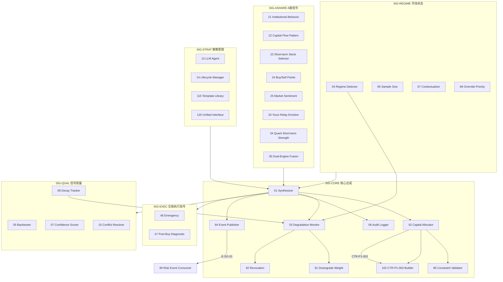

# 04 — D-SIGNAL 信号域

> **状态**: DRAFT | **核心层**: L03 信号生成 | **成熟度**: L1 🔵 骨架
> **一句话**: 从因子里生成交易信号

## §0 域定义

| 维度 | 内容 |
|------|------|
| 核心Aggregate | AGG-006 CompositeSignal / AGG-004 Strategy |
| 核心事件 | E-SG-01 SignalGenerated / E-SG-02 SignalRevoked / E-SG-03 SignalExpired |
| 开发状态 | 骨架——基础ABC+默认实现，缺子模块 |
| 优先级 | P0（核心价值链第三环） |
| 激活前提 | D-FACTOR 就绪 + CTR-002 可用 |

## §1 子模块清单

| ID | 名称 | 职责 | 优先级 | 开发状态 | 对标依据 |
|----|------|------|:------:|:--------:|---------|
| D-SIGNAL-01 | Synthesizer | 信号合成+权重分配 | P0 | ✅ 已有 | 专业标配; 信号融合理论；贝叶斯组合；动态权重; LLM信号合成推理；注意力机制动态权重；多模态信号融合; 合成逻辑可解释性；权重变更审计；信号来源追溯 |
| D-SIGNAL-02 | Capital Allocator | 资金分配：优化求解器+风险预算模块+约束注入(行业/风格/ESG)+再平衡调度 | P0 | ✅ 已有 | 专业标配; 风险平价/Kelly准则/均值-方差优化/层次风险平价; 强化学习动态配置/层次风险平价(HRP)进化/LLM宏观配置; 杠杆限制合规/集中度约束/最佳执行义务/风险预算审计 |
| D-SIGNAL-03 | Degradation Monitor | 信号降级监控+信号降级检测+通知下游→CTR-ERR-003 SignalDegradationWarning+E-SG-02 SignalRevoked。输入：因子IC/IR(CTR-P1-001)+信号置信度+数据质量评分。降级三级：MILD(因子IC衰减→通知+降权)/MODERATE(多因子同时衰减→通知+建议暂停)/SEVERE(数据源故障/模型崩溃→自动撤销信号)。降级→撤销流程：SEVERE→立即撤销所有相关信号(E-SG-02)→通知D-PORTFOLIO停止建仓→通知D-RISK重新评估。约束：降级判断必须可审计——每次降级决策的输入/阈值/结果必须记录 | P0 | ✅ 已有 | 与D-AUTONOMY漂移检测联动; 信号衰减理论/制度转换/在线学习漂移; 在线漂移检测(DDM/EDDM)/TiMi制度自适应/LLM归因诊断; 降级事件强制记录/投资者通知义务/策略降级审批链 |
| D-SIGNAL-04 | Market Regime Detector | 市场状态识别：Regime分类(3×3+3=12种，含基础网格9种+特殊Regime 3种CRISIS/RECOVERY/BREAKOUT)+置信度计算(HMM后验概率/规则置信度)+状态持久化(RegimeSnapshot持久化)+历史查询(历史Regime查询接口)+跨市场(4阶段跨市场方案) | P1 | ❌ | 技术仓库第74章; 5种市场状态→3×3网格化; 制度识别(HMM/变更点/聚类)/马尔可夫切换; TiMi时序混合制度识别/LLM宏观解读/图网络制度传播; 制度标签审计/模型风险披露/极端情景压力测试合规 |
| D-SIGNAL-05 | Signal Backtester | 信号驱动回测引擎+分层绩效+换手/成本/滑点模型 | P1 | ❌ | 专业标配; 信号级回测理论/前视偏差/统计显著性; R&D-Agent-Quant自动验证闭环/在线信号回测/因果信号回测; 前视偏差检测/多重检验校正/回测结果审计留痕 |
| D-SIGNAL-06 | Signal Audit Logger | 信号审计日志：事件采集器+WORM写入器+查询接口+合规报告生成器 | P0 | ❌ | 与D-AUTONOMY审计追踪集成; 审计日志不可变/事件溯源/WORM存储; 区块链审计链/实时审计流/LLM审计摘要; MiFID II交易审计/SEC记录保留(5年+)/WORM合规强制 |
| D-SIGNAL-07 | Signal Confidence Scorer | 信号置信度评分：校准模型(Platt/Isotonic)+不确定性估计(Ensemble/MC Dropout)+置信度时序追踪 | P1 | ❌ | 多因子置信度加权; 置信度校准(Platt/Isotonic)/不确定性量化; Conformal Prediction区间/LLM自评置信度/贝叶斯置信度; 置信度模型版本审计/低置信度强制人工审核/置信度披露 |
| D-SIGNAL-08 | Signal Decay Tracker | 信号衰减追踪 - 半衰期估计器/衰减曲线拟合/消散预警/历史衰减对比 | P1 | ❌ | 信号半衰期/信息衰减/Alpha消散; 在线衰减检测/TiMi自适应衰减建模/LLM衰减归因 |
| D-SIGNAL-09 | Signal Priority Router | 信号优先级路由：优先级队列+QoS策略引擎+路由决策树+过载保护。理论：优先级调度/服务质量(QoS)/动态路由。具备路由决策审计/公平性约束/最佳执行路由义务合规检查 | P1 | ❌ | 与D-PORTFOLIO Meta-Router联动; 优先级调度/服务质量(QoS)/动态路由; LLM动态路由推理/强化学习调度优化/多目标路由; 路由决策审计/公平性约束/最佳执行路由义务 |
| D-SIGNAL-10 | Signal Conflict Resolver | 信号冲突解决 | P1 | ❌ | 多策略信号冲突 |
| D-SIGNAL-11 | Signal Performance Tracker | 信号绩效追踪：滚动IC/IR/Sharpe+归因分解+基准比较+异常检测 | P2 | ❌ | 信号归因; 绩效归因/滚动评估/基准比较; 在线绩效评估/LLM绩效归因解释/自适应基准; GIPS绩效报告合规/绩效虚增检测/投资者绩效披露 |
| D-SIGNAL-12 | Signal Version Manager | 信号版本管理 - 版本树管理/A/B分流器/灰度发布调度/回滚引擎 | P1 | ❌ | 语义版本控制；A/B测试；灰度发布; 自动版本推荐/LLM变更影响评估/持续交付信号管线; 版本变更审批链/回滚审计/投资者版本通知 |
| D-SIGNAL-13 | LLM Strategy Agent | LLM策略Agent：RAG引擎(因子/信号知识库)+CoT推理器+策略生成器+幻觉检测 | P1 | ❌ | Ollama+qwen3:8b; LLM推理/思维链(CoT)/检索增强生成(RAG); AlphaCrafter LLM因子生成/多Agent辩论策略/LLM自我改进; 幻觉强制检测/LLM决策可解释性/人工审核门禁/AI决策披露 |
| D-SIGNAL-14 | Strategy Lifecycle Manager | 策略生命周期管理：策略状态机(7状态)+准入门禁+灰度调度+废弃流程 | P1 | ❌ | 8阶段生命周期; 策略生命周期(研发/测试/灰度/生产/废弃)状态机; 自适应生命周期节奏/LLM策略健康诊断/策略自愈; 策略上线审批链/下线投资者通知/策略变更审计 |
| D-SIGNAL-15 | Behavioral Bias Engine | 行为偏差引擎 | P3 | ❌ | 行为金融学 |
| D-SIGNAL-16 | Signal Conflict Resolution Engine | 信号冲突消解器：多信号冲突检测+优先级仲裁+置信度加权+冲突类型分类(方向冲突/幅度冲突/时点冲突)+消解策略选择。理论：冲突解决理论/多准则决策/贝叶斯聚合。具备冲突消解审计/仲裁规则记录/冲突结果可追溯合规检查 | P1 | ❌ | 冲突解决理论/多准则决策/贝叶斯聚合; LLM冲突推理/多Agent辩论消解/自适应冲突解决; 对抗辩论引擎; 冲突消解审计/仲裁规则记录/冲突结果可追溯合规 |
| D-SIGNAL-17 | Signal Confidence Calibrator | 信号置信度校准器：Platt Scaling/Isotonic Regression/温度缩放+校准质量评估(ECE/MCE)+自适应校准+多模型集成校准。理论：置信度校准/概率校准/可靠性图。具备校准方法审计/校准质量报告/置信度可靠性合规检查 | P1 | ❌ | 置信度校准/概率校准/可靠性图; Conformal Prediction/贝叶斯校准/在线校准; Platt Scaling/Isotonic Regression; 校准方法审计/校准质量报告/置信度可靠性合规 |
| D-SIGNAL-18 | Signal Out-of-Sample Validator | 信号样本外验证器：严格OOS验证框架+时间序列交叉验证+嵌套交叉验证+前瞻偏差检测+OOS性能衰减监控。理论：样本外验证/交叉验证/前瞻偏差。具备OOS验证审计/验证方法记录/OOS结果合规检查 | P1 | ❌ | 样本外验证/交叉验证/前瞻偏差; 嵌套交叉验证/时间序列CV/自适应验证; _walk-forward验证; OOS验证审计/验证方法记录/OOS结果合规 |
| D-SIGNAL-19 | Signal Dynamic Rebalancer | 信号动态再平衡器：基于Regime的信号权重动态调整+再平衡触发(阈值/时间/事件)+再平衡成本优化+再平衡频率优化。理论：动态资产配置/制度转换/再平衡理论。具备再平衡决策审计/成本分析报告/再平衡频率合规检查 | P1 | ❌ | 动态资产配置/制度转换/再平衡理论; 强化学习再平衡/自适应频率/成本感知再平衡; 均值方差再平衡; 再平衡决策审计/成本分析报告/再平衡频率合规 |
| D-SIGNAL-20 | Signal Tail Risk Protector | 信号尾部风险保护器：信号层面止损/熔断+尾部风险检测+极端情景保护+信号降级触发+保护效果评估。理论：尾部风险/止损理论/熔断机制。具备保护措施审计/触发事件记录/保护效果合规检查 | P1 | ❌ | 尾部风险/止损理论/熔断机制; 自适应止损/多时间框架止损/跨资产联动止损; 动态止损; 保护措施审计/触发事件记录/保护效果合规 |
| D-SIGNAL-21 | A-Share Institutional Behavior Analyzer | A股主力行为分析引擎：主力行为学分析(建仓-洗盘-试盘-再洗盘-拉升-出货6阶段识别)+洗盘vs出货识别+诱多行为检测+主力游资打架胜负判断(30分钟观察期)+主力行为分时特征识别。理论：主力行为学/市场微观结构/行为金融学。具备主力行为判断审计/操纵行为合规检查 | P0 | ❌ | A股主力行为学/建仓洗盘拉升出货6阶段/行为金融学; LLM主力意图推理/强化学习阶段识别/多Agent对抗博弈; 主力行为判断审计/操纵行为合规检查 |
| D-SIGNAL-22 | A-Share Capital Flow Pattern Analyzer | A股资金线形态分析引擎：五类资金线形态识别(四线开花-健康主升/机构独强-吸筹洗盘/机构主力背离-方向抉择/弱势反弹-诱多风险/全线溃退-恐慌下跌)+散户狂热反向指标+机构分歧机会识别器+资金线多线共振分析。理论：资金流向分析/形态识别/多线共振。具备资金形态判断审计/信号来源追溯合规检查 | P0 | ❌ | A股五类资金线形态/多线共振/反向指标; 深度学习形态识别/LLM资金意图推理/多模态资金形态融合; 资金形态判断审计/信号来源追溯合规 |
| D-SIGNAL-23 | A-Share Short-term Stock Selector | A股短线选股引擎：机构选股评分器(目标价空间40%+基本面30%+技术趋势20%+流动性10%)+强庄股识别器(走势独立/换手率异常/盘口神秘大单)+连板潜力评分卡(7维100分:连板高度/封单强度/板块效应/分歧程度/市值流动性/封板时间/催化强度)+连板分歧程度评估器。理论：多因子选股/评分卡模型/行为金融学。具备选股逻辑审计/评分模型合规检查 | P0 | ❌ | A股短线选股/连板评分卡/强庄股识别; LLM选股推理/强化学习评分优化/多Agent选股辩论; 选股逻辑审计/评分模型合规检查 |
| D-SIGNAL-24 | A-Share Intraday Buy/Sell Point Analyzer | A股日内买卖点引擎：6种买入模式(突破买点/回调买点/逆向资金买点/竞价弱转强/分时突破/回封打板)+6种卖出模式(目标价位止盈/趋势破位止盈/利好兑现止盈/封单减少止盈/龙头丧失止盈/强分歧止盈)+大盘环境确认+板块强度确认+资金流向确认。理论：技术分析/日内交易/分时分析。具备买卖点判断审计/执行质量合规检查 | P0 | ❌ | A股日内买卖点/6种买入模式/6种卖出模式; 强化学习买卖点优化/LLM买卖推理/多时间框架买卖信号; 买卖点判断审计/执行质量合规检查 |
| D-SIGNAL-25 | A-Share Market Sentiment Analyzer | A股市场情绪分析引擎：涨跌家数分析(二八分化检测)+涨停跌停数量分析(做多热情/恐慌蔓延)+赚钱效应评估器(涨停板/板块涨幅/市场温度)+次日回调风险预警器(指数涨个股跌→次日风险)+市场士气评估器(散户游资跟随度)+封板率分析+昨日涨停表现追踪。理论：市场情绪/行为金融学/逆向指标。具备情绪指标审计/投资者适当性合规检查 | P0 | ❌ | A股市场情绪/涨跌家数/涨停跌停/赚钱效应; NLP情绪分析/深度学习情绪预测/多模态情绪融合; 情绪指标审计/投资者适当性合规 |
| D-SIGNAL-26 | A-Share Sector Analyzer | A股板块分析引擎：板块强度评估(涨停数量/梯队完整性/板块指数趋势)+板块延续性判断(短期题材vs趋势题材/政策持续时间/资金介入深度)+板块轮动预警(连续大涨+放量+龙头滞涨→切换)+板块启动条件评估(技术突破+政策支持+订单落地)+大盘成交额风格适配(大成交→趋势票/小成交→妖股)+抱团瓦解切换信号检测。理论：板块轮动/行业分析/风格切换。具备板块判断审计/行业集中度合规检查 | P0 | ❌ | A股板块分析/板块轮动/风格切换; LLM板块推理/强化学习轮动预测/图网络板块传导; 板块判断审计/行业集中度合规 |
| D-SIGNAL-27 | A-Share Decision Priority Engine | A股决策优先级引擎：主力行为>市场情绪>技术分析的优先级框架+司令部意图推断器(从资金动向推断主力意图)+多信号综合决策器(司令部+士气+技术位综合判断)+事件征兆+资金流向提前布局引擎+次日策略调整器。理论：决策理论/多准则决策/贝叶斯推理。具备决策优先级审计/决策逻辑可解释性合规检查 | P1 | ❌ | A股决策优先级/主力>情绪>技术; LLM决策推理/多Agent辩论决策/因果决策; 决策优先级审计/决策逻辑可解释性合规 |
| D-SIGNAL-28 | A-Share Auction Session Analyzer | A股集合竞价分析器：竞价强弱验证(目标股/板块指数竞价验证)+竞价弱转强检测(前日烂板→次日竞价高开3%+/竞价量5%+)+竞价不及预期止损(前日涨停→次日低开-3%+/9:25-9:30卖出)+竞价博弈策略(根据竞价结果微调交易计划)。理论：集合竞价理论/拍卖理论/信息不对称。具备竞价判断审计/集合竞价合规检查 | P1 | ❌ | A股集合竞价/竞价弱转强/竞价博弈; 深度学习竞价预测/LLM竞价推理/多Agent竞价博弈; 竞价判断审计/集合竞价合规 |
| D-SIGNAL-29 | A-Share Intraday Pattern Analyzer | A股分时形态分析器：分时数据特征分析(分时形态/量价关系/大单行为/分时均线)+分时突破买点检测(开盘快速拉升突破前高/拉升放量回调缩量)+分时破位止损(跌破分时均线+反弹无力)+盘中时间段分析(开盘/上午/午盘/尾盘不同策略)+4分钟涨速异常资金检测。理论：分时分析/日内交易/微观结构。具备分时判断审计/日内交易合规检查 | P1 | ❌ | A股分时分析/分时形态/4分钟涨速; 深度学习分时预测/LLM分时推理/强化学习日内策略; 分时判断审计/日内交易合规 |
| D-SIGNAL-30 | A-Share Market Direction Predictor | A股大盘方向预测器：市场倾向性分类(牛市/熊市/震荡)+大盘日方向预测(涨/跌/震荡洗盘/震荡横盘)+市场主导玩家分类(机构市/游资市)+年线位置判断(指数在年线上方/附近/下方→牛/震/熊)+市场环境系数计算(牛市80-100%/震荡30-50%/熊市10-20%)。理论：市场预测/制度识别/趋势分析。具备方向预测审计/预测准确率合规检查 | P1 | ❌ | A股大盘方向/牛熊震荡/机构市游资市; 深度学习市场预测/LLM市场推理/多时间框架方向判断; 方向预测审计/预测准确率合规 |
| D-SIGNAL-31 | A-Share Market Phase Threshold Classifier | A股市场阶段阈值分类器：基于成交额阈值自动分类市场阶段(2.8万亿以上=增量牛市/1.6万亿=存量博弈/8000亿=缩量震荡/7000亿以下=流动性危机)+各阶段对应策略映射(增量→趋势票/存量→轮动/缩量→妖股/危机→空仓)+阶段转换信号检测。理论：市场微观结构/流动性分析/制度转换。具备阶段分类审计/策略映射合规检查 | P1 | ❌ | A股市场阶段/成交额阈值/增量存量缩量; 隐马尔可夫制度转换/深度学习阶段预测/LLM阶段推理; 阶段分类审计/策略映射合规 |
| D-SIGNAL-32 | A-Share Limit-Up Gene Evaluator | A股涨停基因4维评估器：封单质量三级阈值(封流比0.1/0.05/0.02+封单额50e6/20e6/5e6)+封板时间六级评分(9:25前/9:25-10:00/10:00-11:00/11:00-13:30/13:30-14:30/14:30后)+换手率分歧度双轨制(低位板<8%换手/高位板>15%换手)+该弱不弱检测(±2%偏差识别超预期表现)。理论：涨停板分析/微观结构/行为金融学。具备涨停基因评估审计/评分模型合规检查 | P1 | ❌ | A股涨停基因/封单质量/封板时间/换手率分歧; 深度学习涨停预测/LLM涨停推理/强化学习打板策略; 涨停基因评估审计/评分模型合规 |
| D-SIGNAL-33 | A-Share Youzi Relay Emotion Engine | A股游资接力情绪引擎：6因子0-100分评分(连板高度25分+封单质量20分+涨停时间15分+开板次数15分+竞价强度10分+助攻梯队10分)+情绪周期4+1阶段定位(冰点/反核/主升/疯狂/退潮)+各阶段策略映射。理论：行为金融学/情绪周期/市场微观结构。具备情绪评分审计/情绪周期合规检查 | P0 | ❌ | A股游资接力/6因子评分/情绪周期4+1; 深度学习情绪预测/LLM情绪推理/强化学习情绪周期策略; 情绪评分审计/情绪周期合规 |
| D-SIGNAL-34 | A-Share Quant Short-term Strength Engine | A股量化短线强度引擎：6维度0-100分评分(价格动量Z-score+行业强度+相对强度+资金+技术+风险)+A~E五级评级+与游资引擎双引擎融合(60%游资+40%量化+动态权重)+6类输出(主升龙头/二进三/跟风/复苏/伪强/地天反包)。理论：多因子模型/评分卡/集成学习。具备强度评分审计/评级模型合规检查 | P0 | ❌ | A股量化短线/6维度评分/A~E评级/双引擎融合; 深度学习强度预测/LLM强度推理/强化学习双引擎权重; 强度评分审计/评级模型合规 |
| D-SIGNAL-35 | A-Share Dual-Engine Fusion Decision Engine | A股双引擎融合决策输出器：游资引擎+量化引擎信号融合(60%游资+40%量化基准权重)+情绪周期自适应权重调整(冰点→量化70%/主升→游资70%/退潮→量化60%)+6类决策输出(主升龙头/二进三/跟风/复苏/伪强/地天反包)+PDF分布信号提取(方向/置信度/尾部风险/相对价值)。理论：集成学习/贝叶斯融合/决策理论。具备融合决策审计/权重调整合规检查 | P0 | ❌ | A股双引擎融合/自适应权重/6类输出/PDF信号; 深度学习融合决策/LLM决策推理/强化学习权重优化; 融合决策审计/权重调整合规 |
| D-SIGNAL-36 | A-Share Capital-Force Conflict Observer | A股主力游资打架观察器：30分钟窗口观察期+胜负判断逻辑(游资胜→持有/主力胜→离场/僵持→减半仓)+主力行为5阶段实时追踪(建仓-洗盘-试盘-拉升-出货)+洗盘vs出货实时区分+诱多行为实时检测。理论：博弈论/市场微观结构/行为金融学。具备打架观察审计/胜负判断合规检查 | P1 | ❌ | A股主力游资打架/30分钟窗口/胜负判断; 深度学习博弈预测/LLM博弈推理/多Agent对抗博弈; 打架观察审计/胜负判断合规 |
| D-SIGNAL-37 | A-Share Multi-Index Decline Period Detector | A股多指数下跌时段识别器：7大指数(上证/深证/创业板/科创50/中证500/中证1000/北证50)5分钟K线下跌时段识别+连续下跌合并为时间段+下跌幅度/速度/持续时间统计+全市场共振下跌检测。理论：多市场联动/共振分析/时间序列。具备下跌时段识别审计/多指数联动合规检查 | P1 | ❌ | A股7大指数/下跌时段/5分钟K线/共振检测; 深度学习下跌预测/LLM共振推理/图网络指数传导; 下跌时段识别审计/多指数联动合规 |
| D-SIGNAL-38 | A-Share Contrarian Capital 5-Day Tracker | A股逆势资金5日连续跟踪排名器：题材/个股5日连续逆势排名+资金流入趋势(增加/减少)+连续天数统计+逆势强度评分+排名变化追踪。理论：逆势投资/资金流向/行为金融学。具备逆势跟踪审计/排名逻辑合规检查 | P1 | ❌ | A股逆势资金/5日连续/排名追踪; 深度学习逆势预测/LLM逆势推理/强化学习逆势策略; 逆势跟踪审计/排名逻辑合规 |
| D-SIGNAL-39 | A-Share Emotion Ladder Classifier | A股情绪梯队自动分类器：按连板数/封板时间/漏板次数/市值→龙头/补涨龙/中军/跟风股4级分类+梯队完整性评估+梯队变化追踪+强转弱梯队检测(连板断板/炸板时间/独立行情)。理论：行为金融学/梯队理论/市场情绪。具备梯队分类审计/梯队判断合规检查 | P1 | ❌ | A股情绪梯队/4级分类/强转弱检测; 深度学习梯队预测/LLM梯队推理/图网络梯队传导; 梯队分类审计/梯队判断合规 |
| D-SIGNAL-40 | A-Share KDJ-MACD Multi-Period Screener | A股KDJ三周期+MACD多头确认筛选器：日线/120分/60分J<0+DIF>0&DEA>0+绿柱3日收敛+企稳/金叉两档+30天涨幅排序。理论：技术分析/多时间框架/振荡器组合。具备技术筛选审计/多周期信号合规检查 | P1 | ❌ | A股KDJ三周期/MACD多头/绿柱收敛/企稳金叉; 深度学习技术筛选/LLM技术推理/强化学习技术策略; 技术筛选审计/多周期信号合规 |
| D-SIGNAL-41 | A-Share Sector Capital Rotation Timeline | A股板块资金轮动时间线生成器：当日资金流入流出板块时间顺序+时间段+资金额+涨跌幅+>5%涨跌个股+轮动路径可视化。理论：板块轮动/资金流向/时间序列。具备轮动时间线审计/轮动逻辑合规检查 | P1 | ❌ | A股板块轮动/资金时间线/轮动路径; 深度学习轮动预测/LLM轮动推理/图网络板块传导; 轮动时间线审计/轮动逻辑合规 |
| D-SIGNAL-42 | A-Share Signal Post-Rise Filter | A股信号后涨幅过滤器：逆势信号后个股瞬间拉升>3%→标记无效信号+避免追高+有效/无效信号统计+信号质量评估。理论：信号过滤/行为金融学/追高规避。具备信号过滤审计/过滤逻辑合规检查 | P2 | ❌ | A股信号过滤/3%阈值/无效信号标记; 深度学习信号质量评估/LLM信号推理/强化学习信号过滤; 信号过滤审计/过滤逻辑合规 |
| D-SIGNAL-43 | A-Share Contrarian Signal Phase Filter | A股逆势信号市场阶段过滤器：牛市回调期信号强/熊市主跌段信号弱/震荡市信号中等→调整信号权重+市场阶段自适应信号强度。理论：制度识别/自适应信号/行为金融学。具备阶段过滤审计/权重调整合规检查 | P2 | ❌ | A股逆势信号/市场阶段/权重调整; 深度学习阶段预测/LLM阶段推理/自适应权重; 阶段过滤审计/权重调整合规 |
| D-SIGNAL-44 | A-Share Market Breadth Monitor | A股市场真实广度监控器：全市场上涨/下跌家数比值+广度极低时逆势信号更可靠+广度趋势追踪+广度极值预警。理论：市场广度/腾落指数/逆向指标。具备广度监控审计/广度指标合规检查 | P2 | ❌ | A股市场广度/涨跌家数/逆向指标; 深度学习广度预测/LLM广度推理/强化学习广度策略; 广度监控审计/广度指标合规 |
| D-SIGNAL-45 | A-Share Plan Conformity Evaluator | A股计划吻合度量化评估器：吻合度>80%按计划/30-80%调整因子/<30%放弃→三级裁定+计划偏差归因+调整因子推荐。理论：决策理论/计划执行偏差/行为金融学。具备吻合度评估审计/计划执行合规检查 | P2 | ❌ | A股计划吻合度/三级裁定/偏差归因; LLM吻合度推理/强化学习计划执行/自适应调整; 吻合度评估审计/计划执行合规 |
| D-SIGNAL-46 | A-Share Emergency Opportunity Evaluator | A股应急机会5分钟快速评估器：5分钟内三重判断(主线契合+仓位限制+风险收益比)→拒绝/应急轻仓+应急交易记录+应急效果统计。理论：快速决策/启发式/风险收益。具备应急评估审计/应急交易合规检查 | P2 | ❌ | A股应急评估/5分钟/三重判断; LLM应急推理/强化学习应急策略/快速决策; 应急评估审计/应急交易合规 |
| D-SIGNAL-47 | A-Share Post-Buy Quick Diagnostician | A股买入后5-15分钟诊断器：5-15分钟内健康/危险信号诊断+危险则首分钟止损+诊断结果记录+诊断准确率追踪。理论：实时监控/快速诊断/行为金融学。具备诊断审计/止损执行合规检查 | P2 | ❌ | A股买入后诊断/5-15分钟/健康危险; 深度学习诊断预测/LLM诊断推理/强化学习止损; 诊断审计/止损执行合规 |
| D-SIGNAL-48 | A-Share Gap Support-Pressure Converter | A股跳空缺口支撑压力转换器：低开破支撑→支撑转压力/高开破压力站稳→压力转支撑+缺口回补检测+缺口类型分类(突破/测量/衰竭)。理论：缺口理论/技术分析/支撑压力转换。具备缺口转换审计/支撑压力合规检查 | P2 | ❌ | A股跳空缺口/支撑压力转换/缺口回补; 深度学习缺口预测/LLM缺口推理/强化学习缺口策略; 缺口转换审计/支撑压力合规 |
| D-SIGNAL-49 | A-Share Contrarian Signal Sensitivity Configurator | A股逆势信号灵敏度配置器：牛市回调期灵敏度提高/熊市主跌段灵敏度降低/震荡市灵敏度中等+市场阶段自适应灵敏度+灵敏度回测验证+灵敏度变更审计。理论：自适应参数/制度识别/信号优化。具备灵敏度配置审计/参数变更合规检查 | P2 | ❌ | A股逆势灵敏度/市场阶段自适应/参数配置; 深度学习灵敏度优化/LLM参数推理/强化学习灵敏度策略; 灵敏度配置审计/参数变更合规 |
| D-SIGNAL-50 | A-Share Broken Board Definer | A股烂板定义判定器：开板≥1次或尾盘封板=烂板+烂板率统计+烂板后次日表现追踪+烂板股风险评级。理论：技术分析/涨停板理论/行为金融学。具备烂板定义审计/烂板统计合规检查 | P2 | ❌ | A股烂板/开板检测/尾盘封板; 深度学习烂板预测/LLM烂板推理/强化学习烂板策略; 烂板定义审计/烂板统计合规 |
| D-SIGNAL-51 | A-Share 4-Min Surge Anomaly Detector | A股4分钟涨速异常探测器：4分钟涨速榜异常作为最早买入信号+结合事件推理在新闻出现前提前布局+涨速阈值可配置。理论：异常检测/高频信号/事件驱动。具备涨速异常审计/异常信号合规检查 | P2 | ❌ | A股4分钟涨速/异常检测/提前布局; 深度学习涨速预测/LLM涨速推理/强化学习涨速策略; 涨速异常审计/异常信号合规 |
| D-SIGNAL-52 | A-Share Multi-Day Breakdown Confirmer | A股有效跌破多日确认器：连续2日收于支撑位下方=有效跌破+假跌破过滤+跌破后回抽确认+跌破信号强度分级。理论：技术分析/支撑压力/假突破过滤。具备跌破确认审计/跌破信号合规检查 | P2 | ❌ | A股有效跌破/连续2日/假跌破过滤; 深度学习跌破预测/LLM跌破推理/强化学习跌破策略; 跌破确认审计/跌破信号合规 |
| D-SIGNAL-53 | A-Share Seal Order Level Jump Detector | A股封单级别跃变检测器：封单从亿级→千万级=跃变+封流比<0.1%预警+跃变速率追踪+跃变后走势统计。理论：订单流分析/封单理论/行为金融学。具备封单跃变审计/封单信号合规检查 | P2 | ❌ | A股封单跃变/亿级千万级/封流比; 深度学习封单预测/LLM封单推理/强化学习封单策略; 封单跃变审计/封单信号合规 |
| D-SIGNAL-54 | A-Share Capital-Force Conflict Arbiter | A股主力游资冲突仲裁器：30分钟观察窗口+游资胜→持有/主力胜→离场/僵持→减半仓+冲突强度量化+冲突历史统计。理论：博弈论/多空博弈/行为金融学。具备冲突仲裁审计/仲裁决策合规检查 | P2 | ❌ | A股主力游资冲突/30分钟观察/仲裁决策; 深度学习冲突预测/LLM冲突推理/博弈论策略; 冲突仲裁审计/仲裁决策合规 |
| D-SIGNAL-55 | A-Share National Team Dual-Mode Identifier | A股国家队操纵双模式识别器：拉证券诱多→减仓/拉银行石油洗盘→持有/关键点位护盘→跟随+操纵模式分类+应对策略映射。理论：行为金融学/市场操纵/制度分析。具备操纵识别审计/应对策略合规检查 | P2 | ❌ | A股国家队/操纵模式/诱多洗盘; 深度学习操纵预测/LLM操纵推理/强化学习应对策略; 操纵识别审计/应对策略合规 |
| D-SIGNAL-56 | A-Share Sector Dual-List Cross Filter | A股板块双榜交叉筛选器：开盘30分钟内板块涨幅前5∩资金净流入前5=最强主线+双榜排名变化追踪+主线确认置信度。理论：板块轮动/资金流向/交叉验证。具备双榜筛选审计/主线确认合规检查 | P2 | ❌ | A股板块双榜/交叉筛选/最强主线; 深度学习主线预测/LLM主线推理/强化学习主线策略; 双榜筛选审计/主线确认合规 |
| D-SIGNAL-57 | A-Share Dual-Engine 5-Type Decision Mapper | A股双引擎融合5类操作映射器：主升龙头(双分>90+主线→打板)/龙头二进三(游资高+量化80+→半路)/龙二龙三(游资高+量化中→只低吸)/老龙头复苏(量化高+游资中→反抽)/伪强票(游资高+量化低→禁追)。理论：多因子决策/分类映射/行为金融学。具备操作映射审计/分类决策合规检查 | P2 | ❌ | A股双引擎/5类操作/打板半路低吸; 深度学习操作预测/LLM操作推理/强化学习操作策略; 操作映射审计/分类决策合规 |
| D-SIGNAL-58 | A-Share Emotion Cycle 4+1 Stage Action Mapper | A股情绪周期4+1阶段操作映射器：冰点期(连板断层→空仓/埋伏)/反核期(首板密集→小仓试错)/主升期(龙头加速→核心仓做龙头)/疯狂期(高位接力→只做龙头)/退潮期(断板潮→空仓等冰点)。理论：情绪周期/行为金融学/市场心理学。具备情绪映射审计/操作策略合规检查 | P2 | ❌ | A股情绪周期/4+1阶段/操作映射; 深度学习情绪预测/LLM情绪推理/强化学习情绪策略; 情绪映射审计/操作策略合规 |
| D-SIGNAL-61 | A-Share Unexpected Strength/Weakness Detector | A股该弱不弱/该强不强检测器：逆势中该弱不弱=强于预期→信号增强/该强不强=弱于预期→信号减弱+预期差量化+历史胜率追踪。理论：预期差/行为金融学/逆向指标。具备预期差检测审计/信号调整合规检查 | P2 | ❌ | A股预期差/该弱不弱/该强不强; 深度学习预期差预测/LLM预期差推理/强化学习预期差策略; 预期差检测审计/信号调整合规 |
| D-SIGNAL-62 | A-Share Auction Weak-to-Strong Detector | A股竞价弱转强检测器：竞价阶段由弱转强信号检测+竞价不及预期止损联动+竞价量能异常+竞价情绪评分。理论：集合竞价/行为金融学/情绪转折。具备竞价检测审计/竞价信号合规检查 | P2 | ❌ | A股竞价弱转强/竞价情绪/竞价量能; 深度学习竞价预测/LLM竞价推理/强化学习竞价策略; 竞价检测审计/竞价信号合规 |
| D-SIGNAL-63 | A-Share Rotation Warning Signaler | A股轮动预警信号器：板块资金快进快出+轮动加速+主线切换预警+轮动周期统计+轮动信号强度分级。理论：板块轮动/资金流向/周期分析。具备轮动预警审计/轮动信号合规检查 | P2 | ❌ | A股轮动预警/资金快进快出/主线切换; 深度学习轮动预测/LLM轮动推理/强化学习轮动策略; 轮动预警审计/轮动信号合规 |
| D-SIGNAL-64 | A-Share Multi-Concept Overlay Bonus Calculator | A股多概念叠加加分计算器：个股叠加多个热门概念时加分+概念叠加权重配置+概念热度衰减+叠加效应统计。理论：概念投资/行为金融学/注意力经济。具备叠加加分审计/概念权重合规检查 | P2 | ❌ | A股多概念叠加/概念热度/叠加加分; 深度学习概念预测/LLM概念推理/强化学习概念策略; 叠加加分审计/概念权重合规 |
| D-SIGNAL-65 | Regime Sample Size Adequacy Checker | Regime样本量充足性检验器：检验每个Regime分类是否有足够样本量+最少83天/220天统计显著性验证+样本量不足告警+样本量趋势追踪。理论：统计显著性/样本量/假设检验。具备样本量检验审计/Regime分类统计合规检查 | P1 | ❌ | 统计显著性; 样本量; 假设检验; Regime分类 |
| D-SIGNAL-66 | Regime Classification System Extender | Regime分类体系扩展器：3×3=9种基础+CRISIS/RECOVERY/BREAKOUT特殊Regime+支持扩展到>9种+分类体系版本管理+分类体系热更新。理论：分类体系/扩展性/版本管理。具备分类体系审计/Regime分类扩展合规检查 | P2 | ❌ | 分类体系; 扩展性; 版本管理; Regime分类 |
| D-SIGNAL-67 | Regime Signal Contextualizer | Regime信号上下文化器：Regime信号作为输入上下文而非绝对触发器+AQR警告因子择时摧毁价值+上下文化信号输出+Regime条件概率。理论：上下文化/因子择时/条件概率。具备上下文化审计/Regime信号使用合规检查 | P1 | ❌ | 上下文化; 因子择时; 条件概率; Regime信号 |
| D-SIGNAL-68 | Regime Special Override Priority Manager | Regime特殊覆盖优先级管理器：CRISIS/RECOVERY/BREAKOUT优先级高于基础3×3网格+优先级仲裁逻辑+特殊Regime覆盖基础Regime+覆盖日志。理论：优先级管理/覆盖/仲裁。具备优先级管理审计/Regime覆盖合规检查 | P1 | ❌ | 优先级管理; 覆盖; 仲裁; Regime覆盖 |
| D-SIGNAL-69 | Signal Normalizer | 信号归一化器：raw_signal_value归一化到[-3.0,3.0]+归一化策略选择(Z-score/Min-Max/Robust)+归一化参数自适应+归一化质量检查。理论：归一化/标准化/信号处理。具备归一化审计/信号质量合规检查 | P2 | ❌ | 归一化; 标准化; 信号处理; 信号质量 |
| D-SIGNAL-70 | Factor Consistency Confidence Calculator | 因子一致性置信度计算器：基于因子一致性计算confidence+同方向因子占比→置信度+一致性趋势追踪+一致性突变检测。理论：一致性/置信度/信号聚合。具备一致性审计/置信度计算合规检查 | P2 | ❌ | 一致性; 置信度; 信号聚合; 因子一致性 |
| D-SIGNAL-71 | Signal TTL Timeout Manager | 信号TTL超时管理器：每个信号有ttl_seconds+超时自动EXPIRED(E-SG-03)+TTL策略配置(不同信号类型不同TTL)+TTL过期清理+TTL统计。理论：TTL/过期/生命周期。具备TTL审计/信号生命周期合规检查 | P2 | ❌ | TTL; 过期; 生命周期; 信号TTL |
| D-SIGNAL-72 | Risk-Signal Interaction Sequencer | 风控-信号交互时序管理器：风控熔断E-RK-01→信号撤销E-SG-02+风控是因撤销是果+时序保证+因果链追踪+时序违规检测。理论：时序/因果/事件驱动。具备交互时序审计/风控信号交互合规检查 | P1 | ❌ | 时序; 因果; 事件驱动; 风控信号交互 |
| D-SIGNAL-73 | Signal Direction Threshold Configurator | 信号方向阈值配置器：信号方向判定阈值可配置+默认±0.5+不同策略对信号敏感度不同+阈值优化+阈值回测。理论：阈值/配置/敏感度。具备阈值配置审计/信号方向判定合规检查 | P2 | ❌ | 阈值; 配置; 敏感度; 信号方向 |
| D-SIGNAL-74 | Regime Failure Mode Diagnoser | Regime失效模式诊断器：区分模糊失效vs清晰失效+模糊失效=不知道是市场还是因子问题+清晰失效=知道哪个市场哪个regime+失效模式报告+失效模式趋势追踪。理论：失效模式/诊断/模糊vs清晰。具备失效诊断审计/Regime失效合规检查 | P2 | ❌ | Regime失效诊断/模糊失效vs清晰失效; 失效模式/诊断/模糊vs清晰; 自适应诊断/在线失效监控/失效模式分析; 失效诊断审计/Regime失效合规 |
| D-SIGNAL-75 | Regime Trading Implication Distinguisher | Regime交易含义区分器：PinnacleMM的CRISIS/BREAKOUT/TRANSITION交易含义和普通HIGH_VOLATILITY完全不同+区分Regime的交易含义+交易含义→信号权重映射。理论：交易含义/区分/信号权重。具备交易含义审计/Regime交易含义合规检查 | P1 | ❌ | Regime交易含义/CRISIS/BREAKOUT/TRANSITION; 交易含义/区分/信号权重; 自适应交易含义/在线Regime监控/交易含义→权重映射; 交易含义审计/Regime交易含义合规 |
| D-SIGNAL-76 | Regime Macro Indicator Driver | Regime宏观指标驱动器：HMM学术实现用PMI/VIX/收益率曲线等宏观指标驱动Regime分类+含宏观指标数据接入+宏观指标权重+宏观指标更新。理论：宏观指标/HMM/Regime分类。具备宏观指标审计/Regime宏观驱动合规检查 | P2 | ❌ | Regime宏观指标/PMI/VIX/收益率曲线; 宏观指标/HMM/Regime分类; 自适应宏观指标/在线指标更新/指标权重优化; 宏观指标审计/Regime宏观驱动合规 |
| D-SIGNAL-77 | Factor Coverage Rate Calculator | 因子覆盖率计算器：可用因子/总因子数+<80%→MILD/<50%→MODERATE/<20%→SEVERE三级阈值+覆盖率趋势+覆盖率告警。理论：覆盖率/三级阈值/趋势。具备覆盖率审计/因子覆盖率合规检查 | P1 | ❌ | 因子覆盖率/可用/总数/三级阈值; 覆盖率/三级阈值/趋势; 自适应覆盖率阈值/在线覆盖率监控/覆盖率告警; 覆盖率审计/因子覆盖率合规 |
| D-SIGNAL-78 | Signal Confidence Trend Monitor | 信号置信度趋势监控器：近期confidence均值+连续5次<0.5→MILD触发降级+置信度趋势追踪+置信度突变检测。理论：置信度/趋势/降级触发。具备置信度审计/信号置信度合规检查 | P2 | ❌ | 信号置信度趋势/连续5次<0.5/MILD; 置信度/趋势/降级触发; 自适应置信度阈值/在线置信度监控/置信度突变检测; 置信度审计/信号置信度合规 |
| D-SIGNAL-79 | Factor Decay Linkage Degradation Handler | 因子衰减联动降级器：消费CTR-P1-001 FactorMonitorReport+因子is_effective=False→对应信号降级+衰减因子→信号降级映射+衰减联动统计。理论：衰减联动/因子衰减/信号降级。具备衰减联动审计/因子衰减联动合规检查 | P1 | ❌ | 因子衰减联动/CTR-P1-001/is_effective; 衰减联动/因子衰减/信号降级; 自适应联动策略/在线衰减监控/衰减→降级映射; 衰减联动审计/因子衰减联动合规 |
| D-SIGNAL-80 | Degradation Notification Downstream Manager | 降级处置通知下游管理器：MILD标记继续/MODERATE标记+通知下游CTR-ERR-003/SEVERE输出空信号NEUTRAL+通知下游+通知路由/通知优先级/通知去重。理论：通知管理/降级处置/下游通知。具备通知管理审计/降级通知合规检查 | P1 | ❌ | 降级通知/MILD/MODERATE/SEVERE/CTR-ERR-003; 通知管理/降级处置/下游通知; 自适应通知策略/在线通知监控/通知去重; 通知管理审计/降级通知合规 |
| D-SIGNAL-81 | Empty Signal NEUTRAL Strategy Manager | 空信号NEUTRAL策略管理器：SEVERE降级时输出NEUTRAL+confidence=0+下游可自行决定是否使用+比不发信号更好因为不发=信息缺失+空信号统计。理论：空信号/NEUTRAL/信息缺失。具备空信号审计/空信号策略合规检查 | P2 | ❌ | 空信号NEUTRAL/SEVERE降级/confidence=0; 空信号/NEUTRAL/信息缺失; 自适应空信号策略/在线空信号监控/空信号统计; 空信号审计/空信号策略合规 |
| D-SIGNAL-82 | Signal Lifecycle State Machine Manager | 信号生命周期状态机管理器：GENERATED→CONSUMED/REVOKED/EXPIRED三种终态+状态转换规则/转换条件/状态查询+状态变更事件发布。理论：生命周期/状态机/终态。具备生命周期审计/信号状态合规检查 | P1 | ❌ | 信号生命周期/GENERATED→CONSUMED/REVOKED/EXPIRED; 生命周期/状态机/终态; 自适应状态转换/在线状态监控/状态变更事件; 生命周期审计/信号状态合规 |
| D-SIGNAL-83 | Signal Expired Unconsumed Detector | 信号超时未消费检测器：EXPIRED终态超时未消费的信号自动过期+超时检测/过期清理/过期统计+TTL策略配置。理论：超时/过期/TTL。具备超时检测审计/信号过期合规检查 | P2 | ❌ | 信号超时未消费/EXPIRED/TTL; 超时/过期/TTL; 自适应TTL/在线超时检测/过期清理; 超时检测审计/信号过期合规 |
| D-SIGNAL-84 | Signal Direction Inferrer | 信号方向推断器：signal_value>threshold→LONG/<-threshold→SHORT/|signal_value|<=threshold→NEUTRAL+阈值配置/方向推断/方向变更检测。理论：方向推断/阈值/变更检测。具备方向推断审计/信号方向合规检查 | P2 | ❌ | 信号方向推断/LONG/SHORT/NEUTRAL/阈值; 方向推断/阈值/变更检测; 自适应阈值/在线方向监控/方向变更检测; 方向推断审计/信号方向合规 |
| D-SIGNAL-85 | Capital Allocation Constraint Validator | 资本分配约束校验器：sum==1.0/min>=5%/max<=40%三个约束校验+约束违反检测/约束修正/约束告警+约束配置。理论：约束校验/违反检测/修正。具备约束校验审计/资本分配约束合规检查 | P1 | ❌ | 资本分配约束/sum==1.0/min>=5%/max<=40%; 约束校验/违反检测/修正; 自适应约束/在线约束监控/约束修正; 约束校验审计/资本分配约束合规 |
| D-SIGNAL-86 | Signal Strength Allocation Strategist | 信号强度分配策略器：第2种分配策略信号强的策略分配更多+信号强度计算/强度→分配映射+强度归一化。理论：信号强度/分配/映射。具备信号强度审计/信号强度分配合规检查 | P2 | ❌ | 信号强度分配/信号强→分配多/强度映射; 信号强度/分配/映射; 自适应强度映射/在线强度监控/强度归一化; 信号强度审计/信号强度分配合规 |
| D-SIGNAL-87 | Regime-Aware Market State Adaptive Synthesizer | Regime-aware市场状态自适应合成器：第5种合成策略regime-aware+根据市场状态自动调整合成权重+待深入设计+Regime→权重映射。理论：Regime-aware/自适应/权重映射。具备Regime-aware审计/市场状态自适应合规检查 | P2 | ❌ | Regime-aware合成/市场状态自适应/权重映射; Regime-aware/自适应/权重映射; 自适应Regime权重/在线市场状态/Regime→权重映射; Regime-aware审计/市场状态自适应合规 |
| D-SIGNAL-88 | Factor Validity Filter | 因子有效性过滤器：合成流程第2步过滤is_valid=False的因子+因子有效性实时判断/过滤逻辑/过滤后因子不足告警+过滤统计。理论：有效性/过滤/告警。具备有效性过滤审计/因子过滤合规检查 | P1 | ❌ | 因子有效性过滤/is_valid=False/过滤告警; 有效性/过滤/告警; 自适应过滤策略/在线有效性监控/过滤后因子不足告警; 有效性过滤审计/因子过滤合规 |
| D-SIGNAL-89 | Regime Architecture Correctness Validator | Regime验证架构正确性检查器：Phase1先用A股把18个regime模型跑通+样本少但regime纯度最高→验证架构正确性+架构正确性检查清单。理论：架构验证/正确性/Phase1。具备架构验证审计/Regime架构正确性合规检查 | P2 | ❌ | Regime架构验证/Phase1/A股18个regime; 架构验证/正确性/Phase1; 自适应验证策略/在线架构监控/正确性检查清单; 架构验证审计/Regime架构正确性合规 |
| D-SIGNAL-90 | ML Weight Synthesis Strategist | ML权重合成策略器：第4种合成策略ML权重+用ML模型学习最优合成权重+训练数据/模型选择/在线更新+ML权重→信号值映射。理论：ML权重/合成策略/在线学习。具备ML权重审计/ML合成合规检查 | P2 | ❌ | ML权重合成/第4种策略/在线学习; ML权重/合成策略/在线学习; 自适应ML权重/在线模型更新/ML权重→信号值映射; ML权重审计/ML合成合规 |
| D-SIGNAL-91 | Signal Downgrade Weight Executor | 信号降权执行器：MILD降级时通知+降权+降权比例计算/降权执行/降权恢复+降权历史统计。理论：降权/比例计算/恢复。具备降权审计/降权执行合规检查 | P1 | ❌ | 信号降权/MILD/降权比例/恢复; 降权/比例计算/恢复; 自适应降权比例/在线降权监控/降权恢复; 降权审计/降权执行合规 |
| D-SIGNAL-92 | Signal Revocation Executor | 信号撤销执行器：SEVERE降级时自动撤销信号+撤销逻辑/撤销确认/撤销后下游通知+撤销统计。理论：撤销/确认/下游通知。具备撤销审计/信号撤销合规检查 | P1 | ❌ | 信号撤销/SEVERE/撤销确认/下游通知; 撤销/确认/下游通知; 自适应撤销策略/在线撤销监控/撤销统计; 撤销审计/信号撤销合规 |
| D-SIGNAL-93 | Factor Missing Ratio Calculator | 因子缺失比例计算器：因子缺失>50%→is_degraded=True+缺失因子计数/缺失比例计算/缺失趋势追踪+缺失告警。理论：缺失比例/计数/趋势。具备缺失比例审计/因子缺失合规检查 | P1 | ❌ | 因子缺失比例/>50%/is_degraded; 缺失比例/计数/趋势; 自适应缺失阈值/在线缺失监控/缺失告警; 缺失比例审计/因子缺失合规 |
| D-SIGNAL-94 | SynthesizedSignal Event Publisher | SynthesizedSignal事件发布器：产出CTR-P1-015 SynthesizedSignal/E-SG-01事件发布+事件格式/事件发布/事件消费确认+发布性能监控。理论：事件发布/格式/确认。具备事件发布审计/信号事件发布合规检查 | P1 | ❌ | SynthesizedSignal事件/CTR-P1-015/E-SG-01; 事件发布/格式/确认; 自适应发布策略/在线发布监控/发布性能; 事件发布审计/信号事件发布合规 |
| D-SIGNAL-95 | IC Weighted Synthesis Strategist | IC加权合成策略器：第3种合成策略IC加权+近期IC高的因子权重大+IC获取/IC→权重映射/IC衰减调整。理论：IC加权/权重映射/衰减。具备IC加权审计/IC合成合规检查 | P2 | ❌ | IC加权合成/第3种策略/IC→权重; IC加权/权重映射/衰减; 自适应IC权重/在线IC监控/IC衰减调整; IC加权审计/IC合成合规 |
| D-SIGNAL-96 | Sharpe Ratio Allocation Strategist | 夏普比率分配策略器：第3种分配策略夏普比率分配+历史夏普高的策略分配更多+夏普获取/夏普→分配映射/夏普衰减调整。理论：夏普分配/映射/衰减。具备夏普分配审计/夏普分配合规检查 | P2 | ❌ | 夏普比率分配/第3种策略/夏普→分配; 夏普分配/映射/衰减; 自适应夏普权重/在线夏普监控/夏普衰减调整; 夏普分配审计/夏普分配合规 |
| D-SIGNAL-97 | Risk Parity Allocation Strategist | 风险平价分配策略器：第4种分配策略风险平价分配+波动率低的策略分配更多+波动率获取/波动率→分配映射/波动率估计。理论：风险平价/波动率/映射。具备风险平价审计/风险平价分配合规检查 | P2 | ❌ | 风险平价分配/第4种策略/波动率→分配; 风险平价/波动率/映射; 自适应风险平价/在线波动率监控/波动率估计; 风险平价审计/风险平价分配合规 |
| D-SIGNAL-98 | Signal Consistency Calculator | 信号一致性计算器：同方向因子占比+<60%→MILD/<40%→MODERATE+方向统计/一致性评分/一致性趋势。理论：一致性/方向统计/评分。具备一致性审计/信号一致性合规检查 | P1 | ❌ | 信号一致性/同方向因子占比/60% 40%; 一致性/方向统计/评分; 自适应一致性阈值/在线一致性监控/一致性趋势; 一致性审计/信号一致性合规 |
| D-SIGNAL-99 | Risk Event E-RK-01 Consumer Handler | 风控事件E-RK-01消费处理器：信号域消费风控E-RK-01事件后发出E-SG-02信号撤销事件+事件消费/事件确认/事件重试+消费性能监控。理论：事件消费/确认/重试。具备事件消费审计/风控事件消费合规检查 | P1 | ❌ | 风控事件消费/E-RK-01/E-SG-02; 事件消费/确认/重试; 自适应消费策略/在线消费监控/消费性能; 事件消费审计/风控事件消费合规 |
| D-SIGNAL-100 | CTR-TRACE-001 TraceContext Propagator | CTR-TRACE-001 TraceContext传播器：所有信号输出携带TraceContext+TraceContext生成/传播/采集/查询+传播性能监控。理论：TraceContext/传播/采集。具备TraceContext审计/追踪传播合规检查 | P1 | ❌ | TraceContext传播/CTR-TRACE-001/生成采集; TraceContext/传播/采集; 自适应传播策略/在线传播监控/传播性能; TraceContext审计/追踪传播合规 |
| D-SIGNAL-101 | Strategy Shared Kernel Synchronizer | Strategy共享内核同步器：合成权重归信号域/目标权重归组合域的同步+权重变更通知/权重一致性检查/权重冲突解决+同步性能监控。理论：共享内核/同步/冲突解决。具备同步审计/共享内核同步合规检查 | P1 | ❌ | Strategy共享内核/合成权重目标权重/同步; 共享内核/同步/冲突解决; 自适应同步策略/在线同步监控/权重一致性; 同步审计/共享内核同步合规 |
| D-SIGNAL-102 | CapitalAllocationResult CTR-P1-003 Builder | CapitalAllocationResult CTR-P1-003构建器：资本分配结果构建+分配结果序列化/分配结果校验/分配结果分发+分配结果历史。理论：分配结果/序列化/校验。具备分配结果审计/分配结果合规检查 | P1 | ❌ | CapitalAllocationResult/CTR-P1-003/分配结果构建; 分配结果/序列化/校验; 自适应构建/在线分配监控/分配结果历史; 分配结果审计/分配结果合规 |
| D-SIGNAL-103 | Strategy Historical Performance Data Provider | 策略历史绩效数据提供者：分配策略需要各策略的历史绩效数据+绩效数据获取/绩效数据缓存/绩效数据更新+绩效数据质量检查。理论：绩效数据/缓存/更新。具备绩效数据审计/绩效数据合规检查 | P1 | ❌ | 策略历史绩效/绩效数据缓存/绩效更新; 绩效数据/缓存/更新; 自适应缓存/在线绩效监控/绩效数据质量; 绩效数据审计/绩效数据合规 |
| D-SIGNAL-104 | Regime Level 3 Thinking Dimension Extender | Regime Level 3 Thinking维度扩展器：Regime判断时加入"主力-散户-我"3层思维维度+3层思维建模/3层思维信号融合/3层思维权重+Level 3 Thinking信号输出。理论：Level 3 Thinking/3层思维/博弈论。具备3层思维审计/Regime思维维度合规检查 | P2 | ❌ | Regime Level 3 Thinking/主力-散户-我/3层思维; Level 3 Thinking/3层思维/博弈论; 自适应思维权重/在线3层思维监控/思维信号融合; 3层思维审计/Regime思维维度合规 |
| D-SIGNAL-105 | 代码生成流程编排器 | NozyIO可视化编辑→完整代码生成流程编排+语法校验+代码预览。理论：可视化编程/代码生成/流程编排。具备代码生成审计/语法校验合规检查 | P2 | ❌ | NozyIO/代码生成/流程编排; 可视化编程/代码生成/语法校验; 自适应代码生成/在线语法校验/代码预览; 代码生成审计/语法校验合规 |
| D-SIGNAL-106 | 原子化策略模块库 | 原子化模块库+模块图标陈列+模块分类+模块搜索+模块版本。理论：原子化设计/模块化/组件库。具备模块库审计/模块版本合规检查 | P2 | ❌ | 原子化模块/模块图标/模块分类; 原子化设计/模块化/组件库; 自适应模块推荐/在线模块搜索/模块版本管理; 模块库审计/模块版本合规 |
| D-SIGNAL-107 | 画布拖拽连线引擎 | 画布区域+拖拽连线+连线逻辑校验+连线可视化+自动布局。理论：可视化编辑/拖拽交互/图布局。具备连线逻辑审计/连线校验合规检查 | P2 | ❌ | 画布编辑/拖拽连线/自动布局; 可视化编辑/拖拽交互/图布局; 自适应布局/在线连线校验/连线可视化; 连线逻辑审计/连线校验合规 |
| D-SIGNAL-108 | K线图交互工具集 | K线图画线工具+技术指标叠加+交互操作+自动转化。理论：技术分析/K线图/交互设计。具备画线工具审计/技术指标合规检查 | P2 | ❌ | K线图/画线工具/技术指标叠加; 技术分析/K线图/交互设计; 自适应画线/在线指标叠加/交互操作; 画线工具审计/技术指标合规 |
| D-SIGNAL-109 | 策略流程图编辑器 | 策略编辑流程图+参数设置+实时预览+模板复用。理论：流程图编辑/参数化/模板模式。具备策略编辑审计/参数设置合规检查 | P2 | ❌ | 策略编辑/流程图/模板复用; 流程图编辑/参数化/模板模式; 自适应模板/在线实时预览/参数优化; 策略编辑审计/参数设置合规 |
| D-SIGNAL-110 | 自然语言策略定义器 | 通过配置文件和自然语言定义交易策略+策略解析+策略校验+策略预览。理论：自然语言处理/策略定义/配置驱动。具备策略定义审计/策略校验合规检查 | P2 | ❌ | 自然语言策略/策略解析/策略校验; 自然语言处理/策略定义/配置驱动; LLM策略解析/在线策略校验/策略预览; 策略定义审计/策略校验合规 |
| D-SIGNAL-111 | 策略可解释性引擎 | 策略可解释性强+决策路径可视化+因子贡献度+信号溯源。理论：可解释AI/决策路径/因子归因。具备可解释性审计/决策路径合规检查 | P2 | ❌ | 策略可解释性/决策路径/因子贡献度; 可解释AI/决策路径/因子归因; LLM决策解释/在线因子归因/信号溯源; 可解释性审计/决策路径合规 |
| D-SIGNAL-112 | 36环节决策框架实现器 | 从23环节扩展至36环节+全局环境层+战略决策层+战术选择层+标的筛选层。理论：决策框架/层次化决策/环节扩展。具备决策框架审计/环节扩展合规检查 | P2 | ❌ | 36环节决策框架/23→36扩展/四层决策; 决策框架/层次化决策/环节扩展; 自适应决策环节/在线层次决策/环节扩展; 决策框架审计/环节扩展合规 |
| D-SIGNAL-113 | 交互式时间序列标注工具 | 多序列绘制+缩放平移+交互式散点图+手动标注重要事件。理论：时间序列/交互标注/事件标注。具备标注工具审计/标注合规检查 | P2 | ❌ | 交互式时间序列标注/多序列/缩放平移/散点图/事件标注; 时间序列/交互标注/事件标注; 自适应标注/在线序列监控/标注优化; 标注工具审计/标注合规 |
| D-SIGNAL-114 | 技术指标信号生成器 | 技术指标→交易信号+信号阈值+信号组合+信号过滤。理论：技术指标/信号生成/信号过滤。具备信号生成审计/信号生成合规检查 | P1 | ❌ | 技术指标信号/信号阈值/信号组合/信号过滤; 技术指标/信号生成/信号过滤; 自适应信号/在线指标监控/信号优化; 信号生成审计/信号生成合规 |
| D-SIGNAL-115 | 策略模板库 | 趋势跟踪+价值回归+市场中性+套利等策略模板+模板参数化+模板组合。理论：策略模板/参数化/模板组合。具备策略模板审计/模板合规检查 | P1 | ❌ | 策略模板库/趋势跟踪/价值回归/市场中性/套利/参数化; 策略模板/参数化/模板组合; 自适应模板/在线策略监控/模板优化; 策略模板审计/模板合规 |
| D-SIGNAL-116 | 策略逻辑流程图生成器 | 策略分析器+逻辑流程图生成+代码静态分析+逻辑校验+逻辑可视化。理论：流程图/静态分析/逻辑校验。具备流程图审计/逻辑校验合规检查 | P2 | ❌ | 策略逻辑流程图/静态分析/逻辑校验/可视化; 流程图/静态分析/逻辑校验; 自适应流程图/在线逻辑监控/流程图优化; 流程图审计/逻辑校验合规 |
| D-SIGNAL-117 | 策略生命周期管理器 | 策略创意→原型开发→回测验证→模拟交易→实盘部署→持续监控→策略优化7阶段。理论：生命周期/7阶段/策略管理。具备生命周期审计/策略生命周期合规检查 | P1 | ❌ | 策略生命周期/7阶段/创意/原型/回测/模拟/实盘/监控/优化; 生命周期/7阶段/策略管理; 自适应生命周期/在线阶段监控/生命周期优化; 生命周期审计/策略生命周期合规 |
| D-SIGNAL-118 | 实时模式检测与信号质量评估器 | 实时模式检测+技术信号计算+信号质量评估+信号集成与权重分配。理论：模式检测/信号质量/权重分配。具备信号质量审计/信号质量合规检查 | P1 | ❌ | 实时模式检测/信号质量/权重分配; 模式检测/信号质量/权重分配; 自适应检测/在线信号监控/检测优化; 信号质量审计/信号质量合规 |
| D-SIGNAL-119 | 策略替换与淘汰决策器 | 策略表现监控+策略替换与淘汰+淘汰标准+替换策略选择。理论：策略淘汰/替换选择/淘汰标准。具备淘汰决策审计/策略淘汰合规检查 | P1 | ❌ | 策略替换淘汰/淘汰标准/替换策略选择; 策略淘汰/替换选择/淘汰标准; 自适应淘汰/在线策略监控/淘汰优化; 淘汰决策审计/策略淘汰合规 |
| D-SIGNAL-120 | 统一策略接口定义器 | 统一策略初始化+数据处理+信号生成接口+跨引擎兼容。理论：统一接口/策略接口/跨引擎兼容。具备接口定义审计/策略接口合规检查 | P1 | ❌ | 统一策略接口/初始化/数据处理/信号生成/跨引擎; 统一接口/策略接口/跨引擎兼容; 自适应接口/在线策略监控/接口优化; 接口定义审计/策略接口合规 |
| D-SIGNAL-121 | 策略基类与接口定义器 | 定义标准策略基类+策略初始化+数据处理+信号生成接口。理论：策略基类/标准接口/信号生成。具备基类定义审计/策略基类合规检查 | P1 | ❌ | 策略基类/标准接口/初始化/数据处理/信号生成; 策略基类/标准接口/信号生成; 自适应基类/在线策略监控/基类优化; 基类定义审计/策略基类合规 |
| D-SIGNAL-122 | TA-Lib技术指标信号计算器 | TA-Lib技术指标信号计算+指标参数配置+NozyIO集成。理论：TA-Lib/指标信号/参数配置。具备TA-Lib审计/指标信号合规检查 | P1 | ❌ | TA-Lib信号计算/指标参数/NozyIO集成; TA-Lib/指标信号/参数配置; 自适应TA-Lib/在线指标监控/TA-Lib优化; TA-Lib审计/指标信号合规 |
| D-SIGNAL-123 | 策略状态管理器 | 策略启停控制+退役流程+状态转换+状态审计。理论：状态管理/启停控制/状态转换。具备状态管理审计/策略状态合规检查 | P1 | ❌ | 策略状态管理/启停控制/退役流程/状态转换; 状态管理/启停控制/状态转换; 自适应状态/在线启停监控/状态优化; 状态管理审计/策略状态合规 |
| D-SIGNAL-124 | 图形形态识别算法库 | 头肩/双顶双底/圆弧/V形反转+三角形/旗形/矩形整理+突破/动能/缺口形态。理论：图形形态/形态识别/技术形态。具备形态识别审计/形态识别合规检查 | P1 | ❌ | 图形形态识别/头肩/双顶双底/圆弧/V形/三角形/旗形/矩形/突破/缺口; 图形形态/形态识别/技术形态; 自适应形态/在线识别监控/形态优化; 形态识别审计/形态识别合规 |
| D-SIGNAL-125 | 缠论笔段中枢识别器 | 缠论笔段中枢识别+笔的识别+段的划分+中枢的判定+买卖点识别。理论：缠论/笔段/中枢/买卖点。具备缠论识别审计/缠论合规检查 | P1 | ❌ | 缠论/笔段中枢/笔的识别/段的划分/中枢判定/买卖点; 缠论/笔段/中枢/买卖点; 自适应缠论/在线笔段监控/缠论优化; 缠论识别审计/缠论合规 |
| D-SIGNAL-126 | 蜡烛图模式识别器 | 蜡烛图模式识别+看涨/看跌形态+形态组合+形态确认+形态信号生成。理论：蜡烛图/模式识别/形态确认。具备蜡烛图审计/蜡烛图合规检查 | P1 | ❌ | 蜡烛图模式/看涨看跌/形态组合/形态确认/信号生成; 蜡烛图/模式识别/形态确认; 自适应蜡烛图/在线形态监控/蜡烛图优化; 蜡烛图审计/蜡烛图合规 |
| D-SIGNAL-127 | 趋势线与支撑阻力自动识别器 | 自动绘制趋势线+识别支撑/阻力位+趋势线突破+趋势线角度。理论：趋势线/支撑阻力/突破识别。具备趋势线审计/趋势线合规检查 | P1 | ❌ | 趋势线/支撑阻力/突破/趋势线角度; 趋势线/支撑阻力/突破识别; 自适应趋势线/在线支撑监控/趋势线优化; 趋势线审计/趋势线合规 |
| D-SIGNAL-128 | 缺口形态识别器 | 突破缺口+中继缺口+衰竭缺口识别+缺口回补+缺口信号。理论：缺口形态/缺口识别/缺口信号。具备缺口识别审计/缺口合规检查 | P1 | ❌ | 缺口形态/突破缺口/中继缺口/衰竭缺口/缺口回补/缺口信号; 缺口形态/缺口识别/缺口信号; 自适应缺口/在线形态监控/缺口优化; 缺口识别审计/缺口合规 |
| D-SIGNAL-129 | QUANTAXIS一站式量化框架集成器 | QUANTAXIS一站式量化金融策略框架+策略开发+回测+实盘。理论：QUANTAXIS/策略框架/一站式。具备框架集成审计/QUANTAXIS合规检查 | P1 | ❌ | QUANTAXIS/一站式/策略开发/回测/实盘; QUANTAXIS/策略框架/一站式; 自适应框架/在线策略监控/框架优化; 框架集成审计/QUANTAXIS合规 |
| D-SIGNAL-130 | 信号去重模块 | 连续相同信号的去重与冷却期处理。理论：信号去重/冷却期/去重处理。具备信号去重审计/信号去重合规检查 | P1 | ❌ | 信号去重/冷却期/连续相同信号; 信号去重/冷却期/去重处理; 自适应去重/在线信号监控/去重优化; 信号去重审计/信号去重合规 |
| D-SIGNAL-131 | 规则冲突检测模块 | 检测多条规则间的逻辑冲突与重叠。理论：规则冲突/逻辑冲突/重叠检测。具备冲突检测审计/规则冲突合规检查 | P1 | ❌ | 规则冲突检测/逻辑冲突/重叠检测; 规则冲突/逻辑冲突/重叠检测; 自适应检测/在线规则监控/检测优化; 冲突检测审计/规则冲突合规 |
| D-SIGNAL-132 | 信号冲突解决 | 多信号冲突时的优先级策略与仲裁机制。理论：信号冲突/优先级策略/仲裁机制。具备冲突解决审计/信号冲突合规检查 | P1 | ❌ | 信号冲突解决/优先级策略/仲裁机制; 信号冲突/优先级策略/仲裁机制; 自适应解决/在线冲突监控/解决优化; 冲突解决审计/信号冲突合规 |
| D-SIGNAL-133 | 信号融合模块 | 多策略信号的加权融合与冲突解决。理论：信号融合/加权融合/冲突解决。具备信号融合审计/信号融合合规检查 | P1 | ❌ | 信号融合/加权融合/多策略/冲突解决; 信号融合/加权融合/冲突解决; 自适应融合/在线信号监控/融合优化; 信号融合审计/信号融合合规 |
| D-SIGNAL-134 | 策略引擎信号聚合 | 多策略信号加权聚合。理论：信号聚合/加权聚合/多策略。具备信号聚合审计/信号聚合合规检查 | P1 | ❌ | 策略引擎信号聚合/加权聚合/多策略; 信号聚合/加权聚合/多策略; 自适应聚合/在线信号监控/聚合优化; 信号聚合审计/信号聚合合规 |
| D-SIGNAL-135 | 策略相关性分析 | 策略间收益相关性分析与组合优化。理论：策略相关性/收益相关性/组合优化。具备相关性分析审计/策略相关性合规检查 | P1 | ❌ | 策略相关性/收益相关性/组合优化; 策略相关性/收益相关性/组合优化; 自适应分析/在线相关性监控/分析优化; 相关性分析审计/策略相关性合规 |
| D-SIGNAL-136 | 策略容量评估 | 策略资金容量上限评估。理论：策略容量/资金容量/容量评估。具备容量评估审计/策略容量合规检查 | P1 | ❌ | 策略容量评估/资金容量/容量上限; 策略容量/资金容量/容量评估; 自适应评估/在线容量监控/评估优化; 容量评估审计/策略容量合规 |
| D-SIGNAL-137 | 策略生命周期管理 | 策略从研发到退役全生命周期管理。理论：生命周期/全生命周期/策略管理。具备生命周期审计/策略生命周期合规检查 | P1 | ❌ | 策略生命周期/研发到退役/全生命周期; 生命周期/全生命周期/策略管理; 自适应生命周期/在线阶段监控/生命周期优化; 生命周期审计/策略生命周期合规 |
| D-SIGNAL-138 | 策略配置校验器 | 策略参数合法范围自动校验。理论：配置校验/参数校验/合法范围。具备配置校验审计/策略配置合规检查 | P1 | ❌ | 策略配置校验/参数合法/自动校验; 配置校验/参数校验/合法范围; 自适应校验/在线参数监控/校验优化; 配置校验审计/策略配置合规 |
| D-SIGNAL-139 | 策略状态持久化 | 策略运行状态保存与恢复。理论：状态持久化/状态保存/状态恢复。具备状态持久化审计/状态持久化合规检查 | P1 | ❌ | 策略状态持久化/状态保存/状态恢复; 状态持久化/状态保存/状态恢复; 自适应持久化/在线状态监控/持久化优化; 状态持久化审计/状态持久化合规 |
| D-SIGNAL-140 | 策略灰度发布 | 策略从回测到实盘的灰度发布机制。理论：灰度发布/回测到实盘/灰度机制。具备灰度发布审计/灰度发布合规检查 | P1 | ❌ | 策略灰度发布/回测到实盘/灰度机制; 灰度发布/回测到实盘/灰度机制; 自适应灰度/在线发布监控/灰度优化; 灰度发布审计/灰度发布合规 |
| D-SIGNAL-141 | 策略模板版本管理 | 策略模板版本控制与升级。理论：版本管理/模板版本/版本升级。具备版本管理审计/模板版本合规检查 | P2 | ❌ | 策略模板版本管理/版本控制/版本升级; 版本管理/模板版本/版本升级; 自适应版本/在线模板监控/版本优化; 版本管理审计/模板版本合规 |
| D-SIGNAL-142 | 策略模板扩展机制 | 策略模板的插件化扩展与注册。理论：模板扩展/插件化/注册机制。具备模板扩展审计/模板扩展合规检查 | P2 | ❌ | 策略模板扩展/插件化/注册; 模板扩展/插件化/注册机制; 自适应扩展/在线插件监控/扩展优化; 模板扩展审计/模板扩展合规 |
| D-SIGNAL-143 | 策略生命周期钩子 | 策略初始化/启动/停止/销毁钩子。理论：生命周期钩子/初始化/启动停止。具备生命周期钩子审计/钩子合规检查 | P1 | ❌ | 策略生命周期钩子/初始化/启动/停止/销毁; 生命周期钩子/初始化/启动停止; 自适应钩子/在线生命周期监控/钩子优化; 生命周期钩子审计/钩子合规 |
| D-SIGNAL-144 | 决策环节依赖图 | 36环节间依赖关系与执行顺序图。理论：依赖图/执行顺序/环节依赖。具备依赖图审计/环节依赖合规检查 | P1 | ❌ | 决策环节依赖图/36环节/依赖关系/执行顺序; 依赖图/执行顺序/环节依赖; 自适应依赖图/在线环节监控/依赖图优化; 依赖图审计/环节依赖合规 |
| D-SIGNAL-145 | 风格轮动检测器 | 市场风格切换实时检测。理论：风格轮动/风格切换/实时检测。具备风格检测审计/风格轮动合规检查 | P1 | ❌ | 风格轮动检测/市场风格/风格切换/实时检测; 风格轮动/风格切换/实时检测; 自适应检测/在线风格监控/检测优化; 风格检测审计/风格轮动合规 |
| D-SIGNAL-146 | 动态止盈策略库 | 多场景动态止盈策略模板。理论：动态止盈/止盈策略/多场景。具备止盈策略审计/止盈合规检查 | P1 | ❌ | 动态止盈策略/多场景/止盈模板; 动态止盈/止盈策略/多场景; 自适应止盈/在线策略监控/止盈优化; 止盈策略审计/止盈合规 |
| D-SIGNAL-147 | 策略归因分析器 | 收益归因分解与贡献度分析。理论：收益归因/贡献度分析/归因分解。具备归因分析审计/策略归因合规检查 | P1 | ❌ | 策略归因分析/收益归因/贡献度分析; 收益归因/贡献度分析/归因分解; 自适应归因/在线收益监控/归因优化; 归因分析审计/策略归因合规 |
| D-SIGNAL-148 | 规则库冲突检测 | 交易规则间逻辑冲突自动检测。理论：规则冲突/逻辑冲突/自动检测。具备规则冲突审计/规则冲突合规检查 | P1 | ❌ | 规则库冲突检测/逻辑冲突/自动检测; 规则冲突/逻辑冲突/自动检测; 自适应检测/在线规则监控/检测优化; 规则冲突审计/规则冲突合规 |
| D-SIGNAL-149 | 策略回测差异诊断器 | 回测实盘差异根因分析。理论：回测差异/根因分析/实盘差异。具备差异诊断审计/回测差异合规检查 | P1 | ❌ | 策略回测差异诊断/根因分析/实盘差异; 回测差异/根因分析/实盘差异; 自适应诊断/在线差异监控/诊断优化; 差异诊断审计/回测差异合规 |
| D-SIGNAL-150 | 策略异常退出处理 | 策略异常时的安全退出与仓位清理。理论：异常退出/安全退出/仓位清理。具备异常退出审计/异常退出合规检查 | P0 | ❌ | 策略异常退出/安全退出/仓位清理; 异常退出/安全退出/仓位清理; 自适应退出/在线异常监控/退出优化; 异常退出审计/异常退出合规 |
| D-SIGNAL-151 | 策略池容量与初始化引导器 | 策略池容量与初始化引导器：池容量监控+初始化模板引导+入场退池自动化管理+池状态报告。理论：策略池管理/容量监控/初始化引导。具备策略池审计/策略池合规检查 | P1 | ❌ | 策略池容量/初始化引导/入场退池自动化; 策略池管理/容量监控/初始化引导; 自适应容量/在线策略池监控/引导优化; 策略池审计/策略池合规 |
| D-SIGNAL-152 | 策略基类接口兼容性版本化器 | 策略基类接口兼容性版本化器：on_bar/on_signal签名变更的版本管理+兼容性检查+版本回滚。理论：接口版本/兼容性检查/版本回滚。具备接口版本审计/接口兼容合规检查 | P1 | ❌ | 策略基类接口版本/on_bar/on_signal签名; 接口版本/兼容性检查/版本回滚; 自适应版本/在线接口监控/版本优化; 接口版本审计/接口兼容合规 |
| D-SIGNAL-153 | 策略运行时异常隔离器 | 策略运行时异常隔离器：单个策略异常不影响其他策略运行+隔离策略+恢复策略。理论：异常隔离/故障隔离/恢复策略。具备异常隔离审计/策略隔离合规检查 | P1 | ❌ | 策略运行时异常隔离/故障隔离/恢复; 异常隔离/故障隔离/恢复策略; 自适应隔离/在线异常监控/隔离优化; 异常隔离审计/策略隔离合规 |
| D-SIGNAL-154 | 信号去重模块 | 信号去重模块：连续相同信号的去重与冷却期处理+去重策略配置。理论：信号去重/冷却期/去重策略。具备信号去重审计/信号去重合规检查 | P1 | ❌ | 信号去重/连续相同信号/冷却期; 信号去重/冷却期/去重策略; 自适应去重/在线信号监控/去重优化; 信号去重审计/信号去重合规 |
| D-SIGNAL-155 | 信号冲突解决 | 信号冲突解决：多信号冲突时的优先级策略与仲裁机制+冲突记录。理论：信号冲突/优先级策略/仲裁机制。具备冲突解决审计/信号冲突合规检查 | P1 | ❌ | 信号冲突解决/优先级策略/仲裁机制; 信号冲突/优先级策略/仲裁机制; 自适应解决/在线信号监控/冲突优化; 冲突解决审计/信号冲突合规 |
| D-SIGNAL-156 | 信号质量退化监控 | 信号质量指标持续低于阈值的自动监控和告警 | P1 | ❌ | 第三轮审查推导 |
| D-SIGNAL-157 | 信号质量基准对比 | 信号质量指标与市场基准的对比分析 | P1 | ❌ | 第三轮审查推导 |
| D-SIGNAL-158 | 因子计算结果消费桥接器 | D-FACTOR→D-SIGNAL因子结果消费桥接 | P2 | ❌ | 第四轮跨域/逆向依赖推导 |
| D-SIGNAL-159 | 信号聚合根管理器 | Signal/SignalPortfolio等信号聚合根的生命周期管理 | P2 | ❌ | 第五轮DDD建模推导 |
| D-SIGNAL-160 | 信号域仓储接口 | 信号聚合根的持久化仓储接口定义与实现 | P2 | ❌ | 第五轮DDD建模推导 |
| D-SIGNAL-161 | 信号域值对象定义 | SignalDirection/SignalStrength/SignalType等值对象的不可变定义 | P2 | ❌ | 第五轮DDD建模推导 |
| D-SIGNAL-162 | 策略框架升级迁移适配器 | 策略基类/接口升级时自动扫描受影响策略+生成迁移代码+兼容性测试+灰度切换 | P2 | ❌ | 第六轮迁移进化/运维数据管理推导 |
| D-SIGNAL-163 | CTR-002消费契约适配器 | 管理D-SIGNAL消费CTR-002 FactorSignal的Schema验证+版本兼容+变更响应 | P2 | ❌ | 第七轮错误处理/契约管理推导 |
| D-SIGNAL-164 | A-Share Order Book Microstructure Analyzer | A股盘口微观结构分析器：买卖五档挂单变化分析+大单挂撤行为检测+委托队列分析+盘口成交明细+买卖力量对比+盘口异动识别+Tick级数据解析。理论：盘口分析/微观结构/订单流。具备盘口分析审计/盘口数据合规检查 | P2 | ❌ | 盘口微观结构/五档挂单/大单挂撤/委托队列; 盘口分析/微观结构/订单流; LLM盘口异动识别/自适应力量对比/在线盘口监控; 盘口分析审计/盘口数据合规 |

### §1.1 数据架构域模块补充

> **📦搬入来源**: 数据架构 v6.0 §17.12

> **与§1子模块清单的对账**：下表6个模块均已在§1子模块清单中列出，本表补充了"二元结论"和"蓝图备注"两列信息，为模块建设提供可建性评估和蓝图状态。

| 模块ID | 模块名称 | 功能简述 | 二元结论 | 蓝图备注 |
|--------|---------|---------|---------|---------|
| D-SIGNAL-06 | Signal Audit Logger | 信号审计日志(WORM不可变写入+查询接口+合规报告) | ✅能建。与§14.5审计日志对齐，在SQLite中增加signal_audit表，WORM模式写入 | 📐项目内有蓝图编号MOD-INF-027已建设(部分) |
| D-SIGNAL-77 | 因子可用性监控器 | 因子覆盖率(可用/总因子)+缺失比例(缺失>50%→is_degraded)+三级阈值(80%/50%/20%)+覆盖率趋势+缺失告警 | ✅能建。合并D-SIGNAL-77因子覆盖率计算器和D-SIGNAL-93因子缺失比例计算器(覆盖率=1-缺失率)。在Feature Registry中增加coverage_check()，统计ONLINE状态因子占比 | |
| D-SIGNAL-100 | CTR-TRACE-001 TraceContext传播器 | 所有信号输出携带TraceContext+生成/传播/采集/查询 | ✅能建。与§9数据血缘对齐，在信号输出中嵌入trace_id，SQLite存储追踪上下文 | |
| D-SIGNAL-158 | 因子计算结果消费桥接器 | D-FACTOR→D-SIGNAL因子结果消费桥接 | ✅能建。当前因子→信号的数据流已在D-FACTOR Engine中实现，增量改进：增加CTR-002契约验证 | 📐项目内有蓝图编号ALPHA-SIGNAL-DOMAIN-001已建设(部分) |
| D-SIGNAL-163 | CTR-002消费契约适配器 | CTR-002 FactorSignal Schema验证+版本兼容+变更响应 | ✅能建。与§16 #3 Data Contract对齐，在信号消费端增加Schema验证 | |
| D-SIGNAL-156 | 信号质量退化监控 | 信号质量指标持续低于阈值自动监控和告警 | ✅能建。与§10质量检查流水线对齐，增加signal_quality_degradation_detector()。信号域告警复用D-DATA-112 Data Anomaly Alerter告警路由 | |

### C轨L03层子模块映射

| C轨子模块 | 对应D-SIGNAL子模块 | 说明 |
|-----------|-------------------|------|
| l03-predictions | D-SIGNAL-01 Synthesizer + D-SIGNAL-07 Confidence Scorer | 信号合成与预测输出 |
| l03-signals-default | D-SIGNAL-01 Synthesizer(默认信号策略) + D-SIGNAL-02 Capital Allocator | 默认信号生成与资金分配 |

### 子域分组（164→6子域）

| 子域ID | 子域名称 | 优先级 | 子模块IDs | 职责 | 覆盖能力 |
|--------|---------|:------:|-----------|------|---------|
| SIG-CORE | 核心合成 | P0 | 01, 02, 03, 06, 69, 82, 84, 85, 88, 91, 92, 93, 94, 98, 99, 100, 101, 102, 103, 158, 159, 160, 161, 163 | 信号合成+资本分配+降级监控+生命周期，消费CTR-002产出CTR-P1-003/CTR-P1-015 | 合成引擎+分配引擎+降级引擎+DDD聚合根 |
| SIG-REGIME | 市场状态 | P1 | 04, 65, 66, 67, 68, 74, 75, 76, 77, 79, 80, 81, 83, 87, 89, 104 | 12种Regime识别+置信度+上下文化+特殊覆盖 | Regime分类+样本量+失效诊断+宏观驱动 |
| SIG-ASHARE | A股信号 | P0/P1/P2 | 21-58, 61-64, 164 | A股特色信号族(主力行为/情绪/板块/买卖点) | 主力行为+情绪周期+板块轮动+买卖点+盘口 |
| SIG-STRAT | 策略管理 | P1/P2 | 13, 14, 105-162 | 策略全生命周期+模板+技术形态+NozyIO | 策略研发+模板库+形态识别+可视化编辑 |
| SIG-QUAL | 信号质量 | P1/P2 | 05, 07-12, 15-20, 70-73, 78, 86, 90, 95-97, 156-157 | 回测+置信度+衰减+冲突+绩效 | 回测验证+校准+OOS+尾部风险+质量监控 |
| SIG-EXEC | 交易执行信号 | P0/P2 | 24(共享), 46, 47, 150(共享) | 买卖点+应急+诊断+异常退出 | 执行信号+应急评估+买入诊断+异常退出 |

## §2 域内依赖图



### 三计算平面映射

| 子域 | 3秒高频 | 60秒中频 | 盘后低频 |
|------|---------|---------|---------|
| SIG-CORE | ✅ 信号合成+降级检测 | ✅ 资本分配 | ✅ 全量信号回算 |
| SIG-REGIME | ❌ | ✅ Regime分类更新 | ✅ HMM全量重估 |
| SIG-ASHARE | ✅ 买卖点+情绪 | ✅ 板块+主力行为 | ✅ 全量信号回测 |
| SIG-STRAT | ❌ | ❌ | ✅ 策略研发+回测 |
| SIG-QUAL | ❌ | ✅ IC/衰减评估 | ✅ 分层回测+OOS |
| SIG-EXEC | ✅ 买卖点执行 | ❌ | ✅ 执行质量分析 |

## §3 域间依赖

| 消费什么 | 来自哪个域 | 契约/事件 | 类型 |
|---------|-----------|---------|:----:|
| FactorSignal | D-FACTOR | CTR-002 | H |
| ML模型产出 | D-ML | E-RS-03 | E |
| 风控熔断 | D-RISK | — | S |
| 权限/审计/遥测 | D-AUTONOMY | CTR-TRACE-001 | H |

| 产出什么 | 去往哪个域 | 契约/事件 | 类型 |
|---------|-----------|---------|:----:|
| CompositeSignal | D-PORTFOLIO | E-SG-01 / CTR-008 | H |
| CapitalAllocationResult | D-PORTFOLIO | CTR-P1-003 | H |
| SignalGenerated | D-RISK | E-SG-01 | E |
| SignalRevoked | D-RISK | E-SG-02 | E |

### 核心契约数据结构

**CTR-P1-015 SynthesizedSignal**

```python
@dataclass(frozen=True)
class SynthesizedSignal:
    signal_id: str
    strategy_id: str
    symbol: str
    timestamp: datetime
    direction: str
    strength: float
    confidence: float
    ttl_seconds: int
    regime_id: str
    factor_ids: list[str]
    asof_ts: datetime
    trace_id: str
```

**CTR-P1-003 CapitalAllocationResult**

```python
@dataclass(frozen=True)
class CapitalAllocationResult:
    allocation_id: str
    timestamp: datetime
    strategy_weights: dict[str, float]
    total_capital: float
    risk_limits: dict
    trace_id: str
```

**OCP-002 SignalAlgoBase**

```python
class SignalAlgoBase(ABC):
    @abstractmethod
    def synthesize(self, factors: list[FactorSignal], regime: RegimeSnapshot) -> SynthesizedSignal: ...
```

### 流水线对接（DAT→FAC→SIG）

| 时段 | 流程 | 涉及子域 |
|------|------|---------|
| 03:00 | 隔夜数据→因子补算→信号基线计算 | SIG-CORE |
| 09:15 | 盘前基线→Regime Detector更新→A股集合竞价信号 | SIG-REGIME → SIG-ASHARE |
| 09:30-15:00 | 盘中实时→SIG-ASHARE(3秒买卖点+情绪)→SIG-CORE合成→CTR-P1-015发布 | SIG-ASHARE → SIG-CORE → SIG-EXEC |
| 15:00 | 盘后清算→SIG-QUAL(IC/衰减评估)→SIG-STRAT(策略迭代) | SIG-QUAL → SIG-STRAT |
| 晚间 | 研究→SIG-STRAT(策略研发)→SIG-QUAL(回测验证) | SIG-STRAT → SIG-QUAL |

## §4 域事件流

| 事件ID | 事件名 | 触发条件 | 载荷 | 消费者 | 延迟要求 |
|--------|--------|---------|------|--------|---------|
| E-SG-01 | SignalGenerated | 信号合成完成+验证通过 | {signal_id, strategy_id, symbol, direction, confidence} | D-PORTFOLIO, D-RISK | <500ms |
| E-SG-02 | SignalRevoked | 风控熔断E-RK-01或降级SEVERE | {signal_id, reason, revoked_by} | D-PORTFOLIO, D-RISK | <100ms(同步) |
| E-SG-03 | SignalExpired | 信号TTL到期 | {signal_id, ttl_seconds, expired_at} | D-PORTFOLIO | <1s |
| E-OP-01 | DataIngestionFailed(消费) | 数据源故障 | {source, error} | SIG-CORE(降级) | <1s |

### §4.1 信号事件定义（SignalEvent）

> **📦搬入来源**: 数据架构 v6.0 §12.2

#### 事件类型体系架构（SignalEvent视角）

```
┌─────────────────────────────────────────────────────────────────────┐
│                    事件类型体系                                       │
│                                                                     │
│  ┌──────────────┐  ┌──────────────┐  ┌──────────────┐              │
│  │ TickEvent    │  │ SignalEvent  │  │DecisionEvent │              │
│  │ 行情事件     │  │ 信号事件     │  │ 决策事件      │              │
│  │              │  │              │  │              │              │
│  │ • 价格变更   │  │ • 信号触发   │  │ • 买入决策   │              │
│  │ • 成交量变更 │  │ • 信号撤销   │  │ • 卖出决策   │              │
│  │ • 涨跌停     │  │ • 信号更新   │  │ • 持有决策   │              │
│  └──────────────┘  └──────────────┘  └──────────────┘              │
│                                                                     │
│  ┌──────────────┐  ┌──────────────┐  ┌──────────────┐              │
│  │ExecutionEvent│  │  RiskEvent   │  │ SystemEvent  │              │
│  │ 执行事件     │  │ 风控事件     │  │ 系统事件      │              │
│  │              │  │              │  │              │              │
│  │ • 订单提交   │  │ • 风控触发   │  │ • 系统启动   │              │
│  │ • 订单成交   │  │ • 熔断       │  │ • 系统停止   │              │
│  │ • 订单拒绝   │  │ • 降级       │  │ • 参数变更   │              │
│  └──────────────┘  └──────────────┘  └──────────────┘              │
│                                                                     │
│  事件流: TickEvent → SignalEvent → DecisionEvent → ExecutionEvent  │
│  风控贯穿: RiskEvent 可中断任意阶段                                 │
│  系统保障: SystemEvent 记录系统级变更                               │
└─────────────────────────────────────────────────────────────────────┘
```

#### SignalEvent事件子类型

| 事件子类型 | 触发条件 | Payload字段 | 生产者 | 消费者 |
|-----------|---------|------------|--------|--------|
| SignalTriggered | 信号触发 | signal_id, signal_type, symbol, direction, strength | D-SIGNAL | D-PF-CORE, D-RISK |
| SignalRevoked | 信号撤销 | signal_id, revoke_reason | D-SIGNAL | D-PF-CORE |
| SignalUpdated | 信号参数更新 | signal_id, updated_params | D-SIGNAL | D-PF-CORE |
| SignalExpired | 信号过期 | signal_id, expire_reason | D-SIGNAL | D-PF-CORE |

> **与§4域事件流的对账**：§4中E-SG-01 SignalGenerated对应本表SignalTriggered（同一事件，命名差异）；E-SG-02 SignalRevoked与本表SignalRevoked一致；E-SG-03 SignalExpired与本表SignalExpired一致。本表新增SignalUpdated事件子类型（信号参数更新），§4中无对应条目，需补充。Payload字段存在细节差异（如§4的SignalRevoked含revoked_by字段，本表含revoke_reason字段），建议合并为完整字段集。

#### 事件流说明

事件流遵循严格的时序关系：**TickEvent → SignalEvent → DecisionEvent → ExecutionEvent**

- **TickEvent**（行情事件）：3秒Tick数据变更触发，是信号事件的输入源
- **SignalEvent**（信号事件）：信号域核心产出事件，由D-SIGNAL生产，供D-PF-CORE和D-RISK消费
- **DecisionEvent**（决策事件）：组合域基于信号事件做出的交易决策
- **ExecutionEvent**（执行事件）：执行域基于决策事件执行的交易操作
- **RiskEvent**（风控事件）：可中断任意阶段，风控熔断可触发SignalRevoked

## §5 激活前提与就绪条件

| 级别 | 前提 | 就绪标准 | 依赖 |
|------|------|---------|------|
| P0 | D-FACTOR 就绪 | CTR-002 FactorSignal可用 | FAC-CORE |
| P0 | SIG-CORE骨架就绪 | Synthesizer+Allocator+Degradation ABC实现 | SIG-CORE(01-03) |
| P0 | CTR-P1-015可发布 | SynthesizedSignal契约实现 | SIG-CORE(94) |
| P0 | CTR-P1-003可发布 | CapitalAllocationResult契约实现 | SIG-CORE(102) |
| P0 | 信号生命周期就绪 | GENERATED→CONSUMED/REVOKED/EXPIRED状态机 | SIG-CORE(82) |
| P1 | Regime Detector就绪 | 12种Regime识别+置信度输出 | SIG-REGIME(04) |
| P1 | A股信号至少3个 | 主力行为+情绪+买卖点至少各1个 | SIG-ASHARE(21+25+24) |
| P1 | 信号降级三级就绪 | MILD/MODERATE/SEVERE降级逻辑 | SIG-CORE(03+91+92) |
| P1 | D-RISK部分就绪 | 风控熔断事件E-RK-01可消费 | SIG-CORE(99) |
| P2 | 策略模板库就绪 | 至少5种策略模板 | SIG-STRAT(115) |
| P2 | 信号回测就绪 | 分层回测+OOS验证可用 | SIG-QUAL(05+18) |
| P2 | DDD聚合根就绪 | Signal/SignalPortfolio聚合根实现 | SIG-CORE(159-161) |
| P2 | NozyIO可视化就绪 | 画布+拖拽+代码生成可用 | SIG-STRAT(105-107) |

## §6 设计决策记录

| 日期 | 决策 | 理由 | 对标来源 |
|------|------|------|---------|
| 2026-05-12 | Market Regime Detector归D-SIGNAL-04 | Regime是信号合成的上游上下文 | 技术仓库第74章 |
| 2026-05-12 | 3×3+3=12种Regime | 市场方向×波动率×流动性 | 专业标配 |
| 2026-05-12 | 策略8阶段生命周期归D-SIGNAL-14 | 策略生命周期管理 | Bridgewater/Two Sigma 6步上线 |
| 2026-05-12 | BCM C02拆分为D-FACTOR+D-SIGNAL | 因子是"算什么"，信号是"怎么用"——关注点不同 | DDD限界上下文 |
| 2026-05-12 | 核心契约：CompositeSignal (CTR-008) | 信号域的核心产出是合成信号，供组合域消费 | CTR-008 |
| 2026-05-12 | 核心事件：E-SG-01 SignalGenerated | 信号合成完成后发布，驱动组合构建 | E-SG-01 |
| 2026-05-12 | D-SIGNAL-01 ~ D-SIGNAL-02分解两个子模块 | 信号合成与资金分配职责不同 | 多产品线方案 |
| 2026-05-13 | 融合Signal Decay Tracker 信号衰减追踪器（参考：信号半衰期/信息衰减/Alpha消散; 在线衰减检测/TiMi自适应衰减建模/LLM衰减归因） | 子模块完整清单搬入 - 补充信号衰减追踪的理论基础（信号半衰期/Alpha消散）和前沿方向（TiMi自适应衰减建模/LLM衰减归因） | 融合子模块完整清单搬入指令 |
| 2026-05-13 | 融合Signal Version Manager 信号版本管理器（参考：语义版本控制/A/B测试/灰度发布; 自动版本推荐/LLM变更影响评估/持续交付信号管线） | 子模块完整清单搬入 - 补充信号版本管理的理论基础（语义版本控制）和前沿方向（LLM变更影响评估/持续交付信号管线）及合规（版本变更审批链） | 融合子模块完整清单搬入指令 |
| 2026-05-12 | Regime检测是信号域的核心能力 | Regime决定因子权重和仓位分配 | 技术仓库第74章 |
| 2026-05-12 | 9种基础Regime+5种扩展Regime | 3×3基础+YAO/CHAOS等扩展 | D-SIGNAL-04 |
| 2026-05-12 | 分层策略(大盘→板块→个股) | D-SIGNAL-04 Regime Detector + D-PORTFOLIO-04 Meta-Strategy Router联合能力 | 产业链知识图谱 |
| 2026-05-12 | 信号域核心职责：策略路由+信号生成——合成权重归信号域，目标权重归组合域 | 合成权重是"怎么把因子合成信号"——信号域的决策；目标权重是"最终买多少"——组合域的决策 | DDD限界上下文 |
| 2026-05-12 | Strategy共享内核方案C：SignalStrategy(合成权重)+PortfolioStrategy(目标权重)，共享StrategyID用于血缘追踪 | 职责清晰+无直接写冲突+信号域不关心资金分配，组合域不关心信号合成逻辑 | 方案C确认 |
| 2026-05-12 | D-SIGNAL-01 Signal Synthesizer：多因子合成→CTR-P1-015 SynthesizedSignal | 4种合成策略：等权(基线)/IC加权(近期IC高的因子权重大)/动态权重(regime-aware)/ML权重(D-ML输出)。信号方向：LONG/SHORT/NEUTRAL三态显式标注。信号时效：ttl字段+过期自动触发E-SG-03 SignalExpired | 专业标配 |
| 2026-05-12 | D-SIGNAL-02 Capital Allocator：资本在策略间分配→CTR-P1-003 CapitalAllocationResult | 4种分配策略：等权/信号强度加权/夏普比率加权/风险平价。输入：SynthesizedSignal[]+RiskLimits(CTR-003)+当前持仓(CTR-006)。输出必须sum(weights)==1.0且遵守CTR-003 RiskLimits | 专业标配; 风险平价/Kelly准则/均值-方差优化/层次风险平价; 强化学习动态配置/层次风险平价(HRP)进化/LLM宏观配置; 杠杆限制合规/集中度约束/最佳执行义务/风险预算审计 |
| 2026-05-12 | D-SIGNAL-03 Degradation Monitor：信号降级检测→CTR-ERR-003 | 降级三级：MILD(因子IC衰减→通知+降权)/MODERATE(多因子同时衰减→通知+建议暂停)/SEVERE(数据源故障/模型崩溃→自动撤销信号E-SG-02)。降级判断必须可审计 | 与D-AUTONOMY漂移检测联动 |
| 2026-05-12 | 信号生命周期：CREATED→ACTIVE→CONSUMED/EXPIRED/REVOKED | CREATED(合成完成)→ACTIVE(合成验证通过，E-SG-01)→CONSUMED(D-PORTFOLIO已采纳)/EXPIRED(TTL到期，E-SG-03)/REVOKED(风控熔断E-RK-01/03或降级SEVERE，E-SG-02) | 专业标配 |
| 2026-05-12 | 信号与风控交互：信号生成异步于风控校验，信号撤销同步完成 | 安全优先——撤销必须立即生效，下游停止使用该信号；生成异步不阻塞交易流程 | 关键约束 |
| 2026-05-13 | D-SIGNAL-14 Strategy Lifecycle Manager补充策略状态机(7状态)+准入门禁+灰度调度+废弃流程，对标依据补充自适应生命周期/LLM策略健康诊断/策略上线合规 | 融合量化交易系统源清单中Strategy Lifecycle Manager子模块的完整功能描述（7状态策略状态机）和合规约束（上线审批链/下线通知/变更审计） | 融合子模块完整清单第44行 |
| 2026-05-13 | D-SIGNAL-05 Signal Backtester补充信号驱动回测引擎+分层绩效+换手/成本/滑点模型，对标依据补充回测理论/前视偏差/统计显著性/R&D-Agent-Quant自动验证闭环 | 融合量化交易系统源清单中Signal Backtester子模块的完整功能描述和理论来源 | 融合子模块完整清单第46行 |
| 2026-05-13 | D-SIGNAL-11 Signal Performance Tracker补充滚动IC/IR/Sharpe+归因分解+基准比较+异常检测，对标依据补充绩效归因/滚动评估/基准比较/LLM绩效归因/GIPS合规 | 融合量化交易系统源清单中Signal Performance Tracker子模块的完整功能描述和绩效归因理论来源 | 融合子模块完整清单第73行 |
| 2026-05-12 | 合成策略扩展采用OCP：SignalStrategy ABC+4种默认实现 | 新增合成策略不改已有代码 | OCP设计原则 |
| 2026-05-12 | 信号方向显式标注LONG/SHORT/NEUTRAL三态 | 消除方向歧义——防止反向交易 | 专业标配 |
| 2026-05-12 | D-SIGNAL-04 Market Regime Detector：12种Regime(3×3+3)，含基础网格9种(趋势方向×波动率)+特殊Regime 3种(CRISIS/RECOVERY/BREAKOUT)，置信度输出(HMM后验概率0.0-1.0) | 市场方向×波动率×流动性，覆盖正常市场+极端行情 | 技术仓库第74章；5种市场状态→3×3网格化；DayTradingToolkit 4种(2×2)；Blank Capital(AQR系)5种+Crisis/Recovery；PinnacleMM 8种；HMM学术实现4种 |
| 2026-05-12 | D-SIGNAL-04 4阶段跨市场方案：Phase 1 A股独立12种Regime → Phase 2 A股模型+美股高迁移性因子作外部特征 → Phase 3 高迁移性因子跨市场合池 → Phase 4 跨市场Regime传递(因果发现) | 合池方案样本量大但Regime纯度低；分市场方案纯度高但样本量小；正确做法是高频因子作外部特征，低频因子锁在单一市场内 | 跨市场4阶段方案 |
| 2026-05-12 | Regime输出与D-SIGNAL-01 Synthesizer联动：Regime作为信号合成的权重调整因子 | Bull-Low时动量因子权重↑，Bear-High时价值因子权重↑ | D-SIGNAL-04 §19.5 |
| 2026-05-12 | Regime检测与D-SIGNAL-03 Degradation Monitor联动：Regime切换触发降级评估 | CRISIS→立即SEVERE降级，确保极端行情下信号及时降级 | D-SIGNAL-04 §19.5 |
| 2026-05-12 | Regime检测技术选型三阶段递进：Phase 1 简单规则(MA+VIX+ATR)→Phase 2 HMM隐马尔可夫→Phase 3 ML分类器(随机森林/XGBoost)→Phase 4 RL强化学习 | 简单规则先行快速验证，HMM增加状态转移概率，ML提升准确性，RL长期优化 | 检测算法递进方案 |
| 2026-05-12 | 输出契约RegimeSnapshot：regime_id/market/confidence/trend_direction/volatility_level/is_special/special_type/indicators/timestamp/idempotency_key | 标准化输出供下游消费，frozen=True保证不可变性 | D-SIGNAL-04 §19.4 |
| 2026-05-12 | Regime信号作为输入上下文而非绝对触发器：调整权重和风控参数，不完全切换策略 | AQR Asness警告：因子择时(regime timing)通常摧毁价值 | AQR Asness |
| 2026-05-26 | ADR-SIG-001: Regime-Aware加权合成 | Regime作为信号合成的权重调整因子而非绝对触发器 | AQR Asness警告因子择时通常摧毁价值，Regime应调整权重不完全切换策略 | AQR研究 |
| 2026-05-26 | ADR-SIG-002: 渐进降级三级机制 | MILD→MODERATE→SEVERE渐进降级，从通知→降权→撤销 | 信号质量下降是渐进的，处置也应渐进，避免突然撤销导致交易中断 | D-AUTONOMY联动 |
| 2026-05-26 | ADR-SIG-003: 信号与风控交互时序 | 信号生成异步于风控校验，信号撤销同步完成 | 安全优先——撤销必须立即生效，生成异步不阻塞交易流程 | 关键约束 |
| 2026-05-26 | ADR-SIG-004: OCP-002 SignalAlgoBase扩展点 | SignalAlgoBase ABC+synthesize()方法 | 新增合成策略不改已有代码，4种默认实现(等权/IC加权/Regime-Aware/ML权重) | OCP设计原则 |
| 2026-05-26 | ADR-SIG-005: 双引擎融合决策 | 游资引擎60%+量化引擎40%基准权重，情绪周期自适应 | A股短线交易中游资行为是核心驱动，量化提供客观验证 | A股实战经验 |

## §7 与现有体系对账

| 现有体系 | 本域 | 差异 |
|---------|------|------|
| BCM C02 研究与因子工程 | D-FACTOR + D-SIGNAL | BCM合并了因子和信号，本图拆开 |
| D-SIGNAL-01~03 已有ABC | D-SIGNAL-01~03 | 已有骨架，需扩展 |
| D-SIGNAL-04~15 | — | 全部缺失，需新建 |

## §7 风险架构(A4)交叉内容

> 源自风险架构(A4)§1.1市场风险。提取与信号域直接相关的波动率信号风险、趋势信号风险及信号质量退化风险。

### §7.1 市场风险——波动率信号与趋势信号风险（源自A4§1.1）

> 因市场价格不利变动导致投资组合价值损失的风险中，波动率信号与趋势信号是信号域直接相关的风险子类。

| 子类 | 识别方法 | 度量方法 | 处置机制 | 否决阈值 |
|------|---------|---------|---------|---------|
| 波动率风险(信号维度) | VIX类指标+已实现波动率vs隐含波动率 | 波动率敏感性(Vega)+波动率曲面 | 波动率飙升→降仓位 | 波动率超2σ→仓位减半 |
| 尾部风险(信号维度) | 极值理论(EVT)+共形VaR超限频率 | ES(97.5%)+共形VaR+压力测试P&L | 尾部风险超限→保护性减仓 | ES超2×VaR→强制减仓20% |

### §7.2 信号质量退化风险（源自A4§1.1系统性风险分级预警）

> 信号质量退化是信号域的核心风险——当信号质量持续低于阈值时，系统须分级预警并递进式处置。

**系统性风险分级预警与信号质量联动**：

| 预警级别 | 触发条件 | 风控动作 | 信号域联动 |
|----------|---------|---------|-----------|
| 绿色(正常) | VaR_95% < 2% | 正常操作 | 信号正常合成与发布 |
| 黄色(关注) | VaR_95% 2-4% 或 连续2日亏损>1% | 新开仓减半 | D-SIGNAL-03 Degradation Monitor触发MILD降级→通知+降权 |
| 橙色(警告) | VaR_95% 4-6% 或 单日亏损>2% | 禁止新开仓+减仓30% | D-SIGNAL-03触发MODERATE降级→通知+建议暂停 |
| 红色(紧急) | VaR_95% >6% 或 单日亏损>4% | 全线减仓50%+只平不开 | D-SIGNAL-03触发SEVERE降级→自动撤销信号(E-SG-02) |
| 黑色(灾难) | CVaR >10% 或 流动性危机 | 全部清仓 | D-SIGNAL-03触发SEVERE降级→全部信号撤销+输出NEUTRAL |

**信号质量退化的具体风险场景**：

| 风险场景 | 识别方法 | 信号域影响 | 处置 |
|---------|---------|-----------|------|
| 波动率飙升导致信号失效 | 已实现波动率vs隐含波动率背离 | 趋势信号/动量信号在波动率飙升时IC急剧衰减 | D-SIGNAL-03降级→D-SIGNAL-04 Regime切换→信号权重调整 |
| 相关性结构崩塌 | 滚动相关矩阵+条件相关性 | 分散化假设失效→多因子合成信号质量退化 | D-SIGNAL-03降级→合成权重向低相关因子倾斜 |
| 因子IC集体衰减 | 多因子IC同时<0.03 | 合成信号置信度下降→交易质量退化 | D-SIGNAL-79因子衰减联动→D-SIGNAL-03降级 |

### §7.3 与已有子模块的映射

| 风险架构内容 | 信号域子模块 | 关系 | 重叠处理 |
|------------|-----------|------|---------|
| 波动率飙升→降仓位 | D-SIGNAL-04 Market Regime Detector | ✅互补：风险架构定义波动率风险阈值，Regime Detector识别波动率Regime | 无重复，风险架构是阈值定义，信号域是识别执行 |
| 信号质量退化分级预警 | D-SIGNAL-03 Degradation Monitor | ✅一致：风险架构5级预警与D-SIGNAL-03三级降级(MILD/MODERATE/SEVERE)对齐 | ⚠️分级粒度不同：风险架构5级(绿/黄/橙/红/黑)vs信号域3级(MILD/MODERATE/SEVERE)。映射关系：绿→正常/黄→MILD/橙→MODERATE/红+黑→SEVERE |
| ES超2×VaR→强制减仓 | D-SIGNAL-20 Signal Tail Risk Protector | ✅互补：风险架构定义尾部风险阈值，信号域在信号层面执行保护 | 无重复 |
| 相关性结构崩塌 | D-SIGNAL-04 Regime Detector | ✅互补：相关性崩塌是Regime切换的信号之一 | 无重复 |

✅

---

## §13 合规约束（源自A6合规架构）

> **搬入来源**: 合规架构(A6) §3.2决策溯源链+§3.1审计证据链+§4.2可解释性要求
> **搬入原则**: 筛选与信号生成/决策/归因直接相关的合规约束，从D-SIGNAL视角重写。

### §13.1 决策溯源链——信号视角

> 对标合规架构§3.2决策溯源链，信号是决策溯源链的关键节点。

| 合规要求 | 约束 | 实现方式 | 当前状态 |
|---------|------|---------|---------|
| 信号决策可追溯性 | 每个信号决策须记录完整溯源链——数据输入→因子→信号→策略→仓位→订单 | 证据图DAG节点+类型化边+密码学证据包 | ✅能建 |
| 信号生成审计日志 | 每个信号的生成过程须记录：输入因子值+模型版本+信号值+置信度+时间戳 | 决策日志9字段结构(→合规架构§3.2.2) | ✅能建 |
| 信号指纹 | 每个信号须生成SHA-256指纹，写入证据图的信号节点 | 信号内容哈希+前驱因子哈希+时间戳 | ✅能建 |
| TraceCompleteness | 信号决策溯源完整性TC≥0.997 | TC=可完整重建决策数/总决策数 | ✅能建 |

### §13.2 审计证据链——信号视角

> 对标合规架构§3.1审计证据链，信号须满足事件完整性与日志保留要求。

| 证据类型 | 内容 | 保留期限 | 不可篡改机制 | 法规依据 |
|---------|------|---------|-------------|---------|
| 信号事件完整性 | 每个信号事件包含前一事件哈希+自身内容哈希（哈希链L1） | ≥7年 | 哈希链 | SEC Rule 613；MiFID II RTS 6 |
| 信号日志保留 | 信号决策日志≥3年（当前）；≥7年（GATE-006激活后） | ≥3年/≥7年 | 哈希链+Merkle树 | EU AI Act Art.12；MiFID II |
| 信号Merkle证明 | 每日/每周/每月构建信号批量完整性证明（Merkle树L2） | ≥7年 | Merkle树 | SOX Section 404；Basel III |
| 信号时钟同步 | 信号时间戳精度≤1毫秒 | — | NTP同步 | MiFID II RTS 25 |

### §13.3 可解释性要求——信号视角

> 对标合规架构§4.2可解释性要求，信号须提供归因与置信度评估。

| 合规要求 | 约束 | 实现方式 | 当前状态 |
|---------|------|---------|---------|
| 信号归因 | 每个信号须提供特征归因——哪些因子驱动了该信号 | SHAP/LIME双归因：LIME实时(<12ms)+SHAP盘后批量 | ✅能建 |
| 信号置信度评估 | 每个信号须提供置信度+不确定性量化 | Conformal Prediction有限样本覆盖保证+置信度字段 | ✅能建 |
| Tier分层可解释性 | 信号模型按风险层级提供不同深度解释 | Tier1(交易信号):SHAP+LIME; Tier2(辅助信号):Top-5特征; Tier3(背景信号):全局排序 | ✅能建 |
| 信号可解释性门控 | 无法解释的信号风控拒绝部署 | SHAP/LIME解释+无法解释则拒绝部署 | ✅能建 |

 文件完整性验证通过

## §9 知识类型与信号域映射

> 来源：学习系统架构 §5.1 知识类型分类体系——提取与信号域直接相关的知识类型及其映射关系

### §9.1 信号域相关知识类型

| 知识类型 | 定义 | 信号域映射 | 目标子域 | 映射目标 |
|---------|------|-----------|---------|---------|
| 策略知识 (Strategy Knowledge) | 完整的交易策略逻辑——什么条件下买入/卖出/持有 | 策略信号生成逻辑(entry_logic/exit_logic/position_sizing) | SIG-STRAT | L3策略层 → C-006策略工厂 |
| 市场状态知识 (Market State Knowledge) | 市场当前/未来状态的判断框架 | regime_signal——市场制度识别信号 | SIG-REGIME | L2-C市场状态层 → C-021/C-014 |
| 板块轮动知识 (Sector Rotation Knowledge) | 板块间的轮动顺序与节奏 | 板块轮动信号+轮动预警 | SIG-ASHARE | L2-C/L2-B → §6.1.3板块轮动序列追踪 |
| 博弈知识 (Game Theory Knowledge) | 市场参与者之间的博弈关系与行为模式 | 主力行为信号+游资接力信号 | SIG-ASHARE | L2-B主力行为层 → C-011/C-034/C-035画像 |
| 制度知识 (Regime Knowledge) | 市场制度/监管环境/交易规则对策略的影响 | 制度环境评估信号+Regime约束 | SIG-REGIME | L2-C市场状态层 → C-021制度环境评估 |
| 教训知识 (Lesson Learned Knowledge) | 失败案例的根因分析与预防措施 | 信号质量退化预警+信号过滤规则 | SIG-QUAL | L4风控层 → C-004规则引擎(预防规则) / L5闭环优化层(失败模式库) |

### §9.2 知识类型→信号域映射规则

```
策略知识 → 信号生成逻辑提取:
  ├─ 买入条件 → entry_logic: 信号方向=LONG的触发条件
  ├─ 卖出条件 → exit_logic: 信号方向=SHORT的触发条件 / 止盈止损信号
  ├─ 仓位建议 → position_sizing: 信号强度(strength)映射
  └─ 适用市场状态 → regime_filter: 信号生效的Regime条件

市场状态知识 → regime_signal提取:
  ├─ 状态判断 → regime_id: 12种Regime分类之一
  ├─ 判断依据 → regime置信度(confidence): HMM后验概率/规则置信度
  ├─ 预计持续时间 → regime持久化: RegimeSnapshot有效期
  └─ 转换条件 → regime转换概率: 转移矩阵更新

板块轮动知识 → 板块信号提取:
  ├─ 轮动序列 → 板块轮动路径: D-SIGNAL-41 Sector Capital Rotation Timeline
  ├─ 当前位置 → 板块强度评估: D-SIGNAL-26 Sector Analyzer
  ├─ 预判下一板块 → 轮动预警: D-SIGNAL-63 Rotation Warning Signaler
  └─ 验证条件 → 板块启动条件: D-SIGNAL-26 Sector Analyzer

博弈知识 → 主力行为信号提取:
  ├─ 博弈方 → 主力/游资/散户识别: D-SIGNAL-21 Institutional Behavior Analyzer
  ├─ 博弈策略 → 主力行为5阶段: 建仓-洗盘-试盘-拉升-出货
  ├─ 均衡条件 → 主力游资打架胜负: D-SIGNAL-36 Capital-Force Conflict Observer
  └─ 识别信号 → 诱多行为检测+洗盘vs出货区分

制度知识 → 制度信号提取:
  ├─ 制度类型 → Regime分类体系扩展: D-SIGNAL-66 Regime Classification System Extender
  ├─ 影响范围 → Regime交易含义区分: D-SIGNAL-75 Regime Trading Implication Distinguisher
  ├─ 影响方向 → Regime信号上下文化: D-SIGNAL-67 Regime Signal Contextualizer
  └─ 合规约束 → Regime特殊覆盖优先级: D-SIGNAL-68 Regime Special Override Priority Manager

教训知识 → 信号质量规则提取:
  ├─ 失败场景 → 信号质量退化模式: D-SIGNAL-156 Signal Quality Degradation Monitor
  ├─ 根因分析 → 信号失效诊断: D-SIGNAL-74 Regime Failure Mode Diagnoser
  ├─ 预防措施 → 信号过滤规则: D-SIGNAL-42 Signal Post-Rise Filter
  └─ 适用条件 → 信号阶段过滤: D-SIGNAL-43 Contrarian Signal Phase Filter
```

### §9.3 ClassifiedKnowledgePackage信号相关字段

> 来源：学习系统架构 §5.3 输出契约——提取与信号域直接相关的字段

```python
@dataclass(frozen=True)
class ClassifiedKnowledgePackage:
    schema_version: str
    package_id: str
    knowledge_type: str  # strategy|market_state|sector_rotation|game_theory|regime|lesson_learned (信号域相关类型)
    confidence: float  # 0~1, 综合来源可信度+提取置信度+一致性
    trading_logic: StructuredTradingLogic  # 按类型不同的结构
    causal_edges: list[CausalEdge]  # 因果边列表，含时滞/强度/置信度/验证状态
    target_layers: list[str]  # L3|L2-C|L2-B 等信号域相关层级
    conflict_report: ConflictReport  # 矛盾报告

    # 信号域特别关注字段:
    # strategy类型: trading_logic含{买入条件, 卖出条件, 仓位, 适用状态, 风险}
    # market_state类型: trading_logic含{当前状态, 判断依据, 持续时间, 转换条件}
    # sector_rotation类型: trading_logic含{轮动序列, 当前位置, 预判下一板块, 验证条件}
    # game_theory类型: trading_logic含{博弈方, 博弈策略, 均衡条件, 识别信号}
    # regime类型: trading_logic含{制度类型, 影响范围, 影响方向, 持续时间, 合规约束}
    # lesson_learned类型: trading_logic含{失败场景, 根因分析, 预防措施, 适用条件}

    # 高级提取字段(信号域可能消费):
    graphrag_context: SubGraphContext | None  # GraphRAG图增强检索上下文
    kg_reasoning_path: list[ReasoningHop] | None  # KG引导多跳推理路径
    neuro_symbolic_validation: SymbolicValidationResult | None  # 神经符号融合推理验证结果
    macro_causal_path: list[MacroCausalEdge] | None  # 宏观因果传导路径
    text_causal_claims: list[TextCausalClaim] | None  # CausalNLP文本因果声明列表
    causal_kg_annotations: list[CausalKGEdge] | None  # Causal KG因果方向标注
    semantic_dedup_result: SemanticDedupResult | None  # 因子语义去重结果
    llm_causal_prior: CausalPrior | None  # LLM引导因果发现先验(因果边白名单/黑名单)
    intervention_causal_edges: list[InterventionCausalEdge] | None  # 带干预的时序因果发现结果
    causal_inference_result: dict | None  # 因果发现三阶段扩展输出(IV/Do-calculus/反事实)
    market_interpretation: dict | None  # LLM Market Interpreter市场解读输出
    causal_validation: dict | None  # Causal Factor Validator因果验证输出
    lesson_learned: dict | None  # 教训知识(仅lesson_learned类型)
    research_precipitate: dict | None  # Research Knowledge Precipitator研究结论沉淀
```

## §10 策略提取与信号生成流程

> 来源：学习系统架构 §5.2 策略提取流程——提取与信号生成和验证相关的部分

### §10.1 信号生成逻辑提取

```
StructuredKnowledgeFragment → 信号生成逻辑提取:

1. LLM语义理解(信号含义提取)
   ├─ 输入: 清洗后文本 + 上下文(前序知识片段)
   ├─ 任务: 理解文本的交易含义(不是字面含义)
   │   例: "倒计时还剩明天一天" → "调整周期即将结束, 预计明天完成"
   ├─ 任务: 识别隐含的信号生成逻辑
   │   例: "分批低吸" → "分2~3次建仓, 每次间隔≥1小时" → 多次entry_logic信号
   ├─ 任务: 文本因果声明提取
   │   ├─ 从文本中提取显式/隐式因果声明("因为A所以B""A导致B")
   │   ├─ 输出: {cause, effect, relation_type, confidence} 因果声明列表
   │   └─ 作为信号验证的因果依据
   └─ 输出: 语义理解结果(SemanticInterpretation)

2. 知识类型分类(信号域路由)
   ├─ 输入: SemanticInterpretation
   ├─ 方法: 规则+LLM混合分类
   │   ├─ 规则: 包含"买入/卖出/持仓"关键词 → 策略知识 → SIG-STRAT
   │   ├─ 规则: 包含"市场/大盘/指数"关键词 → 市场状态知识 → SIG-REGIME
   │   ├─ 规则: 包含"板块/轮动/切换"关键词 → 板块轮动知识 → SIG-ASHARE
   │   ├─ 规则: 包含"主力/游资/洗盘"关键词 → 博弈知识 → SIG-ASHARE
   │   ├─ LLM: 无法规则分类的 → LLM判断
   │   └─ 多标签: 一段内容可能同时属于多个类型→多子域信号
   └─ 输出: 知识类型标签 + 置信度 + 目标信号子域

3. 交易逻辑提取(信号骨架构建)
   ├─ 输入: SemanticInterpretation + 知识类型
   ├─ 方法: 按知识类型使用不同的提取模板
   │   ├─ 策略知识: {买入条件→entry_logic, 卖出条件→exit_logic, 仓位→position_sizing, 适用状态→regime_filter, 风险→risk_constraint}
   │   ├─ 市场状态知识: {当前状态→regime_id, 判断依据→regime_confidence, 持续时间→regime_persistence, 转换条件→regime_transition}
   │   ├─ 板块轮动知识: {轮动序列→rotation_path, 当前位置→sector_strength, 预判下一板块→rotation_signal, 验证条件→rotation_validation}
   │   └─ 博弈知识: {博弈方→player_identification, 博弈策略→behavioral_signal, 均衡条件→conflict_resolution, 识别信号→detection_logic}
   └─ 输出: 结构化交易逻辑(StructuredTradingLogic) → 信号骨架

4. 因果关系提取(信号验证路径生成)
   ├─ 输入: StructuredTradingLogic
   ├─ 方法:
   │   ├─ Step 1: LLM语义提取——识别"因为A所以B"的即时因果
   │   ├─ Step 2: 形式化因果发现
   │   │   ├─ PC算法(causal-learn): 从因子数据中自动发现因果骨架
   │   │   ├─ LiNGAM: 确定因果方向(A→B)
   │   │   ├─ TimePC时序因果发现: 增加时序约束，A股准确率+45%
   │   │   ├─ Neural Granger Causality: 非线性Granger因果检测
   │   │   ├─ Causal KG因果方向标注: 知识图谱边标注因果方向
   │   │   ├─ LLM引导因果发现先验: LLM生成因果边白名单/黑名单→约束搜索空间
   │   │   ├─ 带干预的时序因果发现: 检测政策事件窗口→比较前后因果图
   │   │   └─ 时滞因果扩展: CausalEdge{cause, effect, lag, strength}
   │   ├─ Step 3: LLM语义校验——验证因果边的经济学合理性
   │   │   ├─ 有经济学解释 → 保留因果边 → 信号验证依据
   │   │   └─ 无经济学解释 → 标记"疑似伪因果" → 信号降权
   │   └─ Step 4: 因果验证层
   │       ├─ 有自然实验支持 → 高置信度因果边 → 高置信度信号
   │       └─ 无支持 → 降权，标记"待验证" → 低置信度信号
   └─ 输出: 因果边列表(CausalEdges)，含时滞/强度/置信度/验证状态 → 信号验证路径

5. 辩论式因子精炼(信号质量提升)
   ├─ 输入: Generator Agent提取的因子知识
   ├─ 方法: FactorMAD双Agent辩论模式
   │   ├─ Generator: 生成因子假设/策略逻辑
   │   ├─ Critic: 批判生成结果，识别逻辑漏洞/过拟合风险
   │   ├─ 迭代精炼: Generator根据Critic反馈修正→Critic再批判→收敛
   │   └─ 收敛条件: 连续2轮Critic无新批评 或 达到最大轮数(5轮)
   ├─ 输出: 精炼后的因子知识（IC显著提升，Man Group AlphaGPT: 0.58%→2.23%）
   └─ 约束: 仅因子知识走辩论精炼，其他类型知识走单Agent提取

6. 矛盾检测(信号冲突发现)
   ├─ 输入: 新提取的知识 + 知识库中已有知识
   ├─ 方法: 语义相似度 + 逻辑冲突检测
   │   ├─ 新知识与已有知识一致 → 增强(提高信号置信度)
   │   ├─ 新知识与已有知识矛盾 → 标记矛盾 + 保留两者 + 降低信号置信度
   │   └─ 新知识无匹配 → 新增信号
   ├─ 因子语义去重
   │   ├─ LLM判断两个因子的经济学逻辑是否等价
   │   ├─ 语义等价因子 → 保留IC更高者 + 标记"语义冗余"
   │   └─ 语义不等价但数值相关 → 保留两者 + 标记"数值相关但逻辑独立"
   └─ 输出: 矛盾报告(ConflictReport) → D-SIGNAL-10/16 Signal Conflict Resolver消费

7. GraphRAG图增强检索(信号上下文增强)
   ├─ 先构建/查询知识图谱子图
   ├─ 基于子图上下文进行LLM提取
   ├─ 减少幻觉和遗漏（KG引导准确率+24%，token消耗-84.5%）
   └─ v6.0增强: 带推理路径的KG-RAG——因果图作为推理路径，准确率+20%
```

### §10.2 信号验证路径

```
信号验证路径生成(从因果提取到信号验证):

因果边(CausalEdges) → 信号验证路径:
  ├─ 高置信度因果边(有自然实验支持) → 信号直接进入SIG-CORE合成
  ├─ 中置信度因果边(有经济学解释但无自然实验) → 信号进入SIG-QUAL回测验证
  ├─ 低置信度因果边(疑似伪因果) → 信号降权+标记"待验证"
  └─ 矛盾因果边(与已有知识冲突) → 信号进入D-SIGNAL-10/16冲突解决

验证路径与信号生命周期联动:
  ├─ CREATED → 因果验证通过 → ACTIVE(E-SG-01 SignalGenerated)
  ├─ CREATED → 因果验证未通过 → 降权进入SIG-QUAL回测
  ├─ ACTIVE → 因果边被反驳 → REVOKED(E-SG-02 SignalRevoked)
  └─ ACTIVE → 因果边时滞过期 → EXPIRED(E-SG-03 SignalExpired)
```

## §11 模块工厂与信号模块架构

> 来源：学习系统架构 §6 S3 模块映射与工厂匹配层——提取与信号模块直接相关的工厂架构

### §11.1 信号模块注册表

```
Module Registry (信号模块部分):

信号模块注册信息:
  ├─ module_id: 唯一标识 (如 D-SIGNAL-01)
  ├─ module_type: signal
  ├─ target_layer: L3|L2-C|L2-B (信号域相关层级)
  ├─ capability_tags: [功能标签列表]
  │   例: D-SIGNAL-01 → [signal_synthesis, multi_factor, weight_allocation]
  │   例: D-SIGNAL-04 → [regime_detection, hmm, market_state]
  │   例: D-SIGNAL-21 → [institutional_behavior, a_share, main_force]
  ├─ input_contract: 输入契约(消费什么)
  │   例: D-SIGNAL-01 → CTR-002 FactorSignal[]
  │   例: D-SIGNAL-04 → 市场数据+HMM模型
  ├─ output_contract: 输出契约(产出什么)
  │   例: D-SIGNAL-01 → CTR-P1-015 SynthesizedSignal
  │   例: D-SIGNAL-04 → RegimeSnapshot
  ├─ version: 版本号
  ├─ status: active|trial|deprecated|archived
  ├─ source: manual|auto_discovered|learning_system
  └─ performance: {ic, sharpe, win_rate, ...}
```

### §11.2 信号模块匹配器

```
Module Matcher (信号模块匹配):

输入: ClassifiedKnowledgePackage (knowledge_type为信号域相关类型)
处理:
  ├─ 1. 提取知识包的功能需求(functional_requirements)
  ├─ 2. 在Module Registry中按capability_tags搜索信号模块
  ├─ 3. 语义匹配: LLM判断知识需求与已有信号模块的功能相似度
  ├─ 4. 输出匹配结果:
  │   ├─ EXACT_MATCH: 已有信号模块完全满足 → UPDATE_PARAM
  │   ├─ PARTIAL_MATCH: 已有信号模块部分满足 → EXTEND_MODULE
  │   └─ NO_MATCH: 无匹配信号模块 → CREATE_NEW
  └─ 5. 匹配阈值: 相似度>0.85=EXACT, 0.5~0.85=PARTIAL
```

### §11.3 质量-多样性优化

```
质量-多样性优化(信号模块池):
  ├─ 维护策略特征图: 策略类型×风险状况×换手率×收益特征
  ├─ 不寻找单一最优策略，而是维护一组在特征图上多样化的高性能策略集合
  ├─ 新信号模块映射时检查与已有模块的特征图距离→距离过近→标记为冗余
  ├─ LLM遗传编程变异算子:
  │   ├─ LLM作为遗传编程的变异算子：替代随机变异，用LLM语义理解指导变异方向
  │   ├─ 变异质量远高于随机变异：变异后策略保持语义连贯性
  │   └─ 与信号模块创建(§12)互补：§12是单策略多轮进化，此处是策略池群体进化
  └─ 依据: QuantEvolve (2025) 质量-多样性优化 / Evolving Strategies with LLM (NeurIPS 2025)
```

### §11.4 信号模块依赖图

```
Module Dependency Graph (信号模块接入前检查):
  ├─ 依赖的输入是否已有模块提供?
  │   例: 新信号模块需要CTR-002 FactorSignal → D-FACTOR是否就绪?
  ├─ 产出是否被下游模块消费?
  │   例: 新信号模块产出SynthesizedSignal → D-PORTFOLIO是否可消费?
  ├─ 是否与现有模块冲突?
  │   例: 新信号模块与D-SIGNAL-10冲突解决逻辑是否一致?
  └─ 接入后是否产生循环依赖?
      例: 信号模块A依赖模块B，模块B又依赖模块A → 禁止
```

### §11.5 C-028信号工厂与模块工厂的关系

```
C-028信号工厂 vs 模块工厂:

C-028信号工厂: 管理信号生成器的逻辑和生命周期（P0第4批·工厂三兄弟之二）
  → 模块工厂是信号工厂的"上游供应商": 学习系统发现新信号 → 信号工厂注册 → 信号工厂管理

与现有SignalAlgoBase(OCP-002)的关系:
  ├─ SignalAlgoBase是C-028信号工厂中信号生成器的抽象基类
  ├─ 模块工厂创建的新信号模块 → 注册到C-028信号工厂 → 继承SignalAlgoBase
  ├─ 模块工厂管理"从知识到信号模块的创建过程"
  ├─ C-028信号工厂管理"已存在的信号模块"的生命周期
  └─ 信号模块创建完成后，生命周期管理交回C-028信号工厂

模块工厂的定位:
  ├─ 不是替代C-028信号工厂, 而是它的"知识→模块"转化层
  ├─ 现有工厂管理"已存在的模块", 模块工厂管理"从知识到模块的创建过程"
  ├─ 模块创建完成后, 生命周期管理交回对应工厂
  └─ 模块工厂维护全局模块目录(跨工厂的统一视图)
```

### §11.6 ModuleMappingResult输出契约

```python
@dataclass(frozen=True)
class ModuleMappingResult:
    schema_version: str
    mapping_id: str
    package_id: str  # 关联的ClassifiedKnowledgePackage
    match_type: str  # EXACT_MATCH|PARTIAL_MATCH|NO_MATCH
    matched_module_id: str | None  # 匹配的已有信号模块ID(如有)
    target_layer: str  # L3|L2-C|L2-B 等信号域相关层级
    target_factory: str  # C-028(信号工厂)|C-006(策略工厂)|new
    action: str  # UPDATE_PARAM|EXTEND_MODULE|CREATE_NEW
    module_requirement_spec: ModuleRequirementSpec | None  # 仅NO_MATCH/PARTIAL_MATCH时
    dependency_check: dict  # {circular: bool, conflict: bool, missing_input: bool}

@dataclass(frozen=True)
class ModuleRequirementSpec:
    functional_requirements: str  # 功能需求描述
    input_contract: dict  # 需要的输入数据(如CTR-002 FactorSignal)
    output_contract: dict  # 需要的输出数据(如CTR-P1-015 SynthesizedSignal)
    dependencies: list[str]  # 依赖的其他模块
    constraints: dict  # 约束条件(性能/延迟/准确率)
    reference_implementation: str | None  # 参考实现(如有)
```

## §12 信号模块创建流程

> 来源：学习系统架构 §7.1 模块创建流程 + §7.2 LLM辅助代码生成——提取与信号模块创建相关的部分

### §12.1 信号模块创建三种模式

```
ModuleMappingResult → 信号模块创建:

1. UPDATE_PARAM (信号参数更新)
   ├─ 已有信号模块完全满足需求, 但参数需要调整
   ├─ 例: "光纤修复五天线" → 更新板块轮动追踪器的光纤板块参数(D-SIGNAL-41)
   ├─ 流程: 生成参数更新方案 → 人工审核 → 应用更新 → 进入S5试运行
   └─ 约束: 参数变更数≤3 (与B-008对齐)

2. EXTEND_MODULE (信号模块扩展)
   ├─ 已有信号模块部分满足需求, 需要扩展功能
   ├─ 例: "回踩质量A/B/C三级" → 扩展板块轮动追踪器的回踩质量评估(D-SIGNAL-26)
   ├─ 流程: 生成扩展方案 → LLM辅助代码生成 → 人工审核 → 注册新版本 → 进入S5
   └─ 约束: 扩展不可破坏已有功能(向后兼容)

3. CREATE_NEW (新建信号模块)
   ├─ 无匹配信号模块, 需要从零创建
   ├─ 例: "马拉松行情生命周期" → 新建行情生命周期阶段模块
   ├─ 流程:
   │   ├─ a. ModuleRequirementSpec → LLM生成模块设计文档
   │   ├─ b. 设计文档 → 人工审核(架构师角色)
   │   ├─ c. 审核通过 → LLM辅助代码生成
   │   ├─ d. 代码 → 人工审核(开发者角色)
   │   ├─ e. 审核通过 → 注册到Module Registry → 注册到C-028信号工厂
   │   ├─ f. 接入交易流水线信号层(L3/L2-C/L2-B)
   │   └─ g. 进入S5试运行
   └─ 约束: 新信号模块必须继承SignalAlgoBase(OCP-002) + 归属于现有架构层级
```

### §12.2 信号模块LLM辅助代码生成

```
信号模块代码生成流程:

输入: ModuleRequirementSpec + 交易流水线架构文档(§1~§29相关章节)
  ├─ LLM需要理解:
  │   ├─ 目标层级的输入/输出契约(如CTR-002→CTR-P1-015)
  │   ├─ 同层级已有信号模块的代码风格和接口规范(SignalAlgoBase)
  │   ├─ 全局约束(B-001~B-020, §20方法论约束)
  │   └─ C-033过拟合防护要求
  ├─ 生成内容:
  │   ├─ 模块设计文档(接口定义+数据流+依赖关系)
  │   ├─ 因子表达式（DSL空间内，仅使用预定义算子组合）
  │   ├─ 模块代码骨架(类定义+方法签名+输入输出类型)
  │   │   └─ 必须继承SignalAlgoBase + 实现synthesize()方法
  │   ├─ 单元测试骨架(正常/边界/异常场景)
  │   └─ 接入配置(注册到C-028信号工厂的配置文件)
  └─ 人工审核重点:
      ├─ 逻辑正确性(LLM可能生成看似合理但逻辑错误的代码)
      ├─ 与现有模块的接口一致性(SignalAlgoBase接口)
      ├─ 是否引入未来信息(Point-in-Time违规)
      └─ 是否违反硬边界约束

因子DSL约束:
  ├─ 6类预定义算子（对标QuantaAlpha）:
  │   ├─ 数学算子: abs, log, sign, power, sqrt
  │   ├─ 时序算子: ts_mean, ts_std, ts_rank, ts_delta, ts_sum, ts_max, ts_min
  │   ├─ 截面算子: cs_rank, cs_zscore, cs_demean, cs_quantile
  │   ├─ 逻辑算子: if_then, and, or, not
  │   ├─ 比较算子: gt, lt, eq, ge, le
  │   └─ 聚合算子: group_mean, group_sum, group_rank
  ├─ LLM只能在DSL空间内组合算子，不可自由生成任意Python代码
  └─ 后续按东方证券建议扩展至70维特征体系

AST沙箱三层安全:
  ├─ 第1层 白名单验证: 只允许预定义算子，禁止import/exec/eval/open等危险操作
  ├─ 第2层 复杂度约束: 最大嵌套深度5 / 最大参数数量10 / 最大节点数50
  ├─ 第3层 语义验证: 输出范围检查 / NaN检查 / 无穷大检查 / 类型检查
  └─ 依据: Hubble(Celestial Quant Lab/UBC, arXiv 2026)DSL+AST沙箱100%计算稳定性

三重语义一致性约束:
  ├─ 假设(Hypothesis) → 因子表达式(Expression) → 可执行代码(Code)
  ├─ 三者必须语义一致: 假设描述的经济逻辑 = 表达式计算的数学逻辑 = 代码执行的程序逻辑
  ├─ 验证方法: LLM交叉验证三者的一致性
  └─ 不一致 → 拒绝生成，要求重新对齐

进化式代码生成:
  ├─ 单次生成 → 多轮进化迭代
  ├─ 流程: LLM生成代码v1 → 回测 → LLM分析回测结果+识别弱点 → 重写代码v2 → 回测 → ... → 收敛
  ├─ 收敛条件: 连续2轮Sharpe无提升 或 达到最大进化轮数(5轮)
  ├─ 保留: 每轮进化的代码+回测结果存入技能库（S6），供未来新任务检索复用
  └─ 约束: 进化过程中不可违反AST沙箱约束

分析师Agent反馈循环:
  ├─ Generator: 生成信号模块代码
  ├─ Critic: 审查代码，识别逻辑漏洞/过拟合风险/代码缺陷
  ├─ 反馈循环: Generator根据Critic反馈修正代码 → Critic再审查 → 收敛
  ├─ 收敛条件: Critic无新批评 或 达到最大轮数(3轮)
  └─ 最终: Judge综合评估 → 通过AST沙箱 → 人工审核

可解释设计约束:
  ├─ 代码生成阶段即嵌入可解释性约束，而非事后添加SHAP/LIME
  ├─ 约束1: 每个生成的信号模块必须包含self.explain()方法，返回自然语言解释
  ├─ 约束2: 因子表达式必须附带经济学假设文本（与三重语义一致性的"假设"对齐）
  └─ 约束3: 模块输出必须包含特征贡献度（至少top-3特征+贡献百分比）
```

### §12.3 NewModule输出契约(信号模块)

```python
@dataclass(frozen=True)
class NewModule:
    schema_version: str
    module_id: str
    module_type: str  # signal (信号模块)
    target_layer: str  # L3|L2-C|L2-B
    target_factory: str  # C-028 (信号工厂)
    creation_type: str  # UPDATE_PARAM|EXTEND_MODULE|CREATE_NEW
    design_doc: str  # 模块设计文档
    code: str  # 模块代码(继承SignalAlgoBase)
    test_code: str  # 单元测试代码
    config: dict  # 接入配置(注册到C-028信号工厂)
    registry_entry: dict  # Module Registry注册条目
    evolution_history: list[EvolutionRound] | None  # 进化式代码生成历史
    agent_feedback_log: list[AgentFeedbackRound] | None  # 分析师Agent反馈记录
    semantic_consistency: SemanticConsistencyResult | None  # 三重语义一致性验证结果
    explainability_design: dict | None  # 可解释设计约束输出
    human_review_status: str  # PENDING|APPROVED|REJECTED
    reviewer: str  # 审核人
    review_notes: str  # 审核意见
```

## §8 安全架构约束（源自A5安全架构）

> 来源：A5安全架构 §1.2 数据域

### §8.1 域边界定义

> 来源：A5安全架构 §1.2

覆盖 D-DATA（数据核心）、D-FACTOR（因子）、D-SIGNAL（信号）、D-DATA-ENG（数据工程）、D-ALT-DATA（另类数据）、D-ML-TRAIN（ML训练子域）。数据域包含ML训练子域，用于模型训练数据集的存储与管理，安全等级与数据域一致。数据域是系统的信息基础，所有策略和决策的数据来源。

**为什么数据域需要独立安全域**：因子公式和信号逻辑是量化系统的核心知识产权。PIT（Point-in-Time）数据的完整性直接决定回测可信度，数据污染会导致策略失效和错误决策。另类数据可能涉及合规风险，需要独立管控。

### §8.2 资产分类与信任等级

> 来源：A5安全架构 §1.2

| 资产类型 | 信任等级 | 分类 | 示例 |
|---------|---------|------|------|
| 因子公式 | 绝密（L3） | 核心资产 | Alpha因子表达式、因子构造逻辑 |
| 信号逻辑 | 绝密（L3） | 核心资产 | 信号生成算法、信号组合权重 |
| PIT数据 | 机密（L2） | 敏感资产 | 历史时点正确数据、复权因子 |
| 另类数据 | 机密（L2） | 敏感资产 | 舆情数据、供应链数据 |
| 原始行情 | 内部（L1） | 业务资产 | Tick数据、K线数据 |
| 数据质量报告 | 内部（L1） | 业务资产 | 缺失率、异常值统计 |

### §8.3 数据流入规则

> 来源：A5安全架构 §1.2

| 来源域 | 允许流入的数据 | 安全检查点 |
|--------|--------------|-----------|
| 外部（iFind） | 行情数据、财务数据 | 数据源认证+格式校验+PIT一致性检查 |
| 外部（另类） | 另类数据 | 数据源审批+合规审查+格式校验 |
| 交易域 | 交易结果数据 | 数据降级处理确认 |

### §8.4 数据流出规则

> 来源：A5安全架构 §1.2

| 目标域 | 允许流出的数据 | 安全检查点 |
|--------|--------------|-----------|
| 交易域 | 行情、因子值、信号 | 数据签名+完整性校验 |
| 治理域 | 数据质量报告 | 脱敏处理 |
| 运维域 | 审计日志 | 日志签名 |
| 数据域→ML训练子域（域内子域流） | 训练数据集 | PIT隔离+数据版本标记 |

### §8.5 安全控制要求

> 来源：A5安全架构 §1.2

- 因子公式和信号逻辑存储时使用AES-256加密，运行时解密到受保护内存区域
- PIT数据必须有时点标记和完整性校验，防止未来信息泄露（look-ahead bias）
- iFind API凭证仅在数据域进程内可见，禁止跨域传递
- 另类数据接入必须经过人工审批（HB-SEC-06），审批记录写入审计链
- 数据域到LLM的调用必须100%脱敏（HB-SEC-02，全域硬边界，非仅数据域），因子公式和信号逻辑禁止以未脱敏形式发送到外部LLM（经100%脱敏降级为L1后可通过白名单LLM代理通道发送，详见A5安全架构§2.4）

## 来自Agent架构(A7)的内容

### 来自Agent架构(A7) §1.3 战术Agent中与信号域相关的部分

| 属性 | 信号Agent (Signal Gen) | 择时Agent (Timer) | 市场状态Agent (Regime Det) | 做T Agent (DayTrade) |
|------|----------------------|-------------------|---------------------------|---------------------|
| **职责** | 信号生成、信号权重分配、信号去重 | 买卖点择时、信号触发判定 | 市场状态判定(11态)、状态转换预警 | 日内T+0套利、底仓管理、分时信号 |
| **输入** | 因子值、策略信号列表、市场状态 | 信号流、Tick数据、波动率 | 量价数据、宏观因子、跨市场数据 | 底仓信息、分时因子、波动率、流动性 |
| **输出** | 加权信号、信号强度评分、信号冲突报告 | 触发事件(买入/卖出/持有)、择时评分 | 市场状态标签(11态)、状态转换概率 | 做T指令(买/卖底仓)、做T盈亏预估 |
| **自治级别** | Level 1（确定性系统：信号规则硬编码，权重微调自主） | Level 1（确定性系统：触发规则硬编码） | Level 2（弱自主：状态判定自主，仓位上限映射需审批） | Level 1（确定性系统：做T规则硬编码，参数微调自主） |
| **延迟目标** | <1s（分钟级信号） | <500ms（3秒Tick内响应） | <5s（状态变更检测） | <1s（做T时机捕捉） |
| **对应能力** | C-028 信号工厂、C-009 因子与信号管线 | C-012 做T日内套利、C-013 外部指令盯盘 | C-021 市场状态判定 | C-012 做T日内套利 |
| **对应域(归属域)** | D-SIGNAL + D-FACTOR | D-EX-CORE + D-SIGNAL | D-SIGNAL + D-ML-SERVE | D-EX-CORE + D-SIGNAL |
| **LLM路由** | 本地优先（规则引擎+少量推理） | 规则引擎优先+本地LLM辅助 | API+本地混合（复杂状态需推理） | 本地优先（低延迟要求） |
| **运行时段** | 盘中+盘后 | 盘中 | 盘前+盘中 | 盘中 |

### 来自Agent架构(A7) 动态信号权重模型（Dynamic Signal Weighting via Bayesian Model Averaging）

**架构现状**: 完全缺失。架构有各层模块，但缺乏**跨模块的动态信号权重机制**——当不同模块给出矛盾信号时，如何根据各信号在当前市场体制下的历史预测精度动态分配权重。

**核心逻辑**: "主力行为>市场情绪>技术分析"这个固定优先级是主观的。在不同市场体制下，各信号的预测力不同——趋势市场中动量信号更有效，均值回归市场中情绪反转信号更有效。专业机构用**Bayesian Model Averaging (BMA)**或**Dynamic Conditional Correlation**自动确定各信号权重，而非人为排优先级。

**缺失功能**:

#### 48.1 信号预测力评估

| 功能点 | 量化方法 | 说明 |
|--------|---------|------|
| 信号IC值 | 各信号与次日收益的Spearman相关系数 | IC>0.03=有效信号；IC<0.01=噪声 |
| 信号ICIR | IC均值 / IC标准差 | ICIR>0.5=稳定信号；ICIR<0.3=不稳定 |
| 信号衰减 | 信号IC的N日移动平均趋势 | IC衰减>50%=信号失效，权重应降为0 |
| 体制条件IC | 在不同市场体制（趋势/均值回归/混沌）下分别计算IC | 同一信号在不同体制下IC可能相反 |

#### 48.2 动态权重分配

| 功能点 | 量化方法 | 说明 |
|--------|---------|------|
| BMA权重 | w_i ∝ P(Data\|Model_i) × P(Model_i) | 根据各模型（信号）对数据的拟合度动态分配权重 |
| IC加权 | w_i = IC_i / Σ\|IC_j\| | 按IC绝对值比例分配权重 |
| 体制自适应权重 | 在当前体制下各信号IC的归一化权重 | 趋势体制：动量信号权重↑；均值回归体制：情绪反转信号权重↑ |
| 权重平滑 | w_t = α·w_{t-1} + (1-α)·w_new | 防止权重突变，α=0.9 |

#### 48.3 矛盾信号处理

| 功能点 | 量化方法 | 说明 |
|--------|---------|------|
| 信号一致性 | 所有信号的方向一致性比例 | >80%=高一致性→高置信度；<50%=矛盾→低置信度 |
| 矛盾解决 | 按动态权重加权投票 | 权重大的信号在矛盾时占主导，但权重由数据决定而非人为设定 |
| 置信度调整 | 信号一致性 × 平均ICIR | 低一致性+低ICIR=不操作 |

#### 48.4 学术与业界对标

**对标1: Hoeting et al. "Bayesian Model Averaging" (1999, Statistical Science)**

BMA框架：不选择单一"最优"模型，而是对所有模型加权平均。权重由模型的边际似然决定。这是动态信号权重的理论基础。

**对标2: Rapach & Zhou "Forecasting Stock Returns" (2013, Handbook of Economic Forecasting)**

组合预测：多信号组合预测的精度优于任何单一信号。等权组合已优于单一最优模型，IC加权进一步提升。

**对标3: Man Group AlphaGPT实践**

可解释性要求：每个信号的权重必须可解释。权重由IC/IR决定，而非人为设定。信号失效时自动降权至0。

**建议归属层**: 决策编排器（跨模块信号融合与动态权重分配）

> **与信号域现有子模块的关系**：D-SIGNAL-01 Synthesizer负责信号合成+权重分配，D-SIGNAL-95 IC加权合成策略器负责IC加权合成，D-SIGNAL-98 信号一致性计算器负责同方向因子占比。本BMA模型是跨模块的动态权重机制，与上述子模块互补——上述子模块是具体实现，BMA模型是跨模块的权重分配理论框架。

### 来自Agent架构(A7) §9.2.2 Agent→业务功能域消费映射（信号域相关行）

| Agent | 消费域（数据/信号来源） | 产出域（输出去向） |
|-------|---------------------|------------------|
| 信号Agent | D-FACTOR（因子值）、D-SIGNAL（策略信号）、D-ML-SERVE（模型推理） | D-SIGNAL（加权信号）、D-SELL-DECISION（卖出信号） |
| 择时Agent | D-SIGNAL（信号流）、D-DATA（Tick数据） | D-EX-CORE（触发事件） |
| 市场状态Agent | D-DATA（量价数据）、D-CROSS-ASSET🔴（跨市场数据，MVP替代见LP-018）、D-ML-SERVE（模型推理） | D-SIGNAL（市场状态标签） |
| 做T Agent | D-DATA（分时数据）、D-POSITION（底仓信息）、D-SIGNAL（分时买卖信号） | D-EX-CORE（做T指令）、D-SELL-DECISION（做T卖出协调） |

> 注：归属域(业务家)→消费域(数据粮食)→产出域(工作产品)；所有Agent共用D-AUTONOMY-CORE(运行时家)。

### 来自Agent架构(A7) §17 遗留问题裁定（信号域相关条目）

#### LP-009 前瞻反思(PreFlect)

**裁定：🟢 MVP能建**

| 维度 | 说明 |
|------|------|
| MVP实现方式 | 嵌入§6.3前瞻反思，在战略意图下发前、信号聚合前、大额下单前三个关键节点用本地LLM快速预判 |
| 能建的硬边界依据 | 本地LLM即可完成前瞻判断，无需额外GPU/API成本；前瞻反思与回顾反思互补，提升决策质量 |
| 未来升级门禁 | ①历史轨迹≥1000条时可训练专门的前瞻分类器；②API质量持续提升时可切换至API前瞻 |

> **与信号域的关系**：信号聚合前的前瞻反思直接作用于D-SIGNAL-01 Synthesizer的信号合成环节——在合成前用本地LLM快速预判信号组合的合理性，避免明显错误的信号组合进入下游。

#### LP-011 内部竞赛机制(ContestTrade)

**裁定：🔴 MVP暂缓(不能建)**

| 维度 | 说明 |
|------|------|
| MVP替代方案 | 单Agent决策+L2反思批量评估（N=5次同类决策后系统性评估），功能等价但无实时竞争 |
| 不能建的硬边界理由 | 约束一(单人开发)：同类Agent并行开发维护成本翻倍；约束二(GPU显存)：并行推理需2×LLM显存；约束四(5-11个Agent)：MVP仅5个核心Agent，无同类Agent可竞赛 |
| 未来开通门禁 | ①Agent数量≥8个（同类Agent≥2个）；②GPU显存≥48GB（并行推理）；③AUM≥200万（竞赛收益覆盖额外成本） |

> **与信号域的关系**：内部竞赛机制的核心场景是信号竞争评估——多个信号Agent对同一标的产出竞争信号，仅采纳最优结果。当前MVP用单Agent+反思评估替代，未来开通后需在D-SIGNAL-10/16 Signal Conflict Resolver中增加竞赛评估逻辑。

 文件完整性验证通过


---

## §8 运维架构(A9)规格

> **搬入来源**: 运维架构(A9) §2.3 Warm平面(信号生成视角) + §4应急保命轨(信号降级)
> **搬入原则**: 将A9中D-SIGNAL域承载的运维规格搬入本域，保持A9原文颗粒度。

### §8.1 Warm平面信号生成延迟预算（A9§2.3）

| 环节 | 延迟预算 | 累计 | 实现 | 优化手段 |
|------|:--------:|:----:|------|---------|
| 增量因子计算 | 200ms | 200ms | NumPy/Pandas向量化 | GPU加速因子批量计算 |
| 信号生成+聚合 | 300ms | 500ms | 多策略并行 | 进程内线程池 |
| 策略路由+仓位裁决 | 500ms | 1000ms | 市场状态驱动路由 | Redis缓存市场状态 |

> **信号延迟硬约束**：Warm平面信号产出延迟必须<1s(P95)。超过1s的信号视为过期信号，P3使用缓存信号替代。

| 市场状态 | 路由策略 | 信号权重 | 仓位上限 |
|---------|---------|---------|---------|
| ①②趋势向上 | 动量策略优先 | 动量0.6/价值0.2/防御0.2 | 80% |
| ③高波动 | 做T策略激活 | 动量0.3/做T0.4/防御0.3 | 60% |
| ④⑤震荡 | 均值回归优先 | 均值0.5/价值0.3/防御0.2 | 50% |
| ⑥压缩突破 | 突破策略待命 | 动量0.4/均值0.3/突破0.3 | 40%→70% |
| ⑦⑧⑨趋势向下 | 防御策略主导 | 防御0.6/价值0.3/动量0.1 | 30%→10% |
| ⑩事件驱动 | 事件策略激活 | 事件0.5/动量0.3/防御0.2 | 按事件调整 |
| ⑪板块轮动 | 轮动策略激活 | 轮动0.5/动量0.3/价值0.2 | 70% |

### §8.2 信号降级——保命轨视角（A9§4）

| 降级路径 | 信号域动作 | 对应子模块 |
|---------|-----------|-----------|
| D-L0→D-L1 | 暂停做T/事件策略信号产出 | D-SIGNAL-12 灰度发布调度 |
| D-L1→D-L2 | 暂停所有策略信号产出，仅保留保命规则信号 | D-SIGNAL-03 降级三级 |
| D-L2→D-L3 | 停止一切信号产出 | D-SIGNAL-20 止损/熔断 |
| P2进程崩溃 | P3使用Redis缓存信号(最多2min) | D-SIGNAL-03 MILD降级 |

## §14 逆势资金流信号模块

> **📦搬入来源**: 数据架构 v6.0 §26.3-§26.8
> **注意**: 因子计算部分(§26.1-§26.2)已搬入D-FACTOR域，此处只搬信号层部分。

### §14.1 3秒级逆势资金流识别——概念/板块级

| 功能点 | 说明 | 示例 |
|--------|------|------|
| 板块级资金净流入聚合 | 板块内所有个股3秒级资金净流入求和=板块级资金净流入 | 通讯设备板块30只个股净流入合计+5000万 |
| 概念级资金净流入聚合 | 概念内所有个股3秒级资金净流入求和=概念级资金净流入 | CPO概念15只个股净流入合计+3000万 |
| 板块逆势强度比 | 板块资金净流入 / 大盘同期跌幅 = 板块逆势强度比 | 通讯设备净流入+5000万 / 大盘跌0.05% = 板块逆势强度100000 |
| 板块逆势覆盖率 | 板块内逆势个股数 / 板块总个股数 = 逆势覆盖率 | 通讯设备30只中18只逆势→覆盖率60% |
| 板块逆势持续性 | 连续N个3秒Tick板块资金净流入为正→板块逆势持续 | 通讯设备连续20个Tick（1分钟）净流入→板块级逆势 |
| 三级逆势排行输出 | 板块级→概念级→个股级三层逆势排行 | 板块Top3：通讯/锂电/封测 → 概念Top3：CPO/固态电池/光刻机 → 个股Top10 |

### §14.2 逆势资金流信号分级与过滤

| 功能点 | 说明 | 示例 |
|--------|------|------|
| 信号强度分级 | 按逆势强度比+持续时间+覆盖率综合评分：强/中/弱 | 强=逆涨+持续>1分钟+覆盖率>50%；弱=仅抗跌+持续<30秒 |
| 噪音过滤 | 过滤掉流动性极低（成交额<阈值）的标的逆势信号 | 某股3秒净流入+50万但全天成交仅500万→噪音，过滤 |
| 尾盘逆势过滤 | 14:30之后的逆势信号降权（尾盘资金行为噪音大） | 尾盘逆势可能是做市值而非真实意图 |
| 开盘逆势过滤 | 9:30-9:35的逆势信号降权（开盘竞价阶段数据不稳定） | 开盘5分钟内逆势信号暂不纳入排行 |
| 涨停板逆势过滤 | 已涨停的标的逆势信号无意义（买不进去），排除 | 某股已涨停封板→从逆势排行中移除 |
| 大盘急跌时信号增强 | 大盘急跌（3秒跌>0.1%或1分钟跌>0.3%）时逆势信号含金量更高→权重提升 | 大盘急跌+个股逆涨=极强信号，权重×1.5 |

### §14.3 逆势资金流与已有模块的联动

| 联动模块 | 联动方式 | 说明 |
|----------|----------|------|
| L2-B 主力行为层 | 逆势资金流信号→注入主力行为识别 | 大盘下跌时逆势买入=主力吸筹信号，六阶段识别中"吸筹"阶段加分 |
| L2-C 市场状态层 | 逆势板块数量→市场状态辅助判定 | 逆势板块数量多=市场内部结构强=大盘下跌空间有限 |
| 选股决策流 | 逆势个股→选股漏斗加分项 | 逆势强度排行Top10→选股第二层初筛加分 |
| L3 策略工厂 | 逆势资金流策略 | 大盘下跌+逆势标的→"逆势低吸"策略触发 |
| L3.5 仓位管理 | 逆势信号→仓位调整参考 | 逆势板块覆盖率高→大盘下跌时不必恐慌减仓 |
| L4 风控层 | 逆势信号→风控降级参考 | 持仓标的出现逆势资金流→止损可暂缓执行 |

### §14.4 逆势资金流信号输出格式

```
逆势资金流实时信号（3秒级）
━━━━━━━━━━━━━━━━━━━━━━━━━━
大盘状态: 上证 中跌(-0.35%) 持续12分钟
扫描状态: 已激活
━━━━━━━━━━━━━━━━━━━━━━━━━━
板块逆势Top3:
  1. 通讯设备  净流入+1.2亿  覆盖率65%  持续8分钟  ★★★
  2. 锂矿      净流入+0.8亿  覆盖率55%  持续5分钟  ★★☆
  3. 封测      净流入+0.5亿  覆盖率45%  持续3分钟  ★☆☆

概念逆势Top3:
  1. CPO/光模块   净流入+0.9亿  覆盖率70%  持续6分钟  ★★★
  2. 固态电池     净流入+0.6亿  覆盖率50%  持续4分钟  ★★☆
  3. 光刻机       净流入+0.4亿  覆盖率40%  持续2分钟  ★☆☆

个股逆势Top5:
  1. XX股份  通讯设备/CPO   净流入+3200万  逆涨+1.2%  持续10分钟  ★★★
  2. XX科技  锂矿/固态电池  净流入+2800万  逆涨+0.8%  持续7分钟   ★★★
  3. XX电子  封测/光刻机    净流入+2100万  抗跌-0.1%  持续5分钟   ★★☆
  4. XX通信  通讯设备       净流入+1800万  逆涨+0.5%  持续4分钟   ★★☆
  5. XX新材  锂矿          净流入+1500万  抗跌-0.2%  持续3分钟   ★☆☆
━━━━━━━━━━━━━━━━━━━━━━━━━━
联动信号:
  → L2-B: 通讯设备板块吸筹信号增强
  → 选股流: Top5逆势个股加入候选池加分
  → 策略: "逆势低吸"策略待触发（需等大盘企稳）
```

### §14.5 与4分钟聚合版本的关键升级差异

| 维度 | 4分钟聚合版（旧） | 3秒Tick版（新） |
|------|-------------------|-----------------|
| 数据粒度 | 4分钟K线聚合 | 3秒Tick逐笔 |
| 资金流向精度 | 4分钟内的净流入（粗略） | 3秒内主动买/卖分离（精确） |
| 逆势识别延迟 | 最快4分钟确认 | 3秒即可检测，15秒确认持续性 |
| 抗跌vs逆涨区分 | 无法区分（4分钟内可能先跌后涨） | 可精确区分（3秒级逐Tick判定） |
| 板块/概念聚合 | 无 | 三级聚合（板块→概念→个股） |
| 信号强度分级 | 无（仅"4分钟涨速排名靠前"） | 强/中/弱三级+覆盖率+持续时间 |
| 噪音过滤 | 无 | 流动性过滤+尾盘过滤+开盘过滤+涨停过滤 |
| 与其他模块联动 | 无 | L2-B/L2-C/选股流/策略/仓位/风控六路联动 |
| 大盘下跌状态判定 | 无（仅"大盘下跌时"模糊描述） | 3秒级下跌检测+强度分级+持续时间追踪 |

**建议归属层**: L1 因子层（逆势资金流因子，3秒级计算）+ L2-B 主力行为层（逆势吸筹识别）+ L2-A 信号层（逆势买入信号生成）

**数据依赖**: miniQMT 3秒Tick行情 + Level-2逐笔成交数据（主动买/卖分离，需券商额外权限）

**计算预算**: 全市场7000只标的×3秒级资金净流入计算≈每3秒新增7000条记录，与现有3秒Tick因子计算管线并行，占3秒预算额外约5-10ms（向量化计算）

### §14.6 学术与业界对标

**对标1: 财通证券 IRCF因子（2026.3）**

财通证券金融工程团队在《股票涨跌情境中机构与散户的逆向资金流》中提出的IRCF因子（Institutional Retail Contrarian Flow），是本模块最直接的学术对标。

IRCF核心构造逻辑——"情境-特征"匹配的差异化处理：

| IRCF要素 | 具体做法 | 我们模块26的对应 | 我们的优势 |
|----------|---------|-----------------|-----------|
| 下跌看小单卖出 | 小单因子仅在下跌区间取值，计算卖向/买向比值 | 26.1 大盘下跌状态实时判定 + 26.2 个股资金净流入 | 我们从日频升级到3秒Tick级 |
| 上涨看大单买向 | 大单因子仅在上涨区间取值，计算买向/卖向比值 | 26.3 板块级资金净流入聚合 | 我们增加了概念级聚合 |
| 大单只作用于中小票 | 大市值股票的大单指标直接置空（规避算法拆单干扰） | 26.4 噪音过滤 | 我们需补充此规则 |
| 40日滚动计算 | 过去40个交易日滚动计算均值/标准差/90分位值 | 26.2 逆势持续性判定 | 我们用3秒Tick实时计算，无需40日窗口 |

IRCF回测绩效（2017年以来）：
- 多空年化收益25.8%
- 多头超额9.6%
- 多头IR 2.13
- IC均值7.1%，ICIR 3.29
- IC胜率85.2%

**需补充的关键发现**：

| 补充项 | 来源 | 说明 | 对模块26的影响 |
|--------|------|------|---------------|
| 单数>金额 | IRCF研报 | 成交单数占比因子的选股能力全面优于成交金额占比——大单买向单数多空6.4% vs 金额5.5%；小单卖向单数ICIR 2.44 vs 金额1.66 | 26.2资金净流入应优先使用**单数占比**而非金额占比 |
| 小单卖向>买向 | IRCF研报 | 散户的恐慌性卖出行为具有极强的反向领先意义（小单卖向多空15.7%），而买向行为则不然 | 26.2应增加"小单卖向占比"作为逆势信号的辅助确认指标 |
| 算法拆单导致大单因子失效 | IRCF研报 | 2021年后大单因子在中证800年化超额从7.5%暴跌至1.3%，2025年甚至-13.2%——机构用算法拆散大单以降低冲击成本 | 26.4需增加"大票大单降权"规则：沪深300成分股的大单资金流信号降权50% |
| 小单因子在上涨时IC为负 | IRCF研报 | 上涨区间小单因子IC均值-3.7%——散户追涨行为对股价有反向预测作用 | 26.4需增加"大盘上涨时小单逆势信号降权"规则 |
| 创业板IRCF表现最好 | IRCF研报 | 创业板年化多头超额10.0%——散户活跃+算法拆单干扰小 | 26.4可增加"创业板/中小盘逆势信号加权"规则 |

**对标2: Kang (2026) "The Physics of Price Discovery"**

韩国大学Kang在arXiv 2601.11602发表的论文，从物理学角度揭示了资金流与价格发现的关系：

| 论文发现 | 具体内容 | 对模块26的启示 |
|----------|---------|---------------|
| 双通道市场结构 | 外资+机构=价格发现的"建筑师"（正向持续冲击）；散户=流动性提供者（负向总冲击） | 逆势资金流必须区分机构vs散户来源，纯散户逆势信号价值低 |
| 市值归一化优于成交量归一化 | S_MC（资金流/市值）的信息含量是S_TV（资金流/成交量）的4.85倍 | 26.2逆势强度比应改为：个股资金净流入/个股市值，而非/大盘跌幅 |
| 散户羊群效应的临界态 | 散户订单流的Hawkes分支比≈0.998（近临界态）→散户羊群时市场信息传递机制崩溃 | 26.4需增加"散户羊群度"指标：当小单同向交易占比>阈值时，逆势信号可靠性下降 |
| 临界态下机构信号反转 | 散户羊群期间，机构资金流的价格冲击从正转负——"噪音屏障"使聪明钱也变"毒" | 26.4需增加"散户羊群度>阈值时，所有逆势信号降权"规则 |

**对标3: Jankensgård et al. (2025) "Catching the Falling Knife"**

Nasdaq Foundation资助的研究，直接验证了"大盘下跌时谁在逆势买入"：

| 论文发现 | 具体内容 | 对模块26的启示 |
|----------|---------|---------------|
| 散户逆势买入但持续亏损 | 散户在机构抛售时增加买入约0.2%（相对持仓），但净交易预测负收益 | 纯散户逆势信号不可靠，必须过滤 |
| 外资机构逆势买入且盈利 | 外资在机构抛售时同样增加买入0.2%，但收益为正——"知情且选择性的流动性提供" | 逆势信号需区分资金来源，机构/北向逆势>散户逆势 |
| 散户不是有效的流动性提供者 | 挑战了"散户=流动性提供者"的传统观点 | 26.2需增加"资金来源识别"维度 |

**对标4: BreakingAlpha (2025) OFI检测框架**

| 业界做法 | 具体内容 | 对模块26的启示 |
|----------|---------|---------------|
| OFI公式 | OFI = (Buy Volume - Sell Volume) / (Buy Volume + Sell Volume)，范围-1到+1 | 26.2应采用OFI标准化公式替代简单净流入 |
| Lee-Ready算法 | 交易价格≥中间价=买入，≤中间价=卖出；中间价交易用Tick Test | A股Level-2数据已有主动买/卖标识，无需Lee-Ready |
| BVC方法 | 聚合短时间窗口的交易做统计推断，准确率80-88% | 3秒Tick级已比BVC更精确，无需额外聚合 |
| ML增强分类 | 随机森林/梯度提升/神经网络，准确率82-90% | 可作为Level-2不可用时的降级方案 |
| 订单簿不平衡 | Book Imbalance = (Bid Vol - Ask Vol) / (Bid Vol + Ask Vol) | 26.2应增加订单簿不平衡作为逆势信号的辅助确认 |

**模块26补充修订清单**：

1. 逆势强度比公式修订为：个股资金净流入/个股市值（对标Kang 2026的S_MC归一化）
2. 增加"单数占比优先于金额占比"规则（对标IRCF研报）
3. 增加"小单卖向占比"作为辅助确认指标（对标IRCF研报）
4. 增加"大票大单降权"规则：沪深300成分股大单信号降权50%（对标IRCF研报算法拆单发现）
5. 增加"散户羊群度"指标：小单同向交易占比>阈值时逆势信号降权（对标Kang 2026）
6. 增加"资金来源识别"维度：机构/北向逆势>散户逆势（对标Jankensgård 2025）
7. 增加"订单簿不平衡"作为辅助确认（对标BreakingAlpha OFI框架）
8. 采用OFI标准化公式替代简单净流入（对标BreakingAlpha）

## §15 竞价微结构信号模块

> **📦搬入来源**: 数据架构 v6.0 §35.3-§35.4
> **注意**: 因子计算部分(§35.1-§35.2)已搬入D-FACTOR域，此处只搬信号层部分。

### §15.1 竞价信号生成

| 功能点 | 量化方法 | 说明 |
|--------|---------|------|
| 高开强度 | 高开幅度 × 匹配量占比 | 高开>2%+匹配量>日均30%=强信号 |
| 弱转强检测 | 前日弱势+竞价高开>3%+匹配量放大 | 弱转强信号 |
| 竞价陷阱 | 高开>5%但匹配量<日均10% | 量能不支撑=竞价陷阱 |

### §15.2 学术与业界对标

**对标1: Moinas "Click First or Last?" (2025, Management Science)**

Euronext开盘竞价中的策略互动：知情交易者晚下单（避免信息泄露），非知情交易者早下单（获取时间优先）。J形订单模式：7:15激增→中间平静→9:00前峰值。

**对标2: NordVarg "Intraday Auction Strategies" (2025)**

开盘竞价占日成交量15-25%。清算价由成交量最大化算法决定。Knight Capital案例：竞价执行错误45分钟亏损4700万美元。

**A股适配**: A股9:15-9:20可撤单/9:20-9:25不可撤单的机制与海外不同。9:20-9:25的不可撤单阶段是信息含量最高的时段——无法撤单意味着真实意图。建议用XGBoost/LSTM预测9:15-9:25虚拟成交价方向（A股量化实践2025）。

**建议归属层**: L1 因子计算层（竞价微结构因子）+ L2-A 信号层（竞价信号生成）+ L3 策略工厂（竞价参与策略）
