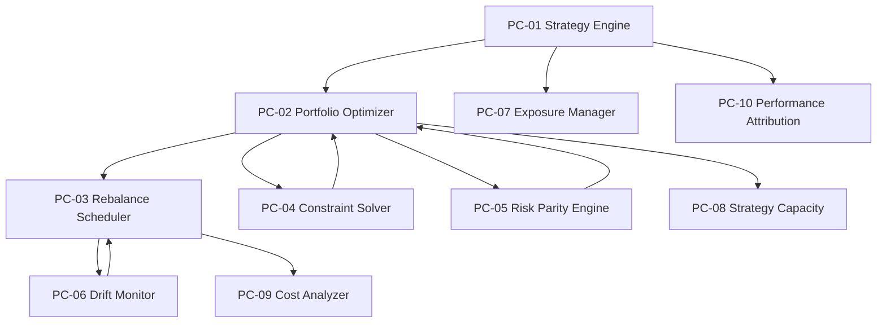

# 05 — D-PF-CORE 组合核心域

> **状态**: DRAFT | **版本**: v4.0.0 | **拆分自**: D-PORTFOLIO | **骨架厚度**: 中等(6✅)
> **一句话**: 组合策略核心——策略引擎+组合优化+再平衡编排+约束求解+绩效归因

## §0 域定义

| 属性 | 值 |
|------|-----|
| 域ID | D-PF-CORE |
| 简称 | PC |
| 职责 | 组合管理+再平衡。策略引擎(OCP-002)+组合优化+约束求解+再平衡调度+风险平价+漂移监控+绩效归因 |
| 层 | DOMAIN |
| 状态 | 🏗 骨架 |
| 类型 | core |
| safety_level | M |
| ai_autonomy | ai_modifiable |
| H依赖数 | 2 (D-AUTONOMY-CORE + D-RISK) |
| 核心Aggregate | AGG-003 Portfolio / AGG-004 Strategy |
| 核心事件 | E-PF-01 PortfolioRebalanced / E-PF-02 PositionLimitBreached |
| 优先级 | P0 |
| 激活前提 | D-SIGNAL就绪(CTR-002) / D-RISK就绪(CTR-003) / D-PF-ALLOC就绪 / D-INFRA-RUNTIME就绪 |

## §1 子模块清单

### §1.1 能力项

| 能力 | P级 | 角色 | 关键需求 |
|------|:---:|:----:|---------|
| C-005 多情景对策 | P0 | ●核心 | 策略引擎+组合优化+再平衡+约束求解+风险预算 |
| C-042 策略容量建模 | P1 | ●核心 | AUM容量上限+策略容量利用率+流动性约束容量 |
| C-009 因子与信号生产管线 | P0 | ◐辅助 | 消费信号做组合决策 |
| C-021 市场状态判定 | P1 | ◐辅助 | 市场状态→仓位上限→组合约束 |
| C-046 执行质量分析TCA | P1 | ◐辅助 | 再平衡成本分析 |
| C-018 多账户多策略 | P2 | ◐辅助 | 多账户资金流管理(P2远期) |

### §1.2 子模块

| ID | 名称 | 职责 | 优先级 | 对标能力 | 建设状态 | 建设门禁 |
|----|------|------|:------:|---------|:--------:|---------|
| PC-01 | Strategy Engine | 策略注册+选择+信号生成+生命周期+版本控制(OCP-002扩展点)。策略四维决策逻辑：选股+买入+卖出+仓位。产出target_weights。冷启动约束：新策略仓位上限=正常×30% | P0 | C-005● | ①可建设 | — |
| PC-02 | Portfolio Optimizer | 均值方差+风险平价+约束求解→TargetPortfolio(CTR-007)。风险预算为主选方法。Kelly仓位与优化仓位取min(Kelly只减不增) | P0 | C-005● | ①可建设 | — |
| PC-03 | Rebalance Scheduler | 阈值触发(组合总仓位漂移±2%/单标的±3%)+日历触发(每周五)+事件触发+风控触发(E-RK-01/03)+成本感知再平衡(收益改善>2×成本才执行；市场状态⑦⑧⑨成本系数×1.5) | P0 | C-005● | ①可建设 | — |
| PC-04 | Constraint Solver | 行业集中度≤30%(绝对)/偏离基准±10%(相对)+市值暴露约束+风险预算MDD≤5%+相关性对冲≤0.7+风格暴露≤±0.3σ+仓位约束(Σwᵢ≤市场状态仓位上限)+拥挤度约束(策略相关性ρ>0.8降权) | P0 | C-005● | ①可建设 | — |
| PC-05 | Risk Parity Engine | 等风险贡献+层次风险平价(HRP)+动态风险预算+风险分解。协方差矩阵估计(Ledoit-Wolf压缩/DCC-GARCH)+ERC求解器 | P1 | C-005● | ②受限 | 协方差矩阵动态估计需D-ML-SERVE模型就绪 |
| PC-06 | Portfolio Drift Monitor | 权重漂移+因子暴露漂移+风险漂移+风格漂移检测(CUSUM)。漂移超阈值→触发再平衡(PC-03) | P1 | C-005●, C-021◐ | ②受限 | 实时因子暴露数据需D-FACTOR Barra因子就绪 |
| PC-07 | Exposure Manager | 行业敞口(GICS/申万31行业)+因子暴露(Barra风格)+集中度监控+行业轮动信号 | P1 | C-005●, C-021◐ | ②受限 | 行业分类+Barra风格因子数据需D-FACTOR就绪 |
| PC-08 | Strategy Capacity Estimator | AUM容量上限+策略容量利用率+流动性约束容量+容量告警(容量预警线=估算容量×80%)+扩容建议。容量公式= f(ADV,参与率上限,换手率,冲击成本容忍度)(Grinold & Kahn) | P1 | C-042● | ②受限 | 流动性微观结构数据需D-DATA就绪 |
| PC-09 | Rebalance Cost Analyzer | 显性成本(佣金万2.5双边+印花税千1卖出+过户费万0.1双边)+隐性成本(滑点:基础0.05%+动态0.1×日波动率×√(订单量/日均成交量);冲击:Almgren-Chriss简化σ×√(订单量/日均成交量)×参与率系数)+机会成本+成本归因。LVaR四级模型(价差/Amihud冲击/EVT尾部/CoVaR跨市场) | P1 | C-046◐ | ②受限 | Almgren-Chriss校准需D-EX-CORE历史成交数据积累 |
| PC-10 | Performance Attribution Engine | Brinson归因(配置效应+选择效应+交互效应)+因子归因+风险归因+选股/择时分解+多期归因+风险调整收益+归因报告。策略退化检测：IC衰减>50%=策略退化→自动降权至0；拥挤度检测(策略相关性ρ>0.8/0.9) | P0 | C-005● | ①可建设 | — |

### §1.3 去冗余结果

| 处置 | 模块 | 理由 |
|------|------|------|
| 移除 | Multi-Objective Optimizer | P2远期，一人+AI不需要Pareto前沿 |
| 移除 | Tax Loss Harvester | P2远期ESG/税务优化 |
| 移除 | Cash Flow Manager | C-018 P2远期多账户 |
| 合并→PC-08 | Liquidity Estimator | 流动性是容量约束的子功能 |
| 移至D-RISK | Portfolio Stress Tester | 压力测试属风控域 |
| 合并→PC-10 | Benchmark Manager | 基准管理是绩效归因的子功能 |
| 移除 | Carbon Footprint | P2远期ESG |

## §2 域内依赖

## §3 域间接口

### §3.1 消费

| 消费什么 | 来自 | 契约/事件 | 类型 | 优先级 |
|---------|------|---------|:----:|:------:|
| CompositeSignal | D-SIGNAL | E-SG-01 / CTR-002 | H | P0 |
| CapitalAllocationResult | D-SIGNAL | CTR-P1-003 | H | P1 |
| RiskLimits | D-RISK | CTR-003 | H | P0 |
| 合成信号+策略权重 | D-PF-ALLOC | PA→PC内部契约 | H | P0 |
| FillReceived | D-EX-CORE | E-EX-04 / CTR-005 | E | P0 |
| PositionSnapshot | D-EX-CORE | CTR-006 | H | P0 |
| ML模型产出 | D-ML-SERVE | E-RS-03 | E | P1 |
| 对冲再平衡请求 | D-CROSS-ASSET | E-CA-04 / CTR-P1-014 | E | P1 |
| 权限/审计/遥测 | D-AUTONOMY-CORE | CTR-TRACE-001 | H | P0 |

### §3.2 产出

| 产出什么 | 去往 | 契约/事件 | 类型 | 优先级 |
|---------|------|---------|:----:|:------:|
| TargetPortfolio | D-EX-CORE | CTR-007 / CTR-004 | H | P0 |
| PortfolioRebalanced | D-RISK, D-REPORTING | E-PF-01 | E | P0 |
| StrategyRegistry+策略状态 | D-PF-ALLOC | 内部契约 | H | P0 |
| StrategyLifecycleEvent | D-REPORTING, D-COMPLIANCE, D-GOVERNANCE | CTR-P1-006 | H | P1 |

### §3.3 关键契约签名

**CTR-003 RiskLimits (P0冻结)**: D-RISK→D-PF-CORE
- 消费者: PC-04, PC-02
- 签名: RiskLimits{policy_id, portfolio_id, version:int, status:ACTIVE, limits: List[RiskLimit{type:RiskLimitType(Enum9), value:float, enforcement:HARD_BLOCK|SOFT_WARN|POST_ONLY, consumed:float}]}

**OCP-002 StrategyBase+StrategyRegistry**: D-PF-CORE
- 扩展点: PC-01
- 签名: generate_target_weights(self, universe, signals, constraints) -> dict[str, float]

**CTR-007 TargetPortfolio**: D-PF-CORE→D-EX-CORE
- 生产者: PC-02
- 签名: TargetPortfolio{portfolio_id, strategy_id, target_weights:dict, current_weights:dict, drift_pct:dict, risk_limits:CTR-003, rebalance_reason:enum, created_at:datetime, idempotency_key:str}

**CTR-P1-003 CapitalAllocationResult**: D-SIGNAL→D-PF-CORE
- 消费者: PC-01

**数据流主轴**: D-SIGNAL→(信号)→D-PF-ALLOC→(资本分配)→D-PF-CORE→(TargetPortfolio)→D-EX-CORE；D-RISK→(CTR-003约束)→D-PF-CORE；D-RISK→(E-RK-04拦截)→D-EX-CORE。ALLOC不直接依赖RISK，风控约束由CORE统一执行。

### §3.4 数据事件接口(A3)

| 事件类型 | 子类型 | D-PF-CORE角色 | Payload关键字段 |
|---------|--------|:------------:|----------------|
| SignalEvent | SignalTriggered/Revoked/Updated/Expired | 消费者 | signal_id, signal_type, symbol, direction, strength |
| DecisionEvent | BuyDecided/SellDecided/HoldDecided | 生产者 | symbol, target_amount, reason, signal_ids |
| ExecutionEvent | OrderFilled/OrderRejected | 消费者 | order_id, fill_price, fill_amount, reject_reason |
| RiskEvent | RiskTriggered/RiskCleared | 消费者 | risk_rule_id, risk_level, affected_positions |

## §4 域事件

| 事件ID | 事件名 | 触发条件 | 发布者 | 消费者 | 频率 |
|--------|--------|---------|--------|--------|:----:|
| E-PF-01 | PortfolioRebalanced | 组合再平衡完成 | PC-03 | D-EX-CORE, D-RISK(RK-03), D-REPORTING | L1 |
| E-PF-02 | PositionLimitBreached | 持仓限额突破(监控阶段) | RK-06 | D-FRONTEND, D-PF-CORE(PC-04) | L4 |

> E-PF-02归属：YAML SSoT归D-RISK。PC-04=事前约束求解(软约束，阻止提交)，RK-06=事后限额监控+事件发布(硬约束)。

**因果链**: E-RK-04 PreTradeRejected→订单拒绝 | E-PF-02→E-RK-01 RiskLimitBreached→E-RK-02/03 策略变更/回撤告警

## §5 激活前提

| 前提 | 就绪标准 | 必要性 |
|------|---------|:------:|
| D-SIGNAL就绪 | CTR-002 FactorSignal / CTR-P1-003 CapitalAllocationResult 可用 | 必须 |
| D-RISK就绪 | CTR-003 RiskLimits 可用 | 必须 |
| D-PF-ALLOC就绪 | 合成信号+策略权重可用 | 必须 |
| D-INFRA-RUNTIME就绪 | 事件总线+数据库可用 | 必须 |
| D-AUTONOMY-CORE就绪 | CTR-TRACE-001 审计/权限可用 | 必须 |
| 组合优化约束可求解 | 行业/市值/风险预算约束无冲突 | 必须 |

## §6 设计决策

| 决策 | 结论 |
|------|------|
| PC产出TargetPortfolio(CTR-007)而非Order | 组合域管"买多少"，执行域管"怎么买" |
| generate_target_weights统一签名 | (universe, signals, constraints)->dict[str,float] |
| 风险预算为主选组合优化方法 | 不用等权/固定比例；风险预算不依赖收益预测；HRP为协方差噪声大时备选(López de Prado 2016) |
| 半Kelly硬上限(f*×0.5) | 连续Kelly f*=μ/σ²；离散Kelly f*=(p×b-q)/b；半Kelly=f*/2。Kelly仓位与优化仓位取min(Kelly只减不增)。禁止全Kelly(估计误差下过度下注) |
| 从18子模块精简到10 | 按能力对齐精简，去除P2远期过度设计 |
| PC-04覆盖七约束 | 行业集中度/市值暴露/风险预算MDD/相关性对冲/仓位上限/拥挤度/风格暴露 |
| 市场状态仓位上限为硬上限 | 风险预算仓位不可超过市场状态仓位上限，取min值 |
| 再平衡成本>收益→跳过 | 收益改善>2×成本才执行；市场状态⑦⑧⑨成本系数×1.5 |
| 周频强制再平衡 | 每周五收盘后强制再平衡 |
| 仓位四层架构 | ①组合层:总仓位上限=min(市场状态上限,风控上限,资金曲线上限) ②风险预算层:相关性飙升→自动降仓 ③策略层:新策略仓位上限=正常×30% ④动态层:漂移监控+再平衡触发 |
| 资金曲线仓位缩放 | 盈利扩张:净值新高后+5%/次(不超硬上限)；亏损收缩:回撤>5%→-10%，回撤>10%→-20% |
| 仲裁优先级 | 风控(C-004)>仓位上限(C-047)>市场状态(C-021)>卖出决策>T+1预测(C-014)>安全防护>交易策略>买入决策>研究探索 |
| 线性保护而非凸性对冲 | Kill Switch+Pod级止损(线性保护100%可靠) vs 期权对冲(A股期权流动性不足+Carry成本过高) |
| 合规分层治理 | 硬编码(涨跌停不买入,不可调)/可配置(单票成交量占比≤5%,合规官可调)/AI建议(须人工审批) |

## §7 合规约束(A6)

> 源自合规架构(A6)§2.1持仓限额+§2.2行业集中度。组合核心域是组合层面合规约束的直接执行层。

### §7.1 持仓限额

| 约束 | 公式 | 类型 | PC-04执行 |
|------|------|------|----------|
| 权重归一 | Σwᵢ = 1.0 | 硬约束 | 权重归一约束 |
| 非负权重 | wᵢ ≥ 0 ∀i | 硬约束 | 非负约束(A股T+1) |
| 单票集中度上限 | wᵢ ≤ min(5% NAV, f*/2) | 硬约束 | 单票上限约束(半Kelly+硬上限) |
| 半Kelly硬上限 | f*×0.5 | 硬约束 | Kelly约束 |
| 板块暴露上限 | Σwᵢ(同板块) ≤ 20% | 硬约束 | 板块集中度约束 |
| ST股限制 | ST股持仓 ≤ NAV 5%(可配置) | 可配置 | ST股约束 |

### §7.2 行业集中度+风格暴露

| 约束 | 公式 | 类型 | PC-04执行 |
|------|------|------|----------|
| 行业偏离上限 | \|Σ(wᵢ×Iᵢⱼ) - Σ(wᵢᵇᵉⁿᶜʰ×Iᵢⱼ)\| ≤ 10% ∀行业j | 硬约束 | 行业偏离约束(极端波动±15%，绝对上限30%) |
| 风格暴露上限 | \|Σ(wᵢ×fᵢₖ)\| ≤ 0.3σ ∀风格因子k | 硬约束 | 风格暴露约束(Barra标准化) |
| 关联方持仓 | 同一实控人下多账户合并计算 | 硬约束 | 关联方合并(GATE-001后) |

### §7.3 Pre-Trade合规检查顺序

涨跌停检查(Hard Block)→参与率检查(Hard Block)→持仓限额检查(Hard Block)→行业集中度检查(Hard Block)→撤单率检查(Hard Block)→报单停留时间锁(≥50μs)

## §8 风控交互(A4)

> 源自风险架构(A4)§3风险否决权。核心原则：风控可否决一切交易决策，但不可修改策略逻辑。

### §8.1 否决规则(5级)

| 级别 | 名称 | 触发条件 | 否决动作 | 恢复条件 |
|:----:|------|---------|---------|---------|
| P0 | Kill Switch | 系统性风险/风控崩溃/AI自治熔断5条件任一 | 全系统暂停交易 | 人工确认+系统健康检查通过 |
| P1 | 强制减仓 | 日亏损>2% NAV / 回撤>10% | 自动减仓至安全水平 | 风险指标回到限额内 |
| P2 | 否决新开仓 | VaR>组合净值3% / 集中度>5% NAV / 行业偏离>基准±10% | 拒绝新开仓指令 | 风险指标回到限额内 |
| P3 | 否决单笔订单 | 单笔金额超限/涨跌停买入/持仓超限 | 拒绝该笔订单 | 订单参数调整后重新提交 |
| P4 | 建议性告警 | 策略相关性ρ>0.8 / 风险指标接近阈值 | 告警通知+不否决 | 风险指标回落 |

**VR-009 Kill Switch触发条件(AI自治熔断)**：①Agent越界行为>0 ②模型漂移PSI>0.5 ③自治等级异常跳变(跨≥2级) ④资源消耗超限(CPU>90%持续60s) ⑤连续否决超阈值(5分钟内>10次)

**Kill Switch多路径激活**：AI自动<1ms | 人工一键<100ms(CLI/Web/微信) | 定时熔断<1ms(核心进程无心跳>5s) | 外部信号<1s(A9运维告警)

**VaR分级预警**：

| 预警级别 | 触发条件 | 风控动作 |
|---------|---------|---------|
| 绿色(正常) | VaR_95% < 2% | 正常操作 |
| 黄色(关注) | VaR_95% 2-4% | 新开仓减半 |
| 橙色(警告) | VaR_95% 4-6% | 禁止新开仓+减仓30% |
| 红色(紧急) | VaR_95% >6% | 全线减仓50%+只平不开 |
| 黑色(灾难) | CVaR >10% | 全部清仓 |

**Pod级止损**：

| 级别 | 触发 | 动作 |
|------|------|------|
| Soft Stop | 单策略回撤>5% | 减仓至安全水平+人工审批 |
| Hard Stop | 单策略回撤>10% | 策略强制关闭+权重归零 |
| 全系统Hard Stop | 全组合回撤>10% | Kill Switch(P0) |

### §8.2 否决执行与隔离

**执行机制**：同步拦截(否决规则引擎在订单执行入口同步执行，延迟<50ms P99) | 不可绕过(所有下单指令必须经过否决规则引擎，无旁路) | 不可人工否决(风控触发后不可被人类否决)

**硬边界(HC-RISK)**：

| 编号 | 约束 |
|------|------|
| HC-RISK-01 | 风控可否决一切交易决策，但不可修改策略逻辑 |
| HC-RISK-02 | 风控触发后不可被人类否决 |
| HC-RISK-03 | 风险否决不可绕过 |
| HC-RISK-05 | 否决日志独立存储 |
| HC-RISK-06 | Kill Switch在基础设施层实现，不在Agent运行时内 |

**四层隔离**：

| 隔离层 | 机制 | PC执行 |
|--------|------|--------|
| L1代码隔离 | D-RISK与D-PF-CORE分属不同域(INV-008) | PC-01与RK代码分离，PC-04消费CTR-003但不修改 |
| L2数据隔离 | 风险数据流独立于交易数据流 | PC-02消费RiskLimits但不写入风控数据 |
| L3权限隔离 | 风控引擎只读策略信号，只写否决指令(RBAC) | PC-01产出target_weights→RK-02只读检查→否决指令写回 |
| L4审计隔离 | 否决日志独立存储(HC-RISK-05) | PC-10只读否决日志，不可修改 |

**否决边界**：✅否决买入/限制仓位上限/触发减仓 | ❌将买入改卖出/调整策略参数/修改因子权重

## §9 Agent交互(A7)

> 源自Agent架构(A7)§1.2编排Agent+§9.2.2消费映射+§3.6 A2A检查网关。

### §9.1 编排Agent→D-PF-CORE

| 属性 | 值 |
|------|-----|
| 编排Agent职责 | 全局任务编排，对D-PF-CORE核心产出=组合配置方向 |
| 输入 | 市场状态信号+归因报告+风控信号 |
| 输出→PC-01 | 组合配置方向=行业Z-score信号方向(±σ)+风险厌恶系数λ∈[0.5,2.0]映射+Δtarget_weights方向与幅度+策略权重建议 |
| 自治级别 | Level 2(弱自主) |
| ai_modifiable | 任务优先级排序/Agent激活休眠决策/协作模式选择 |
| human_gated | 新策略上线/组合配置方向变更/仓位上限映射规则调整(24h未审批→自动取消) |
| 归属域 | D-AUTONOMY-CORE |

### §9.2 归因Agent→D-PF-CORE

| 属性 | 值 |
|------|-----|
| 输入 | D-DATA交易记录+D-REPORTING报告数据 |
| 输出→PC-10 | 归因报告+策略健康评分+优化建议→反馈PC-01/PC-02 |
| 自治级别 | Level 3(全自主：归因分析完全自主) |
| ai_modifiable | 归因方法选择/报告格式/优化建议内容(但不得直接修改在线策略) |
| human_gated | 策略参数修改/信号权重调整>5%(24h未审批→自动取消) |
| 归属域 | D-REPORTING |

### §9.3 三种流

| 流 | 方向 | D-PF-CORE路径 |
|----|------|---------------|
| 指令流 | 战略→战术→执行(自上而下) | 编排Agent→组合配置方向→PC-01→PC-02→TargetPortfolio(CTR-007)→D-EX-CORE |
| 反馈流 | 执行→战术→战略(自下而上) | D-EX-CORE→FillReceived→PC-10归因→归因Agent→编排Agent |
| 否决流 | 风控Agent→任意层(横向穿透) | 风控Agent→D-RISK→CTR-003→PC-04；否决流可中断编排Agent组合配置方向 |

### §9.4 指令优先级

| 优先级 | 类型 | PC处理 |
|--------|------|--------|
| P0-紧急 | 熔断/紧急清仓 | PC-03立即执行紧急减仓，跳过常规流程 |
| P1-高 | 仓位上限调整/交易禁止 | PC-04优先更新约束，PC-02重新优化 |
| P2-中 | 交易指令/信号触发 | PC-01按常规流程处理 |
| P3-低 | 归因请求/研究任务 | PC-10盘后处理 |

### §9.5 A2A检查网关全局策略

| 策略编号 | 策略名称 | 硬边界 |
|:--------:|---------|--------|
| GP-001 | 风控否决不可绕过 | HB-A7-001 |
| GP-002 | 敏感数据不出Agent | B-011 |
| GP-003 | 非交易时段禁止下单 | B-004 |
| GP-004 | 单票集中度上限>5% | B-003 |
| GP-005 | T+1规则不可违反 | T+1约束 |
| GP-006 | Agent身份不可冒充 | IMM-007 |
| GP-007 | 大额下单需人工审批 | HB-A7-004 |
| GP-008 | 审计日志不可篡改 | IMM-008 |

## §10 运维规格(A9)

> 源自运维架构(A9)§4应急保命轨+§2.3 Warm平面。

### §10.1 组合降级

| 降级路径 | PC动作 | 子模块 |
|---------|--------|--------|
| D-L0→D-L1 | 暂停做T/事件策略，仅保留核心策略(动量/均值/防御) | PC-01 |
| D-L1→D-L2 | 暂停所有策略，仅保留最小可行策略子集(保命规则集) | PC-01 |
| D-L2→D-L3 | 冻结组合，停止一切再平衡 | PC-01 |

**保命规则集(L2最简规则)**：

| 规则ID | 规则 | 参数 |
|--------|------|------|
| SURV-001 | 单票持仓≤AUM 10% | 10% |
| SURV-002 | 总仓位≤AUM 30% | 30% |
| SURV-003 | 单日亏损>AUM 5%→清仓 | 5% |
| SURV-004 | 涨停板不买入 | — |
| SURV-005 | 跌停板不卖出(无法成交) | — |
| SURV-006 | 非交易时段不下单 | — |
| SURV-007 | 每笔订单必须经过风控检查 | — |
| SURV-008 | 持仓股票ST/退市风险→次日清仓 | — |

**降级触发阈值**：日亏损>2% NAV→D-L1 | 日亏损>5% NAV→D-L2+AI自治熔断 | 日亏损>8% NAV→D-L3 | 风控引擎无响应>30s→跨级D-L3

### §10.2 Warm平面策略路由

| 市场状态 | 策略权重 | 仓位上限 | 路由决策 |
|---------|---------|:--------:|---------|
| ①②趋势向上 | 动量0.6/价值0.2/防御0.2 | 80% | 动量策略权重0.6 |
| ③高波动 | 动量0.3/日内0.4/防御0.3 | 60% | 日内策略权重0.4 |
| ④⑤震荡 | 均值0.5/价值0.3/防御0.2 | 50% | 均值回归权重0.5 |
| ⑥压缩突破 | 动量0.4/均值0.3/突破0.3 | 40%→70% | 突破策略待命 |
| ⑦⑧⑨趋势向下 | 防御0.6/价值0.3/动量0.1 | 30%→10% | 防御策略权重0.6 |
| ⑩事件驱动 | 事件0.5/动量0.3/防御0.2 | 基础仓位×70% | 事件策略激活 |
| ⑪板块轮动 | 轮动0.5/动量0.3/价值0.2 | 基础仓位 | 轮动策略激活 |

## §11 学习系统接口(A8)

> 源自学习系统架构(A8)§11.3权重中心+§11.1知识注入+§9.1元学习。

### §11.1 权重中心

权重中心=学习系统与交易流水线的安全隔离层。学习系统输出目标组合权重，经风控验证后由执行层执行。

**核心原则**：学习系统不直接生成订单 | 学习系统崩溃→PC-01/02继续使用最近有效target_weights | 风控始终在执行路径上

**4级风控决策对接**：

| 决策 | PC执行 |
|------|--------|
| APPROVE | PC-02产出TargetPortfolio(CTR-007)→PC-03调度→D-EX-CORE执行 |
| REDUCE | PC-04计算缩减后权重→PC-02重新优化→产出缩减版TargetPortfolio |
| REJECT | PC-02不产出TargetPortfolio→维持当前仓位 |
| FLATTEN | PC-03执行紧急减仓→PC-02产出平仓版TargetPortfolio |

**权重中心约束**（与§7.1一致）：权重归一(Σwᵢ=1.0) | 单票≤20%(B-002) | 变更频率≤1次/交易日 | AI权重≤30%(B-007)

### §11.2 学习系统→PC注入路径

| 注入路径 | 学习系统产出 | PC消费 | 约束 |
|---------|------------|--------|------|
| L3策略层注入 | ClassifiedKnowledgePackage(strategy) | PC-01 Strategy Engine | C-003完整验证+模拟盘≥1周+冷启动协议(新策略仓位=正常×30%) |
| 权重中心注入 | 目标权重向量 | PC-01→PC-02 | 权重归一+单票≤20%+频率≤1次/日+AI权重≤30% |
| L5闭环优化注入 | ClassifiedKnowledgePackage(methodology) | PC-02 Portfolio Optimizer | 新优化维度需评估边际Alpha收益 |
| L4风控层注入 | ClassifiedKnowledgePackage(risk) | PC-04 Constraint Solver | 人工审核+不可降低硬边界 |
| L4风控层-教训知识注入 | ClassifiedKnowledgePackage(lesson_learned) | PC-04 Constraint Solver | 人工审核根因分析+预防措施可执行性 |

### §11.3 PC→学习系统反馈路径

| 反馈路径 | PC产出 | 学习系统消费 | 频率 |
|---------|--------|------------|:----:|
| C-010复盘数据 | PC-10归因报告 | 知识效果评估器 | 每日 |
| C-007闭环结果 | PC-01/02优化执行结果 | 元学习层(S6) | 每周 |
| C-033过拟合报告 | PC-02过拟合检测结果 | 知识库 | 每周 |

### §11.4 元学习维度(组合优化相关)

| 维度 | 优化对象 | PC执行 | 约束 |
|------|---------|--------|------|
| 学习架构优化(维度2) | 模块间数据流/层级注入规则/模块依赖关系 | PC-10归因→识别最优模块组合→反馈PC-01/02 | 架构变更需人工审批(L4) |
| 学习方法论(维度4) | 组合优化方法论库(HRP/Black-Litterman等) | PC-02评估新方法历史表现→通过则注册 | 新方法需回测验证+人工审批(L3) |
| 数学反思闭环(R-07) | 试运行反馈→形式化为约束优化问题→求解→精确参数调整 | PC-02使用scipy.optimize约束求解 | 替代LLM直觉调整 |

## §12 治理接口(A2)

> 源自治理架构(A2)§2变更审批流+§3漂移检测+§18.4跨域契约。

### §12.1 变更审批流

| 级别 | 名称 | 典型变更 | 自治分类 | 审批要求 | SLA |
|:----:|------|---------|---------|---------|:---:|
| L1 | 参数微调 | 因子权重±5%以内 | ai_modifiable | AI自动执行，事后审计 | 即时 |
| L2 | 参数调整 | 因子权重±5%~20%、策略参数变更 | ai_modifiable | AI自动执行，事后审计，24h人工复核 | ≤5min |
| L3 | 策略变更 | 新策略上线、信号权重重组 | human_gated | AI提议+Trader审批 | ≤1h |
| L4 | 架构变更 | 新模块上线、模块退役 | human_gated | AI提议+Administrator审批+灰度验证 | ≤4h |
| L5 | 硬约束变更 | 风控参数修改、AI自治边界扩展 | immutable | 人工提议+双人审批+全量回归+非交易时段执行 | ≤24h |

> CTR-P1-006 StrategyLifecycleEvent(D-PF-CORE→D-GOVERNANCE)对应§2变更审批流(策略生命周期)。

### §12.2 漂移检测(与PC-06协同)

| 漂移类型 | 定义 | 检测方法 | PC-06相关 |
|---------|------|---------|----------|
| 数据漂移 | 输入特征分布变化 | KS检验/Wasserstein距离 | 因子暴露漂移检测 |
| 概念漂移 | 特征→目标映射改变 | IC衰减监控/PELT变点 | 策略退化检测(IC衰减>50%) |
| 架构漂移 | 实际架构偏离蓝图 | 蓝图-代码哈希对比 | — |
| 配置漂移 | 运行时配置偏离声明 | IaC基线对比 | 权重漂移检测 |
| 治理漂移 | AI自治范围扩展超边界 | 自治行为审计/边界违规 | 策略相关性漂移(ρ>0.8) |
