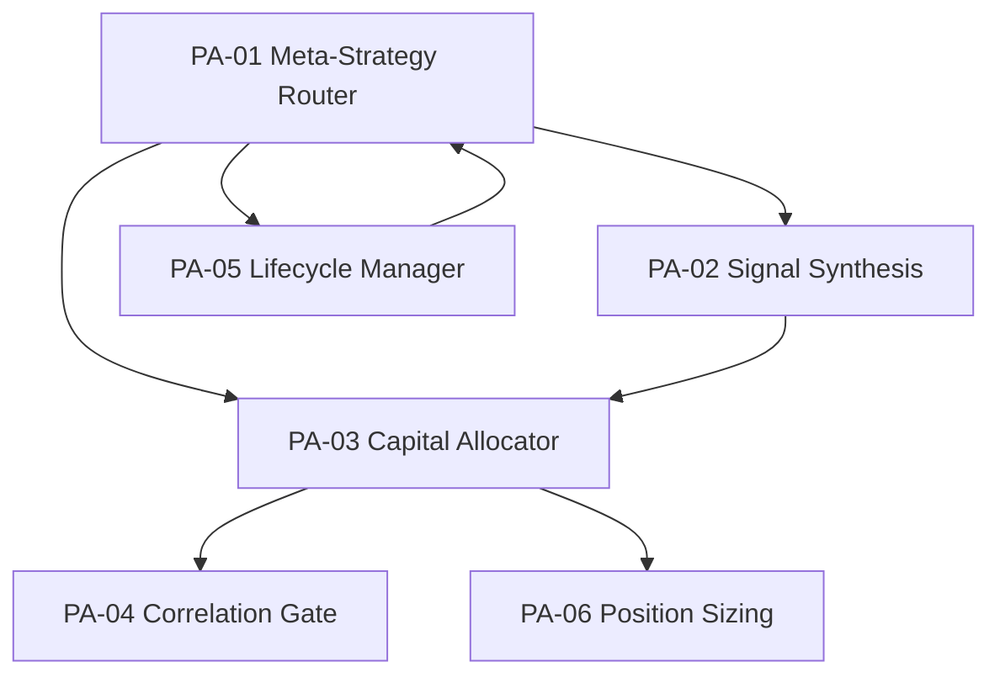

# 06 — D-PF-ALLOC 组合分配域

> **状态**: DRAFT | **版本**: v3.1.0 | **拆分自**: D-PORTFOLIO | **骨架厚度**: 薄(3✅→推导6)

## §0 域定义

| 属性 | 值 |
|------|-----|
| 域ID | D-PF-ALLOC |
| 简称 | PA |
| 职责 | 多策略信号合成+资本分配+元策略路由 |
| 层 | DOMAIN |
| 状态 | 🔵 骨架（薄域） |
| 类型 | core |
| safety_level | M |
| ai_autonomy | ai_modifiable |
| H依赖数 | 3 (D-AUTONOMY-CORE + D-PF-CORE + D-SIGNAL) |
| 核心不变量 | 策略权重之和=1.0; 所有策略权重≥0; 活跃策略数=0→PAUSE; 新加策略≠立即激活(需冷启动期) |
| 核心事件 | PA-CapitalAllocated / PA-StrategyRetired / PA-CorrelationGateTriggered |
| 优先级 | P0 |
| 激活前提 | D-AUTONOMY就绪 / D-SIGNAL就绪(CTR-002) / D-PF-CORE就绪(StrategyRegistry) |
| 蓝图状态 | MOD-L05-001未建设(partial) |

## §1 子模块清单

| ID | 名称 | 职责 | 优先级 | 对标能力 | 建设可行性 | 受限门禁 |
|----|------|------|:------:|---------|:----------:|---------|
| PA-01 | Meta-Strategy Router | 市场状态→策略选择+权重分配+多样性守门。消费D-SIGNAL RegimeSnapshot+D-PF-CORE StrategyRegistry | P0 | C-005◐, C-021◐ | ❌受限 | 市场状态→策略权重映射缺乏量化模型，当前为主观经验规则(牛市→趋势/震荡→套利/熊市→防御)。需: 市场状态概率分布×策略条件期望收益矩阵替代主观映射；HMM/聚类算法替代11态主观分类 |
| PA-02 | Signal Synthesis Combiner | 多策略信号→重合加权重→输出合成信号给PF-CORE。处理信号冲突(同标的反向)+信号叠加(同标的多头)+权重重分配+决策去重(同标的同方向多策略重复信号→合并为一条指令) | P0 | C-005◐, C-009◐ | ✅可建设 | — |
| PA-03 | Multi-Strategy Capital Allocator | 多策略资金分配+风险预算分配+MaxDDLimit分配+再平衡引擎+策略容量约束(C-042)。策略权重之和=1.0 | P0 | C-005◐ | ✅可建设 | — |
| PA-04 | Strategy Correlation Gate | G12策略相关性门禁: 相关性>0.85拒绝/因子重叠>60%警告/股票池重叠>70%且行业集中度>50%警告。6个月滚动窗口+尾部相关EVT | P0 | C-005◐, C-007◐ | ✅可建设 | — |
| PA-05 | Strategy Lifecycle Manager | 策略7状态生命周期(草稿→回测→模拟→试运行→上线→降级→退役)+准入门控+灰度发布(5%→20%→50%→100%)+退役触发+资金回收+冷启动管理 | P1 | C-007◐ | ❌受限 | "天然互补性"缺乏量化定义→需因子正交性度量替代；退役阈值(Sharpe<0/Calmar<0.3/连续6月亏损)为经验阈值→需统计显著性检验(bootstrap)替代 |
| PA-06 | Position Sizing Calculator | 凯利公式变体K=E(R)/σ²+半Kelly硬上限(0.5×f*)+确定性系数+分批建仓 | P0 | C-005◐ | ❌受限 | 市场环境系数(牛市80-100%/震荡30-50%/熊市10-20%)为固定主观阈值→需历史波动率分位数×市场状态概率分布替代；分批建仓比例(50%+30%+20%)为主观经验→需VWAP/流动性模型+冲击成本优化替代 |

**子模块合并记录**: PA-02 Strategy Screening 3D→PA-05; PA-03 Rolling Window Correlation→PA-04; PA-06/07/08 A-Share Position(3个)→PA-06; PA-09 Stackelberg Game→D-RISK; PA-11/12 Strategy Retirement(2个)→PA-05; PA-13 MaxDDLimit→PA-03; PA-14 Position Limit Gate→D-RISK; PA-15 Execution Feedback Bridge→移除(D-EX-CORE)

### §1.1 子模块功能颗粒度补充

**PA-01 Meta-Strategy Router 颗粒度**:

| 功能点 | 量化方法 | 说明 |
|--------|---------|------|
| 权重分配 | 等权/信号加权(IC加权w_i=IC_i/Σ\|IC_j\|)/回测加权/体制自适应权重 | 体制自适应: 趋势体制→动量信号权重↑; 均值回归体制→反转信号权重↑ |
| 多样性守门 | 策略指纹相似度+因子正交性 | 相似度>90%否决上线(与PA-04联动) |
| 信号一致性 | 所有信号方向一致性比例 | >80%=高一致性→高置信度; <50%=矛盾→低置信度 |
| 矛盾解决 | 按动态权重加权投票 | 权重大信号占主导，权重由数据决定而非人为设定 |

**PA-02 Signal Synthesis Combiner 颗粒度**:

| 功能点 | 量化方法 | 说明 |
|--------|---------|------|
| 多策略投票 | 信号驱动投票: 策略综合得分=Σ(信号N权重×信号N方向置信度×策略N对信号敏感度) | 替代简单加权投票 |
| 共振融合 | 全部同向→强共振(最高置信度)/多数同向→中等/分歧→弱(需因子直通裁决) | 置信度分级决策 |
| 决策去重 | 同标的同方向多策略重复信号→合并为一条指令 | 避免重复下单 |
| 跨策略仓位合并 | 同标的多策略合并→取sum不超上限 | 按策略优先级截断: 高优先级优先分配，合并后≤硬上限 |
| 信号冲突检测 | 多策略同时触发时的语义冲突检测+优先级裁决 | 合规架构§13.1要求 |
| 信号置信度校准 | Platt Scaling/Isotonic Regression/MC Dropout不确定性 | 学习系统R-96 Signal Confidence Scorer |

**PA-03 Capital Allocator 颗粒度**:

| 功能点 | 量化方法 | 说明 |
|--------|---------|------|
| 风险预算范式 | 组合风险预算→协方差分解→每标的风险配额→Kelly在配额内决策 | 替代旧范式"独立Kelly+硬约束截断"(自下而上) |
| 协方差估计 | 收缩估计/因子模型/Copula-GARCH(持仓≤50只) | →组合整体风险预算分解到每标的 |
| 相关性体制监控 | 牛市相关性趋同→分散化失效预警→动态调整仓位上限 | 相关性飙升→实际风险>正态假设→自动降仓 |
| 策略容量约束(C-042) | 容量=f(ADV,参与率,换手率,冲击成本容忍度); Grinold & Kahn容量公式 | 容量预警线=估算容量×80%; AUM超容量→否决新资金接入 |
| MaxDDLimit | MaxDD≤15%→触发后全线减仓50% | 已合并入PA-03 |
| 再平衡 | 权重变更频率≤1次/交易日 | 防止过度交易 |

**PA-05 Lifecycle Manager 颗粒度**:

| 功能点 | 量化方法 | 说明 |
|--------|---------|------|
| 7状态生命周期 | 草稿→回测→模拟→试运行→上线→降级→退役 | 每个状态转换需满足准入门控条件 |
| 准入门控 | 回测Sharpe>0.5才能进入模拟等 | 各状态转换有预设条件 |
| 灰度发布 | 上线阶段: 5%→20%→50%→100%仓位逐步放大 | 与Module Registry 4状态映射: 草稿+回测+模拟→trial, 上线→active, 降级→trial, 退役→deprecated→archived |
| 冷启动协议 | 初始仓位=风险预算仓位×冷启动系数(30%); 观察期5-10交易日; 观察期内仓位上限≤正常50% | 风控驱动，与市场状态无关 |
| 策略衰减检测 | 实盘-回测Sharpe偏差监控 | 偏差>30%→告警; >50%→严重→策略退役 |
| 策略退化检测 | 因子IC衰减>50%=策略退化; 拥挤度上升=超额收益将消失 | 退化时自动将权重降为0(Man Group AlphaGPT实践) |

**PA-06 Position Sizing Calculator 颗粒度**:

| 功能点 | 量化方法 | 说明 |
|--------|---------|------|
| Kelly公式 | f*=μ/σ²(连续时间形式) | 机构仓位管理标准工具 |
| 半Kelly硬上限 | f*×0.5 | 行业惯例，防止过度集中 |
| 约束集 | 单标的≤min(5%,f*/2); 板块暴露≤20%; 组合VaR_95%≤净值×2%; MaxDD≤15% | 组合级硬约束 |
| 分批建仓 | 市场驱动(与策略新旧无关) | 与冷启动区别: 冷启动=风控驱动; 分批建仓=市场驱动; 两者可叠加 |
| 信号→仓位映射 | 风险预算(Risk Budgeting) | 方法论约束: 不可使用等权或固定比例(§20.3) |

**仲裁规则**:

| 冲突方 | 仲裁规则 | 优先级 |
|--------|---------|:------:|
| 冷启动 vs 风险预算 | 冷启动期内: min(风险预算仓位×冷启动系数, 正常仓位50%) | 冷启动优先 |
| 跨策略仓位合并 vs 单票仓位上限 | 按策略优先级截断: 高优先级优先分配，合并后≤硬上限 | 硬上限优先 |
| 风险预算仓位 vs 市场状态仓位上限 | 市场状态仓位上限为硬上限 | 市场状态优先 |

## §2 域内依赖

| 依赖 | 说明 |
|------|------|
| PA-01→PA-02 | 路由决定哪些策略参与信号合成 |
| PA-01→PA-03 | 路由决定策略权重→资本分配 |
| PA-02→PA-03 | 合成信号→资本分配依据 |
| PA-03→PA-04 | 分配需检查策略间相关性 |
| PA-01→PA-05 | 路由需感知策略生命周期状态 |
| PA-05→PA-01 | 策略退役→更新路由策略池 |
| PA-03→PA-06 | 资本分配→仓位计算 |

## §3 域间接口

### §3.1 消费

| 消费什么 | 来自 | 契约/事件 | 类型 | 优先级 |
|---------|------|---------|:----:|:------:|
| 交易信号 | D-SIGNAL | CTR-002 / E-SG-01 | H | P0 |
| 组合状态+StrategyRegistry | D-PF-CORE | CTR-007 / E-PF-01 | H | P0 |
| 权限校验 | D-AUTONOMY-CORE | CTR-TRACE-001 | H | P0 |
| 事件总线+数据库 | D-INFRA-RUNTIME | — | S | P0 |
| 模型预测(可选) | D-ML-SERVE | E-RS-03 | E | P1 |
| 宏观经济指标 | D-DATA(iFind) | — | S | P1 |

### §3.2 产出

| 产出什么 | 消费者 | 契约/事件 | 类型 | 优先级 |
|---------|--------|:---------:|:----:|:------:|
| 合成信号+资本分配结果 | D-PF-CORE | PA→PC内部契约 | H | P0 |
| 策略权重分配 | D-PF-CORE | CapitalAllocation | H | P0 |
| 策略状态变更 | D-EX-CORE | PA-StrategyRetired | E | P1 |
| 策略评估报告 | D-REPORTING | 策略绩效归因输入 | E | P1 |
| 再平衡决策 | D-EX-CORE | RebalanceDecided(rebalance_plan+reason) | E | P1 |

### §3.3 关键设计决策

**ALLOC不直接依赖D-RISK**: 风控约束由PF-CORE消费RISK后执行(CTR-003→PC-04 Constraint Solver)，ALLOC只做策略层分配决策。YAML中E-0073(D-RISK→D-PF-ALLOC)边建议标注为"间接/可选"或移除。

## §4 域事件流

| 事件ID | 事件名 | 触发条件 | 发布者 | 消费者 | 频率 |
|--------|--------|---------|--------|--------|:----:|
| PA-E01 | CapitalAllocated | 资本分配完成 | PA-03 | D-PF-CORE, D-EX-CORE | L2 |
| PA-E02 | StrategyRetired | 策略退役 | PA-05 | D-PF-CORE, D-EX-CORE | L3 |
| PA-E03 | CorrelationGateTriggered | 相关性门禁触发 | PA-04 | D-PF-CORE | L2 |
| PA-E04 | StrategyScreened | 策略筛选完成 | PA-05 | D-PF-CORE, D-REPORTING | L2 |

**跨域事件消费**: E-SG-01(D-SIGNAL→PA-02); E-PF-01(D-PF-CORE→PA-03); E-RK-01(D-RISK→间接经PC-04→PA)

**跨域治理契约**: CTR-P1-006 StrategyLifecycleEvent(D-PF-CORE L05→策略生命周期变更审批)

## §5 激活前提

| 前提条件 | 就绪标准 | 必要性 |
|---------|---------|:------:|
| D-AUTONOMY就绪 | CTR-TRACE-001 审计/权限可用 | 必须 |
| D-SIGNAL就绪 | CTR-002 FactorSignal / E-SG-01 可用 | 必须 |
| D-PF-CORE就绪 | StrategyRegistry + CTR-007 可用 | 必须 |
| D-ML模型推理(可选) | D-ML-SERVE可用 | 可选 |

## §6 设计决策记录

| 决策 | 对标来源 |
|------|---------|
| ALLOC不直接依赖D-RISK | 职责分离+避免重复检查 |
| 信号合成是ALLOC核心职能 | 独立决策层 |
| 从15子模块精简到6 | 能力定位书§9 |
| PA-06半Kelly硬上限f*×0.5 | 能力定位书§2-d约束十三 |
| G12相关性门禁阈值(>0.85拒绝/>60%警告) | 专业标配分散风险 |
| 策略冷启动期 | 防止未验证策略影响实盘 |
| PA无●核心能力，从◐辅助角色推导 | _PARALLEL_DISCUSSIONS.md |
| 信号→仓位映射选用风险预算(Risk Budgeting) | 单人50万AUM: 等权粗糙，均值-方差对参数敏感，风险预算居中平衡 |
| 仓位规则必须基于风险预算框架，不可使用等权或固定比例 | §20.3方法论约束三 |
| 冷启动与分批建仓可叠加 | 冷启动=风控驱动/分批建仓=市场驱动/两者正交 |

## §7 风险架构(A4)交叉内容

### §7.1 策略同质化与串谋风险

| 子类 | 度量机制 | 处置机制 | 否决阈值 |
|------|---------|---------|---------|
| 策略同质化(拥挤) | 策略指纹相似度+市场拥挤度指标 | 降权+分散化 | 相似度>90%→否决上线 |
| 隐性串谋 | 行为相关性系数+反事实差异 | 执行去耦+策略多样性约束 | 行为相关性>90%且指纹相似度<80%→执行去耦+人工判定 |

**PA-04增量**: 需扩展隐性串谋检测(行为相关性>90%且指纹相似度<80%)。阈值对齐: PA-04用0.85作为否决阈值(更保守)，0.90作为硬否决阈值。Agent串谋检测阈值: Pairwise Correlation>0.7触发审查(安全架构§6.2)。

### §7.2 策略相关性突变与拥挤度

| 风险场景 | 度量机制 | 处置机制 | 否决阈值 |
|---------|---------|---------|---------|
| 尾部相关性飙升 | 条件相关系数+Copula尾部相关参数 | 动态降权+仓位上限折扣 | 尾部相关>0.7→否决新增同方向策略 |
| 因子重叠→策略趋同 | 因子重叠率(共享因子/总因子) | 因子重叠>60%→标记WARN | 因子重叠>80%→否决策略上线 |
| 股票池重叠→集中度飙升 | 股票池重叠率+重叠标的行业分布 | 股票池重叠>70%且行业集中度>50%→告警 | 股票池重叠>80%且行业集中度>60%→否决 |
| 标的级拥挤 | 同标的活跃策略数/总策略数 | 集中度超限→按策略优先级截断 | 同标的>3个策略同时买入→否决低优先级 |
| 板块级拥挤 | 同板块活跃策略数/总策略数 | 板块集中度超限→触发再平衡 | 同板块>50%策略同时买入→否决新开仓 |

**PA-04增量**: 已覆盖尾部相关EVT+6个月滚动窗口。新增维度: 标的级/板块级策略集中度监控。PA-01路由时需考虑拥挤度。

### §7.3 策略间传染风险

| 传染路径 | 度量机制 | 处置机制 | 否决阈值 |
|---------|---------|---------|---------|
| 资本传染 | 策略间资本流动相关性 | 单策略Hard Stop→隔离资本回收 | 单策略回撤>10%→立即隔离 |
| 信号传染 | 共享因子IC衰减联动 | 因子失效→所有依赖策略同步降级 | 共享因子IC<0.01→依赖策略MILD降级 |
| 情绪传染 | 同一时段止损策略数/总策略数 | 止损错峰执行+流动性管理 | >50%策略同时触发止损→Kill Switch评估 |

**PA-05增量**: 需扩展传染路径检测与隔离。

### §7.4 模型组合风险(A4§1.2新增)

| 风险 | 度量 | 否决阈值 |
|------|------|---------|
| 模型间假设不一致 | 同一风险因子不同分布假设 | — |
| 模型共振反应 | 对相同输入的共振 | 组合尾部ES>单模型ES之和→否决组合上线 |
| 模型叠加尾部放大 | 尾部放大效应 | SR 26-2(2026.4.17)关注点 |

### §7.5 策略容量风险(A4§1.3)

| 风险 | 度量 | 否决阈值 |
|------|------|---------|
| 策略容量超限 | 容量=f(ADV,参与率上限,换手率,冲击成本容忍度); Grinold & Kahn容量公式 | 容量预警线=估算容量×80%→预警; AUM>估算容量→否决新资金接入 |

### §7.6 ESRB系统性风险向量(A4§14.5 PA相关)

| # | 风险向量 | PA缓解措施 |
|---|---------|-----------|
| 1 | 顺周期性(AI羊群行为) | 策略同质化检测(§7.1)+VR-013策略拥挤否决+执行去耦(随机延迟) |
| 4 | 模型同质性(相关故障) | 策略指纹相似度(§7.1)+相似度>90%否决上线 |
| 6 | 互联性(放大传染) | 级联失败监控(§7.3)+熔断器隔离 |

### §7.7 群集行为风险防护(A8§10.2.8)

| 风险 | 度量 | 处置 |
|------|------|------|
| 与行业模型相关性过高 | 本系统模块与行业主流模型相关性 | 相关性>0.7→自动增加差异化(调整参数/引入噪声/切换备选逻辑)+市场压力时降仓 |

### §7.8 风险→子模块映射

| 风险内容 | 子模块 | 关系 | 增量 |
|---------|--------|------|------|
| 策略同质化 | PA-04 | 一致 | 阈值统一: 0.85否决/0.90硬否决 |
| 隐性串谋 | PA-04 | 补充 | 需扩展隐性串谋检测+反事实分析器(D-RISK-16) |
| 相关性突变 | PA-04 | 已覆盖 | 补充尾部相关>0.7阈值 |
| 拥挤度 | PA-04+PA-01 | 互补 | 新增标的级/板块级集中度监控 |
| 策略间传染 | PA-05 | 补充 | 需扩展传染路径检测与隔离 |
| VR-013策略拥挤 | PA-04 | 一致 | 已覆盖 |
| 模型组合风险 | PA-04 | 补充 | 组合尾部ES>单模型ES之和→否决 |
| 策略容量风险 | PA-03 | 补充 | C-042策略容量建模+Grinold & Kahn公式 |
| 群集行为 | PA-01+PA-04 | 补充 | 行业模型相关性>0.7→自动差异化 |
| 量化踩踏(ST-006) | PA-04+PA-01 | 互补 | 因子拥挤+策略同质化→同步抛售场景 |

## §8 Agent架构(A7)接口映射

### §8.1 编排Agent→D-PF-ALLOC

| 属性 | 值 |
|------|-----|
| 产出 | 资本分配指令→PA-01 Meta-Strategy Router→PA-03 Capital Allocator |
| 指令内容 | 策略优先级+风险偏好+资本分配方向(加仓/减仓/调仓) |
| 自治级别 | Level 2(弱自主)，资本分配指令变更属human_gated |
| human_gated范围 | 新策略上线、组合配置方向变更、仓位上限映射规则调整 |
| ai_modifiable范围 | 任务优先级排序、Agent激活/休眠决策、协作模式选择 |
| 延迟目标 | <5s(日频决策) |
| 运行时段 | 盘前+盘后 |
| 消费源 | D-DATA(市场状态)+D-REPORTING(归因)+D-RISK(风控信号) |

### §8.2 市场状态Agent→D-PF-ALLOC

| 属性 | 值 |
|------|-----|
| 产出 | 体制状态标签+状态转换概率→PA-01权重调整 |
| 权重调整映射 | 状态概率分布×策略条件期望收益矩阵(替代主观映射) |
| 自治级别 | Level 2(弱自主)，仓位上限映射需审批 |
| ai_modifiable范围 | 状态判定方法、概率估计参数(状态定义/仓位映射不可修改) |
| human_gated范围 | 状态定义修改、状态→仓位映射调整 |
| 延迟目标 | <5s(状态变更检测) |
| 运行时段 | 盘前+盘中 |
| 对应能力 | C-021 市场状态判定 |

### §8.3 Agent变更分级(A7+A2)

| 变更级别 | PA相关变更 | 审批方式 |
|---------|-----------|---------|
| L3策略变更 | 新策略上线、策略参数大幅调整、信号权重重组 | human_gated: AI提议+人工审批≤1小时 |

## §9 学习系统架构(A8)接口映射

### §9.1 权重中心接口

| 接口要素 | 对应子模块 | 关系 |
|---------|-----------|------|
| 目标权重向量输出 | PA-03 Capital Allocator | 学习系统产出目标权重→PA-03消费执行 |
| 4级决策(APPROVE/REDUCE/REJECT/FLATTEN) | PA-03 + D-RISK(间接经PC-04) | PA-03执行权重分配，风控4级决策由PF-CORE消费RISK后执行 |
| 所有权重≥0, 权重之和=1 | PA-03 | 与PA核心不变量一致 |
| 单只股票权重上限20%(B-002) | PA-04 + D-POSITION POS-10 | 集中度约束由PA-04检测+D-POSITION执行 |
| 权重变更频率≤1次/交易日 | PA-01 | 防止过度交易 |

**权重中心接口约束**:

| 约束 | 规则 | 对标来源 |
|------|------|---------|
| 权重合法性 | 所有权重≥0, 权重之和=1 | 学习系统架构§11.3 |
| 集中度上限 | 单只股票权重上限20%(B-002) | B-002集中度约束 |
| 变更频率 | 权重变更频率≤1次/交易日 | 防止过度交易 |
| AI权重上限 | AI生成信号权重≤30%(与B-007人类监督对齐) | 学习系统架构§11.1 |
| 安全隔离 | Python策略即使有bug，最多产生错误目标权重，物理上无法绕过风控 | 学习系统架构§11.3 |
| 解耦保证 | 学习系统与执行层完全解耦，学习系统崩溃不影响已有仓位 | 学习系统架构§11.3 |

### §9.2 元学习维度2(学习架构优化)→D-PF-ALLOC

| 元学习要素 | 对应子模块 | 增量 |
|-----------|-----------|------|
| 模块组合发现 | PA-01 Meta-Strategy Router | 元学习组合发现结果作为PA-01路由辅助输入 |
| 数据流优化 | PA-02 Signal Synthesis | 数据流跳数作为PA-02合成效率指标 |
| 策略权重进化 | PA-03 Capital Allocator | 元学习反馈策略效果→PA-03调整资本分配(已覆盖) |
| 架构变更审批 | PA-05 Lifecycle Manager | 元学习变更需经冷启动期验证(已覆盖) |

### §9.3 Strategy Lifecycle Manager(A8§8.1 R-86)

| 属性 | 值 |
|------|-----|
| 7状态 | 草稿→回测→模拟→试运行→上线→降级→退役 |
| 准入门控 | 每个状态转换需满足预设条件(如回测Sharpe>0.5才能进入模拟) |
| 灰度发布 | 上线阶段: 5%→20%→50%→100%仓位逐步放大 |
| Module Registry映射 | 草稿+回测+模拟→trial, 上线→active, 降级→trial, 退役→deprecated→archived |
| 建设状态 | ✅能建(R-86)，纯Python |

### §9.4 漂移感知集成(A8§11.4)

| 功能 | 说明 |
|------|------|
| 动态权重调整 | 根据各模型漂移适应能力动态调整集成权重 |
| 宏观漂移触发 | 宏观漂移→触发权重重分配 |
| 与PA-03关系 | 漂移适应能力强的模型在制度变化期获得更高权重→PA-03资本分配调整依据 |

## §10 运维架构(A9)规格

### §10.1 降级路径

| 降级路径 | 组合分配动作 | 对应子模块 |
|---------|-------------|-----------|
| D-L0→D-L1 | 分配权重偏向防御策略，降低进攻型策略权重 | PA-01 |
| D-L1→D-L2 | 仅分配给保命规则集允许的仓位(总仓位≤30%) | PA-01 + PA-02 |
| D-L2→D-L3 | 停止一切分配，冻结资金 | PA-01 |

### §10.2 运维规格补充

| 项目 | 规格 |
|------|------|
| 策略路由进程归属 | P2 signal_engine, 核4-7, 16GB |
| 策略路由延迟预算 | Warm平面: 500ms(正常)/1000ms(峰值) |
| 策略状态机断点恢复 | 策略状态机/信号缓存/市场状态→Redis RDB+配置文件; RTO<10min, RPO≤1min |
| 策略活跃数监控 | P2进程, 60s采集, >0正常, =0(交易时段)告警 |

## §11 数据架构域补充

- D-PF-ALLOC无数据架构相关模块（全部为策略路由/信号合成/资金分配等业务逻辑）
- RebalanceDecided事件: rebalance_plan+reason, 生产者D-PF-ALLOC→消费者D-EX-CORE
- 宏观经济指标(iFind)→D-PF-ALLOC消费, 使用前值+标记延迟

## §12 安全架构(A5)交叉内容

| 安全项 | 规格 | 与PA关系 |
|--------|------|---------|
| 策略参数安全等级 | 绝密(L3)核心资产 | PA-01/PA-03策略权重、信号阈值、调仓频率属L3 |
| Agent串谋检测 | Pairwise Correlation>0.7触发审查 | 与PA-04阈值0.85互补: Agent层0.7/策略层0.85 |
| Agent轮换策略 | 每N任务周期重新分配Agent协作关系; 同组Agent不持续协作>3周期 | PA-01路由时考虑Agent协作多样性 |

## §13 合规架构(A6)交叉内容

| 合规项 | 规格 | 与PA关系 |
|--------|------|---------|
| 策略冲突检测 | 多策略同时触发时的语义冲突检测+优先级裁决 | PA-02信号合成需实现 |
| 盘中执行必做项 | 策略信号合规检查+风控参数确认+仓位限额验证 | PA-06仓位计算需满足Hard Block |
| 策略去重(B-010) | 6大类策略目录+策略去重 | PA-04相关性门禁实现 |
