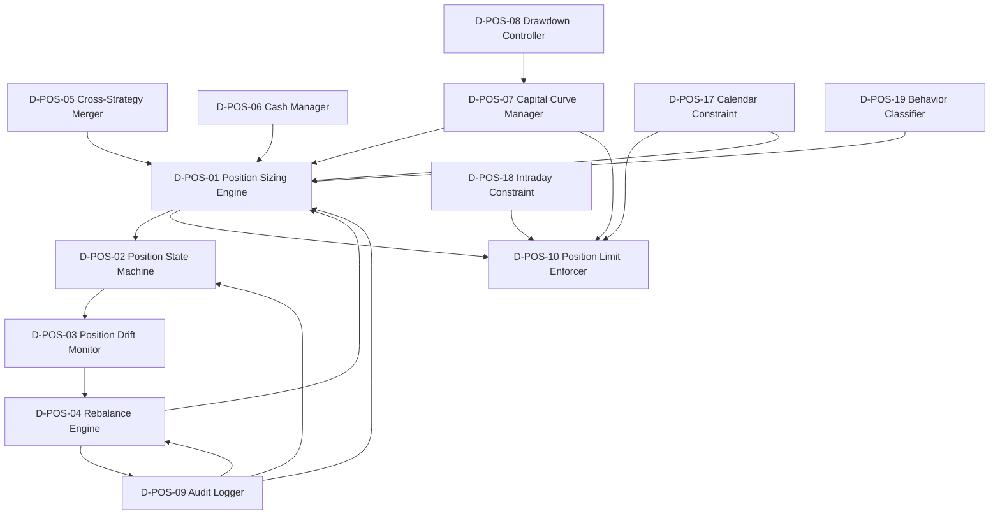

# 07 — D-POSITION 仓位管理域

> **状态**: DRAFT | **核心层**: L06 仓位管理 | **成熟度**: L1 🔵 骨架 | **简称**: POS
> **新增**: v5.0 卖出与仓位架构补全 / v6.0 减仓+时间预算 / v8.0 四轨+日历约束 | **依赖**: D-PF-CORE + D-PF-ALLOC + D-RISK + D-EX-CORE
> **定位**: 仓位管理唯一裁决中心(C-047)——消费上游组合目标权重+策略分配+风控约束，综合裁决产出最终仓位方案和再平衡指令

## §0 域定义

| 维度 | 内容 |
|------|------|
| 域ID | D-POSITION |
| 简称 | POS |
| 核心Aggregate | AGG-009 PositionPlan / AGG-010 CapitalCurve |
| 核心事件 | E-POS-01 PositionSized / E-POS-02 DriftDetected / E-POS-03 RebalanceTriggered / E-POS-04 CapitalCurveUpdated / E-POS-05 StateChanged |
| 开发状态 | 骨架——新增域，基础实现待建 |
| 优先级 | P0 |
| 激活前提 | D-PF-CORE就绪 + D-PF-ALLOC就绪 + D-RISK就绪 |
| 定位 | 插入在D-PF-CORE/D-PF-ALLOC和D-EX-CORE之间，仓位分配+持仓管理+再平衡的最终裁决者 |
| 数据分类 | DK-POSITION: 持仓数据/盈亏数据 = L2机密级, 季度密钥轮换, AES-256-GCM加密存储 |
| 数据流安全 | 持仓数据禁止公开(L0)/禁止未脱敏外发LLM/出站白名单拦截 |

## §1 子模块清单

### §1.1 仓位决策引擎 (POS-01~POS-06)

| ID | 名称 | 输入→输出 | 约束 | 优先级 | 建设 |
|----|------|----------|------|:------:|:----:|
| POS-01 | Position Sizing Engine | 四轨输入(逻辑驱动+数据驱动+人工指令+应急保命)+TargetPortfolio+CapitalAllocationResult+密度预测分布参数 → PositionPlan({symbol:target_qty}) | 半Kelly硬上限(0.5×f*)/风险配额内决策/波动率超2σ→仓位减半/前瞻性95%VaR>阈值→仓位上限下调/前瞻性95%CVaR>阈值→进一步下调/参与率>15%日成交量→否决/退出时间>3天→强制减仓至可退出/退出时间>1天→仓位上限折扣/策略容量>AUM×80%→预警+>AUM×100%→否决新资金/分布感知防御性只减不增(正偏分布允许+10%)/冲击成本>0.5%→否决单笔大额 | P0 | ✅可建 |
| POS-02 | Position State Machine | 仓位状态变更事件 → E-POS-05 StateChanged | NONE→BUILDING→ACTIVE→OBSERVING→REDUCING→EXITING→CLOSED/OBSERVING:软止损触发/异常开盘/暴跌→观察期(收盘前15min确认执行或解除,观察期禁止新买入)/CLOSED后N天最小重仓间隔期/灰度发布4阶段:新策略5%→20%→50%→100%(每阶段N天验证) | P0 | ✅可建 |
| POS-03 | Position Drift Monitor | 实际权重+目标权重+持仓分级(来自D-SELL-DECISION SELL-00) → E-POS-02 DriftDetected | 组合总仓位漂移>±2%→触发再平衡评估/单标的漂移>±3%→标的级再平衡评估/Watch(红色)实时秒级监控/Monitor(黄色)5分钟级/Hold(绿色)仅重大事件 | P1 | ✅可建 |
| POS-04 | Rebalance Engine | DriftDetected+再平衡调度 → E-POS-03 RebalanceTriggered+调仓指令列表 | 交易成本>预期收益→跳过/预期收益改善>2×交易成本才执行/⑦⑧⑨市场状态下成本系数×1.5/日历触发(周频强制)+偏离触发+事件触发/再平衡执行后组合仓位偏差<1% | P0 | ✅可建 |
| POS-05 | Cross-Strategy Position Merger | 多策略同标仓位 → 合并后标的最终仓位 | 多头取sum≤单票上限/买卖冲突→卖出信号优先级>买入信号优先级/超限→按策略优先级截断 | P1 | 🚫门禁:GATE-POS-05 |
| POS-06 | Cash Manager | 资金流水+结算状态 → 可用资金头寸+现金约束→反馈POS-01 | 最低储备金+机会储备X%+T+1结算约束+现金储备≥最低阈值+节假日持币规划(节前2天+节后1天提高现金比例5-15%)+闲置资金逆回购 | P1 | ✅可建 |

### §1.2 风险预算层 (POS-11~POS-13) 🆕v5.0

| ID | 名称 | 输入→输出 | 约束 | 优先级 | 建设 |
|----|------|----------|------|:------:|:----:|
| POS-11 | Covariance Estimator | 历史收益率序列 → CovarianceMatrix+MRC+CRC | 收缩估计(Ledoit-Wolf)/因子模型/Copula-GARCH(持仓≤50只) | P0 | 🚫门禁:GATE-POS-11 |
| POS-12 | Correlation Regime Monitor | 协方差矩阵+市场状态 → CorrelationRegimeAlert | 相关性飙升→动态降仓上限/分散化比率<0.3→否决集中持仓/尾部相关性→压力测试仓位折扣/牛市相关性趋同→分散化失效预警 | P1 | 🚫门禁:GATE-POS-12 |
| POS-13 | Risk Budget Allocator | 组合总风险预算+协方差矩阵 → RiskBudgetPerSymbol→约束POS-01 | Kelly在风险配额内决策(非独立决策后截断) | P0 | 🚫门禁:GATE-POS-13 |

### §1.3 资金曲线与风险联动 (POS-07~POS-10)

| ID | 名称 | 输入→输出 | 约束 | 优先级 | 建设 |
|----|------|----------|------|:------:|:----:|
| POS-07 | Capital Curve Manager | 已实现盈亏 → E-POS-04 CapitalCurveUpdated→联动POS-01仓位上限 | 回撤分级: <5%正常/<10%上限80%/<15%上限50%/>15%上限30%+仅防御/盈利扩张: 每次净值创新高+5%,最大不超过框架硬上限/亏损收缩: 回撤>5%缩减10%,回撤>10%缩减20%/恢复条件: 净值回到回撤前高点/本金=当前净值 | P0 | ✅可建 |
| POS-08 | Drawdown Controller | 组合回撤+系统性风险分级+黑天鹅模式 → 分级响应指令 | 系统性风险5级: 绿(VaR<2%正常)/黄(VaR2-4%新开仓减半)/橙(VaR4-6%禁止新开+减仓30%)/红(VaR>6%减仓50%+只平不开)/黑(CVaR>10%全部清仓)/策略级止损: Soft Stop单策略回撤>5%砍仓/Hard Stop>10%关闭策略/黑天鹅7模式→自动处置(见§14.3)/回撤回补50%→逐步恢复/不覆盖风控熔断 | P1 | ✅可建 |
| POS-09 | Position Audit Logger | 仓位变更事件 → 仓位审计报告→D-REPORTING+D-GOVERNANCE | 全记录+审批链+可追溯 | P1 | ✅可建 |
| POS-10 | Position Limit Enforcer | 仓位方案+约束集 → 约束检查结果+违规告警 | 单票≤风控上限(5%NAV)/行业≤集中度上限(基准±10%,绝对30%)/总仓位≤市场状态上限/半Kelly上限/亏损标的加仓约束:持仓亏损>X%后禁止同标的加仓(Hard Block)/压力测试:情景最大亏损<组合净值15%→收紧仓位上限/硬边界不可绕过/否决5级: P0 Kill Switch/P1强制减仓/P2否决新开仓/P3否决单笔/P4建议性告警 | P0 | ✅可建 |

### §1.4 减仓与时间预算 (POS-14~POS-16) 🆕v6.0

| ID | 名称 | 输入→输出 | 约束 | 优先级 | 建设 |
|----|------|----------|------|:------:|:----:|
| POS-14 | Scaling-Out Executor | 卖出信号+价格走势 → ScalingOutPlan | 退出权重序列[0.2,0.3,0.5]/信号强度分级退出/价格反弹>阈值X%→暂停退出序列(逆向中止) | P1 | 🚫门禁:GATE-POS-14 |
| POS-15 | Position Time Budget | 持仓时间+策略类型 → TimeBudgetAlert | 趋势策略>30天/均值回归<10天/超时→信号评分器自动提升卖出信号权重 | P1 | 🚫门禁:GATE-POS-15 |
| POS-16 | Sell-Position Bidirectional Link | SellDecision+仓位状态 → PositionStateFeedback→D-SELL-DECISION | 盈利状态→卖出阈值放宽/亏损状态→卖出阈值收紧/买入后即时验证: 5min跌破买入价>1%且放量→观察/15min跌破分时均线且反弹无力→减仓50%/30min反向运动>2ATR→全部止损 | P0 | ✅可建 |

### §1.5 仓位约束扩展 (POS-17~POS-19) 🆕v8.0

| ID | 名称 | 输入→输出 | 约束 | 优先级 | 建设 |
|----|------|----------|------|:------:|:----:|
| POS-17 | Calendar Position Constraint | A股风险日历+当前日期 → CalendarPositionAlert+临时仓位上限调整 | 期权交割日:否决新开仓位(仅允许减仓)/年报+一季报截止日(4月下旬):ST股仓位强制清零/年报预告截止日前5日:否决未出预告个股新买入/半年报预告截止日前5日:同上/股东信息空窗期(11月-次年4月30日):微盘股(<50亿市值)仓位上限收紧50%/交割日前2天+后1天:仓位上限临时下调5-10%/财报发布前3天:该标的仓位上限临时下调+禁止新建 | P1 | ✅可建 |
| POS-18 | Intraday Position Constraint | 做T指令+底仓信息 → 做T仓位约束检查结果 | 单次日内交易≤底仓30%/净收益<1.5%禁止执行/失误止损1.5%/不得超出底仓范围/不得违反T+1规则 | P2 | 🚫门禁:GATE-POS-18(C-012做T能力就绪) |
| POS-19 | Position Behavior Classifier | 大单净流向+仓位变化率+板块资金流 → 持仓行为分类(减仓/持仓/换仓/加仓/观望) | 减仓:总仓位减少+底部筹码缩短+大单净流出/持仓:总仓位不变+大单买卖均衡/换仓:总仓位不变+板块A净流出+板块B净流入/加仓:总仓位增加+底部筹码加长+大单净流入/观望:总仓位不变+量能萎缩 | P2 | 🚫门禁:GATE-POS-19(Level-2大单数据+筹码数据源就绪) |

### §1.6 建设门禁汇总

| 门禁ID | 受限模块 | 门禁条件 | 解锁标志 |
|--------|---------|---------|---------|
| GATE-POS-05 | POS-05 | GATE-001多策略框架就绪 + C-018多账户扩展就绪 | 多策略同标仓位合并需求激活 |
| GATE-POS-11 | POS-11 | D-ML-SERVE密度预测输出就绪 + 持仓数量≤50只硬约束满足 | 密度预测接口可用+持仓规模确认 |
| GATE-POS-12 | POS-12 | POS-11就绪 + 极端事件历史数据积累≥N个样本 | 协方差矩阵可用+尾部数据充足 |
| GATE-POS-13 | POS-13 | POS-11就绪 + D-PF-ALLOC策略分配方案就绪 | 协方差矩阵可用+策略分配接口可用 |
| GATE-POS-14 | POS-14 | D-SELL-DECISION卖出信号持续确认机制就绪 | 卖出信号分级确认链路可用 |
| GATE-POS-15 | POS-15 | 策略类型分类体系建立 + 信号评分器就绪 | 策略元数据完整+评分器接口可用 |
| GATE-POS-18 | POS-18 | C-012做T能力就绪 | 做T Agent底仓管理接口可用 |
| GATE-POS-19 | POS-19 | Level-2大单数据+筹码分布数据源就绪 | 大单流向+筹码数据接口可用 |

## §2 域内依赖图



## §3 域间依赖

| 消费什么 | 来自哪个域 | 契约/事件 | 类型 |
|---------|-----------|---------|:----:|
| TargetPortfolio (目标权重) | D-PF-CORE | CTR-007 | H |
| CapitalAllocationResult (策略分配) | D-PF-ALLOC | CTR-P1-003 | H |
| RiskLimits (风控约束) | D-RISK | CTR-003 | H |
| SellDecision (卖出决策) | D-SELL-DECISION | CTR-SELL-001 | E |
| PositionSnapshot (当前持仓) | D-EX-CORE | CTR-006 | H |
| MarketRegime (市场状态仓位上限) | D-SIGNAL | — | H |
| 密度预测输出(分布参数) | D-ML-SERVE | — | S |
| StrategyPositionAdvice (策略级仓位建议) | D-PF-CORE | CTR-007 | H |
| AIDiscoveryPosition (AI发现轨仓位信号) | D-ML-SERVE | — | S |
| PositionTriage (持仓分级Watch/Monitor/Hold) | D-SELL-DECISION | SELL-00 | S |
| A股风险日历 | D-DATA | — | H |
| 权限/审计/遥测 | D-AUTONOMY | CTR-TRACE-001 | H |
| Saga编排(再平衡Saga) | D-INTEGRATION | D-INTEGRATION-18 | S |

| 产出什么 | 去往哪个域 | 契约/事件 | 类型 |
|---------|-----------|---------|:----:|
| PositionPlan (最终仓位方案) | D-EX-CORE | CTR-POS-001 | H |
| RebalanceTriggered | D-EX-CORE / D-PF-CORE | E-POS-03 | E |
| CapitalCurveUpdated | D-RISK / D-PF-CORE | E-POS-04 | E |
| PositionAuditReport | D-REPORTING / D-GOVERNANCE | — | E |
| PositionStateFeedback (仓位状态反馈) | D-SELL-DECISION | — | S |
| CalendarPositionAlert (日历仓位预警) | D-RISK / D-REPORTING | — | E |

## §4 域事件流

| 事件ID | 事件名 | 触发条件 | 消费者 |
|--------|--------|---------|--------|
| E-POS-01 | PositionSized | 仓位决策完成(每标的最终目标数量确定) | D-EX-CORE, D-PF-CORE |
| E-POS-02 | DriftDetected | 持仓漂移超过阈值(组合±2%/单标的±3%) | D-POS-04 Rebalance Engine |
| E-POS-03 | RebalanceTriggered | 再平衡指令生成 | D-EX-CORE, D-PF-CORE |
| E-POS-04 | CapitalCurveUpdated | 资金曲线变更(盈亏/回撤变化) | D-RISK, D-PF-CORE, D-POS-01 |
| E-POS-05 | StateChanged | 持仓状态变更(BUILDING→ACTIVE→OBSERVING等) | D-REPORTING, D-GOVERNANCE |
| E-POS-06 | CalendarPositionAlert | A股风险日历触发仓位约束 | D-RISK, D-EX-CORE |

## §5 激活前提与就绪条件

| 前提 | 就绪标准 |
|------|---------|
| D-PF-CORE 就绪 | CTR-007 TargetPortfolio 可用 |
| D-PF-ALLOC 就绪 | CTR-P1-003 CapitalAllocationResult 可用 |
| D-RISK 就绪 | CTR-003 RiskLimits 可用 |
| D-EX-CORE 就绪 | CTR-006 PositionSnapshot 可用 |
| D-SIGNAL 就绪 | 市场状态仓位上限可用 |
| D-DATA 就绪 | A股风险日历数据可用 |

**降级模式**: POS-01未就绪 → 固定比例仓位(按市场状态查表)，跳过仓位裁决直接进入C-004风控审批

**性能SLA**:

| 指标 | 要求 |
|------|------|
| 仓位裁决延迟 | <100ms(P50) / <500ms(Warm) / <1000ms(P99) |
| 仓位漂移检测延迟 | <5秒 |
| 再平衡执行后组合仓位偏差 | <1% |
| 仓位冲突 | 零(不存在两个策略对同一标的有矛盾仓位指令同时执行) |
| 持仓数据一致性 | 3秒内一致(miniQMT回调+Redis Stream增量同步,超时→全量同步+告警) |

## §6 设计决策记录

| 决策 | 结果 |
|------|------|
| 新增D-POSITION独立域 | 仓位逻辑分散四域→统一裁决中心 |
| 仓位管理四层架构 | 组合层(总仓位上限)→策略层(策略间分配)→标层(Kelly决策)→动态层(漂移+再平衡) |
| 半Kelly为硬上限 | 全Kelly估计误差下过度下注→半Kelly |
| 资金曲线驱动仓位缩放 | 盈利扩张+亏损收缩 |
| CLOSED后最小重仓间隔期 | 最小交易间隔约束 |
| 现金管理独立子模块 | T+1结算约束下现金规划刚需 |
| 跨策略仓位合并冲突消解 | 卖出信号优先级>买入信号优先级，合并仓位≤单票上限 |
| 四轨仓位决策(v8.0) | 轨道1逻辑驱动+轨道2数据驱动+轨道3人工指令+轨道4应急保命→四轨融合 |
| OBSERVING观察期(v6.0) | 软止损/异常开盘/暴跌→观察期(收盘前15min确认/解除,禁止新买入) |
| A股风险日历约束层(v8.0) | 可预测周期性风险事件→自动收紧仓位参数 |
| 策略灰度发布4阶段 | 新策略5%→20%→50%→100%(替代原×0.3单系数) |
| 亏损标的加仓Hard Block | 持仓亏损>X%后禁止同标的加仓(四项严禁之一) |
| 持仓WAL模式 | 每笔成交回报先写日志再更新内存,崩溃恢复后可重放 |
| 仓位框架自优化 | 某仓位档位连续亏损→自动降低仓位上限 |

## §7 仓位管理决策架构

### §7.1 四层决策架构

```
┌──────────────────────────────────────────────────────────────────┐
│ D-POSITION 仓位管理四层决策架构                                    │
├──────────────────────────────────────────────────────────────────┤
│                                                                  │
│  第一层：组合层 (Portfolio Level)                                  │
│  ├─ 总仓位上限：min(市场状态上限, 风控上限, 资金曲线上限, 日历约束上限)│
│  ├─ 风险预算总框：D-PF-ALLOC策略间分配方案                          │
│  └─ 现金约束：最低储备金+机会储备+T+1结算+节假日持币规划             │
│                         │                                        │
│                         ▼                                        │
│  第二层：策略层 (Strategy Level)                                   │
│  ├─ 策略内标的选择：D-PF-CORE目标权重                               │
│  ├─ 跨策略仓位合并：同标的多策略合并(sum或max)                       │
│  └─ 策略灰度发布：新策略5%→20%→50%→100%                            │
│                         │                                        │
│                         ▼                                        │
│  第三层：标层 (Symbol Level)                                       │
│  ├─ Kelly仓位：p_i=∫₀^∞ f(r|X)dr, b_i=E[r⁺]/|E[r⁻]|, f*=(bp-q)/b │
│  ├─ 半Kelly约束：w_kelly = min(0.5×f*, 单票上限)                   │
│  ├─ 分布感知调整：偏度/峰度/VaR/CVaR → 防御性只减不增               │
│  ├─ 流动性检查：参与率>15%→否决 / 退出时间>3天→强制减仓              │
│  └─ 波动率检查：波动率超2σ→仓位减半 / 前瞻VaR/CVaR超限→仓位下调     │
│                         │                                        │
│                         ▼                                        │
│  第四层：动态层 (Dynamic Level)                                    │
│  ├─ 持仓状态机：NONE→BUILDING→ACTIVE→OBSERVING→REDUCING→EXITING   │
│  │              →CLOSED(最小重仓间隔期)                             │
│  ├─ 漂移监控：组合±2%/单标的±3% + 持仓分级驱动监控频率              │
│  ├─ 再平衡决策：成本>2×收益→跳过 / ⑦⑧⑨成本系数×1.5               │
│  └─ 资金曲线联动：回撤→降仓/盈利→扩张                               │
│                                                                  │
└──────────────────────────────────────────────────────────────────┘
```

### §7.2 四轨仓位决策架构 🆕v8.0

| 轨道 | 名称 | 输入来源 | 仓位决策 |
|------|------|---------|---------|
| 轨道1 | 逻辑驱动 | 多策略共振仓位+因子直通(策略未覆盖/冲突时Kelly+风险预算直接决策) | 确认仓位 |
| 轨道2 | 数据驱动 | AI发现轨仓位信号(RL策略→AI仓位建议) | 确认仓位 |
| 轨道3 | 人工指令 | 人工调仓指令→验证→执行(临时调整仓位上限/降仓/加仓) | 覆盖自动 |
| 轨道4 | 应急保命 | 应急模式→硬编码仓位上限(单标的≤10%/总仓位≤30%) | 硬上限不可逾越 |

**四轨融合规则**: 1+2同向→确认仓位 / 单轨→保守仓位 / 冲突→取较小值 / 轨道3覆盖自动 / 轨道4硬上限不可逾越

**四轨优先级**: 轨道4(应急) > 轨道3(人工) > 轨道1/2(自动)

### §7.3 市场状态→仓位上限映射

| 市场状态 | 仓位上限 | 量能体制 | 仓位调整 |
|---------|:-------:|---------|---------|
| ①平稳牛市 | 80% | 高量能(>2万亿) | 扩张≤90% |
| ②动量牛市 | 80% | 高量能-中(1.5-2万亿) | 扩张≤80% |
| ③恐慌反弹 | 60% | 中量能(5000亿-1.5万亿) | 正常 |
| ④窄幅盘整 | 40% | 低量能(<5000亿) | 收缩≤50% |
| ⑤宽幅震荡 | 50% | — | — |
| ⑥压缩突破 | 60%(40%→70%) | — | — |
| ⑦阴跌 | 30% | — | — |
| ⑧加速下跌 | 20% | — | — |
| ⑨恐慌崩盘 | 10% | — | — |
| ⑩事件驱动(叠加态) | 基础仓位×70% | — | — |
| ⑪板块轮动(叠加态) | 基础仓位(行业集中度放宽至±15%) | — | — |

> 状态→仓位映射为immutable(不可AI修改), 调整需Trader审批

### §7.4 A股风险日历→仓位约束 🆕v8.0

| 日历事件 | 时间规则 | 仓位约束 |
|---------|---------|---------|
| 股指期货交割日 | 每月第三个周五 | 交割日前1日:VaR置信度95%→99% |
| 股指期权交割日 | 每月第四个周三 | 否决新开仓位(仅允许减仓) |
| 年报预告截止日 | 1月31日 | 截止日前5日:否决未出预告个股新买入 |
| 年报+一季报截止日 | 4月30日 | 4月下旬:ST股仓位强制清零 |
| 半年报预告截止日 | 7月15日 | 截止日前5日:否决未出预告个股新买入 |
| 半年报截止日 | 8月31日 | 维持现有参与率约束 |
| 三季报截止日 | 10月31日 | 维持现有参与率约束 |
| 股东信息空窗期 | 11月-次年4月30日 | 微盘股(<50亿市值)仓位上限收紧50% |

## §8 CTR-POS-001 PositionPlan 定义

| 字段 | 类型 | 说明 |
|------|------|------|
| plan_id | str | 仓位方案唯一标识 |
| strategy_id | str | 关联策略ID |
| positions | dict[str, PositionTarget] | {symbol: {target_qty, current_qty, delta, reason}} |
| cash_reserve | float | 现金储备金额 |
| total_exposure | float | 总仓位暴露比例 |
| capital_curve_discount | float | 资金曲线缩放系数(回撤期<1.0, 盈利期>1.0) |
| calendar_constraint_active | bool | 日历约束是否激活 |
| volatility_adjustment | float | 波动率调整系数(正常1.0, 超2σ→0.5) |
| constraints_check | dict | 各约束层检查结果 |
| created_at | datetime | 创建时间 |
| idempotency_key | str | 幂等键 |
| schema_version | str | "1.0" |

## §9 跨域接口与仲裁

### §9.1 四域核心数据流（POS视角）

```
D-SIGNAL ──→ D-SELL-DECISION ──→ D-POSITION ──→ D-EX-CORE ──→ D-EX-SOR
  │ CTR-002      CTR-SELL-001      CTR-POS-001    CTR-004       CTR-004
```

### §9.2 关键跨域接口

| 方向 | 接口 | 契约/事件 | 优先级 | 签名冻结 |
|------|------|---------|:------:|:--------:|
| ←消费 | SellDecision(卖出决策) | CTR-SELL-001 | P0 | ✅冻结 |
| →产出 | PositionPlan(最终仓位方案) | CTR-POS-001 | P0 | ✅冻结 |
| →产出 | RebalanceTriggered | E-POS-03 | P0 | ✅冻结 |
| →产出 | CapitalCurveUpdated | E-POS-04 | P0 | ✅冻结 |
| →产出 | PositionStateFeedback | — | P0 | 可演进 |
| →产出 | CalendarPositionAlert | E-POS-06 | P1 | 可演进 |
| ←消费 | PositionSnapshot(当前持仓) | CTR-006 | P0 | ✅冻结 |
| ←消费 | PositionTriage(持仓分级) | SELL-00 | P1 | 可演进 |

**仓位裁决不可绕过(§15 INV-POS-001)**: 所有常规仓位决策必须经过C-047裁决。例外: ①C-004风控veto ②即时反应引擎紧急子通道(仅限减仓,卖出量≤C-047当前已裁决标的仓位上限,仍须经过C-004风控检查加速至<100ms,事后C-047动态层补录)

### §9.3 跨域事件因果链

```
卖出信号触发链:
  D-SIGNAL卖出信号 → SELL-07融合 → E-SELL-01 SellSignalFused
    → POS-01仓位裁决 → E-POS-01 PositionSized
    → EX-CORE-01订单 → EX-SOR路由 → 成交 → E-EX-04 FillReceived
    → POS-03漂移检测

再平衡触发链:
  POS-03漂移检测(>2%) → E-POS-02 DriftDetected → POS-04再平衡决策
    → E-POS-03 RebalanceTriggered → D-INTEGRATION-18 Saga编排
    → EX-CORE-01订单 → 成交 → 持仓更新(Saga Step5) → 报告生成(Saga Step6)
```

### §9.4 下单Saga中的持仓环节

| Saga步骤 | 操作 | 失败补偿 |
|---------|------|---------|
| Step 1 | 风控检查 | 无需补偿 |
| Step 2 | 信号确认 | 无需补偿 |
| Step 3 | 下单提交 | 撤单(如已报) |
| Step 4 | 成交确认 | 无需补偿(被动等待) |
| Step 5 | 持仓更新 | 持仓回滚(幂等覆盖) |
| Step 6 | 报告生成 | 标记报告待更新(异步) |

> Saga超时硬约束: 整个Saga≤5s / 补偿必须幂等 / Saga状态持久化于Redis Stream

### §9.5 四域激活序列

```
RISK → AUTONOMY → SIGNAL → PF-CORE+PF-ALLOC → SELL-DECISION → POSITION → EX-CORE → EX-SOR
```

### §9.6 仲裁优先级体系

```
1. C-004 风控 (D-RISK) — 绝对否决权
2. C-047 仓位上限 (D-POSITION POS-10) — 硬约束 ← POS在此
3. C-021 市场状态仓位上限 — 硬约束(immutable)
4. 卖出决策引擎 (D-SELL-DECISION) — 卖出优先于买入
5. T+1次日预测 (C-014)
6. 安全防护 (C-033/C-031)
7. 交易策略 (C-005/C-012)
8. 买入决策 (C-006)
9. 研究探索 (C-006/C-007/C-027)

执行链路: C-047→C-004→C-002（仓位裁决→风控审批→执行），任何环节不可跳过。
```

### §9.7 4级风控决策门控 🆕v4.0

| 决策 | 仓位影响 | 触发条件 |
|------|---------|---------|
| APPROVE | 正常仓位 | 风控检查通过 |
| REDUCE | 仓位缩减至风控允许上限(集中度/行业偏离/波动率动态计算) | 风险指标接近阈值 |
| REJECT | 完全阻断,仓位不变 | 风险指标超限 |
| FLATTEN | 紧急平仓+进入reduce-only模式 | 单日回撤5%/连续3日亏损/系统性风险标志(硬编码,不可AI修改,需人工解锁) |

### §9.8 仲裁冲突矩阵

| 冲突方A | 冲突方B | 仲裁规则 | 优先级 |
|--------|--------|---------|-------|
| C-047仓位裁决 | C-004风控上限 | 裁决结果不得突破风控上限 | C-004优先 |
| C-047仓位裁决 | C-021市场状态仓位 | 市场状态仓位上限为硬约束 | C-021硬约束 |
| 跨策略仓位合并 | 单票仓位上限 | 按策略优先级截断,合并后≤硬上限 | 硬上限优先 |
| 灰度发布 | 风险预算仓位 | 灰度期内min(风险预算仓位×灰度系数, 正常仓位50%) | 灰度优先 |

## §10 合规约束

> 合规规则唯一真源: 合规架构(A6)。风险否决阈值定义: 风险架构(A4)§6.2。本节为仓位管理域的合规执行规格。

### §10.1 持仓限额

| 限额类型 | 规则 | 执行子模块 | 执行模式 | 法规依据 |
|---------|------|-----------|---------|---------|
| 单一持仓上限 | 单票≤5% NAV(→B-003), 保命轨≤10%(SURV-001) | POS-10 | Hard Block | 《证券法》第86条 |
| 举牌义务 | 持股超5%需公告(50万AUM下不触发，架构预留) | POS-01 | Warning | 《证券法》第86条+《上市公司收购管理办法》 |
| ST股限制 | ST股仓位上限=普通股50%(2026.7.6后调整为30%); 4月下旬强制清零 | POS-10+POS-17 | Hard Block | 内部风控规则+LP-05 |
| 亏损标的加仓 | 持仓亏损>X%(建议-5%)后禁止同标的加仓 | POS-10 | Hard Block | 四项严禁(§12.2.2) |
| 价格追涨买入 | 价格追涨幅度超阈值+买入时间在急剧拉升后 | POS-10 | Hard Block | 四项严禁(§12.2.2) |
| 连续盈利后风险敞口 | 连续盈利N笔后单笔风险敞口超常规水平 | POS-10 | Warning | 四项严禁(§12.2.2) |
| 当日亏损后交易异常 | 当日亏损>Y%后交易频率/单笔规模异常增加 | POS-10 | Hard Block(强制停盘) | 四项严禁(§12.2.2) |

**与D-RISK分工**: D-RISK RK-06=逐笔订单前Hard Block检查(逐笔防线); D-POSITION POS-10=仓位决策层面限额执行(方案防线)。两层互补。

### §10.2 行业集中度

| 约束 | 限制 | 执行子模块 | 来源 |
|------|------|-----------|------|
| 行业偏离 | ≤基准±10%(⑪板块轮动激活时±15%，绝对上限30%) | POS-10 | 能力定位书§2-d约束三 |
| 风格暴露 | ≤±0.3标准差 | POS-10 | 能力定位书§2-d约束三 |
| 关联方持仓 | 同一实控人下多账户合并计算 | POS-05(GATE-001后) | 《证券法》第86条 |
| 集中度超限 | 行业集中度>30%→自动分散(绝对占比硬上限,与±10%相对偏离同时生效取更严) | POS-10 | A4§6.2 |

**补充**: 行业分类=申万31行业; ⑪极端波动放宽须由D-SIGNAL市场状态判定触发; 绝对上限30%硬编码不可逾越; 风格暴露基于D-FACTOR CTR-002因子暴露计算; 路径绕过攻击防护(通过衍生品绕过现货持仓限制→Hard Block)

### §10.3 短线交易防护

| 规则 | 仓位管理影响 | 执行子模块 | 法规依据 |
|------|------------|-----------|---------|
| 大股东/董监高6个月内买卖同一标的收益归公司 | POS-02增加6个月冷却期检测+收益归入标记(50万AUM下不触发，架构预留) | POS-02 | 《关于短线交易监管的若干规定》(2026.4) |
| 关联方合并计算 | POS-05跨账户合并计算短线交易(GATE-001后) | POS-05 | 同上 |
| 做T底仓豁免 | POS-02区分底仓(持仓>1天)与日内交易，底仓豁免短线交易标记 | POS-02 | 同上 |

## §11 安全约束

> 来源: A5安全架构 §1.1 交易域

| 维度 | 规则 |
|------|------|
| 域信任等级 | 交易域=最高信任等级(交易指令篡改/泄露→直接资金损失; A股T+1不可撤回) |
| 资产分类 | 交易指令/策略参数=绝密(L3); 持仓数据/订单状态/盈亏数据=机密(L2); 行情数据=内部(L1) |
| 数据密钥 | DK-POSITION: L2机密级, 季度密钥轮换, AES-256-GCM加密存储 |
| 数据流入 | 数据域→行情/因子/信号(签名验证+时间戳); 治理域→审批策略参数(审批令牌+签名); 运维域→配置/密钥(签名验证+加密传输) |
| 数据流出 | 数据域→交易结果(脱敏); 治理域→审批请求(最小信息量); 运维域→审计日志(仅追加+签名+哈希链); 外部→合规报告(预定义格式+审批) |
| 数据脱敏 | L2→L1: 持仓数据→持仓分布(聚合化); L2→L0: 持仓/交易数据禁止公开 |
| DLP防护 | 出站白名单: 禁止未脱敏持仓/交易/策略数据发送到外部LLM; 敏感模式检测(正则+ML) |
| 安全控制 | 交易指令生成到提交完整签名链; miniQMT凭证仅交易域进程内可见; 进程级隔离(Windows Job Object+受限令牌); 提交前确定性校验(价格/数量/风控) |
| 持仓分级安全 | SELL-00: Watch/Monitor/Hold三级分级+动态升降级审计 |

## §12 Agent映射

> 来源: Agent架构(A7)。Agent行为唯一真源为A7，本节为仓位管理域的Agent交互规格。

| Agent | 仓位相关职责 | 消费D-POSITION | 产出至 | 自治级别 | 权限边界 |
|-------|------------|---------------|--------|---------|---------|
| 风控Agent | 仓位上限决策+熔断触发+独立对冲执行 | 仓位状态 | D-RISK(风控否决/熔断)+D-EX-CORE(对冲指令) | Level 1(确定性系统) | 可自主:参数微调(硬边界±10%)+独立对冲(硬编码规则内); 需审批:仓位上限调整+熔断阈值变更+风控规则修改; 不可:关风控/降等级/绕否决 |
| 做T Agent | 日内T+0套利+底仓管理 | 底仓信息 | D-EX-CORE(做T指令)+D-SELL-DECISION(做T卖出协调) | Level 1(确定性系统) | 可自主:做T参数微调(允许范围内); 需审批:做T规则修改+底仓比例调整; 不可:超底仓做T/违反T+1 |
| 市场状态Agent | 状态判定→仓位上限映射 | — | D-POSITION(市场状态仓位上限) | Level 2(弱自主) | 可自主:状态判定+概率估计; 不可修改:状态定义+状态→仓位映射(immutable); 需审批:状态定义修改+仓位映射调整 |
| 编排Agent | 设定决策约束(仓位上限/风险预算) | — | D-POSITION(决策约束) | Level 2 | 需审批:仓位上限映射规则调整; 不可:绕风控/改硬边界/直接下单 |

**否决流仓位语义**: 风控Agent否决流为最高优先级可穿透任意层; P0-紧急=熔断指令+紧急清仓(立即执行跳过所有队列); P1-高=仓位上限调整+交易禁止(优先处理); 战术层风控信号可直接触发战略层仓位调整

**状态恢复**: 做T Agent持仓状态与实际不符→从miniQMT重建状态

## §13 学习系统接口

> 来源: 学习系统架构(A8)。学习系统行为唯一真源为A8，本节为仓位管理域的学习系统交互规格。

### §13.1 知识注入路径

| 注入路径 | 知识类型 | 仓位管理影响 | 约束 |
|---------|---------|------------|------|
| risk→C-004规则引擎 | 风控知识 | POS-10约束更新 | 需人工审核+不可降低硬边界 |
| methodology→C-007优化维度 | 方法论知识 | POS-01决策优化 | 新维度需评估边际Alpha |
| lesson_learned→C-004预防规则 | 教训知识 | POS-10新增仓位预防规则 | 需人工审核根因分析+预防措施可执行性 |

### §13.2 反馈路径

| 反馈路径 | 仓位管理影响 | 频率 |
|---------|------------|:----:|
| C-010复盘数据(PnL+归因) | 知识有效→仓位维持/扩大; 无效→仓位缩减 | 每日 |
| C-007闭环结果 | 策略失效→仓位降级; 有效→仓位维持 | 每周 |
| C-022数据质量报告 | 数据质量低→仓位决策置信度降低 | 每日 |
| C-033过拟合报告 | 过拟合知识→降权→仓位缩减 | 每周 |
| 仓位档位连续亏损 | 自动降低该档位仓位上限(仓位框架自优化) | 持续 |

### §13.3 元学习约束

- 半Kelly硬上限(0.5×f*): 与§6设计决策一致
- AI权重≤30%: AI生成信号权重不超过30%，与B-007人类监督对齐
- 权重中心接口安全隔离: 学习系统输出目标权重而非订单→POS-01在权重基础上裁决最终仓位
- 4级风控决策门控: APPROVE/REDUCE/REJECT/FLATTEN(§9.7)
- 策略灰度发布: 5%→20%→50%→100%(§6设计决策)
- 群集行为防护: 与行业模型相关性>0.7→自动差异化+市场压力时降仓

## §14 运维规格

> 来源: 运维架构(A9) §4应急保命轨+§2.2 Hot平面

### §14.1 仓位降级

| 降级路径 | 仓位管理动作 | 对应子模块 |
|---------|-------------|-----------|
| D-L0→D-L1 | 总仓位上限降至60%; 关闭做T/事件策略 | POS-08 |
| D-L1→D-L2 | 总仓位上限降至30%(SURV-002)，单票上限10%(SURV-001); 仅保留风控+执行+持仓保护 | POS-08+POS-10 |
| D-L2→D-L3 | 冻结一切仓位变动，仅监控持仓 | POS-08 |
| 日亏损>AUM 2% | 收紧仓位上限-10% | POS-08 |
| 日亏损>AUM 5% | 清仓(SURV-003)+AI自治熔断 | POS-08+RK-17 Kill Switch |
| 日亏损>AUM 8% | 系统冻结(SURV-003执行失败兜底) | POS-08 |

### §14.2 SURV生存规则

| 规则ID | 规则 | 参数 | 不可绕过 |
|--------|------|------|:--------:|
| SURV-001 | 单票持仓不超过AUM的10% | 10% | ✅ |
| SURV-002 | 总仓位不超过AUM的30% | 30% | ✅ |
| SURV-003 | 单日亏损超过AUM 5%清仓 | 5% | ✅ |
| SURV-004 | 涨停板不买入 | — | ✅ |
| SURV-005 | 跌停板不卖出(无法成交) | — | ✅ |
| SURV-006 | 非交易时段不下单 | — | ✅ |
| SURV-007 | 每笔订单必须经过风控检查 | — | ✅ |
| SURV-008 | 持仓股票ST/退市风险→次日清仓 | — | ✅ |

### §14.3 黑天鹅模式→仓位处置

| 模式 | 特征信号 | 仓位处置 |
|------|---------|---------|
| BS-001 流动性蒸发 | 成交量骤降至30%+买卖价差扩大3倍 | 参与率约束收紧至5%+暂停做T |
| BS-002 相关性崩塌 | 跨板块相关性<0.1+分散化失效 | 集中度强制分散+降总仓位 |
| BS-003 波动率爆发 | VIX类指标>2σ+已实现波动率翻倍 | 仓位减半+暂停新开仓 |
| BS-004 融资盘踩踏 | 两融余额单日降>10%+融资保证金上调 | 降杠杆敞口+暂停融资标的 |
| BS-005 跨市场传导 | 外围市场暴跌+北向资金大幅流出 | 降仓位至市场状态对应档位 |
| BS-006 政策黑天鹅 | 交易规则突变/印花税调整/行业禁令 | 暂停受影响标的交易+评估 |
| BS-007 系统性风险 | 多个BS模式同时触发 | Kill Switch(P0) |

### §14.4 KS-L4降额运行

| 维度 | 规则 |
|------|------|
| 降额规则 | KS-L4恢复后降额运行1天: 最大持仓降为正常50%, 单笔限额降为正常50%, 次日自动恢复 |
| 硬边界兼容 | HB-09(风控不可降级)→降额期间风控标准不变,仅交易额度降低 |

### §14.5 Hot平面仓位数据隔离

| 隔离维度 | 机制 | 目的 |
|---------|------|------|
| Redis | `position:{account}` Key由P3独占写入 | 避免并发写入持仓不一致 |
| 内存 | P3预留8GB包含持仓缓存 | 避免Redis读取延迟影响持仓查询 |
| 一致性 | 每笔成交后立即更新Redis持仓+与miniQMT对账 | 持仓RPO=0硬约束 |
| WAL | 每笔成交回报先写日志再更新内存 | 崩溃恢复后可重放 |
| RPO | 持仓RPO=0(交易时段), Redis AOF+RDB混合持久化确保RPO≤1s | 能力定位书约束五 |

### §14.6 未平仓头寸问题(灾备)

| 灾备维度 | 规则 |
|---------|------|
| 恢复目标 | 恢复后必须立即知道当前持仓和盈亏 |
| 数据完整性 | 订单历史+持仓状态+当前市值必须完整 |
| 恢复后动作 | 验证持仓→评估盈亏→决定是否继续交易或清仓 |
| 对账规则 | P3恢复后首先执行持仓对账(与miniQMT对比), 不一致→触发D-L1降级(仅平仓不开新仓) |
| 故障检测 | 立即通过miniQMT查询所有持仓→如存在未保护敞口→自动执行保护性减仓 |
| RTO | 交易核心(P3) RTO≤5min |

### §14.7 流动性降级模式

| 流动性等级 | 条件 | VaR处理 | 仓位影响 |
|-----------|------|---------|---------|
| 正常 | 退出时间≤1天 | 标准LVaR | 0% |
| 降级 | 退出时间1-3天 | VaR+0.5%溢价 | 仓位上限折扣 |
| 极端 | 退出时间>3天 | VaR+1%溢价+强制减仓 | 强制减仓至可退出 |

### §14.8 流动性螺旋三阶段

| 阶段 | 信号 | 仓位响应 | 硬约束 |
|------|------|---------|--------|
| 阶段1:价差异常 | 买卖价差扩大>2倍+成交量萎缩>30% | 参与率收紧至5%+暂停做T | 不可追跌卖出 |
| 阶段2:强制卖出 | 两融余额单日降>10%+融资保证金上调 | 降杠杆敞口+暂停融资标的 | 保证金覆盖率<120%→强制降杠杆 |
| 阶段3:流动性冻结 | 成交量<日均10%+买卖价差>10倍 | Kill Switch(P0) | 全系统暂停 |

## §15 不变量

| 不变量ID | 声明 | 违反处置 | 优先级 | 运行平面 |
|---------|------|---------|:------:|---------|
| INV-POS-001 | 仓位裁决不可绕过——所有常规仓位决策必须经过C-047裁决。例外: ①C-004风控veto ②即时反应引擎紧急子通道(仅限减仓,≤C-047已裁决上限,事后补录) | reject_commit | P0 | hot |
| INV-POS-002 | 半Kelly为硬上限——仓位分配必须使用半Kelly(0.5×f*)，禁止使用全Kelly | reject_commit | P0 | hot |
| INV-POS-003 | 状态→仓位映射不可AI修改——市场状态到仓位上限的映射为immutable,调整需Trader审批 | reject_commit | P0 | hot |
| INV-POS-004 | 持仓RPO=0——交易时段持仓数据零丢失(WAL+Redis AOF) | reject_commit | P0 | hot |
| INV-POS-005 | 亏损标的加仓Hard Block——持仓亏损>X%后禁止同标的加仓(四项严禁) | reject_commit | P0 | hot |
