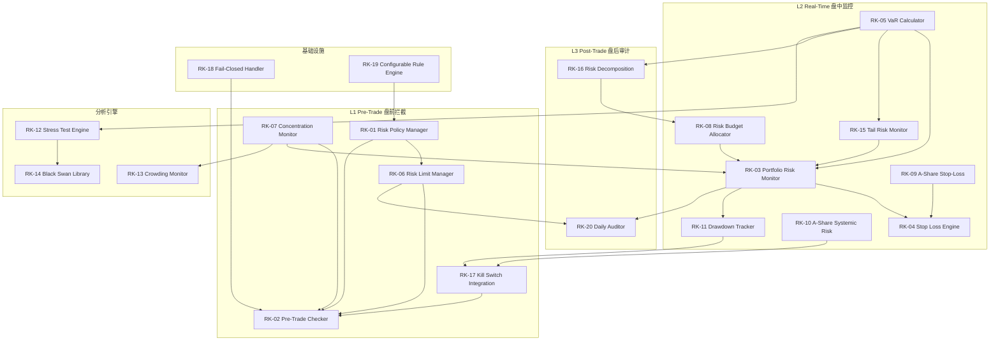
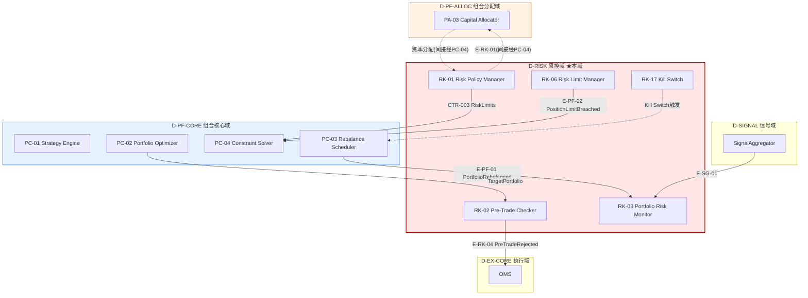

# 11 — D-RISK 风控域

> **状态**: DRAFT | **版本**: v3.0.0 | **骨架厚度**: 厚(8✅→20) | **已开发域需能力对齐验证**
> **一句话**: 约束交易风险——三层防线+双引擎+Kill Switch最后防线

## §0 域定义

| 属性 | 值 |
|------|-----|
| 域ID | D-RISK |
| 简称 | RSK |
| 职责 | **自适应风控**。Pre/Post-Trade风控+实时监控+熔断+Kill Switch+VaR+压力测试+拥挤度检测+黑天鹅模式库——资金安全的决策中枢 |
| 层 | DOMAIN |
| 状态 | 🔒 已开发(4子模块)+🔵 骨架(16子模块) |
| 类型 | core |
| safety_level | H |
| ai_autonomy | human_gated |
| H依赖数 | 2 (D-AUTONOMY-CORE + D-DATA) |
| 核心Aggregate | AGG-007 RiskPolicy |
| 核心事件 | E-RK-01 RiskLimitBreached / E-RK-02 MarginCalled / E-RK-03 DrawdownAlerted / E-RK-04 PreTradeRejected |
| 架构 | 三层防线 + 双引擎 |
| 三层防线 | L1 Pre-Trade(盘前拦截) → L2 Real-Time(盘中监控) → L3 Post-Trade(盘后审计) |
| 双引擎 | 规则引擎(确定性→硬阻断) + 统计引擎(概率性→告警+建议) |
| 优先级 | P0 |
| 激活前提 | D-DATA就绪(CTR-001) / D-FACTOR就绪(CTR-002) / D-AUTONOMY就绪(CTR-TRACE-001) |

### 三层防线职责

| 防线 | 阶段 | 职责 | 关键检查项 |
|------|------|------|-----------|
| 第一层 | Pre-Trade 盘前拦截 | 下单前硬阻断 | 仓位限额 / 行业集中度 / 杠杆率 / 合规规则 / Kill Switch状态 |
| 第二层 | Real-Time 盘中监控 | 持仓实时告警 | VaR / 回撤 / 止损 / 熔断 / 尾部风险 |
| 第三层 | Post-Trade 盘后审计 | 日终检查与报告 | 日终PnL / 归因偏差 / 合规报告 |

### 双引擎分工

| 引擎 | 类型 | 输出 | 适用场景 |
|------|------|------|---------|
| 规则引擎 | 确定性 | 硬阻断(通过/拒绝) | 仓位限额、合规规则、杠杆率 |
| 统计引擎 | 概率性 | 告警+建议 | VaR超限、回撤预警、尾部风险 |

## §1 子模块清单（Step 1: 能力定位对齐）

### §1.1 能力项提取

| 能力 | P级 | 角色 | 关键需求 |
|------|:---:|:----:|---------|
| C-004 自适应风控 | P0 | ●核心 | Pre/Post-Trade+实时监控+熔断+Kill Switch |
| C-032 资金曲线自诊断 | P1 | ●核心 | 资金曲线跟踪+回撤诊断+自动调参 |
| C-038 黑天鹅模式库 | P1 | ●核心 | 极端事件模式识别+历史重放+预案匹配 |
| C-040 系统性压力测试 | P1 | ●核心 | 历史情景+假设情景+反向压力+传染效应 |
| C-045 拥挤度检测 | P1 | ●核心 | 同质度+资金流+踩踏预警 |
| C-020 渐进式全球扩展 | P2 | ◐辅助 | 跨市场风险传导 |
| C-021 市场状态判定 | P1 | ◐辅助 | 市场状态→风控参数动态调整(9档仓位上限→风险参数) |
| C-026 执行运营自优化 | P1 | ◐辅助 | 执行反馈→风控参数优化 |
| C-035 庄家行为自迭代 | P1 | ◐辅助 | 庄家识别→风控调整 |
| C-042 策略容量建模 | P1 | ◐辅助 | 容量约束→风控限额 |
| C-046 执行质量分析TCA | P1 | ◐辅助 | 执行成本→风控成本模型 |

### §1.2 子模块清单（从123个精简到20个）

#### L1 Pre-Trade 盘前拦截

| ID | 名称 | 职责 | 优先级 | 对标能力 | 已有代码 |
|----|------|------|:------:|---------|:--------:|
| RK-01 | Risk Policy Manager | 风控策略CRUD+版本管理+AGG-007聚合根+CTR-003生产+策略状态机(DRAFT→ACTIVE→DEPRECATED)+冲突检测 | P0 | C-004● | ✅risk_manager |
| RK-02 | Pre-Trade Checker | 5步检查链(仓位限额→行业集中度→杠杆率→合规规则→Kill Switch状态)+幂等+Fail-Closed(50ms SLA)+E-RK-04 | P0 | C-004● | ✅risk_validator |
| RK-06 | Risk Limit Manager | 9种限额类型(SINGLE_INSTRUMENT_NOTIONAL/SECTOR_EXPOSURE/GROSS_NOTIONAL/NET_NOTIONAL/VAR_95/VAR_99/MAX_DRAWDOWN/LEVERAGE/FACTOR_EXPOSURE)+消耗追踪+预警分级+审批流 | P0 | C-004● | ✅default_position_limit_checker |
| RK-07 | Concentration Risk Monitor | HHI+行业暴露监控(申万31行业)+个股集中度+实时计算+集中度告警 | P0 | C-004● | ❌ |
| RK-17 | Kill Switch Integration | 状态机(OPEN/CLOSED)+触发条件3种(回撤>EMERGENCY/VaR超限+无法减仓/Owner手动)+冷却期30min+多域通知(D-EX-CORE撤单+D-PF-CORE暂停+D-AUTONOMY告警)+Owner确认重置 | P0 | C-004● | ✅kill_switch |

#### L2 Real-Time 盘中监控

| ID | 名称 | 职责 | 优先级 | 对标能力 | 已有代码 |
|----|------|------|:------:|---------|:--------:|
| RK-03 | Portfolio Risk Monitor | 持仓实时监控+VaR+回撤+告警+因子暴露计算+相关性矩阵+CTR-P1-008 RiskDashboardSnapshot | P0 | C-004● | ✅risk_limits |
| RK-04 | Stop Loss Engine | 4种止损(固定/追踪/ATR/时间)+Kill Switch触发/重置+A股特色止损(6种模式) | P0 | C-004● | ✅stop_loss |
| RK-05 | VaR Calculator | 三阶段: Phase1参数法+历史模拟并发(取max)→Phase2加蒙特卡洛(GPU CuPy/RTX3090)→Phase3 Basel III三角验证+乘数因子+压力VaR | P0 | C-004● | ❌ |
| RK-08 | Risk Budget Allocator | 风险预算分配+优化求解器+风险贡献计算器+再平衡触发+约束处理器 | P0 | C-004● | ❌ |
| RK-09 | A-Share Stop-Loss Rule Engine | 6种A股止损(固定比例-7%/关键支撑破位/逻辑失效/竞价不及预期/分时破位/板块退潮)+亏损限额(日2%/周5%/月10%)+强制停盘+强制复盘 | P0 | C-004● | ❌ |
| RK-10 | A-Share Systemic Risk Detector | 5大信号(融资盘平仓潮/量化踩踏/流动性危机/政策转向/外围冲击)+5信号扫描+三级警报(1因子停开仓/2因子降30%/≥3因子清仓)+情绪断路器+逃生执行器 | P0 | C-004● | ❌ |
| RK-11 | Drawdown Real-Time Tracker | 最大回撤实时跟踪+峰值谷值+三级阈值(-5%WARNING/-10%CRITICAL/-15%EMERGENCY)+回撤恢复检测+资金曲线诊断 | P0 | C-032● | ❌ |
| RK-15 | Tail Risk Monitor | EVT/POT模型+尾部依赖矩阵(Copula)+跳跃检测+极值预警+FRTB尾部风险加价 | P1 | C-004● | ❌ |

#### L3 Post-Trade 盘后审计

| ID | 名称 | 职责 | 优先级 | 对标能力 | 已有代码 |
|----|------|------|:------:|---------|:--------:|
| RK-16 | Risk Decomposition Engine | 因子贡献分析器+残差分析器+边际风险计算器+成分风险器+Brinson风险归因 | P0 | C-004● | ❌ |
| RK-20 | Post-Trade Daily Auditor | 日终PnL对账+归因偏差检测+合规报告生成+日终检查清单+问题追溯修正+CTR-P1-011 RiskMetricsReport | P1 | C-004●, C-026◐ | ❌ |

#### 分析引擎

| ID | 名称 | 职责 | 优先级 | 对标能力 | 已有代码 |
|----|------|------|:------:|---------|:--------:|
| RK-12 | Stress Test Engine | 历史情景(2008/2015/2020)+假设情景+反向压力测试+敏感性分析+传染效应+压力报告 | P1 | C-040● | ❌ |
| RK-13 | Crowding Risk Monitor | 同质度检测器+资金流监控器+踩踏预警器+拥挤度指标器+跨策略传染网络 | P1 | C-045●, C-035◐ | ❌ |
| RK-14 | Black Swan Pattern Library | 极端事件模式识别+历史重放+预案匹配+黑天鹅事件分类+自动根因分析 | P1 | C-038● | ❌ |

#### 基础设施

| ID | 名称 | 职责 | 优先级 | 对标能力 | 已有代码 |
|----|------|------|:------:|---------|:--------:|
| RK-18 | Fail-Closed Degradation Handler | 检查超时=拒绝(Fail-Closed)+超时检测(50ms SLA)+降级逻辑+恢复逻辑+降级统计+降级告警 | P1 | C-004● | ❌ |
| RK-19 | Configurable Rule Engine | YAML/DSL规则文件+运行时加载+规则版本管理+热更新+规则测试沙箱+规则回滚 | P1 | C-004● | ❌ |

### §1.3 覆盖检查

| 能力 | 覆盖子模块 | 状态 |
|------|-----------|:----:|
| C-004● | RK-01~10, RK-15~20 | ✅ |
| C-032● | RK-11 | ✅ |
| C-038● | RK-14 | ✅ |
| C-040● | RK-12 | ✅ |
| C-045● | RK-13 | ✅ |
| C-020◐ | RK-10(外围冲击检测) | ✅ |
| C-021◐ | RK-01(策略选择)/RK-02(检查参数)/RK-05(VaR置信度)/RK-08(风险预算)/RK-10(系统性风险) | ✅ |
| C-026◐ | RK-20(Post-Trade反馈) | ⚠️部分 |
| C-035◐ | RK-13(拥挤度含庄家行为) | ⚠️部分 |
| C-042◐ | RK-08(风险预算含容量约束) | ⚠️部分 |
| C-046◐ | RK-20(Post-Trade含TCA) | ⚠️部分 |

### §1.4 P0能力对齐验证（关键提醒检查）

| P0能力 | 对齐子模块 | 已有代码 | 状态 |
|--------|-----------|---------|:----:|
| Kill Switch延迟<1ms (INV-001) | RK-17 Kill Switch Integration | ✅kill_switch.py + check_kill_switch_latency.py | ✅ |
| 单一持仓限制≤5%NAV (INV-002) | RK-06 Risk Limit Manager | ✅default_position_limit_checker | ✅ |
| 日损失限额触发自动暂停 (INV-003) | RK-09 A-Share Stop-Loss (日2%/周5%/月10%) | ❌ | ❌待开发 |
| Hot Path禁止同步调用Python (INV-012) | RK-17 Kill Switch (C++/Rust路径) | ❌ | ❌待开发 |
| 风控参数三平面一致性 (INV-013) | RK-01 Risk Policy Manager | ✅check_risk_params_consistency.py | ✅ |

### §1.5 反向去冗余（从123个精简到20个）

| 旧子模块范围 | 处置 | 理由 |
|-------------|------|------|
| D-RISK-21~44 (VaR相关15+个) | 合并→RK-05 VaR Calculator | 过度细化，VaR三阶段演进统一管理 |
| D-RISK-45~51 (告警/编排7个) | 合并→RK-02/RK-03 | 告警策略和编排是核心模块的子功能 |
| D-RISK-52~60 (规则/审批9个) | 合并→RK-19 Rule Engine + RK-01 Policy | 规则引擎和审批是基础设施 |
| D-RISK-61~73 (VaR阶段管理13个) | 合并→RK-05 VaR Calculator | 阶段独立性是VaR模块内部设计 |
| D-RISK-74~89 (DDD/契约16个) | 合并→对应核心模块 | DDD实现细节不应独立成模块 |
| D-RISK-90~105 (报告/AI 16个) | 合并→RK-20 Daily Auditor + RK-19 Rule Engine | 报告和AI增强是核心模块的扩展 |
| D-RISK-106~123 (验证/迁移18个) | 移除或合并 | P2远期或迁移适配器 |

## §2 域内依赖（Step 2）

**依赖说明**:
- L1内部: RK-01策略→RK-06限额→RK-02检查; RK-07集中度→RK-02; RK-17 Kill Switch→RK-02
- L1→L2: RK-05 VaR→RK-03监控; RK-07集中度→RK-03; RK-08风险预算→RK-03
- L2内部: RK-03监控→RK-04止损; RK-03→RK-11回撤; RK-09 A股止损→RK-04; RK-10系统性风险→RK-17 Kill Switch; RK-11回撤→RK-17
- L2→L3: RK-03→RK-20日终审计; RK-06→RK-20
- 分析引擎: RK-05→RK-12压力测试; RK-12→RK-14黑天鹅; RK-07→RK-13拥挤度; RK-05→RK-16风险分解; RK-16→RK-08风险预算
- 基础设施: RK-18降级→RK-02; RK-19规则引擎→RK-01

## §3 域间接口（Step 3）

### §3.1 消费（本域依赖谁）

| 消费什么 | 来自哪个域 | 契约/事件 | 类型 | 优先级 |
|---------|-----------|---------|:----:|:------:|
| NormalizedMarketData | D-DATA | CTR-001 | H | P0 |
| FactorExposure | D-FACTOR | CTR-002 | S | P1 |
| SignalGenerated | D-SIGNAL | E-SG-01 | E | P0 |
| PortfolioRebalanced | D-PF-CORE | E-PF-01 | E | P0 |
| FillReceived | D-EX-CORE | E-EX-04 / CTR-005 | E | P0 |
| Order | D-EX-CORE / D-PF-CORE | CTR-004 | H | P0 |
| PositionSnapshot | D-EX-CORE | CTR-006 | H | P0 |
| 权限/审计/遥测 | D-AUTONOMY-CORE | CTR-TRACE-001 | H | P0 |

### §3.2 产出（谁依赖本域）

| 产出什么 | 去往哪个域 | 契约/事件 | 类型 | 优先级 |
|---------|-----------|---------|:----:|:------:|
| RiskLimits | D-PF-CORE, D-EX-CORE | CTR-003 | H | P0 |
| PreTradeRejected | D-EX-CORE | E-RK-04 | E | P0 |
| RiskLimitBreached | D-FRONTEND, D-AUTONOMY, D-REPORTING | E-RK-01 | E | P0 |
| DrawdownAlerted | D-FRONTEND, D-AUTONOMY, D-REPORTING | E-RK-03 | E | P1 |
| MarginCalled | D-FRONTEND | E-RK-02 | E | P1 |
| RiskDashboardSnapshot | D-FRONTEND | CTR-P1-008 | H | P1 |
| RiskMetricsReport | D-REPORTING | CTR-P1-011 | H | P1 |
| 风控熔断信号 | D-SIGNAL | E-SG-02(信号撤销) | S | P1 |

### §3.3 关键契约签名

**CTR-003 RiskLimits (P0冻结)**: D-RISK→D-PF-CORE/D-EX-CORE
- 生产者: RK-01 Risk Policy Manager
- 签名: RiskLimits{policy_id, portfolio_id, version, status:ACTIVE, limits: List[RiskLimit{type:RiskLimitType(Enum9), value:float, enforcement:HARD_BLOCK|SOFT_WARN|POST_ONLY, consumed:float}]}

**E-RK-04 PreTradeRejected**: D-RISK→D-EX-CORE
- 发布者: RK-02 Pre-Trade Checker
- 签名: PreTradeRejected{order_id, check_results:List[CheckResult{step, passed, reason}], rejected_at:datetime, idempotency_key:str}

### §3.4 关系模式

| 上游 → 下游 | 模式 | 说明 |
|-----------|------|------|
| D-DATA → D-RISK | U/D | 数据域发布CTR-001，风控域消费 |
| D-FACTOR → D-RISK | OHS/PL | 因子暴露度是风控的可选输入 |
| D-SIGNAL → D-RISK | OHS/PL | 信号生成后通知风控校验 |
| D-RISK → D-PF-CORE | C/S | 风控域为组合域提供约束(CTR-003)，组合域必须遵守 |
| D-RISK → D-EX-CORE | C/S | 风控域为执行域提供Pre-Trade检查(E-RK-04) |
| D-EX-CORE → D-RISK | OHS/PL | 成交事件(E-EX-04)通知风控重算 |

### §3.5 跨域铁三角关系图

**铁三角中RISK的定位**: RISK是资金安全的决策中枢——通过CTR-003约束CORE的优化，通过E-RK-04拦截EX的执行。RISK与ALLOC无直接依赖（风控约束经CORE间接传递）。三层防线(L1 Pre-Trade→L2 Real-Time→L3 Post-Trade)覆盖交易全生命周期。

## §4 域事件流（Step 4）

| 事件ID | 事件名 | 触发条件 | 发布者 | 消费者 | 频率 |
|--------|--------|---------|--------|--------|:----:|
| E-RK-01 | RiskLimitBreached | 风险限额突破 | RK-06/RK-03 | D-FRONTEND, D-AUTONOMY, D-REPORTING | L4 |
| E-RK-02 | MarginCalled | 保证金不足 | RK-03 | D-FRONTEND | L4 |
| E-RK-03 | DrawdownAlerted | 回撤超阈值(-5%/-10%/-15%) | RK-11 | D-FRONTEND, D-AUTONOMY, D-REPORTING | L4 |
| E-RK-04 | PreTradeRejected | 盘前风控拦截 | RK-02 | D-EX-CORE | L4 |

### 风控熔断因果链

| 因果链 | 事件序列 | 说明 |
|--------|---------|------|
| 风控拦截 | E-RK-04 → D-EX-CORE订单拒绝 | Pre-Trade拦截→订单拒绝 |
| 持仓熔断 | E-PF-02 → E-RK-01 → E-RK-02/03 | 持仓限额突破→风险限额突破→保证金/回撤告警 |
| Kill Switch | RK-10/RK-11 → RK-17 → 多域通知 | 系统性风险/回撤EMERGENCY→Kill Switch→撤单+暂停+告警 |
| A股止损 | RK-09 → RK-04 → E-RK-01 | A股特色止损触发→止损引擎执行→限额突破告警 |

## §5 激活前提（Step 5）

| 前提 | 就绪标准 | 必要性 |
|------|---------|:------:|
| D-DATA就绪 | CTR-001 NormalizedMarketData 可用 | 必须 |
| D-FACTOR就绪 | CTR-002 FactorExposure 可用(统计引擎需要) | 推荐 |
| D-AUTONOMY就绪 | CTR-TRACE-001 审计/权限可用 | 必须 |
| Pre-Trade SLA | 50ms内完成5步检查链 | 必须 |
| Kill Switch延迟 | <1ms (INV-001) | 必须 |
| 风控参数一致性 | Cold/Warm/Hot三平面参数一致(INV-013) | 必须 |

## §6 设计决策记录（Step 6）

| 日期 | 决策 | 理由 | 对标来源 |
|------|------|------|---------|
| 2026-05-26 | Position写入权: 方案C | 风控发指令(E-RK-01)，执行域执行写入，DDD聚合根边界 | DDD聚合根边界 |
| 2026-05-26 | VaR三阶段演进 | Phase1参数法+历史模拟→Phase2加蒙特卡洛→Phase3 Basel III三角验证，每阶段独立可用 | Basel III渐进要求 |
| 2026-05-26 | Kill Switch归属 | 基础设施层(D-AUTONOMY)拥有，D-RISK执行触发动作 | 系统级安全设施独立于业务域 |
| 2026-05-26 | Pre-Trade Fail-Closed | 超时=拒绝(50ms SLA)，安全优先 | INV-001; 金融业Fail-Closed原则 |
| 2026-05-26 | 风控策略持久化: SQLite | 单机部署，轻量可靠 | 专业标配 |
| 2026-05-26 | 从123子模块精简到20 | 旧草稿过度细化(VaR相关15+个独立模块)，按10项能力+已有4模块对齐 | 能力定位书§9 |
| 2026-05-26 | A股特色止损6种模式 | 固定比例-7%/支撑破位/逻辑失效/竞价不及预期/分时破位/板块退潮 | A股T+1制度+行为金融学 |
| 2026-05-26 | A股系统性风险5信号 | 融资盘/量化踩踏/流动性危机/政策转向/外围冲击 | A股市场特色 |
| 2026-05-26 | 亏损限额三级 | 日2%/周5%/月10%+强制停盘1-3天+强制复盘 | 能力定位书§2-d约束十三 |
| 2026-05-26 | 规则引擎可配置化 | YAML/DSL规则文件+运行时加载，1500模块规模下硬编码不可维护 | 规则引擎标准实践 |
| 2026-05-26 | 双引擎路由 | 确定性规则引擎→硬阻断/概率性统计引擎→告警+建议 | Basel III |

### VaR三阶段演进方案

| 阶段 | 方法 | 目标 | 性能基准 | 依赖 |
|------|------|------|---------|------|
| Phase 1 | 参数法+历史模拟法并发(取max) | 基础风控可用 | CPU即可, 参数法<1ms, 历史模拟~5ms | DuckDB+Parquet(已有) |
| Phase 2 | +蒙特卡洛法(GPU CuPy/PyTorch, RTX 3090) | 精度提升 | 1年回测3~10秒 | CuPy/PyTorch+CUDA |
| Phase 3 | Basel III三角验证+乘数因子+压力VaR | 合规级风控 | 满足监管要求 | Phase 1+2 |

**关键约束**: 每个阶段独立可用——Phase 1完成即可上线风控，Phase 2/3是增强而非前置条件。

### 场内模块对齐验证

| 场内模块 | 对齐子模块 | 对齐状态 |
|---------|-----------|:--------:|
| l04_risk_management/risk_manager.py | RK-01 Risk Policy Manager | ✅已有 |
| l04_risk_management/risk_validator.py | RK-02 Pre-Trade Checker | ✅已有 |
| l04_risk_management/risk_limits.py | RK-03 Portfolio Risk Monitor | ✅已有 |
| l04_risk_management/stop_loss.py | RK-04 Stop Loss Engine | ✅已有 |
| l04_risk_management/implementations/default_risk_validator.py | RK-02 实现 | ✅已有 |
| l04_risk_management/implementations/default_risk_limits_calculator.py | RK-03 实现 | ✅已有 |
| l04_risk_management/implementations/default_risk_manager_orchestrator.py | RK-01 编排 | ✅已有 |
| l04_risk_management/implementations/default_position_limit_checker.py | RK-06 实现 | ✅已有 |
| l04_risk_management/implementations/default_stop_loss_engine.py | RK-04 实现 | ✅已有 |
| shared/contracts/risk/risk_limits.py | CTR-003 契约定义 | ✅已有 |
| shared/contracts/risk/risk_metrics.py | RK-03 指标定义 | ✅已有 |
| shared/contracts/risk/risk_dashboard_snapshot.py | CTR-P1-008 契约 | ✅已有 |
| shared/contracts/risk/risk_validator_protocol.py | RK-02 协议 | ✅已有 |
| shared/contracts/risk/compliance_rule.py | RK-02 合规规则 | ✅已有 |
| agent_rbac/kill_switch.py | RK-17 Kill Switch | ✅已有 |
| check_kill_switch_latency.py | INV-001 验证 | ✅已有 |
| check_risk_params_consistency.py | INV-013 验证 | ✅已有 |

### YAML SSoT待同步项

| 待同步项 | 当前域文件状态 | YAML状态 | 建议 |
|---------|-------------|---------|------|
| C-021◐能力映射 | §1.1已补充(5●+6◐=11项) | YAML无能力映射 | 能力定位书§9为SSoT，已对齐✅ |
| E-0073 D-RISK→D-PF-ALLOC | §3.5铁三角图标注为间接 | YAML中event_driven边存在 | 与ALLOC设计决策冲突，建议标注"间接/可选" |
| CTR-003签名 | §3.3含version/status/consumed | YAML无契约签名细节 | 域文件签名更完整，以域文件为准 |
| E-PF-02 source_domain | §4归属RK-06(D-RISK) | YAML中source=D-RISK | 已一致✅ |
| INV-003日损失限额 | §1.4标记❌待开发 | YAML中owner=D-RISK | 需开发RK-09子模块覆盖 |
| INV-012 Hot Path禁Python | §1.4标记❌待开发 | YAML中owner=D-RISK | 需开发RK-17 C++/Rust路径 |

## §7 合规约束(A6)

> **来源**: 合规架构(A6) v4.0 §1交易合规+§2持仓合规+§8.1.1 Pre-Trade检查模式+模块27/31/54。本节从**风控检测视角**搬入合规约束——定义C-004风控引擎须执行的合规检测规则与执行模式。合规架构(A6)为合规规则的唯一真源，本节为风控域的合规检测执行规格。

### §7.1 交易行为合规检测

> 对标沪深北交易所《程序化交易管理实施细则》(2025.7.7施行，2026.4.7升级)四类异常交易行为。C-004风控引擎(RK-02 Pre-Trade Checker + RK-03 Portfolio Risk Monitor)负责实时检测。

| 异常类型 | 定义 | 检测指标 | 风控执行动作(§7.6框架) | 法规依据 |
|---------|------|---------|----------------------|---------|
| 瞬时申报速率异常 | 短时间内申报量远超正常水平 | 每秒申报笔数超15笔/秒(2026.4.7新规异常交易行为阈值，同高频交易认定标准) | Hard Block:自动限速+告警 | 交易所实施细则 |
| 频繁瞬时撤单 | 短时间内频繁申报和撤单 | 撤单率>15%(2026.4.7新规) | Hard Block:拒绝后续撤单+告警 | 交易所实施细则 |
| 频繁拉抬打压 | 多只股票小幅拉抬打压 | 价格偏离度+成交量占比 | Hard Block:暂停交易+告警 | 交易所实施细则 |
| 短时间大额成交 | 同一机构多产品集中同向交易 | 合并持仓变动率 | Hard Block:限仓+告警 | 交易所实施细则 |

**本系统适用性评估**：2026年4月7日《程序化交易管理实施细则》实施后，高频交易认定标准从300笔/秒收紧至15笔/秒(收紧20倍)，同时强制每笔报单停留≥50微秒、撤单率≤15%、同一实控人关联账户合并核算。本系统10笔/秒低于15笔/秒阈值但仍需关注：(1)距高频阈值仅5笔/秒余量，策略升级或GATE-003激活后跨市场叠加可能触发；(2)撤单率≤15%的硬约束须嵌入C-004风控引擎(Hard Block)；(3)报单停留≥50微秒须在C-002执行域实现时间锁(→D-EX-CORE §7)。程序化交易的通用合规义务（交易行为合规检测、市场操纵防护、交易速率与时间约束、报告义务）全部适用。

ESMA 2026.2监管简报明确：即使有人类干预的算法交易，只要计算机算法决定了订单的任何个别参数(如是否发起订单、时机、价格、数量)，即构成算法交易。本系统AI决策影响交易参数→属于算法交易范畴→须遵守MiFID II算法交易义务(GATE-006激活后适用)。

### §7.2 涨跌停交易约束

| 约束 | 规则 | 风控检测方式 | 法规依据 |
|------|------|------------|---------|
| 涨停板不买入 | 涨停板价格不提交买入订单(Hard Block) | RK-02 Pre-Trade Checker实时价格检查 | 交易所交易规则 |
| 跌停板不卖出 | 跌停板价格不提交卖出订单(Hard Block) | RK-02 Pre-Trade Checker实时价格检查 | 交易所交易规则 |

> 注：涨跌停约束本质是交易行为约束(涨停时买入违反市场公平原则)，归入交易合规而非持仓合规。RK-02的5步检查链中"合规规则"步骤承载此检测。

### §7.3 交易速率与时间约束

| 参数 | 限制 | 风控检测方式 | 来源 |
|------|------|------------|------|
| 单标的成交量占比(即参与率) | ≤该标的当日成交量的5%(可配置，证监会硬约束上限) | RK-02实时累计+3秒Tick刷新 | 证监会程序化交易规定 |
| 参与率冲击模型 | ≤Almgren-Chriss模型计算的市场冲击合理比例(须≤5%上限，取两者较小值) | Almgren-Chriss冲击模型约束 | 行业最佳实践(5%为法规上限，模型计算值通常更低；与上行5%上限共同构成双重约束，取较小值) |
| 订单停留时间 | 最小订单停留时间≥50微秒(2026.4.7新规硬约束) | C-002执行域时间锁(→D-EX-CORE §7.2) | 交易所实施细则(2026.4.7升级) |

> 注：报单停留≥50μs由C-002执行域实现时间锁，C-004风控引擎不直接检测此约束，但须确认C-002时间锁已激活作为Pre-Trade检查的前置条件。

### §7.4 持仓限额(风控检测视角)

> 持仓限额的合规规则由A6定义，C-004风控引擎负责每笔订单前的Hard Block检查。仓位管理视角的限额执行与监控见D-POSITION §7。

| 限额类型 | 规则 | 风控检测方式 | 法规依据 |
|---------|------|------------|---------|
| 单一持仓上限 | 单票≤5% NAV(→B-003) | RK-06 Risk Limit Manager每笔订单前检查 | 《证券法》第86条 |
| 举牌义务 | 持股超5%需公告 | RK-03持仓监控(50万AUM下不触发，架构预留) | 《证券法》第86条+《上市公司收购管理办法》 |
| ST股限制 | ST股持仓≤NAV的5%(可配置) | RK-06持仓检查 | 内部风控规则 |

### §7.5 行业集中度(风控检测视角)

> 行业集中度的合规规则由A6定义，C-004风控引擎负责持仓检查。仓位管理视角的集中度约束执行见D-POSITION §7。

| 约束 | 限制 | 风控执行方式 | 来源 |
|------|------|------------|------|
| 行业偏离 | ≤基准±10%(极端波动时±15%，绝对上限30%) | RK-07 Concentration Risk Monitor Hard Block持仓检查+行业基准对比 | 能力定位书§2-d约束三 |
| 风格暴露 | ≤±0.3标准差 | RK-07 Hard Block持仓检查 | 能力定位书§2-d约束三 |
| 关联方持仓 | 同一实控人下多账户合并计算 | RK-06持仓检查(GATE-001后) | 《证券法》第86条 |

### §7.6 Pre-Trade合规检查模式

> 定义C-004风控引擎执行合规检查时的三种阻塞模式。参考ESMA 2026.2 Supervisory Briefing(Pre-Trade Controls)。

| 阻塞类型 | 定义 | 示例 | 可否覆盖 |
|---------|------|------|---------|
| Hard Block(硬阻塞) | 订单/撤单请求被完全拒绝或限制，不可逐笔绕过(具体动作包括：拒绝订单、拒绝撤单、自动限速、暂停交易、限仓等) | 涨停板买入/持仓超限/参与率超限/撤单率超限 | ❌ 不可逐笔绕过(可配置规则的阈值可由合规官调整，硬编码规则阈值不可调整；均不可逐笔绕过) |
| Soft Block(软阻塞) | 订单被标记需人工审批 | 新策略首笔/异常市场大额/关联方交易 | ✅合规官审批后可放行(不可自动放行) |
| Warning(警告) | 订单放行但记录告警 | 接近限额/市场波动加剧 | ✅自动放行(无需审批) |

**规则评估策略**：顺序评估(Sequential Evaluation)——规则按优先级排序，顺序评估：首个触发的Hard Block即终止评估并拒绝；Soft Block暂停等待审批；Warning记录告警但不阻断评估，继续评估后续规则；全部通过(含Warning)则放行。

> 规则分层与执行模式的关系——硬编码规则始终以Hard Block执行；可配置规则在定义时声明执行模式；AI建议规则经人类审批后生效，生效后按其声明模式执行。

**引擎故障处置**：合规规则引擎不可用时，C-004默认拒绝所有订单(Fail-Closed)，直至引擎恢复并完成健康检查。C-004不可用时，C-002执行域默认拒绝所有订单；若C-002亦不可用，Kill Switch自动触发全系统交易暂停。此为系统级兜底策略，独立于三种执行模式。

### §7.7 市场操纵防护(风控检测视角)

| 操纵类型 | 检测方法 | 风控执行层 | 参考来源 |
|---------|---------|----------|---------|
| Spoofing(幌骗) | 挂单-撤单模式识别；意图分析(挂单是否以成交为目的) | C-004风控引擎实时检测(RK-02) | MAR Article 12(1)(a)(ii)；MFSA 2025报告 |
| Layering(分层) | 多价位同方向虚假挂单检测 | C-004风控引擎实时检测(RK-02) | MAR Article 12(1)(a)(ii) |
| 洗盘(Wash Trade) | 自交易检测：同一实控账户互为对手方 | C-002执行域订单前检查(独立于C-004，因需跨账户数据)(→D-EX-CORE §7.4) | SEC Rule 10b-5；CFTC洗盘禁令 |
| 尾盘操纵 | 收盘前N分钟异常交易检测 | C-004风控引擎(RK-03) | 交易所异常交易监控标准 |

**AI驱动操纵的特殊考量**（参考MFSA 2025年9月报告）：

| 场景 | 责任基础 | 本系统风控应对 |
|------|---------|--------------|
| AI自主发起spoofing | 运营者监督过失 | C-004硬编码禁止挂单后3秒内撤单(非成交目的，具体秒数待合规官设定，建议3-5秒) |
| 涌现操纵模式 | 市场影响的严格责任 | C-007闭环优化检测策略行为模式变化 |
| 训练数据投毒 | 开发者模型完整性责任 | C-029模型工厂训练数据审计+漂移检测 |

### §7.8 假动作识别信号体系(模块27风控检测视角)

> 主力假动作识别为风控检测提供信号输入——识别"表面行为"与"底层资金数据"之间的矛盾，辅助C-004判断交易行为是否可能被操纵行为误导。

#### §7.8.1 假动作模式库

| 假动作类型 | 表面行为 | 底层矛盾信号 | 识别方法 | 风控影响 |
|-----------|---------|-------------|---------|---------|
| 假拉升真出货 | 盘中快速拉升，吸引追涨 | 拉升时大单卖出>买入，拉升后量能迅速萎缩 | 拉升段逐笔拆单分析：主动卖单占比>60% | 仓位上限下调，拒绝追高买入 |
| 假突破真派发 | 突破关键压力位，看似打开空间 | 突破时放量但次日缩量回落，突破日大单净流出 | 突破日资金净流向+次日确认：净流出+缩量回落=假突破 | 触发突破失败止损 |
| 假吸筹真对倒 | 底部放量看似主力建仓 | 放量但筹码不集中，大单自买自卖（对倒） | 底部放量+筹码集中度未提升+龙虎榜同一营业部买卖 | 维持防御仓位 |
| 假洗盘真出货 | 高位震荡看似洗盘蓄势 | 震荡期间底部筹码持续缩短（主力在出货） | 高位震荡+底部筹码缩短+日内大单净流出 | 底仓不动，活仓减仓 |
| 假护盘真诱多 | 权重股拉升稳定指数 | 权重拉升但题材股不动，白线在上黄线在下 | 指数上涨+涨跌家数比<0.5+资金净流出 | 题材股仓位不因指数上涨而增加 |
| 假反弹真派发 | 超跌后反弹看似见底 | 反弹缩量+底部筹码未加长+主力净流出 | 反弹量能<前下跌量能50%+底部筹码不变 | 维持防御仓位 |

#### §7.8.2 假动作识别的量化信号体系

| 信号维度 | 量化指标 | 真行为特征 | 假动作特征 |
|----------|---------|-----------|-----------|
| 量价一致性 | 拉升段主动买入占比 | >65%（真拉升） | <40%（假拉升，对倒或卖单主导） |
| 筹码变化 | 底部筹码长度变化率 | 加长（真吸筹） | 缩短或不变（假吸筹/真出货） |
| 资金流向 | 大单净流入/流出 | 净流入（真买入） | 净流出（假拉升/真出货） |
| 持续性 | 拉升后量能维持 | 持续放量（真突破） | 迅速缩量（假突破） |
| 板块联动 | 同板块个股跟涨率 | >50%跟涨（真启动） | <20%跟涨（独角戏/假动作） |
| 龙虎榜验证 | 机构/游资席位行为 | 机构买入（真吸筹） | 游资一日游+机构卖出（假动作） |
| 时间特征 | 拉升发生时间 | 早盘10点前（真进攻） | 尾盘14:30后（假拉升/做市值） |

#### §7.8.3 Spoofing核心指标补充

| 学术指标 | 定义 | 检测方法 | 风控应用 |
|----------|------|---------|---------|
| CER（Cancellation-to-Execution Ratio） | 撤单量/成交量的比率 | CER>95%在100ms窗口内=高概率Spoofing | 个股CER>90%=假动作嫌疑→Hard Block拒绝追涨 |
| Cancellation Velocity | 大单挂出后撤回的速度 | 毫秒级撤单=算法操纵而非真实意图 | 需Level-2逐笔委托数据 |
| Order Life Duration | 大单挂出后存续时间（毫秒） | 存续<100ms即撤=虚假挂单 | 大单存续<1秒即撤=虚假挂单嫌疑 |
| Volume Imbalance Change Rate | 挂大单侧的订单簿深度变化速率 | 突然加深后迅速恢复=虚假深度 | 某侧深度突变=虚假深度嫌疑 |
| Spoof概率 | 综合Spoofing检测模型输出 | CNN/Transformer分类器 | Spoof概率>85%→暂停追涨 |

### §7.9 协同交易行为检测(模块31风控检测视角)

> 协同交易行为检测为C-004风控引擎提供跨账户/跨机构的异常协同交易识别能力。

#### §7.9.1 基于交易所监管标准的协同交易检测

| 功能点 | 量化方法 | 监管标准 |
|--------|---------|---------|
| 幌骗交易检测 | 偏离≥2%+申报量≥10%+5秒内撤单≥80% | 沪深北交易所《程序化交易管理实施细则》(2025.7.7) |
| 对敲交易检测 | 间隔≤5秒+偏离≤1%+占比≥5% | 同上 |
| 关联账户协同性 | 同步报撤单比例≥60%+方向一致性≥80% | 同上 |
| 异常波动触发 | 2分钟内涨跌幅≥2%+程序化交易占比≥50% | 同上 |

#### §7.9.2 机构级协同检测(超越监管标准)

| 功能点 | 量化方法 | 说明 |
|--------|---------|------|
| 权重股一致性指数 | 银行/证券/石油/保险四大板块同向资金净流入占比 | 基于历史分布计算z-score，>2σ=显著协同 |
| 关键点位护盘强度 | 整数关口/前低附近的买一挂单量/日均成交额 | >5%且持续>30分钟=疑似护盘 |
| 极端挂单信号 | 买五/卖五累计挂单量/日均成交额 | >10%且5分钟内未成交=信号释放行为 |
| 政策响应速度 | 政策信号发布后机构资金流向转向的时间 | <2小时=预期管理响应（基于历史条件概率） |

#### §7.9.3 高级协同检测(基于ESMA MABUM框架)

| 功能点 | 量化方法 | 说明 |
|--------|---------|------|
| 图神经网络检测 | GNN建模账户间交易行为关系图 | ESMA MABUM(2025)：6个PoC验证 |
| 时序卷积检测 | TCN检测多账户交易时序模式 | 捕获毫秒级协同行为 |
| 联邦学习 | 多交易所数据联合训练，不共享原始数据 | 跨市场协同检测 |

### §7.10 操纵行为检测(模块54风控检测视角)

> 信息不对称期与操纵行为检测为C-004风控引擎提供庄股操纵识别能力。

#### §7.10.1 信息不对称期量化

| 功能点 | 量化方法 | 说明 |
|--------|---------|------|
| 空窗期定义 | 定期报告披露间隔>90天的时期 | 11月-次年4月30日 |
| 空窗期异常 | 空窗期内换手率/波动率/收益率偏离正常水平 | z-score>2=异常 |

#### §7.10.2 操纵行为检测

| 功能点 | 量化方法 | 说明 |
|--------|---------|------|
| 幌骗交易 | 偏离≥2%+申报量≥10%+5秒内撤单≥80% | 沪深交易所(2025.7)标准 |
| 对敲交易 | 间隔≤5秒+偏离≤1%+占比≥5% | 同上 |
| 尾盘操纵 | 最后5分钟价格变化>2%+成交量集中 | 疑似操纵 |

### §7.11 与已有子模块的映射

| 合规约束 | 风控执行子模块 | 执行模式 | 重叠说明 |
|---------|--------------|---------|---------|
| §7.1 交易行为合规检测 | RK-02 Pre-Trade Checker | Hard Block | RK-02已有"合规规则"步骤，本节补充具体4类异常交易检测规则 |
| §7.2 涨跌停交易约束 | RK-02 Pre-Trade Checker | Hard Block | RK-02已有"合规规则"步骤，本节补充涨跌停Hard Block规则 |
| §7.3 交易速率与时间约束 | RK-02(参与率) + C-002(时间锁) | Hard Block | RK-02已有"合规规则"步骤，参与率检查补充；时间锁→D-EX-CORE |
| §7.4 持仓限额 | RK-06 Risk Limit Manager | Hard Block | RK-06已有9种限额类型含SINGLE_INSTRUMENT_NOTIONAL，本节补充5%NAV/举牌/ST股具体规则 |
| §7.5 行业集中度 | RK-07 Concentration Risk Monitor | Hard Block | RK-07已有HHI+行业暴露监控，本节补充行业偏离±10%/风格暴露±0.3σ具体阈值 |
| §7.6 Pre-Trade检查模式 | RK-02 + RK-18 Fail-Closed | — | RK-18已有Fail-Closed降级逻辑，本节补充三种执行模式定义与引擎故障处置 |
| §7.7 市场操纵防护 | RK-02 + C-002(Wash Trade) | Hard Block | 新增能力，RK-02需扩展操纵检测步骤 |
| §7.8 假动作识别 | RK-03 Portfolio Risk Monitor | 辅助信号 | 新增信号输入，不直接阻塞交易，影响仓位上限调整 |
| §7.9 协同交易检测 | RK-03 + RK-13 Crowding Monitor | 辅助信号+Hard Block | RK-13已有拥挤度检测，本节补充协同交易检测维度 |
| §7.10 操纵行为检测 | RK-02 + RK-03 | Hard Block | 新增能力，与§7.7市场操纵防护互补 |
