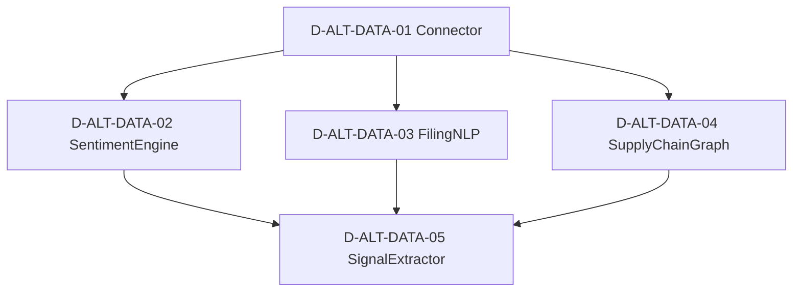

# 14 — D-ALT-DATA 另类数据域

> **状态**: DRAFT | **核心层**: 数据上游 | **成熟度**: L1 🟡 骨架
> **一句话**: 把非传统数据变成Alpha信号

## §0 域定义

| 维度 | 内容 |
|------|------|
| 域ID | D-ALT-DATA |
| 域名 | 另类数据域 |
| 核心Aggregate | AltDataFeed |
| 核心事件 | E-AD-01 AltDataIngested / E-AD-02 AltDataQualityDegraded / E-AD-03 SentimentSignalReady / E-AD-04 FilingEventDetected / E-AD-05 SupplyChainDisruption |
| 开发状态 | 未开发——骨架设计完成 |
| 优先级 | P2（按需启动） |
| 激活前提 | D-DATA就绪 + D-AUTONOMY就绪 |
| 能力负载 | 0● 0◐ 2○ = ⚪按需 |
| 对标能力 | C-020(○)渐进式全球扩展 / C-039(○)跨市场传导模型 |

### 与D-DATA的边界

| 域 | 管什么 | 类比 |
|----|--------|------|
| D-DATA | 结构化行情数据——K线/财报/参考数据 | 仓库(标准货架) |
| D-ALT-DATA | 非结构化另类数据——新闻/社交/公告/产业链 | 采集队(野外勘探) |

## §1 子模块清单（骨架5✅）

| ID | 名称 | 职责 | 优先级 | 对标能力 | 数据源覆盖 |
|----|------|------|:------:|---------|-----------|
| D-ALT-DATA-01 | AltDataConnector | 统一另类数据接入层：新闻API/社交API/公告API/产业链数据源统一接入+格式适配+增量同步+断点续传+API密钥管理 | P0 | C-001(◐) | §2.3非结构化数据库 |
| D-ALT-DATA-02 | SentimentEngine | 新闻+社交媒体情绪引擎：FinBERT新闻情绪(-1~+1)+VADER社交情绪+管理层语调(Ollama)+Bayesian情绪聚合→统一情绪信号 | P1 | C-014(◐) | §2.1新闻舆情+§2.4社交媒体情绪 |
| D-ALT-DATA-03 | FilingNLPEngine | 监管文件NLP引擎：A股年报/公告/临时公告→NER实体识别+关系抽取+风险事件检测+MD&A前瞻性信息+关联方交易 | P0 | C-011(◐) | §2.7企业司法与监管 |
| D-ALT-DATA-04 | SupplyChainGraphEngine | 产业链知识图谱引擎：半导体/新能源/生物医药全产业链图谱+层级结构+公司属性标注+传导路径+关键节点识别 | P1 | C-039(◐) | §2.2产业链知识图谱 |
| D-ALT-DATA-05 | AltDataSignalExtractor | 另类数据信号提取与输出(唯一输出网关)：特征工程+IC测试+衰减分析+信号组合+正交化+统一输出格式→D-SIGNAL/D-FACTOR | P1 | C-020(○) | §2.5另类宏观+§2.6地理位置 |

### P2扩展子模块（暂不入骨架）

| ID | 名称 | 职责 | 优先级 |
|----|------|------|:------:|
| D-ALT-DATA-06 | AltDataQualityScorer | 另类数据质量评分：6维质量+异常检测+漂移监控 | P2 |
| D-ALT-DATA-07 | AltDataCostOptimizer | 另类数据成本优化：用量追踪+ROI+供应商比价 | P2 |
| D-ALT-DATA-08 | AltDataBacktester | 另类数据回测：事件注入+成本模拟+统计检验 | P2 |
| D-ALT-DATA-09 | AltDataCatalog | 另类数据目录：元数据+标签+血缘+搜索 | P2 |
| D-ALT-DATA-10 | LLMMarketInterpreter | LLM市场解读：Prompt编排+多模型路由+事实校验 | P2 |
| D-ALT-DATA-11 | SatelliteGeospatialEngine | 卫星与地理空间：停车场/油罐/农作物/建筑活动 | P3 |
| D-ALT-DATA-12 | GeopoliticalRiskAnalyzer | 地缘政治风险：事件采集+风险评分+制裁筛查 | P2 |
| D-ALT-DATA-13 | AltDataComplianceReviewer | 另类数据合规审查：采集合规+尽调+隐私评估 | P2 |
| D-ALT-DATA-14 | PolicyThemeMapper | 政策主题映射：十四五/新质生产力→产业映射→影响评估 | P2 |
| D-ALT-DATA-15 | AShareCapitalFlowTracker | A股资金流向：国家队/机构/游资/北向/散户五类追踪 | P2 |
| D-ALT-DATA-16 | ASharePolicyExpectationAnalyzer | A股政策预期：窗口指导+预期管理+信息优势+国家队识别 | P2 |
| D-ALT-DATA-17 | AShareEventCausalReasoner | A股事件因果推理：征兆分析+事件连锁+外盘影响+融资余额 | P2 |

## §2 域内依赖图



### 域内依赖关系表

| 源 | 目标 | 依赖类型 | 说明 |
|----|------|---------|------|
| ALT-01 | ALT-02 | 数据供给 | 原始新闻/社交数据→情绪引擎 |
| ALT-01 | ALT-03 | 数据供给 | 原始公告/年报→NLP引擎 |
| ALT-01 | ALT-04 | 数据供给 | 原始产业链数据→图谱构建 |
| ALT-02 | ALT-05 | 信号输入 | 情绪信号→信号提取 |
| ALT-03 | ALT-05 | 信号输入 | Filing信号→信号提取 |
| ALT-04 | ALT-05 | 信号输入 | 供应链信号→信号提取 |

## §3 域间接口

### 消费接口（ALT依赖其他域）

| 接口 | 供给域 | 强度 | 类型 | 说明 |
|------|--------|:----:|------|------|
| CTR-001 NormalizedMarketData | D-DATA | H | P0冻结 | 行情数据作为另类数据对齐基准 |
| CTR-TRACE-001 TraceContext | D-DATA | H | P0冻结 | 全链路追踪 |
| LLM推理服务 | D-ML-SERVE | S | P1可演进 | NLP/情感分析推理 |
| 权限/审计 | D-AUTONOMY-CORE | H | P0冻结 | RBAC+审计日志 |

### 产出接口（其他域依赖ALT）

| 接口 | 消费域 | 强度 | 类型 | 说明 |
|------|--------|:----:|------|------|
| CTR-P1-010 AltDataSignal | D-SIGNAL | E | P1可演进 | 另类数据信号→信号合成器 |
| AltSentimentFactor | D-FACTOR | E | P1可演进 | 情绪因子→因子域 |
| SupplyChainRiskAlert | D-RISK | E | P1可演进 | 供应链风险→风控域 |
| FilingComplianceEvent | D-COMPLIANCE | E | P1可演进 | 合规事件→合规域 |

## §4 域事件流

| 事件ID | 事件名 | 触发条件 | 消费者 | 频率 |
|--------|--------|---------|--------|:----:|
| E-AD-01 | AltDataIngested | 另类数据采集完成 | ALT-02/03/04/05 | L2 |
| E-AD-02 | AltDataQualityDegraded | 另类数据质量低于阈值 | D-OPS, ALT-05 | L4 |
| E-AD-03 | SentimentSignalReady | 情绪信号计算完成 | D-SIGNAL, D-FACTOR | L2 |
| E-AD-04 | FilingEventDetected | 监管文件关键事件检测 | D-RISK, D-COMPLIANCE | L3 |
| E-AD-05 | SupplyChainDisruption | 供应链中断检测 | D-RISK, D-SIGNAL | L4 |

## §5 激活前提

| 子模块 | 前提条件 | 就绪标准 |
|--------|---------|---------|
| ALT-01 Connector | D-DATA就绪 + API密钥配置 | CTR-001可用；新闻/社交/Filing API密钥已配置 |
| ALT-02 SentimentEngine | ALT-01就绪 + NLP模型可用 | 原始文本数据可消费；FinBERT/VADER模型已加载 |
| ALT-03 FilingNLP | ALT-01就绪 + LLM推理可用 | 公告/年报数据可消费；Ollama qwen3:8b可调用 |
| ALT-04 SupplyChainGraph | ALT-01就绪 + 图数据库可用 | 产业链原始数据可消费；Neo4j/NetworkX可用 |
| ALT-05 SignalExtractor | ALT-02/03/04就绪 | 至少一个上游信号源可用 |

### 激活阶段

| 阶段 | 前提 | 可激活模块 |
|------|------|-----------|
| Phase 1 | D-DATA就绪 + D-AUTONOMY就绪 | ALT-01, ALT-03 |
| Phase 2 | Phase 1 + NLP模型就绪 | ALT-02, ALT-04 |
| Phase 3 | Phase 2 | ALT-05 |

## §6 设计决策记录

| # | 决策 | 理由 | 影响 |
|---|------|------|------|
| 1 | 另类数据域独立于D-DATA | 另类数据有独特的采集/处理/质量要求（非结构化、低频、高噪声），与传统行情数据域分离 | D-ALT-DATA独立建域 |
| 2 | 骨架5子模块：Connector→3引擎→SignalExtractor | 分层架构：接入层→处理层→输出层，每层职责清晰 | 上游D-DATA只需对接ALT-01；下游只需消费ALT-05 |
| 3 | SentimentEngine合并新闻+社交 | 新闻情绪和社交情绪本质都是文本NLP，合并避免重复管线 | ALT-02统一处理，降低维护成本 |
| 4 | SignalExtractor作为唯一输出网关 | 统一另类数据信号的输出格式和质量标准 | 下游域只需对接一个接口 |
| 5 | FilingNLP优先级最高(P0) | A股公告/年报是最可靠的另类数据，影响因子计算和风控 | ALT-03优先开发 |
| 6 | 卫星/地理空间暂不入骨架 | 技术门槛高、数据成本高、信号可靠性待验证 | ALT-01预留接口，P3扩展 |
| 7 | A股特色子模块(资金流/政策预期/事件因果)归P2扩展 | 这些是A股特有Alpha来源，但当前系统优先级是核心价值链 | 保留在扩展列表，C-011/C-034/C-035就绪后启动 |

## §7 与现有体系对账

| 现有体系 | 本域 | 差异 |
|---------|------|------|
| 无 | D-ALT-DATA | 全新域，需新建 |
| D-DATA-52 AutoWebSentimentMiner | ALT-02 SentimentEngine | 需从D-DATA迁移至ALT |
| D-DATA-53 IndustryChainKnowledgeGraph | ALT-04 SupplyChainGraphEngine | 需从D-DATA迁移至ALT |

## §8 学习系统S0采集层架构

> 以下内容迁移自学习系统架构文档§3，描述另类数据域在S0多模态知识采集层的完整架构。

### §8.1 采集源分类

| 采集源类型 | 输入格式 | 采集方式 | 典型场景 | 优先级 |
|---|---|---|---|---|
| 直播语音 | 音频流 | 定时抓取+Whisper转写 | 分析师直播解读 | P1 |
| 视频 | 视频流 | 定时抓取+Whisper+OCR | 分析师视频复盘 | P1 |
| PDF文档 | PDF | 解析提取 | 研报/策略文档 | P1 |
| 网址 | HTML | 爬虫+正文提取 | 专栏文章/论坛帖子 | P1 |
| 文字 | 纯文本 | 直接入池 | 用户粘贴/分析师文字版 | P0 |
| 语音消息 | 音频文件 | Whisper转写 | 微信语音/录音 | P2 |
| 社交媒体 | API/爬虫 | 结构化提取 | 雪球/股吧/微博 | P2 |

### §8.2 采集调度

```
采集调度模式:

1. 定时采集 (Scheduled Collection)
   ├─ 每日固定时间抓取指定直播/专栏
   ├─ 盘后(15:30后)集中采集当日分析师内容
   ├─ 盘前(08:00前)采集隔夜海外分析
   └─ 周末采集周度策略回顾

2. 事件触发采集 (Event-Triggered Collection)
   ├─ 重大政策发布 → 触发相关分析师内容采集
   ├─ 市场异动(VIX飙升/北向异动) → 触发紧急解读采集
   └─ 新研报发布 → 触发PDF采集

3. 手动提交 (Manual Submission)
   ├─ 用户粘贴文字内容
   ├─ 用户上传PDF/音频/视频文件
   └─ 用户提交网址链接

4. 漂移感知调度（v4.0新增，§14.6裁定✅）
   ├─ 监控数据分布变化（ADWIN/DDM漂移检测算法）
   ├─ 检测到漂移 → 自动调整采集频率/数据增强策略
   ├─ 双层优化：任务模型（策略效果）+ 规划器（采集策略）交替训练
   ├─ 共形漂移检测（v5.0新增，Conformal Drift Detection NeurIPS 2025）
   │   ├─ 基于共形推断的漂移检测，提供统计保证的误报率控制
   │   ├─ 相比ADWIN/DDM，误报率降低50%
   │   └─ 与ADWIN/DDM互补：ADWIN检测均值漂移，共形检测检测分布整体变化
   ├─ 多尺度漂移检测（v5.0新增，Multi-Scale Drift Detection KDD 2025）
   │   ├─ 微观漂移: 单因子/单信号级别（日频检测）
   │   ├─ 中观漂移: 板块/策略组级别（周频检测）
   │   ├─ 宏观漂移: 市场制度级别（月频检测）
   │   └─ 不同尺度触发不同响应：微观→参数微调 / 中观→策略替换 / 宏观→采集策略重构
   ├─ 表示学习驱动漂移检测（v6.0新增，Representation Learning Drift Detection ICML/NeurIPS 2025-2026；仅需hook提取已有模型中间层表示，无需训练表示学习模型）
   │   ├─ 监控模型中间层表示变化（hook机制提取表示→Wasserstein距离）
   │   ├─ 比输出监控提前1-3个交易日检测到漂移
   │   └─ 填补输入-输出之间的检测盲区
   └─ 目的：市场制度变化时自动增加采集频率，稳定期减少采集节省成本
   依据: "History Is Not Enough" (arXiv 2026)漂移感知数据流系统 / Conformal Drift Detection (NeurIPS 2025) / Multi-Scale Drift Detection (KDD 2025)

5. 人机协作模式（裁定✅R-25）
   ├─ AI自动采集+提取→人类PM审核+补充→AI继续映射
   ├─ 保留人类判断优势（特别是对模糊信息的理解）
   └─ 依据: Citadel/Point72 基本面投研增强实践 (2025-2026)
```

### §8.3 采集增强能力

```
S0采集增强:

1. VLM图表视觉理解（v4.0新增，§14.1裁定✅）
   ├─ 当前: 视频采集仅用Whisper+OCR，无法理解K线图/技术图表的视觉语义
   ├─ 升级: VLM（视觉语言模型）解析K线图/技术图表 → 结构化信号描述
   ├─ 输入: 截图/PDF中的图表图像
   ├─ 输出: {chart_type, trend, support, resistance, pattern, signal}
   └─ 依据: MountainLion (arXiv 2025)图表/图像理解能力

2. Point-in-Time门控（v4.0新增，§14.11.2裁定✅）
   ├─ 所有采集数据标注时间戳
   ├─ 财务数据强制延迟60-90天（报告延迟期）
   ├─ 特征存储验证：确保无前瞻偏差
   └─ 依据: RLAIF Trader(2026) / FinRL-X(2026) Point-in-Time正确性

3. 时序基础模型骨干（v4.0新增，§14.11.2裁定✅）
   ├─ 行情数据 → TimesFM/TTM时序基础模型 → 预测+不确定性估计
   ├─ 输出作为S2知识提取的辅助输入（增强LLM对行情的理解）
   └─ 依据: RLAIF Trader(2026)基础模型骨干提供价格预测+不确定性估计

4. K线分词机制（裁定✅R-18）
   ├─ 将K线序列视为"金融语言"进行分词和自回归预训练
   ├─ 行情数据→token序列→预训练模型→原生语义理解
   ├─ 输出作为S2知识提取的辅助输入（增强LLM对行情的理解）
   └─ 依据: Kronos (2025) K线分词机制

5. Feature Store（v7.0新增，裁定✅R-68 / 项目内有蓝图MOD-INF-009但是没建设🔧）
   ├─ 离线特征存储(DuckDB Parquet)+在线特征服务+Point-in-Time AS OF JOIN
   ├─ 消除训练-服务偏差（15-25%的生产bug来源）
   ├─ 与R-15 Point-in-Time门控/R-69 PIT Manager的边界：PIT门控是验证规则（确保无前瞻偏差），Feature Store是数据基础设施（提供PIT AS OF JOIN查询能力），PIT Manager是底层数据支撑（DuckDB时间旅行查询）。三者关系：PIT门控消费Feature Store的PIT查询结果来验证正确性，Feature Store依赖PIT Manager提供底层数据支撑
   └─ 依据: AltStreet Quant 2.0 (2025) Feature Store架构

6. PIT Manager（v7.0新增，裁定✅R-69 / 项目内有蓝图MOD-INF-012但是没建设🔧）
   ├─ DuckDB AS OF JOIN时间旅行查询
   ├─ 任意历史时点的特征快照重建
   ├─ 与R-15 Point-in-Time门控联动：PIT Manager提供底层数据支撑
   └─ 依据: FinRL-X (2026) Point-in-Time正确性 / DuckDB AS OF JOIN能力

7. Sentiment Engine（v7.0新增，裁定✅R-70）
   ├─ finBERT金融情感分析+vaderSentiment规则情感分析双引擎
   ├─ 新闻/公告/社交媒体文本→情感得分(-1~+1)
   ├─ RTX 3090可推理finBERT，纯Python
   └─ 依据: finBERT (IEEE Access 2023) / vaderSentiment规则情感

8. Filing NLP Engine（v7.0新增，裁定✅R-71）
   ├─ 公告文本结构化提取：标题/摘要/关键数据/事件类型
   ├─ LLM API辅助复杂公告理解（如重组公告/业绩预告）
   ├─ 输出作为S2知识分类的输入（事件影响知识来源之一）
   └─ 依据: Captide (2025) 公告NLP提取 / CausalStock公告因果提取

9. 多模态融合引擎（v7.0新增，裁定✅R-72）
   ├─ 早期融合(特征级拼接)+晚期融合(决策级加权)+注意力融合(跨模态注意力)
   ├─ 融合语音/视频/PDF/文字/图表等多模态特征
   ├─ 纯Python融合层，与VLM/Whisper等采集模块联动
   └─ 依据: Multimodal Agentic AI (TechRxiv 2025) 多模态融合

10. A股特色数据（v7.0新增，裁定❌R-111）
    ├─ 五类资金追踪(北向/融资融券/大宗交易/龙虎榜/主力资金)+政策预期量化
    ├─ A股市场特有数据源，对短线策略至关重要
    └─ 门禁: Level-2数据源+政策事件数据库就绪

11. Trading Domain NLP Engine（v8.0新增，裁定✅R-122）
    ├─ 交易领域术语识别（多/空/止损/止盈/回踩/突破/背离等A股交易术语）
    ├─ 意图解析（策略建议/风险预警/市场解读/因子发现等意图分类）
    ├─ 领域实体提取（股票代码/行业板块/指标名称/时间表达等金融实体）
    ├─ LLM API+领域词典双引擎，与R-71 Filing NLP Engine互补（Filing聚焦公告结构化，本引擎聚焦交易语境理解）
    └─ 依据: FinNLP (EMNLP 2025) 金融NLP / 交易领域术语体系
```

### §8.4 输出契约 RawKnowledgePacket

```
S0输出: RawKnowledgePacket
  ├─ schema_version: string（输出契约Schema版本，v5.0新增，Event Schema Versioning）
  ├─ source_id: 唯一标识(来源+时间戳哈希)
  ├─ source_type: voice|video|pdf|url|text|audio_file|social
  ├─ source_url: 原始链接(如有)
  ├─ author: 作者/分析师标识
  ├─ timestamp: 采集时间(UTC)
  ├─ content_original: 原始内容(音频为二进制,视频为二进制,PDF为二进制,文字为UTF-8)
  ├─ metadata: {title, duration, language, ...}
  ├─ collection_mode: scheduled|event_triggered|manual|drift_aware|human_ai_collab
  ├─ drift_info: {drift_detected: bool, drift_type: conformal|adwin|ddm|representation_learning|none, drift_scale: micro|meso|macro|none} | null（漂移检测详情，v5.0新增；drift_type新增representation_learning为v6.0扩展）
  ├─ vlm_result: {chart_type, trend, support, resistance, pattern, signal} | null（VLM图表视觉理解输出）
  ├─ pit_validated: bool（Point-in-Time门控验证结果）
  ├─ tsfm_prediction: {forecast, uncertainty} | null（时序基础模型骨干预测输出）
  ├─ kline_tokens: [int] | null（K线分词token序列）
  ├─ sentiment_score: {score: float, engine: string} | null（Sentiment Engine情感分析输出，v7.0新增R-70）
  ├─ filing_nlp_result: {title: string, summary: string, key_data: [KeyValue], event_type: string} | null（Filing NLP Engine公告结构化提取输出，v7.0新增R-71）
  ├─ multimodal_fusion_result: {fusion_type: early|late|attention, fused_features: [float]} | null（多模态融合引擎输出，v7.0新增R-72）
  ├─ feature_store_id: string | null（Feature Store特征存储ID，v7.0新增R-68）
  ├─ pit_snapshot_id: string | null（PIT Manager时间旅行快照ID，v7.0新增R-69）
  └─ trading_nlp_result: {intents: [string], entities: [{type: string, value: string}], terms: [string]} | null（Trading Domain NLP Engine交易术语识别+意图解析输出，v8.0新增R-122）
```

## §9 另类数据相关治理约束

> 以下条目迁移自学习系统架构文档§0.3，筛选与另类数据采集/处理/输出直接相关的治理约束。

| 约束/安全边界 | 治理规则（做什么/不做什么） | 安全机制（怎么防护） | 来源 |
|---------------|---------------------------|---------------------|------|
| 知识来源必须可追溯 | 审计合规 | 每条知识可追溯到原始来源（作者/时间/URL） | A5（待定义）、A6合规🔒（待定义） |
| 数据血缘追踪约束（v7.0新增） | 数据源→特征→因子→信号→策略→交易→PnL全链路可追溯，数据源变更自动评估受影响下游模块 | OpenLineage标准数据血缘追踪，数据源→特征→因子→信号→策略→交易→PnL全链路可追溯，数据源变更自动评估受影响下游模块 | 学习系统架构 §10.1 |
| Event Schema Versioning约束（v5.0新增） | Schema变更需人工审核+向后兼容性验证，消费者按版本号订阅 | — | 学习系统架构 §11.1 / IEEE 2025 |
| 漂移感知集成（v5.0新增） | — | 根据各模型漂移适应能力动态调整集成权重，宏观漂移触发权重重分配 | 学习系统架构 §11.4 |
| 共形漂移检测+多尺度漂移检测（v5.0新增） | — | 统计保证误报率控制+微观/中观/宏观三级漂移检测与分级响应 | 学习系统架构 §3.2 |
| 表示学习漂移检测（v6.0新增） | — | hook机制提取模型中间层表示仅用于漂移检测预警，不可用于逆向工程模型或提取训练数据 | 学习系统架构 §3.2 |
| Look-Ahead Bias Detector（v7.0新增） | — | 时序数据前视偏差自动检测（未来数据泄漏/幸存者偏差/重述数据使用），与PIT门控联动 | 学习系统架构 §9.1 |
| LLM Security Gateway约束（v7.0新增） | 所有LLM调用必须经九层安全防御Gateway（输入过滤/Prompt注入检测/输出校验/事实核查/幻觉检测等），不可绕过Gateway直接调用LLM | LLM调用九层安全防御（输入过滤/Prompt注入检测/输出校验/事实核查/幻觉检测等），Gateway作为LLM调用的统一安全入口 | 学习系统架构 §8.1 |
| AI API Cost Manager约束（v8.0新增） | LLM API成本纳入预算管理，超限自动降级为仅使用本地模型，与C-044成本治理联动 | LLM API成本实时监控+预算管理+超限自动降级为仅使用本地模型 | 学习系统架构 §10.2 |
| Non-AI Module Boundary Guard约束（v7.0新增） | AI模块与non-AI模块边界明确划分，AI生成信号权重≤30%（与B-007人类监督对齐）；"Non-AI Module Boundary"=AI/non-AI边界线，非"非AI模块" | AI/non-AI模块边界守卫+AI权重≤30%约束（与B-007人类监督对齐）；"Non-AI Module Boundary"=AI/non-AI边界线，非"非AI模块" | 学习系统架构 §11.1 |
| Decision Audit Trail约束（v7.0新增） | 每个AI决策的输入/输出/模型版本/参数必须记录，审计日志不可篡改，保留期≥5年 | 决策审计追踪：每个AI决策的输入/输出/模型版本/参数记录+上下文快照+影响链追踪，审计日志不可篡改，保留期≥5年 | 学习系统架构 §11.1 |
| Knowledge Version Manager约束（v8.0新增） | 知识变更必须生成新版本+变更diff，不可直接覆盖已有知识，回滚需人工审核 | Git-like知识版本管理+变更diff+回滚需人工审核，防止知识被直接覆盖 | 学习系统架构 §6.1 |
| 可解释性门控（v4.0新增） | 每个模块必须附带经济学原理解释(SHAP/LIME)，无法解释则风控拒绝部署；v5.0扩展Causal SHAP因果归因+Concept概念级解释+LLM自然语言解释 | 每个模块输出SHAP/LIME解释，无法解释则拒绝部署 | 学习系统架构 §10.2.9 / Man Group AlphaGPT |
| 金融AI三难优先级（v4.0新增） | 准确性+合规性=不可协商 > 可解释性=采纳网关 > 速度+成本=操作约束 | 同左 | 学习系统架构 §10.2.10 |
| 4级风控决策（v4.0新增） | APPROVE/REDUCE/REJECT/FLATTEN，FLATTEN硬编码触发 | 同左 | 学习系统架构 §10.2.5 |
| Kill Switch（v4.0新增） | 独立硬开关，可立即暂停所有学习系统操作 | 同左 | 学习系统架构 §10.2.6 |

## §10 安全架构约束（源自A5安全架构）

> 来源：A5安全架构 §1.2 数据域

### §10.1 域边界定义

> 来源：A5安全架构 §1.2

覆盖 D-DATA（数据核心）、D-FACTOR（因子）、D-SIGNAL（信号）、D-DATA-ENG（数据工程）、D-ALT-DATA（另类数据）、D-ML-TRAIN（ML训练子域）。数据域包含ML训练子域，用于模型训练数据集的存储与管理，安全等级与数据域一致。数据域是系统的信息基础，所有策略和决策的数据来源。

**为什么数据域需要独立安全域**：因子公式和信号逻辑是量化系统的核心知识产权。PIT（Point-in-Time）数据的完整性直接决定回测可信度，数据污染会导致策略失效和错误决策。另类数据可能涉及合规风险，需要独立管控。

### §10.2 资产分类与信任等级

> 来源：A5安全架构 §1.2

| 资产类型 | 信任等级 | 分类 | 示例 |
|---------|---------|------|------|
| 因子公式 | 绝密（L3） | 核心资产 | Alpha因子表达式、因子构造逻辑 |
| 信号逻辑 | 绝密（L3） | 核心资产 | 信号生成算法、信号组合权重 |
| PIT数据 | 机密（L2） | 敏感资产 | 历史时点正确数据、复权因子 |
| 另类数据 | 机密（L2） | 敏感资产 | 舆情数据、供应链数据 |
| 原始行情 | 内部（L1） | 业务资产 | Tick数据、K线数据 |
| 数据质量报告 | 内部（L1） | 业务资产 | 缺失率、异常值统计 |

### §10.3 数据流入规则

> 来源：A5安全架构 §1.2

| 来源域 | 允许流入的数据 | 安全检查点 |
|--------|--------------|-----------|
| 外部（iFind） | 行情数据、财务数据 | 数据源认证+格式校验+PIT一致性检查 |
| 外部（另类） | 另类数据 | 数据源审批+合规审查+格式校验 |
| 交易域 | 交易结果数据 | 数据降级处理确认 |

### §10.4 数据流出规则

> 来源：A5安全架构 §1.2

| 目标域 | 允许流出的数据 | 安全检查点 |
|--------|--------------|-----------|
| 交易域 | 行情、因子值、信号 | 数据签名+完整性校验 |
| 治理域 | 数据质量报告 | 脱敏处理 |
| 运维域 | 审计日志 | 日志签名 |
| 数据域→ML训练子域（域内子域流） | 训练数据集 | PIT隔离+数据版本标记 |

### §10.5 安全控制要求

> 来源：A5安全架构 §1.2

- 因子公式和信号逻辑存储时使用AES-256加密，运行时解密到受保护内存区域
- PIT数据必须有时点标记和完整性校验，防止未来信息泄露（look-ahead bias）
- iFind API凭证仅在数据域进程内可见，禁止跨域传递
- 另类数据接入必须经过人工审批（HB-SEC-06），审批记录写入审计链
- 数据域到LLM的调用必须100%脱敏（HB-SEC-02，全域硬边界，非仅数据域），因子公式和信号逻辑禁止以未脱敏形式发送到外部LLM（经100%脱敏降级为L1后可通过白名单LLM代理通道发送，详见A5安全架构§2.4）

## §11 另类数据源

> **📦搬入来源**: 数据架构 v6.0 §2.2-§2.5

### 11.1 另类数据源

> **📦搬入来源**: 数据架构 v6.0 §2.2

| 数据品类 | 数据源 | 频率 | 用途 | 状态 |
|---------|--------|:----:|------|:----:|
| 新闻快讯 | tushare(news接口,9源聚合) | 实时 | 事件驱动/黑天鹅检测/NLP情感分析 | 🔜待开通 |
| 7×24新闻监控 | iFind | 实时 | 盘中风险预警 | ✅ |
| 研究报告 | iFind | 日频 | 基本面因子/一致预期 | ✅ |
| 公司公告 | iFind | 事件驱动 | 事件驱动信号 | ✅ |
| 舆情监控 | iFind | 日频 | 舆情因子/情绪指标 | ✅ |
| AI产业链分析 | iFind | 日频 | C-016产业链图谱构建 | ✅ |
| 情绪监控面板(涨停/封板率/炸板率/连板高度/赚钱效应) | iFind | 实时 | C-021市场状态/情绪因子 | ✅ |
| 板块热度排行榜 | iFind | 日频 | 板块轮动信号/C-021市场状态 | ✅ |
| 企业司法与监管数据 | iFind | 事件驱动 | 事件驱动信号/C-016公司图谱 | ✅ |
| 主播音频流 | 本地ASR(Whisper) | 实时 | C-014主播信号融合 | ⚠️需C-029调度 |

### 11.2 宏观与跨市场数据

> **📦搬入来源**: 数据架构 v6.0 §2.3

| 数据品类 | 数据源 | 频率 | 用途 |
|---------|--------|:----:|------|
| 中国宏观(GDP/CPI/PPI/PMI等) | iFind | 事件驱动 | C-014大盘预测/C-021市场状态 |
| 美国宏观(GDP/CPI/非农等) | iFind | 事件驱动 | C-014大盘预测/C-039传导 |
| FOMC数据(利率/点阵图/声明) | iFind | 事件驱动 | C-039利率传导/C-016宏观因果链 |
| 美联储资产负债表 | iFind | 周频 | C-039流动性传导/C-014大盘预测 |
| VIX | iFind | 60秒 | C-021市场状态/C-038黑天鹅/C-004风控 |
| 美股(标普/纳指/道指+250只) | iFind | 15-60秒 | C-039跨市场传导/全球风险偏好 |
| 港股(恒指/AH股) | iFind | 60秒 | C-039AH溢价/港股传导 |
| 外汇(USD/CNY/CNH/DXY) | iFind | 60秒 | C-039汇率传导/外资流向 |

---

## §12 风险架构(A4)交叉内容

> **来源**: 风险架构(A4) v3.0 —— §1.1 市场风险表格中的新闻舆情/社交媒体情绪指标 + §1.6 交易对手风险中的对手数据获取。以下内容从风险架构文件物理搬入，保持原有颗粒度。

### §12.1.1 市场风险——因子暴露与舆情监控

> 因市场价格不利变动（股价/利率/汇率/波动率/相关性）导致投资组合价值损失的风险。以下市场风险指标定义了另类数据域需要采集和加工的舆情/情绪类风险因子的输入端规格。

| 子类 | 识别方法 | 度量方法 | 处置机制 | 否决阈值 |
|------|---------|---------|---------|---------|
| 价格风险 | 实时P&L监控+因子暴露监控 | VaR(95%/99%)+CVaR+密度感知VaR | 减仓/对冲/暂停开仓 | VaR超限→否决新开仓 |
| 波动率风险 | VIX类指标+已实现波动率vs隐含波动率 | 波动率敏感性(Vega)+波动率曲面 | 波动率飙升→降仓位 | 波动率超2σ→仓位减半 |
| 相关性风险 | 滚动相关矩阵+条件相关性 | 条件CVaR+分散化比率 | 相关性结构崩塌→减集中度 | 分散化比率<0.3→否决集中持仓 |
| 尾部风险 | 极值理论(EVT)+共形VaR超限频率 | ES(97.5%)+共形VaR+压力测试P&L | 尾部风险超限→保护性减仓 | ES超2×VaR→强制减仓20% |

**三层度量体系**（对齐能力定位书§2-d约束四）：

| 层级 | 方法 | 延迟目标 | 触发频率 | 用途 |
|------|------|---------|---------|------|
| L1 实时监控 | 实时P&L+因子暴露+集中度+Amihud非流动性 | <1秒 | 每Tick(3秒) | 盘中即时风控拦截 |
| L2 日频因子风险模型 | 申万31行业+4风格因子+VaR/CVaR/ES+CUSUM | ≤5秒(P99) | 每日收盘后 | 组合风险分解+限额检查+漂移趋势 |
| L3 压力测试 | 历史回放+假设情景+程式化冲击+反向压力测试 | ≤30分钟 | 每周+市场异动触发 | 极端情景韧性验证+致崩溃情景识别 |

> **与另类数据域的关系**：L1实时监控中的"因子暴露监控"依赖新闻舆情/社交媒体情绪因子（由D-ALT-DATA-02 SentimentEngine输出），风险等级随情绪极端程度递进。三层度量体系中的VaR/CVaR计算结果须将另类数据生成的因子纳入组合风险分解。

---

### §12.1.6 交易对手风险——对手数据获取

> 因交易对手违约导致损失的风险。当前系统为A股纯股票多头+单人管理，无OTC衍生品/融资融券/回购等交易对手敞口。D-RISK-09 Counterparty Risk Manager已定义但当前❌不能建——门禁条件未满足。

| 子类 | 识别方法 | 度量方法 | 处置机制 | 否决阈值 |
|------|---------|---------|---------|---------|
| 违约风险 | 交易对手信用评级监控+违约概率估计 | PD/LGD/EAD+CVA/DVA(Merton/KMV模型) | 限制交易对手敞口+CVA拨备 | 交易对手PD>阈值→限制新交易 |
| 结算风险 | 交收失败监控+结算周期跟踪 | 结算失败率+未结算敞口 | 实时交收监控+担保品要求 | 未结算敞口>限额→暂停交易 |

**当前状态**：❌不能建——门禁条件：系统开展衍生品交易/融资融券/回购等产生交易对手敞口的业务。项目有蓝图编号MOD-L04-001但是没建设。

> **与另类数据域的关系**：交易对手数据的获取（如信用评级/违约概率/结算状态）属于另类数据接入范畴。门禁满足后，D-ALT-DATA-01 AltDataConnector需新增交易对手数据源的接入适配（评级机构API/结算系统接口），为D-RISK-09提供PD/LGD/EAD估算的底层数据。
| 美国国债(2Y/5Y/10Y/30Y) | iFind | 60秒 | C-039利率传导/风险溢价 |
| 商品现货(金/银/铜/原油) | iFind | 60秒 | C-039商品传导/C-016产业链 |

### 11.3 行业最佳实践对标

> **📦搬入来源**: 数据架构 v6.0 §2.4

| 实践/框架 | 本文档对应 | 对齐程度 | 差异说明 |
|-----------|-----------|:-------:|---------|
| MSCI Barra基本面因子体系 | iFind财务数据→基本面因子 | 🟢 完全对齐 | 数据源不同但因子体系对齐 |
| RavenPack新闻情感分析 | tushare新闻+iFind舆情→NLP情感 | 🟡 部分对齐 | RavenPack专业级，本系统自建NLP |
| Bloomberg Supply Chain | iFind产业谱图+供应商客户 | 🟡 部分对齐 | 覆盖度不如Bloomberg，但A股产业链覆盖足够 |

### 11.4 设计决策汇总

> **📦搬入来源**: 数据架构 v6.0 §2.5

| 决策编号 | 决策 | 理由 | 替代方案 |
|---------|------|------|---------|
| DD-P2-01 | iFind为基本面主数据源 | QPS=20足够覆盖盘后批量拉取，字段覆盖A股全市场 | WIND：成本高，个人版无API |
| DD-P2-02 | tushare新闻为新闻主力源(待开通) | 9源聚合，6年+历史，成本可控 | 自建爬虫：维护成本高，合规风险 |
| DD-P2-03 | 宏观数据用iFind而非专用宏观数据库 | iFind已覆盖主要宏观指标，无需额外付费 | CEIC/Wind宏观：成本高，增量有限 |

## §12 3秒级逆势资金流识别模块

> **📦搬入来源**: 数据架构 v6.0 §26.3-§26.8

### 12.1 概念/板块级逆势资金流识别

> **📦搬入来源**: 数据架构 v6.0 §26.3

| 功能点 | 说明 | 示例 |
|--------|------|------|
| 板块级资金净流入聚合 | 板块内所有个股3秒级资金净流入求和=板块级资金净流入 | 通讯设备板块30只个股净流入合计+5000万 |
| 概念级资金净流入聚合 | 概念内所有个股3秒级资金净流入求和=概念级资金净流入 | CPO概念15只个股净流入合计+3000万 |
| 板块逆势强度比 | 板块资金净流入 / 大盘同期跌幅 = 板块逆势强度比 | 通讯设备净流入+5000万 / 大盘跌0.05% = 板块逆势强度100000 |
| 板块逆势覆盖率 | 板块内逆势个股数 / 板块总个股数 = 逆势覆盖率 | 通讯设备30只中18只逆势→覆盖率60% |
| 板块逆势持续性 | 连续N个3秒Tick板块资金净流入为正→板块逆势持续 | 通讯设备连续20个Tick（1分钟）净流入→板块级逆势 |
| 三级逆势排行输出 | 板块级→概念级→个股级三层逆势排行 | 板块Top3：通讯/锂电/封测 → 概念Top3：CPO/固态电池/光刻机 → 个股Top10 |

### 12.2 逆势资金流信号分级与过滤

> **📦搬入来源**: 数据架构 v6.0 §26.4

| 功能点 | 说明 | 示例 |
|--------|------|------|
| 信号强度分级 | 按逆势强度比+持续时间+覆盖率综合评分：强/中/弱 | 强=逆涨+持续>1分钟+覆盖率>50%；弱=仅抗跌+持续<30秒 |
| 噪音过滤 | 过滤掉流动性极低（成交额<阈值）的标的逆势信号 | 某股3秒净流入+50万但全天成交仅500万→噪音，过滤 |
| 尾盘逆势过滤 | 14:30之后的逆势信号降权（尾盘资金行为噪音大） | 尾盘逆势可能是做市值而非真实意图 |
| 开盘逆势过滤 | 9:30-9:35的逆势信号降权（开盘竞价阶段数据不稳定） | 开盘5分钟内逆势信号暂不纳入排行 |
| 涨停板逆势过滤 | 已涨停的标的逆势信号无意义（买不进去），排除 | 某股已涨停封板→从逆势排行中移除 |
| 大盘急跌时信号增强 | 大盘急跌（3秒跌>0.1%或1分钟跌>0.3%）时逆势信号含金量更高→权重提升 | 大盘急跌+个股逆涨=极强信号，权重×1.5 |

### 12.3 逆势资金流与已有模块的联动

> **📦搬入来源**: 数据架构 v6.0 §26.5

| 联动模块 | 联动方式 | 说明 |
|----------|----------|------|
| L2-B 主力行为层 | 逆势资金流信号→注入主力行为识别 | 大盘下跌时逆势买入=主力吸筹信号，六阶段识别中"吸筹"阶段加分 |
| L2-C 市场状态层 | 逆势板块数量→市场状态辅助判定 | 逆势板块数量多=市场内部结构强=大盘下跌空间有限 |
| 选股决策流 | 逆势个股→选股漏斗加分项 | 逆势强度排行Top10→选股第二层初筛加分 |
| L3 策略工厂 | 逆势资金流策略 | 大盘下跌+逆势标的→"逆势低吸"策略触发 |
| L3.5 仓位管理 | 逆势信号→仓位调整参考 | 逆势板块覆盖率高→大盘下跌时不必恐慌减仓 |
| L4 风控层 | 逆势信号→风控降级参考 | 持仓标的出现逆势资金流→止损可暂缓执行 |

### 12.4 逆势资金流信号输出格式

> **📦搬入来源**: 数据架构 v6.0 §26.6

```
逆势资金流实时信号（3秒级）
━━━━━━━━━━━━━━━━━━━━━━━━━━
大盘状态: 上证 中跌(-0.35%) 持续12分钟
扫描状态: 已激活
━━━━━━━━━━━━━━━━━━━━━━━━━━
板块逆势Top3:
  1. 通讯设备  净流入+1.2亿  覆盖率65%  持续8分钟  ★★★
  2. 锂矿      净流入+0.8亿  覆盖率55%  持续5分钟  ★★☆
  3. 封测      净流入+0.5亿  覆盖率45%  持续3分钟  ★☆☆

概念逆势Top3:
  1. CPO/光模块   净流入+0.9亿  覆盖率70%  持续6分钟  ★★★
  2. 固态电池     净流入+0.6亿  覆盖率50%  持续4分钟  ★★☆
  3. 光刻机       净流入+0.4亿  覆盖率40%  持续2分钟  ★☆☆

个股逆势Top5:
  1. XX股份  通讯设备/CPO   净流入+3200万  逆涨+1.2%  持续10分钟  ★★★
  2. XX科技  锂矿/固态电池  净流入+2800万  逆涨+0.8%  持续7分钟   ★★★
  3. XX电子  封测/光刻机    净流入+2100万  抗跌-0.1%  持续5分钟   ★★☆
  4. XX通信  通讯设备       净流入+1800万  逆涨+0.5%  持续4分钟   ★★☆
  5. XX新材  锂矿          净流入+1500万  抗跌-0.2%  持续3分钟   ★☆☆
━━━━━━━━━━━━━━━━━━━━━━━━━━
联动信号:
  → L2-B: 通讯设备板块吸筹信号增强
  → 选股流: Top5逆势个股加入候选池加分
  → 策略: "逆势低吸"策略待触发（需等大盘企稳）
```

### 12.5 与4分钟聚合版本的关键升级差异

> **📦搬入来源**: 数据架构 v6.0 §26.7

| 维度 | 4分钟聚合版（旧） | 3秒Tick版（新） |
|------|-------------------|-----------------|
| 数据粒度 | 4分钟K线聚合 | 3秒Tick逐笔 |
| 资金流向精度 | 4分钟内的净流入（粗略） | 3秒内主动买/卖分离（精确） |
| 逆势识别延迟 | 最快4分钟确认 | 3秒即可检测，15秒确认持续性 |
| 抗跌vs逆涨区分 | 无法区分（4分钟内可能先跌后涨） | 可精确区分（3秒级逐Tick判定） |
| 板块/概念聚合 | 无 | 三级聚合（板块→概念→个股） |
| 信号强度分级 | 无（仅"4分钟涨速排名靠前"） | 强/中/弱三级+覆盖率+持续时间 |
| 噪音过滤 | 无 | 流动性过滤+尾盘过滤+开盘过滤+涨停过滤 |
| 与其他模块联动 | 无 | L2-B/L2-C/选股流/策略/仓位/风控六路联动 |
| 大盘下跌状态判定 | 无（仅"大盘下跌时"模糊描述） | 3秒级下跌检测+强度分级+持续时间追踪 |

**建议归属层**: L1 因子层（逆势资金流因子，3秒级计算）+ L2-B 主力行为层（逆势吸筹识别）+ L2-A 信号层（逆势买入信号生成）

**数据依赖**: miniQMT 3秒Tick行情 + Level-2逐笔成交数据（主动买/卖分离，需券商额外权限）

**计算预算**: 全市场7000只标的×3秒级资金净流入计算≈每3秒新增7000条记录，与现有3秒Tick因子计算管线并行，占3秒预算额外约5-10ms（向量化计算）

### 12.6 学术与业界对标

> **📦搬入来源**: 数据架构 v6.0 §26.8

**对标1: 财通证券 IRCF因子（2026.3）**

财通证券金融工程团队在《股票涨跌情境中机构与散户的逆向资金流》中提出的IRCF因子（Institutional Retail Contrarian Flow），是本模块最直接的学术对标。

IRCF核心构造逻辑——"情境-特征"匹配的差异化处理：

| IRCF要素 | 具体做法 | 我们模块26的对应 | 我们的优势 |
|----------|---------|-----------------|-----------|
| 下跌看小单卖出 | 小单因子仅在下跌区间取值，计算卖向/买向比值 | 26.1 大盘下跌状态实时判定 + 26.2 个股资金净流入 | 我们从日频升级到3秒Tick级 |
| 上涨看大单买向 | 大单因子仅在上涨区间取值，计算买向/卖向比值 | 26.3 板块级资金净流入聚合 | 我们增加了概念级聚合 |
| 大单只作用于中小票 | 大市值股票的大单指标直接置空（规避算法拆单干扰） | 26.4 噪音过滤 | 我们需补充此规则 |
| 40日滚动计算 | 过去40个交易日滚动计算均值/标准差/90分位值 | 26.2 逆势持续性判定 | 我们用3秒Tick实时计算，无需40日窗口 |

IRCF回测绩效（2017年以来）：
- 多空年化收益25.8%
- 多头超额9.6%
- 多头IR 2.13
- IC均值7.1%，ICIR 3.29
- IC胜率85.2%

**需补充的关键发现**：

| 补充项 | 来源 | 说明 | 对模块26的影响 |
|--------|------|------|---------------|
| 单数>金额 | IRCF研报 | 成交单数占比因子的选股能力全面优于成交金额占比——大单买向单数多空6.4% vs 金额5.5%；小单卖向单数ICIR 2.44 vs 金额1.66 | 26.2资金净流入应优先使用**单数占比**而非金额占比 |
| 小单卖向>买向 | IRCF研报 | 散户的恐慌性卖出行为具有极强的反向领先意义（小单卖向多空15.7%），而买向行为则不然 | 26.2应增加"小单卖向占比"作为逆势信号的辅助确认指标 |
| 算法拆单导致大单因子失效 | IRCF研报 | 2021年后大单因子在中证800年化超额从7.5%暴跌至1.3%，2025年甚至-13.2%——机构用算法拆散大单以降低冲击成本 | 26.4需增加"大票大单降权"规则：沪深300成分股的大单资金流信号降权50% |
| 小单因子在上涨时IC为负 | IRCF研报 | 上涨区间小单因子IC均值-3.7%——散户追涨行为对股价有反向预测作用 | 26.4需增加"大盘上涨时小单逆势信号降权"规则 |
| 创业板IRCF表现最好 | IRCF研报 | 创业板年化多头超额10.0%——散户活跃+算法拆单干扰小 | 26.4可增加"创业板/中小盘逆势信号加权"规则 |

**对标2: Kang (2026) "The Physics of Price Discovery"**

韩国大学Kang在arXiv 2601.11602发表的论文，从物理学角度揭示了资金流与价格发现的关系：

| 论文发现 | 具体内容 | 对模块26的启示 |
|----------|---------|---------------|
| 双通道市场结构 | 外资+机构=价格发现的"建筑师"（正向持续冲击）；散户=流动性提供者（负向总冲击） | 逆势资金流必须区分机构vs散户来源，纯散户逆势信号价值低 |
| 市值归一化优于成交量归一化 | S_MC（资金流/市值）的信息含量是S_TV（资金流/成交量）的4.85倍 | 26.2逆势强度比应改为：个股资金净流入/个股市值，而非/大盘跌幅 |
| 散户羊群效应的临界态 | 散户订单流的Hawkes分支比≈0.998（近临界态）→散户羊群时市场信息传递机制崩溃 | 26.4需增加"散户羊群度"指标：当小单同向交易占比>阈值时，逆势信号可靠性下降 |
| 临界态下机构信号反转 | 散户羊群期间，机构资金流的价格冲击从正转负——"噪音屏障"使聪明钱也变"毒" | 26.4需增加"散户羊群度>阈值时，所有逆势信号降权"规则 |

**对标3: Jankensgård et al. (2025) "Catching the Falling Knife"**

Nasdaq Foundation资助的研究，直接验证了"大盘下跌时谁在逆势买入"：

| 论文发现 | 具体内容 | 对模块26的启示 |
|----------|---------|---------------|
| 散户逆势买入但持续亏损 | 散户在机构抛售时增加买入约0.2%（相对持仓），但净交易预测负收益 | 纯散户逆势信号不可靠，必须过滤 |
| 外资机构逆势买入且盈利 | 外资在机构抛售时同样增加买入0.2%，但收益为正——"知情且选择性的流动性提供" | 逆势信号需区分资金来源，机构/北向逆势>散户逆势 |
| 散户不是有效的流动性提供者 | 挑战了"散户=流动性提供者"的传统观点 | 26.2需增加"资金来源识别"维度 |

**对标4: BreakingAlpha (2025) OFI检测框架**

| 业界做法 | 具体内容 | 对模块26的启示 |
|----------|---------|---------------|
| OFI公式 | OFI = (Buy Volume - Sell Volume) / (Buy Volume + Sell Volume)，范围-1到+1 | 26.2应采用OFI标准化公式替代简单净流入 |
| Lee-Ready算法 | 交易价格≥中间价=买入，≤中间价=卖出；中间价交易用Tick Test | A股Level-2数据已有主动买/卖标识，无需Lee-Ready |
| BVC方法 | 聚合短时间窗口的交易做统计推断，准确率80-88% | 3秒Tick级已比BVC更精确，无需额外聚合 |
| ML增强分类 | 随机森林/梯度提升/神经网络，准确率82-90% | 可作为Level-2不可用时的降级方案 |
| 订单簿不平衡 | Book Imbalance = (Bid Vol - Ask Vol) / (Bid Vol + Ask Vol) | 26.2应增加订单簿不平衡作为逆势信号的辅助确认 |

**模块26补充修订清单**：

1. 逆势强度比公式修订为：个股资金净流入/个股市值（对标Kang 2026的S_MC归一化）
2. 增加"单数占比优先于金额占比"规则（对标IRCF研报）
3. 增加"小单卖向占比"作为辅助确认指标（对标IRCF研报）
4. 增加"大票大单降权"规则：沪深300成分股大单信号降权50%（对标IRCF研报算法拆单发现）
5. 增加"散户羊群度"指标：小单同向交易占比>阈值时逆势信号降权（对标Kang 2026）
6. 增加"资金来源识别"维度：机构/北向逆势>散户逆势（对标Jankensgård 2025）
7. 增加"订单簿不平衡"作为辅助确认（对标BreakingAlpha OFI框架）
8. 采用OFI标准化公式替代简单净流入（对标BreakingAlpha）

---

## §8 运维架构(A9)规格

> **搬入来源**: 运维架构(A9) §2.4 Cold平面(另类数据视角) + §6监控体系(数据质量)
> **搬入原则**: 将A9中D-ALT-DATA域承载的运维规格搬入本域，保持A9原文颗粒度。

### §8.1 Cold平面另类数据资源限制（A9§2.4）

| 资源 | 限制 | 说明 |
|------|------|------|
| CPU | 最多使用核16-19 | 另类数据处理属于Cold平面 |
| 网络 | iFind QPS共享池，最多5 QPS | 令牌桶限流 |
| 磁盘IO | 低优先级 | Windows进程优先级BelowNormal |

> **另类数据硬约束**：另类数据采集和处理在交易时段不得影响Hot/Warm平面资源。另类数据产出必须经Warm平面(D-DATA-ENG)质量门禁后才能进入信号生成流程。


## 来自Agent架构(A7)的内容

### 来自Agent架构(A7) §1.2 战略Agent — 研究Agent消费D-ALT-DATA

| 属性 | 研究Agent (Researcher) |
|------|----------------------|
| **职责** | 策略研究、因子发现、知识图谱构建 |
| **消费D-ALT-DATA** | D-ALT-DATA🔴（另类数据，MVP替代见LP-017）——研究Agent消费另类数据进行因子发现和知识图谱构建；MVP期间A股另类数据纳入D-DATA域 |
| **产出域** | D-FACTOR（新因子提案）、D-KNOWLEDGE（知识更新） |
| **自治级别** | Level 2（弱自主：研究自主，上线需审批） |
| **对应域(归属域)** | D-RESEARCH + D-KNOWLEDGE |

### 来自Agent架构(A7) §9.2.2 Agent→业务功能域消费映射 — 研究Agent消费D-ALT-DATA

| Agent | 消费域（数据/信号来源） | 产出域（输出去向） | 蓝图备注 |
|-------|---------------------|------------------|---------|
| 研究Agent | D-DATA（行情数据）、D-ALT-DATA🔴（另类数据，MVP替代见LP-017）、D-KNOWLEDGE（知识图谱） | D-FACTOR（新因子提案）、D-KNOWLEDGE（知识更新） | D-ALT-DATA: 无项目蓝图；D-KNOWLEDGE: 项目有蓝图编号MOD-KB-001已建设(completed) |

### 来自Agent架构(A7) §17 遗留问题裁定 — LP-017另类数据域暂缓

| 编号 | 遗留问题 | 裁定 | 硬边界门禁条件（不能建时） |
|:----:|---------|:----:|------------------------|
| LP-017 | 另类数据域(D-ALT-DATA) | 🔴 暂缓(不能建) | ①GPU显存≥48GB；②AUM≥200万；③有第二位开发人员加入 |

**LP-017详细裁定**：

| 维度 | 说明 |
|------|------|
| MVP替代方案 | A股特有另类数据（龙虎榜/融资融券/北向资金/大宗交易）纳入D-DATA域作为数据源子模块，不建独立域；情绪分析用本地LLM+规则引擎轻量实现 |
| 不能建的硬边界理由 | 约束一(单人开发)：另类数据采集+清洗+信号提取全链路开发成本极高；约束二(硬件)：LLM情绪分析+嵌入模型需额外GPU显存；约束三(AUM 50万)：另类数据订阅成本远超收益 |
| 未来开通门禁 | ①GPU显存≥48GB（LLM情绪分析+嵌入模型）；②AUM≥200万（另类数据成本覆盖）；③有第二位开发人员加入 |


---

## §13 合规约束（源自A6合规架构）

> **搬入来源**: 合规架构(A6) §7法规映射表+§11信息合规+§3.1.2审计日志分类+§4.3模型注册与治理
> **搬入原则**: 筛选与另类数据采集/处理/输出直接相关的合规约束，从D-ALT-DATA视角重写。

### §13.1 法规映射——另类数据相关

| 编号 | 法规 | 关键条款 | 对D-ALT-DATA的影响 | 合规义务 |
|:----:|------|---------|-------------------|---------|
| CN-007 | 《数据安全法》 | 数据分类分级+跨境传输限制 | 另类数据源须分类分级；持仓/交易数据禁止跨境 | 数据源分类分级标记+本地存储强制 |
| CN-009 | 《著作权法》第24条 | 个人研究属合理使用 | C-006爬取内容仅限个人研究用途 | 爬虫采集范围限制+用途审计 |
| INT-007 | GDPR | 个人数据保护+被遗忘权 | 另类数据含PII时须合规处理；GATE-006激活后适用 | PII检测+脱敏+Crypto-Shredding预留 |
| INT-012 | DORA | ICT风险管理+事件报告+韧性测试 | 另类数据采集系统属ICT第三方依赖；GATE-006激活后适用 | 数据源ICT风险评估+事件报告机制 |

### §13.2 信息合规——另类数据视角

> 对标合规架构§11信息合规，聚焦另类数据采集与处理中的信息隔离与内幕防护。

| 合规维度 | 约束 | 实现方式 | 当前状态 | 门禁条件 |
|---------|------|---------|---------|---------|
| 数据源许可合规 | 每个另类数据源须有合法授权记录（API协议/爬虫robots.txt/数据采购合同） | 数据源注册表+许可状态字段+到期提醒 | ✅能建 | — |
| 爬虫合法性审查 | 爬虫采集须遵守robots.txt+频率限制+不采集受保护内容 | 爬虫合规检查器+频率限制+采集范围白名单 | ✅能建 | — |
| PII风险防护 | 另类数据含个人可识别信息时须脱敏或加密 | PII自动检测+脱敏管道+加密存储 | ✅能建 | — |
| MNPI处理 | 重大非公开信息不得用于交易决策 | 信息分级标记(内幕/非内幕/公开/半公开)+MNPI流监控+跨墙审批 | ✅能建 | — |
| 信息隔离墙 | 另类数据与交易决策间须有信息隔离 | 数据源分级+访问控制+冷却期管理 | ✅能建 | — |

### §13.3 审计日志——数据来源审计

> 对标合规架构§3.1.2审计日志分类，另类数据须记录完整的数据来源审计日志。

| 日志类型 | 内容 | 保留期限 | 不可篡改机制 | 法规依据 |
|---------|------|---------|-------------|---------|
| 数据来源日志 | 每条另类数据的原始来源（URL/API/文件/时间戳/采集参数） | ≥5年 | 哈希链 | EU AI Act Art.12；数据安全法 |
| 数据质量日志 | 数据完整性校验+缺失率+延迟+异常值统计 | ≥5年 | 哈希链 | SR 26-2模型风险管理 |
| 许可合规日志 | 数据源许可状态变更+授权到期+合规检查结果 | ≥7年 | 哈希链 | 数据安全法；GDPR(GATE-006) |
| PII处理日志 | PII检测+脱敏操作+加密操作+访问记录 | ≥7年 | 哈希链 | GDPR(GATE-006)；个人信息保护法 |

### §13.4 数据指纹与数据血缘合规

> 对标合规架构§4.3模型注册与治理，另类数据作为训练数据输入须满足数据指纹与血缘合规。

| 合规要求 | 约束 | 实现方式 | 当前状态 |
|---------|------|---------|---------|
| 数据指纹 | 每个数据集须生成SHA-256指纹，写入模型注册表training_data_hash字段 | 数据集加载时自动计算SHA-256+写入注册表 | ✅能建 |
| 数据血缘追踪 | 数据源→特征→因子→信号→策略→交易全链路可追溯 | OpenLineage标准数据血缘追踪+数据源变更自动评估受影响下游 | ✅能建（§9已有约束） |
| 数据变更审计 | 数据源变更须自动评估对下游因子/信号的影响 | 血缘图查询+影响范围分析+告警 | ✅能建 |
| 训练数据偏差评估 | 另类数据作为训练输入须评估偏差（如因子池是否偏向大盘股） | 偏差评估报告+代表性检查 | ✅能建 |

> **与§9治理约束的关系**：§9定义了另类数据的通用治理规则（来源可追溯、数据血缘、漂移检测等），本节从合规架构视角补充法规映射、审计日志保留期限、PII防护等合规硬约束。§9的"知识来源必须可追溯"和"数据血缘追踪约束"与本节§13.3/§13.4互补——§9定义技术实现，本节定义合规义务。
