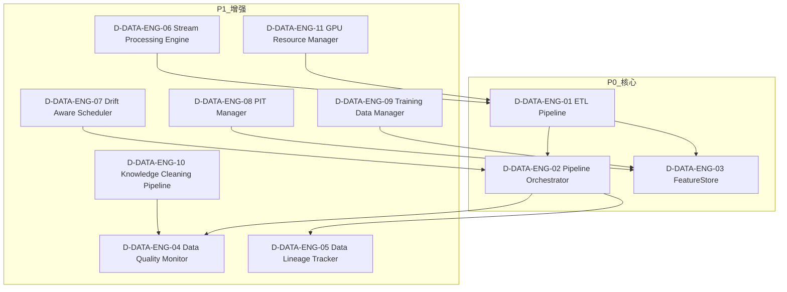

# 15 — D-DATA-ENG 数据工程域

> **状态**: DRAFT | **核心层**: 数据上游 | **成熟度**: L1 🟡 骨架
> **一句话**: 数据怎么流——自动化管线和特征存储

## §0 域定义

| 维度 | 内容 |
|------|------|
| 域ID | D-DATA-ENG |
| 域名 | 数据工程域 |
| 核心Aggregate | DataPipeline |
| 核心事件 | E-DE-01 PipelineCompleted / E-DE-02 PipelineFailed / E-DE-03 DataQualityAlert / E-DE-04 FeatureStoreUpdated / E-DE-05 LineageGapDetected |
| 开发状态 | 未启动——骨架设计完成(D-DATA-07调度器部分已有) |
| 优先级 | P1（按需启动） |
| 激活前提 | D-DATA就绪 + D-AUTONOMY就绪 |
| 能力负载 | 0● 1◐ 0○ = ⚪按需 |
| 对标能力 | C-001(◐)数据接入 |

### 与D-DATA的关系

| 域 | 管什么 | 类比 |
|----|--------|------|
| D-DATA | 数据有什么——数据源/存储/质量/血缘 | 仓库 |
| D-DATA-ENG | 数据怎么流——ETL/调度/编排/特征存储 | 传送带 |

## §1 子模块清单（骨架6✅）

| ID | 名称 | 职责 | 优先级 | 对标能力 | 数据源覆盖 |
|----|------|------|:------:|---------|-----------|
| D-DATA-ENG-01 | ETLPipeline | ETL管线+抽取+转换+加载+增量同步+断点续传 | P0 | C-001(◐) | §四数据管道架构 |
| D-DATA-ENG-02 | PipelineOrchestrator | 管线编排+DAG调度+依赖管理+重试+分时段调度(从D-DATA-01拆出) | P0 | C-001(◐) | §四数据管道架构 |
| D-DATA-ENG-03 | FeatureStore | 特征存储：PIT查询(DuckDB AS OF JOIN)+特征版本管理+特征服务API+在线/离线存储 | P0 | C-009(◐) | §四特征存储 |
| D-DATA-ENG-04 | DataQualityMonitor | 数据质量监控：6维质量评分+Great Expectations规则引擎+异常检测+质量门禁+评分聚合 | P1 | C-022(◐) | §四数据质量 |
| D-DATA-ENG-05 | DataLineageTracker | 数据血缘追踪：端到端血缘+列级溯源+变换算子注册+版本快照关联+影响分析(从D-DATA-05拆出) | P1 | C-024(◐) | §四数据血缘 |
| D-DATA-ENG-06 | StreamProcessingEngine | 流处理引擎：实时计算+窗口聚合+事件时间对齐+水位线+背压控制 | P1 | C-001(◐) | §四实时管道 |

### P1增强子模块（从学习系统架构迁移）

| ID | 名称 | 职责 | 优先级 | 来源 |
|----|------|------|:------:|------|
| D-DATA-ENG-07 | DriftAwareScheduler | 漂移感知调度：ADWIN/DDM漂移检测+共形漂移检测+多尺度漂移检测+表示学习漂移检测+双层优化(任务模型+规划器) | P1 | 学习系统架构§3.2 |
| D-DATA-ENG-08 | PITManager | PIT管理器：DuckDB AS OF JOIN时间旅行查询+任意历史时点特征快照重建+与PIT门控联动 | P1 | 学习系统架构§3.3 R-69 |
| D-DATA-ENG-09 | TrainingDataManager | 训练数据管理器：训练数据版本管理+质量检查+数据增强+分层采样 | P1 | 学习系统架构§3.3 R-113 |
| D-DATA-ENG-10 | KnowledgeCleaningPipeline | 知识清洗流水线：格式转换+去重+去噪+术语标准化+说话人分离+信息价值评分+Knowledge Quality Assessor+Data Quality Scorer+Signal Extractor+Training Data Manager | P1 | 学习系统架构§4.1 |
| D-DATA-ENG-11 | GPUResourceManager | GPU资源管理器：PyTorch CUDA内存分区+时段优先调度+显存预算管理+OOM防护 | P1 | 学习系统架构§10.1 R-100 |

### P2扩展子模块（暂不入骨架）

| ID | 名称 | 职责 | 优先级 |
|----|------|------|:------:|
| D-DATA-ENG-12 | DataLakeManager | 数据湖管理+分层存储(热/温/冷)+生命周期 | P2 |
| D-DATA-ENG-13 | DataCompressionArchive | 数据压缩归档+冷热分离+自动归档(Parquet/ZSTD) | P2 |
| D-DATA-ENG-14 | SchemaEvolutionManager | Schema演进管理+兼容性检查+迁移(详见§14.2 Schema演进策略) | P2 |
| D-DATA-ENG-15 | DataReplicationSync | 数据复制同步+跨源同步+一致性保证(CDC/Debezium) | P2 |
| D-DATA-ENG-16 | DataProfiler | 数据画像+统计分布+异常检测 | P2 |
| D-DATA-ENG-17 | DataCatalogSync | 数据目录同步+元数据自动采集+搜索(DataHub) | P2 |
| D-DATA-ENG-18 | SyntheticDataGenerator | 合成数据生成器：SMOTE过采样+轻量GAN生成合成行情数据(仅训练增强，不用于回测) | P2 |
| D-DATA-ENG-19 | DataObservabilityPlatform | 数据可观测性平台+健康度监控+根因分析+SLA | P2 |
| D-DATA-ENG-20 | DataProductManager | 数据产品管理器+产品定义+目录+版本+评估+退役 | P2 |

### P3远期子模块

| ID | 名称 | 职责 | 优先级 |
|----|------|------|:------:|
| D-DATA-ENG-21 | DataMeshIntegrator | Data Mesh集成器+域导向去中心化+联邦治理(裁定❌R-107，门禁:多团队+数据产品目录平台就绪) | P3 |
| D-DATA-ENG-22 | CQRSEventSourcing | 命令查询职责分离+事件溯源：读写分离+完整事件历史(裁定❌R-108，门禁:分布式事件存储+消息队列就绪) | P3 |

## §2 域内依赖图



### 域内依赖关系表

| 源 | 目标 | 依赖类型 | 说明 |
|----|------|---------|------|
| DEG-06 | DEG-01 | 流转批 | 流处理结果→ETL处理 |
| DEG-01 | DEG-02 | 任务注册 | ETL任务→编排器管理 |
| DEG-01 | DEG-03 | 特征落库 | ETL产出→特征存储 |
| DEG-02 | DEG-04 | 质量检查 | 管线执行→质量监控 |
| DEG-02 | DEG-05 | 血缘记录 | 管线执行→血缘追踪 |
| DEG-07 | DEG-02 | 调度策略 | 漂移感知→编排器调整采集频率 |
| DEG-08 | DEG-03 | PIT数据支撑 | PIT Manager→FeatureStore底层时间旅行查询 |
| DEG-09 | DEG-03 | 训练数据组装 | TrainingDataManager消费FeatureStore特征值 |
| DEG-10 | DEG-04 | 质量输入 | 清洗流水线→质量监控联合判定 |
| DEG-11 | DEG-01 | GPU资源分配 | GPU资源管理→ETL管线显存预算 |

## §3 域间接口

### 消费接口（DEG依赖其他域）

| 接口 | 供给域 | 强度 | 类型 | 说明 |
|------|--------|:----:|------|------|
| CTR-001 NormalizedMarketData | D-DATA | H | P0冻结 | ETL数据源 |
| 权限/审计 | D-AUTONOMY-CORE | H | P0冻结 | 管线执行权限+审计日志 |
| 外部数据源接口 | D-INTEGRATION | S | P1可演进 | 外部数据接入 |

### 产出接口（其他域依赖DEG）

| 接口 | 消费域 | 强度 | 类型 | 说明 |
|------|--------|:----:|------|------|
| CTR-P1-011 PipelineDataReady | D-DATA | H | P1可演进 | 管线产出→数据域存储 |
| CTR-P1-012 DataQualityAlert | D-FACTOR | E | P1可演进 | 质量告警→因子域降级 |
| CTR-P1-012 DataQualityAlert | D-RISK | E | P1可演进 | 质量告警→风控域熔断 |
| FeatureServingAPI | D-FACTOR/D-SIGNAL | H | P1可演进 | 特征存储查询接口 |
| StructuredKnowledgeFragment | D-LEARNING | H | P1可演进 | 知识清洗产出→学习系统S2 |
| DriftAlert | D-LEARNING/D-FACTOR | E | P1可演进 | 漂移告警→学习系统调整采集策略 |

## §4 域事件流

| 事件ID | 事件名 | 触发条件 | 消费者 | 频率 |
|--------|--------|---------|--------|:----:|
| E-DE-01 | PipelineCompleted | 管线执行成功 | D-DATA | L1 |
| E-DE-02 | PipelineFailed | 管线执行失败 | D-AUTONOMY-CORE | L3 |
| E-DE-03 | DataQualityAlert | 数据质量低于阈值 | D-DATA, D-FACTOR, D-RISK | L3 |
| E-DE-04 | FeatureStoreUpdated | 特征存储更新完成 | D-FACTOR, D-SIGNAL | L2 |
| E-DE-05 | LineageGapDetected | 血缘链断裂检测 | D-GOVERNANCE | L4 |
| E-DE-06 | DriftDetected | 数据分布漂移检测 | D-LEARNING, D-FACTOR | L3 |
| E-DE-07 | TrainingDataVersioned | 训练数据集版本化完成 | D-LEARNING | L2 |

## §5 激活前提

| 子模块 | 前提条件 | 就绪标准 |
|--------|---------|---------|
| DEG-01 ETLPipeline | D-DATA就绪 | 至少一个数据源可抽取 |
| DEG-02 Orchestrator | DEG-01就绪 | ETL任务可注册 |
| DEG-03 FeatureStore | DEG-01就绪 | ETL产出可落特征库 |
| DEG-04 QualityMonitor | DEG-02就绪 | 管线执行可触发质量检查 |
| DEG-05 LineageTracker | DEG-02就绪 | 管线执行可触发血缘记录 |
| DEG-06 StreamProcessing | D-DATA实时数据就绪 | 实时行情Feed可消费 |
| DEG-07 DriftAwareScheduler | DEG-02就绪 | 编排器可接受调度策略调整 |
| DEG-08 PITManager | DEG-03就绪 | FeatureStore可提供PIT查询 |
| DEG-09 TrainingDataManager | DEG-03就绪 | FeatureStore可提供特征值 |
| DEG-10 KnowledgeCleaningPipeline | DEG-01+DEG-04就绪 | ETL产出可进入清洗流水线 |
| DEG-11 GPUResourceManager | PyTorch CUDA就绪 | RTX 3090显存可分区管理 |

### 激活阶段

| 阶段 | 前提 | 可激活模块 |
|------|------|-----------|
| Phase 1 | D-DATA就绪 + D-AUTONOMY就绪 | DEG-01, DEG-02 |
| Phase 2 | Phase 1 | DEG-03, DEG-04, DEG-05 |
| Phase 3 | Phase 2 + 实时数据就绪 | DEG-06 |
| Phase 4 | Phase 2 + 学习系统S0就绪 | DEG-07, DEG-08, DEG-09, DEG-10, DEG-11 |

## §6 设计决策记录

| # | 决策 | 理由 | 影响 |
|---|------|------|------|
| 1 | 数据工程独立于数据域 | D-DATA管"有什么"，D-DATA-ENG管"怎么流"——职责正交 | DEG独立建域 |
| 2 | 骨架6子模块：ETL+编排+特征+质量+血缘+流处理 | 覆盖数据工程核心生命周期：采集→编排→存储→质量→追踪→实时 | 满足C-001辅助支撑+§四本地计算指标管道 |
| 3 | FeatureStore从D-DATA-03拆出独立 | 特征存储是数据工程域的核心产出，PIT查询+版本管理是工程能力 | DEG-03独立，与D-DATA-03协同 |
| 4 | 调度器从D-DATA-01拆出 | 调度是工程问题，不是数据源连接问题 | DEG-02独立编排，D-DATA-01保留连接职责 |
| 5 | StreamProcessing入骨架 | 实时行情3秒Tick需要流处理能力，是D-FACTOR/D-SIGNAL实时计算的基础 | DEG-06为P1 |
| 6 | DataMesh暂不入骨架 | Data Mesh是P3远期方向，当前单机部署不需要去中心化数据架构 | DEG-21为P3扩展 |
| 7 | 血缘追踪从D-DATA-05拆出 | 血缘追踪是工程能力，需要管线编排信息 | DEG-05独立，与D-DATA-05协同 |
| 8 | 漂移感知调度独立子模块 | 漂移检测(ADWIN/DDM/共形/多尺度/表示学习)是调度策略的增强能力，与基础DAG编排职责不同 | DEG-07独立，与DEG-02协同 |
| 9 | PIT Manager独立于FeatureStore | PIT Manager是底层数据支撑(DuckDB时间旅行查询)，Feature Store是上层特征服务基础设施，层次不同 | DEG-08独立，DEG-03依赖DEG-08 |
| 10 | TrainingDataManager独立子模块 | 训练数据管理(版本+质量+增强+采样)与特征存储(特征定义与服务)是不同职责——前者是"训练数据工厂"，后者是"特征超市" | DEG-09独立，与DEG-03协同 |
| 11 | 知识清洗流水线入数据工程域 | 清洗是数据工程核心能力(格式转换/去重/去噪/质量评分)，属于数据怎么流的范畴 | DEG-10入P1 |
| 12 | SyntheticDataGenerator为P2 | SMOTE+轻量GAN仅用于训练增强(不用于回测)，RTX 3090可运行但非核心管线 | DEG-18为P2 |
| 13 | CQRS/Event Sourcing为P3 | 裁定❌R-108，需分布式事件存储+消息队列就绪 | DEG-22为P3远期 |

## §7 与现有体系对账

| 对账项 | 本域记录 | 现有体系 | 一致性 |
|--------|---------|---------|:------:|
| DataPipeline核心Aggregate | §0 | 领域模型定义 | 🆕 新增 |
| E-DE-01~07核心事件 | §4 | 事件目录 | 🆕 新增 |
| DEG-02调度器 | §1 | D-DATA-01智能下载调度器 | ⚠️ 需拆出 |
| DEG-05血缘追踪 | §1 | D-DATA-05 Data Lineage Tracker | ⚠️ 需拆出 |
| DEG-03特征存储 | §1 | D-DATA-03 Storage(部分) | ⚠️ 需拆出 |
| 与D-DATA边界 | §0关系表 | D-DATA域定义 | ✅ 职责正交 |
| DEG-07漂移感知调度 | §1 | 学习系统架构§3.2 | ✅ 已迁移 |
| DEG-08 PIT Manager | §1 | 学习系统架构§3.3 R-69 | ✅ 已迁移 |
| DEG-09 TrainingDataManager | §1 | 学习系统架构§3.3 R-113 | ✅ 已迁移 |
| DEG-10知识清洗流水线 | §1 | 学习系统架构§4.1 | ✅ 已迁移 |
| DEG-11 GPU ResourceManager | §1 | 学习系统架构§10.1 R-100 | ✅ 已迁移 |
| DEG-18 SyntheticDataGenerator | §1 | 学习系统架构§10.1 R-114 | ✅ 已迁移 |
| DEG-21 DataMesh | §1 | 学习系统架构§10.1 R-107❌ | ✅ 已迁移 |
| DEG-22 CQRS | §1 | 学习系统架构§10.1 R-108❌ | ✅ 已迁移 |

---

## §8 漂移感知调度（源: 学习系统架构§3.2）

> 漂移感知调度是PipelineOrchestrator的增强能力，监控数据分布变化并自动调整采集频率/数据增强策略。从学习系统架构§3.2迁移。

### §8.1 调度模式总览

```
采集调度模式:

1. 定时采集 (Scheduled Collection)
   ├─ 每日固定时间抓取指定直播/专栏
   ├─ 盘后(15:30后)集中采集当日分析师内容
   ├─ 盘前(08:00前)采集隔夜海外分析
   └─ 周末采集周度策略回顾

2. 事件触发采集 (Event-Triggered Collection)
   ├─ 重大政策发布 → 触发相关分析师内容采集
   ├─ 市场异动(VIX飙升/北向异动) → 触发紧急解读采集
   └─ 新研报发布 → 触发PDF采集

3. 手动提交 (Manual Submission)
   ├─ 用户粘贴文字内容
   ├─ 用户上传PDF/音频/视频文件
   └─ 用户提交网址链接

4. 漂移感知调度（v4.0新增，§14.6裁定✅）
   ├─ 监控数据分布变化（ADWIN/DDM漂移检测算法）
   ├─ 检测到漂移 → 自动调整采集频率/数据增强策略
   ├─ 双层优化：任务模型（策略效果）+ 规划器（采集策略）交替训练
   ├─ 共形漂移检测（v5.0新增，Conformal Drift Detection NeurIPS 2025）
   │   ├─ 基于共形推断的漂移检测，提供统计保证的误报率控制
   │   ├─ 相比ADWIN/DDM，误报率降低50%
   │   └─ 与ADWIN/DDM互补：ADWIN检测均值漂移，共形检测检测分布整体变化
   ├─ 多尺度漂移检测（v5.0新增，Multi-Scale Drift Detection KDD 2025）
   │   ├─ 微观漂移: 单因子/单信号级别（日频检测）
   │   ├─ 中观漂移: 板块/策略组级别（周频检测）
   │   ├─ 宏观漂移: 市场制度级别（月频检测）
   │   └─ 不同尺度触发不同响应：微观→参数微调 / 中观→策略替换 / 宏观→采集策略重构
   ├─ 表示学习驱动漂移检测（v6.0新增，Representation Learning Drift Detection ICML/NeurIPS 2025-2026；仅需hook提取已有模型中间层表示，无需训练表示学习模型）
   │   ├─ 监控模型中间层表示变化（hook机制提取表示→Wasserstein距离）
   │   ├─ 比输出监控提前1-3个交易日检测到漂移
   │   └─ 填补输入-输出之间的检测盲区
   └─ 目的：市场制度变化时自动增加采集频率，稳定期减少采集节省成本
   依据: "History Is Not Enough" (arXiv 2026)漂移感知数据流系统 / Conformal Drift Detection (NeurIPS 2025) / Multi-Scale Drift Detection (KDD 2025)

5. 人机协作模式（裁定✅R-25）
   ├─ AI自动采集+提取→人类PM审核+补充→AI继续映射
   ├─ 保留人类判断优势（特别是对模糊信息的理解）
   └─ 依据: Citadel/Point72 基本面投研增强实践 (2025-2026)
```

### §8.2 漂移检测算法对比

| 算法 | 检测目标 | 误报率 | 检测延迟 | 版本 |
|------|---------|--------|---------|------|
| ADWIN | 均值漂移 | 中 | 中 | v4.0 |
| DDM | 分布变化 | 中 | 中 | v4.0 |
| 共形漂移检测 | 分布整体变化 | 低(统计保证) | 中 | v5.0 |
| 多尺度漂移检测 | 微观/中观/宏观三级 | 按尺度分级 | 按尺度分级 | v5.0 |
| 表示学习漂移检测 | 模型中间层表示变化 | 低 | 提前1-3交易日 | v6.0 |

---

## §9 采集增强-数据工程相关（源: 学习系统架构§3.3）

> 从学习系统架构§3.3采集增强能力中，迁移与数据工程域直接相关的组件：Feature Store、PIT Manager、Training Data Manager、Synthetic Data Generator。

### §9.1 Feature Store（R-68，v7.0新增）

```
Feature Store:
├─ 离线特征存储(DuckDB Parquet)+在线特征服务+Point-in-Time AS OF JOIN
├─ 消除训练-服务偏差（15-25%的生产bug来源）
├─ 与R-15 Point-in-Time门控/R-69 PIT Manager的边界：
│   PIT门控是验证规则（确保无前瞻偏差），Feature Store是数据基础设施
│   （提供PIT AS OF JOIN查询能力），PIT Manager是底层数据支撑
│   （DuckDB时间旅行查询）。三者关系：PIT门控消费Feature Store的
│   PIT查询结果来验证正确性，Feature Store依赖PIT Manager提供底层数据支撑
└─ 依据: AltStreet Quant 2.0 (2025) Feature Store架构
```

**与DEG-03 FeatureStore的关系**: DEG-03子模块即本组件的域内实现，上述规格为DEG-03的详细设计输入。

### §9.2 PIT Manager（R-69，v7.0新增）

```
PIT Manager:
├─ DuckDB AS OF JOIN时间旅行查询
├─ 任意历史时点的特征快照重建
├─ 与R-15 Point-in-Time门控联动：PIT Manager提供底层数据支撑
└─ 依据: FinRL-X (2026) Point-in-Time正确性 / DuckDB AS OF JOIN能力
```

**与DEG-08 PITManager的关系**: DEG-08子模块即本组件的域内实现。

### §9.3 Training Data Manager（R-113，v8.0新增）

```
Training Data Manager:
├─ 训练数据版本管理: DuckDB存储训练数据快照，支持数据回溯与复现
├─ 训练数据质量检查: 标签分布/缺失率/异常值/特征漂移自动检测
├─ 数据增强: SMOTE过采样+随机噪声注入+时间窗口滑动增强
├─ 分层采样: 按市场制度/行业/时间分层采样确保训练数据代表性
├─ 与R-68 Feature Store的边界：
│   Feature Store管理特征定义与服务一致性，Training Data Manager管理训练数据集版本与质量。
│   前者是"特征超市"（查一个特征此刻的值），后者是"训练数据工厂"
│   （组装一批样本用于训练）。Feature Store输出=特征值(按时间点查询的特征向量)，
│   Training Data Manager输出=训练数据集(带版本号的样本集合+标签)
└─ 依据: DVC/Feast训练数据管理最佳实践 (2025-2026)
```

**与DEG-09 TrainingDataManager的关系**: DEG-09子模块即本组件的域内实现。

### §9.4 Synthetic Data Generator（R-114，v8.0新增）

```
Synthetic Data Generator基础版:
├─ SMOTE过采样：对稀有市场条件（如闪崩/暴涨/极端缩量）的数据进行过采样增强
├─ 轻量GAN：RTX 3090上训练轻量GAN生成合成行情数据（仅用于训练数据增强，不用于回测）
├─ 与R-113 Training Data Manager联动：Training Data Manager调用本生成器进行数据增强
├─ ⚠️与R-41 Synthetic Backtesting(❌)的边界：
│   Synthetic Backtesting用合成数据做回测（需GPU集群），本生成器仅用合成数据做训练增强
│   （RTX 3090可运行）。合成数据可用于训练，不可用于回测验证
├─ ⚠️消歧义："基础版"指当前RTX 3090可运行的SMOTE+轻量GAN方案，与R-41 Synthetic
│   Backtesting(❌)是用途不同（训练增强vs回测验证）而非同一产品的不同版本
└─ 依据: SMOTE (JAIR 2002) / 轻量GAN数据增强 (2025-2026)
```

**与DEG-18 SyntheticDataGenerator的关系**: DEG-18子模块即本组件的域内实现。

---

## §10 知识清洗与结构化（源: 学习系统架构§4）

> 知识清洗是数据工程域的核心能力——将原始知识包(RawKnowledgePacket)通过多步流水线转换为结构化知识片段(StructuredKnowledgeFragment)。从学习系统架构§4 S1整体迁移。

### §10.1 清洗流水线

```
RawKnowledgePacket → 清洗流水线:

1. 格式转换 (Format Conversion)
   ├─ 音频/视频 → Whisper转写 → 纯文本 + 时间戳 + 说话人标签
   ├─ PDF → 文本提取 + 表格提取 + 图表OCR
   ├─ 网址 → 正文提取(去导航/广告/侧栏) + 元数据提取
   └─ 文字 → 直接通过

2. 去重 (Deduplication)
   ├─ 精确去重: 内容哈希完全一致 → 丢弃重复
   ├─ 近似去重: SimHash/MinHash → 相似度>0.9 → 保留最新版
   └─ 跨源去重: 同一分析师在不同平台发布相同内容 → 合并

3. 去噪 (Denoising)
   ├─ 口语化填充词去除("嗯""啊""那个""就是")
   ├─ 重复语句合并
   ├─ 无关内容裁剪(开场白/结束语/广告)
   └─ 时间戳对齐(视频中的"明天"→具体日期)

4. 术语标准化 (Terminology Normalization)
   ├─ 口语→标准术语: "五天线"→"MA5", "错杀"→"恐慌性超跌"
   ├─ 股票代码标准化: "光纤"→具体股票代码(需上下文推断)
   └─ 板块名称标准化: "科技"→"申万科技板块"

5. 说话人分离 (Speaker Diarization) — 仅语音/视频
   ├─ 多人对话 → 分离各说话人
   ├─ 标记"分析师A""分析师B""主持人"
   └─ 保留说话人归属(谁说了什么)

6. 信息价值评分（v4.0新增，§14.2裁定✅）
   ├─ LLM对每条知识片段多维度评分:
   │   ├─ 相关性(0~1): 与当前持仓/关注标的的相关程度
   │   ├─ 时效性(0~1): 信息的有效时间窗口
   │   ├─ 信息量(0~1): 相对于已有知识的新增量
   │   └─ 可靠性(0~1): 来源可信度+逻辑自洽性
   ├─ 综合评分 = 加权平均（权重可由S6元学习调整）
   ├─ 低分拦截: 综合评分<0.3 → quality_gate=REJECT
   └─ 依据: CausalStock(AAAI 2025)去噪新闻编码器

7. Knowledge Quality Assessor（v7.0新增，裁定✅R-73）
   ├─ 知识质量4维评估: 过时检测+冲突检测+可信度评估+新鲜度评估
   ├─ 规则引擎(阈值判定)+LLM(语义判断)混合评估
   ├─ 与信息价值评分互补: 信息价值评"值不值得学"，质量评估评"学到的对不对"
   ├─ ⚠️时效性维度区分：信息价值评分的"时效性"评估信息有效时间窗口
   │   （该知识何时失效），Knowledge Quality Assessor的"新鲜度"评估知识是否已过时
   │   （该知识是否已被更新知识取代）。前者关注"还有多久有用"，后者关注"是否已经过时"
   └─ 依据: 行业实践综合(2025-2026)知识质量管理

8. Data Quality Scorer（v7.0新增，裁定✅R-74）
   ├─ 6维数据质量评分: 完整性/一致性/时效性/准确性/唯一性/有效性
   ├─ 纯Python统计方法(缺失率/异常值/分布偏移/重复率等)
   ├─ 输出作为S1质量门控的补充输入（与信息价值评分联合判定）
   ├─ ⚠️与R-73 Knowledge Quality Assessor的边界：
   │   Data Quality Scorer评估数据本身的统计质量（缺失率/异常值/分布偏移等，纯统计方法），
   │   Knowledge Quality Assessor评估知识的语义质量（过时/冲突/可信度/新鲜度，规则+LLM混合方法）。
   │   前者回答"数据有没有问题"，后者回答"知识对不对"。数据质量是知识质量的必要非充分条件
   │   ——数据质量差则知识质量必然差，但数据质量好不代表知识正确
   └─ 依据: 数据质量管理框架 (DAMA DMBOK 2025)

9. Signal Extractor（v7.0新增，裁定✅R-75）
   ├─ 特征工程: 从清洗后文本中提取交易信号特征
   ├─ IC测试: 因子IC/ICIR检验+显著性判定
   ├─ 信号衰减分析: IC随时间衰减曲线+半衰期估计
   ├─ 正交化: 与已有因子正交化去冗(Gram-Schmidt)
   └─ 依据: WorldQuant Factor Factory (2025) 因子工程流程

10. Training Data Manager（v8.0新增，裁定✅R-113）
    ├─ 训练数据版本管理: DuckDB存储训练数据快照，支持数据回溯与复现
    ├─ 训练数据质量检查: 标签分布/缺失率/异常值/特征漂移自动检测
    ├─ 数据增强: SMOTE过采样+随机噪声注入+时间窗口滑动增强
    ├─ 分层采样: 按市场制度/行业/时间分层采样确保训练数据代表性
    ├─ 与R-68 Feature Store的边界：Feature Store管理特征定义与服务一致性，
    │   Training Data Manager管理训练数据集版本与质量。前者是"特征超市"
    │   （查一个特征此刻的值），后者是"训练数据工厂"（组装一批样本用于训练）。
    │   Feature Store输出=特征值(按时间点查询的特征向量)，
    │   Training Data Manager输出=训练数据集(带版本号的样本集合+标签)
    └─ 依据: DVC/Feast训练数据管理最佳实践 (2025-2026)
```

### §10.2 输出契约 StructuredKnowledgeFragment

```
S1输出: StructuredKnowledgeFragment
  ├─ schema_version: string（输出契约Schema版本，v5.0新增，Event Schema Versioning）
  ├─ fragment_id: 唯一标识
  ├─ source_id: 关联的RawKnowledgePacket
  ├─ content_cleaned: 清洗后文本
  ├─ speaker: 说话人标识(如有)
  ├─ timestamp_start/end: 内容时间范围
  ├─ entities_mentioned: [{type: stock|sector|index, code: ..., name: ...}]
  ├─ quality_score: {credibility: 0~1, timeliness: 0~1, completeness: 0~1}
  ├─ information_value: {relevance: 0~1, timeliness: 0~1, information_gain: 0~1, reliability: 0~1, composite: 0~1}（v4.0新增信息价值评分）
  ├─ quality_gate: PASS|REVIEW|REJECT (综合评分阈值)
  ├─ knowledge_quality: {outdated: bool, conflict: bool, credibility: float, freshness: float} | null（Knowledge Quality Assessor知识质量4维评估，v7.0新增R-73）
  ├─ data_quality: {completeness: float, consistency: float, timeliness: float, accuracy: float, uniqueness: float, validity: float} | null（Data Quality Scorer 6维数据质量评分，v7.0新增R-74）
  ├─ signal_extraction: {features: [FeatureSpec], ic_test: ICTestResult, decay_analysis: DecayResult, orthogonalization: OrthoResult} | null（Signal Extractor信号提取结果，v7.0新增R-75）
  ├─ training_data_ref: {dataset_id: string, version: string, sampling_method: string} | null（Training Data Manager训练数据集引用，v8.0新增R-113）
  └─ cleaning_log: [清洗操作记录]
```

---

## §11 知识库-数据工程相关（源: 学习系统架构§10.1）

> 从学习系统架构§10.1知识库中，迁移与数据工程域直接相关的组件：数据血缘追踪、GPU Resource Manager、Data Mesh、CQRS/Event Sourcing。

### §11.1 数据血缘追踪（R-99，v7.0新增）

```
数据血缘追踪:
├─ OpenLineage标准数据血缘追踪
├─ 追踪范围：数据源→特征→因子→信号→策略→交易→PnL全链路
├─ 影响分析：数据源变更→自动评估受影响的下游模块
└─ 依据: OpenLineage (2025) 数据血缘标准 / 数据治理最佳实践
```

**与DEG-05 DataLineageTracker的关系**: DEG-05子模块已有"端到端血缘+列级溯源+变换算子注册+版本快照关联+影响分析"的简要描述，本规格补充OpenLineage标准实现细节。DEG-05应采用OpenLineage标准实现全链路追踪。

### §11.2 GPU Resource Manager（R-100，v7.0新增）

```
GPU Resource Manager:
├─ PyTorch CUDA内存分区：为不同任务分配独立GPU内存区域
├─ 时段优先调度：回测优先级>推理优先级>训练优先级
├─ 与RTX 3090 24GB约束对齐：显存预算管理+OOM防护
└─ 依据: PyTorch CUDA内存管理 / GPU资源调度实践 (2025)
```

**与DEG-11 GPUResourceManager的关系**: DEG-11子模块即本组件的域内实现。

### §11.3 Data Mesh（R-107❌，v7.0新增）

```
Data Mesh:
├─ 域所有权/数据产品/联邦治理：去中心化数据架构
└─ 门禁: 多团队+数据产品目录平台就绪
```

**与DEG-21 DataMeshIntegrator的关系**: DEG-21子模块即本组件的域内实现。裁定❌，P3远期方向。

### §11.4 CQRS/Event Sourcing（R-108❌，v7.0新增）

```
CQRS/Event Sourcing模型:
├─ 命令查询职责分离+事件溯源：读写分离+完整事件历史
└─ 门禁: 分布式事件存储+消息队列就绪
```

**与DEG-22 CQRSEventSourcing的关系**: DEG-22子模块即本组件的域内实现。裁定❌，P3远期方向。

## §12 安全架构约束（源自A5安全架构）

> 来源：A5安全架构 §1.2 数据域

### §12.1 域边界定义

> 来源：A5安全架构 §1.2

覆盖 D-DATA（数据核心）、D-FACTOR（因子）、D-SIGNAL（信号）、D-DATA-ENG（数据工程）、D-ALT-DATA（另类数据）、D-ML-TRAIN（ML训练子域）。数据域包含ML训练子域，用于模型训练数据集的存储与管理，安全等级与数据域一致。数据域是系统的信息基础，所有策略和决策的数据来源。

**为什么数据域需要独立安全域**：因子公式和信号逻辑是量化系统的核心知识产权。PIT（Point-in-Time）数据的完整性直接决定回测可信度，数据污染会导致策略失效和错误决策。另类数据可能涉及合规风险，需要独立管控。

### §12.2 资产分类与信任等级

> 来源：A5安全架构 §1.2

| 资产类型 | 信任等级 | 分类 | 示例 |
|---------|---------|------|------|
| 因子公式 | 绝密（L3） | 核心资产 | Alpha因子表达式、因子构造逻辑 |
| 信号逻辑 | 绝密（L3） | 核心资产 | 信号生成算法、信号组合权重 |
| PIT数据 | 机密（L2） | 敏感资产 | 历史时点正确数据、复权因子 |
| 另类数据 | 机密（L2） | 敏感资产 | 舆情数据、供应链数据 |
| 原始行情 | 内部（L1） | 业务资产 | Tick数据、K线数据 |
| 数据质量报告 | 内部（L1） | 业务资产 | 缺失率、异常值统计 |

### §12.3 数据流入规则

> 来源：A5安全架构 §1.2

| 来源域 | 允许流入的数据 | 安全检查点 |
|--------|--------------|-----------|
| 外部（iFind） | 行情数据、财务数据 | 数据源认证+格式校验+PIT一致性检查 |
| 外部（另类） | 另类数据 | 数据源审批+合规审查+格式校验 |
| 交易域 | 交易结果数据 | 数据降级处理确认 |

### §12.4 数据流出规则

> 来源：A5安全架构 §1.2

| 目标域 | 允许流出的数据 | 安全检查点 |
|--------|--------------|-----------|
| 交易域 | 行情、因子值、信号 | 数据签名+完整性校验 |
| 治理域 | 数据质量报告 | 脱敏处理 |
| 运维域 | 审计日志 | 日志签名 |
| 数据域→ML训练子域（域内子域流） | 训练数据集 | PIT隔离+数据版本标记 |

### §12.5 安全控制要求

> 来源：A5安全架构 §1.2

- 因子公式和信号逻辑存储时使用AES-256加密，运行时解密到受保护内存区域
- PIT数据必须有时点标记和完整性校验，防止未来信息泄露（look-ahead bias）
- iFind API凭证仅在数据域进程内可见，禁止跨域传递
- 另类数据接入必须经过人工审批（HB-SEC-06），审批记录写入审计链
- 数据域到LLM的调用必须100%脱敏（HB-SEC-02，全域硬边界，非仅数据域），因子公式和信号逻辑禁止以未脱敏形式发送到外部LLM（经100%脱敏降级为L1后可通过白名单LLM代理通道发送，详见A5安全架构§2.4）

---

## §8 运维架构(A9)规格

> **搬入来源**: 运维架构(A9) §2.4 Cold平面数据工程视角 + §5灾备架构(数据备份恢复)
> **搬入原则**: 将A9中D-DATA-ENG域承载的运维规格搬入本域，保持A9原文颗粒度。

### §8.1 Cold平面数据工程视角（A9§2.4）

| 资源限制 | 配置 | 执行方式 |
|---------|------|---------|
| CPU | 最多使用核16-19，禁止抢占核0-15 | P5进程CPU亲和性设置 |
| GPU | 盘中0GB，盘后16-18GB | GPU调度器显存配额 |
| 内存 | 最多20GB，预留36GB给Hot/Warm | 进程内存硬限制 |
| 磁盘IO | nice值设为低优先级 | Windows进程优先级BelowNormal |
| 网络 | iFind QPS共享池，最多5 QPS | 令牌桶限流 |

| 数据工程产出 | 消费平面 | 路由规则 |
|-------------|---------|---------|
| 因子回测验证→因子入库 | Warm(P2增量加载) | Redis config:* 命名空间，P2定时轮询(30s) |
| 策略回测通过→策略注册 | Warm(P2策略路由表) | Cold→Hot: 禁止直连，必须经Warm中转 |
| 市场状态模型→状态参数 | Warm(P2状态判定) | 交易时段: Cold产出进入"待激活"队列，盘后统一应用 |
| 数据质量报告→质量告警 | Warm(P2)/Hot(P3) | E-DE-03 DataQualityAlert→D-FACTOR降级/D-RISK熔断 |

### §8.2 数据备份与恢复——数据工程视角（A9§5）

| 数据类型 | 同步方式 | 同步频率 | 一致性校验 | 保留策略 |
|---------|---------|:--------:|-----------|---------|
| Parquet数据 | robocopy增量 | 每小时 | 文件大小+行数 | 保留最近90天 |
| 模型文件 | robocopy增量 | 每小时 | 文件MD5 | 保留最近10个版本 |
| 配置文件 | robocopy镜像 | 每次变更 | 文件MD5 | 保留最近30个版本 |
| 日志文件 | robocopy增量 | 每2小时 | 文件大小 | 保留7年(合规) |

> **备份黄金律(3-2-1-1-0)**：3份副本(D:+E:+Git) | 2种介质(⚠️部分满足) | 1份离线(❌不能建) | 1份不可变(E:盘只读ACL✅) | 0错误(灾备演练验证✅)

---

## §13 数据流动路径

> **📦搬入来源**: 数据架构 v6.0 §8

> **定位**: 定义数据从接入到消费的全链路流动路径、批流分离设计、新鲜度检查点、延迟预算。
> **核心问题**: 数据从哪里来、经过哪些处理、到哪里去、每一步延迟多少？
> **关联**: A1交易决策架构 §1.8数据流主动脉 ←→ 本文档（数据流存储与传输规格）
> **对标**: Lambda Architecture | Kappa Architecture | 金融数据低延迟架构
> **最后更新**: 2026-05-25

### §13.1 L0→L6 全链路规格

| 链路段 | 输入 | 处理 | 输出 | 延迟预算 | 存储层 |
|--------|------|------|------|:-------:|:------:|
| L0→L1 | miniQMT Tick | 清洗+标准化+复权 | CTR-001 NormalizedMarketData | <10ms | Hot+Warm |
| L1→L2-A | CTR-001 | 因子计算+信号生成 | 因子值+交易信号 | <15秒 | Hot+Warm |
| L1→L2-B | CTR-001 | 主力行为识别 | 资金流向/主力画像 | <15秒 | Hot+Warm |
| L1→L2-C | CTR-001+宏观 | 市场状态判定 | 市场状态标签 | <30秒 | Hot+Warm |
| L1→L2-D | iFind+LLM | 知识图谱构建 | 图谱实体/关系 | 盘后 | Warm |
| L2→L3 | L2-A/B/C/D | 策略决策+预案 | 买入/卖出/持有决策 | <1秒 | Hot+Warm |
| L3→L3.5 | L3决策 | 仓位裁决 | 仓位分配 | <1秒 | Hot |
| L3.5→L4 | 仓位+风控 | 风控审批 | 通过/否决 | <1秒 | Hot |
| L4→执行 | 风控通过 | 订单提交+成交 | 成交回报 | <1秒 | Hot+Warm |
| 执行→L5 | 成交+PnL | 闭环优化 | 优化参数 | 盘后 | Warm |
| L5→L6 | 优化结果 | 可解释性 | 决策解释链 | 盘后 | Warm |

### §13.2 批流分离设计

| 维度 | 流式路径(盘中) | 批量路径(盘后) |
|------|:-------------:|:-------------:|
| 触发 | miniQMT 3秒Tick | iFind盘后数据(15:00-15:30) |
| 写入 | Redis Hot (<10ms) | Parquet Warm (DuckDB) |
| 计算 | D-FACTOR Engine增量 (<5秒) | D-FACTOR Engine批量 (全量重算) |
| 延迟预算 | Tick→信号 ≤15秒 | 15:30-17:00 (90分钟) |
| 存储 | Redis+Parquet异步追加 | Parquet+Feature Store Offline |
| 质量检查 | 实时监控(延迟/缺失/心跳) | 全量校验(对账/Quality Gate) |

### §13.3 新鲜度检查点与延迟预算

> 以下检查点的监控执行逻辑见§10.3质量检查流水线（盘前§10.3.1/盘中§10.3.2/盘后§10.3.3）。本节定义数据流管道中的检查点位置与延迟预算。

| 检查点 | 数据品类 | 新鲜度SLO | 延迟预算 | 超限动作 |
|--------|---------|:---------:|:-------:|---------|
| CP-01 | miniQMT Tick→Redis | ≤3秒 | <10ms | P0告警+暂停信号生成 |
| CP-02 | Redis因子值→信号 | ≤5秒 | <5ms | P1告警+使用上一批次 |
| CP-03 | 信号→决策 | ≤10秒 | <100ms | P0告警+暂停新开仓 |
| CP-04 | 决策→风控→执行 | ≤1秒 | <1秒 | P0告警+触发保命轨 |
| CP-05 | iFind盘后数据→Parquet | ≤30分钟 | 15:00-15:30 | P1告警+使用T-2数据 |
| CP-06 | 因子批量计算→Feature Store | ≤2小时 | 15:30-17:00 | P1告警+推迟训练任务 |
| CP-07 | 跨源对账完成 | ≤2小时 | 15:30-17:00 | P1告警+标记差异 |

### §13.4 行业最佳实践对标

| 实践/框架 | 本文档对应 | 对齐程度 | 差异说明 |
|-----------|-----------|:-------:|---------|
| Lambda Architecture(批流分离) | 流式路径+批量路径 | 🟢 完全对齐 | 逻辑一致，本系统用Redis+Parquet替代Kafka+HDFS |
| Kappa Architecture(纯流) | — | 🔴 不采用 | 单机场景纯流架构复杂度过高 |
| Apache Beam批流统一 | D-FACTOR Engine batch/增量双模式 | 🟡 部分对齐 | 同一compute()方法支持batch和增量 |
| 金融低延迟架构(FIX协议) | CP-01~CP-04延迟预算 | 🟡 参考但宽松 | 本系统3秒Tick远非微秒级，延迟预算宽松 |

### §13.5 设计决策汇总

| 决策编号 | 决策 | 理由 | 替代方案 |
|---------|------|------|---------|
| DD-08-01 | 批流分离而非纯流 | 盘中流式+盘后批量，两种负载特征完全不同 | Kappa纯流：单机复杂度过高 |
| DD-08-02 | Tick→信号≤15秒延迟预算 | 因子计算5秒+信号生成10秒=15秒处理延迟（3秒Tick为数据源推送间隔，非处理延迟），T+1制度下足够 | 更低延迟：需要更频繁Tick，miniQMT不支持 |
| DD-08-03 | 批量路径90分钟时间预算 | 因子全量重算+对账+质量检查，90分钟足够 | 更短预算：因子计算峰值>420K次/轮，压缩空间有限 |

---

## §14 可扩展性与演进性

> **📦搬入来源**: 数据架构 v6.0 §15

> **定位**: 定义数据源接入流程、Schema演进、存储扩展路径、技术栈演进、ADR。
> **核心问题**: 系统怎么扩展、怎么演进、技术债务怎么管理？
> **关联**: A2治理架构（变更审批）←→ 本文档（演进路径）→ A9运维架构（部署执行）
> **对标**: Martin Fowler Evolutionary Architecture | ThoughtWorks Tech Radar | ADR(Architecture Decision Records)
> **最后更新**: 2026-05-25

### §14.1 数据源接入流程

```
┌─────────────────────────────────────────────────────────────────────┐
│                    新数据源接入流程                                   │
│                                                                     │
│  ┌──────────┐     ┌──────────┐     ┌──────────┐     ┌──────────┐   │
│  │ 1.评估   │────▶│ 2.审批   │────▶│ 3.开发   │────▶│ 4.验证   │   │
│  │ 数据质量 │     │ 人工审批 │     │ Connector│     │ 质量门禁 │   │
│  │ ROI分析  │     │ B-012约束│     │ +Schema  │     │ L1~L4    │   │
│  └──────────┘     └──────────┘     └──────────┘     └──────────┘   │
│                                                         │          │
│       ┌─────────────────────────────────────────────────┘          │
│       ▼                                                            │
│  ┌──────────┐     ┌──────────┐                                    │
│  │ 5.灰度   │────▶│ 6.全量   │                                    │
│  │ 5%→20%   │     │ 100%     │                                    │
│  │ 监控7天  │     │ 持续监控 │                                    │
│  └──────────┘     └──────────┘                                    │
│                                                                    │
│  时间预算: 评估1天 + 审批1天 + 开发3天 + 验证2天 + 灰度7天 = 14天 │
└─────────────────────────────────────────────────────────────────────┘
```

### §14.2 Schema演进策略

| 演进类型 | 示例 | 处理方式 | 向后兼容 |
|---------|------|---------|:-------:|
| 新增列 | 新增因子字段 | Parquet天然支持新增列 | ✅ |
| 删除列 | 废弃因子字段 | 保留列但标记deprecated | ✅ |
| 修改列类型 | float32→float64 | 新增列+迁移+旧列标记deprecated | ✅ |
| 重命名列 | factor_name→factor_id | 新增列+映射+旧列保留 | ✅ |
| Schema版本 | v1→v2 | factor_version字段区分 | ✅ |

> **核心原则**: Schema演进必须向后兼容。破坏性变更通过新增列+版本号实现，旧列保留≥1年。

### §14.3 存储扩展路径

```
┌─────────────────────────────────────────────────────────────────────┐
│                    存储扩展路径（AUM驱动）                            │
│                                                                     │
│  阶段1: AUM < 200万 (当前)                                       │
│  ┌──────────────────────────────────────────────────────────────┐   │
│  │ Hot: Redis (~200MB)                                          │   │
│  │ Warm: DuckDB + Parquet (D盘731GB)                            │   │
│  │ Cold: Parquet on SSD (E盘931GB)                              │   │
│  │ 足够支撑当前数据规模                                          │   │
│  └──────────────────────────────────────────────────────────────┘   │
│                              │ AUM > 200万                          │
│  阶段2: 200万 < AUM ≤ 500万                                      │
│  ┌──────────────────────────────────────────────────────────────┐   │
│  │ Hot: Redis (~500MB)                                          │   │
│  │ Warm: ClickHouse (替代DuckDB，支持更复杂查询)                │   │
│  │ Cold: Parquet on SSD (E盘931GB)                              │   │
│  │ 触发: AUM>200万 / DuckDB查询延迟>200ms / 因子数量>500          │   │
│  └──────────────────────────────────────────────────────────────┘   │
│                              │ AUM > 500万                          │
│  阶段3: AUM > 500万                                              │
│  ┌──────────────────────────────────────────────────────────────┐   │
│  │ Hot: Redis (~1GB)                                            │   │
│  │ Warm: ClickHouse + 分布式存储                                │   │
│  │ Cold: 对象存储(MinIO) / NAS                                  │   │
│  │ 触发: 单机存储不足 / 多账户需要隔离                           │   │
│  └──────────────────────────────────────────────────────────────┘   │
└─────────────────────────────────────────────────────────────────────┘
```

### §14.4 技术栈演进

| 组件 | 阶段1(AUM<200万) | 阶段2(AUM 200~500万) | 阶段3(AUM>500万) |
|------|:----------------:|:-------------------:|:----------------:|
| 热存储 | Redis | Redis | Redis Cluster |
| 温存储 | DuckDB+Parquet | ClickHouse | ClickHouse Cluster |
| 冷存储 | Parquet on SSD | Parquet on SSD | MinIO/NAS |
| 特征存储 | 自建(Parquet+Redis) | 自建+Feast YAML参考 | 自建/评估Feast迁移 |
| 事件存储 | Parquet append-only | Parquet+Kafka | Kafka+EventStoreDB |
| 血缘追踪 | SQLite | SQLite+OpenLineage | OpenLineage+Marquez |
| 质量检查 | 自建 | 自建+Great Expectations | Great Expectations |
| 数据契约 | 无(用SLA替代) | YAML契约+CI校验 | ODCS标准+Data Contract CLI |
| 向量存储 | ChromaDB+Faiss GPU(双轨已采用) | ChromaDB+Faiss GPU+Qdrant评估 | Qdrant/Chroma(独立服务) |

### §14.5 ADR架构决策记录

| ADR编号 | 标题 | 状态 | 日期 |
|---------|------|:----:|:----:|
| ADR-001 | DuckDB替代ClickHouse作为温层 | ✅已采纳 | 2026-05-25 |
| ADR-002 | Parquet列式存储替代SQLite行式 | ✅已采纳 | 2026-05-25 |
| ADR-003 | 自建Feature Store替代Feast | ✅已采纳 | 2026-05-25 |
| ADR-004 | 事件溯源+CRUD混合模式 | ✅已采纳 | 2026-05-25 |
| ADR-005 | AUM>200万后升级ClickHouse | 📋待决策 | 触发门禁：DuckDB单查询延迟>200ms 或 因子数量>500 或 AUM>200万（三者满足其一即可升级） |
| ADR-006 | 多账户隔离方案 | 📋待决策 | 触发门禁：吸纳外部资金时 |
| ADR-007 | 引入数据契约(Data Contract)标准 | 📋待决策 | 触发门禁：吸纳外部资金时引入ODCS，当前单人操作无需正式契约 |
| ADR-008 | 向量数据库选型：ChromaDB(治理层)+Faiss GPU(业务层) | ✅已采纳 | 治理层ChromaDB PersistentClient+HNSW已采用；业务层Faiss GPU利用RTX 3090 24GB显存，向量查询<1ms，回测相似性搜索加速100倍 |

### §14.6 行业最佳实践对标

| 实践/框架 | 本文档对应 | 对齐程度 | 差异说明 |
|-----------|-----------|:-------:|---------|
| Martin Fowler Evolutionary Architecture | §14.3存储扩展路径 | 🟢 完全对齐 | AUM驱动的增量演进 |
| ThoughtWorks Tech Radar | §14.4技术栈演进 | 🟢 完全对齐 | 按阶段采纳新技术 |
| ADR(Architecture Decision Records) | §14.5 ADR | 🟢 完全对齐 | 每个重大决策记录理由 |
| Fitness Function(进化架构) | AUM触发升级条件 | 🟡 部分对齐 | 本系统用AUM而非自动化Fitness Function |
| Data Contracts (ODCS 2026) | §10数据质量SLA+§14 Schema演进 | 🟡 部分对齐 | 当前用SLA替代正式数据契约，AUM>200万后引入ODCS标准(与#3/#40一致) |
| 向量数据库(ChromaDB) | §14.4技术栈演进+项目vector_memory模块 | 🟢 完全对齐 | ChromaDB PersistentClient(SQlite+HNSW)已采用，Faiss迁移路径预留 |
| DuckDB单机性能边界(2026基准) | §7.1三层存储容量规划 | 🟢 完全对齐 | 四区间：Comfort≤5M行(窗口函数)/Workable≤20M行(简单聚合)/Pushing 20-30M行/Batch-Only>30M行 |

### §14.7 设计决策汇总

| 决策编号 | 决策 | 理由 | 替代方案 |
|---------|------|------|---------|
| DD-15-01 | 新数据源接入14天流程 | 评估→审批→开发→验证→灰度，确保质量 | 即时接入：质量风险高 |
| DD-15-02 | Schema演进必须向后兼容 | 破坏性变更导致下游计算失败 | 允许破坏性变更：维护成本高 |
| DD-15-03 | AUM驱动存储升级 | AUM增长→数据量增长→存储需求增长 | 提前升级：资源浪费 |
| DD-15-04 | ADR记录架构决策 | 决策可追溯，避免重复讨论 | 无记录：决策理由丢失 |


## 来自Agent架构(A7)的内容

### 来自Agent架构(A7) §7.3 记忆巩固与遗忘 — 五阶段记忆流水线中与数据工程相关的

> 五阶段记忆流水线中，阶段1(写入)和阶段2(抽取)与数据工程域的数据抽取/整合管道直接相关。

| 阶段 | 操作 | 本系统实现 | 与数据工程域的关系 |
|------|------|----------|-----------------|
| 1.写入 | 原始交互记录存入工作记忆 | Redis Hash实时写入 | 数据抽取管道的起点——原始数据采集 |
| 2.抽取 | 从原始记录中提取关键事实/模式 | LLM提取→语义记忆(SQLite) | 数据整合管道的核心——ETL中的Transform阶段 |
| 3.整合 | 去重+冲突解决+版本化 | 相似度>0.95去重+时间戳版本化 | 数据质量监控+数据血缘追踪 |
| 4.检索 | 按相关性召回记忆 | FAISS向量检索+SQLite结构化查询 | 特征存储查询服务 |
| 5.遗忘 | 衰减/归档/删除过期记忆 | 90天热→1年温→7年冷分级衰减 | 数据生命周期管理 |

### 来自Agent架构(A7) §9.2.2 Agent→业务功能域消费映射 — 与数据工程域相关的Agent映射

| Agent | 消费域（含D-DATA-ENG） | 产出域 | 说明 |
|-------|---------------------|--------|------|
| 自反Agent | D-AUTONOMY-CORE（主域）+ D-ML-TRAIN + D-KNOWLEDGE | 反思轨迹→A8学习系统 | Agent记忆的巩固/遗忘流水线依赖D-DATA-ENG的ETL/特征存储/数据质量能力 |
| Agent记忆 | D-AUTONOMY-CORE（主域）+ D-KNOWLEDGE | 记忆写入→巩固→检索→遗忘 | 五阶段记忆流水线的写入/抽取/整合阶段与D-DATA-ENG的ETL管线+特征存储+数据质量监控对齐 |
