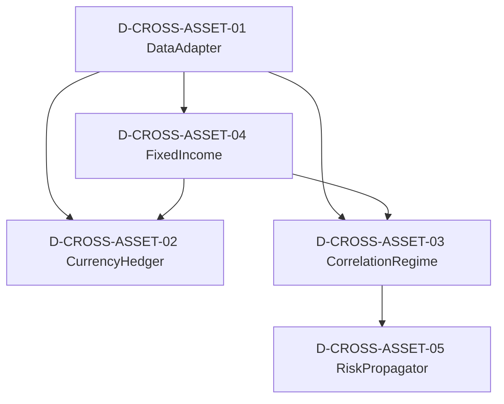

# 16 — D-CROSS-ASSET 跨资产跨市场域

> **状态**: DRAFT | **核心层**: 增强扩展 | **成熟度**: L1 🟡 骨架
> **一句话**: 从单一权益扩展到全资产

## §0 域定义

| 维度 | 内容 |
|------|------|
| 域ID | D-CROSS-ASSET |
| 域名 | 跨资产跨市场域 |
| 核心Aggregate | CrossAssetPosition |
| 核心事件 | E-CA-01 CurrencyExposureChanged / E-CA-02 CorrelationRegimeShifted / E-CA-03 CrossMarketPropagationDetected / E-CA-04 HedgingRebalanceRequired |
| 开发状态 | 未开发——骨架设计完成 |
| 优先级 | P2（2026.10港股通开通后启动） |
| 激活前提 | D-DATA就绪 + D-PF-CORE就绪 + D-RISK就绪 + D-AUTONOMY就绪 |
| 能力负载 | 1● 1◐ 0○ = 🟢低 |
| 对标能力 | C-020(●)渐进式全球扩展 / C-039(◐)跨市场传导模型 |

### 市场覆盖矩阵（来自数据源全景清单§三~八）

| 市场 | 覆盖率 | 优先级 | 数据源 | 交易通道 |
|------|:------:|:------:|--------|---------|
| 中国期货 | 34% | P1待验证 | iFind | ❌需期货账户 |
| 国际期货 | 23% | P2背景 | iFind | ❌ |
| 港股 | 5% | P1待验证 | iFind | 2026.10港股通 |
| 美股 | 5% | P2背景 | iFind | ❌ |
| 外汇 | 10% | P2背景 | iFind/央行 | ❌ |
| 债券 | 35% | P2背景 | iFind/中债 | ❌ |
| 商品 | 29% | P2背景 | iFind | ❌ |

## §1 子模块清单（骨架5✅）

| ID | 名称 | 职责 | 优先级 | 对标能力 | 数据源覆盖 |
|----|------|------|:------:|---------|-----------|
| D-CROSS-ASSET-01 | CrossMarketDataAdapter | 跨市场数据接入适配：期货/港股/美股/外汇/债券/商品统一数据接入+市场规则映射+交易协议转换+隔夜外盘数据接入 | P0 | C-020(●) | §三~八全部市场 |
| D-CROSS-ASSET-02 | CurrencyHedger | 外币敞口对冲+多币种P&L：敞口计算+对冲比率+远期/期货对冲+汇率影响分解+对冲成本归因+多币种报告 | P1 | C-020(●) | §外汇10% |
| D-CROSS-ASSET-03 | CorrelationRegimeDetector | 跨资产相关性体制检测：滚动相关矩阵+尾部依赖(Copula)+危机传染+分散化失效预警+体制切换(HMM) | P1 | C-020(●) | §全市场 |
| D-CROSS-ASSET-04 | FixedIncomeAnalyzer | 固收/利率曲线分析：债券定价+久期/凸性+利率曲线(Nelson-Siegel)+信用利差+债券组合管理 | P1 | C-020(●) | §债券35% |
| D-CROSS-ASSET-05 | CrossMarketRiskPropagator | 跨市场风险传导模型：美股→A股传导+港股→A股传导+商品→A股传导+传导概率矩阵+时滞估计+传导路径可视化 | P1 | C-039(◐) | §全市场 |

### P2扩展子模块（暂不入骨架）

| ID | 名称 | 职责 | 优先级 |
|----|------|------|:------:|
| D-CROSS-ASSET-06 | YieldCurveBuilder | 收益率曲线构建：插值器+拟合引擎+通胀连接+信用利差曲线 | P2 |
| D-CROSS-ASSET-07 | CreditRiskAnalyzer | 信用风险分析：PD/LGD/EAD+信用迁移+违约相关+CVA/DVA | P2 |
| D-CROSS-ASSET-08 | CommodityAnalyzer | 大宗商品分析：期限结构/季节性/便利收益/远期曲线/库存模型 | P2 |
| D-CROSS-ASSET-09 | RealEstateAnalyzer | 房地产分析：估值模型/租金分析/空置率/REIT NAV | P3 |
| D-CROSS-ASSET-10 | CrossMarketArbDetector | 跨市场套利检测：价差监控+执行成本+统计套利+配对交易 | P2 |
| D-CROSS-ASSET-11 | VolatilitySurfaceModeler | 波动率曲面建模：局部波动率/SVI参数化→Greeks | P2 |
| D-CROSS-ASSET-12 | DigitalAssetAdapter | 数字资产适配器：链上数据/DEX接口/钱包/跨链桥 | P3 |
| D-CROSS-ASSET-13 | CrossAssetLiquidityMonitor | 跨资产流动性监控：多资产流动性评分+危机预警 | P2 |
| D-CROSS-ASSET-14 | GlobalMacroScenarioGenerator | 全球宏观情景生成器：宏观情景+政策模拟+地缘+危机 | P2 |
| D-CROSS-ASSET-15 | CrossBorderRegulatoryNavigator | 跨境监管导航器：多司法管辖区规则映射+合规检查 | P2 |
| D-CROSS-ASSET-16 | OptionsPricingGreeks | 期权定价与Greeks：BS/Heston/SABR+数值方法+模型校准 | P2 |
| D-CROSS-ASSET-17 | AShareCrossMarketRiskMatrix | A股跨市场风险传导概率矩阵 | P2 |
| D-CROSS-ASSET-18 | CrossMarketRegimeDelayDetector | 跨市场Regime传递延迟检测 | P2 |
| D-CROSS-ASSET-19 | AShareQMTMultiMarketAdapter | A股QMT多市场适配器 | P2 |
| D-CROSS-ASSET-20 | MicrostructureAnalysisEngine | 微观结构分析引擎：订单簿深度+成交明细 | P2 |
| D-CROSS-ASSET-21 | CrossMarketArbScanner | 跨市场套利机会扫描器 | P3 |

## §2 域内依赖图



### 域内依赖关系表

| 源 | 目标 | 依赖类型 | 说明 |
|----|------|---------|------|
| CA-01 | CA-02 | 数据供给 | 跨市场数据→对冲计算 |
| CA-01 | CA-03 | 数据供给 | 跨市场数据→相关性分析 |
| CA-01 | CA-04 | 数据供给 | 债券/利率数据→固收分析 |
| CA-04 | CA-02 | 利率输入 | 利率曲线→对冲定价 |
| CA-04 | CA-03 | 利率敏感度 | 利率曲线→相关性 |
| CA-03 | CA-05 | 体制输入 | 相关性体制→风险传导 |

## §3 域间接口

### 消费接口（CA依赖其他域）

| 接口 | 供给域 | 强度 | 类型 | 说明 |
|------|--------|:----:|------|------|
| CTR-001 NormalizedMarketData | D-DATA | H | P0冻结 | 多资产数据 |
| PortfolioPosition | D-PF-CORE | H | P1可演进 | 组合持仓→对冲计算 |
| RiskMetrics | D-RISK | H | P1可演进 | 风险指标→相关性分析 |
| MarketRegimeSignal | D-SIGNAL | E | P1可演进 | 市场体制信号 |
| 权限/审计 | D-AUTONOMY-CORE | H | P0冻结 | RBAC+审计 |

### 产出接口（其他域依赖CA）

| 接口 | 消费域 | 强度 | 类型 | 说明 |
|------|--------|:----:|------|------|
| CTR-P1-013 CrossAssetRisk | D-RISK | E | P1可演进 | 跨资产风险→风控域 |
| CTR-P1-014 HedgingRecommendation | D-PF-CORE | E | P1可演进 | 对冲建议→组合域 |
| CTR-P1-015 CorrelationRegimeSignal | D-SIGNAL | E | P1可演进 | 相关性体制→信号域 |
| CrossMarketPropagation | D-RISK | E | P1可演进 | 跨市场传导→风控 |

## §4 域事件流

| 事件ID | 事件名 | 触发条件 | 消费者 | 频率 |
|--------|--------|---------|--------|:----:|
| E-CA-01 | CurrencyExposureChanged | 货币敞口变化超阈值 | D-RISK, D-PF-CORE | L2 |
| E-CA-02 | CorrelationRegimeShifted | 相关性体制切换 | D-RISK, D-PF-CORE, D-SIGNAL | L3 |
| E-CA-03 | CrossMarketPropagationDetected | 跨市场风险传导检测 | D-RISK, D-SIGNAL | L3 |
| E-CA-04 | HedgingRebalanceRequired | 对冲再平衡触发 | D-PF-CORE, D-EX-CORE | L3 |

## §5 激活前提

| 子模块 | 前提条件 | 就绪标准 |
|--------|---------|---------|
| CA-01 DataAdapter | D-DATA就绪 + 多市场API | CTR-001可用；期货/港股/美股/外汇数据源已配置 |
| CA-02 CurrencyHedger | CA-01就绪 + D-PF-CORE就绪 | 外汇数据可消费；组合持仓可查询 |
| CA-03 CorrelationRegime | CA-01就绪 + D-SIGNAL就绪 | 多资产数据可消费；MarketRegimeSignal可消费 |
| CA-04 FixedIncome | CA-01就绪 | 债券/利率数据可消费 |
| CA-05 RiskPropagator | CA-03就绪 + D-RISK就绪 | 相关性体制可消费；RiskMetrics可消费 |

### 激活阶段

| 阶段 | 前提 | 可激活模块 | 时间节点 |
|------|------|-----------|---------|
| Phase 1 | D-DATA就绪 + D-AUTONOMY就绪 | CA-01 | 当前(数据接入) |
| Phase 2 | Phase 1 + D-PF-CORE就绪 | CA-02, CA-04 | 2026.10港股通 |
| Phase 3 | Phase 2 + D-SIGNAL就绪 + D-RISK就绪 | CA-03, CA-05 | Phase 2后 |

## §6 设计决策记录

| # | 决策 | 理由 | 影响 |
|---|------|------|------|
| 1 | 跨资产域独立，优先级P2 | 先做好权益(A股)，再扩展其他资产类别——渐进式全球扩展(C-020) | CA域P2启动 |
| 2 | 骨架5子模块：数据适配+对冲+相关性+固收+传导 | 覆盖C-020(全球扩展)和C-039(跨市场传导)两个核心能力 | 满足能力定位书要求 |
| 3 | CrossMarketDataAdapter统一接入 | 多市场数据统一适配层，避免每个市场独立对接 | CA-01是唯一数据入口 |
| 4 | CurrencyHedger合并多币种P&L | 对冲和P&L是同一问题的两面，合并降低复杂度 | CA-02统一管理 |
| 5 | RiskPropagator独立于CorrelationRegime | 相关性体制检测是统计问题，风险传导是因果推理问题 | CA-05消费CA-03产出 |
| 6 | 期权定价/波动率曲面暂不入骨架 | 当前AUM 50万+T+1制度，衍生品交易不是优先级 | P2扩展，2026.10后视账户权限 |
| 7 | 数字资产暂不入骨架 | P3远期，当前无交易通道和合规框架 | CA-01预留接口 |
| 8 | A股特色子模块(跨市场传导矩阵/Regime延迟)归P2 | A股跨市场传导是C-039核心，但依赖CA-03先就绪 | 保留在扩展列表 |

## §7 合规约束（跨市场）

> 来源：合规架构§5 跨市场合规。本域作为跨资产跨市场域，是跨市场合规规则的核心承载域——市场合规规则矩阵、合规规则引擎、法域冲突解决均由本域承载或协调。与P2扩展子模块D-CROSS-ASSET-15 CrossBorderRegulatoryNavigator（跨境监管导航器）互补：本§7定义合规规则与冲突解决原则，CA-15提供多司法管辖区规则映射的运行时实现。

### §7.1 跨市场合规

> 定义多市场合规规则差异与统一合规引擎。核心目标：**一套合规引擎适配多市场规则，规则变更可热更新**。本域的CrossMarketDataAdapter(CA-01)负责跨市场数据接入适配，合规规则引擎在此基础上执行市场差异化合规检查。

### §7.2 市场合规规则矩阵

| 维度 | A股 | 港股(规划) | 美股(规划) | 期货(规划) |
|------|-----|-----------|-----------|-----------|
| 交易制度 | T+1 | T+0 | T+0 | T+0 |
| 涨跌停 | 主板±10%/创业板科创板±20%/北交所±30%(退市整理期±5%) | 无涨跌停(有冷静期) | 无涨跌停(有熔断机制) | 涨跌停板制度 |
| 做空 | 融券受限 | 可做空(融券) | 可做空 | 可做空 |
| 持仓限额 | 5%举牌线 | 5%披露线 | 5%SEC披露 | 交易所持仓限额 |
| 程序化交易报告 | 必须(证监会规定) | 须遵守SFC规定 | 须遵守SEC规定 | 必须(期货规定) |
| 结算周期 | T+1 | T+2 | T+1 | 当日/次日 |
| 税费 | 印花税千1(卖) | 印花税千1(卖)+交易征费 | 无印花税 | 无印花税 |

### §7.3 合规规则引擎

> 参考ScaleFirst SEC合规DSL(2025)、Adverant自适应合规引擎(2025)、Reg-Twin数字孪生合规框架(ACM 2025)。2026年行业趋势"合规即代码"(Compliance as Code)——将合规要求嵌入交易系统每个环节，与本域§7.3 DSL规则引擎方向一致。

#### §7.3.1 合规规则DSL设计

> 以下包含门禁激活后的规则示例（标注GATE条件）。A股规则当前可实施，港股/美股规则需GATE-003激活。DSL语法为设计态人可读表示，运行态由Pydantic+JSON实现。

```
COMPLIANCE_RULE "A股涨跌停不买入"
WHEN market == "A股" AND price >= upper_limit_price
THEN REJECT_ORDER("涨停板不买入", HARD_BLOCK),
     LOG("compliance_event", AUDIT);

COMPLIANCE_RULE "参与率限制"
WHEN market == "A股" AND daily_volume_pct(symbol) > 0.05
THEN REJECT_ORDER("参与率超限", HARD_BLOCK),
     NOTIFY("risk_manager", ALERT);

COMPLIANCE_RULE "新策略首笔交易"
WHEN strategy_is_new == true
THEN REQUIRE_APPROVAL("新策略首笔需审批", SOFT_BLOCK),
     LOG("compliance_event", AUDIT);

COMPLIANCE_RULE "接近参与率上限"
WHEN market == "A股" AND daily_volume_pct(symbol) > 0.04
THEN LOG_WARNING("参与率接近上限", WARNING),
     NOTIFY("risk_manager", INFO);

COMPLIANCE_RULE "港股持仓披露"  // ❌GATE-003
WHEN market == "HK" AND holding_pct(symbol) > 0.05
THEN REQUIRE_DISCLOSURE("SFC披露义务", IMMEDIATE),
     NOTIFY("compliance_officer", URGENT);
```

#### §7.3.2 规则生命周期

| 阶段 | 动作 | 审批 |
|------|------|------|
| 草稿 | 合规官编写DSL规则 | — |
| 审核 | 合规官+技术官双审 | 双人确认 |
| 测试 | 在仿真环境验证规则 | 自动化测试 |
| 上线 | 规则写入生产规则库 | 人工审批 |
| 监控 | 规则触发率/误触发率监控 | 自动 |
| 退役 | 规则标记为不活跃(不删除) | 人工审批 |

**版本控制与回测**：

| 功能 | 说明 | 当前状态 | 门禁条件 |
|------|------|---------|---------|
| 规则版本管理 | 合规规则的Git式版本管理+语义化版本号+变更diff | ✅能建 | — |
| 变更影响分析 | 规则变更前自动分析影响范围（触发率预估/误触发率预估） | ✅能建 | — |
| 兼容性检查 | 新版本规则与旧版本行为兼容性自动化检查 | ✅能建 | — |
| 规则回测器 | 用历史交易数据回测新规则的触发率和误触发率 | ✅能建 | — |
| 规则对比分析 | 新旧规则在相同数据集上的行为对比 | ✅能建 | — |
| 版本回滚 | 规则版本热回滚+回滚审计 | ✅能建 | — |

> 场外草稿参考: D-COMPLIANCE-17 Compliance Rule Version Controller（❌未开发）+ D-COMPLIANCE-20 Compliance Rule Backtester（❌未开发）。

### §7.4 法域冲突解决

| 冲突类型 | 解决原则 | 示例 |
|---------|---------|------|
| 所在市场优先(第一优先) | 标的所在市场的规则优先 | A股标的遵守A股规则 |
| 更严格规则优先(第二优先) | 当所在市场原则无法解决时(如运营者法域与标的法域同时约束同一行为)，采用更严格的 | 运营者在EU法域注册、标的在A股交易，同时受MiFID II(运营者法域)和A股规则(标的法域)约束，取更严格者 |
| 数据本地化 | 数据存储遵守最严格的法域要求 | EU GDPR数据不跨境 |

> **重叠说明**：本节法域冲突解决原则与P2扩展子模块D-CROSS-ASSET-15 CrossBorderRegulatoryNavigator职责互补——本节定义冲突解决原则（"是什么"），CA-15提供多司法管辖区规则映射的运行时实现（"怎么做"）。GATE-003激活后，CA-15将依据本节原则执行法域冲突自动裁决。

## §8 与现有体系对账

| 现有体系 | 本域 | 差异 |
|---------|------|------|
| 无 | D-CROSS-ASSET | 全新域，需新建 |
| D-DATA-34 OrderFlowDataManager | CA-01(部分数据) | Level-2数据归属D-DATA，CA消费 |
| D-DATA-31 IntradayDataManager | CA-01(部分数据) | 分时数据归属D-DATA，CA消费 |

## §9 风险架构(A4)交叉内容

> **来源**: 风险架构(A4) §1.6交易对手风险 + §1.7信用风险 + §14.2跨市场传导模型 + ESRB 14个AI风险放大向量。本节从**跨资产视角**搬入交易对手风险、信用风险、跨市场传导模型与系统性风险向量——定义D-CROSS-ASSET域须承载的跨资产风险识别、度量与传导机制。风险架构(A4)为风险规则的唯一真源，本节为跨资产域的风险执行规格。

### §9.1 交易对手风险

> 因交易对手违约导致损失的风险。当前系统为A股纯股票多头+单人管理，无OTC衍生品/融资融券/回购等交易对手敞口。D-RISK-09 Counterparty Risk Manager已定义但当前❌不能建——门禁条件未满足。

| 子类 | 识别方法 | 度量方法 | 处置机制 | 否决阈值 |
|------|---------|---------|---------|---------|
| 违约风险 | 交易对手信用评级监控+违约概率估计 | PD/LGD/EAD+CVA/DVA(Merton/KMV模型) | 限制交易对手敞口+CVA拨备 | 交易对手PD>阈值→限制新交易 |
| 结算风险 | 交收失败监控+结算周期跟踪 | 结算失败率+未结算敞口 | 实时交收监控+担保品要求 | 未结算敞口>限额→暂停交易 |

**当前状态**：❌不能建——门禁条件：系统开展衍生品交易/融资融券/回购等产生交易对手敞口的业务。项目有蓝图编号MOD-L04-001但是没建设。

**与D-CROSS-ASSET-07 Credit Risk Analyzer的关系**：交易对手风险与信用风险高度关联——交易对手违约是信用风险在交易对手维度的体现。D-CROSS-ASSET-07将整合§9.1交易对手风险与§9.2信用风险的跨域分析能力。

### §9.2 信用风险

> 因发行人信用恶化导致持仓资产价值损失的风险。当前系统仅持有A股股票(无债券/信用衍生品)，信用风险通过§1.1市场风险间接覆盖(股价部分反映信用恶化，但存在覆盖缺口——见§13冲突矩阵)。D-RISK-20 Credit Risk Engine已定义但当前❌不能建——门禁条件未满足。D-CROSS-ASSET-07 Credit Risk Analyzer已定义(跨域模块，无项目蓝图)但当前❌不能建——同§9.2门禁。

| 子类 | 识别方法 | 度量方法 | 处置机制 | 否决阈值 |
|------|---------|---------|---------|---------|
| 发行人体质恶化 | 财务指标监控+信用评级变动+违约距离(DD) | Merton模型DD+信用迁移矩阵+IFRS 9 ECL | 降持仓+提高止损敏感度 | DD<阈值→强制减仓 |
| 信用事件冲击 | 违约/降级/重组事件监控 | 事件冲击估算+信用VaR | 事件驱动清仓 | 信用事件→否决新买入 |

**当前状态**：❌不能建——门禁条件：系统持有债券/信用衍生品/开展融资融券业务，产生直接信用敞口。项目有蓝图编号MOD-L04-001但是没建设。

### §9.3 跨市场传导模型

> 对齐 C-039 跨市场传导模型。当前AUM 50万+A股为主，跨市场传导主要通过情绪/资金流/政策渠道。**注意**：传导模型隐含假设相关性结构稳定，但风险架构§14.5相关性体制转换表实证危机时ρ从-0.30翻转为+0.42，分散化失效。本模型在不同相关性体制下的行为变化见风险架构§14.5。

| 传导渠道 | 信号源 | 传导延迟 | 影响评估 | 处置 |
|---------|--------|---------|---------|------|
| 港股→A股 | 恒生指数/AH溢价/北向资金 | T+0(盘中) | AH联动股受冲击 | 降AH联动股权重 |
| 美股→A股 | 隔夜美股/VIX/美债收益率 | T+1(次日开盘) | 开盘跳空风险 | 预调仓位(盘前) |
| 期货→现货 | 股指期货升贴水/基差 | T+0(盘中) | 期货领跌/领涨 | 期货信号纳入市场状态 |
| 汇率→A股 | 人民币汇率/外汇储备 | T+0~T+1 | 资金流入流出 | 汇率异动→降仓位 |

**传导速度加速趋势**（对齐 FSB 2025 Global Monitoring Report + BIS 2025-2026 Cross-border研究）：

> 传导延迟非静态参数——危机模式下系统性缩短。美股→A股从T+1缩短至盘前T+0.5(夜盘期货/ETF传导)；港股→A股从分钟级加速至秒级(程序化交易联动)；传导速度与波动率正相关(VIX越高传导越快)。需将传导延迟从固定参数升级为时变函数：delay(t) = base_delay × (1 - α × VIX_percentile(t))。

**当前状态**：✅能建——D-RISK-28系统性风险监控器可扩展时变传导延迟参数，无需新增模块。

### §9.4 ESRB 14个AI风险放大向量

> 欧洲系统性风险委员会(ESRB)识别了AI在金融市场放大系统性风险的14个渠道。本系统逐一映射处置机制。

| # | ESRB风险向量 | 本系统映射 | 处置机制 |
|---|------------|-----------|---------|
| 1 | 顺周期性——市场压力期间AI羊群行为 | 策略同质化检测(风险架构§1.5) | VR-013策略拥挤否决+执行去耦(随机延迟) |
| 2 | 速度——亚毫秒级连锁故障 | 本系统≤10笔/秒，非高频 | 天然免疫(策略根频率=日频) |
| 3 | 不透明性——"黑箱"决策链 | C-030决策可解释性+审计链 | 每笔决策可溯源(风险架构§5.3) |
| 4 | 模型同质性——相关故障模式 | 策略指纹相似度(风险架构§1.5) | 相似度>90%否决上线 |
| 5 | 数据依赖——单一来源脆弱性 | 数据源双源校验(风险架构§4.1) | 数据源切换+空值率监控 |
| 6 | 互联性——放大的传染效应 | 级联失败监控(风险架构§1.4) | 熔断器隔离(OWASP ASI08) |
| 7 | 运营风险——AI系统故障 | 健康检查+心跳(风险架构§1.4) | 自动重启+Kill Switch |
| 8 | 网络脆弱性——模型投毒 | 记忆完整性校验(ASI06) | 哈希校验+清除受污染记忆 |
| 9 | 市场操纵——复杂AI幌骗 | 撤单率监控+行为模式检测(风险架构§6.1) | 撤单率>15%→限制+MFSA三类责任映射 |
| 10 | 监管套利——AI驱动规避 | 穿透监管(风险架构§6.1)+审计不可篡改(风险架构§5.3) | 同一实控人合并计算+哈希链审计 |
| 11 | 集中风险——AI提供商垄断 | 模型/数据源多样性 | 多源数据+模型异质性约束 |
| 12 | 过度信任(Overreliance) | 顺境中AI优异表现→过度信任→增加风险承担+阻碍监督 | 人类确认不可跳过(HC-RISK-02)+自治等级上限(风险架构§15.1) |
| 13 | 历史约束(History-Constrained) | AI依赖历史数据→无法应对未预见尾部事件→过度风险承担 | 反向压力测试(风险架构§14.4)+黑天鹅模式库(风险架构§14.1)+EVT尾部建模 |
| 14 | 法律地位未定(Untested Legal Status) | AI行为法律责任归属不明→系统性风险 | Named Accountability(风险架构§15.6)+AI输出视为工具输出(风险架构§9) |

### §9.5 与已有子模块的映射

| 风险架构内容 | 跨资产域子模块 | 执行模式 | 重叠说明 |
|------------|------------|---------|---------|
| §9.1 交易对手风险 | D-CROSS-ASSET-07 Credit Risk Analyzer(P2) | 风险识别 | CA-07已有"PD/LGD/EAD+信用迁移"条目，本节补充完整交易对手风险表格 |
| §9.2 信用风险 | D-CROSS-ASSET-07 Credit Risk Analyzer(P2) | 风险识别 | CA-07已有"信用风险分析"条目，本节补充完整信用风险表格+门禁条件 |
| §9.3 跨市场传导模型 | D-CROSS-ASSET-05 CrossMarketRiskPropagator(P1) | 风险传导 | CA-05已有"跨市场风险传导模型"条目，本节补充传导渠道表+时变延迟函数 |
| §9.4 ESRB 14向量 | D-CROSS-ASSET-05 CrossMarketRiskPropagator(P1) | 系统性风险 | 新增ESRB向量映射，CA-05扩展系统性风险监控维度 |

---

## §8 运维架构(A9)规格

> **搬入来源**: 运维架构(A9) §2.4 Cold平面(跨市场视角) + §4应急保命轨(跨市场降级)
> **搬入原则**: 将A9中D-CROSS-ASSET域承载的运维规格搬入本域，保持A9原文颗粒度。

### §8.1 Cold平面跨市场资源限制（A9§2.4）

| 资源 | 限制 | 说明 |
|------|------|------|
| CPU | 最多使用核16-19 | 跨市场分析属于Cold平面 |
| 网络 | iFind QPS共享池，最多5 QPS | 令牌桶限流 |
| 磁盘IO | 低优先级 | Windows进程优先级BelowNormal |

> **跨市场硬约束**：当前约束二"单台PC工作站"限制下，跨市场分析仅限于A股市场。跨市场数据采集和处理在交易时段不得影响Hot/Warm平面资源。

### §8.2 跨市场降级——保命轨视角（A9§4）

| 降级路径 | 跨市场动作 | 对应子模块 |
|---------|-----------|-----------|
| D-L0→D-L1 | 暂停跨市场策略 | CA-01 跨市场分析器 |
| D-L1→D-L2 | 停止跨市场数据采集 | CA-01 + CA-02 |
| D-L2→D-L3 | 跨市场模块完全离线 | CA-01 |


## 来自Agent架构(A7)的内容

### 来自Agent架构(A7) §1.3 战术Agent — 市场状态Agent消费D-CROSS-ASSET

| 属性 | 市场状态Agent (Regime Det) |
|------|---------------------------|
| **职责** | 市场状态判定(11态)、状态转换预警 |
| **输入** | 量价数据、宏观因子、跨市场数据 |
| **消费D-CROSS-ASSET** | D-CROSS-ASSET🔴（跨市场数据，MVP替代见LP-018）——市场状态Agent消费跨市场数据进行市场状态判定；MVP期间隔夜外盘数据通过D-DATA域AkShare适配器获取 |
| **输出** | 市场状态标签(11态)、状态转换概率 |
| **自治级别** | Level 2（弱自主：状态判定自主，仓位上限映射需审批） |
| **延迟目标** | <5s（状态变更检测） |
| **对应能力** | C-021 市场状态判定 |
| **对应域(归属域)** | D-SIGNAL + D-ML-SERVE |
| **LLM路由** | API+本地混合（复杂状态需推理） |
| **运行时段** | 盘前+盘中 |

### 来自Agent架构(A7) §9.2.2 Agent→业务功能域消费映射 — 市场状态Agent消费D-CROSS-ASSET

| Agent | 消费域（数据/信号来源） | 产出域（输出去向） | 蓝图备注 |
|-------|---------------------|------------------|---------|
| 市场状态Agent | D-DATA（量价数据）、D-CROSS-ASSET🔴（跨市场数据，MVP替代见LP-018）、D-ML-SERVE（模型推理） | D-SIGNAL（市场状态标签） | D-CROSS-ASSET: 无项目蓝图 |

## §10 来自学习系统架构(A8)的内容

> **搬入来源**: 学习系统架构(A8) §14.5 模块化/组合式架构 + §5.1 知识类型分类体系 + §3.3 采集增强能力
> **搬入原则**: 将A8中与跨资产跨市场域直接相关的内容搬入本域，保持A8原文颗粒度。学习系统架构(A8)为学习系统的唯一真源，本节为跨资产域的学习系统执行规格。

### §10.1 模块化/组合式架构与跨资产扩展

> **来源**: 学习系统架构(A8) §14.5 模块化/组合式架构。模块化架构是跨资产扩展的技术基础——从单一权益扩展到全资产类别，需要特征存储统一多资产因子、MLOps管线自动化跨资产策略部署、四层闭环架构确保跨市场分层隔离、事件Schema版本管理保障跨市场数据契约兼容。

| 发现 | 来源 | 与本域的关系 | 跨资产域执行规格 |
|------|------|------------|----------------|
| **特征存储（Feature Store）**：统一因子计算的定义-训练-服务，消除训练-服务偏差（15-25%的生产bug来源） | Quant 2.0 Architecture (AltStreet 2025) | 跨资产因子(利率/汇率/商品/信用利差)在训练和服务间可能不一致 | CA-01 CrossMarketDataAdapter消费Feature Store：跨资产因子定义→特征存储注册→训练/服务统一读取→消除跨资产训练-服务偏差。离线特征存储(DuckDB Parquet)+在线特征服务+Point-in-Time AS OF JOIN |
| **MLOps管线**：自动化训练→验证→影子测试→上线部署，将部署周期从2-6周缩短到天级 | Quant 2.0 Architecture (AltStreet 2025) | 跨资产策略(港股对冲/期货套利)部署周期长，无MLOps自动化 | 跨资产策略新增MLOps管线：自动训练→自动验证→影子部署→金丝雀发布→全量上线，人工仅审批关键节点。与CA-02/CA-05策略部署联动 |
| **四层闭环架构**：执行层（确定性）→智能层（多Agent协调）→分发层→持续闭环学习，层间严格分离 | TA Quant (2026) | 跨市场数据采集(确定性)与跨资产策略推理(智能)混合，无严格分层 | CA域内部采用四层分离：采集层(确定性:CA-01数据适配)→提取层(LLM推理:跨市场情感/事件提取)→映射层(规则+语义:CA-03相关性体制/CA-05传导模型)→进化层(元学习:跨市场知识迁移) |
| **Event Schema Versioning**：各阶段输出契约Schema版本化，变更需人工审核+向后兼容验证，消费者按版本号订阅 | IEEE (2025) | 跨市场数据契约(期货/港股/美股)无版本管理，Schema变更可能破坏下游消费者 | CA-01输出契约新增schema_version字段：跨市场Schema变更→人工审核→向后兼容验证→消费者按版本号订阅。与§7.3合规规则DSL版本控制互补 |

### §10.2 跨资产/跨市场知识类型

> **来源**: 学习系统架构(A8) §5.1 知识类型分类体系（11类）。以下为11类知识中与跨资产跨市场域直接相关的知识类型，定义跨市场场景下知识提取与映射的执行规格。

#### §10.2.1 制度知识（Regime Knowledge）——跨市场制度环境

```
10. 制度知识 (Regime Knowledge)（v4.0新增）
    定义: 市场制度/监管环境/交易规则对策略的影响
    举例: "注册制下壳资源贬值" / "北交所开通→资金分流" / "港股通开通→AH溢价收窄"
    提取: 制度类型 + 影响范围 + 影响方向 + 持续时间 + 合规约束
    映射目标: L2-C市场状态层 → C-021制度环境评估 / A6合规🔒架构
    依据: 行业实践综合(2025-2026)制度变化是A股最大的外生冲击之一
    跨资产扩展:
    ├─ 跨市场制度差异知识：A股T+1 vs 港股T+0 vs 美股T+0交易制度差异对策略执行的影响
    ├─ 跨市场监管规则知识：不同市场程序化交易报告义务/持仓限额/做空规则差异
    ├─ 汇率制度知识：人民币汇率形成机制/资本管制/港股通额度对跨市场策略的约束
    └─ 结算周期差异知识：A股T+1 vs 港股T+2 vs 美股T+1对资金效率和跨市场调仓的影响
```

> **与本域§7合规约束的关系**：制度知识的"合规约束"维度直接映射到§7市场合规规则矩阵。制度知识提取跨市场制度差异，§7.2市场合规规则矩阵定义具体合规检查规则，两者互补——制度知识是"识别差异"，§7是"执行检查"。

#### §10.2.2 跨资产相关性知识

> 学习系统§5.1知识分类11类中无独立的"跨资产相关性知识"类型，但跨资产相关性知识可由以下知识类型组合提取：

| 知识类型 | 跨资产相关性提取 | 映射到CA域子模块 |
|---------|----------------|----------------|
| 因子知识(Factor Knowledge) | 跨资产因子(利率/汇率/商品/信用利差)及其对A股的影响方向 | CA-03 CorrelationRegimeDetector |
| 市场状态知识(Market State Knowledge) | 跨市场状态联动：美股VIX飙升→A股开盘跳空；港股恒指暴跌→AH联动股冲击 | CA-05 CrossMarketRiskPropagator |
| 事件影响知识(Event Impact Knowledge) | 跨市场事件传导：美联储加息→新兴市场资金外流→A股承压 | CA-05 CrossMarketRiskPropagator |
| 风控知识(Risk Management Knowledge) | 跨资产分散化失效：危机时ρ从-0.30翻转为+0.42（风险架构§14.5实证） | CA-03 CorrelationRegimeDetector |

> **与CA-03 CorrelationRegimeDetector的关系**：CA-03消费上述4类知识的跨资产提取结果，执行滚动相关矩阵+尾部依赖(Copula)+危机传染+分散化失效预警+体制切换(HMM)。知识类型定义"提取什么"，CA-03定义"怎么计算"。

#### §10.2.3 跨市场知识迁移机制

> **来源**: 学习系统架构(A8) §9.1 元学习维度。跨市场知识迁移是模块化/组合式架构的核心能力——将A股市场学到的策略/因子/风控知识迁移到新市场(港股/美股/期货)。

| 迁移机制 | 来源 | 迁移方式 | 跨资产域执行 |
|---------|------|---------|------------|
| MAML快速适应 | Meta-Quant (AAAI 2025) | 历史市场元训练→新市场5-10 episode适应 | CA-01新市场数据→MAML元训练→快速适应新市场特征 |
| 在线EWC | ProAdapt (Electronics 2026) | Fisher信息矩阵正则化关键参数，防止灾难性遗忘 | 跨市场策略迁移时保留A股知识+适应新市场知识 |
| 适配器机制 | 在线学习增强选股模型 (2026) | 基础模型冻结+适配器微调→学习分布漂移 | A股基础模型+港股/美股适配器→避免全量重训 |
| AutoSkill自动技能发现 | AutoSkill (OpenAI 2025) | LLM分析研究轨迹→自动抽象新技能 | 跨市场研究轨迹→自动发现跨市场交易技能→注册技能库 |

### §10.3 跨市场数据采集增强能力

> **来源**: 学习系统架构(A8) §3.3 采集增强能力。以下为S0采集增强中与跨市场数据采集直接相关的能力，定义跨市场场景下数据采集的执行规格。

#### §10.3.1 多市场数据采集

| 采集能力 | 来源 | 跨市场执行规格 | 对接CA域子模块 |
|---------|------|--------------|--------------|
| Feature Store | AltStreet Quant 2.0 (2025) | 跨资产因子统一存储：A股因子+港股因子+美股因子+期货因子+汇率因子→Feature Store注册→训练/服务统一读取 | CA-01 CrossMarketDataAdapter |
| PIT Manager | FinRL-X (2026) | 跨市场Point-in-Time正确性：不同市场财务数据报告延迟不同(美股10-Q/10-K vs A股年报/季报)→PIT AS OF JOIN确保无前瞻偏差 | CA-01 CrossMarketDataAdapter |
| Sentiment Engine | finBERT (IEEE Access 2023) | 跨市场情感分析：中文新闻(finBERT)+英文新闻(finBERT)+港股公告(繁体NLP)→多语言情感得分→统一情感信号 | CA-05 CrossMarketRiskPropagator(情感传导) |
| Filing NLP Engine | Captide (2025) | 跨市场公告结构化提取：A股公告(中文)+港股公告(中英双语)+美股SEC Filing(英文)→LLM API辅助复杂公告理解 | CA-04 FixedIncomeAnalyzer(信用事件) |
| 多模态融合引擎 | Multimodal Agentic AI (TechRxiv 2025) | 跨市场多模态数据融合：A股视频/港股研报/美股财报PDF→早期融合+晚期融合+注意力融合 | CA-01 CrossMarketDataAdapter |

#### §10.3.2 跨市场情感分析

> Sentiment Engine的跨市场扩展规格。跨市场情感分析是跨市场风险传导检测(CA-05)的核心输入——美股恐慌情绪→A股开盘传导、港股卖压→AH联动股冲击。

```
跨市场情感分析执行规格:

1. 多语言情感引擎
   ├─ 中文: finBERT金融情感分析(新闻/公告/社交媒体)
   ├─ 英文: finBERT金融情感分析(SEC Filing/美股新闻/国际研报)
   └─ 繁体中文: 港股公告/研报情感分析(与简体中文共享模型+繁简转换预处理)

2. 跨市场情感传导检测
   ├─ 美股→A股: 隔夜美股VIX+消费者信心+美联储声明情感→A股开盘跳空预测
   ├─ 港股→A股: 恒指期货情感+北向资金流向情感→AH联动股冲击预警
   ├─ 期货→现货: 股指期货升贴水情感→A股现货市场情绪
   └─ 汇率→A股: 人民币汇率情感+外汇储备变化→资金流入流出预测

3. 情感传导时滞建模
   ├─ 与§9.3跨市场传导模型联动：情感传导是传导渠道之一
   ├─ 时变传导延迟：delay(t) = base_delay × (1 - α × VIX_percentile(t))
   └─ 情感传导速度与波动率正相关：VIX越高情感传导越快
```

> **与CA-05 CrossMarketRiskPropagator的关系**：跨市场情感分析为CA-05提供"情感传导渠道"的输入信号。CA-05消费情感信号+量价信号+宏观因子信号，执行综合跨市场风险传导建模。情感分析定义"提取什么情感"，CA-05定义"怎么建模传导"。

## 数据架构域模块补充

> **📦搬入来源**: 数据架构 v6.0 §17.16

### §17.16 D-CROSS-ASSET 跨资产跨市场域缺失模块

| 模块ID | 模块名称 | 功能简述 | 二元结论 | 蓝图备注 |
|--------|---------|---------|---------|---------|
| D-CROSS-ASSET-01 | Multi-Market Data Router | 多市场数据路由(A股+港股+期货+期权+跨市场对齐) | ❌硬边界不能建。门禁：①多市场数据源采购(年费$20K+)②AUM>1000万③团队≥3人④合规审查通过。当前仅A股单一市场 | |
