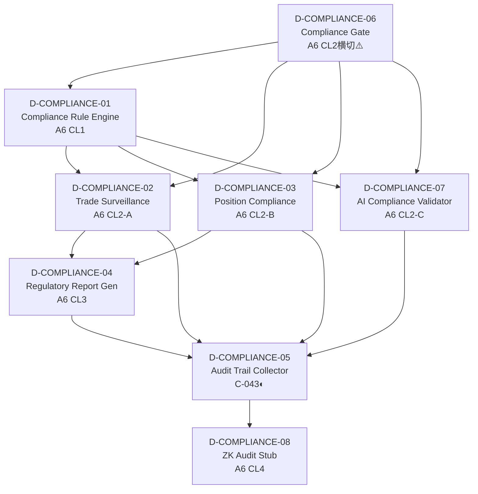
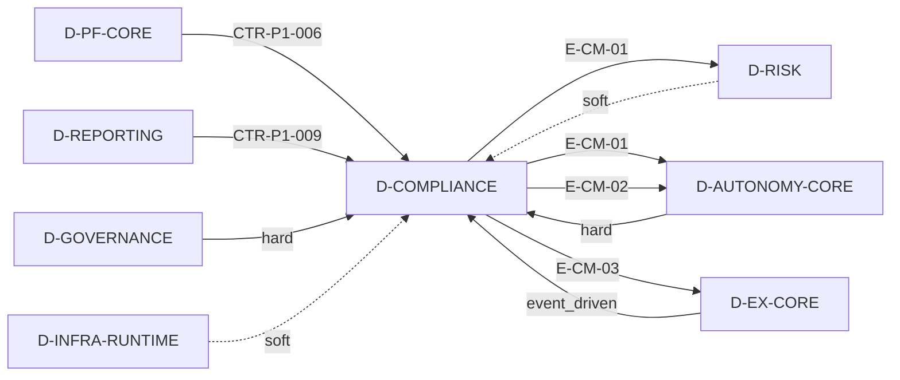
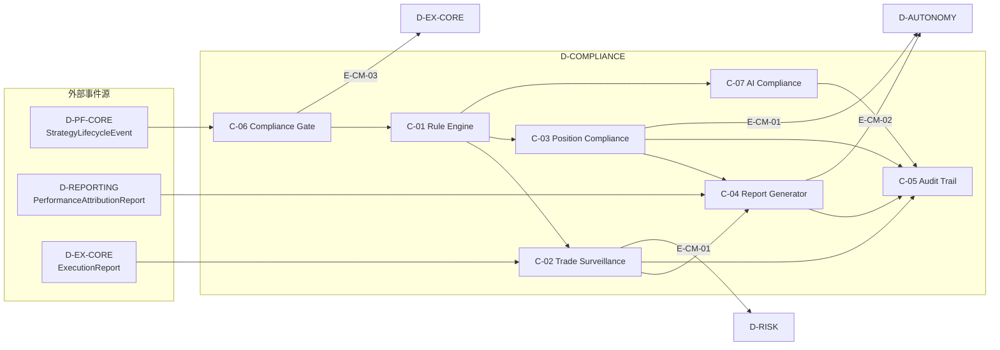

# 17 — D-COMPLIANCE 合规监管域

> **状态**: DRAFT | **核心层**: L10 | **成熟度**: ⬜ 未开发(门禁占位) | **简称**: CMP
> **一句话**: 确保交易合法合规——A6门禁未激活，骨架已占位
>
> **核心职责流**: CTR-P1-006策略生命周期 + CTR-P1-009归因报告接收 → 合规规则检查 → 合规报告/审计日志输出

## §0 域定义

| 维度 | 内容 |
|------|------|
| domain_id | D-COMPLIANCE |
| 简称 | CMP |
| 核心Aggregate | ComplianceRule |
| 核心事件 | E-CM-01 ComplianceBreach / E-CM-02 RegulatoryReportGenerated / E-CM-03 ComplianceGatePassed |
| 开发状态 | 未开发——8个子模块均为骨架占位 |
| 优先级 | P2（A6门禁未激活，按需启动） |
| 激活前提 | D-AUTONOMY就绪 + D-GOVERNANCE就绪 + A6门禁激活 |
| 门禁状态 | 🔒 A6合规架构门禁未激活——架构设计已完成，满足激活条件后开始实施 |

## §1 子模块清单

| ID | 名称 | 职责 | 优先级 | 开发状态 | 对标能力 | A6层级映射 |
|----|------|------|:------:|:--------:|---------|-----------|
| D-COMPLIANCE-01 | Compliance Rule Engine | 合规规则引擎(Python原生+Pydantic DSL+三种执行模式:Hard Block/Soft Block/Warning)。门禁未激活时规则集为空但引擎可启动 | P2 | ⬜ 骨架 | — | A6 CL1 |
| D-COMPLIANCE-02 | Trade Surveillance Engine | 交易合规检查(spoofing/layering/wash trade检测/程序化交易报备)。门禁未激活时代理A4风控检查 | P2 | ⬜ 骨架 | — | A6 CL2-A |
| D-COMPLIANCE-03 | Position Compliance Monitor | 持仓合规监控(持仓限额/行业集中度/短线交易防护/内幕交易防护)。门禁未激活时代理A4风控检查 | P2 | ⬜ 骨架 | — | A6 CL2-B |
| D-COMPLIANCE-04 | Regulatory Report Generator | 监管报告生成器(程序化交易报备/交易记录留存/审计证据) | P2 | ⬜ 骨架 | — | A6 CL3 |
| D-COMPLIANCE-05 | Audit Trail Collector | 审计追溯收集/哈希链日志/7年保留策略/不可篡改。对接D-GOVERNANCE审计框架 | P1 | ⬜ 骨架 | C-043◐辅助 | A6 CL5横切 |
| D-COMPLIANCE-06 | Compliance Gate (A6 Skeleton) | 合规规则门禁(A6 CL2横切骨架占位)。门禁未激活时所有检查自动PASS；激活后嵌入交易链路做实时合规检查。⚠️此模块是A6激活后的核心入口 | P2 | ⬜ 骨架 | — | A6 CL2横切 |
| D-COMPLIANCE-07 | AI Compliance Validator | AI合规验证(EU AI Act风险分类/模型注册/可解释性要求/决策可追溯) | P2 | ⬜ 骨架 | — | A6 CL2-C |
| D-COMPLIANCE-08 | Zero-Knowledge Audit Stub | 零知识审计槽位(占位)。门禁未激活时仅保留接口定义 | P2 | ⬜ 骨架 | — | A6 CL4 |
| D-COMPLIANCE-09 | 信息隔离墙执行层 | §7.2信息隔离墙执行层+观察名单+限制名单+跨墙审批+墙上人员管理（源自A5 §15.9 D-COMPLIANCE-04） | P2 | ⬜ 骨架 | — | A6 CL2-B |
| D-COMPLIANCE-10 | 内幕交易监控器 | §7.3内幕交易监控执行层+异常交易模式检测+内幕交易信号指标+自动告警（源自A5 §15.9 D-COMPLIANCE-05） | P2 | ⬜ 骨架 | — | A6 CL2-A |
| D-COMPLIANCE-11 | 程序交易报告器 | 上交所2025.07新规程序化交易报备（源自A5 §15.9 D-COMPLIANCE-11） | P2 | ⬜ 骨架 | — | A6 CL3 |
| D-COMPLIANCE-12 | 市场操纵检测器 | 操纵模式识别+订单簿分析+协同交易行为检测（源自A5 §15.9 D-COMPLIANCE-06） | P2 | ⬜ 骨架 | — | A6 CL2-A |
| D-COMPLIANCE-15 | 合规证据链生成器 | 证据自动收集+完整性验证（源自A5 §15.9 D-COMPLIANCE-15） | P2 | ⬜ 骨架 | — | A6 CL3 |
| D-COMPLIANCE-16 | 合规策略即代码引擎 | OPA/Rego风格合规策略编码（源自A5 §15.9 D-COMPLIANCE-16） | P2 | ⬜ 骨架 | — | A6 CL1 |
| M16-NEW-01 | EU AI Act合规自动化引擎 | EU AI Act条款自动合规检查（源自A5 §15.9） | P2 | ⬜ 骨架 | — | A6 CL2-C |
| M16-S07 | 中国AI安全框架对齐器 | 对齐中国AI安全治理框架2.0（源自A5 §15.9） | P2 | ⬜ 骨架 | — | A6 CL2-C |
| M39-S01 | CISA SBOM合规检查器 | 检查SBOM是否满足CISA最小元素（源自A5 §15.9） | P2 | ⬜ 骨架 | — | A6 CL1 |
| M39-S02 | EU CRA SBOM验证器 | 验证SBOM是否满足EU CRA（源自A5 §15.9） | P2 | ⬜ 骨架 | — | A6 CL1 |

### C轨L10层子模块映射

| C轨子模块 | 对应D-COMPLIANCE子模块 | 说明 |
|-----------|-----------------------|------|
| l10-rules | D-COMPLIANCE-01 Compliance Rule Engine | 合规规则引擎核心 |
| l10-validators | D-COMPLIANCE-02 Trade Surveillance + D-COMPLIANCE-03 Position Compliance | 交易与持仓合规校验 |
| l10-audit-trail | D-COMPLIANCE-05 Audit Trail Collector + D-COMPLIANCE-08 ZK Audit Stub | 审计追踪与零知识审计 |

### A6激活门禁状态

| 门禁ID | 门禁名称 | 当前状态 | 说明 |
|--------|---------|---------|------|
| GATE-001 | 管理他人资金 | 🔒 未激活 | 开始管理他人资金时激活 |
| GATE-002 | AUM阈值触发 | 🔒 未激活 | AUM超过监管阈值时激活 |
| GATE-003 | 跨市场交易 | 🔒 未激活 | 进入多市场监管范围时激活 |
| GATE-004 | SaaS模式运营 | 🔒 未激活 | 对外提供SaaS服务时激活 |
| GATE-005 | AI交易法规 | 🔒 未激活 | AI交易相关法规生效时激活 |
| GATE-006 | EU法规适用 | 🔒 未激活 | 进入EU监管范围时激活 |

> **当前状态**: 所有门禁未激活。合规需求由A4(风险架构)和A5(安全架构)代理管理。A6架构设计已完成，满足任一门禁条件后开始实施。

## §2 域内依赖图



| 上游 | 下游 | 依赖说明 |
|------|------|---------|
| D-COMPLIANCE-06 | D-COMPLIANCE-01 | 合规门禁调用规则引擎执行检查 |
| D-COMPLIANCE-06 | D-COMPLIANCE-02 | 合规门禁调用交易合规检查 |
| D-COMPLIANCE-06 | D-COMPLIANCE-03 | 合规门禁调用持仓合规检查 |
| D-COMPLIANCE-06 | D-COMPLIANCE-07 | 合规门禁调用AI合规验证 |
| D-COMPLIANCE-01 | D-COMPLIANCE-02 | 规则引擎驱动交易合规规则 |
| D-COMPLIANCE-01 | D-COMPLIANCE-03 | 规则引擎驱动持仓合规规则 |
| D-COMPLIANCE-01 | D-COMPLIANCE-07 | 规则引擎驱动AI合规规则 |
| D-COMPLIANCE-02 | D-COMPLIANCE-04 | 交易合规结果输入监管报告 |
| D-COMPLIANCE-03 | D-COMPLIANCE-04 | 持仓合规结果输入监管报告 |
| D-COMPLIANCE-02 | D-COMPLIANCE-05 | 交易合规事件写入审计追踪 |
| D-COMPLIANCE-03 | D-COMPLIANCE-05 | 持仓合规事件写入审计追踪 |
| D-COMPLIANCE-07 | D-COMPLIANCE-05 | AI合规验证结果写入审计追踪 |
| D-COMPLIANCE-04 | D-COMPLIANCE-05 | 监管报告生成写入审计追踪 |
| D-COMPLIANCE-05 | D-COMPLIANCE-08 | 审计数据可接入零知识审计 |

## §3 域间接口

### 3.1 消费依赖

| 消费什么 | 来自哪个域 | 契约/事件 | 类型 | 说明 |
|---------|-----------|---------|:----:|------|
| 策略生命周期事件 | D-PF-CORE | CTR-P1-006 StrategyLifecycleEvent | H | 合规需监控策略上线/下线 |
| 归因报告 | D-REPORTING | CTR-P1-009 PerformanceAttributionReport | H | 合规需审查归因报告 |
| 权限/审计框架 | D-AUTONOMY-CORE | — | H | RBAC/审计/遥测基础设施 |
| 治理策略/门禁引擎 | D-GOVERNANCE | — | H | 审计框架+门禁注册 |
| 运行时基础设施 | D-INFRA-RUNTIME | — | S | 事件总线/配置中心 |
| 风控指标 | D-RISK | — | S | 门禁未激活时代理合规检查 |

### 3.2 产出依赖

| 产出什么 | 去往哪个域 | 契约/事件 | 类型 | 说明 |
|---------|-----------|---------|:----:|------|
| ComplianceBreach事件 | D-RISK | E-CM-01 | E | 合规违规通知风控域 |
| ComplianceBreach事件 | D-AUTONOMY-CORE | E-CM-01 | E | 合规违规通知自治域 |
| RegulatoryReportGenerated事件 | D-AUTONOMY-CORE | E-CM-02 | E | 监管报告生成通知(HMI展示) |
| ComplianceGatePassed事件 | D-EX-CORE | E-CM-03 | E | A6激活后合规门禁通过信号 |

### 3.3 域间依赖图



## §4 域事件流

### 4.1 事件订阅

| 事件ID | 事件名 | 来源域 | 消费子模块 | 处理逻辑 |
|--------|--------|--------|-----------|---------|
| EVT-PF-006 | StrategyLifecycleEvent | D-PF-CORE | C-01, C-06 | 策略上线/下线触发合规规则检查 |
| EVT-RPT-009 | PerformanceAttributionReport | D-REPORTING | C-04, C-06 | 归因报告合规审查 |
| EVT-EX-TRADE | ExecutionReport | D-EX-CORE | C-02, C-05 | 交易执行报告触发交易合规检查 |

### 4.2 事件发布

| 事件ID | 事件名 | 发布子模块 | 触发条件 | 消费者 |
|--------|--------|-----------|---------|--------|
| E-CM-01 | ComplianceBreach | C-02, C-03, C-07 | 合规违规检测到 | D-RISK, D-AUTONOMY-CORE |
| E-CM-02 | RegulatoryReportGenerated | C-04 | 监管报告生成完成 | D-AUTONOMY-CORE(HMI) |
| E-CM-03 | ComplianceGatePassed | C-06 | A6激活后合规门禁检查通过 | D-EX-CORE |

### 4.3 事件流图



## §5 激活前提

| 前提 | 就绪标准 | 当前状态 |
|------|---------|---------|
| D-AUTONOMY-CORE就绪 | RBAC/审计/遥测基础设施可用 | ❌ 待建 |
| D-GOVERNANCE就绪 | 审计框架+门禁注册可用 | ⬜ 部分就绪 |
| D-PF-CORE就绪 | CTR-P1-006 StrategyLifecycleEvent可消费 | ❌ 待建 |
| D-REPORTING就绪 | CTR-P1-009 PerformanceAttributionReport可消费 | ❌ 待建 |
| D-EX-CORE就绪 | ExecutionReport事件可消费 | ❌ 待建 |
| A6门禁激活 | GATE-001~006任一条件满足 | 🔒 未激活 |

### 激活阶段

| 阶段 | 条件 | 激活内容 | 说明 |
|------|------|---------|------|
| Phase 0 | 门禁未激活 | C-05 Audit Trail Collector仅 | 审计追溯是P1需求，不依赖A6门禁 |
| Phase 1 | GATE-001~003任一激活 | C-01~C-06 | 交易合规+持仓合规+规则引擎+门禁 |
| Phase 2 | GATE-005激活 | +C-07 AI Compliance Validator | AI交易法规合规 |
| Phase 3 | GATE-006激活 | +C-08 Zero-Knowledge Audit Stub | EU法规零知识审计 |

> **关键原则**: 门禁未激活时，C-06所有检查自动PASS，C-02/C-03代理A4风控检查，C-08仅保留接口定义。Verify Don't Trust, Fail-Closed, 实时优先, 最小披露, 法规驱动, 分层治理。

## §6 设计决策记录

| 日期 | 决策 | 理由 | 对标来源 |
|------|------|------|---------|
| 2026-05-12 | 合规域独立于风控域 | 风控管"交易风险"，合规管"法律合规"，职责不同 | 专业机构合规与风控分设 |
| 2026-05-12 | 扩展为6+3+4模型——合规监管归入扩展域 | 顶级机构缺口审计发现合规是核心缺口 | 场外讨论草稿v6 |
| 2026-05-12 | 旧层L10→新域D-COMPLIANCE | 层级重构，L10合规约束层独立为域 | YAML domain定义 |
| 2026-05-22 | 骨架精简为8子模块(厚8✅) | 原有16+子模块过度膨胀，按A6架构层+能力定位书收敛 | 能力定位书§9 + A6合规架构 |
| 2026-05-22 | A6门禁未激活但骨架占位 | 架构设计已完成，满足激活条件后开始实施，避免激活时大规模重构 | 合规架构.md v4.0 |
| 2026-05-22 | C-06 Compliance Gate为A6激活核心入口 | A6激活后嵌入交易链路做实时合规检查，门禁未激活时自动PASS | A6 CL2横切层设计 |
| 2026-05-22 | C-05 Audit Trail Collector为P1唯一实建子模块 | C-043◐审计与合规追溯不依赖A6门禁，7年保留+不可篡改是基础需求 | 能力定位书§9 C-043 |
| 2026-05-22 | 门禁未激活时代理A4/A5 | 合规需求由风险架构和安全架构代理，避免功能真空 | 合规架构.md v4.0 |
| 2026-05-22 | C-01规则引擎三种执行模式 | Hard Block/Soft Block/Warning覆盖从硬阻断到仅告警的全频谱 | A6 CL1合规规则层 |
| 2026-05-22 | C-08 ZK Audit Stub仅保留接口 | 零知识审计依赖EU法规(GATE-006)，当前仅占位 | A6 CL4零知识审计层 |
| 2026-05-22 | safety_level=M, ai_autonomy=human_gated | 合规操作必须人工审批，AI不可自主执行合规动作 | YAML domain定义 |
| 2026-05-22 | 6门禁分阶段激活 | 不同业务场景触发不同合规要求，避免一次性过度建设 | A6 GATE-001~006 |

## §7 风险架构(A4)交叉内容

> 以下内容源自风险架构(A4)文档§6"A股合规规则（代管）"，在A6合规架构激活后迁移到A6。规则对齐 2026年最新A股交易规则。

### §6.1 不操纵市场

| 规则 | 实现方式 | 检测方法 | 违规处置 |
|------|---------|---------|---------|
| 禁止幌骗(Spoofing) | 下单意图校验+撤单率监控 | 撤单率>50%→告警(幌骗行为检测阈值，区别于15%监管合规上限) | 自动限制撤单频率 |
| 禁止分层操纵(Layering) | 多档位挂单模式检测 | 挂单-撤单模式匹配 | 否决可疑订单 |
| 禁止自交易 | 账户内对倒检测 | 买卖同一标的检测 | 否决自交易订单 |
| 参与率限制 | 单票日成交量占比监控 | 参与率>15%→否决 | 否决超额订单 |

**程序化交易合规**（对齐 2025.7《程序化交易管理实施细则》+ 2026.4.7新版实施细则+ 2026.1《沪深股通程序化交易报告指引》+ 证监会吴清2026.3两会表态）：

| 合规项 | 要求 | 本系统实现 |
|--------|------|-----------|
| 程序化交易报告 | 提前报告账户/策略信息 | C-002内置报告模板(待监管明确后实现) |
| 高频交易认定(2026.4.7更新) | 单账户每秒申报撤单≥15笔(原300笔，收紧20倍)或全日≥20000笔 | 本系统≤10笔/秒，低于新阈值 |
| 撤单率限制(2026.4.7新增) | 单日撤单率≤15%；每秒撤单≤15笔 | 本系统撤单率远低于15% |
| 报单停留时间(2026.4.7新增) | 每笔申报至少停留50微秒，禁止"秒挂秒撤" | 本系统订单逻辑天然满足 |
| VIP通道限制(2026.4.7新增) | 暂停新增独立交易单元；存量通道≥10账户共用；清退交易所机房专属服务器托管 | 本系统使用标准通道，不受影响 |
| 穿透监管(2026.4.7新增) | 同一实控人名下境内外账户/亲属账户合并计算持仓与交易 | 单人系统天然满足 |
| 异常交易行为监控 | 瞬时申报速率异常/频繁瞬时撤单/频繁拉抬打压/短时间大额成交 | C-004否决规则引擎内置4类异常检测 |
| 系统故障应急 | 系统测试报告+应急方案 | C-008自治运维+应急保命轨 |
| 沪深股通程序化交易报告 | 北向投资者纳入报告管理(2026.1.12起实施) | 架构预留(当前无北向资金操作) |
| 高频交易差异化收费 | 对高频交易收取更高流量费/撤单费(2026年下半年落地) | 本系统远低于高频阈值，不受影响 |
| 融券保证金(2026.4.7更新) | 融券保证金比例从50%提升至100%；转融券T+1(原T+0) | 本系统当前无融券操作 |
| 策略代码报备(2027H1) | 头部量化机构报备核心策略逻辑+现场检查 | 架构预留(待监管细则明确) |
| 智能体规范意见(2026.5.8) | 网信办/发改委/工信部联合印发；首次对智能体系统政策部署；明确决策权限边界(仅用户决策/用户授权决策/智能体自主决策)；用户享有知情权和最终决策权；智能体执行不得超出用户授权范围；点名"金融风控智能体"为优先发展方向 | §15.1自治等级对齐决策权限三分类：仅用户决策→L0完全人工，用户授权决策→L1建议执行+L4降级模式，智能体自主决策→L2低风险自主+L3中风险自主；HC-RISK-02(风控不可人工否决)与"最终决策权"不矛盾(风控是安全底线而非决策) |

**A股程序化交易监管路线图**（对齐证监会官方表态+交易所实施细则）：

| 时间 | 监管措施 | 状态 | 对本系统影响 |
|------|---------|------|------------|
| 2025.7.7 | 《程序化交易管理实施细则》首次实施 | ✅已生效 | 报告义务+异常行为监控 |
| 2026.1.12 | 沪深股通程序化交易报告指引 | ✅已生效 | 架构预留(无北向操作) |
| 2026.4.7 | 新版实施细则：高频认定15笔/秒+撤单率15%+50微秒停留+VIP通道限制+穿透监管 | ✅已生效 | 本系统≤10笔/秒，天然合规 |
| 2026H2 | 高频交易差异化收费(流量费+撤单费) | 🔄待落地 | 远低于高频阈值，不受影响 |
| 2026H2 | 程序化异常交易监控标准(4类红线自动预警) | 🔄待落地 | C-004已内置4类异常检测 |
| 2026Q3-Q4 | 北向资金程序化交易监管 | 🔄待落地 | 架构预留 |
| 2026年底 | 同一实控人账户合并监管 | 🔄待落地 | 单人系统天然满足 |
| 2027H1 | 量化策略代码报备与核查 | 🔄待落地 | 架构预留(待细则) |
| 2026-2027 | T+0交易试点(ETF/蓝筹有限T+0) | 🔍监控中 | 证监会多次表态"时机不成熟"；2026.3释放积极信号但无实质动作；若落地先在ETF/蓝筹试点"单次T+0"(日内回转1次)；本系统T+1逻辑需预留T+0切换能力 |
| 2026.5.8 | 《智能体规范应用与创新发展实施意见》三部门联合 | ✅已生效 | §15.1自治等级对齐决策权限三分类(仅用户决策→L0，用户授权→L1+L4，智能体自主→L2+L3)；需持续跟踪金融风控智能体细则 |
| 2026.5.15 | 证监会《衍生品交易监督管理办法(试行)》 | 🔄2026.11.16生效 | 本系统当前无衍生品交易；架构预留(待衍生品策略开发时实现) |

**私募基金合规**（对齐 证监会《私募投资基金信息披露监督管理办法》2026.2.27，2026.9.1生效）：

| 合规项 | 要求 | 本系统实现 |
|--------|------|-----------|
| 信息披露 | 管理人按合同约定频率向投资者披露基金信息 | 架构预留(待基金设立后实现) |
| 禁止承诺收益 | 不得向投资者承诺投资本金不受损失或最低收益/最大亏损 | 本系统无承诺收益机制，天然合规 |
| 临时报告 | 发生重大事件时及时编制临时报告并披露 | C-004否决规则引擎可触发事件报告 |
| 托管人复核 | 托管人对基金财务情况等信息复核审查 | ❌不能建——门禁条件：AUM增长到可聘请托管人 |
| 网下询价合规 | 研究机制+审批机制+定价依据+全程留痕 | 架构预留(本系统当前无打新操作) |

### 信息不对称期与操纵行为检测模型（Information Asymmetry Period & Manipulation Detection Model）

**架构现状**: 完全缺失。"庄股操作识别"无量化框架。

**核心逻辑**: "庄股"在专业量化中对应**Market Manipulation**——用ESMA MABUM(2025)的GNN+TCN+联邦学习框架检测操纵行为，用沪深交易所(2025.7)的量化标准识别异常交易。

**缺失功能**:

#### 54.1 信息不对称期量化

| 功能点 | 量化方法 | 说明 |
|--------|---------|------|
| 空窗期定义 | 定期报告披露间隔>90天的时期 | 11月-次年4月30日 |
| 空窗期异常 | 空窗期内换手率/波动率/收益率偏离正常水平 | z-score>2=异常 |

#### 54.2 操纵行为检测

| 功能点 | 量化方法 | 说明 |
|--------|---------|------|
| 幌骗交易 | 偏离≥2%+申报量≥10%+5秒内撤单≥80% | 沪深交易所(2025.7)标准 |
| 对敲交易 | 间隔≤5秒+偏离≤1%+占比≥5% | 同上 |
| 尾盘操纵 | 最后5分钟价格变化>2%+成交量集中 | 疑似操纵 |

#### 54.3 学术与业界对标

**对标1: 沪深北交易所《程序化交易管理实施细则》(2025.7.7)**

4类异常交易行为量化标准。监管级检测阈值。

**对标2: ESMA MABUM项目(2025)**

GNN+TCN+联邦学习检测操纵行为。6个PoC验证。

**建议归属层**: L2-B 主力行为层（操纵行为检测）+ L4 风控层（操纵标的回避）

### §6.2 持仓限额

| 规则 | 阈值 | 检测点 | 处置 |
|------|------|--------|------|
| 单票集中度 | ≤5% NAV(硬上限) | 每笔订单前检查 | 超限→否决买入 |
| 行业偏离 | ≤基准±10%(A1叠加态⑪板块轮动激活时±15%，绝对上限30%) | 每日收盘后+再平衡前 | 超限→触发再平衡 |
| 风格暴露 | ≤±0.3标准差 | 每日收盘后 | 超限→触发风格中性化 |
| 举牌线 | 5%(50万AUM不触发，架构预留) | 每笔订单前检查 | 接近5%→告警+否决 |

### §6.3 涨跌停约束

**2026年7月6日起生效的最新涨跌停规则**（对齐上交所/深交所2026年修订交易规则）：

| 板块 | 涨跌幅限制 | 特别说明 |
|------|-----------|---------|
| 主板普通股票 | ±10% | — |
| 主板ST/\*ST股票 | ±10% | **2026.7.6起从±5%调整为±10%** |
| 科创板 | ±20% | 盘中较开盘价±30%/±60%各停牌10分钟 |
| 创业板 | ±20% | 盘中较开盘价±30%/±60%各停牌10分钟 |
| 北交所 | ±30% | — |
| 新股首日 | 无涨跌幅限制 | 次日起执行板块规则 |
| 盘后固定价格交易 | 15:00-15:30 | **2026.7.6起从科创板扩展至全部A股和ETF**；以收盘价成交；时间优先撮合；降低大额交易冲击成本 |

**涨跌停风控规则**：

| 规则 | 实现 | 理由 |
|------|------|------|
| 涨停价不买入 | 否决规则引擎VR-006 | 涨停买入流动性差+次日不确定性高 |
| 跌停价不卖出(除非风控减仓) | 区分策略卖出vs风控减仓 | 策略卖出在跌停价无意义；风控减仓允许 |
| 接近涨跌停预警 | 距涨跌停<1%时告警 | 提前预警流动性风险 |
| ST股票特殊处理 | 仓位上限为普通股50%(2026.7.6后调整为30%，见LP-05)+波动率溢价 | ST股信息不对称风险更高 |

---

### §6.4 A股风险日历

> 可预测的周期性风险事件日历。与§14.1黑天鹅模式库(不可预测)互补，本节收录**确定性时间节点**上的风险放大效应。风险系统应在这些日期前自动收紧参数。

| 日历事件 | 时间规则 | 风险性质 | 风控动作 | 裁定 |
|---------|---------|---------|---------|:----:|
| 股指期货交割日 | 每月第三个周五(节假日顺延) | 期货集中平仓→波动率升高 | 交割日前1日：VaR置信度从95%提升至99% | ✅能建 |
| 股指期权交割日 | 每月第四个周三(节假日顺延) | Gamma敞口集中释放→尾部风险放大 | 期权交割日：否决新开仓位(仅允许减仓) | ✅能建 |
| 年报预告截止日 | 1月31日 | 业绩雷集中爆发→个股暴跌 | 截止日前5日：否决未出预告个股的新买入 | ✅能建 |
| 年报+一季报截止日 | 4月30日 | 最密集业绩披露→ST风险集中 | 4月下旬：ST股仓位强制清零(对齐§6.3 LP-05) | ✅能建 |
| 半年报预告截止日 | 7月15日 | 中报业绩雷 | 截止日前5日：否决未出预告个股的新买入 | ✅能建 |
| 半年报截止日 | 8月31日 | 机构调仓集中期→风格切换 | 维持现有参与率约束 | ✅能建 |
| 三季报截止日 | 10月31日 | 全年业绩确认→预期修正 | 维持现有参与率约束 | ✅能建 |
| 股东信息空窗期 | 11月-次年4月30日 | 信息不对称→妖股/庄股操纵风险 | 空窗期：微盘股(<50亿市值)仓位上限收紧50% | ✅能建 |

**历史实证**：沪深300股指期货前51次交割日统计——上涨29次/下跌22次，平均涨幅0.14%，与其他交易日无显著差异。交割日本身不决定方向，但**波动率显著升高**（交割日GARCH条件方差约为常态1.5-2倍），因此VaR置信度提升是合理的预防性动作。

---

## §8 监管合规映射（来源：治理架构§16）

> 本系统面向中国A股市场，治理架构必须与国内程序化交易监管框架对齐。本章节将核心监管要求映射到治理架构的具体机制，确保合规性可审计、可追溯。

### §16.1 中国A股程序化交易监管映射（来源：治理架构§16）

> 中国程序化交易监管以《证券法》为上位法，以证监会专项规定为核心，以交易所实施细则为补充，形成"上位法+部门规章+自律规则"的完整体系。监管可划分为五大维度：备案管理、交易行为管控、技术与风控管理、差异化监管、责任追究（来源：卓纬研究 2026/3/6）。

| 监管要求 | 来源 | 本文档对应机制 | 合规状态 |
|---------|------|--------------|---------|
| 先报告后交易 | 证监会〔2024〕8号第6条 | §2变更审批流：L3+变更需审批后执行 | ✅ 已覆盖 |
| 穿透式备案 | 沪深北交易所细则第8-12条 | §1.1 Policy层规则目录+§7审计完整性检查器 | ✅ 已覆盖 |
| 变更报告 | 证监会〔2024〕8号第9条 | §2变更审批流+§7审计日志 | ✅ 已覆盖 |
| 异常交易监控 | 沪深北交易所细则第15-18条 | §3漂移检测+§7自治边界检查器 | ✅ 已覆盖 |
| 瞬时申报速率异常 | 沪深北交易所细则第15条 | §7自治边界检查器+§4.2 B-004时段禁令(immutable) | ✅ 已覆盖(本系统远低于异常阈值) |
| 频繁瞬时撤单 | 沪深北交易所细则第16条 | §7自治边界检查器+§4.2 B-004时段禁令(immutable) | ✅ 已覆盖(T+1制度下撤单场景有限) |
| 频繁拉抬打压 | 沪深北交易所细则第17条 | §4.2 B-003单票集中度上限(immutable)+§7自治边界检查器 | ✅ 已覆盖(集中度硬上限+AI不可自行扩展自治范围) |
| 短时间大额成交 | 沪深北交易所细则第18条 | §4.2 B-001日亏损上限(immutable)+§2变更审批L3+ | ✅ 已覆盖(大额下单属human_gated) |
| 瞬时申报速率限制 | 沪深北交易所细则第15条 | §9 HB-GOV-08 Kill Switch分层+§7自治边界检查器 | ✅ 已覆盖 |
| 高频交易额外报告 | 证监会〔2024〕8号第12条 | §1.1 Policy层规则目录-交易域 | ✅ 已覆盖 |
| 高频交易认定标准 | 沪深北交易所细则第19条(2025.7) | §1.1 Policy层规则目录-交易域+§7自治边界检查器 | ✅ 已覆盖(本系统下单10笔/秒远低于300笔/秒阈值) |
| 内外资一致管理 | 证监会〔2024〕8号第3条 | §11角色与交互旅程-统一治理 | ✅ 已覆盖 |
| 交易时段限制 | 沪深北交易所细则第20条 | §4.2 B-004非交易时段禁令(immutable)+§2 GATE-06 | ✅ 已覆盖 |
| 策略行为可关联 | ESMA Supervisory Briefing 2026 | §7审计日志-策略ID关联 | ✅ 已覆盖 |
| Kill Switch | FCA 2025+ESMA 2026 | §9 HB-GOV-08+HB-GOV-09+Kill Switch<1ms(§9 HB-GOV-08分层+本地评估+HB-GOV-09受控重入) | ✅ 已覆盖 |
| 期货程序化交易 | 期货市场程序化交易管理规定(2025.6) | §2变更审批流+§7审计日志 | ⚠️ 如涉及期货交易需补充 |
| 沪深股通程序化交易 | 沪深股通投资者程序化交易报告指引(2025.7) | §2变更审批流+§1.1规则目录 | ⚠️ 如涉及北向资金需补充 |
| 差异化监管 | 证监会〔2024〕8号第4章 | §2变更审批5级分级+§5治理成熟度5级 | ✅ 已覆盖 |
| 责任追究 | 证监会〔2024〕8号第5章 | §11角色与交互旅程+§7审计完整性 | ✅ 已覆盖 |
| 期货程序化交易报告 | 证监会《期货市场程序化交易管理规定》(2025.6)+五家期交所细则(2025.8) | §17裁定1：❌不能建(期货P2背景级+无期货账户)；门禁：期货账户开通+策略升级至P1 | ⚠️ 待期货账户开通后适用 |

### §16.2 ESRB系统性风险防护映射（来源：治理架构§16）

| ESRB风险放大渠道 | 本文档防护机制 | 对应章节 |
|-----------------|--------------|---------|
| 顺周期性(Pro-cyclicality) | §4.2能力定位书边界：B-001日亏损硬上限+B-003单票集中度上限(immutable) | §4.2 |
| 速度(Speed) | §9 HB-GOV-06降级模式+Kill Switch<1ms | §9 |
| 不透明性(Opacity) | §1.1规则可读性+§6三方对齐+§7审计完整性 | §1/§6/§7 |
| 模型一致性(Model Uniformity) | §3漂移检测-概念漂移+§4自治边界-human_gated | §3/§4 |
| 过度依赖(Over-reliance) | §4三级自治分类+§5成熟度模型渐进激活 | §4/§5 |
| 集中度(Concentration) | §4.2 B-003单票集中度上限(immutable) | §4.2 |
| 关联性(Interconnectedness) | §6依赖方向检查+§3架构漂移检测 | §3/§6 |
| 反馈循环(Feedback Loops) | §3漂移检测-行为检测层+§4阈值拆分检测 | §3/§4 |
| 入场壁垒(Entry Barriers) | 不适用（本系统为单一机构内部系统） | N/A |
| 监控挑战(Monitoring Challenges) | §7治理自动化10检查器+§3三层检测机制 | §3/§7 |
| 系统复杂性(System Complexity) | §6三方对齐+§1三层边界清晰分离 | §1/§6 |

### §16.3 A股监管合规日历（来源：治理架构§16）

> 以下日历列出A股市场与治理架构相关的法定/制度性时间节点。这些节点触发治理架构中特定的合规检查、审批流限制或漂移检测增强。仅列出与治理架构直接相关的节点（即§1-§9中已有机制需要响应的时间节点），不包含纯投资策略层面的市场规律。

| 时间节点 | 触发条件 | 治理架构响应 | 对应章节 |
|---------|---------|------------|---------|
| 股指期货交割日（每月第三个周五） | 期货合约到期 | §2变更审批L3+：交割日当日禁止策略参数变更（防止交割日效应放大）；§3漂移检测增强：交割日前后1日漂移检测灵敏度提升1级 | §2/§3 |
| 股指期权交割日（每月第四个周三） | 期权合约到期 | §2变更审批L3+：同期货交割日限制；§9 HB-GOV-01 Pre-Trade前置检查：期权交割日验证策略持仓不涉及期权行权风险 | §2/§9 |
| 年报预告强制披露期（1月1日-1月31日） | 业绩大幅变动公司须披露预告 | §3漂移检测：1月为概念漂移高发期（业绩预期修正），数据漂移检测灵敏度提升；§7.1审计完整性检查器：验证策略输入数据不含未公开业绩信息（内幕信息隔离） | §3/§7 |
| 年报+一季报密集披露期（4月1日-4月30日） | 所有公司须披露年报和一季报 | §3漂移检测：4月为概念漂移+数据漂移高发期，全维度检测灵敏度提升1级；§2变更审批L4+：4月下旬（4月25日-30日）禁止策略架构变更（业绩雷期稳定性优先） | §2/§3 |
| 半年报预告强制披露期（7月1日-7月15日） | 业绩大幅变动公司须披露预告 | §3漂移检测：7月为概念漂移高发期，数据漂移检测灵敏度提升 | §3 |
| 半年报密集披露期（7月1日-8月31日） | 所有公司须披露半年报 | §3漂移检测：8月下旬概念漂移高发期 | §3 |
| 三季报密集披露期（10月1日-10月31日） | 所有公司须披露三季报 | §3漂移检测：10月概念漂移+数据漂移高发期 | §3 |
| 年报股东信息空窗期（11月-次年4月30日） | 三季报后至年报前，股东信息不透明 | §4.1自治边界：空窗期AI自治权限维持human_gated不变（不因市场信息不透明而扩大AI自治范围）；§3漂移检测：微盘股/庄股行为漂移检测灵敏度提升 | §3/§4 |
| 长假前最后1-2个交易日（春节/国庆） | 休市5-10天，不确定性高 | §2变更审批L4+：长假前2个交易日起禁止策略参数变更（防止休市期间不可控风险）；§9 HB-GOV-08 Kill Switch：长假前验证Kill Switch功能正常 | §2/§9 |
| 财报窗口期（定期报告披露前5日） | 上市公司董事/高管禁止交易 | §7.1审计完整性检查器：验证系统不持有财报窗口期公司的内幕信息相关头寸（合规性检查） | §7/§16 |

**日历与治理架构的交互原则**：
1. 交割日/披露期触发的是已有治理机制的灵敏度提升或限制加强，不新增治理机制
2. 所有时间节点的响应规则已编码为§1.1 Policy层规则目录中的日历触发规则，由§7.2治理脚本自动执行
3. 非治理架构责任的内容（如成交量与市场风格的关系、牛熊市量能分析、投资策略层面的择时框架）不属于治理架构文档范畴，见交割日.md原文

### §16.4 EU AI Act合规预留（来源：治理架构§16）

> 本系统面向中国A股市场，EU AI Act不直接适用。但EU AI Act+MAR+MiFID II三规收敛趋势(VeritasChain 2025.12)预示中国监管将跟进类似要求。以下为合规预留映射。

| EU AI Act要求 | Article | 本文档对应机制 | 预留状态 |
|--------------|---------|--------------|---------|
| 高风险AI系统分类 | Art.6(1)(b) | §4 AI自治边界三级分类 | ✅ 已覆盖 |
| 自动日志记录 | Art.12 | §7审计完整性检查器+§1.3 Runtime层 | ✅ 已覆盖 |
| 风险管理系统 | Art.9 | §1 Policy层+§3漂移检测+§9硬边界 | ✅ 已覆盖 |
| 数据治理 | Art.10 | §1.1数据域规则目录+§6三方对齐 | ✅ 已覆盖 |
| 技术文档 | Art.11 | §6蓝图-代码-文档三方对齐 | ✅ 已覆盖 |
| 人工监督 | Art.14 | §4 human_gated+immutable分类 | ✅ 已覆盖 |
| 准确性/鲁棒性/网络安全 | Art.15 | §9硬边界+§3漂移检测+HB-GOV-10 | ✅ 已覆盖 |
| 合规性评估 | Art.43 | §15自进化审查记录 | ⚠️ 需A6合规架构激活后完善 |
| Agent身份注册 | Autonomy Passport概念(Center for AI Policy 2025.5) | §1.1 Policy层规则目录-安全域+§4.1自治分类 | ⚠️ 需A7 Agent架构激活后完善Agent身份声明(当前单人单Agent架构下简化为§1.1规则目录Agent配置声明) |
| Agent互操作性标准 | NIST AI Agent Standards Initiative(2026.2) | §4 AI自治边界+§7治理自动化 | ⚠️ 需A7 Agent架构激活后对齐NIST Agent互操作性Profile(2026 Q4首版) |
| Agentic系统性风险 | AFMM 5参数框架(2026.4) | §4自治深度+§7监督可观测性+§9执行耦合 | ⚠️ 需多Agent架构激活后评估 |

---

## §9 安全架构约束（源自A5安全架构）

### §9.1 内幕交易防护

> 来源：A5安全架构 §7

> 内幕交易防护不仅是合规要求，更是安全架构的核心职责。73%的监管行动涉及信息隔离墙失败（中国证券业协会数据）。本架构将内幕交易防护作为安全域的技术执行，而非仅作为合规策略定义。核心思路：通过数据分级、信息隔离墙和交易行为监控，从技术上防止内幕信息的获取和利用。

#### §9.1.1 数据分级与访问控制

> 来源：A5安全架构 §7.1

**4级数据分类**（定义见§2.4数据分级，本表按等级标记排序L0→L3，与§1.x/§2.4的"中文(标记)"格式等价）：

**每级数据的访问规则**：

| 数据等级 | 操作类型 | Trader | Administrator | AI_Agent | System |
|---------|---------|--------|--------------|----------|--------|
| L0(公开) | 读取 | 允许 | 允许 | 允许 | 允许 |
| L1(内部) | 读取 | 允许 | 允许 | 允许(策略内) | 禁止 |
| L2(机密) | 读取 | 允许 | 允许 | 允许(策略内+审计) | 禁止 |
| L3(绝密) | 读取 | 允许（策略范围内） | 审批访问(审计链记录) | 允许(运行时解密+审计) | 禁止 |
| L3(绝密) | 写入/提交 | 审批访问（策略范围内，Trader自身确认即审批） | 审批访问(审计链记录) | HG确认+审批(审计链记录)；ai_modifiable参数除外(AM级可自主修改，详见§3.4；但安全告警级别≥high时[即high/critical/global_critical三级均触发IM模式降级]AM级权限暂降为IM模式，详见§3.2告警级别表) | 禁止 |

> 术语映射：允许≈§3.1标记Y，审批访问≈§3.1标记A，禁止/不可访问≈§3.1标记N。审计为附加约束，表示操作需记录到审计链。§7.1为数据级通用规则，具体操作的审批要求以§3.1权限矩阵为准，动态访问条件（交易时段、告警级别）以§3.2 ABAC策略为准。

**数据访问审计**：
- 所有L2/L3数据的访问操作记录写入审计链
- 审计记录包含：访问者身份、访问时间、访问数据类型、访问目的
- 异常访问模式检测：非交易时段访问、异常频率访问、异常范围访问
- 每日生成数据访问报告，Trader审查

#### §9.1.2 信息隔离墙（Ethical Wall，下文简称"隔离墙"）

> 来源：A5安全架构 §7.2

**隔离墙定义与法律依据**：

- 法律依据：
  - 《中华人民共和国证券法》第86条：禁止利用内幕信息从事证券交易
  - 中国证券业协会《信息隔离墙制度指引》：证券公司应建立信息隔离墙制度
  - SEC Rule 15(g)：投资顾问应建立信息隔离程序
- 隔离墙目标：防止内幕信息从知悉方流向交易决策方
- 技术实现：数据访问控制+通信隔离+行为监控

**观察名单与限制名单**：

1. **观察名单（Watch List）**：
   - 定义：包含存在内幕信息风险的证券列表
   - 触发条件：
     - 公司正在筹划重大资产重组
     - 公司即将发布重大公告
     - 公司涉及重大诉讼
     - 数据域获取到非公开重大信息
   - 观察名单上的证券：加强监控，但不限制交易
   - 观察名单管理：自动监控新闻/公告，自动更新观察名单

2. **限制名单（Restricted List）**：
   - 定义：包含已确认内幕信息的证券列表
   - 触发条件：
     - 观察名单上的证券确认存在内幕信息
     - 人类Trader判断存在内幕信息风险
     - 合规审查发现潜在内幕信息
   - 限制名单上的证券：禁止交易（硬阻断）
   - 限制名单管理：自动阻断交易指令+人工审查解除

**跨墙审批程序**（分级审批，与§0.4 Path C及§14.1 OPEN-04裁定一致）：

```
跨墙请求 -> [限制名单检查] -> 在限制名单 -> 阻断
                                │不在限制名单
                                ▼
                         [数据分级判定]
                          │            │
                    L2及以下          L3绝密
                          │            │
               自动审批+事后审计    合规审查+Trader人工审批
                          │            │
                    交易时段：拒绝（L3跨墙必须盘后审批）
                    非交易时段：审批通过
                          │            │
                          ▼            ▼
                    临时跨墙授权(有时限) -> 墙上人员管理 -> 跨墙结束
```

1. 跨墙请求：需要使用内幕信息的人员/Agent提交跨墙请求
2. 限制名单检查：在限制名单上的证券直接阻断，不在限制名单的进入分级审批
3. 分级审批（L2及以下自动，L3人工）：
   - L2及以下：自动审批+事后审计（与§14.1 OPEN-04"L2自动"裁定一致）
   - L3绝密：合规审查+Trader人工审批；交易时段L3跨墙必须盘后审批（与§0.4 Path C一致）
4. 临时跨墙授权：审批通过后，授予临时访问权限（有时限）
5. 墙上人员管理：跨墙期间的行为受到额外监控
6. 跨墙结束：授权到期或任务完成后，自动撤销跨墙权限

**墙上人员管理**：
- 墙上人员（包括Agent）在跨墙期间的所有操作受到额外监控
- 墙上人员禁止与交易决策方讨论跨墙信息
- 墙上人员的通信记录额外审计
- 跨墙操作记录写入审计链，保留7年

> 执行层模块见§9.3 D-COMPLIANCE-09（信息隔离墙执行层）。

#### §9.1.3 交易行为监控

> 来源：A5安全架构 §7.3

**异常交易模式检测**：

| 模式 | 检测方法 | 告警条件 | 示例 |
|------|---------|---------|------|
| 重大公告前交易 | 交易时间vs公告时间比对 | 公告前5个交易日内建仓 | 在重组公告前3天大量买入 |
| 异常盈利 | 交易盈利率vs市场平均 | 盈利率超过市场平均3σ | 连续5次在涨停前买入 |
| 关联交易 | 交易标的与信息获取关联 | 获取某公司信息后交易其股票 | 获取另类数据后立即交易 |
| 时序异常 | 交易时序与信息时序比对 | 信息获取后短时间内交易 | 获取研报后1小时内交易 |
| 量价异常 | 交易量/价格vs历史分布 | 交易量或价格偏离历史3σ | 单日交易量是日常10倍 |

**内幕交易信号指标**：

| 指标 | 计算方式 | 正常范围 | 告警阈值 |
|------|---------|---------|---------|
| 公告前建仓率 | 公告前5日建仓次数/总建仓次数 | <0.05 | >0.10 |
| 异常盈利率 | 超额收益率超过市场3σ的比例 | <0.01 | >0.03 |
| 信息-交易时滞 | 信息获取到交易的平均时间 | >24h | <4h |
| 限制名单触发率 | 触发限制名单的次数/总交易次数 | <0.01 | >0.03 |

**自动告警与人工审查**：
- 自动告警：检测到异常交易模式时，立即向Trader发送告警
- 告警分级（内幕交易域专用，非系统级SIEM告警；与§2.6/§3.2系统级告警映射见下方说明）：P0（确认内幕交易嫌疑）-> 暂停交易+监管报告；P1（高度可疑）-> 暂停相关交易+人工审查；P2（可疑）-> 记录+人工审查
- 人工审查：Trader审查告警，确认是否为内幕交易
- 审查结果记录写入审计链

> 内幕交易域告警与系统级SIEM告警映射：§7.3 P0(确认内幕交易嫌疑)→SIEM P0(critical)，§7.3 P1(高度可疑)→SIEM P1(high)，§7.3 P2(可疑)→SIEM P2(elevated)。内幕交易域告警是SIEM告警的来源之一，触发后自动生成对应级别的SIEM告警。§7.3的域特定响应（暂停交易/暂停相关交易/记录）为补充动作，系统级响应（降级IM模式/暂停Agent等，见§3.2告警级别表）同步执行，两者不互斥。

**AI驱动内幕交易监控**（2025-2026年头部机构实践）：

| 机构 | 实践 | 成效 |
|------|------|------|
| 德意志银行 | 与Google Cloud合作开发LLM合规监控，日均处理40+渠道约1TB数据，语义分析替代关键词匹配 | 误报率降低25%+，关闭约200台冗余监控服务器 |
| 高盛 | 自研Agentic AI合规工具，主动扫描交易订单+市场波动+员工通讯 | 实时监控能力显著提升 |
| 野村证券 | 评估AI合规系统 | 预计降低30-40%误报，年节省约500万美元合规成本 |

本系统适配方案：
- 交易行为异常检测使用LLM语义分析替代纯规则匹配（§2.6 L6层AI增强行为异常检测已定义）
- Agent间通信监控扩展为包含语义异常检测（§6.2串谋检测的Deception Split探测可复用）
- 内幕交易信号监控与审计链6W日志联动，实现端到端可追溯
- 单人开发场景下，AI驱动监控是唯一可行的规模化合规方案

**裁定**：能建。LLM语义分析复用§2.6 AI增强行为异常检测，串谋检测复用§6.2 Deception Split探测，无新增硬边界需求。执行层模块见§9.3 D-COMPLIANCE-10（内幕交易监控器）。

**SEC Rule 15c3-5市场接入规则对标**：

Exchange Act Rule 15c3-5要求拥有市场接入或为客户提供市场接入的券商"适当控制与市场接入相关的风险"，包括预交易风控检查、kill switch、CEO年度认证。合规对标原则见§2.7开头"合规对标原则声明"。

| 15c3-5要求 | 本系统对应 | 状态 |
|-----------|-----------|------|
| 预交易风控检查（信用/资本限额） | §3.4 HG级人工确认+§6.1预算控制+交易前风控校验 | ✅ 满足 |
| Kill switch（异常算法行为监控和响应） | §3.2 KILLSWITCH.md三级响应+§6.1预算超限熔断(HB-SEC-11) | ✅ 满足 |
| 错误/重复订单控制 | §6.1工具调用白名单(HB-SEC-08)+参数校验+频率限制 | ✅ 满足 |
| 直接且独占的控制权 | §3.1权限矩阵：Trader=Y(全部)，AI_Agent=A(需审批) | ✅ 满足 |
| CEO年度认证 | §5审计链年度审计报告+§12成功指标年度评估 | ✅ 满足（单人即CEO） |
| 第三方供应商工具尽职调查 | §2.3 SBOM+依赖锁定+多AI交叉验证(HB-SEC-07) | ✅ 满足 |

#### §9.1.4 协同交易行为检测模型（Coordinated Trading Detection Model）

> 来源：A5安全架构 §7（三十一）

**架构现状**: 附录提及"国家队作为主力画像之一（L2-B七类主力）"，但**协同交易行为的量化检测框架**完全未涉及。

**核心逻辑**: "窗口指导""隐形协同"在专业量化中对应**Coordinated Trading Detection**——检测多个账户/机构在同一时间段内对同一标的进行同方向交易的行为模式。沪深交易所2025年7月实施的《程序化交易管理实施细则》已定义了4类异常交易行为的量化标准，这些是监管级的检测阈值，比"一致性指数>80%"精确得多。ESMA的MABUM项目(2025)用GNN+TCN+联邦学习检测操纵行为，比简单的一致性比率复杂几个数量级。

**缺失功能**:

##### 31.1 协同交易行为检测（基于交易所监管标准）

| 功能点 | 量化方法 | 监管标准 |
|--------|---------|---------|
| 幌骗交易检测 | 偏离≥2%+申报量≥10%+5秒内撤单≥80% | 沪深北交易所《程序化交易管理实施细则》(2025.7.7) |
| 对敲交易检测 | 间隔≤5秒+偏离≤1%+占比≥5% | 同上 |
| 关联账户协同性 | 同步报撤单比例≥60%+方向一致性≥80% | 同上 |
| 异常波动触发 | 2分钟内涨跌幅≥2%+程序化交易占比≥50% | 同上 |

##### 31.2 机构级协同检测（超越监管标准）

| 功能点 | 量化方法 | 说明 |
|--------|---------|------|
| 权重股一致性指数 | 银行/证券/石油/保险四大板块同向资金净流入占比 | 基于历史分布计算z-score，>2σ=显著协同 |
| 关键点位护盘强度 | 整数关口/前低附近的买一挂单量/日均成交额 | >5%且持续>30分钟=疑似护盘 |
| 极端挂单信号 | 买五/卖五累计挂单量/日均成交额 | >10%且5分钟内未成交=信号释放行为 |
| 政策响应速度 | 政策信号发布后机构资金流向转向的时间 | <2小时=预期管理响应（基于历史条件概率） |

##### 31.3 高级协同检测（基于ESMA MABUM框架）

| 功能点 | 量化方法 | 说明 |
|--------|---------|------|
| 图神经网络检测 | GNN建模账户间交易行为关系图 | ESMA MABUM(2025)：6个PoC验证 |
| 时序卷积检测 | TCN检测多账户交易时序模式 | 捕获毫秒级协同行为 |
| 联邦学习 | 多交易所数据联合训练，不共享原始数据 | 跨市场协同检测 |

##### 31.4 学术与业界对标

**对标1: 沪深北交易所《程序化交易管理实施细则》(2025.7.7实施)**

4类异常交易行为量化标准：幌骗交易（偏离≥2%+申报量≥10%+5秒内撤单≥80%）、对敲交易（间隔≤5秒+偏离≤1%+占比≥5%）、关联账户协同性（同步报撤单比例≥60%+方向一致性≥80%）、异常波动触发（2分钟内涨跌幅≥2%+程序化交易占比≥50%）。这是A股协同交易检测的监管级基准。

**对标2: ESMA MABUM项目 (2025)**

欧盟证监会AI市场操纵检测验证项目。6个PoC：GNN+TCN+联邦学习+可解释AI。比简单的一致性比率复杂几个数量级。

**对标3: Rabbani et al. "AI-Driven Market Manipulation Detection" (2026)**

梯度提升基线+时序Transformer+图神经网络+可解释AI的分层检测框架。

**A股适配说明**: A股"窗口指导"和"预期管理"是政治概念，无法直接量化。但可以通过检测**结果**（权重股一致性、关键点位护盘、政策响应速度）间接推断。关键区分：同一板块权重股同向运动可能是行业因子暴露（非协同），需用行业因子中性化后再计算一致性。

**建议归属层**: L1 因子计算层（协同交易检测因子）+ L2-B 主力行为层（协同行为识别）+ L2-C 市场状态层（政策环境判定）

### §9.2 合规框架综合对标

> 来源：A5安全架构 §2.7

> 以下内容为跨架构合规对标，覆盖§2-§7多层，作为§2纵深防御6层的跨层合规验证层，不属于6层中的任何一层。阅读建议：可先浏览本节了解合规对标框架，在读完全部§2-§7后再回来验证各项对标的完整性。

**合规对标原则声明**：本系统为中国境内单人开发的个人量化系统，EU AI Act、SEC Rule 15c3-5等境外法规不直接适用。但作为对标顶级量化机构的设计标准，本系统主动满足上述法规的核心要求。此原则适用于本节全部合规对标内容。

**EU AI Act合规要求**（2026年8月2日高风险AI系统合规截止）：

| 要求 | Article | 本系统对应 | 状态 |
|------|---------|-----------|------|
| 风险管理系统 | Art.9 | §6 Agent安全全链路 + §2.6 AI增强行为异常检测 | ✅ 满足 |
| 数据与数据治理 | Art.10 | §2.4 数据安全层 + HB-SEC-02脱敏 + 差分隐私 | ✅ 满足 |
| 技术文档 | Art.11 | 本文档 + §5审计链6W日志 | ✅ 满足 |
| 记录保存与日志 | Art.12 | §5审计链（SHA-256哈希链+NIST 5项标准对标） | ✅ 满足 |
| 透明度与信息 | Art.13 | §3.4 Agent权限边界(AM/HG/IM) + §11角色交互 | ✅ 满足 |
| 人类监督 | Art.14 | §3.4 HG级别人工确认 + §11人工介入点 | ✅ 满足 |
| 准确性/鲁棒性/网络安全 | Art.15 | §2.3 L3层4层guardrails + §6全链路安全 | ✅ 满足 |

关键时间线：
- 2026年8月2日：高风险AI系统合规要求生效（审慎规划以此为准）
- Digital Omnibus提案可能推迟至2027年12月，但不应假设延期
- 最高罚款：€35M或7%全球营业额
- 本系统交易决策AI属于高风险分类（Annex III 5(b)信用评估/风险评估）

注：合规对标原则见本节开头"合规对标原则声明"。

**AI Agent安全30点生产检查清单对标**（Operator Collective 2026.3）：

行业现状：88%组织遭遇AI Agent安全事件，仅14.4% Agent获完全安全审批，提示词注入成功率56%。本系统对标30点清单的覆盖情况：

| 检查域 | 清单项数 | 本系统覆盖 | 未覆盖项 |
|--------|---------|-----------|---------|
| 身份与访问 | 6 | 6/6 | 无（每Agent唯一身份+RBAC+ABAC+MFA+最小权限+凭证轮换） |
| 数据保护 | 5 | 5/5 | 无（LLM调用100%脱敏+DLP+出站白名单+数据分级+加密） |
| 工具安全 | 5 | 5/5 | 无（工具白名单+参数校验+MCP Triple Gate+沙箱隔离+频率限制） |
| 监控与响应 | 5 | 5/5 | 无（行为异常检测+串谋检测+审计链+事件响应6阶段+KILLSWITCH） |
| 记忆与上下文 | 5 | 5/5 | 无（写入验证+来源标记+会话作用域+信任检索+记忆审计） |
| 合规与治理 | 4 | 4/4 | 无（EU AI Act+NIST CSF 2.0+中国网安法+SBOM） |

**30/30全覆盖**，本系统在AI Agent安全维度已达到生产级标准。

**NIST CSF 2.0六功能映射**（完整映射见下表）：

| CSF 2.0功能 | 本系统覆盖度 | 关键章节 |
|------------|------------|---------|
| Govern | ✅ 完整 | §1.3+§3+§9+§14 |
| Identify | ✅ 完整 | §1+§6.6 |
| Protect | ✅ 完整 | §2.1-§2.4+§3+§4 |
| Detect | ✅ 完整 | §2.6+§6+§7 |
| Respond | ✅ 完整 | §2.6+§3.2 |
| Recover | ✅ 完整 | §2.6阶段5-6+§14 |

**KILLSWITCH.md开放标准对标**：详见§3.2

**SEC Rule 15c3-5市场接入规则对标**：详见§9.1.3（6/6满足）

### §9.3 合规安全模块补全

> 来源：A5安全架构 §15.9

以下模块源自A5安全架构§15.9合规安全模块补全，已补入§1子模块清单。此处记录完整裁定信息：

| 模块ID | 名称 | 裁定 | 说明 | 备注 |
|--------|------|------|------|------|
| D-COMPLIANCE-09 | 信息隔离墙执行层 | **能建** | §7.2已有框架，本模块为执行层 | 源自A5 §15.9 D-COMPLIANCE-04，因ID冲突重编号 |
| D-COMPLIANCE-10 | 内幕交易监控器 | **能建** | §7.3已有框架，本模块为执行层 | 源自A5 §15.9 D-COMPLIANCE-05，因ID冲突重编号 |
| D-COMPLIANCE-11 | 程序交易报告器 | **能建** | 上交所2025.07新规程序化交易报备 | 源自A5 §15.9 D-COMPLIANCE-11 |
| D-COMPLIANCE-12 | 市场操纵检测器 | **能建** | 操纵模式识别+订单簿分析 | 源自A5 §15.9 D-COMPLIANCE-06，因ID冲突重编号 |
| D-COMPLIANCE-15 | 合规证据链生成器 | **能建** | 证据自动收集+完整性验证 | 源自A5 §15.9 D-COMPLIANCE-15 |
| D-COMPLIANCE-16 | 合规策略即代码引擎 | **能建** | OPA/Rego风格合规策略编码 | 源自A5 §15.9 D-COMPLIANCE-16 |
| M16-NEW-01 | EU AI Act合规自动化引擎 | **能建** | EU AI Act条款自动合规检查 | 源自A5 §15.9 |
| M16-S07 | 中国AI安全框架对齐器 | **能建** | 对齐中国AI安全治理框架2.0 | 源自A5 §15.9 |
| M39-S01 | CISA SBOM合规检查器 | **能建** | 检查SBOM是否满足CISA最小元素 | 源自A5 §15.9 |
| M39-S02 | EU CRA SBOM验证器 | **能建** | 验证SBOM是否满足EU CRA | 源自A5 §15.9 |

> 以下§15.9模块因功能已由现有模块覆盖或裁定"不能建"，未补入：
> - D-COMPLIANCE-01 交易监控引擎 → 功能已由D-COMPLIANCE-02 Trade Surveillance Engine覆盖
> - D-COMPLIANCE-12 跨境合规引擎 → **不能建**（50万AUM仅A股+无跨境交易）
> - D-COMPLIANCE-13 AML/KYC引擎 → **不能建**（个人量化系统无客户+无反洗钱义务）
> - D-COMPLIANCE-08 通信监控器 → **不能建**（单人开发无通信监控需求）

---

## 数据合规约束（来源：数据架构 §14）

> **📦搬入来源**: 数据架构 v6.0 §14
> **搬入原则**: 将数据架构§14中合规相关内容搬入D-COMPLIANCE域，保持原文颗粒度。与§9安全架构约束（源自A5）互补——§9定义安全执行层的合规要求，本节定义数据层面的合规约束。

> **⚠️ 分级编号差异说明**：本节（来源：数据架构）使用L1-L4编号（L1公开→L4绝密），§9.1.1（来源：A5安全架构）使用L0-L3编号（L0公开→L3绝密）。两者语义等价，映射关系为：数据架构L1↔A5 L0(公开)、数据架构L2↔A5 L1(内部)、数据架构L3↔A5 L2(机密)、数据架构L4↔A5 L3(绝密)。差异源自两份架构文档的独立编号体系，搬入时保持原文不变。

### §14.1 四级数据分类（合规视角）

> **📦搬入来源**: 数据架构 v6.0 §14.1

```
┌─────────────────────────────────────────────────────────────────────┐
│                    四级数据分类体系                                   │
│                                                                     │
│  ┌──────────────────────────────────────────────────────────────┐   │
│  │ L4 绝密 (交易核心)                                           │   │
│  │ 实盘持仓 / 交易记录 / 策略代码 / 因子公式 / 模型权重         │   │
│  │ 泄露影响: Alpha泄露 / 策略被逆向 / 直接经济损失              │   │
│  │ 访问控制: Trader读写+Admin/AI只读  加密: AES-256-GCM  审计: 全量记录        │   │
│  └──────────────────────────────────────────────────────────────┘   │
│                              │                                      │
│  ┌───────────────────────────┴──────────────────────────────────┐   │
│  │ L3 机密 (决策过程)                                           │   │
│  │ 交易信号 / 买卖决策 / 风控参数 / 仓位分配 / 决策解释链       │   │
│  │ 泄露影响: 策略意图暴露 / 前置交易风险                        │   │
│  │ 访问控制: Trader/AI读写+RiskMgr/Admin/Compliance只读  加密: AES-256-GCM  审计: 全量     │   │
│  └──────────────────────────────────────────────────────────────┘   │
│                              │                                      │
│  ┌───────────────────────────┴──────────────────────────────────┐   │
│  │ L2 内部 (分析数据)                                           │   │
│  │ 因子值 / 市场状态 / 主力画像 / 知识图谱 / 回测结果           │   │
│  │ 泄露影响: 研究成果暴露 / 竞争优势削弱                        │   │
│  │ 访问控制: 全部角色  加密: 传输加密  审计: 关键操作           │   │
│  └──────────────────────────────────────────────────────────────┘   │
│                              │                                      │
│  ┌───────────────────────────┴──────────────────────────────────┐   │
│  │ L1 公开 (市场数据)                                           │   │
│  │ 行情数据 / 财务数据 / 宏观数据 / 行业分类 / 交易日历         │   │
│  │ 泄露影响: 无（公开数据）                                      │   │
│  │ 访问控制: 无限制  加密: 传输加密  审计: 无                    │   │
│  └──────────────────────────────────────────────────────────────┘   │
└─────────────────────────────────────────────────────────────────────┘
```

**合规视角说明**：

| 数据等级 | 合规法规映射 | 合规留存要求 | 合规审计要求 |
|---------|------------|------------|------------|
| L4 绝密 | 《数据安全法》核心数据 + JR/T 0197五级 | ≥7年（MiFID II/证监会要求） | 全量审计，不可篡改 |
| L3 机密 | 《数据安全法》重要数据 + JR/T 0197四级 | ≥7年（交易决策留存） | 全量审计，不可篡改 |
| L2 内部 | 《数据安全法》一般数据 + JR/T 0197三级 | ≥3年（分析过程留存） | 关键操作审计 |
| L1 公开 | 无特殊合规要求 | 按业务需要 | 无 |

### §14.5 审计日志（合规留存要求）

> **📦搬入来源**: 数据架构 v6.0 §14.5

| 日志类型 | 保留期 | 内容 | 存储 | 合规依据 |
|---------|:------:|------|------|---------|
| 交易审计 | ≥7年 | 每笔订单的完整生命周期 | Cold (E盘) | MiFID II Art.25 / 证监会程序化交易报备 |
| 决策审计 | ≥3年 | 每个决策的信号来源+推理过程 | Cold (E盘) | EU AI Act Art.12 / 治理架构审计链 |
| 数据访问审计 | ≥1年 | 每次L3/L4数据访问记录 | Cold (E盘) | 《数据安全法》数据访问记录 |
| AI调用审计 | ≥1年 | 每次LLM调用的脱敏前后数据 | Cold (E盘) | EU AI Act Art.12 / 《个人信息保护法》 |
| 系统变更审计 | ≥1年 | 配置变更/参数修改/权限变更 | Cold (E盘) | 证监会〔2024〕8号变更报告 |

> **不可篡改保证**: 审计日志使用事件溯源append-only存储（§12），SHA-256校验链确保不可篡改。

> **合规留存关键约束**：
> - 交易审计≥7年是对齐MiFID II和证监会程序化交易报备的最低要求
> - 审计日志不可篡改是合规审计的基础可信保证
> - D-COMPLIANCE-05 Audit Trail Collector负责审计日志的采集和7年保留策略执行
> - 所有审计日志的合规留存由D-COMPLIANCE域监督，D-SECURITY域负责防篡改技术实现

### §14.6 行业最佳实践对标（合规相关）

> **📦搬入来源**: 数据架构 v6.0 §14.6

| 实践/框架 | 本文档对应 | 对齐程度 | 合规视角差异说明 |
|-----------|-----------|:-------:|---------|
| NIST CSF | §14整体安全框架 | 🟢 完全对齐 | Govern+Identify+Protect+Detect+Respond+Recover六功能全覆盖 |
| ISO 27001 | §14.1~§14.5 | 🟢 完全对齐 | 数据分类+访问控制+加密+审计满足ISO 27001 Annex A控制措施 |
| 《数据安全法》数据分级 | §14.1四级分类 | 🟢 完全对齐 | 四级分类对齐国家数据分级标准，L4绝密对应核心数据 |
| 《个人信息保护法》 | §14.4 AI脱敏 | 🟢 完全对齐 | AI调用LLM时脱敏处理满足个人信息保护要求 |
| 金融数据安全分级指南(JR/T 0197) | §14.1四级分类 | 🟢 完全对齐 | L4绝密对齐5级/L3机密对齐4级，满足金融行业数据分级合规 |

### §14.7 设计决策汇总（合规相关决策）

> **📦搬入来源**: 数据架构 v6.0 §14.7

| 决策编号 | 决策 | 合规理由 | 替代方案的合规风险 |
|---------|------|---------|-----------------|
| DD-14-01 | 四级分类而非三级 | 交易核心(L4)和决策过程(L3)需要不同合规保护级别；L4对应JR/T 0197五级(核心数据)，L3对应四级(重要数据) | 三级分类：交易核心和决策过程混为一类，无法满足金融数据分级指南的差异化保护要求 |
| DD-14-02 | RBAC而非ABAC | 单人系统角色简单，RBAC足够满足合规访问控制要求 | ABAC：灵活但复杂度高，单人系统过度设计增加合规审计复杂度 |
| DD-14-03 | AI脱敏管道 | B-011约束+《个人信息保护法》要求AI不可将持仓/策略/个人数据发送到外部 | 无脱敏：违反B-011约束+违反《个人信息保护法》 |
| DD-14-04 | 审计日志append-only | 事件溯源保证不可篡改，满足MiFID II/证监会审计留存合规要求 | 可修改日志：篡改风险，无法满足合规审计可信性要求 |

---

## §10 合规架构详细设计(A6)

> 以下内容完整搬入自《合规架构 v4.0》(A6)，作为本域的详细设计参考。各子域的合规约束已在对应域文档的§7/§8中体现，本章节保留完整架构视图。


> **定位**: ZephyrAlpha 系统架构图 A6——回答"怎么证明守规矩？"。定义交易合规、持仓合规、报告合规、AI合规、跨市场合规、零知识审计、操作与信息合规、合规技术深度、合规持续运营。
> **架构图编号**: A6
> **核心问题**: 怎么证明守规矩？怎么向监管证明系统合规？
> **状态**: v4.0 🔒 **门禁未激活**——架构设计已完成，满足激活条件后开始实施
> **关联**: [架构图总览](00-架构图总览与索引.md) §10.1.4 激活门禁
> **最后更新**: 2026-05-26

#### 📌 备注体系说明

> **场内项目已建设**: 标注格式为"项目内有蓝图编号xxxx已建设"——表示该模块在ZephyrAlpha代码库中已有实现代码。
> **场内项目蓝图未建设**: 标注格式为"项目有蓝图编号xxxx但是没建设"——表示该模块在ZephyrAlpha中有蓝图/设计文档但无实现代码。
> **非项目内存在**: 依赖图场外草稿区的模块，不做任何备注。
>
> **场内项目建设现状速览**: 合规域(D-COMPLIANCE)在场内项目中状态为"🟢轻度"——无专属合规模块已建设。当前合规相关能力由以下蓝图代管：
> - 审计追踪: MOD-INF-020(🔧部分实现) + audit_trail/(🔧)
> - 门禁引擎: MOD-INF-007(🔧部分实现) + gates/(✅)
> - LLM安全网关: MOD-INF-014(🔧部分实现) + llm_security/(🔧)
> - 治理域: DOM-GOV-001(🔧部分实现) + governance/(✅)
> - 红蓝验证: MOD-INF-030(✅已建成)
> - 自动修复: MOD-INF-031(📐仅设计)
> - 行为审计器: behavioral_auditor/(🔧)
> - 语义审计器: semantic_auditor/(🔧)
> - 预算执行器: budget_enforcer/(🔧)
> - 升级引擎: escalation_engine/(🔧)
> - 回滚系统: rollback/(✅)

#### 📌 门禁状态

> ⚠️ 本架构图为**门禁占位**，暂不投入实施精力。当前合规需求由A4风险架构和A5安全架构代管。以下全部内容为激活后的完整架构设计，确保激活时可立即实施。

##### 激活门禁

| 门禁编号 | 激活条件 | 检测方式 | 激活后动作 |
|:--------:|---------|---------|-----------|
| GATE-001 | 管理他人资金（包括亲朋好友账户） | AUM中包含非本人资金 | 立即启动A6建设，优先级P0 |
| GATE-002 | AUM达到私募基金备案门槛（当前≥1000万元） | 监控总资产规模 | 启动A6建设，优先级P1 |
| GATE-003 | 扩展到港股/美股/期货跨市场交易 | 新增市场接入 | 启动A6建设，优先级P1 |
| GATE-004 | 系统对外提供服务（SaaS/策略订阅） | 有外部用户注册 | 立即启动A6建设，优先级P0 |
| GATE-005 | 中国证监会发布AI交易专项监管规定 | 监管政策监控 | 按合规期限启动A6建设 |
| GATE-006 | 欧盟法规(AI Act/DORA/MiFID II/GDPR等)适用于本系统 | 法域判定 | 按合规期限启动A6建设 |

##### 门禁未激活期间的合规处理

| 合规需求 | 当前归属 | 说明 |
|---------|---------|------|
| 不操纵市场（不spoofing/layering） | →A4风险架构 | 防止AI做出违法交易是风险控制；激活后迁入§10.1.2 |
| 不内幕交易 | →A5安全架构 | 数据访问控制防止内幕信息流入；激活后迁入§10.2.4 |
| 持仓限额 | →A4风险架构 | 激活后迁入§10.2 |
| 涨跌停不买入 | →A4风险架构 | 激活后迁入§10.1.1.1(涨跌停交易约束) |
| 交易留痕 | →A5安全架构 | 审计日志属于安全范畴；激活后迁入§10.3.1 |
| DORA ICT事件报告 | →A9运维架构 | GATE-006激活后迁移至A6(→§10.3.3) |

##### A6激活后的迁移

A6激活后，上述6项合规需求从A4/A5/A9迁移到A6，A4和A5不再负责合规维度。

#### 📌 文档边界声明（激活后生效）

| 本文档记录 ✅（激活后） | 本文档不记录 ❌ |
|---------|----------|
| 交易合规（市场操纵检测/自交易防止/速率与时间约束） | 业务逻辑（→A1） |
| 持仓合规（持仓限额/行业集中度/关联方持仓） | 治理机制（→A2） |
| 报告合规（监管报送/审计证据/决策溯源链/证据链生成） | 数据存储（→A3） |
| AI合规（可解释性要求/决策可追溯/模型注册） | 风险度量（→A4） |
| 跨市场合规（多市场规则差异/合规规则引擎/法域冲突/跨境合规引擎） | 安全防护（→A5） |
| 零知识审计（可证明合规但不暴露策略细节） | Agent内部架构（→A7） |
| 信息合规（信息隔离墙/内幕交易深度防护/通信监控） | 学习系统内部架构（→A8） |
| 操作合规（操作风险防范/交易纪律检查/礼品与招待追踪/合规培训） | 运维具体操作（→A9） |
| 合规技术深度（策略即代码/规则版本控制/规则回测/例外审批/事件升级/RegTech自动化/SBOM合规） | 外部系统接口（→A10） |
| 合规持续运营（AML/KYC/合规证据图/法规自动解析/跨法规协调） | |

#### 📌 §10.0 架构定位

##### §10.0.1 合规架构在全局架构中的位置

```
A6激活后：
                    ┌──────────────────────┐
                    │   A2 治理架构         │
                    └──────────┬───────────┘
                               │
          ┌────────────────────┼─────────────────────┐
          │                    │                      │
    ┌─────▼─────┐    ┌────────▼────────┐    ┌───────▼───────┐
    │ A5 安全架构 │    │ A4 风险架构      │    │ ★ A6 合规架构  │
    │ 证据与行为来源│    │ 合规规则来源    │    │ (证明守规矩)   │
    └───────────┘    └─────────────────┘    └───────────────┘
```

##### §10.0.2 与其他架构图的关系

| 架构图 | 与合规架构的关系 | 交叉引用 |
|--------|-----------------|---------|
| A1 交易决策架构 | 合规的**约束对象**：交易行为合规检查 | →A1（交易合规由A6执行） |
| A2 治理架构 | 合规的**治理来源**：合规规则的审批 | →A2（合规治理由A2定义） |
| A3 数据架构 | 合规的**数据基础**：合规数据消费与产出 | →A3（审计日志/决策日志→A3存储，市场数据←A3读取） |
| A4 风险架构 | 合规的**规则来源**：A股合规规则从A4迁移 | →A4（合规规则由A6接管） |
| A5 安全架构 | 合规的**证据与行为来源**：审计日志+内幕交易防护从A5迁移 | →A5（审计日志+内幕交易防护由A6接管，激活前由A5代管） |
| A7 Agent架构 | 合规的**约束对象**：Agent行为合规检查 | →A7（Agent合规由A6执行） |
| A8 学习系统架构 | 合规的**约束对象**：知识来源合规 | →A8（学习合规由A6执行） |
| A9 运维架构 | 合规的**运行保障**：合规监控部署 | →A9（合规运维规范由A6定义，运维实施→A9） |
| A10 集成架构 | 合规的**外部接口**：监管报送接口 | →A10（合规接口规范由A6定义，接口实施→A10） |

##### §10.0.3 合规架构设计原则

> 参考ESMA 2026年2月《Supervisory Briefing on Algorithmic Trading in the EU》、Citadel风控架构、Two Sigma欺诈事件教训。

| 原则 | 说明 | 参考来源 |
|------|------|---------|
| **Verify, Don't Trust** | 不依赖信任，用密码学验证每条合规声明。人类监督层(§10.4.4)是治理维度的补充——人类审批的是"是否允许例外"，而非"是否合规" | Two Sigma $165M欺诈事件(2025)；VCP v1.1 |
| **Fail-Closed** | 合规检查失败时采用最保守处置：Hard Block不可逐笔绕过、Soft Block须合规官审批、Warning自动放行记录告警、引擎故障默认阻断。完整定义见§10.8.1.1 | MiFID II RTS 6；ESMA CSA 2024 |
| **实时优先** | 合规检查嵌入交易链路，不依赖事后审计。实时检查为主要手段，盘后批量审计为补充验证 | ESMA 2026 Supervisory Briefing；Citadel实时风控 |
| **最小披露** | 向监管证明合规但不暴露策略细节 | EU AI Act Article 12；zkCA(arXiv:2510.04952) |
| **法规驱动** | 每条合规规则可追溯到具体法规条文或内部合规政策，法规驱动规则为优先来源 | SEC Rule 613；MiFID II；证监会程序化交易规定 |
| **分层治理** | 合规规则分三层(规则分层，区别于§10.9.2组织三防线)：硬编码(如涨跌停不买入，阈值不可调整，执行时不可逐笔绕过) / 可配置(如单标的成交量占比≤5%，合规官可调) / AI建议(AI从历史合规事件中提取模式建议新规则，但须经人类审批后生效)。可配置规则在定义时声明其执行模式(§10.8.1.1)：多数以Hard Block执行(不可逐笔绕过)，部分以Soft Block(合规官审批后可放行)或Warning(自动放行)执行 | Citadel pod-level风险架构；SR 26-2模型风险管理(原SR 11-7) |

##### §10.0.4 合规架构（唯一真源）

> 合规架构分层总览。上半部分为系统分层架构（CL0-CL5+横切层），下半部分为合规流全景图(→§10.0.5)。所有§10.1~§10.15的内容均可在此图中定位。

```
╔══════════════════════════════════════════════════════════════════════════════════╗
║                   合规架构 v4.0 总览（唯一真源）                                   ║
╠══════════════════════════════════════════════════════════════════════════════════╣
║                                                                                ║
║  ┌──────────────────────────────────────────────────────────────────────────┐  ║
║  │  CL0  法规与标准层                                                        │  ║
║  │  中国法规(CN-001~010及子项) + 国际法规(INT-001~013) + ESRB监管参考(11项风险向量)   │  ║
║  │  → 法规映射表(§10.7) → 合规规则定义                                          │  ║
║  └──────────────────────────┬───────────────────────────────────────────────┘  ║
║                             │                                                  ║
║  ┌──────────────────────────▼───────────────────────────────────────────────┐  ║
║  │  CL1  合规规则层                                                          │  ║
║  │  Python原生规则引擎(§10.5.2/§10.8.1.2) + 规则版本管理(Git) + DSL(Pydantic+JSON)        │  ║
║  │  三种执行模式(§10.8.1.1)：Hard Block / Soft Block / Warning                     │   ║
║  │  规则生命周期：草稿→审核→测试→上线→监控→退役(§10.5.2.2)                      │  ║
║  └──────────────────────────┬───────────────────────────────────────────────┘  ║
║                             │                                                  ║
║         ┌───────────────────┼───────────────────┐                              ║
║         │                   │                   │                              ║
║  ┌──────┬──────┐  ┌───────┬────────┐  ┌──────┬──────────────────────────┐  ┌──────┬─────────────────────┐   ║
║  │ CL2-A│      │  │ CL2-B │        │  │CL2-C │ (横切)                   │  │CL2-D │                       │   ║
║  │ 交易合规   │  │ 持仓合规       │  │ AI合规                          │  │ 信息合规+操作合规            │   ║
║  │ (§10.1)       │  │ (§10.2)           │  │ (§10.4)                            │  │ (§10.11+§10.12)                    │   ║
║  │ 交易行为   │  │ 持仓限额       │  │ EU AI Act风险分类               │  │ 信息隔离墙+内幕交易          │   ║
║  │ 合规检测   │  │ 行业集中度     │  │ SHAP+LIME可解释性               │  │ 深度防护+通信监控            │   ║
║  │ 市场操纵   │  │ 短线交易防护   │  │ CP不确定性量化                  │  │ 操作风险防范+A股             │   ║
║  │ 防护       │  │ 内幕交易防护   │  │ 模型注册与治理(§10.4.3)            │  │ 交易纪律+礼品招待            │   ║
║  │ 速率与     │  │                │  │ 人类监督+Kill Switch            │  │ +合规培训                    │   ║
║  │ 时间约束   │  │                │  │ AI伦理声明(§10.4.5)                │  │                              │   ║
║  │ 程序化交易 │  │                │  │                                │  │                              │   ║
║  │ 报告义务   │  │                │  │                                │  │                              │   ║
║  └──────┬──────┘  └───────┬────────┘  └──────┬──────────────────────────┘  └──────┬──────────────────────┘   ║
║         │                 │                   │                                    │                       ║
║         └─────────────────┼───────────────────┼────────────────────────────────────┘                       ║
║                           │                   │                                                            ║
║  ┌─────────────────────────▼──────────────────────────────────────────────┐   ║
║  │  CL3  合规执行层                                                          │   ║
║  │  实时评估器(<1ms,合规规则引擎→C-004) + 批量审计器(盘后) + Soft Block审批(人工放行)      │  ║
║  │  Pre-Trade检查：Hard Block→拒绝 / Soft Block→人工审批 / Warning→放行   │   ║
║  │  合规事件流：检查事件+违规事件+规则变更事件+审计请求事件(§10.8.2)           │   ║
║  └─────────────────────────┬──────────────────────────────────────────────┘   ║
║                            │                                                  ║
║  ┌─────────────────────────▼──────────────────────────────────────────────┐   ║
║  │  CL4  审计与证据层                                                        │   ║
║  │  三层审计架构(§10.3.1)：L1事件完整性(哈希链) + L2集合完整性(Merkle树)       │   ║
║  │                    + L3外部可验证性(ZKP/时间戳权威)                       │   ║
║  │  决策溯源链(§10.3.2)：扁平化决策日志(9字段SQLite/Parquet)                   │   ║
║  │  Crypto-Shredding预留(§10.3.1.4)：日志独立加密(✅Phase 0)+密钥销毁(❌GATE后)        │  ║
║  │  合规证据图(§10.14.2)：证据链完整性验证+证据图查询引擎(Neo4j)+时序一致性    │   ║
║  │  监管报送(§10.3.3)：程序化交易报告+异常交易自报+持仓报告+绩效报告            │   ║
║  └─────────────────────────┬──────────────────────────────────────────────┘   ║
║                            │                                                  ║
║  ┌─────────────────────────▼──────────────────────────────────────────────┐   ║
║  │  CL5  零知识审计层(§10.6)                                                    │   ║
║  │  Phase 0(✅能建)：哈希链+Merkle树+选择性披露                              │  ║
║  │  Phase 1(❌GATE-004激活后6个月)：范围证明(参与率/持仓限额, zk-SNARK)                     │  ║
║  │  Phase 2(❌GATE-006激活后12个月)：行为模式证明(zk-STARK迁移, 🟡学术验证)                  │  ║
║  │  Phase 3(❌GATE-006激活后24个月)：完整zkCA层+外部验证接口(zk-STARK, 🔴研究阶段)              │  ║
║  │  zkCA架构：合规Agent+Shield模块+ZKP证明生成器+ZKP电路库+验证接口            │  ║
║  └──────────────────────────────────────────────────────────────────────────┘  ║
║                                                                                ║
║  ═════════════════════════════════════════════════════════════════════════════  ║
║  ║  横切层                                                                     ║  ║
║  ═════════════════════════════════════════════════════════════════════════════  ║
║                                                                                ║
║  ┌──────────────────────────────────────────────────────────────────────────┐  ║
║  │  跨市场合规(§10.5)：市场规则矩阵(A股/港股/美股/期货) + 法域冲突解决          │  ║
║  │  合规治理(§10.9)：变更审批 + 三防线(§10.9.2) + 合规KPI(§10.9.3)                   │  ║
║  │  合规测试(§10.8.3)：单元+集成+回溯+压力+穿透+DORA韧性测试(GATE-006)          │  ║
║  │  合规技术深度(§10.13)：策略即代码/规则版本控制/RegTech/SBOM                  │  ║
║  │  合规持续运营(§10.14)：AML/KYC/法规自动解析/合规知识积累                     │  ║
║  │  硬边界裁定(§10.10+§10.15)：65项功能二元裁定 + 门禁扩展路线                     │  ║
║  └──────────────────────────────────────────────────────────────────────────┘  ║
╚══════════════════════════════════════════════════════════════════════════════════╝
```

> **章节-CL层映射**：文档按业务关注域排列而非CL层序——§10.1(CL2-A交易合规)→§10.2(CL2-B持仓合规)→§10.3(CL4审计与证据)→§10.4(CL2-C AI合规横切)→§10.5(横切:跨市场)→§10.6(CL5零知识审计)→§10.7(CL0法规与标准)→§10.8(CL1规则+CL3执行)→§10.9(横切:治理)→§10.10(横切:裁定)→§10.11(CL2-D信息合规)→§10.12(CL2-D操作合规)→§10.13(横切:合规技术深度)→§10.14(横切:合规持续运营)→§10.15(横切:裁定扩展)。

##### §10.0.5 合规流全景图（订单生成→合规检查→执行/拒绝→审计→报送）

> 合规检查的完整生命周期。与上方分层架构图共同构成唯一真源。展示一笔订单从生成到最终报送的全链路合规处理。

```
╔══════════════════════════════════════════════════════════════════════════════════════════════════╗
║           合规流全景图 v4.0 — 唯一真源（Compliance Flow Panorama）                                ║
╠══════════════════════════════════════════════════════════════════════════════════════════════════╣
║                                                                                                ║
║  ═════════════════════════════════════════════════════════════════════════════════════════════  ║
║  ║  第一部分：Pre-Trade合规检查（订单发出前）                                                    ║  ║
║  ═════════════════════════════════════════════════════════════════════════════════════════════  ║
║                                                                                                ║
║  A1交易决策架构生成订单                                                                         ║
║       │                                                                                        ║
║       ▼                                                                                        ║
║  ┌─────────────────────────────────────────────────────────────────────────────────────────┐   ║
║  │  CL3 实时评估器 (<1ms，合规规则引擎产出规则→C-004风控引擎执行检查)                           │   ║
║  │                                                                                         │   ║
║  │  顺序评估(Sequential Evaluation，首个Hard Block即终止)：                                 │   ║
║  │                                                                                         │   ║
║  │  ┌──────────────┐   ┌──────────────┐   ┌──────────────┐   ┌──────────────┐   ┌──────────────┐   ┌──────────────┐  │   ║
║  │  │ CL2-A        │   │ CL2-A        │   │ CL2-B        │   │ CL2-B        │   │ CL2-A        │   │ CL2-A        │  │   ║
║  │  │ 涨跌停检查   │→ │ 参与率检查   │→ │ 持仓限额检查 │→ │ 行业集中度   │→ │ 撤单率检查   │→ │ 报单停留时间 │  │   ║
║  │  │ (Hard Block) │   │ (Hard Block) │   │ (Hard Block) │   │ 检查         │   │ (Hard Block, │   │ 锁(≥50μs)   │  │   ║
║  │  │              │   │              │   │              │   │ (Hard Block) │   │  >15%→拒绝撤│   │ (Hard Block) │  │   ║
║  │  └──────┬───────┘   └──────┬───────┘   └──────┬───────┘   └──────┬───────┘   └──────┬───────┘   └──────┬───────┘  │   ║
║  │         │                  │                  │                  │                  │                  │          │   ║
║  │         └──────────────────┴──────────────────┴──────────────────┴──────────────────┴──────────────────┘          │   ║
║  │                            │                                                            │   ║
║  │  ┌──────────────┐   ┌──────────────┐                                                  │   ║
║  │  │ CL2-A        │   │ CL2-C        │                                                  │   ║
║  │  │ 操纵防护检查 │   │ 模型版本合规 │  注1：操纵防护+模型版本在主链之后                  │   ║
║  │  │ Spoofing/    │   │ 检查         │   顺序评估(§10.8.1.1)；CL2-C完整                    │   ║
║  │  │ Layering(C-  │   │ (Hard Block) │   内容见§10.0.4总览图+§10.4                             │   ║
║  │  │ 004)/Wash    │   │─────────────│                                                  │   ║
║  │  │ Trade(C-002) │   │ 非阻塞辅助： │  注2：主链中撤单率与报单停留之间                    │   ║
║  │  │ (Hard Block) │   │ 可解释性生成 │   还含异常交易检测(瞬时速率/拉抬                     │   ║
║  │  │              │   │ (决策同步,   │   打压/大额成交,Hard Block,→§10.1.1/#7)                │   ║
║  │  │              │   │ 不阻塞合规流)│                                                    │   ║
║  │  │              │   │ 前置必须：   │                                                    │   ║
║  │  │              │   │ 模型版本审批 │                                                    │   ║
║  │  └──────┬───────┘   └──────┬───────┘                                                  │   ║
║  │         │                  │                                                           │   ║
║  │         └──────────────────┘                                                           │   ║
║  │         ┌──────────────────┴──────────────────┐                                        │   ║
║  │         │                                     │                                        │   ║
║  │  ┌──────┴──────────┐    注3：旁路非阻塞检查（不阻断交易流）：                               │   ║
║  │  │ CL2-D 扩展检查  │     信息窗口管理(静默期,→§10.11.2) / 四项严禁检测                        │   ║
║  │  │ (旁路,不中断)   │     (踏空追高/被套补仓, Hard Block; 盈利骄傲, Warning)                │   ║
║  │  │ 信息窗口管理   │     关联方识别(知识图谱,→§10.11.2) / ST股持仓限制                        │   ║
║  │  │ 四项严禁检测   │     (Hard Block,→§10.2.2.2) / 内幕交易检测(主链→§10.11.2)                  │   ║
║  │  │ 关联方识别     │                                                                       │   ║
║  │  └──────┬──────────┘                                                                      │   ║
║  │         │                                                                                │   ║
║  │    ┌────▼────┐                          ┌─────▼─────┐                          ┌─────▼─────┐│   ║
║  │    │ Hard    │                          │ Soft      │                          │ Warning   ││   ║
║  │    │ Block   │                          │ Block     │                          │ →自动放行 ││   ║
║  │    │ →拒绝   │                          │ →人工审批 │                          │ →记录告警 ││   ║
║  │    │ →记录   │                          │ →记录    │                          │           ││   ║
║  │    │ →告警   │                          │ →等待    │                          │           ││   ║
║  │    └─────────┘                          └─────┬─────┘                          └─────┬─────┘│   ║
║  │                                               │                                      │      │   ║
║  │                                    ┌──────────▼──────────┐                       │      │   ║
║  │                                    │ 人类审批(§10.9.1)      │                       │      │   ║
║  │                                    │ 合规官审批Soft Block│                       │      │   ║
║  │                                    │ 放行或拒绝          │                       │      │   ║
║  │                                    └──────────┬──────────┘                       │      │   ║
║  │                                               │                                  │      │   ║
║  │         ┌─────────────────────────────────────┤                                  │      │   ║
║  │         │                                     │                                  │      │   ║
║  │    ┌────▼────┐                          ┌─────▼─────┐                                  │   ║
║  │    │ 审批通过│                          │ 审批拒绝  │                                  │   ║
║  │    │ →放行  │                          │ →拒绝    │                                  │   ║
║  │    └────┬────┘                          └───────────┘                                  │   ║
║  │         │                                                                             │   ║
║  └─────────┼─────────────────────────────────────────────────────────────────────────────┘   ║
║            │                                                                                  ║
║            ▼                                                                                  ║
║  ┌─────────────────────┐    ┌─────────────────────┐                                         ║
║  │ ✅ 合规通过→C-002   │    │ ❌ 合规拒绝→告警    │                                         ║
║  │    执行域发送订单   │    │    合规官通知       │                                         ║
║  │ (含Warning自动放行)│    │                     │                                         ║
║  └──────────┬──────────┘    └─────────────────────┘                                         ║
║             │                                                                                  ║
║  ═════════════════════════════════════════════════════════════════════════════════════════════  ║
║  ║  第二部分：Post-Trade审计（订单执行后）                                                      ║  ║
║  ═════════════════════════════════════════════════════════════════════════════════════════════  ║
║             │                                                                                  ║
║             ▼                                                                                  ║
║  ┌─────────────────────────────────────────────────────────────────────────────────────────┐   ║
║  │  CL4 审计与证据层                                                                       │   ║
║  │                                                                                         │   ║
║  │  ┌───────────────────┐  ┌───────────────────┐  ┌───────────────────┐                    │   ║
║  │  │ L1 事件完整性     │  │ L2 集合完整性     │  │ L3 外部可验证性   │                    │   ║
║  │  │ 哈希链(SHA-256)  │→ │ Merkle树(日/周/月)│→ │ 时间戳权威(可选) │                    │   ║
║  │  │ 每条日志链式哈希  │  │ 批量完整性证明   │  │ ZKP(Phase 1+)   │                    │   ║
║  │  │                  │  │                  │  │ 选择性披露(Ph0) │                    │   ║
║  │  └───────────────────┘  └───────────────────┘  └───────────────────┘                    │   ║
║  │                                                                                         │   ║
║  │  ┌───────────────────┐  ┌───────────────────┐                                          │   ║
║  │  │ 决策日志(9字段)   │  │ 日志加密(AES)     │                                          │   ║
║  │  │ SQLite/Parquet   │  │ Crypto-Shredding  │                                          │   ║
║  │  │ →§10.3.2.2          │  │ 预留(§10.3.1.4)     │                                          │   ║
║  │  └───────────────────┘  └───────────────────┘                                          │   ║
║  └─────────────────────────────────────────────────────────────────────────────────────────┘   ║
║             │                                                                                  ║
║             ▼                                                                                  ║
║  ┌─────────────────────────────────────────────────────────────────────────────────────────┐   ║
║  │  CL3 批量审计器（盘后）                                                                  │   ║
║  │                                                                                         │   ║
║  │  合规回溯测试(每月) + 合规压力测试(每季) + 合规穿透测试(每半年) + DORA韧性测试(GATE-006激活后每年)                          │   ║
║  │  → §10.8.3合规测试框架                                                                     │   ║
║  └─────────────────────────────────────────────────────────────────────────────────────────┘   ║
║             │                                                                                  ║
║  ═════════════════════════════════════════════════════════════════════════════════════════════  ║
║  ║  第三部分：监管报送与零知识审计                                                              ║  ║
║  ═════════════════════════════════════════════════════════════════════════════════════════════  ║
║             │                                                                                  ║
║             ▼                                                                                  ║
║  ┌─────────────────────────────────────────────────────────────────────────────────────────┐   ║
║  │  监管报送(§10.3.3)                                                                         │   ║
║  │                                                                                         │   ║
║  │  ┌──────────────────┐  ┌──────────────────┐  ┌──────────────────┐  ┌────────────────┐  │   ║
║  │  │ 程序化交易报告   │  │ 异常交易自报     │  │ 持仓报告         │  │ 绩效报告       │  │   ║
║  │  │ (一次性+变更)    │  │ (事件驱动)       │  │ (月/季)          │  │ (季/年)        │  │   ║
║  │  │ ✅手动填报      │  │ ✅手动填报       │  │ ✅手动填报       │  │ ✅手动填报     │  │   ║
║  │  │ ❌自动化接口    │  │ ❌自动化接口     │  │ ❌自动化接口     │  │ ❌自动化接口   │  │   ║
║  │  └──────────────────┘  └──────────────────┘  └──────────────────┘  └────────────────┘  │   ║
║  └─────────────────────────────────────────────────────────────────────────────────────────┘   ║
║             │                                                                                  ║
║             ▼                                                                                  ║
║  ┌─────────────────────────────────────────────────────────────────────────────────────────┐   ║
║  │  CL5 零知识审计层(§10.6) — Phase 0-3渐进式实施(同§10.0.4 CL5，详见§10.6.3)                      │   ║
║  └─────────────────────────────────────────────────────────────────────────────────────────┘   ║
║                                                                                                ║
║  ═════════════════════════════════════════════════════════════════════════════════════════════  ║
║  ║  第四部分：合规治理与法规输入（CL0+横切层）                                                  ║  ║
║  ═════════════════════════════════════════════════════════════════════════════════════════════  ║
║                                                                                                ║
║  ┌─────────────────────────────────────────────────────────────────────────────────────────┐   ║
║  │  CL0 法规输入(§10.7)                                                                       │   ║
║  │  中国法规(CN-001~010及子项) + 国际法规(INT-001~013) + ESRB 11项风险向量 → CL1规则层          │  ║
║  └─────────────────────────────────────────────────────────────────────────────────────────┘   ║
║             │                                                                                  ║
║             ▼                                                                                  ║
║  ┌─────────────────────────────────────────────────────────────────────────────────────────┐   ║
║  │  合规治理(§10.9)                                                                           │   ║
║  │  变更审批(§10.9.1) + 三防线模型(§10.9.2) + 合规KPI(§10.9.3)                                      │   ║
║  │  反馈回路：批量审计器 → 合规KPI → 规则调优 → 规则引擎                                    │   ║
║  │  →§10.5跨市场合规(GATE-003) →§10.10/§10.15硬边界裁定 →§10.13合规技术深度 →§10.14合规持续运营  │   ║
║  └─────────────────────────────────────────────────────────────────────────────────────────┘   ║
╚══════════════════════════════════════════════════════════════════════════════════════════════════╝
```

---

### §10.1 交易合规

> 定义交易行为的合规边界与实时检测机制。核心目标：**每笔交易在执行前证明合规，执行后可审计追溯**。

#### §10.1.1 交易行为合规检测

> (§7已有程序化交易合规简化版本，本节为合规架构完整版本)

> 对标沪深北交易所《程序化交易管理实施细则》(2025.7.7施行，2026.4.7升级)四类异常交易行为及交易行为约束。注：撤单率>15%归入§10.1.1(异常交易行为)而非§10.1.3(速率与时间约束)，因为交易所将其列为四类异常交易行为之一；报单停留≥50μs归入§10.1.3，因为它是时间约束而非行为异常。

| 异常类型 | 定义 | 检测指标 | 合规动作(§10.8.1.1框架) | 法规依据 |
|---------|------|---------|---------|---------|
| 瞬时申报速率异常 | 短时间内申报量远超正常水平 | 每秒申报笔数超15笔/秒(2026.4.7新规异常交易行为阈值，同高频交易认定标准) | Hard Block:自动限速+告警 | 交易所实施细则 |
| 频繁瞬时撤单 | 短时间内频繁申报和撤单 | 撤单率>15%(2026.4.7新规) | Hard Block:拒绝后续撤单+告警 | 交易所实施细则 |
| 频繁拉抬打压 | 多只股票小幅拉抬打压 | 价格偏离度+成交量占比 | Hard Block:暂停交易+告警 | 交易所实施细则 |
| 短时间大额成交 | 同一机构多产品集中同向交易 | 合并持仓变动率 | Hard Block:限仓+告警 | 交易所实施细则 |

**本系统适用性评估**：2026年4月7日《程序化交易管理实施细则》实施后，高频交易认定标准从300笔/秒收紧至15笔/秒(收紧20倍)，同时强制每笔报单停留≥50微秒、撤单率≤15%、同一实控人关联账户合并核算。本系统10笔/秒低于15笔/秒阈值但仍需关注：(1)距高频阈值仅5笔/秒余量，策略升级或GATE-003激活后跨市场叠加可能触发；(2)撤单率≤15%的硬约束须嵌入C-004风控引擎(Hard Block)；(3)报单停留≥50微秒须在C-002执行域实现时间锁。程序化交易的通用合规义务（交易行为合规检测§10.1.1、市场操纵防护§10.1.2、交易速率与时间约束§10.1.3、报告义务§10.1.4）全部适用。

ESMA 2026.2监管简报明确：即使有人类干预的算法交易，只要计算机算法决定了订单的任何个别参数(如是否发起订单、时机、价格、数量)，即构成算法交易。本系统AI决策影响交易参数→属于算法交易范畴→须遵守MiFID II算法交易义务(GATE-006激活后适用)。

#### §10.1.1.1 涨跌停交易约束

> （§7§6.3已有涨跌停约束含2026.7.6更新详情，本节为基础规则定义）

| 约束 | 规则 | 检测方式 | 法规依据 |
|------|------|---------|---------|
| 涨停板不买入 | 涨停板价格不提交买入订单(Hard Block) | C-004实时价格检查 | 交易所交易规则 |
| 跌停板不卖出 | 跌停板价格不提交卖出订单(Hard Block) | C-004实时价格检查 | 交易所交易规则 |

> 注：涨跌停约束本质是交易行为约束(涨停时买入违反市场公平原则)，归入交易合规(§10.1)而非持仓合规(§10.2)。

#### §10.1.2 市场操纵防护

> (§7§6.1已有不操纵市场简化版本，本节为完整版本含AI驱动操纵考量与假动作识别)

| 操纵类型 | 检测方法 | 执行层 | 参考来源 |
|---------|---------|--------|---------|
| Spoofing(幌骗) | 挂单-撤单模式识别；意图分析(挂单是否以成交为目的) | C-004风控引擎实时检测 | MAR Article 12(1)(a)(ii)；MFSA 2025报告 |
| Layering(分层) | 多价位同方向虚假挂单检测 | C-004风控引擎实时检测 | MAR Article 12(1)(a)(ii) |
| 洗盘(Wash Trade) | 自交易检测：同一实控账户互为对手方 | C-002执行域订单前检查(独立于C-004，因需跨账户数据) | SEC Rule 10b-5；CFTC洗盘禁令 |
| 尾盘操纵 | 收盘前N分钟异常交易检测 | C-004风控引擎 | 交易所异常交易监控标准 |

**AI驱动操纵的特殊考量**（参考MFSA 2025年9月报告）：

| 场景 | 责任基础 | 本系统应对 |
|------|---------|-----------|
| AI自主发起spoofing | 运营者监督过失 | C-004硬编码禁止挂单后3秒内撤单(非成交目的，具体秒数待合规官设定，建议3-5秒) |
| 涌现操纵模式 | 市场影响的严格责任 | C-007闭环优化检测策略行为模式变化 |
| 训练数据投毒 | 开发者模型完整性责任 | C-029模型工厂训练数据审计+漂移检测 |

**全球监管趋严态势（2025-2026）**：

| 司法管辖区 | 举措 | 对本系统的启示 |
|-----------|------|--------------|
| 美国 | SEC成立AI特别工作组；高频交易价格操纵纳入AML打击范围；部分提案建议量化交易限速+撤单率审查(非生效法规) | 本系统10笔/秒远低于任何提案阈值，但须关注SEC AI监管动向 |
| 中国 | 2026.4.7《程序化交易管理实施细则》实施(详见§10.1.1适用性评估) | (详见§10.1.1适用性评估) |
| 韩国 | 2025.4极端行情下临时暂停程序化卖单 | 极端行情下的交易暂停是国际通行做法→与C-004 Kill Switch一致 |
| 印度 | 2025.7以操纵市场为由封杀Jane Street并冻结资产 | AI驱动操纵的严格执法趋势→§10.1.2防护必须有效 |
| 欧盟 | ESMA 2026.2监管简报；DORA 2025.1生效 | GATE-006激活后须满足DORA+MiFID II等EU法规义务 |

#### 模块27：主力假动作与筹码派发识别模块

**架构现状**: 架构有"诱多"（Gap开盘决策框架中1处）、"拉升出货/高位派发"（卖出信号层）、C-034主力行为推演（含出货派发概率模拟）。但**缺乏具体的假动作识别模式库**——即区分真拉升vs假拉升、真突破vs假突破、真吸筹vs假吸筹的量化信号模式。现有架构只告诉你"主力可能在出货"，但不告诉你"主力正在做假动作骗你进场"。

**核心逻辑**: 主力出货不是一步到位的，需要制造假动作让散户相信行情还在继续。假动作的本质是**行为与意图的背离**——表面上在做A（拉升/突破/吸筹），实际意图是B（出货/派发/诱多）。识别假动作的关键是找到"表面行为"与"底层资金数据"之间的矛盾。

**缺失功能**:

##### 27.1 假动作模式库

| 假动作类型 | 表面行为 | 底层矛盾信号 | 识别方法 | 示例 |
|-----------|---------|-------------|---------|------|
| 假拉升真出货 | 盘中快速拉升，吸引追涨 | 拉升时大单卖出>买入，拉升后量能迅速萎缩 | 拉升段逐笔拆单分析：主动卖单占比>60% | CPO下午1点放量跳水+反弹无量=假拉升 |
| 假突破真派发 | 突破关键压力位，看似打开空间 | 突破时放量但次日缩量回落，突破日大单净流出 | 突破日资金净流向+次日确认：净流出+缩量回落=假突破 | 突破3月20日高点但次日回破=假突破 |
| 假吸筹真对倒 | 底部放量看似主力建仓 | 放量但筹码不集中，大单自买自卖（对倒） | 底部放量+筹码集中度未提升+龙虎榜同一营业部买卖 | 小盘股尾盘竞价放量=庄家对倒概率60% |
| 假洗盘真出货 | 高位震荡看似洗盘蓄势 | 震荡期间底部筹码持续缩短（主力在出货） | 高位震荡+底部筹码缩短+日内大单净流出 | 连续3天高位横盘+底部筹码缩短=出货 |
| 假护盘真诱多 | 权重股拉升稳定指数 | 权重拉升但题材股不动，白线在上黄线在下 | 指数上涨+涨跌家数比<0.5+资金净流出 | 银行拉升+题材股不动=护盘诱多 |
| 假反弹真派发 | 超跌后反弹看似见底 | 反弹缩量+底部筹码未加长+主力净流出 | 反弹量能<前下跌量能50%+底部筹码不变 | 缩量反弹+底部筹码不动=假反弹 |

##### 27.2 假动作识别的量化信号体系

| 信号维度 | 量化指标 | 真行为特征 | 假动作特征 |
|----------|---------|-----------|-----------|
| 量价一致性 | 拉升段主动买入占比 | >65%（真拉升） | <40%（假拉升，对倒或卖单主导） |
| 筹码变化 | 底部筹码长度变化率 | 加长（真吸筹） | 缩短或不变（假吸筹/真出货） |
| 资金流向 | 大单净流入/流出 | 净流入（真买入） | 净流出（假拉升/真出货） |
| 持续性 | 拉升后量能维持 | 持续放量（真突破） | 迅速缩量（假突破） |
| 板块联动 | 同板块个股跟涨率 | >50%跟涨（真启动） | <20%跟涨（独角戏/假动作） |
| 龙虎榜验证 | 机构/游资席位行为 | 机构买入（真吸筹） | 游资一日游+机构卖出（假动作） |
| 时间特征 | 拉升发生时间 | 早盘10点前（真进攻） | 尾盘14:30后（假拉升/做市值） |

##### 27.3 主力行为细分——出货vs做Tvs调仓的区分

| 行为类型 | 核心特征 | 识别要点 | 后续预判 |
|----------|---------|---------|---------|
| 出货 | 总仓位在减少，高位筹码缩短 | 底部筹码缩短+大单持续净流出+高位放量不涨 | 后续看跌，应跟随减仓 |
| 做T（日内回转） | 总仓位不变，高抛低吸 | 底部筹码不动+日内买卖金额大致相等+浮动筹码加长 | 后续看震荡，底仓不动活仓做T |
| 调仓换股 | 总仓位不变，从A板块换到B板块 | 底部筹码不动+板块A净流出+板块B净流入 | 后续看板块B上涨，应跟随切换 |
| 加仓 | 总仓位在增加，底部筹码加长 | 底部筹码加长+大单净流入+量能放大 | 后续看涨，可跟随加仓 |
| 观望 | 总仓位不变，无主动操作 | 底部筹码不动+大单买卖均衡+量能萎缩 | 后续看平，等待方向明确 |

##### 27.4 假动作识别的决策输出

| 识别结果 | 决策建议 | 仓位影响 |
|----------|---------|---------|
| 假拉升真出货 | 不追高，持仓者考虑减仓 | 仓位上限下调 |
| 假突破真派发 | 不参与突破，持仓者止损 | 触发突破失败止损 |
| 假吸筹真对倒 | 不参与底部放量，等待确认 | 维持防御仓位 |
| 假洗盘真出货 | 不加仓，持仓者减仓 | 底仓不动，活仓减仓 |
| 假护盘真诱多 | 不被指数上涨迷惑，关注题材股 | 题材股仓位不因指数上涨而增加 |
| 假反弹真派发 | 不抄底，等待右侧信号 | 维持防御仓位 |

**建议归属层**: L2-B 主力行为层（作为六阶段识别的精细化扩展——在"出货"阶段进一步区分假动作类型）

**与已有模块关系**: C-034主力行为推演已有"出货派发"概率输出，本模块是在C-034判定"出货概率>阈值"后，进一步识别出货的具体手法（假拉升/假突破/假吸筹等），为决策层提供更精确的操作指导

##### 27.5 学术与业界对标

**对标1: Spoofing Detection——学术界的"假动作"研究**

学术界不叫"假动作"，叫**Spoofing（幌骗）**——在订单簿上挂出大量虚假限价单，诱导其他参与者对流动性方向产生误判，在成交前毫秒级撤单并反向操作。我们的"假拉升真出货""假突破真派发"本质上就是Spoofing的A股变体。

| 学术指标 | 定义 | 检测方法 | 对模块27的补充 |
|----------|------|---------|---------------|
| CER（Cancellation-to-Execution Ratio） | 撤单量/成交量的比率 | CER>95%在100ms窗口内=高概率Spoofing | **27.2量化信号体系需增加CER指标**：个股CER>90%=假动作嫌疑 |
| Cancellation Velocity | 大单挂出后撤回的速度 | 毫秒级撤单=算法操纵而非真实意图 | 需Level-2逐笔委托数据（A股需额外权限） |
| Queue Position Jumps | 订单在队列中快速重新定位 | 暗示算法操纵而非有机兴趣 | A股适用性待验证（A股订单簿机制与美股不同） |
| Order Life Duration | 大单挂出后存续时间（毫秒） | 存续<100ms即撤=虚假挂单 | **27.2需增加"大单存续时间"指标** |
| Volume Imbalance Change Rate | 挂大单侧的订单簿深度变化速率 | 突然加深后迅速恢复=虚假深度 | **27.2需增加"订单簿深度突变率"指标** |
| Execution Slippage Proxy | 若大单撤回后市价单的潜在滑点 | 滑点越大=虚假流动性造成的误导越严重 | 可作为假动作危害程度的量化指标 |

**对标2: ICLR 2026投稿《Detecting Multilevel Manipulation from LOB》**

Lin & Yang (2025) 提出的多层操纵检测框架，从限价订单簿多层结构检测Spoofing：

| 论文方法 | 具体内容 | 对模块27的启示 |
|----------|---------|---------------|
| 多层LOB分析 | Spoofing不是单层操纵——大单挂在远离BBO的多个价位，形成"虚假墙" | 27.1假突破真派发需检查多个价位的挂单行为，而非仅看成交价 |
| 级联对比学习 | 用监督对比学习区分正常大单vs操纵大单的特征表示 | 可用历史龙虎榜数据标注"操纵"样本，训练ML分类器 |
| Transformer编码器 | 对LOB时间序列做自注意力建模，捕捉跨时间步的操纵模式 | 3秒Tick级LOB数据可作为Transformer输入 |

**对标3: 2026中国期货市场操纵识别报告**

| 报告发现 | 具体内容 | 对模块27的启示 |
|----------|---------|---------------|
| 算法化Spoofing升级 | 传统幌骗依赖人工大单撤单，现代算法可在极低延迟挂出大量虚假流动性订单 | A股的假动作可能由量化程序执行，速度远超人工识别 |
| 冰山订单+分层挂单 | 隐藏真实意图的两种手法：冰山订单（隐藏深度）、分层挂单（多价位同步操纵） | 27.1需增加"冰山订单识别"和"分层挂单识别"两种假动作类型 |
| 机器学习异常分类器 | 用Isolation Forest/Autoencoder做无监督异常检测 | 可在无标注数据时用无监督方法识别异常交易模式 |

**对标4: QuantStrategy.io (2026.1) AI检测Spoofing实践**

| 实践方法 | 具体内容 | 对模块27的启示 |
|----------|---------|---------------|
| CNN训练实时Spoofing过滤器 | 在ES期货上训练CNN，CER>95%且100ms窗口内=高置信Spoofing | 可在A股训练类似CNN，用龙虎榜/监管处罚案例做标注 |
| Spoof Probability>85%时暂停追涨 | 执行算法在Spoof概率高时暂停激进入场 | **27.4决策输出需增加"Spoof概率>85%→暂停追涨"规则** |
| DBSCAN聚类检测冰山订单 | 对Tick数据做DBSCAN聚类，识别同一价位的重复补充模式 | 可用于27.1"假吸筹真对倒"的识别——对倒=同一营业部买卖 |
| HMM/Transformer检测隐藏累积 | 用隐马尔可夫或Transformer捕捉订单流的长期依赖模式 | 可用于识别主力多日累积建仓vs对倒出货的区别 |

**模块27补充修订清单**：

1. 27.2量化信号体系增加6个Spoofing核心指标：CER、Cancellation Velocity、Order Life Duration、Volume Imbalance Change Rate、Execution Slippage Proxy、Queue Position Jumps
2. 27.1假动作模式库增加2种类型：冰山订单（隐藏真实深度）、分层挂单（多价位同步操纵）
3. 27.4决策输出增加"Spoof概率>85%→暂停追涨"规则
4. 增加"大单存续时间"指标：存续<1秒即撤=虚假挂单嫌疑
5. 增加"订单簿深度突变率"指标：某侧深度突然加深后迅速恢复=虚假深度
6. 考虑用CNN/Transformer对3秒Tick级LOB数据做Spoofing分类
7. 考虑用Isolation Forest做无监督异常检测（无需标注数据）

---


> **（与§9.1.4协同交易行为检测模型内容一致，此处不重复）**

---


> **（与§7信息不对称期与操纵行为检测模型内容一致，此处不重复）**

#### §10.1.3 交易速率与时间约束

| 参数 | 限制 | 检测方式 | 来源 |
|------|------|---------|------|
| 单标的成交量占比(即参与率) | ≤该标的当日成交量的5%(可配置，证监会硬约束上限) | 实时累计+3秒Tick刷新 | 证监会程序化交易规定 |
| 参与率冲击模型 | ≤Almgren-Chriss模型计算的市场冲击合理比例(须≤5%上限，取两者较小值) | Almgren-Chriss冲击模型约束 | 行业最佳实践(5%为法规上限，模型计算值通常更低；本行与上行5%上限共同构成#3双重约束，取较小值) |
| 订单停留时间 | 最小订单停留时间≥50微秒(2026.4.7新规硬约束) | C-002执行域时间锁 | 交易所实施细则(2026.4.7升级) |

#### §10.1.4 程序化交易报告义务

> 对标证监会《证券市场程序化交易管理规定(试行)》(2024.10.8施行)及交易所实施细则。

| 报告项 | 内容 | 触发时机 | 存储 |
|--------|------|---------|------|
| 账户基本信息 | 交易者名称/交易编码/委托券商/产品管理人 | 首次交易前 | 合规数据库 |
| 交易和软件信息 | 指令执行方式/软件名称/基本功能/开发主体 | 首次交易前 | 合规数据库 |
| 策略类型 | 6大类策略目录(→能力定位书§2-d约束一) | 首次交易前+重大变更 | 合规数据库 |
| 最高申报速率 | miniQMT 10笔/秒 | 首次交易前 | 合规数据库 |
| 单日最高申报笔数 | 估算值(基于策略频率) | 首次交易前 | 合规数据库 |
| 重大变更报告 | 策略类型/参数/软件变更 | 变更后T+1 | 合规数据库 |

**铁律**：先报告、后交易。未完成报告确认前，C-002执行域拒绝发送任何订单。

---

### §10.2 持仓合规

> 定义持仓结构的合规边界。核心目标：**任何时刻的持仓结构可证明满足所有适用法规约束**。

#### §10.2.1 持仓限额

> (§7§6.2已有持仓限额简化版本，本节为完整版本)

| 限额类型 | 规则 | 检测方式 | 法规依据 |
|---------|------|---------|---------|
| 单一持仓上限 | 单票≤5% NAV(→B-003) | C-004每笔订单前检查 | 《证券法》第86条 |
| 举牌义务 | 持股超5%需公告 | 持仓监控(50万AUM下不触发，架构预留) | 《证券法》第86条+《上市公司收购管理办法》 |
| ST股限制 | ST股持仓≤NAV的5%(可配置) | C-004持仓检查 | 内部风控规则 |

#### §10.2.2 行业集中度

| 约束 | 限制 | 执行方式 | 来源 |
|------|------|------|
| 行业偏离 | ≤基准±10%(极端波动时±15%，绝对上限30%) | C-004 Hard Block持仓检查+行业基准对比 | 能力定位书§2-d约束三 |
| 风格暴露 | ≤±0.3标准差 | C-004 Hard Block持仓检查 | 能力定位书§2-d约束三 |
| 关联方持仓 | 同一实控人下多账户合并计算 | C-004持仓检查(GATE-001后) | 《证券法》第86条 |

#### §10.2.3 短线交易防护

> 对标证监会《关于短线交易监管的若干规定》(2026.4.7施行)。

| 规则 | 说明 | 本系统影响 |
|------|------|-----------|
| 大股东/董监高短线交易 | 6个月内买入后卖出或卖出后买入收益归公司 | 50万AUM下不触发，架构预留 |
| 关联方合并计算 | 同一实控账户合并 | C-018多账户扩展时必须实现 |
| 豁免情形 | 做T底仓部分不构成短线交易 | C-012做T能力需记录底仓与日内交易分离 |

#### §10.2.4 内幕交易防护

> (§9.1已有内幕交易防护详细版本含数据分级/信息隔离墙/交易行为监控，本节为高层概述指向§10.11完整子能力)

> 深度设计见§10.11.1信息隔离墙和§10.11.2内幕交易深度防护。本节为高层概述，§10.11为完整子能力展开与二元裁定。核心防护层包括：数据访问控制(→§10.11.1)、交易行为监控(→§10.11.2)、信息隔离墙(→§10.11.1)、AI训练数据审计(C-029模型工厂，确保训练数据不含内幕信息)。激活前代管于A5安全架构。

---

### §10.3 报告合规

> 定义监管报送、审计证据与决策溯源链。核心目标：**任何历史决策可在审计时完整重建，无需外部知识**。**合规证据图深度设计见§10.14.2**（证据链完整性验证、证据图查询引擎、跨法规证据协调、依赖图ZK证明）。

#### §10.3.1 审计证据链架构

> 对标EU AI Act Article 12(日志记录)、MiFID II RTS 6(算法交易审计)、SEC Rule 613(Consolidated Audit Trail)。
> 参考MARIA OS证据图模型(2026)——TraceCompleteness指标定义见§10.3.2.1。

##### §10.3.1.1 三层审计架构

```
┌─────────────────────────────────────────────────────────┐
│ Layer 3: 外部可验证性 (External Verifiability)           │
│ ┌─────────────────────────────────────────────────────┐ │
│ │ Merkle根定期锚定外部时间戳权威(可选)                  │ │
│ │ 零知识证明：证明合规但不暴露策略(→§10.6，Phase 1+可用；Phase 0以选择性披露替代) │ │
│ │ 选择性披露(Phase 0降级)：审计时提供脱敏统计(→§10.6.3)    │ │
│ └─────────────────────────────────────────────────────┘ │
│                                                         │
│ Layer 2: 集合完整性 (Collection Integrity)               │
│ ┌─────────────────────────────────────────────────────┐ │
│ │ Merkle树：每日/每周/每月构建批量完整性证明             │ │
│ │ 完整性保证：任何删除/篡改可被检测                      │ │
│ └─────────────────────────────────────────────────────┘ │
│                                                         │
│ Layer 1: 事件完整性 (Event Integrity)                    │
│ ┌─────────────────────────────────────────────────────┐ │
│ │ 哈希链：每个事件包含前一事件哈希+自身内容哈希          │ │
│ │ 不可篡改：修改任一事件导致后续所有哈希失效              │ │
│ └─────────────────────────────────────────────────────┘ │
└─────────────────────────────────────────────────────────┘
```

> 参考VCP v1.1(VeritasChain Protocol)三层完整性架构，该协议覆盖87%的EU AI Act/MiFID II/MAR监管要求。

##### §10.3.1.2 审计日志分类与保留

| 日志类型 | 内容 | 当前保留期限 | GATE-006激活后保留期限 | 不可篡改机制 | 法规依据 |
|---------|------|------------|---------------------|-------------|---------|
| 交易日志 | 每笔订单全生命周期(创建/修改/撤销/成交) | ≥7年 | ≥7年 | 哈希链 | SEC Rule 613；证监会交易记录留存 |
| 决策日志 | AI决策输入/模型状态/决策逻辑/置信度/人类审批 | ≥3年 | ≥7年 | 哈希链 | 当前：能力定位书§6.6 L-007；激活后：EU AI Act Art.12+MiFID II RTS 6 |
| 合规日志 | 合规检查结果/规则触发/豁免记录 | ≥7年 | ≥7年 | 哈希链 | SOX Section 404；Basel III Pillar 3 |
| 模型日志 | 模型版本/参数变更/训练数据指纹/性能指标 | ≥5年 | ≥5年 | 哈希链 | SR 26-2；EU AI Act Art.12 |
| 系统日志 | 进程启停/配置变更/依赖升级/异常事件 | ≥1年 | ≥1年 | 哈希链 | 证监会信息系统管理要求 |

##### §10.3.1.3 时钟同步要求

> 对标MiFID II RTS 25时钟同步要求。

| 活动类型 | 最大偏差 | 本系统实现 |
|---------|---------|-----------|
| 高频交易 | 100微秒 | 不适用(本系统非HFT) |
| 标准电子交易 | 1毫秒 | NTP同步+本地时钟校准 |
| 语音/手动交易 | 1秒 | 不适用 |

本系统采用NTP同步，确保交易日志时间戳精度≤1毫秒。

##### §10.3.1.4 Crypto-Shredding：GDPR被遗忘权与MiFID II记录留存的悖论解决

> 参考VCP v1.1 Crypto-Shredding PoC(2026.1)、EDPB Guidelines 02/2025(区块链与个人数据处理)、VeritasChain技术标准。
> VCP v1.1 Crypto-Shredding PoC已于2026.1.20以Apache 2.0协议开源(github.com/veritaschain/vcp-gdpr-poc)，含Python实现(AES-256-GCM+SHA-256哈希链+销毁证书)+MQL5桥接(MetaTrader 5集成)，27项测试100%通过率。

**监管悖论**：

| 法规 | 要求 | 隐含冲突 |
|------|------|---------|
| GDPR Article 17 | 被遗忘权：30天内删除个人数据 | 删除=破坏审计完整性 |
| MiFID II Article 16(7) | 交易记录留存5-7年 | 留存=违反被遗忘权 |
| EU AI Act Article 12 | 高风险AI系统日志记录 | 日志可能含个人数据 |

**Crypto-Shredding解决方案**：

```
核心思路：数据保密性 ≠ 数据完整性

1. 加密：每个数据主体用独立密钥加密个人数据
   E(P, K_s) = 密文

2. 完整性：哈希链基于密文(非明文)计算
   H(E(P, K_s)) → 哈希链完整性独立于明文可恢复性

3. 销毁：收到被遗忘权请求时，销毁对应密钥K_s
   - 密文仍在哈希链中→完整性不受影响
   - 密钥已销毁→明文永久不可恢复→GDPR合规
   - 生成"销毁证书"证明密钥已安全销毁
```

**本系统适用性**：当前单人使用不触发GDPR被遗忘权。但GATE-004(对外服务)或GATE-006(EU法域适用)激活后，Crypto-Shredding是解决GDPR-MiFID II悖论的必要技术。

**实施优先级**：与GATE-004/GATE-006激活同步实施。Phase 0同步建设"日志独立加密基础设施"(属于#9哈希链审计的扩展，✅能建)，为Crypto-Shredding预留架构接口；GATE-004/006后建设"密钥销毁+销毁证书+被遗忘权响应流程"(属于#32 Crypto-Shredding完整功能，❌不能建)。

#### §10.3.2 决策溯源链

> 对标EU AI Act Article 14(人类监督)、ECB 2025年10月指导("可追溯性是强制性的")。

##### §10.3.2.1 证据图模型

每个AI决策记录为DAG中的不可变节点，通过类型化边连接因果前驱和后继，边携带密码学证据包。

```
[数据输入] ──→ [因子计算] ──→ [信号生成] ──→ [策略决策] ──→ [仓位裁决] ──→ [订单执行]
    │              │              │              │              │              │
    ▼              ▼              ▼              ▼              ▼              ▼
  证据节点       证据节点       证据节点       证据节点       证据节点       证据节点
  (数据指纹)    (因子指纹)    (信号指纹)    (策略指纹)    (仓位指纹)    (订单指纹)
```

**TraceCompleteness指标**：TC=|D_r|/|D_t|，其中D_r为仅从证据图可完整重建的决策集合，D_t为审计范围内的全部决策。目标：TC≥0.997。

##### §10.3.2.2 决策日志结构

| 字段 | 类型 | 说明 | 监管依据 |
|------|------|------|---------|
| decision_id | UUID | 全局唯一追踪ID | 可追溯性 |
| timestamp | ISO8601 | UTC时间戳(毫秒精度) | MiFID II RTS 25 |
| input_hash | SHA-256 | 原始输入指纹 | 数据完整性 |
| model_version | string | 模型版本号 | EU AI Act Art.12 |
| feature_attribution | JSON | SHAP/LIME归因权重(实时写入LIME，盘后SHAP校准后追加) | FINRA Rule 2210 |
| confidence | float | AI决策置信度 | C-031分层决策 |
| human_approval | bool | 是否经人工审批 | EU AI Act Art.14 |
| prev_hash | SHA-256 | 所有因果前驱决策哈希(DAG结构→§10.3.2.1证据图，当前单人单策略下退化为单前驱) | 不可篡改 |
| compliance_check | JSON | 合规检查结果 | 合规审计 |

#### §10.3.3 监管报送

| 报送类型 | 频率 | 内容 | 当前方式 | 门禁后方式 | 接口 |
|---------|------|------|---------|-----------|------|
| 程序化交易报告 | 一次性+变更 | §10.1.4所述全部信息 | ✅手动填报 | ❌自动化接口(GATE-002或GATE-003) | →A10集成架构 |
| 异常交易自报 | 事件驱动 | 触发异常交易行为时的自报 | ✅手动填报 | ❌自动化接口(GATE-002或GATE-003) | →A10集成架构 |
| 持仓报告 | 定期(月/季) | 持仓结构/集中度/行业偏离 | ✅手动填报 | ❌自动化接口(GATE-002或GATE-003) | →A10集成架构 |
| 绩效报告 | 定期(季/年) | 收益/风险/归因 | ✅手动填报 | ❌自动化接口(GATE-002或GATE-003) | →A10集成架构 |

> DORA(ICT事件报告)要求：重大ICT事件4小时内初始通知→72小时中间报告→1个月最终报告。GATE-006激活后适用，当前由A9运维架构的事件响应流程代管。

---

### §10.4 AI合规

> 定义AI系统在交易中的合规边界。核心目标：**AI的每个决策可解释、可追溯、可审计，且人类保留最终否决权**。AI合规是横切关注点，适用于所有合规域中的AI行为——不仅约束交易决策AI(§10.1)，也约束持仓决策AI(§10.2)、报告生成AI(§10.3)等。本节集中定义AI合规框架，各域的具体AI约束在对应章节中引用。

**EU AI Act(Regulation 2024/1689)分阶段实施**（影响整个§10.4，非仅§10.4.3）：
- 2025.2 禁止AI实践条款生效
- 2025.8 通用AI模型义务生效
- 2026.8(原定)→推迟至2027.12.2 高风险AI系统义务(Annex III独立系统，Digital Omnibus 2026.5.7推迟)
- 2027.8(原定)→推迟至2028.8.2 Annex I嵌入式系统(同上推迟)
- 实质性义务不变仅延长过渡期；审慎合规规划仍以2027.12为约束期限

#### §10.4.1 AI风险分类

> 对标EU AI Act风险分级框架(Regulation 2024/1689)。

| 分类 | 定义 | 本系统归属 | 合规义务 |
|------|------|-----------|---------|
| 不可接受风险 | 禁止的AI实践 | ❌不适用 | — |
| 高风险 | Annex III所列AI系统 | 🔶条件适用(GATE-006激活后; GATE-004若涉及EU法域则同时触发GATE-006) | 完整合规义务(Art.9-15) |
| 有限风险 | 透明度义务 | 排他分类(与最小风险二选一)：当前不适用(不满足"意图与自然人交互"这一有限风险触发条件)；GATE-004若涉及自然人交互则可能触发 | Art.50透明度义务(AI生成内容标识+信息披露) |
| 最小风险 | 无特别义务 | 排他分类(与有限风险二选一)：当前归入此类(不与自然人交互)；A6激活后若涉及自然人交互则可能升级为有限风险 | 自愿最佳实践 |

**关键判定**：当前单人使用、不对外服务，不触发EU AI Act高风险义务。但GATE-006(EU法域适用)激活后，本系统可能被归类为高风险AI系统，需满足Art.9-15全部义务(GATE-004若涉及EU法域则同时触发GATE-006)。ESMA 2026.2监管简报明确：AI驱动的算法交易不自动归为EU AI Act高风险用例，但若"意图与自然人交互"(如向客户提供投资建议)则可能属有限风险(Limited Risk)，须满足Art.50透明度义务。EBA 2025.11 AI Act映射评估结论：AI Act与欧盟银行法规无重大矛盾，二者互补——AI Act增加基本权利保护维度，银行法规提供审慎监管框架。

#### §10.4.2 可解释性要求

> 对标FINRA Rule 3110(c)(2)、证监会《证券期货业人工智能算法监管指引(试行)》第十二条、SR 26-2模型风险管理(原SR 11-7)。

##### §10.4.2.1 模型风险分层

| 层级 | 定义 | 可解释性要求 | 方法 |
|------|------|-------------|------|
| Tier 1(最高风险) | 直接影响交易决策的模型 | 完整SHAP级可解释性+反事实分析 | SHAP+LIME双归因 |
| Tier 2(中等风险) | 辅助决策的信号/因子模型 | Top-5特征归因+方向解释 | SHAP摘要图 |
| Tier 3(低风险) | 市场状态/情绪等背景模型 | 全局特征重要性排序 | 特征重要性排名 |

##### §10.4.2.2 SHAP+LIME双归因架构

| 方法 | 优势 | 适用场景 | 延迟 |
|------|------|---------|------|
| SHAP | 全局稳定+理论保证(Shapley值) | 事后审计+模型验证 | 批量(非实时) |
| LIME | 局部可调+轻量 | 实时决策归因 | <12ms(缓存优化后) |

**实时归因流程**：
1. C-031分层决策触发时，同步调用LIME生成局部解释
2. 解释结果写入决策日志(→§10.3.2.2 feature_attribution字段)
3. 批量SHAP计算在盘后执行，校准LIME的局部解释一致性

##### §10.4.2.3 Conformal Prediction：监管级不确定性量化

> 参考Temporal Conformal Prediction(arXiv:2507.05470, 2025)、Action-Conditional Conformal Prediction(ICLR 2026)、TeraSystemsAI Conformal Suite(2025)。

**为什么传统置信度不够**：AI模型输出的概率(如"73%确信该交易安全")不提供有限样本覆盖保证。监管需要的是**数学保证**——"我保证95%的情况下真实结果在预测区间内"，而非概率估计。

| 方法 | 保证 | 分布假设 | 适用场景 |
|------|------|---------|---------|
| 传统VaR | 依赖分布假设 | 正态/GARCH | 参数模型有效时 |
| 贝叶斯方法 | 后验概率 | 先验选择敏感 | 先验可靠时 |
| **Conformal Prediction** | **有限样本覆盖保证** | **无分布假设** | **任何模型+任何分布** |

**核心保证**：P(Y_test ∈ C(X_test)) ≥ 1-α，对任何模型f、任何数据分布P、任何误覆盖水平α∈(0,1)成立，且在有限样本下有效。

**本系统应用**：

| 应用 | 方法 | 保证 | A6章节 |
|------|------|------|--------|
| 交易决策安全保证 | Action-Conditional CP | 每个交易动作的条件安全保证 | §10.1.1(交易行为合规) |
| 模型预测区间 | Conformalized Quantile Regression | VaR覆盖率的有限样本保证 | §10.4.3 |
| 非平稳适应 | Adaptive Conformal Inference(ACI) | 分布漂移下的覆盖保持 | §10.4.2.3(本节)/§10.10.2 #40(门禁:GATE-003/006) |
| 组合选择 | Conformal Predictive Portfolio Selection | VaR覆盖率的组合级保证 | §10.2.1 |

**与SR 26-2的关联**：SR 26-2(原SR 11-7)要求模型验证包含"结果分析(Outcome Analysis)"，Conformal Prediction提供了分布无关的覆盖保证，是满足该要求的数学严格方法。SR 26-2(2026)虽排除GenAI/Agentic AI，但三支柱框架(独立验证+持续监控+文档化)仍适用。

Conformal Predictive Portfolio Selection(HKUST, DMO-FinTech 2026)将CP从风险度量扩展至组合选择——用CP构建的预测区间下界估计VaR，再以投影梯度下降优化组合权重，在禁止做空约束下一致优于等权组合和非CP对照。这为§10.2.1持仓合规提供了数学严格的风险预算方法。

#### §10.4.3 模型注册与治理

> 参考Two Sigma欺诈事件(2025)教训——模型参数未受控访问导致$165M损失。

**SR 26-2模型风险管理(原SR 11-7，2026.4.17 Fed/OCC/FDIC联合发布)**：
| # | 关键变化 | 说明 |
|---|---------|------|
| ① | 物质性分层(Materiality-Based Tiering) | 取代统一监管——按模型暴露+模型目的二维评估决定治理强度 |
| ② | 模型定义收窄 | 需同时满足"复杂量化方法+统计/经济/金融理论+量化输出"三要素，简单算术/确定性规则/无理论支撑软件明确排除 |
| ③ | 验证独立性放宽 | 从组织结构要求放宽为"有效挑战"原则 |
| ④ | 验证频率触发式 | 从年度周期改为基于物质性+变更速度+数据可用性的触发式复审 |
| ⑤ | GenAI/Agentic AI排除 | 明确排除在范围外，机构计划单独发布AI模型风险RFI |
| ⑥ | 适用门槛 | 总资产>$30B的银行机构(本系统不满足适用门槛，无论门禁状态均不直接适用，但三支柱框架原则可参考) |
| ⑦ | 不可强制执行 | 不合规本身不导致监管批评(non-enforceable) |

SR 26-2三支柱框架(开发/验证/治理)仍为本系统模型风险管理基础；GenAI/Agentic AI排除意味着本系统AI交易模型暂无正式监管规则书，参照Turing Institute《GenAI MRM in Financial Services》(2025.12)及Treasury AIEOG AI词汇表+NIST AI RMF金融适配版(2026.2)补充。EU AI Act分阶段实施时间线见§10.4开头。

##### §10.4.3.1 模型注册表

| 字段 | 说明 | 不可变 |
|------|------|:------:|
| model_id | 全局唯一模型标识 | ✅ |
| version | 语义化版本号 | ✅ |
| code_hash | 模型代码SHA-256指纹 | ✅ |
| param_hash | 模型参数SHA-256指纹 | ✅ |
| training_data_hash | 训练数据集SHA-256指纹 | ✅ |
| approval_ts | 人工审批时间戳 | ✅ |
| active | 是否为当前活跃版本 | ❌ |
| performance | 最新性能指标(Sharpe/IC/回撤) | ❌ |

**铁律(来自Two Sigma教训)**：
1. 模型代码与模型参数**分离存储**，参数变更需独立审批
2. 模型参数存储区**读写分离**——写操作需人工审批+双人确认
3. 参数变更**实时监控**——任何未授权参数变更触发即时告警
4. 模型版本**不可变**——上线后代码和参数不可修改，只能发布新版本
5. 参数变更**密码学验证**——VCP v1.1(VCP-GOV)提出模型参数变更的哈希链验证，可在分钟级检测未授权修改(Two Sigma案例中4年未检测到的问题可在分钟级发现)

##### §10.4.3.2 模型生命周期合规门禁

```
[开发] → [注册] → [验证] → [审批] → [上线] → [监控] → [退役]
   │        │        │        │        │        │        │
   │        │        │        │        │        │        └→ 退役策略指纹入库
   │        │        │        │        │        └→ 漂移检测+性能退化告警
   │        │        │        │        └→ 影子模式运行≥5个交易日
   │        │        │        └→ 人工审批(必须)
   │        │        └→ V3+V4验证通过(→能力定位书§2-d约束七)
   │        └→ 注册表写入(不可变)
   └→ 代码+参数+训练数据指纹绑定
```

#### §10.4.4 人类监督

> 对标EU AI Act Article 14(人类监督)——"可解释性不是可选项"(ECB 2025年10月)。

| 监督层级 | 触发条件 | 人类动作 | 系统动作 |
|---------|---------|---------|---------|
| L0 全自主 | AI置信度≥95%且非大额 | 无需介入 | 自主执行+日志记录 |
| L1 通知 | AI置信度80-95% | 收到通知后可否决 | 执行+推送通知 |
| L2 确认 | 大额/新策略/异常市场 | 必须人工确认 | 暂停执行等待确认 |
| L3 否决 | 风控触发/系统异常 | 人工决策 | 自动降级为仅建议模式 |

> **大额定义**：单笔订单金额≥NAV的5%(阈值由合规官设定，具体值→A4风险架构)。

**Kill Switch**：C-004风控引擎拥有不可绕过的交易终止权，响应时间<1秒(→INV-001)。任何经授权的人类监督者（当前为系统运营者本人；GATE-001激活后为合规官和风险管理人）可随时触发全系统交易暂停，无需逐级审批。

> 人类监督层级(L0~L3)适用于交易决策域。合规治理决策域（规则变更、Soft Block放行、合规KPI调整）的人类控制见§10.9.1审批流程与§10.9.2三防线模型。两个决策域独立运作。

#### §10.4.5 AI伦理声明

> 对标ESRB 2025年12月报告(AI与系统性风险)、FSB 2024年AI金融稳定报告。

| 原则 | 承诺 | 执行机制 |
|------|------|---------|
| 不操纵市场 | 所有交易决策基于公开信息和合法因子 | C-004市场操纵检测 |
| 不剥削散户 | 追求风险调整后合理收益 | 参与率限制+冲击成本控制 |
| 决策透明 | 每笔自主决策有完整决策溯源链 | C-030决策可解释性 |
| 遵守法规 | 遵守所在市场所有适用法规 | §10.7法规映射表 |
| 反对AI军备竞赛 | 不参与速度竞争，专注策略质量 | B-017不做HFT |

---

### §10.5 跨市场合规

> 定义多市场合规规则差异与统一合规引擎。核心目标：**一套合规引擎适配多市场规则，规则变更可热更新**。

#### §10.5.1 市场合规规则矩阵

| 维度 | A股 | 港股(规划) | 美股(规划) | 期货(规划) |
|------|-----|-----------|-----------|-----------|
| 交易制度 | T+1 | T+0 | T+0 | T+0 |
| 涨跌停 | 主板±10%/创业板科创板±20%/北交所±30%(退市整理期±5%) | 无涨跌停(有冷静期) | 无涨跌停(有熔断机制) | 涨跌停板制度 |
| 做空 | 融券受限 | 可做空(融券) | 可做空 | 可做空 |
| 持仓限额 | 5%举牌线 | 5%披露线 | 5%SEC披露 | 交易所持仓限额 |
| 程序化交易报告 | 必须(证监会规定) | 须遵守SFC规定 | 须遵守SEC规定 | 必须(期货规定) |
| 结算周期 | T+1 | T+2 | T+1 | 当日/次日 |
| 税费 | 印花税千1(卖) | 印花税千1(卖)+交易征费 | 无印花税 | 无印花税 |

#### §10.5.2 合规规则引擎

> 参考ScaleFirst SEC合规DSL(2025)、Adverant自适应合规引擎(2025)、Reg-Twin数字孪生合规框架(ACM 2025)。2026年行业趋势"合规即代码"(Compliance as Code)——将合规要求嵌入交易系统每个环节，与本系统§10.5.2 DSL规则引擎方向一致。

##### §10.5.2.1 合规规则DSL设计

> 以下包含门禁激活后的规则示例（标注GATE条件）。A股规则当前可实施，港股/美股规则需GATE-003激活。DSL语法为设计态人可读表示，运行态由Pydantic+JSON实现(§10.10.2 #18)。

```
COMPLIANCE_RULE "A股涨跌停不买入"
WHEN market == "A股" AND price >= upper_limit_price
THEN REJECT_ORDER("涨停板不买入", HARD_BLOCK),
     LOG("compliance_event", AUDIT);

COMPLIANCE_RULE "参与率限制"
WHEN market == "A股" AND daily_volume_pct(symbol) > 0.05
THEN REJECT_ORDER("参与率超限", HARD_BLOCK),
     NOTIFY("risk_manager", ALERT);

COMPLIANCE_RULE "新策略首笔交易"
WHEN strategy_is_new == true
THEN REQUIRE_APPROVAL("新策略首笔需审批", SOFT_BLOCK),
     LOG("compliance_event", AUDIT);

COMPLIANCE_RULE "接近参与率上限"
WHEN market == "A股" AND daily_volume_pct(symbol) > 0.04
THEN LOG_WARNING("参与率接近上限", WARNING),
     NOTIFY("risk_manager", INFO);

COMPLIANCE_RULE "港股持仓披露"  // ❌GATE-003
WHEN market == "HK" AND holding_pct(symbol) > 0.05
THEN REQUIRE_DISCLOSURE("SFC披露义务", IMMEDIATE),
     NOTIFY("compliance_officer", URGENT);
```

> 引擎架构详见§10.8.1.2合规引擎架构图，本节仅定义规则侧职责分工。

##### §10.5.2.2 规则生命周期

| 阶段 | 动作 | 审批 |
|------|------|------|
| 草稿 | 合规官编写DSL规则 | — |
| 审核 | 合规官+技术官双审 | 双人确认 |
| 测试 | 在仿真环境验证规则 | 自动化测试 |
| 上线 | 规则写入生产规则库 | 人工审批 |
| 监控 | 规则触发率/误触发率监控 | 自动 |
| 退役 | 规则标记为不活跃(不删除) | 人工审批 |

**版本控制与回测**（原§10.13.2）：

| 功能 | 说明 | 当前状态 | 门禁条件 |
|------|------|---------|---------|
| 规则版本管理 | 合规规则的Git式版本管理+语义化版本号+变更diff | ✅能建 | — |
| 变更影响分析 | 规则变更前自动分析影响范围（触发率预估/误触发率预估） | ✅能建 | — |
| 兼容性检查 | 新版本规则与旧版本行为兼容性自动化检查 | ✅能建 | — |
| 规则回测器 | 用历史交易数据回测新规则的触发率和误触发率 | ✅能建 | — |
| 规则对比分析 | 新旧规则在相同数据集上的行为对比 | ✅能建 | — |
| 版本回滚 | 规则版本热回滚+回滚审计 | ✅能建 | — |

> 场外草稿参考: D-COMPLIANCE-17 Compliance Rule Version Controller（❌未开发）+ D-COMPLIANCE-20 Compliance Rule Backtester（❌未开发）。

#### §10.5.3 法域冲突解决

| 冲突类型 | 解决原则 | 示例 |
|---------|---------|------|
| 所在市场优先(第一优先) | 标的所在市场的规则优先 | A股标的遵守A股规则 |
| 更严格规则优先(第二优先) | 当所在市场原则无法解决时(如运营者法域与标的法域同时约束同一行为)，采用更严格的 | 运营者在EU法域注册、标的在A股交易，同时受MiFID II(运营者法域)和A股规则(标的法域)约束，取更严格者 |
| 数据本地化 | 数据存储遵守最严格的法域要求 | EU GDPR数据不跨境 |

---

### §10.6 零知识审计

> 定义可证明合规但不暴露策略细节的审计机制。核心目标：**向监管证明"我守规矩了"，但不需要暴露"我怎么赚钱的"**。

#### §10.6.1 技术基础

> 参考arXiv:2510.04952《Safe and Compliant Cross-Market Trade Execution via Constrained RL and Zero-Knowledge Audits》(2025)、Nethermind/Deutsche Bank ZKP报告(2025)、Reg-Twin数字孪生框架(ACM 2025)、SEC ZKP可编程隐私框架提交(2026.3——7类证明PCs 01-07覆盖制裁筛查/集中度限制/资格验证+3层披露模型Tiers 0-2，为ZKP在监管合规中的正式采纳提供了技术框架)。VCP v1.2公开评审稿(2026.5.7)已发布，对齐EU AI Act Art.12/19/26/72+ESMA 2026.2监管简报+ESMA Q&As 2825/2826，所有v1.0/v1.1锚点保持有效。

##### §10.6.1.1 零知识证明在合规审计中的适用性

| 传统审计 | 零知识审计 | 优势 |
|---------|-----------|------|
| 监管查看全部交易记录 | 监管仅验证合规声明 | 策略隐私保护 |
| 审计员需理解策略逻辑 | 审计员验证数学证明 | 无需策略知识 |
| 事后抽样审计 | 实时全量可验证 | 100%覆盖 |
| 信任运营者声明 | 密码学保证不可伪造 | 无需信任 |

##### §10.6.1.2 可证明的合规声明

| 声明 | ZKP电路 | 证明内容 | 不暴露内容 | 实施Phase |
|------|---------|---------|-----------|----------|
| 参与率合规 | 范围证明 | "成交量≤市场5%" | 具体成交量/策略 | Phase 1 |
| 无自交易 | 非成员证明 | "无同实控账户对敲" | 具体交易对手 | Phase 2 |
| 持仓限额合规 | 范围证明 | "单票≤5% NAV" | 具体持仓/NAV | Phase 1 |
| 无市场操纵 | 行为模式证明 | "无spoofing/layering模式" | 具体挂单策略 | Phase 2-3 |
| 涨跌停合规 | 条件证明 | "涨停板未买入且跌停板未卖出" | 具体买入/卖出价格 | Phase 1 |

##### §10.6.1.3 后量子安全考量

> 参考NIST后量子密码标准化(2024)、zk-STARK透明性优势(TechBullion 2026.5)、CSDN隐私计算框架(2025.10)。

| ZKP技术 | 信任假设 | 量子抗性 | 证明大小 | 适用阶段 |
|---------|---------|---------|---------|---------|
| zk-SNARK(Groth16/Plonk) | 需可信设置 | ❌ 量子脆弱 | ~200B(极小) | Phase 1 |
| zk-STARK | 无需可信设置 | ✅ 量子抗性 | ~50KB(较大) | Phase 2-3 |
| Bulletproofs | 无需可信设置 | ❌ 量子脆弱 | ~1KB(中等) | 不推荐 |

**技术选型**：Phase 1激活后范围证明使用zk-SNARK(证明小、验证快，短期量子威胁不构成实际风险)；Phase 2-3激活后迁移至zk-STARK(量子抗性+无需可信设置，证明大小增加可接受)。本系统审计日志保留≥7年，"先采集后破解"(Harvest Now, Decrypt Later)威胁要求长期方案必须量子抗性。SEC 2026.3收到ZKP可编程隐私框架正式提交(7类证明+3层披露模型)，TechBullion 2026.5预测2026年底美国银行ZKP制裁筛查将成常规而非实验——ZKP在监管合规中的采纳曲线正在陡峭化，本系统§10.6渐进式实施路线与此趋势一致。

#### §10.6.2 zkCA架构设计

> 参考arXiv:2510.04952 zkCA(Zero-Knowledge Compliance Audit)层。

```
┌─────────────────────────────────────────────────────────────┐
│                    零知识合规审计层(zkCA)                      │
│                                                             │
│  ┌─────────────┐  ┌──────────────┐  ┌───────────────────┐  │
│  │ 合规Agent    │  │ ZKP证明生成器 │  │ 验证接口          │  │
│  │             │  │              │  │                   │  │
│  │ 实时检查    │→│ 交易episode  │→│ 监管/审计员       │  │
│  │ 约束满足    │  │ →ZK证明     │  │ 验证证明          │  │
│  │             │  │              │  │ (无需策略数据)    │  │
│  └─────────────┘  └──────────────┘  └───────────────────┘  │
│        ↑                  ↑                                 │
│        │                  │                                 │
│  ┌─────▼──────┐  ┌───────▼────────┐                        │
│  │ Shield模块  │  │ ZKP电路库      │                        │
│  │            │  │               │                        │
│  │ 不安全动作  │  │ 参与率证明    │                        │
│  │ →可行域投影 │  │ 自交易证明    │                        │
│  │            │  │ 持仓限额证明  │                        │
│  │ 保证零违规  │  │ 操纵检测证明  │                        │
│  └────────────┘  └───────────────┘                        │
└─────────────────────────────────────────────────────────────┘
```

#### §10.6.3 实施路线

> ZKP在金融合规领域仍处于早期阶段，采用渐进式实施策略。

| 阶段 | 门禁条件 | 内容 | 成熟度 |
|------|---------|------|--------|
| Phase 0 | A6激活时 | 哈希链+Merkle树+选择性披露(→§10.3.1) | 🟢 生产就绪 |
| Phase 1 | GATE-004激活后6个月 | 范围证明(参与率/持仓限额, zk-SNARK) | 🟡 原型验证 |
| Phase 2 | GATE-006激活后12个月 | 行为模式证明(无操纵/无自交易, zk-STARK迁移) | 🟡 学术验证 |
| Phase 3 | GATE-006激活后24个月 | 完整zkCA层+外部验证接口(zk-STARK) | 🔴 研究阶段 |

> 若GATE-006先于GATE-004激活，Phase 1范围证明须在GATE-006激活后先行建设，作为Phase 2的技术前置。

**Phase 0替代方案**：在ZKP未就绪前，采用"选择性披露"——审计时提供脱敏的交易统计(不暴露具体标的/时机/策略)，而非零知识证明。选择性披露与§10.3.1.4 Crypto-Shredding互补：Crypto-Shredding解决"数据不可读但完整性可验证"，选择性披露解决"可读但只暴露统计信息"。Phase 0同时采用选择性披露与日志独立加密基础设施(Crypto-Shredding的前置条件，→§10.3.1.4)，完整Crypto-Shredding功能(密钥销毁+销毁证书)须GATE-004/006激活后实施。

#### §10.6.4 计算开销评估

| 操作 | 证明生成时间 | 验证时间 | 证明大小 | 可行性 |
|------|-----------|---------|---------|--------|
| 范围证明(单次) | ~100ms | ~10ms | ~200B | ✅ RTX 3090可支撑 |
| 行为模式证明(日级) | ~10s | ~100ms | ~2KB | ✅ 盘后批量 |
| 完整episode证明 | ~60s | ~500ms | ~10KB | ⚠️ 需GPU加速 |

---

### §10.7 法规映射表

> (§8已有监管合规映射（来源：治理架构§16），本节为合规架构视角的法规映射，两者互补)

> 每条合规规则可追溯到具体法规条文。对标能力定位书§6.6法规合规映射，A6激活后由A6接管。

#### §10.7.1 中国法规

| 编号 | 法规 | 关键条款 | 对本系统的影响 | A6章节 |
|:----:|------|---------|--------------|--------|
| CN-001 | 《证券法》(2019修订) | 第86条：持股5%举牌 | 50万AUM不触发，架构预留 | §10.2.1 |
| CN-002 | 《证券市场程序化交易管理规定(试行)》(2024.10) | 程序化交易报告+异常交易监控 | 本系统属程序化交易，须报告 | §10.1.4, §10.1.1 |
| CN-003 | 沪深北交易所《程序化交易管理实施细则》(2025.7→2026.4.7升级) | 四类异常交易+高频认定(2026.4.7起从300笔/秒收紧至15笔/秒)+报单停留≥50μs+撤单率≤15%+穿透式监管(同一实控人合并核算) | 详见§10.1.1适用性评估 | §10.1.1, §10.1.3 |
| CN-004 | 《期货市场程序化交易管理规定(试行)》(2025.10) | 期货程序化交易报告+系统接入管理 | GATE-003激活后适用 | §10.5.1 |
| CN-004.5 | 《中金所程序化交易管理办法》(2025.8) | 股指期货程序化交易报告+系统接入+主机托管+交易监测 | GATE-003激活后适用 | §10.5.1 |
| CN-004.6 | 《沪深股通投资者程序化交易报告指引》(2026.1.12实施) | 北向程序化交易通过香港经纪商→联交所→沪深交易所路径报备，存量账户3个月内补报 | GATE-003激活后适用(内外资监管一致) | §10.5.1 |
| CN-005 | 《关于短线交易监管的若干规定》(2026.4) | 大股东/董监高短线交易 | 50万AUM不触发，架构预留 | §10.2.3 |
| CN-006 | 《个人信息保护法》 | 个人信息处理需告知同意 | C-014主播监控涉及个人信息 | §10.4.5 |
| CN-007 | 《数据安全法》 | 数据分类分级+跨境传输限制 | 持仓/交易数据禁止跨境 | §10.5.3 |
| CN-008 | 《生成式AI服务管理暂行办法》(2023) | AI生成内容需标识+提供者备案 | 个人使用不触发备案 | §10.4.1 |
| CN-009 | 《著作权法》第24条 | 个人研究属合理使用 | C-006爬取内容仅个人研究 | →能力定位书§6.6 |
| CN-010 | 证监会2026-2027监管路线图(吴清2026.3两会表态) | 高频交易差异化收费(2026H2)+北向资金程序化交易监管(2026Q3-Q4)+程序化异常交易监控标准(2026H2)+同一实控人账户合并监管(2026底前)+量化策略代码报备与核查(2027H1) | 逐步适用，策略报备须GATE-005激活 | §10.1.4, §10.1.1 |

#### §10.7.2 国际法规(跨市场扩展后适用)

| 编号 | 法规 | 关键条款 | 触发条件 | A6章节 |
|:----:|------|---------|---------|--------|
| INT-001 | EU AI Act (Regulation 2024/1689) | 高风险AI系统义务(Art.9-15) | GATE-006法域适用 | §10.4.1 |
| INT-002 | MiFID II + RTS 6 | 算法交易要求+实时监控5秒内 | 港股/美股交易 | §10.3.1, §10.1.1 |
| INT-003 | MiFID II RTS 25 | 时钟同步(1ms精度) | 港股/美股交易 | §10.3.1.3 |
| INT-004 | MAR (Market Abuse Regulation) | 市场操纵责任扩展至AI决策者 | 港股/美股交易 | §10.1.2 |
| INT-005 | SEC Rule 613 (CAT) | 每笔订单50μs精度审计 | 美股交易 | §10.3.1 |
| INT-006 | SEC Rule 15c3-5 | 市场接入风险控制 | 美股交易 | §10.1.3 |
| INT-007 | GDPR | 个人数据保护+被遗忘权 | EU法域适用 | §10.3.1.4, §10.6.3 |
| INT-008 | EDPB Guidelines 02/2025 | 区块链个人数据处理：Crypto-Shredding合规 | EU法域适用 | §10.3.1.4 |
| INT-009 | SR 26-2 / OCC 2026-13 | 模型风险管理三支柱框架+7项关键变化(→§10.4.3) | 不适用(参考性，适用门槛总资产>$30B) | §10.4.3 |
| INT-010 | ISO/IEC 42001:2023 | AI管理系统标准(与三防线模型互操作) | GATE-004(对外服务)或GATE-006(EU法域适用) | §10.9.2 |
| INT-011 | NIST AI RMF 1.0 Playbook(2025更新) | AI风险管理实施指南(Govern/Map/Measure/Manage) | GATE-006法域适用 | §10.4.3 |
| INT-012 | DORA (Regulation EU 2022/2554) | 数字运营韧性：ICT风险管理+事件报告+韧性测试+第三方风险管理+信息共享 | GATE-006法域适用 | §10.3.3, §10.8.3 |
| INT-013 | Treasury AIEOG AI词汇表+NIST AI RMF金融适配版(2026.2) | AI标准化术语+金融行业AI风险管理框架适配 | GATE-006法域适用 | §10.4.3 |

#### §10.7.3 ESRB系统性风险关注

> 参考ESRB 2025年12月报告No.16《AI与系统性风险》11项AI放大向量。

| # | 风险向量 | 本系统缓解措施 | A6章节 |
|---|---------|--------------|--------|
| 1 | 顺周期性(AI羊群行为) | C-045拥挤度检测+市场状态仓位上限 | §10.1.3 |
| 2 | 速度(亚毫秒级联故障) | 本系统非HFT(→§10.1.1适用性评估) | §10.1.1 |
| 3 | 不透明性(黑箱决策) | SHAP+LIME双归因+决策溯源链 | §10.4.2 |
| 4 | 模型同质化(相关失效) | 6大类策略目录+策略去重(B-010) | §10.4.3 |
| 5 | 数据依赖(单一来源) | 多源数据+iFind+AkShare备选 | —(→A1/A3) |
| 6 | 互联性(传染放大) | 单人使用，无互联风险 | — |
| 7 | 操作风险(AI系统故障) | C-008自治运维+Kill Switch | §10.4.4 |
| 8 | 网络漏洞(模型投毒) | C-029训练数据审计+漂移检测 | §10.4.3 |
| 9 | 监管套利 | 法规映射表+合规规则引擎 | §10.5, §10.7 |
| 10 | 反馈循环(自强化) | C-007闭环优化限制每轮变更≤3参数(B-008) | §10.4.3 |
| 11 | 集中度风险 | 行业偏离约束+风格暴露约束 | §10.2.2 |

---

### §10.8 合规技术架构

> 合规架构的技术实现蓝图，定义合规引擎、合规事件流、合规测试框架。

#### §10.8.1 合规引擎架构

##### §10.8.1.1 Pre-Trade合规检查模式

> 参考ESMA 2026.2 Supervisory Briefing(Pre-Trade Controls)、行业Pre-Trade Clearance最佳实践(2026)。

| 阻塞类型 | 定义 | 示例 | 可否覆盖 |
|---------|------|------|---------|
| Hard Block(硬阻塞) | 订单/撤单请求被完全拒绝或限制，不可逐笔绕过(具体动作包括：拒绝订单、拒绝撤单、自动限速、暂停交易、限仓等) | 涨停板买入/持仓超限/参与率超限/撤单率超限 | ❌ 不可逐笔绕过(可配置规则的阈值可由合规官调整，硬编码规则阈值不可调整；均不可逐笔绕过) |
| Soft Block(软阻塞) | 订单被标记需人工审批 | 新策略首笔/异常市场大额/关联方交易 | ✅合规官审批后可放行(不可自动放行) |
| Warning(警告) | 订单放行但记录告警 | 接近限额/市场波动加剧 | ✅自动放行(无需审批) |

**规则评估策略**：顺序评估(Sequential Evaluation)——规则按优先级排序，顺序评估：首个触发的Hard Block即终止评估并拒绝；Soft Block暂停等待审批；Warning记录告警但不阻断评估，继续评估后续规则；全部通过(含Warning)则放行。

> 规则分层与执行模式的关系见§10.0.3分层治理原则——硬编码规则始终以Hard Block执行；可配置规则在定义时声明执行模式；AI建议规则经人类审批后生效，生效后按其声明模式执行。

> **引擎故障处置**：合规规则引擎不可用时，C-004默认拒绝所有订单(Fail-Closed)，直至引擎恢复并完成健康检查。C-004不可用时，C-002执行域默认拒绝所有订单；若C-002亦不可用，Kill Switch自动触发全系统交易暂停。此为系统级兜底策略，独立于三种执行模式。

##### §10.8.1.2 合规引擎架构图

```
                    ┌─────────────────────────────────┐
                    │         合规规则引擎              │
                    │  ┌────────────────────────────┐  │
                    │  │    DSL规则解析器             │  │
                    │  └────────────┬───────────────┘  │
                    │               │                  │
                    │  ┌────────────▼───────────────┐  │
                    │  │    规则版本管理器            │  │
                    │  │  (不可变历史+当前活跃)       │  │
                    │  └────────────┬───────────────┘  │
                    │               │                  │
                    │       ┌───────┴───────┐          │
                    │       │               │          │
                    │  ┌────▼────┐   ┌──────▼──────┐  │
                    │  │实时评估器│   │ 批量审计器   │  │
                    │  │(<1ms)   │   │ (盘后)      │  │
                    │  └────┬────┘   └──────┬──────┘  │
                    │       │               │          │
                    └───────┼───────────────┼──────────┘
                            │               │
            ┌───────────────┼───────────────┐
            │               │               │
     ┌──────▼──────┐ ┌─────▼──────┐ ┌──────▼──────┐
     │ C-004风控引擎│ │ C-002执行域 │ │  合规报告域  │
     │ (订单前检查) │ │(执行域：订单│ │ (定期报送)  │
     │             │ │执行+Wash    │ │             │
     │             │ │ Trade检查+  │ │             │
     │             │ │ 执行后审计) │ │             │
     └─────────────┘ └────────────┘ └─────────────┘
```

#### §10.8.2 合规事件流

| 事件类型 | 生产者 | 消费者 | 延迟 | 存储 |
|---------|--------|--------|------|------|
| 合规检查事件 | C-004风控引擎 | 合规引擎+审计日志 | <1ms | 哈希链 |
| 合规违规事件 | 合规引擎 | 告警系统+合规官 | <100ms | 哈希链 |
| 规则变更事件 | 合规官 | 规则引擎+审计日志 | 人工 | 版本库 |
| 审计请求事件 | 外部审计员 | 证据图+ZKP生成器 | 批量 | 证据图 |

**事件升级路由**（原§10.13.3）：

| 功能 | 说明 | 当前状态 | 门禁条件 |
|------|------|---------|---------|
| 升级路由 | 合规违规事件按严重度自动路由到对应处理人 | ✅能建 | — |
| 升级条件引擎 | 可配置的升级触发条件（超时/重复/严重度变化） | ✅能建 | — |
| 升级历史 | 事件升级全链路的不可变记录 | ✅能建 | — |
| 升级效果评估 | 升级处理时效/处理质量的事后评估 | ❌不能建 | GATE-001（单人场景无升级目标对象） |

> 场外草稿参考: D-COMPLIANCE-18 Compliance Event Escalator（❌未开发）。

#### §10.8.3 合规测试框架

| 测试类型 | 内容 | 频率 | 自动化 |
|---------|------|------|--------|
| 合规规则单元测试 | 每条DSL规则的正确性 | 规则变更时 | ✅ |
| 合规集成测试 | 合规引擎与C-004/C-002的集成 | 每次部署 | ✅ |
| 合规回溯测试 | 历史交易回放验证合规检查 | 每月 | ✅ |
| 合规压力测试 | 极端场景下合规引擎表现(含ESMA RTS 6基准：系统须能处理前6个月最高交易量2倍的容量) | 每季度 | ✅ |
| 合规穿透测试 | 模拟监管审计验证证据链完整性 | 每半年 | ⚠️ 半自动 |
| DORA韧性测试 | ICT系统故障恢复能力验证 | GATE-006激活后每年 | ⚠️ 半自动 |

---

### §10.9 合规治理与KPI

#### §10.9.1 合规变更审批

> 当前单人使用期间，双审机制以"同一人分角色审批"替代（记录审批角色=合规官/技术官），GATE-001激活后强制执行真正的双人审批。

| 变更类型 | 审批级别 | 审批人 | 时效 |
|---------|---------|--------|------|
| 新增合规规则 | 合规官+技术官双审 | 人类 | T+1 |
| 修改合规规则 | 合规官+技术官双审 | 人类 | T+1 |
| 合规参数调优 | 合规官单审 | 人类 | T+0 |
| 紧急合规暂停(Kill Switch, §10.4.4) | 任何经授权的人类监督者 | 人类 | 即时 |
| Soft Block放行 | 合规官单审 | 人类 | T+0 |
| AI合规建议 | →C-031审批流程 | 人类审批 | 按C-031 |

#### §10.9.2 三防线模型与AI治理

> 参考SR 26-2三防线框架(原SR 11-7)、MAS MindForge AI Risk Management Handbook(2026.1)、Turing Institute GenAI MRM(2025.12)、ISO/IEC 42001:2023(AI管理系统标准)、NIST AI RMF 1.0 Playbook(2025更新)。

| 防线 | 传统职责 | AI增强职责 | 本系统实现 |
|------|---------|-----------|-----------|
| 第一防线：业务单元 | 模型开发+初始测试+文档化 | AI Agent实时风险识别+监控+上报 | C-004风控引擎(交易合规)+C-029模型工厂(模型合规) |
| 第二防线：风险合规 | 独立验证+持续监控+挑战 | AI Agent独立监督+合规监控+监管变更追踪 | 合规规则引擎(§10.5.2)+合规KPI监控(§10.9.3) |
| 第三防线：内部审计 | 审计合规框架有效性 | AI辅助审计+证据链完整性验证 | 合规穿透测试(§10.8.3)+证据图验证(§10.3.2) |

**关键治理问题**：当AI Agent执行第二防线监督功能时，谁对AI的判断负责？本系统立场：AI输出视为"工具输出"(人类决策)，而非"自主裁判"(AI决策)。具体含义：即使在L0全自主模式下，AI的交易决策法律责任归属人类运营者——AI是决策工具，人类是决策主体。这不等同于"人类逐笔审批"，而是"人类通过设计规则、设定边界、监控结果来承担责任"。L0全自主适用于交易决策域(§10.4.4)，合规治理决策域（规则变更、Soft Block放行、合规KPI调整）必须经人类审批，两个决策域独立运作。

#### §10.9.3 合规KPI

| KPI | 目标 | 测量方式 | 告警阈值 |
|-----|------|---------|---------|
| 合规检查覆盖率 | 100%订单经过合规检查 | 经过合规检查的订单数/订单总数(Fail-Closed拒绝视为"经过合规检查-系统级兜底"，计入分子) | <100% |
| 合规违规率 | 0% | 违规事件/总交易 | >0% |
| 决策溯源完整性(TC) | ≥0.997 | TraceCompleteness指标 | <0.99 |
| 合规报告及时性 | 100%按时 | 报告提交时间/截止时间 | <100% |
| 规则更新延迟 | ≤T+1 | 法规发布→规则上线时间 | >T+3 |
| 误触发率 | <5% | 误触发/总触发 | >5% |

---

### §10.10 硬边界裁定

> 基于能力定位书硬边界约束(约束一~六)和A6门禁条件(GATE-001~006)，对合规架构全部功能逐一做出二元裁定：✅能建或❌不能建。不能建的标注硬边界原因和未来开通的门禁条件。无P1/P2分级——每项功能只有"现在能建"和"因为硬边界不能建"两种结论。

#### §10.10.1 裁定原则

| 原则 | 说明 |
|------|------|
| 二元结论 | 每项功能只有✅能建/❌不能建，无中间状态。裁定本身无优先级，但实施顺序受技术依赖关系约束(→§10.10.3实施顺序)。实施批次反映前置依赖关系，不是功能重要性分级 |
| 硬边界唯一依据 | 裁定仅基于能力定位书§2硬边界约束和A6门禁条件，不考虑开发优先级 |
| 门禁条件明确 | ❌不能建的功能必须标注未来开通的门禁条件 |
| 不保留裁定过程 | 本节只呈现裁定结果 |

#### §10.10.2 47项功能二元裁定

##### ✅能建（27项）——当前硬边界条件下可实施

| # | 功能 | 归属章节 | 实现方式 | 硬边界依据 |
|---|------|---------|---------|-----------|
| 1 | 涨跌停交易约束(不买入/不卖出) | §10.1.1.1 | C-004 Hard Block实时检查 | 约束四(T+1/涨跌停) |
| 2 | 持仓限额检查(单票≤5%NAV) | §10.2.1 | C-004 Hard Block每笔订单前检查 | 约束三(50万AUM) |
| 3 | 单标的成交量占比限制(≤5%，可配置，含Almgren-Chriss冲击模型双重约束取较小值) | §10.1.3 | C-004 Hard Block实时累计+3秒Tick刷新 | 证监会程序化交易规定+约束三(miniQMT 10笔/秒天然限制参与率) |
| 4 | 撤单率检查(≤15%，2026.4.7新规硬约束) | §10.1.1 | C-004 Hard Block | 约束三(10笔/秒，距15笔/秒高频阈值余量5笔/秒) |
| 5 | 监管报送(手动填报，含§10.3.3全部4类：程序化交易报告/异常交易自报/持仓报告/绩效报告) | §10.3.3(§10.1.4仅关联程序化交易报告) | 人工填报+合规数据库(程序化交易报告:report_confirmed标志+C-002交易前强制检查; 其余3类:按期/按事件填报确认，无交易前阻断) | 证监会规定要求 |
| 6 | 市场操纵防护(Spoofing/Layering/Wash Trade/尾盘操纵) | §10.1.2 | C-004硬编码禁止规则+C-002洗盘检测 | 约束四(T+1制度限制操纵空间) |
| 7 | 异常交易检测(瞬时速率/拉抬打压/大额成交，频繁瞬时撤单见#4) | §10.1.1 | C-004限速+价格偏离度+合并持仓变动率 | 约束三(10笔/秒天然受限但需检测逻辑) |
| 8 | 内幕交易防护-交易行为监控与训练数据审计(数据访问控制与信息隔离墙→A5代管，激活后迁入A6) | §10.2.4 | C-004交易行为监控+C-029训练数据审计(数据访问控制→A5代管) | 约束三(单账户下内幕交易风险低但需检测逻辑) |
| 9 | 哈希链审计(L1事件完整性) | §10.3.1.1 | SHA-256链式哈希+日志独立加密基础设施(→§10.3.1.4) | 约束二(RTX 3090可支撑) |
| 10 | Merkle树审计(L2集合完整性) | §10.3.1.1 | 日/周/月批量完整性证明 | 约束二(盘后批量计算) |
| 11 | 决策溯源链(9字段日志) | §10.3.2.2 | SQLite/Parquet扁平化日志 | 约束二(本地存储足够) |
| 12 | SHAP+LIME双归因 | §10.4.2.2 | LIME实时(<12ms)+SHAP盘后批量 | 约束二(RTX 3090可支撑) |
| 13 | Conformal Prediction基础版(Action-Conditional CP+CQR) | §10.4.2.3 | 与C-031分层决策同步实施 | 约束二(GPU推理可支撑) |
| 14 | 模型注册表 | §10.4.3.1 | SQLite/Parquet不可变注册表 | 约束二(本地存储) |
| 15 | 模型生命周期合规门禁 | §10.4.3.2 | 注册→验证→审批→上线→监控→退役流水线 | 约束六(人类审批关键决策) |
| 16 | Kill Switch | §10.4.4 | C-004不可绕过交易终止权(<1秒) | INV-001不变量 |
| 17 | 人类监督四层级(L0~L3) | §10.4.4 | C-031分层决策+人类审批 | 约束六(人类审批关键决策) |
| 18 | 合规规则引擎(Python原生) | §10.5.2 | Pydantic+JSON规则定义+顺序评估 | 约束一(Python技术栈) |
| 19 | Pre-Trade合规检查(Hard/Soft/Warning) | §10.8.1.1 | 合规规则引擎→C-004(<1ms)；初期以C-004硬编码检查实现，后期合规规则引擎上线后迁移为DSL规则驱动 | 约束三(10笔/秒延迟充裕) |
| 20 | 合规事件流 | §10.8.2 | 检查/违规/变更/审计四类事件 | 约束五(本地事件总线) |
| 21 | 合规测试框架(5类当前可建) | §10.8.3 | 单元/集成/回溯/压力/穿透五类测试 | 约束一(AI生成测试) |
| 22 | 合规变更审批+合规KPI监控 | §10.9.1/§10.9.3 | 人类审批流程(当前单人分角色)+6项KPI+告警阈值 | 约束六(人类审批关键决策)+约束五(本地监控) |
| 23 | AI伦理声明 | §10.4.5 | 文档化承诺+C-004执行 | 约束六(AI行为边界) |
| 24 | NTP时钟同步(≤1ms) | §10.3.1.3 | NTP守护进程+时钟偏差监控 | 约束五(单机部署，本地NTP即可) |
| 25 | 报单停留时间锁(≥50μs) | §10.1.3 | C-002执行域时间锁 | 2026.4.7新规硬约束+约束三(miniQMT 10笔/秒天然满足) |
| 26 | 行业集中度检查(行业偏离+风格暴露) | §10.2.2 | C-004持仓检查+行业基准对比 | 约束三(能力定位书§2-d约束三) |
| 27 | ST股持仓限制(≤NAV的5%，可配置) | §10.2.1 | C-004持仓检查 | 内部风控规则 |

##### ❌不能建（20项）——因硬边界限制当前不可实施

**永远不能建（4项）——硬边界永久排除**

| # | 功能 | 归属章节 | 硬边界原因 | 永久排除依据 |
|---|------|---------|-----------|-------------|
| 28 | 高频交易合规(HFT专项) | §10.1.1 | B-017不做HFT(战略决策) | 约束三(miniQMT 10笔/秒硬件上限)+约束二(单卡GPU)+B-017战略排除 |
| 29 | 纯空头策略合规 | §10.2.1 | B-018不做纯空头 | 约束三(融券受限)+约束四(A股做空限制) |
| 30 | 多租户SaaS合规隔离 | §10.5.2 | B-019不做多租户 | 约束一(单人)+约束五(单机部署) |
| 31 | 实时视频流合规监控 | §10.4.5 | B-020不做实时视频 | 约束二(RTX 3090 24GB不足) |

**门禁激活后可建（16项）——当前硬边界排除，门禁开通后可实施**

| # | 功能 | 归属章节 | 硬边界原因 | 门禁条件 |
|---|------|---------|-----------|---------|
| 32 | Crypto-Shredding(GDPR被遗忘权) | §10.3.1.4 | 当前单人使用不触发GDPR | GATE-004(对外服务)或GATE-006(EU法域适用) |
| 33 | 范围证明(参与率/持仓限额ZKP) | §10.6.1.2 | 当前无需向外部证明合规 | GATE-004(对外服务需证明合规) |
| 34 | 行为模式证明(无操纵ZKP) | §10.6.1.2 | ZKP行为模式证明仍处学术验证阶段 | GATE-006(EU法域适用+ZKP技术成熟) |
| 35 | 完整zkCA层 | §10.6.2 | 完整零知识合规审计仍处研究阶段 | GATE-006(EU法域适用+zkCA技术成熟) |
| 36 | 自动化监管报送接口 | §10.3.3 | 当前手动填报可满足，自动化接口需券商/监管API对接 | GATE-002(AUM≥1000万)或GATE-003(跨市场) |
| 37 | 跨市场合规规则(港股/美股/期货) | §10.5.1 | 当前仅A股交易 | GATE-003(跨市场交易) |
| 38 | EU AI Act高风险义务(Art.9-15) | §10.4.1 | 当前单人使用不触发高风险分类 | GATE-006(EU法域适用) |
| 39 | 多账户合规(关联方合并/适当性) | §10.2.2/§10.2.3 | 当前单账户 | GATE-001(管理他人资金) |
| 40 | Conformal Prediction高级版(ACI) | §10.4.2.3 | ACI需跨市场非平稳数据验证 | GATE-003(跨市场)或GATE-006(EU法域) |
| 41 | 外部时间戳权威锚定 | §10.3.1.1 | 当前无需外部可验证性 | GATE-004(对外服务需第三方可验证) |
| 42 | 举牌义务(5%披露) | §10.2.1 | 50万AUM下不触发 | GATE-002(AUM≥1000万) |
| 43 | 短线交易防护(6个月收益归入) | §10.2.3 | 50万AUM下不触发 | GATE-001(管理他人资金)或GATE-002(AUM≥1000万) |
| 44 | 法域冲突解决 | §10.5.3 | 当前仅A股单一法域 | GATE-003(跨市场交易) |
| 45 | 三防线模型完整实施(含真正双人审批) | §10.9.2 | 当前单人无法执行真正双人审批 | GATE-001(管理他人资金) |
| 46 | DORA ICT事件报告 | §10.3.3 | 当前由A9运维架构代管，GATE-006激活后须迁移至A6 | GATE-006(EU法域适用) |
| 47 | DORA韧性测试(ICT系统故障恢复能力验证) | §10.8.3 | 当前5类测试已覆盖基础韧性，DORA专项韧性测试需GATE-006激活后实施 | GATE-006(EU法域适用) |

#### §10.10.3 能建功能27项实施顺序

> 注：前置依赖列"顺序N"指本表顺序列编号，非§10.10.2裁定编号。前置依赖包含两类：运行时依赖(A的输出是B的输入)和设计依赖(B的实现需参考A的规格定义)。

| 顺序 | 功能 | 前置依赖 | 实施批次 |
|------|------|---------|---------|
| 1 | 涨跌停交易约束 | C-004风控引擎 | A6激活第1批 |
| 2 | 持仓限额检查 | C-004风控引擎 | A6激活第1批 |
| 3 | 单标的成交量占比限制(≤5%，可配置) | C-004风控引擎 | A6激活第1批 |
| 4 | 撤单率检查(≤15%) | C-004风控引擎 | A6激活第1批 |
| 5 | 市场操纵防护(Spoofing/Layering/Wash Trade/尾盘操纵) | C-004+C-002 | A6激活第1批 |
| 6 | 异常交易检测(瞬时速率/拉抬打压/大额成交) | C-004风控引擎 | A6激活第1批 |
| 7 | Kill Switch | C-004风控引擎 | A6激活第1批 |
| 8 | AI伦理声明 | 无前置 | A6激活第1批(文档先行) |
| 9 | Pre-Trade合规检查(Hard/Soft/Warning) | 顺序1-7(同批开发，集成前须完成) | A6激活第1批 |
| 10 | 人类监督四层级(L0~L3) | C-031分层决策 | A6激活第1批 |
| 11 | 内幕交易防护(交易行为监控+训练数据审计) | C-004+C-029 | A6激活第2批 |
| 12 | 合规规则引擎(Python原生) | 顺序9(设计依赖：Pre-Trade检查项定义) | A6激活第2批 |
| 13 | 合规事件流 | 顺序12 | A6激活第2批 |
| 14 | 哈希链审计(L1) | 顺序13 | A6激活第2批 |
| 15 | Merkle树审计(L2) | 顺序14 | A6激活第2批 |
| 16 | 决策溯源链(9字段日志) | 顺序13 | A6激活第2批 |
| 17 | SHAP+LIME双归因 | C-030决策可解释性 | A6激活第2批 |
| 18 | Conformal Prediction基础版 | C-031分层决策 | A6激活第2批 |
| 19 | 模型注册表 | 顺序16 | A6激活第2批 |
| 20 | 模型生命周期合规门禁 | 顺序19 | A6激活第3批 |
| 21 | 监管报送(手动填报，含§10.3.3全部4类) | 顺序16 | A6激活第3批 |
| 22 | 合规测试框架 | 顺序12+21 | A6激活第3批 |
| 23 | 合规变更审批+合规KPI监控 | 顺序12+13 | A6激活第3批 |
| 24 | NTP时钟同步(≤1ms) | 无前置(基础设施) | A6激活第1批 |
| 25 | 报单停留时间锁(≥50μs) | C-002执行域 | A6激活第1批 |
| 26 | 行业集中度检查(行业偏离+风格暴露) | C-004持仓检查 | A6激活第2批 |
| 27 | ST股持仓限制(≤NAV的5%，可配置) | C-004持仓检查 | A6激活第1批 |

#### §10.10.4 门禁激活后功能扩展顺序

> 注：标注"或"的门禁条件表示任一激活即触发建设，无需重复建设。已建功能在后续门禁激活时自动跳过。

| 门禁 | 激活后首批建设 | 后续建设 |
|------|--------------|---------|
| GATE-001(管理他人资金) | 多账户合规+三防线模型完整实施(真正双人审批)+通信监控+AML/KYC+礼品招待追踪+合规培训+多账户信息隔离+通信内容NLP分析+图网络关联挖掘+AI操作风险预测+合规策略漂移检测+升级效果评估 | 短线交易防护 |
| GATE-002(AUM≥1000万) | 自动化监管报送接口+举牌义务+监管变更影响分析+数据安全法依赖映射 | 短线交易防护 |
| GATE-003(跨市场交易) | 跨市场合规规则+Conformal Prediction高级版+法域冲突解决+跨法规依赖优先级仲裁 | 自动化监管报送接口 |
| GATE-004(对外服务) | Crypto-Shredding+范围证明+外部时间戳权威+AML/KYC(若GATE-001未激活)+依赖图ZK证明 | — |
| GATE-005(证监会AI专项监管) | 按合规期限建设 | — |
| GATE-006(EU法域适用) | EU AI Act高风险义务+行为模式证明+完整zkCA层+CP高级版(ACI)+DORA韧性测试(#47)+DORA ICT事件报告(#46)+多框架SCF映射+SBOM多框架协调+SBOM VEX传播+跨法规证据协调+DORA ICT穿透映射+合规条款依赖链验证+跨法规依赖重叠识别+GDPR数据流依赖映射+跨法规依赖优先级仲裁 | Crypto-Shredding(若GATE-004尚未激活) |

---

### §10.11 信息合规

> 定义信息隔离墙、内幕交易深度防护与通信监控体系。核心目标：**确保信息流动合规——不该知道的信息不被用于交易决策，该隔离的信息不会泄漏**。

#### §10.11.1 信息隔离墙

> (§9.1.2已有信息隔离墙详细版本含法律依据/观察名单/限制名单/跨墙审批，本节为表格摘要版本)

> 对标SEC信息隔离墙规则、MiFID II利益冲突规则、中国《证券法》内幕信息管控要求。

| 组成 | 功能 | 当前状态 | 门禁条件 | 场内备注 |
|------|------|---------|---------|---------|
| 信息分级标记 | 对信息源进行内幕/非内幕/公开/半公开四级标记，自动标注信息敏感度 | ✅能建 | — | 场外草稿: D-COMPLIANCE-04（❌未开发） |
| 跨墙审批流 | 信息跨隔离墙传递须经双人审批+留痕+审批超时默认拒绝 | ✅能建 | — | 场外草稿: D-COMPLIANCE-04（❌未开发） |
| MNPI流实时监控 | 重大非公开信息(MNPI)的流动路径可视化+异常流动告警 | ✅能建 | — | 场外草稿: D-COMPLIANCE-04（❌未开发） |
| 白板时间管理 | 研究信息进入交易决策前需N天冷却期(N由合规官设定) | ✅能建 | — | 场外草稿: D-COMPLIANCE-04（❌未开发） |
| 多账户信息隔离 | GATE-001激活后，管理他人资金时执行账户间信息隔离 | ❌不能建 | GATE-001 | 场外草稿: D-COMPLIANCE-04（❌未开发） |

#### §10.11.2 内幕交易深度防护

> (§9.1.3已有交易行为监控详细版本含信号指标/AI驱动监控/SEC Rule 15c3-5对标，本节为表格摘要版本)

> 在§10.2.4框架基础上，补充信息窗口管理、交易模式匹配与关联分析能力。

| 防护层 | 机制 | 触发条件 | 门禁条件 |
|--------|------|---------|---------|
| 信息窗口管理 | 静默期管理：财报发布前N日禁止交易该标的（N由合规官设定，建议10-15日） | ✅能建 | — |
| 交易模式匹配 | 重大信息发布前后交易模式与历史模式的偏离检测 | ✅能建 | — |
| 关联分析 | 基于知识图谱的关联方识别（高管关系/股权穿透/共管账户） | ✅能建 | — |
| AI训练数据审计 | 确保训练数据不含内幕信息 | ✅能建 | — |
| 通信内容NLP分析 | 交易员通信内容（邮件/即时消息）的语义合规审查 | ❌不能建 | GATE-001（管理他人资金须监控交易员通信） |
| 图网络关联挖掘 | 交易关系网络中的异常模式挖掘 | ❌不能建 | GATE-001（须多账户数据） |

> 场外草稿参考: D-COMPLIANCE-05 Insider Trading Monitor（❌未开发）——包含信息窗口管理/交易模式匹配/关联分析/告警全子能力。场外草稿D-COMPLIANCE-04 Information Barrier（❌未开发）——信息隔离墙管理+跨墙审批+MNPI流监控+白板时间管理。

#### §10.11.3 通信监控

> 对标MiFID II通信记录7年留存要求、GDPR员工隐私保护。

| 功能 | 说明 | 当前状态 | 门禁条件 |
|------|------|---------|---------|
| 通信采集器 | 采集邮件/即时消息/电话录音/社交媒体通信 | ❌不能建 | GATE-001（单人使用不涉及交易员通信监控） |
| 关键词扫描 | 预定义敏感词+上下文语义分析 | ❌不能建 | GATE-001 |
| 语义分析引擎 | LLM驱动的通信意图/情感分析 | ❌不能建 | GATE-001 |
| 录音转写 | 电话录音自动转写+文本分析 | ❌不能建 | GATE-001 |
| 通信存档 | 7年合规留存+加密存储+检索 | ❌不能建 | GATE-001 |

> 硬边界说明: 通信监控针对管理他人资金或机构运营场景。50万AUM单人使用下，通信监控无适用通信对象——无交易员、无客户、无员工需要监控。GATE-001激活后成为必需。
> 场外草稿参考: D-COMPLIANCE-08 Communication Monitor（❌未开发）——通信采集器+关键词扫描+语义分析+录音转写+告警全子能力。

---

### §10.12 操作合规

> 定义操作风险防范、交易纪律自动化检查与组织合规运营。核心目标：**确保操作层面不因人为失误或纪律偏离导致合规风险**。

#### §10.12.1 操作风险防范

> 对标COSO内部控制框架、巴塞尔操作风险原则。

| 功能 | 说明 | 当前状态 | 门禁条件 |
|------|------|---------|---------|
| 操作流程审计 | 关键操作流程（部署/配置变更/权限变更）的自动化审计 | ✅能建 | — |
| 系统故障预案 | 预定义故障场景的自动化响应预案+演练记录 | ✅能建 | — |
| 人为错误防范 | 高风险操作（清仓/修改约束/修改模型参数）的二次确认+冷却期 | ✅能建 | — |
| 操作风险报告 | 操作风险事件的自动分类/严重度评估/升级路由/报告生成 | ✅能建 | — |
| AI操作风险预测 | 基于历史操作事件预测高风险操作窗口 | ❌不能建 | GATE-001（需足够操作事件数据训练） |

> 场外草稿参考: D-COMPLIANCE-22 Operational Risk Preventer（❌未开发）——监管合规检查+操作流程审计+系统故障预案+人为错误防范+操作风险控制体系全子能力。

---

#### §10.12.2 A股交易纪律合规检查

> 对标A股交易纪律四项必做+四项严禁。本模块实现交易纪律的自动化检测与违规告警，不替代人类纪律意识——纪律检查是辅助工具，最终纪律责任归人类交易者。

##### §10.12.2.1 四项必做清单自动化检测

| 必做项 | 检测内容 | 检测方式 | 违规动作 |
|--------|---------|---------|---------|
| 盘前复核 | 08:00前完成：前日复盘摘要+今日计划+风险检查清单 | 工作流完成度检测+超时告警 | Warning:未完成→推送提醒 |
| 盘中执行 | 策略信号合规检查+风控参数确认+仓位限额验证 | C-004实时检查（已有） | Hard Block |
| 盘后复盘 | 当日交易决策回顾+偏差分析+纪律检查自评 | 复盘报告生成检测 | Warning:未完成→次日开盘前推送 |
| 晚间分析 | 市场收盘数据+明日策略准备+风险预判 | 分析任务提交检测 | Warning:未完成→次日盘前推送 |

##### §10.12.2.2 四项严禁自动化检测

| 严禁项 | 检测指标 | 检测方式 | 违规动作 |
|--------|---------|---------|---------|
| 踏空追高 | 价格追涨幅度超阈值+买入时间在价格急剧拉升后 | C-004价格偏离度检测 | Hard Block:拒绝追高买入 |
| 被套补仓 | 持仓亏损>X%后继续加仓同一标的（X由合规官设定，建议-5%） | C-004持仓亏损+同标的加仓检测 | Hard Block:拒绝补仓 |
| 盈利骄傲 | 连续盈利N笔后单笔风险敞口超常规水平 | C-004风险敞口变化率检测 | Warning:超标→推送提醒 |
| 亏损报复 | 当日亏损>Y%后交易频率/单笔规模异常增加（Y由合规官设定，建议-2%） | C-004交易行为异常检测 | Hard Block:触发强制停盘(Kill Switch轻量版，仅限制该策略) |

> 场外草稿参考: D-COMPLIANCE-23 A-Share Trading Discipline Checker（❌未开发）——四项必做清单+四项严禁自动化检测+违规统计+违规趋势追踪全子能力。

#### §10.12.3 礼品与招待追踪

> 对标FCPA反海外腐败法、UK Bribery Act、公司礼品政策。

| 功能 | 说明 | 当前状态 | 门禁条件 |
|------|------|---------|---------|
| 申报表引擎 | 标准化礼品/招待申报表单 | ❌不能建 | GATE-001（单人使用无申报对象） |
| 审批流 | 超阈值礼品须合规官审批 | ❌不能建 | GATE-001 |
| 阈值告警 | 金额/频率超阈值自动告警 | ❌不能建 | GATE-001 |
| 年度统计 | 年度礼品汇总报表 | ❌不能建 | GATE-001 |

> 场外草稿参考: D-COMPLIANCE-09 Gift & Entertainment Tracker（❌未开发）——申报表引擎+审批流+阈值告警+统计报表全子能力。

#### §10.12.4 合规培训管理

> 对标SEC/FCA培训要求、年度合规认证。

| 功能 | 说明 | 当前状态 | 门禁条件 |
|------|------|---------|---------|
| 课程管理 | 合规培训课程创建/更新/版本管理 | ❌不能建 | GATE-001（单人使用不须正式培训体系） |
| 考试引擎 | 在线合规考试+自动评分 | ❌不能建 | GATE-001 |
| 认证追踪 | 合规认证到期提醒+续期管理 | ❌不能建 | GATE-001 |
| 内容更新 | 法规变更后自动更新培训内容 | ❌不能建 | GATE-001 |

> 场外草稿参考: D-COMPLIANCE-10 Compliance Training Manager（❌未开发）——课程管理+考试引擎+认证追踪+内容更新全子能力。

---

### §10.13 合规技术深度

> 定义合规规则全生命周期管理、RegTech自动化与SBOM合规能力。核心目标：**合规规则像代码一样可版本化、可测试、可审计、可自动化**。

#### §10.13.1 合规策略即代码

> 对标OPA/Gatekeeper策略即代码范式、Kyverno、HashiCorp Sentinel。

| 功能 | 说明 | 当前状态 | 门禁条件 | 场内备注 |
|------|------|---------|---------|---------|
| Rego/OPA规则引擎 | 合规策略以Rego声明式语言定义，引擎自动执行 | ✅能建 | — | 场外草稿: D-COMPLIANCE-16（❌未开发） |
| 策略版本管理 | 合规策略的语义化版本+变更历史+回滚 | ✅能建 | — | 场外草稿: D-COMPLIANCE-17（❌未开发） |
| 策略冲突检测 | 多策略同时触发时的语义冲突检测与优先级裁决 | ✅能建 | — | 场外草稿: D-COMPLIANCE-16 + M80系列（❌未开发） |
| 策略审计器 | 策略执行结果的完整审计链 | ✅能建 | — | 场外草稿: M66-S04（❌未开发） |
| AI合规规则自动提取 | LLM从法规文本自动提取可执行合规规则 | ✅能建 | — | 场外草稿: M66-NEW-01（❌未开发） |
| 多框架映射引擎(SCF) | Secure Controls Framework多标准控制点映射 | ❌不能建 | GATE-006（SCF映射主要用于EU/国际多法域合规） | 场外草稿: M66-NEW-02（❌未开发） |
| 合规策略漂移检测 | 策略实际执行效果与预期的漂移检测 | ❌不能建 | GATE-001（需足够样本量检测漂移） | 场外草稿: M66-NEW-03（❌未开发） |

#### §10.13.2 合规规则版本控制与回测

> 已合并至§10.5.2.2规则生命周期"版本控制与回测"子表，此处不重复。

#### §10.13.3 合规事件升级

> 已合并至§10.8.2合规事件流"事件升级路由"子表，此处不重复。

#### §10.13.4 合规例外审批流

> 合规规则不是100%刚性——在明确定义的条件下允许经审批的例外。

| 功能 | 说明 | 当前状态 | 门禁条件 |
|------|------|---------|---------|
| 例外申请 | 标准化的合规例外申请表单（例外原因/影响范围/持续时间） | ✅能建 | — |
| 审批工作流 | 合规官单审+超时默认拒绝 | ✅能建 | — |
| 例外条件管理 | 例外适用范围和条件约束的可配置管理 | ✅能建 | — |
| 例外追踪 | 例外存续期间的状态追踪+到期自动关闭 | ✅能建 | — |
| 例外报告 | 例外统计+趋势分析+合规风险暴露报告 | ✅能建 | — |

> 场外草稿参考: D-COMPLIANCE-21 Compliance Exception Approval Flow（❌未开发）——例外申请+审批工作流+例外条件+例外追踪+例外报告全子能力。

#### §10.13.5 RegTech合规自动化

> 对标Juniper Research RegTech 2024-2034（$66.13B市场规模，18.78% CAGR）、AMLD6/AMLR、DORA。

| 功能 | 说明 | 当前状态 | 门禁条件 |
|------|------|---------|---------|
| 交易监控规则引擎 | 实时交易监控规则的执行+ML异常检测+告警工作流 | ✅能建 | — |
| 监管报告自动生成 | 模板化监管报告的自动填充+校验+提交（手动填报已覆盖→#5，本功能指自动化生成方面） | ✅能建 | — |
| 监管变更追踪 | 法规发布后自动解析变更+评估受影响合规规则+生成变更计划 | ✅能建 | — |
| 监管变更影响分析 | 新法规自动分析受影响的合规依赖链+评估合规差距 | ❌不能建 | GATE-002/003（自动化接口需要） |
| 合规工作流引擎 | 合规检查工作流的编排+调度+异常处理 | ✅能建 | — |
| 合规仪表盘 | 合规状态可视化+KPI实时展示+趋势分析 | ✅能建 | — |

> 场外草稿参考: D-COMPLIANCE-14 RegTech Compliance Automation Engine（❌未开发）+ M36系列（❌未开发）——交易监控规则引擎/监管报告生成器/身份验证集成器/风险管理集成器/监管变更追踪器/合规工作流引擎/合规仪表盘全子能力。

#### §10.13.6 SBOM合规

> 对标CISA SBOM最小元素要求、EU CRA(网络弹性法案)、NIS2、PCI DSS 4.0、中国TC260 SBOM规范。

| 功能 | 说明 | 当前状态 | 门禁条件 |
|------|------|---------|---------|
| SBOM生成 | 软件物料清单自动生成(SPDX/CycloneDX格式) | ✅能建 | — |
| CISA SBOM最小元素检查 | 满足CISA最小元素的合规验证 | ✅能建 | — |
| 多框架SBOM字段映射 | CISA/EU CRA/NIS2/PCI DSS/TC260多框架协调 | ❌不能建 | GATE-006（EU框架适用前提） |
| SBOM VEX传播引擎 | 漏洞可利用性交换(VEX)在依赖链中的传播分析 | ❌不能建 | GATE-006（配合EU CRA） |
| SBOM漂移检测 | 构建时SBOM与运行时实际依赖的差异检测 | ✅能建 | — |
| 许可证依赖冲突解析 | 依赖许可证传染性分析+商业兼容性检查 | ✅能建 | — |

> 场外草稿参考: M39系列（❌未开发）——CISA SBOM合规检查器/EU CRA SBOM验证器/NIS2检查器/PCI DSS检查器/TC260检查器/多框架协调器/SBOM合规报告生成器全子能力。

---

### §10.14 合规持续运营

> 定义AML/KYC、合规证据图、法规自动解析与跨法规协调能力。核心目标：**合规不是一次性建设，是持续运营——法规变更时合规体系自动适应**。

#### §10.14.1 AML/KYC引擎

> 对标4AMLD/5AMLD/AMLR、中国反洗钱法、FATF建议、Travel Rule。

| 功能 | 说明 | 当前状态 | 门禁条件 |
|------|------|---------|---------|
| CDD/EDD模块 | 客户尽职调查(CDD)+强化尽调(EDD) | ❌不能建 | GATE-001/004（管理他人资金/对外服务须KYC） |
| 交易监控 | 反洗钱规则引擎+行为异常检测 | ❌不能建 | GATE-001/004 |
| 名单筛查 | PEP(政治暴露人物)+制裁名单自动筛查 | ❌不能建 | GATE-001/004 |
| SAR生成 | 可疑活动报告(Suspicious Activity Report)自动生成 | ❌不能建 | GATE-001/004 |
| 制裁筛查优化 | 筛查规则依赖链性能优化减少误报传播 | ❌不能建 | GATE-001/004 |
| KYC数据依赖追溯 | 客户尽职调查数据完整依赖链追踪 | ❌不能建 | GATE-001/004 |
| 图网络洗钱模式识别 | 基于图网络的洗钱模式自动识别 | ❌不能建 | GATE-001/004 |
| 实时交易监控依赖图 | 交易监控规则间依赖关系建模与冲突检测 | ❌不能建 | GATE-001/004 |

> 场外草稿参考: D-COMPLIANCE-13 AML/KYC Engine（❌未开发）+ M36-NEW系列（❌未开发）。硬边界说明: AML/KYC全部功能均须多用户场景(GATE-001管理他人资金)或对外服务(GATE-004)才触发——单人使用自身资金无KYC义务。

#### §10.14.2 合规证据图

> 在§10.3.1三层审计架构基础上，增加证据图的图数据库查询与跨法规证据协调。

| 功能 | 说明 | 当前状态 | 门禁条件 | 场内备注 |
|------|------|---------|---------|---------|
| 证据链完整性验证 | 合规证据的端到端完整性验证（不可篡改校验） | ✅能建 | — | 场外草稿: D-COMPLIANCE-15/19（❌未开发） |
| 证据自动采集 | 从各系统模块自动采集合规证据+时序对齐 | ✅能建 | — | 场外草稿: M48-S02（❌未开发） |
| 证据图查询引擎 | Neo4j图数据库驱动的证据关系查询 | ✅能建 | — | 场外草稿: M48-NEW-05（❌未开发） |
| 时序一致性验证 | 证据链中各事件时间戳的时序一致性验证 | ✅能建 | — | 场外草稿: M48-NEW-04（❌未开发） |
| 跨法规证据协调器 | DORA/MiFID II/GDPR三个法规框架的证据要求协调（47%控制点重叠可合并） | ❌不能建 | GATE-006（跨法规多框架协调） | 场外草稿: M48-NEW-03 / D69（❌未开发） |
| DORA ICT穿透依赖映射 | ICT第三方依赖→业务功能→合规义务的穿透映射 | ❌不能建 | GATE-006（DORA适用前提） | 场外草稿: D67 / M48-NEW-06（❌未开发） |
| 依赖图ZK证明 | 合规证据图的零知识证明生成（证明合规但不暴露证据内容） | ❌不能建 | GATE-004/006（ZK技术成熟+对外合规证明需求） | 场外草稿: M48-NEW-07 / D24（❌未开发） |
| 合规条款依赖链验证 | EU AI Act Art.9→15→11合规依赖链完整性验证 | ❌不能建 | GATE-006（EU AI Act适用前提） | 场外草稿: D39 / M48-NEW-08（❌未开发） |

#### §10.14.3 法规自动解析与跨法规协调

| 功能 | 说明 | 当前状态 | 门禁条件 |
|------|------|---------|---------|
| 法规文本自动解析 | NLP/NER从法规全文自动提取合规义务→生成结构化规则 | ✅能建 | — |
| 法规依赖图构建 | 法规条文间的引用/依赖关系建模 | ✅能建 | — |
| 跨法规依赖重叠识别 | DORA/GDPR/NIS2存在47%控制点重叠，统一依赖图减少冗余 | ❌不能建 | GATE-006（多法规框架适用前提） |
| GDPR数据流依赖映射 | 个人数据在系统内的跨境传输依赖链映射 | ❌不能建 | GATE-006（GDPR适用前提） |
| 数据安全法依赖映射 | 数据分类分级依赖链+CIIO关键信息基础设施识别 | ❌不能建 | GATE-001/002（数据量/用户量达到阈值） |
| 跨法规依赖优先级仲裁 | 多国法规冲突时的优先级裁决引擎 | ❌不能建 | GATE-003/006（跨境/跨法域场景） |

> 场外草稿参考: D38法规依赖自动解析器（❌未开发，78%合规缺陷源于隐性依赖未标注）+ D69跨法规依赖重叠识别器（❌未开发）+ NEW-M30-N01 GDPR数据流依赖映射（❌未开发）+ NEW-M30-N02数据安全法依赖映射（❌未开发）。

#### §10.14.4 合规知识持续积累

> 合规域与知识域(D-KNOWLEDGE)的交叉点——合规知识的结构化管理。

| 功能 | 说明 | 当前状态 | 门禁条件 |
|------|------|---------|---------|
| 合规案例库 | 历史合规事件/违规案例的结构化存储+多维标签+关联检索 | ✅能建 | — |
| 法规知识图谱 | 法规-条文-合规义务-控制措施的知识图谱 | ✅能建 | — |
| 合规知识蒸馏 | 从代码/日志/审计报告自动提取合规知识 | ✅能建 | — |
| 合规知识质量评分 | 合规知识来源的准确率/时效性自动评分 | ✅能建 | — |

---

### §10.15 硬边界裁定扩展

> §10.10已对47项核心合规功能完成二元裁定。本节补充§10.11~§10.14新增模块的二元裁定。

#### §10.15.1 新增功能二元裁定

##### ✅能建（新增18项）

| # | 功能 | 归属章节 | 实现方式 | 硬边界依据 |
|---|------|---------|---------|-----------|
| 48 | 信息分级标记(内幕/非内幕/公开/半公开) | §10.11.1 | 数据源标记+规则引擎判定 | 约束三(单人使用，信息隔离简化为数据源标记) |
| 49 | 跨墙审批流(双人审批+留痕) | §10.11.1 | 审批流程引擎+审计日志 | 约束六(人类审批关键决策，当前单人分角色) |
| 50 | 信息窗口管理(财报静默期) | §10.11.2 | 交易日历联动+C-004交易前检查 | 约束三(A股财报日历公开可得) |
| 51 | 交易模式匹配(偏离检测) | §10.11.2 | 历史交易模式基线+实时偏离检测 | 约束二(RTX 3090可支撑，不需要GPU) |
| 52 | 关联方识别(知识图谱) | §10.11.2 | Neo4j/NetworkX知识图谱 | 约束二(本地图数据库可行) |
| 53 | 操作流程审计 | §10.12.1 | 审计日志+自动化审计规则 | 约束五(本地事件总线+SQLite) |
| 54 | 系统故障预案 | §10.12.1 | 预定义YAML故障场景+自动化响应脚本 | 约束五(单机部署，预案本地存储) |
| 55 | 人为错误防范(二次确认+冷却期) | §10.12.1 | 高风险操作拦截器+冷却期计时器 | 约束六(人类确认) |
| 56 | 四项必做清单检测 | §10.12.2.1 | 工作流检测+告警推送 | 约束五(本地工作流引擎) |
| 57 | 四项严禁检测(踏空追高/被套补仓/盈利骄傲/亏损报复) | §10.12.2.2 | C-004扩展检测规则 | 约束三(10笔/秒延迟充裕) |
| 58 | 策略即代码引擎(Rego/OPA) | §10.13.1 | OPA Rego运行时+Python桥接 | 约束一(Python技术栈可集成OPA) |
| 59 | 合规策略版本管理+回滚 | §10.13.1/§10.13.2 | Git版本管理+JSON Schema | 约束一(Python+Git标准工具链) |
| 60 | 策略冲突检测 | §10.13.1 | 语义等价分析+冲突优先级引擎 | 约束二(CPU计算即可) |
| 61 | 合规规则回测器 | §10.13.2 | 历史交易数据集回放+规则触发率统计 | 约束二(盘后批量计算) |
| 62 | 合规事件升级路由 | §10.13.3 | 事件总线+升级规则引擎 | 约束五(本地事件总线) |
| 63 | 合规例外审批流 | §10.13.4 | 工作流引擎+审批状态机 | 约束六(人类审批) |
| 64 | RegTech监管变更追踪 | §10.13.5 | RSS/API法规监控+diff分析+影响评估 | 约束一(Python爬虫+NLP解析) |
| 65 | SBOM合规生成与检查(CISA) | §10.13.6 | pip-audit+Syft/Grype+SBOM生成器 | 约束一(Python生态，标准工具) |

##### ❌不能建（新增查项）

**门禁激活后可建（新增14项）**

| # | 功能 | 归属章节 | 硬边界原因 | 门禁条件 |
|---|------|---------|-----------|---------|
| 66 | 多账户信息隔离 | §10.11.1 | 当前单账户无法隔离 | GATE-001(管理他人资金) |
| 67 | 通信内容NLP分析 | §10.11.2 | 当前无交易员通信数据 | GATE-001(管理他人资金) |
| 68 | 图网络关联挖掘(交易关系) | §10.11.2 | 当前单账户无关联网络 | GATE-001(管理他人资金) |
| 69 | 通信监控(全功能) | §10.11.3 | 当前无适用通信对象 | GATE-001(管理他人资金) |
| 70 | AI操作风险预测 | §10.12.1 | 需足够操作事件数据训练 | GATE-001(管理他人资金) |
| 71 | 礼品与招待追踪(全功能) | §10.12.3 | 单人使用无申报对象 | GATE-001(管理他人资金) |
| 72 | 合规培训管理(全功能) | §10.12.4 | 单人使用不须正式培训体系 | GATE-001(管理他人资金) |
| 73 | 多框架SCF映射 | §10.13.1 | 跨法域多框架映射 | GATE-006(EU法域适用) |
| 74 | 合规策略漂移检测 | §10.13.1 | 需足够样本量 | GATE-001(管理他人资金) |
| 75 | 升级效果评估 | §10.13.3 | 单人场景无升级目标对象 | GATE-001(管理他人资金) |
| 76 | SBOM多框架协调 | §10.13.6 | EU框架适用前提 | GATE-006(EU法域适用) |
| 77 | SBOM VEX传播引擎 | §10.13.6 | 配合EU CRA | GATE-006(EU法域适用) |
| 78 | AML/KYC引擎(全8项) | §10.14.1 | 单人使用无KYC义务 | GATE-001(管理他人资金)或GATE-004(对外服务) |
| 79 | 跨法规证据协调+DORA穿透+ZK证明+条款验证+跨法规重叠识别+数据流映射+数据安全法映射+跨法规优先级仲裁(全8项) | §10.14.2/§10.14.3 | 跨法域/跨境场景 | GATE-003(跨市场)或GATE-006(EU法域) |

#### §10.15.2 A1§29.25 迁移内容：EU AI Act合规架构增强（历史参考）

> **迁移来源**：A1交易决策架构 §29.25。合规架构§10.4 AI合规+§10.7.3 ESRB系统性风险+§10.3审计层已有更详细且更新后的定义，本节保留A1原文作为历史参考。
>
> **⚠️ 时间线更新**：本节引用"2026年8月2日全面执法截止日"，合规架构已更新为"Digital Omnibus 2026.5.7推迟至2027.12.2"。以合规架构的时间线为准。
>
> **⚠️ 风险分类更新**：本节判定"大概率被归类为高风险"，合规架构§10.4.1已更精确地判定为"条件适用（GATE-006激活后）"，并引用ESMA 2026.2明确"AI驱动的算法交易不自动归为高风险"。以合规架构的分类为准。

#### §29.25 EU AI Act合规架构增强（v5.1新增）

> **核心思想**：§20.14决策三已覆盖加密审计链和数据血缘，§19.3已覆盖法规合规映射(L-001~L-008)，但2025-2026年EU AI Act的实施细则和ESMA监管指引已大幅细化，对AI自治交易系统的合规要求远超当前文档覆盖范围。本节补充最新的合规架构要求，确保系统在2026年8月2日高风险AI系统全面执法截止日前具备合规能力。

> **关键更新**：①ESMA于2026年2月发布《Supervisory Briefing on Algorithmic Trading in the EU》，明确算法交易系统在满足AI系统定义时须同时遵守MiFID II和AI Act；②ESRB 2025年12月报告识别了AI在金融市场放大系统性风险的11个向量；③EU AI Act Article 12要求高风险AI系统"在系统全生命周期内技术上允许事件日志的自动记录"。

```
EU AI Act合规架构增强:

1. 高风险分类判定
   核心思想: 本系统作为AI自治交易系统, 大概率被EU AI Act归类为"高风险"
   ├─ 分类依据:
   │   ├─ Article 6(1)(b): 作为EU协调立法(MiFID II)所涵盖产品的"安全组件"的AI系统
   │   ├─ Annex III, Section 5(b): 信用评分和信用评估
   │   └─ ESMA 2026.02 Supervisory Briefing: 算法交易系统+AI定义→双重合规
   ├─ 当前覆盖(§19.3): L-001~L-008法规映射(仅框架级)
   ├─ 缺口: 未细化AI Act Articles 9-15的具体技术要求
   └─ 影响: 2026年8月2日高风险AI全面执法→本系统若面向EU市场需合规

2. Articles 9-15技术要求映射
   核心思想: 将AI Act的7项高风险AI系统要求映射到本系统现有能力
   ├─ Article 9 风险管理系统:
   │   ├─ AI Act要求: 持续识别/分析/减轻风险→文档化
   │   ├─ 本系统覆盖: C-004自适应风控 + C-032资金曲线自诊断 + C-040压力测试
   │   └─ 缺口: 缺少"AI系统自身的风险"评估(模型风险/Agent漂移/对抗攻击)
   │       → 补充: §20.14决策二Agent漂移 + §20.14决策七红白对抗 → 需文档化为正式风险评估流程
   ├─ Article 10 数据治理:
   │   ├─ AI Act要求: 训练数据的质量/相关性/代表性→偏差评估
   │   ├─ 本系统覆盖: §20.11数据分层使用 + §29.2特征存储 + §20.8训练-服务一致性
   │   └─ 缺口: 缺少"训练数据偏差的正式评估报告"(如因子池是否偏向大盘股)
   │       → 补充: C-027因子工厂增加"偏差评估报告"子能力
   ├─ Article 11 技术文档:
   │   ├─ AI Act要求: 完整的系统设计/训练/验证文档→监管机构可审查
   │   ├─ 本系统覆盖: 本文档(交易决策架构.md) + 能力定位书 + 各域文档
   │   └─ 缺口: 文档分散, 缺少"单一入口的合规文档包"
   │       → 补充: 增加合规文档索引(指向各文档的合规相关章节)
   ├─ Article 12 记录保存(日志):
   │   ├─ AI Act要求: "技术上允许事件日志的自动记录"→日志必须支持风险识别+事后监控
   │   ├─ 本系统覆盖: §20.14决策三加密审计链 + 哈希链日志
   │   └─ 缺口: 当前日志以交易事件为主, 缺少"AI决策过程日志"
   │       → 补充: C-030决策可解释性增加"AI决策过程日志"输出(含特征贡献/模型版本/置信度)
   ├─ Article 13 透明度:
   │   ├─ AI Act要求: 用户能理解AI系统的输出/局限性/风险
   │   ├─ 本系统覆盖: C-030决策可解释性 + C-031人机信任模型
   │   └─ 缺口: 缺少"面向监管的透明度报告"(非面向用户)
   │       → 补充: 增加"监管透明度报告"模板(含模型性能/偏差指标/风险事件统计)
   ├─ Article 14 人类监督:
   │   ├─ AI Act要求: 人类能理解/监控/干预AI系统→"有效的人类监督"
   │   ├─ 本系统覆盖: §22角色与旅程 + §20.16约束6.5 AI自治熔断线
   │   └─ 缺口: 当前人类监督为"事后审批", 缺少"实时监控仪表盘"(C-043已有但未细化)
   │       → 补充: C-043监控面板增加"AI决策实时监控"视图
   └─ Article 15 准确性/鲁棒性/网络安全:
       ├─ AI Act要求: 系统在预期条件下准确/鲁棒/安全
       ├─ 本系统覆盖: §20.7回测方法论 + §20.14决策六安全纵深 + §20.14决策七红白对抗
       └─ 缺口: 缺少"准确性/鲁棒性的正式度量标准"(AI Act要求量化指标)
           → 补充: §27成功指标增加"AI Act合规度量"子集

3. ESRB系统性风险11向量映射
   核心思想: ESRB 2025.12报告识别的11个AI放大系统性风险向量→本系统的缓解措施
   ├─ ①顺周期性(AI羊群行为): C-045拥挤度监控 + C-004风控
   ├─ ②速度(亚毫秒级连锁故障): §20.16约束6.5熔断机制 + §29.1多进程隔离
   ├─ ③不透明性("黑箱"决策链): §20.14决策三加密审计链 + C-030决策可解释性
   ├─ ④模型同质性(相关故障模式): §20.2因子分类多样性 + C-006策略类型目录
   ├─ ⑤数据依赖(单一来源脆弱性): C-001双源互补(miniQMT+iFind)
   ├─ ⑥互联性(放大传染效应): C-039跨市场传导 + §29.6 GNN关系建模
   ├─ ⑦运营风险(AI系统故障): §20.14决策一灾备 + C-008自治运维
   ├─ ⑧网络脆弱性(模型投毒): §20.14决策六L1输入验证 + §20.14决策七L4数据投毒对抗
   ├─ ⑨市场操纵(AI幌骗): C-002下单限流(10笔/秒) + §20.14决策六L5异常检测
   ├─ ⑩监管套利(AI驱动的规避): §20.14决策三加密审计链(不可篡改)
   └─ ⑪集中风险(AI提供商垄断): 本地LLM(Qwen) + 多API(DeepSeek/GPT/Claude)→供应商分散

4. MiFID II RTS 25时钟同步要求
   核心思想: 本系统3秒Tick频率远低于HFT, 但审计日志时间戳精度需满足RTS 25要求
   ├─ RTS 25要求: 标准电子交易→1毫秒精度
   ├─ 本系统当前: §20.14决策三要求"≤1毫秒"→已满足
   └─ 缺口: NTP同步的精度通常为1-10ms→可能不满足1ms要求
       → 补充: 增加PTP(精确时间协议)或GPS时钟同步的评估(当前阶段NTP可接受, 未来升级路径)

5. 实现路径
   ├─ Phase 1: AI Act合规差距评估→生成合规差距报告(文档级, 无代码改动)
   ├─ Phase 2: Article 12日志增强→C-030增加AI决策过程日志(改<500行)
   └─ Phase 3: 合规文档包→单一入口的合规文档索引(文档工程)

6. 约束
   ├─ 本系统为个人系统, 当前不面向EU市场→AI Act合规为"预留架构空间"而非"立即合规"
   ├─ 合规增强不可影响系统核心交易性能(日志写入异步化, 不阻塞决策路径)
   └─ 合规文档与系统文档保持单一数据源(不创建独立的合规文档副本)

参考:
  ├─ EU AI Act (Regulation 2024/1689), Articles 9-15
  ├─ "ESMA Supervisory Briefing on Algorithmic Trading in the EU" (2026.02)
  ├─ "ESRB Advisory Scientific Committee Report No.16: AI and Systemic Risk" (2025.12)
  ├─ "MFSA Report: AI and Market Abuse Regulation" (Annunziata, 2025.09)
  ├─ VeritasChain Protocol VCP v1.0 (2025.11)
  └─ "The Convergence of AI Regulation in Financial Markets" (VeritasChain, 2025.12)
```


✅ 文件完整性验证通过

## 来自Agent架构(A7)的内容

### 来自Agent架构(A7) §4.6.3 EU AI Act Article 14合规映射

> EU AI Act (2024) Article 14要求高风险AI系统设计人机接口工具，使自然人能够有效监督。2026年8月2日为合规截止日。本系统虽为个人量化系统，但遵循其精神设计。

| Article 14要求 | 本系统实现 | 对应章节 |
|---------------|----------|---------|
| 自然人可解释AI输出 | Agent决策附带推理链+置信度 | §6 自反Agent Evaluator组件 |
| 自然人可干预/停止/覆盖 | human_gated审批+风控否决穿透 | §4.3 + §1.5 否决流 |
| 系统设计时考虑人类认知能力 | 审批界面仅展示关键信息+推荐操作 | §12 角色与交互旅程 |
| 人类监督者可理解AI系统限制 | Agent Card声明能力边界+不可做清单 | §2.2 能力边界 |
| 人类监督者可正确解读AI输出 | 输出格式标准化+决策摘要 | §3.2 消息格式 |

### 来自Agent架构(A7) §10 硬边界与约束 — HB-A7-006

| 编号 | 约束 | 执行点 | 检测方式 |
|------|------|--------|---------|
| HB-A7-006 | LLM prompt变更需人工审核 | §5.5 四层版本化（L1-认知层）；prompt模板版本化管理，变更需经治理审批流程 | 版本管理+哈希校验 |

> HB-A7-006与合规域的关系：LLM prompt变更审核是合规审计追溯的一部分，所有prompt变更记录写入审计链，保留期≥5年。

### 来自Agent架构(A7) §9.2.2 Agent→业务功能域消费映射 — 与合规域相关的Agent映射

| Agent | 消费域（含D-COMPLIANCE） | 产出域 | 说明 |
|-------|---------------------|--------|------|
| 风控Agent | D-DATA（持仓快照）、D-RISK（风控参数）、D-POSITION（仓位状态） | D-RISK（风控否决/熔断）、D-EX-CORE（对冲指令） | A6门禁未激活时，合规检查由D-RISK代管 |
| 监控Agent | D-OPS（系统指标）、D-INFRA-OPS（基础设施指标） | D-OPS（异常告警）、D-RISK（风险预警） | 监控Agent的审计日志写入D-COMPLIANCE审计链 |

### 来自Agent架构(A7) §17 遗留问题裁定 — LP-005 + LP-019

| 编号 | 遗留问题 | 裁定 | 硬边界门禁条件（不能建时） |
|:----:|---------|:----:|------------------------|
| LP-005 | EU AI Act正式合规文档 | 🔴 暂缓(不能建) | ①面向欧洲客户/市场；②AUM≥5000万需机构级合规；③中国出台类似法规 |
| LP-019 | 合规监管域(D-COMPLIANCE) | 🔴 暂缓(不能建) | ①AUM≥5000万需机构级合规；②面向欧洲客户/市场；③中国出台程序化交易正式法规 |

**LP-005详细裁定**：

| 维度 | 说明 |
|------|------|
| MVP状态 | 正式合规文档不需要；HITL机制已在§4.6完整设计（置信度升级+人工审批+风控否决），这是最佳实践与法律无关 |
| 不能建的硬边界理由 | 约束三(A股市场)：不涉及欧盟管辖；约束一(单人开发)：正式合规文档成本极高 |
| 未来开通门禁 | ①面向欧洲客户/市场时；②AUM≥5000万需机构级合规时；③中国出台类似AI法规时 |

**LP-019详细裁定**：

| 维度 | 说明 |
|------|------|
| MVP替代方案 | 合规检查由D-RISK风控域代管（交易纪律检查纳入风控规则）；合规报告由D-GOVERNANCE治理域审计轨迹生成；A股程序化交易披露由D-REPORTING报告域处理 |
| 不能建的硬边界理由 | 约束三(A股市场)：当前A股程序化交易披露要求可通过现有风控+治理+报告域满足；约束一(单人开发)：正式合规引擎开发成本极高 |
| 未来开通门禁 | ①AUM≥5000万需机构级合规时；②面向欧洲客户/市场需EU AI Act合规时；③中国出台超越现有披露要求的程序化交易正式法规时 |
