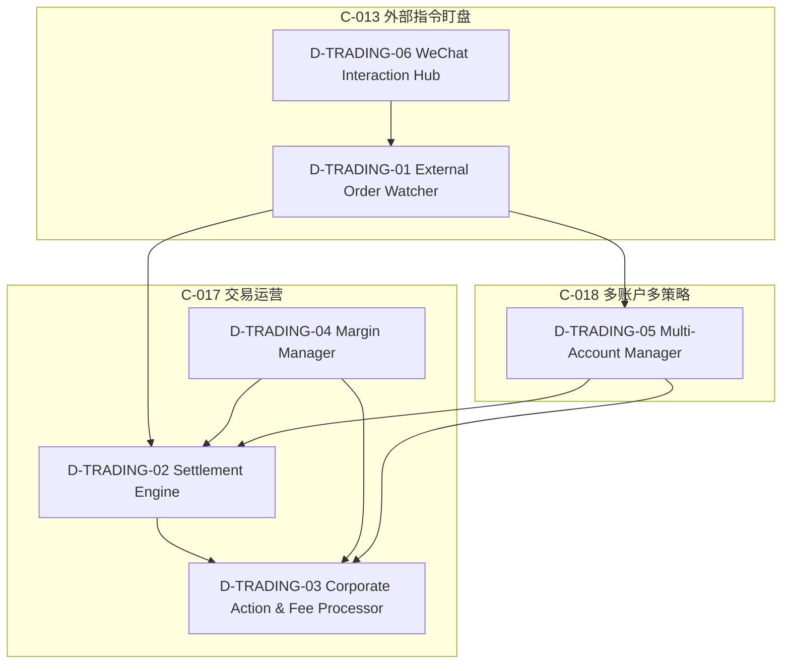
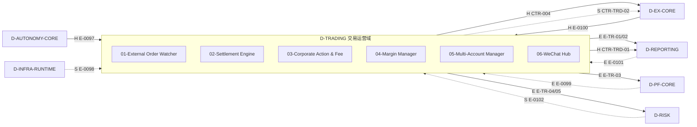
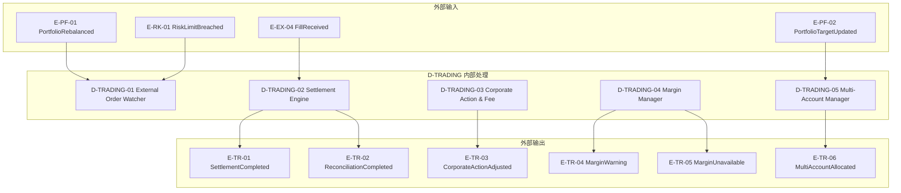

# 18 — D-TRADING 交易运营域

> **状态**: DRAFT | **核心层**: L3策略决策层 + L4风控执行层 + 交易运营 | **成熟度**: ⬜ 未开发 | **简称**: TRD
> **安全等级**: M | **AI自治**: ai_modifiable | **骨架厚度**: 中等(6✅)
> **一句话**: 让交易后流程自动闭环——从外部指令到结算对账的全生命周期运营
>
> **核心职责流**: 外部指令接收(C-013) → 风控检查 → 执行 → 结算对账(C-017②) → 除权除息/费率/公司行为(C-017③④⑤) → 保证金管理(C-017①) → 多账户分仓(C-018) → 微信互动(C-019)

## §0 域定义

| 维度 | 内容 |
|------|------|
| 域ID | D-TRADING |
| 简称 | TRD |
| 核心Aggregate | AGG-TRD-01 TradingOrder / AGG-TRD-02 SettlementRecord / AGG-TRD-03 MarginAccount |
| 核心事件 | E-TR-01 SettlementCompleted / E-TR-02 ReconciliationCompleted / E-TR-03 CorporateActionAdjusted / E-TR-04 MarginWarning / E-TR-05 MarginUnavailable / E-TR-06 MultiAccountAllocated |
| 开发状态 | 未开发 |
| 优先级 | P1（4●+1◐=5能力，负载🟡中） |
| 激活前提 | D-AUTONOMY-CORE就绪 + D-EX-CORE就绪 + D-PF-CORE事件通道就绪 |

## §1 子模块清单

| ID | 名称 | 职责 | 优先级 | 开发状态 | 对标能力 |
|----|------|------|:------:|:--------:|---------|
| D-TRADING-01 | External Order Watcher | C-013●核心：外部指令盯盘/指令解析/目标跟踪/最优建仓点寻找/自动建仓/仓位管理。输入：微信/前端指令；输出：标准交易指令→D-EX-CORE。⚠️与C-004/C-047/C-031交互规则：风控>仓位裁决>置信度分层>执行 | P1 | ❌ | C-013● |
| D-TRADING-02 | Settlement & Reconciliation Engine | C-017●核心子能力②：结算对账。每日15:30后自动对账→系统记录vs券商结算单→差异告警。输入：D-EX-CORE交易记录+券商结算单；输出：E-TR-01/E-TR-02 | P1 | ❌ | C-017●② |
| D-TRADING-03 | Corporate Action & Fee Processor | C-017●核心子能力③④⑤：除权除息处理/费率计算/公司行为监控。除权日自动调整持仓成本+目标价；费率(佣金/印花税/过户费)→向C-010提供PnL数据；公司行为(分红/配股/拆股)→通知用户 | P1 | ❌ | C-017●③④⑤ |
| D-TRADING-04 | Margin Manager | C-017●核心子能力①：保证金管理。融资融券保证金比例监控/预警/追加提醒。⚠️降级可休眠：融资融券API不可用时自动休眠，休眠期间向C-004发送E-TR-05"保证金数据不可用"事件 | P1 | ❌ | C-017●① |
| D-TRADING-05 | Multi-Account Manager | C-018●核心：多账户多策略/按AUM分仓/独立风控/独立PnL/独立报告。⚠️多账户≠多租户SaaS，所有账户属于同一信任域 | P2 | ❌ | C-018● |
| D-TRADING-06 | WeChat Interaction Hub | C-019●核心：微信机器人双向交互/指令路由/自然语言解析/多人通知。与C-013联动——微信是外部指令的主要输入通道 | P2 | ❌ | C-019● |

### C轨层子模块映射

| C轨能力 | 对应D-TRADING子模块 | 说明 |
|---------|---------------------|------|
| C-013 外部指令盯盘 | D-TRADING-01 External Order Watcher + D-TRADING-06 WeChat Interaction Hub | 指令接收+微信通道 |
| C-017 交易运营 | D-TRADING-02 + D-TRADING-03 + D-TRADING-04 | 结算对账+除权费率+保证金 |
| C-018 多账户多策略 | D-TRADING-05 Multi-Account Manager | 多账户分仓与独立核算 |
| C-019 微信多人互动 | D-TRADING-06 WeChat Interaction Hub | 微信双向交互 |
| C-026 执行运营自优化(◐辅助) | D-TRADING-02/03/04 提供运营数据 | TRD是数据提供方，XC是消费方 |

## §2 域内依赖图

### 域内依赖表

| 上游 | 下游 | 依赖内容 |
|------|------|---------|
| D-TRADING-06 | D-TRADING-01 | 微信指令→指令解析 |
| D-TRADING-01 | D-TRADING-05 | 外部指令需按AUM分仓到多账户 |
| D-TRADING-01 | D-TRADING-02 | 交易指令执行后触发结算 |
| D-TRADING-04 | D-TRADING-02 | 保证金数据参与结算对账 |
| D-TRADING-04 | D-TRADING-03 | 保证金费率影响成本计算 |
| D-TRADING-05 | D-TRADING-02 | 多账户独立结算对账 |
| D-TRADING-05 | D-TRADING-03 | 多账户独立费率/除权计算 |

## §3 域间接口

### 3.1 消费依赖

| 消费什么 | 来自哪个域 | 契约/事件 | 类型 | 边ID |
|---------|-----------|---------|:----:|------|
| 自治核心(权限/审计/遥测) | D-AUTONOMY-CORE | CTR-TRACE-001 | H | E-0097 |
| 运行时基础设施 | D-INFRA-RUNTIME | — | S | E-0098 |
| 组合核心事件 | D-PF-CORE | E-PF-01等 | E | E-0099 |
| 执行核心(交易记录/成交回报) | D-EX-CORE | CTR-005/E-EX-04 | H | E-0100 |
| 报告域事件 | D-REPORTING | — | E | E-0101 |
| 风控约束(间接) | D-RISK | CTR-003 | S | E-0102 |

### 3.2 产出依赖

| 产出什么 | 去往哪个域 | 契约/事件 | 类型 |
|---------|-----------|---------|:----:|
| 标准交易指令 | D-EX-CORE | CTR-004 | H |
| 结算完成事件 | D-REPORTING / D-PF-CORE | E-TR-01 | E |
| 对账完成事件 | D-REPORTING / D-AUTONOMY | E-TR-02 | E |
| 除权调整事件 | D-PF-CORE | E-TR-03 | E |
| 保证金预警 | D-AUTONOMY / D-RISK | E-TR-04 | E |
| 保证金数据不可用 | D-RISK(C-004) | E-TR-05 | E |
| 多账户分配结果 | D-REPORTING | E-TR-06 | E |
| 费率/PnL数据 | D-REPORTING(C-010) | CTR-TRD-01 | H |
| 交易运营数据 | D-EX-CORE(C-026) | CTR-TRD-02 | S |

### 3.3 域间依赖图

## §4 域事件流

### 4.1 事件订阅

| 事件ID | 事件名 | 来自域 | 消费子模块 | 处理逻辑 |
|--------|--------|--------|-----------|---------|
| E-EX-04 | FillReceived | D-EX-CORE | D-TRADING-02 | 成交回报→触发结算对账 |
| E-PF-01 | PortfolioRebalanced | D-PF-CORE | D-TRADING-01 | 组合再平衡→更新盯盘目标 |
| E-PF-02 | PortfolioTargetUpdated | D-PF-CORE | D-TRADING-05 | 组合目标变更→多账户重新分配 |
| E-RK-01 | RiskLimitBreached | D-RISK | D-TRADING-01 | 风控限额突破→暂停外部指令执行 |

### 4.2 事件发布

| 事件ID | 事件名 | 触发条件 | 消费者 | 发布子模块 |
|--------|--------|---------|--------|-----------|
| E-TR-01 | SettlementCompleted | 交易结算完成 | D-REPORTING, D-PF-CORE | D-TRADING-02 |
| E-TR-02 | ReconciliationCompleted | 对账完成(含差异) | D-REPORTING, D-AUTONOMY | D-TRADING-02 |
| E-TR-03 | CorporateActionAdjusted | 除权除息/分红/配股调整 | D-PF-CORE | D-TRADING-03 |
| E-TR-04 | MarginWarning | 保证金比例低于预警线 | D-AUTONOMY, D-RISK | D-TRADING-04 |
| E-TR-05 | MarginUnavailable | 保证金API不可用(休眠) | D-RISK(C-004) | D-TRADING-04 |
| E-TR-06 | MultiAccountAllocated | 多账户分仓完成 | D-REPORTING | D-TRADING-05 |

### 4.3 事件流图

### C-013与C-004/C-047/C-031交互规则

| 优先级 | 能力 | 角色 | 说明 |
|:------:|------|------|------|
| 1(最高) | C-004 风控 | 硬阻断 | 风控检查不通过→指令不执行 |
| 2 | C-047 仓位裁决 | 裁决 | 仓位裁决决定实际下单量；C-047未就绪时跳过仓位裁决，按原始目标执行 |
| 3 | C-031 置信度分层 | 分层 | 置信度影响建仓节奏(高置信度→激进建仓/低置信度→分批建仓) |
| 4(最低) | C-013 执行 | 执行 | 通过以上三层后，D-TRADING-01执行建仓/仓位管理 |

**降级策略**: C-047未就绪→跳过仓位裁决，使用原始目标参数执行，日志标记"仓位裁决跳过"

## §5 激活前提

| 前提 | 就绪标准 | 对应边 |
|------|---------|--------|
| D-AUTONOMY-CORE就绪 | CTR-TRACE-001可用，RBAC/审计/遥测可用 | E-0097(H) |
| D-EX-CORE就绪 | CTR-005 Fill + E-EX-04事件可消费 | E-0100(H) |
| D-PF-CORE事件通道就绪 | E-PF-01/E-PF-02事件可消费 | E-0099(E) |
| D-RISK就绪(可选) | CTR-003 RiskLimits可消费 | E-0102(S) |
| D-INFRA-RUNTIME就绪(可选) | 运行时基础设施可用 | E-0098(S) |

### 激活阶段

| 阶段 | 激活内容 | 前提条件 |
|------|---------|---------|
| Phase 1 | D-TRADING-01(外部指令盯盘) + D-TRADING-06(微信互动) | D-AUTONOMY-CORE + D-EX-CORE就绪 |
| Phase 2 | +D-TRADING-02(结算对账) + D-TRADING-03(除权费率) | Phase 1 + D-PF-CORE事件通道 |
| Phase 3 | +D-TRADING-04(保证金管理) + D-TRADING-05(多账户) | Phase 2 + D-RISK可选就绪 |

## §6 设计决策记录

| 日期 | 决策 | 理由 | 对标来源 |
|------|------|------|---------|
| 2026-05-12 | 交易运营域独立于执行域 | 执行管"怎么买"，运营管"买完之后"，职责不同 | 专业机构运营与交易分设 |
| 2026-05-12 | 扩展为6子模块模型——交易运营归入运营域 | 专业机构对标发现交易运营覆盖率仅~30% | 场外讨论草稿v6 |
| 2026-05-12 | 保证金管理归本域 | 保证金是交易后运营核心 | SPAN保证金体系 |
| 2026-05-12 | C-013交互规则：风控>仓位裁决>置信度分层>执行 | 风控是硬约束，仓位裁决是软约束，置信度影响节奏 | 能力定位书§9 C-013 |
| 2026-05-12 | C-047未就绪时跳过仓位裁决 | 降级可用——仓位裁决是增强而非前置 | 能力定位书§9 C-013降级策略 |
| 2026-05-12 | 保证金管理降级可休眠 | 融资融券API不可用时不应阻塞其他运营功能 | 能力定位书§9 C-017① |
| 2026-05-12 | 多账户≠多租户SaaS | 所有账户属于同一信任域，无需租户隔离 | 能力定位书§9 C-018 |
| 2026-05-12 | 微信是外部指令主要输入通道 | C-019与C-013联动，微信→指令解析→盯盘 | 能力定位书§9 C-019 |
| 2026-05-12 | TRD为C-026提供交易运营数据 | TRD是数据提供方(费率/结算/保证金)，XC是消费方 | 能力定位书§9 C-026◐ |
| 2026-05-12 | 结算对账每日15:30自动触发 | A股T+1结算规则，盘后对账是标准运营流程 | A股结算规则 |
| 2026-05-12 | 除权日自动调整持仓成本+目标价 | 除权除息影响持仓成本，必须自动调整 | A股除权除息规则 |
| 2026-05-12 | 费率计算向C-010提供PnL数据 | 佣金/印花税/过户费是PnL的必要组成部分 | 交易成本核算 |

## §7 风险架构(A4)交叉内容

> 以下内容源自风险架构(A4)文档§1.3"流动性风险"。对齐能力定位书§2-d约束十。

### §1.3 流动性风险

> 因市场流动性不足导致无法以合理价格/时间完成交易的风险。对齐能力定位书§2-d约束十。补充 Amihud ILLIQ / Kyle's Lambda / Roll's Spread / Pastor-Stambaugh 四维学术度量体系。

| 子类 | 识别方法 | 度量方法 | 处置机制 | 否决阈值 |
|------|---------|---------|---------|---------|
| 市场深度风险 | 实时买卖盘深度+成交量 | Amihud非流动性指标+Kyle's Lambda | 参与率约束+降仓位 | 参与率>15%日成交量→否决 |
| 冲击成本风险 | Almgren-Chriss模型+历史冲击 | 预期冲击成本+LVaR | 订单拆分+时间加权 | 冲击成本>0.5%→否决单笔大额 |
| 退出时间风险 | 退出时间估算模型 | 退出时间(天)+流动性评分 | 超1天→降仓位 | 退出时间>3天→强制减仓至可退出 |
| 流动性螺旋风险 | 资金流动性vs市场流动性交互监控 | 追加保证金触发概率+强制卖出冲击 | 禁止追跌卖出+降杠杆 | 保证金覆盖率<120%→强制降杠杆 |
| 策略容量风险 | 策略可管理最大AUM(不超过市场冲击成本容忍度)；容量超限→Sharpe衰减非线性+冲击成本指数增长+策略失效 | 策略容量估算=f(ADV,参与率上限,换手率,冲击成本容忍度)；Grinold & Kahn容量公式；当前实现为架构预留 | 容量预警线=估算容量×80%→预警；AUM超容量→否决新资金接入 | AUM>估算容量×80%→预警+AUM>估算容量→否决新资金接入 |

**流动性四维学术度量**（对齐 Ryan O'Connell CFA/FRM 2026 + 学术前沿）：

| 度量指标 | 公式/定义 | 捕捉维度 | 适用场景 |
|---------|----------|---------|---------|
| Amihud ILLIQ | (1/D)×Σ(\|r_d\|/V_d) | 价格冲击：单位成交量引起的价格变动 | 日频流动性评分+跨资产比较 |
| Kyle's Lambda | Δp = λ×order_flow 的回归系数λ | 永久价格冲击：单位订单流的价格影响 | 评估大额交易冲击+市场微观结构 |
| Roll's Spread Estimator | Spread = 2×√(-cov(r_t, r_{t-1})) | 隐含买卖价差(无需实际报价数据) | 日频数据估算流动性(债券/非标资产) |
| Pastor-Stambaugh | 高成交量日后收益反转的回归系数 | 系统性流动性风险因子 | 评估市场整体流动性状态 |

**Almgren-Chriss最优执行框架参数**：

| 参数 | 定义 | 本系统默认值 | 说明 |
|------|------|------------|------|
| 临时冲击η | 交易速率的线性冲击系数 | 由历史冲击回归估计 | 交易越快冲击越大 |
| 永久冲击γ | 累积成交量的线性冲击系数 | 由历史冲击回归估计 | 信息含量导致永久价格变动 |
| 风险厌恶λ | E[cost]+λ×Var[cost]中的风险厌恶系数 | 由Trader设定 | λ=0→TWAP; λ→∞→前端加载 |
| 参与率上限 | 单笔订单占ADV的比例 | ≤15% | 超过则否决+拆分 |

**日内时变参与率**（对齐 Almgren-Chriss时变解 + A股日内成交量U型分布实证）：

> 固定参与率(当前15%日成交量)未考虑A股日内成交量的U型分布——开盘30min+收盘30min占日成交量约45%，午间成交量枯竭。同样15%参与率在午间低谷期实际冲击成本为平均值的2-3倍。时变参与率可降低执行成本15-25%。

| 时段 | 成交量占比 | 建议参与率上限 | 冲击成本倍数 |
|------|-----------|--------------|------------|
| 开盘(9:30-10:00) | ~20% | 15% | 0.8x |
| 上午(10:00-11:30) | ~25% | 10% | 1.2x |
| 午盘(13:00-14:00) | ~10% | 5% | 2.5x |
| 尾盘(14:00-15:00) | ~45% | 15% | 0.7x |

**当前状态**：✅能建——Almgren-Chriss框架本身支持时变执行速率，D-RISK-08流动性风险监控器可扩展时段维度参数。

**流动性降级模式**（对齐能力定位书§2-d约束十）：

| 流动性等级 | 条件 | VaR处理 | 溢价 |
|-----------|------|---------|------|
| 正常 | 退出时间≤1天 | 标准LVaR | 0% |
| 降级 | 退出时间1-3天 | VaR+0.5%溢价 | +0.5% |
| 极端 | 退出时间>3天 | 退化为标准VaR+1%溢价+强制减仓 | +1.0% |

**流动性调整VaR(LVaR)公式**（对齐 Ryan O'Connell CFA/FRM 2026 + MetricGate 2025 + 2026商品期货流动性研究）：

| 模型 | 公式 | 适用场景 | 参数说明 |
|------|------|---------|---------|
| LVaR(价差模型) | LVaR = VaR + ½ × S × W | 正常市场+小仓位 | S=买卖价差(%), W=仓位价值 |
| LVaR(Amihud冲击模型) | LVaR = VaR + ILLIQ × (Q/V)^α | 大仓位+非标资产 | ILLIQ=Amihud比率, Q=交易量, V=日均成交量, α≈0.5 |
| LVaR(EVT尾部模型) | LVaR = VaR + EVT_尾部流动性溢价 | 极端行情+流动性枯竭 | EVT拟合流动性指标尾部分布→尾部风险溢价 |
| CoVaR跨市场传染 | CoVaR^(j\|i) = 条件VaR(给定i机构压力) | 系统性流动性风险 | 评估单一机构压力对其他机构的流动性传染 |

**流动性螺旋(Liquidity Spiral)模型**（对齐 LTCM 1998 / 2008 GFC / Ryan O'Connell 2026）：

> 流动性螺旋是资金流动性风险与市场流动性风险的正反馈环路：保证金追缴→强制卖出→价格下跌→保证金追缴→……。传统VaR假设"冻结组合+中间价标记"，无法捕捉此动态。

| 螺旋阶段 | 信号 | 系统响应 | 硬约束 |
|---------|------|---------|--------|
| 阶段1:价差异常 | 买卖价差扩大>2倍+成交量萎缩>30% | 参与率收紧至5%+暂停做T | 不可追跌卖出 |
| 阶段2:强制卖出 | 两融余额单日降>10%+融资保证金上调 | 降杠杆敞口+暂停融资标的 | 保证金覆盖率<120%→强制降杠杆 |
| 阶段3:流动性冻结 | 成交量<日均10%+买卖价差>10倍 | Kill Switch(P0) | 全系统暂停 |

---

## §7 合规约束(A6)

> 源自合规架构(A6)§12操作合规+§3.3监管报送。以下合规约束由D-TRADING交易运营域执行，A6门禁未激活期间由A4风险架构代管。

### §7.1 A股交易纪律合规检查（源自A6§12.2）

> 对标A股交易纪律四项必做+四项严禁。本模块实现交易纪律的自动化检测与违规告警，不替代人类纪律意识——纪律检查是辅助工具，最终纪律责任归人类交易者。交易运营域是纪律检查的执行层——盘前SOP/盘中监控/盘后复盘/保证金管理均由本域落地。

#### §7.1.1 四项必做清单自动化检测（源自A6§12.2.1）

| 必做项 | 检测内容 | 检测方式 | 违规动作 | D-TRADING执行方式 |
|--------|---------|---------|---------|------------------|
| 盘前复核 | 08:00前完成：前日复盘摘要+今日计划+风险检查清单 | 工作流完成度检测+超时告警 | Warning:未完成→推送提醒 | D-TRADING-01外部指令盯盘→盘前SOP工作流检测 |
| 盘中执行 | 策略信号合规检查+风控参数确认+仓位限额验证 | C-004实时检查（已有） | Hard Block | D-TRADING-01→C-004风控检查→合规通过后执行 |
| 盘后复盘 | 当日交易决策回顾+偏差分析+纪律检查自评 | 复盘报告生成检测 | Warning:未完成→次日开盘前推送 | D-TRADING-02结算对账→盘后复盘报告生成检测 |
| 晚间分析 | 市场收盘数据+明日策略准备+风险预判 | 分析任务提交检测 | Warning:未完成→次日盘前推送 | D-TRADING-03除权费率→晚间分析任务提交检测 |

#### §7.1.2 四项严禁自动化检测（源自A6§12.2.2）

| 严禁项 | 检测指标 | 检测方式 | 违规动作 | D-TRADING执行方式 |
|--------|---------|---------|---------|------------------|
| 踏空追高 | 价格追涨幅度超阈值+买入时间在价格急剧拉升后 | C-004价格偏离度检测 | Hard Block:拒绝追高买入 | D-TRADING-01→C-004 Hard Block拦截 |
| 被套补仓 | 持仓亏损>X%后继续加仓同一标的（X由合规官设定，建议-5%） | C-004持仓亏损+同标的加仓检测 | Hard Block:拒绝补仓 | D-TRADING-01→C-004 Hard Block拦截 |
| 盈利骄傲 | 连续盈利N笔后单笔风险敞口超常规水平 | C-004风险敞口变化率检测 | Warning:超标→推送提醒 | D-TRADING-01→C-004 Warning推送 |
| 亏损报复 | 当日亏损>Y%后交易频率/单笔规模异常增加（Y由合规官设定，建议-2%） | C-004交易行为异常检测 | Hard Block:触发强制停盘(Kill Switch轻量版，仅限制该策略) | D-TRADING-01→C-004→D-RISK Kill Switch轻量版 |

> 场外草稿参考: D-COMPLIANCE-23 A-Share Trading Discipline Checker（❌未开发）

### §7.2 礼品与招待追踪（源自A6§12.3）

> 对标FCPA反海外腐败法、UK Bribery Act、公司礼品政策。交易运营域负责礼品与招待的记录管理。

| 功能 | 说明 | 当前状态 | 门禁条件 | D-TRADING执行方式 |
|------|------|---------|---------|------------------|
| 申报表引擎 | 标准化礼品/招待申报表单 | ❌不能建 | GATE-001（单人使用无申报对象） | GATE-001后由D-TRADING-06微信互动Hub扩展申报表单 |
| 审批流 | 超阈值礼品须合规官审批 | ❌不能建 | GATE-001 | GATE-001后由D-AUTONOMY审批流程引擎支持 |
| 阈值告警 | 金额/频率超阈值自动告警 | ❌不能建 | GATE-001 | GATE-001后由D-TRADING-02结算对账引擎扩展阈值检测 |
| 年度统计 | 年度礼品汇总报表 | ❌不能建 | GATE-001 | GATE-001后由D-REPORTING报告域支持 |

> 场外草稿参考: D-COMPLIANCE-09 Gift & Entertainment Tracker（❌未开发）

### §7.3 监管报送——交易运营视角（源自A6§3.3）

> 交易运营域在监管报送中的职责：保证金管理数据+结算对账数据。报送类型由合规架构定义，本域提供数据供给。

| 报送类型 | D-TRADING供给内容 | 当前方式 | 门禁后方式 | D-TRADING子模块 |
|---------|------------------|---------|-----------|----------------|
| 程序化交易报告 | 交易运营数据(保证金/结算/费率) | ✅手动填报 | ❌自动化接口(GATE-002或GATE-003) | D-TRADING-04保证金→D-TRADING-02结算对账 |
| 异常交易自报 | 保证金异常/结算差异事件 | ✅手动填报 | ❌自动化接口(GATE-002或GATE-003) | E-TR-04 MarginWarning / E-TR-05 MarginUnavailable |
| 持仓报告 | 保证金覆盖率/融资融券数据 | ✅手动填报 | ❌自动化接口(GATE-002或GATE-003) | D-TRADING-04保证金管理器 |
| 绩效报告 | 费率/PnL数据(佣金/印花税/过户费) | ✅手动填报 | ❌自动化接口(GATE-002或GATE-003) | D-TRADING-03费率计算→CTR-TRD-01 |

> DORA(ICT事件报告)要求：重大ICT事件4小时内初始通知→72小时中间报告→1个月最终报告。GATE-006激活后适用，当前由A9运维架构的事件响应流程代管。

### 与现有内容重叠检查

| 本域已有内容 | 新搬入内容 | 重叠处理 |
|------------|-----------|---------|
| §7风险架构(A4)流动性螺旋 | §7.1四项严禁(亏损报复→Kill Switch) | ⚠️部分重叠：流动性螺旋§7阶段2"强制卖出"与亏损报复Kill Switch有交叉，但视角不同——A4关注市场流动性风险，A6关注交易纪律合规 |
| D-TRADING-04保证金管理器 | §7.3监管报送(保证金视角) | ✅一致，§7.3为D-TRADING-04增加监管报送数据供给职责 |
| D-TRADING-02结算对账 | §7.3监管报送(结算对账视角) | ✅一致，§7.3为D-TRADING-02增加监管报送数据供给职责 |

## §8 安全架构约束（源自A5安全架构）

> 来源：A5安全架构 §1.1 交易域

### §8.1 域边界定义

> 来源：A5安全架构 §1.1

覆盖 D-EX-CORE（执行核心）、D-EX-SOR（执行路由）、D-TRADING（交易运营）、D-POSITION（仓位管理）。交易域是整个系统信任等级最高的域，包含所有与交易执行直接相关的组件。

**为什么交易域需要最高安全等级**：交易指令一旦被篡改或泄露，直接导致资金损失。在A股T+1制度下，错误交易无法当日撤回，安全漏洞的财务影响是不可逆的。

### §8.2 资产分类与信任等级

> 来源：A5安全架构 §1.1

| 资产类型 | 信任等级 | 分类 | 示例 |
|---------|---------|------|------|
| 交易指令 | 绝密（L3） | 核心资产 | 买入/卖出指令、指令价格/数量 |
| 策略参数 | 绝密（L3） | 核心资产 | 策略权重、信号阈值、调仓频率 |
| 持仓数据 | 机密（L2） | 敏感资产 | 当前持仓、持仓成本、盈亏 |
| 订单状态 | 机密（L2） | 敏感资产 | 已报/已成/已撤状态 |
| 行情数据 | 内部（L1） | 业务资产 | 实时行情、历史行情 |
| 交易日志 | 机密（L2） | 敏感资产 | 成交记录、委托记录 |

### §8.3 数据流入规则

> 来源：A5安全架构 §1.1

| 来源域 | 允许流入的数据 | 安全检查点 |
|--------|--------------|-----------|
| 数据域 | 行情数据、因子值、信号 | 数据签名验证+时间戳校验 |
| 治理域 | 审批通过的策略参数 | 审批令牌验证+策略签名 |
| 运维域 | 系统配置、密钥 | 配置签名验证+密钥加密传输 |

### §8.4 数据流出规则

> 来源：A5安全架构 §1.1

| 目标域 | 允许流出的数据 | 安全检查点 |
|--------|--------------|-----------|
| 数据域 | 交易结果数据（脱敏后） | 数据降级处理+脱敏 |
| 治理域 | 交易审批请求 | 最小信息量原则 |
| 运维域 | 审计日志（仅追加） | 日志签名+哈希链 |
| 外部（合规报告） | 交易报告（监管要求） | 预定义格式+审批 |

### §8.5 安全控制要求

> 来源：A5安全架构 §1.1

- 交易指令生成到提交的完整链路必须有签名链，任何环节篡改可追溯
- miniQMT连接凭证仅在交易域进程内可见，禁止跨域传递
- 交易域进程与其他域进程通过进程级隔离（Windows Job Object + 受限令牌）隔离
- 所有交易指令在提交前必须经过确定性校验（价格合理性、数量合规性、风控检查）
