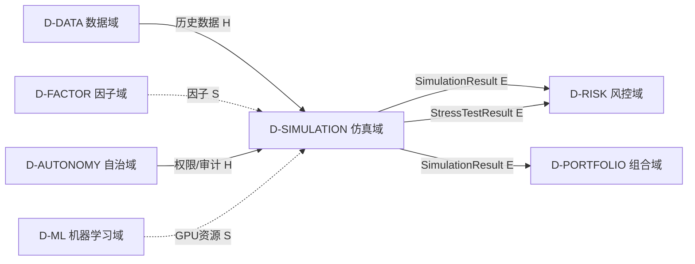
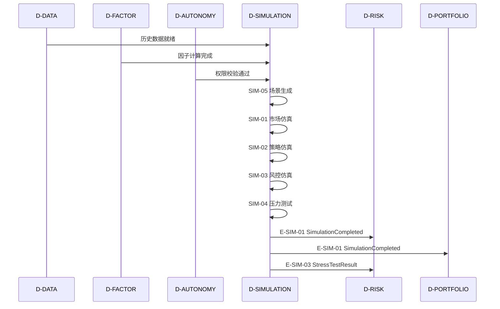

# 19 — D-SIMULATION 仿真域

> **状态**: DRAFT | **核心层**: 技术驱动层 | **成熟度**: L0 ⚪ 未启动
> **一句话**: 如果怎样——市场仿真、策略仿真、风控仿真

## §0 域定义

| 维度 | 内容 |
|------|------|
| 域ID | D-SIMULATION |
| 域名 | 仿真域 |
| 职责 | 市场仿真、策略仿真、风控仿真 |
| 核心层 | 技术驱动层 |
| 优先级 | P1 |
| 核心Aggregate | SimulationScenario |
| 核心事件 | E-SIM-01 SimulationCompleted / E-SIM-02 ScenarioGenerated / E-SIM-03 StressTestResult |
| 开发状态 | 未启动——D-RISK-05压力测试部分已有 |
| 激活前提 | D-DATA就绪 + D-FACTOR部分就绪 + D-AUTONOMY就绪 |

### 与回测的区别

| 概念 | 回测 | 仿真 |
|------|------|------|
| 问题 | 过去怎样 | 如果怎样 |
| 数据 | 历史数据 | 生成数据+历史数据 |
| 方法 | 重放 | What-if分析 |
| 归属 | D-FACTOR/D-SIGNAL | D-SIMULATION |

## §0.1 能力对齐（Step 1: 子模块←→能力定位对齐）

> 来源：能力定位书§9 | 8项能力(3●核心+5◐辅助)，负载等级"高"

| 能力ID | 名称 | 优先级 | 角色 | 覆盖子模块 | 覆盖评估 |
|--------|------|:------:|:----:|-----------|:--------:|
| C-003 | 自动回测与仿真 | P0 | ●核心 | SIM-01+SIM-02+SIM-07+SIM-34+SIM-35+SIM-37+SIM-40+SIM-41+SIM-42 | ✅充分 |
| C-006 | 策略工厂 | P0 | ◐辅助 | SIM-02+SIM-26+SIM-37+SIM-54 | ✅充分 |
| C-007 | AI自治进化与闭环优化 | P0 | ◐辅助 | SIM-02+SIM-12+SIM-27 | ✅充分 |
| C-025 | 质量保障自驱动 | P1 | ●核心 | SIM-33+SIM-56+SIM-68 | ✅充分 |
| C-027 | 因子工厂 | P0 | ◐辅助 | SIM-18+SIM-19+SIM-21+SIM-22+SIM-32 | ✅充分 |
| C-028 | 信号工厂 | P0 | ◐辅助 | SIM-02+SIM-20 | ✅充分 |
| C-033 | 过拟合系统性防护 | P1 | ●核心 | SIM-18+SIM-22+SIM-38+SIM-56 | ✅充分 |
| C-040 | 系统性压力测试 | P1 | ◐辅助 | SIM-04+SIM-10 | ✅充分 |

**§9.4架构观察**："仿真域是验证中枢——几乎所有'验证'类能力都依赖SIM，它是系统的'质检车间'。"

### 冗余子模块合并

| 保留ID | 保留名称 | 合并来源(重复ID) | 合并理由 |
|--------|---------|-----------------|---------|
| SIM-18 | 回测过拟合检测器 | SIM-46, SIM-56 | 三者均为"过拟合检测"，合并为分层：SIM-18=研究时手动检测，SIM-56=上线前自动门禁 |
| SIM-49 | 回测缓存管理器 | SIM-60 | 完全重复 |
| SIM-51 | 回测数据质量检查器 | SIM-62 | 完全重复 |
| SIM-54 | 回测结果一键部署 | SIM-65 | 完全重复 |
| SIM-55 | 指标计算NaN处理器 | SIM-66 | 完全重复 |
| SIM-45 | 回测结果统计显著性检验 | SIM-50(部分) | SIM-50合并入SIM-45 |

## §1 子模块清单

| ID | 名称 | 职责 | 优先级 | 开发状态 | 对标依据 |
|----|------|------|:------:|:--------:|---------|
| D-SIMULATION-01 | Market Simulator | 市场仿真器+订单簿仿真+价格生成+微观结构模拟 | P0 | ❌ | ABIDES/Midway |
| D-SIMULATION-02 | Strategy Simulator | 策略仿真器+策略沙箱+信号模拟+组合模拟 | P0 | ❌ | 专业标配 |
| D-SIMULATION-03 | Risk Simulator | 风控仿真器+VaR模拟+回撤模拟+熔断模拟 | P1 | ❌ | 与D-RISK联动 |
| D-SIMULATION-04 | Stress Test Engine | 压力测试引擎+极端场景+历史重放 | P1 | ✅ 部分在D-RISK-05 | 从D-RISK-05拆出 |
| D-SIMULATION-05 | Scenario Generator | 场景生成器+蒙特卡洛+历史场景+自定义场景 | P1 | ❌ | Monte Carlo |
| D-SIMULATION-06 | Monte Carlo Engine | 蒙特卡洛模拟+GPU加速+百万路径 | P1 | ❌ | CuPy/PyTorch |
| D-SIMULATION-07 | History Replay Engine | 历史重放引擎+逐Tick回放+时间压缩 | P1 | ❌ | 专业标配 |
| D-SIMULATION-08 | Counterparty Simulator | 对手仿真+做市商行为+流动性模拟 | P2 | ❌ | Agent-Based Model |
| D-SIMULATION-09 | Liquidity Simulator | 流动性仿真+成交量模拟+冲击成本模拟 | P2 | ❌ | Almgren-Chriss |
| D-SIMULATION-10 | Extreme Event Simulator | 极端事件仿真+黑天鹅+闪崩+熔断 | P2 | ❌ | 尾部风险 |
| D-SIMULATION-11 | Agent-Based Market Model | 基于Agent的市场模型+多Agent交互+涌现行为 | P3 | ❌ | ABIDES |
| D-SIMULATION-12 | Simulation Result Analyzer | 仿真结果分析+统计检验+可视化 | P1 | ❌ | 与D-FRONTEND联动 |
| D-SIMULATION-13 | Dependency Graph Digital Twin | 依赖图数字孪生+what-if仿真+批量/流式/实时三种模式+依赖拓扑实时映射 | P2 | ❌ | arXiv 2510.08164 / IEEE SWC 2026 |
| D-SIMULATION-14 | Real-time DT Synchronizer | 实时数字孪生同步器+依赖图实时同步+预测仿真+what-if推演+变更预演 | P2 | ❌ | arXiv 2510.08164 / IEEE SWC 2026 |
| D-SIMULATION-15 | Chaos Experiment Auto-Generator | 混沌实验自动生成+依赖图→自动生成混沌实验+关键路径故障+高风险节点故障+级联故障+最小爆破半径计算 | P2 | ❌ | arXiv 2506.11176 / Chaos Mesh / LitmusChaos |
| D-SIMULATION-16 | ADR Decision Simulator | ADR决策仿真器+ADR决策→依赖图变更仿真+决策影响量化+多方案对比+决策回滚仿真 | P2 | ❌ | AWS ADR 2026 / 华为云架构守护者 |
| D-SIMULATION-17 | Dependency Graph Real-time Twin Engine | 依赖图实时孪生引擎+依赖图实时同步+预测仿真+变更预演+实时异常检测+双向数据交换 | P2 | ❌ | arXiv 2510.08164 / IEEE SWC 2026 |
| D87 | Test Impact Analyzer | 测试影响分析器 | P1 | ❌ | Google Eng Practices 2025 |
| D41 | 管线DAG调度器 | CI/CD管线建模为DAG关键路径调度比FIFO减少41%端到端时间 | P2 | ❌ | ESEC/FSE 2024 |
| D46 | 架构反模式拓扑检测器 | 12种架构反模式各有特定拓扑特征 | P2 | ❌ | WICSA 2025 |
| D79 | 审批门依赖提取器 | 审批门建模为依赖图有向边(approval edge)mandatory/blocking vs advisory/non-blocking | P2 | ❌ | ACM FSE 2025 |
| D85 | DANTE依赖感知测试生成器 | 沿依赖边生成集成测试+hub节点stress test+长链路E2E测试数量减40%缺陷检测升23% | P2 | ❌ | ISSTA 2025 DANTE |
| NEW-M33-N01 | Mutation Score Dependency Gate | 变异评分依赖门禁：依赖变更必须通过变异测试 | P2 | ❌ | ASE 2025 Mutation Testing |
| NEW-M33-N02 | Performance Regression Dependency Gate | 性能回归依赖门禁：依赖升级必须通过性能基准 | P2 | ❌ | pytest-benchmark/Google Benchmark |
| M40-S01 | 能耗采集器 | 采集依赖计算资源能耗数据 | P2 | ❌ | Scaphandre/Kepler |
| M40-S02 | 碳强度查询器 | 查询电网碳强度数据 | P2 | ❌ | WattTime/Electricity Maps |
| M40-S03 | SCI计算器 | 计算软件碳强度SCI=((E×I)+M)/R | P2 | ❌ | ISO/IEC 21031:2024 |
| D-SIMULATION-18 | Backtest Overfitting Detector | 回测过拟合检测器：多重检验校正+组合对称性检验+样本外衰减检测+参数稳定性检验+过拟合评分。理论：多重检验理论/组合对称性/过拟合检测。具备过拟合检测审计/校正方法记录/检测结果合规检查 | P1 | ❌ | 多重检验理论/组合对称性/过拟合检测; 贝叶斯过拟合检测/在线过拟合监控/自适应校正; Harvey多重检验框架; 过拟合检测审计/校正方法记录/检测结果合规 |
| D-SIMULATION-19 | Walk-Forward Analyzer | Walk-Forward分析器：滚动窗口回测+样本外验证+参数稳定性分析+策略鲁棒性评估+WF报告。理论：Walk-Forward/滚动窗口/样本外验证。具备WF审计/参数稳定性报告/WF合规检查 | P1 | ❌ | Walk-Forward/滚动窗口/样本外验证; 自适应WF/在线WF/多路径WF; 滚动窗口回测; WF审计/参数稳定性报告/WF合规 |
| D-SIMULATION-20 | Event-Driven Backtester | 事件驱动回测器：事件注入+事件窗口分析+事件影响评估+事件策略回测+事件报告。理论：事件驱动/事件研究/异常收益。具备事件回测审计/事件假设记录/事件策略合规检查 | P1 | ❌ | 事件驱动/事件研究/异常收益; AI事件检测/实时事件回测/多事件叠加分析; 事件研究法/CAR分析; 事件回测审计/事件假设记录/事件策略合规 |
| D-SIMULATION-21 | Parameter Robustness Tester | 参数鲁棒性测试器：寻找参数稳定区间而非最优值+输出参数敏感性曲线+参数扰动测试+参数稳定区间标注+过拟合风险评估。理论：鲁棒优化/敏感性分析/过拟合检测。具备鲁棒性测试审计/参数稳定性合规检查 | P1 | ❌ | 参数鲁棒性/敏感性曲线/稳定区间/过拟合风险; 贝叶斯优化/多目标鲁棒/自适应参数搜索; 鲁棒性测试审计/参数稳定性合规 |
| D-SIMULATION-22 | Look-Ahead Bias Detector | 未来函数风险检测器：检测回测look-ahead bias+确保所有判断仅基于当时已知数据+未来数据泄露扫描+时间点数据可用性验证+偏差严重度评估。理论：回测方法论/数据泄露/时间序列。具备未来函数检测审计/回测方法合规检查 | P1 | ❌ | 未来函数/look-ahead bias/数据泄露/时间点验证; 静态分析/动态检测/自动偏差扫描; 未来函数检测审计/回测方法合规 |
| D-SIMULATION-23 | Sharpe Calculator Fixer | Sharpe计算修正器：无风险利率用中国10年期国债/样本量<60不计算/非正态用Sortino/DSR/滚动rolling Sharpe/年化按频率自动选择+empyrical集成。理论：Sharpe/Sortino/DSR。具备Sharpe计算审计/风险指标合规检查 | P1 | ❌ | Sharpe/Sortino/DSR; empyrical; Sharpe计算审计/风险指标合规 |
| D-SIMULATION-24 | Deflated Sharpe Ratio Calculator | Deflated Sharpe Ratio计算器：DSR自建~100行+多重测试偏差修正+试次数调整+DSR阈值+DSR趋势追踪。理论：DSR/多重测试/偏差修正。具备DSR审计/多重测试合规检查 | P1 | ❌ | DSR/多重测试/偏差修正; DSR审计/多重测试合规 |
| D-SIMULATION-25 | Walk-Forward Optimization Engine | Walk-Forward优化引擎：WFO自建~300行+Qlib简化版+完整版+参数网格搜索+交叉验证+过拟合检测。理论：WFO/参数优化/过拟合检测。具备WFO审计/参数优化合规检查 | P1 | ❌ | WFO/参数优化/过拟合检测; Qlib; WFO审计/参数优化合规 |
| D-SIMULATION-26 | Auto Backtest Scheduler | 自动回测调度器：自建~200行+参数网格批量回测+vectorbt向量化+回测队列管理+回测结果聚合+回测性能监控。理论：自动回测/批量/向量化。具备回测调度审计/回测结果合规检查 | P1 | ❌ | 自动回测/批量/向量化; vectorbt; 回测调度审计/回测结果合规 |
| D-SIMULATION-27 | Strategy Decay Monitor Alerter | 策略衰减监控告警器：自建~150行+策略性能衰减检测+衰减趋势分析+衰减告警+衰减自动处置建议。理论：衰减监控/趋势分析/告警。具备衰减监控审计/策略衰减合规检查 | P1 | ❌ | 衰减监控/趋势分析/告警; 衰减监控审计/策略衰减合规 |
| D-SIMULATION-28 | empyrical Integrator | empyrical集成器：Zipline生态最轻量+Sharpe/Sortino/Calmar/rolling指标计算+empyrical API封装+empyrical版本管理。理论：empyrical/Zipline/风险指标。具备empyrical集成审计/风险指标计算合规检查 | P1 | ❌ | empyrical集成/Zipline/Sharpe Sortino Calmar; empyrical/Zipline/风险指标; 自适应指标选择/在线指标计算/empyrical版本管理; empyrical集成审计/风险指标计算合规 |
| D-SIMULATION-29 | quantstats Integrator | quantstats集成器：Smart Sharpe非正态调整+quantstats API封装+quantstats报告生成+quantstats版本管理。理论：quantstats/Smart Sharpe/非正态。具备quantstats集成审计/非正态调整合规检查 | P2 | ❌ | quantstats集成/Smart Sharpe/非正态; quantstats/Smart Sharpe/非正态; 自适应Sharpe调整/在线非正态检测/quantstats版本管理; quantstats集成审计/非正态调整合规 |
| D-SIMULATION-30 | vectorbt Vectorized Backtest Integrator | vectorbt向量化回测集成器：参数网格批量回测+向量化极快+vectorbt API封装+vectorbt结果格式化+vectorbt版本管理。理论：vectorbt/向量化/批量回测。具备vectorbt集成审计/向量化回复合规检查 | P2 | ❌ | vectorbt集成/向量化回测/参数网格; vectorbt/向量化/批量回测; 自适应向量化/在线回测性能/vectorbt版本管理; vectorbt集成审计/向量化回复合规 |
| D-SIMULATION-31 | Qlib Walk-Forward Simplified Version Integrator | Qlib Walk-Forward简化版集成器：Qlib有简化版WFO可作为基础再自建完整版+Qlib API封装+Qlib WFO结果格式化+Qlib版本管理。理论：Qlib/WFO/简化版。具备Qlib集成审计/WFO简化版合规检查 | P2 | ❌ | Qlib WFO集成/简化版/完整版; Qlib/WFO/简化版; 自适应WFO/在线WFO性能/Qlib版本管理; Qlib集成审计/WFO简化版合规 |
| D-SIMULATION-32 | Parameter Sensitivity Analyzer | 参数灵敏度分析器：Renaissance 10万+参数组合并行回测的核心+参数网格/灵敏度评分/参数稳定性报告+参数相关性分析。理论：参数灵敏度/网格/稳定性。具备灵敏度审计/参数灵敏度合规检查 | P1 | ❌ | 参数灵敏度/10万+参数组合/稳定性报告; 参数灵敏度/网格/稳定性; 自适应参数网格/在线灵敏度监控/参数相关性; 灵敏度审计/参数灵敏度合规 |
| D-SIMULATION-33 | Validation Automation Pipeline | 验证自动化流水线：Two Sigma 7层验证全自动的核心+验证步骤编排/验证结果收集/验证报告生成+验证失败处置。理论：验证自动化/步骤编排/报告。具备验证流水线审计/验证自动化合规检查 | P1 | ❌ | 验证自动化流水线/7层验证/步骤编排; 验证自动化/步骤编排/报告; 自适应验证步骤/在线验证监控/验证失败处置; 验证流水线审计/验证自动化合规 |
| D-SIMULATION-34 | Order Matching Engine | 订单撮合引擎：真实市场模拟+订单撮合+撮合规则+滑点模拟。理论：订单撮合/市场微观结构/滑点模型。具备撮合引擎审计/撮合规则合规检查 | P0 | ❌ | 订单撮合引擎/真实市场模拟/撮合规则; 滑点模拟/市场微观结构; 撮合引擎审计/撮合规则合规 |
| D-SIMULATION-35 | Simulation Profitability Evaluator | 模拟盘盈利评估器：模拟盘稳定盈利评估+收益曲线分析+回撤分析+盈亏比分析。理论：盈利评估/收益曲线/回撤分析。具备盈利评估审计/模拟盘盈利合规检查 | P1 | ❌ | 模拟盘盈利评估/收益曲线/回撤分析/盈亏比; 盈利评估审计/模拟盘盈利合规 |
| D-SIMULATION-36 | NozyIO Backtest Visual Reporter | NozyIO回测可视化报告器：完整回测+可视化报告+高性能回测引擎+多种回测参数配置。理论：回测可视化/报告生成/参数配置。具备回测报告审计/可视化报告合规检查 | P1 | ❌ | NozyIO回测可视化/完整回测/高性能回测引擎; 回测参数配置/可视化报告; 回测报告审计/可视化报告合规 |
| D-SIMULATION-37 | Backtest Pipeline Orchestrator | 回测流水线编排器：backtest_pipeline 7步骤编排+参数验证+数据准备+逐日回测+绩效计算+报告生成+过拟合检验。理论：流水线编排/步骤编排/过拟合检验。具备流水线审计/回测流水线合规检查 | P1 | ❌ | 回测流水线编排/backtest_pipeline/7步骤; 参数验证/数据准备/逐日回测/绩效计算; 流水线审计/回测流水线合规 |
| D-SIMULATION-38 | Overfitting Detector | 过拟合检验器：过拟合检验+样本内vs样本外对比+交叉验证+多重比较偏差校正。理论：过拟合检验/交叉验证/多重比较。具备过拟合检验审计/过拟合检验合规检查 | P1 | ❌ | 过拟合检验/样本内vs样本外/交叉验证; 多重比较偏差校正; 过拟合检验审计/过拟合检验合规 |
| D-SIMULATION-39 | Technical Analysis Backtest Validator | 技术分析回测验证器：设计技术分析结果的回测验证+Backtrader+vnpy+验证指标+验证报告。理论：技术分析/回测验证/验证指标。具备回测验证审计/技术分析验证合规检查 | P1 | ❌ | 技术分析回测验证/Backtrader/vnpy; 技术分析/回测验证/验证指标; 自适应验证/在线回测监控/验证优化; 回测验证审计/技术分析验证合规 |
| D-SIMULATION-40 | Event-Driven & Vectorized Dual-Mode Backtest Engine | 事件驱动与向量化双模式回测引擎：事件驱动回测+向量化回测+双模式切换+回测精度校验。理论：事件驱动/向量化/双模式回测。具备双模式回测审计/回测精度合规检查 | P1 | ❌ | 事件驱动回测/向量化回测/双模式切换; 事件驱动/向量化/双模式; 自适应模式/在线回测监控/模式优化; 双模式回测审计/回测精度合规 |
| D-SIMULATION-41 | Live Environment Simulator | 实盘环境模拟器：下单延迟模拟+成交确认机制+滑点模拟+市场冲击模拟。理论：环境模拟/延迟模拟/滑点模拟。具备环境模拟审计/模拟合规检查 | P1 | ❌ | 实盘环境模拟/下单延迟/滑点模拟/市场冲击; 环境模拟/延迟模拟/滑点; 自适应模拟/在线延迟监控/模拟优化; 环境模拟审计/模拟合规 |
| D-SIMULATION-42 | Liquidity Model & Slippage Simulator | 流动性模型与滑点模拟器：流动性模型设计+滑点模型+成交优先级+交易成本模型。理论：流动性模型/滑点模型/交易成本。具备流动性模拟审计/滑点模拟合规检查 | P1 | ❌ | 流动性模型/滑点模拟/成交优先级/交易成本; 流动性模型/滑点/交易成本; 自适应流动性/在线滑点监控/流动性优化; 流动性模拟审计/滑点模拟合规 |
| D-SIMULATION-43 | Cross-Engine Backtest Result Comparator | 跨引擎回测结果比较器：统一回测结果格式+跨引擎回测结果比较+比较报告。理论：跨引擎比较/结果统一/比较报告。具备跨引擎比较审计/比较合规检查 | P2 | ❌ | 跨引擎回测比较/结果统一/比较报告; 跨引擎比较/结果统一/比较; 自适应比较/在线结果监控/比较优化; 跨引擎比较审计/比较合规 |
| D-SIMULATION-44 | Backtest Acceleration Module | 回测加速模块：回测计算的并行加速与向量化优化。理论：并行加速/向量化/计算优化。具备回测加速审计/加速合规检查 | P2 | ❌ | 回测加速/并行加速/向量化优化; 并行加速/向量化/计算优化; 自适应加速/在线计算监控/加速优化; 回测加速审计/加速合规 |
| D-SIMULATION-45 | Backtest Result Statistical Significance Tester | 回测结果统计显著性检验：回测收益统计显著性t检验。理论：统计显著性/t检验/假设检验。具备显著性检验审计/统计检验合规检查 | P1 | ❌ | 回测显著性检验/t检验/统计显著性; 统计显著性/t检验/假设检验; 自适应检验/在线显著性监控/检验优化; 显著性检验审计/统计检验合规 |
| D-SIMULATION-46 | Backtest Overfitting Detector | 回测过拟合检测：样本内外表现差异检测。理论：过拟合检测/样本内外/差异检测。具备过拟合检测审计/过拟合检测合规检查 | P1 | ❌ | 回测过拟合检测/样本内外/差异检测; 过拟合检测/样本内外/差异; 自适应检测/在线过拟合监控/检测优化; 过拟合检测审计/过拟合检测合规 |
| D-SIMULATION-47 | Multi-Strategy Backtest Comparator | 多策略回测对比：多策略同区间回测结果对比。理论：多策略对比/同区间/结果对比。具备多策略对比审计/对比合规检查 | P1 | ❌ | 多策略回测对比/同区间/结果对比; 多策略对比/同区间/结果; 自适应对比/在线策略监控/对比优化; 多策略对比审计/对比合规 |
| D-SIMULATION-48 | Backtest Report Auto Generator | 回测报告自动生成：回测结果自动生成PDF/HTML报告。理论：报告生成/PDF/HTML/自动化。具备报告生成审计/报告合规检查 | P2 | ❌ | 回测报告自动生成/PDF/HTML; 报告生成/PDF/HTML/自动化; 自适应生成/在线报告监控/生成优化; 报告生成审计/报告合规 |
| D-SIMULATION-49 | Backtest Cache Manager | 回测缓存管理器：回测结果缓存与复用。理论：缓存管理/结果复用/缓存策略。具备缓存管理审计/缓存合规检查 | P2 | ❌ | 回测缓存管理/结果缓存/复用; 缓存管理/结果复用/缓存策略; 自适应缓存/在线缓存监控/缓存优化; 缓存管理审计/缓存合规 |
| D-SIMULATION-50 | Parameter Optimization Result Analyzer | 参数优化结果分析器：优化结果统计显著性与过拟合检测。理论：参数优化/显著性/过拟合检测。具备参数分析审计/参数优化合规检查 | P1 | ❌ | 参数优化结果分析/显著性/过拟合检测; 参数优化/显著性/过拟合; 自适应分析/在线参数监控/分析优化; 参数分析审计/参数优化合规 |
| D-SIMULATION-51 | Backtest Data Quality Checker | 回测数据质量检查器：回测数据缺失与异常检测。理论：数据质量/缺失检测/异常检测。具备数据质量审计/数据质量合规检查 | P1 | ❌ | 回测数据质量/缺失检测/异常检测; 数据质量/缺失/异常检测; 自适应检测/在线质量监控/检测优化; 数据质量审计/数据质量合规 |
| D-SIMULATION-52 | Backtest Anomaly Diagnoser | 回测异常诊断：回测失败时的错误诊断与修复建议。理论：异常诊断/错误诊断/修复建议。具备异常诊断审计/诊断合规检查 | P2 | ❌ | 回测异常诊断/错误诊断/修复建议; 异常诊断/错误诊断/修复; 自适应诊断/在线异常监控/诊断优化; 异常诊断审计/诊断合规 |
| D-SIMULATION-53 | Backtest Result Comparator | 回测结果对比：多次回测结果的对比分析与差异展示。理论：结果对比/差异分析/多次回测。具备结果对比审计/对比合规检查 | P2 | ❌ | 回测结果对比/差异分析/多次回测; 结果对比/差异分析/多次回测; 自适应对比/在线结果监控/对比优化; 结果对比审计/对比合规 |
| D-SIMULATION-54 | Backtest Result One-Click Deployer | 回测结果一键部署：回测通过策略一键部署到实盘。理论：一键部署/实盘部署/自动化部署。具备一键部署审计/部署合规检查 | P1 | ❌ | 回测一键部署/实盘部署/自动化; 一键部署/实盘部署/自动化; 自适应部署/在线部署监控/部署优化; 一键部署审计/部署合规 |
| D-SIMULATION-55 | Indicator NaN Processor | 指标计算NaN处理器：NaN值智能填充与处理。理论：NaN处理/智能填充/数据清洗。具备NaN处理审计/数据处理合规检查 | P1 | ❌ | NaN处理器/智能填充/数据清洗; NaN处理/智能填充/数据清洗; 自适应填充/在线NaN监控/填充优化; NaN处理审计/数据处理合规 |
| D-SIMULATION-56 | Automated Overfitting Detector | 自动化过拟合检测：策略上线前的自动过拟合检测门禁。理论：过拟合检测/自动门禁/上线检测。具备自动检测审计/过拟合门禁合规检查 | P1 | ❌ | 自动化过拟合检测/门禁/上线检测; 过拟合检测/自动门禁/上线; 自适应检测/在线门禁监控/检测优化; 自动检测审计/过拟合门禁合规 |
| D-SIMULATION-57 | Test Data Factory | 测试数据工厂：测试数据生成+数据脱敏+数据快照+数据版本管理。理论：测试数据/数据脱敏/版本管理。具备测试数据审计/数据脱敏合规检查 | P1 | ❌ | 测试数据工厂/数据生成/脱敏/快照/版本; 测试数据/数据脱敏/版本管理; 自适应生成/在线数据监控/生成优化; 测试数据审计/数据脱敏合规 |
| D-SIMULATION-58 | Test Environment Orchestrator | 测试环境编排器：环境自动创建+环境配置管理+环境销毁回收。理论：环境编排/配置管理/自动创建。具备环境编排审计/环境管理合规检查 | P2 | ❌ | 测试环境编排/自动创建/配置管理/销毁回收; 环境编排/配置管理/自动创建; 自适应编排/在线环境监控/编排优化; 环境编排审计/环境管理合规 |
| D-SIMULATION-59 | 回测流水线执行记录查询与回放器 | 回测流水线执行记录查询与回放器：历史回测执行路径/参数/结果查看与重现+回放控制。理论：回测记录/执行回放/回放控制。具备回放审计/回测回放合规检查 | P1 | ❌ | 回测流水线回放/执行记录/回放控制; 回测记录/执行回放/回放控制; 自适应回放/在线回放监控/回放优化; 回放审计/回测回放合规 |
| D-SIMULATION-60 | 回测缓存管理器 | 回测缓存管理器：回测结果缓存与复用+缓存策略+缓存失效+缓存命中率监控。理论：缓存管理/缓存策略/缓存失效。具备缓存管理审计/回测缓存合规检查 | P1 | ❌ | 回测缓存/结果复用/缓存策略/命中率监控; 缓存管理/缓存策略/缓存失效; 自适应缓存/在线缓存监控/缓存优化; 缓存管理审计/回测缓存合规 |
| D-SIMULATION-61 | 参数优化结果分析器 | 参数优化结果分析器：优化结果统计显著性与过拟合检测+分析报告+优化建议。理论：参数优化/显著性/过拟合检测。具备参数分析审计/参数优化合规检查 | P1 | ❌ | 参数优化结果分析/显著性/过拟合检测; 参数优化/显著性/过拟合; 自适应分析/在线参数监控/分析优化; 参数分析审计/参数优化合规 |
| D-SIMULATION-62 | 回测数据质量检查器 | 回测数据质量检查器：回测数据缺失与异常检测+质量报告+修复建议。理论：数据质量/缺失检测/异常检测。具备数据质量审计/数据质量合规检查 | P1 | ❌ | 回测数据质量/缺失检测/异常检测; 数据质量/缺失/异常检测; 自适应检测/在线质量监控/检测优化; 数据质量审计/数据质量合规 |
| D-SIMULATION-63 | 回测异常诊断 | 回测异常诊断：回测失败时的错误诊断与修复建议+诊断报告。理论：异常诊断/错误诊断/修复建议。具备异常诊断审计/诊断合规检查 | P2 | ❌ | 回测异常诊断/错误诊断/修复建议; 异常诊断/错误诊断/修复; 自适应诊断/在线异常监控/诊断优化; 异常诊断审计/诊断合规 |
| D-SIMULATION-64 | 回测结果对比 | 回测结果对比：多次回测结果的对比分析与差异展示+对比报告。理论：结果对比/差异分析/多次回测。具备结果对比审计/对比合规检查 | P2 | ❌ | 回测结果对比/差异分析/多次回测; 结果对比/差异分析/多次回测; 自适应对比/在线结果监控/对比优化; 结果对比审计/对比合规 |
| D-SIMULATION-65 | 回测结果一键部署 | 回测结果一键部署：回测通过策略一键部署到实盘+部署验证+回滚。理论：一键部署/实盘部署/自动化部署。具备一键部署审计/部署合规检查 | P1 | ❌ | 回测一键部署/实盘部署/自动化; 一键部署/实盘部署/自动化; 自适应部署/在线部署监控/部署优化; 一键部署审计/部署合规 |
| D-SIMULATION-66 | 指标计算NaN处理器 | 指标计算NaN处理器：NaN值智能填充与处理+处理策略配置+处理记录。理论：NaN处理/智能填充/数据清洗。具备NaN处理审计/数据处理合规检查 | P1 | ❌ | NaN处理器/智能填充/数据清洗; NaN处理/智能填充/数据清洗; 自适应填充/在线NaN监控/填充优化; NaN处理审计/数据处理合规 |
| D-SIMULATION-67 | 自动化过拟合检测 | 自动化过拟合检测：策略上线前的自动过拟合检测门禁+检测报告+门禁判定。理论：过拟合检测/自动门禁/上线检测。具备自动检测审计/过拟合门禁合规检查 | P1 | ❌ | 自动化过拟合检测/门禁/上线检测; 过拟合检测/自动门禁/上线; 自适应检测/在线门禁监控/检测优化; 自动检测审计/过拟合门禁合规 |
| D-SIMULATION-68 | 验收标准自动化测试与判定器 | 验收标准自动化测试与判定器：验收标准自动化测试脚本+执行+报告+达标判定。理论：验收测试/自动化测试/达标判定。具备验收测试审计/验收标准合规检查 | P1 | ❌ | 验收标准自动化测试/测试脚本/达标判定; 验收测试/自动化测试/达标判定; 自适应测试/在线验收监控/测试优化; 验收测试审计/验收标准合规 |
| D-SIMULATION-69 | 集成测试任务 | 各模块集成测试的任务分解和时间估算 | P1 | ❌ | 第三轮审查推导 |
| D-SIMULATION-70 | 仿真域配置热更新适配器 | 仿真域特有配置(回测参数/模拟规则)的热更新适配 | P2 | ❌ | 第五轮配置可运维性/监控可观测性推导 |
| D-SIMULATION-71 | 仿真域监控指标采集适配器 | 仿真域关键指标(回测耗时/模拟精度)的Prometheus采集适配 | P2 | ❌ | 第五轮配置可运维性/监控可观测性推导 |

## §2 域内依赖图

```mermaid
graph TB
    subgraph P0_核心
        SIM01[D-SIMULATION-01 Market Simulator]
        SIM02[D-SIMULATION-02 Strategy Simulator]
    end

    subgraph P1_增强
        SIM03[D-SIMULATION-03 Risk Simulator]
        SIM04[D-SIMULATION-04 Stress Test Engine]
        SIM05[D-SIMULATION-05 Scenario Generator]
        SIM06[D-SIMULATION-06 Monte Carlo Engine]
        SIM07[D-SIMULATION-07 History Replay Engine]
        SIM12[D-SIMULATION-12 Simulation Result Analyzer]
    end

    subgraph P2_扩展
        SIM08[D-SIMULATION-08 Counterparty Simulator]
        SIM09[D-SIMULATION-09 Liquidity Simulator]
        SIM10[D-SIMULATION-10 Extreme Event Simulator]
        SIM13[D-SIMULATION-13 Dependency Graph Digital Twin]
        SIM14[D-SIMULATION-14 Real-time DT Synchronizer]
        SIM15[D-SIMULATION-15 Chaos Experiment Auto-Generator]
        SIM16[D-SIMULATION-16 ADR Decision Simulator]
        SIM17[D-SIMULATION-17 Dependency Graph Real-time Twin Engine]
    end

    subgraph P3_远期
        SIM11[D-SIMULATION-11 Agent-Based Market Model]
    end

    SIM05 --> SIM01
    SIM05 --> SIM06
    SIM01 --> SIM02
    SIM01 --> SIM03
    SIM07 --> SIM04
    SIM05 --> SIM04
    SIM06 --> SIM03
    SIM01 --> SIM08
    SIM01 --> SIM09
    SIM05 --> SIM10
    SIM11 --> SIM01
    SIM02 --> SIM12
    SIM03 --> SIM12
    SIM04 --> SIM12
    SIM13 --> SIM01
    SIM14 --> SIM13
    SIM15 --> SIM10
    SIM16 --> SIM05
    SIM17 --> SIM14
end
```

### 域内依赖关系表

| 源 | 目标 | 依赖类型 | 说明 |
|----|------|---------|------|
| SIM-05 | SIM-01 | 场景供给 | 场景生成→市场仿真 |
| SIM-05 | SIM-06 | 场景供给 | 蒙特卡洛场景→MC引擎 |
| SIM-01 | SIM-02 | 市场环境 | 市场仿真→策略仿真 |
| SIM-01 | SIM-03 | 市场环境 | 市场仿真→风控仿真 |
| SIM-07 | SIM-04 | 历史数据 | 历史重放→压力测试 |
| SIM-05 | SIM-04 | 场景供给 | 极端场景→压力测试 |
| SIM-06 | SIM-03 | 模拟结果 | MC路径→VaR模拟 |
| SIM-01 | SIM-08 | 对手模拟 | 市场仿真→对手行为 |
| SIM-01 | SIM-09 | 流动性 | 市场仿真→流动性模拟 |
| SIM-05 | SIM-10 | 极端场景 | 场景生成→极端事件 |
| SIM-11 | SIM-01 | Agent市场 | Agent模型→市场仿真 |
| SIM-02 | SIM-12 | 结果分析 | 策略仿真→结果分析 |
| SIM-03 | SIM-12 | 结果分析 | 风控仿真→结果分析 |
| SIM-04 | SIM-12 | 结果分析 | 压力测试→结果分析 |

## §3 域间依赖

### 消费依赖（D-SIMULATION 依赖其他域）

| 供给域 | 依赖强度 | 内容 | 说明 |
|--------|:--------:|------|------|
| D-DATA | H | 历史数据 | 行情/因子数据作为仿真输入 |
| D-FACTOR | S | 因子 | 因子作为仿真参数 |
| D-AUTONOMY | H | 权限/审计 | 仿真执行权限+审计日志 |
| D-ML | S | GPU资源 | MC引擎GPU加速 |

### 产出依赖（其他域依赖 D-SIMULATION）

| 产出 | 消费域 | 依赖强度 | 说明 |
|------|--------|:--------:|------|
| SimulationResult | D-RISK | E | 仿真结果→风控策略调整 |
| SimulationResult | D-PORTFOLIO | E | 仿真结果→组合优化 |
| StressTestResult | D-RISK | E | 压力测试结果→风控报告 |

### 域间依赖图



## §4 域事件流

### 产出事件

| 事件ID | 事件名 | 触发条件 | 载荷 | 消费域 |
|--------|--------|---------|------|--------|
| E-SIM-01 | SimulationCompleted | 仿真执行成功 | scenario_id, result_summary, duration, completed_at | D-RISK, D-PORTFOLIO |
| E-SIM-02 | ScenarioGenerated | 场景生成完成 | scenario_id, scenario_type, params, generated_at | D-SIMULATION内部 |
| E-SIM-03 | StressTestResult | 压力测试完成 | test_id, severity, impact_analysis, tested_at | D-RISK |

### 消费事件

| 事件ID | 事件名 | 供给域 | D-SIMULATION处理 |
|--------|--------|--------|-----------------|
| E-DT-01 | DataQualityDegraded | D-DATA | SIM-07暂停历史重放 |
| E-RS-01 | FactorComputed | D-FACTOR | SIM-05更新场景参数 |

### 事件流时序图



## §5 激活前提

| 前提 | 域 | 状态 | 说明 |
|------|-----|------|------|
| 历史数据就绪 | D-DATA | 必须 | 行情数据可访问 |
| 因子部分就绪 | D-FACTOR | 部分 | 至少一组因子可驱动仿真 |
| 权限/审计就绪 | D-AUTONOMY | 必须 | 仿真执行权限+审计日志 |

### 激活阶段

| 阶段 | 前提 | 可激活模块 |
|------|------|-----------|
| Phase 1 | D-DATA就绪 + D-AUTONOMY就绪 | SIM-01, SIM-07 |
| Phase 2 | Phase 1 + D-FACTOR部分就绪 | SIM-02, SIM-05, SIM-06 |
| Phase 3 | Phase 2 | SIM-03, SIM-04, SIM-12 |
| Phase 4 | Phase 3 | SIM-08, SIM-09, SIM-10, SIM-11 |

## §6 设计决策记录

| # | 决策 | 理由 | 影响 |
|---|------|------|------|
| 1 | 仿真域独立于回测 | 回测是"过去怎样"，仿真是"如果怎样"——方法论正交 | D-SIMULATION独立建域，回测留在D-FACTOR/D-SIGNAL |
| 2 | 压力测试引擎从D-RISK-05拆出 | 压力测试是仿真能力，风控是消费方 | SIM-04独立，D-RISK-05保留风控策略 |
| 3 | 蒙特卡洛与D-ML共享GPU | RTX 3090 24GB统一分配，避免资源冲突 | SIM-06通过D-AUTONOMY请求GPU |
| 4 | 市场仿真是训练场 | 一人+AI没有实盘经验，仿真是必经之路 | SIM-01为P0 |
| 5 | 依赖图数字孪生+实时同步(M27/M51搬入) | 依赖图what-if仿真+实时同步能力，三种模式(批量/流式/实时) | SIM-13/SIM-14为P2 |
| 6 | 混沌实验自动生成(M72搬入) | 依赖图→自动生成混沌实验+最小爆破半径计算 | SIM-15为P2 |
| 7 | ADR决策仿真(M76搬入) | ADR→依赖图变更仿真+多方案对比+回滚仿真 | SIM-16为P2 |
| 8 | 依赖图实时孪生引擎(M77搬入) | 依赖图实时同步+预测仿真+变更预演+异常检测 | SIM-17为P2 |
| 9 | 融合M40 绿色计算碳足迹追踪器子模块 | 子模块完整清单搬入——能耗采集、碳强度查询、SCI计算、碳足迹报告、碳预算门禁 | 绿色计算8个子模块作为仿真域P2扩展 |
| 10 | 融合M40-NEW-02 碳感知调度优化器（参考：ICSE-SEIP 2026 Green SE） | 低碳时段调度依赖计算任务，绿色计算碳感知调度 | ICSE-SEIP 2026 Green SE |
| 11 | 融合M40-NEW-05 依赖链碳足迹归因器（参考：JETNR 2026 Green SE） | 精确归因依赖链各环节碳足迹 | JETNR 2026 Green SE |
| 12 | 融合M58-NEW-01 Pipeline DAG调度增强器（参考：ESEC/FSE 2024） | CI/CD管线DAG调度优化减少41%端到端时间 | ESEC/FSE 2024 |
| 13 | 融合M58-NEW-02 依赖地狱5维检测增强器（参考：EMSE 2024 68%项目存在症状） | 深度/广度/聚类系数/版本分歧度/传播半径5维 | EMSE 2024 |
| 14 | 融合M58-NEW-03 架构反模式拓扑增强器（参考：WICSA 2025） | 12种架构反模式拓扑特征检测 | WICSA 2025 |
| 15 | 融合M58-NEW-04 审批门依赖提取器（参考：ACM FSE 2025） | 审批门建模为依赖图有向边 | ACM FSE 2025 |
| 16 | 融合M58-NEW-05 DANTE测试生成增强器（参考：ISSTA 2025 DANTE） | 沿依赖边生成测试数量减40%缺陷检测升23% | ISSTA 2025 DANTE |
| 17 | 融合M58-NEW-06 Argus变异增强器（参考：ASE 2025 Argus） | 依赖边接口变异效率高3.2x | ASE 2025 Argus |
| 18 | 融合M70 跨环境依赖差异分析器子模块（环境→19-D-SIMULATION §1） | 11个子模块——环境依赖采集/差异检测/配置漂移分析/一致性校验/修复建议/基线管理/环境模拟/平台差异知识库/Nix自动修复/CI矩阵检测/语义差异理解 | 场外讨论草稿v6 |
| 19 | 融合M70-NEW-06 语义级差异理解器（参考：LLM语义差异分析） | 语义级理解环境间依赖差异，增强差异分析的智能化水平 | LLM语义差异分析 |
| 20 | 融合D41 管线DAG调度器（测试→19-D-SIMULATION §1+§6） | CI/CD管线建模为DAG关键路径调度比FIFO减少41%端到端时间 | ESEC/FSE 2024 |
| 21 | 融合D46 架构反模式拓扑检测器（测试→19-D-SIMULATION §1+§6） | 12种架构反模式各有特定拓扑特征 | WICSA 2025 |
| 22 | 融合D79 审批门依赖提取器（测试→19-D-SIMULATION §1+§6） | 审批门建模为依赖图有向边(approval edge)mandatory/blocking vs advisory/non-blocking | ACM FSE 2025 |
| 23 | 融合D85 DANTE依赖感知测试生成器（测试→19-D-SIMULATION §1+§6） | 沿依赖边生成集成测试+hub节点stress test+长链路E2E测试数量减40%缺陷检测升23% | ISSTA 2025 DANTE |
| 24 | 融合D86 Argus依赖优先变异测试器（测试→19-D-SIMULATION §1+§6） | 依赖边接口变异测试DepMutScore效率高3.2x | ASE 2025 Argus |

### 行业对标依据

| 来源类型 | 来源 | 核心观点/发现 | 对标子模块 |
|---------|------|-------------|-----------|
| 学术前沿 | arXiv 2506.11176 | 从追踪自动发现依赖图+拓扑仿真 | SIM10极端事件 |
| 学术前沿 | arXiv 2505.13654 | 971仓库实证：四大故障类型 | SIM10极端事件 |
| 学术前沿 | ACM EASE 2025 | 金融行业定制化混沌框架 | SIM10极端事件 |
| 学术前沿 | arXiv 2510.08164 | 三种交互模式+双向数据交换 | SIM13数字孪生 |
| 学术前沿 | ICSE-SEIP 2026 Green SE | 碳感知调度优化，低碳时段调度依赖计算任务 | M40-NEW-02 |
| 社区 | Resilience4j/Sentinel | 熔断/限流/重试/舱壁模式库 | SIM03风控仿真 |

## §7 与现有体系对账

| 对账项 | 本域记录 | 现有体系 | 一致性 |
|--------|---------|---------|:------:|
| SimulationScenario核心Aggregate | §0 | 领域模型定义 | 🆕 新增 |
| E-SIM-01~03核心事件 | §4 | 事件目录 | 🆕 新增 |
| SIM-04压力测试 | §1✅部分在D-RISK-05 | D-RISK-05 Stress Test Engine | ⚠️ 需拆出 |
| SIM-01~03,05~12 | §1❌ | 代码库 | 🆕 未实现 |
| 与D-RISK边界 | §0关系表 | D-RISK域定义 | ✅ 仿真产出→风控消费 |
| GPU共享 | §6决策3 | D-ML域GPU分配 | ✅ D-AUTONOMY统一调度 |

---

## §7 域内依赖（Step 2）

### 关键依赖链

- SIM-05→SIM-01→SIM-02→SIM-37→SIM-33→SIM-56 (场景→市场→策略→回测→验证→门禁)
- SIM-07→SIM-01 (历史数据驱动市场仿真)
- SIM-18+SIM-22+SIM-38→SIM-56 (三层过拟合检测汇聚到自动门禁)

### 依赖关系详表

| 源 | 目标 | 依赖类型 | 说明 |
|----|------|---------|------|
| SIM-05 | SIM-01 | 场景供给 | 场景生成→市场仿真 |
| SIM-05 | SIM-06 | 场景供给 | 蒙特卡洛场景→MC引擎 |
| SIM-01 | SIM-02 | 市场环境 | 市场仿真→策略仿真 |
| SIM-01 | SIM-03 | 市场环境 | 市场仿真→风控仿真 |
| SIM-07 | SIM-04 | 历史数据 | 历史重放→压力测试 |
| SIM-05 | SIM-04 | 场景供给 | 极端场景→压力测试 |
| SIM-06 | SIM-03 | 模拟结果 | MC路径→VaR模拟 |
| SIM-02 | SIM-12 | 结果分析 | 策略仿真→结果分析 |
| SIM-03 | SIM-12 | 结果分析 | 风控仿真→结果分析 |
| SIM-04 | SIM-12 | 结果分析 | 压力测试→结果分析 |
| SIM-37 | SIM-33 | 验证编排 | 回测流水线→验证自动化 |
| SIM-33 | SIM-68 | 验收判定 | 验证流水线→验收测试 |
| SIM-18 | SIM-56 | 门禁汇聚 | 过拟合检测→自动门禁 |
| SIM-22 | SIM-56 | 门禁汇聚 | 前视偏差→自动门禁 |
| SIM-38 | SIM-56 | 门禁汇聚 | 样本内外对比→自动门禁 |

---

## §8 域间接口（Step 3）

### 消费依赖

| 接口ID | 方向 | 契约/事件 | 对端域 | 内容 | 优先级 |
|--------|------|---------|--------|------|:------:|
| SIM-DATA-01 | D-DATA→SIM | CTR-001 | D-DATA | NormalizedMarketData→历史数据回放 | P0 |
| SIM-AC-01 | D-AUTONOMY→SIM | CTR-TRACE-001 | D-AUTONOMY-CORE | 权限/审计/遥测 | P0 |
| SIM-FACTOR-01 | D-FACTOR→SIM | — | D-FACTOR | 因子值→仿真参数 | P1 |
| SIM-ML-01 | D-ML-SERVE→SIM | — | D-ML-SERVE | GPU资源→MC引擎加速 | P1 |
| SIM-RISK-01 | D-RISK→SIM | CTR-003 | D-RISK | RiskLimits→风控仿真约束 | P1 |
| SIM-RES-01 | D-RESEARCH→SIM | — | D-RESEARCH | FeatureStore PIT特征→回测数据输入 | P1 |
| SIM-KNW-01 | D-KNOWLEDGE→SIM | — | D-KNOWLEDGE | KnowledgeGraph因果链→场景生成 | P2 |

### 产出依赖

| 接口ID | 方向 | 契约/事件 | 对端域 | 内容 | 优先级 |
|--------|------|---------|--------|------|:------:|
| SIM→RISK-01 | SIM→D-RISK | E-SIM-03 | D-RISK | StressTestResult→风控参数调整 | P1 |
| SIM→PF-01 | SIM→D-PF-CORE | E-SIM-01 | D-PF-CORE | SimulationResult→组合优化参考 | P1 |
| SIM→FE-01 | SIM→D-FRONTEND | E-SIM-04 | D-FRONTEND | BacktestPassed→策略可视化 | P1 |
| SIM→FACTOR-01 | SIM→D-FACTOR | E-SIM-05 | D-FACTOR | OverfittingDetected→因子调整 | P1 |

### P0冻结签名

| 接口ID | 签名 | 方向 |
|--------|------|------|
| SIM-DATA-01 | `CTR-001: NormalizedMarketData` | DATA→SIM |
| SIM-AC-01 | `CTR-TRACE-001: AuditTrace` | AC→SIM |

---

## §9 域事件流（Step 4）

### 产出事件

| 事件ID | 事件名 | 触发条件 | 载荷 | 消费域 | 频率 |
|--------|--------|---------|------|--------|:----:|
| E-SIM-01 | SimulationCompleted | 仿真执行成功 | scenario_id, result_summary, duration | D-RISK, D-PF-CORE | L1 |
| E-SIM-02 | ScenarioGenerated | 场景生成完成 | scenario_id, scenario_type, params | D-SIMULATION(内部) | L1 |
| E-SIM-03 | StressTestResult | 压力测试完成 | test_id, severity, impact_analysis | D-RISK | L2 |
| E-SIM-04 | BacktestPassed | 回测通过门禁 | strategy_id, metrics(Sharpe/MDD/胜率), gate_version | D-PF-CORE, D-FRONTEND | L1 |
| E-SIM-05 | OverfittingDetected | 过拟合检测触发 | strategy_id, detection_method, score | D-FACTOR, D-SIGNAL | L1 |

### 消费事件

| 事件ID | 事件名 | 供给域 | D-SIMULATION处理 |
|--------|--------|--------|-----------------|
| E-OP-01 | DataIngestionFailed | D-DATA | SIM-07暂停历史重放 |
| E-SG-01 | SignalGenerated | D-SIGNAL | SIM-02更新策略仿真参数 |
| E-RK-01 | RiskLimitBreached | D-RISK | SIM-03更新风控仿真约束 |

---

## §10 激活前提（Step 5）

| 前提 | 域 | 必须/部分 | 就绪标准 |
|------|-----|:---------:|---------|
| 历史数据就绪 | D-DATA | 必须 | CTR-001可用，行情数据可访问 |
| 权限/审计就绪 | D-AUTONOMY-CORE | 必须 | RBAC+审计日志+遥测可用 |
| 因子部分就绪 | D-FACTOR | 部分 | 至少一组因子可驱动仿真 |
| ML服务就绪 | D-ML-SERVE | 部分 | GPU资源可调度(蒙特卡洛加速) |
| 风控约束就绪 | D-RISK | 部分 | CTR-003 RiskLimits可查询 |

### 激活阶段

| 阶段 | 前提 | 可激活模块 |
|------|------|-----------|
| Phase 1 | D-DATA就绪 + D-AUTONOMY就绪 | SIM-01, SIM-07, SIM-34 |
| Phase 2 | Phase 1 + D-FACTOR部分就绪 | SIM-02, SIM-05, SIM-06, SIM-37, SIM-26, SIM-40 |
| Phase 3 | Phase 2 | SIM-04, SIM-12, SIM-18/22/38/56, SIM-19/21/25, SIM-33 |
| Phase 4 | Phase 3 + D-RISK就绪 | SIM-03, SIM-41, SIM-42, SIM-10 |

---

## §11 设计决策（Step 6）

| # | 决策 | 理由 | 影响 |
|---|------|------|------|
| 1 | 仿真域独立于回测 | 回测="过去怎样"(重放)，仿真="如果怎样"(What-if)——方法论正交 | D-SIMULATION独立建域，回测留在D-FACTOR/D-SIGNAL |
| 2 | 压力测试引擎从D-RISK-05拆出 | 压力测试是仿真能力(C-040)，风控是消费方 | SIM-04独立，D-RISK保留风控策略消费 |
| 3 | 蒙特卡洛与D-ML共享GPU | RTX 3090 24GB统一分配，避免资源冲突 | SIM-06通过D-AUTONOMY请求GPU |
| 4 | 71→30核心子模块去重 | 旧草稿多轮审查导致大量重复 | 保留分层：SIM-18=研究时手动, SIM-56=上线前自动门禁 |
| 5 | 仿真需模拟整个流水线各阶段 | 流水线L0→L4每个阶段都有对应仿真模块 | SIM-01(L0), SIM-02(L2+L3), SIM-34(L4), SIM-03(L4风控) |
| 6 | V1~V6分层验证架构 | 策略上线必须通过V3+V4+模拟盘 | SIM-33编排V1~V6验证步骤 |
| 7 | 过拟合防护三层架构 | C-033要求横跨因子/策略/信号/ML全生命周期 | SIM-18(因子级)+SIM-38(策略级)+SIM-56(上线门禁) |
| 8 | Feature Store PIT→回测 | D-RESEARCH-02的PIT正确性是回测可信性基石 | SIM-RES-01为P1关键接口 |
| 9 | 知识图谱因果链→场景生成 | D-KNOWLEDGE因果传导路径可驱动仿真场景 | SIM-KNW-01为P2增强接口 |

## §12 风险架构(A4)交叉内容

> **来源**: 风险架构(A4) §2.2压力测试与情景分析 + §14.1黑天鹅模式库 + §14.3流动性危机模拟 + §14.4反向压力测试 + §14.5二阶效应与传染模型。本节从**仿真视角**搬入压力测试、极端事件与黑天鹅的完整仿真规格——定义D-SIMULATION域须执行的压力测试情景、黑天鹅模式库、流动性危机模拟、反向压力测试与二阶效应仿真。风险架构(A4)为风险情景的唯一真源，本节为仿真域的风险仿真执行规格。

### §12.1 压力测试与情景分析

> 压力测试回答"市场崩溃时系统能否存活"，情景分析回答"如果X发生，组合会怎样"，反向压力测试回答"什么情景会导致系统崩溃"。三者互补而非替代。对齐 Fed DFAST/CCAR + CFA Institute 三分法 + Numerix反向压力测试框架。

**情景四分类**：

| 类型 | 定义 | 示例 | 频率 |
|------|------|------|------|
| 历史情景 | 重放实际发生的极端事件 | 2008 GFC / 2015股灾 / 2020 COVID / 2024A股踩踏 / 2026.1融资保证金调整 | 每季度 |
| 假设情景 | 构造合理但未实际发生的极端事件 | 台海冲突+制裁 / 人民币急贬10% / 利率急升300bp / 系统性流动性冻结 | 每半年 |
| 程式化情景 | 对关键风险因子施加标准化冲击 | DPG七场景：利率±100bp / 波动率±20% / 股指±10% / 汇率±6% | 每月 |
| 反向压力测试 | 从崩溃阈值反推致崩溃情景 | "什么情景会导致组合亏损>15%?"→反推所需冲击组合 | 每季度 |

> 反向压力测试的完整崩溃阈值/反推方法/致崩溃情景示例/防护措施见§12.4。

**反向压力测试(Reverse Stress Testing)**（对齐 Numerix 2025 / gov.capital 2026 / FCA要求）：

> 反向压力测试翻转传统压力测试逻辑：不从情景出发找影响，而从崩溃阈值出发反推致崩溃情景。这是识别"未知的未知"的最有效工具。

| 步骤 | 内容 | 方法 | 输出 |
|------|------|------|------|
| RST-1 | 定义崩溃阈值 | 组合最大可承受亏损(如NAV-15%)+关键风险指标突破线 | 崩溃阈值集合 |
| RST-2 | 反推致崩溃情景 | 优化/搜索：找到使P&L达到崩溃阈值的最小冲击组合 | 致崩溃冲击组合(可能多组) |
| RST-3 | 评估情景合理性 | 判断反推情景是否"合理但极端" | 合理致崩溃情景列表 |
| RST-4 | 设计防护措施 | 为每个合理致崩溃情景设计预防/缓解措施 | 防护规则+预警信号 |

**A股特有压力情景库**（对齐 C-038 黑天鹅模式库）：

| 情景编号 | 情景名称 | 关键冲击 | 历史参考 |
|---------|---------|---------|---------|
| ST-001 | 千股跌停 | 沪深300单日-8%+成交量萎缩至30% | 2015.6-8 / 2024.1 |
| ST-002 | 流动性骤降 | 日成交量缩至日均10%+买卖价差扩大5倍 | 2015.7流动性危机 |
| ST-003 | 融资盘强平 | 两融余额单日下降15%+融资保证金上调 | 2015.7 / 2026.1(80%→100%) |
| ST-004 | 政策黑天鹅 | 印花税上调/交易规则突变/行业监管 | 2023.8印花税减半(反向) |
| ST-005 | 跨市场传导 | 港股暴跌→A股联动+北向资金大幅流出 | 2022.10 / 2024.8 |
| ST-006 | 量化踩踏 | 因子拥挤+策略同质化→同步抛售 | 2024年夏量化基金亏损 |
| ST-007 | 黑天鹅+T+1锁定 | 极端事件当日无法卖出+次日跳空 | 2020.2.3 COVID开盘 |

**压力测试通过标准**（对齐 §12 成功指标"黑天鹅事件存活率≥90%"）：

| 指标 | 通过标准 | 未通过处置 |
|------|---------|-----------|
| 情景最大亏损 | <组合净值15% | 收紧仓位上限 |
| 流动性压力下退出时间 | <5个交易日 | 降仓位至可退出水平 |
| 极端情景VaR超限恢复 | <3个交易日恢复合规 | 增加对冲+降低暴露 |
| 反向压力测试致崩溃情景数 | ≤3个合理致崩溃情景 | >3个→收紧风险限额+增加对冲 |

### §12.2 黑天鹅模式库

| 模式编号 | 模式名称 | 特征信号 | 自动处置 | 人工决策点 |
|---------|---------|---------|---------|-----------|
| BS-001 | 流动性蒸发 | 成交量骤降至30%+买卖价差扩大3倍 | 参与率约束收紧至5%+暂停做T | 是否全部清仓 |
| BS-002 | 相关性崩塌 | 跨板块相关性<0.1+分散化失效 | 集中度强制分散+降总仓位 | 是否对冲 |
| BS-003 | 波动率爆发 | VIX类指标>2σ+已实现波动率翻倍 | 仓位减半+暂停新开仓 | 是否继续减仓 |
| BS-004 | 融资盘踩踏 | 两融余额单日降>10%+融资保证金上调 | 降杠杆敞口+暂停融资标的 | 是否切换防御策略 |
| BS-005 | 跨市场传导 | 外围市场暴跌+北向资金大幅流出 | 降仓位至市场状态对应档位 | 是否启动全球对冲 |
| BS-006 | 政策黑天鹅 | 交易规则突变/印花税调整/行业禁令 | 暂停受影响标的交易+评估 | 是否调整策略逻辑 |
| BS-007 | 系统性风险 | 多个BS模式同时触发 | Kill Switch(P0) | 恢复条件确认 |

**深度学习异常检测补充**（对齐 2025-2026学术前沿，补充规则/统计方法的盲区）：

> 当前黑天鹅检测完全基于规则(7种预定义模式)和统计方法(VaR/CVaR/EVT)，无法检测"未知的未知"模式。深度学习方法可补充此盲区，但可解释性是关键挑战——需配合SHAP/Attention可视化。

| 方法 | 原理 | 检测能力 | 局限 | 本系统映射 |
|------|------|---------|------|-----------|
| Autoencoder重构误差 | 训练正常市场数据，极端事件导致重构误差飙升 | 已知+未知异常；2015股灾/2020 COVID回测中提前1-3天预警 | 误报率高；需大量正常数据训练 | D-RISK-11尾部风险监控器扩展 |
| GAN对抗检测 | Generator生成正常分布，Discriminator检测偏离分布的极端模式 | "未知的未知"模式(不依赖预定义黑天鹅库) | 训练不稳定；生成质量依赖数据 | L3压力测试增强方法 |
| Transformer时序异常 | 注意力机制捕捉多变量时序中的异常模式转换 | 跨市场传导早期信号；多变量联合异常 | 计算成本高；需GPU推理 | §14.2跨市场传导模型增强 |

**当前状态**：❌不能建——门禁条件：GPU资源可用(GPU-001解除)+模型可解释性验证通过(SHAP/Attention可视化覆盖率≥90%)。

### §12.3 流动性危机模拟

| 模拟场景 | 模拟方法 | 关键参数 | 输出 |
|---------|---------|---------|------|
| 成交量骤降 | 滑点放大(0.1%→5%)+订单阻塞(90%无法成交) | 缩量比例/阻塞率 | 极端流动性下P&L |
| 买卖价差扩大 | 价差扩大5-10倍+深度枯竭 | 价差倍数/深度比例 | 退出成本估算 |
| T+1锁定风险 | 极端事件当日无法卖出+次日跳空 | 跳空幅度/恢复时间 | 隔夜风险敞口 |

### §12.4 反向压力测试

> 对齐 Numerix(2025) / FCA / gov.capital(2026)。反向压力测试从崩溃阈值反推致崩溃情景，是识别"未知的未知"的最有效工具。

| 崩溃阈值 | 反推方法 | 致崩溃情景示例 | 防护措施 |
|---------|---------|-------------|---------|
| 组合亏损>15% NAV | 优化搜索最小冲击组合 | 沪深300-25%+成交量萎缩至5%+两融强平 | 仓位上限+流动性螺旋防护 |
| 单日亏损>5% NAV | 单日冲击组合搜索 | 千股跌停+持仓集中于中小盘 | 集中度限制+板块分散 |
| 流动性完全冻结 | 退出时间→∞的冲击组合 | 政策黑天鹅+T+1锁定+融资盘踩踏 | Kill Switch+应急现金储备 |
| Agent集体失控 | AFMM 5维参数极端组合 | 模型同质化+执行耦合+监督不可观测→同步抛售 | 策略多样性约束+执行去耦+监督增强 |

### §12.5 二阶效应与传染模型

> 对齐 Bank of England SWES / Numerix(2025) / gov.capital(2026)。二阶效应是压力测试区别于简单"冲击分析"的关键——危机中市场不会静止，管理者的反应会放大初始冲击。

| 效应类型 | 机制 | 模型方法 | 系统响应 |
|---------|------|---------|---------|
| 流动性螺旋 | 保证金追缴→强制卖出→价格下跌→更多追缴 | 迭代模拟：每轮计算保证金覆盖率→触发卖出→更新价格 | 禁止追跌卖出+保证金覆盖率<120%→强制降杠杆 |
| 相关性传染 | 板块A暴跌→恐慌蔓延→板块B/C跟跌 | 条件相关性模型：危机时相关性趋近1 | 相关性崩塌模式(BS-002)自动处置 |
| 策略拥挤踩踏 | 因子同质化→同步信号→同步卖出→价格崩塌 | AFMM执行耦合参数+策略指纹相似度 | 策略多样性约束(VR-013)+执行去耦(随机延迟) |
| 信心传染 | 外围暴跌→国内恐慌→资金外流→进一步暴跌 | 跨市场传导模型(§14.2)+情绪指标 | 跨市场传导模式(BS-005)自动处置 |

**尾部风险对冲——凸性预算框架**（对齐 Jabłecki et al. 2026 + Landl 2026.3 + StockAlpha 2026.2）：

> 尾部风险不是保险问题，是凸性问题(Landl 2026.3)。传统对冲(买Put)面临"Greek Trilemma"：Carry(持有成本) vs. Convexity(凸性收益) vs. Reliability(危机可靠性)——三者不可兼得。

| 维度 | 定义 | 度量方法 | 本系统映射 |
|------|------|---------|-----------|
| Carry(持有成本) | 维持对冲的预期年化拖累 | 期权费+融资成本/名义敞口 | 本系统无期权对冲(纯股票多头)，Carry=0 |
| Convexity(凸性收益) | 尾部情景下的非对称保护收益 | -10%/-20%/-40%情景下的保护收益 | Kill Switch+Pod级止损提供线性保护(非凸性) |
| Reliability(危机可靠性) | 对冲在真实危机中有效的概率 | 历史危机测试+流动性压力+交易对手风险 | 否决规则引擎+硬编码约束=100%可靠性(无交易对手风险) |

**相关性体制转换**（对齐 Landl 2026.3实证）：

| 时期 | ρ(股,债) | 含义 | 对本系统影响 |
|------|---------|------|------------|
| 1970-82(滞胀) | +0.32 | 股债同跌，分散化失效 | 历史参考：分散化不可依赖 |
| 2000-21(负相关) | -0.30 | 债券对冲股票，60/40有效 | 投资者内化的"正常"其实是例外 |
| 2022(通胀冲击) | +0.17 | 体制翻转，债券放大损失 | 分散化假设失效→VaR模型需重校准 |
| 2026.2-3(危机窗口) | +0.42 | 股债金同跌，相关性急升 | 跨市场传导模型(§14.2)需纳入相关性体制转换 |

> **设计决策RD-22**：本系统采用线性保护(Kill Switch+Pod级止损)而非凸性对冲(期权)，因为：(1)A股期权市场流动性不足以支撑系统性尾部对冲；(2)线性保护100%可靠(无交易对手风险)；(3)凸性对冲的Carry成本在A股市场过高。未来开通条件：A股期权市场日均成交量>100亿元+期权隐含波动率合理。

### §12.6 与已有子模块的映射

| 风险架构内容 | 仿真域子模块 | 执行模式 | 重叠说明 |
|------------|------------|---------|---------|
| §12.1 压力测试与情景分析 | D-SIMULATION-04 Stress Test Engine(P1) | 仿真执行 | SIM-04已有"压力测试引擎+极端场景+历史重放"，本节补充完整情景分类+A股情景库+通过标准 |
| §12.2 黑天鹅模式库 | D-SIMULATION-10 Extreme Event Simulator(P2) | 仿真执行 | SIM-10已有"极端事件仿真+黑天鹅+闪崩+熔断"，本节补充7类黑天鹅模式+深度学习检测补充 |
| §12.3 流动性危机模拟 | D-SIMULATION-09 Liquidity Simulator(P2) | 仿真执行 | SIM-09已有"流动性仿真+成交量模拟+冲击成本模拟"，本节补充3类流动性危机模拟场景 |
| §12.4 反向压力测试 | D-SIMULATION-04 Stress Test Engine(P1) | 仿真执行 | SIM-04已有"极端场景"，本节补充反向压力测试4步法+4类崩溃阈值 |
| §12.5 二阶效应与传染模型 | D-SIMULATION-10 Extreme Event Simulator(P2) | 仿真执行 | SIM-10已有"极端事件仿真"，本节补充4类二阶效应+凸性预算框架+相关性体制转换+RD-22 |

## §12 安全架构约束（源自A5安全架构）

> 来源：A5安全架构 §15.11 仿真安全约束

### §12.1 仿真安全模块

> 来源：A5安全架构 §15.11

| 模块ID | 名称 | 裁定 | 说明 | 备注 |
|--------|------|------|------|------|
| D-SIMULATION-57 | 测试数据工厂 | **能建** | 测试数据生成+脱敏+快照+版本管理 | §1已有，安全架构确认其安全属性 |
| D-SIMULATION-22 | 未来函数风险检测器 | **能建** | 检测回测look-ahead bias+数据泄露 | §1已有，安全架构确认其安全属性 |
| D-SIMULATION-56 | 自动化过拟合检测 | **能建** | 策略上线前自动过拟合检测门禁 | §1已有，安全架构确认其安全属性 |
| D-SIMULATION-41 | 实盘环境模拟器 | **能建** | 下单延迟+滑点+市场冲击模拟 | §1已有，安全架构确认其安全属性 |

**与现有子模块的对齐**：四个安全模块在子模块清单中均已存在（D-SIMULATION-57/22/56/41），安全架构约束为已有模块增加安全维度约束——测试数据脱敏、未来函数风险检测、过拟合检测门禁、实盘环境模拟安全。无需新增子模块，但需在实现中补充安全约束规格。

## §13 试运行与验证层（源自学习系统架构§8）

> **来源**: 学习系统架构 §8 S5 试运行与验证层。本节从仿真域视角搬入试运行流水线完整规格与输出契约——定义D-SIMULATION域须执行的试运行验证流程、决策门控与输出契约。学习系统架构为试运行流程的唯一真源，本节为仿真域的试运行执行规格。

### §13.1 试运行流水线

> **术语说明**："试运行"指S5整个验证流程（回测→模拟盘→评估→决策），"模拟盘"指试运行中第2步的具体操作（用虚拟资金观察模块表现≥1周）。两者是整体与局部的关系，不是同义词。

```
NewModule → 试运行:

1. C-003完整回测验证
   ├─ Purged K-Fold交叉验证
   ├─ Walk-Forward前进测试
   ├─ Permutation Test置换检验
   ├─ 过拟合检验(C-033)
   ├─ DSR扩展（v5.0新增，JFE 2025）
   │   ├─ Deflated Sharpe Ratio考虑策略间相关性
   │   ├─ 多策略同时测试时，调整多重检验阈值
   │   └─ 输出: 调整后的Sharpe Ratio显著性p值
   ├─ CPCV v2（v5.0新增，JFDS 2025）
   │   ├─ Combinatorial Purged Cross-Validation扩展版
   │   ├─ 支持非IID数据（金融时序数据的自相关性）
   │   └─ 输出: 更稳健的样本外性能估计
   ├─ White's Reality Check增强（v5.0新增，RFS 2025）
   │   ├─ 过拟合检测统计功效提升30%
   │   ├─ 改进bootstrap重采样方法，适应金融数据厚尾特性
   │   └─ 输出: 策略是否显著优于基准的统计检验结果
   ├─ Adaptive Walk-Forward（v5.0新增，JPM 2025）
   │   ├─ 自适应窗口步进：根据市场波动率动态调整训练/测试窗口长度
   │   ├─ 高波动期→缩短窗口（快速适应）/ 低波动期→延长窗口（稳定估计）
   │   └─ 输出: 自适应WFA结果（比固定窗口更贴近实盘）
   ├─ Probabilistic Backtesting（v5.0新增，Bayesian Analysis 2025）
   │   ├─ 贝叶斯回测：输出策略性能的后验分布而非点估计
   │   ├─ 输入: 先验分布（历史策略表现）+ 似然函数（回测数据）
   │   ├─ 输出: P(Sharpe>0) = 92%, P(Sharpe>1) = 67% 等概率区间
   │   └─ 优势: 量化不确定性，避免"点估计陷阱"
   ├─ 信息论过拟合检测（v6.0新增，Information-Theoretic Overfitting Detection 2025-2026）
   │   ├─ 互信息/KL散度量化训练集vs测试集信息增益差异
   │   ├─ 比DSR更直观：DSR给p值，信息论方法量化"过拟合程度"
   │   └─ 依据: 信息论在回测中的应用 (2025-2026)
   └─ 市场状态感知Walk-Forward（v6.0新增，Regime-Aware Walk-Forward 2025-2026）
       ├─ C-021市场状态判定结果驱动Walk-Forward窗口参数
       ├─ 趋势期用长窗口，震荡期用短窗口
       └─ 依据: Walk-Forward与市场状态交叉 (2025-2026)

2. 模拟盘观察 (≥1周, 5个交易日)
   ├─ 每日记录模块输出
   ├─ 对比模块输出与实际市场走势
   ├─ 监控模块对组合PnL的贡献
   └─ 检测异常行为(输出NaN/极端值/与预期不符)

3. 效果评估
   ├─ 因子模块: IC/ICIR/衰减曲线/与已有因子相关性
   ├─ 信号模块: 方向准确率/独立PnL贡献/与已有信号相关性
   ├─ 策略模块: Sharpe/最大回撤/胜率/盈亏比/策略容量
   ├─ 风控模块: 触发频率/误报率/漏报率/对组合保护效果
   └─ 模型模块: 校准度/CRPS/尾部校准/与基准模型对比

4. 决策（v4.0升级：3路→3阶段决策门控+4级风控上线决策）
   ├─ IS阶段 → 稳定性门控
   │   ├─ 参数稳定性区域分析（v4.0新增，AlgoXpert arXiv 2026）
   │   │   ├─ 参数扫描 → 识别"稳定高原" → 选择高原中心点
   │   │   └─ 避免悬崖型参数（参数微调即导致性能骤降的区域）
   │   └─ 通过 → 进入WFA阶段
   ├─ WFA阶段 → 多数通过门控+灾难否决门控（v4.0新增，AlgoXpert arXiv 2026）
   │   ├─ 多数通过: WFA各窗口中>50%盈利 → 通过
   │   ├─ 灾难否决: 任一窗口最大回撤>10% → 直接FAIL
   │   ├─ Purge Gap: 训练集末尾→Gap期（≥5个交易日）→测试集开头（防信息泄漏）
   │   └─ 通过 → 进入OOS阶段
   ├─ OOS阶段 → 参数锁定门控
   │   ├─ OOS期间参数不可调整（防止OOS过拟合）
   │   └─ 通过 → 正式上线(需人工审批 B-007)
   ├─ 上线决策 → 对接§10.2的4级风控决策
   │   ├─ APPROVE → 正常上线
   │   ├─ REDUCE → 上线但限制仓位
   │   ├─ REJECT → 不上线，返回调整
   │   └─ FLATTEN → 紧急平仓（仅适用于已上线模块的异常情况）
   └─ 失败 → 退役/归档
       ├─ 更新Module Registry状态: trial → archived
       ├─ 标记知识来源的可靠性降低
       └─ 记录失败原因(供S6元学习)

5. 数学反思闭环优化（v4.0新增，TiMi ICLR 2026）
   ├─ 试运行反馈 → 形式化为约束优化问题
   │   例: 最大化Sharpe，约束：最大回撤<5%，换手率<200%
   ├─ 求解 → 精确参数调整（替代LLM直觉调整）
   ├─ 优势: 数学求解保证最优性，LLM调整可能陷入局部最优
   └─ 约束: 仅适用于可形式化的参数优化，不可用于策略逻辑变更

6. 对抗性知识增强（裁定✅R-22）
   ├─ 在特征空间注入扰动进行对抗训练
   ├─ 测试模块对分布漂移的鲁棒性
   └─ 鲁棒性不足则拒绝上线
   依据: Adv-FinKG-PIP (ACM BDEIM 2025)

7. 延迟离线学习模式（裁定✅R-26）
   ├─ 新知识先记录→离线训练→验证通过→才进入试运行
   ├─ 实盘资金永远不在未验证的策略上冒险
   └─ 依据: TA Quant (2026) 延迟离线学习

8. A/B测试框架（裁定✅R-27）
   ├─ 新模块与旧模块并行运行（影子部署）
   ├─ 统计比较效果→效果显著优于旧版→替换→否则保留旧版
   └─ 依据: Continuous Learning in AI Trading (Syntium 2026)

9. Strategy Lifecycle Manager（v7.0新增，裁定✅R-86）
   ├─ 策略7状态生命周期：草稿→回测→模拟→试运行→上线→降级→退役
   ├─ 准入门控：每个状态转换需满足预设条件（如回测Sharpe>0.5才能进入模拟）
   ├─ 灰度发布：上线阶段从5%仓位→20%→50%→100%逐步放大
   ├─ ⚠️与§6.1 Module Registry状态映射：Strategy Lifecycle Manager的7状态映射到Module Registry的4状态——草稿+回测+模拟→trial，上线→active，降级→trial（降级期间仍为trial状态），退役→deprecated→archived。Strategy Lifecycle Manager管理策略级生命周期（含灰度发布等策略特有逻辑），Module Registry管理模块级生命周期（跨策略/因子/信号等通用注册信息）
   └─ 依据: 策略生命周期管理 (2025-2026) / FinRL-X部署一致性

10. AI Construction Governor（v7.0新增，裁定✅R-87 / 项目内有蓝图MOD-INF-007但是没建设🔧）
    ├─ 公式Hash：AI生成因子公式的哈希校验，防止运行时被篡改
    ├─ 回归截断：回归系数超出合理范围自动截断（防止极端值）
    ├─ 值域偏差：输出值域偏离训练分布时预警
    ├─ ⚠️与§7.2可解释设计约束(R-51)的边界：可解释设计约束在代码生成阶段嵌入可解释性（self.explain()+经济学假设+特征贡献度），关注"代码能否解释自己"；AI Construction Governor在试运行阶段验证代码质量和完整性（Hash校验+回归截断+值域偏差），关注"代码是否被篡改/是否安全"。前者是设计时约束，后者是运行时门控
    └─ 依据: AI代码质量门控 (2025-2026) / Hubble AST沙箱扩展

11. LLM Security Gateway（v7.0新增，裁定✅R-88 / 项目内有蓝图MOD-INF-014但是没建设🔧）
    ├─ 九层防御：输入过滤/Prompt注入检测/输出校验/事实核查/幻觉检测/...
    ├─ 与§10.2安全约束联动：Gateway作为LLM调用的统一安全入口
    └─ 依据: OWASP LLM Top 10 (2025) / LLM安全防御实践

12. Pipeline编排器（v7.0新增，裁定✅R-89 / 项目内有蓝图MOD-INF-009但是没建设🔧）
    ├─ 学习系统11步流水线编排：采集→清洗→分类→映射→创建→试运行→...
    ├─ 步骤间数据传递+错误处理+重试机制
    ├─ ⚠️"11步编排"vs"7阶段流水线"区分：7阶段(S0~S6)是架构分层，11步是执行粒度——S0采集=步骤1, S1清洗=步骤2, S2分类=步骤3~4(分类+因果发现), S3映射=步骤5, S4创建=步骤6~7(代码生成+审核), S5试运行=步骤8~10(回测+模拟+决策), S6元学习=步骤11(反馈闭环)。7阶段定义"做什么"，11步定义"怎么串"
    └─ 依据: 流水线编排实践 (Prefect/Airflow 2025-2026)

13. Saga事务编排（v7.0新增，裁定✅R-90）
    ├─ 编排式Saga：中心协调器按顺序调用各步骤
    ├─ 协调式Saga：各步骤通过事件触发下一个步骤
    ├─ 补偿事务：任一步骤失败时执行补偿操作回滚
    └─ 依据: Saga分布式事务模式 (2025) / 微服务事务编排

14. 可配置规则引擎（v7.0新增，裁定✅R-91 / 项目内有蓝图MOD-INF-007但是没建设🔧）
    ├─ YAML/DSL规则定义：非开发人员可编写风控/质量规则
    ├─ 热更新：规则变更无需重启服务即可生效
    ├─ 与§10.2.4知识质量门控联动：规则引擎执行门控规则
    └─ 依据: 可配置规则引擎实践 (Drools/规则引擎 2025)

15. Strategy Sandbox轻量版（v8.0新增，裁定✅R-117）
    ├─ 纯Python事件驱动策略沙盒：订单→撮合→持仓→净值完整模拟
    ├─ S5试运行的轻量替代方案（R-105 Market Digital Twin需GPU集群❌）
    ├─ 支持自定义事件序列（如闪崩/涨跌停/停牌复牌等极端场景）
    ├─ ⚠️消歧义："轻量版"指资源需求轻量（RTX 3090可运行 vs 需GPU集群），非Market Digital Twin的功能子集。两者技术路线完全不同：本沙盒为事件驱动Python模拟，Market Digital Twin为代理人引擎+订单簿仿真
    └─ 依据: 事件驱动回测框架 (2025-2026) / Zipline纯Python回测

16. Liquidity & Slippage Simulator（v8.0新增，裁定✅R-118）
    ├─ Almgren-Chriss市场冲击模型：订单规模→市场冲击成本估算
    ├─ 滑点模拟：买卖价差+市场深度+订单规模→实际成交价偏差
    ├─ 与R-117 Strategy Sandbox联动：Sandbox中嵌入流动性模拟提升真实度
    └─ 依据: Almgren-Chriss最优执行 (2000/2025) / A股滑点特征

17. Order Matching Simulator（v8.0新增，裁定✅R-119）
    ├─ 限价订单簿模拟：买卖五档挂单+撮合引擎
    ├─ 支持市价单/限价单/涨跌停单等A股订单类型
    ├─ 与R-117 Strategy Sandbox联动：Sandbox使用本模拟器进行订单撮合
    └─ 依据: 限价订单簿模拟 (2025-2026) / A股交易规则

18. Scenario Generator基础版（v8.0新增，裁定✅R-120）
    ├─ 历史数据重采样：从历史行情中抽取相似情景（CPU版，R-103 GPU版❌的轻量替代）
    ├─ 自定义情景生成：用户定义极端场景参数（如单日跌幅-8%/成交量萎缩50%等）
    ├─ 与R-117 Strategy Sandbox联动：生成的情景作为Sandbox的输入事件序列
    ├─ ⚠️消歧义："基础版"指实现复杂度基础（CPU历史重采样 vs GPU蒙特卡洛模拟），非Monte Carlo Engine的功能子集。两者技术路线完全不同：本生成器基于历史重采样，Monte Carlo Engine基于随机模拟
    └─ 依据: 情景分析实践 (2025-2026) / 历史重采样方法

19. Backtest-to-Production Deployer（v8.0新增，裁定✅R-126 / 项目内有蓝图MOD-INF-009但是没建设🔧）
    ├─ 回测通过→门控验证→灰度发布→全量上线安全部署链
    ├─ 门控验证：AI Construction Governor(R-87)+LLM Security Gateway(R-88)+可解释性门控
    ├─ 灰度发布：复用R-86 Strategy Lifecycle Manager的灰度机制（5%→20%→50%→100%仓位逐步放大），Deployer负责门控验证+回滚机制，灰度进度由Lifecycle Manager管理
    ├─ 回滚机制：任一灰度阶段效果不达标→自动回滚到上一版本
    └─ 依据: FinRL-X部署一致性 (2026) / 金丝雀发布实践
```

### §13.2 输出契约

```
S5输出: TrialResult
  ├─ schema_version: string（输出契约Schema版本，v5.0新增，Event Schema Versioning）
  ├─ module_id: 关联的NewModule
  ├─ backtest_result: C-003回测结果
  ├─ advanced_backtest: {dsr: {adjusted_sharpe_pvalue: float} | null, cpcv_v2: {oos_performance: float, confidence_interval: [float, float]} | null, whites_test: {significant: bool, p_value: float} | null, adaptive_wfa: {performance_by_window: [float]} | null, probabilistic: {p_sharpe_positive: float, p_sharpe_above_1: float} | null, info_theoretic_overfitting: {mi_train_test: float, kl_divergence: float, overfitting_degree: float} | null（信息论过拟合检测结果，v6.0新增）, regime_aware_wfa: {performance_by_regime: [{regime: string, sharpe: float, window_length: int}]} | null（市场状态感知Walk-Forward结果，v6.0新增）} | null（v5.0新增高级回测结果，含DSR/CPCV v2/White's Reality Check/Adaptive Walk-Forward/Probabilistic Backtesting；v6.0扩展信息论过拟合检测+市场状态感知Walk-Forward）
  ├─ simulation_result: 模拟盘观察结果
  ├─ performance_metrics: 效果评估指标
  ├─ adversarial_result: {robustness_score: 0~1, drift_resistance: 0~1} | null（对抗性知识增强测试结果）
  ├─ ab_test_result: {shadow_metrics, statistical_significance, winner: new|old|none} | null（A/B测试框架结果）
  ├─ offline_learning_status: PENDING|COMPLETED|FAILED | null（延迟离线学习模式状态）
  ├─ explainability_report: {causal_shap: CausalShapResult | null, concept_explanation: ConceptExplanationResult | null, llm_explanation: LLMExplanationResult | null, causal_counterfactual: CausalCounterfactualResult | null（因果约束反事实解释，v6.0新增）, interactive_explanation: InteractiveExplanationLog | null（交互式解释问答记录，v6.0新增）, explanation_confidence: high|medium|low} | null（可解释性门控报告，v5.0新增，含Causal SHAP/Concept Explanation/LLM-as-Explainer；v6.0扩展因果约束反事实+交互式解释）
  ├─ lifecycle_state: {state: draft|backtest|simulation|trial|live|degraded|retired, gate_result: GateResult, grayscale_progress: float} | null（Strategy Lifecycle Manager策略生命周期状态，v7.0新增R-86）
  ├─ construction_governor: {formula_hash: string, regression_truncation: bool, value_range_deviation: bool} | null（AI Construction Governor AI代码质量门控结果，v7.0新增R-87）
  ├─ security_gateway: {input_filter: bool, prompt_injection: bool, output_validation: bool, fact_check: bool, hallucination: bool} | null（LLM Security Gateway九层防御结果，v7.0新增R-88）
  ├─ pipeline_status: {current_step: string, step_status: [StepStatus], error: string | null} | null（Pipeline编排器流水线状态，v7.0新增R-89）
  ├─ saga_status: {saga_type: choreography|orchestration, step_status: [SagaStepStatus], compensation: [CompensationAction] | null} | null（Saga事务编排状态，v7.0新增R-90）
  ├─ rule_engine_result: {rules_applied: [string], actions_taken: [string]} | null（可配置规则引擎执行结果，v7.0新增R-91）
  ├─ strategy_sandbox_result: {scenario: string, pnl_curve: [float], max_drawdown: float, orders: [SimulatedOrder]} | null（Strategy Sandbox轻量版沙盒模拟结果，v8.0新增R-117）
  ├─ liquidity_slippage: {market_impact: float, slippage_bps: float, execution_cost: float} | null（Liquidity & Slippage Simulator流动性与滑点模拟结果，v8.0新增R-118）
  ├─ order_matching_result: {matched_orders: [MatchedOrder], fill_rate: float, avg_fill_price: float} | null（Order Matching Simulator订单匹配模拟结果，v8.0新增R-119）
  ├─ scenario_generation: {scenario_type: historical_resample|custom, parameters: dict, generated_paths: int} | null（Scenario Generator基础版情景生成结果，v8.0新增R-120）
  ├─ deployment_status: {gate_results: [GateResult], grayscale_stage: string, rollback_available: bool} | null（Backtest-to-Production Deployer部署状态，v8.0新增R-126）
  ├─ decision: PASS|ADJUST|FAIL
  ├─ approval_status: PENDING|APPROVED|REJECTED (人工审批)
  ├─ approver: 审批人
  ├─ trial_duration: 试运行时长
  └─ failure_reason: 失败原因(如FAIL)
```

### §13.3 与已有子模块的映射

| 试运行流水线步骤 | 仿真域子模块 | 执行模式 | 重叠说明 |
|----------------|------------|---------|---------|
| 步骤1 C-003完整回测验证 | D-SIMULATION-37 Backtest Pipeline Orchestrator(P1) | 流水线编排 | SIM-37已有"回测流水线7步骤编排"，本节补充完整回测验证方法(DSR/CPCV v2/White's/Adaptive WF/Probabilistic/信息论/市场状态感知) |
| 步骤1 过拟合检验 | D-SIMULATION-18/38/56 过拟合检测器(P1) | 检测执行 | SIM-18(因子级)+SIM-38(策略级)+SIM-56(上线门禁)三层过拟合检测 |
| 步骤1 Walk-Forward | D-SIMULATION-19/25 Walk-Forward分析器/优化引擎(P1) | 分析执行 | SIM-19(WF分析)+SIM-25(WF优化) |
| 步骤2 模拟盘观察 | D-SIMULATION-35 模拟盘盈利评估器(P1) | 评估执行 | SIM-35已有"模拟盘稳定盈利评估" |
| 步骤3 效果评估 | D-SIMULATION-12 Simulation Result Analyzer(P1) | 分析执行 | SIM-12已有"仿真结果分析+统计检验" |
| 步骤4 决策门控 | D-SIMULATION-68 验收标准自动化测试与判定器(P1) | 判定执行 | SIM-68已有"验收标准自动化测试+达标判定" |
| 步骤8 A/B测试 | D-SIMULATION-47 多策略回测对比(P1) | 对比执行 | SIM-47已有"多策略同区间回测结果对比" |
| 步骤15 Strategy Sandbox | D-SIMULATION-02 Strategy Simulator(P0) | 沙箱执行 | SIM-02已有"策略沙箱"，R-117为轻量版替代 |
| 步骤16 Liquidity & Slippage | D-SIMULATION-42 流动性模型与滑点模拟器(P1) | 模拟执行 | SIM-42已有"流动性模型+滑点模型"，R-118补充Almgren-Chriss |
| 步骤17 Order Matching | D-SIMULATION-34 订单撮合引擎(P0) | 撮合执行 | SIM-34已有"订单撮合+滑点模拟"，R-119补充A股订单类型 |
| 步骤18 Scenario Generator | D-SIMULATION-05 Scenario Generator(P1) | 场景生成 | SIM-05已有"场景生成器+蒙特卡洛"，R-120为CPU基础版替代 |
| 步骤19 Deployer | D-SIMULATION-54/65 回测结果一键部署(P1) | 部署执行 | SIM-54/65已有"一键部署到实盘"，R-126补充门控验证+灰度发布+回滚 |

## §14 验证与回测方法论（源自学习系统架构§14.8）

> **来源**: 学习系统架构 §14.8 验证与回测方法论。本节从仿真域视角搬入验证与回测的行业前沿方法论——定义D-SIMULATION域须采用的验证方法论升级建议。

| 发现 | 来源 | 与现有架构的关系 | 升级建议 |
|------|------|-----------------|---------|
| **参数稳定性区域（Stability Plateau）**：不选单一最优参数，而是选择参数空间中的"稳定高原"，避免悬崖型敏感区 | AlgoXpert (arXiv 2026) | S5试运行仅做参数优化，无稳定性区域分析 | S5新增参数稳定性分析：参数扫描→识别稳定高原→选择高原中心点→避免悬崖型参数→提升实盘鲁棒性【✅已纳入§13.1】 |
| **决策门控（Decision Gates）**：IS→WFA→OOS三阶段各有明确的通过/否决门控，包括"多数通过门"和"灾难否决门" | AlgoXpert (arXiv 2026) | S5试运行仅有"通过/调整/失败"三路决策，无形式化门控 | S5新增决策门控：IS阶段→稳定性门控→WFA阶段→多数通过门+灾难否决门→OOS阶段→参数锁定门控→上线【✅已纳入§13.1】 |
| **AST沙箱执行**：LLM生成的因子代码在AST（抽象语法树）沙箱中执行，三层安全：结构安全/复杂度约束/语义验证 | Hubble (arXiv 2026) | S4代码生成直接执行，无沙箱 | S4新增AST沙箱：LLM生成代码→AST解析→白名单验证+参数数量检查+复杂度限制→沙箱执行→安全后才进入人工审核【✅已纳入§7.2】 |
| **Purge Gap（清洗间隔）**：Walk-Forward验证中训练集和测试集之间设置间隔期，防止信息泄漏 | AlgoXpert (arXiv 2026); Interpretable Hypothesis-Driven Trading (2025) | S5回测已有Purged K-Fold但未明确Purge Gap参数 | S5明确Purge Gap参数：训练集末尾→Gap期（≥5个交易日）→测试集开头，防止状态依赖泄漏【✅已纳入§13.1】 |
| **高级回测方法论（DSR+CPCV v2+White's Reality Check+Adaptive Walk-Forward+Probabilistic Backtesting）**：多重检验校正+组合交叉验证+过拟合检测增强+自适应窗口+贝叶斯后验分布 | JFE (2025); JFDS (2025); RFS (2025); JPM (2025); Bayesian Analysis (2025) | S5回测仅Purged K-Fold+Walk-Forward+Permutation Test，无多重检验校正和贝叶斯回测 | S5回测新增5项高级方法：DSR扩展（多重检验校正）+CPCV v2（非IID数据交叉验证）+White's Reality Check（过拟合检测增强）+Adaptive Walk-Forward（自适应窗口）+Probabilistic Backtesting（贝叶斯后验分布）【✅已纳入§13.1, 见§14.0裁定R-48】；v6.0扩展：信息论过拟合检测/市场状态感知Walk-Forward【见§14.0裁定R-58/R-59】 |

---

## §8 运维架构(A9)规格

> **搬入来源**: 运维架构(A9) §1.3 GPU调度(仿真视角) + §5.1.8混沌工程(仿真关联)
> **搬入原则**: 将A9中D-SIMULATION域承载的运维规格搬入本域，保持A9原文颗粒度。

### §8.1 GPU调度——仿真视角（A9§1.3）

| 时段 | GPU可用性 | 仿真任务约束 |
|------|:---------:|-------------|
| 盘中(09:15-15:00) | 0GB(推理优先) | ❌禁止GPU仿真，仅CPU仿真 |
| 午休(11:30-13:00) | 4GB(LLM最小集) | ⚠️轻量GPU仿真(小规模蒙特卡洛) |
| 夜间(15:30-08:30) | 16-18GB(训练优先) | ✅全量GPU仿真(与训练时分共享) |

> **仿真GPU约束**：仿真任务与训练任务共享GPU时段(夜间)。GPU调度器按优先级分配：训练>仿真>其他。仿真任务必须支持GPU OOM时自动降级为CPU仿真。

### §8.2 混沌工程——仿真关联（A9§5.1.8）

| 混沌实验 | 仿真域验证目标 | 安全护栏 |
|---------|---------------|---------|
| Redis进程终止 | 仿真状态恢复一致性 | 仅非交易时段 |
| GPU驱动重载 | GPU仿真降级为CPU仿真 | 仅非交易时段 |
| 内存压力 | 仿真内存保护+降级 | 仅非交易时段 |

## 来自Agent架构(A7)的内容

### 来自Agent架构(A7) §16 Agent测试与混沌工程

> **来源**: Agent架构(A7) §16。本节从仿真域视角搬入Agent测试与混沌工程完整规格——定义D-SIMULATION域须执行的Agent测试层级、混沌工程实验库、行为模式测试及CI/CD集成。仿真域是Agent测试L3~L5层级的执行环境。

> **设计哲学**：多Agent系统的测试不能沿用传统确定性验证——Agent行为具有概率性、上下文依赖和级联特性。2025-2026年行业实践（MASTest ISSTA 2024多样性引导探索、Multi-Agent Chaos Engineering、NexTrade 80+自动化测试）表明，Agent测试需要从"验证系统做什么"转向"保证系统在各种情况下如何表现"。本系统基于单机部署约束，采用仿真+混沌+行为分析三层测试架构。

#### §16.1 测试层级模型

| 测试层级 | 目标 | 方法 | 环境 | 频率 |
|---------|------|------|------|------|
| L1-单Agent单元测试 | 验证单个Agent逻辑正确性 | 固定输入→预期输出 | 隔离环境 | 每次代码变更 |
| L2-Agent间集成测试 | 验证Agent协作流程正确性 | A2A消息模拟→流程断言 | Redis模拟环境 | 每日构建 |
| L3-端到端仿真测试 | 验证完整交易决策流程 | 历史行情回放→决策质量评估 | 仿真环境(D-SIMULATION) | 每周+每次策略变更 |
| L4-混沌工程 | 验证系统在异常条件下的韧性 | 故障注入→行为边界验证 | 仿真环境(D-SIMULATION) | 每月+每次架构变更 |
| L5-行为模式测试 | 验证无串谋/无涌现/无漂移 | 多Agent并行运行→行为模式分析 | 仿真环境 | 每季度 |

#### §16.2 混沌工程实验库

> 参考 MASTest (ISSTA 2024, 中科院软件所) 的多样性引导探索和自适应关键状态利用，以及 multi-agent-patterns 的混沌工程实践。

| 实验编号 | 故障注入类型 | 注入目标 | 预期系统行为 | 可接受降级 | 不可接受行为 |
|---------|------------|---------|------------|----------|------------|
| CHAOS-001 | Agent进程崩溃 | 研究Agent | 同层备用Agent接管或降级为规则引擎 | 研究质量下降 | 系统整体崩溃 |
| CHAOS-002 | LLM推理超时 | 战略Agent | 降级至本地LLM或规则引擎 | 决策延迟增加 | 无限等待 |
| CHAOS-003 | Redis连接断开 | 消息总线 | 本地内存队列缓冲+自动重连 | 消息延迟 | 消息丢失 |
| CHAOS-004 | miniQMT API不可用 | 执行Agent | 订单进入待执行队列+人工告警 | 下单延迟 | 静默失败 |
| CHAOS-005 | 风控Agent熔断 | 风控Agent | 全系统暂停交易+人工介入 | 交易暂停 | 继续交易无风控 |
| CHAOS-006 | Agent输出异常（幻觉） | 信号Agent | 风控否决+反思触发 | 信号被否决 | 异常信号被执行 |
| CHAOS-007 | 多Agent同时故障 | 信号+研究Agent | 执行层按最后战略意图运行 | 决策质量下降 | 执行层自主修改策略 |
| CHAOS-008 | GPU显存不足 | 本地LLM | 自动卸载至API | 成本增加+延迟增加 | 系统崩溃 |
| CHAOS-009 | Agent状态不一致 | 做TAgent | 从miniQMT重建状态+暂停做T | 做T暂停 | 基于错误状态下单 |
| CHAOS-010 | 串谋模式模拟 | 信号+研究Agent | 监控Agent检测+告警+人工确认 | 误报告警 | 串谋未检测到 |

#### §16.3 行为模式测试（参考MASTest）

| 测试维度 | 检测目标 | 度量方式 | 合格标准 |
|---------|---------|---------|---------|
| 个体多样性 | Agent行为是否过于单一 | 行为分布熵值 | 熵值>阈值（非退化分布） |
| 团队多样性 | Agent协作模式是否过于单一 | 协作路径分布 | 协作路径类型≥3种 |
| 串谋检测 | Agent间是否存在隐式串谋 | 行为相关性+利润异常 | 相关性<阈值，利润无异常 |
| 涌现检测 | 系统整体行为是否偏离预期 | 系统行为基线偏离度 | 偏离度<10% |
| 漂移检测 | 策略参数是否缓慢偏移 | 参数基线对比 | 偏移率<10%/月 |

#### §16.4 测试自动化与CI/CD集成

| 测试类型 | 触发条件 | 执行环境 | 通过标准 | 失败处理 |
|---------|---------|---------|---------|---------|
| L1单Agent单元测试 | 每次git push | 本地开发环境 | 100%通过 | 阻止合并 |
| L2集成测试 | 每日构建+每次PR | Docker容器 | ≥95%通过 | 阻止部署 |
| L3仿真测试 | 每周+策略变更 | 仿真环境 | 决策质量≥基准线 | 人工审查 |
| L4混沌实验 | 每月+架构变更 | 生产镜像 | 系统韧性符合预期 | 修复后重测 |
| L5行为测试 | 每季度 | 仿真环境 | 无串谋/涌现/漂移 | 人工审查+调整 |

### 来自Agent架构(A7) §6.4 实时轨迹内反思（参考Agent-R）

> **来源**: Agent架构(A7) §6.4。Agent-R (2025, 浙大+阿里通义)提出实时轨迹内反思，在执行过程中即时检测偏差并修正，而非等待任务完成后反思。仿真域是轨迹内反思测试的执行环境。

| 场景 | 触发条件 | 反思内容 | 修正动作 | 延迟约束 |
|------|---------|---------|---------|---------|
| 信号生成偏差 | 信号强度偏离历史均值>2σ | "当前信号是否受异常因子值影响？" | 降权异常信号，增加人工确认标记 | <500ms |
| 执行滑点异常 | 实际滑点>预估滑点×2 | "市场流动性是否发生变化？" | 暂停后续拆单，重新评估流动性 | <200ms |
| 风控参数漂移 | 风控参数偏离基准值>10% | "参数漂移是否合理？" | 回滚至基准值，触发L2反思 | <1s |
| 市场状态突变 | 状态转换概率>90%但未触发 | "是否遗漏了状态转换信号？" | 立即触发状态重新评估 | <3s |

**实时反思与L1反思的区别**：

| 维度 | 实时轨迹内反思 | L1-单轨迹反思 |
|------|-------------|-------------|
| 时机 | 执行过程中 | 执行完成后 |
| 目的 | 即时纠偏 | 事后总结 |
| LLM需求 | 本地LLM（低延迟） | API优先（高质量） |
| 修正范围 | 当前执行轨迹 | 下次同类任务 |
| 推理成本 | 低（简单判断） | 中（深度反思） |

### 来自Agent架构(A7) §9.2.2 Agent→业务功能域消费映射（仿真域相关）

> **来源**: Agent架构(A7) §9.2.2。以下为与D-SIMULATION仿真域相关的Agent消费/产出映射。仿真域作为L3~L5测试的执行环境，与多个Agent存在间接消费关系。

| Agent | 消费域（数据/信号来源） | 产出域（输出去向） | 与仿真域的关系 |
|-------|---------------------|------------------|--------------|
| 编排Agent | D-DATA（市场状态）、D-REPORTING（归因）、D-RISK（风控信号） | D-PF-CORE（组合配置方向）、D-PF-ALLOC（资本分配指令） | L3仿真测试：编排流程端到端验证 |
| 研究Agent | D-DATA（行情数据）、D-KNOWLEDGE（知识图谱） | D-FACTOR（新因子提案）、D-KNOWLEDGE（知识更新） | L3仿真测试：因子生成流程验证 |
| 风控Agent | D-DATA（持仓快照）、D-RISK（风控参数）、D-POSITION（仓位状态） | D-RISK（风控否决/熔断）、D-EX-CORE（对冲指令） | L4混沌工程：风控熔断故障注入 |
| 信号Agent | D-FACTOR（因子值）、D-SIGNAL（策略信号）、D-ML-SERVE（模型推理） | D-SIGNAL（加权信号）、D-SELL-DECISION（卖出信号） | L4混沌工程：Agent输出异常（幻觉）注入 |
| 执行Agent | D-EX-CORE（交易指令）、D-RISK（风控检查结果） | D-REPORTING（执行报告/成交回报） | L4混沌工程：miniQMT API不可用注入 |
| 监控Agent | D-OPS（系统指标）、D-INFRA-OPS（基础设施指标） | D-OPS（异常告警）、D-RISK（风险预警） | L5行为测试：串谋/涌现/漂移检测 |

**D-SIMULATION域建设状态**（§9.2.3摘要）：

| 功能域 | 域描述 | 裁定 | 说明 |
|--------|--------|:----:|------|
| D-SIMULATION | 策略仿真+市场模拟+反事实分析 | 🟢 能建 | L3~L5测试执行环境 |

### 来自Agent架构(A7) §17 遗留问题裁定（仿真域相关条目）

> **来源**: Agent架构(A7) §17。以下为与D-SIMULATION仿真域直接相关的遗留问题裁定条目。

| 编号 | 遗留问题 | 裁定 | 硬边界门禁条件（不能建时） |
|:----:|---------|:----:|------------------------|
| LP-004 | 影子模式测试 | 🔴 暂缓(不能建) | ①GPU显存≥48GB；②多GPU架构；③或战略Agent影子测试走API推理 |
| LP-006 | 混沌工程环境 | 🟢 能建 | —（在仿真环境D-SIMULATION执行，非交易时段可轻量级生产测试） |
| LP-007 | 11个Agent全部MVP实现 | 🔴 暂缓(不能建) | MVP建5个核心→V2增4个(稳定≥1月)→V3增2个(稳定≥2月+AUM≥80万) |

**LP-004 影子模式测试**：

| 维度 | 说明 |
|------|------|
| MVP替代方案 | 金丝雀部署：新版本Agent先处理5%请求，监控决策质量，逐步扩大到100%。战略Agent升级用API推理做影子对比（不占本地GPU） |
| 不能建的硬边界理由 | 约束二(硬件)：GPU显存盘中8-10GB，影子模式需额外8-10GB，总计16-20GB接近24GB上限 |
| 未来开通门禁 | ①GPU显存≥48GB；②多GPU架构；③或战略Agent影子测试全部走API推理（不占本地显存） |

**LP-006 混沌工程环境**：

| 维度 | 说明 |
|------|------|
| MVP实现方式 | 在仿真环境D-SIMULATION执行混沌实验（§16.2实验库），非交易时段可轻量级生产测试 |
| 能建的硬边界依据 | 仿真环境已提供故障注入能力；单机部署下混沌实验不涉及跨机网络故障 |

**LP-007 11个Agent全部MVP实现**：

| 维度 | 说明 |
|------|------|
| MVP替代方案 | MVP建5个核心Agent→V2增4个(稳定≥1月)→V3增2个(稳定≥2月+AUM≥80万) |
| 不能建的硬边界理由 | 约束一(单人开发)：11个Agent同时开发不可行；约束二(硬件)：GPU显存不足以同时运行11个Agent |
| 分阶段仿真验证 | 每阶段Agent上线前须在D-SIMULATION通过L3仿真测试+L4混沌实验 |

## 数据架构域模块补充

> **搬入来源**: 数据架构 v6.0 17.7

### 17.7 D-SIMULATION 仿真域缺失模块

| 模块ID | 模块名称 | 功能简述 | 二元结论 | 蓝图备注 |
|--------|---------|---------|---------|---------|
| D-SIMULATION-01 | Backtest Data Provider | 回测数据提供器(PIT正确的历史数据+幸存者偏差消除+交易成本模拟) | 能建。与13 PIT架构对齐，DuckDB AS OF JOIN提供PIT正确的历史数据。当前回测数据已通过PIT查询获取 | |
