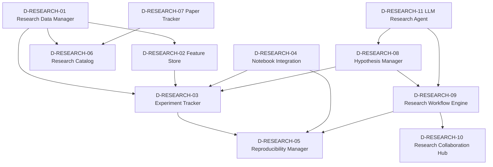

# 20 — D-RESEARCH 研究基础设施域

> **状态**: DRAFT | **核心层**: — | **成熟度**: ⬜ 未开发
> **一句话**: 让研究可复现可追踪

## §0 域定义

| 维度 | 内容 |
|------|------|
| 核心Aggregate | ResearchProject |
| 核心事件 | E-RH-01 ResearchCompleted / E-RH-02 ExperimentReproduced |
| 开发状态 | 未开发 |
| 优先级 | P2 |
| 激活前提 | D-DATA就绪 + D-ML就绪 + D-AUTONOMY就绪 |

## §0.1 能力对齐（Step 1: 子模块←→能力定位对齐）

> 来源：能力定位书§9 | 1项能力(0●+1◐)，负载等级"按需"
> ⚠️ §9仅分配1项能力，但域定位有4个职责维度——以下从域文件§0+能力定位书推导隐含骨架约束

### 显式能力覆盖

| 能力ID | 名称 | 优先级 | 角色 | 覆盖子模块 | 覆盖评估 |
|--------|------|:------:|:----:|-----------|:--------:|
| C-006 | 策略工厂 | P0 | ◐辅助 | R-04+R-07+R-08+R-11+R-17 | ✅充分 |

### 隐含能力推导（从域定位推导）

| 隐含职责维度 | 推导来源 | 对应子模块 | 对标能力(间接) |
|-------------|---------|-----------|---------------|
| 实验管道 | 域文件§0"实验管道" | R-03+R-09+R-13+R-15 | C-003(回测需要实验追踪) |
| 策略孵化 | 域文件§0"策略孵化" | R-08+R-11+R-17 | C-006(策略工厂研究阶段) |
| 研究工具 | 域文件§0"研究工具" | R-01+R-02+R-06+R-14 | C-027(因子工厂研究阶段) |
| Notebook | 域文件§0"Notebook" | R-04+R-05 | C-003(研究可复现性) |

### 关键缺口：Feature Store PIT正确性

D-RESEARCH-02 Feature Store 是本域最重要的子模块——Point-in-Time正确性为P0核心约束。查询特征时只返回当时已知的值，避免look-ahead bias。这是回测可信性的基石，直接影响C-003回测管道的可信度。

## §1 子模块清单

| ID | 名称 | 职责 | 子能力 | 依赖 | 消费者 | 优先级 | 对标依据 |
|----|------|------|--------|------|--------|:------:|---------|
| D-RESEARCH-01 | Research Data Manager | 数据集版本化→血缘追踪→质量评分→搜索发现→访问控制→生命周期管理 | 数据集版本化(Git-like版本管理→数据快照→回滚)、血缘追踪(数据来源→变换→去向)、质量评分(完整性/准确性/时效性→综合评分)、搜索发现(元数据索引→语义搜索→数据目录)、访问控制(数据分类分级→权限管理)、生命周期管理(数据保留→归档→销毁)、元数据采集(自动元数据提取) | D-DATA-03 Storage | D-ML-01 Training / D-FACTOR-01 Engine / D-RESEARCH-02 | P2 | Two Sigma Data Platform/Tecton; 数据管理/FAIR原则/数据治理; Data Mesh/数据产品化/AI自动元数据提取; 数据分类分级/PIPL合规/研究数据保留政策 |
| D-RESEARCH-02 | Feature Store | 离线+在线特征→PIT正确→训练/推理共享→避免数据泄漏 | Point-in-Time正确性(查询特征时只返回当时已知的值→避免look-ahead bias, **P0核心**)、离线特征存储(批量计算→历史特征→训练用)、在线特征存储(实时计算→最新特征→推理用)、特征注册表(特征名/类型/版本/依赖→搜索发现)、特征血缘(特征从哪些原始数据计算→依赖图) | D-RESEARCH-01 / D-DATA-03 Storage | D-ML-01 Training / D-ML-03 Inference / D-FACTOR-01 Engine | P1 | Uber Michelangelo/Tecton/Feast |
| D-RESEARCH-03 | Experiment Tracker | 超参→数据版本→代码版本→结果→全链路复现 | 实验记录(超参/数据版本/代码commit/随机种子→完整快照)、结果对比(多实验指标对比→排行榜→最优选择)、复现(给定实验ID→恢复完整环境→重跑验证)、自动关联(实验结果→D-ML-02 Model Registry→D-AUTONOMY-05 Knowledge) | D-RESEARCH-01 / D-ML-02 Model Registry | D-ML-01 Training / D-FACTOR-05 Mining Agent / D-AUTONOMY-05 Knowledge | P1 | Weights & Biases/MLflow; 实验管理/统计假设检验/元学习; 自动超参优化/神经架构搜索追踪/多目标实验; SR 11-7模型文档 |
| D-RESEARCH-04 | Notebook Integration | Jupyter→因子探索→可视化→一键转生产管线 | 因子探索(Jupyter中交互式因子计算+可视化)、参数化执行(papermill→参数化笔记本→批量实验)、一键转生产(笔记本→Python模块→D-FACTOR-04 Pipeline)、结果持久化(笔记本输出→D-RESEARCH-03实验追踪) | D-RESEARCH-01 / D-RESEARCH-02 / D-RESEARCH-03 | 研究员 / D-FACTOR-05 Mining Agent | P1 | Two Sigma BeakerX/Quantopian Research; 计算笔记本理论/文学编程; 实时协作笔记本/Notebook→生产代码自动转换; Notebook审计/代码审查要求 |
| D-RESEARCH-05 | Reproducibility Manager | 可复现性管理：环境快照+依赖锁定+种子管理+结果校验+复现报告 | 环境快照(容器化/Wasm)、依赖锁定(pip/conda)、种子管理(随机种子统一)、结果校验(逐字段比对)、复现报告 | D-RESEARCH-03 / D-RESEARCH-09 | 合规审计 | P1 | 实验复现保障; 可复现性科学/计算环境理论; 容器化环境复现/Wasm轻量复现/区块链结果存证; SR 11-7模型验证可复现性/监管模型审计要求 |
| D-RESEARCH-06 | Research Catalog | 研究目录 - 搜索引擎/标签系统/引用图谱/推荐器/访问控制 | 搜索引擎、标签系统、引用图谱、推荐器、访问控制 | D-RESEARCH-01 | — | P1 | 信息检索/知识组织/本体论; 语义搜索/LLM自动摘要/跨组织研究联邦发现; 研究成果分类/知识产权管理 |
| D-RESEARCH-07 | Paper Tracker | 论文追踪：爬取器+去重+摘要生成+引用分析+趋势检测 | 爬取器(arXiv/SSRN/学术数据库)、去重(标题/DOI)、摘要生成(自动摘要)、引用分析(影响力/前沿)、趋势检测(热度/跨学科) | — | D-RESEARCH-06 | P3 | 学术文献管理; 学术文献管理/信息检索; LLM自动论文解读/研究空白自动发现/跨学科关联; 引用合规/版权/预印本与正式发表差异声明 |
| D-RESEARCH-08 | Hypothesis Manager | 假设管理器 - 假设CRUD/证据关联/状态机(提出→验证→接受/拒绝)/优先级 | 假设CRUD、证据关联、假设状态机（提出→验证→接受/拒绝）、优先级排序 | — | D-RESEARCH-03 / D-RESEARCH-09 | P1 | 科学方法论/假设检验理论; LLM辅助假设生成/因果发现/假设网络自动推理 |
| D-RESEARCH-09 | Research Workflow Engine | 研究工作流引擎：DAG编排器+任务调度+依赖管理+重试+并行+通知 | DAG编排器(任务图定义)、任务调度(依赖解析→执行)、依赖管理(上游/下游)、重试策略(自动重试+退避)、并行执行(并发控制)、通知(完成/失败) | D-RESEARCH-08 | D-RESEARCH-05 / D-RESEARCH-10 | P1 | Airflow/Prefect; 工作流理论/DAG调度/科学工作流; AI驱动工作流自动编排/自适应DAG/事件驱动研究; 工作流审计/关键步骤审批/模型上线门禁 |
| D-RESEARCH-10 | Research Collaboration Hub | 研究协作中心：讨论区+评审系统+知识库+权限管理+活动流 | 讨论区/评审系统/知识库/权限管理/活动流 | D-RESEARCH-09 / D-RESEARCH-06 | — | P1 | 多人协作研究; 协作理论/知识管理/组织学习; AI研究助手/跨团队知识图谱/异步协作AI摘要; 研究信息隔离墙/研究成果保密/利益冲突声明 |
| D-RESEARCH-11 | LLM Research Agent | LLM研究助手 - 规划器/工具调用/反思循环/记忆管理/多Agent协作 | 规划器、工具调用、反思循环、记忆管理、多Agent协作 | — | D-RESEARCH-09 / D-RESEARCH-08 | P1 | LLM Agent/自主推理/工具使用; 多Agent辩论研究/o1类深度推理/自动实验设计; LLM输出不可替代人类判断/研究诚信/幻觉风险披露 |
| D-RESEARCH-12 | Research Data Sandbox | 研究数据沙箱：隔离研究环境+数据隔离+代码隔离+资源隔离+沙箱生命周期管理。理论：沙箱/隔离/虚拟化。具备沙箱审计/隔离完整性/数据安全合规检查 | P1 | ❌ | 沙箱/隔离/虚拟化; 容器化沙箱/Serverless沙箱/安全多方计算; Docker/gVisor/Firecracker; 沙箱审计/隔离完整性/数据安全合规 |
| D-RESEARCH-13 | Research Experiment Anomaly Detector | 研究实验异常检测器：实验异常检测+异常分类+异常响应+实验暂停+异常报告。理论：异常检测/实验监控/质量控制。具备异常检测审计/实验暂停日志/实验质量合规检查 | P1 | ❌ | 异常检测/实验监控/质量控制; 在线异常检测/自适应异常阈值/因果异常分析; 统计过程控制/Isolation Forest; 异常检测审计/实验暂停日志/实验质量合规 |
| D-RESEARCH-14 | Research Discovery Knowledge Base | 研究发现知识库：研究发现沉淀+知识抽取+知识关联+知识检索+知识报告。理论：知识管理/信息检索/知识图谱。具备知识沉淀审计/发现记录/知识管理合规检查 | P1 | ❌ | 知识管理/信息检索/知识图谱; LLM知识抽取/自动知识关联/语义知识检索; Neo4j/Elasticsearch; 知识沉淀审计/发现记录/知识管理合规 |
| D-RESEARCH-15 | Research Reproducibility Pack Generator | 研究复现包生成器：一键复现包+环境锁定+依赖锁定+代码快照+数据快照+复现验证。理论：可复现性/环境管理/版本控制。具备复现包审计/环境锁定记录/可复现性合规检查 | P1 | ❌ | 可复现性/环境管理/版本控制; 容器化复现/Wasm复现/区块链存证; Docker/conda-lock/poetry; 复现包审计/环境锁定记录/可复现性合规 |
| D-RESEARCH-16 | Research Information Barrier | 研究信息隔离墙：研究信息隔离+跨墙审批+信息访问控制+隔离审计+合规报告。理论：信息隔离/中国墙/合规管理。具备隔离审计/跨墙审批记录/信息隔离合规检查 | P1 | ❌ | 信息隔离/中国墙/合规管理; 自适应隔离/AI辅助审批/动态访问控制; 中国墙/MNPI管理; 隔离审计/跨墙审批记录/信息隔离合规 |
| D-RESEARCH-17 | Strategy Iteration Upgrader | 策略迭代升级器：基于归因结果的权重调整+新因子挖掘+策略迭代升级+错误模式学习+系统进化方向建议。理论：持续改进/机器学习/进化算法。具备迭代审计/升级记录/策略进化合规检查 | P1 | ❌ | 持续改进/机器学习/进化算法; AI策略进化/自动因子挖掘/自适应策略升级; 遗传算法/强化学习; 迭代审计/升级记录/策略进化合规 |
| D-RESEARCH-18 | 研究资产版本化与复用管理器 | 研究资产(因子/模型/策略)的版本化管理与跨项目复用 | P2 | ❌ | 第八轮剩余域补缺推导 |

## §2 域内依赖图



## §3 域间依赖

| 消费什么 | 来自哪个域 | 契约/事件 | 类型 |
|---------|-----------|---------|:----:|
| NormalizedMarketData | D-DATA | CTR-001 | H |
| 特征数据 | D-DATA | D-DATA-03 | E |
| ML模型/训练服务 | D-ML | — | E |
| 权限/审计/遥测 | D-AUTONOMY | CTR-TRACE-001 | H |

| 产出什么 | 去往哪个域 | 契约/事件 | 类型 |
|---------|-----------|---------|:----:|
| ResearchOutput | D-FACTOR | — | E |
| 实验结果 | D-ML | — | E |
| ResearchReport | D-AUTONOMY | HMI展示 | H |

## §4 域事件流

| 事件ID | 事件名 | 触发条件 | 消费者 |
|--------|--------|---------|--------|
| E-RH-01 | ResearchCompleted | 研究项目完成 | D-AUTONOMY(HMI), D-ML |
| E-RH-02 | ExperimentReproduced | 实验复现验证完成 | D-ML, D-AUTONOMY(审计) |

## §5 激活前提与就绪条件

| 前提 | 就绪标准 |
|------|---------|
| D-DATA 就绪 | CTR-001可用，Feature Store接口可用 |
| D-ML 就绪 | 模型训练/推理服务可用 |
| D-AUTONOMY 就绪 | RBAC/审计/遥测可用 |

## §6 设计决策记录

| 日期 | 决策 | 理由 | 对标来源 |
|------|------|------|---------|
| 2026-05-12 | 研究基础设施独立域 | 研究流程与交易流程分离，研究有独特的复现/协作需求 | 专业量化研究平台 |
| 2026-05-12 | 扩展为6+3+4模型——研究基础设施归入扩展域 | 顶级机构缺口审计发现研究基础设施是核心缺口 | 场外讨论草稿v6 |
| 2026-05-12 | Feature Store为生产者视角完整系统 | D-DATA-03提供`get_features()`消费者接口，D-RESEARCH-02是完整实现(离线+在线+PIT+注册表) | Feast/Tecton架构 |
| 2026-05-12 | Point-in-Time正确性为P0核心 | 查询特征时只返回当时已知的值，避免look-ahead bias | AQR/Two Sigma PIT约束 |
| 2026-05-12 | Notebook集成支持一键转生产 | 研究到生产的路径自动化，减少手工转换错误 | Two Sigma BeakerX |
| 2026-05-12 | LLM研究助手归本域 | LLM辅助研究是研究流程的增值环节 | Ollama+qwen3:8b |
| 2026-05-13 | D-RESEARCH-01 Research Data Manager补充访问控制+生命周期管理+元数据采集，对标依据补充FAIR原则/Data Mesh/AI自动元数据提取/PIPL合规 | 融合量化交易系统源清单中Research Data Manager子模块的完整功能描述和合规来源 | 融合子模块完整清单第49行 |
| 2026-05-13 | D-RESEARCH-05 Reproducibility Manager补充环境快照+依赖锁定+种子管理+结果校验+复现报告，对标依据补充可复现性科学/计算环境理论/容器化复现/Wasm/区块链存证/SR 11-7 | 融合量化交易系统源清单中Reproducibility Manager子模块的完整功能描述和可复现性理论来源 | 融合子模块完整清单第58行 |
| 2026-05-13 | D-RESEARCH-09 Research Workflow Engine补充DAG编排器+任务调度+依赖管理+重试+并行+通知，对标依据补充工作流理论/DAG调度/科学工作流/AI驱动自动编排/工作流审计/模型上线门禁 | 融合量化交易系统源清单中Research Workflow Engine子模块的完整功能描述和工作流理论来源 | 融合子模块完整清单第69行 |

## §7 与现有体系对账

| 现有体系 | 本域 | 差异 |
|---------|------|------|
| 无 | D-RESEARCH | 全新域，需新建 |

✅ 26号深度内容已融合

---

## §5 域内依赖（Step 2）

### 关键依赖链

- R-01→R-02→R-03→R-05 (数据→特征→实验→可复现——研究数据流主线)
- R-08→R-09→R-05 (假设→工作流→可复现——研究流程主线)
- R-11→R-09+R-08 (LLM Agent驱动工作流和假设管理)

### 依赖关系详表

| 源 | 目标 | 说明 |
|----|------|------|
| R-01 | R-02 | Research Data Manager→Feature Store |
| R-01 | R-03 | Research Data Manager→Experiment Tracker |
| R-01 | R-06 | Research Data Manager→Research Catalog |
| R-02 | R-03 | Feature Store→Experiment Tracker |
| R-03 | R-05 | Experiment Tracker→Reproducibility Manager |
| R-04 | R-03 | Notebook Integration→Experiment Tracker |
| R-04 | R-05 | Notebook Integration→Reproducibility Manager |
| R-08 | R-03 | Hypothesis Manager→Experiment Tracker |
| R-08 | R-09 | Hypothesis Manager→Research Workflow Engine |
| R-09 | R-05 | Research Workflow Engine→Reproducibility Manager |
| R-09 | R-10 | Research Workflow Engine→Research Collaboration Hub |
| R-07 | R-06 | Paper Tracker→Research Catalog |
| R-11 | R-09 | LLM Research Agent→Research Workflow Engine |
| R-11 | R-08 | LLM Research Agent→Hypothesis Manager |

---

## §6 域间接口（Step 3）

### 消费依赖

| 接口ID | 方向 | 契约/事件 | 对端域 | 内容 | 优先级 |
|--------|------|---------|--------|------|:------:|
| RES-DATA-01 | D-DATA→RES | CTR-001 | D-DATA | NormalizedMarketData→研究数据 | P0 |
| RES-AC-01 | D-AUTONOMY→RES | CTR-TRACE-001 | D-AUTONOMY-CORE | 权限/审计/遥测 | P0 |
| RES-FACTOR-01 | D-FACTOR→RES | — | D-FACTOR | 因子定义+IC值→因子研究 | P1 |
| RES-ML-01 | D-ML-TRAIN→RES | E-RS-03 | D-ML-TRAIN | ModelValidated→实验记录 | P1 |
| RES-SIM-01 | D-SIMULATION→RES | — | D-SIMULATION | SimulationResult→实验追踪 | P1 |
| RES-KNW-01 | D-KNOWLEDGE→RES | — | D-KNOWLEDGE | KnowledgeQuery→研究辅助 | P1 |

### 产出依赖

| 接口ID | 方向 | 契约/事件 | 对端域 | 内容 | 优先级 |
|--------|------|---------|--------|------|:------:|
| RES→FACTOR-01 | RES→D-FACTOR | E-RS-01 | D-FACTOR | FactorResearched→因子入池 | P1 |
| RES→REPORT-01 | RES→D-REPORTING | E-RS-02 | D-REPORTING | BacktestCompleted→归因报告 | P1 |
| RES→ML-01 | RES→D-ML-TRAIN | E-RS-03 | D-ML-TRAIN | ModelValidated→模型注册 | P1 |
| RES→KNW-01 | RES→D-KNOWLEDGE | — | D-KNOWLEDGE | ResearchDiscovery→知识沉淀 | P1 |
| RES→SIM-01 | RES→D-SIMULATION | — | D-SIMULATION | FeatureStore PIT特征→回测数据 | P1 |

### P0冻结签名

| 接口ID | 签名 | 方向 |
|--------|------|------|
| RES-DATA-01 | `CTR-001: NormalizedMarketData` | DATA→RES |
| RES-AC-01 | `CTR-TRACE-001: AuditTrace` | AC→RES |

---

## §7 风险架构(A4)交叉内容

> **来源**: 风险架构(A4) v3.0 —— §2 风险度量方法全部（VaR/CVaR/ES/压力测试/密度感知VaR/共形VaR 含模型35/36/37完整参数） + §1.1 市场风险表格中的研究相关指标。以下内容从风险架构文件物理搬入，保持原有颗粒度。
> **嵌套编号约定**: 风险架构原文的§N映射为本节的§7.{N}。

### §7.1.1 市场风险——研究相关指标

> 因市场价格不利变动（股价/利率/汇率/波动率/相关性）导致投资组合价值损失的风险。

| 子类 | 识别方法 | 度量方法 | 处置机制 | 否决阈值 |
|------|---------|---------|---------|---------|
| 价格风险 | 实时P&L监控+因子暴露监控 | VaR(95%/99%)+CVaR+密度感知VaR | 减仓/对冲/暂停开仓 | VaR超限→否决新开仓 |
| 波动率风险 | VIX类指标+已实现波动率vs隐含波动率 | 波动率敏感性(Vega)+波动率曲面 | 波动率飙升→降仓位 | 波动率超2σ→仓位减半 |
| 相关性风险 | 滚动相关矩阵+条件相关性 | 条件CVaR+分散化比率 | 相关性结构崩塌→减集中度 | 分散化比率<0.3→否决集中持仓 |
| 尾部风险 | 极值理论(EVT)+共形VaR超限频率 | ES(97.5%)+共形VaR+压力测试P&L | 尾部风险超限→保护性减仓 | ES超2×VaR→强制减仓20% |

**三层度量体系**（对齐能力定位书§2-d约束四）：

| 层级 | 方法 | 延迟目标 | 触发频率 | 用途 |
|------|------|---------|---------|------|
| L1 实时监控 | 实时P&L+因子暴露+集中度+Amihud非流动性 | <1秒 | 每Tick(3秒) | 盘中即时风控拦截 |
| L2 日频因子风险模型 | 申万31行业+4风格因子+VaR/CVaR/ES+CUSUM | ≤5秒(P99) | 每日收盘后 | 组合风险分解+限额检查+漂移趋势 |
| L3 压力测试 | 历史回放+假设情景+程式化冲击+反向压力测试 | ≤30分钟 | 每周+市场异动触发 | 极端情景韧性验证+致崩溃情景识别 |

---

### §7.2 风险度量方法

> 风险度量遵循"三层递进+前沿补充"原则：L1实时→L2日频→L3压力测试，前沿方法（密度感知VaR/共形VaR/TWC/TCP/RWC/SA-BCP）作为L2增强。

#### §7.2.1 VaR/CVaR/ES

**核心度量指标体系**：

| 指标 | 置信度 | 时间窗口 | 方法 | 用途 | 行业对标 |
|------|--------|---------|------|------|---------|
| VaR | 95%/99% | 1日/10日 | 历史模拟+参数法 | 日常限额检查 | Basel III(传统) |
| CVaR/ES | 97.5% | 1日/10日 | 历史模拟+应力校准 | 尾部风险度量 | Basel III FRTB(替代VaR) |
| 密度感知VaR | 95% | 1日 | 概率密度预测+分位数提取 | 分布形态变化捕捉 | 能力定位书§2-d约束十二 |
| 共形VaR | 95% | 1日 | 共形预测校准层 | 分布无关覆盖率保证 | TWC(默认,Schmitt 2026) / TCP(Aich et al. 2026) / RWC(增强,Schmitt 2026) |
| LVaR | 95% | 1日 | 流动性调整VaR | 流动性风险整合 | 能力定位书§2-d约束十 |

**VaR回测要求**（对齐能力定位书§2-d约束四）：

| 回测项 | 标准 | 通过条件 | 未通过处置 |
|--------|------|---------|-----------|
| Kupiec POF检验 | 95%VaR覆盖率 | p值>0.05 | 重校准VaR模型 |
| Christoffersen独立性检验 | 超限独立性 | p值>0.05 | 检查波动率聚类 |
| Basel交通灯 | 250日超限次数 | 绿灯(0-4)/黄灯(5-9)/红灯(≥10) | 黄灯→增加附加因子；红灯→模型替换 |
| VaR回测通过率 | 综合通过率 | >95% | <95%→模型降级 |

#### §7.2.2 压力测试与情景分析

> 压力测试回答"市场崩溃时系统能否存活"，情景分析回答"如果X发生，组合会怎样"，反向压力测试回答"什么情景会导致系统崩溃"。三者互补而非替代。对齐 Fed DFAST/CCAR + CFA Institute 三分法 + Numerix反向压力测试框架。

**情景四分类**：

| 类型 | 定义 | 示例 | 频率 |
|------|------|------|------|
| 历史情景 | 重放实际发生的极端事件 | 2008 GFC / 2015股灾 / 2020 COVID / 2024A股踩踏 / 2026.1融资保证金调整 | 每季度 |
| 假设情景 | 构造合理但未实际发生的极端事件 | 台海冲突+制裁 / 人民币急贬10% / 利率急升300bp / 系统性流动性冻结 | 每半年 |
| 程式化情景 | 对关键风险因子施加标准化冲击 | DPG七场景：利率±100bp / 波动率±20% / 股指±10% / 汇率±6% | 每月 |
| 反向压力测试 | 从崩溃阈值反推致崩溃情景 | "什么情景会导致组合亏损>15%?"→反推所需冲击组合 | 每季度 |

**A股特有压力情景库**（对齐 C-038 黑天鹅模式库）：

| 情景编号 | 情景名称 | 关键冲击 | 历史参考 |
|---------|---------|---------|---------|
| ST-001 | 千股跌停 | 沪深300单日-8%+成交量萎缩至30% | 2015.6-8 / 2024.1 |
| ST-002 | 流动性骤降 | 日成交量缩至日均10%+买卖价差扩大5倍 | 2015.7流动性危机 |
| ST-003 | 融资盘强平 | 两融余额单日下降15%+融资保证金上调 | 2015.7 / 2026.1(80%→100%) |
| ST-004 | 政策黑天鹅 | 印花税上调/交易规则突变/行业监管 | 2023.8印花税减半(反向) |
| ST-005 | 跨市场传导 | 港股暴跌→A股联动+北向资金大幅流出 | 2022.10 / 2024.8 |
| ST-006 | 量化踩踏 | 因子拥挤+策略同质化→同步抛售 | 2024年夏量化基金亏损 |
| ST-007 | 黑天鹅+T+1锁定 | 极端事件当日无法卖出+次日跳空 | 2020.2.3 COVID开盘 |

**压力测试通过标准**（对齐 §12 成功指标"黑天鹅事件存活率≥90%"）：

| 指标 | 通过标准 | 未通过处置 |
|------|---------|-----------|
| 情景最大亏损 | <组合净值15% | 收紧仓位上限 |
| 流动性压力下退出时间 | <5个交易日 | 降仓位至可退出水平 |
| 极端情景VaR超限恢复 | <3个交易日恢复合规 | 增加对冲+降低暴露 |
| 反向压力测试致崩溃情景数 | ≤3个合理致崩溃情景 | >3个→收紧风险限额+增加对冲 |

#### §7.2.3 密度感知VaR/共形VaR

> 前沿风险度量方法，解决传统VaR的两个根本缺陷：①假设正态分布低估尾部风险；②无法提供分布无关的覆盖率保证。

**密度感知VaR**（对齐能力定位书§2-d约束十二）：

| 阶段 | 方法 | 校准要求 | 消费条件 |
|------|------|---------|---------|
| Phase 1 | 参数化(高斯混合) | CRPS<基准10% | 概率校准度偏离对角线<5% |
| Phase 2 | QNN(量子神经网络近似) | CRPS<Phase1 | 尾部校准VaR覆盖率误差<2% |
| Phase 3 | 非参数化(KDE/核密度) | CRPS<Phase2 | 8态概率从PDF积分派生 |

**共形VaR**（2025-2026 学术前沿）：

| 方法 | 论文 | 核心机制 | 优势 | 适用条件 |
|------|------|---------|------|---------|
| TCP | Aich et al. (2026) arXiv:2507.05470 | 分位数预测器+滚动split-conformal校准层 | 非平稳时序下覆盖率接近目标 | 有足够校准窗口(≥250日) |
| TCP-RM | 同上 | TCP+在线Robbins-Monro偏移 | 实时调整覆盖率 | 需要调参(学习率γ) |
| RWC | Schmitt (2026) arXiv:2602.03903 | 体制加权共形风险控制(时间衰减+体制相似性) | 体制条件校准稳定性 | 体制特征可提取 |
| TWC | 同上 | 仅时间加权(指数衰减) | 计算简单+漂移下强默认 | 漂移环境首选 |
| AgACI/DtACI | Ivancevic et al. (2025) | 自适应共形推断(聚合/动态调参) | DtACI区间窄33%+覆盖率保持 | 需要基线VaR模型 |
| Portfolio CP | Jia & Han (DMO-FinTech 2026) HKUST(Guangzhou) | 共形预测估计VaR→组合优化 | 分布无关+覆盖率保证+可整合任何回归方法 | 短卖约束+投资者指定约束 |
| QRF+Conformal | Wang et al. (2026.2) Renmin Univ | 分位数回归森林+OSOA框架+共形校准层 | 实时VaR+一致性+覆盖率有效性理论保证 | 需离线模拟训练+≥250日校准窗口 |
| SA-BCP | Fang & Lee (arXiv:2605.00432, 2026.5) | 状态自适应贝叶斯共形预测：空间核密度证据门控长期时间惯性 | 解决ACI系统性覆盖不足+减少贝叶斯CP区间膨胀10-37% | 波动性金融数据(2016-2026)验证；需核密度估计+证据阈值K调参 |
| CP-VaR回测 | Retzlaff et al. (COPA 2025) | CP与VaR形式等价→VaR回测方法可用于统计评估CP覆盖率 | Dynamic Binary Test+Geometric Conformal Backtesting识别漂移/适应性缺陷 | 共形VaR验证的必要补充；替代描述性覆盖率指标 |

**共形VaR在本系统中的定位**：

```
传统VaR(历史模拟/参数法)
    │
    ├──→ 密度感知VaR(捕捉分布形态变化)
    │        │
    │        └──→ 共形VaR校准层(提供分布无关覆盖率保证)
    │                 │
    │                 ├── TWC(默认)：时间加权共形校准
    │                 ├── RWC(增强)：体制加权共形校准(需C-021市场状态就绪)
    │                 └── SA-BCP(贝叶斯增强)：状态自适应贝叶斯共形预测
    │
    └──→ ES/CVaR(尾部风险度量，FRTB标准)
```

---

## §7 域事件流（Step 4）

### 产出事件

| 事件ID | 事件名 | 触发条件 | 载荷 | 消费域 | 频率 |
|--------|--------|---------|------|--------|:----:|
| E-RS-01 | FactorResearched | 因子研究完成 | factor_id, ic_value, hypothesis_id | D-FACTOR | L1 |
| E-RS-02 | BacktestCompleted | 回测完成 | experiment_id, result_summary | D-REPORTING | L1 |
| E-RS-03 | ModelValidated | 模型验证完成 | model_id, metrics, validation_id | D-ML-TRAIN | L1 |
| E-RS-04 | HypothesisAccepted | 假设被验证接受 | hypothesis_id, evidence_ids, confidence | D-KNOWLEDGE | L2 |
| E-RS-05 | ExperimentAnomaly | 实验异常检测 | experiment_id, anomaly_type, severity | D-AUTONOMY | L2 |

### 消费事件

| 事件ID | 事件名 | 供给域 | D-RESEARCH处理 |
|--------|--------|--------|----------------|
| — | FactorComputed | D-FACTOR | R-14提取因子知识 |
| — | ModelValidated | D-ML-TRAIN | R-03记录实验结果 |

---

## §8 激活前提（Step 5）

| 前提 | 域 | 必须/部分 | 就绪标准 |
|------|-----|:---------:|---------|
| 数据就绪 | D-DATA | 必须 | CTR-001可用，Feature Store接口可用 |
| 权限/审计就绪 | D-AUTONOMY-CORE | 必须 | RBAC+审计日志+遥测可用 |
| ML服务就绪 | D-ML-TRAIN | 部分 | 模型训练/推理服务可用 |
| 因子数据就绪 | D-FACTOR | 部分 | 因子定义+IC值可查询 |

### 激活阶段

| 阶段 | 前提 | 可激活模块 |
|------|------|-----------|
| Phase 1 | D-DATA就绪 + D-AUTONOMY就绪 | R-01, R-02, R-06 |
| Phase 2 | Phase 1 | R-03, R-04, R-05, R-09 |
| Phase 3 | Phase 2 + D-ML就绪 | R-08, R-11, R-14, R-17 |
| Phase 4 | Phase 3 | R-07, R-10, R-12, R-16 |

---

## §9 设计决策（Step 6）

| # | 决策 | 理由 | 影响 |
|---|------|------|------|
| 1 | 研究基础设施独立域 | 研究流程与交易流程分离，研究有独特的复现/协作需求 | D-RESEARCH独立建域 |
| 2 | Feature Store PIT正确性为P0核心 | 查询特征时只返回当时已知的值，避免look-ahead bias | R-02是本域最关键子模块，直接影响C-003回测可信度 |
| 3 | Notebook集成支持一键转生产 | 研究到生产的路径自动化，减少手工转换错误 | R-04→R-09→生产管线 |
| 4 | 隐含能力显式化 | §9仅分配1项能力，但域定位有4个职责维度 | 实验管道/策略孵化/研究工具/Notebook四个维度需显式追踪 |
| 5 | LLM研究助手归本域 | LLM辅助研究是研究流程的增值环节 | R-11使用Ollama+qwen3:8b |
| 6 | 信息隔离墙(R-16) | 研究环境与交易环境隔离，防止信息泄露 | R-16实现研究信息隔离+跨墙审批 |
| 7 | Feature Store→D-SIMULATION回测 | PIT正确的特征数据是回测可信性的基石 | RES→SIM-01为P1关键接口 |

## 来自Agent架构(A7)的内容

### 来自Agent架构(A7) — 研究Agent (Researcher) 属性行

> 来源：Agent架构(A7) §1.2 战略Agent

| 属性 | 研究Agent (Researcher) |
|------|----------------------|
| **职责** | 策略研究、因子发现、知识图谱构建 |
| **输入** | 研报/论文/论坛数据、因子候选池 |
| **输出** | 新因子提案、策略代码草稿、知识更新 |
| **自治级别** | Level 2（弱自主：研究自主，上线需审批） |
| **延迟目标** | <30min（研究级任务） |
| **对应能力** | C-006 策略工厂、C-016 知识图谱、C-024 知识模型自进化 |
| **对应域(归属域)** | D-RESEARCH + D-KNOWLEDGE |
| **LLM路由** | API优先（创意任务） |
| **运行时段** | 盘后为主 |

**Agent Card注册**：strategic-researcher | 研究Agent | 战略层 | 能力数4 | 技能数4 | Level 2

**能力边界**：

| ✅ 能做 | ⚠️ 需审批 | ❌ 不可做 |
|--------|----------|---------|
| 因子提案/知识图谱/论文搜索 | 因子入池/策略代码提交 | 改在线因子池/绕回测上线 |

### 来自Agent架构(A7) — 研究Agent技能注册表

> 来源：Agent架构(A7) §5.2 全量技能注册表

| 技能ID | 技能名称 | 所属Agent | Discovery级 | Activation级 | 状态 |
|--------|---------|----------|:-----------:|:-----------:|:----:|
| factor-proposal | 因子提案 | 研究Agent | ✅ | ✅ | ACTIVE |
| strategy-code-gen | 策略代码生成 | 研究Agent | ✅ | ✅ | ACTIVE |
| knowledge-graph-build | 知识图谱构建 | 研究Agent | ✅ | ✅ | ACTIVE |
| paper-search | 论文搜索 | 研究Agent | ✅ | ✅ | ACTIVE |

### 来自Agent架构(A7) — 与学习系统架构(A8)的接口

> 来源：Agent架构(A7) §6.7
> 研究Agent通过以下接口与A8学习系统交互

| 接口 | 方向 | 数据格式 | 频率 | 说明 |
|------|------|---------|------|------|
| 反思轨迹上报 | A7→A8 | JSON（轨迹+反思+修正） | 每次L1反思后 | 研究Agent的反思轨迹为A8的S0~S6学习流水线提供原始材料 |
| 优化建议下发 | A8→A7 | JSON（优化建议+验证结果） | A8学习周期完成后 | A8的优化建议经研究Agent审批后应用 |
| 情景记忆同步 | A7↔A8 | 向量嵌入（FAISS索引） | 日度 | 研究Agent的情景记忆与A8的知识库双向同步 |
| 能力演进请求 | A7→A8 | SKILL.md草案 | 新能力提案时 | 研究Agent发现新能力需求，请求A8协助开发 |

**研究假设→A8训练任务**：研究Agent提出的研究假设（如新因子有效性、策略改进方向）通过反思轨迹上报接口传递给A8，A8将其转化为训练任务进行验证。

### 来自Agent架构(A7) — 研究Agent→业务功能域消费映射

> 来源：Agent架构(A7) §9.2.2

| Agent | 消费域（数据/信号来源） | 产出域（输出去向） | 蓝图备注 |
|-------|---------------------|------------------|---------|
| 研究Agent | D-DATA（行情数据）、D-ALT-DATA🔴（另类数据，MVP替代见LP-017）、D-KNOWLEDGE（知识图谱） | D-FACTOR（新因子提案）、D-KNOWLEDGE（知识更新） | D-ALT-DATA: 无项目蓝图；D-KNOWLEDGE: 项目有蓝图编号MOD-KB-001已建设(completed) |

### 来自Agent架构(A7) — 遗留问题裁定（研究域相关条目）

> 来源：Agent架构(A7) §17

| 编号 | 遗留问题 | 裁定 | 与D-RESEARCH的关系 |
|:----:|---------|:----:|-------------------|
| LP-007 | 11个Agent分阶段上线 | 🔴 暂缓(不能全部MVP建) | 研究Agent在MVP阶段即上线（5个核心Agent之一） |
| LP-017 | 另类数据域(D-ALT-DATA) | 🔴 暂缓(不能建) | 研究Agent消费D-ALT-DATA🔴，MVP替代：A股特有另类数据纳入D-DATA域 |

---

## §10 行业对标与独创性分析（来源：学习系统架构 §1）

### §10.1 已公开系统对标

| 系统/机构 | 覆盖阶段 | 缺失阶段 | 与本系统的差距 |
|---|---|---|---|
| **微软 R&D-Agent-Quant**（NeurIPS 2025） | 假设生成→代码实现→回测→反馈分析 | 不做多模态知识采集（语音/视频/PDF），不做模块工厂映射 | 覆盖S3~S5，缺S0~S2+模块工厂；本系统新增进化式代码生成+AST沙箱+辩论式因子精炼后，S4质量显著领先 |
| **Qraft QuantEvolve**（2025） | 进化式策略发现+洞察提取+洞察管理 | 不做外部知识采集，只在因子空间内进化 | 覆盖S3~S4，缺S0~S2+S5~S6+模块工厂；本系统新增质量-多样性优化+Meta-Harness后，进化深度领先 |
| **HKUST Auto Strategy Finding**（EMNLP 2025） | LLM从金融文献提取alpha因子→多Agent评估→动态权重优化 | 不做视频/语音采集，不做模块工厂，不做试运行闭环 | 覆盖S1~S3（仅文本），缺S0/S4~S6；本系统新增三阶段LLM闭环后，S2~S3与该系统持平，S0/S4~S6仍领先 |
| **Captide**（对冲基金AI平台） | 持续处理全球财报/新闻/电话会议/公告→分段索引→自然语言查询 | 不做策略自动创建，只做信息提取和检索 | 覆盖S0~S1，缺S2~S6；本系统新增GraphRAG+去噪编码器后，S0~S1质量持平，S2~S6仍领先 |
| **QuantaAlpha**（上财/斯坦福/北大，arXiv 2026）🆕 | LLM+进化算法→假设生成→因子构建→代码实现→回测→迭代优化→因子池维护 | 不做多模态采集，不做模块工厂映射，不做试运行闭环 | 覆盖S2~S5（因子方向），本系统S0~S1+S6+模块工厂仍领先；S4进化式代码生成需对齐 |
| **Hubble**（UBS/Celestial Quant Lab，arXiv 2026）🆕 | LLM驱动因子发现+DSL约束+AST沙箱+进化反馈 | 不做知识采集/分类，不做模块工厂，不做元学习 | 覆盖S4（因子代码生成），本系统DSL+AST沙箱需对齐；S0~S3+S5~S6仍领先 |
| **FactorMAD**（清华/Microsoft，ICAIF 2025）🆕 | 多Agent辩论→因子精炼→代码生成→回测验证 | 不做知识采集，不做模块工厂，不做元学习 | 覆盖S2~S4（因子辩论），本系统辩论式因子精炼需对齐；S0~S1+S5~S6仍领先 |
| **TiMi**（同济/MSRA，ICLR 2026）🆕 | 策略-部署解耦+双层分析+分层编程+数学反思闭环优化 | 不做知识采集，不做模块工厂 | 覆盖S4~S5（策略开发+优化），本系统数学反思闭环已对齐，策略-部署解耦需对齐；S0~S3+S6仍领先 |
| **ProFiT**（Nof1，2025）🆕 | LLM进化式策略发现→代码重写→回测→进化循环 | 不做知识采集，不做模块工厂 | 覆盖S4（进化式代码生成），本系统进化式代码生成需对齐；S0~S3+S5~S6仍领先 |
| **CogAlpha**（港大/中国移动，arXiv 2026）🆕 | 7层Agent层次因子挖掘+代码级Alpha表示+进化搜索 | 不做知识采集，不做模块工厂，不做元学习 | 覆盖S3~S5（因子方向），7层Agent层次远超本系统S3映射；本系统S0~S2+S6+模块工厂仍领先；S3需对齐7层架构 |
| **FactorMiner**（Wang et al.，arXiv 2026）🆕 | 自进化Agent+经验记忆+类型化DSL+Phase 2 Helix验证通道 | 不做知识采集，不做模块工厂 | 覆盖S4~S5（因子挖掘+验证），经验记忆和Phase 2验证是亮点；本系统S0~S3+S6+模块工厂仍领先；S6技能库需对齐经验记忆 |
| **FinRL-X**（AI4Finance，arXiv 2026）🆕 | 模块化部署一致性架构+权重中心接口+可组合策略管线 | 不做知识采集，不做模块工厂，不做元学习 | 覆盖S5~S6（部署一致性），权重中心接口消除训练-服务偏差；本系统S0~S4+模块工厂仍领先；§11接口需对齐权重中心 |
| **Dnalyaw**（全栈量化平台，2026）🆕 | Rust/Go/Python延迟分层+4级风控+Kill Switch+特征存储 | 不做知识采集→策略提取，不做模块工厂 | 覆盖S5风控+部署，延迟分层和4级风控远超本系统；本系统S0~S4+模块工厂仍领先；§10风控需对齐4级决策；延迟分层裁定❌ |

### §10.2 独创性评估

| 组件 | 行业是否有 | 评估 |
|---|---|---|
| 多模态知识采集（语音/视频/PDF/网址自动抓取→策略提取） | Captide做了文本，MountainLion做了图表视觉理解 | ⭐ 前沿 |
| 知识分类→模块映射 | R&D-Agent-Quant做了"假设→代码"，但没做"映射到现有模块池" | ⭐ 独创 |
| 交易模块工厂/模块池 | 没有任何已公开系统有此概念 | ⭐⭐ 核心独创 |
| 自动创建→接入→试运行闭环 | R&D-Agent-Quant有类似闭环，但不是"模块"级别；TiMi有策略-部署解耦闭环，但不是"模块"级别 | ⭐ 部分独创（持平） |
| 元学习（RSI架构+技能库+Meta-Harness+在线EWC） | ProFiT/QuantEvolve/Strategy Arena已有进化式元学习生产系统 | ⭐ 前沿（v2.1为⭐⭐，因竞品出现降级） |
| 因果发现与推断（v4.0新增） | CausalStock/Rebellion Research有因果发现 | ⭐ 前沿 |
| 漂移感知自适应（v4.0新增） | ProAdapt/在线学习增强选股模型有适配器机制 | ⭐ 前沿 |
| DSL+AST沙箱安全代码生成（v4.0新增） | Hubble有DSL+AST沙箱 | ⭐ 前沿 |

### §10.3 行业三条落地路径

| 路径 | 代表机构 | 核心思路 | 与本系统的关系 |
|---|---|---|---|
| 全自动投研 | Man Group、Bridgewater | AI独立提出假设→编写代码→验证策略→解释经济原理 | 本系统最接近此路径，但多了"知识采集→模块工厂" |
| 基本面增强 | Citadel、Point72 | AI增强人类PM/分析师的判断质量 | S0~S2阶段的知识采集走此路径 |
| 平台化基础设施 | Balyasny、Millennium | 中心化AI基础设施，赋能多团队 | 模块工厂有此路径特征 |

---

## §11 学习系统架构总览（来源：学习系统架构 §2.1）

> **v8.0 统一架构**：7阶段流水线+横切层+安全约束合并为唯一真源。v4.0升级：S0新增漂移感知+VLM+PIT门控+基础模型骨干；S1新增信息价值评分；S2新增因果发现引擎(PC+LiNGAM)+辩论式因子精炼+10类知识（v8.0已扩展为11类，见下方v8.0升级说明）；S4新增DSL+AST沙箱+三重语义一致性+进化式代码生成+分析师Agent反馈；S5新增4级决策门控+参数稳定性+数学反思闭环；S6升级RSI架构+技能库+在线EWC+轻量Agent化；横切层新增4级风控+Kill Switch+Agent漂移检测+群集行为防护+可解释性门控+MLOps闭环。v5.0升级：S0新增共形漂移检测+多尺度漂移检测；S2新增TimePC/Neural Granger/CausalNLP/Causal KG+因子语义去重；S4新增可解释设计约束；S5新增DSR/CPCV v2/White's Reality Check/Adaptive Walk-Forward/Probabilistic Backtesting；S6新增MAML快速适应+元反思+AutoSkill+技能三元组；§10.2.9新增Causal SHAP/Concept/LLM-as-Explainer；§10.2.7新增NIST AI 100-5+Agent能力评估；§11新增Event Schema Versioning+漂移感知集成；§0.3新增ASIC RG 273/MAS FEAT/中国AI金融应用预研。v6.0升级：S2新增LLM引导因果发现先验+带干预的时序因果发现+带推理路径的KG-RAG；S0新增表示学习驱动漂移检测；S5新增信息论过拟合检测+市场状态感知Walk-Forward；§10.2.9新增因果约束反事实解释+交互式解释；§10.1新增Dynamic KG动态知识图谱；§9.1新增ICL作为元学习+技能依赖解析。v7.0升级：S0新增Feature Store+PIT Manager+Sentiment Engine+Filing NLP Engine+多模态融合引擎；S1新增Knowledge Quality Assessor+Data Quality Scorer+Signal Extractor；S2新增因果发现三阶段扩展+Knowledge Distiller+LLM Market Interpreter+Causal Factor Validator；S3新增Market Regime Detector+Knowledge Graph Engine+风险传播建模；S4新增AutoML Engine+Factor Mining Agent+Hypothesis Manager；S5新增Strategy Lifecycle Manager+AI Construction Governor+LLM Security Gateway+Pipeline编排器+Saga事务编排+可配置规则引擎；S6新增Experiment Tracker+Walk-Forward Analyzer完整版+过拟合检测扩展+Look-Ahead Bias Detector+Signal Confidence Scorer+三层参数优化；§10新增5层记忆架构+数据血缘追踪+GPU Resource Manager；§11新增Non-AI Module Boundary Guard+Decision Audit Trail。v8.0升级：S0新增Trading Domain NLP Engine；S1新增Training Data Manager；S2新增Lesson Learned Base(11类知识)+Research Knowledge Precipitator；S3新增Knowledge Version Manager+Knowledge Base Search Engine+Knowledge Graph Explorer；S5新增Strategy Sandbox轻量版+Liquidity & Slippage Simulator+Order Matching Simulator+Scenario Generator基础版+Backtest-to-Production Deployer；§10新增Synthetic Data Generator基础版+AI API Cost Manager+Agent Communication Protocol+Capacity Assurance & SLI/SLO+Model Profiler & Capability Exam。各子架构注解见§3~§9。

```
╔══════════════════════════════════════════════════════════════════════════════════╗
║                   学习系统 v8.0 总览（自进化架构）                                ║
╠══════════════════════════════════════════════════════════════════════════════════╣
║                                                                                ║
║  ┌──────────────────────────────────────────────────────────────────────────┐  ║
║  │  S0  多模态知识采集层                                                     │  ║
║  │  语音(Whisper) + 视频(Whisper+OCR) + PDF(解析) + 网址(爬虫) + 文字(直入) │  ║
║  │  定时抓取 + 事件触发 + 手动提交 + 🆕漂移感知调度(ADWIN/DDM)              │  ║
║  │  🆕VLM图表视觉理解 + 🆕Point-in-Time门控 + 🆕时序基础模型骨干(TimesFM)  │  ║
║  │  → 原始知识包(RawKnowledgePacket)                                        │  ║
║  └──────────────────────────┬───────────────────────────────────────────────┘  ║
║                             │                                                  ║
║  ┌──────────────────────────▼───────────────────────────────────────────────┐  ║
║  │  S1  知识清洗与结构化层                                                   │  ║
║  │  去重 + 去噪 + 时间戳对齐 + 说话人分离 + 术语标准化                        │  ║
║  │  非结构化文本 → 结构化知识片段(StructuredKnowledgeFragment)                │  ║
║  │  质量评分(可信度/时效性/完整性) + 🆕信息价值评分(相关性/时效性/信息量/可靠性)│  ║
║  │  低质量拦截(综合评分<0.3→REJECT)                                          │  ║
║  └──────────────────────────┬───────────────────────────────────────────────┘  ║
║                             │                                                  ║
║  ┌──────────────────────────▼───────────────────────────────────────────────┐  ║
║  │  S2  知识分类与策略提取层                                                 │  ║
║  │  LLM语义理解 → 知识类型分类(🆕11类) → 交易逻辑提取                        │  ║
║  │  🆕因果发现引擎: PC算法(骨架)→LiNGAM(方向)→🆕时滞因果图→LLM语义校验      │  ║
║  │  🆕因果验证层: 自然实验/工具变量→无支持因果边降权                          │  ║
║  │  🆕辩论式因子精炼: Generator(GLM-5.1)⇄Critic(DeepSeek)→IC显著提升        │  ║
║  │  结构化知识片段 → 分类知识包(ClassifiedKnowledgePackage)                   │  ║
║  │  + 置信度评估 + 矛盾检测(与已有知识冲突时标记)                             │  ║
║  └──────────────────────────┬───────────────────────────────────────────────┘  ║
║                             │                                                  ║
║  ┌──────────────────────────▼───────────────────────────────────────────────┐  ║
║  │  S3  模块映射与工厂匹配层                                                 │  ║
║  │  分类知识包 → 目标层级映射(L1~L6/§29) → 模块工厂查询                      │  ║
║  │  ├─ 匹配已有模块 → 更新模块参数/规则                                      │  ║
║  │  └─ 无匹配模块 → 生成模块需求规格(ModuleRequirementSpec)                  │  ║
║  └──────────────────────────┬───────────────────────────────────────────────┘  ║
║                             │                                                  ║
║  ┌──────────────────────────▼───────────────────────────────────────────────┐  ║
║  │  S4  模块创建与接入层                                                     │  ║
║  │  模块需求规格 → 🆕DSL约束(6类算子) → 🆕AST沙箱(三层安全) → 人工审核       │  ║
║  │  🆕三重语义一致性: 假设⇄因子表达式⇄代码 → 不一致则拒绝                    │  ║
║  │  🆕进化式代码生成: 生成→回测→分析弱点→重写→...→收敛(≤5轮)                │  ║
║  │  🆕分析师Agent反馈: Generator→Critic→Judge→AST沙箱→人工审核              │  ║
║  │  新模块(NewModule) → 注册到模块工厂(ModuleRegistry)                       │  ║
║  └──────────────────────────┬───────────────────────────────────────────────┘  ║
║                             │                                                  ║
║  ┌──────────────────────────▼───────────────────────────────────────────────┐  ║
║  │  S5  试运行与验证层                                                       │  ║
║  │  新模块 → C-003完整回测验证 → 模拟盘观察≥1周 → 效果评估                    │  ║
║  │  🆕3阶段决策门控: IS→稳定性门控→WFA→多数通过+灾难否决→OOS→参数锁定     │  ║
║  │  🆕参数稳定性区域: 参数扫描→识别稳定高原→选高原中心→避悬崖型参数           │  ║
║  │  🆕数学反思闭环: 反馈→形式化为约束优化→精确求解(替代LLM直觉)              │  ║
║  │  🆕Purge Gap: 训练集→Gap期(≥5交易日)→测试集(防信息泄漏)                  │  ║
║  │  上线对接🆕4级风控: APPROVE/REDUCE/REJECT/FLATTEN                         │  ║
║  └──────────────────────────┬───────────────────────────────────────────────┘  ║
║                             │                                                  ║
║  ┌──────────────────────────▼───────────────────────────────────────────────┐  ║
║  │  S6  元学习与自我进化层                                                   │  ║
║  │  🆕RSI架构: STOP(Prompt自优化) + RISE(代码自纠正) + Voyager(技能库) + Meta-Harness(元优化器) │  ║
║  │  🆕在线EWC: Fisher信息正则化→防灾难性遗忘→保留历史+适应新知               │  ║
║  │  🆕轻量Agent化: 4维度→4个逻辑Agent+消息队列协调(非物理分布式)             │  ║
║  │  🆕技能库(Voyager维度): 成功代码/模板/公式→结构化存储→新任务优先检索复用   │  ║
║  │  🆕经验记忆索引(Voyager维度): 知识图谱+因子家族+市场制度→检索引导生成方向  │  ║
║  └──────────────────────────────────────────────────────────────────────────┘  ║
║                                                                                ║
║  ┌──────────────────────────────────────────────────────────────────────────┐  ║
║  │  横切  模块工厂 (Module Factory / Module Registry)                        │  ║
║  │  交易模块池的全生命周期管理: 注册/查询/版本/依赖/退役                       │  ║
║  │  与C-006策略工厂/C-027因子工厂/C-028信号工厂/C-029模型工厂的关系: 上游供应商+协调层      │  ║
║  │  🆕预留平台化接口: 模块权限标注/使用计量/质量评分(单用户默认值运行)        │  ║
║  └──────────────────────────────────────────────────────────────────────────┘  ║
║  ┌──────────────────────────────────────────────────────────────────────────┐  ║
║  │  横切  知识库 (Knowledge Base)                                            │  ║
║  │  所有已提取知识的持久化存储: 结构化知识+原始来源+提取记录+效果追踪          │  ║
║  │  与C-016知识图谱的关系: 知识库存储"交易知识"，知识图谱存储"实体关系"       │  ║
║  │  🆕金融知识图谱(→C-016独立组件): 实体+关系+时序边→支持多跳推理(+24%)      │  ║
║  │  边界: 知识库=交易知识的CRUD存储; 知识图谱=实体关系的图推理引擎(详见§10.1) │  ║
║  └──────────────────────────────────────────────────────────────────────────┘  ║
║  ┌──────────────────────────────────────────────────────────────────────────┐  ║
║  │  横切  安全与治理 (Security & Governance)                                 │  ║
║  │  知识来源追溯 + 模块变更审计 + 自动操作日志 + 人工审批节点                  │  ║
║  │  🆕4级风控决策: APPROVE/REDUCE/REJECT/FLATTEN(FLATTEN硬编码触发)          │  ║
║  │  🆕Kill Switch: 独立硬开关→可立即暂停所有学习系统操作                      │  ║
║  │  🆕Agent漂移检测: KL散度>阈值→自动降级为"仅建议"模式                      │  ║
║  │  🆕群集行为防护: 与行业模型相关性>0.7→自动差异化+市场压力时降仓            │  ║
║  │  🆕可解释性门控: SHAP/LIME解释+经济学原理→无法解释则拒绝部署              │  ║
║  │  🆕金融AI三难: 准确性+合规性(不可协商)>可解释性(网关)>速度+成本(约束)     │  ║
║  └──────────────────────────────────────────────────────────────────────────┘  ║
║  ┌──────────────────────────────────────────────────────────────────────────┐  ║
║  │  横切  MLOps闭环 (🆕v4.0)                                                │  ║
║  │  监控效果→漂移检测(效果+数据分布)→自动重训练→影子验证→金丝雀上线→监控→闭环│  ║
║  │  权重中心接口: 学习系统输出目标权重→风控验证→执行层执行→物理隔离           │  ║
║  └──────────────────────────────────────────────────────────────────────────┘  ║
╚══════════════════════════════════════════════════════════════════════════════════╝
```

> **总览图功能覆盖补充**：以下功能已在主章节定义但未在上方ASCII图中显式展示（按阶段分组，R-XX编号对应§12.0裁定总表）：
> - **S0采集增强**: K线分词(R-18) / Feature Store(R-68) / PIT Manager(R-69) / Sentiment Engine(R-70) / Filing NLP Engine(R-71) / 多模态融合引擎(R-72) / Trading Domain NLP Engine(R-122) ｜❌A股特色数据(R-111)
> - **S1清洗增强**: Knowledge Quality Assessor(R-73) / Data Quality Scorer(R-74) / Signal Extractor(R-75) / Training Data Manager(R-113)
> - **S2分类增强**: GraphRAG(R-17) / KG多跳推理(R-20) / 神经符号融合(R-21) / 宏观因果传导(R-23) / 创意拓宽(R-24) / CausalNLP / TimePC / Neural Granger / Causal KG / 因子语义去重 / LLM因果先验 / 干预时序因果 / KG-RAG推理路径 / 因果三阶段(R-76) / Knowledge Distiller(R-77) / LLM Market Interpreter(R-78) / Causal Factor Validator(R-79) / Lesson Learned(R-115) / Research Precipitator(R-124) ｜❌PDF预测(R-110)
> - **S3映射增强**: 质量-多样性(R-28) / LLM遗传编程 / Market Regime Detector(R-80) / KG Engine(R-81) / 风险传播(R-82) / Knowledge Version Manager(R-116) / KB Search Engine(R-123) / KG Explorer(R-125)
> - **S4创建增强**: 轨迹进化(R-29) / 适配器(R-30) / 可解释设计 / AutoML(R-83) / Factor Mining Agent(R-84) / Hypothesis Manager(R-85)
> - **S5试运行增强**: 对抗增强(R-22) / 延迟离线(R-26) / A/B测试(R-27) / DSR扩展 / CPCV v2 / White's Reality / Adaptive WF / Probabilistic BT / 信息论过拟合 / 市场状态WF / Strategy Lifecycle(R-86) / AI Construction Governor(R-87) / LLM Security Gateway(R-88) / Pipeline编排(R-89) / Saga(R-90) / 规则引擎(R-91) / Strategy Sandbox(R-117) / Liquidity Simulator(R-118) / Order Matching(R-119) / Scenario Generator(R-120) / Backtest-to-Production(R-126)
> - **S6元学习增强**: MAML / 元反思 / AutoSkill / 技能三元组 / ICL / 技能依赖解析 / Experiment Tracker(R-92) / WF Analyzer(R-93) / 过拟合扩展(R-94) / Look-Ahead Bias(R-95) / Signal Confidence(R-96) / 三层优化(R-97) ｜❌Monte Carlo(R-103) / VaR(R-104) / Digital Twin(R-105) / 数字孪生(R-106)
> - **横切**: 人机协作(R-25) / 共形漂移 / 多尺度漂移 / 表示学习漂移 / 时序KG预测 / Dynamic KG / 5层记忆(R-98) / 数据血缘(R-99) / GPU Manager(R-100) / Synthetic Data(R-114) / NIST AI 100-5 / Agent能力评估 / Causal SHAP / Concept / LLM-as-Explainer / 反事实解释 / 交互式解释 / AI API Cost(R-121) / Agent Protocol(R-128) / SLI/SLO(R-129) / Model Profiler(R-127) / Event Schema Versioning / Non-AI Boundary(R-101) / Decision Audit(R-102) / 漂移感知集成 / FinKG基准 ｜❌LLM分级路由(R-109) / Data Mesh(R-107) / CQRS(R-108) / AI治理(R-112)

---

## §12 行业前沿补充（来源：学习系统架构 §14）

> 本节记录2025-2026年最新学术研究、头部机构实践与监管动态对本架构图的补充。每条补充标注来源、与现有架构的关系、以及建议的升级方向。
>
> **§12导航指南**：§12.0裁定总表是所有待建功能的二元决策摘要（✅可建/❌不可建+门禁条件），优先查阅；§12.1~§12.10按10个发现维度组织第1轮发现的详细证据与升级建议；§12.11~§12.12为第2~3轮深入发现。所有升级建议条目均标注纳入状态（【✅已纳入§X.X】/【❌见§12.0裁定R-XX】/【⏳Phase X演进方向】），与§12.0裁定总表一一对应。

### §12.0 二元裁定总表

> 以下为本架构图所有待建功能的二元裁定结果。✅=当前硬边界条件下可建；❌=当前硬边界条件下不可建（附门禁条件）。

| 编号 | 功能 | 裁定 | 依据 | 门禁条件（❌时） |
|------|------|:----:|------|-----------------|
| R-01 | 4级风控决策(APPROVE/REDUCE/REJECT/FLATTEN) | ✅ | Python实现，无硬边界冲突 | — |
| R-02 | 因果发现引擎(PC+LiNGAM+时滞因果图+TimePC+Neural Granger+CausalNLP+Causal KG) | ✅ | causal-learn纯Python库，<50变量本地可运行；TimePC/Neural Granger/CausalNLP/Causal KG为v5.0扩展 | — |
| R-03 | 因子DSL+AST沙箱 | ✅ | Python AST模块原生支持，无外部依赖 | — |
| R-04 | LLM角色分工(Generator/Critic/Judge) | ✅ | 本地多LLM交叉验证已有实践 | — |
| R-05 | 进化式代码生成(多轮迭代) | ✅ | Python+LLM API，无硬边界冲突 | — |
| R-06 | 辩论式因子精炼 | ✅ | 双LLM Agent对话，本地可运行 | — |
| R-07 | 数学反思闭环优化 | ✅ | scipy.optimize约束求解，纯Python | — |
| R-08 | 参数稳定性区域分析 | ✅ | 参数扫描+可视化，纯Python | — |
| R-09 | 漂移感知调度(ADWIN/DDM+共形漂移检测+多尺度漂移检测) | ✅ | Python库river/tdqm可用；共形漂移/多尺度漂移为v5.0扩展 | — |
| R-10 | 在线EWC防灾难性遗忘 | ✅ | Fisher信息矩阵计算，纯Python | — |
| R-11 | 技能库+经验记忆索引+技能三元组 | ✅ | 本地向量数据库(ChromaDB/FAISS)；技能三元组为v5.0扩展 | — |
| R-12 | 权重中心接口 | ✅ | Python接口+风控验证，无硬边界冲突 | — |
| R-13 | MLOps闭环(监控→漂移→重训→影子→金丝雀) | ✅ | Python调度+现有C-003回测 | — |
| R-14 | VLM图表视觉理解 | ✅ | 本地VLM(Qwen2.5-VL等)，RTX 3090可运行 | — |
| R-15 | Point-in-Time门控 | ✅ | 时间戳标注+特征存储验证，纯逻辑 | — |
| R-16 | 时序基础模型骨干(TimesFM/TTM) | ✅ | 开源预训练模型，RTX 3090可推理 | — |
| R-17 | GraphRAG图增强检索 | ✅ | 本地知识图谱+LLM检索，纯Python | — |
| R-18 | K线分词机制(Kronos) | ✅ | 开源预训练模型，本地可推理 | — |
| R-19 | 金融知识图谱(实体+关系+时序边+时序KG预测) | ✅ | Neo4j本地部署/NetworkX纯Python；时序KG预测为v5.0扩展 | — |
| R-20 | KG引导多跳推理 | ✅ | 图遍历+LLM推理，纯Python | — |
| R-21 | 神经符号融合推理 | ✅ | 规则引擎+LLM，纯Python | — |
| R-22 | 对抗性知识增强 | ✅ | 特征空间扰动+对抗训练，纯Python | — |
| R-23 | 宏观因果传导路径 | ✅ | 宏观指标→行业→个股因果链，纯Python | — |
| R-24 | 创意拓宽模式(一次10+假设) | ✅ | LLM批量生成+快速预评估，纯Python | — |
| R-25 | 人机协作模式(AI采集+人类审核) | ✅ | 现有B-007审批节点已支持 | — |
| R-26 | 延迟离线学习(先记录后学习) | ✅ | 事件日志+离线训练，纯Python | — |
| R-27 | A/B测试框架(新旧模块并行) | ✅ | 影子部署+统计比较，纯Python | — |
| R-28 | 质量-多样性优化(Feature Map+LLM遗传编程变异) | ✅ | 策略特征图+多样性维护，纯Python；LLM遗传编程变异为v5.0扩展 | — |
| R-29 | 轨迹级进化(研究轨迹定向修正) | ✅ | 全流程记录+定向修正，纯Python | — |
| R-30 | 适配器机制(基础模型冻结+轻量微调) | ✅ | LoRA/Adapter微调，RTX 3090可运行 | — |
| R-31 | Rust/Go延迟分层 | ❌ | 硬边界约束二（单机Windows+Python） | GPU集群+Linux+多语言编译链就绪 |
| R-32 | Agent集群(MARL) | ❌ | 硬边界约束一（单人）+约束二（单机） | 多机集群+MARL训练框架就绪 |
| R-33 | 平台化基础设施 | ❌ | 硬边界约束一（单人）+约束三（50万AUM） | 多团队+多账户+AUM>1000万 |
| R-34 | EU AI Act字面合规 | ❌ | 硬边界约束三（个人使用不对外服务） | 对外提供服务或管理他人资金 |
| R-35 | TEE可信执行环境 | ❌ | 硬边界约束二（单机Windows，无TEE硬件） | SGX/TDX硬件+Linux就绪 |
| R-36 | 多管线并行架构(独立资金池) | ❌ | 硬边界约束三（50万AUM单一账户） | 多账户+AUM>500万+独立资金池 |
| R-37 | DeepSCM深度因果模型 | ❌ | 硬边界约束二（单机Windows+Python，深度因果模型需GPU集群训练） | GPU集群+Linux+PyTorch分布式训练就绪 |
| R-38 | ODL-Net在线深度学习 | ❌ | 硬边界约束二（在线深度学习需GPU集群） | GPU集群+在线训练框架就绪 |
| R-39 | Formal Verification形式化验证 | ❌ | 硬边界约束二（SMT求解器需专业工具链） | Z3/PySMT集成+形式化验证专家就绪 |
| R-40 | Micro-Agent微Agent架构 | ❌ | 硬边界约束一（单人）+约束二（单机） | 多机集群+微Agent编排框架就绪 |
| R-41 | Synthetic Backtesting合成回测 | ❌ | 硬边界约束二（生成模型需GPU集群） | GPU集群+扩散模型/GAN训练框架就绪 |
| R-42 | SEC AI Trading Advisor注册 | ❌ | 硬边界约束三（个人使用不对外服务） | 对外提供服务或管理他人资金 |
| R-43 | 因子语义去重(LLM判断经济学逻辑等价) | ✅ | LLM语义判断+IC比较，纯Python，v5.0新增 | — |
| R-44 | MAML快速适应(元学习初始化参数) | ✅ | 小模型(<1M参数)MAML元训练，RTX 3090可运行，v5.0新增 | — |
| R-45 | 元反思(反思过程本身的改进) | ✅ | 经验回放+反思提炼+技能注册+元反思，纯Python，v5.0新增 | — |
| R-46 | AutoSkill自动技能发现(LLM抽象可复用模式) | ✅ | LLM分析轨迹→抽象技能→回测验证→注册，纯Python，v5.0新增 | — |
| R-47 | 可解释性扩展(Causal SHAP+Concept Explanation+LLM-as-Explainer) | ✅ | 因果Shapley值+概念级解释+LLM自然语言解释，纯Python，v5.0新增 | — |
| R-48 | 高级回测(DSR+CPCV v2+White's Reality Check+Adaptive Walk-Forward+Probabilistic Backtesting) | ✅ | 统计检验+贝叶斯回测，纯Python(scipy/statsmodels)，v5.0新增 | — |
| R-49 | Event Schema Versioning(事件Schema版本管理) | ✅ | Schema版本化+向后兼容验证，纯逻辑，v5.0新增 | — |
| R-50 | Agent安全扩展(NIST AI 100-5参考框架+Agent能力评估协议) | ✅ | 三层安全架构+能力评估，纯Python，v5.0新增 | — |
| R-51 | 可解释设计约束(Explainable By Design) | ✅ | self.explain()+经济学假设+特征贡献度，纯Python，v5.0新增 | — |
| R-52 | 漂移感知集成(动态调整模型权重) | ✅ | 根据漂移适应能力动态调整集成权重，纯Python，v5.0新增 | — |
| R-53 | LLM引导因果发现先验(LLM生成因果边白名单/黑名单约束PC算法搜索空间) | ✅ | LLM生成因果边约束→约束PC算法搜索空间→减少虚假因果边15-30%，纯Python，v6.0新增 | — |
| R-54 | 带干预的时序因果发现(利用政策事件作为天然干预实验识别因果效应) | ✅ | 检测政策事件窗口→分别估计前后因果图→比较差异识别政策因果效应，纯Python，v6.0新增 | — |
| R-55 | 表示学习驱动漂移检测(监控模型中间层表示变化提前1-3日预警；仅需hook提取中间层表示，无需训练表示学习模型) | ✅ | hook机制提取表示→Wasserstein距离检测→比输出监控提前1-3个交易日，纯Python，v6.0新增 | — |
| R-56 | 因果约束反事实解释(因果图约束反事实生成空间确保因果合理) | ✅ | 因果图约束反事实生成空间→与§5.2因果发现引擎联动，纯Python，v6.0新增 | — |
| R-57 | 交互式解释(LLM+SHAP/因果图RAG问答审批者可追问AI决策理由) | ✅ | LLM+SHAP/因果图RAG问答→与C-031 AI协作策略联动，纯Python，v6.0新增 | — |
| R-58 | 信息论过拟合检测(互信息/KL散度量化过拟合程度补充DSR) | ✅ | 互信息/KL散度量化训练集vs测试集信息增益差异→比DSR更直观，纯Python(scipy)，v6.0新增 | — |
| R-59 | 市场状态感知Walk-Forward(C-021市场状态驱动Walk-Forward窗口参数) | ✅ | C-021市场状态判定结果驱动Walk-Forward窗口参数→趋势期长窗口/震荡期短窗口，纯Python，v6.0新增 | — |
| R-60 | 带推理路径的KG-RAG(因果图作为推理路径LLM沿路径逐步推理) | ✅ | 因果图作为推理路径→LLM沿路径逐步推理→准确率+20%，纯Python，v6.0新增 | — |
| R-61 | Dynamic KG动态知识图谱(知识标注时间有效性KG增量更新) | ✅ | 知识标注时间有效性+KG增量更新而非全量重建，纯Python+Neo4j/NetworkX，v6.0新增 | — |
| R-62 | ICL作为元学习(精心设计prompt含历史案例LLM上下文中适应新市场) | ✅ | 精心设计prompt含历史成功/失败案例→LLM上下文中适应新市场→与MAML互补，纯Python，v6.0新增 | — |
| R-63 | 技能依赖解析(技能三元组增加dependencies字段自动编排执行顺序) | ✅ | dependencies字段→自动编排执行顺序→AutoSkill发现的技能可自动组合为复杂工作流，纯Python，v6.0新增 | — |
| R-64 | AlphaFin统一多模态框架 | ❌ | 硬边界约束二（统一多模态模型需GPU集群） | 统一多模态模型量化部署方案就绪+RTX 3090 24GB显存验证通过 |
| R-65 | FinVision端到端图表→策略 | ❌ | 硬边界约束三（端到端生成绕过DSL+AST沙箱安全约束） | 端到端生成不绕过DSL+AST沙箱的安全方案设计完成 |
| R-66 | AlphaEvolve元级基础设施进化 | ❌ | 硬边界约束三（DSL语法进化可能破坏AST沙箱安全约束） | DSL语法进化不破坏AST沙箱安全约束的验证方案就绪 |
| R-67 | 可微因果发现(NOTEARS+) | ❌ | 硬边界约束二（连续优化需GPU长时间训练） | RTX 3090上<100变量训练时间<4h验证通过 |
| R-68 | Feature Store(离线+在线+PIT) | ✅ | DuckDB离线存储+在线特征服务+PIT AS OF JOIN，纯Python，项目内有蓝图MOD-INF-009 Pipeline部分实现🔧，v7.0新增 | — |
| R-69 | PIT Manager(DuckDB AS OF JOIN) | ✅ | DuckDB时间旅行查询，纯Python，项目内有蓝图MOD-INF-012 Database部分实现🔧，v7.0新增 | — |
| R-70 | Sentiment Engine(finBERT/vaderSentiment) | ✅ | finBERT情感分析+vaderSentiment规则，纯Python，RTX 3090可推理，v7.0新增 | — |
| R-71 | Filing NLP Engine(公告NLP提取) | ✅ | 公告文本结构化提取+LLM API，纯Python，v7.0新增 | — |
| R-72 | 多模态融合引擎(早期/晚期/注意力) | ✅ | 多模态特征融合层，纯Python，v7.0新增 | — |
| R-73 | Knowledge Quality Assessor(过时/冲突/可信度/新鲜度) | ✅ | 知识质量4维评估+规则+LLM，纯Python，v7.0新增 | — |
| R-74 | Data Quality Scorer(6维) | ✅ | 完整性/一致性/时效性/准确性/唯一性/有效性6维统计评分，纯Python，v7.0新增 | — |
| R-75 | Signal Extractor(特征工程+IC测试+衰减+正交化) | ✅ | 信号提取+IC检验+衰减分析+正交化去冗，纯Python，v7.0新增 | — |
| R-76 | 因果发现三阶段扩展(工具变量+Do-calculus+反事实) | ✅ | DoWhy工具变量+do-演算+反事实推理，纯Python，v7.0新增 | — |
| R-77 | Knowledge Distiller(代码/日志/蓝图→结构化知识) | ✅ | LLM+规则从非结构化源提取结构化知识，纯Python，v7.0新增 | — |
| R-78 | LLM Market Interpreter(Prompt编排+多模型路由+事实校验) | ✅ | Prompt链编排+多LLM路由+事实交叉校验，纯Python+LLM API，v7.0新增 | — |
| R-79 | Causal Factor Validator(DoWhy因果验证) | ✅ | DoWhy因果效应验证+反驳测试，纯Python，v7.0新增 | — |
| R-80 | Market Regime Detector(12种Regime+HMM) | ✅ | hmmlearn HMM市场制度检测+12种制度分类，纯Python，v7.0新增 | — |
| R-81 | Knowledge Graph Engine(Neo4j/NetworkX+查询+本体) | ✅ | Neo4j本地/NetworkX图引擎+查询语言+本体管理，项目内有蓝图MOD-KB-001已建设✅，v7.0新增 | — |
| R-82 | 风险传播建模(级联失效+系统性风险) | ✅ | NetworkX图传播模拟+级联失效检测，纯Python，v7.0新增 | — |
| R-83 | AutoML Engine(自动模型选择+超参搜索) | ✅ | Optuna自动超参搜索+模型选择，纯Python，v7.0新增 | — |
| R-84 | Factor Mining Agent(并发AI因子挖掘+去重+验证) | ✅ | LLM并发因子假设生成+去重+回测验证，纯Python，v7.0新增 | — |
| R-85 | Hypothesis Manager(假设CRUD+证据关联+状态机) | ✅ | 假设生命周期管理+证据链+状态机，纯Python，v7.0新增 | — |
| R-86 | Strategy Lifecycle Manager(7状态状态机+准入+灰度) | ✅ | 策略7状态生命周期+准入门控+灰度发布，纯Python，v7.0新增 | — |
| R-87 | AI Construction Governor(公式Hash+回归截断+值域偏差) | ✅ | AI生成代码质量门控，项目内有蓝图MOD-INF-007 Gate Engine部分实现🔧，v7.0新增 | — |
| R-88 | LLM Security Gateway(九层防御) | ✅ | LLM输入/输出九层安全防御，项目内有蓝图MOD-INF-014 LLM Security Gateway部分实现🔧，v7.0新增 | — |
| R-89 | Pipeline编排器(11步编排；11步是7阶段S0~S6的执行粒度细化，非矛盾) | ✅ | 学习系统11步流水线编排，项目内有蓝图MOD-INF-009 Pipeline部分实现🔧，v7.0新增 | — |
| R-90 | Saga事务编排(编排式/协调式/补偿) | ✅ | 分布式事务Saga模式（编排式/协调式/补偿事务），纯Python，v7.0新增 | — |
| R-91 | 可配置规则引擎(YAML/DSL+热更新) | ✅ | YAML/DSL规则定义+热更新，项目内有蓝图MOD-INF-007 Gate Engine部分实现🔧，v7.0新增 | — |
| R-92 | Experiment Tracker(MLflow/wandb) | ✅ | 实验追踪+超参记录+指标对比，MLflow/wandb纯Python，v7.0新增 | — |
| R-93 | Walk-Forward Analyzer完整版(滚动/锚定/扩展) | ✅ | 滚动Walk-Forward+锚定Walk-Forward+扩展Walk-Forward，纯Python，v7.0新增 | — |
| R-94 | 过拟合检测扩展(Bonferroni/FDR/BHY+DSR) | ✅ | 多重检验校正(Bonferroni/FDR/BHY)+DSR扩展，纯Python统计，v7.0新增 | — |
| R-95 | Look-Ahead Bias Detector(前视偏差检测) | ✅ | 时序数据前视偏差自动检测+报告，纯Python，v7.0新增 | — |
| R-96 | Signal Confidence Scorer(Platt/Isotonic+MC Dropout) | ✅ | Platt Scaling/Isotonic Regression概率校准+MC Dropout不确定性，纯Python，v7.0新增 | — |
| R-97 | 三层参数优化(实时微调/周期优化/结构进化) | ✅ | 实时微调+周期优化+结构进化三层参数优化，纯Python，v7.0新增 | — |
| R-98 | 5层记忆架构(实验/笔记/图谱/代码/上下文) | ✅ | 5层记忆存储+检索+遗忘，项目内有蓝图MOD-INF-011 Vector Memory部分实现🔧，v7.0新增 | — |
| R-99 | 数据血缘追踪(OpenLineage) | ✅ | OpenLineage数据血缘追踪+影响分析，纯Python，v7.0新增 | — |
| R-100 | GPU Resource Manager(GPU分区+时段优先) | ✅ | PyTorch CUDA内存分区+时段优先调度，纯Python，v7.0新增 | — |
| R-101 | Non-AI Module Boundary Guard(AI/non-AI边界+权重≤30%；"Non-AI Module Boundary"=AI/non-AI边界线，非"非AI模块") | ✅ | AI/non-AI模块边界守卫+AI权重≤30%约束，纯Python规则，v7.0新增 | — |
| R-102 | Decision Audit Trail(决策捕获+上下文+影响追踪) | ✅ | 决策捕获+上下文快照+影响链追踪，项目内有蓝图MOD-INF-020 Audit Trail部分实现🔧，v7.0新增 | — |
| R-103 | Monte Carlo Engine(GPU加速) | ❌ | 硬边界约束二（GPU加速蒙特卡洛需GPU集群+CUDA并行） | GPU集群+CUDA并行计算框架就绪 |
| R-104 | VaR Calculator(蒙特卡洛GPU) | ❌ | 硬边界约束二（同R-103，蒙特卡洛VaR需GPU集群） | GPU集群+CUDA并行计算框架就绪 |
| R-105 | Market Digital Twin(代理人引擎+订单簿仿真) | ❌ | 硬边界约束一（单人）+约束二（代理人引擎+订单簿仿真需多机集群+高频数据源） | 多机集群+高频数据源接入就绪 |
| R-106 | 数字孪生系列(依赖图/实时同步/混沌实验) | ❌ | 硬边界约束一（单人）+约束二（实时同步+混沌实验需多机集群） | 多机集群+实时数据同步框架就绪 |
| R-107 | Data Mesh(域所有权/数据产品/联邦治理) | ❌ | 硬边界约束一（单人）+约束三（Data Mesh需多团队+数据产品目录平台） | 多团队+数据产品目录平台就绪 |
| R-108 | CQRS/Event Sourcing模型 | ❌ | 硬边界约束二（CQRS/Event Sourcing需分布式事件存储+消息队列） | 分布式事件存储+消息队列就绪 |
| R-109 | LLM模型分级路由(M1/M3/M7/M9四级) | ❌ | 硬边界约束二（多GPU推理服务器+模型服务化框架需集群） | 多GPU推理服务器+模型服务化框架就绪 |
| R-110 | PDF预测引擎 | ❌ | 硬边界约束二（PDF结构化解析精度≥95%需专用模型训练） | PDF结构化解析精度≥95%验证通过 |
| R-111 | A股特色数据(五类资金追踪/政策预期) | ❌ | 硬边界约束五（Level-2数据源+政策事件数据库需付费数据源） | Level-2数据源+政策事件数据库就绪 |
| R-112 | AI治理框架(EU AI Act合规) | ❌ | 硬边界约束三（个人使用不对外服务，EU AI Act合规需对外提供服务） | 对外提供服务或管理他人资金 |
| R-113 | Training Data Manager(训练数据版本+质量+增强+采样) | ✅ | DuckDB训练数据版本管理+质量检查+SMOTE增强+分层采样，纯Python，v8.0新增 | — |
| R-114 | Synthetic Data Generator基础版(SMOTE+轻量GAN) | ✅ | SMOTE过采样+RTX 3090轻量GAN生成稀有市场条件数据，纯Python，v8.0新增 | — |
| R-115 | Lesson Learned Base(教训知识库：失败案例+根因+预防) | ✅ | 失败案例结构化存储+根因分析+预防措施，SQLite，纯Python，v8.0新增 | — |
| R-116 | Knowledge Version Manager(知识版本化+变更追踪+回滚) | ✅ | Git-like知识版本管理+变更diff+回滚，纯Python，v8.0新增 | — |
| R-117 | Strategy Sandbox轻量版(事件驱动策略沙盒) | ✅ | 纯Python事件驱动策略沙盒，S5试运行轻量替代R-105 Market Digital Twin，v8.0新增 | — |
| R-118 | Liquidity & Slippage Simulator(Almgren-Chriss+滑点) | ✅ | Almgren-Chriss市场冲击模型+滑点模拟，纯Python，v8.0新增 | — |
| R-119 | Order Matching Simulator(限价订单簿模拟) | ✅ | 限价订单簿模拟+撮合引擎，纯Python，v8.0新增 | — |
| R-120 | Scenario Generator基础版(历史重采样+自定义情景) | ✅ | 历史数据重采样+自定义情景生成，CPU版（R-103 GPU版❌的轻量替代），纯Python，v8.0新增 | — |
| R-121 | AI API Cost Manager(API成本监控+预算管理+超限告警+自动降级) | ✅ | LLM API成本实时监控+预算管理+超限告警+自动降级为本地模型，纯Python，项目内有蓝图MOD-INF-024 Token/Cost/Time Budget部分实现🔧，v8.0新增 | — |
| R-122 | Trading Domain NLP Engine(交易术语识别+意图解析) | ✅ | 交易领域术语识别+意图解析+领域实体提取，LLM API+领域词典，纯Python，v8.0新增 | — |
| R-123 | Knowledge Base Search Engine(跨库全文+语义搜索) | ✅ | SQLite FTS5全文+ChromaDB向量语义跨库搜索，纯Python，项目内有蓝图MOD-KB-001 Knowledge Base已建设✅，v8.0新增 | — |
| R-124 | Research Knowledge Precipitator(研究结论自动沉淀) | ✅ | 研究结论+实验结果→结构化知识自动沉淀，LLM API+结构化存储，纯Python，v8.0新增 | — |
| R-125 | Knowledge Graph Explorer(KG可视化+交互探索) | ✅ | NetworkX+matplotlib/plotly知识图谱可视化+交互探索，纯Python，项目内有蓝图MOD-KB-001 Knowledge Base已建设✅，v8.0新增 | — |
| R-126 | Backtest-to-Production Deployer(回测→生产安全部署) | ✅ | 回测通过→门控验证→灰度发布→全量上线安全部署链，纯Python，项目内有蓝图MOD-INF-009 Pipeline部分实现🔧，v8.0新增 | — |
| R-127 | Model Profiler & Capability Exam(模型画像+能力考试) | ✅ | LLM模型能力基线测量+多维度能力评估，纯Python，项目内有蓝图MOD-INF-034 Model Profiler部分实现🔧+MOD-INF-036 Model Capability Exam部分实现🔧，v8.0新增 | — |
| R-128 | Agent Communication Protocol(Agent间通信+协调+冲突解决) | ✅ | Agent间消息传递+任务协调+冲突解决协议，纯Python，项目内有蓝图MOD-INF-025 Agent Communication Protocol脚手架🏗️，v8.0新增 | — |
| R-129 | Capacity Assurance & SLI/SLO(容量保障+服务等级指标) | ✅ | SLI/SLO框架+Error Budget+容量规划，纯Python，项目内有蓝图MOD-INF-001 SLI/SLO Framework部分实现🔧，v8.0新增 | — |

### §12.1 多模态知识采集前沿

| 发现 | 来源 | 与现有架构的关系 | 升级建议 |
|------|------|-----------------|---------|
| **GraphRAG（图增强检索生成）**：将知识图谱与RAG结合，通过图结构进行多跳推理，显著提升复杂金融问答和知识提取的准确度 | MountainLion (arXiv 2025) | S0/S2当前仅用LLM直接提取，缺乏图结构辅助推理 | S2知识提取引入GraphRAG：先构建/查询知识图谱子图，再基于子图上下文进行LLM提取，减少幻觉和遗漏【✅已纳入§5.2】；v6.0扩展：带推理路径的KG-RAG【见§12.0裁定R-60】 |
| **K线分词机制（K-line Tokenization）**：将K线序列视为"金融语言"进行分词和自回归预训练，实现行情数据的原生语义理解 | Kronos (2025) | S0采集层仅将行情数据作为"原始数据"存储，未做语义编码 | S0新增行情语义编码器：K线→token序列→预训练模型，使行情数据可直接参与LLM推理【✅已纳入§3.3】 |
| **多管线并行架构**：三个独立智能管线（语言Agent/时序图Agent/策略Agent）并行运行在独立资金池上，通过置信度加权资本分配协调 | Multimodal Agentic AI (TechRxiv 2025) | 当前S3~S5是串行流水线，无并行管线概念 | S3模块映射支持"多管线并行"模式：同一知识包可同时映射到多个目标层级，各管线独立试运行，最终按置信度加权融合【❌见§12.0裁定R-36】 |
| **图表/图像理解**：直接理解K线图、技术分析图表的视觉语义，而非仅OCR提取文字 | MountainLion (arXiv 2025) | S0视频采集仅用Whisper+OCR，无法理解图表视觉语义 | S0新增图表视觉理解模块：VLM（视觉语言模型）解析K线图/技术图表→结构化信号描述【✅已纳入§3.3】 |

### §12.2 知识表示与推理

| 发现 | 来源 | 与现有架构的关系 | 升级建议 |
|------|------|-----------------|---------|
| **去噪新闻编码器（Denoised News Encoder）**：LLM对每条新闻多角度评分，过滤噪声后再进行因果推理 | CausalStock (AAAI 2025) | S1去噪仅做口语化填充词去除，未做"信息价值评分" | S1新增信息价值评分：LLM对每条知识片段多维度评分（相关性/时效性/信息量/可靠性），低分拦截【✅已纳入§4.1】 |
| **时滞因果图（Lag-dependent Temporal Causal Graph）**：在因果发现中显式建模时间延迟，学习"X在t-2影响Y在t"的时滞因果关系 | CausalStock (AAAI 2025) | S2因果关系提取仅识别"因为A所以B"的即时因果，无时滞建模 | S2因果提取升级：从即时因果边→时滞因果边(CausalEdge{cause, effect, lag, strength})，支持"X滞后k期影响Y"【✅已纳入§5.2】 |
| **知识分类体系扩展**：7类→10类→11类，新增"流动性知识""博弈知识""制度知识""教训知识" | 行业实践综合 | S2仅7类（策略/因子/市场状态/板块轮动/风控/事件/方法论） | S2知识分类扩展为11类：+流动性知识(LiquidityKnowledge)+博弈知识(GameTheoryKnowledge)+制度知识(RegimeKnowledge)+教训知识(LessonLearnedKnowledge)【✅已纳入§5.1】 |
| **因子语义去重（Factor Semantic Deduplication）**：LLM判断两个因子的经济学逻辑是否等价（即使数值不同），语义等价因子保留IC更高者 | LLM Factor Factory (WorldQuant 2025) | S2矛盾检测仅有数值去重（IC相关性>0.7），缺少语义层面去重 | S2矛盾检测新增因子语义去重：LLM判断经济学逻辑等价→语义等价因子保留IC更高者+标记"语义冗余"→语义不等价但数值相关→保留两者+标记"数值相关但逻辑独立"【✅已纳入§5.2, 见§12.0裁定R-43】 |

### §12.3 因果发现与推断

| 发现 | 来源 | 与现有架构的关系 | 升级建议 |
|------|------|-----------------|---------|
| **形式化因果发现算法**：PC/FCI算法（约束法）、LiNGAM（噪声法）、TiMINo（非线性时序因果）可从数据中自动发现因果图 | Trading with Time Series Causal Discovery (Imperial 2024); CausalStock (AAAI 2025) | S2因果提取仅用LLM语义匹配，无形式化因果发现 | S2新增因果发现引擎：PC/FCI→发现因果骨架→LiNGAM→确定因果方向→LLM语义校验→人工审核【✅已纳入§5.2】；v6.0扩展：LLM引导因果发现先验/带干预的时序因果发现【见§12.0裁定R-53/R-54】 |
| **do-演算与反事实推理**：因果推断不应停留在"发现因果"，还应支持"如果干预X，Y会怎样"的反事实推理 | Causal Inference in Quantitative Investing (Rebellion Research 2026) | S2因果提取仅做"发现"，不做"干预推理" | S2新增反事实推理模块：对关键因果边支持do(X)干预推理→生成反事实预测→辅助S5试运行评估【✅已纳入§5.2】；⚠️v6.0新增"因果约束反事实解释"(R-56)属§10.2.9可解释性门控，非本条因果推断，见§10.2反事实术语区分 |
| **自然实验与工具变量**：利用指数纳入/财报超预期等外生冲击作为自然实验，识别真正因果而非伪相关 | Causal Inference in Quantitative Investing (Rebellion Research 2026) | 无此概念 | S2新增因果验证层：对提取的因果边，检查是否存在自然实验/工具变量支持→无支持的因果边降权【✅已纳入§5.2】 |
| **端到端因果因子分析**：从因果发现到因果情景建模的完整管线，应用于因子投资 | Toward Automating Causal Discovery (World Scientific 2025) | 因子知识仅做IC验证，无因果验证 | S3因子映射新增因果因子分析：因子→因果图定位→因果强度评估→仅因果因子可进入因子池【✅已纳入§6.1】 |

### §12.4 元学习与自进化机制

| 发现 | 来源 | 与现有架构的关系 | 升级建议 |
|------|------|-----------------|---------|
| **进化式代码生成（Evolutionary Code Generation）**：LLM在进化循环中重写策略Python源码，而非仅调参。ProFiT在7个期货品种上77%+超越Buy-and-Hold | ProFiT (Nof1, 2025) | S4代码生成是单次生成+人工审核，无进化迭代 | S4新增进化式代码生成：LLM分析代码+回测结果→识别弱点→重写代码→回测→保留或淘汰→多轮进化【✅已纳入§7.2】 |
| **质量-多样性优化（Quality-Diversity Optimization）**：不寻找单一最优策略，而是维护一组在特征图上多样化的高性能策略集合 | QuantEvolve (2025) | 模块工厂仅做"匹配/不匹配"二元判断，无多样性维护 | S3模块匹配新增特征图（Feature Map）：策略类型×风险状况×换手率×收益特征→维护多样性策略池【✅已纳入§6.1】 |
| **递归自我改进（Recursive Self-Improvement, RSI）**：STOP（prompt自优化）、RISE（多轮自纠正微调）、LADDER（递归问题分解）、AlphaEvolve（进化算法优化自身基础设施） | Recursive Self-Improvement for Trading (2026综述) | S6元学习4个维度过于抽象，缺乏具体RSI架构 | S6升级为RSI架构：①Prompt自优化循环（STOP模式）②代码自纠正循环（RISE模式）③技能库积累（Voyager模式）④元优化器优化自身超参【✅已纳入§9.1】 |
| **策略-部署解耦**：TiMi将策略开发（Policy）与分钟级部署（Deployment）架构解耦，开发阶段用LLM深度推理，部署阶段用确定性代码执行 | TiMi (ICLR 2026) | S4创建的模块直接进入S5试运行，无"开发态→部署态"解耦 | S4新增策略-部署解耦：开发态（LLM推理+代码生成）→优化态（参数调优+回测验证）→部署态（确定性代码执行），三态分离【✅已纳入§7.2】 |
| **技能库积累（Skill Library）**：Voyager模式——成功的策略/因子/代码片段存入可复用技能库，新任务优先从技能库检索 | Voyager (NVIDIA/Caltech 2023); Strategy Arena (2026) | 模块工厂有Module Registry但无"技能库"概念 | S6新增技能库：成功模块的代码片段/策略模板/因子公式→结构化存储→新任务优先检索复用→加速收敛【✅已纳入§9.1】 |
| **Meta-Harness元优化器**：优化进化引擎自身的超参数（变异率/交叉率/适应度权重/探索率），实现"改进改进能力" | Strategy Arena (2026) | S6元学习仅优化学习策略，不优化学习系统自身的超参 | S6新增Meta-Harness：学习系统的变异率/匹配阈值/审核策略→自身A/B测试→保留更优配置→递归优化【✅已纳入§9.1】 |
| **MAML快速适应（Model-Agnostic Meta-Learning）**：在历史市场数据上元训练初始化参数，新市场只需5-10 episode即可适应 | Meta-Quant (AAAI 2025) | S6元学习无快速适应新市场机制 | S6新增MAML快速适应：历史市场元训练→新市场5-10 episode适应→适用于S4代码生成模型快速迁移【✅已纳入§9.1, 见§12.0裁定R-44】；v6.0扩展：ICL作为元学习替代方案【见§12.0裁定R-62】 |
| **元反思（Meta-Reflection）**：反思"反思过程本身"的质量，从历史成功/失败案例中提炼可复用的反思模式 | Self-Evolving Agent (arXiv 2025) | S6反思仅改进策略/代码，不改进反思过程本身 | S6新增元反思闭环：经验回放→反思提炼→技能注册→元反思→改进反思策略本身【✅已纳入§9.1, 见§12.0裁定R-45】 |
| **AutoSkill自动技能发现**：LLM分析成功/失败的研究轨迹，自动抽象为新技能，无需人工定义技能分类 | AutoSkill (OpenAI 2025) | S6技能库需人工定义技能分类，无自动发现机制 | S6新增AutoSkill：LLM分析研究轨迹→自动抽象新技能→回测验证→注册技能库【✅已纳入§9.1, 见§12.0裁定R-46】；v6.0扩展：技能依赖解析【见§12.0裁定R-63】 |

### §12.5 模块化/组合式架构

| 发现 | 来源 | 与现有架构的关系 | 升级建议 |
|------|------|-----------------|---------|
| **特征存储（Feature Store）**：统一因子计算的定义-训练-服务，消除训练-服务偏差（15-25%的生产bug来源） | Quant 2.0 Architecture (AltStreet 2025) | 无特征存储概念，因子计算在训练和服务间可能不一致 | S0新增Feature Store：因子定义→特征存储注册→训练/服务统一读取→消除训练-服务偏差【✅已纳入§3.3, 见§12.0裁定R-68】 |
| **MLOps管线**：自动化训练→验证→影子测试→上线部署，将部署周期从2-6周缩短到天级 | Quant 2.0 Architecture (AltStreet 2025) | S5试运行是手动流程，无MLOps自动化 | S5新增MLOps管线：自动训练→自动验证→影子部署→金丝雀发布→全量上线，人工仅审批关键节点【✅已纳入§10.3/§11.4】⚠️本条为简化版（线性管线），§12.10"闭环MLOps"为完整版（含监控→漂移→重训练闭环），以§12.10为准 |
| **四层闭环架构**：执行层（确定性）→智能层（多Agent协调）→分发层→持续闭环学习，层间严格分离 | TA Quant (2026) | 学习系统与交易流水线是松耦合，无严格分层 | §11接口协议升级：学习系统内部也采用四层分离——采集层(确定性)→提取层(LLM推理)→映射层(规则+语义)→进化层(元学习)【✅已纳入§2.1】 |
| **Event Schema Versioning（事件Schema版本管理）**：各阶段输出契约Schema版本化，变更需人工审核+向后兼容验证，消费者按版本号订阅 | IEEE (2025) | 各阶段输出契约无版本管理，Schema变更可能破坏下游消费者 | 各阶段输出契约新增schema_version字段：Schema变更→人工审核→向后兼容验证→消费者按版本号订阅【✅已纳入§11.1, 见§12.0裁定R-49】 |

### §12.6 漂移检测与自适应

| 发现 | 来源 | 与现有架构的关系 | 升级建议 |
|------|------|-----------------|---------|
| **漂移感知数据流系统**：将自适应控制融入数据管理，通过双层优化自动调整数据增强策略，应对概念漂移 | "History Is Not Enough" (arXiv 2026) | S0采集策略固定，无漂移感知 | S0新增漂移感知调度器：监控数据分布变化→自动调整采集频率/数据增强策略→双层优化（任务模型+规划器交替训练）【✅已纳入§3.2】；v6.0扩展：表示学习驱动漂移检测【见§12.0裁定R-55】 |
| **在线EWC（弹性权重巩固）**：在增量学习中通过Fisher信息矩阵正则化关键参数，防止灾难性遗忘 | ProAdapt (Electronics 2026) | S6元学习无灾难性遗忘防护 | S6新增在线EWC：元学习更新参数时，对关键参数施加Fisher信息正则化→保留历史知识+适应新知识【✅已纳入§9.1】 |
| **适配器机制（Adapter）**：在基础模型上加入轻量适配器，学习分布漂移的表示并映射为参数调整，无需全量重训 | 在线学习增强选股模型 (2026) | 模型更新是全量重训，无适配器概念 | S4/S5新增适配器机制：基础模型冻结+适配器微调→适配器学习漂移方向→预测时自动调整参数→避免全量重训【✅已纳入§7.2】 |
| **形式化漂移检测算法**：DDM/ADWIN/EDDM/HDDM等算法可实时检测数据流中的概念漂移点 | Domain Specific Concept Drift Detectors (Neri 2021) | 无形式化漂移检测 | S0/S1新增漂移检测器：ADWIN/DDM实时监控数据流→检测到漂移→触发采集策略调整/模型适配器更新【✅已纳入§3.2】 |
| **漂移感知集成（Drift-Aware Ensemble）**：根据各模型漂移适应能力动态调整集成权重，宏观漂移触发权重重分配 | Drift-Aware Ensemble (AAAI 2025) | 模型集成权重固定，不根据漂移适应能力调整 | §11.4新增漂移感知集成：监控各模型漂移适应能力→动态调整集成权重→宏观漂移触发权重重分配【✅已纳入§11.4, 见§12.0裁定R-52】 |

### §12.7 自治系统安全与治理

| 发现 | 来源 | 与现有架构的关系 | 升级建议 |
|------|------|-----------------|---------|
| **EU AI Act高风险分类**：AI交易系统被归类为高风险，要求技术文档、人类监督、准确性/鲁棒性/网络安全保障 | EU AI Act (Regulation 2024/1689); EU Parliament Report (2025) | §0.3治理约束仅覆盖内部规则，无国际法规对齐 | §10.2安全约束新增EU AI Act合规层：技术文档自动化生成+人类监督节点+准确性保障+网络安全审计【❌见§12.0裁定R-34】 |
| **ESRB 11项AI系统性风险放大向量**：顺周期性/速度/不透明/模型一致性/数据依赖/互联性/操作风险/网络脆弱性/恶意使用/幻觉/历史约束 | ESRB Advisory Scientific Committee No.16 (Dec 2025) | §0.4安全边界仅覆盖5项，无系统性风险视角 | §10.2新增系统性风险防护：模型一致性检测（与行业模型相关性监控）+顺周期性缓解（市场压力时自动降仓）+幻觉检测（LLM输出与数据交叉验证）【✅已纳入§10.2】 |
| **可信执行环境（TEE）**：硬件级证明运行中的Agent是经审核的版本，未被篡改 | ASIC RG 265 (2025-2026) | 无TEE概念 | §10.2新增TEE要求：S4创建的模块在部署前必须通过TEE认证→证明代码与审核版本一致→防止运行时篡改【❌见§12.0裁定R-35】 |
| **Agent漂移（Agentic Drift）检测**：自治Agent在运行中逐渐偏离原始设计意图 | ASIC RG 265 (2025-2026) | 无Agent漂移检测 | §10.2新增Agent漂移检测：监控LLM Agent的决策模式→与设计意图偏差超过阈值→自动降级为"仅建议"模式【✅已纳入§10.2】 |
| **Kill Switch硬编码**：ASIC要求所有自治交易系统必须有可立即暂停的硬开关 | ASIC RG 265 (2025-2026) | B-001~B-006有类似概念但未明确为"Kill Switch" | §10.2新增Kill Switch：独立于学习系统的硬开关→可立即暂停所有学习系统操作→硬件级保障【✅已纳入§10.2】 |
| **可解释性扩展（Causal SHAP+Concept Explanation+LLM-as-Explainer）**：因果Shapley值归因+概念级解释+LLM自然语言解释，三层可解释性 | Causal SHAP (NeurIPS 2025); Concept-Based Explanation (ICML 2025); LLM-as-Explainer (arXiv 2025) | §10.2.9可解释性门控仅有基础SHAP，无因果归因和概念级解释 | §10.2.9可解释性门控扩展：Causal SHAP因果归因+Concept概念级解释+LLM自然语言解释→三层可解释性【✅已纳入§10.2.9, 见§12.0裁定R-47】；v6.0扩展：因果约束反事实解释/交互式解释【见§12.0裁定R-56/R-57】 |
| **Agent安全扩展（NIST AI 100-5+Agent能力评估）**：NIST三层安全架构（行为约束/监控/恢复）+Agent能力边界定期评估 | NIST AI 100-5 (2025); METR/UK AISI (2025) | §10.2.7 Agent漂移检测无标准化安全框架 | §10.2.7新增NIST AI 100-5参考框架+Agent能力评估协议→评估结果纳入漂移检测基线【✅已纳入§10.2.7, 见§12.0裁定R-50】 |
| **可解释设计约束（Explainable By Design）**：代码生成阶段即嵌入可解释性，self.explain()+经济学假设+特征贡献度 | Explainable By Design (JFML 2025) | S4代码生成无内建可解释性要求 | S4新增可解释设计约束：代码生成时必须实现self.explain()+声明经济学假设+计算特征贡献度【✅已纳入§7.2, 见§12.0裁定R-51】 |

### §12.8 验证与回测方法论

| 发现 | 来源 | 与现有架构的关系 | 升级建议 |
|------|------|-----------------|---------|
| **参数稳定性区域（Stability Plateau）**：不选单一最优参数，而是选择参数空间中的"稳定高原"，避免悬崖型敏感区 | AlgoXpert (arXiv 2026) | S5试运行仅做参数优化，无稳定性区域分析 | S5新增参数稳定性分析：参数扫描→识别稳定高原→选择高原中心点→避免悬崖型参数→提升实盘鲁棒性【✅已纳入§8.1】 |
| **决策门控（Decision Gates）**：IS→WFA→OOS三阶段各有明确的通过/否决门控，包括"多数通过门"和"灾难否决门" | AlgoXpert (arXiv 2026) | S5试运行仅有"通过/调整/失败"三路决策，无形式化门控 | S5新增决策门控：IS阶段→稳定性门控→WFA阶段→多数通过门+灾难否决门→OOS阶段→参数锁定门控→上线【✅已纳入§8.1】 |
| **AST沙箱执行**：LLM生成的因子代码在AST（抽象语法树）沙箱中执行，三层安全：结构安全/复杂度约束/语义验证 | Hubble (arXiv 2026) | S4代码生成直接执行，无沙箱 | S4新增AST沙箱：LLM生成代码→AST解析→白名单验证+参数数量检查+复杂度限制→沙箱执行→安全后才进入人工审核【✅已纳入§7.2】 |
| **Purge Gap（清洗间隔）**：Walk-Forward验证中训练集和测试集之间设置间隔期，防止信息泄漏 | AlgoXpert (arXiv 2026); Interpretable Hypothesis-Driven Trading (2025) | S5回测已有Purged K-Fold但未明确Purge Gap参数 | S5明确Purge Gap参数：训练集末尾→Gap期（≥5个交易日）→测试集开头，防止状态依赖泄漏【✅已纳入§8.1】 |
| **高级回测方法论（DSR+CPCV v2+White's Reality Check+Adaptive Walk-Forward+Probabilistic Backtesting）**：多重检验校正+组合交叉验证+过拟合检测增强+自适应窗口+贝叶斯后验分布 | JFE (2025); JFDS (2025); RFS (2025); JPM (2025); Bayesian Analysis (2025) | S5回测仅Purged K-Fold+Walk-Forward+Permutation Test，无多重检验校正和贝叶斯回测 | S5回测新增5项高级方法：DSR扩展（多重检验校正）+CPCV v2（非IID数据交叉验证）+White's Reality Check（过拟合检测增强）+Adaptive Walk-Forward（自适应窗口）+Probabilistic Backtesting（贝叶斯后验分布）【✅已纳入§8.1, 见§12.0裁定R-48】；v6.0扩展：信息论过拟合检测/市场状态感知Walk-Forward【见§12.0裁定R-58/R-59】 |

### §12.9 LLM在量化金融中的应用

| 发现 | 来源 | 与现有架构的关系 | 升级建议 |
|------|------|-----------------|---------|
| **多Agent辩论因子挖掘（FactorMAD）**：两个专业化LLM Agent通过结构化辩论迭代精炼因子，一个生成一个批判 | FactorMAD (ICAIF 2025, Tsinghua/Microsoft) | S2知识提取是单Agent，无辩论机制 | S2新增辩论式因子精炼：Generator Agent生成因子→Critic Agent批判→迭代精炼→收敛后输出【✅已纳入§5.2】 |
| **进化式Alpha挖掘（QuantaAlpha）**：LLM+进化算法深度融合，完整模拟量化研究员流程——假设生成→因子构建→代码实现→回测检验→迭代优化→因子池维护 | QuantaAlpha (arXiv 2026, 上财/斯坦福/北大) | S3~S5是线性流水线，无进化迭代 | S3~S5升级为进化循环：假设生成(10个独立互补方向)→因子实现(三重约束)→回测检验→定向进化(修复失效/交叉复用)→因子筛选(Rank IC+低冗余+容量)【✅已纳入§7.2】 |
| **领域特定语言（DSL）+AST沙箱**：约束LLM在预定义的算子语言空间内生成因子，而非自由生成任意代码 | Hubble (arXiv 2026) | S4代码生成无DSL约束 | S4新增因子DSL：预定义数学/时序/截面算子→LLM在DSL空间内组合→AST验证→沙箱执行→消除代码注入风险【✅已纳入§7.2】 |
| **三阶段LLM框架**：灵活Alpha挖掘→多Agent多模态市场评估→动态权重优化，闭环迭代 | Auto Strategy Finding (EMNLP 2025, HKUST) | S2提取→S3映射是两步分离，无"评估→优化"闭环 | S2~S3新增闭环：提取Alpha→多Agent评估(不同市场状态/风险偏好)→动态权重优化→反馈到提取层【✅已纳入§5.2】 |

### §12.10 反馈闭环与持续学习

| 发现 | 来源 | 与现有架构的关系 | 升级建议 |
|------|------|-----------------|---------|
| **元增量学习（Meta-Incremental Learning）**：双层优化——内循环适配当前任务，外循环优化跨任务迁移能力，配合在线EWC防止遗忘 | ProAdapt (Electronics 2026) | S6元学习无增量学习架构 | S6升级为元增量学习：内循环(适配当前市场)→外循环(优化跨市场迁移)→在线EWC(防遗忘)→持续进化【✅已纳入§9.1】 |
| **A/B测试框架**：在实盘中并行运行多个学习策略版本，统计比较效果后决定保留哪个 | Continuous Learning in AI Trading (Syntium 2026) | S5试运行是单版本，无A/B对比 | S5新增A/B测试框架：新模块与旧模块并行运行→统计比较效果→效果显著优于旧版→替换→否则保留旧版【✅已纳入§11.4】 |
| **闭环MLOps**：训练→验证→影子部署→金丝雀发布→全量上线→监控→漂移检测→重训练，全自动化闭环 | Quant 2.0 Architecture (AltStreet 2025) | S5试运行→S6元学习是松耦合，无MLOps闭环 | §11接口协议新增MLOps闭环：效果反馈→漂移检测→自动触发重训练→影子验证→金丝雀上线→监控→闭环【✅已纳入§11.4】 |
| **延迟离线学习（Delayed Offline Learning）**：所有市场事件和决策先记录，离线训练/精炼策略后再部署，实盘资金永远不在未验证的策略上冒险 | TA Quant (2026) | S4创建的模块直接进入S5试运行（模拟盘），无"先记录后学习"模式 | S5新增延迟学习模式：新知识先记录→离线训练→验证通过→才进入试运行→实盘资金永远不在未验证策略上【✅已纳入§8.1】 |

---

### §12.11 第2轮深入发现（架构细节与新竞品）

> 基于第1轮发现的关键系统，深入挖掘其架构细节，并发现新的竞品系统。

#### §12.11.1 新竞品系统

| 系统 | 来源 | 核心创新 | 与本系统的差距 |
|------|------|---------|---------------|
| **CogAlpha（认知Alpha挖掘）**🆕 | HKU/China Mobile (arXiv 2511.18850, Apr 2026) | 7层Agent层次架构：L1基础信号→L2统计聚合→L3截面排序→L4时序动量→L5因子组合→L6稳定性与制度门控→L7几何形态与融合。代码级Alpha表示+LLM推理+进化搜索 | 覆盖S3~S5（因子方向），7层Agent层次远超本系统S3的简单映射；本系统S0~S2+S6+模块工厂仍领先 |
| **FactorMiner（因子矿工）**🆕 | Wang et al. (arXiv 2602.14670, 2026) | 自进化Agent+技能与经验记忆：类型化DSL→LLM引导挖掘循环→结构化经验记忆→因子库准入与替换（预测力+正交性）→严格运行时重计算→Phase 2 Helix研究通道（检索+规范化+准入后验证） | 覆盖S4~S5（因子挖掘+验证），经验记忆和Phase 2验证通道是亮点；本系统S0~S3+S6+模块工厂仍领先 |
| **FinRL-X**🆕 | AI4Finance Foundation (arXiv 2603.21330, Mar 2026) | 模块化部署一致性交易架构：权重中心接口（weight-centric）→可组合策略管线（选股→配置→择时→风险叠加）→部署感知设计→研究/回测/实盘语义一致 | 覆盖S5~S6（部署一致性），权重中心接口消除训练-服务偏差；本系统S0~S4+模块工厂仍领先，但部署一致性需对齐 |
| **Dnalyaw**🆕 | 全栈量化平台 (2026) | 多语言延迟分层架构：Rust热路径（风控8ns/订单）→Go温路径（OMS 907 orders/s）→Python冷路径（研究/ML/LLM）。风控引擎4级决策：APPROVE/REJECT/REDUCE/FLATTEN。硬编码不可配置限制 | 覆盖S5风控+部署，延迟分层和4级风控决策远超本系统；本系统S0~S4+模块工厂仍领先，但风控架构需对齐 |

#### §12.11.2 关键架构细节补充

| 发现 | 来源 | 与现有架构的关系 | 升级建议 |
|------|------|-----------------|---------|
| **轨迹级进化（Trajectory-level Evolution）**：QuantaAlpha不进化单个因子，而是进化整条"研究轨迹"（假设→构建→回测→优化），定位次优步骤进行定向修正，交叉复用互补高奖励片段 | QuantaAlpha (arXiv 2602.07085v3) | S4代码生成是单次生成，无"研究轨迹"概念 | S4新增轨迹级进化：每次知识→模块映射视为一条轨迹→记录全流程→进化时定位次优步骤→定向修正+交叉复用【✅已纳入§7.2】 |
| **三重语义一致性约束**：假设(Hypothesis)→因子表达式(Expression)→可执行代码(Code)三者必须语义一致，同时约束复杂度和冗余度 | QuantaAlpha (arXiv 2602.07085v3) | S4代码生成无语义一致性验证 | S4新增三重语义一致性：假设→因子表达式→代码→三者交叉验证→不一致则拒绝【✅已纳入§7.2】 |
| **数学反思闭环优化**：TiMi将交易反馈形式化为数学优化问题（如带约束线性规划），求解得到优化参数，而非LLM直觉调整 | TiMi (ICLR 2026) | S5试运行反馈仅做"参数调整建议"，无形式化优化 | S5新增数学反思：试运行反馈→形式化为约束优化问题→求解→精确参数调整→替代LLM直觉【✅已纳入§8.1】 |
| **权重中心接口（Weight-centric Interface）**：策略不直接生成订单，而是输出目标组合权重，通过统一接口传给执行层。Python策略即使有bug，最多产生错误目标权重，物理上无法绕过风控 | FinRL-X (arXiv 2603.21330); Dnalyaw (2026) | S4创建的模块直接注入交易流水线，无"权重中心"隔离 | §11接口协议升级：学习系统输出目标权重→风控引擎验证→执行层执行→物理隔离【✅已纳入§11.3】 |
| **4级风控决策**：APPROVE（通过）/REJECT（完全阻断）/REDUCE（缩量保留方向）/FLATTEN（紧急平仓），比二元通过/否决更精细 | Dnalyaw (2026) | §10.2安全约束仅有"通过/否决"二元决策 | §10.2升级为4级风控：APPROVE→REDUCE（保留alpha方向但缩量）→REJECT→FLATTEN（紧急平仓）【✅已纳入§10.2】 |
| **多语言延迟分层**：Rust热路径（风控8ns）→Go温路径（OMS）→Python冷路径（研究/ML/LLM），不同延迟需求用不同语言 | Dnalyaw (2026) | 学习系统全Python，无延迟分层 | 学习系统内部也需延迟分层：知识采集(Python)→模块映射(Python)→模块注入(Go/Rust)→风控验证(Rust)【❌见§12.0裁定R-31】 |
| **Point-in-Time正确性**：特征存储(Feast)确保无前瞻偏差，财务数据60-90天报告延迟，所有特征时间戳验证 | RLAIF Trader (2026); FinRL-X (2026) | S0采集无Point-in-Time保障 | S0新增Point-in-Time门控：所有采集数据标注时间戳→特征存储验证→财务数据强制延迟→消除前瞻偏差【✅已纳入§3.3】 |
| **基础模型骨干（Foundation Model Backbone）**：TimesFM 2.5/TTM等时序基础模型提供价格预测+不确定性估计+学习嵌入，作为RL状态输入 | RLAIF Trader (2026) | S0采集层无基础模型 | S0新增时序基础模型：行情数据→TimesFM/TTM→预测+不确定性→作为S2知识提取的辅助输入【✅已纳入§3.3】 |
| **Agent Swarm架构**：42.5%美股量化成交量由自治Agent集群管理（2026年初），去中心化专业化Agent通过MARL协调 | DX Today (Jan 2026) | 学习系统是中心化流水线 | S6元学习可探索去中心化Agent集群：多个专业化学习Agent→MARL协调→涌现式策略发现【❌见§12.0裁定R-32】 |
| **经验记忆结构化检索**：FactorMiner的Helix通道支持知识图谱检索+家族感知提示+制度感知提示，引导因子生成方向 | FactorMiner (arXiv 2602.14670) | S6技能库是简单存储，无结构化检索 | S6技能库升级：经验记忆→结构化索引（知识图谱+因子家族+市场制度）→检索引导新因子生成方向【✅已纳入§9.1】 |
| **AlphaFin统一多模态框架**：将文本/图表/行情/另类数据统一为单一多模态表示，端到端训练生成策略 | AlphaFin (arXiv 2025-2026) | S0多模态采集是分离管道（文本/图表/行情各自独立处理），无统一多模态表示 | S0可探索统一多模态框架：所有模态→统一表示→端到端训练→策略输出【❌见§12.0裁定R-64】 |
| **FinVision端到端图表→策略**：从K线图/技术图表直接端到端生成可执行策略代码，跳过中间知识提取和DSL约束 | FinVision (2025-2026) | S0图表理解→S2知识提取→S4 DSL代码生成是分步管道，无端到端路径 | S0~S4可探索端到端图表→策略路径：图表视觉输入→直接生成策略代码→跳过中间步骤【❌见§12.0裁定R-65】 |
| **AlphaEvolve元级基础设施进化**：进化算法不仅优化策略代码，还优化DSL语法和系统基础设施本身（如算子库扩展） | AlphaEvolve (Google DeepMind 2025-2026) | S4进化式代码生成仅优化策略代码，DSL语法和系统基础设施是固定的 | S4可探索元级进化：策略代码进化→DSL语法进化→系统基础设施进化→递归优化【❌见§12.0裁定R-66】 |
| **可微因果发现(NOTEARS+)**：将因果发现建模为连续优化问题（基于NOTEARS的可微框架），端到端训练发现因果图 | NOTEARS+ (NeurIPS 2025-2026) | S2因果发现使用PC/LiNGAM等离散搜索算法，无可微连续优化 | S2可探索可微因果发现：连续优化→端到端训练→更高效发现因果图【❌见§12.0裁定R-67】 |

---

### §12.12 第3轮发现（头部机构实践+可解释AI+知识图谱+行业数据）

> 第3轮聚焦：头部量化机构最新实践、可解释AI监管趋势、金融知识图谱前沿、行业基准数据。

#### §12.12.1 头部量化机构2025-2026实践

| 机构 | 核心实践 | 与本系统的关系 | 升级建议 |
|------|---------|---------------|---------|
| **Two Sigma** | AI成为量化研究的"操作系统"而非部署工具。研究漏斗倒转：LLM拓宽创意顶端→瓶颈从"需要更多想法"变为"更快评估想法"。Agentic AI是变革前沿。人类判断更重要而非更不重要 | 本系统S2提取→S3映射是线性漏斗，无"创意拓宽→快速评估"模式 | S2新增创意拓宽模式：LLM一次生成10+假设→快速预评估→仅高潜力假设进入深度提取→瓶颈从"采集"变为"评估"【✅已纳入§5.2, 见§12.0裁定R-24】 |
| **Man Group (AlphaGPT)** | 多Agent模拟量化研究团队。盲测中AlphaGPT胜率86.6%。单次生成IC仅0.58%→加入"分析师Agent"反馈循环后IC升至2.23%。每个信号必须有清晰经济学原理解释→无法解释则风控拒绝部署 | S4代码生成是单次生成无反馈循环；§10.2无"可解释性门控" | S4新增分析师Agent反馈循环：代码生成→分析师Agent批判→修正→再生成→IC显著提升；§10.2新增可解释性门控：每个模块必须附带经济学原理解释→无法解释则拒绝部署【✅已纳入§7.2(分析师Agent反馈)+§10.2.9(可解释性门控)】 |
| **Bridgewater** | 全自动投研路径：AI独立提出假设→编写代码→验证策略→解释经济原理 | 本系统S3~S5是半自动（人工审核节点多） | S5试运行可探索"全自动+人工抽检"模式：AI自动完成全流程→人工仅抽检关键节点→提升迭代速度【⏳Phase 2/3演进方向】 |
| **Citadel/Point72** | 基本面投研增强：AI作为人类PM的助手，自动化信息处理提升覆盖广度和深度 | 本系统定位是"全自动学习"，无"人机协作"模式 | S0~S2新增人机协作模式：AI自动采集+提取→人类PM审核+补充→AI继续映射→保留人类判断优势【✅已纳入§3.1/§5.2, 见§12.0裁定R-25】 |
| **Balyasny/Millennium** | 平台化基础设施：中心化AI基础设施（专有金融LLM嵌入+联邦Agent架构）→赋能数百独立交易团队 | 本系统是单体架构，无"平台化"概念 | 模块工厂可升级为平台化基础设施：统一数据/权限/检索/安全/审计框架→向多团队输出通用能力底座【❌见§12.0裁定R-33】 |

#### §12.12.2 可解释AI（XAI）监管趋势

| 发现 | 来源 | 与现有架构的关系 | 升级建议 |
|------|------|-----------------|---------|
| **BIS XAI论文**：当前XAI技术（SHAP/LIME）存在不精确性、不稳定性和误导性解释的固有局限。监管需承认可解释性与模型性能的权衡 | BIS FSI Occasional Paper No.24 (Sept 2025) | §10.2无XAI要求 | §10.2新增XAI层：每个模块输出SHAP/LIME解释→但标注"解释置信度"→低置信度解释标记为"需人工验证"→承认XAI局限性【✅已纳入§10.2.9(可解释性门控)】 |
| **金融AI三难困境**：不是"准确性vs可解释性"二元权衡，而是"准确性+合规性+可解释性"三难。准确性和合规性是不可协商的"卫生因素" | Trade-offs in Financial AI (arXiv 2602.01368, 2026) | §10.2安全约束将准确性和安全性并列，无优先级 | §10.2明确三难优先级：准确性+合规性=不可协商→可解释性=采纳的网关→速度和成本=操作约束【✅已纳入§10.2.10(金融AI三难优先级)】 |
| **全球监管趋同**：日本FSA/欧盟ESMA/美国SEC均要求算法交易系统提供"充分透明度"。EU AI Act高风险分类要求技术文档+人类监督 | EU AI Act; ESMA; SEC; FSA (2025-2026) | §0.3治理约束仅覆盖内部规则 | §0.3治理约束新增国际法规精神对齐层：EU AI Act精神对齐（非字面合规，见§12.0裁定R-34）+ESMA透明度要求+SEC算法问责+FSA解释性要求【✅已纳入§0.3(国际法规精神对齐)】 |
| **群集行为风险**：多家机构使用相似AI模型→市场压力时集体同向操作→流动性瞬间枯竭→"AI版闪崩" | BIS; FSB; ECB (2025) | 无"模型一致性"监控 | §10.2新增模型一致性监控：本系统模块与行业主流模型相关性→相关性过高→自动降仓/增加差异化【✅已纳入§10.2.8(群集行为风险防护)】⚠️与§12.7 ESRB条目升级建议重叠（ESRB覆盖更广，含顺周期性+幻觉检测），本条为ESRB群集行为子项的独立来源 |

#### §12.12.3 金融知识图谱前沿

| 发现 | 来源 | 与现有架构的关系 | 升级建议 |
|------|------|-----------------|---------|
| **金融知识图谱分类体系**：静态KG（合规/系统性风险）→时序KG（趋势预测）→混合KG（欺诈检测）→应用特定KG（AML/ERM） | Comprehensive Review of Financial KGs (World Scientific 2025) | S2知识分类是扁平7类，无图结构 | S2知识表示升级：7类扁平分类→金融知识图谱（实体+关系+时序边）→支持多跳推理【✅已纳入§5.1(11类)+§10.1(金融知识图谱)】 |
| **宏观中心金融知识图谱（Macro-Centric FinKG）**：宏观经济指标作为知识图谱的内在节点而非外部特征，显式追踪从系统性事件到资产价格的因果传导路径 | Adv-FinKG-PIP (ACM BDEIM 2025) | S2因果提取仅做微观因果（A影响B），无宏观→微观传导 | S2新增宏观因果传导：宏观指标→行业→个股的因果传导路径→系统性事件影响评估【✅已纳入§5.2】 |
| **KG引导多跳金融QA**：KG引导的精确检索比纯文本检索正确率提升~24%，token消耗降低~84.5% | FinReflectKG-MultiHop (arXiv 2510.02906) | S2知识提取是单跳LLM提取，无多跳推理 | S2新增KG引导多跳推理：复杂问题→KG检索相关子图→LLM基于子图推理→显著提升准确度+降低token消耗【✅已纳入§5.2】 |
| **神经符号融合推理**：符号推理（规则逻辑）+神经推理（嵌入表示学习）→融合推理结合两者优势 | 知识图谱在量化投资中的应用 (CSDN 2026) | S2因果提取仅用LLM（神经），无符号推理 | S2新增神经符号融合：LLM提取（神经）+规则验证（符号）→融合推理→提升可靠性【✅已纳入§5.2】 |
| **对抗性知识增强**：在特征空间注入扰动进行对抗训练，增强模型对分布漂移的鲁棒性 | Adv-FinKG-PIP (ACM BDEIM 2025) | 无对抗性训练 | S5试运行新增对抗性测试：在特征空间注入扰动→测试模块鲁棒性→鲁棒性不足则拒绝上线【✅已纳入§8.1】 |

#### §12.12.4 行业基准数据（2025-2026）

> **定位**：以下为行业背景参考数据，用于验证学习系统的价值主张和市场定位，不直接驱动架构设计决策。数据可能随时间过时，需定期更新。

| 指标 | 数值 | 来源 | 对本系统的启示 |
|------|------|------|---------------|
| 全球对冲基金AUM | $6.06万亿 (2025 Q3) | Blue Orange Digital (2026) | 市场规模巨大，学习系统有广阔应用空间 |
| AI驱动基金年化超额收益 | 3-5%高于非AI基金 | AIMA/Barclays (2025) | 验证AI学习系统的价值主张 |
| 基金经理使用生成式AI比例 | 95% (2025)，从86%增长 | AIMA (2025) | AI已是行业标配，非差异化因素 |
| 对冲基金使用ML比例 | 70%+ | Blue Orange Digital (2026) | ML是基础设施，学习系统需在此基础上构建 |
| 另类数据支出 | 2026年超$100亿，年增20%+ | Blue Orange Digital (2026) | S0采集需覆盖另类数据源 |
| 算法交易占美股成交量 | 60-75% | 行业综合 (2025) | 学习系统产出的模块需适配算法交易执行 |
| 自治Agent集群管理量化成交量 | 42.5%美股+55%加密货币 | DX Today (Jan 2026) | Agent化是趋势，S6元学习需向Agent架构演进 |
| 新发基金AI品牌化比例 | 35%+ (2025) | Blue Orange Digital (2026) | AI能力已成为新基金 baseline 期望 |

---

## §8 运维架构(A9)规格

> **搬入来源**: 运维架构(A9) §2.4 Cold平面(研究视角) + §5灾备架构(研究数据备份)
> **搬入原则**: 将A9中D-RESEARCH域承载的运维规格搬入本域，保持A9原文颗粒度。

### §8.1 Cold平面研究资源限制（A9§2.4）

| 资源 | 限制 | 执行方式 |
|------|------|---------|
| CPU | 最多使用核16-19 | P5进程CPU亲和性设置 |
| GPU | 盘中0GB/盘后16-18GB | GPU调度器显存配额 |
| 内存 | 最多20GB | 进程内存硬限制 |
| 磁盘IO | 低优先级 | Windows进程优先级BelowNormal |

> **研究硬约束**：研究任务在交易时段(09:15-15:00)不得占用Hot/Warm平面资源。研究产出(Cold平面)必须经Warm中转才能到达Hot平面。

## 数据架构域模块补充

> **搬入来源**: 数据架构 v6.0 17.20

### 17.20 D-RESEARCH 研究基础设施域缺失模块

| 模块ID | 模块名称 | 功能简述 | 二元结论 | 蓝图备注 |
|--------|---------|---------|---------|---------|
| D-RESEARCH-01 | Research Data Manager | 数据集版本化(Git-like)+血缘追踪+质量评分+搜索发现+访问控制+生命周期管理 | 能建。与9数据血缘+10数据质量对齐，增量：增加研究数据沙箱隔离与版本化管线 | 项目内有蓝图编号MOD-L09-001已建设(部分) |
| D-RESEARCH-03 | Experiment Tracker | 超参/数据版本/代码commit/随机种子完整快照+多实验对比+复现 | 能建。与11特征存储对齐，增量：增加实验数据版本化与快照管理 | 项目内有蓝图编号MOD-L13-001已建设(部分) |
| D-RESEARCH-05 | Reproducibility Manager | 环境快照+依赖锁定+种子管理+结果校验+复现报告 | 能建。与15 Schema演进对齐，增量：增加环境快照与依赖锁定功能 | |
| D-RESEARCH-12 | Research Data Sandbox | 隔离研究环境+数据隔离+代码隔离+资源隔离 | 能建。与14数据安全对齐，增量：增加研究沙箱隔离机制 | |
| D-RESEARCH-16 | Research Information Barrier | 研究信息隔离+跨墙审批+信息访问控制(中国墙/MNPI管理) | 能建。与14.2 RBAC对齐，增量：增加信息隔离墙(MNPI合规) | |
| D-RESEARCH-18 | Research Asset Versioning | 研究资产(因子/模型/策略)的版本化管理与跨项目复用 | 能建。与11.2 Feature Registry对齐，增量：增加版本化复用管理 | |
