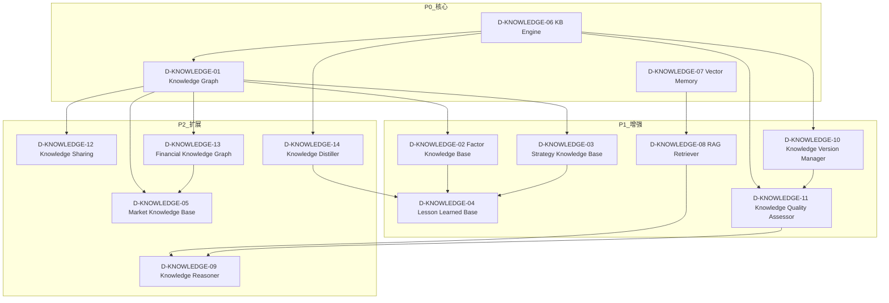
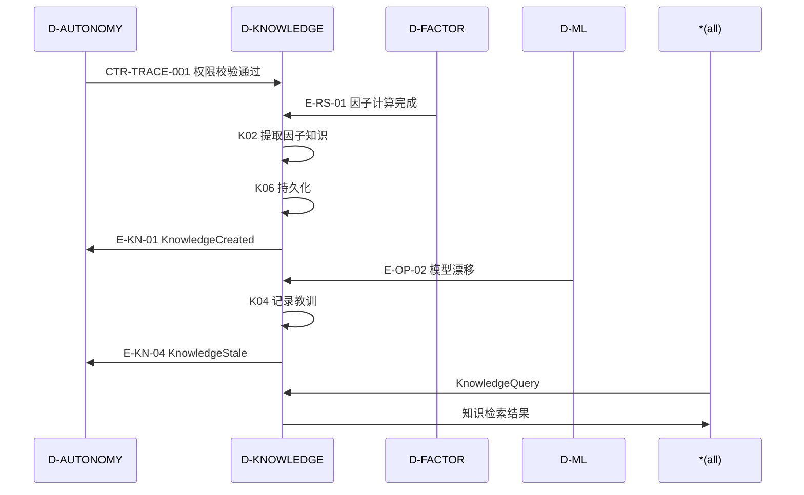

# 21 — D-KNOWLEDGE 知识域

## §0 域定义

| 属性 | 值 |
|------|-----|
| 域ID | D-KNOWLEDGE |
| 域名 | 知识域 |
| 职责 | 知识图谱、因子知识、策略知识、教训知识 |
| 核心层 | L12(知识层) |
| 成熟度 | L0 ⚪规划 |
| 优先级 | P1 |
| 架构定位 | 技术驱动层——知识本身是什么，与D-AUTONOMY-05(AI怎么记住)正交 |
| 核心Aggregate | KnowledgeEntity |
| 核心事件 | E-KN-01 KnowledgeCreated / E-KN-02 KnowledgeUpdated / E-KN-03 KnowledgeRetrieved |
| 激活前提 | D-AUTONOMY就绪 |

### 与D-AUTONOMY的边界

| 维度 | D-AUTONOMY-05 | D-KNOWLEDGE |
|------|---------------|-------------|
| 管什么 | AI怎么记住（存储机制/检索机制/记忆生命周期） | 知识本身是什么（知识结构/知识关系/知识质量） |
| 类比 | 大脑的海马体（记忆存取） | 大脑的新皮层（知识表征） |
| 存储 | FAISS/SQLite/FTS5 | 知识图谱/因子库/策略库/教训库 |

## §0.1 能力对齐（Step 1: 子模块←→能力定位对齐）

> 来源：能力定位书§9 | 2项能力(2●核心+0◐辅助)，负载等级"低"

### 显式能力覆盖

| 能力ID | 名称 | 优先级 | 角色 | 覆盖子模块 | 覆盖评估 |
|--------|------|:------:|:----:|-----------|:--------:|
| C-016 | 知识图谱引擎 | P1 | ●核心 | K-01+K-13+K-15+K-24 | ✅充分 |
| C-024 | 知识模型自进化 | P1 | ●核心 | K-11+K-16+K-17+K-26+K-27 | ✅充分 |

### 数据源全景清单§第六部分→D-KNOWLEDGE子模块映射

| 图谱类型 | 数据源 | 覆盖子模块 | 状态 |
|---------|--------|-----------|:----:|
| 公司关系图谱(股权穿透/实控人/高管) | iFind公司图谱 | K-13(FinancialKG) | ✅ |
| 产业链图谱(100+产业链,238K实体+551K关系) | iFind产业谱图 | K-13(FinancialKG) | ⚠️数据源稳定性待验证 |
| 供应链图谱(供应商-客户) | iFind/年报 | K-13(FinancialKG) | ⚠️数据源稳定性待验证 |
| 宏观因果链(利率→汇率→外资→A股) | iFind+LLM | K-01+K-09 | 📋待建 |
| 地缘政治图谱(冲突→大宗商品→板块) | 新闻+LLM | K-01 | 📋待建 |
| 加密资产关联图谱(BTC→纳斯达克→科技股) | iFind+本地构建 | K-01 | 📋远期 |
| 政策影响图谱(监管→行业→个股) | iFind新闻+LLM | K-01 | 📋远期 |

### M系列模块归属建议

M15(风险传播7模块)/M38(依赖建模11模块)/M50(调用图4模块)/D82(文档-代码依赖)共约25个模块，本质是"依赖图分析"而非"知识管理"，建议归入D-SIMULATION的Digital Twin系列或独立为D-DEP-ANALYSIS(依赖分析域)。本域仅保留K-01~K-27知识核心模块。

## §1 子模块清单

| ID | 名称 | 职责 | 优先级 | 开发状态 | 对标依据 |
|----|------|------|:------:|:--------:|---------|
| D-KNOWLEDGE-01 | Knowledge Graph | 知识图谱+Neo4j/NetworkX+实体关系+图查询 | P0 | ❌ | Neo4j/NetworkX |
| D-KNOWLEDGE-02 | Factor Knowledge Base | 因子知识库+因子定义+因子关系+因子历史 | P1 | ❌ | 与D-FACTOR联动 |
| D-KNOWLEDGE-03 | Strategy Knowledge Base | 策略知识库+策略定义+策略表现+策略教训 | P1 | ❌ | 与D-PORTFOLIO联动 |
| D-KNOWLEDGE-04 | Lesson Learned Base | 教训知识库+失败案例+根因分析+预防措施 | P1 | ❌ | 5 Whys |
| D-KNOWLEDGE-05 | Market Knowledge Base | 市场知识库+Regime知识+行业知识+宏观知识 | P2 | ❌ | 与D-SIGNAL联动 |
| D-KNOWLEDGE-06 | KB Engine | 知识库引擎+CRUD+版本管理+搜索+FTS5 | P0 | ✅ 已有 | zephyr/kb/ |
| D-KNOWLEDGE-07 | Vector Memory | 向量记忆+FAISS+嵌入+相似度检索 | P0 | ✅ 已有 | SKILL-DOM-VMS-001 |
| D-KNOWLEDGE-08 | RAG Retriever | 知识检索+RAG+上下文注入+相关性排序 | P1 | ❌ | GraphRAG |
| D-KNOWLEDGE-09 | Knowledge Reasoner | 知识推理+因果推理+类比推理+LLM推理 | P2 | ❌ | Ollama+qwen3:8b |
| D-KNOWLEDGE-10 | Knowledge Version Manager | 知识版本管理+变更追踪+回滚 | P1 | ❌ | Git-like |
| D-KNOWLEDGE-11 | Knowledge Quality Assessor | 知识质量评估+过时检测+冲突检测+可信度评分 | P1 | ❌ | 专业标配 |
| D-KNOWLEDGE-12 | Knowledge Sharing | 知识共享+跨域知识桥接+知识推送 | P2 | ❌ | 与D-AUTONOMY A2A联动 |
| D-KNOWLEDGE-13 | Financial Knowledge Graph | 金融知识图谱+公司关系+行业链+供应链 | P2 | ❌ | 从D-DATA-21拆出 |
| D-KNOWLEDGE-14 | Knowledge Distiller | 知识蒸馏+从代码/日志/蓝图中提取知识 | P2 | ❌ | LLM辅助 |
| M15-S01 | 风险传播建模器 | 建模风险在依赖图中的传播路径 | P1 | ❌ | IMF WP 2026/033 / ECB ISA 2025 |
| M15-S02 | 级联失效仿真器 | 仿真级联失效场景 | P1 | ❌ | IMF GFSR 2025.10 |
| M15-S03 | 系统性风险评估器 | 评估系统性风险水平和关键节点 | P1 | ❌ | ECB ISA 2025 / FSB |
| M15-S04 | 风险缓解策略推荐器 | 推荐风险缓解策略：隔离/降级/熔断 | P1 | ❌ | — |
| M15-S07 | 压力测试集成器 | 集成压力测试场景 | P1 | ❌ | ECB ISA 2025 |
| M15-NEW-03 | Systemic Risk Early Warning System | 系统性风险早期预警：网络中心性指标异常检测 | P1 | ❌ | ECB Systemic Risk Dashboard / FSB |
| M15-NEW-04 | Monte Carlo Cascade Simulator | 蒙特卡洛模拟级联失效：概率化影响范围估计 | P1 | ❌ | NASA CASA / Swiss Re CatBond / Nature 2025 |
| M38-S01 | Data Layer Dependency Modeler | 建模数据层依赖(行情/另类数据/LLM API) | P1 | ❌ | CME Group 2024 |
| M38-S02 | Decision Layer Dependency Modeler | 建模决策层依赖(因子/信号/组合) | P1 | ❌ | — |
| M38-S03 | Risk Layer Dependency Modeler | 建模风控层依赖(限额/保证金/回撤) | P1 | ❌ | ESMA / Basel III |
| M38-S04 | Execution Layer Dependency Modeler | 建模执行层依赖(订单/成交/对账) | P1 | ❌ | NASDAQ 2024 |
| M38-S05 | Cross-Layer Dependency Analyzer | 分析跨层依赖传播 | P1 | ❌ | — |
| M38-NEW-01 | Low-Latency Dependency Critical Path Analyzer | 低延迟依赖关键路径分析器——纳秒级P99瓶颈定位 | P1 | ❌ | CME Group 2024 / ACM SIGMETRICS 2024 |
| M38-NEW-02 | Market Data Feed Dependency Failover Model | 行情数据源依赖故障转移模型 | P1 | ❌ | FIX Trading Community 2024 |
| M38-NEW-03 | Order Lifecycle Dependency State Machine | 委托生命周期依赖状态机 | P1 | ❌ | FIX Latest 2024 |
| M38-NEW-04 | Risk Check Dependency Short-Circuit Evaluator | 风控检查依赖短路评估器 | P1 | ❌ | — |
| M38-NEW-05 | Colocation Dependency Topology Optimizer | 托管依赖拓扑优化器——物理位置依赖延迟优化 | P1 | ❌ | Jane Street Tech Blog 2024 |
| D-KNOWLEDGE-15 | Knowledge Graph Explorer | 知识图谱浏览器：图谱可视化+交互式探索+路径发现+社区检测+知识导航。理论：图可视化/交互设计/图算法。具备图谱访问审计/探索记录/知识导航合规检查 | P1 | ❌ | 图可视化/交互设计/图算法; 3D图谱/VR知识探索/AI导航; D3.js/Cytoscape/Neo4j Bloom; 图谱访问审计/探索记录/知识导航合规 |
| D-KNOWLEDGE-16 | Knowledge Feedback Loop | 知识反馈循环：知识使用反馈+效果追踪+知识更新触发+知识质量改进+闭环优化。理论：反馈系统/持续改进/知识管理。具备反馈审计/效果追踪报告/知识改进合规检查 | P1 | ❌ | 反馈系统/持续改进/知识管理; AI反馈分析/自适应知识更新/智能改进; PDCA/持续改进; 反馈审计/效果追踪报告/知识改进合规 |

## §2 域内依赖图M38-NEW-06 | FIX Protocol Dependency Graph Builder | FIX协议依赖图构建器 | P1 | ❌ | FIX Trading Community 2024 |
| M50-S01 | Python AST解析器 | Python AST解析：Python源代码AST解析+结构提取+依赖识别 | P1 | ❌ | Python ast模块 |
| M50-NEW-01 | Python动态调用图增强器 | Python动态调用图增强：运行时动态调用图构建+反射/动态导入处理 | P1 | ❌ | — |
| M50-NEW-02 | 类型推断增强调用图 | 类型推断增强调用图：基于类型推断的静态调用图构建+泛型处理 | P1 | ❌ | mypy / pyright |
| M50-NEW-03 | 调用图增量更新器 | 调用图增量更新：代码变更后调用图增量更新+高效同步 | P1 | ❌ | Facebook Glean 2024 |
| D82 | 文档-代码依赖图构建器 | 文档-代码依赖图构建：文档与代码的双向依赖图构建+同步校验 | P1 | ❌ | — |
| D-KNOWLEDGE-17 | AI Auto Knowledge Extractor | AI自动知识提取器：wandb实验报告+研究笔记+策略代码+回测报告的AI自动提取+知识结构化+知识入库。理论：知识提取/知识结构化/自然语言处理。具备知识提取审计/知识入库合规检查 | P1 | ❌ | AI自动知识提取/wandb/研究笔记/策略代码; 知识结构化/知识入库; 知识提取审计/知识入库合规 |
| D-KNOWLEDGE-18 | AI Auto Code Annotator | AI自动代码注释器：策略代码AI自动注释+代码理解+注释生成+文档生成。理论：代码理解/注释生成/文档生成。具备代码注释审计/文档生成合规检查 | P2 | ❌ | AI自动代码注释/代码理解/注释生成; 文档生成; 代码注释审计/文档生成合规 |
| D-KNOWLEDGE-19 | Obsidian Knowledge Base Integrator | Obsidian知识库集成器：人工整理知识库+Obsidian集成+双向链接+知识图谱+知识搜索。理论：知识库集成/双向链接/知识图谱。具备知识库集成审计/Obsidian集成合规检查 | P2 | ❌ | Obsidian知识库集成/双向链接/知识图谱; 知识搜索; 知识库集成审计/Obsidian集成合规 |
| D-KNOWLEDGE-20 | Research Project Registry & Note Manager | 研究项目登记与笔记管理器：SQLite/PostgreSQL研究项目登记+Jupyter Notebook+Obsidian研究笔记。理论：项目登记/研究笔记/知识管理。具备项目登记审计/研究笔记合规检查 | P1 | ❌ | 研究项目登记/SQLite/PostgreSQL/Jupyter/Obsidian; 项目登记/研究笔记/知识管理; 自适应登记/在线笔记监控/登记优化; 项目登记审计/研究笔记合规 |
| D-KNOWLEDGE-21 | Knowledge Base Search Engine | 知识库搜索引擎：跨知识库全文检索与语义搜索。理论：全文检索/语义搜索/知识检索。具备搜索审计/知识检索合规检查 | P1 | ❌ | 知识库搜索/全文检索/语义搜索; 全文检索/语义搜索/知识检索; 自适应搜索/在线检索监控/搜索优化; 搜索审计/知识检索合规 |
| D-KNOWLEDGE-22 | Factor Reuse Recommender | 因子复用推荐：基于相似度的因子复用推荐。理论：因子复用/相似度/推荐系统。具备因子推荐审计/因子复用合规检查 | P2 | ❌ | 因子复用推荐/相似度/推荐; 因子复用/相似度/推荐系统; 自适应推荐/在线相似度监控/推荐优化; 因子推荐审计/因子复用合规 |
| D-KNOWLEDGE-23 | Case Library Tag System | 案例库标签体系：案例多维度标签与关联检索。理论：案例标签/多维标签/关联检索。具备标签体系审计/案例管理合规检查 | P2 | ❌ | 案例库标签/多维标签/关联检索; 案例标签/多维标签/关联检索; 自适应标签/在线案例监控/标签优化; 标签体系审计/案例管理合规 |
| D-KNOWLEDGE-24 | Knowledge Graph Visualizer | 知识图谱可视化：因子-策略-案例关联图谱可视化。理论：知识图谱/可视化/关联图谱。具备图谱可视化审计/知识图谱合规检查 | P1 | ❌ | 知识图谱可视化/因子/策略/案例; 知识图谱/可视化/关联图谱; 自适应可视化/在线图谱监控/可视化优化; 图谱可视化审计/知识图谱合规 |
| D-KNOWLEDGE-25 | Research Knowledge Precipitator | 研究知识沉淀：研究结论自动归档到知识库。理论：知识沉淀/自动归档/知识管理。具备知识沉淀审计/知识归档合规检查 | P1 | ❌ | 研究知识沉淀/自动归档/知识库; 知识沉淀/自动归档/知识管理; 自适应沉淀/在线归档监控/沉淀优化; 知识沉淀审计/知识归档合规 |
| D-KNOWLEDGE-26 | 知识来源质量评分器 | 知识来源质量评分器：各来源知识质量/准确率/时效性评分+评分更新+评分趋势。理论：质量评分/准确率/时效性。具备质量评分审计/知识来源合规检查 | P1 | ❌ | 知识来源质量评分/准确率/时效性/评分趋势; 质量评分/准确率/时效性; 自适应评分/在线质量监控/评分优化; 质量评分审计/知识来源合规 |
| D-KNOWLEDGE-27 | 知识去重与合并检测器 | 知识去重与合并检测器：多来源相同知识的自动识别与合并+去重策略+合并记录。理论：知识去重/合并检测/去重策略。具备去重合并审计/知识去重合规检查 | P1 | ❌ | 知识去重合并/多来源识别/去重策略; 知识去重/合并检测/去重策略; 自适应去重/在线知识监控/去重优化; 去重合并审计/知识去重合规 |

## §2 域内依赖图



### 域内依赖关系表

| 源 | 目标 | 依赖类型 | 说明 |
|----|------|---------|------|
| K06 | K01 | 存储供给 | KB引擎→知识图谱存储层 |
| K07 | K08 | 检索供给 | 向量记忆→RAG检索的向量召回 |
| K01 | K02 | 图谱支撑 | 知识图谱→因子知识的关系网络 |
| K01 | K03 | 图谱支撑 | 知识图谱→策略知识的关系网络 |
| K01 | K05 | 图谱支撑 | 知识图谱→市场知识的关系网络 |
| K01 | K13 | 图谱支撑 | 知识图谱→金融知识图谱的通用图引擎 |
| K06 | K10 | 版本管理 | KB引擎→知识版本管理 |
| K06 | K11 | 质量评估 | KB引擎→知识质量评估的数据源 |
| K08 | K09 | 检索结果 | RAG检索→知识推理的输入 |
| K11 | K09 | 质量信号 | 质量评估→推理的可信度加权 |
| K01 | K12 | 共享基础 | 知识图谱→跨域知识桥接 |
| K06 | K14 | 蒸馏目标 | KB引擎→知识蒸馏的写入目标 |
| K14 | K04 | 教训提取 | 知识蒸馏→教训知识库 |
| K02 | K04 | 因子教训 | 因子知识→教训知识（因子失败案例） |
| K03 | K04 | 策略教训 | 策略知识→教训知识（策略失败案例） |
| K10 | K11 | 版本信号 | 版本变更→质量评估的触发 |
| K13 | K05 | 金融图谱 | 金融知识图谱→市场知识的公司/行业维度 |

## §3 域间依赖

### 消费依赖（D-KNOWLEDGE 依赖其他域）

| 契约ID | 供给域 | 依赖强度 | 内容 | 说明 |
|--------|--------|:--------:|------|------|
| CTR-TRACE-001 | D-AUTONOMY | H | 权限/审计 | 知识操作需权限校验+审计记录 |
| — | *(all) | E | 各域知识产出 | 所有域的知识产出流入知识域 |
| CTR-ML-001 | D-ML | S | 嵌入模型 | BGE-M3/bge-small嵌入服务 |

### 产出依赖（其他域依赖 D-KNOWLEDGE）

| 产出 | 消费域 | 依赖强度 | 说明 |
|------|--------|:--------:|------|
| KnowledgeQuery | *(all) | S | 所有域可查询知识 |
| KnowledgeAlert | D-AUTONOMY | E | 知识过时/冲突告警触发自治响应 |

### 域间依赖图

```mermaid
graph LR
    D-AUTONOMY[D-AUTONOMY 自治域] -->|CTR-TRACE-001 H| D-KNOWLEDGE[D-KNOWLEDGE 知识域]
    D-ML[D-ML 机器学习域] -->|嵌入模型 S| D-KNOWLEDGE
    D-FACTOR[D-FACTOR 因子域] -.->|因子知识 E| D-KNOWLEDGE
    D-PORTFOLIO[D-PORTFOLIO 组合域] -.->|策略知识 E| D-KNOWLEDGE
    D-SIGNAL[D-SIGNAL 信号域] -.->|市场知识 E| D-KNOWLEDGE
    D-DATA[D-DATA 数据域] -.->|数据知识 E| D-KNOWLEDGE

    D-KNOWLEDGE -->|KnowledgeQuery S| ALL[*(all)]
    D-KNOWLEDGE -->|KnowledgeAlert E| D-AUTONOMY
```

## §4 域事件流

### 产出事件

| 事件ID | 事件名 | 触发条件 | 载荷 | 消费域 |
|--------|--------|---------|------|--------|
| E-KN-01 | KnowledgeCreated | 新知识实体创建 | knowledge_id, type, source, created_at | D-AUTONOMY(审计) |
| E-KN-02 | KnowledgeUpdated | 知识实体更新 | knowledge_id, delta, updated_at | D-AUTONOMY(审计), *(all)(订阅) |
| E-KN-03 | KnowledgeRetrieved | 知识检索 | knowledge_id, query, relevance_score | —(内部指标) |
| E-KN-04 | KnowledgeStale | 知识过时 | knowledge_id, staleness_score, last_verified | D-AUTONOMY(告警) |
| E-KN-05 | KnowledgeConflict | 知识冲突 | knowledge_id_a, knowledge_id_b, conflict_type | D-AUTONOMY(告警) |

### 消费事件

| 事件ID | 事件名 | 供给域 | D-KNOWLEDGE处理 |
|--------|--------|--------|----------------|
| E-RS-01 | FactorComputed | D-FACTOR | K02提取因子知识 |
| E-RS-03 | ModelValidated | D-ML | K02/K03提取模型知识 |
| E-OP-02 | ModelDriftDetected | D-ML | K04记录教训 |
| — | 各域业务事件 | *(all) | K14蒸馏提取知识 |

### 事件流时序图



## §5 激活前提

| 前提 | 域 | 状态 | 说明 |
|------|-----|------|------|
| D-AUTONOMY就绪 | D-AUTONOMY | 必须 | 权限/审计/记忆机制是知识域的运行前提 |
| 嵌入模型可用 | D-ML / D-AUTONOMY | 必须 | BGE-M3嵌入服务用于向量检索 |

### 激活阶段

| 阶段 | 前提 | 可激活模块 |
|------|------|-----------|
| Phase 1 | D-AUTONOMY就绪 | K06, K07（已有代码基础） |
| Phase 2 | Phase 1 | K01, K10, K11 |
| Phase 3 | Phase 2 + 至少一个业务域就绪 | K02/K03/K04/K05（按业务域就绪顺序） |
| Phase 4 | Phase 3 | K08, K09, K12, K13, K14 |

## §6 设计决策记录

| # | 决策 | 理由 | 影响 |
|---|------|------|------|
| 1 | 知识域独立于自治域——自治管"怎么记住"，知识管"记住什么" | 职责正交：存储机制≠知识结构，避免自治域膨胀 | D-AUTONOMY-05保留记忆机制，D-KNOWLEDGE管理知识本体 |
| 2 | KB引擎从zephyr/kb/升级——已有代码基础 | kb/已有CRUD/FTS5/ingest/pipeline，升级成本最低 | K06标记✅已有，直接升级 |
| 3 | 向量记忆从VMS Skill升级——FAISS已有 | InProcessVectorMemory 8 Collection已实现，HybridRetriever已就绪 | K07标记✅已有，SKILL-DOM-VMS-001 |
| 4 | 金融知识图谱从D-DATA-21拆出——知识是知识域的核心 | 金融图谱的本质是知识图谱，不是数据管道 | D-DATA-21迁移到K13，D-DATA域保留数据接入 |
| 5 | 知识蒸馏——从代码/日志/蓝图中自动提取知识 | 一人+AI的核心能力：让AI从已有资产中自动发现知识 | K14依赖LLM推理，P2优先级 |
| 6 | 新增M15-S01 风险传播建模器 | 建模风险在依赖图中的传播路径，风险传染/级联失效 | IMF WP 2026/033 / ECB ISA 2025 |
| 7 | 新增M15-S02 级联失效仿真器 | 仿真级联失效场景，系统性风险分析 | IMF GFSR 2025.10 |
| 8 | 新增M15-NEW-04 Monte Carlo Cascade Simulator | 蒙特卡洛模拟级联失效，概率化影响范围估计 | NASA CASA / Swiss Re CatBond / Nature 2025 |

### 行业对标依据

| 来源类型 | 来源 | 核心观点/发现 | 对标子模块 |
|---------|------|-------------|-----------|
| 学术前沿 | Sarcouncil J. Eng. 2025 | 知识图谱替代传统依赖映射 | K01知识图谱 |
| 学术前沿 | ACM MIDAS 2025 | OLTP/OLAP双模式查询基准 | K08 RAG检索 |
| 社区 | GraphRAG (Microsoft, 28K stars) | 知识图谱+RAG | K08 RAG检索 |

## §7 与现有体系对账

| 对账项 | 本域记录 | 现有体系 | 一致性 |
|--------|---------|---------|:------:|
| K06 KB Engine | §1开发状态✅ | src/zephyr/kb/ (25+文件) | ✅ |
| K07 Vector Memory | §1开发状态✅ | src/zephyr/vector_memory/ (FAISS+8 Collection) | ✅ |
| SKILL-DOM-VMS-001 | §1对标依据 | agent_spec skills注册 | ✅ |
| D-DATA-21 Financial Knowledge Graph | §6决策4 | 02-D-DATA-数据域.md | ⚠️ 需迁移 |
| D-AUTONOMY-05 Knowledge & Memory | §0边界定义 | 22-D-AUT-CORE-自治核心域.md | ✅ 正交拆分 |
| E-KN-01~05 事件 | §4产出事件 | 事件目录 | 🆕 新增 |
| K01~05, K08~14 | §1开发状态❌ | 代码库 | 🆕 待建 |

✅ 文件完整性验证通过

---

## §3 域内依赖（Step 2）

### 关键依赖链

- K-06→K-01→K-13 (引擎→图谱→金融图谱——知识存储主线)
- K-07→K-08→K-09 (向量→RAG→推理——知识检索主线)
- K-16→K-11→K-27 (反馈→质量→去重——知识进化主线)

### 依赖关系详表

| 源 | 目标 | 依赖类型 | 说明 |
|----|------|---------|------|
| K-06 | K-01 | 存储供给 | KB引擎→知识图谱存储层 |
| K-07 | K-08 | 检索供给 | 向量记忆→RAG检索的向量召回 |
| K-01 | K-02 | 图谱支撑 | 知识图谱→因子知识的关系网络 |
| K-01 | K-03 | 图谱支撑 | 知识图谱→策略知识的关系网络 |
| K-01 | K-05 | 图谱支撑 | 知识图谱→市场知识的关系网络 |
| K-01 | K-13 | 图谱支撑 | 知识图谱→金融知识图谱的通用图引擎 |
| K-06 | K-10 | 版本管理 | KB引擎→知识版本管理 |
| K-06 | K-11 | 质量评估 | KB引擎→知识质量评估的数据源 |
| K-08 | K-09 | 检索结果 | RAG检索→知识推理的输入 |
| K-11 | K-09 | 质量信号 | 质量评估→推理的可信度加权 |
| K-01 | K-12 | 共享基础 | 知识图谱→跨域知识桥接 |
| K-06 | K-14 | 蒸馏目标 | KB引擎→知识蒸馏的写入目标 |
| K-14 | K-04 | 教训提取 | 知识蒸馏→教训知识库 |
| K-02 | K-04 | 因子教训 | 因子知识→教训知识(因子失败案例) |
| K-03 | K-04 | 策略教训 | 策略知识→教训知识(策略失败案例) |
| K-10 | K-11 | 版本信号 | 版本变更→质量评估的触发 |
| K-13 | K-05 | 金融图谱 | 金融知识图谱→市场知识的公司/行业维度 |
| K-16 | K-11 | 反馈闭环 | 知识反馈→质量评估触发 |
| K-17 | K-06 | 提取写入 | AI自动提取→KB引擎入库 |
| K-25 | K-06 | 沉淀写入 | 研究知识沉淀→KB引擎入库 |
| K-21 | K-06+K-07+K-08 | 搜索聚合 | 搜索引擎→全源检索 |

---

## §4 域间接口（Step 3）

### 消费依赖

| 接口ID | 方向 | 契约/事件 | 对端域 | 内容 | 优先级 |
|--------|------|---------|--------|------|:------:|
| KNW-AC-01 | D-AUTONOMY→KNW | CTR-TRACE-001 | D-AUTONOMY-CORE | 权限/审计/遥测 | P0 |
| KNW-FACTOR-01 | D-FACTOR→KNW | E-RS-01(event) | D-FACTOR | FactorComputed→因子知识提取 | P1 |
| KNW-ML-01 | D-ML-TRAIN→KNW | E-RS-03(event) | D-ML-TRAIN | ModelValidated→模型知识提取 | P1 |
| KNW-SIGNAL-01 | D-SIGNAL→KNW | (event) | D-SIGNAL | 信号事件→信号知识提取 | P1 |
| KNW-INFRA-01 | D-INFRA-RUNTIME→KNW | — | D-INFRA-RUNTIME | 基础设施服务(存储/计算) | P1 |
| KNW-RES-01 | D-RESEARCH→KNW | — | D-RESEARCH | ResearchDiscovery→知识沉淀 | P1 |

### 产出依赖

| 接口ID | 方向 | 契约/事件 | 对端域 | 内容 | 优先级 |
|--------|------|---------|--------|------|:------:|
| KNW→ALL-01 | KNW→*(all) | — | *(all) | KnowledgeQuery→所有域可查询知识 | P1 |
| KNW→AC-01 | KNW→D-AUTONOMY | E-KN-04/05 | D-AUTONOMY-CORE | KnowledgeStale/Conflict→告警 | P1 |
| KNW→SIM-01 | KNW→D-SIMULATION | — | D-SIMULATION | KnowledgeGraph因果链→场景生成 | P2 |
| KNW→SIGNAL-01 | KNW→D-SIGNAL | E-KN-06 | D-SIGNAL | KGImpactAnalysis→信号修正 | P1 |
| KNW→RES-01 | KNW→D-RESEARCH | — | D-RESEARCH | KnowledgeQuery→研究辅助 | P1 |
| KNW→FE-01 | KNW→D-FRONTEND | — | D-FRONTEND | KGQueryResult→知识可视化 | P2 |

### P0冻结签名

| 接口ID | 签名 | 方向 |
|--------|------|------|
| KNW-AC-01 | `CTR-TRACE-001: AuditTrace` | AC→KNW |

---

## §5 域事件流（Step 4）

### 产出事件

| 事件ID | 事件名 | 触发条件 | 载荷 | 消费域 | 频率 |
|--------|--------|---------|------|--------|:----:|
| E-KN-01 | KnowledgeCreated | 新知识实体创建 | knowledge_id, type, source | D-AUTONOMY(审计) | L2 |
| E-KN-02 | KnowledgeUpdated | 知识实体更新 | knowledge_id, delta | D-AUTONOMY(审计), *(订阅) | L2 |
| E-KN-03 | KnowledgeRetrieved | 知识检索(内部指标) | knowledge_id, query, relevance | —(内部) | L3 |
| E-KN-04 | KnowledgeStale | 知识过时 | knowledge_id, staleness_score | D-AUTONOMY(告警) | L3 |
| E-KN-05 | KnowledgeConflict | 知识冲突 | knowledge_id_a, knowledge_id_b, conflict_type | D-AUTONOMY(告警) | L3 |
| E-KN-06 | KGImpactAnalysis | 知识图谱影响链分析完成 | event_id, affected_stocks, transmission_path | D-SIGNAL, D-PF-CORE | L1 |

### 消费事件

| 事件ID | 事件名 | 供给域 | D-KNOWLEDGE处理 |
|--------|--------|--------|----------------|
| — | FactorComputed | D-FACTOR | K-02提取因子知识 |
| — | ModelValidated | D-ML-TRAIN | K-02/K-03提取模型知识 |
| E-OP-02 | ModelDriftDetected | D-ML-SERVE | K-04记录教训 |
| — | 各域业务事件 | *(all) | K-14蒸馏提取知识 |

---

## §6 激活前提（Step 5）

| 前提 | 域 | 必须/部分 | 就绪标准 |
|------|-----|:---------:|---------|
| 权限/审计就绪 | D-AUTONOMY-CORE | 必须 | RBAC+审计日志+记忆机制可用 |
| 嵌入模型可用 | D-ML-SERVE / D-AUTONOMY | 必须 | BGE-M3/bge-small嵌入服务可用 |
| 基础设施就绪 | D-INFRA-RUNTIME | 部分 | 存储和计算资源可用 |

### 激活阶段

| 阶段 | 前提 | 可激活模块 |
|------|------|-----------|
| Phase 1 | D-AUTONOMY就绪 | K-06(KBEngine, 已有代码), K-07(VectorMemory, 已有代码), K-10 |
| Phase 2 | Phase 1 | K-01, K-11, K-08, K-21 |
| Phase 3 | Phase 2 + 至少一个业务域就绪 | K-02, K-03, K-04, K-13 |
| Phase 4 | Phase 3 | K-09, K-12, K-14, K-15, K-16~17 |

---

## §7 设计决策（Step 6）

| # | 决策 | 理由 | 影响 |
|---|------|------|------|
| 1 | 知识域独立于自治域 | 自治管"怎么记住"(存储机制)，知识管"记住什么"(知识结构)——职责正交 | D-AUTONOMY-05保留记忆机制，D-KNOWLEDGE管理知识本体 |
| 2 | KB引擎从zephyr/kb/升级 | kb/已有CRUD/FTS5/ingest/pipeline，升级成本最低 | K-06标记已有代码基础 |
| 3 | 向量记忆从VMS Skill升级 | InProcessVectorMemory 8 Collection已实现，HybridRetriever已就绪 | K-07标记已有代码基础 |
| 4 | 金融知识图谱从D-DATA-21拆出 | 金融图谱本质是知识图谱，不是数据管道 | D-DATA-21迁移到K-13 |
| 5 | 图谱存储用NetworkX而非Neo4j | 单机场景NetworkX足够(DD-P6-01) | 中期门禁：图谱实体>500K或最短路径查询>5秒→迁移Neo4j |
| 6 | 产业图谱优先于宏观因果链 | 产业图谱数据源(iFind)已就绪(DD-P6-02) | K-13实现顺序：公司→产业→供应链→宏观→地缘 |
| 7 | M15/M38/M50系列模块建议迁出 | 依赖图分析≠知识管理，职责不正交 | 建议归入D-SIMULATION Digital Twin或独立D-DEP-ANALYSIS |
| 8 | 知识图谱事件触发→影响链分析<30s | C-016成功标准 | K-01需实现事件驱动的影响链自动分析 |
| 9 | GNN/Causal ML远期实现 | 需要稳定的图谱基础和模型工厂支撑(DD-P6-03) | 2027 Q3+规划 |
| 10 | 知识图谱因果链→D-SIMULATION场景生成 | 因果传导路径可驱动仿真场景参数 | KNW→SIM-01为P2增强接口 |

## §7 合规约束(A6)

> 源自合规架构(A6)§14.4合规知识持续积累。合规域与知识域(D-KNOWLEDGE)的交叉点——合规知识的结构化管理由本域执行。

### §7.1 合规知识持续积累（源自A6§14.4）

> 合规知识是知识域的特殊子类——合规案例/法规/义务/控制措施的结构化管理。本域提供知识存储与检索基础设施，合规域提供合规知识的业务语义。

| 功能 | 说明 | 当前状态 | 门禁条件 | D-KNOWLEDGE执行方式 |
|------|------|---------|---------|-------------------|
| 合规案例库 | 历史合规事件/违规案例的结构化存储+多维标签+关联检索 | ✅能建 | — | K-04教训知识库扩展合规案例子库+K-23案例库标签体系多维标签 |
| 法规知识图谱 | 法规-条文-合规义务-控制措施的知识图谱 | ✅能建 | — | K-01知识图谱+K-13金融知识图谱扩展法规节点类型+合规义务关系边 |
| 合规知识蒸馏 | 从代码/日志/审计报告自动提取合规知识 | ✅能建 | — | K-14知识蒸馏器扩展合规知识提取管道：审计日志→合规事件→知识入库 |
| 合规知识质量评分 | 合规知识来源的准确率/时效性自动评分 | ✅能建 | — | K-26知识来源质量评分器扩展合规知识质量维度：法规时效性/案例准确性/义务完整性 |

### 与现有内容重叠检查

| 本域已有内容 | 新搬入内容 | 重叠处理 |
|------------|-----------|---------|
| K-04教训知识库 | §7.1合规案例库 | ✅一致，§7.1为K-04增加合规案例子库的特定结构 |
| K-01知识图谱 | §7.1法规知识图谱 | ✅一致，§7.1为K-01增加法规节点类型和合规义务关系边 |
| K-14知识蒸馏器 | §7.1合规知识蒸馏 | ✅一致，§7.1为K-14增加合规知识提取管道 |
| K-26知识来源质量评分器 | §7.1合规知识质量评分 | ✅一致，§7.1为K-26增加合规知识质量维度 |

---

## §8 知识流全景图（源自架构文档§2.3）

> 以下为知识流全景图，展示一条知识从采集到注入到反馈的完整生命周期。与系统架构图共同构成唯一真源。v4.0升级：新增因果发现/辩论精炼/AST沙箱/4级风控/MLOps闭环/权重中心接口。v5.0升级：新增共形漂移/多尺度漂移/TimePC/CausalNLP/Causal KG/因子语义去重/可解释设计约束/高级回测5项/MAML/元反思/AutoSkill/技能三元组/Causal SHAP/Concept/LLM-as-Explainer/NIST AI 100-5/Agent能力评估/Event Schema Versioning/漂移感知集成。v6.0升级：新增LLM引导因果发现先验/带干预的时序因果发现/表示学习驱动漂移检测/因果约束反事实解释/交互式解释/信息论过拟合检测/市场状态感知Walk-Forward/带推理路径的KG-RAG/Dynamic KG动态知识图谱/ICL作为元学习/技能依赖解析。v7.0升级：新增Feature Store/PIT Manager/Sentiment Engine/Filing NLP Engine/多模态融合引擎/Knowledge Quality Assessor/Data Quality Scorer/Signal Extractor/因果发现三阶段扩展/Knowledge Distiller/LLM Market Interpreter/Causal Factor Validator/Market Regime Detector/Knowledge Graph Engine/风险传播建模/AutoML Engine/Factor Mining Agent/Hypothesis Manager/Strategy Lifecycle Manager/AI Construction Governor/LLM Security Gateway/Pipeline编排器/Saga事务编排/可配置规则引擎/Experiment Tracker/Walk-Forward Analyzer完整版/过拟合检测扩展/Look-Ahead Bias Detector/Signal Confidence Scorer/三层参数优化/5层记忆架构/数据血缘追踪/GPU Resource Manager/Non-AI Module Boundary Guard/Decision Audit Trail。v8.0升级：新增Training Data Manager/Synthetic Data Generator基础版/Lesson Learned Base/Knowledge Version Manager/Strategy Sandbox轻量版/Liquidity & Slippage Simulator/Order Matching Simulator/Scenario Generator基础版/AI API Cost Manager/Trading Domain NLP Engine/Knowledge Base Search Engine/Research Knowledge Precipitator/Knowledge Graph Explorer/Backtest-to-Production Deployer/Model Profiler & Capability Exam/Agent Communication Protocol/Capacity Assurance & SLI/SLO。

```
╔══════════════════════════════════════════════════════════════════════════════════════════════════╗
║                 统一知识流架构 v8.0 — 唯一真源（Unified Knowledge Flow）                           ║
║                 展示一条知识从采集→清洗→分类→映射→创建→试运行→注入→反馈的完整生命周期              ║
╠══════════════════════════════════════════════════════════════════════════════════════════════════╣
║                                                                                                ║
║  ═════════════════════════════════════════════════════════════════════════════════════════════  ║
║  ║  第一部分：知识采集与提取（S0→S2）                                                          ║  ║
║  ═════════════════════════════════════════════════════════════════════════════════════════════  ║
║                                                                                                ║
║  ┌─────────────────┐  ┌─────────────────┐  ┌─────────────────┐  ┌─────────────────┐          ║
║  │ 语音/视频        │  │ PDF/网址         │  │ 文字直入         │  │ 🆕图表/截图      │          ║
║  │ Whisper+OCR     │  │ 解析+爬虫        │  │ 用户粘贴         │  │ 🆕VLM视觉理解    │          ║
║  └────────┬────────┘  └────────┬────────┘  └────────┬────────┘  └────────┬────────┘          ║
║           │                    │                    │                    │                    ║
║           └────────────────────┼────────────────────┼────────────────────┘                    ║
║                                │                    │                                         ║
║  ┌─────────────────────────────▼────────────────────▼─────────────────────────────────────┐  ║
║  │  S0 多模态知识采集层                                                                     │  ║
║  │  🆕漂移感知调度(ADWIN/DDM) → 🆕Point-in-Time门控 → 🆕时序基础模型骨干(TimesFM)        │  ║
║  │  输出: RawKnowledgePacket                                                                │  ║
║  └──────────────────────────────────────┬──────────────────────────────────────────────────┘  ║
║                                         │                                                      ║
║  ┌──────────────────────────────────────▼──────────────────────────────────────────────────┐  ║
║  │  S1 知识清洗与结构化层                                                                   │  ║
║  │  去重+去噪+时间戳对齐+说话人分离+术语标准化                                               │  ║
║  │  🆕信息价值评分(相关性/时效性/信息量/可靠性) → 综合评分<0.3→REJECT                       │  ║
║  │  输出: StructuredKnowledgeFragment                                                       │  ║
║  └──────────────────────────────────────┬──────────────────────────────────────────────────┘  ║
║                                         │                                                      ║
║  ┌──────────────────────────────────────▼──────────────────────────────────────────────────┐  ║
║  │  S2 知识分类与策略提取层                                                                 │  ║
║  │                                                                                         │  ║
║  │  ┌──────────────────────────────────────────────────────────────────────────────┐       │  ║
║  │  │  LLM语义理解 → 知识类型分类(🆕11类) → 交易逻辑提取                           │       │  ║
║  │  │  策略/因子/市场状态/板块轮动/风控/事件/方法论/🆕流动性/🆕博弈/🆕制度/🆕教训    │       │  ║
║  │  └──────────────────────────────────────────────────────────────────────────────┘       │  ║
║  │                                         │                                              │  ║
║  │           ┌─────────────────────────────┼─────────────────────────────┐                 │  ║
║  │           │                             │                             │                 │  ║
║  │  ┌────────▼────────┐         ┌─────────▼─────────┐         ┌────────▼────────┐         │  ║
║  │  │ 🆕因果发现引擎   │         │ 🆕辩论式因子精炼   │         │ 矛盾检测        │         │  ║
║  │  │ PC→LiNGAM→      │         │ Generator⇄Critic  │         │ 一致→增强       │         │  ║
║  │  │ 时滞因果图→      │         │ →IC 0.58%→2.23%  │         │ 矛盾→降权       │         │  ║
║  │  │ LLM语义校验→     │         │ (仅因子知识)       │         │ 无匹配→新增     │         │  ║
║  │  │ 因果验证层        │         └──────────────────┘         └─────────────────┘         │  ║
║  │  └─────────────────┘                                                                     │  ║
║  │  输出: ClassifiedKnowledgePackage                                                        │  ║
║  └──────────────────────────────────────┬──────────────────────────────────────────────────┘  ║
║                                         │                                                      ║
║  ═════════════════════════════════════════════════════════════════════════════════════════════  ║
║  ║  第二部分：模块映射与创建（S3→S4）                                                          ║  ║
║  ═════════════════════════════════════════════════════════════════════════════════════════════  ║
║                                                                                                ║
║  ┌──────────────────────────────────────▼──────────────────────────────────────────────────┐  ║
║  │  S3 模块映射与工厂匹配层                                                                 │  ║
║  │  ClassifiedKnowledgePackage → 目标层级映射(L1~L6/§29) → 模块工厂查询                     │  ║
║  │  ├─ EXACT_MATCH(相似度>0.85) → 更新参数                                                  │  ║
║  │  ├─ PARTIAL_MATCH(0.5~0.85) → 扩展模块                                                  │  ║
║  │  └─ NO_MATCH(<0.5) → 生成ModuleRequirementSpec → 人工审核                                │  ║
║  │  输出: ModuleMappingResult                                                               │  ║
║  └──────────────────────────────────────┬──────────────────────────────────────────────────┘  ║
║                                         │                                                      ║
║  ┌──────────────────────────────────────▼──────────────────────────────────────────────────┐  ║
║  │  S4 模块创建与接入层                                                                     │  ║
║  │                                                                                         │  ║
║  │  ┌──────────────────────────────────────────────────────────────────────────────┐       │  ║
║  │  │  🆕DSL约束(6类算子) → 🆕AST沙箱(三层安全) → 🆕三重语义一致性(假设⇄表达式⇄代码) │       │  ║
║  │  └──────────────────────────────────────────────────────────────────────────────┘       │  ║
║  │                                         │                                              │  ║
║  │           ┌─────────────────────────────┼─────────────────────────────┐                 │  ║
║  │           │                             │                             │                 │  ║
║  │  ┌────────▼────────┐         ┌─────────▼─────────┐         ┌────────▼────────┐         │  ║
║  │  │ 🆕进化式代码生成 │         │ 🆕分析师Agent反馈  │         │ 人工审核         │         │  ║
║  │  │ 生成→回测→重写  │         │ Generator→Critic  │         │ (B-007)         │         │  ║
║  │  │ →...→收敛(≤5轮) │         │ →Judge→AST沙箱    │         │ 必经节点         │         │  ║
║  │  └─────────────────┘         └──────────────────┘         └─────────────────┘         │  ║
║  │  输出: NewModule → 注册到ModuleRegistry                                                   │  ║
║  └──────────────────────────────────────┬──────────────────────────────────────────────────┘  ║
║                                         │                                                      ║
║  ═════════════════════════════════════════════════════════════════════════════════════════════  ║
║  ║  第三部分：试运行与注入（S5→交易流水线）                                                     ║  ║
║  ═════════════════════════════════════════════════════════════════════════════════════════════  ║
║                                                                                                ║
║  ┌──────────────────────────────────────▼──────────────────────────────────────────────────┐  ║
║  │  S5 试运行与验证层                                                                       │  ║
║  │                                                                                         │  ║
║  │  ┌────────────┐    ┌────────────┐    ┌────────────┐    ┌────────────┐                  │  ║
║  │  │ IS阶段     │───→│ WFA阶段    │───→│ OOS阶段    │───→│ 🆕4级风控  │                  │  ║
║  │  │ 🆕稳定性   │    │ 🆕多数通过 │    │ 🆕参数锁定 │    │ APPROVE/   │                  │  ║
║  │  │ 门控       │    │ +灾难否决  │    │ 门控       │    │ REDUCE/    │                  │  ║
║  │  │ 🆕稳定高原 │    │ 🆕PurgeGap │    │            │    │ REJECT/    │                  │  ║
║  │  └────────────┘    └────────────┘    └────────────┘    │ FLATTEN    │                  │  ║
║  │                                                       └──────┬─────┘                  │  ║
║  │  🆕数学反思闭环: 反馈→约束优化→精确求解(替代LLM直觉)                                    │  ║
║  │  输出: TrialResult                                                                       │  ║
║  └──────────────────────────────────────┬──────────────────────────────────────────────────┘  ║
║                                         │                                                      ║
║  ┌──────────────────────────────────────▼──────────────────────────────────────────────────┐  ║
║  │  🆕权重中心接口（学习系统→交易流水线的安全隔离）                                          │  ║
║  │  学习系统输出目标权重 → C-004风控引擎4级验证 → 执行层下单                                 │  ║
║  │  Python策略即使有bug，最多产生错误目标权重，物理上无法绕过风控                             │  ║
║  └──────────────────────────────────────┬──────────────────────────────────────────────────┘  ║
║                                         │                                                      ║
║  ┌──────────────────────────────────────▼──────────────────────────────────────────────────┐  ║
║  │  交易决策流水线（A1）                                                                     │  ║
║  │  L1因子 ← L2-A/B/C/D信号/行为/状态/因果 ← L3策略 ← L3.5仓位 ← L4风控/执行 ← L5闭环 ← L6可解释性     │  ║
║  └──────────────────────────────────────┬──────────────────────────────────────────────────┘  ║
║                                         │                                                      ║
║  ═════════════════════════════════════════════════════════════════════════════════════════════  ║
║  ║  第四部分：效果反馈与自进化（交易流水线→S6→S0~S5）                                           ║  ║
║  ═════════════════════════════════════════════════════════════════════════════════════════════  ║
║                                                                                                ║
║  ┌──────────────────────────────────────────────────────────────────────────────────────────┐║
║  │  效果反馈路径                                                                             │║
║  │  C-010复盘数据 → "注入的知识是否有效" → 有效↑采集频率 / 无效↓采集频率或标记不可靠        │║
║  │  C-007闭环结果 → "学习策略是否需要调整" → S6元学习调整                                   │║
║  │  C-022数据质量 → "数据源优先级是否调整" → S0采集策略调整                                 │║
║  │  C-033过拟合报告 → "是否标记为过拟合知识" → 降低权重                                     │║
║  └──────────────────────────────────────┬──────────────────────────────────────────────────┘║
║                                         │                                                      ║
║  ┌──────────────────────────────────────▼──────────────────────────────────────────────────┐  ║
║  │  S6 元学习与自我进化层                                                                   │  ║
║  │                                                                                         │  ║
║  │  ┌──────────────┐  ┌──────────────┐  ┌──────────────┐  ┌──────────────┐               │  ║
║  │  │ STOP         │  │ RISE         │  │ Voyager      │  │ Meta-Harness │               │  ║
║  │  │ Prompt自优化 │  │ 代码自纠正   │  │ 技能库积累   │  │ 元优化器     │               │  ║
║  │  │ →S2提取策略  │  │ →S4代码质量  │  │ →S4检索复用  │  │ →S6自身超参  │               │  ║
║  │  └──────────────┘  └──────────────┘  └──────────────┘  └──────────────┘               │  ║
║  │  ┌──────────────┐  ┌──────────────┐                                                   │  ║
║  │  │ 在线EWC      │  │ 轻量Agent化  │                                                   │  ║
║  │  │ 防灾难性遗忘 │  │ 4逻辑Agent   │                                                   │  ║
║  │  │ 保留+适应    │  │ 消息队列协调 │                                                   │  ║
║  │  └──────────────┘  └──────────────┘                                                   │  ║
║  └──────────────────────────────────────┬──────────────────────────────────────────────────┘  ║
║                                         │                                                      ║
║  ┌──────────────────────────────────────▼──────────────────────────────────────────────────┐  ║
║  │  🆕MLOps闭环（横切）                                                                    │  ║
║  │  监控效果 → 漂移检测(ADWIN) → 自动重训练 → 影子验证 → 金丝雀上线(5%仓位) → 监控 → 闭环   │  ║
║  │  效果好→全量上线 / 效果差→回滚旧版本                                                     │  ║
║  └──────────────────────────────────────────────────────────────────────────────────────────┘  ║
║                                                                                                ║
║  ┌──────────────────────────────────────────────────────────────────────────────────────────┐║
║  │  🆕安全与治理横切（贯穿全流程）                                                           │║
║  │  知识来源追溯 + 模块变更审计 + Kill Switch + Agent漂移检测 + 群集行为防护                  │║
║  │  可解释性门控(SHAP/LIME+经济学原理) + 金融AI三难(准确性+合规性>可解释性>速度+成本)         │║
║  └──────────────────────────────────────────────────────────────────────────────────────────┘║
╚════════════════════════════════════════════════════════════════════════════════════════════════╝
```

---

## §9 知识分类与策略提取层（源自架构文档§5）

### §9.1 知识类型分类体系

```
11类交易知识分类（v4.0扩展：7类→10类；v8.0扩展：10类→11类）:

1. 策略知识 (Strategy Knowledge)
   定义: 完整的交易策略逻辑——什么条件下买入/卖出/持有
   举例: "马拉松行情最后1/4, 最强1/4继续新高, 爬不动就推倒重来"
   提取: 买入条件 + 卖出条件 + 仓位建议 + 适用市场状态
   映射目标: L3策略层 → C-006策略工厂

2. 因子知识 (Factor Knowledge)
   定义: 影响股价的变量及其作用方向
   举例: "光纤跌幅大+芯片提前跳水 → 板块联动因子"
   提取: 因子名称 + 计算逻辑 + 预期方向 + 适用范围
   映射目标: L1因子层 → C-027因子工厂

3. 市场状态知识 (Market State Knowledge)
   定义: 市场当前/未来状态的判断框架
   举例: "空间上OK了, 但时间上还差两天"
   提取: 状态判断 + 判断依据 + 预计持续时间 + 转换条件
   映射目标: L2-C市场状态层 → C-021/C-014

4. 板块轮动知识 (Sector Rotation Knowledge)
   定义: 板块间的轮动顺序与节奏
   举例: "昨天是机器人, 今天轮到光纤, 明天是芯片"
   提取: 轮动序列 + 当前位置 + 预判下一板块 + 验证条件
   映射目标: L2-C/L2-B → §6.1.3板块轮动序列追踪

5. 风控知识 (Risk Management Knowledge)

> 以下为风险架构(A4)交叉内容，搬入行业标准对标全表。

---

## §10 风险架构(A4)交叉内容

> **来源**: 风险架构(A4) v3.0 —— §16 行业标准对标（COSO/ISO 31000/Basel/BCBS 239/EBA/NIST AI RMF/ASIC全表）。以下内容从风险架构文件物理搬入，保持原有颗粒度。

### §10.16 行业标准对标

> 风险架构与行业标准的显式映射，确保设计决策有据可依。

| 标准框架 | 版本/年份 | 本文档对标章节 | 关键对标点 |
|---------|----------|--------------|-----------|
| Basel III FRTB | 2019(实施中) | §2.1 VaR/CVaR/ES + §1.6 交易对手风险 + §1.7 信用风险 | ES(97.5%)替代VaR(99%)作为市场风险主指标；应力校准防顺周期性；CVA风险资本要求(§1.6)；EU推迟FRTB资本要求至2027.1.1(第二次延期，原2026.1→2027.1) |
| Basel III 交易对手信用风险 | 2019(实施中) | §1.6 交易对手风险 | PD/LGD/EAD度量+SA/IMM计算方法+CVA风险资本要求+DVA对称处理；当前❌不能建(门禁同§1.6) |
| IFRS 9 金融工具 | 2018(实施中) | §1.7 信用风险 | ECL预期信用损失三阶段模型(12个月ECL/终身ECL减值/P&L减值)；Merton DD违约距离；当前❌不能建(门禁同§1.7) |
| Fed SR 26-2 | 2026.4.17(取代SR 11-7) | §1.2 模型风险 / §5 风险治理 | 模型风险三要素(设定/实现/误用)；三道防线；持续监控；**GenAI/Agentic AI明确排除**但原则可类比适用；原则导向(非规定性)；模型定义收窄为"复杂量化方法" |
| BCBS 239 | 2013 + ECB指南(2024.5) + 2026.1通讯 | §4.1 独立风险数据管道 | 风险数据聚合5原则+属性级数据血缘+标准化质量指标+ESG数据整合(❌不能建)+董事会级问责 |
| PRA SS1/23 | 2024.5生效 | §7 漂移检测 | 明确要求监控"模型性能恶化/数据质量问题/运行环境变化" |
| EU AI Act | 2024.8生效+2026.8.2高风险合规(Digital Omnibus可能推迟至2027.12/2028.8) | §1.2 模型风险 / §7 漂移检测 / §15 AI风险 | 高风险AI系统(Article 9-15)：持续风险管理+数据治理+技术文档+透明性+人工监督；上市后监控(Article 72)；罚款€35M或7%全球营业额；ESRB 2025.12识别14个AI风险放大向量；MFSA 2025.9三类AI市场操纵责任(幌骗/涌现操纵/训练数据投毒)；仅12.2%金融机构有明确合规策略(Wolters Kluwer 2026Q1) |
| NIST AI RMF | 2023 + Agentic Profile v1(2026.2) | §15 AI/Agent风险 | Measure功能要求持续性能度量；Agentic Profile覆盖自治风险；与OWASP ASI对齐 |
| ISO/IEC 42001 | 2023 + JIS Q 42001:2025 | §5 风险治理 | Clause 8.2 AI风险评估+Clause 8.3 AI风险处置+Clause 8.4 AI系统影响评估+Clause 9.1监控与度量；Axis Bank(2026.1)成为全球首家获BSI ISO 42001认证的金融机构；BCA(2026.2)印尼首家消费银行获证；认证需求同比增4倍(Zephtech 2026.1)；金融服务领先采用；87%企业首次认证失败(The AI Journal 2026.5)；Clause 6风险规划占首次被拒的40%；常见不符合项：风险评估文档+人类监督机制+第三方AI组件治理 |
| 证监会私募基金信息披露办法 | 2026.2.27(2026.9.1生效) | §6.1 私募基金合规 | 七章四十四条；管理人/托管人信息披露责任；禁止承诺收益；临时报告+清算报告；托管人复核；网下询价合规 |
| ISO 31000 | 2018 | §2 风险度量 | 风险管理通用框架；风险识别/分析/评价/处置 |
| OWASP Agentic AI Top 10 | 2025.12 | §1.5 AI/Agent特有风险 / §15.4 Agent行为监控 | ASI01-10完整10类风险映射；Kill Switch+熔断器+Spotlighting+沙箱 |
| ARS Agentic Risk Standard | 2026.4 | §15.2 保障缺口 / §15.5 双轨结算 | 保障缺口定义；Fee Track+Principal Track双轨结算；有界自治；模拟实验验证用户损失减少61% |
| AFMM | 2026.3 | §15.1 有界自治 / §14.4 反向压力测试 | 5维设计参数(自治深度/模型异质性/执行耦合/基础设施集中度/监督可观测性)→市场级结果 |
| Singapore IMDA | 2026.1 | §15.3 治理漂移 / §15.6 ARA | "静态授权范围不足以应对需要细粒度、动态、上下文相关权限的Agent" |
| CSA Agentic Trust Framework | 2026.2 | §15.6 ARA | 零信任扩展到自治Agent；Agent特定身份+持续验证 |
| CISA Five Eyes | 2026.5 | §15.1 有界自治 / §3.2 Kill Switch | "Careful Adoption of Agentic AI Services"——五眼联盟首个Agent AI协调监管声明；直接映射OWASP ASI控件 |
| ARA自适应风险架构 | Upadrasta 2026.3 | §15.6 ARA | 静态治理无法治理自治AI Agent；治理方程；5项原则；5个独立研究验证 |
| FINRA 2026监管报告 | 2026 | §15 AI/Agent风险 | 首次纳入生成式AI专章；要求针对Agent幻觉和越权建立程序；GenAI专章核心要求：①GenAI输出必须有独立验证流程(不可直接用于交易决策)；②Agent越权操作必须建立检测+阻断+报告全流程；③模型幻觉风险必须纳入模型风险管理框架(对齐SR 26-2)；④GenAI训练数据血缘必须可追溯；⑤第三方GenAI供应商必须纳入外包风险管理 |
| FSB AI Sound Practices | 2026Q3预计发布 | §14.5 二阶效应 / §16 行业标准对标 | 全球金融稳定领域首个AI系统性风险实践指南；聚焦模型互操作性风险+AI提供商集中风险+跨境监管协调；Fed副主席Bowman确认2026Q3发布 |
| US Treasury FS AI RMF | 2026.2.19 | §15 AI/Agent风险 | 金融服务业最全面美国AI风险管理框架；230项控制目标+5核心功能(Govern/Map/Measure/Manage/Trust)；基于NIST AI RMF适配金融业；要求可解释性+人类监督+第三方风险管理+消费者保护 |
| 证监会程序化交易管理实施细则 | 2025.7 + 2026.4.7新版 | §6.1 程序化交易合规 | 高频交易认定从300笔/秒收紧至15笔/秒(2026.4.7，收紧20倍)；撤单率≤15%；报单停留≥50微秒；VIP通道限制；穿透监管；4类异常交易行为 |
| 沪深股通程序化交易报告指引 | 2026.1.12实施 | §6.1 程序化交易合规 | 内外资一致原则；北向投资者纳入报告管理 |
| OWASP Agentic Skills Top 10 (AST10) | 2026.Q1(Incubator) | §1.5 AI/Agent特有风险 / §15.4 Agent行为监控 | Agent行为层(Skills)10类安全风险；与ASI互补(ASI=Agent交互层,AST10=Skills执行层)；ClawHavoc攻击+36.7%MCP SSRF漏洞+135K OpenClaw暴露 |
| OWASP MCP Top 10 | 2026(Draft) | §1.5 AI/Agent特有风险 / §15.4 Agent行为监控 | MCP协议层10类安全风险(MCP01-10)；与ASI/AST10互补(ASI=Agent交互层,AST10=Skills执行层,MCP10=协议通信层)；工具描述注入+上下文投毒+跨服务器工具劫持+不安全输出处理+供应链攻击+凭证泄露+跨源请求伪造+会话劫持+权限提升+拒绝服务 |
| SA-BCP | Fang & Lee arXiv:2605.00432 (2026.5) | §2.3 共形VaR | 状态自适应贝叶斯共形预测；解决ACI系统性覆盖不足+减少贝叶斯CP区间膨胀10-37%；波动性金融数据验证 |
| CP-VaR Backtesting | Retzlaff et al. COPA (2025) | §2.3 共形VaR | CP与VaR形式等价→VaR回测方法可用于统计评估CP覆盖率；Dynamic Binary Test+Geometric Conformal Backtesting |
| EU AI Act+MAR+MiFID II收敛 | 2025.12 VeritasChain分析 | §16 行业标准对标 | 三框架收敛：EU AI Act高风险分类+MAR市场滥用责任扩展至算法决策者+MiFID II微秒级实时监控；MFSA三类AI操纵责任(幌骗/涌现操纵/训练数据投毒) |
| SR 26-2实质性分层 | Fed/OCC/FDIC 2026.4.17 | §1.2 模型风险 | 模型实质性=模型暴露(金额量级)×模型目的(监管意义)；非实质性模型仅需标识+性能监控；实质性模型需全面严格治理；Fed副主席Bowman确认FSB AI健全实践报告2026Q3发布 |
   定义: 风险识别与应对规则
   举例: "最后半小时有错杀成分, 明天上午有半个多小时反抽修复"
   提取: 风险类型 + 触发条件 + 应对措施 + 时间窗口
   映射目标: L4风控层 → C-004规则引擎

6. 事件影响知识 (Event Impact Knowledge)
   定义: 特定事件对市场/个股的影响机制
   举例: "指数惯性跌破15450 → 后面更多是超跌反弹机会"
   提取: 事件类型 + 影响标的 + 影响方向 + 影响幅度 + 持续时间
   映射目标: L2-D知识图谱层 → C-016图谱扩展

7. 方法论知识 (Methodology Knowledge)
   定义: 通用的分析框架/建模方法
   举例: "马拉松行情模型" / "回踩质量评估框架"
   提取: 方法名称 + 适用场景 + 核心步骤 + 参数/阈值
   映射目标: §29架构增强 / L5闭环优化层

8. 流动性知识 (Liquidity Knowledge)（v4.0新增）
   定义: 市场流动性状况及其对交易执行的影响
   举例: "缩量反弹不可靠" / "放量突破确认有效"
   提取: 流动性状态 + 判断指标 + 对策略的约束 + 持续时间
   映射目标: L2-C市场状态层 → C-021流动性评估 / L4风控层 → C-004流动性风控
   依据: 行业实践综合(2025-2026)流动性是A股日频策略的核心约束

9. 博弈知识 (Game Theory Knowledge)（v4.0新增）
   定义: 市场参与者之间的博弈关系与行为模式
   举例: "主力洗盘→散户割肉→主力吸筹" / "游资打板→跟风盘→出货"
   提取: 博弈方 + 博弈策略 + 均衡条件 + 识别信号
   映射目标: L2-B主力行为层 → C-011/C-034/C-035画像
   依据: 行业实践综合(2025-2026)博弈分析是A股短线策略的核心方法论

10. 制度知识 (Regime Knowledge)（v4.0新增）
    定义: 市场制度/监管环境/交易规则对策略的影响
    举例: "注册制下壳资源贬值" / "北交所开通→资金分流"
    提取: 制度类型 + 影响范围 + 影响方向 + 持续时间 + 合规约束
    映射目标: L2-C市场状态层 → C-021制度环境评估 / A6合规🔒架构
    依据: 行业实践综合(2025-2026)制度变化是A股最大的外生冲击之一

11. 教训知识 (Lesson Learned Knowledge)（v8.0新增知识类型，存储见R-115 Lesson Learned Base）
    定义: 失败案例的根因分析与预防措施——从错误中学习的结构化知识
    举例: "追涨次新股在缩量环境下止损率>80%" / "均线金叉在震荡市假信号率>60%"
    提取: 失败场景 + 根因分析 + 预防措施 + 适用条件
    映射目标: L4风控层 → C-004规则引擎(新增预防规则) / L5闭环优化层(失败模式库)
    依据: 行业实践综合(2025-2026)从失败中学习是量化系统鲁棒性的关键
    ⚠️与方法论知识的区分：方法论知识是"怎么做对"，教训知识是"怎么做错+为什么错+怎么避免"。两者互补但不可替代
    ⚠️概念层级区分：教训知识是§9.1知识分类体系的第11类**知识类型**（分类标签），R-115 Lesson Learned Base是该知识类型的**存储基础设施**（SQLite存储组件），两者是不同层级的概念
```

### §9.2 策略提取流程

```
StructuredKnowledgeFragment → 策略提取:

1. LLM语义理解
   ├─ 输入: 清洗后文本 + 上下文(前序知识片段)
   ├─ 任务: 理解文本的交易含义(不是字面含义)
   │   例: "倒计时还剩明天一天" → "调整周期即将结束, 预计明天完成"
   ├─ 任务: 识别隐含的交易逻辑
   │   例: "分批低吸" → "分2~3次建仓, 每次间隔≥1小时"
   ├─ 任务: 文本因果声明提取（v5.0新增，CausalNLP ACL 2025）
   │   ├─ 从文本中提取显式/隐式因果声明（"因为A所以B""A导致B"）
   │   ├─ 输出: {cause, effect, relation_type, confidence} 因果声明列表
   │   └─ 作为Step 2形式化因果发现的候选输入
   └─ 输出: 语义理解结果(SemanticInterpretation)

2. 知识类型分类
   ├─ 输入: SemanticInterpretation
   ├─ 方法: 规则+LLM混合分类
   │   ├─ 规则: 包含"买入/卖出/持仓"关键词 → 策略知识
   │   ├─ 规则: 包含"因子/指标/变量"关键词 → 因子知识
   │   ├─ 规则: 包含"市场/大盘/指数"关键词 → 市场状态知识
   │   ├─ LLM: 无法规则分类的 → LLM判断
   │   └─ 多标签: 一段内容可能同时属于多个类型
   └─ 输出: 知识类型标签 + 置信度

3. 交易逻辑提取
   ├─ 输入: SemanticInterpretation + 知识类型
   ├─ 方法: 按知识类型使用不同的提取模板
   │   ├─ 策略知识: {买入条件, 卖出条件, 仓位, 适用状态, 风险}
   │   ├─ 因子知识: {因子名, 计算逻辑, 预期方向, IC估计, 适用范围}
   │   ├─ 市场状态知识: {当前状态, 判断依据, 持续时间, 转换条件}
   │   └─ ... (其他类型类似)
   └─ 输出: 结构化交易逻辑(StructuredTradingLogic)

4. 因果关系提取（v4.0升级：LLM语义→形式化因果发现+LLM语义校验，裁定2✅）
   ├─ 输入: StructuredTradingLogic
   ├─ 方法:
   │   ├─ Step 1: LLM语义提取——识别"因为A所以B"的即时因果（保留原有能力）
   │   ├─ Step 2: 形式化因果发现（v4.0新增）
   │   │   ├─ PC算法(causal-learn)：从因子数据中自动发现因果骨架
   │   │   │   ├─ 输入: 因子时间序列矩阵（<50变量，本地数据）
   │   │   │   ├─ alpha=0.01（金融数据用更严格阈值，避免伪因果）
   │   │   │   └─ 输出: 因果骨架（无向边）
   │   │   ├─ LiNGAM(causal-learn)：确定因果方向
   │   │   │   ├─ 输入: PC算法输出的因果骨架
   │   │   │   └─ 输出: 有向因果边（A→B）
   │   │   ├─ TimePC时序因果发现（v5.0新增，CausalFin NeurIPS 2025）
   │   │   │   ├─ 在PC算法基础上增加时序约束，专门处理金融时序数据的因果发现
   │   │   │   ├─ A股准确率+45%（相比标准PC算法）
   │   │   │   └─ 输出: 时序因果骨架（考虑时间先后关系的无向边）
   │   │   ├─ Neural Granger Causality（v5.0新增，ICML 2025）
   │   │   │   ├─ Transformer编码器学习时序因果图，非线性Granger因果检测
   │   │   │   ├─ 纯Python+Transformer架构，RTX 3090可运行
   │   │   │   └─ 输出: 非线性Granger因果图（有向边+强度）
   │   │   ├─ Causal KG因果方向标注（v5.0新增，Causal KG NeurIPS 2025）
   │   │   │   ├─ 在知识图谱的边上标注因果方向（A→B / A←B / A↔B）
   │   │   │   ├─ 与因果发现引擎互补：发现引擎从数据发现因果，Causal KG从语义标注因果
   │   │   │   └─ 输出: 因果方向标注的知识图谱边
   │   │   ├─ LLM引导因果发现先验（v6.0新增，LLM Prior Causal Discovery NeurIPS/ICML 2025-2026；"先验"=先验知识约束即白名单/黑名单，非贝叶斯先验分布）
   │   │   │   └─ LLM生成因果边白名单/黑名单→约束PC算法搜索空间→减少虚假因果边15-30%
   │   │   ├─ 带干预的时序因果发现（v6.0新增，Intervention-Enhanced Temporal Causal Discovery 2025-2026；"干预"=政策事件等天然干预/自然实验，非人工干预）
   │   │   │   └─ 检测政策事件窗口→分别估计前后因果图→比较差异识别政策因果效应
   │   │   └─ 时滞因果扩展（v4.0新增，CausalStock AAAI 2025）
   │   │       ├─ 因果边从即时→时滞: CausalEdge{cause, effect, lag, strength}
   │   │       └─ 支持"X滞后k期影响Y"的时滞因果关系
   │   ├─ Step 3: LLM语义校验——验证因果边的经济学合理性
   │   │   ├─ 形式化发现的因果边 → LLM判断是否有经济学解释
   │   │   ├─ 有解释 → 保留因果边
   │   │   └─ 无解释 → 标记为"疑似伪因果"，降权处理
   │   ├─ Step 4: 因果验证层（v4.0新增，Rebellion Research 2026）
   │   │   ├─ 检查是否存在自然实验/工具变量支持
   │   │   ├─ 有自然实验支持 → 高置信度因果边
   │   │   └─ 无支持 → 降权，标记"待验证"
   │   └─ 输出: 因果边列表(CausalEdges)，含时滞/强度/置信度/验证状态
   依据: causal-learn(CMU)纯Python库 / CausalStock(AAAI 2025)时滞因果图 / Rebellion Research(2026)因果验证 / CausalFin(NeurIPS 2025)TimePC / Neural Granger Causality(ICML 2025) / Causal KG(NeurIPS 2025)因果方向标注

5. 辩论式因子精炼（v4.0新增，裁定4✅）
   ├─ 输入: Generator Agent提取的因子知识
   ├─ 方法: FactorMAD双Agent辩论模式
   │   ├─ Generator(GLM-5.1): 生成因子假设/策略逻辑
   │   ├─ Critic(DeepSeek V4 Pro): 批判生成结果，识别逻辑漏洞/过拟合风险
   │   ├─ 迭代精炼: Generator根据Critic反馈修正→Critic再批判→收敛
   │   └─ 收敛条件: 连续2轮Critic无新批评 或 达到最大轮数(5轮)
   ├─ 输出: 精炼后的因子知识（IC显著提升，Man Group AlphaGPT: 0.58%→2.23%）
   └─ 约束: 仅因子知识走辩论精炼，其他类型知识走单Agent提取
   依据: FactorMAD(清华/Microsoft, ICAIF 2025) / Man Group AlphaGPT反馈循环

6. 矛盾检测
   ├─ 输入: 新提取的知识 + 知识库中已有知识
   ├─ 方法: 语义相似度 + 逻辑冲突检测
   │   ├─ 新知识与已有知识一致 → 增强(提高置信度)
   │   ├─ 新知识与已有知识矛盾 → 标记矛盾 + 保留两者 + 降低置信度
   │   └─ 新知识无匹配 → 新增
   ├─ 因子语义去重（v5.0新增，LLM Factor Factory WorldQuant 2025）
   │   ├─ 当前仅有数值去重（IC相关性>0.7判定冗余），缺少语义层面去重
   │   ├─ LLM判断两个因子的经济学逻辑是否等价（即使数值不同）
   │   ├─ 语义等价因子 → 保留IC更高者 + 标记另一因子为"语义冗余"
   │   └─ 语义不等价但数值相关 → 保留两者 + 标记"数值相关但逻辑独立"
   └─ 输出: 矛盾报告(ConflictReport)

7. GraphRAG图增强检索（裁定✅R-17）
   ├─ 先构建/查询知识图谱子图
   ├─ 基于子图上下文进行LLM提取
   ├─ 减少幻觉和遗漏（KG引导准确率+24%，token消耗-84.5%）
   │   └─ v6.0增强: 带推理路径的KG-RAG(R-60)——GraphRAG的演进增强版（GraphRAG基于子图上下文检索，KG-RAG在此基础上增加因果图推理路径引导，准确率+20%。两者非独立系统，KG-RAG增强而非替代GraphRAG）
   └─ 依据: MountainLion (arXiv 2025) / FinReflectKG-MultiHop (arXiv 2510.02906)

8. KG引导多跳推理（裁定✅R-20）
   ├─ 复杂问题→KG检索相关子图→LLM基于子图推理
   ├─ 比纯文本检索正确率提升~24%
   └─ 依据: FinReflectKG-MultiHop (arXiv 2510.02906)

9. 神经符号融合推理（裁定✅R-21）
   ├─ LLM提取（神经）+ 规则验证（符号）→ 融合推理
   ├─ 提升可靠性：LLM提取的因果关系用规则引擎二次验证
   └─ 依据: 知识图谱在量化投资中的应用 (CSDN 2026)

10. 宏观因果传导路径（裁定✅R-23）
    ├─ 宏观经济指标作为因果图的内在节点
    ├─ 显式追踪从系统性事件→行业→个股的因果传导路径
    └─ 依据: Adv-FinKG-PIP (ACM BDEIM 2025)

11. 创意拓宽模式（裁定✅R-24）
    ├─ LLM一次生成10+假设→快速预评估→仅高潜力假设进入深度提取
    ├─ 瓶颈从"需要更多想法"变为"更快评估想法"
    └─ 依据: Two Sigma "AI是操作系统不是工具" (2025-2026)

12. 因果发现三阶段扩展（v7.0新增，裁定✅R-76）
    ├─ 阶段1: 工具变量法——利用外生冲击(指数调整/政策变化)识别因果效应
    ├─ 阶段2: Do-calculus——do-演算干预推理，回答"如果干预X，Y会怎样"
    ├─ 阶段3: 反事实推理——反事实预测辅助S5试运行评估
    ├─ 与§9.2 Step 4因果验证层联动：三阶段扩展提供更完整的因果推断能力
    └─ 依据: DoWhy (Microsoft 2025) 因果推断框架 / Rebellion Research (2026) 因果投资

13. Knowledge Distiller（v7.0新增，裁定✅R-77）
    ├─ 从代码/日志/蓝图等非结构化源提取结构化知识
    ├─ LLM+规则混合提取：代码注释→知识、运行日志→经验、蓝图→设计知识
    ├─ 输出作为S2知识分类的补充输入（扩展知识来源渠道）
    └─ 依据: AutoSkill (OpenAI 2025) 经验抽象 / FactorMiner (2026) 经验记忆

14. LLM Market Interpreter（v7.0新增，裁定✅R-78）
    ├─ Prompt链编排：多步推理链(观察→假设→验证→结论)
    ├─ 多模型路由：简单查询→小模型、复杂推理→大模型、事实校验→专用模型
    ├─ 事实交叉校验：多LLM输出交叉验证+与数据源比对
    └─ 依据: LLM编排实践 (LangChain/LlamaIndex 2025-2026) / 多模型路由 (2025)

15. Causal Factor Validator（v7.0新增，裁定✅R-79）
    ├─ DoWhy因果效应验证：对因子进行因果效应估计+反驳测试
    ├─ 反驳测试：随机共同原因/安慰剂因子/数据子集验证
    ├─ 与§9.2 Step 4因果验证层联动：Causal Factor Validator提供形式化因果验证
    └─ 依据: DoWhy (Microsoft 2025) 因果验证 / CausalStock (AAAI 2025) 因果因子

16. PDF预测引擎（v7.0新增，裁定❌R-110）
    ├─ PDF文档结构化解析→预测模型输入→策略信号生成
    ├─ 当前PDF解析仅提取文本，无法理解复杂表格/图表/版式
    └─ 门禁: PDF结构化解析精度≥95%验证通过

17. Research Knowledge Precipitator（v8.0新增，裁定✅R-124）
    ├─ 研究结论自动沉淀：实验结果+研究笔记→结构化知识自动归档
    ├─ LLM分析研究轨迹→提取可复用结论→分类归入知识库
    ├─ 与R-77 Knowledge Distiller的边界：Distiller从代码/日志/蓝图提取知识（被动提取，入库时触发），Precipitator从研究过程主动沉淀结论（主动归档，研究完成时触发）。同一研究产物可被两者分别处理：Distiller提取技术细节（代码模式/设计决策），Precipitator沉淀研究结论（假设验证结果/适用条件）
    └─ 依据: FactorMiner (2026) 研究知识沉淀 / AutoSkill (OpenAI 2025) 经验抽象
```

### §9.3 输出契约

```
S2输出: ClassifiedKnowledgePackage
  ├─ schema_version: string（输出契约Schema版本，v5.0新增，Event Schema Versioning）
  ├─ package_id: 唯一标识
  ├─ fragment_ids: 关联的StructuredKnowledgeFragment列表
  ├─ knowledge_type: strategy|factor|market_state|sector_rotation|risk|event|methodology|liquidity|game_theory|regime|lesson_learned
  ├─ confidence: 0~1 (综合来源可信度+提取置信度+一致性)
  ├─ trading_logic: StructuredTradingLogic (按类型不同的结构)
  ├─ causal_edges: [CausalEdge]
  ├─ debate_log: [DebateRound] | null（辩论式因子精炼记录，仅factor类型）
  ├─ graphrag_context: SubGraphContext | null（GraphRAG图增强检索上下文）
  ├─ kg_reasoning_path: [ReasoningHop] | null（KG引导多跳推理路径）
  ├─ neuro_symbolic_validation: SymbolicValidationResult | null（神经符号融合推理验证结果）
  ├─ macro_causal_path: [MacroCausalEdge] | null（宏观因果传导路径）
  ├─ creative_hypotheses: [Hypothesis] | null（创意拓宽模式生成的假设列表）
  ├─ text_causal_claims: [TextCausalClaim] | null（CausalNLP文本因果声明列表，v5.0新增）
  ├─ causal_kg_annotations: [CausalKGEdge] | null（Causal KG因果方向标注，v5.0新增）
  ├─ semantic_dedup_result: SemanticDedupResult | null（因子语义去重结果，v5.0新增）
  ├─ llm_causal_prior: CausalPrior | null（LLM引导因果发现先验，含因果边白名单/黑名单，v6.0新增）
  ├─ intervention_causal_edges: [InterventionCausalEdge] | null（带干预的时序因果发现结果，含政策事件窗口与因果效应，v6.0新增）
  ├─ kg_rag_reasoning_path: [CausalReasoningHop] | null（带推理路径的KG-RAG，因果图作为推理路径，v6.0新增）
  ├─ causal_inference_result: {iv_result: IVResult | null, do_calculus_result: DoCalculusResult | null, counterfactual_result: CounterfactualResult | null} | null（因果发现三阶段扩展输出，v7.0新增R-76）
  ├─ distilled_knowledge: {source_type: code|log|blueprint, extracted_knowledge: [StructuredKnowledge]} | null（Knowledge Distiller提取的结构化知识，v7.0新增R-77）
  ├─ market_interpretation: {reasoning_chain: [ReasoningStep], model_routing: string, fact_check: FactCheckResult} | null（LLM Market Interpreter市场解读输出，v7.0新增R-78）
  ├─ causal_validation: {causal_effect: CausalEffectEstimate, refutation_tests: [RefutationTest]} | null（Causal Factor Validator因果验证输出，v7.0新增R-79）
  ├─ lesson_learned: {failure_case: string, root_cause: string, prevention: string, applicable_conditions: [string]} | null（Lesson Learned Base教训知识，仅lesson_learned类型，v8.0新增R-115）
  ├─ research_precipitate: {conclusion: string, evidence_refs: [string], knowledge_category: string} | null（Research Knowledge Precipitator研究结论沉淀，v8.0新增R-124）
  ├─ target_layers: [L1|L2-A|L2-B|L2-C|L2-D|L3|L3.5|L4|L5|L6|§29|model]
  ├─ conflict_report: ConflictReport
  ├─ source_author: 原始作者
  ├─ source_timestamp: 原始发布时间
  └─ extraction_log: [提取操作记录]
```

---

## §10 知识库架构（源自架构文档§10.1）

```
知识库架构:

1. 知识存储
   ├─ 原始知识: RawKnowledgePacket (S0产出, 不可变)
   ├─ 清洗后知识: StructuredKnowledgeFragment (S1产出, 不可变)
   ├─ 分类知识: ClassifiedKnowledgePackage (S2产出, 不可变)
   ├─ 模块映射: ModuleMappingResult (S3产出, 不可变)
   ├─ 新模块: NewModule (S4产出, 版本化)
   └─ 试运行结果: TrialResult (S5产出, 不可变)

2. 知识索引
   ├─ 按来源索引: source_id → 所有相关知识
   ├─ 按作者索引: author → 该作者的所有知识
   ├─ 按类型索引: knowledge_type → 该类型的所有知识
   ├─ 按目标层级索引: target_layer → 映射到该层级的所有知识
   ├─ 按时间索引: timestamp → 时间范围内的所有知识
   └─ 按效果索引: performance → 效果好/差的知识

3. 知识版本管理
   ├─ 所有知识不可变(append-only)
   ├─ 知识更新 = 新增一条知识 + 标记旧知识为superseded_by
   ├─ 知识血缘: 每条知识可追溯到原始来源(S0的RawKnowledgePacket)
   └─ ⚠️v8.0新增R-116 Knowledge Version Manager在此基础上提供Git-like版本管理能力（变更diff+回滚），与append-only原则的关系：append-only保证原始知识不可删除/覆盖，Git-like版本管理在append-only之上构建版本链——"回滚"不是删除新版本，而是将当前生效指针回退到历史版本（新版本仍保留在版本链中）。R-116的"变更diff"针对知识库中的知识条目（如某条因子知识的参数更新），而非阶段产出（RawKnowledgePacket/StructuredKnowledgeFragment等阶段产出仍为不可变）。详见§6.1 R-116

4. 与C-016知识图谱的关系
   ├─ 知识库: 存储"交易知识"(策略/因子/规则等)——CRUD式持久化存储
   ├─ 知识图谱: 存储"实体关系"(公司-行业-事件因果链)——图推理引擎
   ├─ 边界: 知识库管理知识的生命周期(采集→退役), 知识图谱管理实体间的关系推理
   ├─ 交互: 知识库中的事件影响知识 → 注入知识图谱的新因果边
   ├─ 交互: 知识图谱中的关系 → 辅助S2知识分类(上下文增强)
   └─ 时序KG预测（v5.0新增，Temporal KG Forecasting ICLR 2025）
       ├─ 知识图谱的边增加时间维度：实体关系随时间演变
       ├─ 基于历史时序KG预测未来实体关系（如"公司A未来可能成为公司B的供应商"）
       └─ 输出作为S2知识提取的前瞻性辅助输入
   ├─ Dynamic KG动态知识图谱（v6.0新增，Dynamic Knowledge Graph 2025-2026）
   │   ├─ 知识标注时间有效性（如"某CEO任职2020-2023"）
   │   ├─ KG增量更新而非全量重建
   │   └─ 与时序KG预测联动：预测基于动态KG而非静态快照

5. 5层记忆架构（v7.0新增，裁定✅R-98 / 项目内有蓝图MOD-INF-011但是没建设🔧）
   ├─ 第1层 实验记忆：实验参数+结果+结论（与R-92 Experiment Tracker联动）
   ├─ 第2层 笔记记忆：人类/LLM观察笔记+反思记录
   ├─ 第3层 图谱记忆：知识图谱+因果图+实体关系（与C-016联动）
   ├─ 第4层 代码记忆：成功代码片段+模板+因子公式（与技能库联动）
   ├─ 第5层 上下文记忆：当前任务上下文+对话历史（与ICL联动）
   ├─ ⚠️与R-11技能库+经验记忆索引的包含关系：5层记忆架构是统一记忆框架，技能库(R-11)是第4层代码记忆的核心实现（技能库存储的代码片段/模板/公式=代码记忆的具体内容），经验记忆索引(R-11)横跨第3层图谱记忆（知识图谱索引）和第4层代码记忆（因子家族索引/市场制度索引）。5层架构不替代技能库，而是将技能库纳入统一检索接口——消费者通过5层架构统一检索，第4层内部委托技能库执行具体存储和匹配
   └─ 依据: 5层记忆架构 (2025-2026) / Voyager技能库 / FactorMiner经验记忆

6. 数据血缘追踪（v7.0新增，裁定✅R-99）
   ├─ OpenLineage标准数据血缘追踪
   ├─ 追踪范围：数据源→特征→因子→信号→策略→交易→PnL全链路
   ├─ 影响分析：数据源变更→自动评估受影响的下游模块
   └─ 依据: OpenLineage (2025) 数据血缘标准 / 数据治理最佳实践

7. GPU Resource Manager（v7.0新增，裁定✅R-100）
   ├─ PyTorch CUDA内存分区：为不同任务分配独立GPU内存区域
   ├─ 时段优先调度：回测优先级>推理优先级>训练优先级
   ├─ 与RTX 3090 24GB约束对齐：显存预算管理+OOM防护
   └─ 依据: PyTorch CUDA内存管理 / GPU资源调度实践 (2025)

8. LLM模型分级路由（v7.0新增，裁定❌R-109）
   ├─ M1/M3/M7/M9四级模型路由：按任务复杂度选择不同规模LLM
   └─ 门禁: 多GPU推理服务器+模型服务化框架就绪

9. Data Mesh（v7.0新增，裁定❌R-107）
   ├─ 域所有权/数据产品/联邦治理：去中心化数据架构
   └─ 门禁: 多团队+数据产品目录平台就绪

10. CQRS/Event Sourcing模型（v7.0新增，裁定❌R-108）
    ├─ 命令查询职责分离+事件溯源：读写分离+完整事件历史
    └─ 门禁: 分布式事件存储+消息队列就绪

11. AI治理框架（v7.0新增，裁定❌R-112）
    ├─ EU AI Act合规治理框架：透明度/人类监督/准确性/问责
    └─ 门禁: 对外提供服务或管理他人资金

12. Synthetic Data Generator基础版（v8.0新增，裁定✅R-114）
    ├─ SMOTE过采样：对稀有市场条件（如闪崩/暴涨/极端缩量）的数据进行过采样增强
    ├─ 轻量GAN：RTX 3090上训练轻量GAN生成合成行情数据（仅用于训练数据增强，不用于回测）
    ├─ 与R-113 Training Data Manager联动：Training Data Manager调用本生成器进行数据增强
    ├─ ⚠️与R-41 Synthetic Backtesting(❌)的边界：Synthetic Backtesting用合成数据做回测（需GPU集群），本生成器仅用合成数据做训练增强（RTX 3090可运行）。合成数据可用于训练，不可用于回测验证
    ├─ ⚠️消歧义："基础版"指当前RTX 3090可运行的SMOTE+轻量GAN方案，与R-41 Synthetic Backtesting(❌)是用途不同（训练增强vs回测验证）而非同一产品的不同版本
    └─ 依据: SMOTE (JAIR 2002) / 轻量GAN数据增强 (2025-2026)
```

---

## §11 知识图谱数据规划

> **📦搬入来源**: 数据架构 v6.0 第六部分

> 知识图谱将碎片化的公司/行业/宏观数据结构化，支撑因果推断和跨市场传导分析。

### 11.1 图谱类型体系

| 图谱类型 | 实体数 | 关系数 | 数据源 | 状态 | 建设阶段 |
|---------|:------:|:------:|--------|:----:|:-------:|
| 公司图谱(股权穿透/实控人/高管) | ~10,000 | ~50,000 | iFind公司图谱 | ✅ | 近期 |
| 产业图谱(100+产业链) | 238,000 | 551,000 | iFind产业谱图 | ⚠️ | 近期 |
| 供应链图谱(供应商-客户) | ~5,000 | ~20,000 | iFind/年报 | ⚠️ | 近期 |
| 宏观因果链(利率→股市/汇率→外资) | ~500 | ~2,000 | iFind+LLM | 📋 | 中期 |
| 地缘政治图谱(冲突→商品/制裁→供应链) | ~200 | ~1,000 | 新闻+LLM | 📋 | 中期 |

> ⚠️与§0.1"数据源全景清单§第六部分→D-KNOWLEDGE子模块映射"的重叠说明：§0.1表为简化映射（图谱类型→数据源→覆盖子模块→状态），本表为完整规格（含实体数/关系数/建设阶段），两者互补不矛盾。

### 11.2 远期规划

| 阶段 | 能力 | 技术栈 | 前置条件 |
|------|------|--------|---------|
| 2027 Q3+ | GNN股票关系建模(发现隐藏关联) | PyG/DGL+NetworkX | 稳定图谱基础+C-029模型工厂 |
| 2027 Q3+ | Causal ML因果推断(反事实推演) | DoWhy/CausalForest | 稳定图谱基础+因果发现 |
| 2027 Q4+ | 动态图谱(实时更新/事件驱动) | NetworkX+事件总线 | 事件溯源架构就绪 |

### 11.3 行业最佳实践对标

| 实践/框架 | 本文档对应 | 对齐程度 | 差异说明 |
|-----------|-----------|:-------:|---------|
| Bloomberg Supply Chain Mapping | 供应链图谱 | 🟡 部分对齐 | Bloomberg覆盖全球，本系统聚焦A股 |
| Kensho知识图谱 | 产业图谱+宏观因果链 | 🟡 参考但精简 | Kensho覆盖全球，本系统聚焦A股产业链 |
| GNN股票关系建模(2025) | 远期GNN嵌入 | 🟡 规划中 | 学术前沿，本系统远期实现 |

### 11.4 设计决策汇总

| 决策编号 | 决策 | 理由 | 替代方案 |
|---------|------|------|---------|
| DD-P6-01 | 图谱存储用NetworkX而非Neo4j | 单机场景NetworkX足够，Neo4j需额外部署服务 | Neo4j：查询性能更好但部署维护成本高 |
| DD-P6-02 | 产业图谱优先于宏观因果链 | 产业图谱数据源(iFind)已就绪，宏观因果链需LLM推断 | 宏观优先：数据源不稳定，ROI低 |
| DD-P6-03 | GNN/Causal ML远期实现 | 需要稳定的图谱基础和模型工厂支撑 | 立即实现：基础设施不足 |

> ⚠️与§7设计决策条目5/6/9的重叠说明：§7已引用DD-P6-01/02/03的结论，本表为完整版（含替代方案列），两者一致。

---

## §12 前沿实践对标（知识图谱相关）

> **📦搬入来源**: 数据架构 v6.0 §16

### 12.1 新兴技术与实践（知识图谱相关条目）

> 源自§16.10 清单10：新兴技术与实践

| # | 发现 | 来源 | 当前状态 | 二元结论 |
|---|------|------|---------|---------|
| 28 | **向量数据库+RAG架构**：Pinecone/Milvus/Weaviate用于金融文档语义检索，RAG框架减少LLM幻觉、保持时效性。ACM 2025论文：Pinecone+RAG在金融推荐中Precision@10提升12%。WJAPTS 2025：向量数据库查询吞吐量比传统数据库提升10-100x | ACM DECS (2025), WJAETS Vector DB+RAG (2025), CSDN RAG架构 (2026) | §15.4已有ChromaDB(治理层)+Faiss GPU(业务层)双轨架构 | ✅已建。当前ChromaDB+Faiss GPU已覆盖向量存储+相似性搜索。增量改进：增加RAG管道（文档分块→Embedding→检索→生成），用于研报/公告的智能问答 |
| 29 | **Graph+Vector混合RAG**：2026年RAG架构趋势——向量数据库解决语义相似性匹配，图数据库解决实体关系推理，二者互补。金融场景需多跳推理（"供应商X在合同Y签订后审批了哪些不合规项目？"） | CSDN RAG架构深度拆解 (2026.2) | §6知识图谱数据规划+ChromaDB向量库，但未融合 | ✅能建。在§6知识图谱中增加Graph+Vector联合检索接口，Neo4j/NetworkX+ChromaDB双查询→结果融合。当前知识图谱为规划阶段，实现时直接采用混合架构 |

### 12.2 建设结论汇总（知识图谱相关条目）

> 源自§16.11 建设结论汇总

| # | 项目 | 实现方式 | 优先触发 | 当前可实施性 |
|---|------|---------|---------|------------|
| 28 | RAG管道增强（基础能力已建：ChromaDB+Faiss GPU） | 文档分块→Embedding→检索→生成 | — | 立即可建（增量改进） |
| 29 | Graph+Vector混合RAG | Neo4j/NetworkX+ChromaDB融合 | §6知识图谱实现时 | 待触发 |

### 12.3 实施路线（知识图谱相关条目）

> 源自§16.12 ✅能建项目实施路线

```
Week 7-8: 血缘与RAG增强
┌──────────────────────────────────────────────────────────────┐
│ #18 列级血缘自动化: SQL AST解析器                             │
│ #28 RAG管道增强: 文档分块→Embedding→检索→生成                │
│ #15⏳ 另类数据PIT保障: model_version+trade_date双维度(设计预留)│
└──────────────────────────────────────────────────────────────┘

Week 11-12: 合规与契约（含知识图谱相关）
┌──────────────────────────────────────────────────────────────┐
│ #29⏳ Graph+Vector混合RAG: 设计预留(随§6实现)                 │
└──────────────────────────────────────────────────────────────┘
```

### 12.4 遗留问题裁定（知识图谱相关条目）

> 源自§16.17 遗留问题裁定

| # | 遗留问题 | 裁定结果 | 裁定依据 |
|---|---------|---------|---------|
| 7 | Graph数据库选型：NetworkX vs Neo4j vs Apache AGE？ | **NetworkX(近期)+Neo4j(中期门禁)** | 当前知识图谱规模(~10K实体/~50K关系)NetworkX完全胜任。产业图谱规划238K实体，NetworkX仍可运行（查询性能下降但可接受）。当图谱规模>500K实体或最短路径查询>5秒时，升级到Neo4j。门禁条件：图谱实体>500K 或 最短路径查询>5秒。Apache AGE依赖PostgreSQL，增加部署复杂度，不选 |

> ⚠️与§7设计决策条目5的重叠说明：§7条目5"图谱存储用NetworkX而非Neo4j(DD-P6-01)"与本裁定第7条（篇内编号）结论一致，本裁定提供了更详细的选型分析（含Apache AGE排除理由和Neo4j升级门禁条件）。

## 来自Agent架构(A7)的内容

### 来自Agent架构(A7) — Agent记忆架构：语义记忆层（知识域相关）

> 来源：Agent架构(A7) §7 Agent记忆架构
> 语义记忆层是四层记忆模型中与D-KNOWLEDGE直接对应的层

#### §7.1 四层记忆模型 — 语义记忆层

```
语义记忆 (Semantic Memory)
存储: SQLite+Parquet | 生命周期: 永久 | 容量: 无上限
用途: 市场知识、因子定义、策略规则、用户偏好
```

> 与D-KNOWLEDGE的映射：语义记忆的存储内容（知识图谱/领域模型/策略库）即D-KNOWLEDGE的核心管理对象。语义记忆层是Agent架构对知识域的消费视角。

#### §7.2 各层记忆规格 — 语义记忆规格

| 记忆层 | 存储介质 | 写入触发 | 读取触发 | 保留策略 | 容量约束 | 对应域 |
|--------|---------|---------|---------|---------|---------|--------|
| 语义记忆 | SQLite+Parquet | 知识更新/因子定义变更/策略规则变更 | Agent推理时RAG检索 | 永久保留，版本化管理 | 无硬上限 | D-KNOWLEDGE |

#### §7.3 记忆巩固与遗忘 — 语义记忆的巩固流程

> 来源：Agent架构(A7) §7.3

| 巩固操作 | 触发条件 | 执行方式 | 示例 |
|---------|---------|---------|------|
| 情景→语义 | 同类事件出现≥3次 | 提取共性事实写入语义记忆 | "连续3次该因子在震荡市IC<0.01"→"该因子在震荡市无效" |
| 语义去重 | 语义记忆新增时 | 向量相似度检测，相似度>0.95合并 | "因子A在震荡市无效"与"因子A不适合震荡环境"合并 |

**五阶段记忆流水线（语义记忆相关阶段）**：

| 阶段 | 操作 | 本系统实现 |
|------|------|----------|
| 2.抽取 | 从原始记录中提取关键事实/模式 | LLM提取→语义记忆(SQLite) |
| 3.整合 | 去重+冲突解决+版本化 | 相似度>0.95去重+时间戳版本化 |
| 4.检索 | 按相关性召回记忆 | FAISS向量检索+SQLite结构化查询 |

> 关键发现：Databricks 2026年4月研究表明，无策展的记忆会把一次性错误固化成永久谎言——Agent会引用之前运行里错误的输出，再以更高的信心复用。本系统通过§6自反Agent的反思机制+§7.3巩固去重来缓解此问题。

### 来自Agent架构(A7) — 与学习系统架构(A8)的接口（知识同步）

> 来源：Agent架构(A7) §6.7
> A8训练结果→知识域更新的同步路径

| 接口 | 方向 | 数据格式 | 频率 | 说明 |
|------|------|---------|------|------|
| 情景记忆同步 | A7↔A8 | 向量嵌入（FAISS索引） | 日度 | Agent的情景记忆与A8的知识库双向同步，A8训练结果通过此接口更新D-KNOWLEDGE |
| 优化建议下发 | A8→A7 | JSON（优化建议+验证结果） | A8学习周期完成后 | A8的优化建议可能包含知识更新，经审批后写入D-KNOWLEDGE |

**A8训练结果→知识域更新路径**：A8学习周期完成→优化建议下发→审批→语义记忆写入(SQLite+Parquet)→D-KNOWLEDGE知识实体更新(E-KN-02 KnowledgeUpdated事件)

### 来自Agent架构(A7) — 与知识域相关的Agent→业务功能域消费映射

> 来源：Agent架构(A7) §9.2.2
> 筛选消费或产出域涉及D-KNOWLEDGE的Agent

| Agent | 消费域（数据/信号来源） | 产出域（输出去向） | 蓝图备注 |
|-------|---------------------|------------------|---------|
| 研究Agent | D-DATA（行情数据）、D-ALT-DATA🔴（另类数据）、**D-KNOWLEDGE（知识图谱）** | D-FACTOR（新因子提案）、**D-KNOWLEDGE（知识更新）** | D-KNOWLEDGE: 项目有蓝图编号MOD-KB-001已建设(completed) |
| 编排Agent | D-DATA（市场状态）、D-REPORTING（归因）、D-RISK（风控信号） | D-PF-CORE（组合配置方向）、D-PF-ALLOC（资本分配指令） | — |

> 研究Agent是D-KNOWLEDGE的主要消费者和产出者：消费知识图谱进行因子研究，产出知识更新写入知识库。

### 来自Agent架构(A7) — 遗留问题裁定（知识域相关条目）

> 来源：Agent架构(A7) §17

| 编号 | 遗留问题 | 裁定 | 与D-KNOWLEDGE的关系 |
|:----:|---------|:----:|-------------------|
| LP-002 | Agent记忆向量检索(RAG) | 🔴 暂缓(不能建) | MVP替代：SQLite全文检索(FTS5)+Redis缓存；语义记忆用结构化表。门禁：GPU显存≥48GB+需要非结构化数据语义检索+AUM≥500万 |
| LP-012 | 记忆图数据库(Neo4j/Graphiti) | 🔴 暂缓(不能建) | MVP替代：SQLite结构化表+FAISS向量索引。门禁：GPU显存≥48GB+AUM≥500万需深度知识管理+非结构化数据占比>30% |

---

## §8 运维架构(A9)规格

> **搬入来源**: 运维架构(A9) §3 AI自治运维闭环(Learn阶段) + §4应急保命轨(知识库视角)
> **搬入原则**: 将A9中D-KNOWLEDGE域承载的运维规格搬入本域，保持A9原文颗粒度。

### §8.1 AI自治Learn阶段——知识库视角（A9§3.1.4）

| 学习内容 | 存储方式 | 更新频率 | 知识域职责 |
|---------|---------|:--------:|-----------|
| 故障模式库 | YAML规则文件 | 每次故障后 | K-01 知识采集器→故障模式入库 |
| 修复策略库 | YAML策略文件 | 每次修复后 | K-01→修复策略入库 |
| 根因因果图 | Neo4j/NetworkX图 | 每次诊断后 | K-03 因果推理器→因果图更新 |
| 假阳性记录 | JSON日志 | 每次误报后 | K-01→假阳性标记 |
| MTTR统计 | Prometheus指标 | 实时 | K-05 统计分析器→MTTR指标 |

### §8.2 知识库降级——保命轨视角（A9§4）

| 降级路径 | 知识库动作 | 对应子模块 |
|---------|-----------|-----------|
| D-L0→D-L1 | 知识库只读(不更新) | K-01 知识采集器暂停 |
| D-L1→D-L2 | 知识库只读+缓存最近知识 | K-01 + K-02 知识检索器 |
| D-L2→D-L3 | 知识库完全离线 | K-01 + K-02 |
