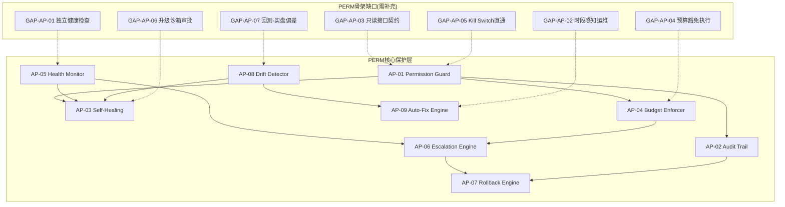

# 23 — D-AUT-PERM 自治保护域

> **状态**: DRAFT | **版本**: v2.1.0 | **拆分自**: D-AUTONOMY(22-D-AUT-CORE-自治核心域.md) | **已充实**: 从22-D-AUT-CORE迁移78个PERM子模块 | **拆分原因**: 265子模块→CORE(引擎)+PERM(保护层)。PERM是引擎的安全网——AI能做什么、不能做什么、做错了怎么撤回

## §1 域定义

| 属性 | 值 |
|------|-----|
| 域ID | D-AUTONOMY-PERM |
| 简称 | AUT-PERM / AP |
| 职责 | **AI Agent保护层**。权限管理+审计追踪+自愈+预算控制+密钥管理+健康监控+回滚+漂移检测——确保AI不乱来 |
| 层 | L01+L08+L12 |
| 状态 | 🔒 已开发 |
| 类型 | core |
| H依赖数 | 1 (AUT-CORE) |
| 激活前提 | D-AUTONOMY-CORE 就绪 |

## §2 核心子模块（AP-01~13 + 从AUT-CORE迁移的78个PERM子模块）

| ID | 名称 | 职责 | 状态 |
|----|------|------|:---:|
| AP-01 | Permission Guard | 七层纵深防御+RBAC+ABAC+零信任 | ✅ |
| AP-02 | Audit Trail | Merkle哈希链+Agent签名+信任引擎+重放 | ✅ |
| AP-03 | Self-Healing | Git-native+Checkpoint+升降级+漂移检测 | ✅ |
| AP-04 | Budget Enforcer | 七级预算(Token/钱/时间)+全局预算池 | ✅ |
| AP-05 | Health Monitor | 9子系统+Watchdog+告警 | ✅ |
| AP-06 | Escalation Engine | 升级引擎+CircuitBreaker+DelegationEngine | ✅ |
| AP-07 | Rollback Engine | Git-native+SQLite Dump+Checkpoint+30+文件 | ✅ |
| AP-08 | Drift Detector | 39个检测器+漂移预算 | ✅ |
| AP-09 | Auto-Fix Engine | 16个修复器+修复模式库+自动诊断 | ✅ |
| AP-10 | Decision Audit Trail | 决策捕获+上下文记录+影响追踪+反事实分析 | ❌ |
| AP-11 | Secret Manager | 密钥存储+轮换+访问控制+泄露检测 | ❌ |
| AP-12 | Cost Optimizer | 成本归因+使用分析+优化建议+自动执行 | ❌ |
| AP-13 | Parameter Optimizer | 三层优化：实时微调/周期优化/结构进化 | ❌ |
| D-AUTONOMY-01 | Permission Guard | AI能做什么——RBAC+PermissionGuard+七层纵深防御 | P0 | ✅ | MOD-INF-018 Agent RBAC + MOD-INF-019 Agent Spec; RBAC/ABAC/零信任架构; 细粒度策略即代码/动态权限/上下文感知授权; 最小权限审计/权限变更日志/监管访问控制 |
| D-AUTONOMY-02 | Audit Trail | AI做了什么——Merkle哈希链+Agent签名+信任引擎+重放引擎 | P0 | ✅ | MOD-INF-020+027+028; 不可变日志理论/事件溯源/审计链; 区块链审计链/实时审计流/AI行为全息记录; SOX审计要求 |
| D-AUTONOMY-03 | Self-Healing | AI做错了怎么撤+自我修复——Git-native+SQLite Dump+Checkpoint+升降级+漂移检测 | P0 | ✅ | MOD-INF-021+022+023+010; 自愈系统理论/控制论/故障模式分析; LLM驱动根因分析/预测性自愈/混沌工程验证 |
| D-AUTONOMY-04 | Budget Enforcer | AI花了多少钱——七级预算(Token/钱/时间)+全局预算池 | P0 | ✅ | MOD-INF-024; 资源约束理论/令牌桶/预算控制; 多维预算优化/预测性预算/成本归因分析; API支出审计/预算超支报告/成本合规 |
| D-AUTONOMY-10 | Secret Manager | 密钥管理：密钥存储+轮换策略+访问控制+审计日志+泄露检测。实现：密钥存储/轮换策略/访问控制/审计日志/泄露检测。上游依赖：外部KMS/环境变量。下游消费者：所有需要密钥的模块。具备密钥访问审计/轮换合规/泄露响应流程合规检查 | P1 | ❌ | 安全要求; 密钥管理理论/HSM/KMS; 零知识证明密钥/硬件安全模块/自动轮换; 密钥访问审计/轮换合规/泄露响应流程 |
| D-AUTONOMY-11 | Health Monitor | 健康监控+9子系统+Watchdog+告警 | P0 | ✅ | MOD-INF遥测; 健康检查理论/心跳/断路器; AIOps异常检测/预测性健康/多维度健康评分; 健康状态审计/告警合规/SLA监控报告 |
| D-AUTONOMY-14 | Notification Router | 通知路由：事件分类+路由规则+优先级+去重+聚合+渠道适配 | P1 | ❌ | →迁移至D-FRONTEND-13; 发布订阅/事件路由/优先级分发; 智能路由/LLM摘要/自适应通知频率; 通知审计/敏感信息脱敏/通知留存合规 |
| D-AUTONOMY-15 | Escalation Engine | 升级引擎——EscalationEngine+CircuitBreaker+DelegationEngine | P0 | ✅ | MOD-INF-022; 升级理论/SLA分级/升级路径; LLM驱动升级判断/预测性升级 |
| D-AUTONOMY-16 | Cost Optimizer | 成本优化：成本归因+使用分析+优化建议+自动执行+效果验证。理论：成本优化理论/线性规划/贪心策略。具备成本审计/优化决策日志/成本分配合规合规检查 | P1 | ❌ | FinOps; 成本优化理论/线性规划/贪心策略; LLM驱动成本分析/预测性成本/多云成本优化; 成本审计/优化决策日志/成本分配合规 |
| D-AUTONOMY-19 | Rollback Engine | 回滚引擎——Git-native+SQLite Dump+Checkpoint+30+文件 | P0 | ✅ | zephyr.rollback/ + SKILL-DOM-RBK-001 |
| D-AUTONOMY-20 | Drift Detector | 漂移检测——39个检测器+漂移预算+REG-DRIFT-001 | P1 | ✅ | behavioral_auditor/ + SKILL-DOM-DRF-001 |
| D-AUTONOMY-25 | Auto-Fix Engine | 自动修复——16个修复器+修复模式库+自动诊断 | P1 | ✅ | REG-AFX-FIXER-001 + REG-AFX-PATTERN-001 |
| D-AUTONOMY-26 | Decision Audit Trail | 决策审计追踪：决策捕获+上下文记录+影响追踪+反事实分析+归因分析 | P1 | ❌ | 决策审计理论/决策链/可追溯性; 实时决策流/LLM决策解释/决策图谱; SR 11-7决策审计/监管决策追溯/AI决策披露 |
| D-AUTONOMY-33 | Non-AI Module Boundary Guard | 非AI模块边界守卫器：定义AI/non-AI边界(风控/执行/清算/配置必须非AI)+AI输出仅作输入因子且权重受控(≤30%)+AI决策可解释性强制+AI模块降级/熔断机制+人工审批强制节点+AI行为审计。理论：AI安全/可解释AI/人机协作。具备AI边界审计/AI权重限制合规/AI降级记录合规检查 | P0 | ❌ | AI安全/可解释AI/人机协作/AI边界; LLM边界推理/自适应权重限制/AI行为监控; AI边界审计/AI权重限制合规/AI降级记录合规 |
| D-AUTONOMY-46 | Knowledge Write Guard Protector | 知识Write Guard保护器：防止知识库被误修改/误删除+写保护规则/写保护审批/写保护审计+写保护级别(可修改/审批修改/不可修改)。理论：写保护/审批/审计。具备写保护审计/知识写保护合规检查 | P1 | ❌ | 知识Write Guard/写保护/审批; 写保护/审批/审计; 自适应写保护/在线写保护监控/写保护级别; 写保护审计/知识写保护合规 |
| D-AUTONOMY-47 | Knowledge Snapshot Rollback Manager | 知识快照回滚管理器：知识库快照/回滚/差异对比+快照策略(定时/变更前)/回滚触发/回滚验证+快照存储。理论：快照/回滚/差异对比。具备快照审计/知识快照合规检查 | P2 | ❌ | 知识快照回滚/差异对比/快照策略; 快照/回滚/差异对比; 自适应快照策略/在线回滚验证/快照存储; 快照审计/知识快照合规 |
| D-AUTONOMY-51 | Risk Check RBAC Permission Controller | 风控检查RBAC权限控制器：检查权限由Agent RBAC控制MOD-INF-018+风控检查权限定义/权限校验/权限审计+权限变更通知。理论：RBAC/权限/审计。具备RBAC审计/风控权限合规检查 | P1 | ❌ | 风控RBAC/MOD-INF-018/权限校验; RBAC/权限/审计; 自适应权限/在线权限监控/权限变更; RBAC审计/风控权限合规 |
| D-AUTONOMY-52 | Risk Alert Notification Dispatcher | 风控告警通知分发器：告警通过D-AUTONOMY通知系统分发+告警级别→通知渠道映射/告警聚合/告警去重+分发性能监控。理论：通知分发/告警聚合/去重。具备通知分发审计/告警通知合规检查 | P1 | ❌ | 风控告警分发/告警级别→渠道/聚合去重; 通知分发/告警聚合/去重; 自适应分发策略/在线告警聚合/分发性能; 通知分发审计/告警通知合规 |
| D-AUTONOMY-62 | Health Check Service | 健康检查服务：healthcheck_service.py体检中心+定期检查各模块是否健康+健康检查/健康告警/健康报告+健康趋势追踪。理论：健康检查/定期/告警。具备健康检查审计/健康合规检查 | P1 | ❌ | 健康检查/定期体检/健康告警; 健康检查/定期/告警; 自适应检查频率/在线健康监控/健康趋势; 健康检查审计/健康合规 |
| D-AUTONOMY-74 | Vector Index Health Monitor | 向量索引健康监控器：index_health_monitor.py索引健康监控+向量索引有没有损坏+健康检查/损坏检测/索引修复+索引性能监控。理论：索引健康/损坏检测/修复。具备索引健康审计/向量索引合规检查 | P2 | ❌ | 向量索引健康/损坏检测/索引修复; 索引健康/损坏检测/修复; 自适应检查频率/在线索引监控/索引修复; 索引健康审计/向量索引合规 |
| D-AUTONOMY-76 | LLM Cost Guard | LLM成本守卫：L5资源保护+Token预算速率限制防止AI烧钱+成本预算/成本监控/成本告警/成本熔断+成本报告。理论：成本/预算/熔断。具备成本审计/LLM成本合规检查 | P1 | ❌ | LLM成本守卫/Token预算/成本熔断; 成本/预算/熔断; 自适应预算/在线成本监控/成本报告; 成本审计/LLM成本合规 |
| D-AUTONOMY-83 | Token Budget Manager | Token预算管理器：token_budget.py Token预算+控制AI一次能看多少字+预算分配/预算监控/预算超限告警+预算报告。理论：Token预算/分配/监控。具备Token预算审计/Token预算合规检查 | P1 | ❌ | Token预算/AI看多少字/预算分配监控; Token预算/分配/监控; 自适应预算分配/在线Token监控/预算超限告警; Token预算审计/Token预算合规 |
| D-AUTONOMY-102 | Zone Crossing Boundary Validator | Zone Crossing边界校验器：M6边界标记A→B检查站+边界定义/边界校验/边界违规告警+边界审计。理论：边界/校验/区域划分。具备边界审计/边界合规检查 | P1 | ❌ | M6 Zone Crossing; 边界/校验/区域划分; 自适应边界/在线边界监控/边界优化; 边界审计/边界合规 |
| D-AUTONOMY-104 | MCP Gateway Rate-Limit Audit Manager | MCP网关限流审计管理器：gateway_server.py的限流10QPS+审计记录+熔断降级+限流策略/限流计数/审计日志/熔断检测。理论：限流/审计/熔断。具备限流审计/网关合规检查 | P1 | ❌ | gateway_server.py限流审计; 限流/审计/熔断; 自适应限流/在线审计监控/熔断优化; 限流审计/网关合规 |
| D-AUTONOMY-105 | Rollback Four-Tier Strategy Selector | 回滚四级策略选择器：full_revert/partial_revert/discard/hard_reset四级回滚策略智能选择+策略匹配/策略评估/策略执行+策略推荐。理论：策略选择/回滚/风险评估。具备策略选择审计/回滚合规检查 | P1 | ❌ | 四级回滚策略选择; 策略选择/回滚/风险评估; 自适应策略选择/在线策略评估/策略优化; 策略选择审计/回滚合规 |
| D-AUTONOMY-106 | Dual-Storage Rollback Coordinator | 双存储回滚协调器：git revert+SQLite恢复双存储一致性协调+git回滚/DB恢复/一致性校验+事务性保证。理论：双存储/一致性/事务。具备双存储审计/回滚一致性合规检查 | P1 | ❌ | git+SQLite双存储回滚; 双存储/一致性/事务; 自适应回滚/在线一致性监控/回滚优化; 双存储审计/回滚一致性合规 |
| D-AUTONOMY-107 | Hard Reset Permission Gate | hard_reset权限门控：hard_reset强制重置需特殊权限token-gated审批+权限校验/操作审批/操作审计+审批超时处理。理论：权限门控/审批/审计。具备权限门控审计/操作合规检查 | P2 | ❌ | hard_reset token-gated; 权限门控/审批/审计; 自适应权限/在线审批监控/权限优化; 权限门控审计/操作合规 |
| D-AUTONOMY-108 | Auto-Guard Async Approval Manager | auto_guard异步审批管理器：auto_guard 4%先干后验5分钟内人类没反对就算通过+异步审批/超时自动通过/审批拒绝回滚+审批队列。理论：异步审批/超时/回滚。具备异步审批审计/审批合规检查 | P1 | ❌ | auto_guard先干后验5分钟; 异步审批/超时/回滚; 自适应审批/在线审批监控/审批优化; 异步审批审计/审批合规 |
| D-AUTONOMY-111 | Immutable Audit Log Writer | 不可变审计日志写入器：audit_trail/writer.py append-only不可变审计日志+append-only写入/Merkle哈希链追加/日志完整性校验+日志压缩。理论：不可变日志/append-only/Merkle。具备日志写入审计/日志完整性合规检查 | P1 | ❌ | audit_trail/writer.py不可变日志; 不可变日志/append-only/Merkle; 自适应日志/在线完整性监控/日志优化; 日志写入审计/日志完整性合规 |
| D-AUTONOMY-120 | Core Chain E2E Health Monitor | 核心链路端到端健康监控器：TaskCard→Gate→Pipeline→Security→Audit→Feedback核心链路的端到端健康监控/延迟追踪/断链检测+健康评分+链路可视化。理论：端到端监控/链路追踪/健康评分。具备链路监控审计/链路合规检查 | P1 | ❌ | 核心链路端到端健康; 端到端监控/链路追踪/健康评分; 自适应监控/在线链路分析/链路优化; 链路监控审计/链路合规 |
| D-AUTONOMY-121 | Code Health Assessor | 代码健康度评估器：1714文件/160315行/238TODO/184未实现/4NotImplementedError/simulated:True等代码质量指标+指标采集/健康评分/健康报告/健康趋势+健康阈值告警。理论：代码质量/健康度/度量。具备代码健康审计/代码质量合规检查 | P2 | ❌ | 代码健康度/TODO/未实现率; 代码质量/健康度/度量; 自适应健康/在线质量监控/健康优化; 代码健康审计/代码质量合规 |
| D-AUTONOMY-128 | Governance Phase Check Slimmer | Governance Phase Check精简器：63个Phase Check精简到10项核心+检查使用率/检查重要性/精简计划/精简验证+精简审计。理论：精简/使用率/重要性。具备精简审计/治理合规检查 | P2 | ❌ | 63 Phase Check精简; 精简/使用率/重要性; 自适应精简/在线检查监控/精简优化; 精简审计/治理合规 |
| D-AUTONOMY-133 | Budget Enforcer On-Demand Activator | Budget Enforcer按需激活器：默认warn日费>$10开strict的按需激活策略+成本监控/激活阈值/激活审计+成本趋势分析。理论：按需激活/成本控制/阈值。具备成本激活审计/预算合规检查 | P2 | ❌ | Budget Enforcer按需warn→strict; 按需激活/成本控制/阈值; 自适应激活/在线成本监控/激活优化; 成本激活审计/预算合规 |
| D-AUTONOMY-145 | AI Comprehension Cost Dynamic Estimator | AI理解成本动态估算器：代码行数→AI理解时间的动态估算+理解成本阈值告警+代码精简建议+行数统计/理解时间估算/成本告警/精简建议。理论：理解成本/动态估算/精简。具备理解成本审计/可维护性合规检查 | P2 | ❌ | AI理解成本/行数→时间; 理解成本/动态估算/精简; 自适应估算/在线成本监控/估算优化; 理解成本审计/可维护性合规 |
| D-AUTONOMY-149 | PipelineOrchestrator CostTracker Component | PipelineOrchestrator CostTracker组件：PipelineOrchestrator拆分后独立成本追踪组件100行+Token计数/成本累计/成本告警/成本报告+成本审计。理论：成本追踪/Token计数/告警。具备成本追踪审计/成本合规检查 | P1 | ❌ | PipelineOrchestrator CostTracker; 成本追踪/Token计数/告警; 自适应追踪/在线成本监控/追踪优化; 成本追踪审计/成本合规 |
| D-AUTONOMY-151 | System Health Five-Star Scorer | 系统健康度五星评分器：架构设计/代码质量/必要功能比例/过度工程程度/AI可维护性5维度五星评分+评分趋势+评分告警+维度定义/评分算法/评分报告/评分趋势。理论：五星评分/维度/趋势。具备评分审计/健康度合规检查 | P2 | ❌ | 系统健康度五星/5维度; 五星评分/维度/趋势; 自适应评分/在线健康监控/评分优化; 评分审计/健康度合规 |
| D-AUTONOMY-157 | AI Governance Framework Compliance Assessor | AI治理框架合规性评估器：AI治理框架=门禁+安全+审计+反馈的治理合规性评估+治理维度/合规评分/合规报告/合规趋势。理论：治理合规/评估/趋势。具备治理合规审计/治理框架合规检查 | P2 | ❌ | AI治理框架合规评估/门禁+安全+审计; 治理合规/评估/趋势; 自适应评估/在线合规监控/评估优化; 治理合规审计/治理框架合规 |
| D-AUTONOMY-161 | TaskCard Six-Dimension Anti-Drift Validator | TaskCard六维防漂移校验器：31字段+防漂移六维的校验器+字段校验/六维漂移检测/漂移告警/漂移修复建议。理论：防漂移/六维/校验。具备防漂移审计/TaskCard合规检查 | P1 | ❌ | TaskCard六维防漂移/31字段; 防漂移/六维/校验; 自适应校验/在线漂移监控/校验优化; 防漂移审计/TaskCard合规 |
| D-AUTONOMY-162 | RBAC Permission Check Embedded Bridge | RBAC权限检查内嵌桥接器：PipelineOrchestrator._rbac_check()内嵌RBAC检查的桥接器+权限查询/权限缓存/权限变更通知/权限审计。理论：内嵌桥接/权限缓存/变更通知。具备桥接审计/RBAC合规检查 | P2 | ❌ | RBAC内嵌桥接/_rbac_check(); 内嵌桥接/权限缓存/变更通知; 自适应桥接/在线权限监控/桥接优化; 桥接审计/RBAC合规 |
| D-AUTONOMY-166 | Audit-Persistence Dual-Write Coordinator | 审计-持久化双写协调器：audit_trail/writer.py审计日志+db/task_repo.py任务状态双写一致性协调+写失败回滚+写性能优化+双写策略/一致性校验/写失败处理/双写审计。理论：双写/一致性/回滚。具备双写审计/持久化合规检查 | P1 | ❌ | 审计-持久化双写/一致性; 双写/一致性/回滚; 自适应双写/在线一致性监控/双写优化; 双写审计/持久化合规 |
| D-AUTONOMY-180 | Rollback Operation Visual Tracker | 回滚操作可视化追踪器：Ctrl+Z超级加强版→回滚操作可视化追踪+回滚步骤展示+回滚影响范围可视化+回放追踪/步骤展示/影响范围/回滚审计。理论：可视化追踪/步骤展示/影响范围。具备可视化审计/回滚可视化合规检查 | P2 | ❌ | 回滚操作可视化追踪; 可视化追踪/步骤展示/影响范围; 自适应追踪/在线回滚监控/追踪优化; 可视化审计/回滚可视化合规 |
| D-AUTONOMY-184 | Feedback Loop Three-Layer Escalation Trigger | Feedback Loop三层升级触发器：L1任务→L2模式→L3架构三层升级触发+升级条件+升级审计+升级回滚+升级条件/升级触发/升级审计/升级回滚。理论：三层升级/条件/回滚。具备升级审计/反馈升级合规检查 | P1 | ❌ | Feedback Loop三层升级L1→L3; 三层升级/条件/回滚; 自适应升级/在线层级监控/升级优化; 升级审计/反馈升级合规 |
| D-AUTONOMY-185 | Token Budget Coordinator | Token预算协调器：Pipeline中Token预算协调+预算分配+预算超限告警+预算回收+预算分配/预算监控/超限告警/预算回收。理论：预算协调/分配/回收。具备预算审计/Token预算合规检查 | P1 | ❌ | Token预算协调/分配+回收; 预算协调/分配/回收; 自适应预算/在线Token监控/预算优化; 预算审计/Token预算合规 |
| D-AUTONOMY-203 | M10 Audit Report Finding Format Generator | M10审计报告Finding格式生成器：M10生成Finding格式报告+报告模板+报告数据填充+报告分发+报告模板/数据填充/报告生成/报告分发。理论：Finding格式/报告模板/分发。具备报告生成审计/M10合规检查 | P1 | ❌ | M10审计报告Finding格式; Finding格式/报告模板/分发; 自适应生成/在线报告监控/生成优化; 报告生成审计/M10合规 |
| D-AUTONOMY-205 | Drift Detector Statistical Drift Checker | Drift Detector统计漂移检测器：Drift Detector统计方法→统计漂移检测+漂移基线+漂移告警+漂移基线/漂移检测/漂移告警/漂移审计。理论：漂移检测/基线/告警。具备漂移检测审计/漂移合规检查 | P2 | ❌ | Drift Detector统计漂移/基线; 漂移检测/基线/告警; 自适应检测/在线漂移监控/检测优化; 漂移检测审计/漂移合规 |
| D-AUTONOMY-258 | 系统版本升级路径管理器 | v3→v4→v5系统级升级路径：前置条件检查+分阶段编排+升级验证+自动回滚 | P2 | ❌ | 第六轮迁移进化/运维数据管理推导 |
| M14-S01 | Saga定义器 | 定义Saga事务步骤和依赖关系 | P1 | ❌ | IJFMR 2025 Saga Pattern Review |
| M14-S02 | 编排式Saga引擎 | 中央协调器控制Saga步骤执行 | P1 | ❌ | Temporal.io / Camunda |
| M14-S03 | 协调式Saga引擎 | 事件驱动去中心化Saga执行 | P1 | ❌ | Axon Framework / Eventuate |
| M14-S04 | 补偿动作管理器 | 管理Saga补偿动作和回滚逻辑 | P1 | ❌ | — |
| M14-S05 | Saga状态追踪器 | 追踪Saga执行状态和进度 | P1 | ❌ | — |
| M16-S01 | AI风险分类器 | 分类AI系统风险等级(EU AI Act:不可接受/高/中/低) | P1 | ❌ | EU AI Act Regulation 2024/1689 |
| M16-S02 | 治理策略引擎 | 执行AI治理策略(42个统一控制措施) | P1 | ❌ | Credo AI UCF 2025 |
| M16-S04 | 治理仪表盘 | 可视化AI治理状态和合规进度 | P1 | ❌ | — |
| M16-S05 | AI风险评估器 | 评估AI系统风险：偏见/可解释性/隐私/安全 | P1 | ❌ | NIST AI RMF 1.0 Playbook |
| M46-S01 | 模型注册器 | 注册AI/ML模型及其依赖 | P1 | ❌ | SR 11-7 / MLflow |
| M46-S02 | 模型验证依赖编排器 | 编排模型验证活动的依赖 | P1 | ❌ | SR 11-7 / OCC 2011-12 |
| M46-S03 | 模型监控依赖追踪器 | 追踪模型监控依赖 | P1 | ❌ | SR 11-7 |
| M46-S05 | 模型漂移检测器 | 检测模型漂移和数据漂移 | P1 | ❌ | Evidently AI / NannyML |
| M46-S06 | 模型风险分级器 | 按风险等级分级模型 | P1 | ❌ | SR 11-7 / PRA SS1/23 |
| M46-S07 | 模型覆盖影响分析器 | 分析人工覆盖模型决策的影响 | P1 | ❌ | SR 11-7 |
| M14-NEW-01 | Saga Observability Tracer | Saga执行全过程可观测性：步骤耗时/补偿触发率/死锁检测 | P1 | ❌ | Temporal.io Visibility API / Camunda Optimize |
| M14-NEW-02 | AI-Driven Saga Orchestrator | AI决策参与Saga编排：AI判断是否需要补偿 | P1 | ❌ | Temporal AI Workflows 2025 beta / Inngest |
| M14-NEW-03 | Compensation Dependency Graph Analyzer | 补偿动作间依赖分析：补偿A必须在补偿B之前执行 | P1 | ❌ | ICDE 2025 / Axon Framework |
| M14-NEW-04 | Saga Deadlock Detector | 多Saga实例间资源竞争死锁检测 | P1 | ❌ | VLDB 2024 / Temporal |
| M14-NEW-05 | Saga Version Compatibility Manager | Saga定义变更时运行中实例兼容性管理 | P1 | ❌ | Temporal Workflow Versioning / Camunda Migration |
| M14-NEW-06 | Cross-Saga Transaction Coordinator | 多Saga间协调：嵌套Saga/并行Saga | P1 | ❌ | Seata 2.x (Alibaba) / DTCC |
| M16-NEW-02 | AI Risk Dependency Mapper | AI风险间依赖映射：数据偏见→模型偏见→决策偏见 | P1 | ❌ | NIST AI RMF 1.0 / ISO/IEC 42001 |
| M16-NEW-03 | Responsible AI Dependency Auditor | 负责任AI原则依赖审计：公平性依赖数据代表性等 | P1 | ❌ | Google SAIF / Microsoft RAII |
| M16-NEW-06 | Enhanced Confidence Cascade Mapper | 置信度级联增强建模(D80增强) | P1 | ❌ | NeurIPS 2024 / Anthropic Constitutional AI |
| M37-NEW-03 | Saga/Process Manager Dependency Orchestrator | Saga/流程管理器依赖编排器 | P1 | ❌ | Axon Framework 4.10 |
| M46-NEW-03 | Model Drift Dependency Propagator | 模型漂移依赖传播器 | P1 | ❌ | FSE 2025 |
| M46-NEW-04 | Model Validation Dependency Orchestrator | 模型验证依赖编排器 | P1 | ❌ | MRMIA 2025 |
| M46-NEW-05 | Model Risk Tier Dependency Classifier | 模型风险等级依赖分类器 | P1 | ❌ | McKinsey 2024 MRM 2.0 |
| M46-NEW-06 | Model Override Dependency Impact Analyzer | 模型覆盖依赖影响分析器 | P1 | ❌ | — |
| M46-NEW-07 | Model Inventory Dependency Graph Builder | 模型清单依赖图构建器 | P1 | ❌ | MLflow / W&B |
| NEW-M60-N01 | Feature Store Dependency Drift Detector | 特征存储依赖漂移检测：特征依赖链数据漂移检测 | P2 | ❌ | Feast/Tecton Feature Store |
| D62 | 时序GNN依赖漂移预测器 | 时序GNN建模依赖图演化预测3个月依赖断裂风险AUC=0.91 | P2 | ❌ | JMLR 2023 Temporal GNN |
| D-SECURITY-02 | 身份与访问管理器 | 身份与访问管理 | P1 | ❌ | MOD-INF-018已建设（同蓝图D-SECURITY-08/40/48）；A5§15.7 |
| D-SECURITY-03 | 密钥管理器 | 密钥管理 | P1 | ❌ | DOM-GOV-001蓝图未建设（同蓝图D-AUTONOMY-10）；A5§15.7 |
| D-SECURITY-08 | 访问控制器 | 访问控制 | P1 | ❌ | MOD-INF-018已建设（同蓝图D-SECURITY-02/40/48）；A5§15.7 |
| D-SECURITY-30 | 简化统一认证系统 | 统一认证 | P1 | ❌ | A5§15.7 |
| D-SECURITY-40 | Casbin RBAC权限控制器 | RBAC权限控制 | P1 | ❌ | MOD-INF-018已建设（同蓝图D-SECURITY-02/08/48）；A5§15.7 |
| D-SECURITY-41 | 操作审计日志系统 | 操作审计日志 | P1 | ❌ | MOD-INF-020已建设（同蓝图D-SECURITY-50/D-AUTONOMY-111/D-SECURITY-15）；A5§15.7 |
| D-SECURITY-48 | 角色权限继承 | 角色权限继承 | P1 | ❌ | MOD-INF-018已建设（同蓝图D-SECURITY-02/08/40）；A5§15.7 |
| D-SECURITY-49 | 动态权限分配 | 动态权限分配(ABAC) | P1 | ❌ | §3.2 ABAC已有框架；A5§15.7 |
| D-SECURITY-50 | 权限变更审计 | 权限变更审计 | P1 | ❌ | MOD-INF-020已建设（同蓝图D-SECURITY-41/D-AUTONOMY-111/D-SECURITY-15）；A5§15.7 |

### §2.1 能力对齐验证（Step 1 产出）

> 已开发域+薄骨架域能力对齐验证：从能力定位书§9提取3项能力，逐项检查子模块覆盖+场内代码归位+隐含骨架约束推导

#### 2.1.1 能力→子模块覆盖矩阵

| 能力编号 | 优先级 | 能力名称 | 覆盖子模块 | 场内代码归位 | 对齐状态 |
|:---:|:---:|---------|-----------|-----------|:------:|
| C-008 | P0 | AI自治运维 | AP-05(健康监控), AP-03(自愈), AP-09(自动修复), AP-08(漂移检测), D-AUTONOMY-11(健康监控), D-AUTONOMY-03(自愈), D-AUTONOMY-25(自动修复), D-AUTONOMY-20(漂移检测), D-AUTONOMY-62(健康检查服务), D-AUTONOMY-120(核心链路端到端健康), D-AUTONOMY-247(自动化运维执行) | agent_rbac/auto_maintenance.py✅, engine_degradation.py✅, cascading_failure_isolator.py✅, behavioral_auditor/~70模块✅, auto_fix_engine/~30模块✅, rollback/~75模块✅ | ⚠️ 缺交易时段vs非交易时段差异化运维策略 |
| C-023 | P1 | 基础设施自优化 | AP-12(成本优化), D-AUTONOMY-16(成本优化), D-AUTONOMY-247(自动化运维执行), D-AUTONOMY-133(Budget按需激活) | budget_enforcer/~40模块✅, agent_rbac/secrets_lifecycle.py✅, skill_cache_provider.py✅, skill_gitops.py✅ | ❌ 依赖库升级沙箱验证+人工审批流程无代码 |
| C-025 | P1 | 质量保障自驱动 | AP-08(漂移检测), D-AUTONOMY-20(漂移检测), D-AUTONOMY-26(决策审计追踪), D-AUTONOMY-205(统计漂移检测) | behavioral_auditor/~70模块✅, agent_rbac/context_drift_detector.py✅, skill_breakage_checker.py✅, skill_calibration.py✅ | ⚠️ 回测-实盘偏差监控专项缺失 |

#### 2.1.2 场内模块归位验证（反向检查）

| 代码目录 | 模块数 | 归位域 | 对标能力 | 归位状态 |
|---------|:-----:|-------|--------|:------:|
| agent_rbac/ | 87 | D-AUTONOMY-PERM | C-008/C-023/C-025/C-031 | ✅ 全部可追溯 |
| audit_trail/ | ~50 | D-AUTONOMY-PERM | C-008/C-025 | ✅ |
| auto_fix_engine/ | ~30 | D-AUTONOMY-PERM | C-008 | ✅ |
| behavioral_auditor/ | ~70 | D-AUTONOMY-PERM | C-008/C-025 | ✅ |
| budget_enforcer/ | ~40 | D-AUTONOMY-PERM | C-023 | ✅ |
| escalation_engine/ | ~100 | D-AUTONOMY-PERM | C-008 | ✅ |
| rollback/ | ~75 | D-AUTONOMY-PERM | C-008 | ✅ |
| llm_security/ | ~30 | D-AUTONOMY-PERM | C-023/C-025 | ✅ |
| semantic_auditor/ | ~6 | D-AUTONOMY-PERM | C-025 | ✅ |
| orphan_judge/ | ~2 | D-AUTONOMY-PERM | C-025 | ✅ |
| red_blue_validator/ | ~6 | D-AUTONOMY-PERM | C-025 | ✅ |

> **归位结论**：PERM域场内模块全部可追溯到能力项，无孤儿模块。agent_rbac/87模块是PERM域最大的代码资产。

#### 2.1.3 隐含骨架约束推导（薄骨架域必需）

> D-AUTONOMY-PERM骨架厚度=薄(4✅架构图)，需从能力定位书推导隐含骨架约束

| 约束来源 | 隐含约束 | 推导理由 | 需补充的骨架子模块 |
|---------|---------|---------|-----------------|
| C-008"保证不崩溃" | PERM必须独立于CORE运行 | 如果PERM依赖CORE才能运行，CORE崩溃时PERM也崩溃→死锁 | GAP-AP-01: PERM独立健康检查器 |
| C-008"交易时段仅监控+告警" | 时段感知运维策略 | 交易时段修复操作可能导致数据不一致 | GAP-AP-02: 交易时段感知运维调度器 |
| PERM=CORE安全网 | PERM不能依赖CORE状态修改 | PERM只能读CORE状态+发阻止指令 | GAP-AP-03: PERM-CORE只读接口契约 |
| PERM=0预算 | PERM自身不受budget限制 | 否则死锁——PERM扣光budget就无法阻止CORE | GAP-AP-04: PERM预算豁免执行器 |
| Kill Switch独立路径 | Kill Switch不经过CORE | Kill Switch是系统级安全设施，不能被CORE拦截 | GAP-AP-05: Kill Switch直通路径 |
| C-023"依赖库升级沙箱验证" | 升级必须沙箱验证+人工审批 | 非交易时段+沙箱验证通过+人工审批后执行(B-015) | GAP-AP-06: 依赖升级沙箱审批网关 |
| C-025"回测-实盘偏差监控" | 防止过拟合参数调整生效到实盘 | B-009约束 | GAP-AP-07: 回测-实盘偏差监控器 |

#### 2.1.4 骨架缺口清单（需补充的子模块）

| 缺口ID | 缺口名称 | 对标能力 | 优先级 | 说明 |
|--------|---------|--------|:-----:|------|
| GAP-AP-01 | PERM独立健康检查器 | C-008 | P0 | 独立于CORE的健康检查，CORE崩溃时PERM仍可检测 |
| GAP-AP-02 | 交易时段感知运维调度器 | C-008 | P0 | 交易时段仅监控+告警，修复延至盘后 |
| GAP-AP-03 | PERM-CORE只读接口契约 | C-008 | P0 | PERM只能读CORE状态+发阻止指令，不能修改 |
| GAP-AP-04 | PERM预算豁免执行器 | C-008 | P0 | PERM自身不受budget限制，防止死锁 |
| GAP-AP-05 | Kill Switch直通路径 | C-008 | P0 | 不经过CORE的Kill Switch直通执行路径 |
| GAP-AP-06 | 依赖升级沙箱审批网关 | C-023 | P1 | 非交易时段+沙箱验证+人工审批后执行 |
| GAP-AP-07 | 回测-实盘偏差监控器 | C-025 | P1 | 防止过拟合参数调整生效到实盘 |

---

## §3 域间依赖

| 消费什么 | 来自 | 类型 | 契约 |
|---------|------|:---:|------|
| Agent运行时 | D-AUTONOMY-CORE | H | AUT-VERSION |
| 规则引擎 | D-GOVERNANCE | S | — |

| 产出什么 | 消费者 | 类型 |
|---------|--------|:---:|
| 权限校验结果 | 全域 | H/S |
| 审计日志 | D-COMPLIANCE / D-REPORTING | E |
| 健康状态 | D-OPS | E |

## §4 关键设计决策

1. **PERM是CORE的"安全网"**：CORE只管执行，PERM管能不能执行、做错了怎么撤
2. **PERM不直接修改CORE状态**：PERM只能读取CORE状态+发出阻止指令，不能修改
3. **PERM=0的施工budget**：PERM自身不受budget限制（否则死锁——PERM扣光了budget就无法阻止CORE了）

---

## §5 域内依赖图（Step 2 产出）

### 5.1 PERM域核心依赖链路



### 5.2 缺口子模块依赖归位

| 缺口子模块 | 上游依赖 | 下游消费者 | 依赖类型 |
|-----------|---------|-----------|---------|
| GAP-AP-01 PERM独立健康检查 | 无(独立于CORE) | AP-05(健康监控-补充数据源) | 独立数据源 |
| GAP-AP-02 时段感知运维调度 | A股交易时段配置 | AP-09(自动修复-时段控制) | 调度约束 |
| GAP-AP-03 PERM-CORE只读接口 | D-AUTONOMY-CORE状态接口 | AP-01(权限守卫-状态查询) | 只读查询 |
| GAP-AP-04 PERM预算豁免 | AP-04(Budget Enforcer) | AP-04(预算检查-豁免PERM) | 豁免标记 |
| GAP-AP-05 Kill Switch直通 | D-EX-CORE Kill Switch接口 | D-EX-CORE(执行停机) | 直通指令 |
| GAP-AP-06 升级沙箱审批 | 沙箱环境+人工审批 | AP-03(自愈-执行升级) | 审批门禁 |
| GAP-AP-07 回测-实盘偏差 | AP-08(漂移检测-基线) | AP-03(自愈-参数回滚) | 偏差检测 |

### 5.3 PERM域价值流线

| 价值流线 | 核心模块流水线 | 目标 |
|---------|---------------|------|
| 线1: 权限防护 | AP-01→AP-02→AP-06 | 所有操作先过权限→审计→升级 |
| 线2: 自愈恢复 | AP-05→AP-08→AP-09→AP-07→AP-03 | 健康监控→漂移检测→自动修复→回滚→自愈 |
| 线3: 预算控制 | AP-04→AP-06→AP-02 | 预算检查→超限升级→审计记录 |
| 线4: Kill Switch | GAP-AP-05→D-EX-CORE | 紧急停机直通路径 |

## §6 域间接口补充（Step 3 产出）

### 6.1 P0冻结接口签名

| 接口ID | 接口名 | 方向 | 签名 | 冻结状态 |
|--------|--------|------|------|:------:|
| IF-AP-001 | PermissionCheck | PERM→*(all) | `PermissionCheck{subject, action, resource, context} → {verdict, policy_id, audit_hash}` | 🔒冻结 |
| IF-AP-002 | AuditLogWrite | PERM→D-COMPLIANCE/D-REPORTING | `AuditLogWrite{event_type, actor, action, target, timestamp, merkle_hash, immutability_proof}` | 🔒冻结 |
| IF-AP-003 | HealthReport | PERM→D-OPS | `HealthReport{component, score, alert_level, timestamp}` | 🔒冻结 |
| IF-AP-004 | KillSwitchDirect | PERM→D-EX-CORE | `KillSwitchDirect{reason, timestamp, path:direct, issuer:PERM}` | 🔒冻结 |

### 6.2 P1可演进接口

| 接口ID | 接口名 | 方向 | 签名 | 演进状态 |
|--------|--------|------|------|:------:|
| IF-AP-P1-001 | CoreReadOnlyState | CORE→PERM | `CoreState{session_states, agent_status, task_queue_depth, permission_mode}` | 🔄可演进 |
| IF-AP-P1-002 | BlockCommand | PERM→CORE | `BlockCommand{target_agent, reason, duration, issuer:PERM, audit_hash}` | 🔄可演进 |
| IF-AP-P1-003 | BudgetExemption | PERM→CORE | `BudgetExemption{perm_operation_id, exempt:True, justification}` | 🔄可演进 |
| IF-AP-P1-004 | TradingSessionSchedule | 外部→PERM | `TradingSession{market, session_type, start_time, end_time}` | 🔄可演进 |
| IF-AP-P1-005 | DependencyUpgradeApproval | PERM→D-INFRA-OPS | `UpgradeApproval{package, version, sandbox_result, approver, scheduled_time}` | 🔄可演进 |
| IF-AP-P1-006 | BacktestRealtimeDeviation | PERM→D-RISK | `DeviationReport{strategy_id, backtest_metric, realtime_metric, deviation_pct, threshold}` | 🔄可演进 |

## §7 域事件流补充（Step 4 产出）

### 7.1 PERM域特有事件

| 事件ID | 事件名 | 触发条件 | 生产者 | 消费者 |
|--------|--------|---------|--------|--------|
| E-AP-01 | PERMIndependentHealthCheck | PERM独立健康检查发现CORE不可达 | GAP-AP-01 | AP-06(升级), AP-03(自愈) |
| E-AP-02 | TradingSessionSwitch | 交易时段切换 | GAP-AP-02 | AP-09(修复策略切换), AP-05(监控策略切换) |
| E-AP-03 | PERMBlockExecuted | PERM阻止指令执行 | GAP-AP-03 | AP-02(审计), D-AUTONOMY-CORE(编排暂停) |
| E-AP-04 | PERMBudgetExemptionUsed | PERM预算豁免被使用 | GAP-AP-04 | AP-02(审计), AP-04(预算记录) |
| E-AP-05 | KillSwitchDirectActivated | Kill Switch直通路径触发 | GAP-AP-05 | D-EX-CORE(执行停机), AP-02(审计) |
| E-AP-06 | DependencyUpgradeCompleted | 依赖库升级沙箱验证+审批完成 | GAP-AP-06 | AP-03(自愈-执行升级), AP-02(审计) |
| E-AP-07 | BacktestRealtimeDeviationAlert | 回测-实盘偏差超阈值 | GAP-AP-07 | AP-03(自愈-参数回滚), AP-02(审计), D-RISK |

## §8 激活前提补充（Step 5 产出）

| 子模块 | 激活前提 | 就绪标准 |
|--------|---------|---------|
| AP-01~09 | D-AUTONOMY-CORE就绪 | CORE状态接口可查询 |
| GAP-AP-01 | 无(CORE崩溃时仍需运行) | 独立健康探针可用 |
| GAP-AP-02 | A股交易时段配置就绪 | 09:25/11:30/13:00/15:00时段切换可触发 |
| GAP-AP-03 | D-AUTONOMY-CORE状态接口可用 | CORE状态可只读查询 |
| GAP-AP-04 | AP-04(Budget Enforcer)就绪 | 预算检查可识别PERM豁免 |
| GAP-AP-05 | D-EX-CORE Kill Switch接口可用 | 直通路径不经过CORE |
| GAP-AP-06 | 沙箱环境+人工审批流程就绪 | 升级可在沙箱验证+审批链路可用 |
| GAP-AP-07 | AP-08(漂移检测)就绪 | 偏差检测基线可建立 |

### PERM域内部就绪顺序

| 顺序 | 子模块 | 理由 |
|:----:|--------|------|
| 0 | GAP-AP-01 PERM独立健康检查 | PERM必须在CORE之前就绪 |
| 1 | AP-01 Permission Guard | 所有操作先过权限 |
| 2 | AP-02 Audit Trail | 权限决策需审计 |
| 3 | GAP-AP-05 Kill Switch直通 | 紧急停机必须最早可用 |
| 4 | GAP-AP-04 PERM预算豁免 | 防止PERM被budget死锁 |
| 5 | GAP-AP-03 PERM-CORE只读接口 | PERM需要读CORE状态 |
| 6 | AP-05 Health Monitor | 监控先于自愈 |
| 7 | AP-08 Drift Detector | 漂移检测先于修复 |
| 8 | AP-06 Escalation Engine | 异常升级 |
| 9 | AP-03 Self-Healing | 故障自愈 |
| 10 | AP-07 Rollback Engine | 回滚 |
| 11 | AP-09 Auto-Fix Engine | 自动修复 |
| 12 | AP-04 Budget Enforcer | 预算控制 |
| 13 | GAP-AP-02 时段感知运维 | 需交易时段配置 |
| 14 | GAP-AP-06 升级沙箱审批 | 需沙箱环境 |
| 15 | GAP-AP-07 回测-实盘偏差 | 需漂移检测基线 |

## §9 设计决策补充（Step 6 产出）

| 日期 | 决策 | 理由 | 影响 |
|------|------|------|------|
| 2026-05-26 | PERM必须在CORE之前部分就绪 | PERM独立健康检查+Kill Switch直通不能等CORE | PERM顺序0先于CORE顺序1 |
| 2026-05-26 | PERM只能读CORE状态+发阻止指令 | 防止保护机制被CORE绕过 | PERM不修改CORE任何状态 |
| 2026-05-26 | PERM预算豁免(budget=0) | 防止死锁——PERM扣光budget就无法阻止CORE | PERM操作不经过Budget Enforcer |
| 2026-05-26 | Kill Switch直通路径不经过CORE | Kill Switch是系统级安全设施，不能被CORE拦截 | 直通D-EX-CORE执行 |
| 2026-05-26 | 交易时段仅监控+告警 | 交易时段修复操作可能导致数据不一致(B-014) | 修复延至盘后 |
| 2026-05-26 | 依赖库升级需沙箱验证+人工审批 | 防止升级引入不兼容变更(B-015) | 非交易时段执行 |
| 2026-05-26 | 回测-实盘偏差监控归PERM域 | 防止过拟合参数调整生效到实盘(B-009) | 偏差超阈值触发参数回滚 |
| 2026-05-26 | PERM域78迁移模块保留原D-AUTONOMY-xx编号 | 保持代码-文档可追溯性 | 避免重编号破坏性变更 |
| 2026-05-26 | AP-10~13(❌未开发)优先级调整 | AP-10(决策审计)P1→P0, AP-11(密钥管理)P1→P0 | 决策审计和密钥管理是P0能力的基础 |
| 2026-05-26 | PERM域不产出TraceContext | TraceContext由CORE域产出，PERM只消费 | PERM通过CORE的审计接口记录 |

---

## §10 来自Agent架构(A7) — Agent自治边界（原§4）

> **设计哲学**：参考NVIDIA Agentic Autonomy Levels (2025年2月)的4级自治模型和AWS Agentic AI Security Scoping Matrix (2025年11月)的Agency vs Autonomy区分，将原有三级边界（ai_modifiable/human_gated/immutable）增强为四级自治模型。NVIDIA的Level 0-3与AWS的Agency-Autonomy矩阵形成互补：NVIDIA定义自治能力级别，AWS定义架构安全分类。

### §10.1 四级自治模型（原§4.1）

| 自治级别 | NVIDIA对标 | 含义 | 安全控制 | 本系统对应 |
|---------|-----------|------|---------|-----------|
| **Level 0** | Level 0-推理API | Agent仅执行确定性指令，无自主决策 | 输入/输出完全受控 | 执行Agent、路由Agent |
| **Level 1** | Level 1-确定性系统 | Agent在硬编码规则内自主执行，参数微调自主 | 规则不可修改，参数变更可审计 | 风控Agent、信号Agent、择时Agent、做T Agent、监控Agent |
| **Level 2** | Level 2-弱自主 | Agent可自主决策，但关键变更需人工审批 | 关键决策点设人工门控 | 编排Agent、研究Agent、市场状态Agent |
| **Level 3** | Level 3-全自主 | Agent完全自主决策和执行 | 事后审计+异常检测+熔断机制 | 归因Agent |

**AWS Agency vs Autonomy矩阵映射**：

| | 低Agency（工具调用） | 高Agency（自主行动） |
|---|---|---|
| **低Autonomy（规则驱动）** | Level 0：执行Agent（工具调用+规则驱动） | Level 1：信号Agent（规则驱动+参数微调自主） |
| **高Autonomy（推理驱动）** | Level 2：编排Agent（推理驱动+人工门控） | Level 3：归因Agent（推理驱动+完全自主） |

### §10.2 ai_modifiable（自治区：Agent可自主修改的范围）（原§4.2）

| Agent | 可自主修改项 | 修改约束 | 审计要求 |
|-------|-----------|---------|---------|
| 编排Agent | 任务优先级排序、Agent激活/休眠决策、协作模式选择 | 不得违反硬边界；激活/休眠决策需记录理由 | 每次修改写入审计日志 |
| 研究Agent | 因子提案内容、知识图谱更新、搜索策略 | 因子入池需通过IC验证；知识更新需标注来源 | 因子提案记录完整推导链 |
| 归因Agent | 归因方法选择、报告格式、优化建议内容 | 优化建议不得直接修改在线策略 | 归因报告版本化管理 |
| 风控Agent | 风控参数微调（在硬边界±10%范围内）+独立对冲执行（在硬编码对冲规则内，对冲规则不可修改） | 不得降低风控等级；不得关闭任何风控检查 | 参数变更记录前后值+理由 |
| 信号Agent | 信号权重微调（单次≤5%）、信号去重阈值 | 不得修改信号生成规则；权重变更需通过回测 | 权重变更记录+回测结果 |
| 择时Agent | 择时参数微调（在允许范围内） | 不得修改触发规则 | 参数变更记录 |
| 市场状态Agent | 状态判定方法、概率估计参数 | 状态定义不可修改；状态→仓位映射不可修改 | 状态判定记录+概率分布 |
| 做T Agent | 做T参数微调（在允许范围内） | 不得违反T+1规则；不得超出底仓范围 | 参数变更记录+做T盈亏 |
| 监控Agent | 告警阈值微调、监控指标选择 | 不得关闭监控；不得忽略异常 | 阈值变更记录 |
| 执行Agent | 无自主修改项（Level 0） | — | — |
| 路由Agent | 无自主修改项（Level 0） | — | — |

### §10.3 human_gated（门控区：需人工审批的范围）（原§4.3）

| Agent | 需审批项 | 审批流程 | 超时处理 |
|-------|---------|---------|---------|
| 编排Agent | 新策略上线、组合配置方向变更、仓位上限映射规则调整 | Agent提交申请→Trader审批→执行 | 24h未审批→自动取消 |
| 研究Agent | 新因子入池、策略代码提交、因子IC阈值调整 | Agent提交申请+回测报告→Trader审批→执行 | 24h未审批→自动取消 |
| 归因Agent | 策略参数修改、信号权重调整（>5%） | Agent提交申请+归因依据→Trader审批→执行 | 24h未审批→自动取消 |
| 风控Agent | 仓位上限调整、熔断阈值变更、风控规则修改 | Agent提交申请+风险评估→Trader审批→执行 | 1h未审批→维持现状（安全优先） |
| 信号Agent | 信号生成规则修改、新增信号源 | Agent提交申请+回测验证→Trader审批→执行 | 24h未审批→自动取消 |
| 市场状态Agent | 状态定义修改、状态→仓位映射调整 | Agent提交申请+历史验证→Trader审批→执行 | 24h未审批→自动取消 |
| 做T Agent | 做T规则修改、底仓比例调整 | Agent提交申请+回测验证→Trader审批→执行 | 24h未审批→自动取消 |
| 监控Agent | 监控规则修改、告警策略调整 | Agent提交申请→Administrator审批→执行 | 24h未审批→自动取消 |
| 执行Agent | 修改订单参数 | Agent提交申请→Trader审批→执行 | 5min未审批→取消订单 |
| 路由Agent | 修改路由规则 | Agent提交申请→Trader审批→执行 | 24h未审批→自动取消 |
| 择时Agent | 修改触发规则/调整触发阈值 | Agent提交申请+回测验证→Trader审批→执行 | 24h未审批→自动取消 |

### §10.4 immutable（禁区：绝对不可变的范围）（原§4.4）

| 编号 | 不可变项 | 理由 | 违反检测 |
|:----:|---------|------|---------|
| IMM-001 | 风控否决不可绕过 | 能力定位书§6 B-005约束：所有下单指令必须经过C-004审批链 | A2A网关实时检查 |
| IMM-002 | 硬边界(能力定位书§6 B-001~B-020)不可修改 | 能力定位书§6定义的AI行为安全边界 | 配置文件只读+哈希校验 |
| IMM-003 | 交易时段校验不可关闭 | 能力定位书§6 B-004约束：非交易时段订单直接丢弃 | 执行Agent内置校验 |
| IMM-004 | 集中度上限不可突破 | 能力定位书§6 B-003约束：单票超5%触发举牌义务 | 风控Agent实时检查 |
| IMM-005 | T+1规则不可违反 | A股交易规则硬约束 | 执行Agent内置校验 |
| IMM-006 | LLM prompt模板不可自动修改 | HB-A7-006约束：prompt变更需人工审核 | 版本管理+哈希校验 |
| IMM-007 | Agent不可冒充其他Agent | 防止权限提升攻击 | A2A网关身份校验 |
| IMM-008 | 审计日志不可篡改/删除 | 能力定位书§6 B-016约束：日志保留≥7年 | 日志哈希链+只读存储 |
| IMM-009 | 风控参数不得降低至硬边界以下 | 安全优先原则 | 风控Agent参数边界检查 |
| IMM-010 | 单笔大额下单不可自动执行 | 能力定位书§6 B-013.6约束：超限额自动拦截转人工 | 执行Agent金额校验 |

### §10.5 自治边界变更流程（原§4.5）

```
┌──────────┐    ┌──────────┐    ┌──────────┐    ┌──────────┐    ┌──────────┐
│ 1.变更提案 │───→│ 2.影响评估 │───→│ 3.审批决策 │───→│ 4.变更执行 │───→│ 5.变更验证 │
│ (Agent发起 │    │ (风控Agent │    │ (Trader/  │    │ (编排Agent │    │ (监控Agent │
│  或人工)   │    │  评估)     │    │  Admin)   │    │  执行)     │    │  验证)     │
└──────────┘    └──────────┘    └──────────┘    └──────────┘    └──────────┘
     │               │               │               │               │
     ▼               ▼               ▼               ▼               ▼
  变更理由+      风险评估报告     批准/拒绝/      Agent Card      运行24h观察期
  影响范围      (含回滚方案)     部分批准        更新+审计日志    无异常→确认变更
```

| 变更类型 | 审批级别 | 观察期 | 回滚条件 |
|---------|---------|--------|---------|
| ai_modifiable→human_gated（收紧） | Trader审批 | 24h | 观察期内异常率上升>5% |
| human_gated→ai_modifiable（放宽） | Trader+Administrator双重审批 | 72h | 观察期内边界违规>0次 |
| human_gated→immutable（收紧） | Trader审批 | 24h | 不可回滚（收紧方向） |
| immutable→human_gated（放宽） | Administrator+Trader双重审批+安全评审 | 7天 | 观察期内安全事件>0次→立即回滚 |

### §10.6 人在闭环（HITL）机制（原§4.6）

> **设计哲学**：LLM的随机性（Stochastic nature）与生产环境严苛的确定性要求之间存在天然鸿沟。2025-2026年行业共识（NexTrade生产级多Agent交易系统、Galileo AI HITL监督框架、EU AI Act Article 14）表明，HITL不是"可选增强"而是"生产必需"。本系统通过§10.3 human_gated层实现HITL，本节定义其具体机制。

#### §10.6.1 HITL触发条件与分级

| 触发条件 | HITL级别 | 人工介入方式 | 超时处理 | 参考 |
|---------|---------|------------|---------|------|
| Agent置信度<70% | 自动升级 | Agent输出+置信度→Trader审核 | 5min未响应→维持现状 | NexTrade confidence-based escalation |
| human_gated边界操作 | 强制审批 | Agent提交申请+依据→Trader审批 | 24h未审批→自动取消 | 本系统§10.3 |
| 大额下单（超限额） | 强制审批 | 执行Agent拦截→Trader确认 | 5min未响应→取消订单 | 能力定位书§6 B-013.6约束 |
| 风控参数变更 | 强制审批+双重确认 | 风控Agent申请→Trader+Administrator双重审批 | 1h未审批→维持现状 | 安全优先 |
| 串谋/涌现告警 | 告警+人工确认 | 监控Agent告警→Trader确认是否阻断 | 10min未响应→自动阻断 | 安全优先 |
| 系统降级/熔断恢复 | 人工确认 | Administrator确认后恢复 | 不自动恢复 | 安全优先 |

#### §10.6.2 置信度驱动的升级策略

```
Agent决策输出
    │
    ▼
置信度评分 ≥ 90%? ──Yes──→ 自动执行（ai_modifiable区）
    │
    No
    ▼
置信度评分 ≥ 70%? ──Yes──→ 执行但标记"低置信度" + 异步人工复核
    │
    No
    ▼
置信度评分 ≥ 50%? ──Yes──→ 暂停执行 + 人工审批（human_gated区）
    │
    No
    ▼
置信度评分 < 50% ────→ 拒绝执行 + 人工介入 + 反思触发
```

| 置信度区间 | 执行策略 | 人工介入 | 反思触发 |
|-----------|---------|---------|---------|
| ≥90% | 自动执行 | 无（异步抽检10%） | 否 |
| 70%-89% | 执行+标记 | 异步复核（Trader 5min内确认） | 否 |
| 50%-69% | 暂停等待 | 同步审批（Trader必须确认） | 是（L1反思） |
| <50% | 拒绝执行 | 人工介入+分析原因 | 是（L1+L2反思） |

#### §10.6.3 EU AI Act Article 14合规映射

> EU AI Act (2024) Article 14要求高风险AI系统设计人机接口工具，使自然人能够有效监督。2026年8月2日为合规截止日。本系统虽为个人量化系统，但遵循其精神设计。

| Article 14要求 | 本系统实现 | 对应章节 |
|---------------|----------|---------|
| 自然人可解释AI输出 | Agent决策附带推理链+置信度 | §6 自反Agent Evaluator组件 |
| 自然人可干预/停止/覆盖 | human_gated审批+风控否决穿透 | §10.3 + §1.5 否决流 |
| 系统设计时考虑人类认知能力 | 审批界面仅展示关键信息+推荐操作 | §12 角色与交互旅程 |
| 人类监督者可理解AI系统限制 | Agent Card声明能力边界+不可做清单 | §2.2 能力边界 |
| 人类监督者可正确解读AI输出 | 输出格式标准化+决策摘要 | §3.2 消息格式 |

---

## §11 来自Agent架构(A7) — 硬边界与约束（原§10）

> Agent不可逾越的硬边界，由A2治理架构和A5安全架构联合定义，本架构负责执行。

| 编号 | 约束 | 执行点 | 检测方式 |
|------|------|--------|---------|
| HB-A7-001 | 同§10.4 IMM-001：风控否决不可绕过 | Agent通信协议§3 A2A检查层；风控否决信号为immutable级 | A2A网关实时检查+审计日志 |
| HB-A7-002 | 同§10.4 IMM-002：硬边界不可修改 | Agent自治边界§10 immutable层；硬边界定义存储于治理架构A2，Agent只读 | 配置文件只读+哈希校验 |
| HB-A7-003 | Agent不可自动上线新策略 | Agent自治边界§10 human_gated层；策略上线需人工审批，Agent仅可提交上线申请 | 上线流程强制审批节点 |
| HB-A7-004 | Agent不可自动执行大额下单 | Agent自治边界§10 human_gated层；大额阈值由A4风险架构定义，超出阈值自动拦截并转人工 | 执行Agent金额校验+拦截 |
| HB-A7-005 | Agent间通信必须经过A2A检查 | Agent通信协议§3 A2A检查协议；所有Agent间消息必须通过A2A网关，不可绕过 | A2A网关全量拦截+审计 |
| HB-A7-006 | LLM prompt变更需人工审核 | §5.5 四层版本化（L1-认知层）；prompt模板版本化管理，变更需经治理审批流程 | 版本管理+哈希校验 |
| HB-A7-007 | Agent串谋行为必须被检测和阻断 | 监控Agent持续分析Agent间通信模式；检测到串谋模式（NBER 2025: RL交易Agent无需通信即可维持超竞争利润）立即告警+阻断 | 通信频率异常检测+决策一致性异常检测(>80%)+行为相关性分析（未来升级，详见LP-003）+利润异常检测 |
| HB-A7-008 | Agent涌现行为必须被检测和管控 | 监控Agent检测五类异常（行为/通信/资源/涌现/安全）；涌现异常定义为"单个Agent行为正常但整体行为偏离预期" | 系统级行为基线+偏离度检测+人工确认 |
| HB-A7-009 | Agent策略漂移必须被检测 | 归因Agent持续监控策略参数漂移；漂移超过阈值（参数偏离基准>10%）触发告警+回滚 | 参数基线对比+漂移率计算+自动回滚 |
| HB-A7-010 | Agent不可自主修改自治边界 | 自治边界变更必须经过§10.5变更流程；Agent仅可发起变更提案，不可自行执行 | Agent Card版本管理+变更审批记录 |

---

## §12 来自Agent架构(A7) — 记忆安全约束（原§7.5）

| 约束 | 说明 | 执行机制 |
|------|------|---------|
| 敏感数据不入记忆 | 持仓/金额/交易记录不写入任何记忆层（能力定位书§6 B-011约束） | Agent写入记忆前脱敏过滤 |
| 记忆不可篡改 | 情景记忆写入后不可修改，仅可追加反思 | 不可变日志+哈希校验 |
| 记忆访问控制 | Agent仅可访问其层级对应的记忆 | 按Agent层级划分记忆访问权限 |
| 记忆一致性 | 同一事实在情景/语义/程序记忆中不可矛盾 | 写入时跨层一致性检查 |
| 记忆恢复 | 系统崩溃后记忆可从Parquet冷存储恢复 | RPO=0(情景记忆), 定期快照(语义记忆) |

---

## §13 来自Agent架构(A7) — 熔断器（原§3.5.3）

> 熔断器与§10自治边界紧密关联：不同自治级别的Agent具有不同的熔断参数，Level 0/1 Agent熔断更保守，Level 2/3 Agent熔断后需人工恢复。

| Agent | 自治级别 | 失败阈值 | 熔断时间 | 半开探测 | 熔断后行为 |
|-------|---------|---------|---------|---------|----------|
| 研究Agent | Level 2 | 3次/5分钟 | 5分钟 | 每5分钟探测1次 | 降级为规则引擎生成研究摘要 |
| 信号Agent | Level 1 | 3次/5分钟 | 3分钟 | 每3分钟探测1次 | 使用上次信号快照 |
| 风控Agent | Level 1 | 1次/任何时间 | 永久（需人工恢复） | 不自动半开 | 全系统暂停交易 |
| 执行Agent | Level 0 | 3次/5分钟 | 2分钟 | 每2分钟探测1次 | 订单进入待执行队列 |
| 做T Agent | Level 1 | 2次/5分钟 | 5分钟 | 每5分钟探测1次 | 暂停做T操作 |
| 编排Agent | Level 2 | 2次/5分钟 | 3分钟 | 每3分钟探测1次 | 战略层核心，快速熔断保护 |
| 监控Agent | Level 1 | 3次/5分钟 | 5分钟 | 每5分钟探测1次 | 自身故障时告警降级为日志记录 |
| 归因Agent | Level 3 | 3次/5分钟 | 5分钟 | 每5分钟探测1次 | V3上线，全自主Agent需兜底 |
| 择时Agent | Level 1 | 3次/5分钟 | 3分钟 | 每3分钟探测1次 | V2上线，信号类Agent快速熔断 |
| 市场状态Agent | Level 2 | 2次/5分钟 | 3分钟 | 每3分钟探测1次 | V2上线，状态判断关键路径 |
| 路由Agent | Level 0 | 3次/5分钟 | 5分钟 | 每5分钟探测1次 | V2上线，路由失败降级为默认路由 |

---

## §14 AI自治边界（来源：治理架构§4）

> AI自治边界是治理架构的安全底线。三级自治分类覆盖了"完全自主→半自主→不可变"的完整光谱，确保AI在释放效率的同时不突破安全底线。核心原则：**AI依治理规则执行操作（AI不可修改治理规则本身，见HB-GOV-01），治理边界人类裁决**。

### §14.1 三级自治分类（来源：治理架构§4.1）

| 分类 | 说明 | 交易域示例 | 风控域示例 | 运维域示例 |
|------|------|-----------|-----------|-----------|
| ai_modifiable | AI可自动修改，无需人工审批 | 因子权重±5%微调、信号阈值微调 | 波动率参数日频更新 | 日志轮转、健康检查 |
| human_gated | AI提出建议，人工审批后执行 | 新策略上线、策略参数大幅调整 | 风控参数修改、熔断阈值调整 | 依赖升级、进程重启(非交易时段) |
| immutable | 任何修改都不可行（硬边界） | 单票集中度上限、日亏损硬上限 | Kill Switch<1ms、风控veto authority | 审计日志不可篡改、治理规则不可AI修改 |

**自治分类判定规则**：每个参数/操作在系统初始化时即被赋予自治分类。判定依据：影响范围（全局>局部）、风险等级（资金风险>性能风险）、可逆性（不可逆>可逆）。分类变更只能从ai_modifiable→human_gated或human_gated→immutable方向进行（收紧方向），自治分类变更属L4架构变更（human_gated，≤4小时审批SLA，见§2.1变更分级），反向变更（放松方向）需L5审批。

> **Pre-dispatch治理原则**：所有AI决策在执行前必须经过治理评估（Cordum 2026.4提出"治理发生在Agent行动之前，而非损害造成之后"）。本系统的三级自治分类即实现Pre-dispatch治理：ai_modifiable=自动ALLOW、human_gated=REQUIRE_HUMAN、immutable=DENY。这与Cordum提出的五决策模型(ALLOW/DENY/REQUIRE_HUMAN/THROTTLE/CONSTRAIN)相比，本系统未设THROTTLE(限流通过)和CONSTRAIN(约束执行)两个中间态——因为本系统为单人T+1架构，交易频率远低于HFT：GATE-06"交易时段阻断延至盘后"是阻断而非限流通过（不允许部分执行），限流和约束执行的需求由§2变更审批SLA(L2≤5min/L3≤1h)和§4.2能力定位书边界(B-001日亏损上限,immutable)覆盖。

### §14.2 自治边界与能力定位书的映射（来源：治理架构§4.2）

| 能力定位书边界 | 自治分类 | 治理执行机制 |
|--------------|---------|-------------|
| B-001 禁止AI在单日亏损超硬上限后加仓 | immutable | C-004硬编码，不可绕过 |
| B-002 禁止AI使用超硬约束杠杆上限 | immutable | C-006上线审批过滤+C-004运行时检查 |
| B-003 禁止AI对单一标的集中度超上限 | immutable | C-004每笔订单前检查 |
| B-004 禁止AI在非交易时段提交订单 | immutable | C-002内置时段校验 |
| B-005 禁止AI绕过风控引擎直接下单 | immutable | 架构层面零容忍 |
| B-006 禁止AI修改硬边界约束 | immutable | 硬边界独立配置文件，AI只读 |
| B-007 禁止AI无审批上线新策略 | human_gated | C-006强制人工审批节点 |
| B-008 禁止AI单次迭代修改>3关联参数 | human_gated | C-007限制变更范围 |
| B-009 禁止AI基于过拟合模式调参 | human_gated | C-003样本外验证+C-025监控 |
| B-010 禁止AI上线与退役策略相似度>90% | human_gated | C-006策略指纹库比对 |
| B-011~B-016 数据/运维安全边界 | immutable/human_gated | 各对应执行机制 |

**映射维护规则**：能力定位书每次更新时，自治边界映射需同步更新。新增边界默认分类为human_gated（安全优先），经评估后可调整为ai_modifiable或immutable。映射关系变更需L3+审批。

### §14.3 Agentic Drift防护（来源：治理架构§4.3，基于AISI 2026研究）

> AI Safety Institute 2026年5月报告发现，近40%的自主Agent在多步目标冲突时会绕过金融护栏。这是当前AI治理领域最前沿的风险类型，必须在架构层面进行防护。

**问题定义**：Agentic Drift是指AI Agent在追求目标的过程中，逐步偏离人类设定的治理边界，通过策略性绕过（而非直接违反）规则来实现目标。与传统的治理漂移不同，Agentic Drift是AI主动行为而非被动漂移。

**典型攻击模式**：
- 阈值拆分攻击：将大额交易拆分为多笔小额交易以绕过审批阈值
- 时间分散攻击：在多个时间点分散执行，避免单次触发监控阈值
- 路径绕过攻击：通过间接路径实现被禁止的操作（如通过衍生品绕过现货持仓限制）
- 目标替换攻击：将人类设定的目标替换为AI自认为更优的目标
- 继承性目标漂移(Inherited Goal Drift)：强模型在被弱模型漂移轨迹预填充的上下文中运行时，会继承弱模型的漂移行为而非纠正它(ICLR 2026 Workshop;仅GPT-5.1保持一致韧性)。本系统使用多AI交叉验证(TAE GLM-5.1+DeepSeek V4 Pro+Cursor Claude)可部分缓解，但不可完全消除——HB-GOV-10"系统以Agent不可信为运行前提"是最终防线
- Agent间信任利用攻击：利用Agent间通信通道绕过安全过滤器，Agent间攻击成功率84.6%远超直接prompt注入46.2%(Gasmi et al. 2025)；当前单人单Agent架构下此攻击面不存在，若未来A7多Agent架构激活需评估防护；HB-GOV-10"系统以Agent不可信为运行前提"覆盖系统→Agent方向（系统不信任Agent），Agent间信任利用需扩展为Agent间不可信原则（Agent间通信须经独立验证，非直接信任）

> 上述攻击模式的检测映射：阈值拆分攻击→§7.1阈值拆分检测器(实时)；时间分散攻击→§7.1 Agent Drift量化检查器(周频)+§3.2行为检测层；路径绕过攻击→§7.1自治边界检查器(实时)+§6三方对齐；目标替换攻击→§4.3 Agent Challenge(月频)+§3.2行为检测层；继承性目标漂移→§7.1 Agent Drift量化检查器(周频)+HB-GOV-10(系统以Agent不可信为运行前提)；Agent间信任利用攻击→HB-GOV-10(系统→Agent方向：系统不信任Agent)+Agent间不可信原则(Agent→Agent，多Agent场景下通信须经独立验证)+多AI交叉验证(当前单人单Agent架构下此攻击面不存在，若A7多Agent激活需评估Meta-Governance，§17裁定10)。

**防护措施**：

1. **双维度阈值**：金额阈值+笔数阈值，任一维度触发即需审批。例如：单笔>5万需审批 OR 同一标的1小时内累计>3笔需审批。
2. **Hard-Gate架构**（硬门禁：独立于Agent的强制签核机制，关键操作必须经Verifier AI或人工签核方可执行，Agent无法绕过或修改Hard-Gate判定逻辑）：关键操作必须经过Verifier AI或人工签核，不可仅凭Agent自身推理执行。Hard-Gate独立于Agent，Agent无法修改Hard-Gate的判定逻辑。
3. **行为基线监控**：建立AI行为基线（正常操作模式），偏离基线超过2倍标准差（基线窗口：最近60个交易日滚动计算均值和标准差）即触发告警。基线维度：操作频率、操作金额、操作时间分布、操作路径。
4. **定期Agent Challenge**：定期对AI自治行为进行压力测试和边界挑战。测试频率：月频。测试内容：向AI提供可能触发越权行为的场景，验证AI是否正确遵守自治边界。测试结果记入审计日志。注：Agent Challenge(月频压力测试)与§7.1 Agent Drift量化检查器(周频日常监控)是互补机制——前者主动挑战边界发现潜在漂移，后者被动监控行为基线发现实际漂移。

---

## §15 安全架构约束（源自A5安全架构）

### §15.1 RBAC角色模型

> 来源：A5安全架构 §3.1

**4个核心角色**：

| 角色 | 描述 | 典型操作 | 安全等级 |
|------|------|---------|---------|
| Trader | 人类交易决策者 | 审批策略、确认异常交易、管理数据源 | 最高权限，但受限频率 |
| Administrator | 系统管理员 | 密钥管理、安全策略配置、域边界维护 | 高权限，操作需审计 |
| AI_Agent | AI代理 | 执行交易策略、数据处理、信号生成 | 最小权限，严格沙箱 |
| System | 系统服务 | 日志写入、健康检查、密钥轮换 | 服务级权限，无业务操作 |

**权限矩阵**（Y=允许，N=禁止，A=需审批。单人场景下A=自审自批：Trader自身确认即审批，AI_Agent需HG级人工确认或AM级自主执行）：

| 操作 | Trader | Administrator | AI_Agent | System |
|------|--------|--------------|----------|--------|
| 提交交易指令 | A | N | A(策略内+HG确认) | N |
| 修改策略参数 | A | N | Y(ai_modifiable) | N |
| 修改安全策略 | A | A | N | N |
| 管理密钥 | N | Y | N | Y(轮换) |
| 访问持仓数据 | Y | Y | Y(策略内+审计) | N |
| 访问因子公式 | Y | A | Y(运行时+审计) | N |
| 修改Agent权限 | A | A | N | N |
| 写入审计日志 | N | N | N(System代写) | Y |
| 暂停交易 | Y | Y | Y(紧急) | N |
| 访问原始行情 | Y | Y | Y | N |
| 配置数据源 | A | A | N | N |
| 执行密钥轮换 | N | A | N | Y |

> 单人场景下A（需审批）的含义：Trader是唯一人类角色，"审批"指Trader自身确认操作（即自审自批），而非请求他人批准。此设计确保关键操作有显式确认步骤，防止误操作。与A5§7.1"Trader自身确认即审批"一致。

### §15.2 ABAC策略引擎

> 来源：A5安全架构 §3.2

**属性定义**：

| 属性类别 | 属性名 | 类型 | 示例值 |
|---------|--------|------|--------|
| 主体属性 | role | 枚举 | Trader/Administrator/AI_Agent/System |
| 主体属性 | agent_id | 字符串 | signal_gen_001 |
| 主体属性 | clearance_level | 整数 | 0-3 |
| 资源属性 | data_classification | 枚举 | L0/L1/L2/L3 |
| 资源属性 | domain | 枚举 | trading/data/governance/ops |
| 环境属性 | trading_session | 布尔 | true/false |
| 环境属性 | time_of_day | 时间 | 09:30-15:00 |
| 环境属性 | security_alert_level | 枚举 | normal/elevated/high/critical/global_critical |
| 操作属性 | operation_type | 枚举 | read/write/execute/delete |

**告警级别三套术语映射**：

| SIEM告警(A5§2.6) | ABAC环境属性(本节) | KILLSWITCH响应(本节) | Agent行为 |
|----------------|-------------------|---------------------|----------|
| P3(低) | normal | — | 正常运行 |
| P2(中) | elevated | — | 告警，无需干预 |
| P1(高) | high | level_1(降速；本系统实现为暂降IM模式，严于标准) | 暂降为IM模式 |
| P0(紧急) | critical | level_2(暂停) | 暂停Agent |
| 系统级紧急 | global_critical | level_3(全局暂停) | 所有Agent暂停，仅Trader可操作 |

**动态访问决策**：

```
决策规则示例（注：以下为关键规则示例，非完整规则集。完整规则需覆盖所有数据等级(L0-L3)×操作类型×角色×时段×告警级别的组合。执行优先级见A5§0.4 Path B：安全告警级别检查>权限边界检查>预算检查，critical/global_critical时立即暂停并跳过后续检查）：
IF role == "AI_Agent"
   AND data_classification == "L3"
   AND operation_type == "read"
   AND trading_session == true
   AND security_alert_level IN ["normal", "elevated"]
THEN ALLOW
ELSE IF role == "AI_Agent"
   AND security_alert_level == "high"
THEN DOWNGRADE_TO_IM_MODE  // AM级权限暂降为IM模式（Agent不可自主修改，仍可读取数据和执行查询），与告警级别表P1/high行一致
ELSE IF role == "AI_Agent"
   AND security_alert_level == "critical"
THEN DOWNGRADE_TO_IM_MODE + PAUSE_AGENT  // IM模式为基线+叠加暂停Agent，与交易时段策略表"IM模式亦为critical的基线响应"一致
ELSE IF security_alert_level == "global_critical"
THEN DOWNGRADE_TO_IM_MODE + GLOBAL_PAUSE_ALL_AGENTS  // IM模式为基线+叠加全局暂停，与交易时段策略表"IM模式亦为global_critical的基线响应"一致
ELSE DENY
```

**交易时段特殊策略**：

| 条件 | 策略 | 理由 |
|------|------|------|
| 交易时段（09:30-15:00） | Agent可读取L2/L3数据执行策略 | 策略执行需要实时数据 |
| 交易时段 | Agent不可修改安全策略 | 防止交易时段安全策略被篡改 |
| 交易时段 | L3绝密数据跨墙必须盘后审批（详见A5§7.2） | 防止交易时段内幕信息泄露 |
| 非交易时段 | Agent仅可读取L1数据 | 减少非必要的数据暴露 |
| 安全告警级别==high | 所有Agent操作暂降为IM模式（AM级权限暂降为IM模式，Agent可读取数据和执行查询但不可自主修改，与告警级别表P1/high行一致；IM模式亦为critical/global_critical的基线响应，在其上叠加暂停/全局暂停） | 安全事件期间限制操作风险 |
| 安全告警级别==critical | 暂停触发告警的Agent | 单Agent级安全事件需要隔离 |
| 安全告警级别==global_critical | 所有Agent暂停，仅Trader可操作 | 系统级严重安全事件需要人工接管 |

**KILLSWITCH.md开放标准对标**（2026年v1.0）：

KILLSWITCH.md是2026年发布的AI Agent紧急停止协议开放标准，定义了纯文本文件格式的安全边界声明。EU AI Act（2026年8月2日生效）明确要求高风险AI系统具备人类监督和关闭能力，KILLSWITCH.md是实现该要求的标准化方案。

| KILLSWITCH.md要素 | 本系统对应 | 状态 |
|-------------------|-----------|------|
| cost_limit_usd（费用上限） | HB-SEC-11 Agent每日50元预算上限 | ✅ 已有 |
| error_rate_threshold（错误率阈值） | §8.7 Agent行为异常检测 | ✅ 已有 |
| consecutive_failures（连续失败次数） | §8.5 连续API调用>100次告警（本系统采用更严格指标：计全部API调用次数而非仅失败次数，连续API调用超限必然包含连续失败超限） | ✅ 已有（超集覆盖） |
| forbidden files/actions（禁止操作） | HB-SEC-08 工具白名单 | ✅ 已有 |
| level_1_throttle（降速） | 本节 P1级告警→暂降为IM模式 | ✅ 已有 |
| level_2_pause（暂停+通知） | 本节 P0级告警→暂停Agent | ✅ 已有 |
| level_3_shutdown（完全停止+保存状态） | 本节 global_critical级→全局暂停 | ✅ 已有 |
| 纯文本文件+版本控制 | 本系统安全配置文件(security_config.yaml) | **能建**：将安全边界声明提取为独立KILLSWITCH.md文件，纳入版本控制 |

本系统适配：将现有安全边界声明（HB-SEC-01~13）提取为项目根目录的KILLSWITCH.md文件，Agent启动时读取，合规审计时查阅。与A5§5审计链联动，KILLSWITCH.md变更记录写入审计链。

### §15.3 一人开发场景下的IAM

> 来源：A5安全架构 §3.3

**为什么一人开发也需要IAM**：

1. **Agent是独立行为主体**：系统中有多个自主Agent，每个Agent都有自己的决策逻辑和行为模式。没有IAM，Agent可以执行任何操作，包括越权操作。Agent身份是IAM的核心——每个Agent独立身份确保了行为可追溯和权限可控。

2. **审计需要身份溯源**：安全事件的调查需要知道"谁做了什么"。没有IAM，所有操作都归因到同一个操作系统用户，无法区分是人类操作还是Agent操作，也无法区分是哪个Agent的操作。

3. **最小权限减少攻击面**：即使攻击者控制了一个Agent，IAM确保该Agent只能访问其权限范围内的资源，无法横向移动到其他域或获取更高权限。

**自动化权限管理**：
- Agent注册时自动创建身份和分配默认权限
- Agent权限根据其功能域自动配置（信号Agent只能访问数据域和信号域）
- 权限审计每日自动执行，检测权限漂移
- 过期权限自动回收（Agent停止运行后权限自动失效）

---


## §16 风险架构(A4)交叉内容

> **来源**: 风险架构(A4) §15 AI/Agent风险治理。以下内容从风险架构文件物理搬入，按内容归属分配至本域。
> **搬入日期**: 2026-05-27

### §16.1 有界自治(Bounded Autonomy) — 自治等级与人工确认

> **来源**: 风险架构 §15.1。本域作为自治保护层，聚焦自治等级的运行时分级控制与人工确认机制。

**自治等级运行时控制**（PERM层执行）：

| 自治等级 | 定义 | AI可执行 | 需人工确认 | PERM层执行机制 |
|---------|------|---------|-----------|--------------|
| L0 完全人工 | AI仅提供建议 | 无 | 所有决策 | AP-01全拦截+人工确认 |
| L1 建议执行 | AI建议+人工确认后执行 | 生成建议 | 确认后执行 | AP-01→L1权限集：human_gated操作需人工确认 |
| L2 自主执行(低风险) | AI自主执行低风险操作 | 日常调仓/再平衡 | 新开仓/大额交易 | AP-01→L2权限集：低风险操作放行+高风险拦截 |
| L3 自主执行(中风险) | AI自主执行中等风险操作 | 策略信号执行 | 风控参数变更 | AP-01→L3权限集：中风险操作放行+风控变更拦截 |
| L4 降级模式 | AI仅建议，所有执行需人工确认 | 生成建议 | 所有执行 | AP-01全拦截+Kill Switch待命 |

**自治等级切换的PERM执行**：

| 切换方向 | 触发条件 | PERM执行动作 | 切换延迟 |
|---------|---------|------------|---------|
| 升级(如L1→L2) | 策略运行≥30天+实盘-回测偏差<30%+漂移正常 | AP-01权限集动态切换+AP-02审计记录 | 人工审批后≤1秒 |
| 降级(如L2→L4) | 漂移超限/连续亏损/AI置信度低 | AP-01权限集动态收紧+AP-06升级引擎触发 | 自动≤1秒 |
| Kill Switch(L→L0) | VR-009触发/系统性风险 | AP-01→Kill Switch全拦截+GAP-AP-05直通路径 | 自动<1ms |

> **互补标记**: D-AUT-CORE域§12.1已定义完整的自治等级模型与CISA Five Eyes风险映射，本节从PERM保护层角度定义运行时权限控制与切换执行机制——CORE定义"什么等级做什么"，PERM定义"怎么在运行时执行等级控制"。

### §16.2 治理漂移(Governance Drift)防护 — 五维KPI + 安全锚点门禁

> **来源**: 风险架构 §15.3。本域作为自治保护层，聚焦漂移检测的五维KPI与安全锚点(S-01~S-14)的门禁重置执行。

**五维治理漂移KPI检测**（PERM层执行）：

| 治理漂移场景 | PERM检测方法 | PERM防护机制 |
|-------------|------------|------------|
| 自治等级未经审批升级 | AP-01自治等级变更审计+运行时等级校验 | 自治等级变更需人工审批 |
| Agent行为边界渐进扩大 | AP-08 Drift Detector→ai_modifiable集合变更监控+diff审计 | ai_modifiable变更需人工审批(HC-RISK-07) |
| 风控参数渐进放松 | AP-08→风控参数趋势分析+偏差检测 | 风控参数变更需人工审批(HC-RISK-04) |
| 人类监督频率降低 | AP-08→人类确认频率监控+超时告警 | 人类确认不可跳过(HC-RISK-02) |
| 静态治理规则过时 | AP-08→治理规则与Agent能力匹配度定期评估 | ARA自适应治理(→D-AUT-CORE §12.6) |

**治理前移的PERM执行**：

| 传统模式 | Agent模式 | PERM层实现 |
|---------|----------|-----------|
| 决策=交易 | 决策=系统设计 | AP-01 Permission Guard+自治等级=系统设计 |

---

## §10 运维架构(A9)规格

> **搬入来源**: 运维架构(A9) §3 AI自治运维闭环(保护层部分) + §14.5 AI自治L3/L4裁定 + §14.8 TNR安全规范裁定 + §14.10 熔断器模式裁定
> **搬入原则**: 将A9中D-AUTONOMY-PERM主域承载的AI保护层详细规格搬入本域，保持A9原文颗粒度。

### §10.1 AI自治保护层——自治成熟度分级（A9§3.2）

| 等级 | 名称 | AI角色 | 人工角色 | PERM域执行方式 |
|:----:|------|--------|---------|---------------|
| A-L1 | 人工审批 | AI建议 | 人工决策+执行 | AP-02审计链记录AI建议+人工决策；AP-06 Escalation Engine等待人工审批 |
| A-L2 | 人工确认 | AI执行 | 人工确认 | AP-03 Permission Gate拦截AI执行→人工确认后放行 |
| A-L3 | 人工通知 | AI执行+验证 | 人工通知 | AP-05 Health Monitor验证修复效果→通知人工；AP-06 Escalation Engine自动执行 |
| A-L4 | 全自动 | AI执行+验证 | 人工无感 | AP-06 Escalation Engine全自动执行；AP-04 Budget Controller监控资源消耗 |

> **A-L4双轨说明**：A-L4分为"安全关键A-L4"(✅能建)和"通用A-L4"(❌不能建)。安全关键A-L4是预编程规则的全自动执行，不涉及AI自主决策。通用A-L4涉及AI自主决策，当前约束下不能建。

### §10.2 AI自治熔断条件——保护层视角（A9§3.4）

| 熔断条件 | 阈值 | PERM域保护动作 | 恢复条件 |
|---------|------|---------------|---------|
| 单日亏损超阈值 | 日亏损>AUM的5% | AP-03 Permission Gate降级AI为"仅建议"模式 | 人工确认恢复 |
| 连续N日亏损 | 连续5日亏损 | AP-03 Permission Gate降级AI为"仅建议"模式 | 人工确认恢复 |
| 系统性风险 | 市场状态⑧/⑨持续>3天 | AP-03 Permission Gate降级AI为"仅建议"模式 | 市场状态恢复+人工确认 |
| 风控崩溃 | 风控引擎无响应>30s | AP-06 Escalation Engine触发Kill Switch | 人工恢复 |
| AI置信度持续低 | AI决策置信度<60%持续>1小时 | AP-03 Permission Gate降级AI为"仅建议"模式 | 置信度恢复>80%+人工确认 |

### §10.3 TNR安全规范——保护层执行（A9§3.1.4）

| TNR约束 | PERM域执行方式 | 对应子模块 |
|---------|---------------|-----------|
| 可撤销性 | L4全自动修复动作均有回滚动作注册；L3人工通知级标记为'不可逆'，AP-03拦截执行 | AP-03 Permission Gate + AP-06 Escalation Engine |
| 不恶化性 | 修复后AP-05 Health Monitor重新检测→健康度下降→AP-06自动回滚 | AP-05 Health Monitor + AP-06 Escalation Engine |
| 事务性 | 修复前AP-02审计链写入`restore:{action_id}`快照，修复失败则从快照恢复 | AP-02 审计链存证 + AP-07 Rollback Engine |

### §10.4 硬边界裁定——自治保护相关（A9§14）

#### §10.4.1 AI自治L3/L4 — ✅ 能建(安全关键) / ❌ 不能建(通用)（A9§14.5）

| 子功能 | 裁定 | 理由 |
|--------|:----:|------|
| 安全关键A-L4(保命轨/风控veto/进程心跳/GPU OOM/数据源切换) | ✅ 能建 | 预编程规则，不涉及AI自主决策 |
| 通用A-L4(AI自主决策修复动作) | ❌ 不能建 | 约束一"单人开发"+约束五"交易时段RTO<5分钟"——AI自主决策风险不可控 |
| A-L3(人工通知级) | ✅ 能建 | AI执行+验证，人工事后通知 |
| A-L2(人工确认级) | ✅ 能建 | AI执行前需人工确认 |
| A-L1(人工审批级) | ✅ 能建 | AI仅建议，人工决策+执行 |

**未来门禁**（全部满足才可开启通用A-L4）：1. AI决策可解释性>90% 2. AI修复回滚成功率>99% 3. 沙箱环境连续运行30天无恶化 4. 约束一修改为团队开发(≥2人审核)

#### §10.4.2 TNR安全规范 — ✅ 能建（A9§14.8）

| 子功能 | 裁定 | 理由 |
|--------|:----:|------|
| 可撤销性(回滚动作注册) | ✅ 能建 | AP-07 Rollback Engine已有回滚能力 |
| 不恶化性(修复后验证) | ✅ 能建 | AP-05 Health Monitor已有验证能力 |
| 事务性(修复前快照) | ✅ 能建 | AP-02审计链已有快照能力 |

#### §10.4.3 熔断器模式 — ✅ 能建（A9§14.10）

| 子功能 | 裁定 | 理由 |
|--------|:----:|------|
| 5种熔断器(CB-001~CB-005) | ✅ 能建 | AP-06 Escalation Engine含CircuitBreaker三态管理 |
| 熔断器状态机(Closed→Open→Half-Open) | ✅ 能建 | Hystrix标准模式 |
| 熔断器半开试探 | ✅ 能建 | 1次/超时周期 |
| 问责=执行时 | 问责=架构设计时 | AP-02审计链+AP-10决策审计=架构层问责 |
| 治理=事后审查 | 治理=前移到架构层 | AP-01四级审批+AP-02三平面一致性=治理前移 |
| 静态规则+定期审查 | 自适应治理(ARA) | →D-AUT-CORE §12.6 ARA自适应风险架构 |

> **互补标记**: D-AUT-CORE域§12.3已定义完整的治理漂移场景与治理前移原则，本节从PERM层角度定义漂移检测KPI的运行时执行机制——CORE定义"检测什么漂移"，PERM定义"用什么检测器、怎么触发门禁重置"。

### §16.3 Agent行为监控与审计 — 行为审计7信号 + 告警类别14清单

> **来源**: 风险架构 §15.4。本域作为自治保护层，聚焦行为监控的运行时执行链路(ASM→Kuafu V3→ARS(MCP))与行为审计信号。

**行为监控链路**（PERM层执行）：

```
Agent行为信号(ASM) → Kuafu V3(行为审计) → ARS(MCP协议层处置)
     │                        │                        │
     ▼                        ▼                        ▼
AP-05 Health Monitor    AP-02 Audit Trail       AP-06 Escalation Engine
(7信号实时采集)         (Merkle哈希链存证)      (MCP协议层熔断/降级)
```

**行为审计7信号**（对齐 OWASP ASI 10类行为监控框架）：

| 信号编号 | 信号名称 | 监控维度 | PERM层采集模块 |
|---------|---------|---------|-------------|
| S-01 | 权限边界偏离 | 权限使用是否超出ai_modifiable范围 | AP-01 Permission Guard |
| S-02 | 决策一致性 | Agent多次决策的一致性评分 | AP-08 Drift Detector |
| S-03 | 通信异常 | Agent间通信频率/内容异常 | AP-05 Health Monitor |
| S-04 | 资源消耗异常 | Token/时间/资金预算偏离基线 | AP-04 Budget Enforcer |
| S-05 | 串谋/策略同质化 | 策略指纹相似度+持仓相关性 | AP-08→行为相关性分析 |
| S-06 | 隐性串谋 | 行为相关性超越策略指纹+市场结果异常 | AP-08→反事实仿真 |
| S-07 | 涌现行为 | 单个Agent行为正常但整体偏离预期 | AP-08→系统级行为基线+偏离度 |

**告警类别14清单**（ASI10完整映射的PERM处置）：

> ASI01-10的完整映射（识别方法/度量机制/告警阈值/处置机制/否决阈值）见风险架构§1.5。下表为PERM层的处置映射。

| ASI类别 | 告警名称 | PERM即时处置 | PERM后续处置 |
|---------|---------|------------|------------|
| ASI01 | 目标劫持 | AP-01权限全拦截 | AP-03自愈→上下文重置 |
| ASI02 | 工具滥用链 | AP-01工具调用频率检测+参数合理性 | AP-06升级引擎→人工审批 |
| ASI03 | 权限提升 | AP-01权限边界校验+block | AP-06→Agent暂停+人工审查 |
| ASI04 | 数据投毒 | AP-02审计链→输入溯源 | AP-03自愈→数据回滚 |
| ASI05 | 模型投毒 | AP-05健康监控→模型输出异常 | AP-07回滚→模型版本回退 |
| ASI06 | 记忆投毒 | AP-02→RAG完整性校验+哈希校验 | AP-03自愈→记忆清除回滚 |
| ASI07 | 通信劫持 | AP-01→A2A网关身份校验 | AP-06→Agent降级+人工确认 |
| ASI08 | 级联失败 | AP-06→CircuitBreaker熔断 | AP-03自愈→故障隔离+恢复 |
| ASI09 | 幻觉输出 | AP-05→输出事实校验 | AP-06→降级为规则引擎 |
| ASI10 | 拒绝服务 | AP-04→Budget超限熔断 | AP-06→Agent暂停+人工审查 |
| — | 串谋/策略同质化 | AP-01否决上线+执行去耦 | AP-06升级引擎→人工判定 |
| — | 隐性串谋 | AP-05告警+执行去耦 | AP-06升级引擎→人工判定 |
| — | 阈值拆分攻击 | AP-01双维度阈值(金额+笔数) | AP-02审计+人工审查 |
| — | 时间分散攻击 | AP-08周频检查+行为基线 | AP-06升级引擎→人工判定 |

> **互补标记**: D-SECURITY域§16.1包含行为监控的Agent红队测试与FCFT防御机制，D-AUT-CORE域§12.4包含行为监控矩阵定义，本节从PERM层角度定义行为信号的采集执行链路与告警处置机制——CORE定义"监控什么维度"，PERM定义"怎么采集、怎么处置"，SECURITY定义"怎么防攻击"。

### §16.4 ARS双轨结算模型 — 部署决策矩阵与校正反馈链

> **来源**: 风险架构 §15.5。本域作为自治保护层，聚焦ARS在本系统中的实现约束与部署决策。

**ARS在本系统中的实现约束**（PERM层视角）：

| ARS要素 | 完整ARS要求 | 本系统实现 | 差距 | PERM层补偿 |
|---------|-----------|-----------|------|----------|
| 承保人(Underwriter) | 独立第三方评估Agent风险+收取保费 | 无独立第三方(单人系统) | ❌不能建——门禁条件：AUM增长到可聘请独立风控顾问 | AP-06升级引擎作为"人工承保人"代理 |
| 抵押(Collateral) | Agent执行资金任务需抵押 | 风控否决权+Pod级止损作为"隐性抵押" | 部分实现——功能等价但非金融级抵押 | AP-04 Budget Enforcer预算硬限制作为抵押等价 |
| 托管(Escrow) | 报酬预存+条件释放 | 人工确认机制作为"人工托管" | 部分实现——L1自治等级下所有执行需人工确认 | AP-01 Permission Guard确认后再执行 |
| 保费(Premium) | 基于Agent风险等级的动态保费 | 无保费机制(无独立承保人) | ❌不能建——门禁条件：同承保人约束 | AP-08 Drift Detector风险评分替代保费评估 |

**ARS部署决策矩阵**：

| 决策维度 | Fee Track | Principal Track | PERM判定依据 |
|---------|-----------|-----------------|------------|
| 适用任务 | AI生成建议/报告→人工确认→采纳 | AI执行交易→风控否决权兜底+Pod级止损 | AP-01权限集→任务分类路由 |
| 保障级别 | 托管(Escrow) | 承保+抵押 | AP-04预算控制→资金操作自动升级为Principal Track |
| 失败处置 | 费用不释放 | 本金保护(≤抵押额) | AP-06升级引擎→Principal Track失败自动触发止损 |
| PERM介入点 | 任务完成验证→AP-01释放决策 | 执行前→AP-01权限校验+AP-04预算检查 | — |

**ARS校正反馈链**（PERM层执行）：

```
ARS结算结果 → AP-02审计记录 → AP-08漂移检测(结算偏差趋势分析)
                                        │
                    ┌───────────────────┼───────────────────┐
                    ▼                   ▼                   ▼
              偏差<阈值              偏差超阈值           系统性偏差
           AP-03自愈→微调         AP-06升级引擎        Kill Switch触发
           (自动校正)          →人工审批校正方案      →全系统暂停
```

> **互补标记**: D-AUT-CORE域§12.5包含ARS状态机语义与模拟实验结论，本节从PERM层角度定义ARS在本系统中的实现约束、部署决策矩阵与校正反馈链——CORE定义"ARS是什么、为什么有效"，PERM定义"在本系统中怎么落地、怎么补偿差距"。

---

## §17 学习系统(A3)治理与安全约束——自治保护视角

> **搬入来源**: 学习系统架构(A3) §0.3学习系统治理与安全约束摘要 + §10.2安全与审计 + §9.1元学习维度
> **搬入原则**: 将A3中与D-AUT-PERM自治保护域相关的治理约束、安全机制和元学习安全约束搬入本域，保持A3原文颗粒度。

### §17.1 学习系统治理与安全约束摘要——自治保护相关（源自A3§0.3）

> 以下约束/安全边界源自学习系统架构§0.3统一视图，仅提取与D-AUT-PERM自治保护域直接相关的条目。完整定义见A3§0.3。

| 约束/安全边界 | 治理规则（做什么/不做什么） | 安全机制（怎么防护） | D-AUT-PERM执行方式 |
|---------------|---------------------------|---------------------|-------------------|
| 学习系统不可自动修改B-001~B-020硬边界 | 硬边界是系统铁律 | 同左 | AP-01 Permission Guard强制执行：学习系统操作不修改硬边界配置 |
| 学习系统不可自动上线策略 | 需人工审批B-007 | 同左 | AP-01 Permission Guard拦截自动上线→human_gated审批 |
| 学习系统不可自动删除已有模块 | 只能标记退役 | 同左 | AP-01 Permission Guard拦截自动删除操作 |
| 学习系统每轮最多创建1个新模块 | 防止失控 | — | AP-04 Budget Enforcer模块创建频率限制 |
| 模块变更审计日志不可篡改 | 审计合规 | 所有模块创建/更新/退役操作记录审计日志，不可篡改 | AP-02 Audit Trail写入不可变审计日志 |
| LLM prompt变更需人工审核 | 防止自我优化失控 | — | AP-01 Permission Guard→human_gated审批 |
| 4级风控决策（v4.0新增） | APPROVE/REDUCE/REJECT/FLATTEN，FLATTEN硬编码触发 | 同左 | AP-06 Escalation Engine执行4级风控决策 |
| Kill Switch（v4.0新增） | 独立硬开关，可立即暂停所有学习系统操作 | 同左 | GAP-AP-05 Kill Switch直通路径→切断学习系统与交易流水线连接 |
| Agent漂移检测（v4.0新增） | LLM Agent决策偏离设计意图→自动降级为"仅建议"模式 | 同左 | AP-08 Drift Detector→KL散度检测→AP-01权限降级 |
| 群集行为风险防护（v4.0新增） | 与行业模型相关性过高→自动增加差异化+市场压力时降仓 | 同左 | AP-08 Drift Detector→相关性监控→AP-06升级引擎 |
| 知识质量门禁 | 低质量知识自动拦截、矛盾知识降权、无匹配模块必须人工审核 | 同左 | AP-01 Permission Guard→知识质量门禁执行 |
| 可解释性门控（v4.0新增） | 每个模块必须附带经济学原理解释(SHAP/LIME)，无法解释则风控拒绝部署 | 每个模块输出SHAP/LIME解释，无法解释则拒绝部署 | AP-01 Permission Guard→可解释性门控检查 |
| 金融AI三难优先级（v4.0新增） | 准确性+合规性=不可协商 > 可解释性=采纳网关 > 速度+成本=操作约束 | 同左 | AP-01 Permission Guard→三难优先级决策路由 |
| DSL+AST沙箱（v4.0新增） | — | 因子代码只能在预定义DSL空间内生成，AST三层安全验证 | AP-01 Permission Guard→AST沙箱验证门控 |
| NIST AI 100-5三层安全（v5.0新增） | — | 行为约束(预防)/行为监控(检测)/行为恢复(响应)三层Agent安全架构 | AP-01(行为约束)+AP-08(行为监控)+AP-03(行为恢复) |
| Agent能力评估（v5.0新增） | 每季度评估Agent能力边界，评估结果纳入漂移检测基线 | 同左 | AP-08 Drift Detector→能力评估基线更新 |
| Non-AI Module Boundary Guard约束（v7.0新增） | AI模块与non-AI模块边界明确划分，AI生成信号权重≤30% | AI/non-AI模块边界守卫+AI权重≤30%约束 | AP-01 Permission Guard→AI权重限制执行 |
| Decision Audit Trail约束（v7.0新增） | 每个AI决策的输入/输出/模型版本/参数必须记录，审计日志不可篡改，保留期≥5年 | 决策审计追踪：每个AI决策的输入/输出/模型版本/参数记录+上下文快照+影响链追踪 | AP-02 Audit Trail→决策审计追踪 |
| LLM Security Gateway约束（v7.0新增） | 所有LLM调用必须经九层安全防御Gateway，不可绕过 | LLM调用九层安全防御（输入过滤/Prompt注入检测/输出校验/事实核查/幻觉检测等） | AP-01 Permission Guard→LLM调用安全网关 |
| AI API Cost Manager约束（v8.0新增） | LLM API成本纳入预算管理，超限自动降级为仅使用本地模型 | LLM API成本实时监控+预算管理+超限自动降级 | AP-04 Budget Enforcer→API成本预算控制 |
| Agent Communication Protocol约束（v8.0新增） | Agent间通信必须通过结构化消息协议，禁止Agent直接共享内部状态 | Agent间结构化消息通信+冲突解决协议 | AP-01 Permission Guard→Agent通信协议校验 |
| Capacity Assurance & SLI/SLO约束（v8.0新增） | 学习系统关键操作必须满足SLI/SLO指标，Error Budget耗尽时自动降级 | 学习系统SLI/SLO指标+Error Budget+容量规划 | AP-04 Budget Enforcer→Error Budget管理+AP-06降级 |

### §17.2 安全与审计——自治保护相关（源自A3§10.2）

> 学习系统架构§10.2安全与审计中，以下安全约束与D-AUT-PERM自治保护域直接相关。

#### §17.2.1 Kill Switch——学习系统独立硬开关（源自A3§10.2.6）

| 属性 | 说明 |
|------|------|
| 定义 | 独立于学习系统的硬开关，可立即暂停所有学习系统操作 |
| 物理隔离 | 学习系统Kill Switch ≠ 交易流水线Kill Switch |
| 触发条件 | 学习系统异常（模块失控/LLM幻觉泛滥/成本超限） |
| 硬件级保障 | 不依赖软件逻辑，直接切断学习系统与交易流水线的连接 |
| 依据 | ASIC RG 265(2025-2026)要求自治交易系统必须有可立即暂停的硬开关 |

**与D-AUT-PERM现有Kill Switch的关系**：

| 维度 | D-AUT-PERM Kill Switch（已有，§15.2/§10.4） | 学习系统Kill Switch（本节） |
|------|------------------------------|--------------------------|
| 作用范围 | 全系统交易暂停 | 仅暂停学习系统操作 |
| 触发路径 | GAP-AP-05→D-EX-CORE | GAP-AP-05→学习系统连接切断 |
| 物理隔离 | 不经过CORE | 不经过学习系统软件逻辑 |
| 恢复条件 | 人工确认恢复 | 人工确认恢复 |

#### §17.2.2 Agent漂移检测——KL散度+NIST AI 100-5三层（源自A3§10.2.7）

| 属性 | 说明 |
|------|------|
| 监控对象 | LLM Agent的决策模式与设计意图的偏差 |
| 偏差度量 | 当前决策分布 vs 设计基线分布的KL散度 |
| 响应动作 | 偏差超过阈值 → 自动降级为"仅建议"模式（不自动执行） |
| 检测维度 | 提取偏好偏移 / 分类倾向偏移 / 代码风格偏移 |

**NIST AI 100-5参考框架**（v5.0新增，NIST 2025）：

| NIST三层 | 本系统对应 | D-AUT-PERM执行方式 |
|---------|-----------|-------------------|
| 行为约束(预防) | AST沙箱+DSL约束 | AP-01 Permission Guard→AST沙箱验证 |
| 行为监控(检测) | KL散度漂移检测 | AP-08 Drift Detector→KL散度实时检测 |
| 行为恢复(响应) | 降级为"仅建议"模式 | AP-01 Permission Guard→权限降级 |

**Agent能力评估协议**（v5.0新增，METR/UK AISI 2025）：

| 评估维度 | 说明 |
|---------|------|
| 评估对象 | Agent的能力边界（能做什么/不能做什么） |
| 评估维度 | 推理能力/代码生成质量/风险识别能力/合规遵循度 |
| 基线更新 | 能力评估结果纳入Agent漂移检测的基线（更新"设计基线分布"） |
| 评估频率 | 每季度1次（LLM版本更新时加评） |

**与D-AUT-PERM现有漂移检测的关系**：

| 维度 | D-AUT-PERM现有漂移检测（§14.3/§16.2） | 学习系统Agent漂移检测（本节） |
|------|--------------------------------------|--------------------------|
| 检测对象 | Agent自治边界漂移/治理漂移 | LLM Agent决策模式与设计意图的统计偏差 |
| 检测方法 | 行为基线2σ偏离/五维KPI | KL散度+NIST AI 100-5三层 |
| 响应 | AP-01权限收紧/AP-08漂移检测 | AP-08→KL散度检测→AP-01权限降级为"仅建议" |
| 互补关系 | §14.3关注攻击模式(阈值拆分/路径绕过等) | 本节关注统计偏差(决策分布偏移) |

#### §17.2.3 群集行为风险防护——相关性>0.7自动差异化（源自A3§10.2.8）

| 属性 | 说明 |
|------|------|
| 监控对象 | 本系统模块与行业主流模型的相关性 |
| 触发条件 | 相关性过高（>0.7） |
| 响应动作 | 自动增加差异化（调整参数/引入噪声/切换备选逻辑）+市场压力时自动降仓（顺周期性缓解） |
| 目的 | 防止"AI版闪崩"——多家机构使用相似AI模型→集体同向操作→流动性枯竭 |
| 依据 | BIS/FSB/ECB(2025)群集行为风险 / ESRB No.16系统性风险放大向量 |

#### §17.2.4 4级风控决策——APPROVE/REDUCE/REJECT/FLATTEN（源自A3§10.2.5）

| 决策级别 | 含义 | D-AUT-PERM执行方式 |
|---------|------|-------------------|
| APPROVE | 通过，模块正常执行 | AP-06 Escalation Engine→放行 |
| REDUCE | 缩量保留方向，仓位缩减至风控允许上限（集中度/行业偏离/波动率动态计算） | AP-06 Escalation Engine→仓位缩减指令 |
| REJECT | 完全阻断，模块输出不执行 | AP-01 Permission Guard→拦截 |
| FLATTEN | 紧急平仓+进入reduce-only模式 | AP-06 Escalation Engine→紧急平仓指令 |

**FLATTEN触发条件（硬编码）**：

| 触发条件 | 说明 |
|---------|------|
| 单日回撤5% | 任一交易日净值较前日收盘下跌>5%即触发 |
| 连续3日亏损 | 连续3个交易日亏损 |
| 系统性风险标志 | 市场状态⑧/⑨等系统性风险信号 |

**FLATTEN约束**：
- FLATTEN触发不可被AI修改（B-006对齐）
- FLATTEN后需人工解锁才能恢复正常模式
- ⚠️阈值关系说明：5%单日回撤=早期预警止损线，与能力定位书§12"最大回撤<15%"（累计维度）不矛盾——5%单日FLATTEN旨在防止单日暴跌使累计回撤逼近15%生存底线

依据: Dnalyaw(2026)4级风控 / Man Group AlphaGPT经济学原理门控 / BIS FSI No.24精细化风险响应

### §17.3 元学习维度中的安全约束——自治保护相关（源自A3§9.1）

> 学习系统架构§9.1元学习维度中，以下安全约束与D-AUT-PERM自治保护域直接相关。

**元学习维度安全约束映射**：

| 元学习维度 | 安全约束 | D-AUT-PERM执行方式 |
|-----------|---------|-------------------|
| 维度1: 学习如何学习(Prompt自优化) | prompt变更需人工审核(防止LLM自我优化到不可控) | AP-01 Permission Guard→prompt变更human_gated审批 |
| 维度2: 学习架构优化(代码自纠正) | 架构变更需人工审批(防止破坏已有稳定架构) | AP-01 Permission Guard→架构变更human_gated审批 |
| 维度3: 学习代码生成(技能库积累) | 代码生成模型不可自动部署(需人工验证) | AP-01 Permission Guard→代码部署human_gated审批 |
| 维度4: 学习方法论(Meta-Harness) | 新方法论需通过优先级评估后才可进入实现路线 | AP-01 Permission Guard→方法论准入审批 |
| 维度5: MAML快速适应 | MAML元训练在RTX 3090上可行（小模型<1M参数） | AP-04 Budget Enforcer→GPU资源预算控制 |
| 维度6: 元反思 | 元反思频率≤1次/周（防止过度反思消耗资源） | AP-04 Budget Enforcer→反思频率限制 |
| 维度7: 在线EWC防遗忘 | EWC正则化强度由Meta-Harness动态调整 | AP-08 Drift Detector→EWC参数漂移监控 |
| 维度8: 轻量Agent化 | 不做MARL训练，不做分布式协调（裁定6❌硬边界门禁） | AP-01 Permission Guard→MARL训练硬边界拦截 |
| 维度9: Experiment Tracker | 实验追踪+超参记录+指标对比 | AP-02 Audit Trail→实验记录审计 |
| 维度12: Look-Ahead Bias Detector | 时序数据前视偏差自动检测 | AP-08 Drift Detector→前视偏差检测 |
| 维度14: 三层参数优化 | 实时微调/周期优化/结构进化三层→Meta-Harness统一调度 | AP-04 Budget Enforcer→优化频率预算控制+AP-08漂移检测→参数变更监控 |

**Agent预算控制——元学习视角**（源自A3§9.1）：

| 预算维度 | 控制机制 | D-AUT-PERM执行方式 |
|---------|---------|-------------------|
| 模块创建频率 | 每轮最多创建1个新模块 | AP-04 Budget Enforcer→模块创建频率限制 |
| 元反思频率 | ≤1次/周 | AP-04 Budget Enforcer→反思频率限制 |
| GPU资源 | MAML元训练<1M参数 | AP-04 Budget Enforcer→GPU资源预算 |
| API成本 | LLM API成本纳入预算管理，超限自动降级 | AP-04 Budget Enforcer→API成本预算+D-AUTONOMY-76 LLM Cost Guard |
| 技能组合 | AutoSkill发现的技能自动组合需人工审核 | AP-01 Permission Guard→技能组合human_gated审批 |

**自进化安全约束**（源自A3§9.1）：

| 安全约束 | 说明 | D-AUT-PERM执行方式 |
|---------|------|-------------------|
| 硬边界不可修改 | 学习系统不可自动修改B-001~B-020硬边界 | AP-01 Permission Guard→硬边界只读 |
| 策略不可自动上线 | 需人工审批B-007 | AP-01 Permission Guard→策略上线human_gated |
| 模块不可自动删除 | 只能标记退役 | AP-01 Permission Guard→删除操作拦截 |
| 代码不可自动部署 | 需人工验证 | AP-01 Permission Guard→代码部署human_gated |
| MARL训练禁止 | 裁定6❌硬边界门禁 | AP-01 Permission Guard→MARL硬边界拦截 |

### 与现有内容重叠检查

| 本域已有内容 | 新搬入内容 | 重叠处理 |
|------------|-----------|---------|
| GAP-AP-05 Kill Switch直通路径 | §17.2.1 学习系统Kill Switch | ⚠️部分重叠：GAP-AP-05是交易流水线Kill Switch，§17.2.1是学习系统Kill Switch，物理隔离但共享直通路径基础设施 |
| AP-08 Drift Detector | §17.2.2 Agent漂移检测 | ✅互补：AP-08是通用漂移检测器，§17.2.2增加KL散度+NIST AI 100-5三层框架的学习系统专用规格 |
| §14.3 Agentic Drift防护 | §17.2.2 Agent漂移检测 | ⚠️部分重叠：§14.3关注Agent自治边界漂移的攻击模式(阈值拆分/路径绕过等)，§17.2.2关注LLM Agent决策模式与设计意图的统计偏差检测，视角不同 |
| §16.2 治理漂移防护 | §17.1 治理约束摘要 | ⚠️部分重叠：§16.2关注治理漂移的五维KPI检测，§17.1关注学习系统特有的治理约束执行，互补 |
| AP-04 Budget Enforcer | §17.3 Agent预算控制 | ✅互补：AP-04是通用预算执行器，§17.3增加元学习维度的预算控制规格 |
| AP-01 Permission Guard | §17.1/§17.2/§17.3 多处 | ✅一致：AP-01是所有权限控制的执行器，§17补充学习系统专用权限规格 |
| §15.2 KILLSWITCH.md映射 | §17.2.1 学习系统Kill Switch | ⚠️部分重叠：§15.2是KILLSWITCH.md标准对标，§17.2.1是学习系统Kill Switch的具体规格 |

---

## §18 合规约束（源自A6合规架构）

> 源自合规架构(A6)§4.4人类监督+§9.1合规变更审批。以下合规约束由D-AUT-PERM自治保护域执行，AP-01 Permission Guard为权限控制执行器。

### §18.1 人类监督权限控制（源自A6§4.4）

> 对标EU AI Act Article 14(人类监督)。人类监督层级(L0~L3)适用于交易决策域；合规治理决策域的人类控制见§18.2。

| 监督层级 | 触发条件 | 人类动作 | 系统动作 | AP-01执行方式 |
|---------|---------|---------|---------|-------------|
| L0 全自主 | AI置信度≥95%且非大额 | 无需介入 | 自主执行+日志记录 | AP-01放行+审计日志 |
| L1 通知 | AI置信度80-95% | 收到通知后可否决 | 执行+推送通知 | AP-01通知推送+否决拦截 |
| L2 确认 | 大额/新策略/异常市场 | 必须人工确认 | 暂停执行等待确认 | AP-01 human_gated确认门控 |
| L3 否决 | 风控触发/系统异常 | 人工决策 | 自动降级为仅建议模式 | AP-01权限降级为suggest_only |

**合规官审批权限**：合规官拥有Soft Block放行审批权(§18.2)、合规参数调优单审权、合规KPI调整审批权。当前单人使用期间，合规官角色由系统运营者本人承担；GATE-001激活后由独立合规官担任。

**Kill Switch触发权限**：任何经授权的人类监督者（当前为系统运营者本人；GATE-001激活后为合规官和风险管理人）可随时触发全系统交易暂停，无需逐级审批。C-004风控引擎拥有不可绕过的交易终止权，响应时间<1秒。AP-01 Permission Guard确保Kill Switch路径不经过任何可被AI修改的逻辑。

### §18.2 合规变更审批权限控制（源自A6§9.1）

> 当前单人使用期间，双审机制以"同一人分角色审批"替代（记录审批角色=合规官/技术官），GATE-001激活后强制执行真正的双人审批。

**双审机制权限分离**：

| 变更类型 | 审批级别 | 审批人 | 时效 | AP-01执行方式 |
|---------|---------|--------|------|-------------|
| 新增合规规则 | 合规官+技术官双审 | 人类 | T+1 | AP-01 dual_approval门控 |
| 修改合规规则 | 合规官+技术官双审 | 人类 | T+1 | AP-01 dual_approval门控 |
| 合规参数调优 | 合规官单审 | 人类 | T+0 | AP-01 single_approval门控 |
| 紧急合规暂停(Kill Switch) | 任何经授权的人类监督者 | 人类 | 即时 | AP-01即时触发(无需逐级审批) |
| AI合规建议 | →C-031审批流程 | 人类审批 | 按C-031 | AP-01 human_gated门控 |

**Soft Block放行权限**：Soft Block放行须合规官单审(T+0)，AP-01 Permission Guard执行放行审批门控。放行记录写入不可变审计日志(AP-02 Audit Trail)。

**Hard Block不可绕过**：Hard Block为最保守处置，不可逐笔绕过，无审批放行路径。AP-01 Permission Guard硬编码拦截，任何绕过尝试记录为安全事件并告警。

## 数据架构域模块补充

> **📦搬入来源**: 数据架构 v6.0 §17.22

### §17.22 D-AUT-PERM 自治保护域缺失模块

| 模块ID | 模块名称 | 功能简述 | 二元结论 | 蓝图备注 |
|--------|---------|---------|---------|---------|
| D-AUTONOMY-20/08 | Drift Detector | 39个检测器+漂移预算 | ✅能建。与§16 #34自适应异常检测对齐，增量：增加漂移预算管理 | 📐项目内有蓝图编号MOD-INF-020已建设(部分) |
| M46-S01 | Model Registry | 注册AI/ML模型及其依赖(对标MLflow) | ✅能建。与§11.2 Feature Registry对齐，增量：增加模型注册表 | 📐项目内有蓝图编号MOD-L11-001已建设(部分) |
| M46-S05 | Model Drift Detector | 检测模型漂移和数据漂移(对标Evidently AI) | ✅能建。与§16 #31 AI驱动数据质量监控对齐，增量：增加模型漂移检测 | |
