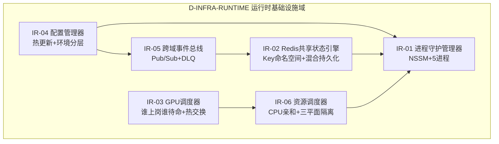

# 24 — D-INFRA-RUNTIME 运行时基础设施域

> **状态**: DRAFT | **核心层**: — | **成熟度**: ⬜ 未开发 | **已拆分**: OPS子模块已迁移至25-D-INFRA-OPS
> **一句话**: 代码运行时直接依赖的基础设施——GPU/网络/数据库/事件总线/时钟/存储/配置/API网关

## §0 域定义

| 维度 | 内容 |
|------|------|
| 核心Aggregate | InfrastructureNode |
| 核心事件 | E-IF-01 InfrastructureAlert / E-IF-02 CapacityThresholdBreached |
| 开发状态 | 未开发 |
| 优先级 | P2 |
| 激活前提 | D-AUTONOMY就绪 |

## §1 子模块清单

| ID | 名称 | 职责 | 优先级 | 开发状态 | 对标依据 |
|----|------|------|:------:|:--------:|---------|
| D-INFRA-06 | 配置管理器（Config Manager） | 职责：管理运行时配置的集中存储、分发与版本控制，支撑配置热更新与灰度发布。理论：配置管理/配置中心/配置版本化。具备配置变更审计合规检查。 | P2 | ❌ | — |
| D-INFRA-07 | 资源调度器（Resource Scheduler） | 职责：运行时计算资源的动态分配、优先级抢占调度与资源回收。理论：资源调度/优先级抢占/公平调度。具备资源分配审计合规检查。 | P2 | ❌ | — |
| D-INFRA-08 | 网络管理器（Network Manager） | 职责：运行时网络拓扑管理、连接池维护与网络策略执行。理论：SDN/网络策略/流量管理。具备网络策略合规审计检查。 | P2 | ❌ | — |
| D-INFRA-09 | 服务网格（Service Mesh） | 职责：服务间通信治理、Sidecar代理管理、流量路由与mTLS安全通信。理论：Istio Ambient Mesh/服务网格/零信任网络。具备服务通信审计合规检查。 | P2 | ❌ | — |
| D-INFRA-11 | 隐私保护计算（Privacy-Preserving Compute） | 职责：隐私数据的安全计算执行环境，基于TEE/MPC等隐私增强技术方案。理论：机密计算/TEE/联邦学习隐私保护。具备隐私计算合规审计检查。 | P2 | ❌ | — |
| D-INFRA-12 | 数据主权管理器（Data Sovereignty Manager） | 职责：数据存储位置合规控制、跨区域数据传输管控与主权策略执行。理论：数据主权/数据本地化/GDPR合规。具备数据主权审计合规检查。 | P2 | ❌ | — |
| D-INFRA-13 | 硬件加速器（Hardware Accelerator） | 职责：GPU/TPU/FPGA等异构硬件加速资源的统一管理、分配与性能监控。理论：硬件抽象/异构计算/加速器虚拟化。具备硬件资源使用审计检查。 | P2 | ❌ | — |
| D-INFRA-16 | 时钟同步服务（Clock Synchronization Service） | 职责：分布式系统时钟同步、时间戳一致性与时钟漂移补偿保障。理论：NTP/PTP/分布式时钟/TrueTime。具备时钟同步合规审计检查。 | P2 | ❌ | — |
| D-INFRA-17 | 数据库管理器（Database Manager - 16分片SQLite） | 职责：管理16分片SQLite数据库的读写路由、分片策略与连接池维护。理论：数据库分片/读写分离/连接池管理。具备数据库操作审计合规检查。 | P2 | ❌ | — |
| D-INFRA-21 | GPU计算管线管理器（GPU Compute Pipeline Manager） | 职责：管理GPU计算管线的任务调度、执行流编排与流水线并行优化。理论：GPU管线/CUDA Stream/计算图优化。具备GPU管线执行审计检查。 | P2 | ❌ | — |
| D-INFRA-22 | GPU内存传输优化器（GPU Memory Transfer Optimizer） | 职责：优化GPU与主机间数据传输效率、内存拷贝合并与异步传输策略。理论：DMA/零拷贝/异步传输/内存带宽优化。具备GPU传输效率审计检查。 | P2 | ❌ | — |
| D-INFRA-23 | GPU编程抽象层（GPU Programming Abstraction Layer） | 职责：提供统一的GPU编程接口抽象，屏蔽底层硬件差异与驱动版本变更。理论：GPU编程模型/抽象层/跨平台GPU编程。具备GPU编程规范合规检查。 | P2 | ❌ | — |
| D-INFRA-24 | GPU资源监控器（GPU Resource Monitor） | 职责：实时监控GPU资源使用率、显存占用、温度与功耗，触发阈值告警。理论：GPU监控/资源可观测性/性能基准。具备GPU资源使用审计检查。 | P2 | ❌ | — |
| D-INFRA-25 | GPU推理训练动态分配器（GPU Inference-Training Dynamic Allocator） | 职责：动态分配GPU计算资源以平衡推理延迟敏感型与训练吞吐密集型工作负载。理论：GPU资源分时复用/推理训练混部/弹性分配。具备GPU分配策略审计检查。 | P2 | ❌ | — |
| D-INFRA-26 | GPU内核启动优化器（GPU Kernel Launch Optimizer） | 职责：优化GPU内核启动参数配置、内核融合策略与执行网格分块方案。理论：CUDA内核/内核融合/执行配置优化。具备GPU内核执行审计检查。 | P2 | ❌ | — |
| D-INFRA-27 | CPU核心分配管理器（CPU Core Allocation Manager） | 职责：管理CPU核心的亲和性绑定、核心隔离与动态分配调度策略。理论：CPU亲和性/核心隔离/NUMA调度。具备CPU核心使用审计检查。 | P2 | ❌ | — |
| D-INFRA-28 | 跨域事件总线（Cross-Domain Event Bus） | 职责：提供跨域事件发布与订阅机制、事件路由分发与事件持久化存储。理论：事件驱动架构/事件总线/发布订阅模式。具备跨域事件流审计合规检查。 | P2 | ❌ | — |
| D-INFRA-29 | Single-Machine Concurrency Pattern Optimizer | 单机并发模式优化器：专业机构50人并发vs一人+AI顺序并发的模式差异+并发模式选择/并发度优化/资源争抢避免+并发性能监控。理论：并发模式/并发度/资源争抢。具备并发优化审计/并发模式合规检查 | P2 | ❌ | 单机并发模式/50人vs一人+AI/并发度优化; 并发模式/并发度/资源争抢; 自适应并发度/在线资源监控/争抢避免; 并发优化审计/并发模式合规
| D-INFRA-30 | 进程间通信管理器（IPC Manager） | 职责：管理进程间通信通道的建立、消息序列化与通信性能监控。理论：IPC/共享内存/消息传递/RPC。具备进程间通信审计合规检查。 | P2 | ❌ | — |
| D-INFRA-31 | 线程池管理器（Thread Pool Manager） | 职责：管理线程池的创建、动态扩缩容与任务队列调度策略。理论：线程池/工作窃取/任务调度/背压机制。具备线程池使用审计合规检查。 | P2 | ❌ | — |
| D-INFRA-32 | 遥测四流统一采集器（Telemetry Four-Stream Unified Collector） | 职责：统一采集指标/日志/追踪/事件四类遥测数据流，标准化格式输出。理论：OpenTelemetry/四流遥测/统一可观测性。具备遥测数据采集审计合规检查。 | P2 | ❌ | — |
| D-INFRA-33 | 请求链追踪器（Request Chain Tracer） | 职责：端到端请求链路的分布式追踪、Span关联与延迟瓶颈定位。理论：分布式追踪/OpenTracing/Span上下文传播。具备请求链路审计合规检查。 | P2 | ❌ | — |
| D-INFRA-35 | MCP哨兵系统监控器（MCP Sentinel System Monitor） | 职责：基于MCP协议的哨兵式系统健康监控、异常探测与自动告警。理论：哨兵监控/MCP协议/健康探针/异常检测。具备系统监控审计合规检查。 | P2 | ❌ | — |
| D-INFRA-41 | 弹性伸缩管理器（Auto-Scaling Manager） | 职责：基于负载指标动态调整服务实例数量，实现水平弹性伸缩。理论：自动伸缩/HPA/KEDA/弹性策略。具备弹性伸缩审计合规检查。 | P2 | ❌ | — |
| D-INFRA-46 | 高性能高可用保障框架 | 高性能高可用保障框架：SLA保障+故障自动切换+多实例热备+健康检查 | P1 | ❌ | —
| D-INFRA-47 | 故障转移协调器（Failover Coordinator） | 职责：协调服务故障检测、主备切换与故障恢复流程编排。理论：故障转移/主备切换/心跳检测/仲裁选举。具备故障转移审计合规检查。 | P2 | ❌ | — |
| D-INFRA-50 | 多区域协同管理器（Multi-Region Coordination Manager） | 职责：管理多区域部署的服务协同、数据同步与区域间路由策略。理论：多区域部署/Geo-Redundancy/区域协同/就近接入。具备多区域协同审计合规检查。 | P2 | ❌ | — |
| D-INFRA-53 | 面板布局引擎（Panel Layout Engine） | 职责：运行时面板布局的编排计算、视图排列与响应式自适应调整。理论：布局引擎/响应式布局/视图编排。具备面板布局审计合规检查。 | P2 | ❌ | — |
| D-INFRA-54 | 区域折叠管理器（Region Collapse Manager） | 职责：管理面板区域的折叠/展开状态、动画过渡与可见性控制。理论：UI状态管理/区域折叠/视图可见性。具备区域状态管理审计合规检查。 | P2 | ❌ | — |
| D-INFRA-62 | 依赖可视化器（Dependency Visualizer） | 职责：可视化渲染模块间依赖关系图，支持交互式探索与依赖路径追踪。理论：依赖图可视化/图形渲染/拓扑展示。具备依赖关系审计合规检查。 | P2 | ❌ | — |
| D-INFRA-63 | 部署拓扑管理器（Deployment Topology Manager） | 职责：管理部署拓扑的定义、编排与拓扑变更的自动化执行。理论：部署拓扑/编排引擎/拓扑即代码。具备部署拓扑审计合规检查。 | P2 | ❌ | — |
| D-INFRA-69 | 功能生命周期管理器（Feature Lifecycle Manager） | 职责：管理功能从实验、灰度到全量发布的生命周期状态转换。理论：功能生命周期/特性管理/渐进式交付。具备功能生命周期审计合规检查。 | P2 | ❌ | — |
| D-INFRA-74 | 文档搜索索引器（Documentation Search Indexer） | 职责：建立文档全文搜索索引，支持模糊匹配与语义搜索能力。理论：全文索引/倒排索引/语义搜索。具备文档索引构建审计合规检查。 | P2 | ❌ | — |
| D-INFRA-75 | 模块版本依赖解析器（Module Version Dependency Resolver） | 职责：解析模块间版本依赖约束，执行版本兼容性校验与冲突检测。理论：依赖解析/语义版本/版本约束。具备版本依赖审计合规检查。 | P2 | ❌ | — |
| D-INFRA-76 | 代码结构可视化器（Code Structure Visualizer） | 职责：生成代码结构拓扑图、类层次关系图与模块组织架构图。理论：代码可视化/AST分析/结构拓扑。具备代码结构审计合规检查。 | P2 | ❌ | — |
| D-INFRA-77 | 包依赖图生成器（Package Dependency Graph Generator） | 职责：自动生成包级别依赖关系的有向无环图，标注依赖方向与强度。理论：包依赖图/依赖分析/图生成算法。具备包依赖审计合规检查。 | P2 | ❌ | — |
| D-INFRA-79 | 运行时配置校验器（Runtime Configuration Validator） | 职责：校验运行时配置的格式合法性、逻辑一致性与类型安全。理论：配置校验/模式验证/类型检查。具备配置校验审计合规检查。 | P2 | ❌ | — |
| D-INFRA-82 | 代码复杂度分析器（Code Complexity Analyzer） | 职责：分析代码圈复杂度、认知复杂度与可维护性指数，生成复杂度报告。理论：圈复杂度/认知复杂度/可维护性指数。具备代码质量审计合规检查。 | P2 | ❌ | — |
| D-INFRA-84 | 代码重复检测器（Code Duplication Detector） | 职责：检测代码库中的重复代码片段，计算相似度并生成去重建议。理论：代码克隆检测/相似度分析/去重策略。具备代码重复审计合规检查。 | P2 | ❌ | — |
| D-INFRA-87 | 代码变更影响分析器（Code Change Impact Analyzer） | 职责：分析代码变更的影响范围，追踪变更传播路径与受影响模块。理论：变更影响分析/依赖传播/回归范围预测。具备变更影响审计合规检查。 | P2 | ❌ | — |
| D-INFRA-89 | 自动代码审查器（Automated Code Reviewer） | 职责：自动执行代码审查规则，检测代码异味、反模式与最佳实践偏离。理论：静态分析/代码审查/代码异味检测。具备代码审查审计合规检查。 | P2 | ❌ | — |
| D-INFRA-90 | 代码规范强制执行器（Code Style Enforcer） | 职责：强制执行代码风格规范、命名约定与格式化规则的自动化工具。理论：代码规范/格式化/linting/风格一致性。具备代码规范审计合规检查。 | P2 | ❌ | — |
| D-INFRA-92 | 代码安全静态分析器（Code Security Static Analyzer） | 职责：静态扫描代码安全漏洞、敏感信息泄露与CWE合规性问题。理论：SAST/安全静态分析/漏洞检测/CWE。具备代码安全审计合规检查。 | P2 | ❌ | — |
| D-INFRA-102 | 架构合规检查器（Architecture Compliance Checker） | 职责：自动检查代码实现是否符合架构设计约束、分层规则与依赖方向。理论：架构合规/ArchUnit/依赖规则/分层架构。具备架构合规审计检查。 | P2 | ❌ | — |
| D-INFRA-104 | 技术债务追踪器（Technical Debt Tracker） | 职责：量化追踪技术债务指标，生成偿还优先级排序与改进建议。理论：技术债务/SQALE方法/债务量化。具备技术债务审计合规检查。 | P2 | ❌ | — |
| D-INFRA-105 | 架构演进规划器（Architecture Evolution Planner） | 职责：规划架构演进路径，评估架构变更风险与迁移成本。理论：架构演进/演进式架构/适应性度函数。具备架构演进审计合规检查。 | P2 | ❌ | — |
| D-INFRA-106 | 请求转发与负载均衡器 | 请求转发与负载均衡器：请求转发+负载均衡+健康检查+故障转移 | P2 | ❌ | —
| D-INFRA-108 | 实盘数据→研究域反馈通道 | 实盘数据→研究域反馈通道：实盘数据到研究域的反馈机制+监控评估→研究域洞察反馈+反馈闭环+反馈验证 | P2 | ❌ | —
| D-INFRA-111 | API版本管理器（API Version Manager） | 职责：管理API版本生命周期，执行版本兼容性检查与废弃策略编排。理论：API版本管理/语义化版本/废弃策略。具备API版本审计合规检查。 | P2 | ❌ | — |
| D-INFRA-115 | 模块接口契约管理器 | 模块接口契约管理器：模块间接口定义+接口版本管理+接口兼容性验证+接口文档自动生成 | P2 | ❌ | —
| D-INFRA-118 | SDK自动生成器（SDK Auto-Generator） | 职责：基于接口契约自动生成多语言SDK客户端代码与使用文档。理论：SDK生成/代码生成/OpenAPI Generator。具备SDK生成审计合规检查。 | P2 | ❌ | — |
| D-INFRA-120 | API文档同步器（API Documentation Synchronizer） | 职责：自动同步API实现与文档描述，检测文档不一致并触发更新。理论：API文档/文档同步/契约驱动文档。具备API文档审计合规检查。 | P2 | ❌ | — |
| D-INFRA-131 | 消息队列管理器（Message Queue Manager） | 职责：管理消息队列的拓扑定义、消费者组协调与消息投递保证。理论：消息队列/发布订阅/消息持久化/消费组。具备消息队列审计合规检查。 | P2 | ❌ | — |
| D-INFRA-132 | 缓存一致性管理器（Cache Consistency Manager） | 职责：维护多层缓存之间的一致性，执行缓存失效策略与版本控制。理论：缓存一致性/缓存失效/CQRS/写入策略。具备缓存一致性审计合规检查。 | P2 | ❌ | — |
| D-INFRA-134 | 分布式锁管理器（Distributed Lock Manager） | 职责：提供分布式环境下的互斥锁、读写锁与锁超时自动释放机制。理论：分布式锁/Redlock/租约机制/锁超时。具备分布式锁审计合规检查。 | P2 | ❌ | — |
| D-INFRA-137 | 服务发现注册器（Service Discovery Registrar） | 职责：管理服务实例的自动注册、健康状态上报与服务发现查询。理论：服务发现/Consul/Eureka/服务注册。具备服务注册审计合规检查。 | P2 | ❌ | — |
| D-INFRA-143 | 回归测试编排器（Regression Test Orchestrator） | 职责：编排回归测试套件的执行顺序、并行测试与测试结果汇总。理论：回归测试/测试编排/测试金字塔。具备回归测试审计合规检查。 | P2 | ❌ | — |
| D-INFRA-144 | 压力测试引擎（Stress Test Engine） | 职责：执行系统压力测试，模拟高并发场景并采集性能瓶颈数据。理论：压力测试/负载生成/性能瓶颈分析。具备压力测试审计合规检查。 | P2 | ❌ | — |
| D-INFRA-147 | 测试覆盖率追踪器（Test Coverage Tracker） | 职责：追踪代码测试覆盖率的行/分支/条件覆盖度与覆盖率趋势。理论：代码覆盖率/JaCoCo/Istanbul/覆盖率标准。具备测试覆盖率审计合规检查。 | P2 | ❌ | — |
| D-INFRA-148 | 工作流版本管理 | 工作流版本管理：工作流定义的版本控制与回滚 | P2 | ❌ | —
| D-INFRA-154 | 容器编排器（Container Orchestrator） | 职责：管理容器生命周期、调度策略、服务网络与存储挂载编排。理论：容器编排/Kubernetes/容器调度/Pod管理。具备容器编排审计合规检查。 | P2 | ❌ | — |
| D-INFRA-156 | 网络策略管理器（Network Policy Manager） | 职责：定义并执行容器间网络访问控制策略与网络分段隔离规则。理论：网络策略/NetworkPolicy/微分段/零信任。具备网络策略审计合规检查。 | P2 | ❌ | — |
| D-INFRA-157 | 流量整形器（Traffic Shaper） | 职责：对进出流量实施速率限制、带宽分配与流量优先级控制。理论：流量整形/令牌桶/漏桶/QoS保障。具备流量整形审计合规检查。 | P2 | ❌ | — |
| D-INFRA-158 | 负载均衡策略引擎（Load Balancing Strategy Engine） | 职责：执行负载均衡策略决策，支持轮询/加权/最少连接等算法。理论：负载均衡/加权轮询/最少连接/一致性哈希。具备负载均衡审计合规检查。 | P2 | ❌ | — |
| D-INFRA-160 | 容器镜像缓存管理器（Container Image Cache Manager） | 职责：管理容器镜像的分层缓存、预热拉取与镜像垃圾回收。理论：镜像缓存/分层存储/镜像预热/GC策略。具备镜像缓存审计合规检查。 | P2 | ❌ | — |
| D-INFRA-161 | 容器资源隔离器（Container Resource Isolator） | 职责：实施容器间的CPU/内存/IO资源隔离与cgroup限制策略。理论：资源隔离/cgroup/namespace/安全上下文。具备容器隔离审计合规检查。 | P2 | ❌ | — |
| D-INFRA-162 | 服务降级管理器（Service Degradation Manager） | 职责：管理服务降级策略，在过载时自动切降非核心功能保障核心链路。理论：服务降级/熔断/限流降级/优雅降级。具备服务降级审计合规检查。 | P2 | ❌ | — |
| D-INFRA-165 | 连接池管理器（Connection Pool Manager） | 职责：管理数据库/缓存/消息队列等连接池的大小、超时与泄漏检测。理论：连接池/连接复用/泄漏检测/池化技术。具备连接池审计合规检查。 | P2 | ❌ | — |
| D-INFRA-168 | 服务限流器（Service Rate Limiter） | 职责：实施服务级别、用户级别与API级别的请求速率限制与配额管理。理论：限流算法/令牌桶/滑动窗口/配额管理。具备服务限流审计合规检查。 | P2 | ❌ | — |
| D-INFRA-170 | 通信协议适配器（Communication Protocol Adapter） | 职责：适配多种通信协议之间的转换，提供统一通信抽象层。理论：协议适配/gRPC/REST/消息格式转换。具备协议适配审计合规检查。 | P2 | ❌ | — |
| D-INFRA-171 | 序列化性能优化器（Serialization Performance Optimizer） | 职责：优化数据序列化与反序列化性能，选择最优序列化方案。理论：序列化/Protobuf/FlatBuffers/零拷贝序列化。具备序列化效率审计合规检查。 | P2 | ❌ | — |
| D-INFRA-173 | 数据压缩管理器（Data Compression Manager） | 职责：管理传输数据的压缩策略，平衡压缩率与CPU开销。理论：数据压缩/LZ4/Snappy/gzip/压缩策略。具备数据压缩审计合规检查。 | P2 | ❌ | — |
| D-INFRA-175 | 缓存预热管理器（Cache Warmup Manager） | 职责：管理系统启动时缓存数据的预先加载与热点数据预测填充。理论：缓存预热/热点预测/数据预加载。具备缓存预热审计合规检查。 | P2 | ❌ | — |
| D-INFRA-176 | 冷启动优化器（Cold Start Optimizer） | 职责：优化服务冷启动速度，减少初始化延迟与首次请求响应时间。理论：冷启动优化/懒加载/预热策略/启动加速。具备冷启动审计合规检查。 | P2 | ❌ | — |
| D-INFRA-180 | 阶段同步协调器（Phase Synchronization Coordinator） | 职责：协调多个开发阶段的同步进度，确保阶段间依赖按时交付。理论：阶段同步/里程碑协调/甘特图依赖。具备阶段同步审计合规检查。 | P2 | ❌ | — |
| D-INFRA-181 | 跨阶段状态传递器（Cross-Phase State Propagator） | 职责：管理开发状态在阶段间的传递与转换，确保状态一致性。理论：状态传递/工作流状态/阶段转换。具备状态传递审计合规检查。 | P2 | ❌ | — |
| D-INFRA-182 | 里程碑依赖校验器（Milestone Dependency Validator） | 职责：校验里程碑之间的依赖关系是否满足，检测依赖阻塞风险。理论：里程碑依赖/关键路径/依赖图校验。具备里程碑依赖审计合规检查。 | P2 | ❌ | — |
| D-INFRA-184 | 交付物版本追踪器（Deliverable Version Tracker） | 职责：追踪各阶段交付物的版本演进，维护版本树与变更日志。理论：版本追踪/交付物管理/版本树。具备交付物版本审计合规检查。 | P2 | ❌ | — |
| D-INFRA-185 | 阶段回顾分析器（Phase Retrospective Analyzer） | 职责：分析阶段执行数据，生成回顾报告与改进建议。理论：回顾分析/过程改进/数据驱动回顾。具备阶段回顾审计合规检查。 | P2 | ❌ | — |
| D-INFRA-186 | 持续改进引擎（Continuous Improvement Engine） | 职责：基于历史数据驱动持续改进流程，自动生成优化建议。理论：持续改进/PDCA/反馈循环。具备持续改进审计合规检查。 | P2 | ❌ | — |
| D-INFRA-190 | 监控数据聚合器（Monitoring Data Aggregator） | 职责：聚合多源监控数据，执行数据去重、降采样与时序对齐。理论：数据聚合/时序对齐/降采样/数据融合。具备监控数据审计合规检查。 | P2 | ❌ | — |
| D-INFRA-193 | 实时告警引擎（Real-time Alerting Engine） | 职责：基于规则引擎实时评估监控指标，触发分级告警通知。理论：告警引擎/规则评估/告警分级/通知渠道。具备告警审计合规检查。 | P2 | ❌ | — |
| D-INFRA-194 | 告警静默管理器（Alert Silence Manager） | 职责：管理告警静默窗口、维护期抑制规则与告警去重合并。理论：告警静默/维护窗口/告警抑制/去重。具备告警静默审计合规检查。 | P2 | ❌ | — |
| D-INFRA-195 | 告警升级策略引擎（Alert Escalation Policy Engine） | 职责：定义并执行告警升级策略，按时间和严重程度逐级升级。理论：告警升级/值班轮转/升级链/响应SLA。具备告警升级审计合规检查。 | P2 | ❌ | — |
| D-INFRA-197 | 指标异常检测器（Metric Anomaly Detector） | 职责：基于统计模型检测指标异常波动，识别潜在系统问题。理论：异常检测/时序异常/统计过程控制。具备指标异常检测审计合规检查。 | P2 | ❌ | — |
| D-INFRA-201 | 数据质量监控器（Data Quality Monitor） | 职责：监控数据管线的数据质量指标，检测数据异常与漂移。理论：数据质量/数据漂移/完整性校验。具备数据质量审计合规检查。 | P2 | ❌ | — |
| D-INFRA-203 | 数据血缘追踪器（Data Lineage Tracker） | 职责：追踪数据从源头到消费端的完整路径与转换历史。理论：数据血缘/数据溯源/血统图。具备数据血缘审计合规检查。 | P2 | ❌ | — |
| D-INFRA-213 | 文档模板引擎（Documentation Template Engine） | 职责：基于模板生成标准化文档，支持模板变量替换与条件渲染。理论：模板引擎/文档生成/模板变量。具备文档模板审计合规检查。 | P2 | ❌ | — |
| D-INFRA-214 | 文档版本管理器（Documentation Version Manager） | 职责：管理文档版本与代码版本同步，维护文档版本树。理论：文档版本控制/版本同步/变更历史。具备文档版本审计合规检查。 | P2 | ❌ | — |
| D-INFRA-215 | 术语一致性校验器（Terminology Consistency Validator） | 职责：校验文档中术语使用的一致性，检测同义异名与异义同名。理论：术语管理/一致性校验/术语标准化。具备术语一致性审计合规检查。 | P2 | ❌ | — |
| D-INFRA-216 | 规范自动化检查器（Specification Automation Checker） | 职责：自动检查文档内容是否满足规范模板的结构完整性要求。理论：规范检查/文档合规/模板验证。具备规范合规审计检查。 | P2 | ❌ | — |
| D-INFRA-217 | 文档链接验证器（Documentation Link Validator） | 职责：验证文档间交叉引用的链接有效性，检测死链与过期引用。理论：链接验证/死链检测/引用完整性。具备文档链接审计合规检查。 | P2 | ❌ | — |
| D-INFRA-218 | 知识库索引器（Knowledge Base Indexer） | 职责：建立知识库的结构化索引，支持全文检索与语义查询。理论：知识库索引/全文检索/知识图谱索引。具备知识库索引审计合规检查。 | P2 | ❌ | — |
| D-INFRA-225 | 资源负载均衡器 | 资源负载均衡器：开发资源分配与负载均衡 | P2 | ❌ | —
| D-INFRA-229 | 任务优先级调度器（Task Priority Scheduler） | 职责：基于任务优先级、截止时间与资源需求综合调度任务执行顺序。理论：优先级调度/实时调度/截止时间驱动调度。具备任务调度审计合规检查。 | P2 | ❌ | — |
| D-INFRA-230 | 资源预约管理器（Resource Reservation Manager） | 职责：管理计算资源的预先预约、时间槽分配与资源预留策略。理论：资源预约/时间槽/预留策略/资源日历。具备资源预约审计合规检查。 | P2 | ❌ | — |
| D-INFRA-231 | 资源配额管理器（Resource Quota Manager） | 职责：管理各项目/团队/用户的资源配额分配与使用量统计。理论：资源配额/多租户配额/配额超用控制。具备资源配额审计合规检查。 | P2 | ❌ | — |
| D-INFRA-232 | 资源使用审计器（Resource Usage Auditor） | 职责：审计资源使用记录的合规性，生成资源使用报告与异常标记。理论：资源审计/使用追踪/成本归因。具备资源使用审计合规检查。 | P2 | ❌ | — |
| D-INFRA-237 | 系统启动编排器（System Boot Orchestrator） | 职责：编排系统各组件的启动顺序、依赖等待与健康检查就绪验证。理论：启动编排/依赖顺序/就绪探针。具备启动编排审计合规检查。 | P2 | ❌ | — |
| D-INFRA-239 | 环境变量管理器（Environment Variable Manager） | 职责：管理环境变量的定义、分层继承、加密存储与运行时注入。理论：环境变量/配置分层/密钥注入。具备环境变量审计合规检查。 | P2 | ❌ | — |
| D-INFRA-241 | 进程守护监控器（Process Guardian Monitor） | 职责：监控守护进程的健康状态，执行异常进程自动重启与告警。理论：进程守护/看门狗/进程监控/Supervisor。具备进程守护审计合规检查。 | P2 | ❌ | — |
| D-INFRA-248 | 对话上下文压缩 | 对话上下文压缩：长对话上下文智能压缩与摘要 | P2 | ❌ | —
| D-INFRA-258 | 多协议网络适配器（Multi-Protocol Network Adapter） | 职责：适配多种网络协议的连接管理，提供统一网络通信接口。理论：多协议适配/TCP/UDP/HTTP/WebSocket。具备网络协议审计合规检查。 | P2 | ❌ | — |
| D-INFRA-259 | 多模态输入路由 | 多模态输入路由：语音/文字/文件输入智能路由分发 | P2 | ❌ | —
| D-INFRA-260 | 请求重试管理器（Request Retry Manager） | 职责：管理请求的重试策略，支持指数退避、抖动与熔断联动。理论：重试策略/指数退避/抖动/重试风暴防护。具备重试策略审计合规检查。 | P2 | ❌ | — |
| D-INFRA-264 | 数据传输校验器（Data Transmission Validator） | 职责：校验数据传输的完整性、顺序性与校验和一致性。理论：数据校验/校验和/顺序号/完整性验证。具备数据传输审计合规检查。 | P2 | ❌ | — |
| D-INFRA-266 | WebSocket断线重连 | WebSocket断线重连：前端断线检测与自动重连 | P2 | ❌ | —
| D-INFRA-267 | 跨域资源共享管理器（CORS Manager） | 职责：管理跨域资源共享策略，配置允许来源、方法与头部白名单。理论：CORS/跨域安全/来源策略。具备跨域策略审计合规检查。 | P2 | ❌ | — |
| D-INFRA-271 | 应用状态快照器（Application State Snapshotter） | 职责：创建应用运行时状态的完整快照，支持状态恢复与回放。理论：状态快照/检查点/CBR/状态持久化。具备状态快照审计合规检查。 | P2 | ❌ | — |
| D-INFRA-272 | 会话持久化管理器（Session Persistence Manager） | 职责：管理用户会话的持久化存储、过期清理与会话恢复机制。理论：会话管理/会话持久化/会话亲和性。具备会话管理审计合规检查。 | P2 | ❌ | — |
| D-INFRA-276 | 用户偏好同步器（User Preference Synchronizer） | 职责：跨设备同步用户偏好设置，解决冲突合并与一致性维护。理论：偏好同步/CRDT/冲突解决/跨设备同步。具备偏好同步审计合规检查。 | P2 | ❌ | — |
| D-INFRA-277 | 多端状态协调器（Multi-Device State Coordinator） | 职责：协调多终端间的状态一致，执行乐观更新与冲突解决。理论：多端状态/CRDT/乐观并发/状态协调。具备多端状态审计合规检查。 | P2 | ❌ | — |
| D-INFRA-300 | 层间数据格式转换与校验器 | 层间数据格式转换与校验器：各层数据格式定义+格式转换器+格式校验+格式版本管理 | P2 | ❌ | —
| D-INFRA-302 | 数据格式版本协调器（Data Format Version Coordinator） | 职责：协调不同服务版本间的数据格式兼容性，管理格式版本演进。理论：数据格式版本/Schema演进/兼容性管理。具备格式版本审计合规检查。 | P2 | ❌ | — |
| D-INFRA-303 | 数据转换性能优化器（Data Transformation Performance Optimizer） | 职责：优化数据转换管线的处理性能，减少格式转换延迟。理论：转换优化/流水线优化/零拷贝转换。具备转换性能审计合规检查。 | P2 | ❌ | — |
| D-INFRA-304 | 批量数据处理器（Batch Data Processor） | 职责：管理批量数据的聚合处理、窗口计算与批量写入优化。理论：批处理/窗口计算/微批次/批量优化。具备批量处理审计合规检查。 | P2 | ❌ | — |
| D-INFRA-305 | 实时数据流管理器（Real-time Data Stream Manager） | 职责：管理实时数据流的接入、背压控制与流式处理编排。理论：流处理/背压/事件时间/流式管道。具备数据流审计合规检查。 | P2 | ❌ | — |
| D-INFRA-306 | 数据缓冲池管理器（Data Buffer Pool Manager） | 职责：管理数据缓冲池的内存分配、容量控制与溢出处理策略。理论：缓冲池/内存管理/缓冲区溢出/环形缓冲。具备缓冲池审计合规检查。 | P2 | ❌ | — |
| D-INFRA-307 | 数据完整性校验器（Data Integrity Validator） | 职责：校验数据端到端完整性，执行哈希验证与数据一致性检查。理论：数据完整性/哈希校验/Merkle树/端到端校验。具备数据完整性审计合规检查。 | P2 | ❌ | — |
| D-INFRA-314 | 时间表冲突检测器 | 时间表冲突检测器：任务时间重叠/资源冲突自动告警+冲突解决建议 | P2 | ❌ | —
| D-INFRA-315 | 开发计划可视化器（Development Plan Visualizer） | 职责：可视化渲染开发计划的时间线与里程碑，支持甘特图与看板视图。理论：计划可视化/甘特图/看板/时间线渲染。具备计划可视化审计合规检查。 | P2 | ❌ | — |
| D-INFRA-317 | 资源时间线管理器（Resource Timeline Manager） | 职责：管理资源使用的时间线规划，检测资源时间冲突与过载。理论：时间线管理/资源规划/冲突检测。具备资源时间线审计合规检查。 | P2 | ❌ | — |
| D-INFRA-320 | 迭代周期追踪器（Iteration Cycle Tracker） | 职责：追踪迭代周期的执行进度、燃尽图与交付速率度量。理论：迭代追踪/燃尽图/速率度量/敏捷度量。具备迭代追踪审计合规检查。 | P2 | ❌ | — |
| D-INFRA-322 | 数据源星级评分动态更新器 | 数据源星级评分动态更新器：基于实际表现自动更新数据源星级评分 | P2 | ❌ | —
| D-INFRA-351 | 领域驱动设计校验器（DDD Validator） | 职责：校验代码实现是否符合领域驱动设计约束，检查聚合边界与限界上下文。理论：DDD/聚合根/限界上下文/领域校验。具备DDD合规审计检查。 | P2 | ❌ | — |
| D-INFRA-353 | 架构推荐引擎（Architecture Recommendation Engine） | 职责：基于项目特征推荐最佳架构模式与技术栈选型方案。理论：架构推荐/模式匹配/技术选型/决策支持。具备架构推荐审计合规检查。 | P2 | ❌ | — |
| D-INFRA-370 | 代码模板引擎（Code Template Engine） | 职责：基于模板和参数生成标准化代码骨架，支持条件逻辑与循环。理论：模板引擎/代码生成/模板继承/模板变量。具备代码模板审计合规检查。 | P2 | ❌ | — |
| D-INFRA-371 | DAO层代码生成器（DAO Layer Code Generator） | 职责：基于数据模型自动生成DAO层CRUD代码与查询方法。理论：DAO生成/CRUD自动化/ORM映射生成。具备DAO代码生成审计合规检查。 | P2 | ❌ | — |
| D-INFRA-372 | REST API代码生成器（REST API Code Generator） | 职责：基于接口契约自动生成REST API控制器代码与路由配置。理论：API代码生成/OpenAPI/Swagger Codegen/契约驱动。具备API代码生成审计合规检查。 | P2 | ❌ | — |
| D-INFRA-373 | 测试代码生成器（Test Code Generator） | 职责：基于接口契约自动生成单元测试与集成测试代码骨架。理论：测试生成/表驱动测试/边界值生成。具备测试代码生成审计合规检查。 | P2 | ❌ | — |
| D-INFRA-374 | 配置代码生成器（Configuration Code Generator） | 职责：基于配置Schema自动生成类型安全的配置加载代码。理论：配置生成/类型安全/配置Schema/代码生成。具备配置代码生成审计合规检查。 | P2 | ❌ | — |
| D-INFRA-380 | 接口Mock生成器（Interface Mock Generator） | 职责：基于接口定义自动生成Mock实现，支持行为配置与返回值预设。理论：Mock生成/测试替身/行为模拟。具备Mock生成审计合规检查。 | P2 | ❌ | — |
| D-INFRA-383 | 数据模型生成器（Data Model Generator） | 职责：基于Schema定义自动生成数据模型类、序列化与反序列化代码。理论：模型生成/Schema驱动/POJO生成。具备数据模型生成审计合规检查。 | P2 | ❌ | — |
| D-INFRA-384 | 验证规则生成器（Validation Rule Generator） | 职责：基于Schema约束自动生成数据验证规则代码与校验逻辑。理论：验证生成/Bean Validation/JSON Schema校验。具备验证规则生成审计合规检查。 | P2 | ❌ | — |
| D-INFRA-385 | 错误处理代码生成器（Error Handling Code Generator） | 职责：自动生成统一的错误处理、异常映射与错误码管理代码。理论：错误处理/异常映射/错误码标准化。具备错误处理审计合规检查。 | P2 | ❌ | — |
| D-INFRA-386 | 数据字段Schema版本管理器和迁移器 | 数据字段Schema版本管理器和迁移器：数据字段定义Schema版本管理+迁移脚本 | P2 | ❌ | —
| D-INFRA-387 | 数据迁移脚本生成器（Data Migration Script Generator） | 职责：基于Schema版本差异自动生成数据迁移脚本与回滚脚本。理论：数据迁移/Schema迁移/Flyway迁移脚本。具备数据迁移审计合规检查。 | P2 | ❌ | — |
| D-INFRA-388 | 数据库Schema同步器（Database Schema Synchronizer） | 职责：同步应用Schema定义与数据库实际Schema，检测差异并生成DDL。理论：Schema同步/数据库迁移/DDL生成。具备Schema同步审计合规检查。 | P2 | ❌ | — |
| D-INFRA-389 | 字段映射转换器（Field Mapping Transformer） | 职责：执行不同Schema间的字段映射与数据转换，支持复杂映射规则。理论：字段映射/数据转换/ETL映射。具备字段映射审计合规检查。 | P2 | ❌ | — |
| D-INFRA-391 | 数据验证规则引擎（Data Validation Rule Engine） | 职责：基于声明式规则执行数据验证，支持组合规则与自定义校验器。理论：规则引擎/数据验证/声明式校验。具备数据验证审计合规检查。 | P2 | ❌ | — |
| D-INFRA-392 | 数据转换管线编排器（Data Transformation Pipeline Orchestrator） | 职责：编排多步骤数据转换流程，管理数据在各个转换阶段间的流转。理论：数据管线/转换编排/ETL流水线/DAG编排。具备转换管线审计合规检查。 | P2 | ❌ | — |
| D-INFRA-394 | 数据聚合视图管理器（Data Aggregation View Manager） | 职责：管理数据聚合视图的定义、物化刷新与查询优化。理论：聚合视图/Materialized View/视图管理/预计算。具备聚合视图审计合规检查。 | P2 | ❌ | — |
| D-INFRA-395 | 节点返回值类型契约器 | 节点返回值类型契约器：返回值格式/类型/边界契约定义+契约校验 | P2 | ❌ | —
| D-INFRA-396 | 端点响应格式校验器（Endpoint Response Format Validator） | 职责：校验API端点响应是否匹配契约定义的格式与类型约束。理论：响应校验/契约测试/格式合规。具备端点响应审计合规检查。 | P2 | ❌ | — |
| D-INFRA-397 | API版本兼容检测器（API Version Compatibility Detector） | 职责：检测API新版本与旧版本的向后兼容性，标记Breaking Changes。理论：API兼容性/语义版本/Breaking Change检测。具备API版本兼容审计合规检查。 | P2 | ❌ | — |
| D-INFRA-398 | 返回值性能监控器（Return Value Performance Monitor） | 职责：监控API返回值的大小、序列化耗时与传输延迟性能指标。理论：返回值监控/序列化性能/响应大小优化。具备返回值性能审计合规检查。 | P2 | ❌ | — |
| D-INFRA-400 | 模块生命周期管理器（Module Lifecycle Manager） | 职责：管理模块从加载、初始化、运行到卸载的完整生命周期状态。理论：模块生命周期/生命周期钩子/状态机。具备模块生命周期审计合规检查。 | P2 | ❌ | — |
| D-INFRA-402 | 模块注册中心（Module Registry） | 职责：维护模块的注册信息，提供模块发现与元数据查询服务。理论：模块注册/服务注册表/元数据管理。具备模块注册审计合规检查。 | P2 | ❌ | — |
| D-INFRA-403 | 模块依赖注入器（Module Dependency Injector） | 职责：管理模块间的依赖注入，执行构造函数注入与属性注入绑定。理论：依赖注入/IoC容器/DI模式。具备依赖注入审计合规检查。 | P2 | ❌ | — |
| D-INFRA-404 | 模块配置聚合器（Module Configuration Aggregator） | 职责：聚合各模块的分散配置为统一配置视图，处理配置覆盖与合并。理论：配置聚合/配置树/配置覆盖/合并策略。具备配置聚合审计合规检查。 | P2 | ❌ | — |
| D-INFRA-405 | 模块间通信协议管理器（Inter-Module Communication Protocol Manager） | 职责：管理模块间通信协议的定义、版本协商与协议适配。理论：模块通信/协议管理/协议协商。具备模块通信审计合规检查。 | P2 | ❌ | — |
| D-INFRA-406 | 模块健康检查器（Module Health Checker） | 职责：周期性探测各模块的健康状态，执行活性检查与就绪检查。理论：健康检查/活性探针/就绪探针/健康端点。具备模块健康审计合规检查。 | P2 | ❌ | — |
| D-INFRA-407 | 模块热更新管理器（Module Hot Reload Manager） | 职责：管理模块的热更新流程，支持不停机替换与灰度切换。理论：热更新/热重载/零停机部署/灰度切换。具备模块热更新审计合规检查。 | P2 | ❌ | — |
| D-INFRA-409 | 模块功能开关管理器（Module Feature Flag Manager） | 职责：管理模块级功能开关，支持运行时动态启用或禁用模块功能。理论：功能开关/特性标记/动态配置。具备功能开关审计合规检查。 | P2 | ❌ | — |
| D-INFRA-410 | 插件系统管理器（Plugin System Manager） | 职责：管理插件系统的加载、隔离与生命周期，支持动态扩展机制。理论：插件架构/SPI/扩展点/插件隔离。具备插件系统审计合规检查。 | P2 | ❌ | — |
| D-INFRA-411 | 模块沙箱隔离器（Module Sandbox Isolator） | 职责：为模块提供沙箱执行环境，限制资源访问与权限边界。理论：沙箱/安全隔离/权限限制/资源围栏。具备模块沙箱审计合规检查。 | P2 | ❌ | — |
| D-INFRA-412 | 模块度量采集器（Module Metrics Collector） | 职责：采集各模块的运行度量指标，包括调用量、延迟与错误率。理论：模块度量/指标采集/性能度量。具备模块度量审计合规检查。 | P2 | ❌ | — |
| D-INFRA-413 | 模块日志聚合器（Module Log Aggregator） | 职责：聚合各模块的分散日志，统一格式化与日志级别管理。理论：日志聚合/统一日志/日志路由/级别过滤。具备模块日志审计合规检查。 | P2 | ❌ | — |
| D-INFRA-414 | 模块异常边界管理器（Module Exception Boundary Manager） | 职责：定义模块异常边界，防止异常跨模块传播导致级联故障。理论：异常边界/熔断器/舱壁隔离/级联防护。具备异常边界审计合规检查。 | P2 | ❌ | — |
| D-INFRA-415 | 模块性能分析器（Module Performance Profiler） | 职责：对模块运行时性能进行采样分析，识别热点路径与瓶颈。理论：性能分析/Profiling/热点检测/CPU采样。具备模块性能审计合规检查。 | P2 | ❌ | — |
| D-INFRA-417 | 模块文档索引器（Module Documentation Indexer） | 职责：索引各模块的技术文档，支持关键词搜索与文档关联查询。理论：文档索引/文档检索/全文搜索。具备模块文档审计合规检查。 | P2 | ❌ | — |
| D-INFRA-418 | 模块测试运行器（Module Test Runner） | 职责：编排模块级测试的执行，支持并行测试与依赖排序。理论：测试运行/测试编排/并行执行。具备模块测试审计合规检查。 | P2 | ❌ | — |
| D-INFRA-422 | 全局依赖图计算器（Global Dependency Graph Calculator） | 职责：计算全系统模块间的完整依赖图，分析依赖方向与深度。理论：依赖图/拓扑排序/图计算。具备依赖图审计合规检查。 | P2 | ❌ | — |
| D-INFRA-423 | 循环依赖检测器（Circular Dependency Detector） | 职责：检测模块间的循环依赖，定位循环路径并生成解除建议。理论：循环依赖/有向图环检测/拓扑排序。具备循环依赖审计合规检查。 | P2 | ❌ | — |
| D-INFRA-424 | 依赖版本锁定管理器（Dependency Version Lock Manager） | 职责：管理依赖版本的锁定策略，生成锁文件并检测未授权变更。理论：版本锁定/依赖锁/确定性构建。具备版本锁定审计合规检查。 | P2 | ❌ | — |
| D-INFRA-425 | 依赖安全漏洞扫描器（Dependency Security Vulnerability Scanner） | 职责：扫描依赖库的已知安全漏洞，输出CVE风险等级与修复建议。理论：SCA/依赖扫描/CVE/漏洞库。具备依赖安全审计合规检查。 | P2 | ❌ | — |
| D-INFRA-426 | 传递依赖分析器（Transitive Dependency Analyzer） | 职责：分析依赖的传递链路，识别间接依赖的版本冲突与风险。理论：传递依赖/依赖树/Diamond依赖问题。具备传递依赖审计合规检查。 | P2 | ❌ | — |
| D-INFRA-427 | 依赖冲突解决器（Dependency Conflict Resolver） | 职责：检测并解决多个依赖之间的版本冲突，执行依赖仲裁策略。理论：依赖冲突/版本仲裁/冲突解析。具备依赖冲突审计合规检查。 | P2 | ❌ | — |
| D-INFRA-428 | 依赖升级兼容性检查器（Dependency Upgrade Compatibility Checker） | 职责：检查依赖升级后的API兼容性与行为变更影响。理论：升级兼容性/API兼容/变更影响分析。具备升级兼容审计合规检查。 | P2 | ❌ | — |
| D-INFRA-430 | 依赖图可视化渲染器（Dependency Graph Visual Renderer） | 职责：将全局依赖图渲染为交互式可视化图形，支持缩放与过滤。理论：图可视化/力导向布局/图形渲染。具备依赖图可视化审计合规检查。 | P2 | ❌ | — |
| D-INFRA-433 | 跨模块接口注册中心（Cross-Module Interface Registry） | 职责：管理跨模块接口的注册、发现与接口契约存储。理论：接口注册/接口发现/契约注册。具备接口注册审计合规检查。 | P2 | ❌ | — |
| D-INFRA-437 | 策略执行计划优化器（Strategy Execution Plan Optimizer） | 职责：优化策略执行计划的并行度、执行顺序与资源分配。理论：执行计划/计划优化/并行执行。具备执行计划审计合规检查。 | P2 | ❌ | — |
| D-INFRA-438 | 策略回测基础设施（Strategy Backtesting Infrastructure） | 职责：提供策略回测所需的计算资源、数据管道与结果存储基础设施。理论：回测基础设施/历史回放/沙箱环境。具备回测基础设施审计合规检查。 | P2 | ❌ | — |
| D-INFRA-439 | 策略池容量与初始化引导器 | 策略池容量与初始化引导器：池容量监控+初始化模板引导+入场退池自动化管理 | P2 | ❌ | —
| D-INFRA-441 | 因子预热管理器（Factor Warmup Manager） | 职责：管理因子计算引擎的预热加载，减少首次计算延迟。理论：因子预热/计算引擎预热/延迟优化。具备因子预热审计合规检查。 | P2 | ❌ | — |
| D-INFRA-442 | 信号预热管理器（Signal Warmup Manager） | 职责：管理信号生成管线的预热初始化，确保实时信号就绪。理论：信号预热/管线初始化/实时信号就绪。具备信号预热审计合规检查。 | P2 | ❌ | — |
| D-INFRA-443 | 策略组合模拟器（Strategy Combination Simulator） | 职责：模拟多个策略组合的运行效果，评估组合风险与收益。理论：组合模拟/蒙特卡洛/策略组合分析。具备策略组合审计合规检查。 | P2 | ❌ | — |
| D-INFRA-444 | 策略参数调优引擎（Strategy Parameter Tuning Engine） | 职责：自动化调优策略超参数，执行网格搜索与贝叶斯优化。理论：参数调优/超参数优化/贝叶斯优化。具备参数调优审计合规检查。 | P2 | ❌ | — |
| D-INFRA-445 | 策略相关性矩阵计算器（Strategy Correlation Matrix Calculator） | 职责：计算多策略收益率序列的相关性矩阵，识别策略间相关风险。理论：相关性矩阵/策略分散化/组合风险。具备策略相关性审计合规检查。 | P2 | ❌ | — |
| D-INFRA-449 | 实时数据预热器（Real-time Data Preloader） | 职责：预热实时数据接入通道，预加载高频数据源连接与会话。理论：数据预热/连接池预热/实时通道预建。具备数据预热审计合规检查。 | P2 | ❌ | — |
| D-INFRA-450 | 模型预热管理器（Model Warmup Manager） | 职责：管理模型的预加载到内存/显存，减少首次推理延迟。理论：模型预热/模型预加载/推理加速。具备模型预热审计合规检查。 | P2 | ❌ | — |
| D-INFRA-451 | 推理引擎预热器（Inference Engine Preloader） | 职责：预热推理引擎的计算图与执行环境，加速首Token生成。理论：推理引擎/计算图预热/JIT编译预热。具备推理预热审计合规检查。 | P2 | ❌ | — |
| D-INFRA-452 | 缓存数据预加载器（Cache Data Preloader） | 职责：在系统启动时预加载热点缓存数据，减少缓存击穿风险。理论：缓存预加载/热点预热/缓存策略。具备缓存预加载审计合规检查。 | P2 | ❌ | — |
| D-INFRA-455 | 配置变更通知器（Configuration Change Notifier） | 职责：实时推送配置变更事件，通知订阅者更新运行时配置。理论：配置推送/变更通知/事件驱动配置。具备配置变更审计合规检查。 | P2 | ❌ | — |
| D-INFRA-456 | 配置差异检测器（Configuration Diff Detector） | 职责：检测配置版本间的差异，生成结构化的配置变更对比报告。理论：配置差异/diff算法/配置对比。具备配置差异审计合规检查。 | P2 | ❌ | — |
| D-INFRA-457 | 配置合并引擎（Configuration Merge Engine） | 职责：合并多层配置源，按优先级策略解决配置冲突。理论：配置合并/优先级策略/多层配置。具备配置合并审计合规检查。 | P2 | ❌ | — |
| D-INFRA-458 | 环境配置分层管理器（Environment Configuration Layer Manager） | 职责：管理开发/测试/生产等多环境的分层配置与覆盖策略。理论：配置分层/环境配置/配置覆盖。具备环境配置审计合规检查。 | P2 | ❌ | — |
| D-INFRA-459 | 配置加密管理器（Configuration Encryption Manager） | 职责：管理敏感配置的加解密，支持密钥轮换与访问控制。理论：配置加密/密钥管理/敏感信息保护。具备配置加密审计合规检查。 | P2 | ❌ | — |
| D-INFRA-460 | 配置热更新引擎（Configuration Hot Reload Engine） | 职责：在不停机情况下动态更新运行时配置，确保配置实时生效。理论：热更新/动态配置/零停机配置更新。具备配置热更新审计合规检查。 | P2 | ❌ | — |
| D-INFRA-462 | 配置依赖映射器（Configuration Dependency Mapper） | 职责：映射配置项之间的依赖关系，检测配置变更的级联影响。理论：配置依赖/依赖映射/变更影响。具备配置依赖审计合规检查。 | P2 | ❌ | — |
| D-INFRA-466 | 基础设施拓扑可视化器（Infrastructure Topology Visualizer） | 职责：可视化渲染基础设施的物理与逻辑拓扑布局。理论：拓扑可视化/基础设施图/网络拓扑。具备基础设施拓扑审计合规检查。 | P2 | ❌ | — |
| D-INFRA-467 | 配置版本管理与回滚框架 | 配置变更的版本控制、diff对比与一键回滚 | P2 | ❌ | 第五轮配置可运维性/监控可观测性推导
| D-INFRA-468 | 配置校验引擎 | 配置变更前的格式校验、逻辑一致性校验与冲突检测 | P2 | ❌ | 第五轮配置可运维性/监控可观测性推导
| D-INFRA-469 | 统一功能开关框架 | 各域新功能的特性开关统一管理与灰度控制 | P2 | ❌ | 第五轮配置可运维性/监控可观测性推导
| D-INFRA-472 | 优雅关闭协调器 | 系统优雅关闭的任务完成等待与状态保存协调 | P2 | ❌ | 第五轮配置可运维性/监控可观测性推导
| D-INFRA-474 | 服务依赖健康检查器（Service Dependency Health Checker） | 职责：检查服务依赖链路的健康状况，逐级验证上下游服务可用性。理论：依赖健康检查/级联健康/上下游检测。具备服务依赖审计合规检查。 | P2 | ❌ | — |
| D-INFRA-475 | 运行时基础设施自检器（Runtime Infrastructure Self-Diagnostic） | 职责：执行基础设施的全面自检，生成健康报告与异常诊断。理论：自检/健康诊断/基础设施检查。具备自检审计合规检查。 | P2 | ❌ | — |

*共 197 个运行时基础设施子模块*

### 基础设施/治理模块映射

| 模块标识 | 对应D-INFRA子模块 | 说明 |
|----------|------------------|------|
| MOD-MASTER-001 | D-INFRA-06 Config Manager + D-INFRA-10 Infrastructure as Code | 集成闭环总蓝图配置管理 |
| MOD-INF-035 | D-INFRA-02 Monitoring Stack + D-INFRA-05 Log Aggregator | 系统大脑监控与日志聚合 |
| MOD-INF-002 | D-INFRA-01 CI/CD Pipeline | 基础设施即代码CI/CD |
| MOD-INF-003 | D-INFRA-06 Config Manager | 配置管理 |
| MOD-INF-013 | D-INFRA-11 Privacy-Preserving Compute | 隐私计算基础设施 |
| MOD-CMP-001 | D-INFRA-14 Cybersecurity Shield | 网络安全防护组件 |
| MOD-EXP-001 | D-INFRA-15 Resilience Testing Engine | 实验与韧性测试 |
| MOD-KB-002 | D-INFRA-12 Data Sovereignty Manager | 知识库数据主权管理 |
| SYS-MASTER-001 | D-INFRA-01~D-INFRA-17 整体基础设施 | 系统总蓝图基础设施支撑 |

## §2 骨架子模块（A9运维架构提炼）

> **骨架厚度**: 中等(6✅) | **骨架来源**: 运维架构(A9) §1运行时架构 + §2三平面拓扑

| 骨架ID | 名称 | 职责 | P级 | 对标A9章节 | 场内模块对照 |
|--------|------|------|:---:|-----------|-------------|
| IR-01 | 进程守护管理器 | NSSM+5进程(P1~P5)的启停编排、优先级控制、自动重启、健康检查 | P0 | §1.1 NSSM+5进程架构 | MOD-INF-035(runtime/)、MOD-INF-016/shared/lifecycle/ |
| IR-02 | Redis共享状态引擎 | Redis 7.x单实例管理、Key命名空间、混合持久化(RDB+AOF)、进程间通信协议 | P0 | §1.2 Redis共享状态设计 | MOD-INF-012(db/)、MOD-INF-016/shared/infra/(cache,lock) |
| IR-03 | GPU调度器 | "谁上岗谁待命"调度模型、GPU模型热交换、显存分配策略、异常处理 | P0 | §1.3 GPU调度策略 | MOD-INF-016/shared/infra/process_pool |
| IR-04 | 配置管理器 | 运行时配置集中存储、热更新、环境分层、加密管理、变更通知 | P1 | §7 变更管理 | MOD-INF-016/shared/config/、MOD-INF-016/shared/contracts/core/system_configuration |
| IR-05 | 跨域事件总线 | 跨域事件发布/订阅、事件路由、持久化、DLQ死信队列 | P0 | §1.2.2 进程间通信协议 | MOD-INF-016/shared/events/、MOD-INF-016-CORE/events/ |
| IR-06 | 资源调度器 | CPU核心亲和性绑定、内存预算、三平面资源隔离、QPS限流 | P1 | §2.5 平面间隔离 | MOD-INF-016/shared/infra/limiter、MOD-INF-016/shared/resilience/ |

### 场内模块对照

| 场内模块 | 对应骨架子模块 | 覆盖度 | 差异 |
|---------|--------------|:------:|------|
| MOD-INF-012 db/ | IR-02 Redis共享状态引擎 | ⚠️部分 | SQLite为主，需补充Redis管理 |
| MOD-INF-016/shared/ | IR-04/IR-05/IR-06 | ✅完整 | 共享基础设施核心 |
| MOD-INF-016-CORE/events/ | IR-05 跨域事件总线 | ✅完整 | event_bus+event_store |
| MOD-INF-035 runtime/ | IR-01 进程守护管理器 | ⚠️部分 | 运行时管理，需补充A9§1.1 NSSM |

### 反向去冗余

| 旧草稿冗余子模块 | 归属骨架 | 处理 |
|----------------|---------|------|
| D-INFRA-46 高性能高可用保障框架 | IR-01+IO-04 | 合并至IR-01(进程守护)+IO-04(灾备) |
| D-INFRA-47 故障转移协调器 | IO-04 | 合并至IO-04灾备管理器 |
| D-INFRA-106 请求转发与负载均衡器 | IR-06 | 合并至IR-06资源调度器 |
| D-INFRA-162 服务降级管理器 | IR-06+OPS-03 | 合并至IR-06(资源隔离)+OPS-03(降级决策) |
| D-INFRA-237 系统启动编排器 | IR-01 | 合并至IR-01进程守护管理器 |
| D-INFRA-241 进程守护监控器 | IR-01 | 合并至IR-01进程守护管理器 |

## §3 域内依赖图



| 依赖 | 说明 | A9依据 |
|------|------|--------|
| IR-04→IR-01 | 配置管理器驱动进程启停编排(启动顺序Redis→P1→P3→P2→P4→P5) | §1.1.2启动与关闭顺序 |
| IR-02→IR-01 | Redis共享状态是进程间通信基础(心跳/命令/状态) | §1.2 Redis共享状态设计 |
| IR-06→IR-01 | 资源调度器控制进程CPU亲和性绑定和内存预算 | §1.1.1五进程职责矩阵 |
| IR-03→IR-06 | GPU调度受资源调度器约束(盘中推理优先/盘后训练优先) | §1.3 GPU调度策略 |
| IR-05→IR-02 | 事件总线依赖Redis Pub/Sub实现跨进程事件传递 | §1.2.2进程间通信协议 |
| IR-04→IR-05 | 配置变更通过事件总线通知各进程热更新 | §7.1配置驱动灰度发布 |

## §4 域间依赖

| 消费什么 | 来自哪个域 | 契约/事件 | 类型 |
|---------|-----------|---------|:----:|
| 权限/审计/遥测 | D-AUTONOMY | CTR-TRACE-001 | H |

| 产出什么 | 去往哪个域 | 契约/事件 | 类型 |
|---------|-----------|---------|:----:|
| InfrastructureStatus | D-AUTONOMY | HMI展示 | H |
| CapacityAlert | D-AUTONOMY | E-IF-02 | E |
| RuntimeEnvironment | 所有域 | 运行时环境(进程/Redis/GPU/配置) | S |
| InfrastructureAlert | D-OPS | E-IF-01 | E |
| DegradationTriggered | D-OPS | E-IF-06 | E |
| 运行时状态 | D-INFRA-OPS | InfrastructureStatus | H |

## §5 域事件流

| 事件ID | 事件名 | 触发条件 | 消费者 | A9依据 |
|--------|--------|---------|--------|--------|
| E-IF-01 | InfrastructureAlert | 基础设施异常(进程崩溃/Redis中断/GPU OOM) | D-AUTONOMY(告警)、D-OPS(事件响应) | §3.1.1 Detect |
| E-IF-02 | CapacityThresholdBreached | 容量阈值突破(CPU>90%/内存>90%/磁盘>85%) | D-AUTONOMY(自动扩容)、D-OPS(容量评估) | §4.2触发条件矩阵 |
| E-IF-03 | ProcessHeartbeatLost | 进程心跳键过期(hb:*超时) | D-OPS(健康监控+事件响应) | §1.1.3健康检查 |
| E-IF-04 | GPUOOMDetected | GPU显存>90%或CUDA Error | D-OPS(自动卸载模型)、D-INFRA-OPS(告警) | §1.3.3 GPU异常处理 |
| E-IF-05 | ConfigChanged | 运行时配置变更 | IR-05(事件广播)、各进程(热更新) | §7.1配置驱动 |
| E-IF-06 | DegradationTriggered | 降级等级变更(D-L0→D-L1→D-L2→D-L3) | 所有进程(降级执行)、D-OPS(事件响应) | §4.2触发条件矩阵 |

## §6 激活前提与就绪条件

| 子模块 | 前提条件 | 就绪标准 | A9依据 |
|--------|---------|---------|--------|
| IR-01 进程守护 | Windows NSSM已安装 | nssm.exe可执行 | §1.1 NSSM+5进程 |
| IR-02 Redis共享状态 | Redis 7.x已安装+配置 | redis-server可启动+maxmemory 8GB | §1.2 Redis 7.x |
| IR-03 GPU调度器 | NVIDIA驱动+CUDA已安装 | nvidia-smi可执行+RTX 3090可用 | §1.3 GPU调度 |
| IR-04 配置管理器 | 配置文件Git仓库就绪 | config/*.yaml可读 | §7.1配置驱动 |
| IR-05 跨域事件总线 | Redis已启动 | Redis Pub/Sub可用 | §1.2.2进程间通信 |
| IR-06 资源调度器 | OS权限(设置CPU亲和性) | psutil可设置进程亲和性 | §2.5平面间隔离 |

### 内部就绪顺序

| 顺序 | 子模块 | 理由 |
|:----:|--------|------|
| 1 | IR-02 Redis共享状态 | Redis是所有进程间通信的基础 |
| 2 | IR-04 配置管理器 | 配置驱动所有进程启动参数 |
| 3 | IR-06 资源调度器 | 资源隔离是进程启动的前提 |
| 4 | IR-05 跨域事件总线 | 事件传递依赖Redis |
| 5 | IR-03 GPU调度器 | GPU调度依赖资源调度器 |
| 6 | IR-01 进程守护管理器 | 最后启动，编排所有进程 |

## §7 设计决策记录

| 日期 | 决策 | 理由 | 对标来源 |
|------|------|------|---------|
| 2026-05-12 | 基础设施域独立于自治域 | 自治域管AI行为，基础设施域管系统运行 | SRE与AI平台分设 |
| 2026-05-12 | 扩展为6+3+4+2模型 | 专业机构对标发现基础设施覆盖率仅~30% | 场外讨论草稿v6 |
| 2026-05-12 | 时钟同步独立子模块 | 金融系统对时间精度要求极高 | 交易所时钟同步要求 |
| 2026-05-12 | 隐私计算归本域 | 隐私计算是基础设施能力 | TEE/MPC基础设施化 |
| 2026-05-12 | 韧性测试归本域 | Chaos Engineering是基础设施验证手段 | Netflix Chaos Monkey |
| 2026-05-12 | 新增绿色计算碳足迹追踪器 | SCI标准已发布 | ICSE-SEIP 2026 |
| 2026-05-13 | 融合Service Mesh服务网格 | 补充Sidecar/流量管理理论 | Istio Ambient Mesh |
| 2026-05-19 | 拆分至RUNTIME/OPS两个文件 | OPS是运维工具链，不参与运行时 | 架构治理需求 |
| 2026-05-26 | 骨架精炼为6子模块(IR-01~06) | 按A9运维架构提炼，进程守护/GPU调度/Redis/配置/事件总线/资源调度 | A9§1+§2+§7 |
| 2026-05-26 | 进程守护归IR-01而非OPS | 进程启停编排是运行时核心能力(NSSM+5进程)，不是运维工具 | A9§1.1 |
| 2026-05-26 | GPU调度归IR-03而非OPS | GPU调度是运行时资源分配(盘中推理/盘后训练)，不是运维监控 | A9§1.3 |
| 2026-05-26 | 三平面隔离归IR-06 | Hot/Warm/Cold三平面资源隔离是运行时调度核心 | A9§2.5 |
| 2026-05-26 | 降级等级(D-L0~D-L3)由IR-06执行 | 降级是资源调度的极端形式(关闭非核心→仅风控→冻结) | A9§4 |
| 2026-05-26 | 交易时段变更冻结(HC-01/HC-02)归IR-06 | 变更冻结是资源调度的约束条件 | A9§7.4 |

### 行业对标依据

| 来源类型 | 来源 | 核心观点/发现 | 对标子模块 |
|---------|------|-------------|-----------|
| 专业机构 | Red Hat OpenShift Service Mesh 3.2 | Istio Ambient Mode GA | I09服务网格 |
| 专业机构 | HashiCorp Terraform IaC 2025-2026 | 声明式基础设施+漂移检测 | I18碳足迹 |
| 专业机构 | Green Software Foundation SCI | SCI=((E×I)+M)/R | I18碳足迹 |
| 学术前沿 | ICSE-SEIP 2026 | GC优化降CO2 29.5-30.6% | I18碳足迹 |
| 学术前沿 | ACM SoCC 2025 | Istio策略执行38.3× p95延迟 | I09服务网格 |
| 社区 | Istio Ambient Mesh (2025 GA) | 无Sidecar服务网格 | I09服务网格 |

## §7 与现有体系对账

| 现有体系 | 本域 | 差异 |
|---------|------|------|
| 24-D-INFRA-RUNTIME | D-INFRA-RUNTIME | 拆分后只保留运行时依赖子模块 |

## §7 合规约束(A6)

> 源自合规架构(A6)§3.1.3时钟同步+§8.2合规事件流。以下合规约束由D-INFRA-RUNTIME运行时基础设施域执行，A6门禁未激活期间由A9运维架构代管。

### §7.1 时钟同步要求（源自A6§3.1.3）

> 对标MiFID II RTS 25（交易时钟精度≤1ms）、SEC Rule 613（CAT审计追踪时钟精度≤50ms）。运行时基础设施域是时钟同步的直接执行层——NTP同步+本地时钟校准均由本域落地。

| 要求 | 说明 | 精度 | 对标法规 | D-INFRA-RUNTIME执行方式 |
|------|------|------|---------|----------------------|
| NTP同步 | 所有交易相关服务器与国家授时中心NTP源同步 | ≤1ms | MiFID II RTS 25 | IR-06运行时调度器→NTP同步守护进程+同步状态监控 |
| 本地时钟校准 | NTP不可用时本地时钟漂移校准（基于历史漂移率） | ≤1ms(有NTP) / ≤10ms(NTP中断<1h) | MiFID II RTS 25 | IR-06运行时调度器→本地时钟漂移校准+漂移超限告警 |
| 时钟不可回拨 | 系统时钟只允许单调递增，禁止回拨 | 硬约束 | MiFID II RTS 25 / SEC Rule 613 | IR-06运行时调度器→时钟单调性检查+回拨检测→Kill Switch |
| 事件时间戳 | 所有合规事件必须携带微秒级时间戳(UTC) | ≤1μs | MiFID II RTS 25 | IR-02事件总线→事件时间戳注入(UTC微秒级) |

**当前适用性**：A股T+1系统对时钟精度要求低于HFT，但MiFID II RTS 25是GATE-006(EU法域)激活的前提条件。当前按≤1ms精度建设，为GATE-006预留合规能力。

### §7.2 合规事件流——基础设施支持（源自A6§8.2）

> 运行时基础设施域为合规事件流提供底层传输与配置能力。事件总线和配置中心是合规审计链的基础设施层。

| 基础设施 | 合规用途 | 当前状态 | D-INFRA-RUNTIME执行方式 |
|---------|---------|---------|----------------------|
| 事件总线(IR-02) | 合规事件的可靠传输+有序投递+至少一次语义 | ✅能建 | IR-02事件总线→合规事件专用Topic+有序分区+至少一次投递保证 |
| 配置中心(IR-05) | 合规规则DSL的版本化存储+灰度发布+回滚 | ✅能建 | IR-05配置中心→合规规则DSL版本管理+灰度发布+秒级回滚 |
| 审计日志管道 | 合规事件→D-AUDIT审计链的可靠管道 | ✅能建 | IR-02事件总线→审计事件专用管道→AP-02审计链存证 |

### 与现有内容重叠检查

| 本域已有内容 | 新搬入内容 | 重叠处理 |
|------------|-----------|---------|
| IR-06运行时调度器(三平面隔离) | §7.1时钟同步 | ✅一致，§7.1为IR-06增加NTP同步守护进程+时钟单调性检查职责 |
| IR-02事件总线(域事件流) | §7.2合规事件流 | ✅一致，§7.2为IR-02增加合规事件专用Topic和审计管道 |
| IR-05配置中心(配置管理) | §7.2合规规则DSL版本管理 | ✅一致，§7.2为IR-05增加合规规则DSL版本化存储职责 |
| §7与现有体系对账(已有§7) | 新§7合规约束 | ⚠️编号冲突：原§7"与现有体系对账"保留，新§7追加在文件末尾 |

## §8 安全架构约束（源自A5安全架构）

> 来源：A5安全架构 §1.4 运维域 + §15.7

### §8.1 域边界定义

> 来源：A5安全架构 §1.4

覆盖 D-INFRA-OPS（运维基础设施）、D-INFRA-RUNTIME（运行时基础设施）、D-OPS（运维）、D-SECURITY（安全）。运维域是系统的运行保障，负责基础设施、监控和安全执行。

**为什么运维域需要独立安全域**：密钥和配置是系统的"钥匙"，如果运维域被攻破，攻击者可以获取所有域的访问权限。运维域的日志是安全审计的基础，日志的完整性直接影响安全事件的调查能力。

### §8.2 资产分类与信任等级

> 来源：A5安全架构 §1.4

| 资产类型 | 信任等级 | 分类 | 示例 |
|---------|---------|------|------|
| 密钥 | 绝密（L3） | 核心资产 | 主密钥、数据密钥、API凭证 |
| 安全策略配置 | 机密（L2） | 敏感资产 | 防火墙规则、访问控制列表 |
| 系统配置 | 机密（L2） | 敏感资产 | 数据库连接串、服务端口 |
| 监控数据 | 内部（L1） | 业务资产 | 性能指标、健康状态 |
| 系统日志 | 内部（L1） | 业务资产 | 进程日志、错误日志 |
| 审计日志 | 机密（L2） | 敏感资产 | 安全审计日志、操作审计日志 |

### §8.3 数据流入规则

> 来源：A5安全架构 §1.4

| 来源域 | 允许流入的数据 | 安全检查点 |
|--------|--------------|-----------|
| 全域 | 审计日志 | 日志签名+哈希链验证 |
| 全域 | 监控指标 | 指标格式校验 |
| 治理域 | 安全策略配置 | 策略签名验证 |

### §8.4 数据流出规则

> 来源：A5安全架构 §1.4

| 目标域 | 允许流出的数据 | 安全检查点 |
|--------|--------------|-----------|
| 交易域 | 密钥（加密传输） | 密钥加密+传输加密 |
| 数据域 | 配置信息 | 配置签名+加密 |
| 治理域 | 安全事件报告 | 事件分类+严重性标记 |
| 外部（审计） | 审计日志（监管要求） | 预定义格式+审批+日志签名 |

### §8.5 安全控制要求

> 来源：A5安全架构 §1.4

- 密钥存储使用Shamir秘密共享分割，至少2-of-3份额才能重建（详见A5安全架构§4.3）
- 审计日志仅追加，不可删除或修改（HB-SEC-03）
- 安全策略配置变更需要治理域审批
- 运维域禁止远程访问；确需远程访问时必须经过VPN+多因素认证

### §8.6 基础设施安全模块（源自§15.7）

> 来源：A5安全架构 §15.7

| 模块ID | 名称 | 裁定 | 说明 | 备注 |
|--------|------|------|------|------|
| D-SECURITY-01 | 网络安全 | **能建** | 网络安全 | 归属D-INFRA |
| D-SECURITY-53 | 通信加密配置 | **能建** | 通信加密配置 | 归属D-INFRA |
| D-SECURITY-55 | 网络隔离策略 | **能建** | 网络隔离策略 | 归属D-INFRA |

---

## §8 运维架构(A9)规格

> **搬入来源**: 运维架构(A9) §1运行时架构 + §2三平面拓扑 + §0.4交易时段定义 + §14硬边界裁定(进程守护/GPU MPS/GPU热交换/Redis集群)
> **搬入原则**: 将A9中D-INFRA-RUNTIME主域承载的详细规格搬入本域，保持A9原文颗粒度。§2骨架子模块已有摘要引用，本节为完整规格。

### §8.1 NSSM+5进程架构（A9§1.1）

```
┌─────────────────────────────────────────────────────────────────────┐
│                     Windows 单机 (i7-12700KF / 64GB / RTX 3090)    │
│                                                                     │
│  ┌───────────────────────────────────────────────────────────────┐  │
│  │              进程守护 (NSSM + 自研Supervisor)                  │  │
│  │  优先级控制 │ 进程守护 │ 自动重启 │ 日志管理 │ 启停编排       │  │
│  └─────┬──────────┬──────────┬──────────┬──────────┬────────────┘  │
│        │          │          │          │          │                │
│  ┌─────▼───┐ ┌────▼────┐ ┌──▼───┐ ┌───▼────┐ ┌───▼──────┐       │
│  │ P1      │ │ P2      │ │ P3   │ │ P4     │ │ P5       │       │
│  │ 行情数据│ │ 信号引擎│ │ 交易 │ │ AI自治 │ │ ML管线   │       │
│  │         │ │         │ │ 核心 │ │        │ │          │       │
│  │ iFind   │ │ 因子计算│ │ 风控 │ │ 自监控 │ │ 模型推理 │       │
│  │ miniQMT │ │ 信号生成│ │ 执行 │ │ 自诊断 │ │ 训练调度 │       │
│  │ Tick    │ │ 策略路由│ │ 订单 │ │ 自修复 │ │ GPU管理  │       │
│  └────┬────┘ └────┬────┘ └──┬───┘ └───┬────┘ └───┬──────┘       │
│       │           │         │         │          │                │
│  ┌────▼───────────▼─────────▼─────────▼──────────▼────────────┐  │
│  │                    Redis (共享状态层)                         │  │
│  │  行情快照 │ 信号缓存 │ 订单状态 │ 系统状态 │ 进程心跳        │  │
│  └────────────────────────────────────────────────────────────┘  │
│                                                                     │
│  ┌────────────────────────────────────────────────────────────┐    │
│  │                 RTX 3090 24GB (GPU调度层)                   │    │
│  │  盘中: 推理优先(8-10GB) │ 盘后: 训练优先(16-18GB)          │    │
│  └────────────────────────────────────────────────────────────┘    │
└─────────────────────────────────────────────────────────────────────┘
```

#### §8.1.1 五进程职责矩阵

| 进程 | 进程名 | 优先级 | 核心职责 | 关键域 | CPU亲和 | 内存预算 |
|------|--------|:------:|---------|--------|---------|---------|
| P1 | market_data | 10（最高） | iFind行情拉取、miniQMT Tick订阅、数据清洗分发、QPS限流 | D-DATA + D-INTEGRATION | 核0-3 | 8GB |
| P2 | signal_engine | 20 | 因子计算、信号生成、策略路由、市场状态判定 | D-FACTOR + D-SIGNAL | 核4-7 | 16GB |
| P3 | trading_core | 15 | 风控检查、订单构建、miniQMT下单、持仓同步 | D-RISK + D-EX-CORE | 核8-11 | 8GB |
| P4 | ai_autonomy | 30 | 自监控、自诊断、自修复、告警收敛、降级决策 | D-AUTONOMY-PERM + D-OPS | 核12-15 | 12GB |
| P5 | ml_pipeline | 40（最低） | 模型推理调度、离线训练、GPU显存管理、模型版本管理 | D-ML-TRAIN + D-ML-SERVE | 核16-19 | 20GB |

> **优先级语义**：数值越小优先级越高。进程守护按优先级顺序启动（P1→P3→P2→P4→P5），逆序关闭（P5→P4→P2→P3→P1）。交易时段P1/P3不可重启（HC-01）。

> **内存预算说明**：各进程内存预算为峰值上限，实际运行时并发峰值远低于总和(P1~P4交易时段峰值≈30GB，P5盘后峰值≈16GB，Redis预算: 4GB(稳态),maxmemory 8GB(硬限,OOM防护)，合计≈50GB)。预留14GB给OS+文件缓存。P5的20GB上限仅在盘后训练时接近，交易时段P5基本不消耗内存。

#### §8.1.2 启动与关闭顺序

| 场景 | 启动耗时 | 关键路径 |
|------|:--------:|---------|
| 冷启动（非交易时段） | ~45s | Redis→P1→P3→P2→P4→P5 |
| 热恢复（交易时段故障重启） | ~25s | Redis(热)→P1→P3→P2，P4/P5延后 |
| 紧急关停（保命轨触发） | ~5s | P3撤单→P3停→P1停→其余强制终止 |

#### §8.1.3 健康检查

| 进程 | 检查方式 | 检查间隔 | 超时阈值 | 不健康动作 |
|------|---------|:--------:|:--------:|-----------|
| P1 | Redis心跳键 `hb:market_data` + iFind连接探针 | 3s | 15s | 非交易时段：自动重启；交易时段：告警+降级为miniQMT纯Tick |
| P2 | Redis心跳键 `hb:signal_engine` + 信号产出计数器 | 5s | 30s | 非交易时段：自动重启；交易时段：告警+P3使用缓存信号 |
| P3 | Redis心跳键 `hb:trading_core` + miniQMT连接探针 | 2s | 10s | 任何时段：**不自动重启**（HC-01），立即告警+人工介入 |
| P4 | Redis心跳键 `hb:ai_autonomy` + 自修复计数器 | 10s | 60s | 自动重启（P4非交易关键路径） |
| P5 | Redis心跳键 `hb:ml_pipeline` + GPU利用率探针 | 30s | 120s | 自动重启（P5优先级最低） |

### §8.2 Redis共享状态设计（A9§1.2）

#### §8.2.1 Key命名空间与数据流

| 命名空间 | Key模式 | 生产者 | 消费者 | TTL | 数据结构 | 用途 |
|---------|---------|--------|--------|:---:|---------|------|
| tick | `tick:{symbol}` | P1 | P2, P3 | 5s | Hash | 最新行情快照 |
| signal | `signal:{strategy_id}:{date}` | P2 | P3 | 60s | Sorted Set | 信号队列(按时间排序) |
| factor | `factor:{factor_id}:{date}` | P2 | P2, P5 | 300s | Hash | 因子值缓存 |
| position | `position:{account}` | P3 | P2, P3 | - | Hash | 实时持仓 |
| order | `order:{order_id}` | P3 | P3, P4 | - | Hash | 订单状态 |
| strategy | `strategy:{strategy_id}:state` | P2 | P3, P4 | - | Hash | 策略状态机 |
| market_state | `market:state:current` | P2 | P2, P3 | - | String | 当前市场状态 |
| hb | `hb:{process_name}` | 各进程 | P4 | 各进程超时阈值+30s缓冲 | String(+EX) | 进程心跳 |
| cmd | `cmd:{target_process}` | P4 | 目标进程 | 60s | List | 运维命令通道 |
| alert | `alert:{level}:{id}` | P4 | P4, 通知 | 3600s | Hash | 告警记录 |
| config | `config:{module}` | P4 | 各进程 | - | Hash | 运行时配置 |
| degrade | `degrade:level` | P4 | 各进程 | - | String | 当前降级等级 |
| gpu | `gpu:allocation` | P5 | P4, P5 | - | Hash | GPU资源分配表 |

#### §8.2.2 进程间通信协议

| 通信模式 | 机制 | 场景 | 延迟 | 可靠性 |
|---------|------|------|:----:|:------:|
| 实时广播 | Redis Pub/Sub | 行情推送、信号触发、降级通知 | <1ms | 尽力交付 |
| 状态共享 | Redis Key-Value | 持仓/订单/配置读写 | <1ms | 持久化保证 |
| 命令下发 | Redis List (BRPOP) | 运维命令、配置变更 | <5ms | 至少一次 |
| 批量传输 | Redis Pipeline | 因子批量写入、信号批量读取 | <10ms | Pipeline保证 |
| 紧急信号 | Redis Pub/Sub + 文件锁 | 保命轨触发、强制撤单 | <1ms | 双通道冗余 |

#### §8.2.3 Redis持久化策略

| 策略 | 配置 | RPO | 恢复时间 | 适用场景 |
|------|------|:---:|:--------:|---------|
| 混合持久化(默认) | RDB每小时基线 + AOF增量每秒fsync(交易时段) | ≤1s | <15s | 生产环境 |
| 纯AOF | AOF每秒fsync | ≤1s | ~3min | 仅AOF恢复 |
| 纯RDB | RDB每小时 | ≤1hour | <15s | 非交易时段基线 |

> **设计决策OD-07**：Redis使用混合持久化(RDB+AOF)。纯AOF恢复时间~3分钟，混合持久化先加载RDB基线再重放AOF增量，恢复时间<15秒，且RPO仍≤1秒。

> **内存上限**: maxmemory 8GB(硬限,OOM防护), 稳态≈4GB, 淘汰策略: volatile-ttl

### §8.3 GPU调度策略（A9§1.3）

#### §8.3.1 "谁上岗谁待命"调度模型

| 时段 | 岗位模型 | 显存占用 | 待命模型 | 切换耗时 | 切换触发 |
|------|---------|:--------:|---------|:--------:|---------|
| 盘前 (08:30-09:00) | Whisper+LLM-7B+风控NN | 8-10GB | — | — | 定时加载 |
| 盘中上午 (09:15-11:30) | Whisper+LLM-7B+风控NN | 8-10GB | 训练参数(CPU RAM) | — | — |
| 午休 (11:30-13:00) | LLM-7B(最小集) | 4GB | 轻量训练 | ~30s | 定时切换 |
| 盘中下午 (13:00-15:00) | Whisper+LLM-7B+风控NN | 8-10GB | 训练参数(CPU RAM) | — | — |
| 盘后 (15:00-15:30) | LLM-7B(最小集) | 4GB | 训练任务加载中 | ~60s | 定时切换 |
| 夜间 (15:30-08:30) | LLM-7B(最小集)+训练(时分) | 4GB(LLM)/16-18GB(训练)互斥 | 无(时分共享GPU) | ~60s | 定时切换 |

> 硬上限: 显存使用率 < 90% (21.6GB)，安全余量: 预留2.4GB给CUDA上下文和临时缓冲

#### §8.3.2 GPU异常处理

| 异常 | 检测方式 | 处理动作 | 恢复策略 |
|------|---------|---------|---------|
| OOM | CUDA Error捕获 | 1.终止当前GPU任务 2.卸载非必要模型 3.保留风控NN | 释放显存后重新加载最小集 |
| 温度>85°C | nvidia-smi监控 | 1.降频GPU 2.减少并发推理 3.告警 | 温度<80°C后恢复 |
| 驱动崩溃 | nvidia-smi无响应 | 1.P5进程重启 2.降级为CPU推理 3.告警 | nvidia-smi恢复后重新初始化 |
| 推理延迟>2×基线 | P5自监控 | 1.切换轻量模型 2.告警 | 延迟恢复后切回原模型 |

#### §8.3.3 GPU模型热交换（A9§1.3.4）

| 场景 | 热交换行为 | 切换耗时 | 数据量 | 实现方式 |
|------|-----------|:--------:|:------:|---------|
| 盘中→盘后切换 | 推理模型卸载到CPU RAM→训练模型加载到GPU | ~60s | ~16-18GB | P5调度器触发，模型权重从CPU RAM DMA到GPU |
| 盘后→盘前切换 | 训练模型卸载到CPU RAM→推理模型加载到GPU | ~60s | ~16-18GB | 定时触发，推理模型预热 |
| GPU OOM紧急卸载 | 非必要模型立即卸载到CPU RAM | ~10s | 按需 | P5触发(检测:P4)，保留风控NN不卸载 |
| 推理模型热备 | CPU RAM保持推理模型权重热备 | ~5s恢复 | ~4GB(LLM-7B最小集) | 首次加载后权重不释放，仅从GPU卸载 |

### §8.4 三平面拓扑（A9§2）

#### §8.4.1 三平面架构总览

| 平面 | 延迟目标 | 激活触发 | 技术栈 | 进程归属 |
|------|---------|---------|--------|---------|
| **Hot** | <10ms(P99) | T1 真实资金 | C++20/Rust/DPDK/RDMA, 裸金属 | P3 |
| **Warm** | 10ms-1s(P95) | T0（当前） | Python≥3.11/asyncio, K8s Pod | P1+P2 |
| **Cold** | >1s | T0部分/T2全量 | Python/Scala/SQL, Spark/Dask | P5 |

#### §8.4.2 Hot平面延迟预算与隔离

| 环节 | 延迟预算 | 累计 | 实现 | 优化手段 |
|------|:--------:|:----:|------|---------|
| Tick→风控触发 | 2ms | 2ms | Redis订阅+回调 | CPU亲和绑定核8-11 |
| 风控规则评估 | 3ms | 5ms | 纯Python规则引擎 | 预编译规则+零GC路径 |
| 订单构建+下单 | 5ms | 10ms | miniQMT API调用 | 连接池复用+预构建订单模板 |

| 隔离维度 | 机制 | 目的 |
|---------|------|------|
| CPU | 核8-11独占绑定P3 | 避免其他进程CPU抖动 |
| 内存 | P3预留8GB，禁止swap | 避免GC停顿和页面换入 |
| GPU | 风控NN常驻显存2GB | 避免模型加载延迟 |
| Redis | P3使用本地读取路径 | 避免网络栈延迟 |
| IO | P3禁止磁盘IO(除日志) | 避免IO等待 |
| 网络 | miniQMT连接独占 | 避免TCP拥塞 |

#### §8.4.3 Warm平面延迟预算与路由

| 环节 | 延迟预算 | 累计 | 实现 | 优化手段 |
|------|:--------:|:----:|------|---------|
| 增量因子计算 | 200ms | 200ms | NumPy/Pandas向量化 | GPU加速因子批量计算 |
| 信号生成+聚合 | 300ms | 500ms | 多策略并行 | 进程内线程池 |
| 策略路由+仓位裁决 | 500ms | 1000ms | 市场状态驱动路由 | Redis缓存市场状态 |

| 市场状态 | 路由策略 | 信号权重 | 仓位上限 |
|---------|---------|---------|---------|
| ①②趋势向上 | 动量策略优先 | 动量0.6/价值0.2/防御0.2 | 80% |
| ③高波动 | 做T策略激活 | 动量0.3/做T0.4/防御0.3 | 60% |
| ④⑤震荡 | 均值回归优先 | 均值0.5/价值0.3/防御0.2 | 50% |
| ⑥压缩突破 | 突破策略待命 | 动量0.4/均值0.3/突破0.3 | 40%→70% |
| ⑦⑧⑨趋势向下 | 防御策略主导 | 防御0.6/价值0.3/动量0.1 | 30%→10% |
| ⑩事件驱动 | 事件策略激活 | 事件0.5/动量0.3/防御0.2 | 按事件调整 |
| ⑪板块轮动 | 轮动策略激活 | 轮动0.5/动量0.3/价值0.2 | 70% |

#### §8.4.4 Cold平面资源限制与数据流路由

| 资源 | 限制 | 执行方式 |
|------|------|---------|
| CPU | 最多使用核16-19，禁止抢占核0-15 | P5进程CPU亲和性设置 |
| GPU | 盘中0GB，盘后16-18GB | GPU调度器显存配额 |
| 内存 | 最多20GB，预留36GB给Hot/Warm | 进程内存硬限制 |
| 磁盘IO | nice值设为低优先级 | Windows进程优先级BelowNormal |
| 网络 | iFind QPS共享池，最多5 QPS | 令牌桶限流 |

| Cold产出 | Warm消费 | Hot消费 | 路由规则 |
|---------|---------|---------|---------|
| 模型训练完成→模型文件 | P5加载到GPU | P2/P3推理调用 | Cold→Warm: Redis config:* 命名空间，P2定时轮询(30s) |
| 因子回测验证→因子入库 | P2增量加载 | P2因子计算 | Warm→Hot: Redis signal:* 和 market:state，P3订阅Pub/Sub |
| 策略回测通过→策略注册 | P2策略路由表 | P3信号消费 | Cold→Hot: **禁止直连**，必须经Warm中转 |
| 市场状态模型→状态参数 | P2状态判定 | P3仓位上限 | 交易时段: Cold产出进入"待激活"队列，盘后统一应用 |

#### §8.4.5 平面间隔离汇总

| 隔离机制 | Hot | Warm | Cold |
|---------|-----|------|------|
| CPU核心 | 核8-11独占 | 核0-7 | 核16-19 |
| GPU显存 | 2GB(风控NN) | 6-8GB(推理) | 0/16-18GB(时段切换) |
| Redis访问 | 本地读+Pub/Sub | 读写+Pipeline | 写为主+受限读 |
| 磁盘IO | 禁止(除日志) | 正常 | 低优先级 |
| 网络QPS | miniQMT独占 | iFind 10 QPS | iFind 5 QPS |
| 延迟预算 | <10ms | 10ms~1s | >1s |
| 进程归属 | P3 | P1+P2 | P5 |

### §8.5 交易时段定义（A9§0.4）

| 时段 | 时间范围 | GPU模式 | 变更策略 | 依据 |
|------|---------|---------|---------|------|
| 盘前准备 | 08:00-09:15 | 推理模型加载(08:30开始) | 允许配置热更新(非核心) | 集合竞价09:15开始 |
| 盘中上午 | 09:15-11:30 | 推理优先(8-10GB) | 一切变更禁止(HC-01/HC-02) | 连续竞价 |
| 午休 | 11:30-13:00 | LLM最小集+轻量训练 | 允许配置热更新(非核心) | 休市 |
| 盘中下午 | 13:00-15:00 | 推理优先(8-10GB) | 一切变更禁止(HC-01/HC-02) | 连续竞价 |
| 盘后 | 15:00-15:30 | 推理→训练切换中 | 允许配置热更新 | 收盘 |
| 夜间 | 15:30-次日08:00 | 训练优先(16-18GB) | 全部允许(灰度流程) | 非交易 |

### §8.6 硬边界裁定——运行时相关（A9§14）

#### §8.6.1 进程守护方案 — ✅ 能建（A9§14.1）

| 子功能 | 裁定 | 理由 |
|--------|:----:|------|
| NSSM注册5个Python进程为Windows服务 | ✅ 能建 | 成熟稳定，Windows社区标准做法 |
| 自研Python守护进程（优先级启停+健康检查+XML-RPC） | ✅ 能建 | 约束一允许AI生成代码，代码量<500行 |
| pywin32supervisor | ❌ 不能建 | 0.0.1版本，无社区验证 |
| WinSW | ❌ 不能建 | 需.NET Runtime(违反约束一"最小依赖") |

**未来门禁**：pywin32supervisor版本≥1.0 + GitHub Star>500 + 有生产案例 → 可替换自研守护进程

#### §8.6.2 GPU MPS — ❌ 不能建（A9§14.2）

| 子功能 | 裁定 | 理由 |
|--------|:----:|------|
| 盘中启用MPS | ❌ | 约束二"单机单GPU"+约束五"交易时段RTO<5分钟"——MPS无显存隔离 |
| 午休/盘后启用MPS | ❌ | 约束二GPU显存硬上限21.6GB(90%)，MPS无法强制执行 |
| MPS功能代码预留接口 | ✅ | 接口预留不消耗运行时资源，未来可一键开启 |

**未来门禁**（满足任一即可开启）：1. GPU显存≥48GB 2. 约束二修改为双GPU 3. NVIDIA MPS支持显存隔离

#### §8.6.3 GPU模型热交换 — ✅ 能建(进程级) / ❌ 不能建(Run:ai式)（A9§14.9）

| 子功能 | 裁定 | 理由 |
|--------|:----:|------|
| 进程级模型加载/卸载(P5管理) | ✅ | 当前实现方式，不违反任何硬边界 |
| NVIDIA Run:ai式GPU Memory Swap | ❌ | 需Kubernetes环境，违反约束二 |

**Run:ai式未来门禁**：约束二修改为允许Kubernetes部署 → 可升级

#### §8.6.4 Redis集群/哨兵 — ❌ 不能建（A9§14.12）

| 子功能 | 裁定 | 理由 |
|--------|:----:|------|
| Redis Cluster/Sentinel | ❌ | 约束二"单台PC工作站"——集群需多节点 |
| Redis单实例+混合持久化 | ✅ | AOF+RDB混合持久化+D→E双副本，RTO<1min/RPO≤1s |

**未来门禁**：约束二修改为双机部署 → 可引入Redis Sentinel主从复制
