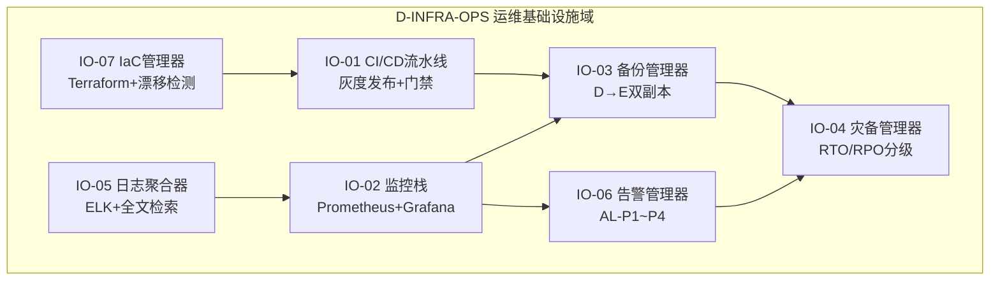

# 25 — D-INFRA-OPS 运维基础设施域

> **状态**: DRAFT | **版本**: v2.1.0 | **拆分自**: 24-D-INFRA-RUNTIME | **拆分原因**: 475子模块→RUNTIME(运行时依赖)+OPS(运维工具链)。OPS是"怎么监控/怎么部署/怎么备份"

## §1 域定义

| 属性 | 值 |
|------|-----|
| 域ID | D-INFRA-OPS |
| 简称 | INFRA-OPS / IO |
| 职责 | **运维工具链**。CI/CD+监控+备份+灾备+健康仪表板+日志聚合+弹性伸缩+网络+安全+HPC+IaC——不直接参与运行时，但保证系统健康 |
| 层 | INFRA |
| 状态 | 🔒 已开发 |
| 类型 | core（横切） |
| H依赖数 | 2 |

## §2 核心子模块（~18个）

| ID | 名称 | 职责 | 状态 |
|----|------|------|:---:|
| IO-01 | CI/CD Pipeline | GitHub Actions+门禁+测试+部署+审批流 | ✅ |
| IO-02 | Monitoring System | Prometheus+Grafana+告警规则+指标采集 | ✅ |
| IO-03 | Backup Manager | 自动备份+增量+离线存储+恢复测试+保留策略 | ✅ |
| IO-04 | Disaster Recovery | 双活+故障切换+RTO<1h+RPO<5min | ❌ |
| IO-05 | Health Dashboard | 统一健康面板+系统状态+告警聚合 | ✅ |
| IO-06 | Log Aggregator | 集中化日志+全文检索+关联分析+保留 | ❌ |
| IO-07 | Resilience Manager | 弹性伸缩+自动扩缩容+资源优化+故障转移 | ❌ |
| IO-08 | Network Manager | DNS+负载均衡+防火墙+VPN+服务网格 | ❌ |
| IO-09 | IaC Manager | Pulumi/Terraform+声明式+版本控制+漂移检测 | ❌ |
| IO-10 | Security Infra Manager | WAF+IDS/IPS+密钥管理+合规扫描+漏洞管理 | ❌ |
| IO-11 | HPC Manager | GPU集群调度+作业管理+资源分配 | ❌ |
| IO-12 | Deployment Manager | Blue-Green+Canary+Rolling+Rollback+A/B | ❌ |
| IO-13 | Alert Manager | 告警分级+降噪+静默+升级+on-call轮值 | ❌ |

### D-INFRA 运维子模块（从 INFRA-RUNTIME 拆入）

| ID | 名称 | 职责 | 优先级 | 开发状态 | 对标依据 |
|----|------|------|:------:|:--------:|---------|
| D-INFRA-01 | CI/CD Pipeline | 持续集成/部署：构建器+测试编排器+部署器+回滚器+质量门禁。理论：DevOps/持续交付理论。具备部署审批/变更管理/生产变更窗口/审计日志合规检查 | P1 | ❌ | GitHub Actions/GitLab CI; DevOps/持续交付理论; GitOps/AI辅助CI/渐进式交付/Feature Flag; 部署审批/变更管理/生产变更窗口/审计日志
| D-INFRA-02 | Monitoring Stack | 监控栈：指标采集+日志收集+分布式追踪+告警引擎+仪表盘 | P1 | ❌ | Prometheus+Grafana; 可观测性理论/三大支柱(指标/日志/追踪); AIOps异常检测/eBPF零侵入监控/LLM辅助根因分析; DORA运营韧性/监控数据保留/审计日志完整性
| D-INFRA-03 | Backup Manager | 备份管理：调度器+增量引擎+加密+校验+恢复测试 | P1 | ❌ | 增量/全量备份; 备份理论/RPO/RTO/3-2-1规则; 不可变备份/勒索软件恢复/备份即代码; 数据保留法规/备份加密标准/恢复测试审计
| D-INFRA-04 | DR Manager | 灾备管理：故障检测+切换编排+数据同步+演练引擎+状态机。理论：灾难恢复/BCP/RPO RTO/故障域。具备DORA ICT风险管理/BCP监管审查/RTO承诺审计合规检查 | P1 | ❌ | RPO/RTO保障; 灾难恢复/BCP理论; 混沌工程验证DR/AI驱动故障预测/多云DR; DORA ICT风险管理/BCP监管审查/RTO承诺审计
| D-INFRA-05 | Log Aggregator | 日志聚合：采集器+解析器+索引器+搜索引擎+归档器 | P1 | ❌ | ELK/Loki; 日志管理/结构化日志/事件关联; eBPF内核日志/LLM日志摘要/实时日志流处理; MiFID II 7年日志/GDPR日志匿名化/日志完整性校验
| D-INFRA-10 | Infrastructure as Code | 基础设施即代码：Terraform/Pulumi适配器+状态管理+漂移检测+计划预览 | P1 | ❌ | Terraform/Pulumi; IaC理论/声明式/幂等性; AI生成IaC/策略即代码/自愈基础设施; 变更审批/IaC安全扫描/基础设施审计/合规基线
| D-INFRA-14 | Cybersecurity Shield | 网络安全防护：威胁检测+漏洞扫描+入侵检测+WAF+密钥管理+事件响应 | P1 | ❌ | WAF/IDS/IPS; 网络安全/零信任/纵深防御; AI驱动威胁狩猎/自主安全运营/量子安全密码; NIST CSF 2.0/DORA ICT风险/渗透测试合规/SOC 2
| D-INFRA-15 | Resilience Testing Engine | 韧性测试引擎：故障注入器+爆炸半径控制+稳态假设+实验编排+报告 | P2 | ❌ | Chaos Engineering; 混沌工程/韧性理论/故障注入; AI驱动混沌实验/持续韧性验证/GameDay自动化; DORA韧性测试要求/BCP验证/监管演练报告
| D-INFRA-18 | Cost Optimizer | 成本优化器：云资源成本监控+成本分摊+资源利用率分析+成本预测+优化建议。理论：云成本管理/FinOps/资源优化。具备成本审计/资源利用率报告/成本优化合规检查 | P1 | ❌ | 云成本管理/FinOps/资源优化; AI成本预测/自动资源调整/Serverless成本优化; CloudHealth/Kubecost; 成本审计/资源利用率报告/成本优化合规
| D-INFRA-19 | Capacity Planner | 容量规划器：容量需求预测+资源规划+扩展计划+容量报告+容量告警。理论：容量规划/预测理论/资源管理。具备容量规划审计/扩展记录/容量合规检查 | P1 | ❌ | 容量规划/预测理论/资源管理; AI容量预测/自动扩展/预测性规划; 线性回归/时间序列预测; 容量规划审计/扩展记录/容量合规
| D-INFRA-20 | A-Share Intraday Monitor Dashboard Configurator | A股盘中环境监控看板配置器：四类实时监控(大盘水温/核心板块/资金情绪/异动警报)指标配置+版面布局+看板模板管理+看板权限控制。理论：仪表盘设计/信息可视化/配置管理。具备看板配置审计/配置变更合规检查 | P2 | ❌ | A股盘中看板/四类监控/版面布局; 深度学习看板预测/LLM看板推理/强化学习看板策略; 看板配置审计/配置变更合规
| D-INFRA-34 | Cold Data Archive Manager | 冷数据归档管理器：Archive冷数据存储+归档策略/归档压缩/归档检索/归档清理+归档生命周期。理论：归档/压缩/生命周期。具备归档审计/归档合规检查 | P2 | ❌ | Archive冷数据归档; 归档/压缩/生命周期; 自适应归档/在线归档监控/归档优化; 归档审计/归档合规
| D-INFRA-36 | Real-Time Dashboard Visual Renderer | 实时仪表盘可视化渲染器：仪表盘→实时监控数据可视化渲染+图表类型自动选择+告警阈值可视化+数据源/图表渲染/告警可视化/仪表盘布局。理论：可视化/仪表盘/实时渲染。具备仪表盘审计/可视化合规检查 | P2 | ❌ | 实时仪表盘可视化/图表渲染; 可视化/仪表盘/实时渲染; 自适应渲染/在线图表监控/渲染优化; 仪表盘审计/可视化合规
| D-INFRA-37 | Infrastructure Health Patrol Inspector | 基础设施健康巡检器：水电煤→基础设施健康巡检+巡检项定义+巡检报告+巡检告警+巡检项/巡检执行/巡检报告/巡检告警。理论：健康巡检/巡检项/告警。具备巡检审计/基础设施合规检查 | P1 | ❌ | 基础设施健康巡检/巡检项; 健康巡检/巡检项/告警; 自适应巡检/在线健康监控/巡检优化; 巡检审计/基础设施合规
| D-INFRA-38 | 模块隔离部署编排器 | 模块隔离部署编排器：模块独立开发/测试/部署编排+依赖解析+部署顺序+故障隔离 | P1 | ❌ | —
| D-INFRA-39 | 组件复用注册中心 | 组件复用注册中心：可复用模块注册/发现/版本管理+接口标准化 | P1 | ❌ | —
| D-INFRA-40 | 开源框架评估与集成器 | 开源框架评估与集成器：开源框架评估/选型/版本兼容性检查/集成适配 | P2 | ❌ | —
| D-INFRA-42 | 统一交互入口管理器 | 统一交互入口管理器：中优先级统一交互入口+仪表盘/菜单导航/权限管理/用户配置 | P2 | ❌ | —
| D-INFRA-43 | 模块边界与依赖识别器 | 模块边界与依赖识别器：分析现有模块结构+识别边界和关系+依赖图自动生成 | P1 | ❌ | —
| D-INFRA-44 | 系统集成测试编排器 | 系统集成测试编排器：模块间集成测试+系统级测试+故障注入测试+测试报告 | P1 | ❌ | —
| D-INFRA-45 | 部署监控优化器 | 部署监控优化器：系统部署+监控+性能优化+蓝绿部署+回滚 | P1 | ❌ | —
| D-INFRA-48 | 五区域布局管理器 | 五区域布局管理器：五区域布局+NozyIO可视化编辑系统集成+旧版布局兼容迁移 | P2 | ❌ | —
| D-INFRA-49 | SLA监控与保障器 | SLA监控与保障器：7×24稳定运行+数据流延迟<1s+按钮≤100ms+页面≤500ms+查询≤1s的SLA监控+告警+自动恢复 | P1 | ❌ | —
| D-INFRA-51 | 复杂操作进度提示器 | 复杂操作进度提示器：复杂操作进度追踪+进度条渲染+取消支持+超时处理 | P2 | ❌ | —
| D-INFRA-52 | 故障自动检测诊断器 | 故障自动检测诊断器：故障自动检测和诊断+异常识别+根因分析+诊断报告 | P1 | ❌ | —
| D-INFRA-55 | 五区域布局渲染引擎 | 五区域布局渲染引擎：五区域布局渲染+区域尺寸调整+区域折叠+布局持久化 | P2 | ❌ | —
| D-INFRA-56 | 系统级导航与功能入口管理器 | 系统级导航与功能入口管理器：顶部导航栏+系统级功能入口+快捷键+最近访问 | P2 | ❌ | —
| D-INFRA-57 | 多标签页管理器 | 多标签页管理器：多标签页布局+标签页切换+标签页状态保存+标签页恢复 | P2 | ❌ | —
| D-INFRA-58 | 可拖拽面板引擎 | 可拖拽面板引擎：可拖拽面板+面板布局自定义+布局保存+布局恢复 | P2 | ❌ | —
| D-INFRA-59 | 桌面端大屏优化器 | 桌面端大屏优化器：桌面端大屏幕优化+分辨率适配+DPI缩放+多显示器支持 | P2 | ❌ | —
| D-INFRA-60 | 桌面端专属交互优化器 | 桌面端专属交互优化器：桌面端交互优势利用+键盘快捷键+鼠标手势+右键菜单+拖拽操作+不含移动端适配 | P2 | ❌ | —
| D-INFRA-61 | 分阶段实施编排器 | 分阶段实施编排器：5阶段实施计划+阶段依赖+阶段门禁+阶段验收 | P1 | ❌ | —
| D-INFRA-64 | 层间依赖与部署顺序编排器 | 层间依赖与部署顺序编排器：12层部署顺序+层间依赖解析+并行部署+部署验证 | P1 | ❌ | —
| D-INFRA-65 | 系统资源监控告警器 | 系统资源监控告警器：CPU+内存+磁盘+网络4维资源监控+阈值告警+自动扩容+资源优化建议 | P1 | ❌ | —
| D-INFRA-66 | Streamlit快速原型开发器 | Streamlit快速原型开发器：Streamlit Web界面快速原型+数据展示+交互控件+实时更新 | P2 | ❌ | —
| D-INFRA-67 | PyQt5桌面GUI集成器 | PyQt5桌面GUI集成器：PyQt5 VeighNa启动器界面+桌面集成+系统托盘+原生通知 | P2 | ❌ | —
| D-INFRA-68 | 渐进式增强管理器 | 渐进式增强管理器：基础功能先行+高级功能后续+功能开关+灰度发布+回滚 | P1 | ❌ | —
| D-INFRA-70 | 文档中心索引管理器 | 文档中心索引管理器：docs文档中心+INDEX.md快速导航+System_Manifest系统清单+API_Contract接口契约+7子目录文档管理 | P2 | ❌ | —
| D-INFRA-71 | 项目目录结构生成器 | 项目目录结构生成器：quant_system_v4项目目录结构自动生成+目录校验+目录规范检查+目录初始化 | P2 | ❌ | —
| D-INFRA-72 | 模块实现状态追踪器 | 模块实现状态追踪器：8模块实现状态追踪+已实现/规划中/开发中+状态变更记录+完成度百分比 | P2 | ❌ | —
| D-INFRA-73 | 依赖版本兼容性检查器 | 依赖版本兼容性检查器：8库版本兼容性检查+版本冲突检测+升级建议+安全漏洞检查 | P1 | ❌ | —
| D-INFRA-78 | 目录结构规范校验器 | 目录结构规范校验器：目录结构规范校验+必需目录检查+目录权限检查+目录命名规范 | P2 | ❌ | —
| D-INFRA-80 | 文件命名规范检查器 | 文件命名规范检查器：文件命名规范检查+模块/策略/因子/测试/配置5类命名规则+自动重命名建议 | P2 | ❌ | —
| D-INFRA-81 | 优先级自动评估器 | 优先级自动评估器：模块优先级自动评估+依赖分析+影响范围+开发成本+优先级建议 | P2 | ❌ | —
| D-INFRA-83 | 性能基准测试器 | 性能基准测试器：性能基准测试+启动时间+响应时间+吞吐量+资源使用率+基准报告+回归检测 | P1 | ❌ | —
| D-INFRA-85 | Docker容器化研究环境管理器 | Docker容器化研究环境管理器：Docker容器化技术+Python/R环境配置+VS Code/Jupyter Lab+Git版本控制 | P2 | ❌ | —
| D-INFRA-86 | CI/CD流水线集成器 | CI/CD流水线集成器：pytest单元测试+CI/CD流程+自动构建+自动部署+自动测试 | P2 | ❌ | —
| D-INFRA-88 | Ant Design+ECharts可视化组件集成器 | Ant Design+ECharts可视化组件集成器：Ant Design+Element Plus统一可视化组件库+ECharts+D3.js交互式图表引擎 | P2 | ❌ | —
| D-INFRA-91 | 硬件资源优化建议器 | 硬件资源优化建议器：CPU优化+内存管理+GPU加速+存储优化+psutil+Node Exporter资源监控 | P2 | ❌ | —
| D-INFRA-93 | 架构性能瓶颈识别器 | 架构性能瓶颈识别器：性能分析与瓶颈识别+系统可靠性评估+扩展性优化+优化建议+优化验证 | P2 | ❌ | —
| D-INFRA-94 | NozyIO多语言代码编辑集成器 | NozyIO多语言代码编辑集成器：支持Python/R/SQL多语言编辑+模块间跳转+系统命令执行+Docker容器管理 | P2 | ❌ | —
| D-INFRA-95 | 系统健康度评分器 | 系统健康度评分器：整体运行状态监控+关键指标展示+系统健康度评分+最近操作记录+健康度趋势 | P2 | ❌ | —
| D-INFRA-96 | 个性化界面配置管理器 | 个性化界面配置管理器：模块快速访问+功能菜单管理+常用功能快捷键+个性化界面配置+配置持久化 | P2 | ❌ | —
| D-INFRA-97 | 模块实现进度追踪器 | 模块实现进度追踪器：高优先级模块实现进度追踪+阶段完成度+交付物检查+延期预警 | P2 | ❌ | —
| D-INFRA-98 | 模块间集成测试计划器 | 模块间集成测试计划器：各模块开发完成后的集成测试计划+集成顺序+集成接口+集成验证 | P2 | ❌ | —
| D-INFRA-99 | 性能测试Locust/JMeter集成器 | 性能测试Locust/JMeter集成器：Locust+JMeter性能测试+大数据处理场景+性能基准+性能报告 | P2 | ❌ | —
| D-INFRA-100 | ELK日志管理器 | ELK日志管理器：ELK Stack完整日志收集+分析+可视化+日志搜索+日志告警+日志归档 | P2 | ❌ | —
| D-INFRA-101 | 灾备方案管理器 | 灾备方案管理器：pgBackRest+Redis Sentinel数据备份和恢复机制+备份策略+恢复验证+灾备演练 | P2 | ❌ | —
| D-INFRA-103 | 预测性维护与自愈修复器 | 预测性维护与自愈修复器：基于历史数据预测系统故障+ML预测模型+自动修复脚本+自愈验证 | P2 | ❌ | —
| D-INFRA-107 | 12层架构与九大平台映射分析器 | 12层架构与九大平台映射分析器：详细对比12层架构与九大核心平台+映射关系+差距识别+缺失模块 | P2 | ❌ | —
| D-INFRA-109 | 文档链接有效性检查器 | 文档链接有效性检查器：提取所有链接+验证内部链接+curl/wget检查外部链接+链接报告 | P2 | ❌ | —
| D-INFRA-110 | 文档单一信息源管理器 | 文档单一信息源管理器：核心文档权威技术描述+其他文档引用关联+信息源注册+信息源版本 | P2 | ❌ | —
| D-INFRA-112 | 数据库备份与恢复方案器 | 数据库备份与恢复方案器：数据备份与恢复+备份策略+恢复验证+灾备演练+备份加密 | P2 | ❌ | —
| D-INFRA-113 | 模块依赖分析器 | 模块依赖分析器：模块间依赖关系图+依赖冲突检测+循环依赖识别+依赖版本管理+依赖健康度评估 | P2 | ❌ | —
| D-INFRA-114 | 开源组件评估器 | 开源组件评估器：开源许可证合规检查+组件安全漏洞扫描+组件活跃度评估+组件替代方案推荐 | P2 | ❌ | —
| D-INFRA-116 | 目录结构验证器 | 目录结构验证器：目录规范校验+路径引用完整性检查+配置文件路径一致性+硬编码路径扫描 | P2 | ❌ | —
| D-INFRA-117 | 配置迁移工具 | 配置迁移工具：docker-compose配置更新+启动脚本更新+环境变量迁移+文档链接更新 | P2 | ❌ | —
| D-INFRA-119 | 交互界面迁移方案器 | 交互界面迁移方案器：NozyIO四层架构迁移路径+界面组件映射+交互逻辑迁移+渐进式迁移策略 | P2 | ❌ | —
| D-INFRA-121 | 阶段交付物定义器 | 阶段交付物定义器：各阶段交付物清单+交付物质量标准+交付物评审流程+阶段验收标准 | P2 | ❌ | —
| D-INFRA-122 | 自动化代码审查流水线 | 自动化代码审查流水线：Ruff+mypy+Bandit集成+审查结果聚合+审查报告生成+审查规则自定义 | P2 | ❌ | —
| D-INFRA-123 | 代码质量度量看板 | 代码质量度量看板：代码复杂度趋势+测试覆盖率趋势+技术债务追踪+代码重复率监控+质量门禁通过率 | P2 | ❌ | —
| D-INFRA-124 | 主题与样式引擎 | 主题与样式引擎：主题切换+色彩方案管理+字体方案管理+暗色模式+自定义主题导入导出 | P2 | ❌ | —
| D-INFRA-125 | 交互反馈系统 | 交互反馈系统：操作反馈组件+错误提示组件+加载状态组件+操作确认组件+通知消息组件 | P2 | ❌ | —
| D-INFRA-126 | 可视化组件库 | 可视化组件库：K线图组件+折线图组件+柱状图组件+饼图组件+热力图组件+数据表格组件 | P2 | ❌ | —
| D-INFRA-127 | 文档一致性校验器 | 文档一致性校验器：文档编号重复检测+版本号格式校验+术语一致性检查+结构规范验证 | P2 | ❌ | —
| D-INFRA-128 | 文档完整性扫描器 | 文档完整性扫描器：README缺失检测+文档与代码结构比对+缺失文档识别+文档覆盖率统计 | P2 | ❌ | —
| D-INFRA-129 | 审计报告自动生成器 | 审计报告自动生成器：目录结构评估+文档质量评分+一致性检测+价值评估+改进建议生成 | P2 | ❌ | —
| D-INFRA-130 | 遗产代码迁移适配器 | 遗产代码迁移适配器：旧接口适配+数据格式转换+配置映射+功能等效验证+迁移进度追踪 | P2 | ❌ | —
| D-INFRA-133 | 环境初始化一键脚本 | 环境初始化一键脚本：自动完成venv创建、依赖安装、配置生成 | P2 | ❌ | —
| D-INFRA-135 | 数据迁移模块 | 数据迁移模块：数据结构变更时的自动迁移工具 | P2 | ❌ | —
| D-INFRA-136 | CI/CD流水线编排 | CI/CD流水线编排：自动化构建测试部署流水线 | P2 | ❌ | —
| D-INFRA-138 | 依赖冲突检测 | 依赖冲突检测：模块间依赖的循环检测与冲突预警 | P2 | ❌ | —
| D-INFRA-139 | 里程碑健康检查 | 里程碑健康检查：阶段完成前的质量门禁检查 | P2 | ❌ | —
| D-INFRA-140 | 交付物自动检查 | 交付物自动检查：交付物完整性与质量的自动验证 | P2 | ❌ | —
| D-INFRA-141 | 测试报告生成 | 测试报告生成：自动化测试报告生成与通知 | P2 | ❌ | —
| D-INFRA-142 | 日志聚合模块 | 日志聚合模块：分布式日志的聚合查询与全文检索 | P2 | ❌ | —
| D-INFRA-145 | 审计日志分析 | 审计日志分析：审计日志的自动化分析与异常行为检测 | P2 | ❌ | —
| D-INFRA-146 | 模块依赖图生成 | 模块依赖图生成：自动生成模块依赖关系图与循环依赖检测 | P2 | ❌ | —
| D-INFRA-149 | 蓝绿部署策略 | 蓝绿部署策略：零停机部署的蓝绿切换机制 | P2 | ❌ | —
| D-INFRA-150 | 配置漂移检测 | 配置漂移检测：运行环境与基准配置的偏差检测 | P2 | ❌ | —
| D-INFRA-151 | 灰度发布控制器 | 灰度发布控制器：新版本的渐进式灰度发布 | P2 | ❌ | —
| D-INFRA-152 | 开发环境标准化 | 开发环境标准化：开发环境的统一容器化与一致性保障 | P2 | ❌ | —
| D-INFRA-153 | 接口健康探测 | 接口健康探测：接口可用性的定期探测与告警 | P2 | ❌ | —
| D-INFRA-155 | 依赖冲突检测器 | 依赖冲突检测器：检测包版本冲突与兼容性问题 | P2 | ❌ | —
| D-INFRA-159 | 容器健康检查 | 容器健康检查：容器级别的健康探针与自动重启 | P2 | ❌ | —
| D-INFRA-163 | 通信性能监控模块 | 通信性能监控模块：监控模块间通信延迟和吞吐量 | P2 | ❌ | —
| D-INFRA-164 | 接口性能监控 | 接口性能监控：API响应时间与错误率监控 | P2 | ❌ | —
| D-INFRA-166 | 容器资源限制 | 容器资源限制：内存/CPU限制配置与OOM保护 | P2 | ❌ | —
| D-INFRA-167 | 日志异步写入 | 日志异步写入：日志写入的性能优化与批量刷盘 | P2 | ❌ | —
| D-INFRA-169 | 部署性能基准 | 部署性能基准：部署后自动性能基准测试 | P2 | ❌ | —
| D-INFRA-172 | 流水线性能监控 | 流水线性能监控：流水线各阶段耗时监控与瓶颈定位 | P2 | ❌ | —
| D-INFRA-174 | 配置模板生成器 | 配置模板生成器：根据.env.example自动交互式生成.env | P2 | ❌ | —
| D-INFRA-177 | 交付物模板管理 | 交付物模板管理：交付物文档模板的统一管理与版本控制 | P2 | ❌ | —
| D-INFRA-178 | 测试环境管理 | 测试环境管理：测试环境的配置隔离与数据准备 | P2 | ❌ | —
| D-INFRA-179 | 配置变更审计 | 配置变更审计：配置变更的审计追踪与回滚 | P2 | ❌ | —
| D-INFRA-183 | 容器安全扫描 | 容器安全扫描：Docker镜像安全漏洞扫描 | P2 | ❌ | —
| D-INFRA-187 | 密钥轮换模块 | 密钥轮换模块：API密钥的定期自动轮换与无缝切换 | P2 | ❌ | —
| D-INFRA-188 | 部署安全扫描 | 部署安全扫描：部署前的安全漏洞与配置扫描 | P2 | ❌ | —
| D-INFRA-189 | 日志脱敏模块 | 日志脱敏模块：敏感信息的自动脱敏与过滤 | P2 | ❌ | —
| D-INFRA-191 | 事件总线监控 | 事件总线监控：事件吞吐量/延迟/积压的监控指标 | P2 | ❌ | —
| D-INFRA-192 | 工作流健康检查 | 工作流健康检查：工作流运行状态的定期巡检 | P2 | ❌ | —
| D-INFRA-196 | 报告导出模块 | 报告导出模块：报告导出为PDF/HTML/Excel格式 | P2 | ❌ | —
| D-INFRA-198 | 自定义监控面板 | 自定义监控面板：用户自定义监控视图与告警阈值 | P2 | ❌ | —
| D-INFRA-199 | 自定义检查项 | 自定义检查项：用户自定义健康检查规则与阈值 | P2 | ❌ | —
| D-INFRA-200 | 自定义统计指标 | 自定义统计指标：用户自定义统计指标与可视化 | P2 | ❌ | —
| D-INFRA-202 | 交互设计规范合规检查器 | 交互设计规范合规检查器：桌面端适配验证+术语一致性检查+设计规范覆盖率+交互模式合规性 | P2 | ❌ | —
| D-INFRA-204 | 文件智能解析器 | 文件智能解析器：PDF/DOC/Excel/CSV/JSON/YAML解析+关键信息提取+结构化转换 | P2 | ❌ | —
| D-INFRA-205 | 自动化运维执行器 | 自动化运维执行器：健康状态巡检+性能优化自动执行+故障自愈+安全补丁自动应用+变更审批流 | P2 | ❌ | —
| D-INFRA-206 | 代码块语法校验器 | 代码块语法校验器：Python/SQL语法自动校验 | P2 | ❌ | —
| D-INFRA-207 | Mermaid流程图渲染器 | Mermaid流程图渲染器：流程图语法解析与预览 | P2 | ❌ | —
| D-INFRA-208 | Markdown表格校验器 | Markdown表格校验器：表格格式规范检查 | P2 | ❌ | —
| D-INFRA-209 | 树状图自动生成器 | 树状图自动生成器：从文档结构自动解析生成 | P2 | ❌ | —
| D-INFRA-210 | 层级深度校验器 | 层级深度校验器：层级完整性与深度规范检查 | P2 | ❌ | —
| D-INFRA-211 | 节点关联分析器 | 节点关联分析器：节点间依赖与引用关系分析 | P2 | ❌ | —
| D-INFRA-212 | 树状图差异对比器 | 树状图差异对比器：版本间结构差异对比 | P2 | ❌ | —
| D-INFRA-219 | 优先级动态调整器 | 优先级动态调整器：基于依赖关系的优先级自动调整 | P2 | ❌ | —
| D-INFRA-220 | 模块依赖关系图 | 模块依赖关系图：模块间依赖可视化与冲突检测 | P2 | ❌ | —
| D-INFRA-221 | 开发进度追踪器 | 开发进度追踪器：任务进度实时追踪与偏差预警 | P2 | ❌ | —
| D-INFRA-222 | 验收标准量化器 | 验收标准量化器：验收标准可量化指标定义 | P2 | ❌ | —
| D-INFRA-223 | 里程碑风险预警 | 里程碑风险预警：里程碑延期风险自动预警 | P2 | ❌ | —
| D-INFRA-224 | 阶段交付物检查器 | 阶段交付物检查器：各阶段交付物完整性检查 | P2 | ❌ | —
| D-INFRA-226 | 进度偏差分析器 | 进度偏差分析器：实际进度与计划偏差分析 | P2 | ❌ | —
| D-INFRA-227 | Docker健康检查器 | Docker健康检查器：容器状态自动巡检与告警 | P2 | ❌ | —
| D-INFRA-228 | SSL证书自动更新 | SSL证书自动更新：镜像源证书自动管理 | P2 | ❌ | —
| D-INFRA-233 | 紧急停止安全确认 | 紧急停止安全确认：紧急操作二次确认与审计日志 | P2 | ❌ | —
| D-INFRA-234 | 日志智能分析器 | 日志智能分析器：日志异常模式自动识别 | P2 | ❌ | —
| D-INFRA-235 | 内存泄漏检测器 | 内存泄漏检测器：内存使用趋势监控与泄漏预警 | P2 | ❌ | —
| D-INFRA-236 | 运维操作审计 | 运维操作审计：运维操作记录与审计追踪 | P2 | ❌ | —
| D-INFRA-238 | 流水线执行监控 | 流水线执行监控：各阶段执行状态与耗时监控 | P2 | ❌ | —
| D-INFRA-240 | 数据延迟检测 | 数据延迟检测：数据更新延迟检测与告警 | P2 | ❌ | —
| D-INFRA-242 | 布局持久化 | 布局持久化：用户自定义布局保存与恢复 | P2 | ❌ | —
| D-INFRA-243 | 响应式断点适配 | 响应式断点适配：不同分辨率下的布局自适应 | P2 | ❌ | —
| D-INFRA-244 | 面板拖拽状态同步 | 面板拖拽状态同步：多面板拖拽布局状态实时同步 | P2 | ❌ | —
| D-INFRA-245 | 全局快捷键管理 | 全局快捷键管理：系统级快捷键注册与冲突检测 | P2 | ❌ | —
| D-INFRA-246 | 标签页状态管理 | 标签页状态管理：标签页数据缓存与恢复 | P2 | ❌ | —
| D-INFRA-247 | 拖拽面板布局引擎 | 拖拽面板布局引擎：面板自由拖拽与吸附布局 | P2 | ❌ | —
| D-INFRA-249 | 文件上传预览 | 文件上传预览：上传文件内容预览与格式校验 | P2 | ❌ | —
| D-INFRA-250 | 导航权限控制 | 导航权限控制：基于角色的导航菜单动态渲染 | P2 | ❌ | —
| D-INFRA-251 | 表单自动保存 | 表单自动保存：表单数据定时自动保存与草稿恢复 | P2 | ❌ | —
| D-INFRA-252 | 操作撤销重做栈 | 操作撤销重做栈：用户操作撤销与重做历史管理 | P2 | ❌ | —
| D-INFRA-253 | 交互操作埋点 | 交互操作埋点：用户交互行为采集与分析 | P2 | ❌ | —
| D-INFRA-254 | 图表主题动态切换 | 图表主题动态切换：明暗主题与色盲友好配色 | P2 | ❌ | —
| D-INFRA-255 | 大数据量图表优化 | 大数据量图表优化：百万级数据点降采样与虚拟滚动 | P2 | ❌ | —
| D-INFRA-256 | 图表导出与分享 | 图表导出与分享：图表PNG/SVG导出与链接分享 | P2 | ❌ | —
| D-INFRA-257 | 实时数据流图表 | 实时数据流图表：流式数据实时追加渲染 | P2 | ❌ | —
| D-INFRA-261 | 学习进度量化评估 | 学习进度量化评估：学习效果多维量化评分 | P2 | ❌ | —
| D-INFRA-262 | 运维变更审批流 | 运维变更审批流：自动化运维变更审批与回滚 | P2 | ❌ | —
| D-INFRA-263 | React组件库定制 | React组件库定制：Ant Design主题定制与业务组件封装 | P2 | ❌ | —
| D-INFRA-265 | ECharts大规模数据渲染 | ECharts大规模数据渲染：百万级数据点高性能渲染 | P2 | ❌ | —
| D-INFRA-268 | 无障碍访问适配 | 无障碍访问适配：键盘导航与屏幕阅读器支持 | P2 | ❌ | —
| D-INFRA-269 | 前端性能基准测试 | 前端性能基准测试：前端渲染性能基准与回归检测 | P2 | ❌ | —
| D-INFRA-270 | 前端安全审计 | 前端安全审计：XSS/CSRF防护与依赖漏洞扫描 | P2 | ❌ | —
| D-INFRA-273 | 文档状态变更通知与依赖影响分析器 | 文档状态变更通知与依赖影响分析器：文档状态变更时自动通知引用模块+依赖链影响范围分析 | P2 | ❌ | —
| D-INFRA-274 | 文档完整性自动化校验器 | 文档完整性自动化校验器：检查标记为完整的章节是否真实包含所有必需内容字段 | P2 | ❌ | —
| D-INFRA-275 | 文档版本依赖一致性检查器 | 文档版本依赖一致性检查器：多章节共享同一源文件时的内容一致性检查 | P2 | ❌ | —
| D-INFRA-278 | 功能废弃影响范围追踪器 | 功能废弃影响范围追踪器：被标记为未实现的功能的上游依赖和下游消费方追踪 | P2 | ❌ | —
| D-INFRA-279 | 技术栈版本兼容性矩阵自动检测器 | 技术栈版本兼容性矩阵自动检测器：13类技术版本组合的自动兼容性检测 | P2 | ❌ | —
| D-INFRA-280 | 技术栈技术债务追踪器 | 技术栈技术债务追踪器：小众/老旧技术的技术债务追踪+社区活跃度+替代方案评估 | P2 | ❌ | —
| D-INFRA-281 | 开发时间预算与实际偏差追踪器 | 开发时间预算与实际偏差追踪器：开发时间预算追踪+实际耗时偏差分析+偏差预警 | P2 | ❌ | —
| D-INFRA-282 | 优先级动态调整器 | 优先级动态调整器：P0/P1/P2/P3优先级动态重评估+版本记录+调整审批 | P2 | ❌ | —
| D-INFRA-283 | 优先级冲突解决器 | 优先级冲突解决器：多个P0功能资源争抢时的冲突检测+协调策略+资源分配 | P2 | ❌ | —
| D-INFRA-284 | 优先级时间预算与延期预警器 | 优先级时间预算与延期预警器：P1本周完成/P2有时间再做的自动时间追踪+延期预警 | P2 | ❌ | —
| D-INFRA-285 | 阶段门禁自动验证器 | 阶段门禁自动验证器：各阶段完成条件自动验证+交付物检查+门禁通过判定 | P2 | ❌ | —
| D-INFRA-286 | 跨模块阶段协调器 | 跨模块阶段协调器：4个模块阶段计划的隐式依赖检测+协调+冲突解决 | P2 | ❌ | —
| D-INFRA-287 | 阶段门禁检查器 | 阶段门禁检查器：阶段完成后的门禁检查清单+完成标准判定+切换审批+回退机制 | P2 | ❌ | —
| D-INFRA-288 | 阶段交付物验收清单生成器 | 阶段交付物验收清单生成器：各阶段交付物验收标准模板+验收流程编排+验收报告 | P2 | ❌ | —
| D-INFRA-289 | 阶段资源分配与调度器 | 阶段资源分配与调度器：各阶段人力资源+计算资源+时间资源分配+冲突检测 | P2 | ❌ | —
| D-INFRA-290 | 阶段过渡触发器 | 阶段过渡触发器：研究→回测→模拟→实盘的阶段过渡条件判定+触发机制+准备清单 | P2 | ❌ | —
| D-INFRA-291 | 技术选型加权评分器 | 技术选型加权评分器：多维度权重配置+自动评分+选型报告 | P2 | ❌ | —
| D-INFRA-292 | 技术选型决策记录追踪器 | 技术选型决策记录追踪器：选型理由+时间+参与者的完整审计记录 | P2 | ❌ | —
| D-INFRA-293 | 技术选型决策框架 | 技术选型决策框架：统一技术选型评估标准+评分模型+决策模板+加权评分 | P2 | ❌ | —
| D-INFRA-294 | 开源项目许可证兼容性检查器 | 开源项目许可证兼容性检查器：开源项目许可证兼容性检查+GPL类许可证影响评估 | P2 | ❌ | —
| D-INFRA-295 | KrakenD/Kong替代API网关评估 | KrakenD/Kong替代API网关评估：高性能场景下专业API网关替代评估+对比报告 | P2 | ❌ | —
| D-INFRA-296 | 技术栈冗余检测与收敛建议器 | 技术栈冗余检测与收敛建议器：技术栈冗余检测+收敛建议+合并方案 | P2 | ❌ | —
| D-INFRA-297 | 技术栈版本兼容性矩阵检查器 | 技术栈版本兼容性矩阵检查器：各技术版本交叉兼容性自动校验+兼容性报告 | P2 | ❌ | —
| D-INFRA-298 | 技术栈废弃预警器 | 技术栈废弃预警器：开源项目停止维护/版本过期自动提醒+替代方案推荐 | P2 | ❌ | —
| D-INFRA-299 | 技术栈许可证合规检查器 | 技术栈许可证合规检查器：各依赖库开源协议兼容性扫描+合规报告 | P2 | ❌ | —
| D-INFRA-301 | 12层架构健康检查与故障隔离器 | 12层架构健康检查与故障隔离器：每层健康状态检查+层间依赖健康传播+故障隔离 | P2 | ❌ | —
| D-INFRA-308 | 路线图版本差异对比器 | 路线图版本差异对比器：不同版本路线图变更可视化+差异高亮+变更日志 | P2 | ❌ | —
| D-INFRA-309 | 里程碑依赖图自动生成器 | 里程碑依赖图自动生成器：阶段间依赖关系自动拓扑展示+依赖分析 | P2 | ❌ | —
| D-INFRA-310 | 交付物模板标准化器 | 交付物模板标准化器：各阶段交付物清单模板复用+模板管理+模板版本 | P2 | ❌ | —
| D-INFRA-311 | 命名规范自动修复建议器 | 命名规范自动修复建议器：违规文件自动推荐修正名称+批量重命名建议 | P2 | ❌ | —
| D-INFRA-312 | 批量重命名脚手架生成器 | 批量重命名脚手架生成器：基于命名规范的批量文件重命名脚本生成 | P2 | ❌ | —
| D-INFRA-313 | 命名规范CI门禁集成器 | 命名规范CI门禁集成器：git commit前自动检查命名合规+CI集成 | P2 | ❌ | —
| D-INFRA-316 | 流水线执行延时统计分析器 | 流水线执行延时统计分析器：各环节实际耗时vs计划耗时偏差统计+趋势分析 | P2 | ❌ | —
| D-INFRA-318 | 流水线执行时间偏差告警器 | 流水线执行时间偏差告警器：实际执行时间与计划偏差超过阈值告警 | P2 | ❌ | —
| D-INFRA-319 | 流水线执行日报自动生成器 | 流水线执行日报自动生成器：每日流水线执行摘要+异常+趋势报告 | P2 | ❌ | —
| D-INFRA-321 | 数据源可用性SLA追踪器 | 数据源可用性SLA追踪器：各数据源历史可用率+延迟统计+SLA达标率 | P2 | ❌ | —
| D-INFRA-323 | 依赖版本自动升级建议器 | 依赖版本自动升级建议器：自动检测并建议最优升级版本+升级时机+兼容性检查 | P2 | ❌ | —
| D-INFRA-324 | 导航状态持久化与恢复器 | 导航状态持久化与恢复器：用户导航位置+展开状态保存与恢复 | P2 | ❌ | —
| D-INFRA-325 | 导航使用热力图生成器 | 导航使用热力图生成器：各导航项点击频次+路径分析+使用统计 | P2 | ❌ | —
| D-INFRA-326 | 表单Schema版本管理器 | 表单Schema版本管理器：表单字段定义版本追踪+向下兼容+版本回滚 | P2 | ❌ | —
| D-INFRA-327 | 表单草稿自动保存与恢复器 | 表单草稿自动保存与恢复器：用户输入内容定时自动存储+意外关闭恢复 | P2 | ❌ | —
| D-INFRA-328 | 按钮状态机管理器 | 按钮状态机管理器：按钮禁用/加载中/成功/失败状态自动流转控制 | P2 | ❌ | —
| D-INFRA-329 | 图表主题标准化导出导入器 | 图表主题标准化导出导入器：主题配置JSON序列化+跨实例共享+主题市场 | P2 | ❌ | —
| D-INFRA-330 | 色盲友好配色自动验证器 | 色盲友好配色自动验证器：配色方案无障碍合规性检查+色盲模式切换 | P2 | ❌ | —
| D-INFRA-331 | 数据格式国际化本地化器 | 数据格式国际化本地化器：金额/百分比/时间格式按地域自动切换 | P2 | ❌ | —
| D-INFRA-332 | 表格列配置持久化器 | 表格列配置持久化器：用户自定义列宽/排序/显隐状态保存与恢复 | P2 | ❌ | —
| D-INFRA-333 | 交互方式使用统计热力图 | 交互方式使用统计热力图：各交互模式使用频率+场景+效果量化对比 | P2 | ❌ | —
| D-INFRA-334 | 交互方式成本效率分析器 | 交互方式成本效率分析器：语音/文字/图形各方式耗时与准确率对比 | P2 | ❌ | —
| D-INFRA-335 | 辅助效果量化评估器 | 辅助效果量化评估器：辅助前后用户操作效率对比统计+效果报告 | P2 | ❌ | —
| D-INFRA-336 | 自动化运维变更影响预分析器 | 自动化运维变更影响预分析器：运维变更前自动评估影响范围+风险分析 | P2 | ❌ | —
| D-INFRA-337 | 布局版本迁移转换器 | 布局版本迁移转换器：旧版布局到新版布局的自动映射与转换工具 | P2 | ❌ | —
| D-INFRA-338 | 协作过程动画回放器 | 协作过程动画回放器：历史人机协作步骤的动画式回溯查看 | P2 | ❌ | —
| D-INFRA-339 | Pipeline节点健康度探针 | Pipeline节点健康度探针：各环节存活/延迟/吞吐量实时检测+健康评分 | P2 | ❌ | —
| D-INFRA-340 | Pipeline吞吐量瓶颈分析器 | Pipeline吞吐量瓶颈分析器：各环节处理能力对比+瓶颈定位+优化建议 | P2 | ❌ | —
| D-INFRA-341 | 验证流程定制化编辑器 | 验证流程定制化编辑器：允许用户自定义验证步骤与顺序+流程模板 | P2 | ❌ | —
| D-INFRA-342 | 验证流程耗时基准器 | 验证流程耗时基准器：各验证环节耗时基线建立+退化检测+优化建议 | P2 | ❌ | —
| D-INFRA-343 | 树状图节点实时搜索与过滤器 | 树状图节点实时搜索与过滤器：按关键字/层级快速定位节点+过滤 | P2 | ❌ | —
| D-INFRA-344 | 树状图版本差异可视化器 | 树状图版本差异可视化器：两版本树状图结构变更高亮对比+差异报告 | P2 | ❌ | —
| D-INFRA-345 | 存储成本量化核算器 | 存储成本量化核算器：热/温/冷各层存储成本/TB的自动计算与对比 | P2 | ❌ | —
| D-INFRA-346 | 存储层性能基准测试器 | 存储层性能基准测试器：各层实际读写延迟/吞吐量基准测试+退化检测 | P2 | ❌ | —
| D-INFRA-347 | 前端组件渲染性能监控器 | 前端组件渲染性能监控器：组件加载/更新/卸载耗时自动采集+告警 | P2 | ❌ | —
| D-INFRA-348 | 布局组件依赖关系检测器 | 布局组件依赖关系检测器：组件间调用/通信依赖自动识别+可视化 | P2 | ❌ | —
| D-INFRA-349 | 可视化组件注册中心 | 可视化组件注册中心：组件版本/依赖/兼容性/文档统一管理 | P2 | ❌ | —
| D-INFRA-350 | 组件使用频次统计数据采集器 | 组件使用频次统计数据采集器：各组件渲染频次+耗时+错误率统计 | P2 | ❌ | —
| D-INFRA-352 | 数据流断点调试器 | 数据流断点调试器：数据流转中途暂停+检查+修改+继续 | P2 | ❌ | —
| D-INFRA-354 | 部署架构漂移检测器 | 部署架构漂移检测器：实际部署拓扑与蓝图文档差异自动比对+告警 | P2 | ❌ | —
| D-INFRA-355 | 部署依赖顺序校验器 | 部署依赖顺序校验器：各层部署顺序+依赖关系自动检查+冲突检测 | P2 | ❌ | —
| D-INFRA-356 | pre-commit git钩子自动配置器 | pre-commit git钩子自动配置器：静态检查工具自动注册到pre-commit | P2 | ❌ | —
| D-INFRA-357 | CI管道命令封装脚本 | CI管道命令封装脚本：统一命令行接口+参数配置+结果格式化输出 | P2 | ❌ | —
| D-INFRA-358 | mypy增量类型检查模式 | mypy增量类型检查模式：只检查git变更文件而非全量+增量检查 | P2 | ❌ | —
| D-INFRA-359 | 目录结构一致性巡检器 | 目录结构一致性巡检器：实际目录vs文档定义目录差异告警+修复建议 | P2 | ❌ | —
| D-INFRA-360 | 目录模板快速初始化脚手架 | 目录模板快速初始化脚手架：new project一键创建标准化目录+模板文件 | P2 | ❌ | —
| D-INFRA-361 | 新模块子模块脚手架自动生成器 | 新模块子模块脚手架自动生成器：基于规范的目录+模板文件一键创建 | P2 | ❌ | —
| D-INFRA-362 | 文档结构导航地图自动生成器 | 文档结构导航地图自动生成器：基于章节层级自动生成交互式导航树 | P2 | ❌ | —
| D-INFRA-363 | 文档章节链接有效性批量检查器 | 文档章节链接有效性批量检查器：交叉引用链接自动扫描+断链修复 | P2 | ❌ | —
| D-INFRA-364 | 目录迁移影响预分析器 | 目录迁移影响预分析器：目录结构调整对配置文件/代码路径/依赖的影响分析 | P2 | ❌ | —
| D-INFRA-365 | 目录迁移回滚方案器 | 目录迁移回滚方案器：目录结构调整失败后自动恢复到原始状态 | P2 | ❌ | —
| D-INFRA-366 | 监控方案迁移路径规划器 | 监控方案迁移路径规划器：从自研到Grafana的迁移方案+数据迁移+仪表板导入 | P2 | ❌ | —
| D-INFRA-367 | 监控阈值自适应调整器 | 监控阈值自适应调整器：根据系统运行状态自动调整监控阈值+合理性评估 | P2 | ❌ | —
| D-INFRA-368 | 性能指标SLA实时仪表板 | 性能指标SLA实时仪表板：性能指标实时仪表板+SLA达标率+趋势分析 | P2 | ❌ | —
| D-INFRA-369 | 性能基准回归检测器 | 性能基准回归检测器：每次代码变更后的性能基准回归测试+退化检测 | P2 | ❌ | —
| D-INFRA-375 | 异常使用统计与热点分析器 | 异常使用统计与热点分析器：异常使用频率统计+分布分析+趋势+热点识别 | P2 | ❌ | —
| D-INFRA-376 | 验收标准自动化测试与判定器 | 验收标准自动化测试与判定器：验收标准自动化测试脚本+执行+报告+达标判定 | P2 | ❌ | —
| D-INFRA-377 | 多数据库SLA监控与告警器 | 多数据库SLA监控与告警器：多数据库SLA监控+查询延迟+同步延迟+备份恢复成功率 | P2 | ❌ | —
| D-INFRA-378 | 实验追踪方案决策记录器 | 实验追踪方案决策记录器：记录选择wandb而非自研的决策依据+切换条件+回退策略 | P2 | ❌ | —
| D-INFRA-379 | 实验追踪方案切换触发器 | 实验追踪方案切换触发器：wandb服务中断时的切换条件+本地备选方案+数据同步 | P2 | ❌ | —
| D-INFRA-381 | 指标阈值动态调整与合理性评估器 | 指标阈值动态调整与合理性评估器：根据系统运行数据动态调整指标阈值+合理性评估 | P2 | ❌ | —
| D-INFRA-382 | 业务指标量化与追踪器 | 业务指标量化与追踪器：将定性业务指标转化为可量化指标+计算公式+数据采集 | P2 | ❌ | —
| D-INFRA-390 | API文档自动版本同步器 | API文档自动版本同步器：API实现变更时文档自动同步更新+版本对应 | P2 | ❌ | —
| D-INFRA-393 | 字段类型变更影响分析器 | 字段类型变更影响分析器：表字段类型修改影响下游查询分析+影响报告 | P2 | ❌ | —
| D-INFRA-399 | 模型文件路径安全性检查器 | 模型文件路径安全性检查器：路径穿越+越权访问防护+安全检查 | P2 | ❌ | —
| D-INFRA-401 | 模型推理性能基准测试器 | 模型推理性能基准测试器：每次推理耗时基准记录+退化告警+性能趋势 | P2 | ❌ | —
| D-INFRA-408 | Agent调用审计日志器 | Agent调用审计日志器：每次Agent决策/操作的完整记录+审计查询 | P2 | ❌ | —
| D-INFRA-416 | 配置变更审计日志追踪器 | 配置变更审计日志追踪器：每次配置修改的差异/时间/操作人记录 | P2 | ❌ | —
| D-INFRA-419 | 委员会决策耗时监控器 | 委员会决策耗时监控器：各委员决策延迟统计+超时告警+性能报告 | P2 | ❌ | —
| D-INFRA-420 | 决策流节点耗时瓶颈分析器 | 决策流节点耗时瓶颈分析器：各决策环节CPU/IO耗时分布+瓶颈定位 | P2 | ❌ | —
| D-INFRA-421 | 决策路径频次统计器 | 决策路径频次统计器：历史决策路径选择频次+成功率分析+优化建议 | P2 | ❌ | —
| D-INFRA-429 | 元数据Schema迁移管理器 | 元数据Schema迁移管理器：因子元数据字段变更时的自动迁移脚本生成 | P2 | ❌ | —
| D-INFRA-431 | wandb使用成本追踪器 | wandb使用成本追踪器：API调用次数+存储用量+费用自动统计+预算告警 | P2 | ❌ | —
| D-INFRA-432 | 知识来源质量评分器 | 知识来源质量评分器：各来源知识质量/准确率/时效性评分+评分更新 | P2 | ❌ | —
| D-INFRA-434 | Layer文档位置索引与完整性检查器 | Layer文档位置索引与完整性检查器：各Layer文档位置自动索引+完整性检查 | P2 | ❌ | —
| D-INFRA-435 | 架构版本演进追踪器 | 架构版本演进追踪器：Layer 0-7架构版本变更记录+差异对比+兼容性检查 | P2 | ❌ | —
| D-INFRA-436 | MLflow性能基准测试器 | MLflow性能基准测试器：MLflow性能基准定义+退化检测+优化建议 | P2 | ❌ | —
| D-INFRA-440 | 桌面端多显示器布局管理 | 多显示器扩展桌面布局与窗口位置记忆 | P1 | ❌ | 第三轮审查推导
| D-INFRA-446 | 技术债务追踪 | 开发过程中技术债务的记录和追踪机制 | P1 | ❌ | 第三轮审查推导
| D-INFRA-447 | 日志保留与归档策略 | 不同级别日志的保留期限和归档策略 | P1 | ❌ | 第三轮审查推导
| D-INFRA-448 | 知识生命周期管理 | 知识的时效性检测与自动归档 | P1 | ❌ | 第三轮审查推导
| D-INFRA-453 | 系统版本兼容 | 系统版本间的兼容性保障与迁移路径 | P1 | ❌ | 第三轮审查推导
| D-INFRA-454 | 架构决策记录 | 架构决策的记录追踪与评审 | P1 | ❌ | 第三轮审查推导
| D-INFRA-461 | 监控事件聚合器 | 各域→INFRA监控事件聚合与降采样 | P2 | ❌ | 第四轮跨域/逆向依赖推导
| D-INFRA-463 | 数据质量监控桥接器 | D-DATA→D-INFRA数据质量监控桥接 | P2 | ❌ | 第四轮跨域/逆向依赖推导
| D-INFRA-464 | 信号质量评估消费桥接器 | D-SIGNAL→D-INFRA信号质量监控桥接 | P2 | ❌ | 第四轮跨域/逆向依赖推导
| D-INFRA-465 | 风控事件告警桥接器 | D-RISK→D-INFRA风控告警桥接 | P2 | ❌ | 第四轮跨域/逆向依赖推导
| D-INFRA-470 | 灰度发布与蓝绿部署框架 | 系统更新的灰度发布与蓝绿部署编排 | P2 | ❌ | 第五轮配置可运维性/监控可观测性推导
| D-INFRA-471 | 统一健康检查框架 | 各子模块健康检查端点的统一注册与聚合 | P2 | ❌ | 第五轮配置可运维性/监控可观测性推导
| D-INFRA-473 | 跨域向后兼容性检查器 | 新版本发布前自动检查与旧版本数据/接口/配置/事件格式的兼容性 | P2 | ❌ | 第六轮迁移进化/运维数据管理推导
| M47-NEW-07 | 动态韧性调整器 | 动态韧性调整：基于运行时状态的韧性动态调整+自适应优化 | P1 | ❌ | —
| M47-NEW-04 | 优雅降级规划器 | 优雅降级规划：依赖故障时优雅降级路径规划+策略选择+执行编排 | P1 | ❌ | —
| M47-NEW-05 | 依赖图韧性评分增强 | 依赖图韧性评分增强：5维韧性评分增强+动态调整+预测性评分 | P1 | ❌ | Gremlin/Chaos Community Day 2025
| M47-NEW-06 | 韧性评分标准化器 | 韧性评分标准化：韧性评分标准化定义+跨系统可比+基准建立 | P1 | ❌ | —

*共 282 个 D-INFRA 运维子模块*

## §3 骨架子模块（A9运维架构提炼）

> **骨架厚度**: 厚(7✅) | **骨架来源**: 运维架构(A9) §5灾备架构 + §6监控体系 + §7变更管理

| 骨架ID | 名称 | 职责 | P级 | 对标A9章节 | 场内模块对照 |
|--------|------|------|:---:|-----------|-------------|
| IO-01 | CI/CD流水线 | GitHub Actions+门禁+测试+部署+审批流+灰度发布编排 | P1 | §7 灰度发布流程 | MOD-INF-005(scripts/) |
| IO-02 | 监控栈 | Prometheus+Grafana+指标采集+告警规则+RED/USE方法 | P0 | §6 监控体系 | MOD-INF-016/shared/observability/(metrics,tracing,logging) |
| IO-03 | 备份管理器 | 自动备份+增量+D→E双副本+3-2-1-1-0规则+恢复验证 | P0 | §5.2 D→E双副本策略 | MOD-INF-021(rollback/) |
| IO-04 | 灾备管理器 | RTO/RPO分级+断电断网恢复+策略状态机断点恢复+灾备演练 | P0 | §5 灾备架构 | MOD-INF-021(rollback/) |
| IO-05 | 日志聚合器 | 集中化日志+全文检索+关联分析+保留策略+日志脱敏 | P1 | §6.1.1 RED方法 | MOD-INF-016/shared/observability/logging |
| IO-06 | 告警管理器 | 告警分级(AL-P1~P4)+收敛策略+通知疲劳管理+静默+升级 | P0 | §6.2 告警分级与收敛 | MOD-INF-016/shared/observability/health |
| IO-07 | IaC管理器 | Terraform/Pulumi+声明式+版本控制+漂移检测+配置校验 | P2 | §7.1 配置驱动灰度 | MOD-INF-016/shared/config/ |

### 场内模块对照

| 场内模块 | 对应骨架子模块 | 覆盖度 | 差异 |
|---------|--------------|:------:|------|
| MOD-INF-005 scripts/ | IO-01 CI/CD + OPS-05 脚本系统 | ✅完整 | 430+文件，需按A9§7灰度发布重构 |
| MOD-INF-016/shared/observability/ | IO-02 监控栈 + OPS-01 遥测引擎 | ✅完整 | metrics+tracing+logging+health |
| MOD-INF-021 rollback/ | IO-03 备份管理器 + IO-04 灾备管理器 | ⚠️部分 | 回滚为主，需补充A9§5灾备 |

### 反向去冗余

| 旧草稿冗余子模块 | 归属骨架 | 处理 |
|----------------|---------|------|
| D-INFRA-190 监控数据聚合器 | IO-02 | 合并至IO-02监控栈 |
| D-INFRA-193~195 告警三件套 | IO-06 | 合并至IO-06告警管理器 |
| IO-04~IO-13(旧OPS核心13模块) | IO骨架7模块 | 按A9重新归类，去除与OPS-01~06重叠 |

### 域内依赖图

| 依赖 | 说明 | A9依据 |
|------|------|--------|
| IO-02→IO-06 | 监控栈采集的指标触发告警管理器 | §6.2告警分级与收敛 |
| IO-05→IO-02 | 日志聚合为监控栈提供日志维度数据 | §6.1.1 RED方法 |
| IO-03→IO-04 | 备份是灾备的基础(D→E双副本→RTO/RPO保障) | §5.2→§5.1 |
| IO-01→IO-03 | CI/CD部署前需确认备份就绪(回滚依赖) | §7.3回滚策略 |
| IO-06→IO-04 | 告警升级触发灾备(如AL-P1持续→D-L1降级) | §4.2触发条件矩阵 |
| IO-07→IO-01 | IaC定义部署拓扑→CI/CD执行部署 | §7.1配置驱动 |
| IO-02→IO-03 | 监控验证备份完整性(robocopy校验) | §5.2.1双副本同步参数 |

## §4 域间依赖

| 消费什么 | 来自 | 类型 | 契约 |
|---------|------|:---:|------|
| 权限校验 | D-AUTONOMY-CORE | H | — |
| 运行时环境 | D-INFRA-RUNTIME | H | InfrastructureStatus |

| 产出什么 | 消费者 | 类型 | 契约 |
|---------|--------|:---:|------|
| 系统健康状态 | D-OPS / D-FRONTEND | E | HealthDashboard |
| 告警通知 | D-OPS | E | AlertEscalation |
| 备份确认 | D-INFRA-RUNTIME | S | BackupConfirmation |
| 告警事件 | D-OPS | E | E-IO-04 AlertFired |

## §5 域事件流

| 事件ID | 事件名 | 触发条件 | 消费者 | A9依据 |
|--------|--------|---------|--------|--------|
| E-IO-01 | BackupCompleted | 备份完成(D→E同步成功) | IO-04(灾备就绪)、D-OPS(健康更新) | §5.2 D→E双副本 |
| E-IO-02 | BackupFailed | 备份失败(MD5校验不一致) | IO-06(告警AL-P2) | §5.2.1双副本同步参数 |
| E-IO-03 | DeploymentStageAdvanced | 灰度发布阶段推进(金丝雀→扩大→全量) | D-OPS(健康验证)、D-GOVERNANCE(门禁) | §7.1灰度发布流程 |
| E-IO-04 | AlertFired | 告警触发(AL-P1~P4) | D-OPS(事件响应)、D-FRONTEND(展示) | §6.2告警分级 |
| E-IO-05 | AlertEscalated | 告警升级(AL-P2→AL-P1) | D-OPS(升级响应) | §6.2.1收敛策略 |
| E-IO-06 | DRDrillCompleted | 灾备演练完成 | D-OPS(容量验证)、D-GOVERNANCE(审计) | §5.6灾备演练计划 |
| E-IO-07 | LogAnomalyDetected | 日志异常模式检测(LLM/正则) | IO-06(告警)、D-OPS(诊断) | §6.4异常检测 |

## §6 激活前提与就绪条件

| 子模块 | 前提条件 | 就绪标准 | A9依据 |
|--------|---------|---------|--------|
| IO-01 CI/CD流水线 | Git仓库+GitHub Actions | .github/workflows/可执行 | §7灰度发布 |
| IO-02 监控栈 | Prometheus+Grafana已部署 | :9090/:3000可访问 | §6.3仪表盘设计 |
| IO-03 备份管理器 | D:盘+E:盘可用 | robocopy可执行 | §5.2 D→E双副本 |
| IO-04 灾备管理器 | IO-03备份就绪 | 最近一次备份成功 | §5灾备架构 |
| IO-05 日志聚合器 | 日志目录可读 | D:/logs/可访问 | §6.1.1 RED方法 |
| IO-06 告警管理器 | IO-02监控栈就绪 | Prometheus规则可加载 | §6.2告警分级 |
| IO-07 IaC管理器 | Terraform/Pulumi已安装 | terraform version可执行 | §7.1配置驱动 |

### 内部就绪顺序

| 顺序 | 子模块 | 理由 |
|:----:|--------|------|
| 1 | IO-05 日志聚合器 | 日志是运维的感知基础 |
| 2 | IO-02 监控栈 | 监控依赖日志+指标采集 |
| 3 | IO-06 告警管理器 | 告警依赖监控数据 |
| 4 | IO-03 备份管理器 | 备份是灾备的基础 |
| 5 | IO-04 灾备管理器 | 灾备依赖备份+告警 |
| 6 | IO-07 IaC管理器 | IaC定义部署拓扑 |
| 7 | IO-01 CI/CD流水线 | CI/CD依赖IaC+备份+监控 |

## §7 设计决策记录

| 日期 | 决策 | 理由 | 对标来源 |
|------|------|------|---------|
| 2026-05-19 | INFRA拆分为RUNTIME和OPS | 运行时是关键路径，运维工具链是非关键路径 | A9§1 vs §5~7 |
| 2026-05-26 | 骨架精炼为7子模块(IO-01~07) | 按A9提炼CI/CD/监控/备份/灾备/日志/告警/IaC | A9§5+§6+§7 |
| 2026-05-26 | 告警管理归IO-06而非OPS | 告警是运维基础设施能力(Prometheus+Grafana)，OPS消费告警做事件响应 | A9§6.2 |
| 2026-05-26 | 日志聚合归IO-05而非OPS | 日志是运维基础设施(ELK/Loki)，OPS消费日志做诊断 | A9§6.1.1 |
| 2026-05-26 | 备份+灾备归IO-03/IO-04 | 备份/灾备是运维基础设施(D→E双副本/RTO/RPO)，不是运行时 | A9§5 |
| 2026-05-26 | 灰度发布4阶段归IO-01 | 灰度发布是CI/CD流水线能力 | A9§7.1 |
| 2026-05-26 | 3-2-1-1-0备份黄金律归IO-03 | 备份策略是运维基础设施能力 | A9§5.2.2 |
| 2026-05-26 | OPS不直接参与业务运行时 | OPS是运维面，RUNTIME是执行面 | A9架构分层 |
| 2026-05-26 | OPS工具链可替换 | 监控/Pipeline/备份不产生对具体工具的绑定 | A9技术中立 |

## §8 安全架构约束（源自A5安全架构）

> 来源：A5安全架构 §1.4 运维域 + §15.7

### §8.1 域边界定义

> 来源：A5安全架构 §1.4

覆盖 D-INFRA-OPS（运维基础设施）、D-INFRA-RUNTIME（运行时基础设施）、D-OPS（运维）、D-SECURITY（安全）。运维域是系统的运行保障，负责基础设施、监控和安全执行。

**为什么运维域需要独立安全域**：密钥和配置是系统的"钥匙"，如果运维域被攻破，攻击者可以获取所有域的访问权限。运维域的日志是安全审计的基础，日志的完整性直接影响安全事件的调查能力。

### §8.2 资产分类与信任等级

> 来源：A5安全架构 §1.4

| 资产类型 | 信任等级 | 分类 | 示例 |
|---------|---------|------|------|
| 密钥 | 绝密（L3） | 核心资产 | 主密钥、数据密钥、API凭证 |
| 安全策略配置 | 机密（L2） | 敏感资产 | 防火墙规则、访问控制列表 |
| 系统配置 | 机密（L2） | 敏感资产 | 数据库连接串、服务端口 |
| 监控数据 | 内部（L1） | 业务资产 | 性能指标、健康状态 |
| 系统日志 | 内部（L1） | 业务资产 | 进程日志、错误日志 |
| 审计日志 | 机密（L2） | 敏感资产 | 安全审计日志、操作审计日志 |

### §8.3 数据流入规则

> 来源：A5安全架构 §1.4

| 来源域 | 允许流入的数据 | 安全检查点 |
|--------|--------------|-----------|
| 全域 | 审计日志 | 日志签名+哈希链验证 |
| 全域 | 监控指标 | 指标格式校验 |
| 治理域 | 安全策略配置 | 策略签名验证 |

### §8.4 数据流出规则

> 来源：A5安全架构 §1.4

| 目标域 | 允许流出的数据 | 安全检查点 |
|--------|--------------|-----------|
| 交易域 | 密钥（加密传输） | 密钥加密+传输加密 |
| 数据域 | 配置信息 | 配置签名+加密 |
| 治理域 | 安全事件报告 | 事件分类+严重性标记 |
| 外部（审计） | 审计日志（监管要求） | 预定义格式+审批+日志签名 |

### §8.5 安全控制要求

> 来源：A5安全架构 §1.4

- 密钥存储使用Shamir秘密共享分割，至少2-of-3份额才能重建（详见A5安全架构§4.3）
- 审计日志仅追加，不可删除或修改（HB-SEC-03）
- 安全策略配置变更需要治理域审批
- 运维域禁止远程访问；确需远程访问时必须经过VPN+多因素认证

### §8.6 基础设施安全模块（源自§15.7）

> 来源：A5安全架构 §15.7

| 模块ID | 名称 | 裁定 | 说明 | 备注 |
|--------|------|------|------|------|
| D-SECURITY-01 | 网络安全 | **能建** | 网络安全 | 归属D-INFRA |
| D-SECURITY-53 | 通信加密配置 | **能建** | 通信加密配置 | 归属D-INFRA |
| D-SECURITY-55 | 网络隔离策略 | **能建** | 网络隔离策略 | 归属D-INFRA |

---

## §8 运维架构(A9)规格

> **搬入来源**: 运维架构(A9) §5灾备架构 + §6监控体系 + §7变更管理 + §14硬边界裁定(灾备相关)
> **搬入原则**: 将A9中D-INFRA-OPS主域承载的详细规格搬入本域，保持A9原文颗粒度。§3骨架子模块已有摘要引用，本节为完整规格。

### §8.1 灾备架构（A9§5）

#### §8.1.1 RTO/RPO分级表

| 数据/服务等级 | RTO目标 | RPO目标 | 数据内容 | 恢复策略 |
|:------------:|:-------:|:-------:|---------|---------|
| L1 交易核心 | <5min | ≤1s | 持仓/订单/账户/风控状态 | Redis AOF + D→E双副本 |
| L2 策略状态 | <10min | ≤1min | 策略状态机/信号缓存/市场状态 | Redis RDB + 配置文件 |
| L3 因子数据 | <30min | ≤5min | 因子值/因子元数据 | Parquet文件双副本 |
| L4 模型文件 | <60min | ≤1hour | ML模型权重/训练参数 | D→E双副本+版本管理 |
| L5 历史数据 | <120min | ≤1hour | 行情历史/回测结果 | Parquet文件双副本 |
| L6 日志审计 | <240min | ≤24hour | 交易日志/操作日志/审计记录 | 压缩归档+双副本 |

> **行业对标**：金融级一级系统RTO≤1分钟，RPO=0。本系统受限于单机部署(约束二)，交易时段RTO<5分钟为现实可达目标。持仓RPO=0为硬约束（约束五）。

#### §8.1.2 交易系统灾备核心差异——未平仓头寸问题

| 灾备维度 | 普通IT系统 | 交易系统(本系统) |
|---------|-----------|----------------|
| 恢复目标 | 恢复到最近一致状态 | 恢复后必须立即知道当前持仓和盈亏 |
| 数据完整性 | 恢复到备份点即可 | 订单历史+持仓状态+当前市值必须完整 |
| 时间敏感性 | 按小时计的损失 | 按分钟计的损失(市场不等人) |
| 恢复后动作 | 验证数据→恢复服务 | 验证持仓→评估盈亏→决定是否继续交易或清仓 |

> **本系统应对**：P3(交易核心)在Redis中维护实时持仓状态(每笔成交后更新)，Redis AOF+RDB混合持久化确保RPO≤1s。恢复后P3首先执行持仓对账(与券商miniQMT持仓对比)，对账不一致则触发D-L1降级(仅平仓不开新仓)。

#### §8.1.3 D→E盘双副本策略

| 数据类型 | 同步方式 | 同步频率 | 一致性校验 | 保留策略 |
|---------|---------|:--------:|-----------|---------|
| Redis AOF | 文件复制 | 实时(每秒fsync) | 文件MD5 | 保留最近7天 |
| Redis RDB | 文件复制 | 每小时 | 文件MD5 | 保留最近30天 |
| Redis混合持久化 | RDB基线+AOF增量 | RDB每小时+AOF实时 | AOF重放+RDB基线校验 | RDB保留30天+AOF保留7天 |
| Parquet数据 | robocopy增量 | 每小时 | 文件大小+行数 | 保留最近90天 |
| 模型文件 | robocopy增量 | 每小时 | 文件MD5 | 保留最近10个版本 |
| 配置文件 | robocopy镜像 | 每次变更 | 文件MD5 | 保留最近30个版本 |
| 日志文件 | robocopy增量 | 每2小时 | 文件大小 | 保留7年(合规) |

#### §8.1.4 备份黄金律——3-2-1-1-0规则

| 规则要素 | 定义 | 本系统实现 |
|---------|------|-----------|
| **3** 份副本 | 生产数据+2份备份 | D:盘(生产)+E:盘(本地副本)+Git(配置第三副本) |
| **2** 种介质 | 不同存储介质 | ⚠️部分满足——D:SSD+E:SSD为同介质；Git远程仓库为不同介质 |
| **1** 份离线 | 不可网络访问的备份 | ❌ 不能建——约束二单机部署，无离线存储条件 |
| **1** 份不可变 | 不可修改/删除的备份 | ✅ 能建——E:盘关键目录设置Windows只读ACL |
| **0** 错误 | 备份必须经过恢复验证 | ✅ 能建——§8.1.7灾备演练计划覆盖全量恢复验证 |

#### §8.1.5 断电断网恢复

| 场景 | 检测方式 | 恢复流程 | RTO |
|------|---------|---------|:---:|
| 断电恢复 | Windows计划任务(开机启动) | 1.BIOS自检 2.Windows启动 3.NSSM服务自动启动 4.Redis AOF重放 5.进程启动+状态恢复 | ~3min |
| 断网恢复 | iFind/miniQMT连接探针 | 1.检测网络恢复 2.重新建立iFind连接 3.重新建立miniQMT连接 4.同步缺失行情 5.恢复交易 | ~2min |
| 断电+断网 | 开机启动+网络检测 | 1.断电恢复流程 2.等待网络恢复 3.断网恢复流程 | ~5min |
| Redis崩溃 | P4心跳检测 | 1.Redis自动重启 2.AOF重放恢复数据 3.进程重连Redis 4.状态一致性校验 | ~1min |

#### §8.1.6 策略状态机断点恢复

| 恢复步骤 | 操作 | 校验 |
|---------|------|------|
| 1.读取Redis strategy:*:state | 重建状态机 | 快照完整性 |
| 2.校验持仓一致性 | 与miniQMT实际持仓对比 | 不一致则以miniQMT为准 |
| 3.快照时间vs当前时间 | 跨日则重置状态机 | 配置版本匹配 |
| 4.配置版本vs当前版本 | 版本不匹配则加载当前版本 | 版本一致性 |

#### §8.1.7 灾备演练计划

| 演练类型 | 频率 | 演练内容 | 验证指标 | 持续时间 |
|---------|:----:|---------|---------|:--------:|
| Redis故障恢复 | 每月 | 停止Redis→自动重启→数据校验 | RTO<1min, RPO≤1s | 30min |
| 进程崩溃恢复 | 每月 | 强制终止P1/P2→自动恢复→功能验证 | RTO<5min | 30min |
| D→E副本校验 | 每周 | 比对D:和E:关键文件MD5 | 一致率100% | 1hour |
| 全量灾备恢复 | 每季度 | 模拟D:盘故障→从E:全量恢复 | RTO<4hour | 4hour |
| 断电恢复 | 每半年 | 拔电源→开机→全系统恢复 | RTO<5min | 1hour |
| 保命轨触发 | 每季度 | 模拟多重故障→L0→L2→验证保命规则 | 降级<5s | 1hour |

#### §8.1.8 混沌工程实践

| 混沌实验 | 注入方式 | 频率 | 验证目标 | 安全护栏 |
|---------|---------|:----:|---------|---------|
| Redis进程终止 | taskkill /F /im redis-server.exe | 每月 | AOF自动恢复+RPO≤1s | 仅非交易时段执行 |
| 网络延迟注入 | Clumsy工具 | 每季度 | iFind降级+miniQMT切换 | 延迟上限500ms |
| GPU驱动重载 | nvidia-smi --gpu-reset | 每季度 | CPU推理降级+自动恢复 | 仅非交易时段 |
| 磁盘IO压力 | diskspd 压力工具 | 每半年 | IO优先级隔离+Cold平面限流 | 压力上限50%带宽 |
| 内存压力 | TestLimit 工具 | 每半年 | OOM处理+进程内存保护 | 仅非交易时段 |
| 全链路故障 | 组合以上实验 | 每年 | 保命轨L2/L3触发+恢复 | 交易时段禁止 |

> **安全护栏原则**：1) 混沌实验仅在非交易时段执行 2) 每次实验前确认E:盘备份完整 3) 实验超时30分钟自动终止 4) 保命轨在混沌实验期间保持激活

### §8.2 监控体系（A9§6）

#### §8.2.1 RED方法——服务型指标

| 指标类别 | 指标名 | 采集源 | 采集间隔 | SLO | 告警阈值 |
|---------|--------|--------|:--------:|-----|---------|
| Rate | 行情Tick接收速率 | P1 | 3s | >3 Tick/min | <1 Tick/min持续30s |
| Rate | 信号产出速率 | P2 | 5s | >0 信号/min(交易时段) | 0信号持续2min |
| Rate | 订单提交速率 | P3 | 5s | — | >10笔/秒(异常高频) |
| Error | iFind请求错误率 | P1 | 10s | <1% | >5%持续1min |
| Error | miniQMT下单失败率 | P3 | 10s | <0.1% | >1%持续30s |
| Error | 风控拒绝率 | P3 | 10s | <5% | >10%持续5min |
| Duration | Tick→信号延迟 | P1+P2 | 5s | <1s | >2s |
| Duration | 信号→订单延迟 | P2+P3 | 5s | <500ms | >1s |
| Duration | 订单→成交延迟 | P3 | 5s | <3s(miniQMT限制) | >10s |

#### §8.2.2 USE方法——资源型指标

| 资源 | Utilization | Saturation | Errors |
|------|-------------|------------|--------|
| CPU | 各核使用率(5s) | 运行队列长度 | — |
| 内存 | 已用/总量(5s) | Swap使用量 | OOM Kill计数 |
| GPU | 计算利用率(10s) | 显存使用率 | CUDA Error计数 |
| 磁盘D: | 读写速率(10s) | IO等待时间 | IO Error计数 |
| 磁盘E: | 读写速率(10s) | IO等待时间 | IO Error计数 |
| 网络 | 带宽使用率(10s) | TCP重传率 | 连接失败计数 |
| Redis | 内存使用率(10s) | 连接数/最大连接数 | 命令失败率 |

#### §8.2.3 业务指标

| 指标 | 采集源 | 采集间隔 | SLO | 告警阈值 |
|------|--------|:--------:|-----|---------|
| 实时PnL | P3 | 3s | — | 日亏损>AUM 2% |
| 持仓集中度 | P3 | 60s | 行业偏离≤±10% | >±15% |
| 策略活跃数 | P2 | 60s | >0 | =0(交易时段) |
| 风控触发次数 | P3 | 60s | — | >20次/小时 |
| 因子IC值 | P2 | 日频 | \|IC\|>0.03(量价) | \|IC\|<0.01 |

#### §8.2.4 告警分级与收敛

| 级别 | 名称 | 处理时限 | 典型场景 |
|:----:|------|---------|---------|
| AL-P1 | 紧急 | 立即处理 | 核心进程崩溃/miniQMT连接中断/风控引擎无响应/日亏损超阈值 |
| AL-P2 | 重要 | 15分钟内 | 非核心进程崩溃/GPU OOM/Redis连接异常/磁盘空间>85% |
| AL-P3 | 一般 | 1小时内 | iFind QPS超限/信号产出延迟/配置参数漂移/磁盘空间>75% |
| AL-P4 | 提示 | 下次维护 | 日志文件过大/GPU利用率低/非关键指标偏离 |

| 收敛维度 | 策略 | 参数 |
|---------|------|------|
| 时间收敛 | 同一告警5分钟内不重复 | 窗口=300s |
| 空间收敛 | 同类告警合并 | 分组=故障类型 |
| 根因收敛 | 关联告警归并到根因 | 因果图 |
| 抑制 | 降级状态下抑制低优先级告警 | D-L2时抑制AL-P3/AL-P4 |
| 升级 | AL-P2告警30分钟未处理→升级为AL-P1 | 超时=1800s |
| 静默 | 计划维护期间静默非紧急告警 | 维护窗口配置 |

#### §8.2.5 SLO定义

| SLO | 目标 | SLI(测量方式) | 错误预算(月) |
|-----|------|-------------|:----------:|
| 交易时段可用率 | 99.99% | 交易时段运行时间/总交易时间 | ≤34s |
| 非交易时段可用率 | 99.9% | 非交易时段运行时间/总时间 | ≤38min |
| 风控检查延迟 | <10ms P99 | 风控检查耗时分布P99 | — |
| 信号产出延迟 | <1s P95 | Tick→信号耗时分布P95 | — |
| 数据完整性 | 99.99% | 缺失Tick数/总Tick数 | ≤0.01% |

#### §8.2.6 OpenTelemetry分布式追踪

| 追踪链路 | Span序列 | 关键指标 | 采样策略 |
|---------|---------|---------|---------|
| 交易主链路 | P1(Tick接收)→P2(信号生成)→P3(风控+下单) | Tick→Order端到端延迟 | 交易时段100%采样 |
| 数据链路 | iFind→P1(清洗)→Redis→P2(因子) | 数据新鲜度 | 10%采样 |
| AI运维链路 | P4(检测)→P4(诊断)→P4(修复) | 故障处理MTTR | 100%采样 |
| GPU推理链路 | P5(调度)→GPU(推理)→P2/P3(消费) | 推理延迟 | 10%采样 |

> **TraceID传递**：通过Redis `trace:{id}` 键在进程间传递，TTL=60s。

### §8.3 变更管理（A9§7）

#### §8.3.1 灰度发布流程

| 阶段 | 流量比例 | 验证时长 | 自动推进 | 回滚触发 | 人工确认 |
|:----:|:--------:|:--------:|:--------:|---------|:--------:|
| 构建 | 0% | — | — | 构建失败 | — |
| 金丝雀 | 1-5% | 5min | ✅ | 错误率>1%或延迟>2× | — |
| 扩大 | 25-50% | 15min | ✅ | 错误率>0.5%或延迟>1.5× | 交易时段需确认 |
| 全量 | 100% | 30min | — | — | ✅ |

#### §8.3.2 金丝雀验证

| 验证维度 | 验证指标 | 通过标准 | 验证方式 |
|---------|---------|---------|---------|
| 功能正确性 | 信号产出一致性 | 新旧版本信号差异<5% | 对比运行输出 |
| 性能稳定性 | P99延迟 | 不超过基线1.5× | Prometheus指标对比 |
| 错误率 | 异常/错误计数 | 错误率<0.1% | 日志+指标监控 |
| 资源消耗 | CPU/内存/GPU | 不超过基线1.2× | 系统指标监控 |
| 风控完整性 | 风控检查覆盖率 | 100%覆盖 | 风控规则回放 |
| 数据一致性 | 持仓/订单一致性 | 与miniQMT完全一致 | 对账校验 |

#### §8.3.3 回滚策略

| 回滚场景 | 触发条件 | 回滚方式 | 回滚耗时 | 数据处理 |
|---------|---------|---------|:--------:|---------|
| 金丝雀失败 | 验证指标不通过 | 配置切换回旧版本 | <10s | 无需处理 |
| 扩大阶段失败 | 验证指标不通过 | 配置切换+进程重启 | <30s | 清理中间状态 |
| 全量阶段失败 | 生产异常 | 版本回退+全量重启 | <2min | 状态机断点恢复 |
| 配置变更失败 | 配置校验不通过 | Git revert配置文件 | <5s | 自动重载配置 |
| 依赖库升级失败 | 沙箱测试不通过 | pip install旧版本 | <5min | 依赖版本锁定 |

#### §8.3.4 交易时段变更冻结

| 时段 | 允许变更 | 禁止变更 | 例外 |
|------|---------|---------|------|
| 盘前(08:00-09:15) | 配置热更新(非核心) | 进程重启/依赖升级/策略变更 | — |
| 盘中(09:15-11:30) | 无 | 一切变更(HC-01/HC-02) | 保命轨触发 |
| 午休(11:30-13:00) | 配置热更新(非核心) | 进程重启/依赖升级 | — |
| 盘中(13:00-15:00) | 无 | 一切变更(HC-01/HC-02) | 保命轨触发 |
| 盘后+夜间(15:00-次日08:00) | 全部允许(灰度流程) | 无 | — |

#### §8.3.5 依赖库升级7步流程

| Step | 动作 | 内容 |
|:----:|------|------|
| 1 | 安全评估 | CVE扫描(pip audit/safety) + 影响范围评估 + 升级紧急度判定(P0~P3) |
| 2 | 沙箱验证 | 创建venv + 安装新版本+单元测试 + 回测验证(≥3策略) + 性能基准 |
| 3 | 人工审批(A-L1) | 审批内容: 升级范围+测试结果+回滚方案 |
| 4 | 备份当前版本 | pip freeze > requirements_backup.txt + 复制到E:/backup/deps/ + Git commit |
| 5 | 灰度升级 | 仅非交易时段(HC-02) + P5→P4→P2→P1→P3 + 每步金丝雀5min |
| 6 | 全量验证 | 全功能测试 + 回测结果对比 + 监控30min无异常 |
| 7 | 完成/回滚 | 通过: Git tag + 更新requirements.txt / 失败: pip install -r requirements_backup.txt |

### §8.4 硬边界裁定——运维基础设施相关（A9§14）

#### §8.4.1 eBPF for Windows — ❌ 不能建（A9§14.3）

| 子功能 | 裁定 | 理由 |
|--------|:----:|------|
| eBPF内核级监控（生产环境） | ❌ | Windows eBPF未达生产就绪，驱动崩溃=蓝屏 |
| eBPF技术预研/POC | ❌ | 约束一"单人开发"，预研投入产出比极低 |
| eBPF监控接口预留 | ✅ | 在监控体系中预留eBPF数据源接口，未来接入 |

**未来门禁**（全部满足才可引入）：1. Windows eBPF生产就绪(Microsoft官方GA+驱动WHQL认证) 2. 社区采用率>30% 3. 新增Windows内核驱动稳定性保障约束

#### §8.4.2 双机热备 — ❌ 不能建（A9§14.4）

| 子功能 | 裁定 | 理由 |
|--------|:----:|------|
| 双机热备（Active-Standby） | ❌ | 约束二明确"单台PC工作站"，约束五明确"无热备" |
| 双机冷备（离线同步） | ❌ | 同上，约束二不允许第二台机器 |
| D→E盘本地双副本 | ✅ | 已在约束五中明确，同机双SSD互为备份 |

**未来门禁**（全部满足才可引入双机）：1. 约束二修改为双机部署 2. 第二台机器配置≥当前70%+miniQMT已安装+千兆局域网 3. AUM≥200万 4. 约束五修改为Active-Standby热备

#### §8.4.3 混沌工程 — ✅ 能建（A9§14.6）

| 子功能 | 裁定 | 理由 |
|--------|:----:|------|
| 非交易时段单项混沌实验 | ✅ | 不违反任何硬边界 |
| 交易时段混沌实验 | ❌ | 违反约束五"交易时段RTO<5分钟" |
| 全链路混沌实验 | ✅(有条件) | 仅周末执行 |

**执行条件**：1. 仅非交易时段执行 2. 每次实验前确认E:盘备份完整 3. 实验超时30分钟自动终止 4. 保命轨保持激活 5. 全链路实验仅周末执行

#### §8.4.4 DORA合规正式对标 — ❌ 不能建（A9§14.7）

| 子功能 | 裁定 | 理由 |
|--------|:----:|------|
| DORA正式合规 | ❌ | 约束三"A股市场"+约束一"单人开发" |
| DORA框架作为参考 | ✅ | 已在§8.1.8混沌工程中实现——DORA五大支柱作为运维韧性自评参考 |
| 中国证监会程序化交易报备 | ✅ | 约束三明确A股市场，证监会报备是法定义务 |

---

## 来自Agent架构(A7)的内容

> **搬入来源**: Agent架构(A7) §15.1可观测性三支柱(基础设施层面) + §15.2 Trace层级(基础设施) + §8.3.1预算管理 + §16.4 CI/CD集成 + §17.13 LP-013
> **搬入原则**: 将A7中与D-INFRA-OPS运维基础设施域直接相关的内容搬入本域，保持A7原文颗粒度不变。

### 来自Agent架构(A7) §15.1 可观测性三支柱（基础设施层面）

| 基础设施组件 | 部署方式 | 配置要点 | 数据保留 |
|------------|---------|---------|---------|
| OpenTelemetry Collector | 本地进程部署 | 接收OTLP协议，导出至SQLite(热)+Parquet(冷)；MVP使用JSON文件导出，未来升级门禁：多机部署+企业级监控需求+有第二位开发人员加入时可接入Agent 365 OTel管道 | 热数据7天，冷数据按审计要求保留 |
| Prometheus + Grafana监控栈 | 本地单实例 | Prometheus采集Agent Metrics（Agent延迟、协作成功率、成本、反思有效率）；Grafana仪表盘展示Agent健康度/协作效率/自治质量/记忆效率/LLM路由效率 | Prometheus保留15天，历史数据导出至Parquet |
| Loki日志聚合 | 本地单实例 | 接收JSON结构化日志（Agent决策、自治边界检查、风控否决、异常事件）；LogQL查询支持 | 热数据30天，冷数据导出至Parquet |

### 来自Agent架构(A7) §15.2 Trace层级模型（存储与查询基础设施）

> 参考 Microsoft/Cisco 2025年提出的OpenTelemetry多Agent语义约定和GAAT (arXiv 2026, Apple)的治理感知遥测架构。

**Trace存储基础设施**：

| 层级 | Span类型 | 存储方式 | 查询方式 | 保留策略 |
|------|---------|---------|---------|---------|
| L0 Root Span | 编排Agent接收决策请求 | SQLite(热)+Parquet(冷) | trace_id精确查询 | 交易相关≥7年 |
| L1 Agent Span | 各Agent执行（研究/信号/风控/执行） | SQLite(热)+Parquet(冷) | trace_id+agent_id组合查询 | 交易相关≥7年 |
| L2 LLM Span | LLM推理调用（本地/API） | SQLite(热)+Parquet(冷) | trace_id+model_id查询 | ≥3年 |
| L2 Tool Span | 工具调用（因子计算/miniQMT等） | SQLite(热)+Parquet(冷) | trace_id+tool_name查询 | ≥3年 |
| L3 Retriever Span | 语义记忆RAG检索 | SQLite(热)+Parquet(冷) | trace_id+memory_type查询 | ≥1年 |
| L3 Rule Span | 风控规则引擎评估 | SQLite(热)+Parquet(冷) | trace_id+rule_id查询 | 交易相关≥7年 |
| L4 A2A Span | A2A检查网关验证 | SQLite(热)+Parquet(冷) | trace_id+check_type查询 | ≥3年 |

> **Flow ID传播（参考MAN+ESM, Adya 2026）**：借鉴MAN+ESM的Flow ID概念，本系统在消息格式metadata中传播traceId（与W3C TraceContext惯例一致），实现全链路可追踪。MVP使用SQLite存储trace，未来升级门禁同LP-015。

### 来自Agent架构(A7) §8.3.1 预算管理（LLM成本控制基础设施）

> LLM调用成本是Agent系统的主要运营支出，需要基础设施层面的预算控制机制。

| 基础设施组件 | 实现方式 | 功能说明 |
|------------|---------|---------|
| 预算池 | Redis Hash存储 | 按月/按Agent/按模型类型设置预算上限；超预算自动降级路由（API→本地） |
| Token计数器 | Redis Counter + 持久化 | 实时统计input/output token用量；按Agent、模型、时间维度聚合；每日快照至Parquet |
| 成本仪表盘 | Grafana仪表盘 | 实时展示：①日/周/月LLM成本趋势 ②各Agent成本占比 ③本地vs API成本对比 ④预算消耗速率 ⑤超预算告警 |

**预算控制流程**：
1. 每次LLM调用前检查预算池余额
2. 调用完成后更新Token计数器
3. 预算消耗≥80%时触发告警
4. 预算消耗≥100%时自动降级（API→本地模型）
5. 每日生成成本报告，写入Parquet归档

### 来自Agent架构(A7) §16.4 CI/CD集成（Agent流水线）

> Agent系统的CI/CD需要处理LLM模型版本、Prompt版本、技能声明等Agent特有制品。

#### §16.4.1 Agent流水线

| 阶段 | 输入 | 检查项 | 工具 | 失败处理 |
|------|------|--------|------|---------|
| 代码质量 | Agent Python代码 | Lint+类型检查+安全扫描 | ruff/mypy/bandit | 阻断合并 |
| 单元测试 | Agent模块 | 覆盖率≥80% | pytest | 阻断合并 |
| 集成测试 | Agent间通信 | A2A协议合规+消息格式校验 | pytest+contract test | 阻断合并 |
| Prompt测试 | Prompt模板 | 输出格式校验+边界输入测试 | 自定义框架 | 阻断部署 |
| 模型评估 | LLM模型变更 | 基准数据集评估+延迟测试 | 自定义框架 | 阻断部署 |
| 技能验证 | 技能声明 | 依赖完整性+自治边界合规 | 自定义框架 | 阻断部署 |

#### §16.4.2 质量门禁

| 门禁 | 阈值 | 适用阶段 | 豁免条件 |
|------|------|---------|---------|
| 代码覆盖率 | ≥80% | 合并请求 | 无 |
| Prompt输出合规率 | ≥95% | 部署前 | 无 |
| A2A协议兼容性 | 100% | 部署前 | 无 |
| Agent自治边界测试 | 0违规 | 部署前 | 无 |
| LLM基准评估 | 不劣于基线 | 模型变更 | 紧急修复+事后补测 |
| 安全扫描 | 0高危 | 合并请求 | 无 |

#### §16.4.3 部署策略

| 策略 | 适用场景 | 回滚方式 | 风险控制 |
|------|---------|---------|---------|
| 蓝绿部署 | Agent代码变更 | 秒级切换旧版本 | 新版本并行验证≥5min |
| 金丝雀发布 | Prompt/模型变更 | 10%流量验证→回滚 | 监控Agent决策质量指标 |
| 影子模式 | 新Agent上线 | 不影响生产流量 | 新Agent接收相同输入但不执行 |
| 功能开关 | 渐进式功能开放 | 关闭开关即时回滚 | 按Agent粒度控制 |

### 来自Agent架构(A7) §17.13 LP-013 Agent SRE正式SLO（基础设施视角）

**裁定：🟢 MVP能建**

| 维度 | 说明 |
|------|------|
| 基础设施支撑 | SLO采集依赖：①OpenTelemetry Collector提供Trace数据 ②Prometheus提供Metrics数据 ③Loki提供Log数据 ④Grafana仪表盘展示SLO达成率 |
| MVP基础设施要求 | 本地单实例部署OTel Collector+Prometheus+Loki+Grafana；SQLite+Parquet存储；无需额外硬件 |
| 成本控制基础设施 | 预算池+Token计数器+成本仪表盘支撑LLM路由成本控制率SLO |
| 未来升级门禁 | ①Agent数量≥8个时引入错误预算+熔断器联动 ②多机部署时引入渐进式交付 ③需HA时引入Prometheus HA+Loki分布式 |
