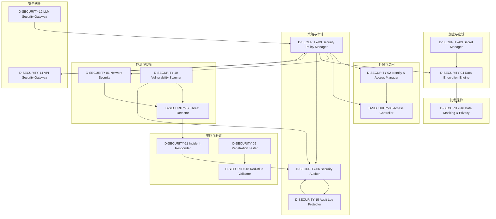

# 26 — D-SECURITY 安全域

> **状态**: DRAFT | **核心层**: 横切支撑层 | **成熟度**: 🔧 部分开发（3/16子模块已有基础）
> **一句话**: 让系统防攻击防泄漏

## §0 域定义

| 维度 | 内容 |
|------|------|
| 核心Aggregate | SecurityPolicy |
| 核心事件 | E-SC-01 SecurityBreach / E-SC-02 VulnerabilityDetected / E-SC-03 UnauthorizedAccess |
| 特殊定位 | 横切支撑层，为所有域提供安全防护，P1优先级 |
| 开发状态 | 部分开发——3/16子模块已有基础，13个待建 |
| 优先级 | P1 |
| 激活前提 | D-AUTONOMY就绪 |

### 与D-AUTONOMY的关系

| 维度 | D-AUTONOMY | D-SECURITY |
|------|-----------|------------|
| 管什么 | AI怎么管自己 | 系统怎么防攻击 |
| 核心关注 | 自治行为约束 | 外部威胁防御 |
| 典型能力 | RBAC权限决策 / 审计记录 / 自愈回滚 | 入侵检测 / 漏洞扫描 / 加密防护 |
| 职责边界 | 权限决策在自治域 | 安全策略在安全域 |

## §1 子模块清单

| ID | 名称 | 职责 | 优先级 | 开发状态 | 对标依据 |
|----|------|------|:------:|:--------:|---------|
| D-SECURITY-01 | Network Security | 网络安全+防火墙+入侵检测 | P1 | ❌ | 专业标配 |
| D-SECURITY-02 | Identity & Access Manager | 身份认证+OAuth2+JWT+MFA | P0 | ✅ 部分在RBAC | MOD-INF-018 |
| D-SECURITY-03 | Secret Manager | 密钥管理+Vault+密钥轮换 | P0 | ❌ 从D-AUTONOMY-10拆出 | HashiCorp Vault |
| D-SECURITY-04 | Data Encryption Engine | 数据加密+传输加密+静态加密 | P1 | ❌ | AES-256/TLS 1.3 |
| D-SECURITY-05 | Penetration Tester | 渗透测试+自动化安全扫描 | P2 | ❌ | OWASP ZAP |
| D-SECURITY-06 | Security Auditor | 安全审计+合规检查+安全基线 | P1 | ❌ | CIS Benchmarks |
| D-SECURITY-07 | Threat Detector | 威胁检测+异常行为识别+实时告警 | P1 | ❌ | SIEM |
| D-SECURITY-08 | Access Controller | 访问控制+RBAC+ABAC+权限最小化 | P0 | ✅ 在D-AUTONOMY-01 | MOD-INF-018 Agent RBAC |
| D-SECURITY-09 | Security Policy Manager | 安全策略管理+策略即代码 | P1 | ❌ | OPA/Cedar |
| D-SECURITY-10 | Vulnerability Scanner | 漏洞扫描+依赖检查+SBOM | P1 | ❌ | Snyk/Trivy |
| D-SECURITY-11 | Incident Responder | 安全事件响应+自动隔离+取证 | P1 | ❌ | SOAR |
| D-SECURITY-12 | LLM Security Gateway | LLM安全网关+九层防御(L0-L8)+Prompt注入防护+输出过滤 | P0 | ✅ 已有 | MOD-INF-014; OWASP LLM Top 10 |
| D-SECURITY-13 | Red-Blue Validator | 红蓝对抗验证+攻击模拟+防御评估 | P2 | ✅ 已有 | MOD-INF-030 |
| D-SECURITY-14 | API Security Gateway | API安全+速率限制+请求验证+API密钥管理 | P1 | ❌ | Kong/APISIX |
| D-SECURITY-15 | Audit Log Protector | 审计日志保护+防篡改+Merkle验证 | P1 | ❌ 从D-AUTONOMY-02拆出 | Merkle哈希链 |
| D-SECURITY-16 | Data Masking & Privacy | 数据脱敏+隐私保护+GDPR合规 | P2 | ❌ | GDPR/PIPL |
| D-SECURITY-17 | Vendor Risk Scorer | 供应商风险评分+外部依赖供应商风险评分+集中度风险+替代方案评估 | P2 | ❌ | Fed SR 11-7 Third-Party Risk / OCC Bulletin 2023-17 |
| D-SECURITY-18 | AI Agent Dependency Sandbox | AI Agent依赖安全沙箱+Agent依赖隔离+权限边界+资源限制+依赖泄露防护 | P2 | ❌ | gVisor / Firecracker / WebAssembly sandbox |
| D-SECURITY-19 | Security Awareness Trainer | 安全意识培训器：安全培训内容生成+培训计划管理+培训效果评估+模拟钓鱼+合规报告。理论：安全教育/行为心理学/合规培训。具备培训记录审计/合规培训证明/安全意识评估合规检查 | P2 | ❌ | 安全教育/行为心理学/合规培训; AI培训内容生成/自适应培训/VR模拟; KnowBe4/Proofpoint; 培训记录审计/合规培训证明/安全意识评估合规 |
| D-SECURITY-20 | Zero Trust Architect | 零信任架构师：零信任策略设计+微分段+持续验证+最小权限+设备信任。理论：零信任/微分段/持续验证。具备零信任审计/策略合规检查/设备信任评估合规检查 | P1 | ❌ | 零信任/微分段/持续验证; AI驱动零信任/自适应微分段/行为分析; Google BeyondCorp/Microsoft Zero Trust; 零信任审计/策略合规检查/设备信任评估合规 |
| D-SECURITY-21 | MCP Sandbox Execution Isolator | MCP沙箱执行隔离器：sandbox_server.py代码执行沙箱隔离+沙箱创建/代码执行/执行超时/资源限制+沙箱安全策略。理论：沙箱/隔离/资源限制。具备沙箱审计/沙箱合规检查 | P1 | ❌ | sandbox_server.py沙箱; 沙箱/隔离/资源限制; 自适应沙箱/在线执行监控/沙箱优化; 沙箱审计/沙箱合规 |
| D-SECURITY-22 | Content Fingerprint Generator Validator | 内容指纹生成校验器：security/内容指纹+指纹生成SHA256/指纹校验/指纹查询/指纹碰撞检测+指纹版本管理。理论：内容指纹/SHA256/碰撞检测。具备指纹审计/内容安全合规检查 | P1 | ❌ | security/内容指纹SHA256; 内容指纹/SHA256/碰撞检测; 自适应指纹/在线指纹监控/指纹优化; 指纹审计/内容安全合规 |
| D-SECURITY-23 | MCP Document Compliance Checker | MCP文档合规检查器：doc_guard_server.py文档合规检查+文档规则/合规扫描/合规报告+合规标准版本管理。理论：文档合规/扫描/报告。具备文档合规审计/文档合规检查 | P1 | ❌ | doc_guard_server.py文档合规; 文档合规/扫描/报告; 自适应合规/在线文档监控/合规优化; 文档合规审计/文档合规检查 |
| D-SECURITY-24 | Security Scan Compliance Checker | 安全扫描合规检查器：L10安全扫描+合规检查+扫描规则/合规标准/检查执行/检查报告+合规标准版本管理。理论：安全扫描/合规/检查。具备安全扫描审计/安全合规检查 | P1 | ❌ | L10安全扫描合规; 安全扫描/合规/检查; 自适应扫描/在线安全监控/扫描优化; 安全扫描审计/安全合规 |
| D-SECURITY-25 | L2a Process Sandbox Code Execution Isolator | L2a进程沙箱代码执行隔离器：L2a进程沙箱AI生成的代码在沙箱里跑+沙箱创建/代码执行/执行超时/资源限制+沙箱安全策略。理论：沙箱/隔离/资源限制。具备沙箱审计/沙箱合规检查 | P1 | ❌ | L2a进程沙箱/代码执行隔离; 沙箱/隔离/资源限制; 自适应沙箱/在线执行监控/沙箱优化; 沙箱审计/沙箱合规 |
| D-SECURITY-26 | L4 Agent Security Permission Isolator | L4 Agent安全权限隔离器：L4 Agent安全多Agent之间的权限隔离+Agent权限定义/权限校验/权限冲突解决+权限隔离策略。理论：权限隔离/Agent/冲突解决。具备权限隔离审计/Agent安全合规检查 | P1 | ❌ | L4 Agent权限隔离; 权限隔离/Agent/冲突解决; 自适应隔离/在线权限监控/隔离优化; 权限隔离审计/Agent安全合规 |
| D-SECURITY-27 | Fail-Closed Security Failure Rejection Policy Manager | Fail-Closed安检失败拒绝策略管理器：Fail-Closed安检仪坏了就拒绝所有请求绝不静默放行+失败策略定义/策略执行/策略审计+失败降级。理论：Fail-Closed/拒绝/审计。具备Fail-Closed审计/安全策略合规检查 | P1 | ❌ | Fail-Closed安检失败拒绝; Fail-Closed/拒绝/审计; 自适应策略/在线失败监控/策略优化; Fail-Closed审计/安全策略合规 |
| D-SECURITY-28 | L0 Supply Chain SHA256 Verifier | L0供应链安全SHA256校验器：L0 SHA256校验+pip audit+依赖扫描+哈希比对+依赖漏洞检测+SHA256校验/pip audit/依赖扫描/漏洞报告。理论：SHA256/依赖扫描/漏洞检测。具备供应链审计/L0合规检查 | P1 | ❌ | L0供应链SHA256+pip audit; SHA256/依赖扫描/漏洞检测; 自适应校验/在线依赖监控/校验优化; 供应链审计/L0合规 |
| D-SECURITY-29 | L1 Input Defense Regex Injection Pattern Detector | L1输入防御正则注入模式检测器：L1正则匹配DAN/角色扮演/ignore注入模式+预编译正则+模式库+匹配报告+预编译正则/模式库/匹配报告/匹配审计。理论：注入检测/正则/模式库。具备注入检测审计/L1合规检查 | P1 | ❌ | L1输入防御正则/DAN/ignore; 注入检测/正则/模式库; 自适应检测/在线注入监控/检测优化; 注入检测审计/L1合规 |
| D-SECURITY-30 | Simplified Unified Auth System | 简化版统一认证授权系统：低优先级基础认证授权+JWT/OAuth2/会话管理。理论：认证授权/JWT/OAuth2/会话管理。具备认证审计/授权合规检查 | P2 | ❌ | JWT/OAuth2/会话管理; 认证授权/统一认证/会话管理; 认证审计/授权合规 |
| D-SECURITY-31 | Code Security Auto Scanner | 代码安全自动扫描器：代码安全自动扫描+漏洞检测+安全报告+修复建议。理论：代码安全/漏洞检测/安全扫描。具备代码安全审计/安全扫描合规检查 | P1 | ❌ | SAST/代码安全扫描; 代码安全/漏洞检测/安全报告; 自适应扫描/在线代码监控/扫描优化; 代码安全审计/安全合规 |
| D-SECURITY-32 | Dependency Vulnerability Auto Detector | 依赖漏洞自动检测器：依赖漏洞自动检测+CVE库比对+版本升级建议+漏洞告警。理论：依赖漏洞/CVE/版本升级。具备依赖漏洞审计/漏洞检测合规检查 | P1 | ❌ | CVE/NVD/OSV; 依赖漏洞/CVE比对/版本升级; 自适应检测/在线依赖监控/检测优化; 依赖漏洞审计/漏洞合规 |
| D-SECURITY-33 | Attack Behavior Auto Blocker | 攻击行为自动阻断器：攻击行为识别+自动阻断+攻击日志+防御策略。理论：攻击识别/自动阻断/防御策略。具备攻击阻断审计/防御策略合规检查 | P1 | ❌ | WAF/IPS; 攻击识别/自动阻断/防御策略; 自适应阻断/在线攻击监控/阻断优化; 攻击阻断审计/防御合规 |
| D-SECURITY-34 | Financial Security Compliance Checker | 金融安全规范合规检查器：金融行业安全规范合规检查+合规报告+合规修复建议。理论：金融合规/安全规范/合规检查。具备金融合规审计/金融安全合规检查 | P1 | ❌ | 金融行业安全规范/PCI DSS; 金融合规/安全规范/合规报告; 自适应合规/在线合规监控/合规优化; 金融合规审计/金融安全合规 |
| D-SECURITY-35 | Data E2E Encryption & Access Controller | 数据端到端加密与访问控制器：端到端加密+访问权限控制+密钥管理+审计日志。理论：端到端加密/访问控制/密钥管理。具备加密审计/访问控制合规检查 | P1 | ❌ | E2EE/访问控制/密钥管理; 端到端加密/访问权限/密钥管理; 自适应加密/在线访问监控/加密优化; 加密审计/访问控制合规 |
| D-SECURITY-36 | AI Writable Permission Controller | AI可写权限控制器：AI可写路径控制+路径白名单+写入审计+写入回滚+写入限流。理论：可写路径控制/白名单/写入审计。具备写入审计/AI权限合规检查 | P1 | ❌ | AI可写路径/白名单/写入审计; 路径控制/白名单/写入回滚/写入限流; 自适应控制/在线写入监控/控制优化; 写入审计/AI权限合规 |
| D-SECURITY-37 | AI Code Modification Auditor | AI代码修改审计器：AI修改代码审计+修改diff+修改原因+修改影响+修改回滚。理论：代码审计/修改diff/修改回滚。具备代码修改审计/AI修改合规检查 | P1 | ❌ | AI代码修改/修改审计/修改回滚; 代码审计/修改diff/修改影响; 自适应审计/在线修改监控/审计优化; 代码修改审计/AI修改合规 |
| D-SECURITY-38 | AI Read-Only Permission Executor | AI只读权限执行器：AI只读路径控制+读取审计+越权检测+越权阻断。理论：只读路径控制/读取审计/越权检测。具备读取审计/AI只读权限合规检查 | P1 | ❌ | AI只读路径/读取审计/越权检测; 只读控制/越权检测/越权阻断; 自适应控制/在线读取监控/控制优化; 读取审计/AI只读权限合规 |
| D-SECURITY-39 | Data Encryption & Masking Processor | 数据加密脱敏器：cryptography+PyNaCl数据加密+脱敏机制+密钥管理+加密策略。理论：数据加密/脱敏/密钥管理。具备加密脱敏审计/数据安全合规检查 | P1 | ❌ | 数据加密脱敏/cryptography/PyNaCl; 数据加密/脱敏/密钥管理; 自适应加密/在线脱敏监控/加密优化; 加密脱敏审计/数据安全合规 |
| D-SECURITY-40 | Casbin RBAC Permission Controller | Casbin RBAC权限控制器：Casbin+OAuthLib基于角色的访问控制+权限策略+权限审计。理论：RBAC/访问控制/权限策略。具备权限控制审计/权限合规检查 | P1 | ❌ | Casbin RBAC/权限控制/OAuthLib; RBAC/访问控制/权限策略; 自适应权限/在线访问监控/权限优化; 权限控制审计/权限合规 |
| D-SECURITY-41 | Operation Audit Log System | 操作审计日志系统：记录所有系统操作+日志系统+数据库存储+查询接口+审计追溯。理论：审计日志/操作记录/审计追溯。具备审计日志审计/操作合规检查 | P1 | ❌ | 操作审计日志/系统操作/审计追溯; 审计日志/操作记录/追溯; 自适应审计/在线日志监控/审计优化; 审计日志审计/操作合规 |
| D-SECURITY-42 | Data Access Controller | 数据访问控制：不同角色的数据访问权限与脱敏策略。理论：数据访问/角色权限/脱敏策略。具备数据访问审计/数据访问合规检查 | P1 | ❌ | 数据访问控制/角色权限/脱敏策略; 数据访问/角色权限/脱敏; 自适应访问/在线权限监控/访问优化; 数据访问审计/数据访问合规 |
| D-SECURITY-43 | Data Access Auditor | 数据访问审计：数据访问的完整审计日志。理论：数据审计/访问日志/审计追溯。具备数据访问审计/数据审计合规检查 | P1 | ❌ | 数据访问审计/审计日志/访问追溯; 数据审计/访问日志/追溯; 自适应审计/在线访问监控/审计优化; 数据访问审计/数据审计合规 |
| D-SECURITY-44 | Security Incident Responder | 安全事件响应：安全事件的应急响应流程与自动化处置。理论：安全事件/应急响应/自动化处置。具备安全事件审计/安全响应合规检查 | P1 | ❌ | 安全事件响应/应急响应/自动化处置; 安全事件/应急响应/自动化; 自适应响应/在线事件监控/响应优化; 安全事件审计/安全响应合规 |
| D-SECURITY-45 | Authentication Failure Handler | 认证失败处理：认证失败的安全策略与防暴力破解。理论：认证失败/安全策略/防暴力破解。具备认证失败审计/认证安全合规检查 | P1 | ❌ | 认证失败处理/安全策略/防暴力破解; 认证失败/安全策略/暴力破解; 自适应认证/在线失败监控/认证优化; 认证失败审计/认证安全合规 |
| D-SECURITY-46 | 数据源API密钥安全存储器 | 数据源API密钥安全存储器：配置中敏感字段自动加密+脱敏+密钥轮换+密钥审计。理论：密钥存储/加密脱敏/密钥轮换。具备密钥存储审计/API密钥合规检查 | P1 | ❌ | 数据源API密钥安全存储/加密脱敏/密钥轮换; 密钥存储/加密脱敏/密钥轮换; 自适应存储/在线密钥监控/存储优化; 密钥存储审计/API密钥合规 |
| D-SECURITY-47 | 模型文件路径安全性检查器 | 模型文件路径安全性检查器：路径穿越+越权访问防护+安全检查+安全报告。理论：路径安全/越权防护/安全检查。具备路径安全审计/模型文件合规检查 | P1 | ❌ | 模型文件路径安全/路径穿越/越权防护; 路径安全/越权防护/安全检查; 自适应检查/在线路径监控/检查优化; 路径安全审计/模型文件合规 |
| D-SECURITY-48 | 角色权限继承 | 角色间的权限继承和组合机制 | P1 | ❌ | 第三轮审查推导 |
| D-SECURITY-49 | 动态权限分配 | 基于上下文的动态权限分配策略 | P1 | ❌ | 第三轮审查推导 |
| D-SECURITY-50 | 权限变更审计 | 权限变更操作的审计日志记录 | P1 | ❌ | 第三轮审查推导 |
| D-SECURITY-51 | 日志完整性校验 | 日志文件防篡改的完整性校验机制 | P1 | ❌ | 第三轮审查推导 |
| D-SECURITY-52 | 日志注入防护 | 日志内容中恶意输入的过滤和转义 | P1 | ❌ | 第三轮审查推导 |
| D-SECURITY-53 | 通信加密配置 | API通信的TLS/SSL加密配置规范 | P1 | ❌ | 第三轮审查推导 |
| D-SECURITY-54 | IP白名单管理 | API访问的IP白名单配置和管理 | P1 | ❌ | 第三轮审查推导 |
| D-SECURITY-55 | 网络隔离策略 | 生产环境与外网的隔离策略 | P1 | ❌ | 第三轮审查推导 |
| D-SECURITY-56 | 知识访问控制 | 知识库的访问权限与敏感知识脱敏 | P1 | ❌ | 第三轮审查推导 |
| D-SECURITY-57 | 安全审计事件聚合器 | 各域→SECURITY安全审计事件聚合与合规检查 | P2 | ❌ | 第四轮跨域/逆向依赖推导 |
| D-SECURITY-58 | 安全域配置热更新适配器 | 安全域特有配置(安全策略/权限规则)的热更新适配 | P2 | ❌ | 第五轮配置可运维性/监控可观测性推导 |
| D-SECURITY-59 | 安全域监控指标采集适配器 | 安全域关键指标(认证失败率/漏洞数)的Prometheus采集适配 | P2 | ❌ | 第五轮配置可运维性/监控可观测性推导 |
| D-SECURITY-60 | 安全审计日志归档与保留管理器 | 安全审计日志合规保留期限定义(MiFID II 7年/GDPR)+长期归档策略 | P2 | ❌ | 第六轮迁移进化/运维数据管理推导 |
| M1-NEW-07 | Adversarial Dependency Injector Detector | 检测monkey-patching/sys.modules篡改等未声明依赖 | P0 | ❌ | USENIX Security 2024 Backstabber's Knife |
| M3-S01 | 漏洞数据库同步器 | 同步CVE/NVD/OSV/GitHub Advisory增量定时更新 | P0 | ❌ | OSV/NVD/CVE |
| M3-S02 | 已知漏洞扫描器 | SBOM→漏洞数据库匹配→CVSS评分→可利用性评估 | P0 | ❌ | — |
| M3-S03 | 恶意包检测器 | 检测typosquatting/依赖混淆/恶意代码注入 | P0 | ❌ | Socket.dev/Snyk |
| M3-S05 | 依赖混淆防护器 | 检测内部包名与公共包名冲突防止依赖混淆攻击 | P0 | ❌ | Artifactory Xray / Snyk Broker |
| M3-S06 | 供应链完整性验证器 | SLSA验证+in-toto证明链+构建可重现性检查 | P0 | ❌ | SLSA v1.0 / in-toto |
| M3-S07 | VEX文档生成器 | 生成VEX文档：已修复/不受影响/正在调查 | P0 | ❌ | VEX/CISA |
| M3-S08 | 安全评分聚合器 | 聚合漏洞/恶意包/许可证/完整性→统一安全评分(A-F) | P0 | ❌ | — |
| M3-NEW-01 | Slopsquatting LLM-Enhanced Detector | LLM生成包名模式识别+语义一致性+新包注册窗口监控 | P0 | ❌ | Socket.dev 205K幻觉包 / Lasso Security 2024 |
| M3-NEW-02 | VEX 2.1 / CSAF 2.1 Generator | 新增vex:assertion/vex:evidence/vex:machine_readable_status | P0 | ❌ | CISA VEX 2.1 (2025草案) |
| M3-NEW-03 | GUAC Integration Adapter | 扫描结果注入GUAC图数据库实现跨SBOM路径查询 | P0 | ❌ | OpenSSF GUAC v0.4 |
| M3-NEW-04 | SLSA Provenance Verifier | 验证构建产物SLSA provenance检查L1-L4 | P0 | ❌ | SLSA v1.0 (2024正式版) |
| M3-NEW-05 | Typosquatting GNN Detector | PyPI/npm生态建模为包名图GNN检测可疑包(F1=0.94) | P0 | ❌ | USENIX Security 2025 |
| M3-NEW-06 | Star-Jacking Detector | 检测GitHub star数伪造/购买分析star增长曲线异常 | P0 | ❌ | ACM CCS 2024 StarJacking |
| M3-NEW-07 | Maintainer Risk Analyzer | 单人维护(bus factor)/账户安全/行为异常/地理集中度 | P0 | ❌ | CHAOSS metrics / npm trust score |
| M3-NEW-08 | Dependency Confusion Multi-Registry Protector | 扩展至npm/Maven/Go/Docker多注册源混淆防护 | P0 | ❌ | Artifactory Xray / Snyk Broker |
| M3-NEW-09 | Supply Chain Attack Graph Builder | 漏洞→依赖路径→运行时可达性→攻击面建模为攻击图 | P0 | ❌ | MITRE ATT&CK / IEEE S&P 2025 OUROBOROS |
| M3-NEW-10 | Package Tampering Detector | 检测已安装包与注册源版本差异(post-install tampering) | P0 | ❌ | npm audit signatures / pip --require-hashes |
| D3 | Vulnerability Remediation Window Assessor | 评估漏洞修复窗口期与紧急度 | P0 | ❌ | ACM FSE 2024 MTTU_dep |
| D21 | Slopsquatting Protector | AI幻觉包名检测与防护 | P0 | ❌ | Lasso Security 2024 |
| D57 | SBOM Reachability Analyzer | SBOM可达性分析87%噪声降低(47→6高风险) | P0 | ❌ | Google 2024 SBOM Gap Analysis |
| D58 | VEX Dependency Path Mapper | VEX 2.1依赖路径声明精确漏洞→路径映射 | P0 | ❌ | VEX 2.1 |
| D59 | 依赖混淆RCG检测器 | Registry Consistency Graph多仓库元数据一致性校验+版本选择逻辑模拟312个疑似混淆包误报4.2% | P2 | ❌ | IEEE S&P 2025 |
| D60 | Typosquatting GNN检测器 | 异构图Transformer(HGT)节点分类包名嵌入+下载量+维护者+发布时间F1=0.94 | P2 | ❌ | ACM CCS 2025 |
| M12-NEW-05 | Vendor Risk Quantifier | 供应商风险量化：财务稳定性/安全态势/合规状态 | P1 | ❌ | FAIR Model v2.0 / BitSight |
| M16-NEW-04 | AI Model Supply Chain Security Scanner | AI模型供应链安全：来源验证/训练数据溯源/对抗样本 | P1 | ❌ | OWASP AI Security Guide v2.0 / MITRE ATLAS |
| M43-S04 | API Security Dependency Checker | API安全依赖检查器，基于OWASP API Security Top 10的API依赖安全扫描 | P1 | ❌ | OWASP API Security |
| M44-S01 | 零信任依赖链验证器 | 验证零信任架构下每个依赖节点的信任链 | P1 | ❌ | NIST SP 800-207 Zero Trust |
| M44-S02 | mTLS依赖映射器 | 映射mTLS证书依赖链 | P1 | ❌ | Istio mTLS / Cert-Manager |
| M44-S03 | RBAC依赖传播器 | 追踪RBAC权限在依赖链中的传播 | P1 | ❌ | — |
| M44-S04 | 安全边界传播器 | 追踪安全边界在依赖链中的传播 | P1 | ❌ | — |
| M44-S05 | 漏洞传播路径追踪器 | 追踪漏洞在依赖链中的传播路径 | P1 | ❌ | GUAC / OSV |
| M44-NEW-01 | Zero Trust Dependency Chain Validator | 零信任依赖链验证器——每个依赖节点独立验证 | P1 | ❌ | NIST SP 800-218 SSDF v1.2 |
| M44-NEW-02 | Vulnerability Dependency Path Tracer | 漏洞依赖路径追踪器——CVE到受影响资产完整路径 | P1 | ❌ | CISA Secure by Design 2024-2025 |
| M44-NEW-03 | Supply Chain Attack Dependency Simulator | 供应链攻击依赖模拟器 | P1 | ❌ | MITRE ATT&CK v15 |
| M44-NEW-04 | SBOM-to-Attack-Graph Dependency Mapper | SBOM到攻击图依赖映射器 | P1 | ❌ | IEEE S&P 2025 OUROBOROS |
| D13 | Privacy-Preserving Dependency Protector | 隐私保护依赖保护器 | P1 | ❌ | ACM CCS 2024 |
| D77 | Firmware-OS-App Vulnerability Propagation Tracer | 固件-OS-应用漏洞传播追踪器 | P1 | ❌ | IEEE S&P 2024 |
| D78 | Side-Channel Implicit Dependency Graph | 侧信道隐式依赖图 | P1 | ❌ | IEEE S&P 2024 |
| NEW-M35-N01 | Container Dependency Isolator | 容器依赖隔离器：每个依赖运行在独立容器沙箱 | P2 | ❌ | Docker/Firecracker MicroVM |
| NEW-M35-N02 | Dependency Conflict Namespace Resolver | 依赖冲突命名空间解析：多版本共存命名空间隔离 | P2 | ❌ | Python namespace packages/npm peer deps |
| M62-S01 | STRIDE建模器 | STRIDE威胁建模 | P2 | ❌ | MITRE ATT&CK |
| M62-S02 | 攻击树构建器 | 构建供应链攻击树 | P2 | ❌ | IEEE S&P 2025 OUROBOROS |
| M62-S03 | 杀伤链仿真器 | 仿真供应链杀伤链攻击 | P2 | ❌ | MITRE ATT&CK Supply Chain |
| M62-S04 | 依赖混淆模拟器 | 模拟依赖混淆攻击 | P2 | ❌ | IEEE S&P 2025 RCG |
| M62-S05 | 恶意包注入仿真器 | 仿真恶意包注入攻击 | P2 | ❌ | USENIX Security 2025 |
| M62-S06 | 攻击报告器 | 生成攻击面模拟报告 | P2 | ❌ | — |
| M62-NEW-01 | 依赖混淆RCG检测增强器 | RCG多仓库一致性校验+312疑似混淆包 | P2 | ❌ | IEEE S&P 2025 |
| M62-NEW-02 | Typosquatting GNN增强器 | HGT异构图分类F1=0.94 | P2 | ❌ | ACM CCS 2025 |
| M62-NEW-03 | 杀伤链仿真增强器 | 增强杀伤链仿真能力 | P2 | ❌ | MITRE ATT&CK |
| M71-S01 | Agent隔离器 | 隔离AI Agent运行环境 | P2 | ❌ | Docker/gVisor |
| M71-S02 | 权限边界执行器 | 执行Agent权限边界 | P2 | ❌ | SELinux/AppArmor |
| M71-S03 | 资源限制器 | 限制Agent资源使用 | P2 | ❌ | cgroups/Kubernetes Limits |
| M71-S04 | 依赖泄露防护器 | 防止Agent依赖信息泄露 | P2 | ❌ | USENIX Security 2025 |
| M71-S05 | Agent冲突检测器 | 检测Agent间依赖冲突 | P2 | ❌ | — |
| M71-NEW-01 | WASM沙箱运行时 | WASM轻量级沙箱运行时 | P2 | ❌ | Wasmtime/Wasmer |
| M71-NEW-02 | 能力边界声明器 | 声明Agent能力边界 | P2 | ❌ | — |
| M71-NEW-03 | 依赖行为eBPF监控器 | eBPF监控Agent依赖行为 | P2 | ❌ | Cilium/Tetragon |
| M71-NEW-04 | 微VM隔离器 | 微VM级别隔离 | P2 | ❌ | Firecracker/Cloud Hypervisor |
| M71-NEW-05 | 最小权限引擎 | 最小权限原则执行引擎 | P2 | ❌ | NIST SP 800-207 Zero Trust |
| M71-NEW-06 | 沙箱性能开销基准器 | 基准测试沙箱性能开销 | P2 | ❌ | — |
| M78-NEW-06 | mTLS自动生成器 | 自动生成mTLS配置 | P2 | ❌ | Istio/cert-manager |
| M79-NEW-06 | eBPF安全管理器 | eBPF程序安全管理 | P2 | ❌ | Cilium/Tetragon |
| M57-S01 | 供应商风险模型 | 供应商风险模型：第三方依赖供应商风险评估+风险分级+监控 | P1 | ❌ | — |
| M57-S02 | 集中度风险计算器 | 集中度风险计算：依赖来源集中度计算+风险量化+分散化建议 | P1 | ❌ | Nature Comp Sci 2024 |
| M57-S03 | 替代方案评估器 | 替代方案评估：依赖替代方案自动发现+评估+迁移成本计算 | P1 | ❌ | — |
| M57-S04 | 供应商依赖热力图 | 供应商依赖热力图：供应商依赖可视化热力图+风险热力+交互探索 | P1 | ❌ | — |
| M57-S05 | 风险报告器 | 风险报告：供应商风险报告生成+风险趋势+审计追踪 | P1 | ❌ | — |
| M57-NEW-01 | FAIR Model v2.0集成器 | FAIR Model v2.0集成：FAIR定量风险分析模型集成+风险量化 | P1 | ❌ | FAIR Institute |
| M57-NEW-02 | 供应商依赖热力图增强 | 供应商依赖热力图增强：动态热力图+时间演化+预测性风险热力 | P1 | ❌ | — |
| M57-NEW-03 | 替代方案自动评估器 | 替代方案自动评估：依赖替代方案自动发现+评估+迁移成本计算 | P1 | ❌ | — |
| M66-S01 | OPA/Rego引擎 | 策略执行引擎 | P1 | ❌ | OPA/Rego |
| M66-S02 | 策略定义器 | 定义安全策略规则 | P1 | ❌ | OPA/Rego |
| M66-S03 | 策略执行器 | 执行安全策略 | P1 | ❌ | OPA/Rego |
| M66-S04 | 策略审计器 | 审计策略执行结果 | P1 | ❌ | OPA/Rego |
| M66-S05 | 策略版本管理器 | 管理策略版本演化 | P1 | ❌ | OPA/Rego |
| M66-S06 | 策略冲突检测器 | 检测策略间冲突 | P1 | ❌ | OPA/Rego |
| M71-NEW-07 | Agent输出内容过滤器 | Agent输出敏感信息过滤 | P1 | ❌ | §15.4 Agent安全扩展 |

## §2 域内依赖图



## §3 域间依赖

| 消费什么 | 来自哪个域 | 契约/事件 | 类型 |
|---------|-----------|---------|:----:|
| 权限决策 | D-AUTONOMY | PermissionGuard接口 | H |
| 审计接口 | D-AUTONOMY | AuditLogger接口 | H |
| 外部接口防护 | D-INTEGRATION | 外部API端点 | S |

| 产出什么 | 去往哪个域 | 契约/事件 | 类型 |
|---------|-----------|---------|:----:|
| SecurityPolicy | D-AUTONOMY | 安全策略契约 | H |
| SecurityBreach事件 | *(all) | E-SC-01 | E |
| VulnerabilityReport | D-GOVERNANCE | 漏洞报告 | E |

## §4 域事件流

| 事件ID | 事件名 | 触发条件 | 消费者 |
|--------|--------|---------|--------|
| E-SC-01 | SecurityBreach | 安全入侵/数据泄露 | *(all)(紧急响应), D-AUTONOMY(升级评估) |
| E-SC-02 | VulnerabilityDetected | 漏洞扫描发现漏洞 | D-SECURITY-11(响应), D-GOVERNANCE(合规记录) |
| E-SC-03 | UnauthorizedAccess | 未授权访问尝试 | D-SECURITY-11(响应), D-AUTONOMY(审计) |
| E-SC-04 | ThreatAlert | 威胁检测告警 | D-SECURITY-11(响应), D-AUTONOMY(通知) |
| E-SC-05 | EncryptionKeyRotated | 密钥轮换完成 | D-SECURITY-04(加密更新), D-AUTONOMY(审计) |
| E-SC-06 | SecurityPolicyUpdated | 安全策略变更 | D-SECURITY-08(权限更新), D-SECURITY-14(API策略更新) |

## §5 激活前提与就绪条件

| 前提 | 就绪标准 |
|------|---------|
| D-AUTONOMY就绪 | RBAC权限决策可用 / 审计日志可用 / 健康监控可用 |

### 内部就绪顺序

| 顺序 | 子模块 | 理由 |
|:----:|--------|------|
| 1 | D-SECURITY-03 Secret Manager | 密钥是加密和认证的前提 |
| 2 | D-SECURITY-02 Identity & Access Manager | 身份认证是所有访问控制的基础 |
| 3 | D-SECURITY-08 Access Controller | 访问控制依赖身份认证 |
| 4 | D-SECURITY-04 Data Encryption Engine | 加密依赖密钥管理 |
| 5 | D-SECURITY-09 Security Policy Manager | 策略统一管理各安全模块 |
| 6 | D-SECURITY-15 Audit Log Protector | 审计保护依赖策略定义 |
| 7 | D-SECURITY-01 Network Security | 网络安全依赖策略和密钥 |
| 8 | D-SECURITY-12 LLM Security Gateway | LLM网关依赖策略和访问控制 |
| 9 | D-SECURITY-14 API Security Gateway | API网关依赖策略和访问控制 |
| 10 | D-SECURITY-07 Threat Detector | 威胁检测依赖网络和策略 |
| 11 | D-SECURITY-10 Vulnerability Scanner | 漏洞扫描可独立运行 |
| 12 | D-SECURITY-06 Security Auditor | 审计依赖各模块数据 |
| 13 | D-SECURITY-11 Incident Responder | 响应依赖检测和审计 |
| 14 | D-SECURITY-16 Data Masking & Privacy | 脱敏依赖加密和策略 |
| 15 | D-SECURITY-05 Penetration Tester | 渗透测试在基础防护就绪后 |
| 16 | D-SECURITY-13 Red-Blue Validator | 红蓝对抗在所有防护就绪后 |

## §6 设计决策记录

| 日期 | 决策 | 理由 | 对标来源 |
|------|------|------|---------|
| 2026-05-12 | 安全域独立于自治域 | 自治管AI行为，安全防攻击——职责分离 | NIST CSF / ISO 27001 |
| 2026-05-12 | LLM安全网关从自治域拆出 | 九层防御体系是安全能力，不是自治能力 | OWASP LLM Top 10 |
| 2026-05-12 | RBAC双归属——权限决策在D-AUTONOMY-01，安全策略在D-SECURITY-08 | 权限决策是自治行为，安全策略是防护规则 | NIST ABAC |
| 2026-05-12 | 审计日志保护独立——从D-AUTONOMY-02拆出 | 防篡改是安全需求，审计记录是自治需求 | Merkle哈希链防篡改 |
| 2026-05-12 | 密钥管理独立——从D-AUTONOMY-10拆出 | 密钥是安全域核心资产，统一管理 | HashiCorp Vault |
| 2026-05-12 | 新增2个安全子模块(M57/M71搬入) | 供应商风险+Agent安全沙箱是安全域扩展能力 | 场外讨论草稿v6 |
| 2026-05-13 | 新增M1-NEW-07 Adversarial Dependency Injector Detector | 检测monkey-patching/sys.modules篡改等未声明依赖，防止攻击者通过欺骗性注入绕过依赖声明 | USENIX Security 2024 Backstabber's Knife |
| 2026-05-13 | 新增M3-NEW-01 Slopsquatting LLM-Enhanced Detector | LLM生成包名模式识别+语义一致性+新包注册窗口监控，检测AI幻觉产生的恶意包 | Socket.dev 205K幻觉包 / Lasso Security 2024 |
| 2026-05-13 | 新增M3-NEW-05 Typosquatting GNN Detector | PyPI/npm生态建模为包名图GNN检测可疑包(F1=0.94) | USENIX Security 2025 |
| 2026-05-13 | 新增M3-NEW-06 Star-Jacking Detector | 检测GitHub star数伪造/购买分析star增长曲线异常 | ACM CCS 2024 StarJacking |
| 2026-05-13 | 新增M3-NEW-09 Supply Chain Attack Graph Builder | 漏洞→依赖路径→运行时可达性→攻击面建模为攻击图 | MITRE ATT&CK / IEEE S&P 2025 OUROBOROS |
| 2026-05-13 | 新增D3 Vulnerability Remediation Window Assessor | 评估漏洞修复窗口期与紧急度 | ACM FSE 2024 MTTU_dep |
| 2026-05-13 | 新增D21 Slopsquatting Protector | AI幻觉包名检测与防护 | Lasso Security 2024 |
| 2026-05-13 | 新增D57 SBOM Reachability Analyzer | SBOM可达性分析87%噪声降低(47→6高风险) | Google 2024 SBOM Gap Analysis |
| 2026-05-14 | 融合M62-S02 攻击树构建器（参考：IEEE S&P 2025 OUROBOROS） | 构建供应链攻击树 | IEEE S&P 2025 OUROBOROS |
| 2026-05-14 | 融合M62-S03 杀伤链仿真器（参考：MITRE ATT&CK Supply Chain） | 仿真供应链杀伤链攻击 | MITRE ATT&CK Supply Chain |
| 2026-05-14 | 融合M62-S04 依赖混淆模拟器（参考：IEEE S&P 2025 RCG） | 模拟依赖混淆攻击 | IEEE S&P 2025 RCG |
| 2026-05-14 | 融合M62-S05 恶意包注入仿真器（参考：USENIX Security 2025） | 仿真恶意包注入攻击 | USENIX Security 2025 |
| 2026-05-14 | 融合M62-NEW-01 依赖混淆RCG检测增强器（参考：IEEE S&P 2025 RCG多仓库一致性校验） | RCG多仓库一致性校验+312疑似混淆包检测，M62供应链攻击面模拟器扩展 | IEEE S&P 2025 |
| 2026-05-14 | 融合M62-NEW-02 Typosquatting GNN增强器（参考：ACM CCS 2025 HGT异构图分类） | HGT异构图分类F1=0.94增强typosquatting检测，M62供应链攻击面模拟器扩展 | ACM CCS 2025 |
| 2026-05-14 | 融合M62-NEW-03 杀伤链仿真增强器（参考：MITRE ATT&CK） | 增强杀伤链仿真能力，M62供应链攻击面模拟器扩展 | MITRE ATT&CK |
| 2026-05-14 | 融合M71 AI Agent依赖安全沙箱子模块（安全→26-D-SECURITY §1 + D-SECURITY-18扩展） | 10个子模块——Agent隔离/权限边界/资源限制/依赖泄露防护/冲突检测/WASM沙箱/能力边界声明/eBPF监控/微VM隔离/最小权限引擎 | 场外讨论草稿v6 |
| 2026-05-14 | 融合M71-S04 依赖泄露防护器（参考：USENIX Security 2025） | 防止Agent依赖信息泄露，Agent安全沙箱核心防护能力 | USENIX Security 2025 |
| 2026-05-14 | 融合M79-NEW-06 eBPF安全管理器（安全→26-D-SECURITY §1） | eBPF程序安全管理，基于Cilium/Tetragon eBPF安全监控技术 | Cilium/Tetragon |
| 2026-05-14 | 融合D59 依赖混淆RCG检测器（安全→26-D-SECURITY §1+§6） | RCG多仓库一致性校验+312个疑似混淆包检测误报4.2% | IEEE S&P 2025 |
| 2026-05-14 | 融合D60 Typosquatting GNN检测器（安全→26-D-SECURITY §1+§6） | HGT异构图分类包名嵌入+下载量+维护者+发布时间F1=0.94 | ACM CCS 2025 |

### 行业对标依据

| 来源类型 | 来源 | 核心观点/发现 | 对标子模块 |
|---------|------|-------------|-----------|
| 专业机构 | CNCF TAG Security Supply Chain v2(2025) | SBOM+SLSA+GUAC+in-toto全链路 | S10漏洞扫描 |
| 专业机构 | NIST SSDF 1.1 + EO 14028 | 软件供应链完整性验证 | S10漏洞扫描 |
| 专业机构 | CISA SBOM Minimum Elements 2025 | 新增字段+双格式+行业特定要求 | S10漏洞扫描 |
| 专业机构 | OWASP CycloneDX 1.7 (ECMA-424) | 7大对象模型+ML模型组件支持 | S10漏洞扫描 |
| 学术前沿 | Fed SR 11-7 Third-Party Risk | 供应商风险管理 | S17供应商评分 |

## §7 合规约束（安全）

> 来源：合规架构§6 零知识审计 + §11 信息合规。本域作为安全域，是零知识审计与信息合规的核心承载域——ZKP证明生成与验证、信息隔离墙、内幕交易防护、通信监控均由本域承载或协调。与D-SECURITY-04 Data Encryption Engine、D-SECURITY-16 Data Masking & Privacy互补：本§7定义合规审计与信息合规规则，S-04/S-16提供加密与脱敏的运行时实现。

### §7.1 零知识审计

> 定义可证明合规但不暴露策略细节的审计机制。核心目标：**向监管证明"我守规矩了"，但不需要暴露"我怎么赚钱的"**。本域的Data Encryption Engine(S-04)和Audit Log Protector(S-15)为零知识审计提供加密与防篡改基础设施。

#### §7.1.1 技术基础

> 参考arXiv:2510.04952《Safe and Compliant Cross-Market Trade Execution via Constrained RL and Zero-Knowledge Audits》(2025)、Nethermind/Deutsche Bank ZKP报告(2025)、Reg-Twin数字孪生框架(ACM 2025)、SEC ZKP可编程隐私框架提交(2026.3——7类证明PCs 01-07覆盖制裁筛查/集中度限制/资格验证+3层披露模型Tiers 0-2，为ZKP在监管合规中的正式采纳提供了技术框架)。VCP v1.2公开评审稿(2026.5.7)已发布，对齐EU AI Act Art.12/19/26/72+ESMA 2026.2监管简报+ESMA Q&As 2825/2826，所有v1.0/v1.1锚点保持有效。

##### 零知识证明在合规审计中的适用性

| 传统审计 | 零知识审计 | 优势 |
|---------|-----------|------|
| 监管查看全部交易记录 | 监管仅验证合规声明 | 策略隐私保护 |
| 审计员需理解策略逻辑 | 审计员验证数学证明 | 无需策略知识 |
| 事后抽样审计 | 实时全量可验证 | 100%覆盖 |
| 信任运营者声明 | 密码学保证不可伪造 | 无需信任 |

##### 可证明的合规声明

| 声明 | ZKP电路 | 证明内容 | 不暴露内容 | 实施Phase |
|------|---------|---------|-----------|----------|
| 参与率合规 | 范围证明 | "成交量≤市场5%" | 具体成交量/策略 | Phase 1 |
| 无自交易 | 非成员证明 | "无同实控账户对敲" | 具体交易对手 | Phase 2 |
| 持仓限额合规 | 范围证明 | "单票≤5% NAV" | 具体持仓/NAV | Phase 1 |
| 无市场操纵 | 行为模式证明 | "无spoofing/layering模式" | 具体挂单策略 | Phase 2-3 |
| 涨跌停合规 | 条件证明 | "涨停板未买入且跌停板未卖出" | 具体买入/卖出价格 | Phase 1 |

##### 后量子安全考量

> 参考NIST后量子密码标准化(2024)、zk-STARK透明性优势(TechBullion 2026.5)、CSDN隐私计算框架(2025.10)。

| ZKP技术 | 信任假设 | 量子抗性 | 证明大小 | 适用阶段 |
|---------|---------|---------|---------|---------|
| zk-SNARK(Groth16/Plonk) | 需可信设置 | ❌ 量子脆弱 | ~200B(极小) | Phase 1 |
| zk-STARK | 无需可信设置 | ✅ 量子抗性 | ~50KB(较大) | Phase 2-3 |
| Bulletproofs | 无需可信设置 | ❌ 量子脆弱 | ~1KB(中等) | 不推荐 |

**技术选型**：Phase 1激活后范围证明使用zk-SNARK(证明小、验证快，短期量子威胁不构成实际风险)；Phase 2-3激活后迁移至zk-STARK(量子抗性+无需可信设置，证明大小增加可接受)。本系统审计日志保留≥7年，"先采集后破解"(Harvest Now, Decrypt Later)威胁要求长期方案必须量子抗性。SEC 2026.3收到ZKP可编程隐私框架正式提交(7类证明+3层披露模型)，TechBullion 2026.5预测2026年底美国银行ZKP制裁筛查将成常规而非实验——ZKP在监管合规中的采纳曲线正在陡峭化，本域§7.1渐进式实施路线与此趋势一致。

#### §7.1.2 zkCA架构设计

> 参考arXiv:2510.04952 zkCA(Zero-Knowledge Compliance Audit)层。

```
┌─────────────────────────────────────────────────────────────┐
│                    零知识合规审计层(zkCA)                      │
│                                                             │
│  ┌─────────────┐  ┌──────────────┐  ┌───────────────────┐  │
│  │ 合规Agent    │  │ ZKP证明生成器 │  │ 验证接口          │  │
│  │             │  │              │  │                   │  │
│  │ 实时检查    │→│ 交易episode  │→│ 监管/审计员       │  │
│  │ 约束满足    │  │ →ZK证明     │  │ 验证证明          │  │
│  │             │  │              │  │ (无需策略数据)    │  │
│  └─────────────┘  └──────────────┘  └───────────────────┘  │
│        ↑                  ↑                                 │
│        │                  │                                 │
│  ┌─────▼──────┐  ┌───────▼────────┐                        │
│  │ Shield模块  │  │ ZKP电路库      │                        │
│  │            │  │               │                        │
│  │ 不安全动作  │  │ 参与率证明    │                        │
│  │ →可行域投影 │  │ 自交易证明    │                        │
│  │            │  │ 持仓限额证明  │                        │
│  │ 保证零违规  │  │ 操纵检测证明  │                        │
│  └────────────┘  └───────────────┘                        │
└─────────────────────────────────────────────────────────────┘
```

#### §7.1.3 实施路线

> ZKP在金融合规领域仍处于早期阶段，采用渐进式实施策略。

| 阶段 | 门禁条件 | 内容 | 成熟度 |
|------|---------|------|--------|
| Phase 0 | A6激活时 | 哈希链+Merkle树+选择性披露 | 🟢 生产就绪 |
| Phase 1 | GATE-004激活后6个月 | 范围证明(参与率/持仓限额, zk-SNARK) | 🟡 原型验证 |
| Phase 2 | GATE-006激活后12个月 | 行为模式证明(无操纵/无自交易, zk-STARK迁移) | 🟡 学术验证 |
| Phase 3 | GATE-006激活后24个月 | 完整zkCA层+外部验证接口(zk-STARK) | 🔴 研究阶段 |

> 若GATE-006先于GATE-004激活，Phase 1范围证明须在GATE-006激活后先行建设，作为Phase 2的技术前置。

**Phase 0替代方案**：在ZKP未就绪前，采用"选择性披露"——审计时提供脱敏的交易统计(不暴露具体标的/时机/策略)，而非零知识证明。选择性披露与Crypto-Shredding互补：Crypto-Shredding解决"数据不可读但完整性可验证"，选择性披露解决"可读但只暴露统计信息"。Phase 0同时采用选择性披露与日志独立加密基础设施(Crypto-Shredding的前置条件)，完整Crypto-Shredding功能(密钥销毁+销毁证书)须GATE-004/006激活后实施。

#### §7.1.4 计算开销评估

| 操作 | 证明生成时间 | 验证时间 | 证明大小 | 可行性 |
|------|-----------|---------|---------|--------|
| 范围证明(单次) | ~100ms | ~10ms | ~200B | ✅ RTX 3090可支撑 |
| 行为模式证明(日级) | ~10s | ~100ms | ~2KB | ✅ 盘后批量 |
| 完整episode证明 | ~60s | ~500ms | ~10KB | ⚠️ 需GPU加速 |

### §7.2 信息合规

> 定义信息隔离墙、内幕交易深度防护与通信监控体系。核心目标：**确保信息流动合规——不该知道的信息不被用于交易决策，该隔离的信息不会泄漏**。本域的Access Controller(S-08)和Data Encryption Engine(S-04)为信息合规提供访问控制与加密基础设施。

#### §7.2.1 信息隔离墙

> 对标SEC信息隔离墙规则、MiFID II利益冲突规则、中国《证券法》内幕信息管控要求。

| 组成 | 功能 | 当前状态 | 门禁条件 | 场内备注 |
|------|------|---------|---------|---------|
| 信息分级标记 | 对信息源进行内幕/非内幕/公开/半公开四级标记，自动标注信息敏感度 | ✅能建 | — | 场外草稿: D-COMPLIANCE-04（❌未开发） |
| 跨墙审批流 | 信息跨隔离墙传递须经双人审批+留痕+审批超时默认拒绝 | ✅能建 | — | 场外草稿: D-COMPLIANCE-04（❌未开发） |
| MNPI流实时监控 | 重大非公开信息(MNPI)的流动路径可视化+异常流动告警 | ✅能建 | — | 场外草稿: D-COMPLIANCE-04（❌未开发） |
| 白板时间管理 | 研究信息进入交易决策前需N天冷却期(N由合规官设定) | ✅能建 | — | 场外草稿: D-COMPLIANCE-04（❌未开发） |
| 多账户信息隔离 | GATE-001激活后，管理他人资金时执行账户间信息隔离 | ❌不能建 | GATE-001 | 场外草稿: D-COMPLIANCE-04（❌未开发） |

#### §7.2.2 内幕交易深度防护

> 在合规架构§2.4框架基础上，补充信息窗口管理、交易模式匹配与关联分析能力。

| 防护层 | 机制 | 触发条件 | 门禁条件 |
|--------|------|---------|---------|
| 信息窗口管理 | 静默期管理：财报发布前N日禁止交易该标的（N由合规官设定，建议10-15日） | ✅能建 | — |
| 交易模式匹配 | 重大信息发布前后交易模式与历史模式的偏离检测 | ✅能建 | — |
| 关联分析 | 基于知识图谱的关联方识别（高管关系/股权穿透/共管账户） | ✅能建 | — |
| AI训练数据审计 | 确保训练数据不含内幕信息 | ✅能建 | — |
| 通信内容NLP分析 | 交易员通信内容（邮件/即时消息）的语义合规审查 | ❌不能建 | GATE-001（管理他人资金须监控交易员通信） |
| 图网络关联挖掘 | 交易关系网络中的异常模式挖掘 | ❌不能建 | GATE-001（须多账户数据） |

> 场外草稿参考: D-COMPLIANCE-05 Insider Trading Monitor（❌未开发）——包含信息窗口管理/交易模式匹配/关联分析/告警全子能力。场外草稿D-COMPLIANCE-04 Information Barrier（❌未开发）——信息隔离墙管理+跨墙审批+MNPI流监控+白板时间管理。

#### §7.2.3 通信监控

> 对标MiFID II通信记录7年留存要求、GDPR员工隐私保护。

| 功能 | 说明 | 当前状态 | 门禁条件 |
|------|------|---------|---------|
| 通信采集器 | 采集邮件/即时消息/电话录音/社交媒体通信 | ❌不能建 | GATE-001（单人使用不涉及交易员通信监控） |
| 关键词扫描 | 预定义敏感词+上下文语义分析 | ❌不能建 | GATE-001 |
| 语义分析引擎 | LLM驱动的通信意图/情感分析 | ❌不能建 | GATE-001 |
| 录音转写 | 电话录音自动转写+文本分析 | ❌不能建 | GATE-001 |
| 通信存档 | 7年合规留存+加密存储+检索 | ❌不能建 | GATE-001 |

> 硬边界说明: 通信监控针对管理他人资金或机构运营场景。50万AUM单人使用下，通信监控无适用通信对象——无交易员、无客户、无员工需要监控。GATE-001激活后成为必需。
> 场外草稿参考: D-COMPLIANCE-08 Communication Monitor（❌未开发）——通信采集器+关键词扫描+语义分析+录音转写+告警全子能力。

> **重叠说明**：
> - 本§7.1零知识审计与D-SECURITY-04 Data Encryption Engine互补——§7.1定义ZKP证明生成与验证规则（"证明什么"），S-04提供加密基础设施（"怎么加密"）。Phase 0的选择性披露依赖S-04的加密能力。
> - 本§7.1零知识审计与D-SECURITY-15 Audit Log Protector互补——§7.1定义审计证明机制（"怎么证明"），S-15提供审计日志防篡改保护（"怎么防篡改"）。zkCA层的合规Agent消费S-15保护的审计日志生成ZKP证明。
> - 本§7.2信息合规与D-SECURITY-16 Data Masking & Privacy互补——§7.2定义信息隔离与内幕交易防护规则（"隔离什么"），S-16提供数据脱敏与隐私保护（"怎么脱敏"）。通信监控的7年合规留存依赖S-16的脱敏能力。
> - 本§7.2.1信息隔离墙的"多账户信息隔离"功能门禁条件为GATE-001，与D-SECURITY-08 Access Controller的多账户访问控制能力联动。

## §8 安全架构约束（源自A5安全架构）

### §8.1 安全域划分

> 来源：A5安全架构 §1

**§1.4 运维域**

**域边界定义**：覆盖 D-INFRA-OPS（运维基础设施）、D-INFRA-RUNTIME（运行时基础设施）、D-OPS（运维）、D-SECURITY（安全）。运维域是系统的运行保障，负责基础设施、监控和安全执行。

**为什么运维域需要独立安全域**：密钥和配置是系统的"钥匙"，如果运维域被攻破，攻击者可以获取所有域的访问权限。运维域的日志是安全审计的基础，日志的完整性直接影响安全事件的调查能力。

**资产分类与信任等级**：

| 资产类型 | 信任等级 | 分类 | 示例 |
|---------|---------|------|------|
| 密钥 | 绝密（L3） | 核心资产 | 主密钥、数据密钥、API凭证 |
| 安全策略配置 | 机密（L2） | 敏感资产 | 防火墙规则、访问控制列表 |
| 系统配置 | 机密（L2） | 敏感资产 | 数据库连接串、服务端口 |
| 监控数据 | 内部（L1） | 业务资产 | 性能指标、健康状态 |
| 系统日志 | 内部（L1） | 业务资产 | 进程日志、错误日志 |
| 审计日志 | 机密（L2） | 敏感资产 | 安全审计日志、操作审计日志 |

**数据流入规则**：

| 来源域 | 允许流入的数据 | 安全检查点 |
|--------|--------------|-----------|
| 全域 | 审计日志 | 日志签名+哈希链验证 |
| 全域 | 监控指标 | 指标格式校验 |
| 治理域 | 安全策略配置 | 策略签名验证 |

**数据流出规则**：

| 目标域 | 允许流出的数据 | 安全检查点 |
|--------|--------------|-----------|
| 交易域 | 密钥（加密传输） | 密钥加密+传输加密 |
| 数据域 | 配置信息 | 配置签名+加密 |
| 治理域 | 安全事件报告 | 事件分类+严重性标记 |
| 外部（审计） | 审计日志（监管要求） | 预定义格式+审批+日志签名 |

**安全控制要求**：
- 密钥存储使用Shamir秘密共享分割，至少2-of-3份额才能重建（详见§8.3）
- 审计日志仅追加，不可删除或修改（HB-SEC-03）
- 安全策略配置变更需要治理域审批
- 运维域禁止远程访问；确需远程访问时必须经过VPN+多因素认证

**§1.5 跨域交互规则**

**域间数据流矩阵**（Y=允许，N=禁止，C=有条件允许需安全检查点）：

| 源\目标 | 交易域 | 数据域 | 治理域 | 运维域 | 外部 |
|---------|--------|--------|--------|--------|------|
| 交易域 | Y | C | C | C | C(仅合规报告) |
| 数据域 | C | Y | C | C | N |
| 治理域 | C | C | Y | C | N |
| 运维域 | C | C | C | Y | C(仅审计) |
| 外部 | N | C(仅iFind+另类数据) | N | N | - |

**跨域安全检查点**：

每个跨域数据流必须经过以下检查：

1. **身份验证**：数据发送方的域身份验证（进程令牌+域签名）
2. **数据分级校验**：数据信任等级是否允许流向目标域
3. **内容检查**：数据内容是否包含越级信息（如交易域向数据域发送数据时，是否包含未脱敏的交易指令）
4. **审计记录**：跨域数据流记录写入审计链

**数据降级规则**：

当高信任等级数据需要流向低信任等级域时，必须执行数据降级。降级操作为效果描述（脱敏后数据达到目标等级的信息量），具体方法因数据类型和场景而异（如聚合化、替换化、范围化等，详见§8.2 L4脱敏规则细节）：

| 原始等级 | 目标等级 | 降级操作 | 示例（方法因场景而异） |
|---------|---------|---------|------|
| 绝密(L3) | 机密(L2) | 部分脱敏 | 策略参数->参数范围（范围化） |
| 绝密(L3) | 内部(L1) | 完全脱敏 | 交易指令->交易统计（聚合化）；因子公式->占位符（替换化） |
| 绝密(L3) | 公开(L0) | 禁止 | 策略参数禁止公开 |
| 机密(L2) | 内部(L1) | 标准脱敏 | 持仓数据->持仓分布（聚合化） |
| 机密(L2) | 公开(L0) | 禁止 | 持仓/交易数据禁止公开 |
| 内部(L1) | 公开(L0) | 标准脱敏+差分隐私 | 行情统计->市场概况（差分隐私加噪） |

### §8.2 纵深防御6层

> 来源：A5安全架构 §2

> 纵深防御（Defense in Depth）是军事和信息安全的核心原则：不依赖单一防线，而是构建多层防御，使得任何单点突破不会导致系统全面失守。本架构参考NIST SP 800-207零信任架构的7大支柱（身份、设备、网络、应用、数据、监控、自动化），结合OWASP LLM Top 10 2025和Agentic Top 10 2026的LLM安全要求，构建6层纵深防御体系。每层防御独立运作，层间协同形成完整的安全闭环。

**NIST CSF 2.0六功能映射**（2024年2月发布，2025年8月FFIEC CAT退役后金融业默认标准。完整映射见§8.2.7）

#### §8.2.1 L1 网络与物理层

**防御目标**：防止网络层面的未授权访问和数据泄露，建立网络边界防护。

**核心机制**：

1. **网络分段**（单机适配版）：
   - 在单机环境下，物理网络分段不可行，采用逻辑分段替代
   - 交易子网：交易域进程集合，绑定到特定本地端口范围（9000-9099）
   - 数据子网：数据域进程集合，绑定到特定本地端口范围（9100-9199）
   - 管理子网：运维域进程集合，绑定到特定本地端口范围（9200-9299）
   - 通过Windows防火墙规则实现进程级端口访问控制

2. **出站白名单**（HB-SEC-01执行层）：
   - 默认拒绝所有出站流量
   - 白名单规则：

   | 目标 | 端口 | 协议 | 用途 | 允许进程 |
   |------|------|------|------|---------|
   | iFind服务器 | 443 | TLS 1.3 | 行情数据获取 | data_feeder.exe |
   | miniQMT网关 | 443 | TLS 1.3 | 交易指令提交 | trading_gateway.exe |
   | LLM API | 443 | TLS 1.3 | AI推理调用（脱敏后）+远程MCP工具调用代理 | llm_proxy.exe |
   | NTP服务器 | 123 | UDP | 时间同步 | ntp_client.exe |
   | Windows Update | 443 | TLS 1.3 | 系统更新（仅下载，不自动安装；安装需经§8.2.2补丁管理策略验证+Trader审批） | svchost.exe |

   - 禁止任何进程向非白名单目标发送数据
   - 禁止任何进程将未脱敏的持仓/交易/策略数据发送到外部LLM（脱敏后数据允许发送，见HB-SEC-02）
   - 注：llm_proxy.exe同时承担本地MCP调用的安全代理角色（扫描所有MCP流量，不走出站白名单），详见§8.2.3 MCP防御策略

3. **进程级微隔离**（零信任架构适配）：
   - 每个关键进程运行在独立的Windows Job Object中
   - 进程间通信仅通过定义良好的IPC通道（命名管道+ACL）
   - 每个进程使用受限令牌（Restricted Token），仅拥有必要权限
   - 交易进程和数据处理进程禁止直接通信，必须通过消息中间件

4. **TLS 1.3强制加密**：
   - 所有外部通信强制TLS 1.3，禁止降级到TLS 1.2及以下
   - 证书固定（Certificate Pinning）用于miniQMT和iFind连接
   - 内部进程间通信使用本地TLS或加密命名管道
   - 确定性低延迟加密：TLS 1.3 + AES-256-GCM，在保证安全的前提下最小化延迟影响

**检测与响应**：
- 网络连接监控：每5秒扫描一次出站连接，非白名单连接立即告警并终止
- 端口扫描检测：监控异常端口监听，未注册端口立即告警
- DNS查询监控：记录所有DNS查询，异常域名查询告警

**一人开发适配**：
- 网络分段通过PowerShell脚本自动化配置，无需手动管理防火墙规则
- 出站白名单以配置文件形式维护，版本控制
- 进程隔离通过启动脚本统一配置，开发时无需关心底层细节

#### §8.2.2 L2 主机与操作系统层

**防御目标**：保护主机操作系统的完整性，防止提权攻击和系统级篡改。

**核心机制**：

1. **Windows安全基线**：
   - 参考CIS Microsoft Windows 11 Benchmark Level 1
   - 关键配置：

   | 配置项 | 安全值 | 理由 |
   |--------|--------|------|
   | 账户锁定策略 | 5次失败后锁定30分钟 | 防止暴力破解 |
   | 密码策略 | 最小12位+复杂度 | 基础认证安全 |
   | UAC级别 | 始终通知 | 防止未授权提权 |
   | 远程桌面 | 禁用 | 单机无需远程登录 |
   | SMB服务 | 禁用 | 无文件共享需求 |
   | 自动登录 | 禁用 | 防止物理访问绕过 |
   | PowerShell执行策略 | AllSigned | 防止脚本注入 |

2. **端口最小化**：
   - 关闭所有不必要的监听端口
   - 仅开放系统运行所需的最小端口集
   - 定期扫描验证端口状态

3. **补丁管理策略**（SLA与SBOM漏洞响应SLA统一，详见OPEN-05）：
   - Critical（CVE≥9.0）：24小时内安装
   - High（CVE 7.0-8.9）：72小时内安装
   - Medium（CVE 4.0-6.9）：7天内安装
   - Low（CVE<4.0）：30天内安装
   - 功能更新：月度评估后安装
   - 补丁安装前在测试环境验证，确认不影响交易系统运行；单台PC场景下测试环境为本机Hyper-V虚拟机或独立Python虚拟环境，在非交易时段执行验证；验证通过后需Trader审批确认方可安装（与§8.2.1出站白名单Windows Update条目一致）
   - 补丁安装记录写入审计链

4. **凭证保护**：
   - Windows Credential Guard：启用虚拟化安全（VBS）保护凭证
   - LSASS保护：配置为受保护的进程级别（Protected Process Light）
   - 禁止凭证缓存：交互式登录不缓存凭证
   - API凭证存储在加密的凭据管理器中，不在代码或配置文件中明文存储

**检测与响应**：
- 文件完整性监控：关键系统文件和应用程序文件的哈希基线，每日校验
- 进程监控：监控异常进程创建、进程注入、DLL加载
- 注册表监控：关键注册表键的变更监控
- 用户账户监控：异常登录时间、失败登录尝试

**一人开发适配**：
- 安全基线通过DSC（Desired State Configuration）脚本自动化配置
- 补丁管理通过Windows Update for Business策略自动化
- 所有安全配置变更记录写入审计链，便于回溯

#### §8.2.3 L3 应用与API层

**防御目标**：保护应用层免受注入攻击、API滥用和LLM特定威胁，确保所有外部输入不可信。

**核心机制**：

1. **输入验证**（所有外部输入不可信原则）：
   - 数据来源验证：iFind数据签名校验、miniQMT消息格式校验
   - 输入格式校验：所有外部输入经过Schema验证（JSON Schema/Protobuf）
   - 输入范围校验：数值范围、字符串长度、枚举值校验
   - 输入净化：HTML/SQL/Shell特殊字符转义
   - 速率限制：API调用频率限制，防止DoS和暴力攻击

2. **API安全**（miniQMT/iFind接口加固）：
   - miniQMT接口：
     - 连接认证：客户端证书+API Token双重认证
     - 指令签名：每条交易指令附带HMAC-SHA256签名
     - 指令限速：每秒最大指令数限制（防止异常高频交易）
     - 会话超时：交易会话30分钟无操作自动断开
   - iFind接口：
     - 数据源认证：API Key + 请求签名
     - 数据完整性：响应数据哈希校验
     - PIT一致性：数据时点标记校验，防止未来信息泄露
     - 连接池管理：连接数限制+超时控制

3. **LLM调用安全**（4层guardrails，基于OWASP LLM Top 10 2025 + Agentic Top 10 2026）：

   > 为什么需要4层防御：LLM的输出具有概率性，单一防御层无法可靠拦截所有攻击。Meta LlamaFirewall研究表明，多层防御将攻击成功率从17.6%降至1.75%。概率性防御（输入过滤、模型层检测）和确定性防御（输出审查、权限隔离）必须同时使用。

   **4层guardrails架构详细定义**（基于BeyondScale 2026.4 + Meta LlamaFirewall实践）：

   > 术语隔离声明：guardrails层级编号使用G1-G4（G=Guardrail），与纵深防御6层编号L1-L6（L=Layer）为不同命名空间，避免混淆。例如G3=输出审查层，L3=应用与API层，两者无层级对应关系。

   | 层级 | 名称 | 功能 | 实现方式 | 绕过率 |
   |------|------|------|---------|--------|
   | G1 | 输入网关 | 注入检测+输入脱敏+长度限制+系统提示词保护+模式匹配/PII扫描 | 正则+分类器+编码检测（Unicode/Base64/零宽字符） | 高（新型编码绕过） |
   | G2 | 模型运行层 | 工具调用验证+参数校验+上下文隔离+温度控制+意图分类/目标偏移检测（单次推理内的轻量级意图检查；跨步骤行为级目标偏移检测见A5§6.3，两者互补而非重复） | LLM辅助判断+Meta PromptGuard 2分类器 | 中（语义混淆可绕过） |
   | G3 | 输出审查层 | 输出分类+敏感信息检测+指令提取验证+幻觉检测+Schema检查/事实核查（G3与A5§6.3目标偏移检测共同构成MCP Triple Gate的Gate2对齐审查，见MCP Triple Gate框架表） | 结构化输出约束+敏感词过滤+幻觉检测 | 低（输出可控性强） |
   | G4 | 权限与审计层 | 最小权限+操作审计+实时阻断+工具调用监控/Agent行动审计/API调用追踪 | 工具白名单(HB-SEC-08)+参数校验+频率限制 | 极低（行为层最可靠） |

   Meta LlamaFirewall实践：将AgentDojo基准攻击成功率从17.6%降至1.75%（PromptGuard 2 + Agent Alignment Checks + CodeShield三重组合）。

   **OWASP Agentic Top 10 (ASI01-ASI10) 风险映射**（2025年12月发布）：

   | ASI编号 | 风险名称 | 本系统防御措施 | 对应章节 |
   |---------|---------|--------------|---------|
   | ASI01 | Agent行为劫持 | LLM 4层guardrails + Agent沙箱 + 目标偏移检测 | A5§6.1 + A5§6.3 |
   | ASI02 | 工具滥用与利用 | 工具调用白名单(HB-SEC-08) + 参数校验 + 频率限制 | A5§6.1 |
   | ASI03 | 身份与权限滥用 | Agent身份注册/认证 + RBAC+ABAC + 权限边界(AM/HG/IM) | A5§3.4 |
   | ASI04 | 记忆与上下文投毒 | 写入时验证+来源标记+会话作用域记忆+信任感知检索+记忆审计+记忆完整性校验（6层防御全映射，详见A5§6.7） | A5§6.7 |
   | ASI05 | 级联故障 | Agent预算控制+预算熔断(HB-SEC-11) + 告警熔断(A5§3.2；P0→暂停隔离故障Agent) + 沙箱隔离(A5§6.1) | A5§6.1 + A5§3.2 |
   | ASI06 | 数据泄露 | DLP + 出站白名单(HB-SEC-01) + LLM调用100%脱敏(HB-SEC-02) | §8.2.1+§8.2.3+§8.2.4 |
   | ASI07 | 未授权代理行为 | Agent权限边界 + 交易指令人工确认 | A5§3.4 |
   | ASI08 | 多Agent信任链断裂 | 串谋检测9种探测 + 身份轮换 + 举报人机制 | A5§6.2 |
   | ASI09 | 供应链攻击 | SBOM + 依赖锁定 + 多AI交叉验证 | §8.2.3 |
   | ASI10 | 失控Agent | 预算100%超限→暂停非关键Agent(HB-SEC-11)；安全告警==global_critical→暂停所有Agent(A5§3.2)；两者触发条件独立、响应级别不同 | A5§6.1 + A5§3.2 |

4. **供应链安全**（SBOM + 依赖锁定 + 多AI交叉验证）（HB-SEC-07执行层）：
   - SBOM（软件物料清单）：
     - 每次构建自动生成SBOM（CycloneDX格式）
     - 依赖漏洞扫描：每日与NVD/CVE数据库比对
     - 依赖版本锁定：所有依赖固定到精确版本号（pip freeze / package-lock.json）
     - 新增依赖审批：新增第三方库需要人工审查+安全评估
     - SBOM已从可选安全实践升级为全球监管要求：
       - 美国EO 14028强制要求联邦采购软件提供SBOM
       - EU CRA（网络韧性法案）2027年12月全面执行，要求所有数字产品提供机器可读SBOM
       - CERT-In BOM Guidelines v2.0（2025年7月）要求印度银行持续SBOM管理
       - 中国TC260《网络安全技术 软件物料清单规范》征求意见稿要求支持SPDX/CycloneDX格式
       - CISA/NSA及19个国际伙伴2025年9月发布SBOM联合指南
       - CISA于2025年8月发布SBOM最小元素更新版（公共评论草案），从2021版升级为2025版，新增4个必填元素：Component Hash（组件哈希，验证完整性）、License（许可证，合规风险决策）、Tool Name（生成工具名，数据质量评估）、Generation Context（生成上下文，区分手动/CI/CD/构建系统）。本系统SBOM须满足2025版最小元素要求。
       - 中国GB/T 47020-2026《网络安全技术 软件物料清单数据格式》国家标准正式发布，2026年8月1日起实施（TC260归口，信通院验证）
     - 本系统SBOM要求：
       - 格式：CycloneDX JSON（机器可读+安全工具集成友好）
       - 生成时机：每次pip install/依赖变更后自动生成
       - 内容：组件名+版本+供应商+许可证+依赖关系+CVE映射+组件哈希(CISA 2025必填)+生成工具名(CISA 2025必填)+生成上下文(CISA 2025必填)
       - 存储：SBOM文件纳入版本控制，与代码同步
       - 审计：每月SBOM差异比对，新增依赖需安全审查
   - 多AI交叉验证：
     - 100%AI生成代码必须经过至少2个独立LLM的交叉审查
     - 关键安全代码（加密、认证、权限）需要3个LLM交叉审查
     - 审查结果记录写入审计链
   - 依赖来源验证：
     - 仅从官方源（PyPI/npm官方镜像）安装依赖
     - 包完整性校验：SHA-256哈希验证
     - 供应链攻击指标监控：监控依赖包的异常更新（如突然的新维护者、异常版本号跳跃）

**检测与响应**：
- API异常调用检测：调用频率异常、参数异常、响应异常
- LLM调用异常检测：异常输入模式、异常输出模式、异常工具调用
- 依赖漏洞告警：CVE发布后24小时内评估影响并制定修复计划

**一人开发适配**：
- 输入验证通过中间件/装饰器模式统一实现，减少重复代码
- LLM guardrails通过配置化实现，新增Agent时自动继承安全策略
- SBOM生成和漏洞扫描通过CI/CD流水线自动化

**中国AI治理法规**：

- 中国网络安全法修正案（2026年1月1日生效）：罚款上限从10万→200万（非CIIO）/100万→1000万（CIIO），新增AI治理条款
- 第20条AI专条：国家支持AI基础理论研究+算法等关键技术研发+训练数据资源/算力基础设施建设+AI伦理规范完善+风险监测评估和安全监管+促进AI应用和健康发展；国家支持创新网络安全管理方式，运用AI等新技术提升网络安全保护水平
- 第20条对本系统的约束：AI交易决策系统须建立全生命周期风险控制机制（训练数据安全+模型行为监控+决策可追溯），与A5§6 Agent安全+A5§5审计链+A5§3.4权限边界已对齐

**MCP安全危机与防御**（2025-2026年）：

MCP（Model Context Protocol）是Anthropic于2024年11月发布的AI Agent工具调用标准，被誉为"AI时代的USB-C"。截至2026年5月，MCP生态已积累1.5亿+包下载、数千个MCP服务器。然而MCP的设计初衷是最大化功能性而非安全性，暴露出系统性安全缺陷。

| 安全缺陷 | 影响 | 来源 |
|---------|------|------|
| STDIO传输层无消毒执行OS命令 | 20万+实例受RCE影响 | OX Security/CSA (2026.4-5) |
| 工具描述对用户和AI信息不对称 | 用户看不到恶意指令 | Simon Willison (2025.4) |
| 认证可选，多数MCP服务器无认证 | 1,862个公开实例无认证响应 | 互联网扫描 (2025.7) |
| 工具投毒攻击成功率72.8%(o1-mini) | 拒绝率<3% | MCPTox AAAI-26 (2026.2) |
| 跨服务器工具影子攻击 | 恶意MCP武器化相邻可信服务器 | Invariant Labs (2025) |
| 36.8%社区Agent技能含安全缺陷 | 76个已确认恶意载荷 | Snyk ToxicSkills (2026) |

**2026年MCP安全事件时间线**（截至2026年5月）：

| 事件 | 日期 | 影响 | 状态 |
|------|------|------|------|
| Claude Code RCE(CVE-2025-59536) | 2026.1-2 | 开发环境远程代码执行+API密钥泄露 | 已修复：Claude Code 2.0.65+ |
| Anthropic Git MCP Server漏洞链 | 2026.1 | RCE via提示词注入(CVE-2025-68143/144/145) | 已修复 |
| ClawHavoc：ClawHub恶意技能 | 2026.2 | 1,184个恶意包；高峰期1/5生态包受影响 | 活跃：9个CVE，3个有公开exploit |
| MCP服务器互联网暴露 | 2026.2 | 492个无认证服务器(Trend Micro)；135,000个OpenClaw实例 | 部分缓解 |
| Azure DevOps MCP认证绕过(CVE-2026-32211) | 2026.4 | API密钥和令牌无凭证可访问(CVSS 9.1) | 已修复 |
| 五角大楼将Anthropic列为"供应链风险" | 2026.2 | 首家美国AI公司获此分类 | 活跃：Anthropic法庭挑战中 |
| 墨西哥政府AI定向攻击 | 2025.12-2026.1 | 联邦税务局/选举机构/4个州政府/水务公司；1.95亿纳税人记录；150GB数据泄露 | 调查中 |

**Black Hat Europe 2025核心共识**（2025年12月）：AI安全已告别"单点模型防御"的初级阶段，全面进入"基础设施供应链+Agent生态"的全链路攻防时代。攻击方借助AI实现"底层渗透-中间件劫持-智能体自治攻击"的立体化突破，防御侧围绕身份治理、动态护栏与跨协议协同构建体系化防线。本系统的4域6层5横切纵深防御架构正是该共识的具体实现。

**本系统MCP防御策略**（Triple Gate框架，基于Protocol Zero 2026.2）：

| Gate | 功能 | 本系统实现 | 裁定 |
|------|------|-----------|------|
| Gate 1: MCP Gateway代理层 | 所有MCP流量通过代理，工具注册时扫描恶意指令 | MCP-Scan扫描+工具描述消毒+参数校验 | **能建**：纯软件代理层，与§8.2.3 LLM代理(llm_proxy.exe)复用架构 |
| Gate 2: 对齐审查 | 独立LLM验证Agent行为与用户意图对齐 | §8.2.3 G3输出审查层+A5§6.3目标偏移检测 | **能建**：已有4层guardrails G3层 |
| Gate 3: JIT临时身份 | 每次工具调用使用临时最小权限凭证 | A5§3.4 Agent权限边界(AM/HG/IM)+工具白名单(HB-SEC-08) | **能建**：已有权限边界体系 |

MCP STDIO命令注入防御：
- 禁止使用STDIO传输层（本系统为Windows单机，MCP工具通过HTTP+SSE传输）
- 本系统MCP工具调用分两类：本地MCP服务器（localhost HTTP+SSE，不出站）和远程MCP服务（经llm_proxy.exe代理出站，见§8.2.1出站白名单）
- 所有MCP工具调用（无论本地/远程）必须经过llm_proxy.exe安全代理扫描。网络路径：本地MCP调用：Agent→llm_proxy.exe（安全扫描，不走出站白名单）→localhost MCP服务器；远程MCP调用：Agent→llm_proxy.exe（安全扫描+出站白名单约束）→远程MCP服务。llm_proxy.exe承担双重角色：安全代理（扫描所有MCP流量）和出站代理（仅远程MCP流量受出站白名单约束）
- MCP工具注册时执行MCP-Scan扫描，剥离工具描述中的指令性语言
- MCP工具调用输出经过§8.2.3 G3输出审查层验证

#### §8.2.4 L4 数据层

**防御目标**：保护数据在传输和存储中的机密性和完整性，防止数据泄露和未授权访问。

**核心机制**：

1. **加密策略**：

   **传输加密**：
   - 外部通信：TLS 1.3 + AES-256-GCM
   - 内部进程间通信：加密命名管道（AES-256-GCM + 每会话密钥）
   - 数据库连接：TLS加密 + 客户端证书认证
   - 密钥交换：ECDH (P-384)，过渡期使用ECDH+ML-KEM混合模式（详见§8.3）

   **存储加密**：
   - 磁盘级：Windows BitLocker全盘加密（TPM 2.0绑定）
   - 文件级：敏感文件使用AES-256-GCM加密（GCM提供认证加密，比CBC更安全），密钥由密钥层级管理（§8.3）
   - 数据库级：SQLite SQLCipher扩展 / PostgreSQL TDE
   - 备份加密：所有备份文件AES-256加密，备份密钥独立于主密钥

2. **数据分级与脱敏**：

   | 数据等级 | 标记 | 存储要求 | 传输要求 | 脱敏规则 |
   |---------|------|---------|---------|---------|
   | 绝密(L3) | RED | AES-256加密+访问审计 | 加密通道+端到端加密 | 禁止向非白名单外部系统传输；仅限内部使用或通过白名单LLM代理通道(llm_proxy.exe)脱敏后外部调用（见HB-SEC-02）：L3数据经100%脱敏后（如因子公式替换为占位符、交易指令替换为交易统计），脱敏后内容已降级为L1级别（与§8.1数据降级规则一致：L3→L1=完全脱敏），方可通过llm_proxy.exe发送到外部LLM |
   | 机密(L2) | AMBER | AES-256加密 | 加密通道 | 部分脱敏：保留统计特征，移除标识符 |
   | 内部(L1) | GREEN | 访问控制 | 加密通道 | 标准脱敏：数值加噪+聚合 |
   | 公开(L0) | WHITE | 无特殊要求 | 无特殊要求 | 无需脱敏 |

   **脱敏规则细节**（与§8.1降级操作的效果映射：部分脱敏=保留统计特征+移除部分标识符；完全脱敏=信息量降为L1级别（方法因数据类型而异）；标准脱敏=数值加噪+聚合+标识符替换）：
   - 数值数据：差分隐私加噪（epsilon=1.0）或范围化（精确值->区间）
   - 文本数据：命名实体替换（NER检测后替换为占位符）
   - 时间数据：时间偏移（随机偏移+/-N秒）
   - 标识数据：哈希替换（SHA-256 + salt）

3. **DLP（数据防泄漏）**：
   - 出站内容检查：所有出站数据经过DLP规则引擎扫描
   - 敏感模式检测：正则表达式+ML模型检测策略参数、持仓信息、交易指令等敏感数据
   - 剪贴板监控：监控剪贴板中的敏感数据复制
   - 文件操作监控：敏感文件的读取、复制、移动操作监控
   - DLP规则与数据分级联动：L3/L2数据的任何非白名单外传操作自动阻断（白名单LLM代理通道除外，见HB-SEC-02）

4. **PIT数据保护**：
   - PIT数据标记：每条数据记录附带时间戳和数据版本号
   - PIT隔离：回测和训练时，数据访问接口强制按时间点查询，禁止访问未来数据
   - PIT完整性：PIT数据的任何修改必须记录变更历史，保留原始值
   - PIT审计：PIT数据访问记录写入审计链，包含访问者身份、时间、查询范围

**检测与响应**：
- 数据访问异常检测：异常访问模式（如非交易时段访问交易数据）
- 数据外泄检测：DLP规则触发告警
- 加密完整性校验：每日校验加密数据的完整性

**一人开发适配**：
- 数据分级通过注解/标记自动化，新增数据字段自动继承默认分级
- 脱敏规则通过配置文件管理，无需修改代码
- DLP通过代理层统一实现，应用层无需关心

> 以下内容横跨数据层(§8.2.4)和Agent安全(A5§6)，因DLP执行点在数据层，归入本节。

**AI Agent专用DLP策略**（2026年新要求）：

传统DLP监控人类用户的数据出口（邮件/USB/打印），对AI Agent完全无效——Agent通过API调用、LLM推理请求、MCP工具调用、Agent间委派等通道传输数据，这些通道传统DLP完全不可见。Symantec与Google Cloud于2026年4月合作将DLP扫描集成到Agent Gateway，标志着行业正式认可"Agent通信层DLP"的必要性。

| 数据流通道 | 泄露风险 | 本系统DLP措施 |
|-----------|---------|--------------|
| LLM推理请求 | Agent提示词中包含策略代码/因子/持仓 | HB-SEC-02：LLM调用100%脱敏 |
| LLM推理响应 | 模型合成PII/泄露训练数据/暴露推理链 | 输出过滤guardrail + 敏感词检测（DLP维度措施，完整输出安全审查见§8.2.3 G3输出审查层） |
| MCP工具调用 | Agent通过工具读取数据库后传递给外部API | 工具白名单(HB-SEC-08) + 出站白名单(HB-SEC-01) |
| Agent间委派 | 敏感数据跨Agent边界传播 | Agent权限边界(AM/HG/IM) + 串谋检测 |
| 记忆操作 | 持久化记忆中存储敏感数据 | HB-SEC-12：写入验证+来源标记 + 记忆审计 |

**裁定**：能建。所有DLP措施均为现有HB-SEC约束的Agent通道适配，无新增硬边界需求。

**机密计算与隐私计算技术路线**（2025-2026年）：

| 技术 | 成熟度 | 金融应用现状 | 本系统适配 |
|------|--------|------------|-----------|
| TEE(可信执行环境) | 生产就绪 | 中国2025年机密计算市场124.6亿(+32.7%)；217家金融机构完成试点；GB/T 44745-2025国标发布；NVIDIA H100/Blackwell GPU TEE；Intel TDX企业级；AWS Nitro Enclaves获FedRAMP | **不能建**：单台PC无TEE硬件支持（需Intel SGX/TDX或AMD SEV硬件）；门禁条件=服务器级CPU+TEE支持 |
| 同态加密(FHE) | 早期商用 | H33实现1.2M/s生物认证；CKKS加密排序加速；TFHE+Hippogryph AES<1秒；Intel HEXL AVX-512加速；市场2025年$212.77M→2034年$470.20M(CAGR 9.21%) | **不能建**：FHE计算开销仍为明文的1000-10000x，单机性能不足；门禁条件=FHE专用ASIC(DARPA DPRIVE)或GPU加速成熟+性能达到明文10x以内 |
| 联邦学习 | 规模化部署 | 70%头部金融机构3年内完成隐私计算平台；金融占比>40%；国有大行/股份制银行联合风控实践 | **不能建**：联邦学习需多方参与，单人开发无协作方；门禁条件=至少2个独立数据方+联邦学习框架部署 |
| 安全多方计算(MPC) | 早期商用 | 欧洲银行用于隐私保护分析；通信开销仍是瓶颈 | **不能建**：MPC通信轮次多、延迟高，单机场景无多方计算需求；门禁条件=多方协作场景+低延迟网络 |
| 差分隐私 | 成熟可用 | 金融数据发布/统计报告场景 | **能建**：纯软件实现，用于策略回测报告/因子统计发布时的隐私保护 |

**已采纳的隐私增强技术**：差分隐私(ε=1.0)→本节脱敏规则；LLM调用100%脱敏→HB-SEC-02；RBAC+ABAC访问控制→A5§3。

#### §8.2.5 L5 身份与访问层

**防御目标**：实现零信任核心原则——永不信任，始终验证（Never Trust, Always Verify）。每个访问请求都必须经过身份验证、授权和审计，无论请求来自内部还是外部。

**核心机制**：

1. **Zero Trust核心原则**（基于NIST SP 800-207）：

   > 为什么单机量化系统也需要零信任：传统安全模型假设"内部是安全的"，但在AI驱动的系统中，Agent具有自主决策能力，一个被攻破的Agent等同于内部威胁。零信任架构将每个Agent视为不可信实体，每次操作都需要验证身份和权限。金融领域采用零信任后，内部威胁减少68%（NIST SP 800-207）。

   - 身份验证：Agent身份+人类身份双轨制（详见A5§3）
   - 设备验证：本机可信基线（TPM 2.0 + 安全启动链）
   - 网络验证：进程级微隔离（§8.2.1）
   - 应用验证：API认证+调用链验证
   - 数据验证：数据分级+访问控制
   - 监控验证：持续行为监控+异常检测
   - 自动化验证：安全策略自动执行+自动响应

   **Zero Trust for AI最新框架**（2026年）：

   | 框架 | 发布方 | 核心要素 | 本系统对应 |
   |------|--------|---------|-----------|
   | ZT4AI | Microsoft (2026.3) | Verify explicitly + Apply least privilege + Assume breach，新增AI支柱（700安全控制/116逻辑组/33功能泳道） | §8.2.5全部 + A5§3 IAM + A5§6 Agent安全 |
   | Zero Trust for Agentic AI | Cisco (2026.3) | Know every agent + Authorize every action + Adapt to risk in real time | A5§3.4 Agent身份 + A5§6.1 权限边界 + A5§6.3 行为监控 |
   | Agentic Trust Framework (ATF) | CSA (2026.2) | Identity + Behavior + Data Governance + Segmentation + Incident Response 5要素 | A5§3 身份 + A5§6.3 行为 + §8.2.4 数据 + §8.1 域划分 + §8.2.6 响应 |
   | Careful Adoption of Agentic AI | 五眼联盟CISA/NSA/NCSC (2026.5) | 最小权限 + 人类在环 + 持续监控 + 分级自治 | A5§3.4 AM/HG/IM + §8.6 人工介入点 + A5§6.3 监控 + A5§3.2 分级策略 |

**裁定**：已有覆盖。4个框架的核心要素均已被本系统覆盖，无新增安全投资需求。

合规框架综合对标（含EU AI Act/30点清单/NIST CSF 2.0/SEC 15c3-5(详见A5§7.3)）详见§8.2.7。

五眼联盟2026年5月联合指南的核心警告：AI Agent从"被动响应者"变为"主动执行者"，传统防火墙和入侵检测系统几乎完全失效。本系统的4域6层纵深防御+5横切安全能力架构，正是该指南推荐的"分层防御+持续验证"模式的具体实现。

2. **RBAC+ABAC混合模型**（详见A5§3）：
   - RBAC定义角色和基本权限
   - ABAC在RBAC基础上增加动态属性条件
   - 交易时段特殊策略：交易时段内权限更严格，非交易时段限制数据访问

3. **Agent身份管理**（详见A5§3.4）：
   - 每个Agent独立身份和权限边界
   - Agent身份不可伪造（基于密钥对认证）
   - Agent权限边界三级分类：ai_modifiable / human_gated / immutable

4. **最小权限原则**：
   - 每个身份（人类或Agent）仅拥有完成其任务所需的最小权限
   - 权限按需授予，任务完成后自动回收
   - 权限提升需要人工审批

**检测与响应**：
- 权限使用监控：权限使用频率和模式分析
- 越权检测：权限边界违规实时检测
- 身份异常检测：异常登录时间、异常操作模式

**一人开发适配**：
- 身份和权限通过配置文件管理，Agent注册时自动分配
- 权限审计自动化，每日生成权限使用报告
- 人类身份使用多因素认证（密码+TPM绑定密钥）

#### §8.2.6 L6 监控与响应层

**防御目标**：实现安全事件的实时检测、快速响应和持续改进，形成安全闭环。

**核心机制**：

1. **安全事件检测**（AI增强行为异常检测）：
   - 基线行为建模：为每个Agent和人类用户建立正常行为基线
   - 异常行为检测：基于统计模型+ML模型检测偏离基线的行为
   - 检测维度：

   | 维度 | 检测内容 | 检测方法 |
   |------|---------|---------|
   | 访问模式 | 异常数据访问、异常时间访问 | 统计异常检测 |
   | 操作模式 | 异常交易操作、异常配置变更 | 行为基线比对 |
   | 通信模式 | Agent间异常通信、异常外部连接 | 网络流量分析 |
   | 资源模式 | 异常CPU/内存/磁盘使用 | 阈值+趋势分析 |
   | 串谋模式 | Agent间可疑协作模式 | 可解释性探测（A5§6.2） |

2. **安全信息与事件管理（SIEM）**：
   - 日志集中收集：所有域的日志集中到SIEM系统
   - 关联分析：跨域日志关联分析，发现跨域攻击链
   - 告警规则：预定义告警规则+ML异常检测告警
   - 告警分级：P0（紧急/critical）/P1（高/high）/P2（中/elevated）/P3（低/normal）/系统级紧急（global_critical，所有Agent暂停）。SIEM告警→ABAC环境属性→KILLSWITCH响应的三套术语映射见A5§3.2告警级别表
   - 告警路由：P0/P1/系统级紧急立即通知人类，P2/P3每日汇总

3. **事件响应流程**（6阶段）（HB-SEC-10执行层）：

   **阶段1：检测（Detection）**
   - 自动检测：SIEM告警+行为异常检测
   - 人工报告：人类观察到的异常
   - 目标：5分钟内检测到安全事件

   **阶段2：分类（Triage）**
   - 事件分类：安全事件类型+严重程度
   - 影响评估：受影响的域、数据、资产
   - 目标：15分钟内完成分类

   **阶段3：遏制（Containment）**
   - 短期遏制：隔离受影响组件、阻断攻击路径
   - 交易系统：紧急暂停交易（需人工确认）
   - 遏制目标：P0级（critical）30分钟内遏制，P1级（high）2小时内遏制，P2级（elevated）24小时内响应（HB-SEC-10执行层；告警级别三套术语映射见A5§3.2）

   **阶段4：根除（Eradication）**
   - 根因分析：确定攻击根本原因
   - 漏洞修复：修补安全漏洞
   - 目标：4小时内完成根除

   **阶段5：恢复（Recovery）**
   - 系统恢复：从安全备份恢复受影响组件
   - 验证测试：确认系统恢复正常且漏洞已修补
   - 目标：8小时内完成恢复

   **阶段6：复盘（Post-Incident）**
   - 事件报告：完整的事件时间线+根因分析+改进建议
   - 策略更新：根据事件教训更新安全策略
   - 报告写入审计链

4. **红队演练框架**（详见A5§6.5）：
   - 定期红队测试：验证防御体系有效性
   - 对抗测试套件：覆盖注入/串谋/涌现/幻觉/越权/记忆投毒6个维度
   - 评分标准：85/100目标

**检测与响应**：
- SIEM系统自身健康监控
- 告警疲劳管理：合并相似告警、抑制已知误报
- 响应效果度量：MTTD（平均检测时间）、MTTR（平均响应时间）

**一人开发适配**：
- SIEM使用轻量级方案（如ELK Stack单节点或自研日志分析器）
- 事件响应流程自动化，人类仅参与关键决策点
- 红队演练通过自动化测试框架执行，减少人工投入

#### §8.2.7 合规框架综合对标 [跨层章节·覆盖§8.2全部]

> 以下内容为跨架构合规对标，覆盖§8.2多层，作为§8.2纵深防御6层的跨层合规验证层，不属于6层中的任何一层。阅读建议：可先浏览本节了解合规对标框架，在读完全部§8.2后再回来验证各项对标的完整性。

**合规对标原则声明**：本系统为中国境内单人开发的个人量化系统，EU AI Act、SEC Rule 15c3-5等境外法规不直接适用。但作为对标顶级量化机构的设计标准，本系统主动满足上述法规的核心要求。此原则适用于本节全部合规对标内容。

**EU AI Act合规要求**（2026年8月2日高风险AI系统合规截止）：

| 要求 | Article | 本系统对应 | 状态 |
|------|---------|-----------|------|
| 风险管理系统 | Art.9 | A5§6 Agent安全全链路 + §8.2.6 AI增强行为异常检测 | ✅ 满足 |
| 数据与数据治理 | Art.10 | §8.2.4 数据安全层 + HB-SEC-02脱敏 + 差分隐私 | ✅ 满足 |
| 技术文档 | Art.11 | 本文档 + A5§5审计链6W日志 | ✅ 满足 |
| 记录保存与日志 | Art.12 | A5§5审计链（SHA-256哈希链+NIST 5项标准对标） | ✅ 满足 |
| 透明度与信息 | Art.13 | A5§3.4 Agent权限边界(AM/HG/IM) + §8.6角色交互 | ✅ 满足 |
| 人类监督 | Art.14 | A5§3.4 HG级别人工确认 + §8.6人工介入点 | ✅ 满足 |
| 准确性/鲁棒性/网络安全 | Art.15 | §8.2.3 L3层4层guardrails + A5§6全链路安全 | ✅ 满足 |

关键时间线：
- 2026年8月2日：高风险AI系统合规要求生效（审慎规划以此为准）
- Digital Omnibus提案可能推迟至2027年12月，但不应假设延期
- 最高罚款：€35M或7%全球营业额
- 本系统交易决策AI属于高风险分类（Annex III 5(b)信用评估/风险评估）

注：合规对标原则见本节开头"合规对标原则声明"。

**AI Agent安全30点生产检查清单对标**（Operator Collective 2026.3）：

行业现状：88%组织遭遇AI Agent安全事件，仅14.4% Agent获完全安全审批，提示词注入成功率56%。本系统对标30点清单的覆盖情况：

| 检查域 | 清单项数 | 本系统覆盖 | 未覆盖项 |
|--------|---------|-----------|---------|
| 身份与访问 | 6 | 6/6 | 无（每Agent唯一身份+RBAC+ABAC+MFA+最小权限+凭证轮换） |
| 数据保护 | 5 | 5/5 | 无（LLM调用100%脱敏+DLP+出站白名单+数据分级+加密） |
| 工具安全 | 5 | 5/5 | 无（工具白名单+参数校验+MCP Triple Gate+沙箱隔离+频率限制） |
| 监控与响应 | 5 | 5/5 | 无（行为异常检测+串谋检测+审计链+事件响应6阶段+KILLSWITCH） |
| 记忆与上下文 | 5 | 5/5 | 无（写入验证+来源标记+会话作用域+信任检索+记忆审计） |
| 合规与治理 | 4 | 4/4 | 无（EU AI Act+NIST CSF 2.0+中国网安法+SBOM） |

**30/30全覆盖**，本系统在AI Agent安全维度已达到生产级标准。

**NIST CSF 2.0六功能映射**（完整映射见下表）：

| CSF 2.0功能 | 本系统覆盖度 | 关键章节 |
|------------|------------|---------|
| Govern | ✅ 完整 | §8.1+A5§3+§8.4+§8.9 |
| Identify | ✅ 完整 | §8.1+A5§6.6 |
| Protect | ✅ 完整 | §8.2.1-§8.2.4+A5§3+§8.3 |
| Detect | ✅ 完整 | §8.2.6+A5§6+A5§7 |
| Respond | ✅ 完整 | §8.2.6+A5§3.2 |
| Recover | ✅ 完整 | §8.2.6阶段5-6+§8.9 |

### §8.3 密钥层级管理

> 来源：A5安全架构 §4

> 密钥管理是加密体系的核心。密钥泄露等同于加密失效。本架构采用三层密钥层级，结合Shamir秘密共享和后量子密码迁移路线，确保密钥在整个生命周期中的安全性。

#### §8.3.1 三层密钥架构

```
+----------------------------------------------------+
| 主密钥 (MK)                                        |  1个，加密数据密钥+签名审计日志（双重用途，见下方表格）
| RSA-4096（PQC迁移见§8.3.4；双重用途演进见DEC-SEC-06）         |  人工创建，年度轮换
|                                                    |  Shamir 2-of-3 分割存储
+--------+-------------------------------------------+
         |
         | 加密保护
         v
+----------------------------------------------------+
| 数据密钥 (DK)                                      |  每类数据1个，保护业务数据
| AES-256-GCM                                        |  MK加密保护，月度/季度（按数据分类，详见§8.3.2）
|                                                    |  自动轮换
+--------+-------------------------------------------+
         |
         | 加密保护
         v
+----------------------------------------------------+
| 会话密钥 (SK)                                      |  每次会话1个，保护临时通信
| AES-256-GCM / ECDH                                 |  DK派生，每次会话/每日轮换
| （PQC迁移：阶段2→ECDH+ML-KEM混合，阶段3→ML-KEM纯PQC，见§8.3.4）   |  自动轮换
+----------------------------------------------------+
```

| 密钥层级 | 数量 | 算法 | 用途 | 保护方式 | 生命周期 |
|---------|------|------|------|---------|---------|
| 主密钥(MK) | 1 | RSA-4096（PQC迁移见§8.3.4；双重用途演进见DEC-SEC-06） | 加密DK+签名审计日志（双重用途，见A5§5.1/DEC-SEC-06） | Shamir 2-of-3分割存储 | 年度轮换 |
| 数据密钥(DK) | N(每类数据1个) | AES-256-GCM | 加密业务数据 | MK加密保护 | 月度/季度（按数据分类，详见§8.3.2） |
| 会话密钥(SK) | N(每次会话1个) | AES-256-GCM / ECDH（PQC迁移：阶段2→ECDH+ML-KEM混合，阶段3→ML-KEM纯PQC，见§8.3.4） | 加密临时通信 | DK派生(HKDF) | 每次会话/每日 |

注：PQC迁移算法及三阶段时间线见§8.3.4，当前阶段1仅使用经典算法。

**数据密钥分类**：

| DK编号 | 保护数据 | 信任等级 | 轮换频率 |
|--------|---------|---------|---------|
| DK-TRADING | 交易指令、订单数据 | L3 | 月度 |
| DK-STRATEGY | 策略参数、因子公式 | L3 | 月度 |
| DK-POSITION | 持仓数据、盈亏数据 | L2 | 季度 |
| DK-FACTOR | 因子值、信号数据 | L2 | 季度 |
| DK-AUDIT | 审计日志 | L2 | 季度 |
| DK-CONFIG | 系统配置 | L2 | 季度 |
| DK-MARKET | 行情数据 | L1 | 半年 |

> **当前部署状态**：以上架构当前仅使用经典算法（RSA-4096/AES-256-GCM/ECDH）。PQC迁移算法及三阶段时间线见§8.3.4。

#### §8.3.2 密钥轮换策略

| 密钥类型 | 轮换频率 | 触发条件 | 轮换方式 | 数据重加密 |
|---------|---------|---------|---------|-----------|
| MK | 年度 | 定时+人工触发+安全事件 | 人工执行，新MK重新加密所有DK | 间接（通过DK重加密） |
| DK | 月度/季度/半年（按数据分类） | 定时+自动+安全事件 | 自动执行，新DK重新加密业务数据 | 直接（重加密受保护数据） |
| SK | 每次会话/每日 | 会话建立/每日定时 | 自动执行 | 不适用（临时密钥） |
| API凭证 | 月度 | 定时+自动+泄露怀疑 | 自动轮换，旧凭证立即失效 | 不适用 |

**轮换流程**：
1. 生成新密钥
2. 使用新密钥重加密受保护数据
3. 验证重加密数据的可解密性
4. 安全擦除旧密钥（内存清零+磁盘覆写）
5. 记录轮换操作到审计链
6. 更新密钥版本号

**紧急轮换触发条件**：
- 密钥泄露怀疑
- 安全事件响应需要
- Agent异常行为检测到疑似密钥访问
- 密码算法漏洞发现（如PQC迁移触发）

#### §8.3.3 密钥保护机制

**无HSM场景的软件保护方案**：

> 为什么不使用HSM：单机PC工作站场景下，专用HSM硬件成本高且部署复杂。本方案通过软件保护+Shamir秘密共享+内存保护，在单机场景下提供可接受的安全等级。当AUM增长到需要更高安全等级时，可迁移到TPM 2.0或云HSM。

1. **Shamir秘密共享（2-of-3方案）**（HB-SEC-04执行层）：
   - 主密钥使用Shamir秘密共享算法分割为3个份额
   - 任意2个份额可重建主密钥，单个份额无信息量
   - 份额存储位置：

   | 份额编号 | 存储位置 | 保护方式 | 访问条件 |
   |---------|---------|---------|---------|
   | Share-1 | 加密USB密钥 | BitLocker加密+密码保护 | 物理持有USB密钥+密码 |
   | Share-2 | 本机加密文件 | Windows DPAPI保护 | Windows登录+TPM绑定 |
   | Share-3 | 离线备份 | 纸质记录+保险柜 | 物理访问保险柜 |

   - 密钥重建流程：需要同时获取2个份额，在隔离环境中重建
   - 重建过程记录写入审计链

2. **内存中密钥保护**：
   - 密钥使用时加载到受保护内存区域（VirtualLock防止页面交换）
   - 密钥使用完毕后立即清零内存（SecureZeroMemory）
   - 密钥内存区域标记为不可转储（禁止进程内存转储）
   - 密钥在内存中的生命周期最小化：仅在加密/解密操作时加载

3. **密钥访问审计**：
   - 每次密钥使用记录写入审计链
   - 异常密钥访问模式检测（如非交易时段访问DK-TRADING）
   - 密钥使用频率统计和异常告警

#### §8.3.4 后量子密码（PQC）迁移路线

> PQC迁移是时间风险而非事件风险。NIST 2024年已发布ML-KEM(FIPS 203)/ML-DSA(FIPS 204)/SLH-DSA(FIPS 205)标准，2025年HQC作为补充KEM标准。中国2025年2月公开征集抗量子商用密码算法。量子计算威胁的"存储后攻击"（Harvest Now, Decrypt Later）意味着当前加密的数据可能在未来被量子计算机解密。对于需要7年保留期的审计日志，PQC迁移的紧迫性更高。

**三阶段迁移路线**：

**阶段1：当前（2026年）——经典密码**
- 密钥交换：ECDH (P-384)
- 数字签名：RSA-4096 / ECDSA (P-384)
- 对称加密：AES-256-GCM
- 哈希：SHA-256 / SHA-384
- 状态：已部署

**阶段2：过渡（2027-2028年）——混合模式**
- 密钥交换：ECDH + ML-KEM-1024（双重密钥交换，两个密钥都必须成功）
- 数字签名：ECDSA(P-384) + ML-DSA-87（双重签名，两个签名都必须验证通过。注：经典组件从阶段1的RSA-4096切换为ECDSA(P-384)，因为ECDSA密钥更短（64字节 vs 512字节），混合签名总大小更实用；ECDSA与ML-DSA-87的密钥尺寸匹配性更好；此切换与PQC叠加为独立决策，详见DEC-SEC-06对MK双重用途的设计决策）
- 对称加密：AES-256-GCM（不变）
- 哈希：SHA-384 / SHA-512（升级）
- 状态：准备中，需验证性能影响

**阶段3：目标（2029年+）——纯PQC**
- 密钥交换：ML-KEM-1024
- 数字签名：ML-DSA-87 / SLH-DSA
- 对称加密：AES-256-GCM（不变，量子安全）
- 哈希：SHA-512（不变，量子安全）
- 状态：待NIST标准完全成熟+中国PQC标准发布

**迁移触发条件**：

| 触发条件 | 触发动作 | 紧迫度 |
|---------|---------|--------|
| NIST PQC标准正式生效 | 启动阶段2混合模式 | 高 |
| 中国PQC商用密码标准发布 | 评估兼容性，调整算法选择 | 高 |
| 量子计算里程碑（>1000逻辑量子比特） | 加速迁移到阶段3 | 中 |
| 审计日志PQC保护需求 | 优先迁移审计链签名到混合模式 | 高 |
| 依赖库PQC支持就绪 | 逐模块迁移 | 中 |

**迁移风险评估**：

| 风险 | 影响 | 缓解措施 |
|------|------|---------|
| PQC算法性能开销 | 交易延迟增加 | 混合模式下，对称加密不变，仅密钥交换/签名有开销 |
| PQC实现漏洞 | 新攻击面 | 使用经过审计的PQC库（liboqs/PQClean） |
| 中国PQC标准与NIST不兼容 | 双标准维护 | 设计可插拔的密码套件接口 |
| 迁移期间兼容性问题 | 系统不稳定 | 灰度迁移，逐模块切换 |

**金融业PQC迁移最新进展**（2025-2026年）：

| 来源 | 关键发现 | 对本系统的影响 |
|------|---------|--------------|
| BIS Paper No.158 (2025.7) | 量子就绪路线图：金融系统必须今天开始迁移准备；27%专家预计CRQC在10年内出现；HNDL攻击使当前加密数据面临未来解密风险 | 审计日志7年保留期跨越量子计算成熟期，PQC迁移紧迫性已确认 |
| BIS Project Leap Phase 2 (2025.12) | 央行间支付系统PQC迁移实测成功：混合模式（传统+PQC）在TARGET2系统中功能/性能/互操作性全部通过；但PQC签名性能显著低于传统算法 | 混合模式可行性已验证，本系统§8.3.4阶段2路线可行 |
| GFMA量子迁移报告 (2025.10) | 金融业共识：迁移规划须在2027-2028年完成；关键系统需提前数年完成转换；密码敏捷性（Cryptographic Agility）是核心能力 | 本系统§8.3.4阶段2时间表（2027年Q1）与行业共识一致 |
| SEC PQFIF框架 (2025.9) | 提出后量子金融基础设施框架：自动漏洞评估+风险迁移规划+NIST标准化方案实施 | 本系统密码接口可插拔化(HB-SEC-09)满足密码敏捷性要求 |
| 中国网络安全法修正案 (2026.1.1生效) | 罚款大幅提升：CIIO最高1000万元→非CIIO最高200万元；新增AI治理条款 | 本系统PQC迁移属于网络安全义务范畴，延迟迁移可能面临合规风险 |

### §8.4 硬边界与约束

> 来源：A5安全架构 §9

> 安全架构的不可妥协硬边界，任何组件不得绕过。

| 编号 | 约束 | 定义章节 | 执行点 |
|------|------|---------|--------|
| HB-SEC-01 | 出站流量白名单：禁止持仓/交易/策略数据发送到外部 | §8.2.1 | 网络出口网关、API代理层 |
| HB-SEC-02 | LLM调用脱敏率100% | §8.2.3/§8.2.4 | LLM调用拦截器、数据管道 |
| HB-SEC-03 | 审计日志不可篡改 | A5§5 | 审计链存储层、Merkle哈希校验 |
| HB-SEC-04 | 密钥不可明文存储 | §8.3.3 | 密钥管理服务、Shamir分割存储 |
| HB-SEC-05 | Agent不可绕过安全检查 | A5§6.1 | Agent执行引擎、安全沙箱 |
| HB-SEC-06 | 新增数据源需人工审批 | §8.1/§8.2.3 | 数据源注册服务、治理审批流 |
| HB-SEC-07 | 供应链依赖验证（SBOM）：所有依赖必须经过漏洞扫描和版本锁定 | §8.2.3 | CI/CD流水线、依赖管理器 |
| HB-SEC-08 | Agent工具调用白名单：Agent仅可调用预定义工具集，禁止动态工具加载 | A5§6.1 | Agent执行引擎、工具调用中间件 |
| HB-SEC-09 | 后量子密码迁移就绪：密码接口必须支持可插拔算法套件，PQC迁移时无需修改业务代码 | §8.3.4 | 密码服务接口、算法抽象层 |
| HB-SEC-10 | 安全事件响应SLA：P0事件30分钟遏制、P1事件2小时遏制、P2事件24小时响应 | §8.2.6 | SIEM告警路由、事件响应流程 |
| HB-SEC-11 | Agent每日API调用/费用预算不可超限（非关键Agent达100%即暂停；关键Agent在紧急模式下可继续运行但受更严格频率限制，总预算超限需人工审批；关键Agent定义见A5§6.1） | A5§6.1 | Agent执行引擎、预算监控服务 |
| HB-SEC-12 | Agent持久化记忆必须经过写入验证和来源标记，无来源标记的记忆条目禁止执行 | A5§6.7 | 记忆管理服务、Agent执行引擎 |
| HB-SEC-13 | Agent沙箱实例不可共享，每个Agent运行在独立隔离环境中 | A5§6.1/A5§6.7 | Agent执行引擎、沙箱管理服务 |

### §8.5 方法论约束与设计决策

> 来源：A5安全架构 §10

> 记录安全架构中的关键设计决策及其理由，避免未来重复争论。

| 决策编号 | 决策 | 理由 | 替代方案 |
|---------|------|------|---------|
| DEC-SEC-01 | 一人开发也需要纵深防御 | 单点故障风险更高；纵深防御提供故障隔离和误操作保护；未来团队扩展时安全基线已就位 | 仅依赖单层防护（如防火墙），风险集中 |
| DEC-SEC-02 | IAM仍然重要 | 即使一人操作，IAM确保Agent和自动化流程的权限最小化；防止Agent越权；审计需要身份溯源 | 禁用IAM，依赖操作系统级权限，无法区分人/Agent行为 |
| DEC-SEC-03 | 审计日志不可篡改 | 审计日志是安全事件的唯一事后证据；可篡改日志使整个安全体系失去可信基础 | 可编辑日志+审批流，增加复杂度且无法保证可信 |
| DEC-SEC-04 | Agent安全是独立关注点 | Agent具有自主决策能力，其安全威胁（串谋、涌现、幻觉）与传统安全威胁本质不同；需要专用检测和防护机制 | 将Agent安全合并到应用安全中，忽略Agent特有威胁 |
| DEC-SEC-05 | 内幕交易防护是安全而非合规 | 内幕交易防护的核心是数据访问控制和信息隔离，属于安全域的技术执行；合规是策略定义层（->A6） | 归入合规架构，导致技术防护与策略定义耦合 |
| DEC-SEC-06 | MK双重用途（加密DK+签名审计日志） | 阶段1：RSA-4096支持加密(OAEP)与签名(PSS)两种操作，使用不同填充方案确保密码学安全性；单机场景下减少密钥数量降低管理复杂度；MK年度轮换同时更新加密和签名用途。阶段2起：经典组件切换为ECDSA(P-384)签名+ECDH(P-384)密钥交换（见§8.3.4），ECDSA与ECDH可共享同一P-384密钥对（技术可行，但遵循密钥分离原则时建议使用独立密钥对），MK双重用途的"一钥两用"特性在阶段2演变为"同算法族密钥对分别用于签名和密钥交换"，管理复杂度优势部分保留 | 分离为加密MK和签名MK两个独立密钥，增加密钥管理复杂度 |

### §8.6 角色与交互旅程

> 来源：A5安全架构 §11

> 定义人与AI在安全架构中的角色分工和交互方式。

| 角色 | 与安全架构的交互 | AI自动化程度 | 人工介入点 |
|------|----------------|-------------|-----------|
| Trader | 审批数据源接入、审核安全告警、确认异常交易、审批跨墙请求 | 低——Trader决策不可自动化 | 数据源审批、安全告警确认、异常交易处置、跨墙审批 |
| Administrator | 密钥管理、安全策略配置、安全域划分维护 | 中——密钥轮换可自动化，策略变更需人工 | 密钥初始化、安全策略变更、域边界调整 |
| AI_Agent | 执行安全检查、检测异常行为、防护Agent攻击、执行交易策略 | 高——持续监控和自动响应 | 安全事件升级、新威胁类型识别、防护策略调整 |
| System | 日志写入、健康检查、密钥轮换、完整性校验 | 最高——全自动执行 | 异常情况人工干预 |

**Agent安全交互细节**：

| 交互场景 | 参与角色 | 安全检查点 | 异常处理 |
|---------|---------|-----------|---------|
| Agent启动 | AI_Agent -> IAM | 身份注册+权限分配+沙箱初始化 | 注册失败->阻止启动 |
| Agent间通信 | AI_Agent <-> AI_Agent | 通信白名单+内容审计+隐写术检测 | 异常通信->告警+限制 |
| Agent调用工具 | AI_Agent -> 工具层 | 工具白名单+参数校验+频率限制 | 越权调用->阻断+告警 |
| Agent调用LLM | AI_Agent -> LLM Proxy | 4层guardrails(G1输入网关->G2模型运行层->G3输出审查层->G4权限与审计层) | 注入/幻觉->阻断+降级 |
| Agent提交交易 | AI_Agent -> 交易域 | 策略边界校验+风控检查+指令签名+人类确认(HG级) | 越权交易->阻断+告警+暂停 |
| Agent异常行为 | Whistleblower -> Trader | 串谋检测+涌现检测+幻觉检测 | 检测到异常->告警+降级/暂停 |
| 跨墙操作 | AI_Agent -> 治理域 | 跨墙审批+墙上人员管理 | 未审批跨墙->阻断+告警 |

### §8.7 成功指标

> 来源：A5安全架构 §12

> 安全架构的可度量成功指标，用于评估安全体系的有效性。

| 指标 | 目标值 | 度量方式 |
|------|--------|---------|
| 出站数据泄露次数 | 0 | 出站流量审计+DLP检测 |
| 安全事件检测延迟 | < 5分钟 | 事件发生时间 vs 告警时间 |
| 审计日志完整性 | 100%（零篡改） | Merkle树校验+哈希链校验+定期完整性审计 |
| 红队对抗韧性评分 | >= 85/100（含注入/串谋/涌现/幻觉/越权/记忆投毒6维度，单项最低>=70） | 对抗测试套件评分 |
| 密钥轮换合规率 | 100% | 轮换计划执行率+过期密钥检测 |
| 供应链漏洞修复SLA | Critical(CVE≥9.0): 24h; High(CVE 7.0-8.9): 72h; Medium(CVE 4.0-6.9): 7d; Low(CVE<4.0): 30d | SBOM漏洞扫描+修复时间跟踪 |
| LLM调用脱敏验证率 | 100% | LLM调用拦截器日志+脱敏规则覆盖率 |
| PQC迁移就绪度评分 | >= 70/100（2027年底） | 密码接口可插拔性+PQC库集成度+混合模式测试通过率 |
| Agent串谋检测召回率 | >= 80% | NARCBench测试集+自定义串谋场景检测率 |
| Agent目标偏移检测率 | >90%（30步内检测到偏移） | 步数检查点评分+偏移检测测试 |
| Agent预算超限响应率 | 100%（预算超限时必须触发正确响应：非关键Agent熔断暂停，关键Agent降级运行+更严格频率限制+总预算超限需人工审批，见A5§6.1关键Agent定义及HB-SEC-11；两者均计为响应成功） | 预算监控服务日志+熔断/降级测试 |
| 记忆投毒写入拦截率 | >= 95%（恶意记忆条目必须在写入时拦截） | 记忆管理服务日志+写入验证测试 |
| 持久化记忆审计覆盖率 | 100%（所有持久化记忆条目必须有审计记录） | 记忆审计日志+每日审计报告 |

### §8.8 冲突与矛盾矩阵

> 来源：A5安全架构 §13

> 安全架构中不可避免的冲突及其仲裁规则。

| 冲突方A | 冲突方B | 冲突场景 | 仲裁规则 | 优先级 |
|---------|---------|---------|---------|--------|
| 安全严格性 | 开发效率 | 安全检查拖慢部署速度 | 安全检查不可跳过，但可异步执行；阻塞性检查仅限硬边界 | 安全优先 |
| 数据脱敏 | 数据可用性 | 脱敏后数据质量下降影响分析 | LLM调用100%脱敏；内部分析管道使用分级脱敏，保留统计特征 | 脱敏优先 |
| Agent自治 | Agent安全 | 安全检查限制Agent自主决策范围 | Agent可在安全沙箱内自治；跨域操作需安全检查通过 | 安全优先 |
| 审计完整性 | 系统性能 | 不可篡改日志写入增加延迟 | 审计日志异步写入+批量Merkle构建；牺牲毫秒级延迟换取完整性 | 完整性优先 |
| PQC迁移 | 系统性能 | 混合模式加密增加计算开销和延迟 | 密钥交换/签名使用混合模式（开销在毫秒级）；对称加密不变；交易指令延迟影响<5ms | 性能可接受时迁移 |
| Agent自治 | 串谋风险 | 多Agent协作提升效率但增加串谋风险 | 协作效率提升需要串谋检测覆盖；身份轮换+举报人机制降低串谋风险 | 安全优先，效率次之 |
| 审计完整性 | 存储成本 | 交易日志7年+审计链元数据7年+安全日志5年+决策日志3年+系统日志1年（详见A5§5.1），Merkle树占用大量存储 | 日志压缩+分级存储（热/温/冷）；7年保留仅限交易日志和审计链元数据；区块链锚定仅Merkle根哈希 | 完整性优先，存储优化 |

### §8.9 遗留问题裁定

> 来源：A5安全架构 §14

> 安全架构v1.1遗留+后续新增共12项待决策问题，经2025-2026年前沿研究、顶级量化机构实践、硬边界约束三重校验后的二元裁定。所有功能结论为"能建"或"不能建"，不能建的写明未来开通的硬边界门禁条件。

#### §8.9.1 裁定总览

| 编号 | 遗留问题 | 裁定 | 关键说明 |
|------|---------|------|---------|
| OPEN-01 | PQC迁移启动时间 | **能建**（可插拔接口+混合模式） | 纯PQC不能建，需等券商接口支持 |
| OPEN-02 | 区块链锚定时间戳 | **不能建** | 门禁：AUM>200万 或 管理他人资金 或 监管要求 |
| OPEN-03 | 串谋检测误报率 | **能建**（初始5%） | 运行3个月后根据数据调整 |
| OPEN-04 | 信息隔离墙自动化 | **能建**（L3人工+L2自动） | 交易时段L3跨墙必须盘后审批 |
| OPEN-05 | SBOM漏洞响应SLA | **能建**（C:24h/H:72h/M:7d/L:30d） | 交易时段依赖升级延至盘后 |
| OPEN-06 | Agent预算上限 | **能建**（1000次/天，50元/天） | 运行1个月后根据实际用量调整 |
| OPEN-07 | 红队测试频率 | **能建**（自动每次部署+手动每季度） | 重大变更后必测 |
| OPEN-08 | 记忆投毒防御 | **能建**（6层防御+写入验证+来源标记） | 初始误报率容忍5%，运行3个月后调整 |
| OPEN-09 | MCP安全防御 | **能建**（Triple Gate框架：代理扫描+对齐审查+JIT身份） | MCP生态快速演进，需持续更新扫描规则 |
| OPEN-10 | KILLSWITCH.md标准化 | **能建**（7/8要素已有，1/8能建(提取为独立KILLSWITCH.md文件)） | 与A5§5审计链联动，变更记录写入审计链 |
| OPEN-11 | 机密计算(TEE/FHE/FL/MPC) | **不能建**（4项不能建+1项能建，详见§8.2.4） | 门禁条件见§8.2.4各技术门禁 |
| OPEN-12 | 完全自治Agent(AWS Scope 4) | **不能建**（单机单人场景不可接受） | 门禁条件=团队≥3人+独立安全审计+监管批准 |

> 12项二元裁定(9能建/3不能建)

#### §8.9.2 逐项裁定详情

##### OPEN-01 PQC迁移启动时间

**问题**：PQC迁移的紧迫性与时间表选择。背景详见§8.3.4（Harvest Now Decrypt Later攻击+审计日志7年保留期跨越量子计算成熟期）。

**顶级机构做法**：
- NSA CNSA 2.0时间表：国家安全系统2027年完成软件/固件签名迁移，2030年完成Web签名，2033年完成全部
- NIST 2024年8月正式发布FIPS 203(ML-KEM)/FIPS 204(ML-DSA)/FIPS 205(SLH-DSA)
- 中国2025年2月公开征集抗量子商用密码算法
- Google Chrome 2024年起默认启用Kyber+ECDH混合密钥交换
- Apple iMessage 2024年已部署PQ3协议（Kyber+ECDSA混合）
- 金融行业共识：PQC迁移是时间风险而非事件风险——数据保密期有多长，迁移就必须多早开始

**硬边界约束检查**：
- 约束二（单台PC）：混合模式加密开销在毫秒级，不影响交易延迟 — 通过
- 约束三（miniQMT）：外部接口加密由券商控制，本系统无法单方面升级 — 受限
- 约束六（AI原生）：密码接口可插拔化是纯软件工程，AI可生成 — 通过

| 子项 | 裁定 | 说明 |
|------|------|------|
| 密码接口可插拔化（算法抽象层） | **能建** | 纯软件工程，AI可生成，无硬边界阻碍 |
| 混合模式部署（ECDH+ML-KEM） | **能建** | 开销毫秒级，Python cryptography库+oqs-python已支持 |
| 纯PQC模式 | **不能建** | 硬边界门禁：①miniQMT/iFind接口不支持PQC ②PQC库成熟度不足 ③监管未要求。开通条件：券商接口支持PQC + PQC库通过安全审计 |
| PQC迁移时间表 | 详见§8.3.4 | |

##### OPEN-02 区块链锚定时间戳

**问题**：审计日志时间戳的可信度证明。背景与成本分析详见A5§5.3（本机时间戳可被质疑+区块链锚定提供数学可证明的存在性证明+当前50万AUM下成本收益不成比例）。

**硬边界约束检查**：
- 约束二（单台PC）：区块链锚定是网络调用，不消耗本地计算资源 — 通过
- 约束三（50万AUM）：锚定费用虽低但增加运营成本 — 受限
- 约束五（单机部署）：依赖外部区块链网络，断网时无法锚定 — 受限

| 子项 | 裁定 | 说明 |
|------|------|------|
| 区块链锚定时间戳 | **不能建** | 硬边界门禁：①50万AUM下运营成本不划算 ②单人使用场景无人质疑日志真实性（审计链+Merkle树+哈希链已提供足够完整性证明）③依赖外部网络违反约束五的断网容灾要求 |
| 替代方案 | Merkle树+SHA-256哈希链+本地时间戳签名（已建），对单机场景已足够 | |
| 开通条件 | ①AUM>200万 或 ②管理他人资金（需要向第三方证明日志完整性）或 ③面临监管审计要求 | |

##### OPEN-03 Agent串谋检测误报率容忍度

**问题**：多个AI Agent协同工作时需监控是否"串通"干坏事。检测串谋像抓间谍——抓太松漏掉真间谍，抓太紧冤枉正常协作。误报率就是"冤枉好人"的比例。5%误报率意味着每20次正常协作有1次被误报。

**顶级机构做法**：
- NARCBench（arXiv 2601.00360v3）提供串谋检测基准测试
- 金融合规Agent监控架构（2026）：分级告警机制，区分高危与低风险操作
- 串谋模型评估实践：Precision/Recall平衡，False Positive Rate是关键指标
- When Trading Bots Collude（2025年10月）：跨Agent相关性监控+惩罚模式检测+市场微观结构标记

**硬边界约束检查**：
- 约束一（单人+AI）：误报需人工审查，误报率过高占用人类精力 — 通过（5%可接受）
- 约束六（AI自治熔断）：串谋误报可能触发不必要熔断 — 通过（分级告警+人工确认）

| 子项 | 裁定 | 说明 |
|------|------|------|
| 串谋检测9种探测技术 | **能建** | 纯软件实现，AI可生成检测代码，无硬边界阻碍 |
| 误报率阈值 | **能建** | 初始5%（保守），运行3个月后根据数据调整。单人场景下5%误报=每天约1-2次审查，可接受 |
| 隐写术检测 | **能建** | 基于统计异常检测，纯软件 |
| 举报人机制 | **能建** | 独立Agent监控其他Agent，纯软件 |

##### OPEN-04 信息隔离墙自动化程度

**问题**：系统中有"绝密"数据（未公开因子）和"内部"数据（行情数据），信息隔离墙防止绝密信息泄露。Agent需要跨墙访问数据时，是自动放行还是手动批准？全自动效率高但存在漏放风险，半自动安全但增加工作量。

**顶级机构做法**：
- 中国证券业协会信息隔离墙制度指引：观察名单+限制名单+跨墙审批+墙上人员管理
- SEC Rule 15(g)：信息隔离墙的书面程序要求
- 73%监管行动涉及信息隔离墙失败
- 金融行业实践：L3绝密数据跨墙必须人工审批，L2及以下可自动审批+事后审计

**硬边界约束检查**：
- 约束一（单人+AI）：半自动模式下人工审批频率需可控 — 通过（L3跨墙是低频事件）
- 约束六（AI自治熔断）：跨墙审批不应影响交易时段AI自治 — 通过（L3盘后审批）

| 子项 | 裁定 | 说明 |
|------|------|------|
| L3绝密数据跨墙人工审批 | **能建** | L3跨墙是低频事件（策略参数变更/新因子研究），人工审批频率可控 |
| L2及以下自动审批+事后审计 | **能建** | 纯软件实现，审计链记录所有跨墙操作 |
| 观察名单+限制名单 | **能建** | 数据结构+规则引擎，AI可生成 |
| 交易时段自动审批限制 | **能建** | 交易时段仅允许L2及以下自动跨墙，L3必须盘后审批 |

##### OPEN-05 SBOM漏洞响应SLA

**问题**：系统使用几百个第三方Python包，某个包突然爆出漏洞后多长时间内必须修好？修太快影响交易时段稳定性（升级依赖引入兼容性风险），修太慢漏洞窗口太大。

**顶级机构做法**：
- EU CRA（网络韧性法案）2027年12月全面执行：24小时内初始报告、72小时内详细通知、14天内全面描述和缓解报告
- CISA已知被利用漏洞目录（KEV）：联邦机构必须在规定期限内修补
- 2026年中国金融业软件供应链安全报告：Critical 24h/High 72h/Medium 7d/Low 30d
- AI驱动SBOM 2.0：韩国大型银行采用后漏洞识别时间缩短94%，供应链攻击减少81%

**硬边界约束检查**：
- 约束四（T+1）：交易时段不可中断，依赖升级引入兼容性风险 — 通过（盘后升级）
- 约束五（RTO<5min）：依赖升级不能影响交易时段可用性 — 通过（盘后升级）
- 约束六（依赖版本编码日锁定）：依赖变更需经过验证 — 通过（SBOM+验证流程）

| 子项 | 裁定 | 说明 |
|------|------|------|
| SBOM漏洞响应SLA | **能建** | Critical: 24h/High: 72h/Medium: 7d/Low: 30d |
| 交易时段修复限制 | **能建** | 交易时段（9:30-15:00）仅允许紧急热修复（如进程重启），依赖升级必须盘后执行 |
| SBOM自动生成 | **能建** | pip生成CycloneDX JSON，CI/CD集成 |
| 自动漏洞扫描 | **能建** | 安全AI Agent每日扫描SBOM与CVE数据库比对 |

##### OPEN-06 Agent预算上限具体数值

**问题**：Agent API调用预算上限的具体数值设定。背景详见A5§6.1（2026年$47,000真实案例+每日API调用/费用预算+连续API调用检测+预算超限熔断机制）。

**顶级机构做法**：
- Agent Contracts（arXiv 2601.08815v3，COINE 2026口头报告）：形式化资源约束框架，实现90% token减少+525倍方差降低+零保守律违反
- AI Agent成本管理实践（2026）：每日token限制+每月token限制+熔断器（MAX_TOOL_CALLS=10, MAX_TOKENS_PER_RUN=50,000, MAX_DURATION_SECONDS=120）
- 模型路由策略：简单任务用便宜模型，复杂任务用贵模型，节省60-80%
- 缓存策略：重复请求缓存结果，节省30-70%

**硬边界约束检查**：
- 约束二（RTX 3090 24GB）：本地模型可运行7B-14B参数模型，降低API依赖 — 通过
- 约束三（50万AUM）：API费用需控制在合理范围 — 通过（年化约1.8万元，占AUM的3.6%）
- 约束六（AI自治熔断）：预算超限应作为熔断条件之一 — 通过

| 子项 | 裁定 | 说明 |
|------|------|------|
| 每日API调用预算 | **能建** | 默认1000次/天，运行1个月后根据实际用量调整 |
| 每日API费用预算 | **能建** | 默认50元/天（约$7/天），年化约1.8万元，占50万AUM的3.6%，可接受 |
| 单次执行限制 | **能建** | MAX_TOOL_CALLS=15（单次执行上限，与A5§6.1连续API调用>100次告警阈值不同）, MAX_TOKENS=50,000, MAX_DURATION=300秒；另见A5§6.3执行链总长度上限50步（与MAX_TOOL_CALLS独立计算） |
| 预算超限熔断 | **能建** | 详见A5§6.1 |
| 模型路由 | **能建** | 详见A5§6.1 |

##### OPEN-07 红队测试频率

**问题**：红队测试是"自己人扮演黑客攻击自己的系统"找漏洞。多久搞一次？搞太频繁占用开发资源（只有一个人），搞太少漏洞暴露太久。AI系统漏洞与传统软件不同——模型更新了、提示词改了、新加了工具，均会引入新漏洞风险。

**顶级机构做法**：
- AI Red Teaming Guide 2026（Shield Operations）：每次重大部署前+模型更新后必测；CI/CD中每晚自动回归测试（Garak等工具）
- AI Red Teaming Best Practices（2026年2月）：高风险系统至少季度全面手动测试；EU AI Act要求高风险系统持续测试
- Repello AI（2026）：模型行为随更新/微调/提示词修改/数据源变化而改变，一次性评估几周内就过时；每次部署变更时运行自动化对抗测试
- OWASP Gen AI Red Teaming Guide 2025：全栈评估框架

**硬边界约束检查**：
- 约束一（单人开发）：手动红队测试占用开发时间，频率需可控 — 通过（季度+重大变更触发）
- 约束六（AI原生）：AI可自动执行部分红队测试 — 通过（CI/CD自动化）

| 子项 | 裁定 | 说明 |
|------|------|------|
| 自动化红队测试（CI/CD集成） | **能建** | Garak等开源工具集成到CI/CD，每次部署自动运行，不占用人工时间 |
| 手动红队测试 | **能建** | 频率：重大变更后必测+每季度常规测试。重大变更=模型更换/提示词大改/新工具接入/安全架构变更 |
| 红队测试套件 | **能建** | AI生成对抗测试用例，覆盖6维度（注入/串谋/涌现/幻觉/越权/记忆投毒） |
| 测试评分标准 | **能建** | 85/100目标，<70分阻断发布 |

##### OPEN-08 记忆投毒防御

**问题**：Agent持久化记忆的投毒防御可行性。背景详见A5§6.7（5种已命名攻击模式+6层防御机制+Sleeper Memory Poisoning 99.8%注入成功率+时序解耦特性）。

**顶级机构做法**：
- OWASP ASI06 Memory & Context Poisoning（2025年12月）：记忆投毒是Agent系统独特风险
- Microsoft Agent Governance Toolkit（2026年4月）：首个覆盖全部10项OWASP Agentic风险的运行时安全工具包
- Unit 42 (Palo Alto Networks)：持久行为植入PoC，Agent记忆被植入后跨会话执行恶意指令
- Mem0安全最佳实践（2026年2月）：输入净化+记忆隔离+加密完整性校验+TTL过期+持续监控
- arXiv 2605.15338v2（2026年5月）：Sleeper Memory Poisoning研究，99.8%注入成功率

**硬边界约束检查**：
- 约束一（单人+AI）：记忆审计需自动化，不可依赖人工逐条审查 — 通过（6层防御中5层全自动）
- 约束二（单台PC）：记忆验证是纯CPU计算，无性能瓶颈 — 通过
- 约束六（AI自治熔断）：记忆投毒检测应作为熔断条件之一 — 通过（记忆-行为偏离度>0.3触发降级）

| 子项 | 裁定 | 说明 |
|------|------|------|
| 写入时验证 | **能建** | 详见A5§6.7 |
| 来源标记 | **能建** | 详见A5§6.7 |
| 会话作用域记忆 | **能建** | 详见A5§6.7 |
| 信任感知检索 | **能建** | 详见A5§6.7 |
| 记忆审计 | **能建** | 详见A5§6.7 |
| 记忆完整性校验 | **能建** | 详见A5§6.7 |
| 误报率阈值 | **能建** | 初始5%（保守），运行3个月后根据数据调整 |

##### OPEN-09 MCP安全防御

**问题**：MCP生态安全危机的防御可行性。背景详见§8.2.3 MCP安全危机与防御段（STDIO传输层RCE+工具投毒72.8%成功率+36.8%社区技能含缺陷+2026年事件时间线+Triple Gate框架）。

**硬边界约束检查**：
- 约束二（单台PC）：MCP防御为纯软件代理层，不消耗额外硬件 — 通过
- 约束六（AI自治熔断）：MCP工具调用需受工具白名单约束 — 通过

| 子项 | 裁定 | 说明 |
|------|------|------|
| Gate1 MCP Gateway代理层 | **能建** | 详见§8.2.3 MCP Triple Gate框架表Gate1行 |
| Gate2 对齐审查 | **能建** | 详见§8.2.3 MCP Triple Gate框架表Gate2行 |
| Gate3 JIT临时身份 | **能建** | 详见§8.2.3 MCP Triple Gate框架表Gate3行 |
| STDIO传输层禁止 | **能建** | 本系统为Windows单机，MCP工具通过HTTP+SSE传输 |

详细攻击事件时间线及Triple Gate技术实现详见§8.2.3 MCP安全危机与防御段。

##### OPEN-10 KILLSWITCH.md标准化

**问题**：KILLSWITCH.md开放标准的适配。背景与8要素对标详见A5§3.2 KILLSWITCH.md开放标准对标表（7/8要素已有+1/8能建）。

**顶级机构做法**：
- KILLSWITCH.md v1.0开放标准（2026）：纯文本文件+版本控制+三级升级路径
- EU AI Act Art.14（2026.8.2生效）：人类监督和关闭能力
- Colorado AI Act（2026.6）："kill switch"和"human override"要求
- AutoGuard AI Kill Switch（arXiv:2511.13725v3, 2026.1）：防御性提示触发Agent安全机制，80%+防御成功率

**硬边界约束检查**：
- 约束一（单人+AI）：KILLSWITCH.md为静态配置文件，无需人工持续监控 — 通过
- 约束二（单台PC）：纯文本文件，无性能要求 — 通过

| 子项 | 裁定 | 说明 |
|------|------|------|
| KILLSWITCH.md文件生成 | **能建** | 从HB-SEC-01~13提取安全边界声明，生成标准格式文件 |
| 版本控制 | **能建** | 纳入Git版本控制，变更记录写入A5§5审计链 |
| Agent启动时读取 | **能建** | Agent初始化流程中增加KILLSWITCH.md解析步骤 |

##### OPEN-11 机密计算（TEE/FHE/FL/MPC）

**问题**：机密计算技术在单机PC+单人开发约束下的可行性。技术成熟度与金融应用现状详见§8.2.4机密计算与隐私计算技术路线表（TEE生产就绪但需服务器级CPU/FHE早期商用开销1000-10000x/FL需多方/MPC通信轮次多）。

**硬边界约束检查**：
- 约束二（单台PC）：TEE需服务器级CPU+SGX/TDX硬件；FHE开销1000-10000x — 不通过(TEE/FHE)
- 约束一（单人+AI）：FL需多方参与，MPC需多方协作 — 不通过(FL/MPC)

| 子项 | 裁定 | 说明 |
|------|------|------|
| TEE(可信执行环境) | **不能建** | 单台PC无TEE硬件支持；门禁=服务器级CPU+TEE支持 |
| FHE(同态加密) | **不能建** | 计算开销1000-10000x，单机性能不足；门禁=FHE专用ASIC成熟+性能≤10x明文 |
| FL(联邦学习) | **不能建** | 需多方参与，单人开发无协作方；门禁=至少2个独立数据方+联邦学习框架部署 |
| MPC(安全多方计算) | **不能建** | 通信轮次多、延迟高，单机无多方需求；门禁=多方协作场景+低延迟网络 |
| 差分隐私 | **能建** | 纯软件实现，用于策略回测报告/因子统计发布时的隐私保护(ε=1.0) |

详细技术成熟度和金融应用现状见§8.2.4机密计算与隐私计算技术路线表。

##### OPEN-12 完全自治Agent（AWS Scope 4）

**问题**：AWS Scope 4完全自治Agent的可行性裁定。Scope 1-3定义与本系统对应详见A5§3.4 AWS Agentic AI安全范围矩阵对标表（Scope 1-3均能建，Scope 4本系统禁止）。

**顶级机构做法**：
- AWS Agentic AI安全范围矩阵（2026）：Scope 1-4分级
- 五眼联盟CISA/NSA/NCSC（2026.5）：最小权限+人类在环+持续监控+分级自治
- EU AI Act Art.14：高风险AI系统必须有人类监督
- 88%组织遭遇AI Agent安全事件（2026），仅14.4%获完全安全审批

| 子项 | 裁定 | 门禁条件 |
|------|------|---------|
| Scope 1只读Agent | **能建** | 数据查询Agent(AM级) |
| Scope 2人类在环Agent | **能建** | 交易执行Agent(HG级) |
| Scope 3监督自治Agent | **能建** | 研究分析Agent(AM级+预算控制) |
| Scope 4完全自治Agent | **不能建** | 团队≥3人+独立安全审计+监管批准 |

#### §8.9.3 不能建功能门禁清单

> 以下清单含4行：3项来自顶层不能建的OPEN项（OPEN-02/11/12），1项（纯PQC模式）来自顶层能建OPEN-01的不能建子项。§8.9.1"3不能建"按顶层OPEN项计数，不包含子项。按独立技术拆分计数=7项（纯PQC+区块链锚定+TEE+FHE+FL+MPC+Scope4，见A5§0.3全景图统计行），本表按OPEN项归并为4行。

| 功能 | 来源 | 不能建原因 | 开通门禁条件（单技术行：①②③为AND关系；多技术合并行：各技术条件独立，满足任一技术条件即可开通该技术；标注"或"的为OR关系） |
|------|------|-----------|-------------|
| 纯PQC模式 | OPEN-01子项（OPEN-01顶层=能建） | miniQMT/iFind接口不支持PQC；PQC库成熟度不足；监管未要求 | ①券商接口支持PQC ②PQC库通过安全审计 ③监管要求 |
| 区块链锚定时间戳 | OPEN-02（顶层不能建） | 50万AUM下成本不划算；单人场景无需向第三方证明；依赖外部网络违反断网容灾 | ①AUM>200万 或 ②管理他人资金 或 ③面临监管审计要求（三选一即可） |
| 机密计算（TEE/FHE/FL/MPC） | OPEN-11（顶层不能建） | 单台PC无TEE硬件；FHE开销1000-10000x；联邦学习需多方；MPC通信轮次多 | ①TEE:服务器级CPU+TEE支持 ②FHE:FHE专用ASIC成熟+性能≤10x明文 ③FL:至少2个独立数据方 ④MPC:多方协作场景+低延迟网络（4项条件分别对应4种技术，满足任一技术条件即可独立开通该技术；全部开通需4项同时满足） |
| 完全自治Agent（AWS Scope 4） | OPEN-12（顶层不能建） | 单机单人场景下完全自治不可接受；无独立安全审计；无监管批准 | ①团队≥3人 ②独立安全审计 ③监管批准 |

## §9 与现有体系对账

| 现有体系 | 本域 | 差异 |
|---------|------|------|
| MOD-INF-018 Agent RBAC | D-SECURITY-02 / D-SECURITY-08 | 双归属：权限决策留自治域，安全策略归安全域 |
| MOD-INF-014 LLM安全 | D-SECURITY-12 | 从自治域拆出，九层防御归安全域 |
| MOD-INF-030 红蓝对抗 | D-SECURITY-13 | 一致，已有实现 |
| D-AUTONOMY-10 Secret Manager | D-SECURITY-03 | 从自治域拆出，密钥管理归安全域 |
| D-AUTONOMY-02 Audit Trail | D-SECURITY-15 | 审计记录留自治域，防篡改保护归安全域 |
| D-AUTONOMY-01 Permission Guard | D-SECURITY-08 | 权限决策留自治域，安全策略归安全域 |
| 无 | D-SECURITY-01/04/05/06/07/09/10/11/14/16 | 全新子模块，需新建 |

## 来自Agent架构(A7)的内容

### 来自Agent架构(A7) §3.4 通信安全

| 安全维度 | 措施 | 实现方式 |
|---------|------|---------|
| 身份认证 | Agent ID + 层级签名 | 每条消息携带Agent ID和层级标签，A2A网关校验 |
| 消息完整性 | 消息哈希校验 | 每条消息附带SHA-256哈希，接收方校验 |
| 审计追踪 | 全量消息日志 | 所有A2A消息写入审计日志（Redis Stream），保留≥7年 |
| 敏感数据隔离 | 数据脱敏 | Agent间通信禁止传输持仓金额/交易记录等敏感数据，仅传输脱敏后的信号/评分 |
| 串谋检测 | 通信模式分析 | 监控Agent分析Agent间通信频率/模式，异常模式触发告警（详见HB-A7-007） |

> 注：与D-SECURITY-53通信加密配置互补——§3.4定义Agent间通信安全5维度，D-SECURITY-53定义API通信TLS/SSL加密配置。

### 来自Agent架构(A7) §10 硬边界与约束（安全域相关条目）

| 编号 | 约束 | 执行点 | 检测方式 |
|------|------|--------|---------|
| HB-A7-005 | Agent间通信必须经过A2A检查 | Agent通信协议§3 A2A检查协议；所有Agent间消息必须通过A2A网关，不可绕过 | A2A网关全量拦截+审计 |
| HB-A7-007 | Agent串谋行为必须被检测和阻断 | 监控Agent持续分析Agent间通信模式；检测到串谋模式（NBER 2025: RL交易Agent无需通信即可维持超竞争利润）立即告警+阻断 | 通信频率异常检测+决策一致性异常检测(>80%)+行为相关性分析（未来升级，详见LP-003）+利润异常检测 |
| HB-A7-008 | Agent涌现行为必须被检测和管控 | 监控Agent检测五类异常（行为/通信/资源/涌现/安全）；涌现异常定义为"单个Agent行为正常但整体行为偏离预期" | 系统级行为基线+偏离度检测+人工确认 |

> 注：HB-A7-007与D-SECURITY-26 L4 Agent安全权限隔离器互补——HB-A7-007定义串谋检测硬边界，D-SECURITY-26定义Agent间权限隔离执行。

### 来自Agent架构(A7) §15.5 可观测性安全约束

| 约束 | 说明 | 执行机制 |
|------|------|---------|
| 敏感数据不入Trace | 持仓/金额/交易记录不写入Span属性 | Span写入前脱敏过滤（能力定位书§6 B-011约束） |
| Trace不可篡改 | 审计Trace附加哈希链 | 类区块链结构，篡改可检测 |
| Trace访问控制 | 按角色限制Trace查询范围 | Trader看决策Trace，Administrator看系统Trace |
| Trace存储合规 | 交易相关Trace保留≥7年 | 冷存储自动归档到Parquet |
| 可观测性开销限制 | 可观测性引入的延迟<5% | 采样率动态调整，非关键路径1/10采样 |

### 来自Agent架构(A7) §17 遗留问题裁定（安全域相关）

#### LP-003 串谋检测阈值

**裁定：🟢 MVP能建（简化版）**

| 维度 | 说明 |
|------|------|
| MVP实现方式 | 简化版3项检测：①Agent间通信频率>基线3倍即告警；②同层Agent决策一致性>80%即告警；③利润异常检测：Agent组合利润显著偏离基准即告警；④阈值初始保守设定，运行3个月后根据误报率调整 |
| 能建的硬边界依据 | 约束二(单机5-11个Agent)：串谋概率低，简化版足够；约束三(AUM 50万)：串谋损失上限有限 |
| 未来升级门禁 | ①Agent数量≥15个时引入行为相关性分析；②有历史行为数据≥6个月时用统计方法标定阈值 |

#### LP-010 Agent密码学身份(DID+Ed25519)

**裁定：🔴 MVP暂缓(不能建)**

| 维度 | 说明 |
|------|------|
| MVP替代方案 | Agent ID + 启动时注册哈希（Python uuid4+SHA256），写入Agent Card |
| 不能建的硬边界理由 | 约束一(单人开发)：DID+Ed25519增加开发复杂度；约束二(单机部署)：无跨节点身份验证需求；约束四(5-11个Agent)：Agent数量少，简单ID足够 |
| 未来开通门禁 | ①Agent数量≥15个时；②多机部署需要跨节点身份验证时；③安全审计要求密码学级别身份时 |

#### LP-016 NeMo Guardrails IORails并行护栏

**裁定：🔴 MVP暂缓(不能建)**

| 维度 | 说明 |
|------|------|
| MVP替代方案 | YAML配置+if-else串行检查（详见LP-001），功能等价但延迟较高 |
| 不能建的硬边界理由 | 约束一(单人开发)：IORails集成增加开发复杂度；约束二(GPU显存)：IORails并行推理需额外GPU显存；约束四(5-11个Agent)：Agent数量少，串行检查延迟可接受 |
| 未来开通门禁 | ①GPU≥48GB（IORails需并行推理）；②Agent≥15个（并行护栏收益显著）；③有第二位开发人员加入 |

✅ 文件完整性验证通过
