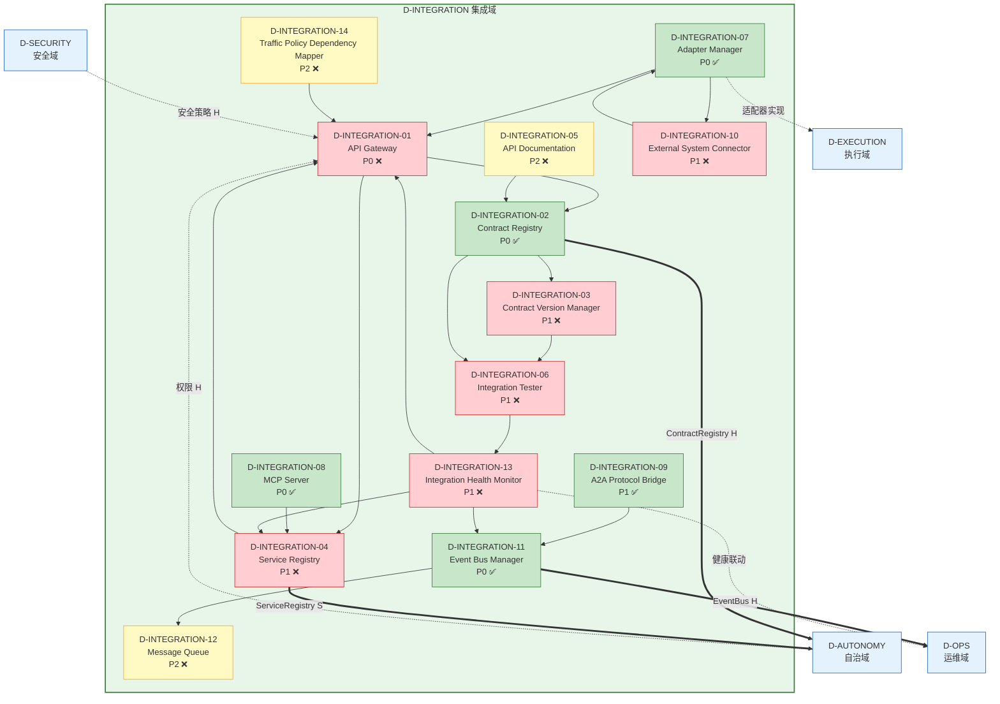

# 27 — D-INTEGRATION 集成域

> 量化交易系统 · 域依赖图系列 #17

---

## 一、域定义

| 属性 | 值 |
|------|-----|
| 域ID | D-INTEGRATION |
| 域名 | 集成域 |
| 职责 | 统一管理所有接口和契约，横切支撑层 |
| 优先级 | P1 |
| 核心Aggregate | IntegrationContract |
| 激活前提 | D-AUTONOMY 就绪 |

---

## 二、核心事件

| 事件ID | 事件名 | 触发条件 | 消费者 |
|--------|--------|---------|--------|
| E-IG-01 | ContractVersionChanged | 契约版本变更 | ContractVersionManager, IntegrationTester |
| E-IG-02 | ServiceRegistered | 新服务注册到注册表 | ServiceRegistry, APIGateway |
| E-IG-03 | IntegrationTestFailed | 集成测试失败 | IntegrationHealthMonitor, D-OPS |

---

## 三、子模块清单

| ID | 名称 | 职责 | 优先级 | 开发状态 | 对标依据 |
|----|------|------|:------:|:--------:|---------|
| D-INTEGRATION-01 | API Gateway | API网关+路由+限流+认证 | P0 | ❌ | Kong/APISIX |
| D-INTEGRATION-02 | Contract Registry | 契约注册表+85条CT+21条G-CT+版本管理 | P0 | ✅ 部分在contracts/ | REG-FREEZE-001 |
| D-INTEGRATION-03 | Contract Version Manager | 契约版本管理+兼容性检查+冻结 | P1 | ❌ | SemVer |
| D-INTEGRATION-04 | Service Registry | 服务注册发现+健康检查+负载均衡 | P1 | ❌ | Consul/Eureka |
| D-INTEGRATION-05 | API Documentation | API文档+OpenAPI+自动生成 | P2 | ❌ | Swagger/OpenAPI 3.0 |
| D-INTEGRATION-06 | Integration Tester | 集成测试+契约测试+端到端测试 | P1 | ❌ | Pact |
| D-INTEGRATION-07 | Adapter Manager | 适配器管理+Broker适配器+数据源适配器 | P0 | ✅ 部分在D-EXECUTION-03 | 适配器模式 |
| D-INTEGRATION-08 | MCP Server | MCP协议服务器+工具注册+能力暴露 | P0 | ✅ 已有 | MCP协议标准 |
| D-INTEGRATION-09 | A2A Protocol Bridge | A2A协议桥接+Agent间通信+冲突检测 | P1 | ✅ 部分在a2a_protocol/ | MOD-INF-025 |
| D-INTEGRATION-10 | External System Connector | 外部系统连接器+券商API+数据源API+交易所API | P1 | ❌ | FIX协议 |
| D-INTEGRATION-11 | Event Bus Manager | 事件总线管理+blinker/asyncio+事件路由 | P0 | ✅ 已有 | 事件驱动架构 |
| D-INTEGRATION-12 | Message Queue | 消息队列+异步通信+可靠投递 | P2 | ❌ | RabbitMQ/Redis Streams |
| D-INTEGRATION-13 | Integration Health Monitor | 集成健康监控+延迟监控+错误率监控 | P1 | ❌ | 与D-OPS联动 |
| D-INTEGRATION-14 | Traffic Policy Dependency Mapper | 流量策略依赖映射器+服务网格流量策略依赖+金丝雀/蓝绿/AB测试依赖+Istio VirtualService/DestinationRule策略映射+流量治理 | P2 | ❌ | Istio VirtualService/DestinationRule / Argo Rollouts |
| M2-S01 | Python包扫描器 | 扫描requirements.txt/pyproject.toml/setup.py提取依赖 | P0 | ❌ | — |
| M2-S02 | 脚本依赖扫描器 | 扫描10000脚本的import+subprocess+动态导入 | P0 | ❌ | — |
| M2-S03 | 模块注册表扫描器 | 扫描__init__.py/manifest/registry提取模块间依赖 | P0 | ❌ | — |
| M2-S04 | CycloneDX生成器 | 生成CycloneDX 1.7(ECMA-424)格式SBOM | P0 | ❌ | CycloneDX 1.7 / OWASP |
| M2-S05 | SPDX生成器 | 生成SPDX 2.3/3.0格式SBOM | P0 | ❌ | SPDX 3.0 / Linux Foundation |
| M2-S06 | SBOM差异比较器 | 比较两个SBOM差异：新增/删除/升级/降级 | P0 | ❌ | — |
| M2-S07 | SBOM签名器 | SBOM签名+验证：Sigstore/cosign确保完整性 | P0 | ❌ | Sigstore Cosign / SLSA v1.0 |
| M2-NEW-01 | CycloneDX 1.7 Schema Adapter | VEX 1.2集成/modelCard AI元数据/cryptoProperties/evidence | P0 | ❌ | CycloneDX 1.7 (2025 Q1) |
| M2-NEW-02 | SPDX 3.0 Serializer | 完全重构：RDF/JSON-LD原生/Build实体/Agent实体 | P0 | ❌ | SPDX 3.0 (2024.10) |
| M2-NEW-03 | AI-BOM / ML Model Scanner | 扫描模型文件/训练数据来源/模型卡片元数据 | P0 | ❌ | OWASP AI-BOM v1.0 / NIST AI RM 1.0 |
| M2-NEW-04 | Container Image SBOM Scanner | 解析Docker/OCI镜像层提取包列表 | P0 | ❌ | Syft+Trivy+Microsoft SBOM Tool |
| M2-NEW-05 | IaC SBOM Scanner | 扫描Terraform/CloudFormation/Pulumi/Helm基础设施依赖 | P0 | ❌ | tfsec+Checkov+Snyk IaC |
| M2-NEW-06 | SBOM Quality Validator | 验证完整性(NTIA 8项/CISA 6项/EU CRA)/一致性/时效性 | P0 | ❌ | CISA SBOM Quality Working Group 2024 |
| M2-NEW-07 | SBOM Drift Detector | 持续监控SBOM与运行环境一致性 | P0 | ❌ | GUAC v0.4 certifier模块 |
| M2-NEW-08 | SBOM Sigstore Signer | 基于Sigstore无密钥签名+透明日志 | P0 | ❌ | Sigstore Cosign 2.3 / SLSA v1.0 |
| M2-NEW-09 | SBOM Merge/Aggregate Engine | 多子系统SBOM合并为组织级SBOM | P0 | ❌ | CycloneDX 1.7 component.components |
| M52-S01 | 金丝雀依赖映射器 | 金丝雀依赖映射：金丝雀发布依赖关系映射+流量比例关联+风险评估 | P1 | ❌ | Argo Rollouts |
| M52-S02 | 蓝绿依赖映射器 | 蓝绿依赖映射：蓝绿部署依赖关系映射+切换状态关联+回滚路径 | P1 | ❌ | — |
| M52-S03 | AB测试依赖映射器 | AB测试依赖映射：AB测试依赖关系映射+分组策略关联+结果归因 | P1 | ❌ | — |
| M52-S04 | 流量镜像映射器 | 流量镜像映射：流量镜像依赖关系映射+影子流量关联+对比分析 | P1 | ❌ | Istio Traffic Mirroring |
| M52-NEW-01 | 渐进交付前置检查增强 | 渐进交付前置检查增强：金丝雀/蓝绿发布前置依赖检查+自动验证 | P1 | ❌ | SRECon 2025 |
| M52-NEW-02 | 流量镜像依赖映射增强 | 流量镜像依赖映射增强：生产与镜像环境依赖一致性校验+差异检测 | P1 | ❌ | — |
| M52-NEW-03 | 策略冲突自动检测器 | 策略冲突自动检测：流量策略冲突自动检测+解决建议+优先级仲裁 | P1 | ❌ | — |
| D-INTEGRATION-15 | Protocol Converter | 协议转换器：多协议适配+协议转换+协议版本兼容+协议性能优化+协议监控。理论：协议工程/适配器模式/协议栈。具备协议转换审计/版本兼容记录/协议性能合规检查 | P1 | ❌ | 协议工程/适配器模式/协议栈; AI协议优化/自适应协议选择/协议自动协商; gRPC/REST/GraphQL; 协议转换审计/版本兼容记录/协议性能合规 |
| D-INTEGRATION-16 | Data Format Transformer | 数据格式转换器：多格式支持+格式转换+Schema映射+格式验证+格式优化。理论：数据转换/Schema映射/ETL。具备格式转换审计/Schema映射记录/数据格式合规检查 | P1 | ❌ | 数据转换/Schema映射/ETL; AI格式转换/自适应映射/智能Schema推断; Apache Camel/Apache NiFi; 格式转换审计/Schema映射记录/数据格式合规 |
| D-INTEGRATION-17 | Plugin Marketplace | 第三方插件市场：插件注册+插件生命周期管理(安装/启用/禁用/卸载)+插件沙箱隔离+插件API契约+插件版本兼容+插件权限控制+插件市场搜索/评分/推荐。理论：插件架构/沙箱隔离/开放封闭原则。具备插件注册审计/沙箱安全合规/插件权限合规检查 | P2 | ❌ | 插件架构/沙箱隔离/OCP; LLM插件推荐/自适应插件加载/插件安全扫描; VS Code Marketplace/Eclipse Plugin; 插件注册审计/沙箱安全合规/插件权限合规 |

---

## 四、域间依赖

### 4.1 消费（本域依赖他人）

| 依赖源 | 依赖内容 | 强度 |
|--------|---------|:----:|
| D-AUTONOMY | 权限 | H |
| D-SECURITY | 安全策略 | H |
| *(all域) | 契约定义 | S |

### 4.2 产出（他人依赖本域）

| 产出 | 消费方 | 强度 |
|------|--------|:----:|
| ContractRegistry | *(all) | H |
| ServiceRegistry | D-AUTONOMY | S |
| EventBus | *(all) | H |

---

## 五、关键设计决策

| # | 决策 | 理由 |
|---|------|------|
| 1 | 集成域统一管理所有接口 | 每个域不再自己管接口，消除接口散落 |
| 2 | 契约注册表从contracts/目录升级 | 85条CT+21条G-CT集中管理，REG-FREEZE-001 |
| 3 | MCP协议归集成域 | MCP是AI工具集成协议，不是业务能力 |
| 4 | A2A协议桥接归集成域 | Agent间通信是集成能力 |
| 5 | Broker适配器双归属 | 接口抽象在集成域，具体实现在执行域 |
| 6 | 流量策略依赖映射归集成域(M52搬入) | 服务网格流量策略依赖+金丝雀/蓝绿/AB测试是集成域扩展能力 |

### 行业对标依据

| 来源类型 | 来源 | 核心观点/发现 | 对标子模块 |
|---------|------|-------------|-----------|
| 学术前沿 | WJAETS 2025 CQRS | CQRS+Event Sourcing+六边形架构 | IG11事件总线 |
| 学术前沿 | IEEE TSE 2025 | API依赖图自动构建+测试优先级排序 | IG01 API网关 |
| 社区 | Pact.io | 消费者驱动契约测试 | IG06集成测试 |

---

## 六、子模块依赖关系（Mermaid）

---

## 七、依赖说明

### 7.1 内部依赖链

| 上游 | 下游 | 依赖关系 |
|------|------|---------|
| Contract Registry | Contract Version Manager | 版本管理依赖契约注册表 |
| Contract Registry | Integration Tester | 测试需读取契约定义 |
| Contract Version Manager | Integration Tester | 版本变更触发契约测试 |
| API Gateway | Contract Registry | 路由基于契约定义 |
| Service Registry | API Gateway | 网关从注册表获取服务实例 |
| API Gateway | Service Registry | 网关注册自身到注册表 |
| Contract Registry | API Documentation | 文档从契约自动生成 |
| Adapter Manager | API Gateway | 适配器通过网关暴露 |
| Adapter Manager | External System Connector | 适配器连接外部系统 |
| MCP Server | Service Registry | MCP服务注册到注册表 |
| A2A Protocol Bridge | Event Bus Manager | A2A消息通过事件总线传递 |
| External System Connector | Adapter Manager | 外部连接器使用适配器抽象 |
| Event Bus Manager | Message Queue | 事件持久化到消息队列 |
| Integration Health Monitor | API Gateway | 监控网关延迟/错误率 |
| Integration Health Monitor | Service Registry | 监控服务健康状态 |
| Integration Health Monitor | Event Bus Manager | 监控事件投递延迟 |
| Integration Tester | Integration Health Monitor | 测试失败触发健康告警 |

### 7.2 域间依赖说明

| 依赖 | 方向 | 说明 |
|------|------|------|
| D-AUTONOMY → API Gateway | 消费 | 网关认证鉴权依赖自治域权限 |
| D-SECURITY → API Gateway | 消费 | 网关安全策略依赖安全域 |
| ContractRegistry → *(all) | 产出 | 所有域的契约定义由集成域统一管理 |
| ServiceRegistry → D-AUTONOMY | 产出 | 自治域消费服务注册信息 |
| EventBus → *(all) | 产出 | 所有域通过事件总线通信 |
| Adapter Manager ↔ D-EXECUTION | 双归属 | 接口抽象在集成域，实现在执行域 |
| Integration Health Monitor → D-OPS | 联动 | 集成健康数据联动运维监控 |

✅ 文件完整性验证通过
