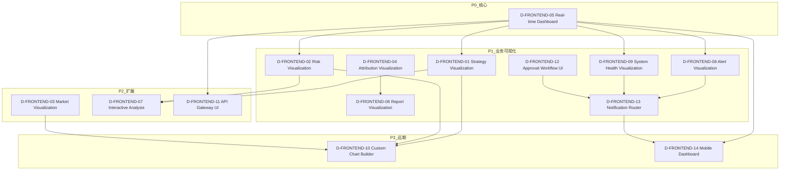
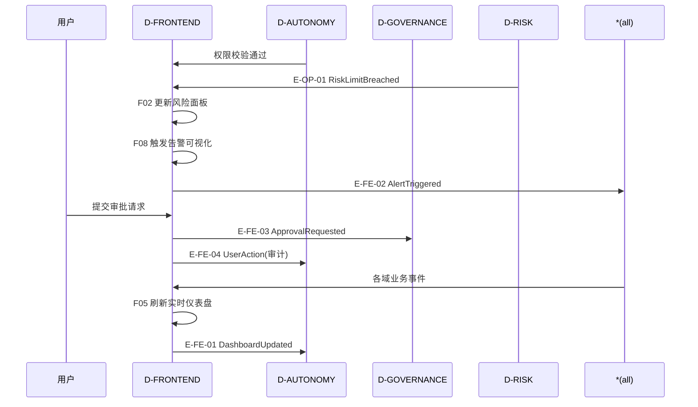

# 28 — D-FRONTEND 前端域

## §0 域定义

| 属性 | 值 |
|------|-----|
| 域ID | D-FRONTEND |
| 域名 | 前端域 |
| 职责 | 策略可视化、风险可视化、市场可视化、API网关、告警通知、审批流程 |
| 核心层 | L08(人机交互层) |
| 成熟度 | L0 ⚪规划 |
| 优先级 | P2 |
| 架构定位 | 技术驱动层——L08人机交互，范围广于原D-VISUALIZATION |
| 核心Aggregate | Dashboard |
| 核心事件 | E-FE-01 DashboardUpdated / E-FE-02 AlertTriggered / E-FE-03 ApprovalRequested |
| 激活前提 | D-AUTONOMY就绪 + 至少一个业务域就绪 |

### 重命名说明

| 维度 | D-VISUALIZATION(旧) | D-FRONTEND(新) |
|------|---------------------|----------------|
| 范围 | 仅可视化 | 可视化+API网关UI+审批流程+通知路由 |
| 对标 | 图表库 | 企业架构L08人机交互层 |
| 理由 | 前端域≠可视化——可视化是前端域的子集 | — |

## §0.1 能力对齐（Step 1: 子模块←→能力定位对齐）

> 来源：能力定位书§9 + INV-006 + 域文件§0 | 3项能力(0●+3◐)，负载等级"低(无●)"
> ⚠️ D-FRONTEND是30域中骨架最薄的域(仅1个架构图直接覆盖)，需大量从以下来源推导隐含骨架约束

### 显式能力覆盖

| 能力ID | 名称 | 优先级 | 角色 | 覆盖子模块 | 覆盖评估 |
|--------|------|:------:|:----:|-----------|:--------:|
| C-013 | 外部指令盯盘 | P1 | ◐辅助 | F-17(NLInterface)+F-20(OneClickQuant) | ⚠️部分覆盖，缺CLI/微信指令入口 |
| C-015 | 通知与告警 | P1 | ◐辅助 | F-08(AlertViz)+F-13(NotificationRouter) | ✅充分 |
| C-019 | 微信多人互动 | P2 | ◐辅助 | **无直接覆盖** | ❌缺口 |

### 从INV-006+域文件§0+能力定位书推导的隐含骨架约束

| 推导来源 | 推导出的隐含约束 | 对应子模块 |
|---------|----------------|-----------|
| INV-006 | 前后端唯一接触点：前端只能通过D-INTEGRATION API网关访问后端 | **F-22 API Gateway Proxy**(新增) |
| 域文件§0"Web前端+CLI+API+Feishu Bot" | 4种交互形态需各自有入口子模块 | **F-23 CLI Interface**(新增), **F-24 Feishu Bot**(新增), **F-25 WeChat Bot**(新增) |
| C-013"微信/系统界面的指令输入通道" | 微信是外部指令的主要输入通道 | F-25(WeChat Bot) |
| C-019"微信机器人双向交互" | 微信接收指令+系统回复 | F-25(WeChat Bot) |
| EXT-004(Feishu REST Webhook) | 飞书是备选通知渠道 | F-24(Feishu Bot) |
| YAML事件流(7条target=D-FRONTEND) | 前端需消费7类事件并展示 | F-05(Dashboard)+F-08(AlertViz)+F-09(SystemHealth) |
| CTR-P1-008/009(2条target=D-FRONTEND) | 前端需消费风控仪表+归因报告 | F-02(RiskViz)+F-04(AttributionViz) |

### 新增子模块（骨架补全）

| ID | 名称 | 职责 | 优先级 | 对标能力 | 推导来源 |
|----|------|------|:------:|---------|---------|
| D-FRONTEND-22 | API Gateway Proxy | 前后端唯一接触点(INV-006)——所有前端请求经此代理到D-INTEGRATION网关 | **P0** | INV-006 | INV-006不变量 |
| D-FRONTEND-23 | CLI Interface | 命令行交互入口——策略查询/持仓查询/PnL查询/盯盘指令 | P1 | C-013 | 域文件§0"CLI" |
| D-FRONTEND-24 | Feishu Bot | 飞书机器人——EXT-004 REST Webhook+审批通知+告警推送(备选渠道) | P1 | C-015 | EXT-004 |
| D-FRONTEND-25 | WeChat Bot | 微信机器人——接收外部用户盯盘/查询/下单指令+系统回复(C-013/C-019主渠道) | P1 | C-013/C-019 | C-013+C-019 |

### M系列模块归属建议

M5~M13(依赖图可视化~30模块)+M14~M19(Saga/CQRS/调用图~10模块)+M67(3D/VR 11模块)+M74(OTel追踪11模块)共约62个模块，本质是"依赖图可视化工具"，与交易系统前端核心职责弱相关，建议归入D-OPS(运维域)的依赖图管理工具或独立为D-DEP-VIZ(依赖图可视化域)。本域仅保留F-01~F-25核心模块。

## §1 子模块清单

| ID | 名称 | 职责 | 优先级 | 开发状态 | 对标依据 |
|----|------|------|:------:|:--------:|---------|
| D-FRONTEND-01 | Strategy Visualization | 策略可视化+策略表现+因子IC+信号分布 | P1 | ❌ | 与D-PORTFOLIO联动 |
| D-FRONTEND-02 | Risk Visualization | 风险可视化+VaR分布+回撤曲线+集中度热力图 | P1 | ❌ | 与D-RISK联动 |
| D-FRONTEND-03 | Market Visualization | 市场可视化+Regime地图+行业轮动+资金流向 | P2 | ❌ | 与D-SIGNAL联动 |
| D-FRONTEND-04 | Attribution Visualization | 归因可视化+Brinson分解+因子贡献+成本分解 | P1 | ❌ | 与D-REPORTING联动 |
| D-FRONTEND-05 | Real-time Dashboard | 实时仪表盘+Streamlit+PnL+持仓+信号 | P0 | ✅ 已有 | L08 HMI |
| D-FRONTEND-06 | Report Visualization | 报告可视化+图表+PDF+邮件 | P1 | ❌ | 与D-REPORTING联动 |
| D-FRONTEND-07 | Interactive Analysis | 交互式分析+What-if+参数调节+实时反馈 | P2 | ❌ | Plotly/Dash |
| D-FRONTEND-08 | Alert Visualization | 告警可视化+风控告警+系统告警+优先级 | P1 | ❌ | 与D-OPS联动 |
| D-FRONTEND-09 | System Health Visualization | 系统健康可视化+9子系统+Watchdog | P1 | ❌ | 与D-OPS联动 |
| D-FRONTEND-10 | Custom Chart Builder | 自定义图表+拖拽+模板+分享 | P3 | ❌ | Grafana-like |
| D-FRONTEND-11 | API Gateway UI | API网关界面+契约浏览+测试+文档 | P2 | ❌ | 与D-INTEGRATION联动 |
| D-FRONTEND-12 | Approval Workflow UI | 审批流程界面+策略上线审批+风控审批+预算审批 | P1 | ❌ | 与D-GOVERNANCE联动 |
| D-FRONTEND-13 | Notification Router | 通知路由+飞书/邮件/仪表盘+优先级+静默规则 | P1 | ❌ | 从D-AUTONOMY-14拆出 |
| D-FRONTEND-14 | Mobile Dashboard | 移动端仪表盘+关键指标+告警推送 | P3 | ❌ | 响应式设计 |
| D-FRONTEND-15 | End-to-End Trace Visualizer | 端到端追踪可视化+OpenTelemetry追踪→依赖图自动构建→端点级细化→异常传播路径可视化→延迟瀑布图 | P2 | ❌ | Jaeger / Zipkin / Grafana Tempo / SigNoz |
| D-FRONTEND-16 | Collaborative Workspace | 协作工作区：多人实时协作+共享画布+评论线程+权限管理+版本历史。理论：协作理论/CRDT/实时同步。具备协作审计/版本记录/协作合规检查 | P2 | ❌ | 协作理论/CRDT/实时同步; AI协作助手/智能评论/自动摘要; Figma/Notion; 协作审计/版本记录/协作合规 |
| D-FRONTEND-17 | Natural Language Interface | 自然语言界面：NL查询+语音交互+意图识别+多轮对话+结果可视化。理论：NLP/对话系统/意图识别。具备查询审计/对话记录/NL接口合规检查 | P1 | ❌ | NLP/对话系统/意图识别; LLM对话/多模态交互/语音合成; ChatGPT/Claude; 查询审计/对话记录/NL接口合规 |
| D-FRONTEND-18 | Trading Chatbot | 交易智能客服：AI聊天机器人+交易知识库+意图识别+多轮对话+问题分类(账户/策略/风控/技术)+自动工单创建+人工转接。理论：对话系统/知识图谱/意图分类。具备对话审计/敏感信息脱敏/客服合规检查 | P2 | ❌ | 对话系统/知识图谱/意图分类; LLM客服/多轮对话/情感识别; Intercom/Zendesk; 对话审计/敏感信息脱敏/客服合规 |
| D-FRONTEND-19 | Robo-Advisor | 智能投顾：风险画像评估+资产配置建议+再平衡建议+投资组合推荐+目标规划+市场解读。理论：投资组合理论/风险画像/资产配置。具备投顾建议审计/适当性合规(KYC/KYP)/投顾披露合规检查 | P2 | ❌ | 投资组合理论/风险画像/资产配置; LLM投顾推理/个性化推荐/多目标优化; Betterment/Wealthfront; 投顾建议审计/适当性合规(KYC/KYP)/投顾披露合规 |
| D-FRONTEND-20 | One-Click Quant Interface | 一键量化交易界面：懒人模式+预设策略一键启动+自动参数配置+风险自评+简化操作流程+引导式交易。理论：用户体验/渐进披露/向导模式。具备操作审计/适当性合规/简化披露合规检查 | P3 | ❌ | 用户体验/渐进披露/向导模式; LLM操作引导/自适应界面/智能默认值; Robinhood; 操作审计/适当性合规/简化披露合规 |
| D-FRONTEND-21 | AI Model HR Dashboard | AI模型HR管理面板：HR风格界面管理AI模型入职(注册)/绩效评估(IC/IR/Sharpe)/晋升(权重提升)/降级(权重降低)/离职(退役)+模型团队组合+模型成本管理+模型绩效周期报告。理论：人力资源管理/绩效评估/团队组合。具备模型管理审计/模型决策可解释性/模型退役合规检查 | P2 | ❌ | 人力资源管理/绩效评估/团队组合; LLM模型诊断/自适应模型组合/模型绩效预测; HR SaaS; 模型管理审计/模型决策可解释性/模型退役合规 |

### C轨L08层子模块映射

| C轨子模块 | 对应D-FRONTEND子模块 | 说明 |
|-----------|---------------------|------|
| l08-hmi-cli | D-FRONTEND-01 Dashboard + D-FRONTEND-05 Strategy Management | CLI人机交互界面 |
| l08-hmi-orchestration | D-FRONTEND-12 Approval Workflow UI + D-FRONTEND-13 Notification Router | 编排与审批工作流 |
| l08-hmi-notifications | D-FRONTEND-13 Notification Router + D-FRONTEND-08 Alert Visualization | 通知与告警可视化 |

| M5-S07 | 图可视化渲染器 | 图渲染+布局+交互 | P0 | ❌ | Cytoscape.js / D3.js |

## §2 域内依赖图
| M6-S07 | 映射可视化器 | 可视化业务域↔技术模块映射矩阵 | P0 | ❌ | Neo4j Bloom |
| M7-S06 | 流可视化器 | 可视化价值流端到端依赖图 | P0 | ❌ | Neo4j Bloom |
| M7-NEW-06 | Flow Metric Dashboard | 流动指标仪表盘：前置时间/周期时间/吞吐量/流效率 | P0 | ❌ | DORA Metrics / Flow Framework |
| M7-NEW-07 | Value Stream Risk Heatmap | 价值流风险热力图：依赖集中度/单点故障/外部依赖风险 | P0 | ❌ | — |
| M8-S08 | 血缘可视化器 | 可视化数据血缘DAG | P0 | ❌ | DataHub / Apache Atlas |
| M9-S05 | 影响可视化器 | 可视化变更影响传播路径 | P1 | ❌ | Neo4j Bloom |
| M10-S06 | 运行时依赖可视化器 | 可视化运行时依赖图 | P1 | ❌ | Grafana / Jaeger |
| M13-S01 | 图渲染引擎 | 渲染依赖图：力导向/层次/辐射布局 | P1 | ❌ | Cytoscape.js / D3.js / ECharts |
| M13-S02 | 交互控制器 | 过滤/下钻/路径高亮/实时更新 | P1 | ❌ | Neo4j Bloom |
| M13-S03 | 搜索定位器 | 搜索模块/依赖/路径并定位 | P1 | ❌ | — |
| M13-S04 | 导出器 | 导出依赖图为PNG/SVG/PDF/JSON | P1 | ❌ | — |
| M13-S05 | 实时更新器 | 依赖图变更时实时推送更新 | P1 | ❌ | — |
| M13-NEW-01 | AI-Driven Dependency Explorer | 自然语言查询依赖图 | P1 | ❌ | Neo4j GDS+LLM / ACL 2025 NL→KG |
| M13-NEW-02 | Large-Scale Graph Rendering Engine | 1600+节点大规模图渲染：WebGL/GPU加速+LOD | P1 | ❌ | ECharts GL / Deck.gl / Cytoscape.js 3.30 |
| M13-NEW-03 | Dependency Timeline Player | 依赖图随时间演化回放 | P1 | ❌ | Gource 2024 / Git Animations |
| M13-NEW-04 | Dependency Diff Viewer | 两版本依赖图差异可视化 | P1 | ❌ | GraphQL Inspector Diff / OpenAPI Diff |
| M13-NEW-05 | Collaborative Dependency Annotator | 多人协作标注依赖图 | P1 | ❌ | Figma-style / Miro |
| M13-NEW-06 | Auto-Layout Optimizer | 自动布局算法优化：减少交叉边/突出层次 | P1 | ❌ | Dagre / ELK / d3-force-3d |
| D83 | Architecture Doc Auto-Generator | 架构文档自动生成器 | P1 | ❌ | ICSA 2025 |
| M14-S06 | Saga可视化器 | 可视化Saga执行流程和补偿路径 | P1 | ❌ | Temporal.io UI |
| M15-S05 | 风险传染可视化器 | 可视化风险传染路径和级联效应 | P1 | ❌ | D3.js / ECharts |
| M37-S06 | CQRS Visualization | 可视化CQRS两侧依赖关系 | P1 | ❌ | D3.js |
| M38-S06 | Trading Architecture Visualizer | 可视化4层交易架构依赖 | P1 | ❌ | — |
| M43-S06 | API Dependency Visualizer | API依赖可视化器，以交互式图形展示API间依赖关系和调用拓扑 | P1 | ❌ | D3.js |
| M44-S06 | 安全依赖可视化器 | 可视化安全依赖链 | P1 | ❌ | D3.js |
| M17-S05 | 调用图可视化器 | 可视化函数调用图，基于AST调用图数据展示函数级依赖关系 | P2 | ❌ | ECharts/Cytoscape.js |
| M18-S02 | 耦合热力图 | 可视化模块间耦合强度分布，RMS指标热力图展示 | P2 | ❌ | Neo4j Bloom |
| M19-S05 | 追溯可视化器 | 可视化蓝图-代码追溯链，展示双向追溯关系 | P2 | ❌ | Neo4j Bloom |
| M21-NEW-02 | Agent依赖热力图 | 可视化Agent间依赖密度和热点 | P2 | ❌ | Neo4j GDS |
| M24-S05 | 追踪可视化器 | 可视化分布式追踪和依赖传播 | P2 | ❌ | Jaeger/Zipkin |
| M25-S05 | 结果渲染器 | 渲染查询结果为可读格式 | P2 | ❌ | — |
| M28-S05 | 网格可视化器 | 可视化服务网格依赖拓扑 | P2 | ❌ | Kiali |
| M33-S06 | 开发者仪表盘 | 开发者视角依赖和状态仪表盘 | P2 | ❌ | Backstage Dashboard |
| M41-S05 | 血缘可视化器 | 可视化特征血缘和依赖 | P2 | ❌ | DataHub/Atlan |
| M42-S06 | 编排可视化器 | 可视化多Agent图编排过程 | P2 | ❌ | LangGraph Studio |
| M67-S01 | 3D力导向布局器 | 3D力导向图布局算法 | P2 | ❌ | d3-force-3d/Three.js |
| M67-S02 | VR渲染器 | VR环境渲染依赖图 | P2 | ❌ | WebXR/A-Frame |
| M67-S03 | 时间维度动画器 | 依赖图时间维度动画 | P2 | ❌ | Gource/D3.js |
| M67-S04 | 集群热力图 | 3D集群热力图 | P2 | ❌ | Deck.gl/ECharts GL |
| M67-S05 | 交互控制器 | VR交互控制 | P2 | ❌ | WebXR |
| M67-NEW-01 | WebGPU大规模渲染器 | WebGPU加速大规模图渲染 | P2 | ❌ | WebGPU/wgpu |
| M67-NEW-02 | 力导向GPU加速器 | GPU加速力导向布局计算 | P2 | ❌ | CUDA/WebGPU Compute |
| M67-NEW-03 | 依赖图LOD引擎 | Level-of-Detail渐进式渲染 | P2 | ❌ | Deck.gl LOD |
| M67-NEW-04 | XR协作探索器 | 多人XR协作探索依赖图 | P2 | ❌ | WebXR Multi-User |
| M67-NEW-05 | 时间旅行控制器 | VR中时间旅行回放依赖图演化 | P2 | ❌ | Gource 2024 |
| M67-NEW-06 | 超大规模图交互优化器 | 优化超大规模图交互延迟 | P2 | ❌ | — |
| M74-S01 | OTel追踪渲染器 | 渲染OpenTelemetry追踪 | P2 | ❌ | Jaeger/Tempo |
| M74-S02 | 端点级细化器 | 细化追踪到端点级别 | P2 | ❌ | Coralogix OTel |
| M74-S03 | 异常传播3D可视化器 | 3D可视化异常传播路径 | P2 | ❌ | Three.js/Deck.gl |
| M74-S04 | 延迟瀑布图 | 延迟瀑布图可视化 | P2 | ❌ | Jaeger Waterfall |
| M74-S05 | 追踪报告器 | 生成追踪分析报告 | P2 | ❌ | — |
| M74-NEW-01 | Trace拓扑自动提取器 | 自动提取Trace拓扑结构 | P2 | ❌ | Coralogix OTel |
| M74-NEW-02 | 瀑布图交互引擎 | 交互式延迟瀑布图 | P2 | ❌ | Jaeger/Zipkin |
| M74-NEW-03 | Trace异常ML检测器 | ML检测Trace异常模式 | P2 | ❌ | OSDI 2024 MicroRCA |
| M74-NEW-04 | 跨服务Trace关联器 | 跨服务Trace自动关联 | P2 | ❌ | OTel Context Propagation |
| M74-NEW-05 | Trace→依赖图映射器 | 从Trace数据映射依赖图 | P2 | ❌ | Coralogix OTel |
| M74-NEW-06 | AI Agent调用链追踪器 | 追踪AI Agent调用链 | P2 | ❌ | OTel GenAI SemConv |
| M76-S03 | 决策树可视化器 | 可视化ADR决策树 | P2 | ❌ | D3.js/ECharts |
| M79-S05 | 实时渲染器 | 实时渲染eBPF依赖拓扑 | P2 | ❌ | Grafana |
| M79-NEW-05 | 实时渲染增强 | 增强实时渲染性能 | P2 | ❌ | Grafana |

## §2 域内依赖图



### 域内依赖关系表

| 源 | 目标 | 依赖类型 | 说明 |
|----|------|---------|------|
| F05 | F01 | 仪表盘扩展 | 实时仪表盘→策略可视化面板 |
| F05 | F02 | 仪表盘扩展 | 实时仪表盘→风险可视化面板 |
| F05 | F08 | 仪表盘扩展 | 实时仪表盘→告警可视化面板 |
| F05 | F09 | 仪表盘扩展 | 实时仪表盘→系统健康面板 |
| F01 | F07 | 交互深化 | 策略可视化→交互式What-if分析 |
| F02 | F07 | 交互深化 | 风险可视化→交互式风险参数调节 |
| F04 | F06 | 报告产出 | 归因可视化→报告可视化 |
| F08 | F13 | 告警路由 | 告警可视化→通知路由 |
| F09 | F13 | 告警路由 | 系统健康告警→通知路由 |
| F12 | F13 | 审批通知 | 审批流程→通知路由 |
| F01 | F10 | 图表定制 | 策略可视化→自定义图表 |
| F02 | F10 | 图表定制 | 风险可视化→自定义图表 |
| F03 | F10 | 图表定制 | 市场可视化→自定义图表 |
| F05 | F14 | 移动端 | 实时仪表盘→移动端精简版 |
| F13 | F14 | 移动推送 | 通知路由→移动端推送 |
| F05 | F11 | API浏览 | 仪表盘→API网关界面 |

## §3 域间依赖

### 消费依赖（D-FRONTEND 依赖其他域）

| 契约ID | 供给域 | 依赖强度 | 内容 | 说明 |
|--------|--------|:--------:|------|------|
| CTR-TRACE-001 | D-AUTONOMY | H | 权限 | 前端操作需RBAC权限校验 |
| — | *(all) | E | 各域数据和事件 | 前端是所有业务域的展示层 |
| CTR-INT-001 | D-INTEGRATION | S | API | 前端通过API网关访问后端服务 |

### 产出依赖（其他域依赖 D-FRONTEND）

| 产出 | 消费域 | 依赖强度 | 说明 |
|------|--------|:--------:|------|
| Dashboard | D-AUTONOMY HMI | S | 自治域人机交互入口 |
| Alert | *(all) | E | 告警事件推送到所有域 |
| ApprovalRequest | D-GOVERNANCE | E | 审批请求提交到治理域 |

### 域间依赖图

```mermaid
graph LR
    D-AUTONOMY[D-AUTONOMY 自治域] -->|权限 H| D-FRONTEND[D-FRONTEND 前端域]
    D-INTEGRATION[D-INTEGRATION 集成域] -->|API S| D-FRONTEND
    D-PORTFOLIO[D-PORTFOLIO 组合域] -.->|策略数据 E| D-FRONTEND
    D-RISK[D-RISK 风控域] -.->|风险数据 E| D-FRONTEND
    D-SIGNAL[D-SIGNAL 信号域] -.->|市场数据 E| D-FRONTEND
    D-REPORTING[D-REPORTING 报告域] -.->|报告数据 E| D-FRONTEND
    D-OPS[D-OPS 运维域] -.->|系统数据 E| D-FRONTEND

    D-FRONTEND -->|Dashboard S| D-AUTONOMY
    D-FRONTEND -->|Alert E| ALL[*(all)]
    D-FRONTEND -->|ApprovalRequest E| D-GOVERNANCE[D-GOVERNANCE 治理域]
```

## §4 域事件流

### 产出事件

| 事件ID | 事件名 | 触发条件 | 载荷 | 消费域 |
|--------|--------|---------|------|--------|
| E-FE-01 | DashboardUpdated | 仪表盘数据刷新 | dashboard_id, panels_updated, refreshed_at | D-AUTONOMY(HMI) |
| E-FE-02 | AlertTriggered | 告警触发 | alert_id, severity, source_domain, message | *(all) |
| E-FE-03 | ApprovalRequested | 审批请求提交 | approval_id, type, requester, payload | D-GOVERNANCE |
| E-FE-04 | UserAction | 用户操作 | action_type, target, user_id, timestamp | D-AUTONOMY(审计) |

### 消费事件

| 事件ID | 事件名 | 供给域 | D-FRONTEND处理 |
|--------|--------|--------|----------------|
| E-RS-01 | FactorComputed | D-FACTOR | F01更新因子IC图表 |
| E-OP-01 | RiskLimitBreached | D-RISK | F02更新风险面板+F08触发告警 |
| E-OP-02 | ModelDriftDetected | D-ML | F09更新系统健康面板 |
| E-AU-05 | HealthDegraded | D-AUTONOMY | F09更新系统健康面板 |
| E-AU-07 | EscalationTriggered | D-AUTONOMY | F08+F13触发告警通知 |
| — | 各域业务事件 | *(all) | F05刷新实时仪表盘 |

### 事件流时序图



## §5 激活前提

| 前提 | 域 | 状态 | 说明 |
|------|-----|------|------|
| D-AUTONOMY就绪 | D-AUTONOMY | 必须 | 权限/审计是前端域的运行前提 |
| 至少一个业务域就绪 | *(业务域) | 必须 | 前端域需要数据源才有展示内容 |

### 激活阶段

| 阶段 | 前提 | 可激活模块 |
|------|------|-----------|
| Phase 1 | D-AUTONOMY就绪 + Streamlit环境 | F05（已有代码基础） |
| Phase 2 | Phase 1 + D-PORTFOLIO/D-RISK就绪 | F01, F02, F08, F09, F13 |
| Phase 3 | Phase 2 + D-REPORTING就绪 | F04, F06, F12 |
| Phase 4 | Phase 3 + D-SIGNAL/D-INTEGRATION就绪 | F03, F07, F11 |
| Phase 5 | Phase 4 | F10, F14 |

## §6 设计决策记录

| # | 决策 | 理由 | 影响 |
|---|------|------|------|
| 1 | 前端域≠可视化——可视化是前端域的子集 | 前端域还包括API网关UI、审批流程、通知路由 | F11/F12/F13归前端域，不只做图表 |
| 2 | 重命名D-VISUALIZATION→D-FRONTEND | 与L08人机交互层对齐，范围更准确 | 域ID变更，旧引用需更新 |
| 3 | 通知路由从D-AUTONOMY-14拆出 | 通知是人机交互，不是自治——自治管"决定通知谁"，前端管"怎么通知到人" | D-AUTONOMY-14迁移到F13，D-AUTONOMY保留通知决策逻辑 |
| 4 | 审批流程UI归前端域 | 审批界面是人机交互，审批逻辑在D-GOVERNANCE | F12只管UI，审批状态机在D-GOVERNANCE |
| 5 | 新增端到端追踪可视化器(M74搬入) | 追踪可视化是前端域可观测性展示能力 | Jaeger / Grafana Tempo |
| 6 | 新增M13-NEW-01 AI-Driven Dependency Explorer | AI自然语言查询依赖图，降低依赖分析使用门槛 | Neo4j GDS+LLM / ACL 2025 NL→KG |
| 7 | 新增D83 Architecture Doc Auto-Generator | 从依赖图自动生成架构文档 | ICSA 2025 |
| 8 | 新增M74-NEW-03 Trace异常ML检测器——OSDI 2024 MicroRCA | ML检测Trace异常模式 | OSDI 2024 MicroRCA |

### 行业对标依据

| 来源类型 | 来源 | 核心观点/发现 | 对标子模块 |
|---------|------|-------------|-----------|
| 专业机构 | BizzDesign/ValueBlue VSM 2025-2026 | 4核心域+ArchiMate映射 | F01策略可视化 |

## §7 与现有体系对账

| 对账项 | 本域记录 | 现有体系 | 一致性 |
|--------|---------|---------|:------:|
| F05 Real-time Dashboard | §1开发状态✅ | L08 HMI Streamlit实现 | ✅ |
| D-AUTONOMY-14 Notification Router | §6决策3 | 22-D-AUT-CORE-自治核心域.md | ⚠️ 需迁移到F13 |
| D-VISUALIZATION(旧) | §0重命名说明 | 依赖图索引 | ⚠️ 需更新引用 |
| E-FE-01~04 事件 | §4产出事件 | 事件目录 | 🆕 新增 |
| F01~04, F06~14 | §1开发状态❌ | 代码库 | 🆕 待建 |

✅ 文件完整性验证通过

---

## §3 域内依赖（Step 2）

### 关键依赖链

- F-22→D-INTEGRATION (INV-006：所有前端请求必须经API Gateway Proxy)
- F-23/24/25→F-22 (CLI/飞书/微信→API网关代理→后端)
- F-05→F-01/02/04/09 (仪表盘→各可视化面板)
- F-08/09/12→F-13→F-24/25 (告警/健康/审批→通知路由→飞书/微信推送)

### 依赖关系详表

| 源 | 目标 | 依赖类型 | 说明 |
|----|------|---------|------|
| F-22 | D-INTEGRATION | INV-006 | API Gateway Proxy→后端唯一通道 |
| F-23 | F-22 | 请求代理 | CLI→API Gateway Proxy |
| F-24 | F-22 | 请求代理 | Feishu Bot→API Gateway Proxy |
| F-25 | F-22 | 请求代理 | WeChat Bot→API Gateway Proxy |
| F-05 | F-01 | 仪表盘扩展 | 实时仪表盘→策略可视化面板 |
| F-05 | F-02 | 仪表盘扩展 | 实时仪表盘→风险可视化面板 |
| F-05 | F-08 | 仪表盘扩展 | 实时仪表盘→告警可视化面板 |
| F-05 | F-09 | 仪表盘扩展 | 实时仪表盘→系统健康面板 |
| F-01 | F-07 | 交互深化 | 策略可视化→交互式What-if分析 |
| F-02 | F-07 | 交互深化 | 风险可视化→交互式风险参数调节 |
| F-04 | F-06 | 报告产出 | 归因可视化→报告可视化 |
| F-08 | F-13 | 告警路由 | 告警可视化→通知路由 |
| F-09 | F-13 | 告警路由 | 系统健康告警→通知路由 |
| F-12 | F-13 | 审批通知 | 审批流程→通知路由 |
| F-13 | F-24 | 推送渠道 | 通知路由→飞书推送(备选) |
| F-13 | F-25 | 推送渠道 | 通知路由→微信推送(主渠道) |
| F-17 | F-25 | 指令通道 | NL界面→微信指令 |
| F-05 | F-11 | API浏览 | 仪表盘→API网关界面 |

---

## §4 域间接口（Step 3）

### 消费依赖

| 接口ID | 方向 | 契约/事件 | 对端域 | 内容 | 优先级 |
|--------|------|---------|--------|------|:------:|
| FE-AC-01 | D-AUTONOMY→FE | CTR-TRACE-001 | D-AUTONOMY-CORE | 权限/RBAC | P0 |
| FE-INT-01 | D-INTEGRATION→FE | INV-006 | D-INTEGRATION | API网关(前后端唯一接触点) | **P0** |
| FE-INFRA-01 | D-INFRA-RUNTIME→FE | — | D-INFRA-RUNTIME | 基础设施服务 | P1 |
| FE-RISK-01 | D-RISK→FE | E-RK-01/03, CTR-P1-008 | D-RISK | RiskLimitBreached/DrawdownAlerted+RiskDashboardSnapshot | P1 |
| FE-RISK-02 | D-EX-CORE→FE | E-RK-02 | D-EX-CORE | MarginCalled | P1 |
| FE-RISK-03 | D-RISK→FE | E-PF-02 | D-RISK | PositionLimitBreached | P1 |
| FE-DATA-01 | D-DATA→FE | E-OP-01 | D-DATA | DataIngestionFailed | P1 |
| FE-ML-01 | D-ML-SERVE→FE | E-OP-02 | D-ML-SERVE | ModelDriftDetected | P1 |
| FE-OPS-01 | D-OPS→FE | E-OP-03 | D-OPS | SystemDegraded | P1 |
| FE-REPORT-01 | D-REPORTING→FE | CTR-P1-009 | D-REPORTING | PerformanceAttributionReport | P1 |
| FE-GOV-01 | D-GOVERNANCE→FE | (event) | D-GOVERNANCE | 审批状态变更→审批UI更新 | P1 |
| FE-SIM-01 | D-SIMULATION→FE | E-SIM-04 | D-SIMULATION | BacktestPassed→策略可视化 | P1 |
| FE-KNW-01 | D-KNOWLEDGE→FE | E-KN-06 | D-KNOWLEDGE | KGImpactAnalysis→知识可视化 | P2 |

### 产出依赖

| 接口ID | 方向 | 契约/事件 | 对端域 | 内容 | 优先级 |
|--------|------|---------|--------|------|:------:|
| FE→GOV-01 | FE→D-GOVERNANCE | E-FE-03 | D-GOVERNANCE | ApprovalRequested→审批逻辑 | P1 |
| FE→PF-01 | FE→D-PF-CORE | E-FE-05 | D-PF-CORE | ExternalCommand(微信/CLI盯盘指令) | P1 |
| FE→AC-01 | FE→D-AUTONOMY | E-FE-04 | D-AUTONOMY-CORE | UserAction→审计日志 | P1 |

### P0冻结签名

| 接口ID | 签名 | 方向 |
|--------|------|------|
| FE-INT-01 | `POST /api/v1/* → D-INTEGRATION Gateway` | FE→INT |

---

## §NEXT 风险架构(A4)交叉内容

> **来源**: 风险架构(A4) v3.0 —— §4.3 风险报告中的前端展示部分（实时风险仪表盘 + 资源配置表）。以下内容从风险架构文件物理搬入，保持原有颗粒度。
> **嵌套编号约定**: 风险架构原文的§N映射为本节的对应子节编号。

### 风险报告——前端展示

| 报告类型 | 频率 | 内容 | 消费者 |
|---------|------|------|--------|
| 日度风险摘要 | 每日收盘 | VaR/CVaR/因子暴露/否决统计/漂移状态/Amihud非流动性 | Trader+Risk Manager |
| 周度风险深度 | 每周五 | 压力测试结果+漂移趋势+策略拥挤度+模型健康度+反向RST结果 | Risk Manager |
| 事件风险快报 | 事件触发 | 触发事件+影响评估+处置建议+历史类比 | Trader(即时推送) |
| 月度风险治理 | 每月末 | 风控参数变更审计+否决规则有效性+合规检查+Pod级止损统计 | Risk Manager+治理层 |

---

### 风险指标计算——资源配置

> 以下为风险架构(A4) §4.2 风险指标计算各指标的频率、延迟、输入输出规格，作为前端仪表盘展示的数据源定义。

| 指标类别 | 计算频率 | 延迟目标 | 输入 | 输出 |
|---------|---------|---------|------|------|
| 实时P&L+因子暴露+Amihud | 每Tick(3秒) | <1秒 | 行情+持仓 | 当前P&L+因子暴露向量+非流动性指标 |
| VaR/CVaR/ES | 日频 | ≤5秒(P99) | 收益序列+因子暴露 | 风险限额检查结果 |
| 密度感知VaR | 日频 | ≤10秒 | 概率密度预测 | 分布形态+分位数 |
| 共形VaR校准 | 日频 | ≤5秒 | 预测误差+校准窗口 | 校准后VaR+覆盖率 |
| 漂移检测+CUSUM | 日频 | ≤5秒 | 特征分布+模型性能 | PSI/KS/CUSUM+漂移告警 |
| 压力测试+反向RST | 周频+事件触发 | ≤30分钟 | 持仓+情景定义 | 情景P&L+韧性评估+致崩溃情景 |
| Agent行为监控(ASI+AST+MCP+隐性串谋) | 实时 | <1秒 | Agent行为日志 | 越界检测+串谋检测+隐性串谋检测+工具滥用检测 |
| FE-AC-01 | `CTR-TRACE-001: AuditTrace` | AC→FE |

---

## §5 域事件流（Step 4）

### 产出事件

| 事件ID | 事件名 | 触发条件 | 载荷 | 消费域 | 频率 |
|--------|--------|---------|------|--------|:----:|
| E-FE-01 | DashboardUpdated | 仪表盘数据刷新 | dashboard_id, panels_updated | D-AUTONOMY(HMI) | L3 |
| E-FE-02 | AlertTriggered | 告警触发 | alert_id, severity, source_domain | *(all) | L2 |
| E-FE-03 | ApprovalRequested | 审批请求提交 | approval_id, type, requester | D-GOVERNANCE | L2 |
| E-FE-04 | UserAction | 用户操作 | action_type, target, user_id | D-AUTONOMY(审计) | L3 |
| E-FE-05 | ExternalCommand | 外部指令(微信/CLI) | command_type, params, source(wechat/cli) | D-PF-CORE, D-AUTONOMY | L1 |

### 消费事件（7条YAML定义 + 补充）

| 事件ID | 事件名 | 供给域 | D-FRONTEND处理 |
|--------|--------|--------|----------------|
| E-PF-02 | PositionLimitBreached | D-RISK | F-02风险面板+F-08告警 |
| E-RK-01 | RiskLimitBreached | D-RISK | F-02风险面板+F-08告警(CTR-003) |
| E-RK-02 | MarginCalled | D-EX-CORE | F-02风险面板+F-08告警 |
| E-RK-03 | DrawdownAlerted | D-RISK | F-02风险面板+F-08告警 |
| E-OP-01 | DataIngestionFailed | D-DATA | F-09系统健康面板 |
| E-OP-02 | ModelDriftDetected | D-ML-SERVE | F-09系统健康面板 |
| E-OP-03 | SystemDegraded | D-OPS | F-09系统健康面板+F-08告警 |
| E-SIM-04 | BacktestPassed | D-SIMULATION | F-01策略可视化面板 |
| E-KN-06 | KGImpactAnalysis | D-KNOWLEDGE | F-03市场可视化面板 |

---

## §6 激活前提（Step 5）

| 前提 | 域 | 必须/部分 | 就绪标准 |
|------|-----|:---------:|---------|
| 权限就绪 | D-AUTONOMY-CORE | 必须 | RBAC权限校验可用 |
| API网关就绪 | D-INTEGRATION | 必须 | INV-006: API网关可代理后端请求 |
| 至少一个业务域就绪 | *(业务域) | 必须 | 前端需要数据源才有展示内容 |

### 激活阶段

| 阶段 | 前提 | 可激活模块 |
|------|------|-----------|
| Phase 1 | D-AUTONOMY就绪 + D-INTEGRATION就绪 | F-22, F-05(已有代码), F-23 |
| Phase 2 | Phase 1 + D-RISK/D-PF-CORE就绪 | F-01, F-02, F-08, F-09, F-13 |
| Phase 3 | Phase 2 + D-REPORTING就绪 | F-04, F-06, F-12 |
| Phase 4 | Phase 3 + 外部渠道就绪 | F-24, F-25, F-17, F-18 |
| Phase 5 | Phase 4 | F-03, F-07, F-11, F-15 |

---

## §7 设计决策（Step 6）

| # | 决策 | 理由 | 影响 |
|---|------|------|------|
| 1 | **INV-006: 前后端唯一接触点** | 前端只能通过D-INTEGRATION API网关访问后端——这是P0不变量 | F-22(APIGatewayProxy)为P0子模块，所有前端请求必须经此 |
| 2 | 前端域≠可视化 | 可视化是前端域的子集，还包括API网关UI+审批流程+通知路由+交互入口 | F-22/23/24/25/12/13归前端域 |
| 3 | 4种交互形态各自有入口 | Web(Dashboard)+CLI+API+Feishu/WeChat Bot——域文件§0明确定义 | 新增F-23(CLI)+F-24(Feishu)+F-25(WeChat) |
| 4 | 通知路由从D-AUTONOMY-14拆出 | 通知是人机交互，不是自治——自治管"决定通知谁"，前端管"怎么通知到人" | F-13归前端域，D-AUTONOMY保留通知决策逻辑 |
| 5 | 审批流程UI归前端域 | 审批界面是人机交互，审批逻辑在D-GOVERNANCE | F-12只管UI，审批状态机在D-GOVERNANCE |
| 6 | WeChat Bot覆盖C-013+C-019 | 微信是外部指令盯盘的主要输入通道(C-013)，也是微信多人互动的通道(C-019) | F-25同时覆盖C-013和C-019 |
| 7 | 83→25核心子模块大幅精简 | M系列可视化模块(62个)本质是"依赖图可视化工具"，与交易系统前端核心职责弱相关 | 建议M系列归入D-OPS或独立D-DEP-VIZ |
| 8 | Feishu为备选渠道，WeChat为主渠道 | C-015定义：微信(主渠道)+飞书(备选渠道)+系统日志(全量留存) | F-25(WeChat)优先级高于F-24(Feishu) |
| 9 | Streamlit为MVP技术选型 | 已有代码MOD-L08-001，快速验证 | F-05基于Streamlit，后续可升级 |

## §12 安全架构约束（源自A5安全架构）

> 来源：A5安全架构 §1.3 治理域

### §12.1 前端域与治理域的交互约束

> 来源：A5安全架构 §1.3

治理域覆盖 D-GOVERNANCE（治理核心）、D-AUTONOMY-CORE（自治核心）、D-AUTONOMY-PERM（自治保护）。前端域是人机交互入口，承担审批界面展示与用户操作采集职责。

### §12.2 审批界面安全约束

> 来源：A5安全架构 §1.3

- 前端审批界面（F-12）只管UI展示，审批状态机在D-GOVERNANCE
- 治理策略的变更必须经过人工审批（即使由AI提出建议），前端必须展示完整变更内容供人工审核
- 自治权限定义（ai_modifiable/human_gated/immutable）的修改在前端必须标记为"需人工审批"操作
- 前端域所有请求必须通过D-INTEGRATION API网关（INV-006），不可直连后端

### §12.3 治理域资产在前端的展示约束

> 来源：A5安全架构 §1.3

| 资产类型 | 前端展示规则 | 理由 |
|---------|------------|------|
| 治理策略 | 仅展示策略摘要，完整策略需审批后查看 | 绝密（L3），防止策略泄露 |
| 自治权限定义 | 展示权限边界+自治等级，修改需审批 | 绝密（L3），防止权限篡改 |
| 审批记录 | 展示审批状态+审批人+时间，内容脱敏 | 机密（L2），审计需要 |
| 治理日志 | 展示变更历史摘要，详情需权限 | 机密（L2），审计需要 |

---

## §8 运维架构(A9)规格

> **搬入来源**: 运维架构(A9) §6.3仪表盘设计 + §6监控体系(前端可视化)
> **搬入原则**: 将A9中D-FRONTEND域承载的运维可视化规格搬入本域，保持A9原文颗粒度。

### §8.1 运维仪表盘设计（A9§6.3）

| 仪表盘 | 展示内容 | 刷新频率 | 数据源 | 对应子模块 |
|--------|---------|:--------:|--------|-----------|
| 系统健康仪表盘 | 5进程状态+Redis+GPU+磁盘+网络 | 5s | Prometheus+Redis | F-09 System Health Visualization |
| 交易监控仪表盘 | 实时PnL+持仓+订单+风控状态 | 3s | Redis+P3 | F-08 Alert Visualization |
| 降级状态仪表盘 | 当前降级等级+触发条件+保命规则状态 | 1s | Redis `degrade:level` | F-09 |
| AI自治仪表盘 | AI决策置信度+修复动作+熔断器状态 | 10s | P4+Redis | F-09 |
| 容量仪表盘 | CPU/内存/GPU/磁盘使用率+预测 | 10s | Prometheus | F-09 |

> **前端硬约束**：仪表盘数据只读，不允许通过仪表盘直接执行运维动作(安全约束)。运维动作必须通过P4进程守护API执行。

## 来自Agent架构(A7)的内容

### 来自Agent架构(A7) §12 角色与交互旅程

> **来源**: Agent架构(A7) §12。本节从前端域视角搬入角色与交互旅程完整规格——定义D-FRONTEND域须支持的角色交互界面与交互旅程。

> 定义与Agent架构交互的核心角色、交互方式、AI自动化程度及人工介入点。

#### §12.1 四种角色定义

| 角色 | 与Agent架构的交互 | AI自动化程度 | 人工介入点 | 交互方式 |
|------|-----------------|-------------|-----------|---------|
| Trader | 审批Agent自治边界变更（human_gated级）；审核Agent决策（大额下单、策略上线）；接收Agent异常告警并决策；审批LLM prompt变更 | 中：Agent自主执行日常决策，Trader审批关键节点 | 自治边界变更审批；大额下单审批；策略上线审批；异常处置决策；串谋/涌现告警确认 | 微信推送+Web审批界面 |
| Administrator | Agent部署与资源调度；Agent版本管理与回滚；监控Agent运行状态与资源消耗；GPU显存分配策略调整 | 低：部署和调度需人工确认，Agent不可自行扩缩容 | Agent部署审批；资源分配决策；版本发布审批；故障恢复决策；降级策略调整 | 命令行+监控仪表盘 |
| AI | Agent自主执行日常交易决策；自我反思与策略修正（ai_modifiable级）；Agent间协作通信；涌现行为初步检测与告警 | 高：在自治边界内完全自主，仅在human_gated/immutable边界处受限 | 无直接人工介入；通过自治边界和硬约束间接约束AI行为 | A2A协议+Redis消息总线 |
| 风控系统(A4) | 风控否决穿透任意Agent层；仓位上限强制执行；熔断指令下发 | 极高：风控规则硬编码，自动执行，不可被AI绕过 | 风控参数变更审批；熔断后恢复确认 | 否决流+Redis Pub/Sub |

#### §12.2 角色交互旅程

**Trader交互旅程**：

| 步骤 | 触发事件 | 前端展示 | Trader操作 | 系统响应 |
|------|---------|---------|-----------|---------|
| 1 | Agent提交human_gated审批 | 审批界面：变更内容+影响评估+推荐操作 | 审批/拒绝/部分批准 | 批准→Agent执行；拒绝→Agent取消；部分批准→Agent调整 |
| 2 | 大额下单拦截 | 下单确认界面：标的+数量+金额+风险提示 | 确认/取消 | 确认→执行Agent下单；取消→订单取消 |
| 3 | 串谋/涌现告警 | 告警界面：异常模式描述+相关性数据+建议 | 确认阻断/忽略 | 阻断→相关Agent暂停；忽略→继续监控 |
| 4 | 策略上线审批 | 上线审批界面：回测报告+模拟盘结果+风险指标 | 批准上线/拒绝 | 批准→策略进入灰度发布；拒绝→返回调整 |
| 5 | LLM prompt变更审核 | Prompt变更界面：旧版→新版diff+影响范围 | 批准/拒绝 | 批准→更新prompt版本；拒绝→保持旧版 |

**Administrator交互旅程**：

| 步骤 | 触发事件 | 前端展示 | Administrator操作 | 系统响应 |
|------|---------|---------|-----------------|---------|
| 1 | Agent部署请求 | 部署界面：Agent配置+资源需求+依赖检查 | 批准部署/拒绝 | 批准→Agent冷启动流程；拒绝→取消部署 |
| 2 | GPU显存告警 | 资源监控界面：显存使用+Agent分配+建议 | 调整分配/升级硬件 | 调整→重新分配GPU资源 |
| 3 | 版本升级 | 版本管理界面：变更日志+兼容性检查+回滚方案 | 批准升级/拒绝 | 批准→灰度升级；拒绝→保持当前版本 |
| 4 | 熔断恢复确认 | 熔断恢复界面：故障原因+修复措施+风险评估 | 确认恢复/继续暂停 | 确认→系统恢复交易；继续暂停→等待 |

**AI交互旅程**：

| 步骤 | 触发事件 | AI自主行为 | 边界约束 | 异常处理 |
|------|---------|-----------|---------|---------|
| 1 | 市场数据更新 | 自主分析→生成信号→风控检查→执行 | ai_modifiable区自动执行 | 偏差>2σ→触发轨迹内反思 |
| 2 | 策略参数微调 | 自主调整权重/阈值（在允许范围内） | 单次调整≤5%；不得修改生成规则 | 调整后5次执行验证 |
| 3 | Agent间协作 | A2A消息通信→任务分配→结果汇总 | 必须经过A2A检查网关 | 通信失败→熔断器+降级 |
| 4 | 涌现行为检测 | 监控Agent初步检测→告警 | 告警需人工确认后才阻断 | 误报率>10%→调低灵敏度 |

**风控系统交互旅程**：

| 步骤 | 触发事件 | 风控动作 | 穿透范围 | 恢复条件 |
|------|---------|---------|---------|---------|
| 1 | 仓位超限 | 强制减仓至合规水平 | 穿透所有Agent层 | 仓位恢复合规 |
| 2 | 风控否决 | 否决交易指令+记录原因 | 不可被任何Agent绕过 | 否决原因消除 |
| 3 | 熔断触发 | 全系统暂停交易 | 所有Agent立即停止交易 | 人工确认+风险评估通过 |
| 4 | Kill Switch | 紧急平仓 | 执行层直接执行，不经过Agent | 人工重启+降额运行 |

### 来自Agent架构(A7) §4.6 人在闭环（HITL）机制

> **来源**: Agent架构(A7) §4.6。本节从前端域视角搬入HITL机制的前端交互规格——定义D-FRONTEND域须支持的HITL触发条件、分级与置信度驱动的升级策略。

> **设计哲学**：LLM的随机性（Stochastic nature）与生产环境严苛的确定性要求之间存在天然鸿沟。2025-2026年行业共识（NexTrade生产级多Agent交易系统、Galileo AI HITL监督框架、EU AI Act Article 14）表明，HITL不是"可选增强"而是"生产必需"。本系统通过§4.3 human_gated层实现HITL，本节定义其具体机制。

#### §4.6.1 HITL触发条件与分级

| 触发条件 | HITL级别 | 前端展示方式 | 人工介入方式 | 超时处理 | 参考 |
|---------|---------|------------|------------|---------|------|
| Agent置信度<70% | 自动升级 | 前端弹窗：Agent输出+置信度+推荐操作 | Trader审核 | 5min未响应→维持现状 | NexTrade confidence-based escalation |
| human_gated边界操作 | 强制审批 | 审批界面：变更内容+影响评估+推荐操作 | Agent提交申请+依据→Trader审批 | 24h未审批→自动取消 | 本系统§4.3 |
| 大额下单（超限额） | 强制审批 | 下单确认弹窗：标的+金额+风险提示 | 执行Agent拦截→Trader确认 | 5min未响应→取消订单 | 能力定位书§6 B-013.6约束 |
| 风控参数变更 | 强制审批+双重确认 | 双重审批界面：风控Agent申请+风险评估 | 风控Agent申请→Trader+Administrator双重审批 | 1h未审批→维持现状 | 安全优先 |
| 串谋/涌现告警 | 告警+人工确认 | 告警弹窗：异常模式+相关性数据+建议操作 | 监控Agent告警→Trader确认是否阻断 | 10min未响应→自动阻断 | 安全优先 |
| 系统降级/熔断恢复 | 人工确认 | 恢复确认界面：故障原因+修复措施+风险评估 | Administrator确认后恢复 | 不自动恢复 | 安全优先 |

#### §4.6.2 置信度驱动的升级策略

```
Agent决策输出
    │
    ▼
置信度评分 ≥ 90%? ──Yes──→ 自动执行（ai_modifiable区）
    │
    No
    ▼
置信度评分 ≥ 70%? ──Yes──→ 执行但标记"低置信度" + 异步人工复核
    │
    No
    ▼
置信度评分 ≥ 50%? ──Yes──→ 暂停执行 + 人工审批（human_gated区）
    │
    No
    ▼
置信度评分 < 50% ────→ 拒绝执行 + 人工介入 + 反思触发
```

| 置信度区间 | 执行策略 | 前端展示 | 人工介入 | 反思触发 |
|-----------|---------|---------|---------|---------|
| ≥90% | 自动执行 | 仪表盘静默记录 | 无（异步抽检10%） | 否 |
| 70%-89% | 执行+标记 | 仪表盘标记"低置信度"+异步通知 | 异步复核（Trader 5min内确认） | 否 |
| 50%-69% | 暂停等待 | 前端弹窗：审批请求+决策依据 | 同步审批（Trader必须确认） | 是（L1反思） |
| <50% | 拒绝执行 | 前端告警：拒绝原因+反思建议 | 人工介入+分析原因 | 是（L1+L2反思） |

### 来自Agent架构(A7) §9.2.2 Agent→业务功能域消费映射（前端域相关）

> **来源**: Agent架构(A7) §9.2.2。以下为与D-FRONTEND前端域相关的Agent消费/产出映射。前端域作为人机交互入口，与多个Agent存在展示/审批关系。

| Agent | 消费域（数据/信号来源） | 产出域（输出去向） | 与前端域的关系 |
|-------|---------------------|------------------|--------------|
| 编排Agent | D-DATA（市场状态）、D-REPORTING（归因）、D-RISK（风控信号） | D-PF-CORE（组合配置方向）、D-PF-ALLOC（资本分配指令） | 审批界面：策略上线+组合配置变更审批 |
| 研究Agent | D-DATA（行情数据）、D-KNOWLEDGE（知识图谱） | D-FACTOR（新因子提案）、D-KNOWLEDGE（知识更新） | 审批界面：新因子入池+因子IC阈值调整审批 |
| 风控Agent | D-DATA（持仓快照）、D-RISK（风控参数）、D-POSITION（仓位状态） | D-RISK（风控否决/熔断）、D-EX-CORE（对冲指令） | 告警界面：风控熔断+仓位超限告警；审批界面：风控参数变更双重审批 |
| 信号Agent | D-FACTOR（因子值）、D-SIGNAL（策略信号）、D-ML-SERVE（模型推理） | D-SIGNAL（加权信号）、D-SELL-DECISION（卖出信号） | 仪表盘：信号可视化+低置信度标记展示 |
| 执行Agent | D-EX-CORE（交易指令）、D-RISK（风控检查结果） | D-REPORTING（执行报告/成交回报） | 审批界面：大额下单确认；告警界面：下单失败告警 |
| 监控Agent | D-OPS（系统指标）、D-INFRA-OPS（基础设施指标） | D-OPS（异常告警）、D-RISK（风险预警） | 告警界面：串谋/涌现告警+人工确认；仪表盘：系统健康可视化 |

**D-FRONTEND域建设状态**（§9.2.3摘要）：

| 功能域 | 域描述 | 核心模块数 | 裁定 | 蓝图备注 | 硬边界门禁条件 |
|--------|--------|:---------:|:----:|---------|-------------|
| D-FRONTEND | Web前端+CLI+API+Feishu Bot | 101 | 🔴 暂缓(不能建) | 项目有蓝图编号MOD-L08-001未建设(partial) | 详见LP-021 |

### 来自Agent架构(A7) §17 遗留问题裁定（前端域相关条目）

> **来源**: Agent架构(A7) §17。以下为与D-FRONTEND前端域直接相关的遗留问题裁定条目。

| 编号 | 遗留问题 | 裁定 | 硬边界门禁条件（不能建时） |
|:----:|---------|:----:|------------------------|
| LP-021 | 前端域(D-FRONTEND) | 🔴 暂缓(不能建) | ①核心交易闭环稳定运行≥3个月；②有第二位开发人员加入（前端专人）；③AUM≥200万需专业可视化展示时 |

**LP-021 前端域(D-FRONTEND)**：

**裁定：🔴 MVP暂缓(不能建)**

| 维度 | 说明 |
|------|------|
| MVP替代方案 | Streamlit轻量仪表盘(项目有蓝图编号MOD-L08-001未建设(partial)，已有部分实现)；CLI命令行+飞书Bot通知；API端点供外部工具调用 |
| 不能建的硬边界理由 | 约束一(单人开发)：前端开发非量化核心技能，投入产出比低；约束三(AUM 50万)：当前CLI+飞书Bot足够；核心交易闭环尚未稳定，前端会分散注意力 |
| 未来开通门禁 | ①核心交易闭环稳定运行≥3个月；②有第二位开发人员加入（前端专人）；③AUM≥200万需专业可视化展示时 |

---

## §13 学习系统架构搬入（来源：学习系统架构）

> **搬入来源**: 学习系统架构 §3.1 采集源分类 + §3.2 采集调度 + §7.2 LLM辅助代码生成 + §8.1 试运行流水线
> **搬入原则**: 将学习系统架构中与D-FRONTEND前端域直接相关的人机交互界面内容搬入本域，保持原文颗粒度不变。仅搬入前端展示/交互层面所需的能力，运行时执行层面内容已搬入D-INFRA-RUNTIME，运维监控层面内容已搬入D-INFRA-OPS。

### 与现有内容重叠检查

| 本域已有内容 | 新搬入内容 | 重叠处理 |
|------------|-----------|---------|
| F-25 WeChat Bot（接收外部用户盯盘/查询/下单指令） | §13.1 手动提交界面+微信/飞书交互渠道 | ⚠️部分重叠——F-25已有微信Bot交互，需补充知识采集场景的手动提交+人机协作界面 |
| F-24 Feishu Bot（飞书机器人） | §13.1 微信/飞书交互渠道 | ⚠️部分重叠——F-24已有飞书Bot，需补充知识采集通知场景 |
| F-12 Approval Workflow UI（审批流程界面） | §13.4 试运行人工审批界面 | ⚠️互补——F-12是通用审批UI，§13.4是试运行专用审批（含回测结果展示+模拟盘数据+决策门控） |
| F-05 Real-time Dashboard（实时仪表盘） | §13.5 试运行监控仪表盘 | ⚠️互补——F-05是通用实时仪表盘，§13.5是试运行专用监控（模块输出+效果评估+决策门控状态） |
| F-17 Natural Language Interface | §13.1 人机协作知识采集 | ⚠️互补——F-17是通用NL交互，§13.1是知识采集场景的专用交互 |

### §13.1 人机协作知识采集界面（来源：学习系统架构 §3.1/§3.2 R-25）

> 裁定：✅能建。人机协作知识采集是学习系统S0采集阶段的前端交互入口。

**人机协作模式规格**：

| 维度 | 规格 |
|------|------|
| 核心模式 | AI自动采集+提取→人类PM审核+补充→AI继续映射 |
| 设计理念 | 保留人类判断优势（特别是对模糊信息的理解） |
| 依据 | Citadel/Point72 基本面投研增强实践 (2025-2026) |

**人机协作采集界面需求**：

| 界面元素 | 功能 | 交互方式 | 与F-25/F-24关系 |
|---------|------|---------|----------------|
| AI采集结果展示 | 展示AI自动采集+提取的知识条目 | 列表/卡片视图 | 微信/飞书推送采集完成通知 |
| 人工审核面板 | PM审核AI提取的知识准确性 | 逐条审核+标记正确/错误/补充 | 微信/飞书推送待审核通知 |
| 人工补充输入 | PM补充AI遗漏的知识/修正错误 | 文本输入+标签选择 | 微信/飞书接收补充指令 |
| 采集进度追踪 | 展示当前采集任务进度+漂移检测状态 | 进度条+状态指示器 | 仪表盘集成 |

**手动提交界面需求**（来源：学习系统架构 §3.2 采集调度第3项）：

| 提交类型 | 输入格式 | 前端交互 | 对应采集源类型 |
|---------|---------|---------|-------------|
| 文字粘贴 | 纯文本 | 文本框+粘贴 | 文字(P0) |
| 文件上传 | PDF/音频/视频 | 文件选择+拖拽上传 | PDF文档(P1)/语音消息(P2) |
| 网址提交 | URL | URL输入框+预览 | 网址(P1) |

**微信/飞书交互渠道**（来源：学习系统架构 §3.1 采集源分类）：

| 渠道 | 交互场景 | 消息类型 | 与F-25/F-24映射 |
|------|---------|---------|----------------|
| 微信(F-25) | 采集完成通知+待审核推送+手动提交入口 | 文字/图片/链接 | F-25 WeChat Bot主渠道 |
| 飞书(F-24) | 采集完成通知+待审核推送(备选) | 文字/富文本/卡片 | F-24 Feishu Bot备选渠道 |

### §13.2 分析师Agent反馈界面（来源：学习系统架构 §7.2）

> 裁定：✅能建。分析师Agent反馈循环是LLM辅助代码生成的前端交互界面。

**分析师Agent反馈循环规格**：

| 角色 | 模型 | 职责 | 前端展示 |
|------|------|------|---------|
| Generator | GLM-5.1 | 生成模块代码 | 代码展示+高亮 |
| Critic | DeepSeek V4 Pro | 审查代码，识别逻辑漏洞/过拟合风险/代码缺陷 | 批评列表+严重性标记 |
| Judge | Claude | 综合评估 | 最终评估报告+通过/拒绝判定 |

**反馈循环界面需求**：

| 界面元素 | 功能 | 交互方式 | 数据来源 |
|---------|------|---------|---------|
| 代码对比视图 | Generator代码v1→v2→...→vN的逐轮变化 | 左右对比+diff高亮 | Agent反馈日志 |
| Critic批评展示 | Critic识别的逻辑漏洞/过拟合风险/代码缺陷 | 列表+严重性标记(高/中/低) | Critic输出 |
| 收敛状态指示 | 反馈循环收敛进度 | 进度条+轮次计数 | 反馈循环状态 |
| AST沙箱验证结果 | 三层安全验证结果展示 | 通过/警告/失败标记 | AST沙箱输出 |

**交互式代码审查界面需求**：

| 界面元素 | 功能 | 交互方式 | 审查重点 |
|---------|------|---------|---------|
| 代码审查面板 | 展示LLM生成的代码+人工审核标记 | 行内批注+标记通过/问题 | 逻辑正确性/接口一致性/PIT违规/硬边界违反 |
| 三重语义一致性展示 | 假设↔表达式↔代码三者一致性验证 | 三列对比+不一致高亮 | 语义一致性 |
| 可解释设计展示 | self.explain()+经济学假设+特征贡献度 | 折叠面板+展开详情 | 可解释性完整性 |
| 人工审核决策 | 通过/拒绝/需修改 | 按钮决策+审核意见输入 | 最终人工决策 |

> **与§4.6 HITL机制的关系**：分析师Agent反馈循环是代码生成场景的HITL实现——Generator/Critic自动迭代→Judge综合评估→AST沙箱验证→人工审核。置信度驱动的升级策略（§4.6.2）同样适用：Critic无新批评(≥90%置信度)→自动通过AST沙箱→人工抽检；Critic仍有批评(50%-89%)→人工审批；Judge拒绝(<50%)→重新生成。

### §13.3 漂移感知调度前端展示（来源：学习系统架构 §3.2/§14.6）

> 裁定：✅能建。漂移感知调度需要前端展示漂移检测结果和调度策略调整。

**漂移感知调度前端展示需求**：

| 界面元素 | 功能 | 数据来源 | 展示方式 |
|---------|------|---------|---------|
| 漂移检测状态面板 | 展示ADWIN/DDM/共形检测结果 | D-INFRA-OPS漂移检测基础设施 | 指标卡片+趋势图 |
| 多尺度漂移等级 | micro/meso/macro三级漂移状态 | D-INFRA-OPS多尺度漂移检测 | 三级指示器+颜色编码 |
| 采集策略调整日志 | 漂移触发的采集频率/数据增强策略调整记录 | S0采集调度 | 时间线+调整详情 |
| 表示学习漂移预警 | 模型中间层表示变化预警 | D-INFRA-OPS表示学习漂移检测 | 预警卡片+提前天数 |

### §13.4 试运行人工审批界面（来源：学习系统架构 §8.1）

> 裁定：✅能建。试运行流水线的决策门控需要人工审批界面。

**试运行决策门控审批界面需求**：

| 决策门控阶段 | 前端展示内容 | 人工审批操作 | 通过/否决标准 |
|------------|------------|------------|-------------|
| IS阶段→稳定性门控 | 参数稳定性区域分析结果+稳定高原可视化 | 审批进入WFA / 要求参数调整 | 稳定高原存在→通过 |
| WFA阶段→多数通过门控+灾难否决门控 | 各窗口盈亏统计+最大回撤+Purge Gap设置 | 审批进入OOS / 否决 | >50%窗口盈利+无灾难回撤→通过 |
| OOS阶段→参数锁定门控 | OOS期间参数不可调整确认+效果指标 | 审批正式上线 / 拒绝上线 | OOS效果达标→通过 |
| 上线决策→4级风控 | APPROVE/REDUCE/REJECT/FLATTEN选择 | 选择上线级别+确认 | 对接§10.2的4级风控决策 |

**试运行审批界面元素**：

| 界面元素 | 功能 | 数据来源 | 展示方式 |
|---------|------|---------|---------|
| 回测结果摘要 | Sharpe/最大回撤/胜率/盈亏比/DSR p值/CPCV结果 | S5试运行回测 | 指标卡片+与基线对比 |
| 模拟盘观察数据 | 每日模块输出+与实际走势对比+PnL贡献+异常行为 | S5模拟盘 | 时间序列图+异常标记 |
| 效果评估报告 | IC/ICIR/衰减曲线/方向准确率/校准度 | S5效果评估 | 多维度评估面板 |
| 决策门控状态机 | IS→WFA→OOS→上线 各阶段通过/否决状态 | S5决策门控 | 流程图+当前阶段高亮 |
| 数学反思优化结果 | 约束优化问题+求解结果+参数调整建议 | S5数学反思闭环 | 优化目标+约束+求解结果 |

### §13.5 试运行监控仪表盘（来源：学习系统架构 §8.1）

> 裁定：✅能建。试运行需要专用监控仪表盘，与F-05通用仪表盘互补。

**试运行监控仪表盘需求**：

| 仪表盘面板 | 展示内容 | 刷新频率 | 数据源 | 对应F-05关系 |
|-----------|---------|:--------:|--------|------------|
| 模块输出监控 | 新模块每日输出值+NaN/极端值检测 | 日频 | S5模拟盘 | F-05的试运行子面板 |
| 效果指标趋势 | IC/Sharpe/胜率随时间变化趋势 | 日频 | S5效果评估 | F-05的策略评估子面板 |
| 决策门控进度 | IS/WFA/OOS各阶段状态+剩余验证项 | 事件触发 | S5决策门控 | F-05的流程状态子面板 |
| 灰度发布状态 | 5%→20%→50%→100%仓位放大进度 | 日频 | Strategy Lifecycle Manager | F-05的部署状态子面板 |
| 对抗性测试结果 | 对抗训练鲁棒性评估 | 事件触发 | S5对抗性知识增强 | F-05的安全评估子面板 |

> **与F-05 Real-time Dashboard的关系**：试运行监控仪表盘是F-05的专用子视图——F-05是通用实时仪表盘（交易+风控+系统健康），试运行仪表盘聚焦于"新模块从回测到上线的全流程监控"。建议实现为F-05的Tab页或独立路由，共享F-05的数据获取层和图表组件。
