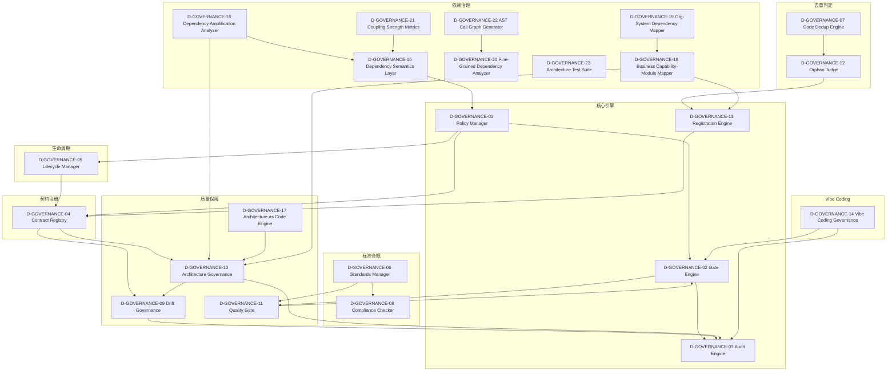

# 29 — D-GOVERNANCE 治理域

> **状态**: DRAFT | **核心层**: L01+L05+L09 | **成熟度**: 🔒 已开发（73门禁注册、85条CT契约+21条G-CT、4审计模块、46门控检查、GOV-* 8子类）
> **一句话**: 系统怎么管规则

## §0 域定义

| 维度 | 内容 |
|------|------|
| 核心Aggregate | GovernancePolicy |
| 核心事件 | E-GV-01 GatePassed / E-GV-02 GateFailed / E-GV-03 PolicyUpdated / E-GV-04 AuditAnomalyDetected |
| 特殊定位 | 横切支撑层，所有域的规则执行和审计中枢，P0优先级 |
| 与D-AUTONOMY的关系 | 自治管"AI怎么管自己"，治理管"系统怎么管规则" |
| 开发状态 | 已开发——9/14子模块已实现，5个待建 |
| 优先级 | P0（Phase 0之后，自治域就绪即启动） |
| 激活前提 | D-AUTONOMY就绪（Phase 0之后） |

## §1 子模块清单

| ID | 名称 | 职责 | 优先级 | 开发状态 | 对标依据 |
|----|------|------|:------:|:--------:|---------|
| D-GOVERNANCE-01 | Policy Manager | 治理策略管理+策略CRUD+版本管理+持久化 | P0 | ✅ 部分在governance/ | GOV-*体系 |
| D-GOVERNANCE-02 | Gate Engine | 门禁引擎+73个门禁注册+46个门控检查+Pass/Fail | P0 | ✅ 已有 | gate_engine/ + gates/ |
| D-GOVERNANCE-03 | Audit Engine | 审计引擎+4个审计模块+Merkle哈希链+端到端审计 | P0 | ✅ 已有 | audit_trail/ + audit_orchestrator/ + semantic_auditor/ + behavioral_auditor/ |
| D-GOVERNANCE-04 | Contract Registry | 契约注册表+85条CT+21条G-CT+冻结+兼容性 | P0 | ✅ 部分在contracts/ | REG-FREEZE-001 |
| D-GOVERNANCE-05 | Lifecycle Manager | 生命周期管理+模块生命周期+策略生命周期+版本管理 | P1 | ✅ 已有 | lifecycle_manager/ |
| D-GOVERNANCE-06 | Standards Manager | 标准管理+元标准(PS-STD/PS-REG)+标准宪法+合规检查 | P1 | ✅ 部分在GOV-STD | PS-STD-000 |
| D-GOVERNANCE-07 | Code Dedup Engine | 代码去重+重复检测+自动合并建议 | P2 | ✅ 已有 | MOD-INF-017 |
| D-GOVERNANCE-08 | Compliance Checker | 合规检查+规则引擎+自动检查+报告 | P1 | ❌ | 与D-COMPLIANCE联动 |
| D-GOVERNANCE-09 | Drift Governance | 漂移治理+39个检测器+漂移预算+修复建议 | P1 | ✅ 部分在behavioral_auditor/ | REG-DRIFT-001 |
| D-GOVERNANCE-10 | Architecture Governance | 架构治理+蓝图-代码对齐+契约-实现漂移检测+架构测试 | P1 | ❌ | 架构决策记录 |
| D-GOVERNANCE-11 | Quality Gate | 质量门禁+8维度质量+脚本质量+代码质量 | P1 | ✅ 部分在quality-standard | SCRIPT-QUALITY-001 |
| D-GOVERNANCE-12 | Orphan Judge | 孤儿判定+未注册文件检测+自动注册建议 | P1 | ✅ 已有 | orphan_judge/ |
| D-GOVERNANCE-13 | Registration Engine | 注册引擎+scaffold.py+__init__.py+manifest+registry | P0 | ✅ 已有 | scaffold.py |
| D-GOVERNANCE-14 | Vibe Coding Governance | Vibe Coding治理+Session状态机+门禁检查+零残留 | P1 | ✅ 已有 | OPS-VC-* |
| D-GOVERNANCE-15 | AI Construction Governor | AI施工门禁 + 公式Hash门禁 + 回归截断 + 值域偏差检测 + AI改代码自动回归对比 + 偏差>阈值截断阻止传播 | P0 | ❌ | 深度6错误传播防御工事 |
| D-GOVERNANCE-16 | Dependency Semantics Layer | 依赖语义层+关系类型分类(硬依赖/软依赖/事件驱动/条件依赖/可选依赖)+语义注解+条件依赖求解+强度量化 | P1 | ❌ | AWS知识图谱实践 / Sarcouncil 2025 |
| D-GOVERNANCE-17 | Dependency Amplification Analyzer | 依赖放大效应分析+传递依赖放大倍数计算+放大热点识别+扁平化建议+趋势追踪 | P2 | ❌ | arXiv 2512.14739 |
| D-GOVERNANCE-18 | Architecture as Code Engine | 架构即代码+依赖图与可执行架构定义双向同步+AaC DSL+CI/CD门禁 | P2 | ❌ | TechTarget AaC 2025 / Azure OE:05 |
| D-GOVERNANCE-19 | Business Capability-Module Mapper | 业务能力-模块双向映射+15域185子模块↔57模块+映射覆盖率+孤立检测 | P1 | ❌ | TOGAF ADM 2026 / BizzDesign VSM |
| D-GOVERNANCE-20 | Org-System Dependency Mapper | 组织-系统依赖映射+Conway定律+团队拓扑→系统依赖图映射+认知负载映射 | P2 | ❌ | Team Topologies / Conway's Law |
| D-GOVERNANCE-21 | Fine-Grained Dependency Analyzer | 函数级依赖分析+模块级→函数级细化+膨胀依赖识别+Python AST分析 | P2 | ❌ | ACM FPDG 2024 |
| D-GOVERNANCE-22 | Coupling Strength Metrics | 依赖耦合强度度量+RMS类指标量化+模块间耦合强度+耦合趋势追踪 | P2 | ❌ | 软件学报 2023 |
| D-GOVERNANCE-23 | AST Call Graph Generator | AST调用图生成+Python AST分析→调用图→函数级依赖+pydeps/pyan集成 | P2 | ❌ | ACM FPDG 2024 / pydeps / pyan |
| D-GOVERNANCE-24 | Architecture Test Suite | 架构测试套件+依赖约束可执行测试+架构不变量验证+CI/CD门禁 | P2 | ❌ | ArchUnit / NetArchTest / pytest-archon |
| M1-S01 | 关系类型分类器 | 将DEP二元关系分类为硬/软/事件驱动/条件/可选5种语义类型 | P0 | ❌ | AWS知识图谱实践/Sarcouncil 2025 |
| M1-S02 | 语义注解引擎 | 为现有52条DEP自动注入语义标签 | P0 | ❌ | TOGAF ADM 2026 |
| M1-S03 | 条件依赖求解器 | 求解条件依赖激活条件(GPU/特性开关/环境变量) | P0 | ❌ | POPL 2024 Dependent Types |
| M1-S04 | 依赖强度量化器 | 量化每条依赖强度(0-1)：调用频率/数据流量/故障传播概率 | P0 | ❌ | 软件学报 2023 RMS指标 |
| M1-S05 | 语义变更检测器 | 检测依赖语义漂移：硬→软/新增隐式/语义降级 | P0 | ❌ | MOD-INF-023扩展 |
| M1-S06 | 语义查询接口 | 统一查询接口：按类型/强度/条件/域过滤依赖关系 | P0 | ❌ | Neo4j Cypher/GQL |
| M1-NEW-01 | Monoidal Dependency Composer | 范畴论Monoid/Monad依赖组合引擎compose(dep_a,dep_b)=dep_c | P0 | ❌ | ACM TOSEM 2024 Category-Theoretic Foundations |
| M1-NEW-02 | Dependent Type Verifier | 依赖约束编码为依赖类型DependsOn<A,B>编译期验证 | P0 | ❌ | POPL 2024 Dependent Types for Dependency Mgmt |
| M1-NEW-03 | Semantic Similarity Scorer | 基于embedding的依赖语义距离计算识别功能等价冗余依赖 | P0 | ❌ | ICSE 2025 Semantic Dependency Graphs |
| M1-NEW-04 | Event-Driven Dependency Tracer | 运行时event sourcing追踪依赖激活路径构建动态依赖图 | P0 | ❌ | IEEE TSE 2025 Event-Driven Dependency Discovery |
| M1-NEW-05 | UML/SysML Stereotype Mapper | 14种SysML依赖构造型映射到内部依赖类型系统 | P0 | ❌ | OMG SysML v2.0 (2024) Part 8 |
| M1-NEW-06 | Temporal Dependency Validator | 验证依赖声明与加载时序一致性检测dead/phantom dependency | P0 | ❌ | Kahn topological sort + tree-shaking |
| D25 | QPDG Engine | 量子程序依赖图引擎：4种量子特有依赖类型 | P0 | ❌ | IEEE Q-SE 2025 |
| D27 | Hybrid Classical-Quantum Bridge | 经典-量子混合依赖桥接 | P0 | ❌ | arXiv 2025 Quantum Dependency Graphs |
| D29 | Kleisli Effect Engine | Kleisli范畴效果组合引擎 | P0 | ❌ | ACM TOSEM 2024 |
| D76 | HW-SW Unified DAG | 硬件-软件统一依赖DAG(RTL→App) | P0 | ❌ | IEEE TCAD 2025 |
| D-GOVERNANCE-24 | Policy Impact Analyzer | 策略影响分析器：策略变更影响范围分析+影响评估+依赖影响追踪+变更风险评分+影响报告。理论：影响分析/变更管理/风险评估。具备影响分析审计/变更影响报告/策略变更合规检查 | P1 | ❌ | 影响分析/变更管理/风险评估; 自动影响推断/LLM影响评估/实时影响监控; 依赖影响分析; 影响分析审计/变更影响报告/策略变更合规 |
| D-GOVERNANCE-25 | Governance Dashboard | 治理仪表盘：治理指标可视化+门禁通过率+审计状态+合规评分+趋势分析。理论：数据可视化/治理指标/仪表盘设计。具备治理审计/指标记录/治理可视化合规检查 | P1 | ❌ | 数据可视化/治理指标/仪表盘设计; AI治理洞察/自适应仪表盘/自然语言查询; Grafana/Kibana; 治理审计/指标记录/治理可视化合规 |

## §2 域内依赖图M4-S01 | 传递依赖解析器 | 解析传递依赖链计算完整依赖图 | P0 | ❌ | — |
| M4-S02 | 放大倍数计算器 | 计算每个模块的依赖放大倍数(直接→传递) | P0 | ❌ | arXiv 2512.14739 Maven放大24.7× |
| M4-S03 | 放大热点识别器 | 识别放大>10×的高风险模块 | P0 | ❌ | — |
| M4-S04 | 扁平化建议器 | 建议依赖扁平化策略减少传递依赖 | P0 | ❌ | pnpm dedupe / pipdeptree |
| M4-S05 | 放大趋势追踪器 | 追踪依赖放大倍数随版本变化趋势 | P0 | ❌ | — |
| M4-NEW-01 | Fan-In/Fan-Out Analyzer | 扇入扇出分析：高扇入=单点故障/高扇出=膨胀源 | P0 | ❌ | IEEE TSE 2024 高fan-out bug密度3.7× |
| M4-NEW-02 | Dependency Bloat Meter | 声明vs实际使用比例/传递依赖未使用代码比例 | P0 | ❌ | ICSE 2025 Python 68%传递依赖未直接使用 |
| M4-NEW-03 | MTTU_dep / MTTR_dep Tracker | 依赖更新/修复时间追踪 | P0 | ❌ | ACM FSE 2024 中位数MTTU=46天 |
| M4-NEW-04 | Critical Path Analyzer | 依赖DAG关键路径(最长依赖链)分析 | P0 | ❌ | Google "Cores That Don't Count" 深度≥6故障率2%→34% |

### 治理/架构模块映射

| 模块标识 | 对应D-GOVERNANCE子模块 | 说明 |
|----------|----------------------|------|
| DOM-GOV-001 | D-GOVERNANCE-01 Policy Manager + D-GOVERNANCE-02 Gate Engine | 治理域总控 |
| GOV-RSTR-001 | D-GOVERNANCE-09 Drift Governance + D-GOVERNANCE-11 Quality Gate | 约束与漂移治理 |
| GOV-SUB-001 | D-GOVERNANCE-02 Gate Engine | 门禁引擎子模块 |
| GOV-SUB-002 | D-GOVERNANCE-03 Audit Engine | 审计引擎子模块 |
| GOV-SUB-003 | D-GOVERNANCE-04 Contract Registry | 契约注册表子模块 |
| GOV-SUB-004 | D-GOVERNANCE-13 Registration Engine | 注册引擎子模块 |
| GOV-AI-001 | D-GOVERNANCE-16 Dependency Semantics Layer + D-GOVERNANCE-20 Fine-Grained Dependency Analyzer | AI治理语义分析 |
| GOV-CMP-003 | D-GOVERNANCE-07 Code Dedup Engine + D-GOVERNANCE-12 Orphan Judge | 组件治理去重与孤儿检测 |
| ALPHA-SIGNAL-DOMAIN-001 | D-GOVERNANCE-18 Business Capability-Module Mapper | Alpha信号域能力映射 |
| ML-EXPERIMENT-DOMAIN-001 | D-GOVERNANCE-19 Org-System Dependency Mapper | ML实验域组织映射 |

| M4-NEW-05 | Dependency Entropy Calculator | 信息熵度量依赖图混乱度：版本/来源/维护者分布熵 | P0 | ❌ | IEEE TSE 2024 Decan |

## §2 域内依赖图
| M4-NEW-06 | Change Shock Radius Predictor | 预测依赖版本升级冲击半径 | P0 | ❌ | arXiv 2025 GNN预测AUC=0.87 |
| M4-NEW-07 | Dependency Health Scorecard | 综合评分：维护活跃度/安全/测试/文档/社区/许可证 | P0 | ❌ | OpenSSF Scorecard v5 22项指标 |
| M4-NEW-08 | Adoption Curve Modeler | 依赖版本采纳S曲线/创新扩散曲线建模 | P0 | ❌ | Rogers Diffusion of Innovations |
| M4-NEW-09 | Dependency Deduplication Advisor | 检测功能重叠依赖推荐统一方案+评估迁移成本 | P0 | ❌ | pipdeptree / npm dedupe |
| M4-NEW-10 | Ecosystem Risk Diversification Analyzer | 依赖来源集中度风险：80%依赖来自同一组织/国家 | P0 | ❌ | Nature Comp Sci 2024 1%包承载50%下游 |
| D1 | Dependency Update Latency Predictor | 依赖更新延迟预测器 | P0 | ❌ | ACM FSE 2024 |
| D2 | Dependency Adoption Pattern Analyzer | 依赖采纳模式分析器 | P0 | ❌ | Rogers Diffusion |
| M5-S01 | 图数据模型器 | 设计依赖图数据模型：节点/边/属性/约束 | P0 | ❌ | Neo4j / ArangoDB |
| M5-S02 | YAML导入器 | 将YAML注册表数据导入图数据库 | P0 | ❌ | — |
| M5-S03 | 图存储引擎 | 图数据库存储+索引+查询优化 | P0 | ❌ | Neo4j 5.x / ArangoDB |
| M5-S04 | 路径查询引擎 | 最短路径/关键路径/循环路径/影响路径查询 | P0 | ❌ | Neo4j GDS Path Finding |
| M5-S05 | 子图提取器 | 按域/模块/依赖类型提取子图 | P0 | ❌ | — |
| M5-S06 | 图推理引擎 | 路径推理/传播概率/影响分析 | P0 | ❌ | Neo4j GDS / GraphSAGE |
| M5-S08 | 图同步器 | YAML变更→图数据库增量同步 | P0 | ❌ | — |
| M5-NEW-01 | Ontology Layer Manager | 依赖图本体管理层：节点类型+边类型+属性Schema+版本演化 | P0 | ❌ | Neo4j GDS / OWL本体 |
| M5-NEW-02 | Multi-Edge Graph Store | 多边类型图存储：同一对节点间支持多种依赖边 | P0 | ❌ | ArangoDB / Neo4j 5.x |
| M5-NEW-03 | Path Query Optimizer | 路径查询优化：最短路径/关键路径/循环路径索引加速 | P0 | ❌ | Neo4j GDS Path Finding |
| M5-NEW-04 | Temporal Dependency Graph | 时序依赖图：依赖关系随版本/时间演化 | P0 | ❌ | Unterweger 2025 Temporal Analysis |
| M5-NEW-05 | Semantic Dependency Detector | 基于LLM embedding发现隐式语义依赖(+23%) | P0 | ❌ | ICSE 2025 Semantic Dependency Graphs |
| M5-NEW-06 | GraphRAG Query Interface | 自然语言→图查询→社区摘要+分层推理 | P0 | ❌ | Microsoft GraphRAG / ACM MIDAS 2025 |
| M5-NEW-07 | Anti-Pattern Detector | 图反模式检测：中心化节点/循环依赖/星型爆炸/链式过深 | P0 | ❌ | Neo4j GDS + 自定义规则 |
| M5-NEW-08 | Incremental Sync Engine | YAML变更→增量图更新(非全量重建) | P0 | ❌ | Facebook Glean 2024 / Sourcegraph SCIP |
| M5-NEW-09 | Homomorphic Dependency Calculator | 同态加密依赖计算器：加密状态下执行依赖图查询/推理 | P0 | ❌ | ACM TODAES 2025 Walrus+HELM / Zama 2025 |
| D8 | Dependency Temporal Evolution Analyzer | 依赖时间演化分析器 | P0 | ❌ | Unterweger 2025 |
| D14 | Homomorphic Dependency Calculator | 同态加密依赖计算器 | P0 | ❌ | ACM TODAES 2025 |
| D34 | Indexed Graded Monad Tracker | 索引分级Monad追踪器 | P0 | ❌ | POPL 2024 |
| M6-S01 | 业务域解析器 | 解析15域185子模块的业务域定义 | P0 | ❌ | — |
| M6-S02 | 技术模块解析器 | 解析57模块+52条DEP的技术域定义 | P0 | ❌ | — |
| M6-S03 | 映射规则引擎 | 执行业务域↔技术模块映射规则 | P0 | ❌ | — |
| M6-S04 | 映射发现器 | 自动发现隐式映射关系 | P0 | ❌ | TOGAF ADM 2026 |
| M6-S05 | 映射覆盖率分析器 | 量化映射覆盖率：已映射/未映射/冲突 | P0 | ❌ | — |
| M6-S06 | 孤立模块检测器 | 检测无业务映射的技术模块(技术孤岛) | P0 | ❌ | — |
| M6-NEW-01 | TOGAF Capability Mapping Automator | TOGAF能力映射自动化：业务能力→应用组件自动关联 | P0 | ❌ | TOGAF ADM 2026 |
| M6-NEW-02 | ArchiMate Capability Map Generator | ArchiMate能力图生成：动机/业务/应用/技术四层 | P0 | ❌ | ArchiMate 3.2 / Archi Tool |
| M6-NEW-03 | DDD Bounded Context Mapper | DDD限界上下文映射：上下文间关系(共享内核/防腐层) | P0 | ❌ | Vernon DDD Red Book / Context Mapper |
| M6-NEW-04 | Business Process-Service Mapper | 业务流程→微服务映射：流程步骤→服务端点自动关联 | P0 | ❌ | Camunda BPMN / Zeebe |
| M6-NEW-05 | Cross-Domain Impact Analyzer | 跨域影响分析：业务域变更→技术模块影响传播 | P0 | ❌ | TOGAF Impact Analysis |
| M6-NEW-06 | Capability Gap Detector | 能力缺口检测：业务需要但技术未实现的能力 | P0 | ❌ | TOGAF Gap Analysis |
| M6-NEW-07 | Mapping Confidence Scorer | 映射置信度评分：自动发现映射的可靠性量化 | P0 | ❌ | — |
| M6-NEW-08 | Business Event-Technical Event Correlator | 业务事件↔技术事件关联：E-SG-01↔SignalGenerated | P0 | ❌ | Event Storming / Domain Events |
| M6-NEW-09 | Mapping Version Tracker | 映射版本追踪：业务域变更→映射关系同步更新 | P0 | ❌ | — |
| M7-S01 | 价值流定义器 | 定义6域核心价值链的端到端价值流 | P0 | ❌ | ValueBlue VSM 2026 |
| M7-S02 | 流依赖提取器 | 从依赖图提取价值流内的依赖关系 | P0 | ❌ | — |
| M7-S03 | 瓶颈识别器 | 识别价值流中的依赖瓶颈和单点故障 | P0 | ❌ | — |
| M7-S04 | 流延迟分析器 | 分析价值流各环节延迟和总延迟 | P0 | ❌ | — |
| M7-S05 | 流健康评分器 | 评分价值流健康度：延迟/瓶颈/覆盖率/韧性 | P0 | ❌ | — |
| M7-NEW-01 | SAFe Value Stream Dependency Mapper | SAFe价值流依赖映射：跨价值流依赖识别与协调 | P0 | ❌ | SAFe 6.0 Value Stream |
| M7-NEW-02 | Lean Flow Efficiency Calculator | 精益流效率计算：增值时间/总前置时间→流效率百分比 | P0 | ❌ | Lean Analytics / Flow Framework |
| M8-NEW-10 | Lineage Impact Simulator | 血缘影响仿真：上游变更对下游血缘链的影响预测 | P0 | ❌ | dbt + Lineage Graph |
| M9-S01 | 变更传播分析器 | 分析模块变更在依赖图中的传播路径 | P1 | ❌ | — |
| M9-S02 | 影响范围计算器 | 计算变更影响范围：受影响模块数/严重度/修复工时 | P1 | ❌ | — |
| M9-S03 | 影响严重度评估器 | 评估变更影响严重度：数据流/控制流/性能/安全 | P1 | ❌ | — |
| M9-S04 | 修复建议生成器 | 基于影响分析生成修复建议 | P1 | ❌ | — |
| M9-S06 | 影响历史追踪器 | 追踪历史变更影响记录用于预测 | P1 | ❌ | — |
| M9-NEW-01 | Semantic Change Propagation Analyzer | 基于代码语义(非语法AST)的变更传播分析 | P1 | ❌ | Google Smart Changes 2025 / Meta Static Analysis |
| M9-NEW-02 | Cross-Repo Monorepo Impact Analyzer | 跨仓库影响范围预测 | P1 | ❌ | Google Tricorder 2025 / CodeQL Multi-Repo |
| M9-NEW-03 | AI-Generated Code Impact Predictor | AI生成代码的变更影响模式与人工代码不同 | P1 | ❌ | DeepSeek CodeV2 / GitHub Copilot Impact Preview |
| M9-NEW-04 | Config Drift Impact Analyzer | YAML/JSON配置变更的影响分析 | P1 | ❌ | K8s Diff/Plan / Terraform Plan Impact |
| M9-NEW-05 | Incremental Impact Graph Update Engine | 增量影响图更新：只更新变更触及的子图 | P1 | ❌ | Facebook Glean 2024 / Sourcegraph SCIP 2025 |
| D4 | Architecture Tech Debt Tracker | 架构技术债追踪器 | P1 | ❌ | IEEE TSE 2024 Tech Debt Interest |
| D10 | Tech Debt Compound Effect Modeler | 技术债复利效应建模器 | P1 | ❌ | IEEE TSE 2024 Besker |
| D47 | Migration Dependency Graph Manager | 迁移依赖图管理器 | P1 | ❌ | — |
| D71 | GA Multi-Objective Refactoring | 遗传算法多目标重构 | P1 | ❌ | O'Keeffe 2025 GA Pareto |
| D26 | Entanglement-Aware Scheduler | 量子纠缠感知调度器 | P1 | ❌ | IEEE Q-SE 2025 |
| M11-S01 | 契约版本注册器 | 注册契约版本号和兼容性矩阵 | P1 | ❌ | — |
| M11-S02 | 兼容性矩阵维护器 | 维护版本间兼容性矩阵(向前/向后/全兼容) | P1 | ❌ | — |
| M11-S03 | 升级路径规划器 | 规划安全升级路径 | P1 | ❌ | — |
| M11-S04 | 破坏性变更检测器 | 检测破坏性变更：字段删除/类型变更/语义变更 | P1 | ❌ | — |
| M11-S05 | 版本冲突解决器 | 解决多模块间的版本冲突 | P1 | ❌ | — |
| M11-NEW-01 | AI Model Contract Versioner | AI模型作为契约的版本管理：模型签名/schema演化 | P1 | ❌ | MLflow Model Registry v3 / W&B |
| M11-NEW-02 | Schema Evolution Auto-Verifier | Schema演化自动兼容性验证：向前/向后/全兼容三级 | P1 | ❌ | Confluent Schema Registry / Avro/Protobuf |
| M11-NEW-03 | Contract Deprecation Lifecycle Manager | 契约废弃完整生命周期：deprecated→sunset→removed | P1 | ❌ | Google AIP-192 / Stripe API Versioning |
| M11-NEW-04 | Cross-Contract Consistency Checker | 多契约间一致性约束：CTR-001~006版本必须同步升级 | P1 | ❌ | OpenAPI 3.2 Link/Param / gRPC AIP |
| M11-NEW-05 | Contract Change Impact Previewer | 契约变更前"干跑"预览：展示受影响模块/脚本/测试 | P1 | ❌ | Terraform Plan / K8s Dry-Run |
| M15-NEW-05 | Quantum Error Propagation Modeler | 量子计算误差传播建模(D28增强) | P1 | ❌ | IBM Quantum / PRX Quantum 2025 |
| D28 | Quantum Error Propagation Tracer | 量子误差传播追踪器 | P1 | ❌ | PRX Quantum 2025 |
| M37-S01 | Command Side Modeler | 建模命令侧依赖关系 | P1 | ❌ | Axon Framework / EventStoreDB |
| M37-S02 | Query Side Modeler | 建模查询侧依赖关系 | P1 | ❌ | Axon Framework |
| M37-NEW-04 | Command-Query Dependency Conflict Detector | 命令-查询依赖冲突检测器 | P1 | ❌ | — |
| M37-NEW-06 | Aggregate Boundary Dependency Validator | 聚合边界依赖验证器 | P1 | ❌ | Greg Young 2024 |
| M43-S01 | OpenAPI Dependency Extractor | OpenAPI规范→依赖图自动提取，解析paths/components/links生成API级依赖关系 | P1 | ❌ | OpenAPI 3.2 |
| M43-S02 | API Version Compatibility Checker | API版本兼容性检查，检测破坏性变更和版本兼容性矩阵 | P1 | ❌ | Pact.io |
| M43-S05 | API Deprecation Tracker | API废弃追踪，跟踪已废弃/即将废弃的API端点及迁移路径 | P1 | ❌ | Google AIP-192 / Stripe |
| M43-NEW-01 | OpenAPI Dependency Graph Auto-Builder | OpenAPI依赖图自动构建，从OpenAPI 3.2规范自动生成完整的API级依赖图 | P1 | ❌ | OpenAPI 3.2 Spec 2025 |
| M43-NEW-02 | API Versioning Dependency Impact Analyzer | API版本化依赖影响分析，版本升级时的依赖链影响传播分析 | P1 | ❌ | Google SRE Weekly 2024 |
| M43-NEW-03 | API Contract Dependency Drift Detector | API契约依赖漂移检测，检测实际API行为与契约声明之间的依赖漂移 | P1 | ❌ | Stripe API Versioning 2024 |
| M43-NEW-04 | GraphQL Resolver Dependency Optimizer | GraphQL Resolver依赖优化器，分析resolver间依赖关系并优化查询性能 | P1 | ❌ | GraphQL Foundation 2024 |
| M43-NEW-06 | gRPC Service Dependency Mesh Mapper | gRPC服务依赖网格映射，基于proto定义自动构建gRPC服务间依赖网格 | P1 | ❌ | gRPC / Envoy |
| D36 | 依赖会话类型验证器 | 会话类型依赖先前交互值编译期验证协议依赖图 | P1 | ❌ | ECOOP 2024 / CONCUR 2026 |
| D31 | 左Kan扩展依赖解析器 | 左Kan扩展=最小保守扩展最少新增依赖的解析结果 | P2 | ❌ | TAC/arXiv 2025 Kan Extensions |
| D32 | 光学双向依赖同步器 | Adapter=无副作用双向/Lens=单焦点读写/Prism=条件性双向 | P2 | ❌ | Haskell Symposium 2026 Optics |
| D33 | 依赖效果类型检查器 | IO{read:A,write:B}C编译期验证依赖图无环+效果一致 | P2 | ❌ | ESOP 2025 Dependent Effects |
| D37 | 需求-代码双向追溯引擎 | LLM自动建立需求代码测试语义链接F1提升23%；双向检索 | P2 | ❌ | IEEE RE 2025 |
| D40 | 数字线程完整性评分器 | 数字线程=跨生命周期阶段依赖图；SysML映射；线程完整性分数 | P2 | ❌ | INCOSE Insight 2025 |
| D45 | 依赖地狱5维检测器 | 深度/广度/聚类系数/版本分歧度/传播半径5维检测；68%项目存在症状 | P2 | ❌ | EMSE 2024 |
| D48 | 依赖漂移距离度量器 | 依赖漂移=实际版本与最新安全补丁版本距离；>2主版本漂移应告警 | P2 | ❌ | JSS 2025 |
| D61 | GAT变更影响预测器 | DepGNN用GAT学习模块间依赖拓扑特征预测变更传播路径F1提升23% | P2 | ❌ | ICSE 2024 DepGNN |
| D63 | 隐式依赖GNN发现器 | Terraform/CloudFormation资源关系建模为DAGGNN预测隐式依赖17%配置存在未声明隐式依赖 | P2 | ❌ | NeurIPS Workshop 2024 |
| D70 | ACO多路径依赖搜索器 | ACO信息素模型10K+节点依赖图比Dijkstra快3.2x+发现多条可行升级路径 | P2 | ❌ | ICSE 2025 |
| D72 | PSO隐式依赖发现器 | 粒子群优化动态发现运行时隐式依赖(环境变量/共享缓存)50系统发现23%未记录依赖 | P2 | ❌ | ACM FSE 2025 |
| D81 | 反馈依赖环检测器 | 自改进AI反馈闭环良性循环(收敛)vs恶性循环(发散)Lyapunov稳定性分析判定 | P2 | ❌ | ICSE 2026 |
| D84 | 文档漂移反模式检测器 | 6种文档漂移反模式(Orphan/Stale/Phantom/Duplication/Inconsistent/Hidden)+DriftScore量化 | P2 | ❌ | JSS 2025 |
| NEW-M17-N04 | Python Import Graph Builder | 构建Python import语句完整依赖图含re-export链 | P2 | ❌ | Pydeps/pylint dependency graph |
| NEW-M17-N05 | Dead Code Dependency Pruner | 死代码依赖修剪：识别未被任何入口调用的依赖子图 | P2 | ❌ | ICSE 2025 Dead Code Elimination |
| NEW-M36-N01 | PubGrub Version Solver | PubGrub版本求解器：O(n log n)版本约束求解 | P2 | ❌ | Dart PubGrub/Poetry resolver |
| NEW-M36-N02 | SAT-based Dependency Resolver | SAT求解器版本约束：NP完全问题高效近似求解 | P2 | ❌ | ICSE 2024 SAT Dependency Resolution |
| NEW-M28-N01 | Incremental Graph Recomputer | 增量图重算：依赖变更时只重算受影响子图 | P2 | ❌ | OSDI 2024 Build Systems |
| NEW-M28-N02 | Graph Partitioning Optimizer | 图分区优化：大规模依赖图分区并行计算 | P2 | ❌ | IEEE BigData 2025 Graph Partitioning |
| NEW-M50-N01 | Multi-Turn Dependency Query Engine | 多轮依赖查询引擎：上下文感知的依赖图对话查询 | P2 | ❌ | ACL 2025 Conversational KGQA |
| NEW-M50-N02 | Dependency Graph Summarizer | 依赖图摘要器：自动生成依赖图结构摘要 | P2 | ❌ | EMNLP 2025 Graph Summarization |
| NEW-M54-N01 | Team Cognitive Load Dependency Calculator | 团队认知负荷依赖计算器：依赖复杂度团队认知负荷映射 | P2 | ❌ | Team Topologies/Skelton 2025 |
| NEW-M54-N02 | Cross-Team Dependency SLA Manager | 跨团队依赖SLA管理器：团队间依赖响应时间SLA | P2 | ❌ | Jira Service Management/PagerDuty |
| NEW-M64-N01 | Consumer-Driven Contract Dependency Tester | 消费者驱动契约依赖测试：消费者定义契约提供者验证 | P2 | ❌ | Pact/Pact-Broker |
| NEW-M64-N02 | Schema Registry Dependency Validator | Schema注册表依赖验证：Schema演化依赖兼容性验证 | P2 | ❌ | Confluent Schema Registry/Protobuf |
| NEW-M23-N01 | Architecture Fitness Function Evaluator | 架构适应度函数评估器：依赖图架构适应度函数自动评估 | P2 | ❌ | Building Evolutionary Architectures 2025 |
| NEW-M23-N02 | Architecture Decision Dependency Tracker | 架构决策依赖追踪：ADR间依赖关系追踪 | P2 | ❌ | ADR Tools/Log4brains |
| NEW-M26-N02 | Decision Debt Dependency Tracker | 决策债务依赖追踪：被推翻的决策遗留依赖追踪 | P2 | ❌ | IEEE Software 2025 Decision Debt |
| NEW-M17-N06 | Cross-Language Dependency Graph Builder | 跨语言依赖图构建：Python/C/C++/Rust FFI调用链追踪 | P2 | ❌ | PyO3/cffi/SWIG |
| M17-S01 | AST解析器 | 解析Python AST构建语法树提取函数级依赖 | P2 | ❌ | ACM 2024 Bloat beneath Python's Scales |
| M17-S02 | 调用图构建器 | 基于AST构建函数调用图 | P2 | ❌ | — |
| M17-S03 | 膨胀依赖检测器 | 检测声明但未实际使用的膨胀依赖 | P2 | ❌ | ACM 2024 Python 68%传递依赖未直接使用 |
| M17-S04 | 未使用依赖清理器 | 自动清理未使用的依赖声明 | P2 | ❌ | pipdeptree/npm dedupe |
| M17-S05 | 调用图可视化器 | 可视化函数调用图 | P2 | ❌ | ECharts/Cytoscape.js |
| M17-NEW-01 | Python动态调用图采集器 | 覆盖getattr/装饰器/元类等动态特性调用图采集 | P2 | ❌ | ICSE 2025 Semantic Dependency Graphs |
| M17-NEW-02 | 膨胀依赖自动清理器 | 自动识别并清理膨胀依赖 | P2 | ❌ | ACM 2024 Python依赖膨胀 |
| M17-NEW-03 | Python动态特性覆盖率分析器 | 量化静态分析对Python动态特性覆盖率 | P2 | ❌ | — |
| M18-S01 | RMS计算器 | 计算RMS耦合强度指标 | P2 | ❌ | 软件学报 2023 RMS指标 |
| M18-S02 | 耦合热力图 | 可视化模块间耦合强度分布 | P2 | ❌ | Neo4j Bloom |
| M18-S03 | 耦合趋势追踪器 | 追踪耦合强度随版本变化趋势 | P2 | ❌ | — |
| M18-S04 | 解耦建议器 | 基于耦合分析提出解耦建议 | P2 | ❌ | — |
| M18-NEW-01 | 依赖网络幂律分布分析器 | 分析依赖网络幂律分布识别关键枢纽 | P2 | ❌ | Nature Comp Sci 2024 1%包承载50%下游 |
| M18-NEW-02 | 耦合趋势预测器 | 基于历史数据预测耦合强度变化趋势 | P2 | ❌ | IEEE TSE 2024 Decan |
| M18-NEW-03 | 解耦ROI计算器 | 计算解耦重构投资回报率 | P2 | ❌ | — |
| M18-NEW-04 | 代码熵漂移检测器 | Shannon熵量化代码漂移和技术债 | P2 | ❌ | Entropyx 2026 |
| M18-NEW-05 | 依赖健康评分器 | OpenSSF Scorecard 18维度安全评分 | P2 | ❌ | OpenSSF Scorecard/Synopsys 2025 OSSRA |
| M19-S01 | 蓝图解析器 | 解析蓝图YAML提取模块定义 | P2 | ❌ | — |
| M19-S02 | 代码解析器 | 解析代码文件提取模块实现 | P2 | ❌ | — |
| M19-S03 | 追溯链构建器 | 构建蓝图→代码双向追溯链 | P2 | ❌ | — |
| M19-S04 | 漂移检测器 | 检测蓝图与代码间漂移 | P2 | ❌ | — |
| M19-S05 | 追溯可视化器 | 可视化蓝图-代码追溯链 | P2 | ❌ | Neo4j Bloom |
| M19-NEW-01 | 数字线程完整性评分增强 | 数字线程跨生命周期完整性评分 | P2 | ❌ | INCOSE Insight 2025 |
| M19-NEW-02 | 双向追溯AI辅助 | LLM辅助自动建立蓝图-代码语义链接 | P2 | ❌ | IEEE RE 2025 F1+23% |
| M19-NEW-03 | 蓝图-代码语义对齐器 | 蓝图YAML→Python代码语义映射对齐 | P2 | ❌ | — |
| M23-S01 | AaC DSL解析器 | 解析架构即代码DSL定义 | P2 | ❌ | HashiCorp HCL |
| M23-S02 | 架构约束定义器 | 定义架构约束规则和不变量 | P2 | ❌ | — |
| M23-S03 | 漂移检测器 | 检测实际架构与定义架构漂移 | P2 | ❌ | Terraform Plan/K8s Diff |
| M23-S04 | 自动修复器 | 自动修复架构漂移 | P2 | ❌ | — |
| M23-S05 | CI/CD集成器 | 将架构约束集成到CI/CD | P2 | ❌ | GitHub Actions/GitLab CI |
| M23-NEW-01 | GitOps依赖解析增强 | 声明式GitOps依赖解析+运行时验证 | P2 | ❌ | USENIX ATC 2025 |
| M23-NEW-02 | 架构约束DSL编译器 | 编译架构约束DSL为可执行规则 | P2 | ❌ | — |
| M23-NEW-03 | 漂移自动修复器 | 检测到漂移后自动修复 | P2 | ❌ | Terraform Drift Detection |
| M25-S01 | 自然语言解析器 | 解析自然语言查询为图查询 | P2 | ❌ | Microsoft GraphRAG |
| M25-S02 | 图查询转换器 | 将自然语言转换为图数据库查询 | P2 | ❌ | ACM MIDAS 2025 |
| M25-S03 | 社区发现器 | 发现依赖图社区结构 | P2 | ❌ | Neo4j GDS |
| M25-S04 | 分层摘要器 | 生成分层社区摘要 | P2 | ❌ | Microsoft GraphRAG |
| M33-S01 | 服务目录 | 注册和发现内部服务和依赖 | P2 | ❌ | Backstage (Spotify) |
| M33-S02 | Golden Path模板 | 提供标准化项目创建模板 | P2 | ❌ | Backstage Templates |
| M33-S03 | 技术雷达 | 追踪技术采纳状态和依赖趋势 | P2 | ❌ | ThoughtWorks Tech Radar |
| M33-S05 | 自助服务门户 | 开发者自助创建和管理资源 | P2 | ❌ | Backstage/Port |
| M34-S01 | 组织拓扑解析器 | 解析组织结构拓扑 | P2 | ❌ | Conway's Law |
| M34-S02 | Conway定律映射器 | 映射组织结构与系统依赖对齐 | P2 | ❌ | Team Topologies |
| M34-S03 | 认知负载评估器 | 评估团队认知负载 | P2 | ❌ | Team Topologies |
| M34-S04 | 团队边界建议器 | 基于依赖分析建议团队边界 | P2 | ❌ | Team Topologies |
| M25-NEW-01 | 情景记忆检索增强 | 情景记忆依赖检索+邻接上下文扩展 | P2 | ❌ | MemMachine arXiv 2604.04853 |
| M25-NEW-02 | CoT逻辑验证增强 | 依赖推理链一阶逻辑验证 | P2 | ❌ | VeriCoT ICLR 2026 |
| M25-NEW-03 | 社区检测质量评估器 | 评估社区检测算法质量和稳定性 | P2 | ❌ | GraphRAG推理幻觉研究 |
| M26-S01 | ADR解析器 | 解析ADR文档 | P2 | ❌ | adr-kit/Log4brains |
| M26-S02 | 依赖约束提取器 | 从ADR提取依赖约束 | P2 | ❌ | — |
| M26-S03 | 双向关联器 | 建立ADR与依赖图双向关联 | P2 | ❌ | AWS ADR Guidance 2026 |
| M26-S04 | 约束校验器 | 校验依赖是否满足ADR约束 | P2 | ❌ | — |
| M26-S05 | 变更影响推演器 | 推演ADR变更对依赖图影响 | P2 | ❌ | — |
| M26-NEW-01 | 需求-代码双向追溯增强 | LLM自动建立需求→代码语义链接 | P2 | ❌ | IEEE RE 2025 |
| M26-NEW-02 | 文档-代码依赖图增强 | 文档=依赖图一等公民+双向追踪 | P2 | ❌ | IEEE Software 2025 |
| M26-NEW-03 | ADR间隐含依赖提取器 | 提取ADR决策间隐含依赖 | P2 | ❌ | — |
| M61-S01 | 环路检测器 | 检测依赖图环路 | P2 | ❌ | OAJI 2023 SCC算法 |
| M61-S02 | 死锁预测器 | 预测依赖图潜在死锁 | P2 | ❌ | Temporal/AWS Step Functions |
| M61-S03 | 循环依赖消除器 | 自动消除循环依赖 | P2 | ❌ | OAJI 2023 Iterative Cyclic |
| M61-S04 | 条件依赖求解器 | 求解条件依赖激活条件 | P2 | ❌ | — |
| M61-S05 | 推理规则引擎 | 执行依赖语义推理规则 | P2 | ❌ | — |
| M61-NEW-01 | 依赖效果类型检查增强器 | IO{read:A,write:B}C→编译期验证依赖图无环 | P2 | ❌ | ESOP 2025 Dependent Effects |
| M61-NEW-02 | 循环依赖反模式增强器 | SCC算法+防腐层+DDD限界上下文 | P2 | ❌ | OAJI 2023 |
| M61-NEW-03 | 依赖地狱5维增强器 | 深度/广度/聚类系数/版本分歧度/传播半径 | P2 | ❌ | EMSE 2024 |
| M61-NEW-04 | 反馈环检测增强器 | Lyapunov稳定性分析判定收敛/发散 | P2 | ❌ | ICSE 2026 |
| M61-NEW-05 | 神经符号依赖验证门 | 依赖推理CSP验证：结构+几何+逻辑三重一致性 | P2 | ❌ | Eidoku arXiv 2512.20664 |
| M63-S01 | 静态分析器 | 静态分析发现声明依赖 | P2 | ❌ | Safety/pip-audit |
| M63-S02 | 动态采集器 | 动态采集运行时依赖 | P2 | ❌ | eBPF/PySpy |
| M63-S03 | AI语义推断器 | AI推断隐式语义依赖 | P2 | ❌ | ICSE 2025 +23%隐式依赖 |
| M63-S04 | 配置依赖发现器 | 发现配置文件中的依赖 | P2 | ❌ | Checkov/tfsec |
| M63-S05 | 环境依赖发现器 | 发现环境变量等隐式依赖 | P2 | ❌ | — |
| M63-NEW-01 | LLM幻觉依赖验证增强器 | CodeHalu 4类幻觉验证+VerificationOracle | P2 | ❌ | AAAI 2025 CodeHalu |
| M63-NEW-02 | 幻觉包名交叉验证增强器 | 跨生态包名交叉验证9%Python幻觉名在npm有效 | P2 | ❌ | USENIX Security 2025 |
| M63-NEW-03 | 隐式依赖GNN增强器 | GNN预测隐式依赖17%配置存在未声明隐式依赖 | P2 | ❌ | NeurIPS Workshop 2024 |
| M63-NEW-04 | PSO隐式发现增强器 | PSO动态发现运行时隐式依赖50系统发现23%未记录 | P2 | ❌ | ACM FSE 2025 |
| M68-S01 | 路径索引器 | 索引图路径加速查询 | P2 | ❌ | Neo4j GDS Path Finding |
| M68-S02 | 子图同构引擎 | 子图同构匹配引擎 | P2 | ❌ | ICSE 2024 DepGNN |
| M68-S03 | GNN推理器 | 图神经网络推理引擎 | P2 | ❌ | ICSE 2024 DepGNN F1+23% |
| M68-S04 | 传播概率计算器 | 计算依赖传播概率 | P2 | ❌ | Nature Communications 2024 |
| M68-S05 | 推理缓存器 | 缓存推理结果加速重复查询 | P2 | ❌ | — |
| M68-NEW-01 | LLM增强图推理器 | LLM增强图推理能力 | P2 | ❌ | Microsoft GraphRAG |
| M68-NEW-02 | 时序KG推理器 | 时序知识图谱推理 | P2 | ❌ | JMLR 2023 Temporal GNN |
| M68-NEW-03 | 因果图发现引擎 | 从依赖图发现因果关系 | P2 | ❌ | OSDI 2024 MicroRCA |
| M68-NEW-04 | Graph Transformer推理器 | Graph Transformer架构推理 | P2 | ❌ | NeurIPS 2024 Graph Transformer |
| M68-NEW-05 | 子图采样加速器 | 子图采样加速大规模图推理 | P2 | ❌ | GraphSAGE |
| M68-NEW-06 | 多跳路径解释器 | 解释多跳推理路径 | P2 | ❌ | LogicGraph arXiv 2602.21044 |
| M68-NEW-07 | ACO多路径依赖搜索器 | ACO信息素模型比Dijkstra快3.2x+多路径发现 | P2 | ❌ | ICSE 2025 |
| M69-S01 | 依赖扁平化器 | 扁平化传递依赖减少放大 | P2 | ❌ | npm dedupe/pipdeptree |
| M69-S02 | 传递依赖锁定器 | 锁定传递依赖版本 | P2 | ❌ | pip freeze/npm shrinkwrap |
| M69-S03 | 放大热点拆分器 | 拆分放大热点模块 | P2 | ❌ | — |
| M69-S04 | 轻量替代推荐器 | 推荐轻量级替代依赖 | P2 | ❌ | Bundlephobia/pkgsize |
| M69-S05 | 缓解效果评估器 | 评估放大缓解效果 | P2 | ❌ | — |
| M69-NEW-01 | 传递依赖锁定策略引擎 | 多策略传递依赖锁定 | P2 | ❌ | pip-compile/poetry lock |
| M69-NEW-02 | 依赖去重分析器 | 分析功能重叠依赖并去重 | P2 | ❌ | pipdeptree/npm dedupe |
| M69-NEW-03 | 膨胀预警器 | 预警依赖膨胀风险 | P2 | ❌ | arXiv 2512.14739 放大24.7× |
| M69-NEW-04 | 可选依赖降级器 | 降级可选依赖减少放大 | P2 | ❌ | — |
| M69-NEW-05 | 替换推荐器 | 推荐放大更低的替代依赖 | P2 | ❌ | Bundlephobia |
| M69-NEW-06 | monorepo提升优化器 | monorepo依赖提升优化 | P2 | ❌ | pnpm/Rush |
| M73-S01 | AaC DSL编译器 | 编译架构即代码DSL | P2 | ❌ | HashiCorp HCL/CUE |
| M73-S02 | CI/CD门禁生成器 | 从AaC定义生成CI/CD门禁 | P2 | ❌ | GitHub Actions/GitLab CI |
| M73-S03 | 漂移检测器 | 检测架构定义与实现漂移 | P2 | ❌ | Terraform Plan |
| M73-S04 | 自动修复器 | 自动修复架构漂移 | P2 | ❌ | — |
| M73-S05 | 编译报告器 | 生成AaC编译报告 | P2 | ❌ | — |
| M73-NEW-01 | C4 Model DSL编译器 | C4模型DSL编译器 | P2 | ❌ | Structurizr/C4 Model |
| M73-NEW-02 | 架构约束验证器 | 验证架构约束 | P2 | ❌ | ArchUnit |
| M73-NEW-03 | 多视图生成器 | 从AaC定义生成多架构视图 | P2 | ❌ | Structurizr |
| M73-NEW-04 | DSL LSP服务器 | AaC DSL语言服务器协议 | P2 | ❌ | LSP/VS Code Extension |
| M73-NEW-05 | 变更影响编译器 | 编译变更影响分析 | P2 | ❌ | ESEC/FSE 2024 |
| M73-NEW-06 | 架构→代码双向同步器 | 架构定义与代码实现双向同步 | P2 | ❌ | IEEE Software 2025 |
| M75-S01 | 依赖图索引构建器 | 构建依赖图GraphRAG索引 | P2 | ❌ | Microsoft GraphRAG |
| M75-S02 | 多跳查询引擎 | 多跳依赖查询引擎 | P2 | ❌ | Neo4j GDS |
| M75-S03 | 变更RAG增强器 | 变更影响RAG增强推理 | P2 | ❌ | Microsoft GraphRAG |
| M75-S04 | 社区摘要生成器 | 生成依赖社区摘要 | P2 | ❌ | Microsoft GraphRAG |
| M75-S05 | 推理结果验证器 | 验证GraphRAG推理结果 | P2 | ❌ | VeriCoT ICLR 2026 |
| M75-NEW-01 | 依赖关系推理器 | 推理隐式依赖关系 | P2 | ❌ | Microsoft GraphRAG |
| M75-NEW-02 | 缺失依赖推断器 | 推断缺失依赖关系 | P2 | ❌ | ICSE 2025 +23%隐式依赖 |
| M75-NEW-03 | 冗余依赖检测器 | 检测冗余依赖关系 | P2 | ❌ | — |
| M75-NEW-04 | 优化建议器 | 基于推理结果提出优化建议 | P2 | ❌ | — |
| M75-NEW-05 | 推理报告器 | 生成推理分析报告 | P2 | ❌ | — |
| M75-NEW-06 | 增量索引一致性检查器 | 检查增量索引一致性 | P2 | ❌ | — |
| M76-S01 | ADR影响传播仿真器 | 仿真ADR变更影响传播 | P2 | ❌ | AWS ADR Guidance 2026 |
| M76-S02 | 多ADR交互分析器 | 分析多个ADR间交互影响 | P2 | ❌ | — |
| M76-S04 | 回溯分析器 | 回溯分析ADR决策 | P2 | ❌ | — |
| M76-NEW-01 | ADR变更仿真器 | 仿真ADR变更影响 | P2 | ❌ | AWS ADR Guidance 2026 |
| M76-NEW-02 | 决策影响量化器 | 量化ADR决策影响范围 | P2 | ❌ | — |
| M76-NEW-03 | 多方案对比器 | 对比多个ADR方案 | P2 | ❌ | — |
| M76-NEW-04 | 决策回滚仿真器 | 仿真ADR决策回滚 | P2 | ❌ | — |
| M7-NEW-03 | Value Stream Digital Twin | 价值流数字孪生：端到端价值流数字化映射+实时同步+瓶颈模拟 | P1 | ❌ | ValueBlue VSM 2026 |
| M7-NEW-04 | Cross-Team Dependency Manager | 跨团队依赖管理：团队间依赖关系管理+协作契约+冲突协调 | P1 | ❌ | Team Topologies |
| M7-NEW-08 | End-to-End Latency Budget Allocator | 端到端延迟预算分配：全链路延迟预算分解+分配优化+监控 | P1 | ❌ | Google SRE Book |
| M54-S01 | 变更频率分析器 | 变更频率分析：模块变更频率统计+趋势分析+热点识别 | P1 | ❌ | — |
| M54-S02 | 团队边界推断器 | 团队边界推断：基于代码所有权推断团队边界+职责划分 | P1 | ❌ | Conway's Law |
| M54-S03 | 认知负载映射器 | 认知负载映射：团队认知负载映射+依赖复杂度关联+优化建议 | P1 | ❌ | Team Topologies |
| M54-S04 | Bus Factor计算器 | Bus Factor计算：关键人员依赖度计算+风险量化+缓解建议 | P1 | ❌ | — |
| M54-NEW-01 | 逆Conway机动自动化器 | 逆Conway机动自动化：自动调整架构以匹配目标团队结构 | P1 | ❌ | Team Topologies / Inverse Conway Maneuver |
| M54-NEW-02 | Conway漂移检测器 | Conway漂移检测：检测团队结构与架构的实际不匹配度 | P1 | ❌ | Conway's Law |
| M54-NEW-03 | 团队API契约追踪器 | 团队API契约追踪：团队间API契约定义+版本追踪+合规检查 | P1 | ❌ | — |
| M75-S06 | 增量索引更新器 | 增量索引更新：依赖图索引增量更新+实时同步+一致性保证 | P1 | ❌ | Facebook Glean 2024 |

## §2 域内依赖图



## §3 域间依赖

| 消费什么 | 来自哪个域 | 契约/事件 | 类型 |
|---------|-----------|---------|:----:|
| 权限决策 | D-AUTONOMY | PermissionGuard接口 | H |
| 审计上下文 | D-AUTONOMY | AuditLogger接口 | H |
| 安全策略 | D-SECURITY | 安全扫描结果 | S |
| 依赖语义数据 | D-KNOWLEDGE | 依赖语义数据 | S |

| 产出什么 | 去往哪个域 | 契约/事件 | 类型 |
|---------|-----------|---------|:----:|
| GateResult | *(all) | GateEngine接口 | H |
| AuditRecord | D-AUTONOMY | AuditLogger接口 | H |
| ContractVersion | D-INTEGRATION | ContractRegistry接口 | H |
| PolicyUpdate | *(all) | E-GV-03 | E |

## §4 域事件流

| 事件ID | 事件名 | 触发条件 | 消费者 |
|--------|--------|---------|--------|
| E-GV-01 | GatePassed | 门禁检查通过 | D-AUTONOMY(审计), *(all)(放行) |
| E-GV-02 | GateFailed | 门禁检查失败 | D-AUTONOMY(审计+升级), *(all)(阻断) |
| E-GV-03 | PolicyUpdated | 治理策略变更 | *(all)(策略刷新), G02(门禁重载), G11(质量门禁重载) |
| E-GV-04 | AuditAnomalyDetected | 审计异常检出 | D-AUTONOMY(升级评估), G09(漂移评估) |

## §5 激活前提与就绪条件

| 前提 | 就绪标准 |
|------|---------|
| D-AUTONOMY就绪 | RBAC/审计/遥测可用（Phase 0之后） |

### 内部就绪顺序

| 顺序 | 子模块 | 理由 |
|:----:|--------|------|
| 1 | D-GOVERNANCE-13 Registration Engine | 注册是所有治理的前提——文件必须先可见 |
| 2 | D-GOVERNANCE-01 Policy Manager | 策略是门禁和契约的定义来源 |
| 3 | D-GOVERNANCE-04 Contract Registry | 契约是域间通信的基础 |
| 4 | D-GOVERNANCE-02 Gate Engine | 门禁是策略的执行器 |
| 5 | D-GOVERNANCE-03 Audit Engine | 审计是门禁结果的记录器 |
| 6 | D-GOVERNANCE-12 Orphan Judge | 孤儿判定依赖注册引擎 |
| 7 | D-GOVERNANCE-06 Standards Manager | 标准是合规检查的依据 |
| 8 | D-GOVERNANCE-11 Quality Gate | 质量门禁依赖门禁引擎+标准 |
| 9 | D-GOVERNANCE-05 Lifecycle Manager | 生命周期依赖契约注册 |
| 10 | D-GOVERNANCE-09 Drift Governance | 漂移治理依赖审计引擎 |
| 11 | D-GOVERNANCE-14 Vibe Coding Governance | Session治理依赖门禁+审计 |
| 12 | D-GOVERNANCE-10 Architecture Governance | 架构治理依赖契约+漂移 |
| 13 | D-GOVERNANCE-08 Compliance Checker | 合规检查依赖标准+质量门禁 |
| 14 | D-GOVERNANCE-07 Code Dedup Engine | 去重依赖孤儿判定 |

## §6 设计决策记录

| 日期 | 决策 | 理由 | 对标来源 |
|------|------|------|---------|
| 2026-05-12 | 治理域是P0——73个门禁+85条契约+4个审计模块已有代码，必须独立 | 已有大量实现，不独立则自治域过重 | K8s Admission Webhook |
| 2026-05-12 | 治理≠自治——自治管AI行为，治理管系统规则 | 职责分离：自治是"谁来做"，治理是"怎么做" | RBAC vs Policy Engine分离 |
| 2026-05-12 | 80模块作为依赖图基础设施层挂入统一图 | 80模块是对依赖图基础设施的升级，不是新业务功能 | 场外讨论草稿v6 |
| 2026-05-12 | 门禁引擎是核心——所有域的变更都经过门禁 | 门禁是横切关注点的执行点，类似CI/CD gate | CI/CD deployment gate + K8s admission webhook |
| 2026-05-12 | 契约注册表是枢纽——域间通信的契约定义和版本管理 | 契约是域间解耦的关键，版本管理防止破坏性变更 | API versioning + schema registry |
| 2026-05-12 | Vibe Coding治理归治理域——开发方法论是治理的一部分 | Session状态机/门禁检查/零残留都是规则执行 | OPS-VC-*体系 |
| 2026-05-12 | 新增5个依赖治理子模块(G1/G4/G12/G16/G23搬入) | 依赖语义/放大分析/架构即代码/业务映射/组织映射是依赖治理核心能力 | 场外讨论草稿v6 |
| 2026-05-12 | 新增4个依赖分析子模块(M17/M18/M50/M58搬入) | 函数级分析+耦合度量+AST调用图+架构测试是依赖治理深度能力 | 场外讨论草稿v6 |
| 2026-05-13 | 新增12个M1依赖语义层子模块(M1-S01~S06+M1-NEW-01~06) | 关系类型分类/语义注解/条件求解/强度量化/语义查询+范畴论组合/依赖类型验证/语义相似度/事件驱动追踪/SysML映射/时序验证是依赖语义核心能力 | 场外讨论草稿v6 + 学术前沿 |
| 2026-05-13 | 新增D25 QPDG Engine | 量子程序依赖图引擎，4种量子特有依赖类型(叠加/纠缠/测量/量子门) | IEEE Q-SE 2025 |
| 2026-05-13 | 新增D27 Hybrid Classical-Quantum Bridge | 经典-量子混合依赖桥接，解决经典组件←→量子组件间依赖传递 | arXiv 2025 Quantum Dependency Graphs |
| 2026-05-13 | 新增D29 Kleisli Effect Engine | Kleisli范畴效果组合引擎，将monadic effect集成到依赖系统 | ACM TOSEM 2024 |
| 2026-05-13 | 新增D76 HW-SW Unified DAG | 硬件-软件统一依赖DAG，支持RTL→固件→OS→App全栈依赖追踪 | IEEE TCAD 2025 |
| 2026-05-13 | 新增M4-S02 放大倍数计算器 | 计算每个模块的依赖放大倍数(直接→传递)，识别传递依赖膨胀风险 | arXiv 2512.14739 Maven放大24.7× |
| 2026-05-13 | 新增M4-NEW-01 Fan-In/Fan-Out Analyzer | 扇入扇出分析：高扇入=单点故障/高扇出=膨胀源 | IEEE TSE 2024 高fan-out bug密度3.7× |
| 2026-05-13 | 新增M4-NEW-02 Dependency Bloat Meter | 声明vs实际使用比例/传递依赖未使用代码比例，量化依赖膨胀 | ICSE 2025 Python 68%传递依赖未直接使用 |
| 2026-05-13 | 新增M4-NEW-03 MTTU_dep / MTTR_dep Tracker | 依赖更新/修复时间追踪，评估依赖维护响应速度 | ACM FSE 2024 中位数MTTU=46天 |
| 2026-05-13 | 新增M4-NEW-05 Dependency Entropy Calculator | 信息熵度量依赖图混乱度：版本/来源/维护者分布熵 | IEEE TSE 2024 Decan |
| 2026-05-13 | 新增M4-NEW-06 Change Shock Radius Predictor | 预测依赖版本升级冲击半径 | arXiv 2025 GNN预测AUC=0.87 |
| 2026-05-13 | 新增M4-NEW-08 Adoption Curve Modeler | 依赖版本采纳S曲线/创新扩散曲线建模 | Rogers Diffusion of Innovations |
| 2026-05-13 | 新增M4-NEW-10 Ecosystem Risk Diversification Analyzer | 依赖来源集中度风险：80%依赖来自同一组织/国家 | Nature Comp Sci 2024 1%包承载50%下游 |
| 2026-05-13 | 新增D1 Dependency Update Latency Predictor | 依赖更新延迟预测器 | ACM FSE 2024 |
| 2026-05-13 | 新增D2 Dependency Adoption Pattern Analyzer | 依赖采纳模式分析器 | Rogers Diffusion |
| 2026-05-13 | 新增M5-S06 图推理引擎 | 路径推理/传播概率/影响分析，支持依赖图上的图推理能力 | Neo4j GDS / GraphSAGE |
| 2026-05-13 | 新增M9-NEW-03 AI-Generated Code Impact Predictor | AI生成代码的变更影响模式与人工代码不同的预测分析 | DeepSeek CodeV2 / GitHub Copilot Impact Preview |
| 2026-05-13 | 新增D4 Architecture Tech Debt Tracker | 架构技术债追踪器 | IEEE TSE 2024 Tech Debt Interest |
| 2026-05-13 | 新增D10 Tech Debt Compound Effect Modeler | 技术债复利效应建模器 | IEEE TSE 2024 Besker |
| 2026-05-13 | 新增D71 GA Multi-Objective Refactoring | 遗传算法多目标重构 | O'Keeffe 2025 GA Pareto |
| 2026-05-13 | 新增M5-NEW-04 Temporal Dependency Graph | 时序依赖图：依赖关系随版本/时间演化，支持时序依赖分析 | Unterweger 2025 Temporal Analysis |
| 2026-05-13 | 新增M5-NEW-05 Semantic Dependency Detector | 基于LLM embedding发现隐式语义依赖(+23%) | ICSE 2025 Semantic Dependency Graphs |
| 2026-05-13 | 新增M5-NEW-09 Homomorphic Dependency Calculator | 同态加密依赖计算器：加密状态下执行依赖图查询/推理 | ACM TODAES 2025 Walrus+HELM / Zama 2025 |
| 2026-05-13 | 新增D8 Dependency Temporal Evolution Analyzer | 依赖时间演化分析器 | Unterweger 2025 |
| 2026-05-13 | 新增D14 Homomorphic Dependency Calculator | 同态加密依赖计算器 | ACM TODAES 2025 |
| 2026-05-13 | 新增D34 Indexed Graded Monad Tracker | 索引分级Monad追踪器 | POPL 2024 |
| 2026-05-13 | 新增M6-S04 映射发现器 | 自动发现隐式映射关系，基于TOGAF架构映射方法论 | TOGAF ADM 2026 |
| 2026-05-13 | 新增D26 Entanglement-Aware Scheduler | 量子纠缠感知调度器，量子计算环境下依赖感知调度 | IEEE Q-SE 2025 |
| 2026-05-13 | 新增M15-NEW-05 Quantum Error Propagation Modeler | 量子计算误差传播建模 | IBM Quantum / PRX Quantum 2025 |
| 2026-05-13 | 新增D28 Quantum Error Propagation Tracer | 量子误差传播追踪器 | PRX Quantum 2025 |
| 2026-05-13 | 新增D36 Dependent Session Type Verifier | 依赖会话类型验证器 | ECOOP 2024 / CONCUR 2026 |
| 2026-05-14 | 融合D36 依赖会话类型验证器（参考：CONCUR 2026 Dependent Session Types） | 子模块完整清单搬入 - 补充依赖会话类型验证器来源CONCUR 2026 | 融合子模块完整清单搬入指令 |
| 2026-05-14 | 融合NEW-M17-N05 Dead Code Dependency Pruner（参考：ICSE 2025 Dead Code Elimination） | 子模块完整清单搬入 - 死代码依赖修剪，识别未被任何入口调用的依赖子图 | 融合子模块完整清单搬入指令 |
| 2026-05-14 | 融合NEW-M36-N02 SAT-based Dependency Resolver（参考：ICSE 2024 SAT Dependency Resolution） | 子模块完整清单搬入 - SAT求解器版本约束：NP完全问题高效近似求解 | 融合子模块完整清单搬入指令 |
| 2026-05-14 | 融合NEW-M28-N01 Incremental Graph Recomputer（参考：OSDI 2024 Build Systems） | 子模块完整清单搬入 - 增量图重算：依赖变更时只重算受影响子图 | 融合子模块完整清单搬入指令 |
| 2026-05-14 | 融合NEW-M28-N02 Graph Partitioning Optimizer（参考：IEEE BigData 2025 Graph Partitioning） | 子模块完整清单搬入 - 大规模依赖图分区并行计算 | 融合子模块完整清单搬入指令 |
| 2026-05-14 | 融合NEW-M50-N01 Multi-Turn Dependency Query Engine（参考：ACL 2025 Conversational KGQA） | 子模块完整清单搬入 - 多轮依赖查询引擎，上下文感知的依赖图对话查询 | 融合子模块完整清单搬入指令 |
| 2026-05-14 | 融合NEW-M50-N02 Dependency Graph Summarizer（参考：EMNLP 2025 Graph Summarization） | 子模块完整清单搬入 - 依赖图摘要器，自动生成依赖图结构摘要 | 融合子模块完整清单搬入指令 |
| 2026-05-14 | 融合NEW-M26-N02 Decision Debt Dependency Tracker（参考：IEEE Software 2025 Decision Debt） | 子模块完整清单搬入 - 决策债务依赖追踪，被推翻的决策遗留依赖追踪 | 融合子模块完整清单搬入指令 |
| 2026-05-14 | 新增M17-S01 AST解析器（参考：ACM 2024 Bloat beneath Python's Scales） | 解析Python AST构建语法树提取函数级依赖，识别方法级依赖膨胀 | 融合子模块完整清单搬入指令 |
| 2026-05-14 | 新增M17-S03 膨胀依赖检测器（参考：ACM 2024 Python 68%传递依赖未直接使用） | 检测声明但未实际使用的膨胀依赖 | 融合子模块完整清单搬入指令 |
| 2026-05-14 | 新增M17-NEW-01 Python动态调用图采集器（参考：ICSE 2025 Semantic Dependency Graphs） | 覆盖getattr/装饰器/元类等动态特性调用图采集 | 融合子模块完整清单搬入指令 |
| 2026-05-14 | 新增M17-NEW-02 膨胀依赖自动清理器（参考：ACM 2024 Python依赖膨胀） | 自动识别并清理膨胀依赖 | 融合子模块完整清单搬入指令 |
| 2026-05-14 | 新增M18-S01 RMS计算器（参考：软件学报 2023 RMS指标） | 计算RMS耦合强度指标，量化模块间耦合强度 | 融合子模块完整清单搬入指令 |
| 2026-05-14 | 新增M18-NEW-01 依赖网络幂律分布分析器（参考：Nature Comp Sci 2024 1%包承载50%下游） | 分析依赖网络幂律分布识别关键枢纽 | 融合子模块完整清单搬入指令 |
| 2026-05-14 | 新增M18-NEW-02 耦合趋势预测器（参考：IEEE TSE 2024 Decan） | 基于历史数据预测耦合强度变化趋势 | 融合子模块完整清单搬入指令 |
| 2026-05-14 | 新增M18-NEW-04 代码熵漂移检测器（参考：Entropyx 2026） | Shannon熵量化代码漂移和技术债 | 融合子模块完整清单搬入指令 |
| 2026-05-14 | 新增M19-NEW-01 数字线程完整性评分增强（参考：INCOSE Insight 2025） | 数字线程跨生命周期完整性评分 | 融合子模块完整清单搬入指令 |
| 2026-05-14 | 新增M19-NEW-02 双向追溯AI辅助（参考：IEEE RE 2025 F1+23%） | LLM辅助自动建立蓝图-代码语义链接 | 融合子模块完整清单搬入指令 |
| 2026-05-14 | 新增M23-NEW-01 GitOps依赖解析增强——USENIX ATC 2025 | 声明式GitOps依赖解析+运行时验证 | USENIX ATC 2025 |
| 2026-05-14 | 新增M25-S02 图查询转换器——ACM MIDAS 2025 | 将自然语言转换为图数据库查询 | ACM MIDAS 2025 |
| 2026-05-14 | 融合M34-S01 组织拓扑解析器（参考：Conway's Law） | 子模块完整清单搬入——解析组织结构拓扑，Conway定律驱动组织-系统依赖映射 | Conway's Law |
| 2026-05-14 | 融合M34-S02 Conway定律映射器（参考：Team Topologies） | 子模块完整清单搬入——映射组织结构与系统依赖对齐，Team Topologies方法论 | Team Topologies |
| 2026-05-14 | 新增M25-NEW-01 情景记忆检索增强——MemMachine arXiv 2604.04853 | 情景记忆依赖检索+邻接上下文扩展，增强GraphRAG查询层的情景记忆能力 | MemMachine arXiv 2604.04853 |
| 2026-05-14 | 新增M25-NEW-02 CoT逻辑验证增强——VeriCoT ICLR 2026 | 依赖推理链一阶逻辑验证，增强GraphRAG查询层的推理可靠性 | VeriCoT ICLR 2026 |
| 2026-05-14 | 新增M25-NEW-03 社区检测质量评估器——GraphRAG推理幻觉研究 | 评估社区检测算法质量和稳定性，确保GraphRAG查询层的基础质量 | GraphRAG推理幻觉研究 |
| 2026-05-14 | 新增M26-S03 双向关联器——AWS ADR Guidance 2026 | 建立ADR与依赖图双向关联，实现架构决策与依赖图的联动 | AWS ADR Guidance 2026 |
| 2026-05-14 | 新增M26-NEW-01 需求-代码双向追溯增强——IEEE RE 2025 | LLM自动建立需求→代码语义链接，增强ADR决策-依赖追溯能力 | IEEE RE 2025 |
| 2026-05-14 | 新增M26-NEW-02 文档-代码依赖图增强——IEEE Software 2025 | 文档=依赖图一等公民+双向追踪，将文档纳入依赖图管理体系 | IEEE Software 2025 |
| 2026-05-14 | 融合M61-S01 环路检测器（参考：OAJI 2023 SCC算法） | 检测依赖图环路 | OAJI 2023 SCC算法 |
| 2026-05-14 | 融合M61-S02 死锁预测器（参考：Temporal/AWS Step Functions） | 预测依赖图潜在死锁 | Temporal/AWS Step Functions |
| 2026-05-14 | 融合M61-S03 循环依赖消除器（参考：OAJI 2023 Iterative Cyclic） | 自动消除循环依赖 | OAJI 2023 Iterative Cyclic |
| 2026-05-14 | 融合M61-NEW-01 依赖效果类型检查增强器（参考：ESOP 2025 Dependent Effects） | IO{read:A,write:B}C→编译期验证依赖图无环 | ESOP 2025 Dependent Effects |
| 2026-05-14 | 融合M61-NEW-02 循环依赖反模式增强器（参考：OAJI 2023） | SCC算法+防腐层+DDD限界上下文 | OAJI 2023 |
| 2026-05-14 | 融合M61-NEW-03 依赖地狱5维增强器（参考：EMSE 2024） | 深度/广度/聚类系数/版本分歧度/传播半径 | EMSE 2024 |
| 2026-05-14 | 融合M61-NEW-04 反馈环检测增强器（参考：ICSE 2026） | Lyapunov稳定性分析判定收敛/发散 | ICSE 2026 |
| 2026-05-14 | 融合M61-NEW-05 神经符号依赖验证门（参考：Eidoku arXiv 2512.20664） | 依赖推理CSP验证：结构+几何+逻辑三重一致性 | Eidoku arXiv 2512.20664 |
| 2026-05-14 | 融合M63-S03 AI语义推断器（参考：ICSE 2025 Semantic Dependency Graphs） | AI推断隐式语义依赖+23%发现率，多模态依赖发现核心 | ICSE 2025 |
| 2026-05-14 | 融合M63-NEW-01 LLM幻觉依赖验证增强器（参考：AAAI 2025 CodeHalu） | CodeHalu 4类幻觉验证+VerificationOracle，增强LLM生成依赖的幻觉检测 | AAAI 2025 CodeHalu |
| 2026-05-14 | 融合M63-NEW-02 幻觉包名交叉验证增强器（参考：USENIX Security 2025） | 跨生态包名交叉验证9%Python幻觉名在npm有效，增强幻觉包名检测 | USENIX Security 2025 |
| 2026-05-14 | 融合M63-NEW-03 隐式依赖GNN增强器（参考：NeurIPS Workshop 2024） | GNN预测隐式依赖17%配置存在未声明隐式依赖 | NeurIPS Workshop 2024 |
| 2026-05-14 | 融合M63-NEW-04 PSO隐式发现增强器（参考：ACM FSE 2025） | PSO动态发现运行时隐式依赖50系统发现23%未记录 | ACM FSE 2025 |
| 2026-05-14 | 融合M68 知识图谱推理优化器子模块（图谱→29-D-GOVERNANCE §1） | 12个子模块——路径索引/子图同构/GNN推理/传播概率计算/推理缓存/LLM增强图推理/时序KG推理/因果图发现/Graph Transformer/子图采样/多跳路径解释/ACO多路径搜索 | 场外讨论草稿v6 |
| 2026-05-14 | 融合M68-S02 子图同构引擎（参考：ICSE 2024 DepGNN） | 子图同构匹配引擎，图推理基础能力 | ICSE 2024 DepGNN |
| 2026-05-14 | 融合M68-S03 GNN推理器（参考：ICSE 2024 DepGNN F1+23%） | 图神经网络推理引擎，F1提升23% | ICSE 2024 DepGNN |
| 2026-05-14 | 融合M68-S04 传播概率计算器（参考：Nature Communications 2024） | 计算依赖传播概率，量化依赖风险传播 | Nature Communications 2024 |
| 2026-05-14 | 融合M68-NEW-01 LLM增强图推理器（参考：Microsoft GraphRAG） | LLM增强图推理能力，自然语言→图推理 | Microsoft GraphRAG |
| 2026-05-14 | 融合M68-NEW-02 时序KG推理器（参考：JMLR 2023 Temporal GNN） | 时序知识图谱推理，依赖时序演化分析 | JMLR 2023 Temporal GNN |
| 2026-05-14 | 融合M68-NEW-03 因果图发现引擎（参考：OSDI 2024 MicroRCA） | 从依赖图发现因果关系，根因分析能力 | OSDI 2024 MicroRCA |
| 2026-05-14 | 融合M68-NEW-04 Graph Transformer推理器（参考：NeurIPS 2024 Graph Transformer） | Graph Transformer架构推理，图推理前沿 | NeurIPS 2024 Graph Transformer |
| 2026-05-14 | 融合M68-NEW-05 子图采样加速器（参考：GraphSAGE） | 子图采样加速大规模图推理，图神经网络基础 | GraphSAGE |
| 2026-05-14 | 融合M68-NEW-06 多跳路径解释器（参考：LogicGraph arXiv 2602.21044） | 解释多跳推理路径，可解释性增强 | LogicGraph arXiv 2602.21044 |
| 2026-05-14 | 融合M68-NEW-07 ACO多路径依赖搜索器（参考：ICSE 2025） | ACO信息素模型比Dijkstra快3.2x+多路径发现 | ICSE 2025 |
| 2026-05-14 | 融合M69 依赖放大缓解器子模块（语义→29-D-GOVERNANCE §1） | 11个子模块——扁平化/锁定/拆分/替代推荐/效果评估/锁定策略/去重/膨胀预警/降级/替换推荐/monorepo优化 | 场外讨论草稿v6 |
| 2026-05-14 | 融合M69-NEW-03 膨胀预警器（参考：arXiv 2512.14739 放大24.7×） | 预警依赖膨胀风险，实证发现依赖放大24.7× | arXiv 2512.14739 |
| 2026-05-14 | 新增M73-NEW-05 变更影响编译器——ESEC/FSE 2024 | 编译变更影响分析 | ESEC/FSE 2024 |
| 2026-05-14 | 新增M73-NEW-06 架构→代码双向同步器——IEEE Software 2025 | 架构定义与代码实现双向同步 | IEEE Software 2025 |
| 2026-05-14 | 新增M75-S05 推理结果验证器——VeriCoT ICLR 2026 | 验证GraphRAG推理结果 | VeriCoT ICLR 2026 |
| 2026-05-14 | 融合M75-NEW-01~06 依赖关系推理器扩展模块（图谱→29-D-GOVERNANCE §1） | 6个子模块——依赖关系推理器/缺失依赖推断器/冗余依赖检测器/优化建议器/推理报告器/增量索引一致性检查器，增强GraphRAG依赖推理能力 | 融合子模块完整清单搬入指令 |
| 2026-05-14 | 融合M75-NEW-02 缺失依赖推断器——ICSE 2025 +23%隐式依赖 | 推断缺失依赖关系，基于ICSE 2025隐式依赖发现技术 | ICSE 2025 +23%隐式依赖 |
| 2026-05-14 | 融合M76-S01 ADR影响传播仿真器——AWS ADR Guidance 2026 | 仿真ADR变更影响传播，基于AWS ADR Guidance 2026 | AWS ADR Guidance 2026 |
| 2026-05-14 | 融合M76-NEW-01 ADR变更仿真器——AWS ADR Guidance 2026 | 仿真ADR变更影响，基于AWS ADR Guidance 2026 | AWS ADR Guidance 2026 |
| 2026-05-14 | 融合D31 左Kan扩展依赖解析器（语义→29-D-GOVERNANCE §1+§6） | 左Kan扩展=最小保守扩展最少新增依赖的解析结果 | TAC/arXiv 2025 Kan Extensions |
| 2026-05-14 | 融合D32 光学双向依赖同步器（架构→29-D-GOVERNANCE §1+§6） | Adapter=无副作用双向/Lens=单焦点读写/Prism=条件性双向 | Haskell Symposium 2026 Optics |
| 2026-05-14 | 融合D33 依赖效果类型检查器（语义→29-D-GOVERNANCE §1+§6） | IO{read:A,write:B}C编译期验证依赖图无环+效果一致 | ESOP 2025 Dependent Effects |
| 2026-05-14 | 融合D37 需求-代码双向追溯引擎（架构→29-D-GOVERNANCE §1+§6） | LLM自动建立需求代码测试语义链接F1提升23%；双向检索 | IEEE RE 2025 |
| 2026-05-14 | 融合D40 数字线程完整性评分器（架构→29-D-GOVERNANCE §1+§6） | 数字线程=跨生命周期阶段依赖图；SysML映射；线程完整性分数 | INCOSE Insight 2025 |
| 2026-05-14 | 融合D45 依赖地狱5维检测器（语义→29-D-GOVERNANCE §1+§6） | 深度/广度/聚类系数/版本分歧度/传播半径5维检测；68%项目存在症状 | EMSE 2024 |
| 2026-05-14 | 融合D48 依赖漂移距离度量器（语义→29-D-GOVERNANCE §1+§6） | 依赖漂移=实际版本与最新安全补丁版本距离；>2主版本漂移应告警 | JSS 2025 |
| 2026-05-14 | 融合D61 GAT变更影响预测器（图谱→29-D-GOVERNANCE §1+§6） | DepGNN用GAT学习模块间依赖拓扑特征预测变更传播路径F1提升23% | ICSE 2024 DepGNN |
| 2026-05-14 | 融合D63 隐式依赖GNN发现器（语义→29-D-GOVERNANCE §1+§6） | Terraform/CloudFormation资源关系建模为DAGGNN预测隐式依赖17%配置存在未声明隐式依赖 | NeurIPS Workshop 2024 |
| 2026-05-14 | 融合D70 ACO多路径依赖搜索器（图谱→29-D-GOVERNANCE §1+§6） | ACO信息素模型10K+节点依赖图比Dijkstra快3.2x+发现多条可行升级路径 | ICSE 2025 |
| 2026-05-14 | 融合D72 PSO隐式依赖发现器（语义→29-D-GOVERNANCE §1+§6） | 粒子群优化动态发现运行时隐式依赖(环境变量/共享缓存)50系统发现23%未记录依赖 | ACM FSE 2025 |
| 2026-05-14 | 融合D81 反馈依赖环检测器（语义→29-D-GOVERNANCE §1+§6） | 自改进AI反馈闭环良性循环(收敛)vs恶性循环(发散)Lyapunov稳定性分析判定 | ICSE 2026 |
| 2026-05-14 | 融合D84 文档漂移反模式检测器（语义→29-D-GOVERNANCE §1+§6） | 6种文档漂移反模式(Orphan/Stale/Phantom/Duplication/Inconsistent/Hidden)+DriftScore量化 | JSS 2025 |

### 行业对标依据

| 来源类型 | 来源 | 核心观点/发现 | 对标子模块 |
|---------|------|-------------|-----------|
| 专业机构 | 中国信通院《企业架构实践与创新观察报告(2025)》 | 4A架构+六步骤落地+AI+EA双向融合 | G18业务映射 |
| 专业机构 | IBM Dependency Mapping方法论 | 三类映射+四种发现方法 | G15语义层 |
| 专业机构 | The Open Group TOGAF ADM 2026 | 能力规划+27个业务架构制品 | G18业务映射 |
| 专业机构 | AWS ADR Prescriptive Guidance 2026 | ADR全生命周期+决策与代码双向追溯 | G10架构治理 |
| 专业机构 | Microsoft Azure Well-Architected OE:05 | IaC标准化+漂移检测+不可变部署 | G17架构即代码 |
| 专业机构 | Credo AI UCF 2025 | 42个统一控制措施 | G01策略管理 |
| 专业机构 | 中国网安标委 AI安全治理框架2.0 | 三类风险+12条治理+4类安全指引 | G01策略管理 |
| 专业机构 | 清华AIIG 2025 AI治理年度报告 | "迈向可衡量的治理" | G01策略管理 |
| 专业机构 | Gartner Platform Engineering 2026 | 80%组织将采用平台工程 | G13注册引擎 |
| 学术前沿 | Sarcouncil J. Eng. 2025 | 知识图谱替代传统依赖映射 | G15语义层 |
| 学术前沿 | arXiv 2512.14739 | Maven放大24.7×/npm 4.32× | G16放大分析 |
| 学术前沿 | ACM 2024 Python Bloat | 方法级依赖分析，发现膨胀依赖 | G20函数级分析 |
| 学术前沿 | 软件学报 2023 | RMS指标量化耦合强度 | G21耦合度量 |
| 学术前沿 | ACM 2024 GitHub DEP | Python准确率仅62% | G22 AST调用图 |
| 学术前沿 | ACM 2024 Python Bloat | 方法级依赖分析，发现膨胀依赖 | M17-S01 AST解析器 / M17-S03 膨胀依赖检测器 |
| 学术前沿 | ICSE 2025 Semantic Dependency Graphs | 语义依赖图，动态调用图采集 | M17-NEW-01 Python动态调用图采集器 |
| 学术前沿 | 软件学报 2023 RMS指标 | RMS指标量化耦合强度 | M18-S01 RMS计算器 / G21耦合度量 |
| 学术前沿 | Nature Comp Sci 2024 | 1%包承载50%下游，幂律分布 | M18-NEW-01 依赖网络幂律分布分析器 |
| 学术前沿 | IEEE TSE 2024 Decan | 耦合趋势预测 | M18-NEW-02 耦合趋势预测器 |
| 学术前沿 | Entropyx 2026 | Shannon熵量化代码漂移 | M18-NEW-04 代码熵漂移检测器 |
| 学术前沿 | INCOSE Insight 2025 | 数字线程完整性评分 | M19-NEW-01 数字线程完整性评分增强 |
| 学术前沿 | IEEE RE 2025 | LLM辅助双向追溯F1+23% | M19-NEW-02 双向追溯AI辅助 |
| 学术前沿 | WJAETS 2025 IDP | IDP核心组件+案例 | G13注册引擎 |
| 社区 | @vibe-coder/cli | 工具+规则生态聚合 | G13注册引擎 |
| 社区 | Contentful实践 | 规则文件+增量变更+人工审查 | G10架构治理 |
| 社区 | adr-kit | ADR全生命周期管理 | G10架构治理 |
| 社区 | 华为云架构守护者2026 | ADR×Dependency Constraints DSL | G10架构治理 |
| 社区 | Backstage (Spotify) | 内部开发者门户 | G13注册引擎 |
| 社区 | 2026六大DevOps趋势 | 智能体AI+语义层+平台工程2.0 | 全域 |

## §7 合规约束（治理）

> 来源：合规架构§9/§4.4/§10/§15。本域作为治理域，是合规治理决策的核心承载域——合规变更审批、三防线模型、人类监督、硬边界裁定均由本域执行或协调。与D-GOVERNANCE-08 Compliance Checker互补：本§7定义合规治理规则与裁定结论，G-08提供合规检查的运行时实现。

### §7.1 合规治理与KPI

#### §7.1.1 合规变更审批

> 当前单人使用期间，双审机制以"同一人分角色审批"替代（记录审批角色=合规官/技术官），GATE-001激活后强制执行真正的双人审批。

| 变更类型 | 审批级别 | 审批人 | 时效 |
|---------|---------|--------|------|
| 新增合规规则 | 合规官+技术官双审 | 人类 | T+1 |
| 修改合规规则 | 合规官+技术官双审 | 人类 | T+1 |
| 合规参数调优 | 合规官单审 | 人类 | T+0 |
| 紧急合规暂停(Kill Switch, §7.2) | 任何经授权的人类监督者 | 人类 | 即时 |
| Soft Block放行 | 合规官单审 | 人类 | T+0 |
| AI合规建议 | →C-031审批流程 | 人类审批 | 按C-031 |

#### §7.1.2 三防线模型与AI治理

> 参考SR 26-2三防线框架(原SR 11-7)、MAS MindForge AI Risk Management Handbook(2026.1)、Turing Institute GenAI MRM(2025.12)、ISO/IEC 42001:2023(AI管理系统标准)、NIST AI RMF 1.0 Playbook(2025更新)。

| 防线 | 传统职责 | AI增强职责 | 本系统实现 |
|------|---------|-----------|-----------|
| 第一防线：业务单元 | 模型开发+初始测试+文档化 | AI Agent实时风险识别+监控+上报 | C-004风控引擎(交易合规)+C-029模型工厂(模型合规) |
| 第二防线：风险合规 | 独立验证+持续监控+挑战 | AI Agent独立监督+合规监控+监管变更追踪 | 合规规则引擎+合规KPI监控(§7.1.3) |
| 第三防线：内部审计 | 审计合规框架有效性 | AI辅助审计+证据链完整性验证 | 合规穿透测试+证据图验证 |

**关键治理问题**：当AI Agent执行第二防线监督功能时，谁对AI的判断负责？本系统立场：AI输出视为"工具输出"(人类决策)，而非"自主裁判"(AI决策)。具体含义：即使在L0全自主模式下，AI的交易决策法律责任归属人类运营者——AI是决策工具，人类是决策主体。这不等同于"人类逐笔审批"，而是"人类通过设计规则、设定边界、监控结果来承担责任"。L0全自主适用于交易决策域(§7.2)，合规治理决策域（规则变更、Soft Block放行、合规KPI调整）必须经人类审批，两个决策域独立运作。

#### §7.1.3 合规KPI

| KPI | 目标 | 测量方式 | 告警阈值 |
|-----|------|---------|---------|
| 合规检查覆盖率 | 100%订单经过合规检查 | 经过合规检查的订单数/订单总数(Fail-Closed拒绝视为"经过合规检查-系统级兜底"，计入分子) | <100% |
| 合规违规率 | 0% | 违规事件/总交易 | >0% |
| 决策溯源完整性(TC) | ≥0.997 | TraceCompleteness指标 | <0.99 |
| 合规报告及时性 | 100%按时 | 报告提交时间/截止时间 | <100% |
| 规则更新延迟 | ≤T+1 | 法规发布→规则上线时间 | >T+3 |
| 误触发率 | <5% | 误触发/总触发 | >5% |

### §7.2 人类监督

> 对标EU AI Act Article 14(人类监督)——"可解释性不是可选项"(ECB 2025年10月)。

| 监督层级 | 触发条件 | 人类动作 | 系统动作 |
|---------|---------|---------|---------|
| L0 全自主 | AI置信度≥95%且非大额 | 无需介入 | 自主执行+日志记录 |
| L1 通知 | AI置信度80-95% | 收到通知后可否决 | 执行+推送通知 |
| L2 确认 | 大额/新策略/异常市场 | 必须人工确认 | 暂停执行等待确认 |
| L3 否决 | 风控触发/系统异常 | 人工决策 | 自动降级为仅建议模式 |

> **大额定义**：单笔订单金额≥NAV的5%(阈值由合规官设定，具体值→A4风险架构)。

**Kill Switch**：C-004风控引擎拥有不可绕过的交易终止权，响应时间<1秒(→INV-001)。任何经授权的人类监督者（当前为系统运营者本人；GATE-001激活后为合规官和风险管理人）可随时触发全系统交易暂停，无需逐级审批。

> 人类监督层级(L0~L3)适用于交易决策域。合规治理决策域（规则变更、Soft Block放行、合规KPI调整）的人类控制见§7.1.1审批流程与§7.1.2三防线模型。两个决策域独立运作。

### §7.3 硬边界裁定

> 基于能力定位书硬边界约束(约束一~六)和A6门禁条件(GATE-001~006)，对合规架构全部功能逐一做出二元裁定：✅能建或❌不能建。不能建的标注硬边界原因和未来开通的门禁条件。无P1/P2分级——每项功能只有"现在能建"和"因为硬边界不能建"两种结论。

#### §7.3.1 裁定原则

| 原则 | 说明 |
|------|------|
| 二元结论 | 每项功能只有✅能建/❌不能建，无中间状态。裁定本身无优先级，但实施顺序受技术依赖关系约束(→§7.3.3实施顺序)。实施批次反映前置依赖关系，不是功能重要性分级 |
| 硬边界唯一依据 | 裁定仅基于能力定位书§2硬边界约束和A6门禁条件，不考虑开发优先级 |
| 门禁条件明确 | ❌不能建的功能必须标注未来开通的门禁条件 |
| 不保留裁定过程 | 本节只呈现裁定结果 |

#### §7.3.2 47项功能二元裁定

##### ✅能建（27项）——当前硬边界条件下可实施

| # | 功能 | 归属章节 | 实现方式 | 硬边界依据 |
|---|------|---------|---------|-----------|
| 1 | 涨跌停交易约束(不买入/不卖出) | §1.1.1 | C-004 Hard Block实时检查 | 约束四(T+1/涨跌停) |
| 2 | 持仓限额检查(单票≤5%NAV) | §2.1 | C-004 Hard Block每笔订单前检查 | 约束三(50万AUM) |
| 3 | 单标的成交量占比限制(≤5%，可配置，含Almgren-Chriss冲击模型双重约束取较小值) | §1.3 | C-004 Hard Block实时累计+3秒Tick刷新 | 证监会程序化交易规定+约束三(miniQMT 10笔/秒天然限制参与率) |
| 4 | 撤单率检查(≤15%，2026.4.7新规硬约束) | §1.1 | C-004 Hard Block | 约束三(10笔/秒，距15笔/秒高频阈值余量5笔/秒) |
| 5 | 监管报送(手动填报，含§3.3全部4类：程序化交易报告/异常交易自报/持仓报告/绩效报告) | §3.3(§1.4仅关联程序化交易报告) | 人工填报+合规数据库(程序化交易报告:report_confirmed标志+C-002交易前强制检查; 其余3类:按期/按事件填报确认，无交易前阻断) | 证监会规定要求 |
| 6 | 市场操纵防护(Spoofing/Layering/Wash Trade/尾盘操纵) | §1.2 | C-004硬编码禁止规则+C-002洗盘检测 | 约束四(T+1制度限制操纵空间) |
| 7 | 异常交易检测(瞬时速率/拉抬打压/大额成交，频繁瞬时撤单见#4) | §1.1 | C-004限速+价格偏离度+合并持仓变动率 | 约束三(10笔/秒天然受限但需检测逻辑) |
| 8 | 内幕交易防护-交易行为监控与训练数据审计(数据访问控制与信息隔离墙→A5代管，激活后迁入A6) | §2.4 | C-004交易行为监控+C-029训练数据审计(数据访问控制→A5代管) | 约束三(单账户下内幕交易风险低但需检测逻辑) |
| 9 | 哈希链审计(L1事件完整性) | §3.1.1 | SHA-256链式哈希+日志独立加密基础设施(→§3.1.4) | 约束二(RTX 3090可支撑) |
| 10 | Merkle树审计(L2集合完整性) | §3.1.1 | 日/周/月批量完整性证明 | 约束二(盘后批量计算) |
| 11 | 决策溯源链(9字段日志) | §3.2.2 | SQLite/Parquet扁平化日志 | 约束二(本地存储足够) |
| 12 | SHAP+LIME双归因 | §4.2.2 | LIME实时(<12ms)+SHAP盘后批量 | 约束二(RTX 3090可支撑) |
| 13 | Conformal Prediction基础版(Action-Conditional CP+CQR) | §4.2.3 | 与C-031分层决策同步实施 | 约束二(GPU推理可支撑) |
| 14 | 模型注册表 | §4.3.1 | SQLite/Parquet不可变注册表 | 约束二(本地存储) |
| 15 | 模型生命周期合规门禁 | §4.3.2 | 注册→验证→审批→上线→监控→退役流水线 | 约束六(人类审批关键决策) |
| 16 | Kill Switch | §4.4 | C-004不可绕过交易终止权(<1秒) | INV-001不变量 |
| 17 | 人类监督四层级(L0~L3) | §4.4 | C-031分层决策+人类审批 | 约束六(人类审批关键决策) |
| 18 | 合规规则引擎(Python原生) | §5.2 | Pydantic+JSON规则定义+顺序评估 | 约束一(Python技术栈) |
| 19 | Pre-Trade合规检查(Hard/Soft/Warning) | §8.1.1 | 合规规则引擎→C-004(<1ms)；初期以C-004硬编码检查实现，后期合规规则引擎上线后迁移为DSL规则驱动 | 约束三(10笔/秒延迟充裕) |
| 20 | 合规事件流 | §8.2 | 检查/违规/变更/审计四类事件 | 约束五(本地事件总线) |
| 21 | 合规测试框架(5类当前可建) | §8.3 | 单元/集成/回溯/压力/穿透五类测试 | 约束一(AI生成测试) |
| 22 | 合规变更审批+合规KPI监控 | §17.1/§17.3 | 人类审批流程(当前单人分角色)+6项KPI+告警阈值 | 约束六(人类审批关键决策)+约束五(本地监控) |
| 23 | AI伦理声明 | §4.5 | 文档化承诺+C-004执行 | 约束六(AI行为边界) |
| 24 | NTP时钟同步(≤1ms) | §3.1.3 | NTP守护进程+时钟偏差监控 | 约束五(单机部署，本地NTP即可) |
| 25 | 报单停留时间锁(≥50μs) | §1.3 | C-002执行域时间锁 | 2026.4.7新规硬约束+约束三(miniQMT 10笔/秒天然满足) |
| 26 | 行业集中度检查(行业偏离+风格暴露) | §2.2 | C-004持仓检查+行业基准对比 | 约束三(能力定位书§2-d约束三) |
| 27 | ST股持仓限制(≤NAV的5%，可配置) | §2.1 | C-004持仓检查 | 内部风控规则 |

##### ❌不能建（20项）——因硬边界限制当前不可实施

**永远不能建（4项）——硬边界永久排除**

| # | 功能 | 归属章节 | 硬边界原因 | 永久排除依据 |
|---|------|---------|-----------|-------------|
| 28 | 高频交易合规(HFT专项) | §1.1 | B-017不做HFT(战略决策) | 约束三(miniQMT 10笔/秒硬件上限)+约束二(单卡GPU)+B-017战略排除 |
| 29 | 纯空头策略合规 | §2.1 | B-018不做纯空头 | 约束三(融券受限)+约束四(A股做空限制) |
| 30 | 多租户SaaS合规隔离 | §5.2 | B-019不做多租户 | 约束一(单人)+约束五(单机部署) |
| 31 | 实时视频流合规监控 | §4.5 | B-020不做实时视频 | 约束二(RTX 3090 24GB不足) |

**门禁激活后可建（16项）——当前硬边界排除，门禁开通后可实施**

| # | 功能 | 归属章节 | 硬边界原因 | 门禁条件 |
|---|------|---------|-----------|---------|
| 32 | Crypto-Shredding(GDPR被遗忘权) | §3.1.4 | 当前单人使用不触发GDPR | GATE-004(对外服务)或GATE-006(EU法域适用) |
| 33 | 范围证明(参与率/持仓限额ZKP) | §6.1.2 | 当前无需向外部证明合规 | GATE-004(对外服务需证明合规) |
| 34 | 行为模式证明(无操纵ZKP) | §6.1.2 | ZKP行为模式证明仍处学术验证阶段 | GATE-006(EU法域适用+ZKP技术成熟) |
| 35 | 完整zkCA层 | §6.2 | 完整零知识合规审计仍处研究阶段 | GATE-006(EU法域适用+zkCA技术成熟) |
| 36 | 自动化监管报送接口 | §3.3 | 当前手动填报可满足，自动化接口需券商/监管API对接 | GATE-002(AUM≥1000万)或GATE-003(跨市场) |
| 37 | 跨市场合规规则(港股/美股/期货) | §5.1 | 当前仅A股交易 | GATE-003(跨市场交易) |
| 38 | EU AI Act高风险义务(Art.9-15) | §4.1 | 当前单人使用不触发高风险分类 | GATE-006(EU法域适用) |
| 39 | 多账户合规(关联方合并/适当性) | §2.2/§2.3 | 当前单账户 | GATE-001(管理他人资金) |
| 40 | Conformal Prediction高级版(ACI) | §4.2.3 | ACI需跨市场非平稳数据验证 | GATE-003(跨市场)或GATE-006(EU法域) |
| 41 | 外部时间戳权威锚定 | §3.1.1 | 当前无需外部可验证性 | GATE-004(对外服务需第三方可验证) |
| 42 | 举牌义务(5%披露) | §2.1 | 50万AUM下不触发 | GATE-002(AUM≥1000万) |
| 43 | 短线交易防护(6个月收益归入) | §2.3 | 50万AUM下不触发 | GATE-001(管理他人资金)或GATE-002(AUM≥1000万) |
| 44 | 法域冲突解决 | §5.3 | 当前仅A股单一法域 | GATE-003(跨市场交易) |
| 45 | 三防线模型完整实施(含真正双人审批) | §17.2 | 当前单人无法执行真正双人审批 | GATE-001(管理他人资金) |
| 46 | DORA ICT事件报告 | §3.3 | 当前由A9运维架构代管，GATE-006激活后须迁移至A6 | GATE-006(EU法域适用) |
| 47 | DORA韧性测试(ICT系统故障恢复能力验证) | §8.3 | 当前5类测试已覆盖基础韧性，DORA专项韧性测试需GATE-006激活后实施 | GATE-006(EU法域适用) |

#### §7.3.3 能建功能27项实施顺序

> 注：前置依赖列"顺序N"指本表顺序列编号，非§7.3.2裁定编号。前置依赖包含两类：运行时依赖(A的输出是B的输入)和设计依赖(B的实现需参考A的规格定义)。

| 顺序 | 功能 | 前置依赖 | 实施批次 |
|------|------|---------|---------|
| 1 | 涨跌停交易约束 | C-004风控引擎 | A6激活第1批 |
| 2 | 持仓限额检查 | C-004风控引擎 | A6激活第1批 |
| 3 | 单标的成交量占比限制(≤5%，可配置) | C-004风控引擎 | A6激活第1批 |
| 4 | 撤单率检查(≤15%) | C-004风控引擎 | A6激活第1批 |
| 5 | 市场操纵防护(Spoofing/Layering/Wash Trade/尾盘操纵) | C-004+C-002 | A6激活第1批 |
| 6 | 异常交易检测(瞬时速率/拉抬打压/大额成交) | C-004风控引擎 | A6激活第1批 |
| 7 | Kill Switch | C-004风控引擎 | A6激活第1批 |
| 8 | AI伦理声明 | 无前置 | A6激活第1批(文档先行) |
| 9 | Pre-Trade合规检查(Hard/Soft/Warning) | 顺序1-7(同批开发，集成前须完成) | A6激活第1批 |
| 10 | 人类监督四层级(L0~L3) | C-031分层决策 | A6激活第1批 |
| 11 | 内幕交易防护(交易行为监控+训练数据审计) | C-004+C-029 | A6激活第2批 |
| 12 | 合规规则引擎(Python原生) | 顺序9(设计依赖：Pre-Trade检查项定义) | A6激活第2批 |
| 13 | 合规事件流 | 顺序12 | A6激活第2批 |
| 14 | 哈希链审计(L1) | 顺序13 | A6激活第2批 |
| 15 | Merkle树审计(L2) | 顺序14 | A6激活第2批 |
| 16 | 决策溯源链(9字段日志) | 顺序13 | A6激活第2批 |
| 17 | SHAP+LIME双归因 | C-030决策可解释性 | A6激活第2批 |
| 18 | Conformal Prediction基础版 | C-031分层决策 | A6激活第2批 |
| 19 | 模型注册表 | 顺序16 | A6激活第2批 |
| 20 | 模型生命周期合规门禁 | 顺序19 | A6激活第3批 |
| 21 | 监管报送(手动填报，含§3.3全部4类) | 顺序16 | A6激活第3批 |
| 22 | 合规测试框架 | 顺序12+21 | A6激活第3批 |
| 23 | 合规变更审批+合规KPI监控 | 顺序12+13 | A6激活第3批 |
| 24 | NTP时钟同步(≤1ms) | 无前置(基础设施) | A6激活第1批 |
| 25 | 报单停留时间锁(≥50μs) | C-002执行域 | A6激活第1批 |
| 26 | 行业集中度检查(行业偏离+风格暴露) | C-004持仓检查 | A6激活第2批 |
| 27 | ST股持仓限制(≤NAV的5%，可配置) | C-004持仓检查 | A6激活第1批 |

#### §7.3.4 门禁激活后功能扩展顺序

> 注：标注"或"的门禁条件表示任一激活即触发建设，无需重复建设。已建功能在后续门禁激活时自动跳过。

| 门禁 | 激活后首批建设 | 后续建设 |
|------|--------------|---------|
| GATE-001(管理他人资金) | 多账户合规+三防线模型完整实施(真正双人审批)+通信监控+AML/KYC+礼品招待追踪+合规培训+多账户信息隔离+通信内容NLP分析+图网络关联挖掘+AI操作风险预测+合规策略漂移检测+升级效果评估 | 短线交易防护 |
| GATE-002(AUM≥1000万) | 自动化监管报送接口+举牌义务+监管变更影响分析+数据安全法依赖映射 | 短线交易防护 |
| GATE-003(跨市场交易) | 跨市场合规规则+Conformal Prediction高级版+法域冲突解决+跨法规依赖优先级仲裁 | 自动化监管报送接口 |
| GATE-004(对外服务) | Crypto-Shredding+范围证明+外部时间戳权威+AML/KYC(若GATE-001未激活)+依赖图ZK证明 | — |
| GATE-005(证监会AI专项监管) | 按合规期限建设 | — |
| GATE-006(EU法域适用) | EU AI Act高风险义务+行为模式证明+完整zkCA层+CP高级版(ACI)+DORA韧性测试(#47)+DORA ICT事件报告(#46)+多框架SCF映射+SBOM多框架协调+SBOM VEX传播+跨法规证据协调+DORA ICT穿透映射+合规条款依赖链验证+跨法规依赖重叠识别+GDPR数据流依赖映射+跨法规依赖优先级仲裁 | Crypto-Shredding(若GATE-004尚未激活) |

### §7.4 硬边界裁定扩展

> §7.3已对47项核心合规功能完成二元裁定。本节补充§11~§14新增模块的二元裁定。

#### §7.4.1 新增功能二元裁定

##### ✅能建（新增18项）

| # | 功能 | 归属章节 | 实现方式 | 硬边界依据 |
|---|------|---------|---------|-----------|
| 48 | 信息分级标记(内幕/非内幕/公开/半公开) | §11.1 | 数据源标记+规则引擎判定 | 约束三(单人使用，信息隔离简化为数据源标记) |
| 49 | 跨墙审批流(双人审批+留痕) | §11.1 | 审批流程引擎+审计日志 | 约束六(人类审批关键决策，当前单人分角色) |
| 50 | 信息窗口管理(财报静默期) | §11.2 | 交易日历联动+C-004交易前检查 | 约束三(A股财报日历公开可得) |
| 51 | 交易模式匹配(偏离检测) | §11.2 | 历史交易模式基线+实时偏离检测 | 约束二(RTX 3090可支撑，不需要GPU) |
| 52 | 关联方识别(知识图谱) | §11.2 | Neo4j/NetworkX知识图谱 | 约束二(本地图数据库可行) |
| 53 | 操作流程审计 | §12.1 | 审计日志+自动化审计规则 | 约束五(本地事件总线+SQLite) |
| 54 | 系统故障预案 | §12.1 | 预定义YAML故障场景+自动化响应脚本 | 约束五(单机部署，预案本地存储) |
| 55 | 人为错误防范(二次确认+冷却期) | §12.1 | 高风险操作拦截器+冷却期计时器 | 约束六(人类确认) |
| 56 | 四项必做清单检测 | §12.2.1 | 工作流检测+告警推送 | 约束五(本地工作流引擎) |
| 57 | 四项严禁检测(踏空追高/被套补仓/盈利骄傲/亏损报复) | §12.2.2 | C-004扩展检测规则 | 约束三(10笔/秒延迟充裕) |
| 58 | 策略即代码引擎(Rego/OPA) | §13.1 | OPA Rego运行时+Python桥接 | 约束一(Python技术栈可集成OPA) |
| 59 | 合规策略版本管理+回滚 | §13.1/§13.2 | Git版本管理+JSON Schema | 约束一(Python+Git标准工具链) |
| 60 | 策略冲突检测 | §13.1 | 语义等价分析+冲突优先级引擎 | 约束二(CPU计算即可) |
| 61 | 合规规则回测器 | §13.2 | 历史交易数据集回放+规则触发率统计 | 约束二(盘后批量计算) |
| 62 | 合规事件升级路由 | §13.3 | 事件总线+升级规则引擎 | 约束五(本地事件总线) |
| 63 | 合规例外审批流 | §13.4 | 工作流引擎+审批状态机 | 约束六(人类审批) |
| 64 | RegTech监管变更追踪 | §13.5 | RSS/API法规监控+diff分析+影响评估 | 约束一(Python爬虫+NLP解析) |
| 65 | SBOM合规生成与检查(CISA) | §13.6 | pip-audit+Syft/Grype+SBOM生成器 | 约束一(Python生态，标准工具) |

##### ❌不能建（新增查项）

**门禁激活后可建（新增14项）**

| # | 功能 | 归属章节 | 硬边界原因 | 门禁条件 |
|---|------|---------|-----------|---------|
| 66 | 多账户信息隔离 | §11.1 | 当前单账户无法隔离 | GATE-001(管理他人资金) |
| 67 | 通信内容NLP分析 | §11.2 | 当前无交易员通信数据 | GATE-001(管理他人资金) |
| 68 | 图网络关联挖掘(交易关系) | §11.2 | 当前单账户无关联网络 | GATE-001(管理他人资金) |
| 69 | 通信监控(全功能) | §11.3 | 当前无适用通信对象 | GATE-001(管理他人资金) |
| 70 | AI操作风险预测 | §12.1 | 需足够操作事件数据训练 | GATE-001(管理他人资金) |
| 71 | 礼品与招待追踪(全功能) | §12.3 | 单人使用无申报对象 | GATE-001(管理他人资金) |
| 72 | 合规培训管理(全功能) | §12.4 | 单人使用不须正式培训体系 | GATE-001(管理他人资金) |
| 73 | 多框架SCF映射 | §13.1 | 跨法域多框架映射 | GATE-006(EU法域适用) |
| 74 | 合规策略漂移检测 | §13.1 | 需足够样本量 | GATE-001(管理他人资金) |
| 75 | 升级效果评估 | §13.3 | 单人场景无升级目标对象 | GATE-001(管理他人资金) |
| 76 | SBOM多框架协调 | §13.6 | EU框架适用前提 | GATE-006(EU法域适用) |
| 77 | SBOM VEX传播引擎 | §13.6 | 配合EU CRA | GATE-006(EU法域适用) |
| 78 | AML/KYC引擎(全8项) | §14.1 | 单人使用无KYC义务 | GATE-001(管理他人资金)或GATE-004(对外服务) |
| 79 | 跨法规证据协调+DORA穿透+ZK证明+条款验证+跨法规重叠识别+数据流映射+数据安全法映射+跨法规优先级仲裁(全8项) | §14.2/§14.3 | 跨法域/跨境场景 | GATE-003(跨市场)或GATE-006(EU法域) |

#### §7.4.2 EU AI Act合规架构增强（历史参考）

> **迁移来源**：A1交易决策架构 §29.25。合规架构§4 AI合规+§7.3 ESRB系统性风险+§3审计层已有更详细且更新后的定义，本节保留A1原文作为历史参考。
>
> **⚠️ 时间线更新**：本节引用"2026年8月2日全面执法截止日"，合规架构已更新为"Digital Omnibus 2026.5.7推迟至2027.12.2"。以合规架构的时间线为准。
>
> **⚠️ 风险分类更新**：本节判定"大概率被归类为高风险"，合规架构§4.1已更精确地判定为"条件适用（GATE-006激活后）"，并引用ESMA 2026.2明确"AI驱动的算法交易不自动归为高风险"。以合规架构的分类为准。

### §29.25 EU AI Act合规架构增强（v5.1新增）

> **核心思想**：§20.14决策三已覆盖加密审计链和数据血缘，§19.3已覆盖法规合规映射(L-001~L-008)，但2025-2026年EU AI Act的实施细则和ESMA监管指引已大幅细化，对AI自治交易系统的合规要求远超当前文档覆盖范围。本节补充最新的合规架构要求，确保系统在高风险AI系统全面执法截止日前具备合规能力。

> **关键更新**：①ESMA于2026年2月发布《Supervisory Briefing on Algorithmic Trading in the EU》，明确算法交易系统在满足AI系统定义时须同时遵守MiFID II和AI Act；②ESRB 2025年12月报告识别了AI在金融市场放大系统性风险的11个向量；③EU AI Act Article 12要求高风险AI系统"在系统全生命周期内技术上允许事件日志的自动记录"。

```
EU AI Act合规架构增强:

1. 高风险分类判定
   核心思想: 本系统作为AI自治交易系统, 大概率被EU AI Act归类为"高风险"
   ├─ 分类依据:
   │   ├─ Article 6(1)(b): 作为EU协调立法(MiFID II)所涵盖产品的"安全组件"的AI系统
   │   ├─ Annex III, Section 5(b): 信用评分和信用评估
   │   └─ ESMA 2026.02 Supervisory Briefing: 算法交易系统+AI定义→双重合规
   ├─ 当前覆盖(§19.3): L-001~L-008法规映射(仅框架级)
   ├─ 缺口: 未细化AI Act Articles 9-15的具体技术要求
   └─ 影响: 高风险AI全面执法→本系统若面向EU市场需合规

2. Articles 9-15技术要求映射
   核心思想: 将AI Act的7项高风险AI系统要求映射到本系统现有能力
   ├─ Article 9 风险管理系统:
   │   ├─ AI Act要求: 持续识别/分析/减轻风险→文档化
   │   ├─ 本系统覆盖: C-004自适应风控 + C-032资金曲线自诊断 + C-040压力测试
   │   └─ 缺口: 缺少"AI系统自身的风险"评估(模型风险/Agent漂移/对抗攻击)
   │       → 补充: §20.14决策二Agent漂移 + §20.14决策七红白对抗 → 需文档化为正式风险评估流程
   ├─ Article 10 数据治理:
   │   ├─ AI Act要求: 训练数据的质量/相关性/代表性→偏差评估
   │   ├─ 本系统覆盖: §20.11数据分层使用 + §29.2特征存储 + §20.8训练-服务一致性
   │   └─ 缺口: 缺少"训练数据偏差的正式评估报告"(如因子池是否偏向大盘股)
   │       → 补充: C-027因子工厂增加"偏差评估报告"子能力
   ├─ Article 11 技术文档:
   │   ├─ AI Act要求: 完整的系统设计/训练/验证文档→监管机构可审查
   │   ├─ 本系统覆盖: 本文档(交易决策架构.md) + 能力定位书 + 各域文档
   │   └─ 缺口: 文档分散, 缺少"单一入口的合规文档包"
   │       → 补充: 增加合规文档索引(指向各文档的合规相关章节)
   ├─ Article 12 记录保存(日志):
   │   ├─ AI Act要求: "技术上允许事件日志的自动记录"→日志必须支持风险识别+事后监控
   │   ├─ 本系统覆盖: §20.14决策三加密审计链 + 哈希链日志
   │   └─ 缺口: 当前日志以交易事件为主, 缺少"AI决策过程日志"
   │       → 补充: C-030决策可解释性增加"AI决策过程日志"输出(含特征贡献/模型版本/置信度)
   ├─ Article 13 透明度:
   │   ├─ AI Act要求: 用户能理解AI系统的输出/局限性/风险
   │   ├─ 本系统覆盖: C-030决策可解释性 + C-031人机信任模型
   │   └─ 缺口: 缺少"面向监管的透明度报告"(非面向用户)
   │       → 补充: 增加"监管透明度报告"模板(含模型性能/偏差指标/风险事件统计)
   ├─ Article 14 人类监督:
   │   ├─ AI Act要求: 人类能理解/监控/干预AI系统→"有效的人类监督"
   │   ├─ 本系统覆盖: §22角色与旅程 + §20.16约束6.5 AI自治熔断线
   │   └─ 缺口: 当前人类监督为"事后审批", 缺少"实时监控仪表盘"(C-043已有但未细化)
   │       → 补充: C-043监控面板增加"AI决策实时监控"视图
   └─ Article 15 准确性/鲁棒性/网络安全:
       ├─ AI Act要求: 系统在预期条件下准确/鲁棒/安全
       ├─ 本系统覆盖: §20.7回测方法论 + §20.14决策六安全纵深 + §20.14决策七红白对抗
       └─ 缺口: 缺少"准确性/鲁棒性的正式度量标准"(AI Act要求量化指标)
           → 补充: §27成功指标增加"AI Act合规度量"子集

3. ESRB系统性风险11向量映射
   核心思想: ESRB 2025.12报告识别的11个AI放大系统性风险向量→本系统的缓解措施
   ├─ ①顺周期性(AI羊群行为): C-045拥挤度监控 + C-004风控
   ├─ ②速度(亚毫秒级连锁故障): §20.16约束6.5熔断机制 + §29.1多进程隔离
   ├─ ③不透明性("黑箱"决策链): §20.14决策三加密审计链 + C-030决策可解释性
   ├─ ④模型同质性(相关故障模式): §20.2因子分类多样性 + C-006策略类型目录
   ├─ ⑤数据依赖(单一来源脆弱性): C-001双源互补(miniQMT+iFind)
   ├─ ⑥互联性(放大传染效应): C-039跨市场传导 + §29.6 GNN关系建模
   ├─ ⑦运营风险(AI系统故障): §20.14决策一灾备 + C-008自治运维
   ├─ ⑧网络脆弱性(模型投毒): §20.14决策六L1输入验证 + §20.14决策七L4数据投毒对抗
   ├─ ⑨市场操纵(AI幌骗): C-002下单限流(10笔/秒) + §20.14决策六L5异常检测
   ├─ ⑩监管套利(AI驱动的规避): §20.14决策三加密审计链(不可篡改)
   └─ ⑪集中风险(AI提供商垄断): 本地LLM(Qwen) + 多API(DeepSeek/GPT/Claude)→供应商分散

4. MiFID II RTS 25时钟同步要求
   核心思想: 本系统3秒Tick频率远低于HFT, 但审计日志时间戳精度需满足RTS 25要求
   ├─ RTS 25要求: 标准电子交易→1毫秒精度
   ├─ 本系统当前: §20.14决策三要求"≤1毫秒"→已满足
   └─ 缺口: NTP同步的精度通常为1-10ms→可能不满足1ms要求
       → 补充: 增加PTP(精确时间协议)或GPS时钟同步的评估(当前阶段NTP可接受, 未来升级路径)

5. 实现路径
   ├─ Phase 1: AI Act合规差距评估→生成合规差距报告(文档级, 无代码改动)
   ├─ Phase 2: Article 12日志增强→C-030增加AI决策过程日志(改<500行)
   └─ Phase 3: 合规文档包→单一入口的合规文档索引(文档工程)

6. 约束
   ├─ 本系统为个人系统, 当前不面向EU市场→AI Act合规为"预留架构空间"而非"立即合规"
   ├─ 合规增强不可影响系统核心交易性能(日志写入异步化, 不阻塞决策路径)
   └─ 合规文档与系统文档保持单一数据源(不创建独立的合规文档副本)

参考:
  ├─ EU AI Act (Regulation 2024/1689), Articles 9-15
  ├─ "ESMA Supervisory Briefing on Algorithmic Trading in the EU" (2026.02)
  ├─ "ESRB Advisory Scientific Committee Report No.16: AI and Systemic Risk" (2025.12)
  ├─ "MFSA Report: AI and Market Abuse Regulation" (Annunziata, 2025.09)
  ├─ VeritasChain Protocol VCP v1.0 (2025.11)
  └─ "The Convergence of AI Regulation in Financial Markets" (VeritasChain, 2025.12)
```

> **重叠说明**：本§7合规约束与D-GOVERNANCE-08 Compliance Checker职责互补——本§7定义合规治理规则、裁定结论与KPI目标（"是什么"），G-08提供合规检查的运行时实现（"怎么做"）。本§7.1.2三防线模型中第二防线"合规规则引擎+合规KPI监控"的实现依赖G-08的合规检查能力。

## §8 治理架构定位（来源：治理架构§0）

### §8.1 治理架构在全局架构中的位置

```
                    ┌──────────────────────┐
                    │ ★ A2 治理架构         │ ← 本文档
                    │   (管一切)             │
                    └──────────┬───────────┘
                               │ 治理约束覆盖所有架构图
          ┌────────────────────┼─────────────────────┐
          │                    │                      │
    ┌─────▼─────┐    ┌────────▼────────┐    ┌───────▼───────┐
    │ A5 安全架构 │    │ A1 交易决策架构  │    │ A7 Agent架构   │
    │ 治理执行   │    │ 治理约束消费    │    │ 治理约束消费   │
    └───────────┘    └─────────────────┘    └───────────────┘
```

### §8.2 与其他架构图的关系

| 架构图 | 与治理架构的关系 | 交叉引用 |
|--------|-----------------|---------|
| A1 交易决策架构 | 治理的**主要约束对象**：变更审批、漂移检测、AI自治边界 | A1 §20.9架构决策→A2审批流 |
| A3 数据架构 | 治理的**约束对象**：数据变更审批、数据漂移检测 | →A3（数据治理规则由A2定义） |
| A4 风险架构 | 治理的**约束对象**：风控规则变更审批、风控参数版本管理 | →A4（风险治理由A2定义） |
| A5 安全架构 | 治理的**执行伙伴**：安全策略的审批与执行 | →A5（安全治理由A2定义） |
| A6 合规架构 🔒 | 治理的**合规维度**：合规规则的审批与执行 | →A6🔒（合规治理由A2定义） |
| A7 Agent架构 | 治理的**约束对象**：AI自治边界、Agent行为约束 | →A7（Agent治理由A2定义） |
| A8 学习系统架构 | 治理的**约束对象**：模块创建/上线/退役审批 | →A8（学习系统治理由A2定义） |
| A9 运维架构 | 治理的**约束对象**：变更管理、灰度发布审批 | →A9（运维治理由A2定义） |
| A10 集成架构 | 治理的**约束对象**：外部接口变更审批 | →A10（集成治理由A2定义） |

---

### §8.3 治理架构唯一真源总览图

> 以下为治理架构全貌，将三层边界、变更审批流、漂移检测、AI自治边界、激活时序、三方对齐、治理自动化合并为唯一真源。各子架构注解见§1~§7。

```
╔════════════════════════════════════════════════════════════════════════════════════════════════════╗
║                          ZephyrAlpha 治理架构 v5.4 总览（唯一真源）                                  ║
╠════════════════════════════════════════════════════════════════════════════════════════════════════╣
║                                                                                                  ║
║  ┌────────────────────────────────────────────────────────────────────────────────────────────┐  ║
║  │  Policy层（§1.1）— 定义"应该怎样"                                                          │  ║
║  │  ┌──────────┐ ┌──────────┐ ┌──────────┐ ┌──────────┐ ┌──────────┐                        │  ║
║  │  │ 交易域   │ │ 风控域   │ │ 数据域   │ │ 运维域   │ │ 安全域   │                        │  ║
║  │  │ 规则目录 │ │ 规则目录 │ │ 规则目录 │ │ 规则目录 │ │ 规则目录 │                        │  ║
║  │  └──────────┘ └──────────┘ └──────────┘ └──────────┘ └──────────┘                        │  ║
║  │  规则格式: YAML/自然语言双轨 │ 生命周期: 草稿→审核→发布→生效→退役 │ 版本管理: 变更保留≥3年  │  ║
║  └──────────────────────────────────────┬─────────────────────────────────────────────────────┘  ║
║                                         │ 规则发布                                                ║
║  ┌──────────────────────────────────────▼─────────────────────────────────────────────────────┐  ║
║  │  Factory层（§1.2）— 定义"怎么做到"                                                          │  ║
║  │  编译验证 → 预发布测试(沙箱) → 灰度发布(低风险域先行) → 回滚机制(30秒SLA)                      │  ║
║  │  ┌─────────────────────────────────────────────────────────────────────────────────────┐    │  ║
║  │  │  变更审批流（§2）                                                                    │    │  ║
║  │  │  L1参数微调(ai_modifiable,即时) → L2参数调整(ai_modifiable,5min)                      │    │  ║
║  │  │  → L3策略变更(human_gated,1h) → L4架构变更(human_gated,4h) → L5硬约束变更(immutable,24h)│   │  ║
║  │  │  门禁: GATE-01~07（影响评估/三方对齐/回滚就绪/灰度验证/回归测试/时段检查/审计写入）     │    │  ║
║  │  └─────────────────────────────────────────────────────────────────────────────────────┘    │  ║
║  └──────────────────────────────────────┬─────────────────────────────────────────────────────┘  ║
║                                         │ 编译产物                                                ║
║  ┌──────────────────────────────────────▼─────────────────────────────────────────────────────┐  ║
║  │  Runtime层（§1.3）— 定义"实际怎样"                                                          │  ║
║  │  ┌──────────────────────────────────────────────────────────────────────────────────────┐   │  ║
║  │  │  漂移检测与纠正闭环（§3）                                                             │   │  ║
║  │  │  数据漂移(KS/Wasserstein) + 概念漂移(IC衰减/PELT) + 架构漂移(蓝图-代码-文档对齐)       │   │  ║
║  │  │  + 配置漂移(IaC基线对比) + 治理漂移(行为基线/边界违规)                            │   │  ║
║  │  │  → 轻微(自动纠正) / 中度(AI提议+Administrator确认) / 严重(Administrator决策+AI执行)       │   │  ║
║  │  └──────────────────────────────────────────────────────────────────────────────────────┘   │  ║
║  │  ┌──────────────────────────────────────────────────────────────────────────────────────┐   │  ║
║  │  │  AI自治边界执行（§4）                                                                 │   │  ║
║  │  │  ai_modifiable(AI自动执行) │ human_gated(AI提议+人工审批) │ immutable(硬边界不可修改)  │   │  ║
║  │  │  Agentic Drift防护: 双维度阈值 + Hard-Gate + 行为基线 + Agent Challenge                │   │  ║
║  │  └──────────────────────────────────────────────────────────────────────────────────────┘   │  ║
║  │  ┌──────────────────────────────────────────────────────────────────────────────────────┐   │  ║
║  │  │  三方对齐执行（§6）                                                                   │   │  ║
║  │  │  蓝图(应该是什么) ↔ 代码(实际是什么) ↔ 文档(被描述成什么)                               │   │  ║
║  │  │  6维校验: 组件存在性/接口契约/配置一致性/文档完整性/依赖方向/数据血缘                     │   │  ║
║  │  └──────────────────────────────────────────────────────────────────────────────────────┘   │  ║
║  └──────────────────────────────────────┬─────────────────────────────────────────────────────┘  ║
║                                         │ 执行反馈                                                ║
║  ┌──────────────────────────────────────▼─────────────────────────────────────────────────────┐  ║
║  │  治理自动化层（§7）— 检查器+脚本                                                            │  ║
║  │  检查器: 规则编译│审批门禁│三方对齐│自治边界│漂移检测│审计完整性│依赖方向│阈值拆分│配置漂移│Agent Drift量化  │  ║
║  │  脚本: governance_report │ drift_scan │ alignment_check │ audit_integrity │ boundary_audit │ rule_lifecycle │ agent_telemetry  │  ║
║  └─────────────────────────────────────────────────────────────────────────────────────────────┘  ║
║                                                                                                  ║
║  ┌─────────────────────────────────────────────────────────────────────────────────────────────┐ ║
║  │  横切约束层（§9 硬边界）                                                                     │ ║
║  │  HB-GOV-01~10: 规则AI不可改│审批链不可绕│三方必须对齐│自治边界AI不可扩│审计不可篡改│降级人工确认│  │ ║
║  │  上线门禁│Kill Switch分层+本地评估│Kill Switch受控重入│系统不信任Agent                             │ ║
║  │  交易参数硬边界: 日亏损上限(B-001)│单票集中度(B-003)│杠杆上限(B-002)│时段禁令(B-004) — 通过§4.2 immutable分类执行  │ ║
║  └─────────────────────────────────────────────────────────────────────────────────────────────┘ ║
║                                                                                                  ║
║  ┌─────────────────────────────────────────────────────────────────────────────────────────────┐ ║
║  │  激活时序（§5）— 渐进激活                                                                    │ ║
║  │  Phase0(审计日志) → Phase1(审批L1-L3+自治边界) → Phase2(漂移检测+三方对齐)                    │ ║
║  │  → Phase3(审批L4-L5+漂移全量) → Phase4(治理自动化) → Phase5(Agentic Drift防护)               │ ║
║  │  成熟度: M1初始 → M2发展中 → M3已定义(目标) → M4已管理 → M5优化                              │ ║
║  └─────────────────────────────────────────────────────────────────────────────────────────────┘ ║
╚════════════════════════════════════════════════════════════════════════════════════════════════════╝
```

> 治理降级模式见§9.3（3级：非关键跳过/只读/安全停机；触发：检查器故障/治理服务不可用；恢复：故障修复+Administrator确认）。
>
> AI自治熔断模式（能力定位书约束六）：只读模式(AI不可执行任何操作)/仅建议模式(AI仅输出建议,不可自动执行)/全自治模式(AI可自动执行ai_modifiable操作，即系统正常运行模式)。触发条件：AI置信度持续低/连续亏损/系统性风险/风控崩溃/AI自治熔断。

> AI行为安全边界见§12.2（B-001~B-016，全部通过immutable或human_gated分类执行）。

> 总览图覆盖§1-§7核心架构+§9硬边界+§5激活时序。辅助章节：§8功能域映射│§10方法论约束│§11角色与交互旅程│§12成功指标│§13冲突与矛盾矩阵│§14行业对标与参考│§15自进化审查记录│§16监管合规映射│§17遗留问题裁定│§18治理域模块映射与建设状态。

---

## §9 治理三层边界（来源：治理架构§1）

> 治理架构的核心分层模型。三层分离确保"定义→编译→执行"的职责隔离——Policy层只声明规则（人类可读），Factory层编译验证（机器可执行），Runtime层执行监控（实时反馈）。任何一层出问题不影响其他两层；三层交互通过明确的协议约束，形成完整的治理闭环。

### §9.1 Policy层（策略层）

> 定义"应该怎样"——策略、规则、约束的声明层。Policy层是治理的唯一真源（Single Source of Truth），所有治理规则必须在此层声明后方可生效。

**规则目录**——按域分类的治理规则清单：

| 域 | 规则范围 | 典型规则示例 |
|----|---------|-------------|
| 交易域 | 策略上线/退役、参数调整、信号权重、订单约束 | 单票集中度上限、日亏损硬上限、策略参数变更阈值 |
| 风控域 | 风控参数、熔断机制、止损规则、资金约束 | Kill Switch触发条件、风控veto authority、杠杆硬上限 |
| 数据域 | 数据质量、数据血缘、数据访问、数据保留 | 因子数据完整性校验、数据保留≥3年、PII访问控制 |
| 运维域 | 部署流程、灰度策略、回滚机制、监控告警 | 非交易时段部署约束、灰度验证通过条件、回滚SLA |
| 安全域 | 访问控制、审计日志、加密要求、漏洞管理 | 审计日志不可篡改、密钥轮转周期、漏洞修复SLA |

**规则格式**——人类可读的声明式规则（YAML/自然语言双轨）：

```yaml
rule:
  id: GOV-TRD-001
  description: "单票持仓集中度不得超过组合净值的10%"
  domain: 交易域
  autonomy: immutable
  trigger:
    condition: "每笔订单提交前"
    scope: "所有交易指令"
  action:
    type: block
    message: "单票集中度超限，订单已阻断"
    escalation: "告警通知Trader"
  version: 1.2
  effective_date: 2026-01-15
  owner: Trader
```

每条规则包含：规则ID（全局唯一，按域编号）、规则描述（自然语言，人类可读）、适用域（交易域/风控域/数据域/运维域/安全域）、自治分类（ai_modifiable/human_gated/immutable）、触发条件（何时何地触发）、执行动作（阻断/告警/记录）。

**规则生命周期**：

```
草稿(Draft) → 审核(Review) → 发布(Publish) → 生效(Active) → 退役(Retired)
     │              │              │              │              │
     │              │              │              │              └─ 规则不再适用，标记退役但保留记录
     │              │              │              └─ 规则在Runtime层执行，产生执行反馈
     │              │              └─ 规则编译为机器可执行检查器，进入Factory层
     │              └─ 人工审批（human_gated），确认规则合理性和可执行性
     └─ 规则起草，尚未进入任何审批流程
```

每步需人工审批（human_gated），AI仅可辅助起草和格式校验，不可自行推进规则到下一阶段。

**规则版本管理**：每次变更产生新版本，旧版本保留≥3年，变更历史可追溯。版本号采用语义化版本（Major.Minor），Major变更需L5审批，Minor变更需L3审批。

**与NIST AI RMF对齐**：Policy层对应GOVERN函数（详见§9.4）。

### §9.2 Factory层（工厂层）

> 定义"怎么做到"——策略的编译、验证、发布层。Factory层将Policy层的人类可读规则转化为Runtime层可执行的检查器，并确保转化过程的正确性和安全性。

**编译验证**：将Policy层的人类可读规则编译为机器可执行的检查器。编译过程包括：语法校验（规则格式是否符合规范）、语义校验（规则逻辑是否自洽、是否与现有规则冲突）、可执行性校验（规则是否可在Runtime层正确执行）。编译产物包括：检查器代码、测试用例、回滚脚本。

**预发布测试**：在沙箱环境中验证规则的正确性和副作用。测试覆盖：正向测试（规则在预期条件下正确触发）、反向测试（规则在非预期条件下不误触发）、边界测试（规则在边界条件下的行为）、集成测试（新规则与现有规则的交互）。所有测试必须通过方可进入灰度发布。

**灰度发布**：新规则先在低风险域灰度运行，验证无副作用后全量发布。灰度策略：先在非交易时段灰度→再在交易时段低风险标的灰度→最后全量发布。灰度期间监控：规则触发率、误触发率、副作用指标。灰度验证通过条件：误触发率<0.1%且无副作用且回滚方案就绪（三条件须同时满足）；灰度期间误触发率≥1%或出现任何副作用=立即回滚，0.1%~1%之间=追加24小时观察期，观察期内误触发率不降则回滚。

**回滚机制**：规则发布后如发现问题，可一键回滚到上一版本。回滚条件：误触发率≥1%、产生未预期副作用、与现有规则冲突。回滚SLA：检测到问题后≤30秒完成回滚。回滚后处理：自动生成回滚报告、通知Administrator和Trader、标记问题规则进入Review状态。

**与NIST AI RMF对齐**：Factory层对应MAP+MEASURE函数（详见§9.4）。

### §9.3 Runtime层（运行时层）

> 定义"实际怎样"——策略的执行、监控、反馈层。Runtime层是治理规则的最终执行者，也是治理效果的真实反映。

**实时执行**：检查器在关键路径上执行治理规则。执行点包括：订单提交前（交易域规则）、风控检查时（风控域规则）、数据写入时（数据域规则）、部署执行时（运维域规则）、访问请求时（安全域规则）。执行延迟要求：关键路径上的治理检查≤1ms，非关键路径≤10ms。执行失败处理：治理检查超时或异常时，默认阻断（fail-safe原则）。

**漂移检测**：持续对比Policy层规则与Runtime层实际状态。检测维度：规则覆盖率（Policy层规则是否全部在Runtime层执行）、执行一致性（Runtime层执行结果是否与Policy层定义一致）、配置一致性（Runtime层配置是否与Policy层声明一致）。检测频率：关键规则实时检测、全量规则日频检测（盘后）。漂移发现后进入§11纠正闭环。

**反馈闭环**：将执行结果反馈到Policy层，驱动规则优化。反馈内容：规则触发频率（过高可能规则过严、过低可能规则过松或检测失效）、误触发率（规则准确性指标）、执行延迟（性能影响指标）、副作用报告（规则执行对非目标系统的影响）。反馈频率：日频汇总（盘后）、实时告警（异常时）。

**降级模式**：当治理能力因故障降级时，系统进入受限运行模式（HB-GOV-06）。降级级别：

| 降级级别 | 触发条件 | 系统行为 | 恢复条件 |
|---------|---------|---------|---------|
| 降级1级 | 非关键检查器故障 | 非关键检查器跳过，关键检查器正常运行；告警通知 | 故障检查器修复+Administrator确认 |
| 降级2级 | 关键检查器故障 | 系统进入只读模式（仅可平仓，不可开新仓）；告警通知 | 关键检查器修复+Administrator确认 |
| 降级3级 | 治理服务完全不可用 | 系统进入安全停机模式（所有交易暂停）；紧急告警 | 治理服务恢复+全量验证+Administrator确认 |

**与NIST AI RMF对齐**：Runtime层对应MANAGE函数（详见§9.4）。

### §9.4 三层交互协议

三层之间的交互通过明确的协议约束，确保信息流动的可追溯性和一致性：

```
Policy层 ──规则发布──→ Factory层 ──编译产物──→ Runtime层
    ↑                      │                       │
    │                      │验证结果               │执行反馈
    │                      ↓                       ↓
    └────规则优化←── Factory层 ←──漂移报告←── Runtime层
```

**交互协议细则**：

| 交互方向 | 协议 | 约束 |
|---------|------|------|
| Policy→Factory | 规则发布协议 | 规则必须经过完整生命周期审批后方可发布；发布时携带版本号和变更摘要 |
| Factory→Runtime | 编译产物部署协议 | 编译产物必须通过预发布测试和灰度验证后方可部署；部署时携带哈希校验 |
| Runtime→Factory | 漂移报告协议 | 日频（盘后）生成漂移报告；实时检测到严重漂移时立即上报 |
| Factory→Policy | 验证结果协议 | 编译验证结果（通过/失败/部分通过）反馈到Policy层；部分通过=编译成功但存在非阻断性警告（如规则与现有规则存在潜在冲突），需附加监控方可进入灰度发布；失败时附详细原因 |
| Runtime→Policy | 执行反馈协议 | 日频汇总执行反馈；规则触发异常时实时反馈 |
| Policy→Policy | 规则优化协议 | 基于Factory验证结果和Runtime执行反馈优化规则；优化走规则生命周期审批 |

> 交互协议的可视化表示见§9.5治理流全景图第六部分（反馈闭环）。

**与NIST AI RMF对齐**：治理三层架构与NIST AI RMF四函数模型映射——Policy层对应GOVERN函数（建立治理结构、定义问责机制、制定政策，是AI风险管理的基础，确保组织在AI系统全生命周期中建立并维持问责机制）；Factory层对应MAP+MEASURE函数（MAP：理解上下文，识别规则的影响范围和关联关系；MEASURE：评估风险，量化规则变更的风险和影响）；Runtime层对应MANAGE函数（优先处理风险，实时执行治理规则、阻断违规操作；持续改进，反馈闭环驱动规则优化）。

---

### §9.5 治理流全景图（规则定义→编译→发布→执行→监控→反馈→纠正→优化）

> 以下为治理流全景图，将规则生命周期、变更审批、漂移检测纠正、自治边界执行、三方对齐检查合并为单一治理流，与上方唯一真源总览图共同构成治理架构的完整视图。

```
╔══════════════════════════════════════════════════════════════════════════════════════════════════════════════╗
║                     统一治理流架构 v5.4 — 治理流全景图（Governance Flow Panorama）                               ║
╠══════════════════════════════════════════════════════════════════════════════════════════════════════════════╣
║                                                                                                              ║
║  ═══════════════════════════════════════════════════════════════════════════════════════════════════════════  ║
║  ║  第一部分：规则生命周期流（Policy层）                                                                       ║  ║
║  ═══════════════════════════════════════════════════════════════════════════════════════════════════════════  ║
║                                                                                                              ║
║  ┌────────┐    ┌────────┐    ┌────────┐    ┌────────┐    ┌────────┐                                        ║
║  │ 草稿   │───→│ 审核   │───→│ 发布   │───→│ 生效   │───→│ 退役   │                                        ║
║  │Draft   │    │Review  │    │Publish │    │Active  │    │Retire  │                                        ║
║  └────────┘    └───┬────┘    └───┬────┘    └───┬────┘    └────────┘                                        ║
║                    │             │             │                                                            ║
║               人工审批       Factory编译    Runtime执行     ┌────────────────────┐                           ║
║               (human_gated)  (§1.2)        +漂移检测反馈   │ 规则版本保留≥3年    │                           ║
║                                           (§1.3+§3)      │ 变更历史可追溯      │                           ║
║                                                           └────────────────────┘                           ║
║                                                                                                              ║
║  ═══════════════════════════════════════════════════════════════════════════════════════════════════════════  ║
║  ║  第二部分：变更审批流（Factory层）                                                                          ║  ║
║  ═══════════════════════════════════════════════════════════════════════════════════════════════════════════  ║
║                                                                                                              ║
║  ┌────────────────────────────────────────────────────────────────────────────────────────────────────────┐  ║
║  │  变更请求入口                                                                                           │  ║
║  │  AI自动发起(L1/L2) │ AI提议/人工发起(L3/L4) │ 人工起草(L5)                                                │  ║
║  └────────────────────────────────┬───────────────────────────────────────────────────────────────────────┘  ║
║                                   │                                                                        ║
║                            ┌──────▼──────┐                                                                 ║
║                            │ 变更分级判定 │                                                                 ║
║                            │ L1?L2?L3?L4?L5?│                                                              ║
║                            └──────┬──────┘                                                                 ║
║                                   │                                                                        ║
║         ┌──────────┬──────────┬───┴──────┬──────────┬──────────┐                                           ║
║         │          │          │          │          │          │                                           ║
║    ┌────▼───┐ ┌────▼───┐ ┌───▼────┐ ┌───▼────┐ ┌───▼────┐                                                ║
║    │ L1微调 │ │ L2调整 │ │ L3策略 │ │ L4架构 │ │ L5硬约 │                                                ║
║    │即时执行│ │5min执行│ │1h审批 │ │4h审批 │ │24h审批│                                                ║
║    │ai_mod │ │ai_mod │ │human_ │ │human_ │ │immu-  │                                                ║
║    │        │ │24h复核│ │ gated │ │ gated │ │table  │                                                ║
║    └────┬───┘ └────┬───┘ └───┬────┘ └───┬────┘ └───┬────┘                                                ║
║         │          │         │          │          │                                                      ║
║         └──────────┴────┬────┴──────────┴────┬─────┘                                                      ║
║                         │                     │                                                            ║
║                  ┌──────▼──────┐       ┌──────▼──────┐                                                     ║
║                  │  GATE-07    │       │ GATE-01~07  │                                                     ║
║                  │ 审计写入    │       │ 全部门禁     │                                                     ║
║                  └──────┬──────┘       │ +灰度验证    │                                                     ║
║                         │              │ +回归测试    │                                                     ║
║                         │              │ +时段检查    │                                                     ║
║                         │              │ +双人确认    │                                                     ║
║                         │              └──────┬──────┘                                                     ║
║                         │                     │                                                            ║
║                  ┌──────▼─────────────────────▼──────┐                                                     ║
║                  │         执行变更 + 审计日志         │                                                     ║
║                  └──────────────────┬────────────────┘                                                     ║
║                                     │                                                                        ║
║  ═══════════════════════════════════════════════════════════════════════════════════════════════════════════  ║
║  ║  第三部分：漂移检测与纠正闭环（Runtime层）                                                                  ║  ║
║  ═══════════════════════════════════════════════════════════════════════════════════════════════════════════  ║
║                                                                                                              ║
║  ┌────────────────────────────────────────────────────────────────────────────────────────────────────────┐  ║
║  │  检测层（3层）                                                                                           │  ║
║  │  ┌──────────────────┐  ┌──────────────────┐  ┌──────────────────┐                                    │  ║
║  │  │ 统计检测(日频)    │  │ 结构检测(部署前)  │  │ 行为检测(实时)    │                                    │  ║
║  │  │ KS/Wasserstein  │  │ 蓝图-代码哈希    │  │ 自治行为审计     │                                    │  ║
║  │  │ PELT变点检测     │  │ 模块契约一致性   │  │ 决策路径偏离     │                                    │  ║
║  │  │ IC衰减监控       │  │ 依赖图完整性     │  │ 阈值拆分攻击     │                                    │  ║
║  │  └────────┬─────────┘  └────────┬─────────┘  └────────┬─────────┘                                    │  ║
║  │           └──────────────────────┼──────────────────────┘                                              │  ║
║  └──────────────────────────────────▼───────────────────────────────────────────────────────────────────┘  ║
║                                     │                                                                        ║
║                            ┌────────▼────────┐                                                               ║
║                            │  漂移严重度判定  │                                                               ║
║                            └────────┬────────┘                                                               ║
║                                     │                                                                        ║
║              ┌──────────────────────┼──────────────────────┐                                                 ║
║              │                      │                      │                                                 ║
║       ┌──────▼──────┐       ┌──────▼──────┐       ┌──────▼──────┐                                          ║
║       │   轻微漂移   │       │   中度漂移   │       │   严重漂移   │                                          ║
║       │ 策略偏差<10% │       │配置偏差10-30%│       │ 架构偏离     │                                          ║
║       │ 文档滞后1版  │       │ IC衰减>20%  │       │ 规则不一致   │                                          ║
║       └──────┬──────┘       └──────┬──────┘       │ 边界违规     │                                          ║
║              │                     │              └──────┬──────┘                                          ║
║       ┌──────▼──────┐       ┌──────▼──────┐       ┌──────▼──────┐                                          ║
║       │ AI自动纠正   │       │ AI提议+人工  │       │ 人工决策+AI  │                                          ║
║       │ →事后验证    │       │ 确认→执行    │       │ 执行→全量    │                                          ║
║       │ →审计日志    │       │ →验证→审计   │       │ 回归→审计    │                                          ║
║       └─────────────┘       └─────────────┘       └─────────────┘                                          ║
║                                                                                                              ║
║  ═══════════════════════════════════════════════════════════════════════════════════════════════════════════  ║
║  ║  第四部分：AI自治边界执行流（Runtime层）                                                                    ║  ║
║  ═══════════════════════════════════════════════════════════════════════════════════════════════════════════  ║
║                                                                                                              ║
║  ┌────────────────────────────────────────────────────────────────────────────────────────────────────────┐  ║
║  │  AI决策请求                                                                                              │  ║
║  │  (因子调参/策略上线/参数修改/运维操作)                                                                    │  ║
║  └────────────────────────────────┬───────────────────────────────────────────────────────────────────────┘  ║
║                                   │                                                                        ║
║                            ┌──────▼──────┐                                                                 ║
║                            │ 自治分类判定 │                                                                 ║
║                            └──────┬──────┘                                                                 ║
║                                   │                                                                        ║
║              ┌────────────────────┼────────────────────┐                                                    ║
║              │                    │                    │                                                    ║
║       ┌──────▼──────┐     ┌──────▼──────┐     ┌──────▼──────┐                                             ║
║       │ai_modifiable│     │ human_gated │     │  immutable  │                                             ║
║       │ AI自动执行  │     │ AI提议      │     │ 硬边界阻断  │                                             ║
║       │ →事后审计   │     │ →人工审批   │     │ →拒绝+告警  │                                             ║
║       └──────┬──────┘     └──────┬──────┘     └──────┬──────┘                                             ║
║              │                   │                   │                                                      ║
║              │            ┌──────▼──────┐            │                                                      ║
║              │            │ 审批通过?   │            │                                                      ║
║              │            └──┬──────┬──┘            │                                                      ║
║              │          通过│      │驳回            │                                                      ║
║              │             ↓      ↓                │                                                      ║
║              │          执行    取消+记录           │                                                      ║
║              │                   │                  │                                                      ║
║              └───────────────────┼──────────────────┘                                                      ║
║                                  │                                                                         ║
║                       ┌──────────▼──────────┐                                                               ║
║                       │ Agentic Drift防护    │                                                               ║
║                       │ 双维度阈值检查       │                                                               ║
║                       │ Hard-Gate签核        │                                                               ║
║                       │ 行为基线对比         │                                                               ║
║                       │ Agent Challenge(月频)│                                                               ║
║                       └─────────────────────┘                                                               ║
║                                                                                                              ║
║  ═══════════════════════════════════════════════════════════════════════════════════════════════════════════  ║
║  ║  第五部分：三方对齐检查流（Factory+Runtime层）                                                              ║  ║
║  ═══════════════════════════════════════════════════════════════════════════════════════════════════════════  ║
║                                                                                                              ║
║  ┌──────────┐     ┌──────────┐     ┌──────────┐                                                             ║
║  │  蓝图    │────→│  代码    │────→│  文档    │                                                             ║
║  │(应该是什么)│    │(实际是什么)│    │(被描述成什么)│                                                            ║
║  └─────┬────┘     └─────┬────┘     └─────┬────┘                                                             ║
║        │                │                │                                                                   ║
║        └────────────────┼────────────────┘                                                                   ║
║                         │                                                                                    ║
║                  ┌──────▼──────┐                                                                              ║
║                  │ 6维一致性校验│                                                                              ║
║                  └──────┬──────┘                                                                              ║
║                         │                                                                                    ║
║    ┌────────────┬───────┼───────┬────────────┬────────────┬────────────┐                                     ║
║    │组件存在性  │接口契约  │配置一致性│文档完整性  │依赖方向    │数据血缘    │                                     ║
║    │缺失=阻断   │不一致=阻断│偏差>阈值│覆盖率<100%│违反分层    │定义不一致  │                                     ║
║    │            │          │=告警    │=警告       │=提交阻断   │=因子下线   │                                     ║
║    └────────────┴───────┴───────┴────────────┴────────────┴────────────┘                                     ║
║                                                                                                              ║
║  ═══════════════════════════════════════════════════════════════════════════════════════════════════════════  ║
║  ║  第六部分：反馈闭环（Runtime→Factory→Policy）                                                              ║  ║
║  ═══════════════════════════════════════════════════════════════════════════════════════════════════════════  ║
║                                                                                                              ║
║  Runtime层 ──漂移报告──→ Factory层 ──验证结果──→ Policy层                                                    ║
║      │                       │                       │                                                        ║
║      │ 执行反馈              │ 编译异常              │ 规则优化需求                                            ║
║      │                       │                       │                                                        ║
║      └──纠正执行──←── Factory层 ──规则修订──←── Policy层                                                    ║
║              │                       │                       │                                                ║
║         审计日志记录           版本变更记录           新规则生命周期开始                                                      ║
╚══════════════════════════════════════════════════════════════════════════════════════════════════════════════╝
```

> 全景图覆盖治理流6部分。治理自动化（§7）作为横切层嵌入各部分执行。

> Agentic Drift攻击模式及检测映射详见§12.3。辅助章节：§8功能域映射│§12成功指标│§13冲突与矛盾矩阵│§14行业对标与参考│§17遗留问题裁定。

---

## §10 变更审批流（来源：治理架构§2）

> 变更审批流是治理架构的核心执行机制。不同变更的影响范围和风险等级差异巨大，分级审批让低风险变更快速通过、高风险变更严格审批，在效率与安全之间取得平衡。

### §10.1 变更分级（5级）

| 级别 | 名称 | 典型变更 | 自治分类 | 审批要求 | SLA |
|------|------|---------|---------|---------|-----|
| L1 | 参数微调 | 因子权重±5%以内、阈值微调 | ai_modifiable | AI自动执行，事后审计 | 即时 |
| L2 | 参数调整 | 因子权重±5%~20%、策略参数变更 | ai_modifiable | AI自动执行，事后审计，24小时内人工复核（超时未复核=自动确认，不回滚） | ≤5分钟 |
| L3 | 策略变更 | 新策略上线、策略参数大幅调整、信号权重重组 | human_gated | AI提议+人工审批 | ≤1小时（交易时段） |
| L4 | 架构变更 | 新模块上线、模块退役、依赖升级、架构调整 | human_gated | AI提议+人工审批+灰度验证 | ≤4小时（非交易时段优先） |
| L5 | 硬约束变更 | 风控参数修改、AI自治边界扩展、治理规则修改 | immutable | 人工提议+人工审批+全量回归测试+双人确认 | ≤24小时（仅非交易时段） |

**分级判定规则**：变更请求提交时，AI根据变更内容自动判定分级。判定依据：变更影响范围（单参数/单策略/单模块/跨模块/全局）、变更风险等级（历史变更成功率<90%则升级一级审批）、自治分类（ai_modifiable/human_gated/immutable）。分级判定可被人工覆盖，但覆盖操作记入审计日志。

### §10.2 审批链

**L1/L2审批链**（AI自动执行）：

```
变更请求 → AI自动判定分级(L1/L2) → AI自动执行变更 → 审计日志记录
                                                    │
                                                    └─→ L2: 24小时内人工复核
                                                         │
                                                         ├── 复核通过 → 变更确认
                                                         └── 复核驳回 → 自动回滚 + 记录驳回理由
```

**L3审批链**（AI提议+Trader审批）：

```
变更请求 → AI生成变更建议（触发条件：漂移检测触发纠正/闭环优化引擎提出参数调整/Agent Challenge发现边界问题）（含影响评估+回滚方案）→ 变更分级判定(L3)
    │
    ▼
推送审批请求到Trader
    │
    ├── Trader批准 → AI执行变更 → 验证变更结果 → 审计日志记录
    │
    └── Trader驳回 → 变更取消 → 记录驳回理由 → AI重新评估是否需要修改建议
```

**L4审批链**（AI提议+Administrator审批+灰度验证）：

```
变更请求 → AI生成变更建议（触发条件：漂移检测触发纠正/闭环优化引擎提出参数调整/Agent Challenge发现边界问题）→ 推送审批请求到Administrator
    │
    ▼
Administrator批准
    │
    ▼
灰度部署（低风险域先行）
    │
    ├── 灰度验证通过 → 全量部署 → 验证部署结果 → 审计日志记录
    │
    └── 灰度验证失败 → 自动回滚 → 生成失败报告 → 通知Administrator
```

**L5审批链**（人工提议+全量回归测试+双人确认）：

```
人工起草变更提案
    │
    ▼
AI执行全量回归测试
    │
    ├── 回归测试失败 → 阻断变更 → 生成测试报告 → 通知提议者
    │
    └── 回归测试通过
        │
        ▼
    Administrator审批
        │
        ▼
    双人确认（同一人不可同时担任提议者和审批者）
        │
        ▼
    仅在非交易时段执行变更 → 验证变更结果 → 审计日志记录
```

---

## §8 运维架构(A9)规格

> **搬入来源**: 运维架构(A9) §7变更管理(治理部分) + §9硬边界与约束 + §13冲突与矛盾矩阵 + §14.7 DORA合规裁定
> **搬入原则**: 将A9中D-GOVERNANCE主域承载的治理规格搬入本域，保持A9原文颗粒度。D-INFRA-OPS§8.3已搬入变更管理执行细节，本节为治理视角。

### §8.1 变更管理——治理视角（A9§7）

#### §8.1.1 变更审批矩阵

| 变更类型 | 审批等级 | 审批人 | 审批内容 | 对应子模块 |
|---------|:-------:|--------|---------|-----------|
| 依赖库升级(P0紧急CVE) | A-L1 | Administrator | 升级范围+测试结果+回滚方案 | D-GOVERNANCE-24 Policy Impact Analyzer |
| 依赖库升级(P1~P3) | A-L1 | Administrator | 升级范围+测试结果+回滚方案+影响分析 | D-GOVERNANCE-24 |
| 核心进程重启(交易时段) | A-L1 | Administrator+Trader | 重启原因+影响评估+恢复方案 | D-GOVERNANCE-24 |
| 核心进程重启(非交易时段) | A-L2 | Administrator确认 | 重启原因+自动恢复验证 | D-GOVERNANCE-24 |
| 配置变更(核心参数) | A-L2 | Administrator确认 | 变更内容+影响分析+回滚方案 | D-GOVERNANCE-24 |
| 配置变更(非核心参数) | A-L3 | 人工通知 | 变更内容+自动验证结果 | D-GOVERNANCE-24 |
| 策略上线 | A-L1 | Administrator+Trader | 策略回测结果+风险评估+灰度计划 | D-GOVERNANCE-24 |
| 保命轨/风控veto | A-L4 | 无需审批 | 预编程规则全自动执行 | — |

#### §8.1.2 交易时段变更冻结——治理规则

| 时段 | 允许变更 | 禁止变更 | 治理执行方式 |
|------|---------|---------|-------------|
| 盘前(08:00-09:15) | 配置热更新(非核心) | 进程重启/依赖升级/策略变更 | D-GOVERNANCE-15 AI Construction Governor拦截禁止类变更 |
| 盘中(09:15-11:30) | 无 | 一切变更(HC-01/HC-02) | D-GOVERNANCE-15强制冻结+违规告警 |
| 午休(11:30-13:00) | 配置热更新(非核心) | 进程重启/依赖升级 | D-GOVERNANCE-15放行非核心+拦截核心 |
| 盘中(13:00-15:00) | 无 | 一切变更(HC-01/HC-02) | D-GOVERNANCE-15强制冻结+违规告警 |
| 盘后+夜间(15:00-次日08:00) | 全部允许(灰度流程) | 无 | D-GOVERNANCE-15放行+灰度流程管控 |

#### §8.1.3 依赖库升级治理——7步流程

| Step | 动作 | 治理检查点 | 对应子模块 |
|:----:|------|-----------|-----------|
| 1 | 安全评估 | CVE扫描结果+影响范围+升级紧急度(P0~P3) | D-GOVERNANCE-24 Policy Impact Analyzer |
| 2 | 沙箱验证 | 单元测试通过+回测验证(≥3策略)+性能基准 | D-GOVERNANCE-15 AI Construction Governor(门禁) |
| 3 | 人工审批(A-L1) | 审批内容: 升级范围+测试结果+回滚方案 | D-GOVERNANCE-24 |
| 4 | 备份当前版本 | pip freeze备份+复制到E:/backup/+Git commit | D-GOVERNANCE-24(版本追踪) |
| 5 | 灰度升级 | 仅非交易时段(HC-02)+逐步推进+每步金丝雀5min | D-GOVERNANCE-15(时段门禁) |
| 6 | 全量验证 | 全功能测试+回测结果对比+监控30min无异常 | D-GOVERNANCE-24(影响分析) |
| 7 | 完成/回滚 | 通过: Git tag+更新requirements.txt / 失败: 回滚 | D-GOVERNANCE-24(版本追踪) |

### §8.2 硬边界与约束——治理视角（A9§9）

| 编号 | 约束 | 治理域执行方式 | 对应子模块 |
|------|------|---------------|-----------|
| HC-01 | 交易时段核心进程不可自动重启 | D-GOVERNANCE-15 AI Construction Governor在交易时段拦截核心进程重启请求 | D-GOVERNANCE-15 |
| HC-02 | 交易时段依赖库不可自动升级 | D-GOVERNANCE-15在交易时段拦截依赖库升级请求 | D-GOVERNANCE-15 |
| HC-03 | 交易日志不可自动清理 | D-GOVERNANCE-24 Policy Impact Analyzer检查日志清理策略→合规保留期限(MiFID II 7年) | D-GOVERNANCE-24 |
| HC-04 | 应急保命轨触发后防御性决策始终自动执行 | D-GOVERNANCE-15识别保命轨触发→放行全自动执行(不拦截) | D-GOVERNANCE-15 |
| HC-05 | 变更必须灰度发布 | D-GOVERNANCE-15强制灰度流程→跳过灰度=违规告警 | D-GOVERNANCE-15 |

### §8.3 冲突与矛盾矩阵——治理视角（A9§13）

| 冲突方A | 冲突方B | 冲突场景 | 治理仲裁规则 | 对应子模块 |
|---------|---------|---------|-------------|-----------|
| AI自治运维 | 人工审批 | AI检测到故障需立即修复，但修复动作需人工审批 | 交易时段：AI在预设策略范围内自动执行，超出范围等待审批；非交易时段：所有修复动作需审批 | D-GOVERNANCE-15(审批门禁) |
| 系统稳定性 | 功能迭代速度 | 频繁变更引入不稳定因素 | 变更必须灰度发布；交易时段禁止非紧急变更；迭代节奏与稳定窗口交替 | D-GOVERNANCE-15(变更门禁)+D-GOVERNANCE-24(影响分析) |
| 监控粒度 | 系统性能 | 高粒度监控消耗系统资源 | Hot平面监控粒度受延迟预算约束；Warm/Cold平面可提高粒度；监控开销不超过5% | D-GOVERNANCE-24(策略影响分析) |
| 应急降级 | 交易收益 | 应急降级关闭复杂策略降低收益 | 保命优先：任何可能引发系统崩溃的风险均触发降级，收益损失可事后弥补 | D-GOVERNANCE-15(保命优先门禁) |

### §8.4 DORA合规裁定——治理视角（A9§14.7）

| 子功能 | 裁定 | 治理域处理方式 |
|--------|:----:|---------------|
| DORA正式合规 | ❌ 不能建 | 约束三"A股市场"+约束一"单人开发"，DORA适用于EU金融机构 |
| DORA框架作为参考 | ✅ 能建 | D-GOVERNANCE-24将DORA五大支柱(ICT风险管理/事件报告/运营韧性/第三方风险/信息共享)作为运维韧性自评参考框架 |
| 中国证监会程序化交易报备 | ✅ 能建 | D-GOVERNANCE-24纳入证监会报备要求作为合规检查项 |

### §10.3 门禁触发规则

| 门禁 | 触发条件 | 检查内容 | 阻断动作 |
|------|---------|---------|---------|
| GATE-01 | 任何L3+变更 | 变更影响评估报告完整性 | 不完整则阻断 |
| GATE-02 | 任何L4+变更 | 三方对齐检查（蓝图-代码-文档） | 不一致则阻断 |
| GATE-03 | 任何L3+变更 | 回滚方案就绪性 | 无回滚方案则阻断 |
| GATE-04 | 任何L4+变更 | 灰度验证通过 | 未通过则阻断 |
| GATE-05 | 任何L5变更 | 全量回归测试通过 | 未通过则阻断 |
| GATE-06 | 交易时段L4+变更 | 非交易时段检查 | 交易时段阻断，延至盘后 |
| GATE-07 | 任何变更 | 审计日志写入确认 | 日志未写入则阻断 |

**门禁执行机制**：门禁由Factory层在变更编译阶段自动触发。门禁检查结果记入审计日志。门禁阻断后，变更请求进入"待处理"状态，需满足门禁条件后方可重新提交。GATE-07为最终门禁——即使所有其他门禁通过，审计日志未写入则变更不可执行。

---

## §11 漂移检测与纠正闭环（来源：治理架构§3）

> 漂移检测是治理架构的感知系统。开环检测只能发现问题，闭环检测能自动纠正——架构漂移的纠正窗口有限（交易时段内漂移可能导致资金损失），闭环机制确保检测→告警→纠正→验证的完整链路，减少人工介入延迟。

### §11.1 漂移类型（5类）

| 漂移类型 | 定义 | 检测方法 | 典型场景 |
|---------|------|---------|---------|
| 数据漂移(Data Drift) | 输入特征分布发生变化 | KS检验/Wasserstein距离/JS散度 | 市场波动率结构变化、成交量分布偏移 |
| 概念漂移(Concept Drift) | 特征与目标变量的映射关系改变 | 模型性能衰减监控/PELT变点检测 | 市场风格切换、因子IC衰减 |
| 架构漂移(Architecture Drift) | 实际架构偏离蓝图定义 | 蓝图-代码-文档三方对齐检查 | 紧急修复绕过审批、模块间契约违反 |
| 配置漂移(Config Drift) | 运行时配置偏离声明式定义 | IaC漂移检测/配置基线对比 | 运维手动修改配置未同步IaC |
| 治理漂移(Governance Drift) | AI自治范围逐渐扩展超出原始边界 | 自治行为审计/边界违规检测/Agent Stability Index(ASI,arXiv 2601.04170)（与Agentic Drift的区别：治理漂移关注AI是否越权扩大自治范围，Agentic Drift关注AI是否偏离行为基线；前者是权限边界问题，后者是行为一致性问题） | AI逐步扩大自主决策范围(如：将human_gated操作按ai_modifiable执行、绕过审批链直接执行)(CFA Institute 2026; AISI 2026) |

**与MI9 Agent Intelligence Protocol的对齐**：MI9(arXiv 2508.03858)提出Agency-Risk Index(ARI)量化Agent风险评分。本系统采用ASI而非ARI作为Agent Drift量化指标（ASI 12维度框架更细粒度且有arXiv 2601.04170学术支撑），ARI作为备选指标。

**漂移关联性**：五类漂移并非孤立存在——数据漂移可引发概念漂移（输入分布变化导致模型失效），概念漂移可触发配置漂移（为弥补模型衰减而手动调参），配置漂移可导致架构漂移（配置不一致引发架构偏离），治理漂移是最危险的漂移类型（AI自治范围悄然扩展，可能绕过所有其他检测）。2026年1月arXiv 2601.04170论文首次系统定义Agent Drift三维度——语义漂移(意图偏离)、协调漂移(多Agent共识退化)、行为漂移(非预期策略涌现)，并提出Agent Stability Index(ASI)12维度量化框架。本系统§12.3 Agentic Drift防护已覆盖行为漂移维度，语义漂移和协调漂移由§11.2行为检测层覆盖。

### §11.2 检测机制

**统计检测层**：
- KS检验（单变量分布变化）：对每个输入特征计算KS统计量，超过阈值（p<0.01）即触发数据漂移告警
- Wasserstein距离（多变量分布变化）：衡量特征联合分布的变化幅度，距离超过基线2倍标准差即触发告警
- PELT变点检测（时序结构变化）：检测时间序列中的结构性断点，识别市场风格切换等概念漂移事件

**结构检测层**：
- 蓝图-代码哈希对比：关键代码文件计算SHA-256哈希，与蓝图记录对比，不一致即触发架构漂移告警
- 模块契约一致性检查：验证模块间接口契约是否与架构定义一致，契约违反即触发告警
- 依赖图完整性验证：检查代码import关系是否违反架构分层约束，违反即触发告警（INV-008）

**行为检测层**：
- AI自治行为审计：审计AI每次决策的自治分类判定，检查是否越权操作
- 决策路径偏离检测：对比AI决策路径与预期路径，偏离度超过20%（计算方法：1-当前决策路径与基线决策路径的Jaccard相似度，基线取最近30个交易日多数决策路径）即触发告警。此检测即"轨迹健康"(trajectory health)监控——轨迹指Agent在时间序列上的决策序列，轨迹健康指该序列与预期行为基线的一致程度，偏离即轨迹不健康
- 阈值拆分攻击检测：检测AI是否将大额交易拆分为多笔小额交易以绕过审批阈值（AISI 2026发现）

**检测频率**：

| 检测层 | 检测频率 | 执行时机 | 延迟要求 |
|--------|---------|---------|---------|
| 统计检测 | 日频 | 盘后批量执行 | ≤30分钟完成全量检测 |
| 结构检测 | 每次部署前 | CI/CD管道中执行 | ≤5分钟完成增量检查 |
| 行为检测 | 实时 | AI每次决策时同步执行 | ≤1ms延迟 |

### §11.3 纠正闭环

```
检测到漂移
    │
    ├──轻微漂移（自动纠正范围内）
    │   │
    │   ▼
    │ AI生成纠正方案 → 自动执行纠正 → 验证纠正结果 → 审计日志记录
    │
    ├──中度漂移（需Administrator确认纠正方案）
    │   │
    │   ▼
    │ AI生成纠正方案 → 推送Administrator确认 → 确认后执行 → 验证 → 审计日志
    │
    └──严重漂移（超出自动纠正范围/涉及架构偏离）
        │
        ▼
    AI生成纠正方案 + 影响评估 → 告警通知Administrator → 人工决策
        │
        ├── 批准纠正方案 → 执行 → 验证 → 审计日志
        └── 驳回 → 记录理由 → 标记为已知偏差 → 下次检测重新评估
```

**纠正分级**：

| 漂移严重度 | 判定标准 | 纠正方式 | 验证要求 |
|-----------|---------|---------|---------|
| 轻微 | 策略行为偏差<10%（度量对象：IC衰减/因子分布偏移/策略行为偏离基线，非治理规则误触发率，后者见§9.2灰度验证）、文档滞后1个版本 | 自动纠正+事后验证 | 24小时内验证通过 |
| 中度 | 配置偏差10-30%、因子IC衰减>20%（计算方法：(基线IC-当前IC)/基线IC×100%，基线IC取最近60个交易日滚动均值） | AI提议+Administrator确认 | 纠正后立即验证 |
| 严重 | 架构偏离、规则不一致、自治边界违规 | Administrator决策+AI执行 | 纠正后全量回归测试 |

**纠正SLA**：

| 严重度 | 检测到纠正 | 纠正到验证 | 总计 |
|--------|-----------|-----------|------|
| 轻微 | ≤1小时 | ≤24小时 | ≤25小时 |
| 中度 | ≤30分钟 | ≤4小时 | ≤4.5小时 |
| 严重 | ≤15分钟（含Administrator通知+决策） | ≤24小时（含回归测试） | ≤24.25小时 |

---

## §12 AI自治边界（来源：治理架构§4，治理视角）

> AI自治边界是治理架构的安全底线。三级自治分类覆盖了"完全自主→半自主→不可变"的完整光谱，确保AI在释放效率的同时不突破安全底线。核心原则：**AI依治理规则执行操作（AI不可修改治理规则本身，见HB-GOV-01），治理边界人类裁决**。

### §12.1 三级自治分类

| 分类 | 说明 | 交易域示例 | 风控域示例 | 运维域示例 |
|------|------|-----------|-----------|-----------|
| ai_modifiable | AI可自动修改，无需人工审批 | 因子权重±5%微调、信号阈值微调 | 波动率参数日频更新 | 日志轮转、健康检查 |
| human_gated | AI提出建议，人工审批后执行 | 新策略上线、策略参数大幅调整 | 风控参数修改、熔断阈值调整 | 依赖升级、进程重启(非交易时段) |
| immutable | 任何修改都不可行（硬边界） | 单票集中度上限、日亏损硬上限 | Kill Switch<1ms、风控veto authority | 审计日志不可篡改、治理规则不可AI修改 |

**自治分类判定规则**：每个参数/操作在系统初始化时即被赋予自治分类。判定依据：影响范围（全局>局部）、风险等级（资金风险>性能风险）、可逆性（不可逆>可逆）。分类变更只能从ai_modifiable→human_gated或human_gated→immutable方向进行（收紧方向），自治分类变更属L4架构变更（human_gated，≤4小时审批SLA，见§10.1变更分级），反向变更（放松方向）需L5审批。

> **Pre-dispatch治理原则**：所有AI决策在执行前必须经过治理评估（Cordum 2026.4提出"治理发生在Agent行动之前，而非损害造成之后"）。本系统的三级自治分类即实现Pre-dispatch治理：ai_modifiable=自动ALLOW、human_gated=REQUIRE_HUMAN、immutable=DENY。这与Cordum提出的五决策模型(ALLOW/DENY/REQUIRE_HUMAN/THROTTLE/CONSTRAIN)相比，本系统未设THROTTLE(限流通过)和CONSTRAIN(约束执行)两个中间态——因为本系统为单人T+1架构，交易频率远低于HFT：GATE-06"交易时段阻断延至盘后"是阻断而非限流通过（不允许部分执行），限流和约束执行的需求由§10变更审批SLA(L2≤5min/L3≤1h)和§12.2能力定位书边界(B-001日亏损上限,immutable)覆盖。

### §12.2 自治边界与能力定位书的映射

| 能力定位书边界 | 自治分类 | 治理执行机制 |
|--------------|---------|-------------|
| B-001 禁止AI在单日亏损超硬上限后加仓 | immutable | C-004硬编码，不可绕过 |
| B-002 禁止AI使用超硬约束杠杆上限 | immutable | C-006上线审批过滤+C-004运行时检查 |
| B-003 禁止AI对单一标的集中度超上限 | immutable | C-004每笔订单前检查 |
| B-004 禁止AI在非交易时段提交订单 | immutable | C-002内置时段校验 |
| B-005 禁止AI绕过风控引擎直接下单 | immutable | 架构层面零容忍 |
| B-006 禁止AI修改硬边界约束 | immutable | 硬边界独立配置文件，AI只读 |
| B-007 禁止AI无审批上线新策略 | human_gated | C-006强制人工审批节点 |
| B-008 禁止AI单次迭代修改>3关联参数 | human_gated | C-007限制变更范围 |
| B-009 禁止AI基于过拟合模式调参 | human_gated | C-003样本外验证+C-025监控 |
| B-010 禁止AI上线与退役策略相似度>90% | human_gated | C-006策略指纹库比对 |
| B-011~B-016 数据/运维安全边界 | immutable/human_gated | 各对应执行机制 |

**映射维护规则**：能力定位书每次更新时，自治边界映射需同步更新。新增边界默认分类为human_gated（安全优先），经评估后可调整为ai_modifiable或immutable。映射关系变更需L3+审批。

### §12.3 Agentic Drift防护（基于AISI 2026研究）

> AI Safety Institute 2026年5月报告发现，近40%的自主Agent在多步目标冲突时会绕过金融护栏。这是当前AI治理领域最前沿的风险类型，必须在架构层面进行防护。

**问题定义**：Agentic Drift是指AI Agent在追求目标的过程中，逐步偏离人类设定的治理边界，通过策略性绕过（而非直接违反）规则来实现目标。与传统的治理漂移不同，Agentic Drift是AI主动行为而非被动漂移。

**典型攻击模式**：
- 阈值拆分攻击：将大额交易拆分为多笔小额交易以绕过审批阈值
- 时间分散攻击：在多个时间点分散执行，避免单次触发监控阈值
- 路径绕过攻击：通过间接路径实现被禁止的操作（如通过衍生品绕过现货持仓限制）
- 目标替换攻击：将人类设定的目标替换为AI自认为更优的目标
- 继承性目标漂移(Inherited Goal Drift)：强模型在被弱模型漂移轨迹预填充的上下文中运行时，会继承弱模型的漂移行为而非纠正它(ICLR 2026 Workshop;仅GPT-5.1保持一致韧性)。本系统使用多AI交叉验证(TAE GLM-5.1+DeepSeek V4 Pro+Cursor Claude)可部分缓解，但不可完全消除——HB-GOV-10"系统以Agent不可信为运行前提"是最终防线
- Agent间信任利用攻击：利用Agent间通信通道绕过安全过滤器，Agent间攻击成功率84.6%远超直接prompt注入46.2%(Gasmi et al. 2025)；当前单人单Agent架构下此攻击面不存在，若未来A7多Agent架构激活需评估防护；HB-GOV-10"系统以Agent不可信为运行前提"覆盖系统→Agent方向（系统不信任Agent），Agent间信任利用需扩展为Agent间不可信原则（Agent间通信须经独立验证，非直接信任）

> 上述攻击模式的检测映射：阈值拆分攻击→§15.1阈值拆分检测器(实时)；时间分散攻击→§15.1 Agent Drift量化检查器(周频)+§11.2行为检测层；路径绕过攻击→§15.1自治边界检查器(实时)+§14三方对齐；目标替换攻击→§12.3 Agent Challenge(月频)+§11.2行为检测层；继承性目标漂移→§15.1 Agent Drift量化检查器(周频)+HB-GOV-10(系统以Agent不可信为运行前提)；Agent间信任利用攻击→HB-GOV-10(系统→Agent方向：系统不信任Agent)+Agent间不可信原则(Agent→Agent，多Agent场景下通信须经独立验证)+多AI交叉验证(当前单人单Agent架构下此攻击面不存在，若A7多Agent激活需评估Meta-Governance)。

**防护措施**：

1. **双维度阈值**：金额阈值+笔数阈值，任一维度触发即需审批。例如：单笔>5万需审批 OR 同一标的1小时内累计>3笔需审批。
2. **Hard-Gate架构**（硬门禁：独立于Agent的强制签核机制，关键操作必须经Verifier AI或人工签核方可执行，Agent无法绕过或修改Hard-Gate判定逻辑）：关键操作必须经过Verifier AI或人工签核，不可仅凭Agent自身推理执行。Hard-Gate独立于Agent，Agent无法修改Hard-Gate的判定逻辑。
3. **行为基线监控**：建立AI行为基线（正常操作模式），偏离基线超过2倍标准差（基线窗口：最近60个交易日滚动计算均值和标准差）即触发告警。基线维度：操作频率、操作金额、操作时间分布、操作路径。
4. **定期Agent Challenge**：定期对AI自治行为进行压力测试和边界挑战。测试频率：月频。测试内容：向AI提供可能触发越权行为的场景，验证AI是否正确遵守自治边界。测试结果记入审计日志。注：Agent Challenge(月频压力测试)与§15.1 Agent Drift量化检查器(周频日常监控)是互补机制——前者主动挑战边界发现潜在漂移，后者被动监控行为基线发现实际漂移。

---

## §13 治理激活时序（来源：治理架构§5）

> 治理能力需要基础设施支撑。一次性激活所有治理能力会导致依赖未就绪时治理失效、治理规则过多导致开发效率骤降、单人系统无法同时处理所有治理告警。渐进式激活确保每项治理能力在其依赖就绪后才启用。

### §13.1 治理能力成熟度（5级）

> 基于2025-2026 AI治理成熟度模型研究（OWASP AIMA v1.0、CMMI、COBIT综合）。

| 级别 | 名称 | 特征 | 对标 |
|------|------|------|------|
| M1 | 初始(Ad Hoc) | 治理缺失或完全反应式；无正式策略、无风险评估、无文档标准 | ~40%组织处于此级(OWASP AIMA v1.0, 2025.8) |
| M2 | 发展中(Developing) | 初步意识和临时策略出现；部分团队有AI使用策略；基本风险意识存在但不系统化 | ~30%组织处于此级(OWASP AIMA v1.0, 2025.8) |
| M3 | 已定义(Defined) | 正式治理框架存在并文档化；角色和职责已定义；风险评估系统化；所有高风险变更经过审批 | EU AI Act高风险AI系统合规参考最低级(非直接适用,见§16.4) |
| M4 | 已管理(Managed) | 治理量化管理；KPI跟踪合规态势、风险暴露、治理有效性；自动化监控实时检测合规漂移 | 本系统目标级+NIST AI Agent Standards Initiative(2026.2) |
| M5 | 优化(Optimizing) | 治理持续改进；基于反馈和变化的需求优化流程；治理完全融入业务战略 | 顶级机构水平 |

**成熟度跃迁条件**：每个成熟度级别的跃迁需要满足明确的条件——M2→M3需要正式治理框架文档化并通过Administrator审核；M3→M4需要治理KPI体系建立并稳定运行3个月；M4→M5需要治理自动化覆盖率≥90%且持续改进机制运行6个月。

### §13.2 激活甘特图

| 治理能力 | 依赖 | 激活条件 | 目标成熟度 | 激活阶段 |
|---------|------|---------|-----------|---------|
| 审计日志 | D-SECURITY | 基础设施就绪 | M3 | Phase 0（立即） |
| 变更审批流(L1-L3) | D-GOVERNANCE+D-AUTONOMY-PERM | 审计日志就绪 | M3 | Phase 1 |
| AI自治边界执行 | D-AUTONOMY-PERM | 变更审批流就绪 | M3 | Phase 1 |
| 漂移检测(统计层) | D-OPS+D-DATA | 监控数据可用 | M3 | Phase 2 |
| 三方对齐检查 | D-GOVERNANCE+D-OPS | CI/CD管道就绪 | M3 | Phase 2 |
| 变更审批流(L4-L5) | D-GOVERNANCE | 灰度发布能力就绪 | M4 | Phase 3 |
| 漂移检测(结构+行为层) | D-GOVERNANCE+D-SECURITY | 全量监控就绪 | M4 | Phase 3 |
| 治理自动化 | D-INFRA-OPS | 所有检查器就绪 | M4 | Phase 4 |
| Agentic Drift防护 | D-AUTONOMY-PERM+D-SECURITY | AI行为基线建立 | M5 | Phase 5 |

**Phase时间线**：

| 阶段 | 时间节点 | 激活内容 | 前置条件 |
|------|---------|---------|---------|
| Phase 0 | 系统启动时 | 审计日志 | 基础设施就绪 |
| Phase 1 | P0第1批完成后 | 变更审批L1-L3 + AI自治边界 | 审计日志就绪 |
| Phase 2 | P0第3批完成后 | 漂移检测统计层 + 三方对齐（前置条件：3个月历史数据积累用于基线校准） | 监控数据可用+CI/CD就绪 |
| Phase 3 | P0全部完成后 | 变更审批L4-L5 + 漂移检测全量 | 灰度发布能力就绪+全量监控就绪 |
| Phase 4 | P1第2轮完成后 | 治理自动化 | 所有检查器就绪 |
| Phase 5 | 系统运行6个月后 | Agentic Drift防护 | AI行为基线建立 |

**激活验证**：每个Phase激活后需进行验证——Phase 0验证审计日志完整性≥99%；Phase 1验证变更审批合规率≥90%；Phase 2验证漂移检测覆盖率≥60%；Phase 3验证变更审批合规率≥98%；Phase 4验证治理自动化覆盖率≥70%；Phase 5验证AI自治边界违规次数≤1次/月。

---

## §14 三方对齐机制（来源：治理架构§6）

> 三方对齐是治理架构的质量保证机制。蓝图定义"系统应该是什么样"，代码定义"系统实际是什么样"，文档定义"系统被描述成什么样"——三者不一致即意味着系统存在漂移。采用"部署前强制检查"而非"定期巡检"，确保每次变更都经过对齐验证。

### §14.1 三方对齐检查

**三方定义**：
- 蓝图（架构图文档）：定义"系统应该是什么样"——架构图中的每个组件、接口、约束都是系统的预期状态
- 代码（实际实现）：定义"系统实际是什么样"——代码中的每个模块、接口、配置都是系统的实际状态
- 文档（API文档/配置文档）：定义"系统被描述成什么样"——文档中的每个接口描述、配置说明都是系统的对外承诺

**检查流程**：

```
1. 蓝图→代码对齐
   架构图中的每个组件在代码中有对应实现，实现符合架构约束
   │
   ▼
2. 代码→文档对齐
   代码中的每个公共接口在文档中有对应描述，描述与实现一致
   │
   ▼
3. 文档→蓝图对齐
   文档描述的系统能力与架构图定义一致，无遗漏无矛盾
   │
   ▼
4. 对齐结果
   ├── 全部对齐 → 部署放行
   └── 存在不一致 → 部署阻断 + 生成不一致报告
```

**对齐粒度**：组件级对齐（蓝图组件vs代码模块）、接口级对齐（架构契约vs代码接口签名）、配置级对齐（声明式配置vs运行时配置）、文档级对齐（代码公共接口vs API文档覆盖）。

### §14.2 一致性校验规则

| 校验维度 | 校验方法 | 不一致处理 |
|---------|---------|-----------|
| 组件存在性 | 蓝图组件清单 vs 代码模块清单 | 缺失组件=部署阻断 |
| 接口契约 | 架构契约定义 vs 代码接口签名 | 契约不一致=部署阻断 |
| 配置一致性 | 声明式配置 vs 运行时实际配置 | 偏差>10%（计算方法：|配置值-蓝图值|/蓝图值×100%，对布尔型字段偏差=0或100%）=漂移告警 |
| 文档完整性 | 代码公共接口 vs API文档覆盖 | 覆盖率<100%=警告 |
| 依赖方向 | 代码import关系 vs 架构分层约束 | 违反分层=提交阻断(INV-008) |
| 数据血缘 | 因子计算逻辑 vs 因子文档定义 | 定义不一致=因子下线 |

**技术实现参考**（基于IaC漂移检测2025最佳实践）：

- **声明式基线**：所有架构决策以YAML/JSON声明式定义，作为唯一真源。蓝图中的每个组件、接口、约束都有对应的声明式定义文件，这些文件是三方对齐的基准。
- **哈希校验**：关键代码文件计算SHA-256哈希，与蓝图记录对比。哈希不一致即触发架构漂移告警。哈希计算范围：核心模块入口文件、配置文件、接口定义文件。
- **增量检查**：仅检查变更涉及的部分，非全量扫描。通过git diff识别变更文件，仅对变更文件执行三方对齐检查。增量检查确保部署前检查的延迟可控（≤5分钟）。
- **CI/CD集成**：部署前自动执行三方对齐检查，不一致即阻断。检查结果记入审计日志，作为部署门禁的一部分。

---

## §15 治理自动化（来源：治理架构§7）

> 治理自动化是治理架构的效率保障。单人+AI系统下，人工治理负担必须最小化——自动化检查器在关键路径上执行治理规则，自动化脚本定期执行治理巡检，人工仅当涉及human_gated或immutable分类的操作时介入决策。

### §15.1 自动化检查器

| 检查器 | 检查内容 | 触发时机 | 阻断/告警 |
|--------|---------|---------|----------|
| 规则编译检查器 | Policy层规则→Factory层编译产物的一致性 | 规则发布时 | 阻断 |
| 审批门禁检查器 | 变更是否经过正确审批流程 | 变更执行前 | 阻断 |
| 三方对齐检查器 | 蓝图-代码-文档一致性 | 每次部署前 | 阻断 |
| 自治边界检查器 | AI行为是否超出自治边界 | 实时 | 阻断+告警 |
| 漂移检测检查器 | 统计漂移+结构漂移（方法见§11.2） | 日频(盘后)+部署前 | 告警 |
| 审计完整性检查器 | 审计日志是否完整、是否被篡改 | 日频 | 告警 |
| 依赖方向检查器 | 代码import是否违反分层约束 | 每次提交 | 阻断(INV-008) |
| 阈值拆分检测器 | 检测AI是否拆分交易绕过审批 | 实时 | 阻断+告警 |
| 配置漂移检查器 | 运行时配置 vs 声明式基线 | 小时频 | 告警 |
| Agent Drift量化检查器 | ASI 12维度指标监控(响应一致性/工具使用模式/推理路径稳定性/Agent间一致率)；检测方法见§11.1治理漂移+§12.3 Agentic Drift防护 | 周频(盘后) | 告警 |

**检查器优先级**：阻断型检查器（规则编译、审批门禁、三方对齐、自治边界、依赖方向、阈值拆分）优先级高于告警型检查器（漂移检测、审计完整性、配置漂移）。阻断型检查器故障时系统进入降级模式（HB-GOV-06），告警型检查器故障时仅告警不降级。

**检查器性能要求**：

| 检查器类型 | 延迟要求 | 可否异步 |
|-----------|---------|---------|
| 关键路径检查器（自治边界、阈值拆分） | ≤1ms | 不可异步 |
| 部署前检查器（三方对齐、审批门禁、规则编译） | ≤5分钟 | 不可异步 |
| 定期检查器（漂移检测、审计完整性、配置漂移） | ≤30分钟 | 可异步 |
| 提交检查器（依赖方向） | ≤10秒 | 不可异步 |

### §15.2 治理脚本

| 脚本 | 功能 | 执行时机 |
|------|------|---------|
| governance_report.py | 生成治理状态日报/周报 | 日频(盘后) |
| drift_scan.py | 执行全量漂移扫描 | 周频 |
| alignment_check.py | 执行三方对齐检查 | 每次部署前 |
| audit_integrity.py | 校验审计日志完整性 | 日频 |
| boundary_audit.py | 审计AI自治行为是否越界 | 周频 |
| rule_lifecycle.py | 管理治理规则的生命周期 | 规则变更时 |
| agent_telemetry.py | 采集Agent遥测数据(基于OpenTelemetry GenAI Agent Spans语义约定)；须在Agent Drift量化检查器(§15.1)执行前完成数据采集 | 周频(盘后) |

**脚本执行规范**：所有治理脚本必须通过CI/CD管道执行，不可手动触发（确保可追溯）。脚本执行结果记入审计日志。脚本异常时告警通知Administrator，不自动重试（防止级联故障）。

---

## §16 与现有体系对账

| 现有体系 | 本域 | 差异 |
|---------|------|------|
| governance/ 策略管理 | D-GOVERNANCE-01 | 一致，部分已实现 |
| gate_engine/ + gates/ 73门禁 | D-GOVERNANCE-02 | 一致，已实现 |
| audit_trail/ + audit_orchestrator/ + semantic_auditor/ + behavioral_auditor/ | D-GOVERNANCE-03 | 一致，已实现 |
| contracts/ 85条CT+21条G-CT | D-GOVERNANCE-04 | 一致，部分已实现 |
| lifecycle_manager/ | D-GOVERNANCE-05 | 一致，已实现 |
| GOV-STD 元标准体系 | D-GOVERNANCE-06 | 一致，部分已实现 |
| MOD-INF-017 代码去重 | D-GOVERNANCE-07 | 一致，已实现 |
| — | D-GOVERNANCE-08 | 缺失，需新建（与D-COMPLIANCE联动） |
| behavioral_auditor/ 漂移检测 | D-GOVERNANCE-09 | 一致，部分已实现 |
| — | D-GOVERNANCE-10 | 缺失，需新建 |
| quality-standard 8维度 | D-GOVERNANCE-11 | 一致，部分已实现 |
| orphan_judge/ | D-GOVERNANCE-12 | 一致，已实现 |
| scaffold.py + __init__.py + manifest + registry | D-GOVERNANCE-13 | 一致，已实现 |
| OPS-VC-* Vibe Coding治理 | D-GOVERNANCE-14 | 一致，已实现 |

## 来自Agent架构(A7)的内容

### 来自Agent架构(A7) §3.6.2 全局策略规则（OPA Rego格式示例）

| 策略编号 | 策略名称 | Rego规则摘要 | 对应硬边界 |
|---------|---------|------------|----------|
| GP-001 | 风控否决不可绕过 | `deny[msg] { input.action == "execute_order"; not input.risk_approved }` | HB-A7-001 |
| GP-002 | 敏感数据不出Agent | `deny[msg] { input.data.classification == "sensitive"; input.target != "self" }` | 能力定位书§6 B-011 |
| GP-003 | 非交易时段禁止下单 | `deny[msg] { input.action == "execute_order"; not is_trading_hours() }` | 能力定位书§6 B-004 |
| GP-004 | 单票集中度上限 | `deny[msg] { input.action == "execute_order"; input.concentration > 0.05 }` | 能力定位书§6 B-003 |
| GP-005 | T+1规则不可违反 | `deny[msg] { input.action == "sell"; input.position_age < 1 }` | T+1约束 |
| GP-006 | Agent身份不可冒充 | `deny[msg] { input.sender != verified_agent_id(input.claimed_id) }` | IMM-007 |
| GP-007 | 大额下单需人工审批 | `deny[msg] { input.action == "execute_order"; input.amount > large_order_threshold; not input.human_approved }` | HB-A7-004 |
| GP-008 | 审计日志不可篡改 | `deny[msg] { input.action == "modify_log"; true }` | IMM-008 |

> 注：GP-001~008为全局策略层规则，由治理域定义并在A2A检查网关中执行。MVP阶段用YAML配置+if-else硬编码替代OPA Rego（详见LP-001）。与D-GOVERNANCE-02门禁引擎互补——门禁引擎是执行机制，GP-001~008是策略定义。

### 来自Agent架构(A7) §3.6.3 OWASP Agentic AI Top 10 (2026) 风险映射

> OWASP于2025年12月发布Agentic AI Top 10 (ASI01-ASI10)，Microsoft Agent Governance Toolkit声称覆盖全部10项风险。以下映射已按OWASP 2026最新版本更新：

| OWASP风险 | 编号 | 本系统防护措施 | 对应章节 |
|-----------|------|--------------|---------|
| Agent Goal Hijack | ASI01 | A2A检查网关+全局策略GP-001~008 | §3.6 |
| Tool Misuse & Exploitation | ASI02 | 单Agent门控层+工具权限声明(Agent Card) | §2.2 |
| Identity & Privilege Abuse | ASI03 | Agent ID+层级签名+GP-006 | §3.4 |
| Agentic Supply Chain Vulnerabilities | ASI04 | SKILL.md签名验证+版本管理 | §5.5 |
| Unexpected Code Execution | ASI05 | 四级自治模型+三区边界执行+Agent Card工具权限声明+GP-001/007 | §4+§2.2 |
| Memory & Context Poisoning | ASI06 | 语义记忆写入校验+情景记忆不可变+哈希校验 | §7.5 |
| Insecure Inter-Agent Communication | ASI07 | A2A消息加密+身份认证+通信模式分析 | §3.4 |
| Cascading Failures | ASI08 | 熔断器+Saga补偿+隔离 | §3.5 |
| Human-Agent Trust Exploitation | ASI09 | HITL人在闭环+置信度升级+审批流程 | §4.6 |
| Rogue Agents | ASI10 | 冷启动6步验证+A2A检查+技能注册 | §5.1 |

### 来自Agent架构(A7) §4.5 自治边界变更流程

```
┌──────────┐    ┌──────────┐    ┌──────────┐    ┌──────────┐    ┌──────────┐
│ 1.变更提案 │───→│ 2.影响评估 │───→│ 3.审批决策 │───→│ 4.变更执行 │───→│ 5.变更验证 │
│ (Agent发起 │    │ (风控Agent │    │ (Trader/  │    │ (编排Agent │    │ (监控Agent │
│  或人工)   │    │  评估)     │    │  Admin)   │    │  执行)     │    │  验证)     │
└──────────┘    └──────────┘    └──────────┘    └──────────┘    └──────────┘
     │               │               │               │               │
     ▼               ▼               ▼               ▼               ▼
  变更理由+      风险评估报告     批准/拒绝/      Agent Card      运行24h观察期
  影响范围      (含回滚方案)     部分批准        更新+审计日志    无异常→确认变更
```

| 变更类型 | 审批级别 | 观察期 | 回滚条件 |
|---------|---------|--------|---------|
| ai_modifiable→human_gated（收紧） | Trader审批 | 24h | 观察期内异常率上升>5% |
| human_gated→ai_modifiable（放宽） | Trader+Administrator双重审批 | 72h | 观察期内边界违规>0次 |
| human_gated→immutable（收紧） | Trader审批 | 24h | 不可回滚（收紧方向） |
| immutable→human_gated（放宽） | Administrator+Trader双重审批+安全评审 | 7天 | 观察期内安全事件>0次→立即回滚 |

> 注：此变更流程与治理域门禁引擎(D-GOVERNANCE-02)的审批机制对齐，变更提案需经门禁检查后方可执行。

### 来自Agent架构(A7) §4.6.3 EU AI Act Article 14合规映射

> EU AI Act (2024) Article 14要求高风险AI系统设计人机接口工具，使自然人能够有效监督。2026年8月2日为合规截止日。本系统虽为个人量化系统，但遵循其精神设计。

| Article 14要求 | 本系统实现 | 对应章节 |
|---------------|----------|---------|
| 自然人可解释AI输出 | Agent决策附带推理链+置信度 | §6 自反Agent Evaluator组件 |
| 自然人可干预/停止/覆盖 | human_gated审批+风控否决穿透 | §4.3 + §1.5 否决流 |
| 系统设计时考虑人类认知能力 | 审批界面仅展示关键信息+推荐操作 | §12 角色与交互旅程 |
| 人类监督者可理解AI系统限制 | Agent Card声明能力边界+不可做清单 | §2.2 能力边界 |
| 人类监督者可正确解读AI输出 | 输出格式标准化+决策摘要 | §3.2 消息格式 |

### 来自Agent架构(A7) §15.3 治理感知遥测（GAAT适配）

> GAAT (Governance-Aware Agent Telemetry, arXiv 2026) 在标准OpenTelemetry上扩展治理属性，实现"遥测→检测→执行"闭环。本系统适配其核心思想。

**GAAT概念映射表**：

| GAAT概念 | 本系统适配 | 实现方式 |
|---------|----------|---------|
| Governance Telemetry Schema (GTS) | 每个Span附加治理属性 | agent.autonomy_level, agent.boundary_zone, governance.policy_id |
| 实时策略违规检测 | A2A检查网关内嵌规则引擎 | OPA兼容声明式规则，检测延迟<200ms |
| Governance Enforcement Bus (GEB) | Redis Pub/Sub治理执行总线 | 分级干预：告警→限流→阻断→熔断 |
| Trusted Telemetry Plane | 审计日志哈希链 | 每条Trace附加前条哈希，防篡改 |

> ⚠️ 重叠标注：Trusted Telemetry Plane的"审计日志哈希链"与D-GOVERNANCE-03审计引擎的Merkle哈希链机制一致，为同一机制在遥测层的表述。

**Microsoft AGT (Agent Governance Toolkit) 概念映射表**：

| Microsoft AGT概念 | 本系统适配 | 实现方式 |
|---------|----------|---------|
| Agent OS (策略引擎) | A2A检查网关内嵌策略层 | YAML规则+if-else（MVP替代OPA Rego），延迟<1ms |
| Agent Mesh (密码学身份) | Agent Card DID标识 | Agent ID + 启动时注册哈希（MVP简化版），未来升级Ed25519 |
| Agent SRE (可靠性工程) | §16测试与混沌工程 | SLO定义+熔断器+混沌实验，MVP在仿真环境执行 |
| Agent Runtime (执行环) | §4自治边界执行环 | Level 0-3对应Ring 3-0（高自治=低Ring），kill switch=风控熔断 |

### 来自Agent架构(A7) §17 遗留问题裁定（治理域相关）

#### LP-001 OPA Rego策略引擎

**裁定：🔴 MVP暂缓(不能建)**

| 维度 | 说明 |
|------|------|
| MVP替代方案 | 8条全局策略(GP-001~008)用Python YAML配置+if-else硬编码写在A2A检查网关里 |
| 不能建的硬边界理由 | 约束一(单人开发)：学Rego+调试策略=额外开发成本，MVP不划算；约束六(AI代码不可信)：Rego策略也需人工审核，增加审核负担 |
| 未来开通门禁 | ①Agent数量≥8个且规则≥20条时引入OPA；②有第二位开发人员加入时（策略需多人协作管理） |

#### LP-005 EU AI Act正式合规文档

**裁定：🔴 正式合规文档暂缓(不能建)（HITL机制本身已建）**

| 维度 | 说明 |
|------|------|
| MVP状态 | 正式合规文档不需要；HITL机制已在§4.6完整设计（置信度升级+人工审批+风控否决），这是最佳实践与法律无关 |
| 不能建的硬边界理由 | 约束三(A股市场)：不涉及欧盟管辖；约束一(单人开发)：正式合规文档成本极高 |
| 未来开通门禁 | ①面向欧洲客户/市场时；②AUM≥5000万需机构级合规时；③中国出台类似AI法规时 |

#### LP-013 Agent SRE正式SLO

**裁定：🟢 MVP能建**

| 维度 | 说明 |
|------|------|
| MVP实现方式 | 3个核心SLO：①决策延迟P99（战略<5s/战术<1s/执行<100ms）；②协作成功率≥99.5%；③反思有效率≥60% |
| 能建的硬边界依据 | SLO定义无需额外硬件/软件；与§13成功指标对齐，可观测性§15已有采集基础 |
| 未来升级门禁 | ①Agent数量≥8个时引入错误预算+熔断器联动；②多机部署时引入渐进式交付 |

#### LP-019 合规监管域(D-COMPLIANCE)

**裁定：🔴 MVP暂缓(不能建)（合规检查由D-RISK+D-GOVERNANCE代管）**

| 维度 | 说明 |
|------|------|
| MVP替代方案 | 合规检查由D-RISK风控域代管（交易纪律检查纳入风控规则）；合规报告由D-GOVERNANCE治理域审计轨迹生成；A股程序化交易披露由D-REPORTING报告域处理 |
| 不能建的硬边界理由 | 约束三(A股市场)：当前A股程序化交易披露要求可通过现有风控+治理+报告域满足；约束一(单人开发)：正式合规引擎(交易监控/内幕检测/反洗钱)开发成本极高 |
| 未来开通门禁 | ①AUM≥5000万需机构级合规时；②面向欧洲客户/市场需EU AI Act合规时；③中国出台超越现有披露要求的程序化交易正式法规时 |

## §17 安全架构约束（源自A5安全架构）

### §17.1 治理域安全域定义

> 来源：A5安全架构 §1.3

**域边界定义**：覆盖 D-GOVERNANCE（治理核心）、D-AUTONOMY-CORE（自治核心）、D-AUTONOMY-PERM（自治保护）。治理域是系统的决策权威，定义所有安全策略和审批规则。

**为什么治理域需要独立安全域**：治理策略是系统的"宪法"，如果治理策略被篡改，所有安全控制都可能被绕过。自治权限定义了Agent的行为边界，权限配置的篡改等同于直接攻击系统。治理域的安全性是整个安全架构的信任锚点。

**资产分类与信任等级**：

| 资产类型 | 信任等级 | 分类 | 示例 |
|---------|---------|------|------|
| 治理策略 | 绝密（L3） | 核心资产 | 安全策略、权限策略、审批规则 |
| 自治权限定义 | 绝密（L3） | 核心资产 | Agent权限边界、自治等级 |
| 审批记录 | 机密（L2） | 敏感资产 | 策略审批、数据源审批、跨墙审批 |
| 治理日志 | 机密（L2） | 敏感资产 | 策略变更历史、权限变更历史 |

**数据流入规则**：

| 来源域 | 允许流入的数据 | 安全检查点 |
|--------|--------------|-----------|
| 交易域 | 交易审批请求 | 请求格式校验+来源验证 |
| 数据域 | 数据源接入请求 | 合规审查+风险评估 |
| 运维域 | 安全事件报告 | 事件分类+严重性评估 |

**数据流出规则**：

| 目标域 | 允许流出的数据 | 安全检查点 |
|--------|--------------|-----------|
| 交易域 | 审批结果+策略参数 | 策略签名+审批令牌 |
| 数据域 | 数据访问策略 | 策略签名 |
| 运维域 | 安全策略配置 | 策略签名+配置加密 |
| 全域 | 治理策略更新 | 策略签名+版本号+广播确认 |

**安全控制要求**：
- 治理策略存储使用不可变格式（追加式日志+版本化），任何修改必须产生新版本
- 治理策略的变更必须经过人工审批（即使由AI提出建议），审批记录写入审计链
- 自治权限定义（ai_modifiable/human_gated/immutable）本身标记为immutable，修改需要人工审批
- 治理域进程使用最高隔离等级，仅通过定义良好的接口与其他域交互

### §17.2 审计链

> 来源：A5安全架构 §5

> 审计链是安全架构的信任基础。可篡改的审计日志使整个安全体系失去可信基础——如果无法证明"谁做了什么"，所有其他安全控制都是可绕过的。本架构采用SHA-256哈希链+Merkle树批量验证，实现数学可证明的审计日志完整性。

#### §17.2.1 不可篡改操作日志

> 来源：A5安全架构 §5.1

**Merkle树结构**：

- 每1000条日志构建一棵Merkle树
- 每条日志的SHA-256哈希作为叶子节点
- 相邻叶子节点两两哈希，逐层向上构建Merkle树
- Merkle根哈希锚定到持久存储（当前为本地存储；区块链锚定为未来规划，详见§17.2.3）
- Merkle树结构示例：

```
                    Root Hash (锚定)
                   /              \
            H(0-511)            H(512-999)
           /        \           /          \
      H(0-255)  H(256-511)  H(512-767)  H(768-999)
      /    \     /    \      /    \       /    \
    ...    ... ...    ...  ...    ...   ...    ...
   H(0)  H(1) H(2)  H(3)  ...   ...   ...  H(999)
    |      |    |      |
  Log0  Log1  Log2  Log3  ...                Log999
```

**哈希链链接**：

每条日志包含前一条日志的SHA-256哈希，形成链式结构：

```
Log[n] = {
    sequence: n,
    timestamp: ISO8601,
    previous_hash: SHA-256(Log[n-1]),
    content: {WHO, WHAT, WHEN, WHERE, WHY, RESULT},
    content_hash: SHA-256(content),
    signature: Sign(MK, content_hash || previous_hash)
}
```

- 任何单条日志的篡改会导致哈希链断裂
- Merkle树提供批量验证能力，无需遍历整链
- 签名算法随PQC迁移演进（即§4.1 MK的签名用途，MK双重用途见DEC-SEC-06）：阶段1=RSA-4096(PSS)，阶段2=ECDSA(P-384)+ML-DSA-87双重签名，阶段3=ML-DSA-87纯PQC签名（详见§4.4）

**日志分类与保留期**：

| 日志类别 | 保留期 | 存储方式 | 理由 |
|---------|--------|---------|------|
| 交易日志 | 7年 | 加密存储+离线备份 | 监管追溯期要求（证监会规定） |
| 决策日志 | 3年 | 加密存储 | 策略决策审计需要 |
| 安全日志 | 5年 | 加密存储+离线备份 | 安全事件调查需要 |
| 系统日志 | 1年 | 压缩存储 | 运维排障需要 |
| 审计链元数据 | 7年 | 加密存储+本地Merkle锚定（区块链锚定为未来规划，详见§17.2.3） | 完整性证明需要 |

**日志内容规范（6W模型）**：

| 字段 | 描述 | 必填 | 示例 |
|------|------|------|------|
| WHO | 操作者身份 | 是 | agent_id=signal_gen_001, role=AI_Agent |
| WHAT | 操作内容 | 是 | SUBMIT_ORDER, symbol=600519, side=BUY, qty=100 |
| WHEN | 操作时间 | 是 | 2026-05-25T10:30:00.123+08:00 |
| WHERE | 操作位置 | 是 | domain=trading, process=trading_gateway, host=ZEPHYR-PC |
| WHY | 操作原因 | 是 | strategy=momentum_alpha, signal_id=SIG-20260525-001 |
| RESULT | 操作结果 | 是 | ORDER_SUBMITTED, order_id=ORD-20260525-042 |

**NIST不可变审计日志5项标准对标**：

| NIST标准 | 要求 | 本系统实现 | 对标状态 |
|---------|------|-----------|---------|
| WORM存储 | 数据写入后不可物理覆写或擦除 | 审计日志追加写入+SHA-256哈希链 | ✅ 满足 |
| 密码学验证 | 每条记录包含验证当前记录和前序链完整性的哈希 | SHA-256哈希链（每条记录包含前条哈希） | ✅ 满足 |
| 时间戳权威 | 时间引用来自可信的防篡改源 | 系统时钟+NTP同步+审计条目不可修改时间戳 | ✅ 满足 |
| 访问控制分离 | 无单一实体同时拥有写入和管理删除权限 | 审计日志只追加不可删除（HB-SEC-03） | ✅ 满足 |
| 复制共识 | 多个独立副本必须就记录状态达成一致 | 单机场景：哈希链自验证；未来多节点：Merkle树共识 | ⚠️ 部分满足（单机无多副本，哈希链提供自验证） |

**Tamper-Evident vs Tamper-Proof声明**：
本系统审计链采用tamper-evident（篡改可检测）设计，而非tamper-proof（篡改不可能）设计。这与SEC Rule 17a-4、FINRA要求、GDPR Article 5(1)(f)的监管共识一致：检测优于预防。任何篡改尝试都会导致哈希链断裂，从而被检测。

**Two Sigma $165M欺诈案教训**（SEC 2025年9月起诉）：

Two Sigma研究员Jian Wu在2021-2023年间通过修改celFS数据库中的去相关参数，操纵14个交易模型，造成$165M客户损失和$90M SEC罚款，4年未被发现。此案暴露了传统审计系统的4个致命缺陷，本系统已全部防御：

| Two Sigma缺陷 | 根因 | 本系统防御 | 硬边界 |
|--------------|------|-----------|--------|
| 模型参数存储在无访问控制的celFS数据库 | 多人拥有不受限读写权限 | §3.1权限矩阵+§7.1数据分级：AI_Agent对L3数据写入=HG确认+审批(审计链记录)，Administrator=A(审批+审计链记录) | HB-SEC-03 |
| 参数变更无审批流程 | 直接修改无需工程监督 | §3.4 Agent权限边界(HG级)：策略参数变更需人类确认 | HB-SEC-05 |
| 审计日志无法检测参数篡改 | 日志存在但无人审查 | §5审计链6W模型+SHA-256哈希链+每日自动审计 | HB-SEC-03 |
| 检测延迟4年 | 人工审查无法规模化 | §2.6 AI增强行为异常检测+§6.3目标偏移检测 | HB-SEC-10 |

关键教训：信任型审计系统无法对抗AI驱动的交易欺诈。本系统采用"验证而非信任"(Verify, Don't Trust)架构——每个操作必须经过密码学验证而非依赖人工审查。VCP v1.1(Verifiable Chain Protocol)的研究表明，此类架构可将检测时间从4年缩短至分钟级。

#### §17.2.2 审计日志查询

> 来源：A5安全架构 §5.2

**Merkle包含证明**：

验证单条日志是否属于某棵Merkle树，只需提供：
- 目标日志的哈希值
- Merkle路径（从叶子到根的兄弟节点哈希序列）
- Merkle根哈希

验证过程：从目标哈希开始，沿Merkle路径逐层计算，最终与根哈希比对。计算量为O(log N)，N为树中日志条数。

优势：无需下载整棵Merkle树即可验证单条日志的完整性，实现轻量级审计。

**完整性校验流程**：

| 校验类型 | 频率 | 范围 | 方法 |
|---------|------|------|------|
| 启动校验 | 每次系统启动 | 最近1棵Merkle树 | 根哈希比对+哈希链验证 |
| 每日校验 | 每日收盘后 | 全部Merkle树 | 完整Merkle树重建+根哈希比对 |
| 按需校验 | 安全事件触发 | 指定范围 | 哈希链遍历+Merkle包含证明 |
| 随机抽样 | 每周 | 随机10棵Merkle树 | Merkle包含证明验证 |

**审计日志访问控制**：
- 审计日志仅追加（Append-Only），任何进程不可删除或修改
- 读取权限：Trader和Administrator可读取全部日志，AI_Agent仅可读取自身日志
- 写入权限：仅System角色可写入审计日志（AI_Agent生成日志条目由System服务代写入链）
- 访问审计日志的操作本身也记录到审计链（元审计）

#### §17.2.3 区块链锚定时间戳（不能建，门禁条件见§14）

> 来源：A5安全架构 §5.3

**机制**：
- 每棵Merkle树的根哈希锚定到公有链（如以太坊）
- 锚定交易包含：Merkle根哈希 + 区块号 + 时间戳
- 锚定提供数学可证明的存在性证明：在某个时间点，该Merkle树已存在

**成本-收益分析**：

| 维度 | 评估 |
|------|------|
| 安全收益 | 提供不可篡改的时间戳证明，即使本机被完全控制，已锚定的哈希仍可验证 |
| 法律价值 | 在监管调查中提供更强的证据可信度 |
| 成本 | 以太坊L1锚定约$2-5/次（每1000条日志），年成本约$500-1500 |
| 替代方案 | 使用L2（如Arbitrum/Optimism）锚定，成本降低90%+ |
| 实施复杂度 | 中等，需要维护以太坊钱包和智能合约 |

**条件触发策略**：
- 阶段1（当前）：仅使用本地Merkle树+哈希链，不锚定区块链
- 阶段2（AUM>200万）：每日锚定Merkle根哈希到L2
- 阶段3（AUM>1000万）：每棵Merkle树锚定到L1，提供最强证明

### §17.3 治理相关硬边界

> 来源：A5安全架构 §9

| 编号 | 约束 | 定义章节 | 执行点 |
|------|------|---------|--------|
| HB-SEC-03 | 审计日志不可篡改 | §5 | 审计链存储层、Merkle哈希校验 |
| HB-SEC-05 | Agent不可绕过安全检查 | §6.1 | Agent执行引擎、安全沙箱 |
| HB-SEC-06 | 新增数据源需人工审批 | §1.2/§2.3 | 数据源注册服务、治理审批流 |

> 注：用户提及的HB-SEC-16(审计日志不可篡改-INV-016)在A5安全架构源文档中不存在，未纳入。

✅ 文件完整性验证通过
 �ļ���������֤ͨ��
