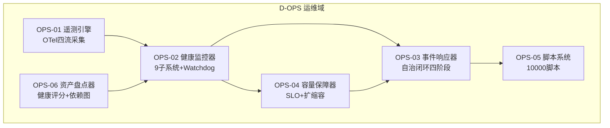
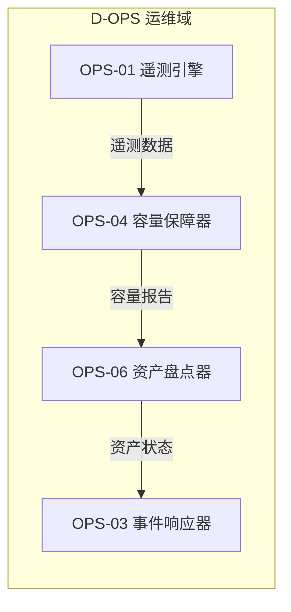

# 30 — D-OPS 运维域

> **状态**: DRAFT | **核心层**: L12 | **成熟度**: 🔧 部分开发（6/14子模块已有代码，8个待建）
> **一句话**: 系统怎么跑

## §0 域定义

| 维度 | 内容 |
|------|------|
| 核心Aggregate | OpsIncident |
| 核心事件 | E-OP-01 SystemAlert / E-OP-02 CapacityThresholdBreached / E-OP-03 DeploymentCompleted |
| 特殊定位 | 横切支撑层，系统运行保障，P1优先级 |
| 与D-AUTONOMY的关系 | 自治管"AI行为"，运维管"系统运行" |
| 与D-INFRA的关系 | 基础设施管"硬件和网络"，运维管"系统怎么跑" |
| 开发状态 | 部分开发——6/14子模块已实现，8个待建 |
| 优先级 | P1（D-AUTONOMY就绪 + D-INFRA部分就绪后启动） |
| 激活前提 | D-AUTONOMY就绪 + D-INFRA部分就绪 |

## §1 子模块清单

| ID | 名称 | 职责 | 优先级 | 开发状态 | 对标依据 |
|----|------|------|:------:|:--------:|---------|
| D-OPS-01 | Telemetry Engine | 系统遥测+L12+指标采集+链路追踪+日志聚合 | P0 | ✅ 部分在system-telemetry | L12系统遥测层 |
| D-OPS-02 | Capacity Assurance | 容量保障+容量热力图+资源预测+扩缩容 | P1 | ✅ 已有 | capacity_assurance/ |
| D-OPS-03 | Incident Response | 事件响应+P0/P1/P2分级+自动处置+升级 | P1 | ❌ | 与D-AUTONOMY Escalation联动 |
| D-OPS-04 | Script System | 脚本系统+10000脚本+ThreadPoolExecutor+健康检查 | P0 | ✅ 已有 | script_system/ + REG-SCRIPT-001/002 |
| D-OPS-05 | Asset Inventory | 资产盘点+unified_asset_index+健康评分+孤儿率 | P1 | ✅ 已有 | asset_inventory/ + REG-INV-001 |
| D-OPS-06 | Health Monitor | 健康监控+9子系统+Watchdog+SLA监控 | P0 | ✅ 已有 | MOD-INF遥测 |
| D-OPS-07 | Alert Manager | 告警管理+告警聚合+去重+升级+静默 | P1 | ❌ | AlertManager |
| D-OPS-08 | Deployment Manager | 部署管理+蓝绿部署+金丝雀发布+回滚 | P2 | ❌ | 与D-INFRA联动 |
| D-OPS-09 | Log Aggregator | 日志聚合+结构化日志+搜索+归档 | P1 | ❌ | ELK/Loki |
| D-OPS-10 | Configuration Manager | 配置管理+分环境配置+热更新+版本管理 | P1 | ❌ | Consul/etcd |
| D-OPS-11 | Backup Manager | 备份管理+自动备份+恢复验证+异地备份 | P1 | ❌ | 专业标配 |
| D-OPS-12 | DR Manager | 灾难恢复+RTO/RPO+故障转移+演练 | P2 | ❌ | 专业标配 |
| D-OPS-13 | SLO Manager | SLO管理+SLI定义+错误预算+燃烧率告警 | P2 | ❌ | SRE实践 |
| D-OPS-14 | Runbook Automator | 运维手册自动化+自动诊断+自动修复+人工审批 | P2 | ❌ | 与D-AUTONOMY Auto-Fix联动 |
| D-OPS-15 | External Dependency SLA Monitor | 外部依赖SLA监控+LLM API/数据源/Broker API的SLA+降级+成本 | P1 | ❌ | MOD-INF-015扩展 |
| D-OPS-16 | Dependency Cost Tracker | 依赖图成本追踪+每个依赖的API/计算/存储成本+优化建议 | P2 | ❌ | HashiCorp Terraform Cost |
| D-OPS-17 | FinOps Cost Anomaly Detector | FinOps成本异常检测+成本优化建议+预算门禁 | P2 | ❌ | FinOps Foundation / Kubecost / OpenCost |
| D-OPS-18 | Cross-Env Dependency Diff Analyzer | 跨环境依赖差异分析+开发/测试/生产环境依赖差异检测+配置漂移+环境一致性校验 | P2 | ❌ | Docker diff / Terraform plan / K8s manifest diff |
| M10-S01 | 运行时依赖采集器 | 采集运行时依赖数据(import/调用/连接) | P1 | ❌ | — |
| M10-S02 | 动态依赖图构建器 | 从运行时数据构建动态依赖图 | P1 | ❌ | — |
| M10-S03 | 条件依赖激活检测器 | 检测运行时才激活的条件依赖 | P1 | ❌ | — |
| M10-S04 | 隐式依赖发现器 | 发现隐式依赖(环境变量/共享文件/时钟同步) | P1 | ❌ | — |
| M10-S05 | 运行时vs静态差异器 | 对比运行时依赖与静态声明依赖的差异 | P1 | ❌ | — |
| M10-NEW-01 | eBPF Zero-Instrumentation Discovery | 基于eBPF内核级依赖发现——零代码侵入 | P1 | ❌ | Cilium Hubble 2025 / Pixie 2024 |
| M10-NEW-02 | OTel Auto-Topology Builder | 从OTel trace自动构建服务依赖拓扑 | P1 | ❌ | OpenTelemetry Collector 2025 |
| M10-NEW-03 | AI Inference Dependency Discovery | AI推理服务特有依赖：GPU显存共享/模型热加载 | P1 | ❌ | NVIDIA NIM / vLLM Serving Topology |
| M10-NEW-05 | Chaos Experiment Dependency Validator | 通过混沌注入验证依赖假设 | P1 | ❌ | Litmus Chaos 2025 / Gremlin |
| M10-NEW-06 | Serverless Cold-Start Dependency Preloader | Serverless冷启动依赖链预加载优化 | P1 | ❌ | AWS Lambda SnapStart 2025 |
| D11 | Cloud-Edge-Device Scheduler | 云-边-端调度器 | P1 | ❌ | IEEE TCAD 2025 |
| D12 | Edge Dependency Constraint Modeler | 边缘依赖约束建模器 | P1 | ❌ | IEEE TCAD 2025 |
| D23 | Streaming Dependency Topology Analyzer | 流式依赖拓扑分析器 | P1 | ❌ | VLDB 2025 |
| D44 | Deploy Order CSP Solver | 部署顺序CSP求解器 | P1 | ❌ | ICSE 2024 Ghiassi |
| D73 | STDP Dynamic Weight Engine | STDP脉冲学习动态权重引擎 | P1 | ❌ | Izhikevich Lab 2025 |
| D75 | Neuromorphic Event-Driven Scheduler | 神经形态事件驱动调度器 | P1 | ❌ | IEEE TCAD 2025 |
| D42 | GitOps依赖解析器 | 声明式GitOps 17%同步失败显式依赖声明+运行时验证双保险 | P2 | ❌ | USENIX ATC 2025 |
| D43 | 渐进式交付依赖检查器 | Canary/BlueGreen升级前置依赖：监控就绪/流量切换/回滚能力 | P2 | ❌ | SRECon 2025 |
| D49 | 依赖状态向量编码器 | DSV多维向量(调用频率/P99延迟/错误率/权重)拓扑变更后<2s收敛 | P2 | ❌ | IEEE CLOUD 2025 |
| D50 | 可微分影响仿真器 | 依赖图what-if分析可微分仿真准确率+37%+置信度区间 | P2 | ❌ | ACM FSE 2025 |
| D-OPS-19 | Performance Profiler | 性能分析器：全链路性能分析+瓶颈定位+性能趋势+性能报告+优化建议。理论：性能分析/Profiling/瓶颈理论。具备性能审计/瓶颈分析报告/性能优化合规检查 | P1 | ❌ | 性能分析/Profiling/瓶颈理论; AIOps性能分析/预测性性能/自适应优化; Py-Spy/cProfile/Prometheus; 性能审计/瓶颈分析报告/性能优化合规 |
| D-OPS-20 | Change Manager | 变更管理器：变更计划+变更审批+变更执行+变更回滚+变更报告。理论：变更管理/ITIL/变更控制。具备变更审计/变更记录/变更管理合规检查 | P1 | ❌ | 变更管理/ITIL/变更控制; AI变更推荐/预测性变更/自动回滚; ServiceNow/Remedy; 变更审计/变更记录/变更管理合规 |

## §2 域内依赖图D51 | 时序依赖退化预测器 | 历史依赖变更序列Transformer提前48h预警依赖退化召回率82% | P2 | ❌ | JSS 2025 |
| D52 | ISO 23247-4依赖实体模型 | DEM Schema定义节点=资产/服务/数据流+边=强/弱/条件+属性 | P2 | ❌ | ISO 23247-4:2025 |
| D53 | 依赖关键度评分器 | DCS=PageRank中心性+调用频率+SLA影响半径+替代路径可用性 | P2 | ❌ | USENIX ATC 2025 |
| D55 | 依赖图韧性评分器 | 5维RI：连通性冗余/故障隔离度/级联衰减率/恢复时间/降级优雅度 | P2 | ❌ | Gremlin/Chaos Community Day 2025 |
| D56 | 增量混沌验证器 | Game Day自动生成+增量混沌调度+韧性热力图 | P2 | ❌ | AWS Well-Architected 2025 |
| D74 | SNN依赖异常检测器 | SNN替代GNN异常检测能耗降100x+检测延迟从ms到us | P2 | ❌ | DAC 2025 |
| M12-S01 | SLA定义器 | 定义外部依赖SLA指标和阈值 | P1 | ❌ | — |
| M12-S02 | SLA监控器 | 持续监控外部依赖SLA | P1 | ❌ | — |
| M12-S03 | SLA违约检测器 | 检测SLA违约事件 | P1 | ❌ | — |
| M12-S04 | 降级策略管理器 | 管理SLA违约时的降级策略 | P1 | ❌ | — |
| M12-S05 | SLA报告生成器 | 生成SLA合规报告 | P1 | ❌ | — |
| M12-NEW-01 | LLM API SLA Monitor | LLM API特有SLA：TTFT/TPS/Token可用率/Rate Limit | P1 | ❌ | Helicone 2025 / IMC 2025 |
| M12-NEW-02 | Multi-Cloud SLA Aggregation Engine | 跨AWS/Azure/GCP/阿里云SLA聚合 | P1 | ❌ | Datadog Multi-Cloud / New Relic NR1 |
| M12-NEW-03 | SLA Breach Predictor | 基于ML预测SLA违约事件 | P1 | ❌ | IEEE Cloud 2025 |
| M12-NEW-06 | SLA-Aware Traffic Router | 基于SLA的路由决策 | P1 | ❌ | Envoy weighted routing / AWS R53 |
| M15-NEW-02 | Network Resilience Scoring Engine | 依赖网络韧性评分：基于拓扑分析的抗毁性量化 | P1 | ❌ | MITRE ATT&CK Resilience / CISA CRR |
| D54 | Blast Radius Calculator | 爆炸半径计算器 | P1 | ❌ | SOSP 2025 |
| M43-S03 | API Traffic Policy Mapper | API流量策略映射器，将API流量治理策略映射到依赖图流量规则 | P1 | ❌ | Istio VirtualService |
| M43-NEW-05 | API Rate Limit Dependency Propagator | API速率限制依赖传播器，将上游API速率限制传播到下游依赖链 | P1 | ❌ | — |
| NEW-M22-N03 | Chaos Experiment Dependency Graph Builder | 混沌实验依赖图构建器：从依赖图自动生成混沌实验方案 | P2 | ❌ | Litmus Chaos/Gremlin |
| NEW-M20-N01 | Self-Healing Policy Engine | 自愈策略引擎：依赖断裂时自动选择降级/重试/替代路径 | P2 | ❌ | Kubernetes Operator Pattern |
| NEW-M20-N02 | Dependency Circuit Breaker | 依赖断路器：级联故障时自动熔断依赖边防止雪崩 | P2 | ❌ | Resilience4j/Hystrix |
| NEW-M25-N01 | Distributed Trace Dependency Correlator | 分布式追踪依赖关联：Trace Span依赖边自动关联 | P2 | ❌ | OpenTelemetry/W3C Trace Context |
| NEW-M25-N02 | Metric Dependency Anomaly Detector | 指标依赖异常检测：依赖边指标异常自动检测 | P2 | ❌ | Datadog/New Relic APM |
| NEW-M29-N01 | Resource Dependency Capacity Planner | 资源依赖容量规划：依赖链资源需求容量规划 | P2 | ❌ | Kubernetes VPA/HPA |
| NEW-M29-N02 | Dependency Bottleneck Resource Optimizer | 依赖瓶颈资源优化：瓶颈依赖资源分配优化 | P2 | ❌ | SIGMETRICS 2025 Resource Allocation |
| M20-S01 | 异常检测器 | 检测依赖图异常状态和漂移 | P2 | ❌ | — |
| M20-S02 | 修复建议器 | 基于异常生成修复建议 | P2 | ❌ | — |
| M20-S03 | 自动修复执行器 | 执行自动修复操作 | P2 | ❌ | Samsung SDS arXiv 2026 Self-Healing |
| M20-S04 | 修复验证器 | 验证修复操作正确性 | P2 | ❌ | — |
| M20-S05 | 修复回滚器 | 修复失败自动回滚 | P2 | ❌ | — |
| M20-NEW-01 | 依赖漂移距离度量增强 | 度量依赖漂移距离>2主版本告警 | P2 | ❌ | JSS 2025 |
| M20-NEW-02 | 文档漂移反模式检测增强 | 6种文档漂移反模式+DriftScore量化 | P2 | ❌ | JSS 2025 Living Documentation |
| M20-NEW-03 | 自愈策略选择器 | 根据异常类型自动选择最优自愈策略 | P2 | ❌ | — |
| M22-S01 | 故障场景定义器 | 定义依赖图故障注入场景 | P2 | ❌ | Gremlin/Litmus Chaos |
| M22-S02 | 故障注入器 | 执行故障注入实验 | P2 | ❌ | Chaos Mesh/Litmus |
| M22-S03 | 韧性评估器 | 评估故障注入后韧性表现 | P2 | ❌ | arXiv 2505.13654 |
| M22-S04 | 恢复验证器 | 验证系统故障后恢复能力 | P2 | ❌ | — |
| M22-S05 | 实验记录器 | 记录混沌实验过程和结果 | P2 | ❌ | — |
| M22-S06 | 实验报告器 | 生成混沌实验报告 | P2 | ❌ | ACM EASE 2025 |
| M22-NEW-01 | 依赖关键度DCS评分增强 | DCS=PageRank+调用频率+SLA影响+替代路径 | P2 | ❌ | USENIX ATC 2025 |
| M22-NEW-02 | SNN异常检测增强 | SNN替代GNN异常检测能耗降100x | P2 | ❌ | DAC 2025 |
| M22-NEW-03 | 增量混沌验证增强 | Game Day自动生成+增量混沌+韧性热力图 | P2 | ❌ | AWS Well-Architected 2025 |
| M24-S01 | OTel Collector集成 | 集成OTel Collector采集追踪 | P2 | ❌ | OpenTelemetry Collector 2025 |
| M24-S02 | 追踪数据解析器 | 解析OTel追踪数据提取依赖 | P2 | ❌ | OTel SDK |
| M24-S03 | 依赖图构建器 | 从追踪数据构建运行时依赖图 | P2 | ❌ | — |
| M24-S04 | 异常传播追踪器 | 追踪异常在依赖链传播路径 | P2 | ❌ | OSDI 2024 MicroRCA |
| M24-NEW-01 | OTel GenAI Semantic Conventions | AI Agent调用链追踪语义约定 | P2 | ❌ | OTel Semantic Conventions 1.28 |
| M24-NEW-02 | Trace→依赖图自动构建器 | 从Trace自动构建依赖图 | P2 | ❌ | Coralogix OTel |
| M27-S01 | 孪生模型构建器 | 构建依赖图数字孪生模型 | P2 | ❌ | arXiv 2510.08164 |
| M27-S02 | 批量仿真器 | 批量仿真依赖图变更影响 | P2 | ❌ | — |
| M27-S03 | 流式仿真器 | 流式仿真依赖图实时变更 | P2 | ❌ | — |
| M27-S04 | 实时仿真器 | 实时仿真依赖图状态变化 | P2 | ❌ | IEEE CLOUD 2025 |
| M27-S05 | 双向同步器 | 物理依赖图与孪生模型双向同步 | P2 | ❌ | arXiv 2510.08164 |
| M27-S06 | 仿真报告器 | 生成仿真结果报告 | P2 | ❌ | — |
| M27-NEW-01 | DSV编码增强 | DSV多维向量编码拓扑变更<2s收敛 | P2 | ❌ | IEEE CLOUD 2025 |
| M27-NEW-02 | 可微分影响仿真增强 | what-if可微分仿真准确率+37% | P2 | ❌ | ACM FSE 2025 |
| M27-NEW-03 | ISO 23247-4实体模型增强 | DEM Schema定义节点/边/属性标准 | P2 | ❌ | ISO 23247-4:2025 |
| M28-S01 | Istio配置解析器 | 解析Istio配置提取服务依赖 | P2 | ❌ | Istio 1.22+ |
| M28-S02 | Envoy依赖提取器 | 从Envoy配置提取服务间依赖 | P2 | ❌ | Envoy xDS API |
| M28-S03 | ztunnel依赖映射器 | 映射Istio Ambient ztunnel依赖 | P2 | ❌ | Istio Ambient 2025 GA |
| M28-S04 | waypoint依赖映射器 | 映射Istio waypoint代理依赖 | P2 | ❌ | Istio Ambient |
| M28-NEW-01 | Istio Ambient Mode依赖增强 | Sidecar-less模式依赖映射增强 | P2 | ❌ | Istio Ambient Mesh 2025 GA |
| M28-NEW-02 | ztunnel+waypoint依赖细化 | 细化ztunnel和waypoint依赖关系 | P2 | ❌ | ACM SoCC 2025 |
| M29-S01 | 网络连接采集器 | eBPF采集网络连接依赖 | P2 | ❌ | Cilium Hubble |
| M29-S02 | 文件访问采集器 | eBPF采集文件访问依赖 | P2 | ❌ | Pixie 2024 |
| M29-S03 | 进程调用采集器 | eBPF采集进程调用依赖 | P2 | ❌ | Grafana Beyla |
| M29-S04 | DNS查询采集器 | eBPF采集DNS查询依赖 | P2 | ❌ | Cilium Hubble |
| M29-S05 | 依赖图构建器 | 从eBPF数据构建运行时依赖图 | P2 | ❌ | — |
| M29-NEW-01 | Windows eBPF适配器 | Windows平台eBPF适配 | P2 | ❌ | Windows eBPF/Cilium |
| M29-NEW-02 | 应用层依赖补充器 | 补充eBPF无法采集的应用层依赖 | P2 | ❌ | — |
| M29-NEW-03 | eBPF语义标注器 | 为eBPF采集依赖添加语义标注 | P2 | ❌ | — |
| M47-S01 | 熔断器建模器 | 建模熔断器模式依赖关系 | P2 | ❌ | Resilience4j/Sentinel |
| M47-S02 | 限流器建模器 | 建模限流器模式依赖关系 | P2 | ❌ | Resilience4j/Sentinel |
| M47-S03 | 重试策略建模器 | 建模重试策略依赖关系 | P2 | ❌ | Resilience4j |
| M47-S04 | 舱壁建模器 | 建模舱壁模式依赖关系 | P2 | ❌ | Resilience4j/Hystrix |
| M47-S05 | 降级路径建模器 | 建模降级路径依赖关系 | P2 | ❌ | Sentinel |
| M47-S06 | 韧性评分器 | 评估依赖图韧性评分 | P2 | ❌ | Gremlin 2025 |
| M47-NEW-01 | 熔断器依赖图构建器 | 构建熔断器模式完整依赖图 | P2 | ❌ | Resilience4j |
| M47-NEW-02 | 降级链验证器 | 验证降级链完整性和可达性 | P2 | ❌ | — |
| M47-NEW-03 | 重试风暴预测器 | 预测重试策略可能引发的风暴效应 | P2 | ❌ | SRECon 2025 |
| M65-S01 | 自动降级执行器 | 自动执行依赖降级 | P2 | ❌ | Samsung SDS arXiv 2026 |
| M65-S02 | 自动回滚执行器 | 自动执行依赖回滚 | P2 | ❌ | Terraform Rollback |
| M65-S03 | 自动依赖替换器 | 自动替换故障依赖 | P2 | ❌ | — |
| M65-S04 | 版本自动修复器 | 自动修复依赖版本问题 | P2 | ❌ | pip --fix/npm audit fix |
| M65-S05 | 修复验证器 | 验证自修复操作正确性 | P2 | ❌ | — |
| M65-NEW-01 | PubGrub版本求解器 | PubGrub算法求解版本约束 | P2 | ❌ | PubGrub Version Solving |
| M65-NEW-02 | 依赖健康评分引擎 | 基于OpenSSF Scorecard依赖健康评分 | P2 | ❌ | OpenSSF Scorecard |
| M65-NEW-03 | 自动回滚策略选择器 | 根据故障类型选择最优回滚策略 | P2 | ❌ | — |
| M65-NEW-04 | 修复验证门禁 | 修复后必须通过验证门禁 | P2 | ❌ | — |
| M65-NEW-05 | 左Kan扩展依赖解析器 | 左Kan扩展=最小保守扩展→最少新增依赖 | P2 | ❌ | TAC/arXiv 2025 Kan Extensions |
| M65-NEW-06 | 跨语言依赖链修复器 | 跨Python/npm/Go生态依赖链修复 | P2 | ❌ | — |
| M72-S01 | 关键路径故障生成器 | 自动生成关键路径故障实验 | P2 | ❌ | USENIX ATC 2025 DCS |
| M72-S02 | 高风险节点故障生成器 | 自动生成高风险节点故障实验 | P2 | ❌ | USENIX ATC 2025 |
| M72-S03 | 级联故障生成器 | 自动生成级联故障实验 | P2 | ❌ | Nature Communications 2024 |
| M72-S04 | 最小爆破半径计算器 | 计算最小爆破半径 | P2 | ❌ | ACM SIGCOMM/Netflix 2025 |
| M72-S05 | 实验报告器 | 生成混沌实验报告 | P2 | ❌ | — |
| M72-NEW-01 | 拓扑感知故障注入器 | 基于拓扑感知的故障注入 | P2 | ❌ | USENIX ATC 2025 |
| M72-NEW-02 | 稳态假设自动推导器 | 自动推导系统稳态假设 | P2 | ❌ | Chaos Engineering Principles |
| M72-NEW-03 | 爆炸半径预测器 | GNN近似500ms计算10万节点爆炸半径 | P2 | ❌ | ACM SIGCOMM/Netflix 2025 |
| M72-NEW-04 | 混沌结果知识库 | 积累混沌实验结果知识 | P2 | ❌ | — |
| M72-NEW-05 | 自适应调度器 | 自适应调度混沌实验 | P2 | ❌ | AWS Well-Architected 2025 |
| M72-NEW-06 | AI Agent混沌实验设计器 | 为AI Agent设计专用混沌实验 | P2 | ❌ | ICLR 2024 MetaGPT |
| M77-S01 | 流式图更新器 | 流式更新实时孪生图 | P2 | ❌ | Apache Flink/Kafka |
| M77-S02 | 孪生图一致性CRDT | CRDT保证孪生图最终一致性 | P2 | ❌ | CRDTs/Automerge |
| M77-S03 | 快照管理器 | 管理孪生图快照 | P2 | ❌ | EventStoreDB |
| M77-S04 | 实时图差异器 | 计算实时图差异 | P2 | ❌ | — |
| M77-S05 | 查询路由器 | 路由查询到合适孪生实例 | P2 | ❌ | — |
| M77-S06 | 变更通知器 | 通知依赖图变更事件 | P2 | ❌ | Kafka/Webhook |
| M77-NEW-01 | 流式图更新增强器 | 增强流式图更新性能 | P2 | ❌ | Apache Flink |
| M77-NEW-02 | 孪生图一致性CRDT增强 | 增强CRDT一致性保证 | P2 | ❌ | CRDTs/Automerge |
| M77-NEW-03 | 快照管理增强器 | 增强快照管理能力 | P2 | ❌ | EventStoreDB |
| M77-NEW-04 | 实时图差异增强器 | 增强实时图差异计算 | P2 | ❌ | — |
| M77-NEW-05 | 查询路由增强器 | 增强查询路由智能 | P2 | ❌ | — |
| M77-NEW-06 | 变更通知增强器 | 增强变更通知机制 | P2 | ❌ | Kafka/Webhook |
| M78-S01 | Istio Policy DSL生成器 | 生成Istio策略DSL | P2 | ❌ | Istio OPA |
| M78-S02 | Linkerd Policy生成器 | 生成Linkerd策略 | P2 | ❌ | Linkerd Policy |
| M78-NEW-01 | Istio Policy DSL生成增强 | 增强Istio策略DSL生成 | P2 | ❌ | Istio OPA |
| M78-NEW-02 | Linkerd Policy生成增强 | 增强Linkerd策略生成 | P2 | ❌ | Linkerd Policy |
| M79-S01 | 进程关系追踪器 | eBPF追踪进程间依赖关系 | P2 | ❌ | Cilium/Pixie |
| M79-S02 | 网络拓扑发现器 | eBPF发现网络拓扑依赖 | P2 | ❌ | Cilium Hubble |
| M79-S03 | 文件I/O依赖发现器 | eBPF发现文件I/O依赖 | P2 | ❌ | Pixie 2024 |
| M79-S04 | DNS依赖发现器 | eBPF发现DNS依赖 | P2 | ❌ | Cilium Hubble |
| M79-NEW-01 | 进程关系追踪增强 | 增强进程关系追踪 | P2 | ❌ | Cilium/Pixie |
| M79-NEW-02 | 网络拓扑发现增强 | 增强网络拓扑发现 | P2 | ❌ | Cilium Hubble |
| M79-NEW-03 | 文件I/O依赖发现增强 | 增强文件I/O依赖发现 | P2 | ❌ | Pixie 2024 |
| M79-NEW-04 | DNS依赖发现增强 | 增强DNS依赖发现 | P2 | ❌ | Cilium Hubble |
| M49-S01 | 指标关联器 | 指标关联：多维度指标关联分析+相关性计算+异常指标联动检测 | P1 | ❌ | — |
| M49-S02 | 追踪关联器 | 追踪关联：分布式追踪数据关联+链路分析+依赖路径追踪 | P1 | ❌ | — |
| M49-S03 | 日志关联器 | 日志关联：日志事件关联分析+模式识别+根因定位 | P1 | ❌ | — |
| M49-S05 | 语义约定集成器 | 语义约定集成：OTel语义约定集成+标准化标签+元数据管理 | P1 | ❌ | — |
| M49-NEW-01 | OTel GenAI SemConv集成器 | OTel GenAI语义约定集成：AI Agent调用链追踪语义约定 | P1 | ❌ | OTel Semantic Conventions 1.28 |
| M49-NEW-02 | 因果推断关联器 | 因果推断关联：基于因果推断的依赖关联分析+干预效应检测 | P1 | ❌ | — |
| M49-NEW-03 | 异常传播GNN预测器 | 异常传播GNN预测：图神经网络预测异常在依赖链中的传播路径 | P1 | ❌ | OSDI 2024 MicroRCA |
| M49-NEW-04 | LLM幻觉关联误判过滤器 | LLM幻觉关联过滤：过滤LLM产生的幻觉关联误判+置信度校准 | P1 | ❌ | — |
| M55-S01 | 碳强度API集成器 | 碳强度API集成：集成电力碳强度API+实时碳排放数据获取 | P1 | ❌ | Electricity Maps API / WattTime |
| M55-S02 | 低碳窗口检测器 | 低碳窗口检测：检测电力低碳时段+优化调度窗口推荐 | P1 | ❌ | Carbon-Aware Computing |
| M55-S04 | 碳预算追踪器 | 碳预算追踪：碳排放预算设定+实时追踪+超预算告警 | P1 | ❌ | GHG Protocol / PCAF |
| M55-S05 | 绿色部署策略器 | 绿色部署策略：基于碳强度的智能部署调度+低碳区域优先 | P1 | ❌ | Green Software Foundation |
| M55-NEW-01 | Carbon-Aware SDK v2集成器 | Carbon-Aware SDK v2集成：微软碳感知SDK集成+智能调度 | P1 | ❌ | Microsoft Carbon-Aware SDK |
| M55-NEW-02 | 低碳窗口检测增强器 | 低碳窗口检测增强：多区域低碳窗口联合优化+预测性调度 | P1 | ❌ | IEEE CLOUD 2025 |
| M55-NEW-03 | 碳预算追踪增强器 | 碳预算追踪增强：Scope 3碳排放估算+供应链碳足迹追踪 | P1 | ❌ | GHG Protocol Scope 3 |

## §2 骨架子模块（A9运维架构提炼）

> **骨架厚度**: 中等(6✅) | **骨架来源**: 运维架构(A9) §3 AI自治运维闭环 + §6监控体系

| 骨架ID | 名称 | 职责 | P级 | 对标A9章节 | 场内模块对照 |
|--------|------|------|:---:|-----------|-------------|
| OPS-01 | 遥测引擎 | 系统遥测+OTel四流(指标/日志/追踪/事件)统一采集+链路追踪 | P0 | §6.3.1 OTel分布式追踪 | MOD-INF-016/shared/observability/(tracing,metrics) |
| OPS-02 | 健康监控器 | 9子系统+Watchdog+SLA监控+进程心跳+三平面健康 | P0 | §3.1.1 Detect异常检测 | MOD-INF-016/shared/observability/health、MOD-INF-035(runtime/health_monitor) |
| OPS-03 | 事件响应器 | P0~P2分级+自动处置+升级+自治闭环(Detect→Diagnose→Remediate→Learn) | P1 | §3 AI自治运维闭环 | MOD-INF-010(feedback_loop/) |
| OPS-04 | 容量保障器 | 容量热力图+资源预测+扩缩容+SLA/SLO管理 | P1 | §6.5 SLO定义 | MOD-INF-001(capacity_assurance/) |
| OPS-05 | 脚本系统 | 10000脚本+ThreadPoolExecutor+健康检查+运维自动化执行 | P0 | §3.1.3 Remediate自动修复 | MOD-INF-005(scripts/) |
| OPS-06 | 资产盘点器 | unified_asset_index+健康评分+孤儿率+依赖图 | P1 | §5.1 RTO/RPO分级 | MOD-INF-026(asset_inventory/) |

### 场内模块对照

| 场内模块 | 对应骨架子模块 | 覆盖度 | 差异 |
|---------|--------------|:------:|------|
| MOD-INF-001 capacity_assurance/ | OPS-04 容量保障器 | ✅完整 | 已有代码，需对齐A9§6.5 SLO |
| MOD-INF-005 scripts/ | IO-01 CI/CD + OPS-05 脚本系统 | ✅完整 | 430+文件，需按A9§3.1.3重构 |
| MOD-INF-010 feedback_loop/ | OPS-03 事件响应器 | ✅完整 | 反馈闭环230+文件 |
| MOD-INF-026 asset_inventory/ | OPS-06 资产盘点器 | ✅完整 | 已有代码 |

### 反向去冗余

| 旧草稿冗余子模块 | 归属骨架 | 处理 |
|----------------|---------|------|
| D-OPS-07 Alert Manager | IO-06 | 告警是运维基础设施能力，归D-INFRA-OPS |
| D-OPS-09 Log Aggregator | IO-05 | 日志聚合是运维基础设施能力，归D-INFRA-OPS |
| D-OPS-10 Configuration Manager | IO-07/IR-04 | 配置管理归IaC+运行时配置 |
| D-OPS-08 Deployment Manager | IO-01 | 部署管理归CI/CD流水线 |
| D-OPS-11 Backup Manager | IO-03 | 备份管理归运维基础设施 |
| D-OPS-12 DR Manager | IO-04 | 灾备管理归运维基础设施 |
| D-OPS-13 SLO Manager | OPS-04 | 合并至容量保障器(SLO是容量维度) |
| D-OPS-14 Runbook Automator | OPS-03+OPS-05 | 合并至事件响应器+脚本系统 |

### 域内依赖图



| 依赖 | 说明 | A9依据 |
|------|------|--------|
| OPS-01→OPS-02 | 遥测数据驱动健康监控(心跳/指标/追踪) | §3.1.1 Detect异常检测 |
| OPS-02→OPS-03 | 健康异常触发事件响应(Detect→Diagnose→Remediate→Learn) | §3 AI自治运维闭环 |
| OPS-02→OPS-04 | 健康数据驱动容量评估(SLO达标率→扩缩容) | §6.5 SLO定义 |
| OPS-03→OPS-05 | 事件响应执行修复脚本(8种修复动作) | §3.1.3 Remediate自动修复 |
| OPS-06→OPS-02 | 资产健康评分补充健康监控视角 | §5.1 RTO/RPO分级 |
| OPS-04→OPS-03 | 容量阈值突破触发事件响应 | §4.2触发条件矩阵 |

### 2.1 价值流线：线6——运维保障线

线6归属D-OPS运维域，覆盖运维核心链路：

**流程**: OPS-01(遥测引擎) → OPS-02(健康监控) → OPS-04(容量保障) → OPS-06(资产盘点)



## §3 域间依赖

| 消费什么 | 来自哪个域 | 契约/事件 | 类型 |
|---------|-----------|---------|:----:|
| 权限/审计 | D-AUTONOMY | PermissionGuard+AuditLogger | H |
| 运行时状态 | D-INFRA-RUNTIME | RuntimeTelemetry | H |
| 监控聚合数据 | D-INFRA-OPS | MonitoringData | H |
| 遥测数据 | *(all) | 各域遥测上报 | E |

| 产出什么 | 去往哪个域 | 契约/事件 | 类型 |
|---------|-----------|---------|:----:|
| SystemAlert | D-AUTONOMY | E-OP-01 | E |
| CapacityAlert | D-AUTONOMY | E-OP-02 | E |
| HealthStatus | D-FRONTEND | 健康仪表盘 | S |
| AlertEscalation | D-INFRA-OPS | 告警升级通知 | E |
| RemediationCommand | D-INFRA-RUNTIME | 修复命令下发 | E |
| DeploymentCompleted | D-GOVERNANCE | E-OP-03 | E |

## §4 域事件流

| 事件ID | 事件名 | 触发条件 | 消费者 | A9依据 |
|--------|--------|---------|--------|--------|
| E-OP-01 | SystemAlert | 系统异常告警(进程/资源/业务) | D-AUTONOMY(升级评估)、D-GOVERNANCE(审计) | §3.1.1 Detect |
| E-OP-02 | CapacityThresholdBreached | 容量阈值突破 | D-AUTONOMY(自动扩容)、OPS-03(事件响应) | §6.5 SLO定义 |
| E-OP-03 | DeploymentCompleted | 部署完成 | D-GOVERNANCE(门禁验证)、OPS-02(健康检查) | §7灰度发布 |
| E-OP-04 | RemediationExecuted | 修复动作执行完成 | OPS-02(验证回路)、OPS-05(脚本记录) | §3.1.3 Remediate |
| E-OP-05 | RemediationRolledBack | 修复回滚(TNR不恶化性) | OPS-02(重新检测)、IO-06(告警) | §3.1.4 TNR安全规范 |
| E-OP-06 | SLOBreached | SLO违约(交易时段<99.99%) | OPS-03(事件响应)、IO-06(告警) | §6.5 SLO定义 |
| E-OP-07 | SurvivalRuleTriggered | 保命规则触发(SURV-001~008) | IR-06(降级执行)、D-AUTONOMY(自治熔断) | §4.3保命规则集 |

## §5 激活前提与就绪条件

| 子模块 | 前提条件 | 就绪标准 | A9依据 |
|--------|---------|---------|--------|
| OPS-01 遥测引擎 | IR-05事件总线就绪 | OTel Collector可采集 | §6.3.1 OTel追踪 |
| OPS-02 健康监控器 | OPS-01遥测就绪 | 遥测数据可消费 | §3.1.1 Detect |
| OPS-03 事件响应器 | OPS-02健康监控就绪+D-AUTONOMY权限 | 自治策略库可读 | §3 AI自治闭环 |
| OPS-04 容量保障器 | OPS-02健康监控就绪 | SLO指标可计算 | §6.5 SLO定义 |
| OPS-05 脚本系统 | Python环境就绪 | ThreadPoolExecutor可用 | §3.1.3 Remediate |
| OPS-06 资产盘点器 | OPS-05脚本就绪 | 资产扫描脚本可执行 | §5.1 RTO/RPO |

### 内部就绪顺序

| 顺序 | 子模块 | 理由 |
|:----:|--------|------|
| 1 | OPS-01 遥测引擎 | 遥测是运维的基础——无数据则无运维 |
| 2 | OPS-05 脚本系统 | 脚本是运维自动化的核心执行器 |
| 3 | OPS-02 健康监控器 | 健康监控依赖遥测数据 |
| 4 | OPS-06 资产盘点器 | 资产盘点依赖脚本系统 |
| 5 | OPS-04 容量保障器 | 容量保障依赖健康监控+告警 |
| 6 | OPS-03 事件响应器 | 事件响应依赖健康监控+脚本+容量 |

## §6 设计决策记录

| 日期 | 决策 | 理由 | 对标来源 |
|------|------|------|---------|
| 2026-05-12 | 运维域独立于自治域——自治管AI行为，运维管系统运行 | 职责分离：自治是"谁来做"，运维是"跑得稳" | SRE vs AI Platform分设 |
| 2026-05-12 | 运维域独立于基础设施域——基础设施管硬件，运维管运行 | 基础设施是"有什么"，运维是"怎么跑" | IaaS vs PaaS分层 |
| 2026-05-12 | 脚本系统归运维——10000脚本是运维自动化的核心 | 脚本执行/健康检查/ThreadPoolExecutor都是运维能力 | REG-SCRIPT-001/002 |
| 2026-05-12 | 系统遥测归运维——L12遥测层是运维的基础能力 | 遥测采集/链路追踪/日志聚合是运维的感知器官 | L12系统遥测层 |
| 2026-05-12 | 健康监控双归属——AI健康在D-AUTONOMY-11，系统健康在OPS-02 | AI健康关注Agent行为，系统健康关注服务可用性 | 应用健康 vs 基础设施健康 |
| 2026-05-26 | 骨架精炼为6子模块(OPS-01~06) | 按A9提炼遥测/健康/事件响应/容量/脚本/资产 | A9§3+§6 |
| 2026-05-26 | 告警管理归IO-06而非OPS | 告警是运维基础设施能力(Prometheus+Grafana)，OPS消费告警做事件响应 | A9§6.2 |
| 2026-05-26 | 日志聚合归IO-05而非OPS | 日志是运维基础设施(ELK/Loki)，OPS消费日志做诊断 | A9§6.1.1 |
| 2026-05-26 | 自治闭环(Detect→Diagnose→Remediate→Learn)归OPS-03 | 自治闭环是运维的事件响应能力，不是基础设施 | A9§3 |
| 2026-05-26 | TNR安全规范(事务性无回归)归OPS-03 | TNR是修复动作的安全约束，属于事件响应域 | A9§3.1.4 |
| 2026-05-26 | D-OPS-07~14旧模块重新归类 | 告警/日志/配置/部署/备份/灾备归D-INFRA-OPS，SLO归容量，Runbook归事件响应+脚本 | A9架构分层 |
| 2026-05-26 | 场内模块MOD-INF-010(feedback_loop/)映射OPS-03 | 反馈闭环230+文件是自治闭环的代码实现 | A9§3 |
| 2026-05-13 | 新增D11 Cloud-Edge-Device Scheduler | 云-边-端调度器，支持云-边-端协同依赖调度 | IEEE TCAD 2025 |
| 2026-05-14 | 新增M27-S01 孪生模型构建器——arXiv 2510.08164 | 构建依赖图数字孪生模型，基于数字孪生理论实现依赖图仿真 | arXiv 2510.08164 |
| 2026-05-14 | 新增M27-S04 实时仿真器——IEEE CLOUD 2025 | 实时仿真依赖图状态变化，支持依赖图实时仿真能力 | IEEE CLOUD 2025 |
| 2026-05-14 | 新增M27-S05 双向同步器——arXiv 2510.08164 | 物理依赖图与孪生模型双向同步，确保孪生模型与物理系统一致 | arXiv 2510.08164 |
| 2026-05-14 | 新增M27-NEW-01 DSV编码增强——IEEE CLOUD 2025 | DSV多维向量编码拓扑变更<2s收敛，提升数字孪生编码效率 | IEEE CLOUD 2025 |
| 2026-05-14 | 新增M27-NEW-02 可微分影响仿真增强——ACM FSE 2025 | what-if可微分仿真准确率+37%，提升依赖图变更影响仿真精度 | ACM FSE 2025 |
| 2026-05-14 | 新增M28-NEW-02 ztunnel+waypoint依赖细化——ACM SoCC 2025 | 细化ztunnel和waypoint依赖关系，增强服务网格依赖映射精度 | ACM SoCC 2025 |
| 2026-05-14 | 融合M47-S06 韧性评分器（参考：Gremlin 2025） | 评估依赖图韧性评分，基于Gremlin 2025韧性评估方法 | Gremlin 2025 |
| 2026-05-14 | 融合M47-NEW-03 重试风暴预测器（参考：SRECon 2025） | 预测重试策略可能引发的风暴效应 | SRECon 2025 |

### 行业对标依据

| 2026-05-13 | 新增D12 Edge Dependency Constraint Modeler | 边缘依赖约束建模器，边缘场景下依赖约束建模 | IEEE TCAD 2025 |
| 2026-05-13 | 新增D23 Streaming Dependency Topology Analyzer | 流式依赖拓扑分析器，流式场景下依赖拓扑实时分析 | VLDB 2025 |
| 2026-05-13 | 新增D44 Deploy Order CSP Solver | 部署顺序CSP求解器，部署顺序约束满足求解 | ICSE 2024 Ghiassi |
| 2026-05-13 | 新增D73 STDP Dynamic Weight Engine | STDP脉冲学习动态权重引擎，动态依赖权重自适应学习 | Izhikevich Lab 2025 |
| 2026-05-13 | 新增D75 Neuromorphic Event-Driven Scheduler | 神经形态事件驱动调度器，神经形态计算依赖调度 | IEEE TCAD 2025 |
| 2026-05-13 | 新增M12-NEW-03 SLA Breach Predictor | 基于ML的SLA违约预测，提前30分钟预警 | IEEE Cloud 2025 / Dynatrace Davis AI |
| 2026-05-13 | 新增D54 Blast Radius Calculator | 爆炸半径计算器，计算依赖链故障传播范围 | SOSP 2025 |
| 2026-05-14 | 融合NEW-M29-N02 Dependency Bottleneck Resource Optimizer（参考：SIGMETRICS 2025 Resource Allocation） | 子模块完整清单搬入 - 依赖瓶颈资源分配优化 | 融合子模块完整清单搬入指令 |
| 2026-05-14 | 新增M20-S03 自动修复执行器——Samsung SDS arXiv 2026 Self-Healing | 故障分类学+自适应重规划，依赖图自动修复 | Samsung SDS arXiv 2026 Self-Healing |
| 2026-05-14 | 融合M65-S01 自动降级执行器（参考：Samsung SDS arXiv 2026） | 自动执行依赖降级，M65依赖图自修复执行器核心 | Samsung SDS arXiv 2026 |
| 2026-05-14 | 融合M65-NEW-01 PubGrub版本求解器（参考：PubGrub Version Solving） | PubGrub算法求解版本约束，M65依赖图自修复执行器扩展 | PubGrub Version Solving |
| 2026-05-14 | 融合M65-NEW-05 左Kan扩展依赖解析器（参考：TAC/arXiv 2025 Kan Extensions） | 左Kan扩展=最小保守扩展→最少新增依赖，M65依赖图自修复执行器扩展 | TAC/arXiv 2025 Kan Extensions |
| 2026-05-14 | 新增M20-NEW-01 依赖漂移距离度量增强——JSS 2025 | 度量依赖漂移距离>2主版本告警 | JSS 2025 |
| 2026-05-14 | 新增M20-NEW-02 文档漂移反模式检测增强——JSS 2025 Living Documentation | 6种文档漂移反模式+DriftScore量化 | JSS 2025 Living Documentation |
| 2026-05-14 | 新增M22-S03 韧性评估器——arXiv 2505.13654 | 评估故障注入后韧性表现 | arXiv 2505.13654 |
| 2026-05-14 | 新增M22-S06 实验报告器——ACM EASE 2025 | 生成混沌实验报告 | ACM EASE 2025 |
| 2026-05-14 | 新增M22-NEW-01 依赖关键度DCS评分增强——USENIX ATC 2025 | DCS=PageRank+调用频率+SLA影响+替代路径 | USENIX ATC 2025 |
| 2026-05-14 | 新增M22-NEW-02 SNN异常检测增强——DAC 2025 | SNN替代GNN异常检测能耗降100x | DAC 2025 |
| 2026-05-14 | 新增M24-S04 异常传播追踪器——OSDI 2024 MicroRCA | 追踪异常在依赖链传播路径 | OSDI 2024 MicroRCA |
| 2026-05-14 | 新增M72-S01 关键路径故障生成器——USENIX ATC 2025 DCS | 自动生成关键路径故障实验 | USENIX ATC 2025 DCS |
| 2026-05-14 | 新增M72-S02 高风险节点故障生成器——USENIX ATC 2025 | 自动生成高风险节点故障实验 | USENIX ATC 2025 |
| 2026-05-14 | 新增M72-S03 级联故障生成器——Nature Communications 2024 | 自动生成级联故障实验 | Nature Communications 2024 |
| 2026-05-14 | 新增M72-S04 最小爆破半径计算器——ACM SIGCOMM/Netflix 2025 | 计算最小爆破半径 | ACM SIGCOMM/Netflix 2025 |
| 2026-05-14 | 新增M72-NEW-01 拓扑感知故障注入器——USENIX ATC 2025 | 基于拓扑感知的故障注入 | USENIX ATC 2025 |
| 2026-05-14 | 新增M72-NEW-02 稳态假设自动推导器——Chaos Engineering Principles | 自动推导系统稳态假设 | Chaos Engineering Principles |
| 2026-05-14 | 新增M72-NEW-03 爆炸半径预测器——ACM SIGCOMM/Netflix 2025 | GNN近似500ms计算10万节点爆炸半径 | ACM SIGCOMM/Netflix 2025 |
| 2026-05-14 | 新增M72-NEW-05 自适应调度器——AWS Well-Architected 2025 | 自适应调度混沌实验 | AWS Well-Architected 2025 |
| 2026-05-14 | 新增M72-NEW-06 AI Agent混沌实验设计器——ICLR 2024 MetaGPT | 为AI Agent设计专用混沌实验 | ICLR 2024 MetaGPT |
| 2026-05-14 | 融合M77-S01~S06 依赖图实时孪生引擎子模块（运维→30-D-OPS §1） | 6个子模块——流式图更新器/孪生图一致性CRDT/快照管理器/实时图差异器/查询路由器/变更通知器，实现依赖图实时数字孪生 | 融合子模块完整清单搬入指令 |
| 2026-05-14 | 融合M77-NEW-01~06 依赖图实时孪生增强子模块（运维→30-D-OPS §1） | 6个增强子模块，增强流式更新/CRDT一致性/快照管理/图差异/查询路由/变更通知能力 | 融合子模块完整清单搬入指令 |
| 2026-05-14 | 融合M77-S02 孪生图一致性CRDT——CRDTs/Automerge | CRDT保证孪生图最终一致性，基于CRDT/Automerge无冲突复制数据类型 | CRDTs/Automerge |
| 2026-05-14 | 融合M77-NEW-02 孪生图一致性CRDT增强——CRDTs/Automerge | 增强CRDT一致性保证，基于CRDT/Automerge无冲突复制数据类型 | CRDTs/Automerge |
| 2026-05-14 | 融合M78-S01/S02/NEW-01/NEW-02 服务网格Istio/Linkerd策略生成器（运维→30-D-OPS §1） | 4个子模块——Istio Policy DSL生成器/Linkerd Policy生成器/生成增强，实现服务网格策略自动生成 | 融合子模块完整清单搬入指令 |
| 2026-05-14 | 融合M79-S01~S04/NEW-01~NEW-02 eBPF依赖拓扑发现器（运维→30-D-OPS §1） | 6个子模块——进程关系/网络拓扑/文件I/O/DNS依赖发现器+增强，基于eBPF内核级运行时依赖发现 | 融合子模块完整清单搬入指令 |
| 2026-05-14 | 融合M79-NEW-03 文件I/O依赖发现增强（运维→30-D-OPS §1） | 增强文件I/O依赖发现能力，基于Pixie 2024 eBPF技术 | Pixie 2024 |
| 2026-05-14 | 融合M79-NEW-04 DNS依赖发现增强（运维→30-D-OPS §1） | 增强DNS依赖发现能力，基于Cilium Hubble eBPF技术 | Cilium Hubble |
| 2026-05-14 | 融合D42 GitOps依赖解析器（运维→30-D-OPS §1+§6） | 声明式GitOps 17%同步失败显式依赖声明+运行时验证双保险 | USENIX ATC 2025 |
| 2026-05-14 | 融合D43 渐进式交付依赖检查器（运维→30-D-OPS §1+§6） | Canary/BlueGreen升级前置依赖检查：监控就绪/流量切换/回滚能力 | SRECon 2025 |
| 2026-05-14 | 融合D49 依赖状态向量编码器（运维→30-D-OPS §1+§6） | DSV多维向量编码，拓扑变更后<2s收敛到稳态 | IEEE CLOUD 2025 |
| 2026-05-14 | 融合D50 可微分影响仿真器（运维→30-D-OPS §1+§6） | 依赖图what-if可微分仿真准确率+37%+置信度区间 | ACM FSE 2025 |
| 2026-05-14 | 融合D51 时序依赖退化预测器（运维→30-D-OPS §1+§6） | Transformer提前48h预警依赖退化召回率82% | JSS 2025 |
| 2026-05-14 | 融合D52 ISO 23247-4依赖实体模型（运维→30-D-OPS §1+§6） | DEM Schema定义节点/边/属性标准模型 | ISO 23247-4:2025 |
| 2026-05-14 | 融合D53 依赖关键度评分器（运维→30-D-OPS §1+§6） | DCS=PageRank中心性+调用频率+SLA影响+替代路径 | USENIX ATC 2025 |
| 2026-05-14 | 融合D55 依赖图韧性评分器（运维→30-D-OPS §1+§6） | 5维RI：连通性冗余/故障隔离/级联衰减/恢复时间/降级优雅度 | Gremlin/Chaos Community Day 2025 |
| 2026-05-14 | 融合D56 增量混沌验证器（运维→30-D-OPS §1+§6） | Game Day自动生成+增量混沌调度+韧性热力图 | AWS Well-Architected 2025 |
| 2026-05-14 | 融合D74 SNN依赖异常检测器（运维→30-D-OPS §1+§6） | SNN替代GNN异常检测能耗降100x+检测延迟从ms到us | DAC 2025 |

### 行业对标依据

| 来源类型 | 来源 | 核心观点/发现 | 对标子模块 |
|---------|------|-------------|-----------|
| 专业机构 | OpenTelemetry SIG SemConv 1.28+ | 标准化属性+跨信号关联+依赖推断 | O01遥测引擎 |
| 社区 | Grafana Beyla (eBPF) | 无代码自动插桩 | O01遥测引擎 |
| 社区 | Coralogix OTel Dependencies | 端点级依赖追踪 | O01遥测引擎 |
| 社区 | Cilium eBPF (CNCF) | eBPF替代iptables(20×速度) | O01遥测引擎 |
| 社区 | OpenTelemetry Collector | 三支柱统一采集+语义约定 | O01遥测引擎 |

## §7 与现有体系对账

| 现有体系 | 本域 | 差异 |
|---------|------|------|
| system-telemetry L12遥测 | D-OPS-01 | 一致，部分已实现 |
| capacity_assurance/ | D-OPS-02 | 一致，已实现 |
| — | D-OPS-03 | 缺失，需新建（与D-AUTONOMY Escalation联动） |
| script_system/ + REG-SCRIPT-001/002 | D-OPS-04 | 一致，已实现 |
| asset_inventory/ + REG-INV-001 | D-OPS-05 | 一致，已实现 |
| MOD-INF遥测 健康监控 | D-OPS-06 | 一致，已实现 |
| — | D-OPS-07 | 缺失，需新建 |
| — | D-OPS-08 | 缺失，需新建（与D-INFRA联动） |
| — | D-OPS-09 | 缺失，需新建 |
| — | D-OPS-10 | 缺失，需新建 |
| — | D-OPS-11 | 缺失，需新建 |
| — | D-OPS-12 | 缺失，需新建 |
| — | D-OPS-13 | 缺失，需新建 |
| — | D-OPS-14 | 缺失，需新建（与D-AUTONOMY Auto-Fix联动） |

## §7 合规约束(A6)

> 源自合规架构(A6)§12操作合规+§8.3合规测试框架。以下合规约束由D-OPS运维域执行，A6门禁未激活期间由A9运维架构代管。

### §7.1 操作风险防范（源自A6§12.1）

> 对标COSO内部控制框架、巴塞尔操作风险原则。运维域是操作风险防范的执行层——关键操作的审计、故障预案、人为错误防范均由运维域落地。

| 功能 | 说明 | 当前状态 | 门禁条件 | D-OPS执行方式 |
|------|------|---------|---------|--------------|
| 操作流程审计 | 关键操作流程（部署/配置变更/权限变更）的自动化审计 | ✅能建 | — | OPS-05脚本系统记录操作日志→OPS-01遥测引擎采集→AP-02审计链存证 |
| 系统故障预案 | 预定义故障场景的自动化响应预案+演练记录 | ✅能建 | — | OPS-03事件响应器内置故障场景YAML+自动响应脚本+演练记录归档 |
| 人为错误防范 | 高风险操作（清仓/修改约束/修改模型参数）的二次确认+冷却期 | ✅能建 | — | OPS-05脚本系统执行高风险操作前→二次确认弹窗+冷却期(默认60秒)+AP-02审计记录 |
| 操作风险报告 | 操作风险事件的自动分类/严重度评估/升级路由/报告生成 | ✅能建 | — | OPS-03事件响应器→自动分类P0/P1/P2→AP-06升级引擎路由→报告输出 |
| AI操作风险预测 | 基于历史操作事件预测高风险操作窗口 | ❌不能建 | GATE-001（需足够操作事件数据训练） | GATE-001激活后由OPS-03扩展 |

> 场外草稿参考: D-COMPLIANCE-22 Operational Risk Preventer（❌未开发）

### §7.2 合规测试框架（源自A6§8.3）

> 运维域负责合规测试的执行调度与结果归档。测试类型由合规架构定义，运维域提供测试运行环境与调度能力。

| 测试类型 | 内容 | 频率 | 自动化 | D-OPS调度方式 |
|---------|------|------|--------|--------------|
| 合规规则单元测试 | 每条DSL规则的正确性 | 规则变更时 | ✅ | OPS-05脚本系统触发→CI/CD流水线执行 |
| 合规集成测试 | 合规引擎与C-004/C-002的集成 | 每次部署 | ✅ | OPS-08部署管理器→部署后自动触发 |
| 合规回溯测试 | 历史交易回放验证合规检查 | 每月 | ✅ | OPS-05定时脚本→月度调度执行 |
| 合规压力测试 | 极端场景下合规引擎表现(含ESMA RTS 6基准：系统须能处理前6个月最高交易量2倍的容量) | 每季度 | ✅ | OPS-04容量保障器→季度压力测试调度 |
| 合规穿透测试 | 模拟监管审计验证证据链完整性 | 每半年 | ⚠️ 半自动 | OPS-03事件响应器→半年度审计演练 |
| DORA韧性测试 | ICT系统故障恢复能力验证 | GATE-006激活后每年 | ⚠️ 半自动 | OPS-03事件响应器→年度韧性测试+OPS-12灾备管理器联动 |

### §7.3 合规培训管理（源自A6§12.4）

> 对标SEC/FCA培训要求、年度合规认证。运维域负责培训系统的运行与记录管理。

| 功能 | 说明 | 当前状态 | 门禁条件 | D-OPS执行方式 |
|------|------|---------|---------|--------------|
| 课程管理 | 合规培训课程创建/更新/版本管理 | ❌不能建 | GATE-001（单人使用不须正式培训体系） | GATE-001后由OPS-05脚本系统扩展培训课程管理 |
| 考试引擎 | 在线合规考试+自动评分 | ❌不能建 | GATE-001 | GATE-001后建设 |
| 认证追踪 | 合规认证到期提醒+续期管理 | ❌不能建 | GATE-001 | GATE-001后由OPS-01遥测引擎扩展认证到期监控 |
| 内容更新 | 法规变更后自动更新培训内容 | ❌不能建 | GATE-001 | GATE-001后由D-KNOWLEDGE知识蒸馏驱动内容更新 |

> 场外草稿参考: D-COMPLIANCE-10 Compliance Training Manager（❌未开发）

### 与现有内容重叠检查

| 本域已有内容 | 新搬入内容 | 重叠处理 |
|------------|-----------|---------|
| OPS-03事件响应器(故障响应) | §7.1系统故障预案 | ✅一致，§7.1为OPS-03增加合规视角的预案要求 |
| OPS-05脚本系统(操作执行) | §7.1人为错误防范 | ✅一致，§7.1为OPS-05增加二次确认+冷却期约束 |
| OPS-04容量保障器 | §7.2合规压力测试 | ✅一致，§7.2为OPS-04增加合规压力测试调度维度 |

## §8 安全架构约束（源自A5安全架构）

> 来源：A5安全架构 §1.4 运维域 + §15.6

### §8.1 域边界定义

> 来源：A5安全架构 §1.4

覆盖 D-INFRA-OPS（运维基础设施）、D-INFRA-RUNTIME（运行时基础设施）、D-OPS（运维）、D-SECURITY（安全）。运维域是系统的运行保障，负责基础设施、监控和安全执行。

**为什么运维域需要独立安全域**：密钥和配置是系统的"钥匙"，如果运维域被攻破，攻击者可以获取所有域的访问权限。运维域的日志是安全审计的基础，日志的完整性直接影响安全事件的调查能力。

### §8.2 资产分类与信任等级

> 来源：A5安全架构 §1.4

| 资产类型 | 信任等级 | 分类 | 示例 |
|---------|---------|------|------|
| 密钥 | 绝密（L3） | 核心资产 | 主密钥、数据密钥、API凭证 |
| 安全策略配置 | 机密（L2） | 敏感资产 | 防火墙规则、访问控制列表 |
| 系统配置 | 机密（L2） | 敏感资产 | 数据库连接串、服务端口 |
| 监控数据 | 内部（L1） | 业务资产 | 性能指标、健康状态 |
| 系统日志 | 内部（L1） | 业务资产 | 进程日志、错误日志 |
| 审计日志 | 机密（L2） | 敏感资产 | 安全审计日志、操作审计日志 |

### §8.3 数据流入规则

> 来源：A5安全架构 §1.4

| 来源域 | 允许流入的数据 | 安全检查点 |
|--------|--------------|-----------|
| 全域 | 审计日志 | 日志签名+哈希链验证 |
| 全域 | 监控指标 | 指标格式校验 |
| 治理域 | 安全策略配置 | 策略签名验证 |

### §8.4 数据流出规则

> 来源：A5安全架构 §1.4

| 目标域 | 允许流出的数据 | 安全检查点 |
|--------|--------------|-----------|
| 交易域 | 密钥（加密传输） | 密钥加密+传输加密 |
| 数据域 | 配置信息 | 配置签名+加密 |
| 治理域 | 安全事件报告 | 事件分类+严重性标记 |
| 外部（审计） | 审计日志（监管要求） | 预定义格式+审批+日志签名 |

### §8.5 安全控制要求

> 来源：A5安全架构 §1.4

- 密钥存储使用Shamir秘密共享分割，至少2-of-3份额才能重建（详见A5安全架构§4.3）
- 审计日志仅追加，不可删除或修改（HB-SEC-03）
- 安全策略配置变更需要治理域审批
- 运维域禁止远程访问；确需远程访问时必须经过VPN+多因素认证

### §8.6 运维安全模块（源自§15.6）

> 来源：A5安全架构 §15.6

| 模块ID | 名称 | 裁定 | 说明 | 备注 |
|--------|------|------|------|------|
| D-SECURITY-45 | 认证失败处理器 | **能建** | 防暴力破解+账户锁定策略 | |
| D-SECURITY-52 | 日志注入防护 | **能建** | 日志内容过滤+注入模式检测 | |
| D-SECURITY-54 | IP白名单管理 | **能建** | 出站IP白名单管理（HB-SEC-01执行层） | |
| D-SECURITY-57 | 安全审计事件聚合器 | **能建** | 安全事件聚合+关联分析 | |
| D-SECURITY-58 | 安全域配置热更新适配器 | **能建** | 安全策略热更新+审计记录 | |
| D-SECURITY-59 | 安全域监控指标采集适配器 | **能建** | Prometheus安全指标采集 | |
| D-SECURITY-60 | 安全审计日志归档与保留管理器 | **能建** | 日志分级归档+7年保留策略 | |

---

## §8 运维架构(A9)规格

> **搬入来源**: 运维架构(A9) §3 AI自治运维闭环 + §4应急保命轨 + §9硬边界与约束 + §10方法论约束与设计决策 + §11角色与交互旅程 + §12成功指标 + §13冲突与矛盾矩阵
> **搬入原则**: 将A9中D-OPS主域承载的详细规格搬入本域，保持A9原文颗粒度。§2骨架子模块已有摘要引用，本节为完整规格。

### §8.1 AI自治运维闭环（A9§3）

#### §8.1.1 四阶段闭环架构

| 阶段 | 职责 | 检测源/方法 | 关键输出 |
|------|------|-----------|---------|
| Detect（异常检测） | 7类检测源实时监控 | 进程心跳(2-30s)/系统指标(5s)/GPU指标(10s)/Redis指标(10s)/业务指标(5s)/外部依赖(30s)/日志异常(实时) | 告警级别AL-P1~P4 |
| Diagnose（根因分析） | 4种诊断方法 | 规则匹配(>95%)/指标关联(>80%)/LLM推理(>70%)/因果推断(>60%) | 根因定位+修复建议 |
| Remediate（自动修复） | 10种修复动作 | 重启非核心进程/清理磁盘/降级GPU模型/切换数据源/触发保命轨/重启核心进程/升级依赖库/修改配置/切换备用数据源/Redis状态恢复 | 修复结果+验证状态 |
| Learn（经验学习） | 5类学习内容 | 故障模式库/修复策略库/根因因果图/假阳性记录/MTTR统计 | 策略库更新 |

#### §8.1.2 修复安全规范——TNR（事务性无回归）

| TNR约束 | 定义 | 本系统实现 |
|---------|------|-----------|
| 可撤销性 | 任何修复动作必须有对应的回滚动作 | L4全自动修复动作均有回滚动作；L3人工通知级标记为'不可逆'，执行前需人工确认 |
| 不恶化性 | 修复后系统健康度不得低于修复前 | 验证回路：修复后重新检测→健康度下降→自动回滚→升级自治等级 |
| 事务性 | 修复动作作为事务执行 | Redis事务+状态快照：修复前写入`restore:{action_id}`快照，修复失败则从快照恢复 |

> **与保命轨的关系**：TNR适用于D-L0~D-L1正常/降级运行时的AI修复；D-L2保命轨和D-L3冻结轨不适用TNR（保命动作不可撤销）。

#### §8.1.3 自治成熟度分级

| 等级 | 名称 | AI角色 | 人工角色 | 适用场景 |
|:----:|------|--------|---------|---------|
| A-L1 | 人工审批 | AI建议 | 人工决策+执行 | 依赖库升级/策略上线/核心进程重启(交易时段) |
| A-L2 | 人工确认 | AI执行 | 人工确认 | 核心进程重启(非交易)/配置变更 |
| A-L3 | 人工通知 | AI执行+验证 | 人工通知 | 非核心进程崩溃/磁盘空间不足/miniQMT连接中断 |
| A-L4 | 全自动 | AI执行+验证 | 人工无感 | 保命轨/风控veto/进程心跳监控/GPU OOM自动卸载/数据源自动切换 |

> **A-L4双轨说明**：A-L4分为"安全关键A-L4"(✅能建)和"通用A-L4"(❌不能建)。安全关键A-L4是预编程规则的全自动执行，不涉及AI自主决策。

#### §8.1.4 自治策略库

| 策略ID | 故障模式 | 修复动作 | 验证条件 | 回滚动作 | 成功率 |
|--------|---------|---------|---------|---------|:------:|
| AUT-001 | 进程心跳超时 | 重启进程(NSSM/守护进程API) | 心跳恢复+功能自检 | 终止重启循环 | 95% |
| AUT-002 | GPU显存>90% | 卸载最大非必要模型 | 显存<80% | 重新加载模型 | 90% |
| AUT-003 | iFind QPS超限 | 降低拉取频率+切换缓存 | QPS<18 | 恢复原频率 | 85% |
| AUT-004 | 磁盘空间>85% | 清理临时文件+压缩日志 | 空间<70% | 无 | 80% |
| AUT-005 | Redis内存>6GB | 清理过期键+淘汰冷数据 | 内存<5GB | 无 | 90% |
| AUT-006 | 信号产出延迟 | 重启P2信号引擎 | 信号恢复产出 | 降级为缓存信号 | 85% |
| AUT-007 | 订单执行失败率>10% | 检查miniQMT连接+重试 | 成功率>95% | 暂停交易+告警 | 75% |
| AUT-008 | 多重故障叠加(>3个AL-P1) | 触发保命轨D-L2 | 持仓安全确认 | 人工恢复 | 99% |

#### §8.1.5 自治熔断条件

| 熔断条件 | 阈值 | 熔断动作 | 恢复条件 |
|---------|------|---------|---------|
| 单日亏损超阈值 | 日亏损>AUM的5% | AI自治降级为"仅建议"模式 | 人工确认恢复 |
| 连续N日亏损 | 连续5日亏损 | AI自治降级为"仅建议"模式 | 人工确认恢复 |
| 系统性风险 | 市场状态⑧/⑨持续>3天 | AI自治降级为"仅建议"模式 | 市场状态恢复+人工确认 |
| 风控崩溃 | 风控引擎无响应>30s | 立即触发保命轨D-L3 | 人工恢复 |
| AI置信度持续低 | AI决策置信度<60%持续>1小时 | AI自治降级为"仅建议"模式 | 置信度恢复>80%+人工确认 |

> **熔断后行为**：AI仅输出建议，所有执行动作需人工确认。保命轨和风控veto不受熔断影响（始终A-L4全自动）。

### §8.2 应急保命轨（A9§4）

#### §8.2.1 降级等级定义

| 等级 | 名称 | 功能范围 | 策略状态 | AI自治 | 人工介入 |
|:----:|------|---------|---------|:------:|---------|
| D-L0 | 正常 | 全功能运行 | 全部策略活跃 | A-L1(核心)/A-L3(常规)/A-L4(保命+风控) | 仅审批 |
| D-L1 | 降级 | 关闭做T/事件策略，仅保留核心策略 | 核心策略(动量/均值/防御) | A-L2(确认)/A-L3(常规修复) | 确认降级原因 |

---

## §9 风险架构(A4)交叉内容

> **来源**: 风险架构(A4) v3.0 —— §1.4 操作风险 + §9 硬边界与约束（遗留问题裁定表）。以下内容从风险架构文件物理搬入，保持原有颗粒度。
> **嵌套编号约定**: 风险架构原文的§N映射为本节的§9.{N}。例如风险架构§1.4 → 本域§9.1.4。

### §9.1.4 操作风险

> 因系统故障、人为错误、流程缺陷或外部事件导致损失的风险。

| 子类 | 识别方法 | 度量机制 | 处置机制 | 否决阈值 |
|------|---------|---------|---------|---------|
| 系统故障 | 健康检查+心跳+进程监控 | RTO/RPO达标率 | 自动重启(非交易时段)/告警(交易时段) | 交易时段核心进程故障→暂停交易 |
| 人为错误 | 操作审计+异常行为检测 | 错误操作率 | 撤销+回滚+告警 | 越权操作→即时拦截 |
| Agent失控 | 行为边界监控+涌现行为检测 | 越界行为计数+资源消耗 | Kill Switch+降级为"仅建议"模式 | 越界行为>0→即时否决+Kill Switch |
| 级联失败 | 依赖链监控+故障传播检测 | 故障传播深度+受影响组件数 | 熔断器隔离+降级 | 传播深度>2→隔离故障源 |
| 外部事件 | 外部系统状态监控+新闻事件 | 外部依赖可用率 | 降级+切换备选 | 数据源全断→暂停策略信号 |

### 买入后即时验证与快速纠错模型（Post-Entry Instant Validation & Quick Correction Model）

**架构现状**: 完全缺失。架构有止损机制（L4风控层），但缺乏**买入后5-15分钟的即时验证**。

**核心逻辑**: 买入后前5-15分钟是检验交易质量的"试金石"。这不是"拍脑门止损"，而是**Intraday Momentum验证**——Gao et al.(2018, JF)证明前半小时收益预测后续走势。买入后走势与预期相反=信号可能错误，应快速纠错。

**缺失功能**:

#### 即时验证指标

| 时间窗口 | 正常信号 | 危险信号 | 操作 |
|----------|---------|---------|------|
| 买入后5分钟 | 价格在买入价上方运行 | 跌破买入价>1%且放量 | 观察 |
| 买入后15分钟 | 分时均线之上运行，量价配合 | 跌破分时均线且反弹无力 | 减仓50% |
| 买入后30分钟 | 趋势按预期发展 | 反向运动>2ATR | 全部止损 |

#### 学术与业界对标

**对标1: Gao et al. \"Intraday Momentum\" (2018, JF)**

前半小时收益预测最后半小时收益。买入后短期走势对后续走势有预测力——验证期走势与预期相反=信号可能错误。

**建议归属层**: L4 风控层（即时验证+快速纠错）+ 模块43（ATR止损联动）

---

### §9.9 硬边界与约束——遗留问题裁定表

> 风险架构自进化循环中识别的8项遗留问题，经行业对标+硬边界校验后的二元裁定。每项只有"能建"和"不能建"两种结论，不能建的写明硬边界门禁条件。

| 编号 | 问题 | 裁定 | 裁定理由 | 不能建的门禁条件（全部满足后可建） |
|------|------|:----:|---------|----------------------------------|
| LP-01 | 风控否决延迟50ms(P99)是否足够 | ✅能建 | 日频策略+miniQMT 10笔/秒(每笔间隔100ms)，50ms远在100ms内；AlphaForge(2025)<10μs是高频场景，TA Quant(2026)<10ms与50ms同数量级；Dnalyaw的8ns是做高频，我们策略根频率=日频(约束四) | — |
| LP-02 | Kill Switch"直连券商紧急平仓"能否实现 | ❌不能建 | miniQMT是Python SDK(xtquant)，无硬件级直连旁路；Dnalyaw的Rust直连broker在miniQMT架构下不可复现；Python进程崩溃则无法下单 | ①券商提供独立于Python SDK的紧急平仓API(如REST/固话专线) **或** ②迁移到支持Co-location+直连协议的券商(如中信QMT极速版/华鑫奇点) |
| LP-03 | SR 26-2排除GenAI/Agentic AI，是否等RFI再定稿§15 | ✅能建 | SR 26-2说"原则可类比适用"，§15正是将SR 26-2三道防线原则类比到AI；OWASP ASI(2025.12)+ARS(2026.4)+AFMM(2026.3)+CFA Institute(2026.3)+CISA Five Eyes(2026.5)已提供足够框架；Man Group 2025.7已部署AlphaGPT，未等监管 | — |
| LP-04 | 共形VaR何时从TWC升级到RWC | ❌不能建 | RWC需"体制特征可提取"(Schmitt 2026)，依赖C-021市场状态识别；C-021当前未就绪；TWC是Schmitt推荐的"漂移环境首选"，当前够用 | ①C-021市场状态识别达到Phase2(5态)以上 **且** ②体制特征可量化提取(波动率体制/趋势体制/相关性体制) **且** ③RWC回测覆盖率≥TWC |
| LP-05 | 2026.7 ST涨跌停±5%→±10%，ST股风控规则是否调整 | ✅能建 | 纯参数调整(L2级)，Trader审批即可；ST波动率空间翻倍→仓位上限从普通股50%调整为30%，波动率溢价从+0.5%调整为+1.0%，接近涨跌停预警从<1%调整为<2%；不违反任何硬边界 | — |
| LP-06 | A6合规架构何时激活 | ❌不能建 | A6状态=未建(架构图总览)；D-COMPLIANCE非P0功能域；单人开发(约束一)当前优先P0域；A4代管可行(合规与风控天然交叉) | ①程序化交易报告要求明确(证监会要求提交策略信息) **或** ②AUM增长到需正式合规框架(如管理他人资金) **或** ③P0功能域全部就绪后A6提升优先级 |
| LP-07 | 治理漂移检测的频率和自动化程度 | ✅能建 | 检测100%自动化(代码级校验)：自治等级变更→实时+月度审计；ai_modifiable扩大→实时diff+周度审计；风控参数放松→实时趋势告警；人类确认超时>24h→自动告警；处置分两档：自动降级(漂移超限)+人工审批(等级升级)；HC-RISK-04+HC-RISK-07保障处置硬边界 | — |
| LP-08 | 压力测试假设情景库扩充策略 | ✅能建 | 每季度补充1-2个新情景(参考当季市场事件)；优先补充3个假设情景(台海冲突+制裁/人民币急贬10%/系统性流动性冻结)；年度审查淘汰过时情景；情景定义=人工，回放=自动化(C-038+D-SIMULATION)，评估=半自动；不违反任何硬边界 | — |
| D-L2 | 保命 | 仅风控+执行+持仓保护 | 最简规则集(见§8.2.3) | A-L4(风控)+A-L1(其他) | 必须介入 |
| D-L3 | 冻结 | 停止一切新交易，仅持仓监控 | 无新交易 | A-L4(监控) | 全面接管 |

#### §8.2.2 触发条件矩阵

| 触发条件 | D-L0→D-L1 | D-L1→D-L2 | D-L2→D-L3 | 自动/人工 |
|---------|:-----:|:-----:|:-----:|:---------:|
| 核心进程(P1/P2/P3)崩溃 | ✅ | | | P1/P3:自动降级+人工通知; P2:使用缓存信号 |
| 2个以上进程同时崩溃 | | ✅ | | 自动降级+人工通知 |
| miniQMT连接中断>30s | ✅ | | | 自动降级 |
| miniQMT连接中断>5min | | ✅ | | 自动降级 |
| Redis连接中断>10s | | ✅ | | 自动降级 |
| 风控引擎无响应>30s | ✅ | ✅ | ✅ | 跨级降级:从任意等级直接到D-L3(HC-04) |
| GPU完全不可用 | ✅ | | | 自动降级(CPU推理兜底) |
| 磁盘空间>95% | ✅ | | | 自动降级 |
| 内存使用>90%持续>5min | ✅ | | | 自动降级 |
| 日内亏损>AUM 2% | ✅ | | | 自动降级 |
| 日内亏损>AUM 5% | | ✅ | | 自动降级 |
| 日内亏损>AUM 8% | | | ✅ | 自动冻结 |
| AI自治熔断触发 | ✅ | | | 自动降级 |
| 多重故障叠加(>3个AL-P1) | | ✅ | | 自动降级 |
| 网络完全中断>5min | | | ✅ | 自动冻结 |

#### §8.2.3 保命规则集（D-L2最简规则）

| 规则ID | 规则 | 参数 | 不可绕过 |
|--------|------|------|:--------:|
| SURV-001 | 单票持仓不超过AUM的10% | 10% | ✅ |
| SURV-002 | 总仓位不超过AUM的30% | 30% | ✅ |
| SURV-003 | 单日亏损超过AUM 5%清仓 | 5% | ✅ |
| SURV-004 | 涨停板不买入 | — | ✅ |
| SURV-005 | 跌停板不卖出(无法成交) | — | ✅ |
| SURV-006 | 非交易时段不下单 | — | ✅ |
| SURV-007 | 每笔订单必须经过风控检查 | — | ✅ |
| SURV-008 | 持仓股票ST/退市风险→次日清仓 | — | ✅ |

#### §8.2.4 降级动作清单

| 降级路径 | 动作序列 | 执行者 | 耗时 |
|---------|---------|:------:|:----:|
| D-L0→D-L1 | 1.暂停做T/事件策略 2.降低iFind QPS至10 3.释放GPU非必要模型 4.通知人工 | P4自动 | <10s |
| D-L1→D-L2 | 1.暂停所有策略 2.加载保命规则集 3.仅保留风控+执行 4.通知人工 | P4自动 | <5s |
| D-L2→D-L3 | 1.撤销所有挂单 2.停止新交易 3.仅监控持仓 4.通知人工 | P4自动 | <3s |
| D-L3→D-L2 | 1.人工确认系统恢复 2.加载保命规则集 3.恢复风控+执行 | 人工触发 | 人工 |
| D-L2→D-L1 | 1.人工确认故障修复 2.恢复核心策略 3.逐步放开功能 | 人工触发 | 人工 |
| D-L1→D-L0 | 1.人工确认系统正常 2.恢复全部策略 3.恢复全自动化 | 人工触发 | 人工 |

#### §8.2.5 Knight Capital教训与防护

| Knight Capital失败原因 | 本系统防护措施 | 对应规则 |
|----------------------|---------------|---------|
| 旧代码未删除，新代码部署后旧逻辑仍执行 | 变更必须灰度发布(HC-05)，旧版本标记为deprecated | HC-05 |
| 8台服务器中1台未更新 | 单机部署无此问题，但配置变更需全量验证 | §8.3灰度发布 |
| 无有效熔断机制，45分钟内持续发送错误订单 | 保命轨L2/L3自动触发，3秒内停止错误交易 | SURV-003 |
| 部署后无实时监控验证 | 金丝雀验证：部署后5分钟内持续监控关键指标 | §8.3金丝雀 |
| 人工发现后无法快速停止 | 紧急关停：<3s完成撤单+停交易 | §8.2.4 |

#### §8.2.6 熔断器模式

| 熔断器 | 保护路径 | 失败率阈值 | 熔断超时 | 半开试探 | 熔断动作 |
|--------|---------|:----------:|:--------:|:--------:|---------|
| CB-001 | iFind数据拉取 | >10%持续30s | 60s | 1次/60s | 切换miniQMT数据源 |
| CB-002 | miniQMT下单 | >5%持续15s | 30s | 1次/30s | 暂停交易+告警 |
| CB-003 | GPU推理 | >3次超时/5min | 120s | 1次/120s | 降级CPU推理 |
| CB-004 | Redis读写 | >1%持续10s | 30s | 1次/30s | 降级为本地缓存+告警 |
| CB-005 | 信号生成 | 0产出持续2min | 300s | 1次/300s | 使用缓存信号(降级D-L1) |

### §8.3 硬边界与约束（A9§9）

| 编号 | 约束 | 执行点 |
|------|------|--------|
| HC-01 | 交易时段核心进程不可自动重启 | NSSM进程管理模块；交易时段进程守护逻辑 |
| HC-02 | 交易时段依赖库不可自动升级 | 变更管理模块；依赖库版本控制逻辑 |
| HC-03 | 交易日志不可自动清理 | 日志管理模块；存储容量监控逻辑 |
| HC-04 | 应急保命轨触发后防御性决策始终自动执行 | 应急保命轨模块；降级决策引擎 |
| HC-05 | 变更必须灰度发布 | 变更管理模块；发布流水线 |

### §8.4 方法论约束与设计决策（A9§10）

| 决策编号 | 决策 | 理由 | 替代方案 |
|---------|------|------|---------|
| OD-01 | 运行时架构用进程守护模式(NSSM+自研Supervisor) | 交易系统需要进程级守护。Supervisor不支持Windows。Windows方案：NSSM+自研Python守护进程 | 原生Supervisor(不支持Windows); Docker Desktop+supervisord(资源开销大) |
| OD-02 | 分三平面（Hot/Warm/Cold） | 交易系统对延迟极度敏感，三平面将不同延迟需求的数据流物理隔离 | 单一平面+优先级队列；两平面（快/慢） |
| OD-03 | AI自治运维是闭环而非开环 | 开环运维无法验证修复效果；闭环通过"监控→诊断→修复→验证"循环确保修复有效 | 开环告警+人工修复；半闭环（仅验证不回滚） |
| OD-04 | 需要应急保命轨 | 极端场景下AI自治运维可能失效，保命轨作为最后防线 | 完全依赖AI自治；人工应急手册 |
| OD-05 | 变更管理是灰度而非直接发布 | 交易系统变更风险极高，灰度发布将影响范围逐步扩大 | 直接全量发布；蓝绿部署 |
| OD-06 | 关键路径使用熔断器模式 | 故障级联是分布式系统最常见的失败模式 | 超时重试；降级开关 |
| OD-07 | Redis使用混合持久化(RDB+AOF) | 纯AOF恢复时间~3分钟，混合持久化恢复时间<15秒 | 纯AOF；纯RDB |
| OD-08 | 引入混沌工程验证系统韧性 | Netflix/AWS实践证明混沌工程可将故障恢复时间降低40% | 仅灾备演练；无主动故障注入 |

### §8.5 角色与交互旅程（A9§11）

| 角色 | 与运维架构的交互 | AI自动化程度 | 人工介入点 |
|------|-----------------|-------------|-----------|
| Trader | 确认系统状态、处理运维告警、触发应急降级确认 | 低——仅状态查询和告警推送自动化 | 系统异常时确认交易策略调整；应急降级后确认恢复时机 |
| Administrator | 审批系统升级、处理系统异常、审核变更计划 | 中——变更计划自动生成，审批需人工 | 变更审批；升级窗口确认；灾备切换决策；AI修复失败时接管 |
| AI | 自治运维、自监控、自诊断、自修复 | 高——监控/诊断/常规修复全自动执行 | 修复动作超出预设策略范围时请求人工授权；保命轨触发后通知人工 |

### §8.6 成功指标（A9§12）

| 指标 | 目标值 | 度量方式 |
|------|--------|---------|
| 系统可用率 | ≥99.95%（交易时段≥99.99%） | 运行时间/总时间；按交易时段与非交易时段分别统计 |
| 故障检测延迟 | <30s（Hot平面<10s） | 从故障发生到告警触发的时间差；按平面分级度量 |
| 故障恢复时间（RTO） | 交易时段<5min；非交易时段<30min | 从故障发生到服务恢复的时间差；AI自治修复 vs 人工修复分别统计 |
| 数据恢复点（RPO） | 交易数据RPO≤1s；非交易数据RPO≤5min | 数据丢失量度量；按数据平面分级统计 |
| AI自治运维成功率 | ≥90%（常规故障≥95%） | AI自动修复成功次数/AI自动修复总次数；按故障类型分类统计 |
| 变更成功率 | ≥99%（灰度阶段≥95%） | 变更未引发回滚的次数/变更总次数；灰度阶段与全量阶段分别统计 |

### §8.7 冲突与矛盾矩阵（A9§13）

| 冲突方A | 冲突方B | 冲突场景 | 仲裁规则 | 优先级 |
|---------|---------|---------|---------|--------|
| AI自治运维 | 人工审批 | AI检测到故障需立即修复，但修复动作需人工审批 | 交易时段：AI在预设策略范围内自动执行，超出范围等待审批；非交易时段：所有修复动作需审批 | P0 |
| 系统稳定性 | 功能迭代速度 | 频繁变更引入不稳定因素 | 变更必须灰度发布；交易时段禁止非紧急变更；迭代节奏与稳定窗口交替 | P1 |
| 监控粒度 | 系统性能 | 高粒度监控消耗系统资源 | Hot平面监控粒度受延迟预算约束；Warm/Cold平面可提高粒度；监控开销不超过5% | P2 |
| 应急降级 | 交易收益 | 应急降级关闭复杂策略降低收益 | 保命优先：任何可能引发系统崩溃的风险均触发降级，收益损失可事后弥补 | P0 |

### §8.8 MLOps闭环（源自学习系统架构A8 §10.3 + §11.4）

> **搬入来源**: 学习系统架构(A8) §10.3 MLOps闭环 + §11.4 MLOps闭环。MLOps闭环是运维域的核心流程之一——已上线模型的效果退化如何自动发现、自动修复、自动验证。与§8.1 AI自治运维闭环的关系：§8.1关注系统级故障的自动修复，本节关注模型级效果退化的自动修复。

#### §8.8.1 MLOps闭环流程（A8§11.4）

```
学习系统内部MLOps闭环:

  效果反馈 → 漂移检测(效果漂移+数据分布漂移) → 自动触发重训练 → 影子验证 → 金丝雀上线 → 监控 → 闭环

  ┌─────────────────────────────────────────────────────────────┐
  │                                                             │
  │  ┌──────┐    ┌──────┐    ┌──────┐    ┌──────┐    ┌──────┐ │
  │  │ 监控 │───→│漂移  │───→│重训练│───→│影子  │───→│金丝雀│ │
  │  │ 效果 │    │检测①②│    │      │    │验证  │    │上线  │ │
  │  └──────┘    └──────┘    └──────┘    └──────┘    └──────┘ │
  │       ▲                                         │         │
  │       └─────────────────────────────────────────┘         │
  │                     闭环                                    │
  └─────────────────────────────────────────────────────────────┘

  各阶段说明:
  ├─ 监控效果: C-010/C-007/C-033反馈持续监控模块表现
  ├─ 漂移检测: ①效果漂移(模块表现退化)+②数据分布漂移(ADWIN/DDM检测输入变化)
  ├─ 重训练: 触发S4进化式代码生成或S6元学习调整
  ├─ 影子验证: 新版本与旧版本并行运行，仅比较不执行
  ├─ 金丝雀上线: 新版本以5%仓位试运行，逐步扩大
  ├─ 漂移感知集成（v5.0新增，Drift-Aware Ensemble AAAI 2025）
  │   ├─ 集成多个模型时，根据各模型的漂移适应能力动态调整权重
  │   ├─ 漂移适应能力强的模型在制度变化期获得更高权重
  │   └─ 与§3.2多尺度漂移检测联动：宏观漂移→触发权重重分配
  └─ 闭环: 效果好→全量上线；效果差→回滚旧版本
```

#### §8.8.2 MLOps闭环各阶段与D-OPS子模块映射

| MLOps阶段 | D-OPS执行子模块 | 说明 |
|-----------|----------------|------|
| 监控效果 | OPS-01 遥测引擎 + OPS-02 健康监控器 | C-010/C-007/C-033反馈采集+模块表现持续监控 |
| 漂移检测 | OPS-02 健康监控器 | ①效果漂移(模块表现退化)+②数据分布漂移(ADWIN/DDM) |
| 重训练触发 | OPS-03 事件响应器 | 漂移超阈值→自动触发重训练事件→D-ML-TRAIN消费 |
| 影子验证 | D-ML-SERVE MS-04 ModelValidator | 新版本与旧版本并行运行，仅比较不执行 |
| 金丝雀上线 | D-ML-SERVE MS-05 ServingManager | 新版本以5%仓位试运行，逐步扩大(5%→20%→50%→100%) |
| 闭环回滚 | OPS-03 事件响应器 + D-ML-SERVE MS-05 | 效果差→回滚旧版本；效果好→全量上线 |
| 漂移感知集成 | OPS-02 + D-ML-SERVE MS-03 DriftMonitor | 根据各模型漂移适应能力动态调整集成权重 |

#### §8.8.3 Model Profiler & Capability Exam（A8§10.3）

> 来源：学习系统架构(A8) §10.3 MLOps闭环独有内容。MLOps闭环流程、权重中心接口、各阶段说明的完整定义见§8.8.1，此处仅保留§10.3独有的Model Profiler内容。

```
Model Profiler & Capability Exam（v8.0新增，裁定✅R-127 / 项目内有蓝图MOD-INF-034但是没建设🔧+MOD-INF-036但是没建设🔧）
   ├─ Model Profiler模型画像：LLM模型能力基线测量
   │   ├─ 画像维度：推理速度/准确率/延迟/成本/上下文窗口/领域适应性
   │   └─ 输出：ModelProfile{model_id, capabilities, limitations, optimal_use_cases}
   ├─ Model Capability Exam模型能力考试：多维度能力评估
   │   ├─ 考试维度：因果推理/因子生成/代码质量/风险识别/合规遵循
   │   └─ 输出：CapabilityReport{model_id, scores, recommended_tasks, forbidden_tasks}
   ├─ 与§8.1.4自治策略库联动：自治策略库关注系统故障修复，Model Profiler关注模型本身能力基线
   └─ 依据: LLM模型评估实践 (HELM/MMLU 2025-2026) / 模型画像最佳实践
```

#### §8.8.4 MLOps闭环接口规格（A8§11.4）

> 来源：学习系统架构(A8) §11.4 MLOps闭环接口定义。定义MLOps闭环各阶段间的接口契约。

**模型生命周期管理接口**:

| 接口 | 供给方 | 消费方 | 载荷 | 触发条件 |
|------|--------|--------|------|---------|
| ModelDriftDetected | D-ML-SERVE MS-03 | D-OPS OPS-02 | model_id, drift_type, drift_score, threshold | 漂移超阈值 |
| RetrainingTriggered | D-OPS OPS-03 | D-ML-TRAIN | model_id, drift_evidence, retrain_scope | 漂移持续且确认非噪声 |
| ShadowValidationRequest | D-ML-TRAIN | D-ML-SERVE MS-04 | model_id, new_version, validation_config | 重训练完成 |
| CanaryDeploymentRequest | D-ML-SERVE MS-04 | D-ML-SERVE MS-05 | model_id, new_version, canary_pct | 影子验证通过 |
| RollbackTriggered | D-OPS OPS-02 | D-ML-SERVE MS-05 | model_id, reason, target_version | 金丝雀上线效果差 |

**性能监控接口**:

| 监控维度 | 指标 | 采集源 | 频率 | 告警阈值 |
|---------|------|--------|------|---------|
| 模型推理延迟 | P50/P95/P99 | OPS-01 遥测引擎 | 实时 | P95>100ms |
| 模型预测准确率 | IC/Sharpe/方向准确率 | D-ML-SERVE MS-03 | 日频 | IC下降>20% |
| 模型输出分布 | JS散度/PSI | D-ML-SERVE MS-03 | 日频 | PSI>0.25 |
| 模型资源消耗 | GPU VRAM/推理耗时 | OPS-01 遥测引擎 | 实时 | VRAM>90% |

**漂移检测接口**:

| 漂移类型 | 检测方法 | 告警级别 | 自动响应 | 人工介入 |
|---------|---------|---------|---------|---------|
| 效果漂移(①) | 模块表现退化监控(C-010/C-007) | AL-P2 | 标记退化+通知 | 评估是否重训练 |
| 数据分布漂移(②) | ADWIN/DDM检测输入变化 | AL-P1 | 自动触发重训练评估 | 审批重训练 |
| 概念漂移 | 性能衰减+IC衰减 | AL-P1 | 模型降级为"仅建议" | 审批重训练 |
| 协变量漂移 | PSI/KS/Wasserstein | AL-P2 | 调整采集频率 | 评估特征工程 |

#### §8.8.5 MLOps闭环与自治运维闭环的关系

| 维度 | §8.1 AI自治运维闭环 | §8.8 MLOps闭环 |
|------|-------------------|---------------|
| 关注对象 | 系统级故障(进程/资源/连接) | 模型级效果退化(漂移/衰减) |
| 检测源 | 进程心跳/系统指标/GPU指标/Redis/日志 | C-010/C-007/C-033反馈+漂移检测(PSI/ADWIN/DDM) |
| 修复动作 | 重启进程/清理磁盘/降级GPU/切换数据源 | 触发重训练→影子验证→金丝雀上线→回滚 |
| 自治等级 | A-L1~A-L4(按故障严重度) | A-L1~A-L2(重训练需人工审批) |
| 闭环周期 | 秒级~分钟级 | 小时级~天级(重训练耗时) |
| 交叉场景 | 系统故障导致模型推理中断→OPS-03事件响应 | 模型漂移触发重训练→重训练期间系统资源增加→OPS-04容量保障 |

---

## 来自Agent架构(A7)的内容

> **搬入来源**: Agent架构(A7) §13成功指标 + §15 Agent可观测性 + §9.2.2 Agent→业务功能域消费映射 + §17.13 LP-013
> **搬入原则**: 将A7中与D-OPS运维域直接相关的内容搬入本域，保持A7原文颗粒度不变。

### 来自Agent架构(A7) §13 成功指标

> 衡量Agent架构运行效果的关键指标，用于持续评估和改进。

| 指标 | 目标值 | 度量方式 | 告警阈值 |
|------|--------|---------|---------|
| Agent决策延迟 | 战略Agent < 5s；战术Agent < 1s；执行Agent < 100ms | 从Agent接收消息到输出决策的时间差，按层级分别统计P99 | 超过目标值×2 |
| Agent协作成功率 | ≥ 99.5% | A2A通信成功次数 / A2A通信总次数，排除预期失败（如风控否决） | <99% |
| Agent自治边界违规次数 | = 0 | 运行时检测Agent尝试突破自治边界的次数，目标为零容忍 | >0 |
| LLM路由成本控制率 | 实际成本 ≤ 预算的 110% | 月度LLM API费用 / 月度预算，按本地/API分别统计 | >100% |
| 自反Agent反思有效率 | ≥ 60% | 反思后产生有效修正的次数 / 总反思次数，有效修正定义为后续执行结果优于修正前 | <40% |
| 串谋检测召回率 | ≥ 90% | 检测到的真实串谋事件 / 全部真实串谋事件（通过事后审计确认） | <80% |
| 涌现行为检测延迟 | < 5min | 从涌现行为发生到检测告警的时间差 | >10min |
| 策略漂移检测准确率 | ≥ 85% | 正确检测的漂移事件 / 全部漂移检测告警 | <70% |
| Agent冷启动时间 | < 30min | 从技能声明到正式上线的总耗时 | >60min |
| A2A检查开销占比 | < 5% | A2A检查耗时 / Agent间通信总耗时 | >8% |
| 降级触发率 | ≤ 5% | 触发降级策略的请求次数 / 总请求次数 | >10% |

### 来自Agent架构(A7) §13.1 多Agent协作评估维度（参考MASEval/MultiAgentBench）

> MASEval (arXiv 2026, Parameter Lab)首次提出框架无关的多Agent系统级评估，发现"在同一能力层级内，框架选择对性能的影响与模型选择相当"。MultiAgentBench (ACL 2025, UIUC)提出里程碑KPI和协调质量评分。本系统适配其核心思想，定义5维评估框架。

| 评估维度 | 指标 | 目标值 | 行业基准 | 度量方式 |
|---------|------|--------|---------|---------|
| 规划与推理 | 任务完成率(TSR) | ≥87% | 72%以下需重建 | 成功完成交易决策流程的比例 |
| 工具选择与执行 | 工具调用准确率 | ≥95% | — | 正确调用工具次数/总调用次数 |
| 长程任务持久性 | 上下文保持率 | ≥90% | — | 20+步任务中未丢失上下文的比例 |
| 准确性与忠实性 | 幻觉率 | ≤3% | >6%需重构 | Agent产出与事实不符的比例 |
| 多Agent协调 | 协作交接成功率 | ≥91% | <91%为治理风险 | Agent间任务交接成功的比例 |

### 来自Agent架构(A7) §13.2 生产级Agent关键指标（参考行业实践）

| 指标 | 目标值 | 红线值 | 说明 |
|------|--------|--------|------|
| 任务完成步数(STC) | 3-5步 | >14步=逻辑断裂 | 完成一次交易决策的Agent交互步数 |
| 单任务成本(CPCT) | ≤¥0.5 | >¥2.0=需优化工具调用 | 单次交易决策的LLM调用成本 |
| 错误恢复率 | ≥68% | <50%=升级过载 | Agent从错误中自主恢复的比例 |
| 人工介入率(HOR) | ≤19% | >30%=非真正Agent | 需要人工介入的决策比例 |
| Agent间重查询率 | ≤22% | >22%=上下文管理断裂 | Agent需重新请求信息的比例 |

### 来自Agent架构(A7) §15.1 可观测性三支柱

| 支柱 | 实现方式 | 采集点 | 存储介质 | 保留策略 |
|------|---------|--------|---------|---------|
| Traces（链路追踪） | OpenTelemetry SDK + W3C TraceContext | 每次Agent间通信、LLM调用、工具执行 | SQLite(热7天)+Parquet(冷7年) | 交易相关≥7年，系统相关≥1年 |
| Metrics（指标度量） | Prometheus格式 + Redis时序 | Agent延迟、协作成功率、成本、反思有效率 | Redis(实时)+Parquet(历史) | 实时1小时，历史按日聚合保留5年 |
| Logs（结构化日志） | JSON结构化 + 不可变追加 | Agent决策、自治边界检查、风控否决、异常事件 | SQLite(热30天)+Parquet(冷7年) | 审计日志≥7年，决策日志≥3年 |

> **Microsoft Agent 365 OTel (2026)对标**：Agent 365提供直接OTLP/HTTP+JSON遥测接入，支持S2S和OBO认证，Span映射Agent运行步骤。本系统MVP采用本地OTel SDK+JSON文件导出（详见§15.5可观测性安全约束），未来升级门禁：多机部署+企业级监控需求+有第二位开发人员加入时可接入Agent 365 OTel管道。

### 来自Agent架构(A7) §15.2 Trace层级模型

> 参考 Microsoft/Cisco 2025年提出的OpenTelemetry多Agent语义约定和GAAT (arXiv 2026, Apple)的治理感知遥测架构。

```
Trace (一次完整交易决策流程)
 ├── Root Span: 编排Agent接收决策请求
 │    ├── Agent Span: 研究Agent执行分析
 │    │    ├── LLM Span: 本地LLM推理调用
 │    │    └── Tool Span: 因子计算工具调用
 │    ├── Agent Span: 信号Agent生成信号
 │    │    ├── LLM Span: API模型推理调用
 │    │    └── Retriever Span: 语义记忆RAG检索
 │    ├── Agent Span: 风控Agent检查
 │    │    └── Rule Span: 风控规则引擎评估
 │    └── Agent Span: 执行Agent下单
 │         ├── Tool Span: miniQMT API调用
 │         └── A2A Span: A2A检查网关验证
```

> **Flow ID传播（参考MAN+ESM, Adya 2026）**：借鉴MAN+ESM的Flow ID概念，本系统在§3.2消息格式的metadata中传播traceId（与W3C TraceContext惯例一致），实现全链路可追踪。MVP使用SQLite存储trace，未来升级门禁同LP-015。

### 来自Agent架构(A7) §15.4 关键可观测性指标

| 指标 | 采集方式 | 告警条件 | 对应§13成功指标 |
|------|---------|---------|---------------|
| Trace完整率 | Span数/预期Span数 | <90% | — |
| Agent决策延迟P99 | Span耗时统计 | 超§13目标值×2 | Agent决策延迟 |
| A2A检查通过率 | A2A Span统计 | <99% | Agent协作成功率 |
| 自治边界违规 | 治理属性检测 | >0 | Agent自治边界违规次数 |
| LLM调用成本 | LLM Span token统计 | 超§13预算110% | LLM路由成本控制率 |
| 串谋行为相关性 | 行为模式分析 | 相关性>阈值 | 串谋检测召回率 |
| 涌现行为检测 | 集体行为异常检测 | 检测到异常模式 | 涌现行为检测延迟 |

### 来自Agent架构(A7) §9.2.2 Agent→业务功能域消费映射（运维域相关）

| Agent | 消费域（数据/信号来源） | 产出域（输出去向） |
|-------|---------------------|------------------|
| 监控Agent | D-OPS（系统指标）、D-INFRA-OPS（基础设施指标） | D-OPS（异常告警）、D-RISK（风险预警） |

### 来自Agent架构(A7) §17.13 LP-013 Agent SRE正式SLO

**裁定：🟢 MVP能建**

| 维度 | 说明 |
|------|------|
| MVP实现方式 | 3个核心SLO：①决策延迟P99（战略<5s/战术<1s/执行<100ms）；②协作成功率≥99.5%；③反思有效率≥60% |
| 能建的硬边界依据 | SLO定义无需额外硬件/软件；与§13成功指标对齐，可观测性§15已有采集基础 |
| 未来升级门禁 | ①Agent数量≥8个时引入错误预算+熔断器联动；②多机部署时引入渐进式交付 |

---

## §9 运维架构(A9)概览与定位

> **搬入来源**: 运维架构(A9) §0.1架构定位 + §0.2与其他架构图关系 + §0.3唯一真源图
> **搬入原则**: 将A9全局概览内容搬入D-OPS作为运维域的架构定位参考。

### §9.1 运维架构在全局架构中的位置（A9§0.1）

```
                    ┌──────────────────────┐
                    │   A2 治理架构         │
                    └──────────┬───────────┘
                               │
                    ┌──────────▼───────────┐
                    │ ★ A9 运维架构         │ ← 本域承载
                    │   (保证一切运行)       │
                    └──────────┬───────────┘
                               │ 运行保障覆盖所有架构图
          ┌────────────────────┼─────────────────────┐
          │                    │                      │
    ┌─────▼─────┐    ┌────────▼────────┐    ┌───────▼───────┐
    │ A3 数据架构 │    │ A1 交易决策架构  │    │ A7 Agent架构   │
    │ 存储运维   │    │ 运行时运维      │    │ 进程运维       │
    └───────────┘    └─────────────────┘    └───────────────┘
```

### §9.2 与其他架构图的关系（A9§0.2）

| 架构图 | 与运维架构的关系 | 交叉引用 |
|--------|-----------------|---------|
| A1 交易决策架构 | 运维的**主要对象**：运行时架构、横切层部署 | A1 §29.1运行时架构→A9 |
| A2 治理架构 | 运维的**治理约束**：变更管理审批 | →A2（运维治理由A2定义） |
| A3 数据架构 | 运维的**存储对象**：分层存储的容量监控与备份 | →A3（存储运维由A9执行） |
| A4 风险架构 | 运维的**风险监控**：系统故障风险、运行时风险 | →A4（运维风险由A4监控） |
| A5 安全架构 | 运维的**安全伙伴**：安全策略的运维部署 | →A5（安全运维由A9执行） |
| A6 合规架构 🔒 | 运维的**合规维度**：合规监控部署 | →A6🔒（合规运维由A9执行） |
| A7 Agent架构 | 运维的**进程对象**：Agent进程部署与资源调度 | →A7（Agent运维由A9执行） |
| A8 学习系统架构 | 运维的**进程对象**：学习系统进程部署 | →A8（学习运维由A9执行） |
| A10 集成架构 | 运维的**外部监控**：外部系统连接监控 | →A10（外部监控由A9执行） |

### §9.3 运维架构文档边界（A9§0边界声明）

| A9记录 ✅ | A9不记录 ❌ |
|-----------|-----------|
| 运行时架构（NSSM+5进程+Redis+GPU调度） | 业务逻辑（→A1） |
| 三平面拓扑（Hot<10ms/Warm/Cold>1s） | 治理机制（→A2） |
| AI自治运维闭环（自监控→自诊断→自修复） | 数据存储选型（→A3） |
| 应急保命轨（全系统降级到最简规则） | 风险监控（→A4） |
| 灾备架构（RTO/RPO/故障切换/数据恢复） | 安全防护（→A5） |
| 监控体系（指标/告警/仪表盘/异常检测） | 合规监控（→A6🔒） |
| 变更管理（灰度/金丝雀/回滚） | Agent运维（→A7） |
| | 学习系统运维（→A8） |
| | 外部系统监控（→A10） |
