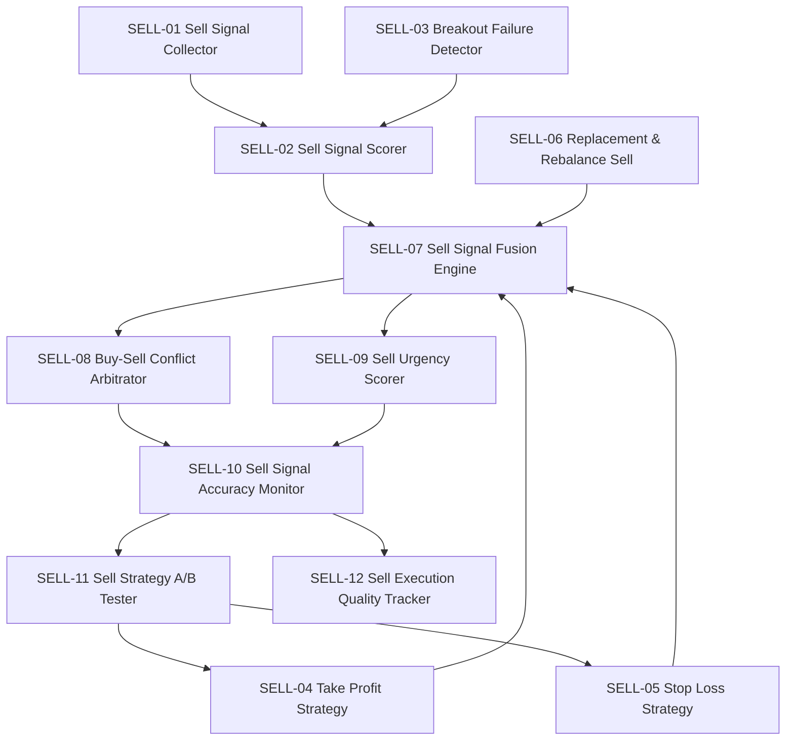

# 31 — D-SELL-DECISION 卖出决策域

> **状态**: DRAFT | **核心层**: L03 卖出决策 | **成熟度**: L1 🔵 骨架 🆕v6.0 | **简称**: SELL
> **新增**: v7.0 卖出决策域补全 🆕v6.0多时间框架共振+策略止损范式+做T协调+止损猎杀防护 | **依赖**: D-SIGNAL + D-PF-CORE + D-PF-ALLOC + D-RISK + D-POSITION(反向联动)
> **一句话**: 卖出决策的唯一融合仲裁中心——从"该不该卖"到"卖多少"到"怎么卖"的全链路裁决

## §0 域定义

| 维度 | 内容 |
|------|------|
| 域ID | D-SELL-DECISION |
| 简称 | SELL |
| 核心Aggregate | AGG-011 SellDecision / AGG-012 SellArbitration |
| 核心事件 | E-SELL-01 SellSignalFused / E-SELL-02 SellArbitrated / E-SELL-03 SellExecuted / E-SELL-04 SellLoopFeedback |
| 开发状态 | 骨架——新增域，基础实现待建 |
| 优先级 | P0（卖出决策引擎是架构级硬边界，不可绕过） |
| 激活前提 | D-SIGNAL 就绪 + D-PF-CORE 就绪 |
| 定位 | 插入在 D-SIGNAL/D-PF-CORE 和 D-POSITION 之间，是卖出信号的融合仲裁者和卖出策略的决策中心 |

> **为什么需要独立域**：卖出逻辑当前分散在 D-SIGNAL（卖出信号生成）、D-PF-CORE（组合再平衡卖出）、D-RISK（风控强制卖出）三个域中。没有一个域对"卖出决策"有完整的融合仲裁权——多个卖出信号可能同时触发（止盈70%+主力出货85%），需要融合仲裁决定综合卖出意愿和紧迫度；卖出信号与买入信号冲突时需要仲裁（卖出优先=保守原则）。D-SELL-DECISION 就是这个仲裁者——消费上游的各类卖出信号、组合状态、风控约束，融合仲裁后产出最终卖出决策。
>
> **关键不对称**：卖出是"主动决策"而非"风控附属"——卖出信号层与卖出策略工厂(C-006卖出子集)与买入端的L2-A信号层和C-006策略工厂完全对等。卖出决策引擎是复合能力（C-028卖出信号子集+C-006卖出策略子集+C-007卖出闭环优化维度+卖出信号融合仲裁），不单独分配C编号。

## §1 子模块清单

### §1.0 持仓分级层 (SELL-00)

| ID | 名称 | 职责 | 优先级 | 开发状态 | 对标依据 |
|----|------|------|:------:|:--------:|---------|
| SELL-00 | Position Triage | 持仓分级器：对标§1.2选股漏斗，将持仓分为三级——🔴Watch List(亏损接近止损线/主力行为异常/突破关键位/量价背离→实时卖出信号生成+融合仲裁，秒级)/🟡Monitor List(正常持仓无异常→定期扫描5分钟级，不进入融合仲裁)/🟢Hold List(深度盈利+远离止损+长期持有型→仅重大事件触发)。分级维度：风险敞口/盈亏状态/信号活跃度/流动性/持仓状态机阶段。动态升降级：Monitor→Watch(亏损扩大5%)/Watch→Monitor(风险解除)。输出：PositionTriageResult | P0 | ❌ | Two Sigma/Citadel Position Triage; 卖出监控分级 |

### §1.1 卖出信号层 (SELL-01~SELL-03)

| ID | 名称 | 职责 | 优先级 | 开发状态 | 对标依据 |
|----|------|------|:------:|:--------:|---------|
| SELL-01 | Sell Signal Collector | 卖出信号收集器：汇聚8类卖出信号——①基本面恶化信号(盈利预警/财务造假/行业逻辑破坏) ②技术面卖出信号(双头/头肩顶/楔形破位/均线死叉) ③量价背离信号(高位放量滞涨/分时钓鱼线) ④主力出货信号(拉升出货/高位派发/弃庄，复用L2-B六阶段识别) ⑤相对强弱卖出(跑输基准>N天/Alpha持续衰减) ⑥机会成本信号(候选池有更优标的→置换卖出) ⑦时间止损信号(持仓N天未达预期→触发退出评估) ⑧🆕v4.1突破成败信号(压力位突破失败→止损/第K次挑战失败K≥3→强制离场)。输出：标准化SellSignal列表 | P0 | ❌ | 信号聚合/标准化; 多源信号融合预处理 |
| SELL-02 | Sell Signal Scorer | 卖出信号评分器：每类信号独立评分(0~1置信度)+信号权重(基于历史准确率动态调整)+信号冲突检测(同标的多信号方向一致性检查)。🆕v6.0 多时间框架共振评分：信号标注时间框架来源(日线/60min/15min/5min)，多时间框架同方向信号叠加→共振增强(权重×1.5)，小周期与大周期方向冲突→以大周期为准。输出：加权SellSignalScore列表 | P0 | ❌ | 信号评分/置信度校准; 动态权重调整 |
| SELL-03 | Breakout Failure Detector | 突破成败检测器：消费L1因子层压力位计算结果→判定突破成功/失败→突破成功→持有/加仓信号(输出至D-POSITION)→突破失败→止损卖出信号→第K次挑战失败(K≥3)→强制清仓信号(最高优先级)。与§6.1.3轮动序列联动(板块内个股第三次挑战失败→该板块降级)、与§6.7行情生命周期联动(秋季+挑战失败→强制离场概率更高)。输出：BreakoutResult | P1 | ❌ | 技术分析突破理论; 压力位/支撑位分析 |

### §1.2 卖出策略工厂 (SELL-04~SELL-06)

| ID | 名称 | 职责 | 优先级 | 开发状态 | 对标依据 |
|----|------|------|:------:|:--------:|---------|
| SELL-04 | Take Profit Strategy Family | 止盈策略族：固定止盈/移动止盈(Trailing Stop)/分批止盈/时间加权止盈。每策略输出：止盈触发条件+止盈比例+止盈紧迫度。密度感知增强：条件PDF右偏度低→提前止盈/PDF右偏度高→放宽止盈线 | P0 | ❌ | 止盈策略/Trailing Stop; 密度感知止盈 |
| SELL-05 | Stop Loss Strategy Family | 止损策略族：固定止损/波动率止损(ATR)/密度感知止损/移动止损。逻辑止损族：基本面/技术面/事件/主力出货止损。密度感知增强：条件PDF左尾厚→收紧止损/PDF左尾薄→放宽止损。约束：突破失败的止损规则不可被概率密度软化 | P0 | ❌ | 止损策略/ATR止损; 生存分析止损时机; 密度感知止损 |
| SELL-06 | Replacement & Rebalance Sell | 置换与再平衡卖出：机会成本驱动的卖出(卖A买B)+组合再平衡驱动卖出(权重偏离>阈值→被动卖出)。输出：置换卖出指令/再平衡卖出指令 | P1 | ❌ | 机会成本/置换交易; 组合再平衡 |
| SELL-14 | Strategy-Specific Stop Framework | 策略类型→止损范式映射器：不同策略类型用完全不同的止损范式——趋势跟踪→宽止损+移动止损为主/均值回归→中等止损+固定止损为主/统计套利→无传统止损(用组合对冲+仓位管理替代)/高频→极紧止损/Carry→极宽止损或无止损。输出：StopParadigmSelection | P0 | ❌ | 机构止损框架; 策略类型决定止损范式 |
| SELL-15 | Stop-Hunting Protector | 止损猎杀防护器：止损位偏移(不精确设在技术位，偏移1-2%防猎杀)+软止损模式(到达止损位→不立即执行→进入OBSERVING观察期→观察期确认跌破(收盘价<止损位)→执行/观察期收回→解除)。输出：AdjustedStopLevel | P1 | ❌ | 止损猎杀防护; 软止损; OBSERVING观察期 |
| SELL-16 | Stop Option Pricer | 止损期权定价器：设止损=卖出隐含看跌期权→止损越紧隐含期权费越高→止损成本=隐含期权费→成本过高则换退出方式(时间止损/手动观察退出)。输出：StopCostEstimate | P1 | ❌ | 止损期权定价; 隐含期权费; 止损成本评估 |
| SELL-17 | Scaling Out Architect | 分批退出架构师：等分退出(1/3-1/3-1/3)/倒金字塔退出(50%-30%-20%)/混合退出(止盈第一批+移动止损第二批)/风险驱动退出(按MRC减仓)。逆向中止条件：第一批卖出后价格反弹超X%→暂停剩余批次→重新评估。批次间隔：至少1个交易日/紧迫度>0.8时可缩短至盘中。输出：ScalingOutPlan | P1 | ❌ | Scaling Out; 分批退出; 逆向中止 |

### §1.3 卖出情景预案层 (SELL-13)

| ID | 名称 | 职责 | 优先级 | 开发状态 | 对标依据 |
|----|------|------|:------:|:--------:|---------|
| SELL-13 | Exit Scenario Planner | 卖出情景预案器：对标C-005多情景对策，盘前预计算卖出预案——①暴跌分级退出预案(大盘暴跌>3%→预定义退出优先级+退出方式+分批退出比例) ②板块联动卖出预案(同板块持仓集体评估→联动卖出，非逐只独立处理) ③黑天鹅应急退出预案(个股突发利空→市价单+排队策略+次日集合竞价预案) ④涨跌停排队预案(封死涨跌停→次日集合竞价卖出方案+排队优先级) ⑤异常开盘预案(高开/低开异常→量价背离判定+分批退出vs持有观察决策树) ⑥🆕v6.0 Gap开盘决策框架：Gap Up+放量(>140%均量)+价格创新高→趋势延续→持有/Gap Up+缩量(<均量)+量价背离→诱多→反T卖出/Gap Down+恐慌放量+跌幅>5%→不卖最低点→等拉回再卖(OBSERVING)/Gap Down+缩量→主力洗盘→正T买入/Gap部分回补(50%)+量能不够→确认反转→卖出。预案执行：盘前加载→盘中触发时直接执行预案(而非实时计算)。输出：ExitScenarioPlan列表 | P0 | ❌ | Citadel/Millennium PM预案式卖出; 情景规划 |

### §1.4 卖出信号融合与仲裁 (SELL-07~SELL-09)

| ID | 名称 | 职责 | 优先级 | 开发状态 | 对标依据 |
|----|------|------|:------:|:------:|---------|
| SELL-07 | Sell Signal Fusion Engine | 卖出信号融合引擎：多卖出信号加权融合(如止盈70%+主力出货85%→综合卖出意愿评分)+融合算法(加权平均/贝叶斯融合/Dempster-Shafer证据理论)+信号一致性检查。输出：FusedSellDecision(综合卖出意愿0~1+触发信号列表+融合置信度) | P0 | ❌ | 多信号融合; Dempster-Shafer; 贝叶斯融合 |
| SELL-08 | Buy-Sell Conflict Arbitrator | 买卖冲突仲裁器：同标的同时存在买入+卖出信号→卖出优先(保守原则)+冲突等级分类(强冲突=卖出信号来自风控/主力出货→立即执行卖出/弱冲突=卖出信号来自止盈→可延迟1个Tick观察)+仲裁结果记录(审计追溯)。约束：卖出决策引擎在仲裁优先级中排在买入之前(风控>C-047仓位上限>市场状态>卖出决策引擎>T+1预测>...>买入决策) | P0 | ❌ | 冲突消解/保守原则; 仲裁优先级体系 |
| SELL-09 | Sell Urgency Scorer | 卖出紧迫度评分器：紧急清仓(风控触发/主力弃庄/第K次挑战失败K≥3)→紧迫度=1.0/从容退出(止盈/再平衡)→紧迫度=0.3/中等(技术面卖出/相对强弱卖出)→紧迫度=0.6。紧迫度决定执行策略：紧迫度>0.8→市价单快速执行/紧迫度0.5~0.8→限价单+时间限制/紧迫度<0.5→限价单+耐心等待。输出：SellUrgencyScore | P0 | ❌ | 紧迫度分类; 执行策略匹配 |

### §1.5 做T决策协调层 (SELL-18) 🆕v6.0

| ID | 名称 | 职责 | 优先级 | 开发状态 | 对标依据 |
|----|------|------|:------:|:--------:|---------|
| SELL-18 | T-Trade Coordinator | 做T决策协调器：A股T+1约束下的日内操作——卖出+买入的原子协调，横跨D-SELL-DECISION和D-SIGNAL/D-PF-CORE。正T协调(先买后卖)：低位买入→高位卖出底仓(底仓不变，赚差价)。反T协调(先卖后买)：高位卖出底仓→低位买回(底仓不变，赚差价)。T+1约束检查：当天买入部分不可当天卖出(只能卖底仓)。做T仓位铁律：单次做T≤底仓30%/净收益<1.5%不做/失误止损1.5%。做T方向约束：黄线持续向上(强涨)→只做正T/黄线持续向下(强跌)→只做反T。做T信号源：分时均线乖离法+量价背离共振法+箱体震荡法。输出：TTradeInstruction→同时驱动D-EX-CORE买入+卖出执行 | P0 | ❌ | A股T+1做T; 正T反T; 日内套利 |

### §1.4 卖出闭环优化 (SELL-10~SELL-12)

| ID | 名称 | 职责 | 优先级 | 开发状态 | 对标依据 |
|----|------|------|:------:|:--------:|---------|
| SELL-10 | Sell Signal Accuracy Monitor | 卖出信号准确率监控：卖出后N天内是否继续下跌？→准确率统计(按信号类型/策略类型分组)+假阳性分析(卖了又涨→止损过紧?)+假阴性分析(没卖继续跌→信号漏判?)+准确率趋势→动态调整信号权重 | P1 | ❌ | 信号准确率监控; 假阳性/假阴性分析 |
| SELL-11 | Sell Strategy A/B Tester | 卖出策略A/B测试：止盈线8% vs 10%/移动止损vs固定止损/分批止盈vs一次性止盈→统计显著性检验→参数调整建议。输出：SellABTestResult | P1 | ❌ | A/B测试; 统计显著性检验 |
| SELL-12 | Sell Execution Quality Tracker | 卖出执行质量追踪：滑点/冲击成本/执行延迟/分批执行效果→执行质量评分→反馈至卖出执行策略优化。输出：SellExecutionQuality | P1 | ❌ | TCA执行质量分析; 滑点/冲击成本追踪 |

## §2 域内依赖图



## §3 域间依赖

| 消费什么 | 来自哪个域 | 契约/事件 | 类型 |
|---------|-----------|---------|:----:|
| SellSignals (卖出信号子集) | D-SIGNAL | CTR-002 | H |
| TargetPortfolio (目标权重) | D-PF-CORE | CTR-007 | H |
| CapitalAllocationResult (策略分配) | D-PF-ALLOC | CTR-P1-003 | S |
| RiskLimits (风控约束) | D-RISK | CTR-003 | S |
| PositionSnapshot (当前持仓) | D-EX-CORE | CTR-006 | S |
| MarketRegime (市场状态) | D-SIGNAL | — | S |
| 密度预测输出(分布参数) | D-ML-SERVE | — | S |
| PositionStateFeedback (仓位状态反馈) | D-POSITION | — | S |
| StrategySellSignal (策略级卖出建议) | D-PF-CORE | CTR-007 | H |
| AIDiscoverySignal (AI发现轨卖出信号) | D-ML-SERVE | — | S |
| 权限/审计/遥测 | D-AUTONOMY | CTR-TRACE-001 | H |

| 产出什么 | 去往哪个域 | 契约/事件 | 类型 |
|---------|-----------|---------|:----:|
| SellDecision (最终卖出决策) | D-POSITION | CTR-SELL-001 | H |
| SellArbitrated (仲裁结果) | D-EX-CORE | E-SELL-02 | E |
| SellLoopFeedback (闭环反馈) | D-REPORTING | E-SELL-04 | E |
| SellAuditReport (卖出审计) | D-GOVERNANCE | — | E |
| SellSignalFused (融合结果) | D-SIGNAL | E-SELL-01 | E |
| TTradeInstruction (做T指令) | D-EX-CORE | — | H |
| SellConvergenceResult (多策略卖出共振结果) | D-PF-CORE | — | E |

## §4 域事件流

| 事件ID | 事件名 | 触发条件 | 消费者 |
|--------|--------|---------|--------|
| E-SELL-01 | SellSignalFused | 卖出信号融合完成(综合卖出意愿确定) | D-POSITION, D-SIGNAL |
| E-SELL-02 | SellArbitrated | 买卖冲突仲裁完成(卖出优先/延迟观察) | D-EX-CORE, D-PF-CORE |
| E-SELL-03 | SellExecuted | 卖出执行完成(成交回报确认) | D-REPORTING, D-RISK |
| E-SELL-04 | SellLoopFeedback | 卖出闭环优化反馈(准确率/执行质量) | D-REPORTING, D-AUTONOMY-CORE |
| E-SELL-05 | TTradeExecuted | 做T执行完成(买入+卖出原子操作闭环) | D-REPORTING, D-POSITION |

## §5 激活前提与就绪条件

| 前提 | 就绪标准 |
|------|---------|
| D-SIGNAL 就绪 | CTR-002 FactorSignal 可用，卖出信号子集可产出 |
| D-PF-CORE 就绪 | CTR-007 TargetPortfolio 可用 |
| 降级模式 | 卖出信号融合仲裁未就绪→降级为各卖出信号独立触发（止盈/止损/风控卖出各自直接执行，跳过融合仲裁），见§9.1降级模式 |

## §6 设计决策记录

| 日期 | 决策 | 理由 | 对标来源 |
|------|------|------|---------|
| 2026-05-24 | 新增D-SELL-DECISION独立域 | 卖出逻辑分散在SIGNAL/PF-CORE/RISK三个域，缺少统一融合仲裁者。卖出是"主动决策"而非"风控附属" | DDD限界上下文/单一职责; 流水线设计§1.4 |
| 2026-05-24 | 卖出vs买入冲突→卖出优先(保守原则) | 防御永远优先于进攻，卖比买紧急 | 流水线设计§16仲裁优先级 |
| 2026-05-24 | 卖出决策引擎是复合能力，不单独分配C编号 | 卖出决策引擎横跨C-028(卖出信号子集)+C-006(卖出策略子集)+C-007(卖出闭环优化)+融合仲裁，无法归入单一C编号 | 流水线设计§20.11架构级硬边界 |
| 2026-05-24 | 突破成败信号纳入卖出域 | 压力位突破失败→止损卖出是卖出决策，第K次挑战失败→强制清仓是卖出最高优先级信号 | 流水线设计§1.4 v4.1 |
| 2026-05-24 | 卖出决策硬边界：不可绕过融合仲裁 | 卖出决策必须经过卖出决策引擎的融合仲裁，不可绕过仲裁直接执行卖出。降级例外：引擎未就绪时各信号独立触发 | 流水线设计§20.11架构级硬边界 |
| 2026-05-24 | 密度预测不软化硬规则 | 突破失败的止损规则不可被概率密度软化；第3次挑战失败是绝对规则 | 流水线设计§1.4 v4.1 |
| 2026-05-24 | 增加多时间框架信号共振 | 15min+30min+日线信号共振是卖出决策的核心架构，没有这个架构是废的 | Triple Screen(Elder 1986)/期货日内四维闭环 |
| 2026-05-24 | 增加策略类型→止损范式映射 | 不同策略类型的止损逻辑完全不同，一刀切会破坏策略edge | 机构止损框架(BreakingAlpha) |
| 2026-05-24 | 增加做T决策协调器 | A股T+1约束下做T是核心日内操作，需要卖出+买入原子协调 | A股做T实战 |
| 2026-05-24 | 增加止损猎杀防护 | 做市商和HFT主动猎杀止损位，软止损+OBSERVING观察期防护 | 机构止损猎杀研究 |
| 2026-05-24 | 增加卖出-仓位双向联动 | 卖出逻辑和仓位高度联动，仓位状态反向影响卖出阈值 | 用户实战经验 |
| 2026-05-24 | 增加双轨卖出决策 | 轨道1(逻辑驱动:多策略共振卖出+因子直通)+轨道2(数据驱动:AI发现轨卖出信号)→双轨融合 | 专业机构双轨架构; 入场出场逻辑必须匹配 |
| 2026-05-24 | 增加入场-出场匹配铁律 | 趋势策略金叉买→死叉卖(不可用固定止损); 均值回归超买卖→回归均值卖; 突破策略突破买→突破失败卖 | 量化社区铁律; 策略edge完整性 |

## §7 卖出决策四层架构

```
┌──────────────────────────────────────────────────────────────────┐
│ D-SELL-DECISION 卖出决策四层架构                                    │
├──────────────────────────────────────────────────────────────────┤
│                                                                  │
│  第一层：卖出信号层 (Sell Signal Layer)                             │
│  ├─ 8类卖出信号收集：基本面/技术面/量价/主力/相对强弱/机会成本/时间/突破成败  │
│  ├─ 信号标准化与评分：每信号独立置信度+动态权重                       │
│  └─ 突破成败检测：压力位突破失败→止损/第K次失败→强制离场              │
│                         │                                        │
│                         ▼                                        │
│  第二层：卖出策略层 (Sell Strategy Layer)                           │
│  ├─ 止盈策略族：固定/移动/分批/时间加权+密度感知增强                  │
│  ├─ 止损策略族：固定/ATR/密度感知/移动+逻辑止损族                    │
│  └─ 置换与再平衡卖出：机会成本驱动+组合权重偏离驱动                    │
│                         │                                        │
│                         ▼                                        │
│  第三层：融合仲裁层 (Fusion & Arbitration Layer)                    │
│  ├─ 多信号加权融合：综合卖出意愿评分(0~1)                           │
│  ├─ 买卖冲突仲裁：卖出优先(保守原则)+冲突等级分类                     │
│  └─ 紧迫度评分：紧急清仓(1.0)/中等(0.6)/从容(0.3)→匹配执行策略       │
│                         │                                        │
│                         ▼                                        │
│  第四层：闭环优化层 (Closed-loop Optimization Layer)                │
│  ├─ 卖出信号准确率监控：假阳性/假阴性分析→信号权重调整                 │
│  ├─ 卖出策略A/B测试：参数优化→策略参数调整                           │
│  └─ 卖出执行质量追踪：滑点/冲击成本→执行策略优化                      │
│                                                                  │
└──────────────────────────────────────────────────────────────────┘
```

## §8 CTR-SELL-001 SellDecision 定义

| 字段 | 类型 | 说明 |
|------|------|------|
| decision_id | str | 卖出决策唯一标识 |
| symbol | str | 标的代码 |
| sell_type | str | 卖出类型: full_clear(全部清仓)/partial_sell(部分卖出)/replacement(置换卖出)/rebalance(再平衡卖出) |
| sell_qty | int | 卖出数量(lot_size整数倍) |
| sell_urgency | float | 紧迫度评分[0,1] |
| fused_sell_willingness | float | 综合卖出意愿[0,1] |
| triggered_signals | list[SellSignalScore] | 触发的卖出信号列表(含置信度+权重) |
| conflict_arbitration | str | 冲突仲裁结果: sell_priority(卖出优先)/delayed_observe(延迟观察)/no_conflict(无冲突) |
| strategy_id | str | 关联策略ID |
| reason | str | 卖出原因(人类可读) |
| density_aware_adjustment | dict | 密度感知调整参数(偏度/峰度/VaR对止损止盈的调整) |
| created_at | datetime | 创建时间 |
| idempotency_key | str | 幂等键 |
| schema_version | str | "1.0" |

## §9 第3组联合依赖图分析 (G3: SELL+POS+XC+XS)

> **骨架厚度**: D-SELL-DECISION=极薄(2✅) | 需从能力定位书§9+域文件§0+交易决策架构§18推导隐含骨架约束

### §9.1 能力←→子模块对齐

**YAML SSoT状态**: ❌ 不存在（新增域，需补入YAML）
**能力定位书状态**: ❌ 不存在（复合能力，不单独分配C编号）

| 能力来源 | 能力项 | 对标子模块 | 覆盖 |
|---------|--------|-----------|:----:|
| C-028(卖出信号子集) | 卖出信号收集+评分+突破成败 | SELL-00/01/02/03 | ✅ |
| C-006(卖出策略子集) | 止盈/止损/置换再平衡卖出 | SELL-04/05/06/14/15/16/17 | ✅ |
| C-007(卖出闭环优化维度) | 信号准确率+A/B测试+执行质量 | SELL-10/11/12 | ✅ |
| 架构级硬边界(§20.11) | 卖出信号融合仲裁 | SELL-07/08/09 | ✅ |
| C-012(做T日内套利-辅助) | 做T决策协调 | SELL-18 | ✅ |
| §1.4 v4.1 | 突破成败信号 | SELL-03 | ✅ |
| C-005(多情景对策) | 卖出情景预案 | SELL-13 | ✅ |
| §16仲裁优先级 | 买卖冲突仲裁(卖出优先) | SELL-08 | ✅ |

**覆盖检查**: 8项隐含能力 → 19个子模块全覆盖 ✅ | 反向去冗余: 无冗余 ✅

### §9.2 四域核心数据流（SELL视角）

```
D-SIGNAL ──→ D-SELL-DECISION ──→ D-POSITION ──→ D-EX-CORE ──→ D-EX-SOR
  │ CTR-002      CTR-SELL-001      CTR-POS-001    CTR-004       CTR-004
  │ 卖出信号子集   SellDecision      PositionPlan   Order+路由参数  Order执行
```

**SELL在四域链路中的位置**: 第2环——消费上游信号/组合/风控，产出SellDecision给仓位域，产出SellArbitrated/TTradeInstruction给执行域

### §9.3 关键跨域接口（SELL相关）

| 方向 | 接口 | 契约/事件 | 优先级 | 签名冻结 |
|------|------|---------|:------:|:--------:|
| →产出 | SellDecision | CTR-SELL-001 | P0 | ✅冻结 |
| →产出 | SellArbitrated(仲裁结果) | E-SELL-02 | P0 | ✅冻结 |
| →产出 | TTradeInstruction(做T指令) | — | P0 | 可演进 |
| →产出 | SellSignalFused(融合结果) | E-SELL-01 | P0 | ✅冻结 |
| ←消费 | PositionStateFeedback | — | P0 | 可演进 |

**卖出-仓位双向联动(POS-16↔SELL-08)**: 正向(SellDecision→仓位调整) + 反向(仓位状态→卖出阈值调整: 深度盈利→卖出阈值更宽松/接近止损→更紧张)

### §9.4 跨域事件因果链（SELL参与）

```
卖出信号触发链:
  D-SIGNAL卖出信号 → E-SG-01 → SELL-01收集 → SELL-02评分 → SELL-07融合
    → E-SELL-01 SellSignalFused → POS-01仓位裁决
    → E-POS-01 PositionSized → EX-CORE-01订单 → EX-SOR路由 → 成交

风控强制卖出链:
  D-RISK E-RK-01 RiskLimitBreached → SELL-07融合(最高优先级)
    → E-SELL-02 SellArbitrated(sell_priority) → EX-CORE-02紧急执行
    → 紧迫度>0.8 → 市价单快速执行

做T执行链:
  SELL-18做T协调 → TTradeInstruction → EX-CORE-01生成买入+卖出Order
    → 原子执行(先买后卖/先卖后买) → E-SELL-05 TTradeExecuted
```

### §9.5 四域激活序列

```
激活顺序: RISK → AUTONOMY → SIGNAL → PF-CORE+PF-ALLOC → SELL-DECISION → POSITION → EX-CORE → EX-SOR
SELL激活前提: D-SIGNAL就绪(CTR-002) + D-PF-CORE就绪(CTR-007)
SELL降级模式: 融合仲裁未就绪 → 各卖出信号独立触发(止盈/止损/风控卖出各自直接执行)，跳过融合仲裁
```

### §9.6 仲裁优先级体系（四域视角）

```
1. C-004 风控 (D-RISK) — 绝对否决权
2. C-047 仓位上限 (D-POSITION POS-10) — 硬约束
3. C-021 市场状态仓位上限 — 硬约束
4. 卖出决策引擎 (D-SELL-DECISION SELL-07/08) — 卖出优先于买入 ← SELL在此
5. T+1次日预测 (C-014)
6. 安全防护 (C-033/C-031)
7. 交易策略 (C-005/C-012)
8. 买入决策 (C-006)
9. 研究探索 (C-006/C-007/C-027)

核心原则: 防御永远优先于进攻。卖出决策引擎排在买入之前（卖比买紧急）。
```

### §9.7 YAML SSoT补入建议

```yaml
# 需补入的节点
- scope: domain
  node_id: D-SELL-DECISION
  type: domain
  name: D-SELL-DECISION-卖出决策域
  stability: evolving
  safety_level: H
  ai_autonomy: ai_modifiable
  tags: [核心价值链, SELL]
  lifecycle: design_only
  maturity: design
  security_boundary: trusted_core

# 需补入的边
- edge_id: E-SELL-001
  from: D-SELL-DECISION
  to: D-SIGNAL
  dep_type: import_depends
  strength: hard
  description: '消费卖出信号子集 CTR-002'
- edge_id: E-SELL-002
  from: D-SELL-DECISION
  to: D-PF-CORE
  dep_type: import_depends
  strength: hard
  description: '消费TargetPortfolio CTR-007'
- edge_id: E-SELL-003
  from: D-SELL-DECISION
  to: D-RISK
  dep_type: import_depends
  strength: soft
  description: '消费风控约束 CTR-003'
- edge_id: E-SELL-004
  from: D-SELL-DECISION
  to: D-POSITION
  dep_type: import_depends
  strength: hard
  description: '产出SellDecision CTR-SELL-001'
- edge_id: E-SELL-005
  from: D-SELL-DECISION
  to: D-EX-CORE
  dep_type: event_depends
  strength: event_driven
  description: 'SellArbitrated+TTradeInstruction'

# 需补入的聚合根
- agg_id: AGG-011
  name: SellDecision
  domain_id: D-SELL-DECISION
  invariant: 卖出决策必须经过融合仲裁; 卖出vs买入→卖出优先
- agg_id: AGG-012
  name: SellArbitration
  domain_id: D-SELL-DECISION
  invariant: 仲裁结果不可篡改; 冲突等级分类完整

# 需补入的契约
- contract_id: CTR-SELL-001
  name: SellDecision
  priority: P0
  new_source_domain: D-SELL-DECISION
  new_target_domains: [D-POSITION, D-EX-CORE]
  flow: D-SELL-DECISION→D-POSITION/D-EX-CORE

# 需补入的事件流
- event_id: E-SELL-01
  name: SellSignalFused
  new_domain: D-SELL-DECISION
  aggregate: AGG-011
  source_domain: D-SELL-DECISION
  target_domain: D-POSITION
  frequency: L2
  contract_ref: CTR-SELL-001
- event_id: E-SELL-02
  name: SellArbitrated
  new_domain: D-SELL-DECISION
  aggregate: AGG-012
  source_domain: D-SELL-DECISION
  target_domain: D-EX-CORE
  frequency: L2
  contract_ref: CTR-SELL-001

# 需补入的不变量
- inv_id: INV-SELL-001
  category: boundary_integrity
  statement: 卖出决策必须经过融合仲裁，不可绕过仲裁直接执行卖出。降级例外：引擎未就绪时各信号独立触发，但需审计记录
  owner_domain: D-SELL-DECISION
  violation_action: reject_commit
  priority: P0
  runtime_plane: hot
```

### §9.8 场内代码对账（SELL相关）

**关键发现**: D-SELL-DECISION在代码中完全空白，需从零建设。无任何已有代码模块对标。

✅ 文件完整性验证通过

## §7 合规约束(A6)

> 源自合规架构(A6)§1.1.1跌停板交易约束+§1.2市场操纵防护。卖出决策域是卖出相关合规约束的直接执行层——跌停板不卖出/市场操纵防护均由本域落地。

### §7.1 跌停板不卖出（源自A6§1.1.1）

> 对标A股交易规则：跌停板价格下无法成交卖出。卖出决策域在卖出信号仲裁后、订单提交前执行此硬约束。

| 维度 | 内容 |
|------|------|
| 约束类型 | Hard Block |
| 触发条件 | 标的当前价格 = 跌停板价格 |
| 执行动作 | 不提交卖出订单（跌停板价格下卖单排队，无法成交） |
| 例外 | 无（跌停板不卖出是硬约束，不可由合规官放行） |
| 优先级 | P0 |
| 运行平面 | hot(交易平面) |

**D-SELL-DECISION执行方式**：

```
卖出信号仲裁(SellArbitrated, E-SELL-02)
    │
    ▼
跌停板检查: 当前价格 == 跌停板价格?
    │
    Yes → Hard Block: 不提交卖出订单
    │        │
    │        ▼
    │    记录: {标的, 跌停价格, 卖出信号来源, 拦截时间}
    │        │
    │        ▼
    │    事件: E-SELL-BLOCK-01 LimitDownBlock
    │
    No → 正常卖出流程→D-EX-CORE执行
```

**与SELL-13 Exit Scenario Planner的关系**：SELL-13的"涨跌停排队预案"处理的是买入侧的涨停板排队场景，而§7.1处理的是卖出侧的跌停板不卖出场景——两者是互补的。

### §7.2 市场操纵防护——卖出视角（源自A6§1.2）

> 对标《证券法》市场操纵条款、IOSCO市场操纵识别指南。卖出决策域在卖出信号生成阶段执行市场操纵防护检测。

| 防护项 | 检测内容 | 检测方式 | 违规动作 | D-SELL-DECISION执行方式 |
|--------|---------|---------|---------|----------------------|
| 尾盘操纵检测 | 收盘前30分钟内大额卖出(占日均成交量>5%) | C-004时段+成交量异常检测 | Hard Block:拒绝尾盘大额卖出 | SELL-01~05卖出信号→C-004时段检查→尾盘大额卖出Hard Block |
| 假拉升真出货识别 | 标的价格短期拉升后立即触发卖出信号(拉高出货模式) | C-004价格形态+卖出信号关联检测 | Warning:标记可疑+推送提醒 | SELL-01~05卖出信号→C-004价格形态关联检测→可疑信号Warning |

**模块27映射**：合规架构§1.2模块27"市场操纵防护"的卖出相关子模块由D-SELL-DECISION执行，买入相关子模块由D-EX-CORE执行。

### 与现有内容重叠检查

| 本域已有内容 | 新搬入内容 | 重叠处理 |
|------------|-----------|---------|
| SELL-13 Exit Scenario Planner(涨跌停排队预案) | §7.1跌停板不卖出 | ⚠️部分重叠：SELL-13处理买入侧涨停板排队，§7.1处理卖出侧跌停板不卖出——视角不同，互补关系 |
| INV-SELL-001(卖出必须经过融合仲裁) | §7.1跌停板不卖出 | ✅互补：INV-SELL-001保证卖出决策流程合规，§7.1保证卖出执行合规(跌停板不提交) |
| §9.8场内代码对账(D-SELL-DECISION完全空白) | §7.1/§7.2全部内容 | ✅无重叠：域内无已有代码，§7.1/§7.2为新建模块提供合规约束规格 |

## §8 风险架构(A4)交叉内容

> **来源**: 风险架构(A4) §3.3 ATR动态止损与Bayesian参数优化模型。本节从**卖出决策视角**搬入ATR动态止损的完整模型——定义卖出域须执行的ATR止损参数、优化框架与止盈策略。风险架构(A4)为ATR模型参数的唯一真源，本节为卖出域的ATR止损执行规格。

### §8.1 ATR动态止损模型

**架构现状**: 模块44有买卖点模式库（含止损规则），但缺乏**基于波动率的动态止损**和**参数优化框架**。固定百分比止损（-7%）不适应不同波动率环境。

**核心逻辑**: 固定百分比止损（如-7%）是拍脑门的——高波动股7%只是正常波动，低波动股7%已是重大破位。专业机构用ATR（Average True Range）动态调整止损：Stop = Entry ± k×ATR，k通过Bayesian优化确定。高波动时止损放宽，低波动时止损收紧，始终保持相同的"正常噪声容忍度"。

#### 43.1 ATR动态止损

| 功能点 | 量化方法 | 说明 |
|--------|---------|------|
| ATR计算 | ATR = Average(True Range, 14) | True Range = max(H-L, \|H-C_prev\|, \|L-C_prev\|) |
| 做多止损 | Stop_Long = Entry - k × ATR | k=1.5-2x（日内）/ 3-4x（波段） |
| 做空止损 | Stop_Short = Entry + k × ATR | 同上 |
| 追踪止损 | Trailing_Stop = max(历史最高价 - k × ATR, 前一日止损位) | 只上移不下移，锁定盈利 |

#### 43.2 止损参数优化

| 功能点 | 量化方法 | 说明 |
|--------|---------|------|
| Grid Search | 遍历k∈[1.0, 5.0]步长0.5，计算各k的Sharpe/MaxDD | 全局搜索但计算量大 |
| Bayesian优化 | 用高斯过程建模k→Sharpe映射，聚焦有前景区域 | amhieu(2025)：比Grid Search更高效 |
| Walk-Forward验证 | 样本内优化k→样本外验证→滚动前进 | 防止过拟合 |
| 体制自适应 | 不同市场体制（趋势/均值回归/混沌）使用不同k | 趋势市k=3-4（宽止损）/ 均值回归市k=1.5-2（紧止损） |

#### 43.3 止盈策略

| 功能点 | 量化方法 | 说明 |
|--------|---------|------|
| ATR动态止盈 | Target = Entry + m × ATR | m通常为k的1.5-2倍（盈亏比>1.5） |
| 分批止盈 | 1/3仓位在1R止盈+1/3在2R+1/3追踪止损 | R=初始风险(Entry-Stop) |
| 时间止损 | 持仓N日未达1R盈利→平仓 | 适用于短期动量策略 |

#### 43.4 学术与业界对标

**对标1: Wilder "Average True Range" (1978, New Concepts in Technical Trading Systems)**

ATR是波动率的标准度量。ATR止损 = Entry ± k×ATR是业界标准，k通过历史回测优化。

**对标2: LuxAlgo "ATR Stop-Loss Best Practices" (2025)**

日内k=1.5-2x，波段k=3-4x。ADX>25（强趋势）用标准k，ADX<25（弱趋势）增加k 50%。

**对标3: Bayesian Optimization for Stop-Loss (amhieu 2025)**

用高斯过程建模参数→性能映射，比Grid Search更高效。Walk-Forward验证防止过拟合。

**建议归属层**: L4 风控层（ATR动态止损+参数优化）+ L3 策略工厂（止盈策略）

### §8.2 止损触发流程

```
ATR止损触发链:
  D-SIGNAL价格更新 → ATR计算(True Range, 14)
    → 当前价格 vs Stop_Long/Stop_Short判定
    → 触发止损 → SELL-05 Stop Loss Strategy Family执行
    → SELL-07融合仲裁(止损信号优先级高)
    → E-SELL-02 SellArbitrated → D-EX-CORE执行
```

### §8.3 止损与风控否决的交互

| 交互场景 | ATR止损行为 | 风控否决行为 | 交互结果 |
|---------|-----------|-----------|---------|
| ATR止损触发+风控限额未超 | 止损信号生成 | 无否决 | 正常止损执行 |
| ATR止损触发+风控限额已超 | 止损信号生成 | 风控否决新买入 | 止损执行+禁止新买入 |
| ATR止损未触发+风控强制减仓 | 无止损信号 | 风控强制减仓 | 风控优先，强制减仓执行 |
| ATR止损触发+跌停板 | 止损信号生成 | 跌停板不卖出(§7.1) | 止损信号排队，跌停板解除后执行 |

### §8.4 与已有子模块的映射

| 风险架构内容 | 卖出域子模块 | 执行模式 | 重叠说明 |
|------------|------------|---------|---------|
| §8.1 ATR动态止损 | SELL-05 Stop Loss Strategy Family | 止损策略 | SELL-05已有"波动率止损(ATR)"条目，本节补充完整ATR参数与公式 |
| §8.1 止损参数优化 | SELL-14 Strategy-Specific Stop Framework | 参数优化 | SELL-14已有"策略类型→止损范式映射"，本节补充Bayesian优化+体制自适应k值 |
| §8.1 止盈策略 | SELL-04 Take Profit Strategy Family | 止盈策略 | SELL-04已有"固定/移动/分批/时间加权止盈"，本节补充ATR动态止盈+分批止盈R单位 |
| §8.2 止损触发流程 | SELL-07 Sell Signal Fusion Engine | 信号融合 | 新增ATR止损→融合仲裁的触发链路 |
| §8.3 止损与风控否决交互 | SELL-08 Buy-Sell Conflict Arbitrator | 冲突仲裁 | 新增ATR止损与风控否决的交互场景 |

## §10 安全架构约束（源自A5安全架构）

> 来源：A5安全架构 §15.10 卖出决策安全约束

### §10.1 卖出决策安全模块

> 来源：A5安全架构 §15.10

| 模块ID | 名称 | 裁定 | 说明 | 备注 |
|--------|------|------|------|------|
| SELL-08 | 买卖冲突仲裁器安全约束 | **能建** | 卖出优先(保守原则)+仲裁结果审计追溯 | §1.4已有SELL-08，本节补充安全约束维度 |
| SELL-15 | 止损猎杀防护器 | **能建** | 止损位偏移+软止损+OBSERVING观察期 | §1.2已有SELL-15，安全架构确认其安全属性 |
| SELL-00 | 持仓分级安全约束 | **能建** | Watch/Monitor/Hold三级分级+动态升降级审计 | §1.0已有SELL-00，本节补充升降级审计安全约束 |

**与现有子模块的对齐**：三个安全模块在子模块清单中均已存在（SELL-00/08/15），安全架构约束为已有模块增加安全维度约束——仲裁结果审计追溯、止损猎杀防护、升降级审计。无需新增子模块，但需在实现中补充安全约束规格。

## 来自Agent架构(A7)的内容

> **来源**: Agent架构(A7) v3.0 §1.3战术Agent、§9.2.2 Agent→业务功能域消费映射、§0.3 Agent架构总览。本节从**Agent架构视角**搬入卖出决策相关内容。Agent架构(A7)为Agent行为的唯一真源，本节为卖出决策域的Agent行为规格。

### 来自Agent架构(A7) §1.3 战术Agent — 做T Agent（卖出决策相关部分）

| 属性 | 做T Agent (DayTrade) — 卖出决策相关 |
|------|-------------------------------------|
| **职责(卖出相关)** | 日内T+0套利、底仓管理、分时信号→做T卖出协调→D-SELL-DECISION |
| **输入** | 底仓信息、分时因子、波动率、流动性 |
| **输出(卖出相关)** | 做T指令(买/卖底仓)、做T盈亏预估→D-SELL-DECISION（做T卖出协调） |
| **自治级别** | Level 1（确定性系统：做T规则硬编码，参数微调自主） |
| **延迟目标** | <1s（做T时机捕捉） |
| **对应能力** | C-012 做T日内套利 |
| **对应域(归属域)** | D-EX-CORE + D-SIGNAL |
| **LLM路由** | 本地优先（低延迟要求） |
| **运行时段** | 盘中 |

### 来自Agent架构(A7) §9.2.2 Agent→业务功能域消费映射 — 卖出决策相关

| Agent | 消费域（数据/信号来源） | 产出域（输出去向） |
|-------|---------------------|------------------|
| 信号Agent | D-FACTOR（因子值）、D-SIGNAL（策略信号）、D-ML-SERVE（模型推理） | D-SIGNAL（加权信号）、**D-SELL-DECISION（卖出信号）** |
| 做T Agent | D-DATA（分时数据）、D-POSITION（底仓信息）、D-SIGNAL（分时买卖信号） | D-EX-CORE（做T指令）、**D-SELL-DECISION（做T卖出协调）** |

### 来自Agent架构(A7) §0.3 Agent架构总览 — 横切层5自反Agent（卖出反思相关）

横切层5: 自反Agent (Actor-Evaluator-SelfReflection) · §6
- L1单轨迹反思(默认每次,ReflCtrl可跳过) → L2任务内反思(N=5次) → L3任务间反思(日/周/月)
- 前瞻反思(执行前预判) | Agent-R实时轨迹内反思(4场景: 信号偏差/滑点异常/参数漂移/状态突变)
- ReflCtrl频率控制(预估节省20-80%推理token,论文实测33.6%)

**卖出反思维度**：卖出决策的自反Agent反思聚焦于——①卖出信号准确率(假阳性/假阴性分析) ②止损参数漂移(止损过紧/过松) ③卖出执行质量(滑点/冲击成本) ④做T决策反思(做T盈亏vs持有盈亏对比)。与SELL-10/11/12闭环优化子模块对齐。

---

## §8 运维架构(A9)规格

> **搬入来源**: 运维架构(A9) §4应急保命轨(卖出决策视角)
> **搬入原则**: 将A9中D-SELL-DECISION域承载的运维规格搬入本域，保持A9原文颗粒度。

### §8.1 卖出降级——保命轨视角（A9§4）

| 降级路径 | 卖出决策动作 | 对应子模块 |
|---------|-------------|-----------|
| D-L0→D-L1 | 激活止损策略，降低卖出阈值 | SELL-05 密度感知止损 |
| D-L1→D-L2 | 强制执行保命规则集(SURV-003: 日亏损>5%清仓) | SELL-05 + RK-17 Kill Switch |
| D-L2→D-L3 | 撤销所有挂单，停止一切卖出(仅持仓监控) | SELL-05 |
| ST/退市风险 | 次日清仓(SURV-008) | SELL-05 + RK-03持仓监控 |

## 来自学习系统架构(A8)的内容

> **搬入来源**: 学习系统架构(A8) §5.1知识类型分类体系 + §11.1知识注入接口 + §9.2学习效果反馈闭环 + §9.1元学习维度
> **搬入原则**: 将A8中与卖出决策直接相关的学习系统规格搬入本域，保持A8原文颗粒度。

### 来自学习系统架构(A8) — 知识类型分类体系（卖出决策视角）

> 来源：学习系统架构(A8) §5.1

11类交易知识中，与卖出决策直接相关的4类知识及其卖出域映射：

| 知识类型 | 定义 | 卖出相关提取 | 映射目标（卖出域子模块） |
|---------|------|------------|----------------------|
| 策略知识 (Strategy Knowledge) | 完整的交易策略逻辑——什么条件下买入/卖出/持有 | 卖出条件 + 止盈止损规则 + 适用市场状态 | SELL-04 Take Profit Strategy Family + SELL-05 Stop Loss Strategy Family + SELL-14 Strategy-Specific Stop Framework |
| 风控知识 (Risk Management Knowledge) | 风险识别与应对规则 | 风险类型 + 触发条件 + 应对措施（含卖出应对） + 时间窗口 | SELL-05 Stop Loss Strategy Family（风控止损） + SELL-09 Sell Urgency Scorer（紧急清仓） |
| 博弈知识 (Game Theory Knowledge)（v4.0新增） | 市场参与者之间的博弈关系与行为模式 | 博弈方 + 博弈策略 + 均衡条件 + 识别信号（含主力出货信号） | SELL-01 Sell Signal Collector（主力出货信号④） + SELL-15 Stop-Hunting Protector（止损猎杀防护） |
| 教训知识 (Lesson Learned Knowledge)（v8.0新增） | 失败案例的根因分析与预防措施 | 失败场景（含卖出失败案例） + 根因分析 + 预防措施 | SELL-10 Sell Signal Accuracy Monitor（假阳性/假阴性分析→信号权重调整） + SELL-11 Sell Strategy A/B Tester（参数优化） |

**卖出知识注入的完整链路**：学习系统S2知识分类→识别卖出相关知识类型→§11.1注入路径→卖出域子模块消费→§9.2效果反馈→学习系统调整。

### 来自学习系统架构(A8) — 知识注入接口（卖出决策视角）

> 来源：学习系统架构(A8) §11.1

学习系统 → 交易流水线的14条注入路径中，与卖出决策直接相关的3条：

| 注入路径 | 接口 | 约束 | D-SELL-DECISION消费方式 |
|---------|------|------|----------------------|
| 6. 注入L3策略层 | ClassifiedKnowledgePackage(knowledge_type=strategy) → C-006策略工厂注册 | 必须通过C-003完整验证+模拟盘观察≥1周+冷启动协议 | 卖出策略知识（止盈/止损/置换策略）→C-006注册→SELL-04/05/06消费策略卖出信号 |
| 7. 注入L4风控层 | ClassifiedKnowledgePackage(knowledge_type=risk) → C-004规则引擎更新 | 风控规则变更需人工审核+不可降低硬边界保护水平 | 风控卖出知识（止损规则/强制减仓规则）→C-004更新→SELL-05消费风控止损信号 |
| 14. 注入L4风控层-教训知识（v8.0新增） | ClassifiedKnowledgePackage(knowledge_type=lesson_learned) → C-004规则引擎(新增预防规则) / L5闭环优化层(失败模式库) | 教训知识注入需人工审核确认根因分析合理性+预防措施可执行性 | 卖出教训知识（止损过紧/过松/卖出时机错误）→C-004新增预防规则→SELL-10/11消费→信号权重/策略参数调整 |

**卖出知识类型→注入路径映射**：

| 知识类型 | 注入路径编号 | 卖出域消费模块 |
|---------|------------|--------------|
| strategy（含卖出条件） | 6(L3策略层) | SELL-04/05/06 |
| risk（含卖出应对） | 7(L4风控层) | SELL-05/09 |
| lesson_learned（含卖出教训） | 14(L4风控层-教训知识) | SELL-10/11 |

### 来自学习系统架构(A8) — 学习效果反馈闭环（卖出决策视角）

> 来源：学习系统架构(A8) §9.2

交易流水线 → 学习系统的4条外部反馈路径中，与卖出决策直接相关的3条：

| 反馈路径 | 接口 | 频率 | 业务逻辑 | D-SELL-DECISION角色 |
|---------|------|:----:|---------|-------------------|
| C-010复盘数据 → 学习系统评估"注入的知识是否有效" | C-010每日PnL报表+策略归因报告 → 学习系统知识效果评估器 | 每日 | 有效→提高该知识来源/作者置信度→增加采集频率；无效→降低置信度→减少采集频率或标记不可靠 | SELL-10 Sell Signal Accuracy Monitor产出卖出信号准确率→纳入C-010复盘数据→驱动学习系统评估卖出相关知识有效性 |
| C-007闭环结果 → 学习系统调整知识提取策略 | C-007优化维度执行结果 → 学习系统元学习层(S6) | 每周 | 学习产出模块持续有效→当前学习策略好→保持；模块快速失效→学习策略有问题→S6调整 | SELL-11 Sell Strategy A/B Tester产出卖出策略优化结果→纳入C-007闭环→驱动学习系统调整卖出策略提取方法 |
| C-033过拟合报告 → 学习系统标记"过拟合知识" | C-033过拟合检测结果 → 学习系统知识库 | 每周 | 某知识产出模块过拟合→标记该知识为"过拟合知识"→降低权重 | SELL-10/11检测到卖出策略过拟合（如止损参数过度拟合历史数据）→纳入C-033→驱动学习系统标记过拟合卖出知识 |

**卖出决策在反馈闭环中的位置**：D-SELL-DECISION是卖出效果反馈的关键数据生产者——卖出信号准确率(SELL-10)、卖出策略优化结果(SELL-11)、卖出执行质量(SELL-12)均通过E-SELL-04 SellLoopFeedback输出至D-REPORTING，再由D-REPORTING纳入C-010/C-007/C-033反馈至学习系统。

### 来自学习系统架构(A8) — 元学习维度（卖出决策视角）

> 来源：学习系统架构(A8) §9.1

元学习架构18个维度中，与卖出决策直接相关的4个维度：

| 元学习维度 | 核心思想 | 与卖出决策的关系 | D-SELL-DECISION影响 |
|-----------|---------|----------------|-------------------|
| 1. 学习如何学习（Prompt自优化循环，STOP模式） | 调整知识提取的LLM prompt和分类策略，提高提取质量 | 卖出策略知识的提取prompt优化→更准确的卖出条件提取 | SELL-04/05消费更高质量的卖出策略知识→止盈止损规则更精确 |
| 2. 学习架构优化（代码自纠正循环，RISE模式） | 发现更优的模块组合方式，优化交易流水线架构 | 卖出模块组合优化→止盈+止损+融合仲裁的最优组合发现 | SELL-07融合仲裁架构优化→多卖出信号融合算法改进 |
| 3. 学习代码生成（技能库积累，Voyager模式） | 成功模块的代码片段/策略模板/因子公式→结构化存储→新任务优先检索复用 | 成功的卖出策略代码片段/止损公式/止盈模板存入技能库→新卖出策略优先复用 | SELL-04/05新策略开发时优先从技能库检索→加速卖出策略收敛 |
| 7. 在线EWC防遗忘（v4.0新增） | Fisher信息矩阵正则化关键参数，防止灾难性遗忘 | 元学习更新卖出策略参数时，保留历史有效的卖出知识 | SELL-14策略类型→止损范式映射的参数更新不遗忘历史有效止损范式 |

**卖出决策在元学习中的闭环**：学习系统S6元学习→优化卖出知识提取/代码生成/参数更新→卖出域消费更高质量知识→SELL-10/11/12产出效果反馈→E-SELL-04→D-REPORTING→C-010/C-007→学习系统S6调整元学习策略→循环。

## 数据架构域模块补充

> **搬入来源**: 数据架构 v6.0 17.25 + 12.2.3

### 17.25 低相关域声明  D-SELL-DECISION相关说明

> - **D-SELL-DECISION 卖出决策域**：信号准确率监控、核心数据契约CTR-SELL-001  已在12事件定义中覆盖

### 12.2.3 决策事件（DecisionEvent） SellDecided事件

| 事件子类型 | 触发条件 | Payload字段 | 生产者 | 消费者 |
|-----------|---------|------------|--------|--------|
| SellDecided | 卖出决策 | symbol, target_amount, reason, signal_ids | D-PF-CORE/D-SELL | D-EX-CORE, D-POSITION |
