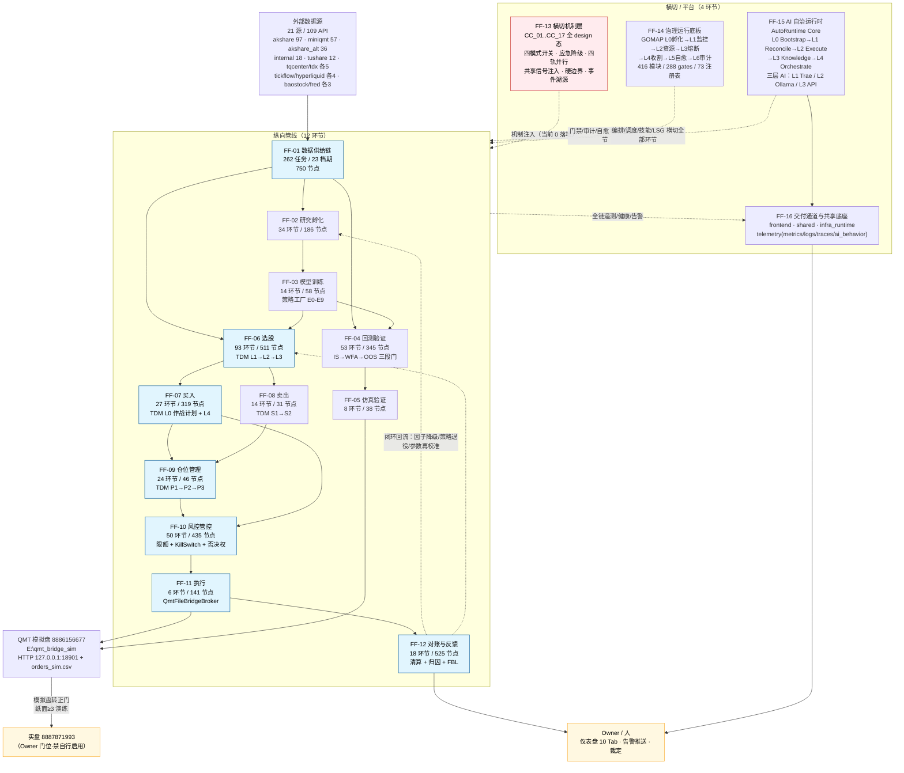

# 全流通战役 · 端到端环节骨架（元挖矿车道 st-ff-mine0-20260918 产出）

> 本文件 = 后续所有分环节挖矿与施工的**索引真源**。只读测绘产出，不改任何业务代码/注册表。
> 统计口径：已排除 `.aidrafts/`（24 worktree 副本）、`.worktrees/`（18）、`data/c4_pdf_cache/`（6 万+ 缓存文件）。
> 所有计数均由脚本实测（脚本落 `.runtime/tmp/ff-mine0/`），非凭记忆。

## 1. 环节总数

**N = 16 个环节**（12 个纵向管线环节 + 4 个横切/平台环节）。

- 纵向管线环节 12 个：FF-01 数据供给链 + FF-02..FF-12（= 作战地图 11 个 `flow_stage`，一一对应）。
- 横切/平台环节 4 个：FF-13 横切机制层、FF-14 治理运行底板、FF-15 AI 自治运行时、FF-16 交付通道与共享运行时底座。
- 覆盖度实测：**75/75 个 depgraph 域、11995/11995 个 depgraph 节点全部归入某一环节，未归属 = 0**（脚本 `.runtime/tmp/ff-mine0/stage_nodes.json` 口径，见 §5 遗漏自检）。

### 1.1 环节总表

| 环节ID | 环节名（中/英） | 上游环节 | 下游环节 | 主源码包路径 | 模块数(depgraph节点) | 权威真源文件 | 断点数 | 严重度 |
|---|---|---|---|---|---|---|---|---|
| FF-01 | 数据供给链 / Data Supply Chain | 外部数据源（21 源 / 109 API） | FF-02, FF-04, FF-06 | `src/zephyr/data`(138 .py) `market_data`(20) `alt_data`(25) `data_eng`(16) `data_governance`(21) `data_security`(10) `integration`(77) | 750 | `src/zephyr/data/config/tasks.yaml`(262任务) + `schedule.yaml`(23档期) + `known_data_gaps.yaml`(44缺口) + `data_supply_sentinel.yaml` + `docs/02_enterprise_architecture/05_dataflow_architecture/dataflow_index.md` + depgraph `dataflow_*` 表(196作业/76数据集/90边) | 26 | 高 |
| FF-02 | 研究孵化 / Research Incubation | FF-01 | FF-03, FF-06 | `src/zephyr/research`(14) `knowledge`(15) `intelligence`(77) `nlp`(7) `experiment_tracking`(13) | 186 | `docs/02_enterprise_architecture/07_trading_decision_architecture/battle_map/battle_map_01_research_incubation.md`(34环节) + depgraph `battle_map_steps WHERE flow_stage='research_incubation'` | 1 | 高 |
| FF-03 | 模型训练 / Model Training | FF-02 | FF-04, FF-06 | `src/zephyr/ml_train`(43) `ml_serve`(11) `strategy_factory`(17) | 58 | `battle_map_02_model_training.md`(14环节) + `config/strategy_production_map.yaml`(E0-E9 十层/16节点/5产物) | 3 | 高 |
| FF-04 | 回测验证 / Backtest Validation | FF-03, FF-06 | FF-05, FF-12 | `src/zephyr/backtest`(56) `execution_simulation`(8) | 345 | `battle_map_03_backtest_validation.md`(53环节) + `data/backtest_artifacts/bt-*.json` | 2 | 中 |
| FF-05 | 仿真验证 / Simulation Validation | FF-04 | FF-11（模拟盘转正门） | `src/zephyr/simulation`(23) `digital_twin`(8) | 38 | `battle_map_04_simulation_validation.md`(8环节) | 0 | 中 |
| FF-06 | 选股 / Stock Selection | FF-01, FF-02, FF-03 | FF-07, FF-08, FF-09 | `src/zephyr/factor`(87) `signal_ashare`(153) `signal_fundamental`(36) `signal_quality`(13) `regime`(45) `cross_asset`(7) | 511 | `battle_map_05_stock_selection.md`(93环节) + `config/trading_decision_map.yaml` entry_flow L1/L2/L3(66节点) + depgraph `decision_nodes`(213) | 3 | 高 |
| FF-07 | 买入 / Buy Flow | FF-06 | FF-09, FF-10, FF-11 | `src/zephyr/plan_engine`(36) `pf_core`(37) `pf_alloc`(27) `trading`(98) | 319 | `battle_map_06_buy_flow.md`(27环节) + TDM entry_flow L0/L4(21节点) | 1 | 高 |
| FF-08 | 卖出 / Sell Flow | FF-06, FF-09 | FF-10, FF-11 | `src/zephyr/sell_decision`(28) | 31 | `battle_map_07_sell_flow.md`(14环节) + TDM exit_flow S1/S2(14节点) | 0 | 中 |
| FF-09 | 仓位管理 / Position Management | FF-07, FF-08 | FF-10, FF-11, FF-12 | `src/zephyr/position`(38) | 46 | `battle_map_08_position_management.md`(24环节) + TDM position_flow P1/P2/P3(17节点) | 2 | 高 |
| FF-10 | 风控管控 / Risk Control | FF-07, FF-08, FF-09（横切全链） | FF-11, FF-12 | `src/zephyr/risk`(78) `compliance`(29) `security`(189) | 435 | `battle_map_09_risk_control.md`(50环节) + TDM exit_flow X1(4节点) + `docs/01_policies_and_standards/_registry/catalogs/risk_tier_registry.yaml` | 4 | 高（Owner门位密集） |
| FF-11 | 执行 / Execution | FF-07, FF-08, FF-10 | FF-12, FF-16 | `src/zephyr/ex_core`(65) `ex_sor`(26) | 141 | `battle_map_10_execution.md`(6环节) + `config/qmt_environments.yaml` + `config/.env.qmt`（桥=`QmtFileBridgeBroker`） | 1 | 高（实盘=Owner门位） |
| FF-12 | 对账与反馈 / Reconciliation & Feedback | FF-04, FF-09, FF-11 | FF-02, FF-03, FF-06（闭环回流） | `src/zephyr/reporting`(36) `feedback_loop`(340) `infra_ops`(6) | 525 | `battle_map_11_reconciliation.md`(18环节) + TDM portfolio_flow C3(6节点) + depgraph `dataflow_runs`(0行) | 3 | 高 |
| FF-13 | 横切机制层 / Cross-Cutting Mechanisms | 横切 FF-01..FF-12 全部 | —（无下游，机制注入） | 无独立包（机制散布于 `ex_core`/`risk`/`pf_core`/`shared`） | 0（17 机制全 design 态） | `battle_map_12_cross_cutting.md`（17 横切类别 CC_01..CC_17） | 3 | 高 |
| FF-14 | 治理运行底板 / Governance Operations Substrate | 横切全部环节 | —（门禁/审计/自愈反哺） | `src/zephyr/governance`(301) `gov_enforcement`(207) `gov_drift`(75) `gov_audit`(70) `gov_code_quality`(66) `gov_rule`(4) `clone_guard`(13) `infrastructure`(338) + `scripts/governance/**` | 6779 | `config/governance_operations_map.yaml`（GOMAP-001 第十全景图，7 族 L0-L6 / 416 模块）+ `docs/registry_of_registries.yaml`(73册) + depgraph `gates`(288) | 17 | 高 |
| FF-15 | AI 自治运行时 / AI Autonomy Runtime | 横切全部环节 | FF-16（人机出口） | `src/zephyr/autonomy_core`(145) `orchestrator`(73) `intelligence`(77) `security/llm_defense` | 824 | `docs/02_enterprise_architecture/09_ai_architecture/derived_graphs/`(6图) + `implementation_plans/`(17册) + AutoRuntime Core L0-L4（`python -m zephyr.trading`） | 4 | 高 |
| FF-16 | 交付通道与共享运行时底座 / Delivery Channel & Shared Runtime Substrate | FF-11, FF-12, FF-15 | 人（Owner）/ 外部告警通道 | `src/zephyr/frontend`(46) `shared`(280) `infra_runtime`(9) `experiment_tracking`(13) | 1007 | `config/flags.yaml`(MOD-INF-015) + `architecture_model/frontend/frontend_map.yaml`（第六全景图，status=planned）+ `src/zephyr/frontend/dashboard/app_panel.py`(10 Tab) | 6 | 中高 |
| — | **全局横断**（不属单一环节） | — | — | 全仓 | — | 见 `01_break_census.md` §H | 9 | 高 |
| **合计** | **16 环节** | | | `src/zephyr` 3614 .py / 3477 可导入模块 | **11995** | | **85** | |

> 模块数口径：depgraph `nodes` 表按 `domain_id` 聚合（`docs/.../project_handbook/05_trading_domains.md` §3 AUTO 区块，最后同步 2026-08-17）。
> 括号内 `.py` 数 = 本机实测文件系统计数（已排除 worktree 副本）。两者口径不同，不可相加。

## 2. 端到端数据流 / 控制流图



**图中已标红的断链要点**（详见 `01_break_census.md`）：

1. `FF-01 → FF-06` 之间：262 任务中 235 无 `dependencies` 声明（DAG 缺失），33 条已知数据缺口未闭合。
2. `FF-03 → FF-06`：策略工厂 `FAC-E7 模拟盘前哨` `build_status=pending`、`module_ref=None` → E8 组装无输入。
3. `FF-11 → FF-12`：`build_execution_report` 零调用 + 回测 `trade_log` 无 `algo_id`/`order_type` 恒为 `market` → 归因链无输入。
4. `FF-12 → FF-02/FF-06` 闭环回流：`dataflow_runs` 表 0 行（无运行时观测），`reconciliation_loop` / `position_reconciler` 均零入度 → 闭环纸面。
5. `FF-13 → 全部`：17 个横切机制 100% design 态，四模式开关/应急保命轨零落地 → "同构铁律"无机械保障。
6. `FF-16 → 人`：`alerts.auto_escalation=false`、`archive.enabled=false`(not_started)、`schema_validation.dlq_enabled=false`、E7 webhook 四类凭据缺（Owner 门位）。

## 3. 环节划分依据（为什么是 16，不是 11 / 12 / 75）

### 3.1 主脊柱取自第四全景图 battle_map（DB 真源 + 生成器背书）

- 真源 = depgraph PostgreSQL `battle_map_steps` / `battle_map_anchors` / `battle_map_edges` 三表（341 环节 / 588 锚点 / 114 流转边）。
- `flow_stage` 字段实测 **11 个互斥取值**：`stock_selection`(93) `backtest_validation`(53) `risk_control`(50) `research_incubation`(34) `buy_flow`(27) `position_management`(24) `reconciliation`(18) `model_training`(14) `sell_flow`(14) `simulation_validation`(8) `execution`(6)。
- 权威域归属裁定 = `docs/01_policies_and_standards/_registry/catalogs/battle_map_domain_policy.yaml` §`flow_stage_allowed_domains`（11 阶段 × allowed 域列表 + `forbidden_rationale`），裁定原则"域归属看模块承载什么决策，不看被谁调用"，由 `align_battle_map.py` BM-INV-004 执行。
- 物理文档一一对应 = `docs/02_enterprise_architecture/07_trading_decision_architecture/battle_map/battle_map_01..11_*.md`（+ `battle_map_12_cross_cutting.md`），panorama 生成器 `generate_battle_map_diagram.py` 背书。
- **故 FF-02..FF-12 = battle_map 11 个 flow_stage，零增零减**，保证与既有治理链（BM-INV-001/004/005、`battle_map_alignment_gate.py`）对齐键一致。

### 3.2 为什么必须 +1（FF-01 数据供给链）

battle_map 把数据接入折进 `BM-SEL-01 数据接入与预处理`（stock_selection L0，**design 态 + 🟡候选承载**）与 `BM-RES-01 研究数据与特征存储`。但实测：

- 它是**第三全景图 dataflowgraph 的独立主对象**（`dataflow_jobs` 196 / `dataflow_datasets` 76 / `dataflow_edges` 90），有独立产物 `docs/02_enterprise_architecture/05_dataflow_architecture/dataflow_index.md`。
- 它有**独立运行实体**：`tasks.yaml` 262 任务 × `schedule.yaml` 23 档期（`pre_market` / `intraday_realtime` / `daily_kline` / `catchup_guard` / `integrity_check` / `data_supply_sentinel` …），是 Windows 计划任务 `ZephyrAlpha_DataScheduler` 真跑的东西。
- 它有**独立缺口台账**：`known_data_gaps.yaml` 44 条 + `data_supply_sentinel.yaml` 停更哨兵。
- 域体量 750 节点（D_DATA 515 单域即全项目第 5 大）。
- 前任 mineline 10 工段中 ①②③④ 四段（数据源发现/原料入库/自动上架/洗数据）**全部落在这里**，若不独立成环节则前任 4/10 的挖矿成果无处挂接。

结论：FF-01 独立成环节，是"作战地图折进选股"与"数据流图独立成图"两个真源的**并集裁定**，不是新发明。

### 3.3 为什么必须 +4（FF-13..FF-16）—— 机械证据

实测 `battle_map_domain_policy.yaml` 的 11 个 `flow_stage.allowed` 并集 = **42 个域**；而 depgraph 有 **75 个域**。
→ **34 个域（45%）从未被任何 flow_stage 允许**，即作战地图结构性不覆盖全项目：

```
D_AUTONOMY_CORE D_AUTONOMY_PERM D_FRONTEND D_GOVERNANCE D_GOV_AUDIT D_GOV_CODE_QUALITY
D_GOV_DOCS D_GOV_DRIFT D_GOV_ENFORCEMENT D_GOV_OPS_RESILIENCE D_GOV_REPAIR D_GOV_RULE
D_GOV_SCRIPTS D_INFRASTRUCTURE D_INFRA_A2A D_INFRA_OPS D_INFRA_RECOVERY D_INFRA_TELEMETRY
D_INTEGRATION_GATEWAY D_REGIME D_SECURITY_LLM D_SIGLEGACY D_CONTRACTS D_AUDITTEST D_TEST
D_ARCHIVE_SCRIPTS D_ARCH_GUARD D_ARCH_SCRIPTS D_CODE_SCRIPTS D_COMPLIANCE_SCRIPTS
D_DATA_SCRIPTS D_META_SCRIPTS D_SEC_SCRIPTS D_STRUCT_SCRIPTS
```

Owner 的交付判据是"**整个项目**业务块和新建任务的所有链路全部打通"，故这 34 域必须有环节归属。按真源归口为 4 个横切/平台环节：

| 环节 | 收编的域 | 权威真源 |
|---|---|---|
| FF-13 横切机制层 | 0 域（17 个 CC 机制，非域对象） | `battle_map_12_cross_cutting.md`（横切类别数 = 17） |
| FF-14 治理运行底板 | 25 域 / 6779 节点（治理 + 脚本 + 基础设施运维/回滚 + 契约 + 审计测试） | `config/governance_operations_map.yaml`（GOMAP-001，第十全景图，7 族 L0-L6） |
| FF-15 AI 自治运行时 | 5 域 / 824 节点（AUTONOMY_CORE/PERM、ORCHESTRATOR、INFRA_A2A、SECURITY_LLM、INTEGRATION_GATEWAY） | `docs/.../09_ai_architecture/derived_graphs/`(6) + `implementation_plans/`(17) + handbook 01 §1 五层同心圆 |
| FF-16 交付通道与共享底座 | 4 域 / 1007 节点（FRONTEND、SHARED、INFRA_RUNTIME、INFRA_TELEMETRY） | `config/flags.yaml` + `architecture_model/frontend/frontend_map.yaml`（第六全景图）+ `panorama_registry.md` PAN-VIS-01 |

> `D_REGIME`(78节点) 归 FF-06（选股），依据 = `battle_map_domain_policy` §`acknowledged_orphans` MOD-REGIME-001/002/005 明文"实现后挂 stock_selection 环节"；`D_INFRA_TELEMETRY` 归 FF-16 而非 FF-14，依据 = `experiment_tracking` 属交付观测面且与 frontend 同属"出口/承载"。此二处为**人工裁定**，已在 §5 自检中标注。

### 3.4 为什么不是 75（域）也不是 138（TDM 节点）

- **75 域**是 depgraph 的**物理分类**（`architecture_model/index.yaml` §partitions 明记"75域是唯一物理分类体系…AI找模块只有一条路：按域找"），但域 ≠ 环节：域是**归属容器**，环节是**流转序**。75 域被本骨架 100% 收编为 16 环节的"模块数"列，作为**子颗粒**保留，不上升为环节。
- **138 TDM 节点 / 194 边**（`config/trading_decision_map.yaml`，第五全景图 decisiongraph）是**决策点级**颗粒，4 条流（entry 88 / exit 19 / position 18 / portfolio 13）× 18 个 layer 码（L0-L4/S1-S2/X1/P1-P3/C1-C3/各 FLOW/LROOT）。它比环节细一层，本骨架把它作为 FF-06..FF-12 的**子索引**引用，不另立环节。
- **10 层策略工厂 E0-E9**（`config/strategy_production_map.yaml`）是 FF-03 的内部生产流水线，作为 FF-03 子颗粒。
- **23 个 schedule 档期**是 FF-01 的内部节拍，作为 FF-01 子颗粒。

## 4. 与前任 `00_总环节谱.md`（10 工段）异同对照

前任真源 = `docs/_working/automation/campaign/mining/00_总环节谱.md`（st-mineline-20260918，2026-09-18 04:1x 全 11 簿封矿，约 226 子模块节点）。

| 前任工段 | 前任子模块数 | 本骨架归属 | 关系 | 说明 |
|---|---|---|---|---|
| ① 数据源发现（20 节点：父6+子孙14） | 20 | **FF-01** | 完全覆盖（子集） | 对应 `data_source_assets` 21 源 / `data_source_apis` 109 API / `10_data_source_candidates` DS-CAND-* |
| ② 原料入库（29 节点：父7+子孙22） | 29 | **FF-01** | 完全覆盖（子集） | 对应 `tasks.yaml` 262 任务 + provider 层（akshare/miniqmt/tushare/tqcenter/tickflow…） |
| ③ 自动上架（38 节点：父8+子/孙30，WO-③-00~05） | 38 | **FF-01** | 完全覆盖（子集） | 对应 `data_eng`(16 .py) + `data_governance`(21) + 表注册/DDL 上架链 |
| ④ 洗数据（39 节点：父5+子24+孙10，WO-④-01~10） | 39 | **FF-01** | 完全覆盖（子集） | 对应 `data_supply_sentinel.yaml` + `integrity_check`/`daily_backfill`/`catchup_guard` 三档期 + 复权/时区/幂等清洗 |
| ⑤ 因子合成（44 节点：八族+2横切，WO-⑤-01~15） | 44 | **FF-06** 为主，**FF-03** 为辅 | 覆盖但拆分 | 因子**计算**归 FF-06（`D_FACTOR` 170 节点，battle_map `stock_selection` allowed 含 D_FACTOR）；因子**发现/挖掘/AutoML**（BM-MT-04、BM-RES-07-A 策略进化与因子挖掘）归 FF-03/FF-02 |
| ⑥ 策略合成（6 系统×18 叶） | ~108 | **FF-06 + FF-07** | 覆盖但拆分 | 策略生成归 FF-06（`strategy_factory` / `signal_fundamental/selection_funnel`）；策略→组合→资金分配归 FF-07（`pf_core`/`pf_alloc`/`plan_engine`，TDM L3/C1-C2） |
| ⑦ 两级回测（5 子模块，WO-07-01~04） | 5 | **FF-04** | 完全覆盖 | battle_map `backtest_validation` 53 环节 = 前任 5 子模块的**放大版**（前任颗粒更粗） |
| ⑧ 模拟盘转正门（7 子模块，WO-08-01/03/04） | 7 | **FF-05 + FF-11** | 覆盖但拆分 | 仿真/what-if 归 FF-05（`simulation_validation` 8 环节）；模拟盘→实盘的**转正门位**归 FF-11（`execution`，Owner 门位） |
| ⑨ 骨架体检（6 子模块，WO-09-01~04） | 6 | **FF-14 + FF-12** | 覆盖但拆分 | 静态体检（depgraph/门禁/漂移/对齐）归 FF-14；运行时体检（健康探针/自愈对账/遥测）归 FF-12 + FF-16 |
| 横 横向系统（85 节点：父5+子20+孙60：排班四件套/守护/提交链/治理底板/QMT桥） | 85 | **FF-14 + FF-15 + FF-16 + FF-01** | 覆盖但四分 | 排班四件套 → FF-01（`schedule.yaml`）；守护/reaper/提交链/治理底板 → FF-14（GOMAP L0-L6）；QMT 桥 → FF-11；AI 编排 → FF-15 |
| **（前任无对应工段）** | — | **FF-02 研究孵化** | **本骨架新增** | battle_map 34 环节（含 15 件无锚点=全项目最大断点簇），前任 10 工段**完全未挖** |
| **（前任无对应工段）** | — | **FF-08 卖出** | **本骨架新增** | battle_map 14 环节 + TDM exit_flow 19 节点（S1 信号收集评分 / S2 离场执行 / X1 应急保命）；前任"策略合成"未拆出卖出侧 |
| **（前任无对应工段）** | — | **FF-09 仓位管理** | **本骨架新增** | battle_map 24 环节 + TDM position_flow 17 节点（P1 持仓体检 / P2 做T / P3 加仓）；`position_reconciler` 零入度 |
| **（前任无对应工段）** | — | **FF-10 风控管控** | **本骨架新增** | battle_map **50 环节**（全项目第 3 大）+ 435 节点；前任仅在"两级回测/骨架体检"侧面提及，未独立成段 |
| **（前任无对应工段）** | — | **FF-12 对账与反馈** | **本骨架新增** | battle_map 18 环节 + `feedback_loop` 340 .py（全项目最大源码包）+ FBL 三域 213 节点；前任"骨架体检"未覆盖业务对账/归因 |
| **（前任无对应工段）** | — | **FF-13 横切机制层** | **本骨架新增** | 17 个 CC 机制 **100% design 态**（四模式开关/应急降级/四轨并行/共享信号注入/硬边界/事件溯源/模型量化…），前任"横向系统"挖的是**排班/守护/提交链**（运维横切），非**交易决策横切机制** —— 二者不同轴 |

### 4.1 覆盖结论

- **前任 10 工段（含横向）100% 被本骨架覆盖**，无未覆盖项。
- 覆盖方式：4 个前任工段（①②③④）**收敛**为 FF-01；4 个（⑤⑥⑦⑧）**重划**到 FF-03/04/05/06/07/11；2 个（⑨/横）**拆分**到 FF-12/14/15/16。
- 本骨架**净增 6 个环节**（FF-02/08/09/10/12/13），合计 341 个 battle_map 环节中的 **146 个（43%）** 落在前任未挖的这 6 段 —— 这是本次元挖矿最主要的发现：**前任挖矿以"数据→因子→策略→回测→模拟盘"为主轴，缺失"卖出/仓位/风控/对账/研究孵化/横切机制"整个交易决策后半程**。
- 颗粒度差异：前任 ~226 子模块节点 vs battle_map 341 环节 + 588 锚点。前任颗粒更粗且以 `WO-*` 工单为单位；本骨架以 DB `step_id`（BM-XXX-NN）为对齐键，可直接机械校验。

## 5. 遗漏自检清单

### 5.1 交叉验证的独立真源（12 个，远超 ≥5 要求）

| # | 独立真源 | 实测规模 | 本骨架归口 | 出现但**未**归入任何环节的对象 |
|---|---|---|---|---|
| 1 | depgraph PostgreSQL `domains` 表（经 `architecture_model/index.yaml` §domains 派生） | **75 域 / 11995 节点** | FF-01..FF-16 的"模块数"列 | **0**（脚本实测 `UNASSIGNED domains: []`，`unassigned node sum: 0`） |
| 2 | depgraph `battle_map_steps.flow_stage` | **11 取值 / 341 环节** | FF-02..FF-12（1:1） | **0**（11 取值全部有环节；`battle_map_12_cross_cutting` 的 17 CC 归 FF-13） |
| 3 | `battle_map_domain_policy.yaml` §flow_stage_allowed_domains + domain_classification | 11 阶段 / business 38 域 + tool 19 域 | §3.3 表 | **19 域未被 policy 分类**（11 脚本域 + D_TEST/D_CONTRACTS/D_AUDITTEST/D_AUTONOMY_PERM/D_INFRA_OPS/D_INFRA_TELEMETRY/D_INTEGRATION_GATEWAY/D_PLAN/D_SECURITY_LLM/D_SIGLEGACY/D_ARCH_GUARD/D_ARCHIVE_SCRIPTS）→ 已由本骨架 FF-14/FF-15 兜底收编，并登记为断点 **BRK-081**；另 policy 引用幻影域 `D_SIGNAL`（depgraph 无此域）→ **BRK-079** |
| 4 | `functional_domain_registry.yaml`（FDR，83 entries） | **68 域** | 与 #1 交叉 | **4 域不在 depgraph**：`D_EXECUTION`/`D_ORDER`/`D_PORTFOLIO`/`D_SIGNAL`（均 `*_legacy` 子域，遗留设计态）→ **BRK-082**；反向 **11 个 depgraph 域不在 FDR**（10 脚本域 + D_TEST）→ 同 BRK-082 |
| 5 | `docs/registry_of_registries.yaml`（ROOR） | **73 册 / 3 tier**（tier0 核心 12 / tier1 治理 28 / tier2 运行时 34） | FF-14（治理底板） | **0 册游离**：tier0 12 册全部为 FF-14/FF-01 真源（gate/脚本/pipeline 路由/技术栈/嵌入模型/漂移检测器/Agent 技能/修复器/资源画像）；tier2 34 册全部为 FF-01/FF-03/FF-06/FF-07/FF-10/FF-12 的业务登记册（股票池/基准/成本模型/因子/策略/风控限额/技术指标/图形形态/执行算法/数据资产/字段字典/实验回测/验证方法学/决策算法/风险分级门位/回测预注册/龙虎榜席位/周期分析/ML模型/事件日历/宏观指标/组合构建模型/功能二元裁定/程序化交易报告/告警阈值）。**注：`summary.broken=1`、`pending_scan=5` → BRK-084** |
| 6 | `config/trading_decision_map.yaml`（TDM，第五全景图） | **138 节点 / 194 边 / 4 流 / 18 layer 码** | FF-06(L1/L2/L3=66) FF-07(L0/L4=21) FF-08(S1/S2=14) FF-09(P1/P2/P3=17) FF-10(X1=4) FF-12(C3=6) | **0 节点游离**：4 流（entry 88 / exit 19 / position 18 / portfolio 13）+ 4 个 `*FLOW` 终端聚合点 + `LROOT` 全部归口。portfolio_flow C1/C2（预算切分/组合聚合，7 节点）归 **FF-07**（买入侧资金分配，依据 battle_map_domain_policy `buy_flow.allowed` 含 D_PF_ALLOC/D_PF_CORE） |
| 7 | `config/strategy_production_map.yaml`（策略工厂） | **10 层 E0-E9 / 16 节点 / 5 产物 / 2 反馈环** | FF-03（全量） | **0**：E0 算力调度→FF-15（横切，但节点 `FAC-E0` `module_ref=MOD-BT-151` 归 FF-03）；E1-E9 全归 FF-03；5 产物（strategy/factor/portfolio/evidence_chain/negative_archive）出口分别归 FF-06/FF-06/FF-07/FF-04/FF-02 |
| 8 | `src/zephyr/data/config/tasks.yaml` + `schedule.yaml` | **262 任务 / 23 档期 / 208 capability / 18 source** | FF-01（全量） | **0**：23 档期全部为 FF-01 内部节拍（含 `integrity_check`/`catchup_guard`/`data_supply_sentinel` 三个自检档期）；4 件 `schedule='disabled'` 死任务 → **BRK-050** |
| 9 | `config/governance_operations_map.yaml`（GOMAP-001，第十全景图） | **7 族 L0-L6 / 416 模块 / 7 层 pipeline** | FF-14（全量） | **0**：`out_of_scope_refs` 4 项（提交门禁体系 / 数据治理 / 代码质量治理 / 交易决策治理）明确出栈，分别归 FF-14（门禁）、FF-01（数据治理）、FF-14（代码质量）、FF-06..FF-12（TDM）—— 出栈项均有归口，非游离 |
| 10 | `docs/02_enterprise_architecture/00_overview_entry/panorama_registry.md` | **38 全景图（22 已建 / 16 待建）** | 见下表 | **0 已建游离**；16 待建全部有归口（见 §5.2） |
| 11 | `docs/03_modules/`（模块蓝图库） | **55 目录（53 `_domain_*` + `_cross_layer` + `_master_blueprint` + `_system_master`）/ 639 .md** | FF-01..FF-16 | **0**：53 个 `_domain_*` 目录与 depgraph 域一一映射（`_domain_governance`→FF-14、`_domain_signal` 73 .md→FF-06、`_domain_risk` 42 .md→FF-10、`_domain_infrastructure_operations` 28 .md→FF-14 …）。**注：`_domain_red_blue_validator` = 0 .md（空目录）→ 归 FF-14，登记为断点** |
| 12 | `src/zephyr/**` 文件系统实测 | **3614 .py / 3477 可导入模块 / 53 顶层包** | FF-01..FF-16 | **0**：53 个顶层包全部归口（`data`/`market_data`/`alt_data`/`data_eng`/`data_governance`/`data_security`/`integration`→FF-01；`research`/`knowledge`/`intelligence`/`nlp`/`experiment_tracking`→FF-02+FF-16；`ml_train`/`ml_serve`/`strategy_factory`→FF-03；`backtest`/`execution_simulation`→FF-04；`simulation`/`digital_twin`→FF-05；`factor`/`signal_ashare`/`signal_fundamental`/`signal_quality`/`regime`/`cross_asset`→FF-06；`plan_engine`/`pf_core`/`pf_alloc`/`trading`/`strategy_pipeline`→FF-07；`sell_decision`→FF-08；`position`→FF-09；`risk`/`compliance`/`security`/`red_blue_validator`→FF-10；`ex_core`/`ex_sor`/`runtime`→FF-11；`reporting`/`feedback_loop`/`infra_ops`→FF-12；`governance`/`gov_*`/`clone_guard`/`infrastructure`→FF-14；`autonomy_core`/`orchestrator`→FF-15；`frontend`/`shared`/`infra_runtime`→FF-16） |

### 5.2 待建全景图（16 项）归口验证

| 待建 ID | 名称 | 归口环节 |
|---|---|---|
| PAN-ASSET-01/02/03/04 | 资产CMDB / API契约目录 / 数据目录 / 数据血缘 | FF-14（01/02）+ FF-01（03/04） |
| PAN-RISK-01 | 风险敞口全景图 | FF-10 |
| PAN-RUN-01/02/03/04 | 实时调用链+SLO / 告警热力图 / CI-CD 流水线 / 服务依赖运行时 | FF-16（01/02）+ FF-14（03）+ FF-16（04） |
| PAN-SEC-01/02 | STRIDE 威胁模型 / 合规矩阵 | FF-10（02）+ FF-14（01，`security`/`llm_defense`） |
| PAN-VIS-01 | 可视化前端架构 | FF-16 |
| PAN-QUANT-01/02 | 因子全景图 / 策略谱系图 | FF-06（01）+ FF-03（02） |

→ 16/16 归口，**未归入 = 0**。

### 5.3 自检结论与残留风险

1. **未归入任何环节的对象 = 0**（12 个独立真源全部核完）。
2. 残留风险 A：**颗粒度到 `step_id` 为止**。341 个 battle_map 环节 + 588 锚点已按 `flow_stage` 归口，但**逐 step 的环节归属表未在本骨架展开**（体量原因），须由各分环节子挖矿任务书（`02_mining_dispatch_plan.md`）在 `stages/<环节ID>_<名>/` 下逐条落表。
3. 残留风险 B：**2 处人工裁定**（§3.3 注）—— `D_REGIME`→FF-06、`D_INFRA_TELEMETRY`→FF-16。二者均有真源文字支撑但非机械派生，若总包裁定不同则模块数需重算（D_REGIME 78 节点 / D_INFRA_TELEMETRY 31 节点）。
4. 残留风险 C：**depgraph 快照龄**。handbook AUTO 区块记"最后同步 2026-08-17"，而 `nodes`/`edges` 实测 11995/22805（handbook 记 22765，**已漂移 40 边**）→ 环节"模块数"列为**近似值**，施工前须 `generate_project_depgraph.py --force` 刷新后重算。已登记 **BRK-008**。
5. 残留风险 D：**动态加载盲区**。FF-15 的 `autonomy_core/skills`(46 件) 与 FF-14 的 `gov_enforcement/commit_gates`(11 件) 由注册表/`importlib` 动态发现，静态零入度扫描会**假阳性**。须以 ORPHAN-MODULE gate 口径（接进 `internal_compute_provider.fetch` 路由分支）复核，已登记 **BRK-009**。
