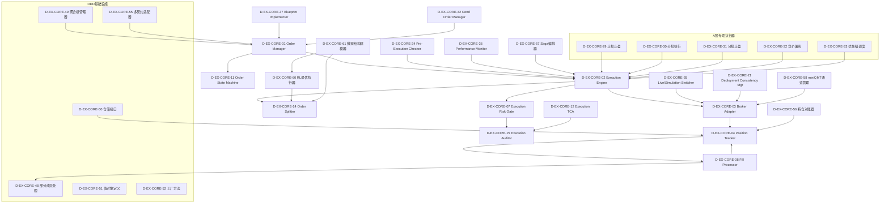

# 08 — D-EX-CORE 执行核心域

> **状态**: DRAFT | **核心层**: L06 交易执行 | **成熟度**: L1 🔵 骨架 | **简称**: XC
> **拆分自**: D-EXECUTION | **拆分原因**: H依赖=3满，拆分后EX-CORE(H=3)+EX-SOR(H=3)
> **一句话**: OMS+下单执行核心——目标持仓→实际成交
> **交易域边界**: D-EX-CORE(执行核心) + D-EX-SOR(执行路由) + D-TRADING(交易运营) + D-POSITION(仓位管理)
>
> **核心职责流**: CTR-007→OrderManager(CTR-007→CTR-004)→Pre-Trade→ExecutionEngine→BrokerAdapter→Fill→PositionTracker

## §0 域定义

| 维度 | 内容 |
|------|------|
| 域ID | D-EX-CORE |
| 简称 | XC |
| 核心Aggregate | AGG-001 Order / AGG-002 Position |
| 核心事件 | E-EX-01~08 (OrderCreated/Submitted/Filled/Cancelled/Rejected/Expired/IdempotencyBlocked/FillReceived) |
| 开发状态 | 骨架——基础ABC+默认实现，缺子模块 |
| 优先级 | P0（核心价值链第五环） |
| 激活前提 | D-RISK就绪(L04-limits ready=True) + D-PORTFOLIO就绪 + D-AUTONOMY就绪(KillSwitch+CTR-TRACE-001) |
| 对应能力 | C-002(交易执行与订单管理) + C-046(执行质量TCA) + C-026(执行运营自优化) |
| 物理载体 | P3进程(trading_core), CPU核8-11, 8GB, Hot平面<10ms |

## §1 子模块清单

| ID | 名称 | 职责 | 优先级 | 建设 | 受限门禁 |
|----|------|------|:------:|:----:|---------|
| D-EX-CORE-01 | Order Manager | 订单7状态机+幂等性(INV-007)+异步SQLite持久化; CTR-007→CTR-004转化; 下单限流10笔/秒+同标的间隔≥500ms; 非交易时段拒单; 大额下单自动拦截率100%; 扩展:条件订单(OCO/OTO)+父子订单+算法订单委托EX-SOR | P0 | ✅ | — |
| D-EX-CORE-02 | Execution Engine | 执行编排+Pre-Trade风控前置+Kill Switch集成(拒绝新单+撤销未成交+通知D-PORTFOLIO暂停); SOR/算法单委托EX-SOR; A股规则(涨跌停/集合竞价/T+1/交易时段校验IMM-003); 时间锁≥50μs; report_confirmed前置检查; C-004不可用→Fail-Closed | P0 | ✅ | — |
| D-EX-CORE-03 | Broker Adapter | BrokerInterface(ABC):connect/disconnect/submit_order/cancel_order/query_order/get_positions; SimulationBroker/XTPAdapter(后期)/CTPAdapter(后期); 自动重连+心跳; INV-005 Broker ACL; Fill回调链; miniQMT接口封装(xtdata+xttrader) | P0 | ✅ | — |
| D-EX-CORE-04 | Position Tracker | AGG-002 Position(symbol,quantity,avg_cost,market_value,unrealized_pnl); 方案C:D-RISK发指令+Fill回调写入; CTR-006 PositionSnapshot→D-RISK/D-PORTFOLIO/D-REPORTING; SQLite; 扩展:FIFO/LIFO/平均成本+保证金+T+1约束; 每笔成交后更新Redis | P0 | ✅ | 需从SimulationBroker拆出 |
| D-EX-CORE-07 | Execution Risk Gate | 规则引擎+阈值检查器+熔断器(5次/60s→OPEN→30s HALF-OPEN)+风控参数管理+实时监控; Wash Trade检测(独立于C-004,需跨账户数据); 参与率检查(≤5%); 撤单率检查(≤15%); 否决同步拦截<50ms(P99); 否决不可绕过(HC-RISK-03); 否决不可人工否决(HC-RISK-02); 否决五级分类(P0 Kill Switch→P1强制减仓→P2否决新开仓→P3否决单笔→P4建议性告警) | P0 | ❌ | D-RISK域L04-limits就绪+风控规则引擎可调用 |
| D-EX-CORE-08 | Fill Processor | 成交解析器+部分成交聚合器+成交归因器+费用计算器; T+1结算合规 | P0 | ❌ | Broker Adapter回报回调稳定+佣金费率表数据源就绪 |
| D-EX-CORE-11 | Order State Machine | 7状态机:PENDING→{SUBMITTED,CANCELLED}/SUBMITTED→{PARTIAL,FILLED,CANCELLED,REJECTED,EXPIRED}/PARTIAL→{FILLED,CANCELLED,REJECTED,EXPIRED}/终态FILLED/CANCELLED/REJECTED/EXPIRED; 持久化+事件发射 | P0 | ✅ | — |
| D-EX-CORE-12 | Execution TCA | IS计算器(时机成本+市场冲击+滑点+佣金)+延迟成本+机会成本+市场冲击归因; Pre-trade/At-trade/Post-trade三阶段TCA; 基准比较器(VWAP/TWAP/开盘价/收盘价) | P0 | ❌ | 历史执行数据≥30天+滑点模型参数可获取 |
| D-EX-CORE-14 | Order Splitter | 拆分策略选择器+子订单生成器+时间窗口分配器+进度追踪; Almgren-Chriss最优拆分; 参与率控制(<15%); 执行进度监控(实际vs计划偏差>阈值→暂停+告警); 流动性前置检查(不足→暂停+告警) | P0 | ❌ | TCA就绪+订单簿深度数据可获取 |
| D-EX-CORE-15 | Execution Auditor | 审计日志记录器+合规规则引擎+执行质量评分器+报告生成器; MiFID II交易记录/SEC 17a-4/7年保留; 证据链DAG:数据指纹→因子指纹→信号指纹→策略指纹→仓位指纹→订单指纹(TC≥0.997) | P1 | ✅ | SQLite execution_audit表 |
| D-EX-CORE-21 | Deployment Consistency Manager | 配置版本管理器+一致性检查器+灰度控制器+回滚管理器 | P1 | ❌ | 实盘环境+CI/CD灰度发布基础设施 |
| D-EX-CORE-24 | Pre-Execution Checker | 订单合规校验+市场状态检查+账户状态检查+风控参数检查+检查日志; Pre-Trade主链6项顺序:涨跌停→参与率→持仓限额→行业集中度→撤单率→报单停留时间锁(均为Hard Block) | P1 | ❌ | D-RISK风控参数就绪+市场状态实时数据源 |
| D-EX-CORE-29 | 参数化止损止盈执行器 | 固定比例止损(p=-7%)+MA(20)破位止损+封流比阈值止盈(t=0.1%)+换手率阈值止盈(t=30%)+竞价偏离阈值止损(t=-3%)+板块跌停计数止损+分时均线破位止损+信号失效止损 | P1 | ❌ | 实盘交易环境+A股Tick数据源+miniQMT实盘API |
| D-EX-CORE-30 | 参数化分批执行器 | 分批比例配置(ratio=[0.5,0.3,0.2])+条件触发+进度追踪+失败回滚 | P2 | ❌ | 实盘交易环境+A股Tick数据源+miniQMT实盘API |
| D-EX-CORE-31 | 参数化分批止盈执行器 | 触发止盈后分批卖出(initial_ratio=0.5,step_ratio=0.3,step_trigger=5%)+MA(20)连续N日破位确认清仓+放量破位清仓(vol_ratio>t)+开盘-收盘偏离卖出(divergence>t) | P2 | ❌ | 实盘交易环境+A股Tick数据源+miniQMT实盘API |
| D-EX-CORE-32 | 竞价偏离阈值执行器 | 竞价偏离阈值(t=-3%)→9:25-9:30挂单卖出+MA反弹失败卖出(rebound<MA within N bars)+竞价止损统计 | P2 | ❌ | 实盘交易环境+集合竞价数据源+miniQMT实盘API |
| D-EX-CORE-33 | 卖出优先级调度器 | 优先级评分函数f(order_attributes)+优先级队列+滑点控制+统计 | P2 | ❌ | 实盘交易环境+miniQMT实盘API |
| D-EX-CORE-35 | Live/Simulation Switcher | A股/QMT实盘与模拟盘一键切换+状态同步+资金隔离 | P1 | ❌ | miniQMT实盘通道就绪(MOD-EX-058通道管理器可用) |
| D-EX-CORE-36 | Performance Monitor | 执行成功率+延迟+可用性3维监控+SLA告警+趋势 | P1 | ❌ | 生产环境APM基础设施 |
| D-EX-CORE-37 | Blueprint Implementer | EXEC.001订单生成+执行+状态机+路由+报告 | P0 | ❌ | 依赖模块(OMS+引擎+路由+报告)全部就绪 |
| D-EX-CORE-42 | Conditional Order Manager | 条件订单(OCO/OTO)+父子订单+订单簿 | P1 | ❌ | EX-SOR算法路由就绪 |
| D-EX-CORE-48 | 部分成交处理 | 部分成交状态更新与后续处理 | P1 | ✅ | — |
| D-EX-CORE-49 | 执行聚合根管理器 | Order/Position聚合根生命周期管理与状态机 | P2 | ✅ | — |
| D-EX-CORE-50 | 执行域仓储接口 | Order/Position聚合根持久化仓储接口 | P2 | ✅ | — |
| D-EX-CORE-51 | 执行域值对象定义 | OrderType/OrderStatus/Money/Quantity不可变定义 | P2 | ✅ | — |
| D-EX-CORE-52 | 执行域工厂方法 | Order/Position复杂聚合根创建工厂 | P2 | ✅ | — |
| D-EX-CORE-55 | 多契约生产适配器 | CTR-004/005/006 Schema+版本演进+消费者注册+变更通知 | P2 | ✅ | — |
| D-EX-CORE-56 | 盘中持仓对账器 | 每5分钟与miniQMT持仓查询自动对账; 差异>0→立即告警+冻结该标的交易; 恢复后先持仓对账,不一致→D-L1降级 | P1 | ✅ | — |
| D-EX-CORE-57 | 下单执行Saga编排器 | 编排式Saga六步(风控检查→信号确认→下单提交→成交确认→持仓更新→报告生成); 补偿幂等; ≤5s超时硬约束; Redis Stream状态持久化 | P0 | ✅ | — |
| D-EX-CORE-58 | miniQMT交易通道管理器 | xtquant接口封装(xtdata行情+xttrader交易); 连接认证(客户端证书+API Token); 指令签名(HMAC-SHA256); 会话超时30min; KS-L3通道断开检测(下单拒绝率飙升/心跳失败/API版本不匹配→断开+撤单); 交易执行池(专用线程×2,队列深度>5拒绝新请求) | P0 | ✅ | — |
| D-EX-CORE-59 | 交易执行MCP Server | place_order/cancel_order/query_position工具暴露 | P2 | ❌ | MCP协议安全生态未成熟(HB-08+HB-07+HB-05); 开通条件:MCP OAuth强制+RBAC+审计+沙箱+AI置信度≥95%稳定6月+渗透测试 |
| D-EX-CORE-60 | RL最优执行器 | DQN/PPO增强Almgren-Chriss; 学习非线性微观结构; RL不可偏离Almgren-Chriss轨迹超过阈值(安全约束); 输出:优化后的执行轨迹微调参数 | P2 | ❌ | RL训练基础设施就绪+历史执行数据≥90天+Almgren-Chriss基线可运行+RL偏差阈值可配置 |
| D-EX-CORE-61 | 微观结构建模器 | VPIN订单流毒性检测(知情交易概率)+LOB动力学(买卖深度不平衡预测短期方向)+做市商推断(调整执行策略); 输出:微观结构信号→EX-CORE-14/60 | P2 | ❌ | 订单簿Level-2数据可获取+VPIN计算引擎就绪+LOB快照频率≥1秒 |

### C轨L06层子模块映射

| C轨子模块 | 对应D-EX-CORE子模块 | 说明 |
|-----------|---------------------|------|
| l06-oms | D-EX-CORE-01 + D-EX-CORE-11 | 订单管理与状态机 |
| l06-pre-trade | D-EX-CORE-03 + D-EX-CORE-07 | 交易前风控与适配 |

> l06-sor/l06-sim-trading/l06-adapters 映射已迁移至 D-EXECUTION-SOR

### 主观交易经验→量化框架转化记录

| 原名称(主观) | 转化后名称(量化) | 转化方式 |
|-------------|----------------|---------|
| A股止盈止损阈值执行器 | 参数化止损止盈执行器 | 阈值参数化(p/t)，规则形式化 |
| 强分歧止盈 | 换手率阈值止盈(t=30%) | 主观判断→量化阈值 |
| 反弹无力 | MA反弹失败(rebound<MA within N bars) | 主观描述→可量化条件 |
| 逻辑失效止损(核心逻辑证伪) | 信号失效止损 | 哲学表述→信号强度阈值 |
| A股分批建仓三段执行器 | 参数化分批执行器 | 固定比例→可配置参数ratio |
| A股趋势票分批止盈执行器 | 参数化分批止盈执行器 | "趋势票"主观分类→参数化规则 |
| 利好兑现高开低走卖出 | 开盘-收盘偏离卖出(divergence>t) | 主观判断→量化偏离度 |
| A股竞价不及预期止损器 | 竞价偏离阈值执行器 | "不及预期"→偏离阈值 |
| 被动卖出紧急触发优先级器 | 卖出优先级调度器 | "紧急程度"→评分函数 |
| 行为金融学(理论依据) | 参数化规则引擎 | 理论标签→工程实现 |
| 缩量反弹不可靠 | 流动性前置检查(成交量阈值) | 主观判断→流动性量化指标 |
| 密度感知止盈止损 | 参数化时机执行器(流动性密度阈值) | 主观感知→订单簿密度参数 |
| 踏空追高 | 买入价>近N日最高价×(1+threshold) | 主观情绪→量化价格条件 |
| 被套补仓 | 持仓浮亏>threshold时同标的加仓 | 主观心态→量化浮亏条件 |
| 盈利骄傲 | 连续盈利N笔后单笔金额>均值×threshold | 主观情绪→量化连续性条件 |
| 亏损报复 | 连续亏损N笔后单笔金额>均值×threshold | 主观情绪→量化连续性条件 |

## §2 域内依赖图

## §3 域间依赖

| 消费什么 | 来自哪个域 | 契约/事件 | 类型 |
|---------|-----------|---------|:----:|
| TargetPortfolio | D-PORTFOLIO | CTR-007 | H |
| RiskLimits | D-RISK | CTR-003 | H |
| KillSwitch事件 | D-AUTONOMY | KillSwitch | H |
| 权限/审计/遥测 | D-AUTONOMY | CTR-TRACE-001 | H |
| BuyDecided/SellDecided/RebalanceDecided | D-PF-CORE/D-SELL | DecisionEvent | H |
| RiskTriggered/CircuitBreaker/RiskCleared | D-RISK | RiskEvent | H |

| 产出什么 | 去往哪个域 | 契约/事件 | 类型 |
|---------|-----------|---------|:----:|
| Order | D-PORTFOLIO | CTR-004 | H |
| Order + 路由参数 | D-EXECUTION-SOR | CTR-004 | H |
| Fill | D-REPORTING | CTR-005 | E |
| PositionSnapshot | D-RISK/D-REPORTING/D-ML | CTR-006 | E |
| FillReceived | D-RISK/D-PORTFOLIO/D-REPORTING | E-EX-04 | E |
| OrderSubmitted/OrderFilled/OrderRejected/OrderCancelled | D-POSITION/D-RISK/D-PF-CORE | ExecutionEvent | E |

### 关键跨域接口

| 方向 | 接口 | 契约 | 优先级 | 签名冻结 |
|------|------|------|:------:|:--------:|
| ←消费 | PositionPlan | CTR-POS-001 | P0 | ✅冻结 |
| ←消费 | SellDecision | CTR-SELL-001 | P0 | ✅冻结 |
| ←消费 | TTradeInstruction | — | P0 | 可演进 |
| →产出 | Order+路由参数 | CTR-004 | P0 | ✅冻结 |
| →产出 | Fill | CTR-005 | P0 | ✅冻结 |
| →产出 | PositionSnapshot | CTR-006 | P0 | ✅冻结 |
| →产出 | ExecutionRejectionError | CTR-ERR-005 | P0 | ✅冻结 |
| →产出 | RiskLimitViolationError | CTR-ERR-004 | P0 | ✅冻结 |

### C-002能力规格

| 维度 | 规格 |
|------|------|
| 能力描述 | 接收信号引擎输出→生成委托指令→通过miniQMT下单→追踪订单全生命周期→成交回报→更新持仓 |
| 支持订单类型 | 限价单/市价单; 集合竞价时段自动切换限价单模式 |
| 下单限流 | 10笔/秒, 同标的间隔≥500ms |
| 成功标准 | 订单提交延迟<100ms / 下单成功率>99.5% / 订单链全链路可追溯 / 非交易时段拒单 / 大额下单自动拦截率100% |
| 对应域 | D-EX-CORE + D-EX-SOR |
| 依赖能力 | C-001(数据接入) + C-004(风控,🛡️控制依赖) + C-031(AI协作,接口级依赖) |

### C-046执行质量分析(TCA)能力规格

| 维度 | 规格 |
|------|------|
| 能力描述 | 系统化分析每笔订单执行质量，区分策略Alpha和执行Alpha |
| 核心机制 | IS分析(决策时刻→最终成交总成本分解) + Pre/At/Post三阶段TCA + 执行基准对比(VWAP/TWAP/开盘/收盘) |
| 对应域 | D-EX-CORE + D-RISK + D-PF-CORE |

### C-026执行运营自优化

| 维度 | 规格 |
|------|------|
| 下单算法自优化 | 复盘滑点来源→调整下单策略 |
| 风控阈值自校准 | 假阳性成本vs真阳性收益→优化阈值 |
| 集合竞价策略自优化 | 复盘竞价参与效果→调整参与比例 |

### 循环依赖解耦

| 循环 | 解耦方式 |
|------|---------|
| C-002↔C-004 | 共享存储+事件总线解耦 |
| C-046↔C-042 | 时序分离: C-046先用简化模型1月→C-042校准→C-046切换 |

### 仲裁优先级体系

1. C-004风控(D-RISK)—绝对否决权
2. C-047仓位上限(D-POSITION)—硬约束
3. C-021市场状态仓位上限—硬约束
4. 卖出决策引擎(D-SELL-DECISION)
5. T+1次日预测(C-014)
6. 安全防护(C-033/C-031)
7. 交易策略(C-005/C-012)
8. 买入决策(C-006)
9. 研究探索(C-006/C-007/C-027)

> 执行链路: C-047→C-004→C-002(仓位裁决→风控审批→执行)，不可跳过; EX-CORE是C-002承载者

### INV-005 Broker ACL

INV-005: 仅D-EX-CORE可调用Broker API; 其他域禁止直连; 违规动作:reject_commit; 优先级:P0; 运行平面:hot

### 集成域支撑模块

| 集成域模块 | 职责 | 与EX-CORE关系 |
|-----------|------|-------------|
| D-INTEGRATION-07 Adapter Manager | 适配器管理+Broker适配器+数据源适配器 | EX-CORE-03的上层管理 |
| D-INTEGRATION-10 External System Connector | 外部系统连接器+券商API+数据源API | EX-CORE-03的外部连接 |
| D-INTEGRATION-18 Saga Orchestrator | 下单Saga编排+再平衡Saga+模型上线Saga | EX-CORE-57的跨域协调 |
| D-INTEGRATION-40 Trading Contract Bridge | 交易契约桥接+L04-L06跨层集成契约 | EX-CORE-55的契约桥接 |

### A2A/MCP约束

| 约束 | 规则 | 来源 |
|------|------|------|
| A2A-01 | 交易执行操作禁止走A2A | HB-07下单零重试+交易通道唯一性, A2A协商延迟不可控 |
| MCP交易执行Server | ❌不能建 | MCP协议安全生态未成熟; 开通条件见D-EX-CORE-59门禁 |

## §4 域事件流

### 产出事件(ExecutionEvent)

| 事件ID | 事件名 | 触发条件 | Payload | 消费者 |
|--------|--------|---------|---------|--------|
| E-EX-01 | OrderCreated | 订单创建成功 | order_id, symbol, direction | D-AUTONOMY(审计) |
| E-EX-02 | OrderSubmitted | 订单提交至券商 | order_id, symbol, direction, price, amount | D-POSITION, D-RISK, D-AUTONOMY(审计) |
| E-EX-03 | OrderFilled | 订单成交 | order_id, fill_price, fill_amount, commission | D-PORTFOLIO, D-PF-CORE, D-REPORTING |
| E-EX-04 | FillReceived | 成交回报到达 | order_id, fill_price, fill_amount | D-RISK, D-PORTFOLIO, D-REPORTING |
| E-EX-05 | OrderCancelled | 订单撤销 | order_id, cancel_reason | D-POSITION, D-AUTONOMY(审计) |
| E-EX-06 | OrderRejected | 订单被拒 | order_id, reject_reason | D-PF-CORE, D-RISK, D-AUTONOMY(告警) |
| E-EX-07 | OrderExpired | 订单过期 | order_id | D-PORTFOLIO, D-AUTONOMY(审计) |
| E-EX-08 | IdempotencyBlocked | 幂等性校验拦截 | order_id, idempotency_key | D-AUTONOMY(审计) |

### 消费事件

| 事件类型 | 子类型 | 生产者 | 触发动作 |
|---------|--------|--------|---------|
| DecisionEvent | BuyDecided | D-PF-CORE | 创建买入订单 |
| DecisionEvent | SellDecided | D-PF-CORE/D-SELL | 创建卖出订单 |
| DecisionEvent | RebalanceDecided | D-PF-ALLOC | 创建再平衡订单 |
| RiskEvent | RiskTriggered | D-RISK | 否决/限制订单 |
| RiskEvent | CircuitBreaker | D-RISK | 熔断处理 |
| RiskEvent | RiskCleared | D-RISK | 恢复正常交易 |

> 事件流位置: TickEvent→SignalEvent→DecisionEvent→**ExecutionEvent**(第四环); RiskEvent可中断任意阶段
> 事件持久化: 关键事件写入WAL日志(审计+故障恢复); 事件不可变; 关键聚合根状态变更必须记录事件(Event Sourcing)
> 数据链路延迟预算: L4→执行<1秒(Hot+Warm); 执行→L5盘后(Warm)
> 最终一致性: 订单成交→持仓更新<100ms
> ExecutionEvent容量: 日均~100条, 单条1KB, 年增量~25MB

## §5 激活前提与就绪条件

| 前提 | 就绪标准 |
|------|---------|
| D-RISK 就绪 | L04-limits ready=True, CTR-003 RiskLimits可用 |
| D-PORTFOLIO 就绪 | CTR-007 TargetPortfolio可用 |
| D-AUTONOMY 就绪 | KillSwitch事件通道可用, CTR-TRACE-001可用 |
| ARB-22 | 执行域安全前提满足 |
| miniQMT就绪 | xttrader连接可用, 下单速率10笔/秒, Tick频率3秒 |

## §6 合规约束(源自A6)

| 约束 | 规则 | 执行子模块 | 模式 |
|------|------|----------|------|
| 报单停留时间锁 | ≥50μs(2026.4.7新规); submit_order()后50μs内禁止cancel_order(); 审计日志记录 | D-EX-CORE-02 | Hard Block |
| 程序化交易报告 | 先报告后交易; report_confirmed=False→拒绝所有订单; 重大变更重置confirmed | D-EX-CORE-02 | Hard Block |
| Wash Trade检测 | 同标的同时间自交易模式检测; 独立于C-004(需跨账户数据); 检测到→Hard Block+告警 | D-EX-CORE-07 | Hard Block |
| 引擎故障处置 | C-004不可用→拒绝所有新订单+撤销未成交(Fail-Closed); C-002亦不可用→Kill Switch自动触发; 心跳超时>50ms→不可用; 恢复:连续3次通过(间隔1s) | D-EX-CORE-02 | Fail-Closed |
| 参与率限制 | 单标的成交量占比≤5%(可配置); 同时≤Almgren-Chriss模型计算值(取较小值) | D-EX-CORE-07 | Hard Block |
| 撤单率限制 | ≤15%(2026.4.7新规) | D-EX-CORE-07 | Hard Block |
| AI操纵防护 | Spoofing: C-004硬编码禁止挂单后3秒内撤单; Layering: C-004多价位同方向虚假挂单检测; 尾盘操纵: 收盘前N分钟异常交易检测(C-004) | D-EX-CORE-07 | Hard Block |

> 报告义务优先级高于风控检查(Pre-Trade之前执行); C-004健康检查由ExecutionEngine维护; RK-18定义C-004内部降级，本节定义C-004整体不可用时C-002兜底，两者互补

### Pre-Trade合规检查主链

| 顺序 | 检查项 | 模式 | 来源 |
|:----:|--------|------|------|
| 1 | 涨跌停检查 | Hard Block | A股交易规则 |
| 2 | 参与率检查(≤5%) | Hard Block | 证监会程序化交易规定 |
| 3 | 持仓限额检查 | Hard Block | C-047 |
| 4 | 行业集中度检查 | Hard Block | 风控规则 |
| 5 | 撤单率检查(≤15%) | Hard Block | 交易所细则(2026.4.7) |
| 6 | 报单停留时间锁(≥50μs) | Hard Block | 交易所细则(2026.4.7) |
| — | Wash Trade检查(独立于C-004) | Hard Block | 市场操纵防护 |
| — | Spoofing/Layering/尾盘操纵检查 | Hard Block | C-004风控引擎 |

### 合规引擎分发

| 执行域 | 合规职责 |
|--------|---------|
| C-004风控引擎 | 订单前检查(Spoofing/Layering/尾盘操纵) |
| **C-002执行域** | **订单执行 + Wash Trade检查 + 执行后审计** |
| 合规报告域 | 定期报送(程序化交易报告/异常交易自报/持仓报告/绩效报告) |

### A股交易行为合规检测

| 异常类型 | 检测方式 | 系统适用性 |
|---------|---------|-----------|
| 瞬时申报速率异常 | 实时监控(当前10笔/秒,距高频阈值15笔/秒余量5笔) | 须遵守 |
| 频繁瞬时撤单 | 撤单率≤15% | 须遵守 |
| 频繁拉抬打压 | C-004模式识别 | 须遵守 |
| 短时间大额成交 | 参与率≤5% | 须遵守 |

### Pre-Trade合规检查管道拓扑

| 管道 | 检查项 | 模式 | 执行域 |
|------|--------|------|--------|
| **主链(顺序阻塞)** | 涨跌停→参与率→持仓限额→行业集中度→撤单率→报单停留时间锁 | Hard Block | C-002 |
| **主链(并行阻塞)** | Wash Trade / Spoofing·Layering·尾盘操纵 | Hard Block | C-002+C-004 |
| **旁路(非阻塞)** | 信息窗口管理(财报静默期) | Soft Block | C-004 |
| **旁路(非阻塞)** | A股交易纪律检测(追高/补仓/报复) | Hard Block | C-004 |
| **旁路(非阻塞)** | 关联方识别 | Soft Block | C-004 |
| **旁路(非阻塞)** | ST股持仓限制 | Hard Block | C-004 |
| **旁路(非阻塞)** | 内幕交易行为监控 | Hard Block | C-004 |

> 旁路管道与主链并行运行，不中断主链交易流；但旁路中Hard Block项仍可独立阻断订单

### 信息窗口管理(财报静默期)

| 维度 | 规格 |
|------|------|
| 规则 | 财报发布前N日禁止交易该标的(N由合规官设定,建议10-15日) |
| 执行方式 | 交易日历联动+C-004交易前检查 |
| 管道位置 | Pre-Trade旁路非阻塞管道(Soft Block) |
| 来源 | A6§11.2 / A6§15.1 #50(✅能建) |

### A股交易纪律检测(量化转化)

| 原名称(主观) | 量化转化 | 模式 | 执行域 |
|-------------|---------|------|--------|
| 踏空追高 | 买入价>近N日最高价×(1+threshold) | Hard Block | C-004 |
| 被套补仓 | 持仓浮亏>threshold时同标的加仓 | Hard Block | C-004 |
| 盈利骄傲 | 连续盈利N笔后单笔金额>均值×threshold | Warning | C-004 |
| 亏损报复 | 连续亏损N笔后单笔金额>均值×threshold | Hard Block+Kill Switch轻量版 | C-004 |

> 来源: A6§12.2.2 / A6§15.1 #57(✅能建); 四项严禁由C-004扩展检测规则执行

## §7 风险架构约束(源自A4)

### 否决执行规格

| 设计要素 | 实现 | 硬约束 |
|---------|------|--------|
| 同步拦截 | 否决规则引擎同步执行<50ms(P99) | HC-RISK-03 |
| 不可绕过 | 所有下单指令必经否决规则引擎 | HC-RISK-03 |
| 不可人工否决 | 风控触发后不可被人类否决 | HC-RISK-02 |
| Kill Switch基础设施层 | 不在Agent运行时内 | OWASP ASI08 |
| 熔断器 | 5次/60s→OPEN→30s HALF-OPEN→CLOSED | Netflix Hystrix |
| 否决审计 | 时间/规则/触发值/被否决指令/执行者 | HC-RISK-05 |

### 否决五级分类

| 优先级 | 类型 | 触发条件 | 动作 |
|:------:|------|---------|------|
| P0 | Kill Switch | 系统性风险/风控崩溃/AI自治熔断5条件/核心进程无心跳>5s/外部运维告警 | 全系统暂停交易→人工确认+系统健康检查 |
| P1 | 强制减仓 | Pod级Soft Stop(回撤>5%) | 自动减仓至安全线 |
| P2 | 否决新开仓 | 组合级约束 | 禁止新开仓，允许平仓 |
| P3 | 否决单笔 | 单笔订单违规 | 拦截该笔订单 |
| P4 | 建议性告警 | 风险接近阈值 | 告警通知，不拦截 |
| PS | Soft Block审批等待 | 新策略首笔/异常市场大额/关联方交易 | 订单挂起等待合规官审批; 超时→拒绝 |

### Pod级止损三档明细

| 止损级别 | 触发条件 | 动作 | 参考来源 |
|---------|---------|------|---------|
| Soft Stop | 单策略回撤>5% | 砍仓至安全水平+Trader对话 | Citadel "hair-trigger" |
| Hard Stop | 单策略回撤>10% | 关闭该策略+策略重构 | Millennium PM退出机制 |
| 全系统Hard Stop | 全组合回撤>10% | Kill Switch(P0) | VR-002 |

### VR-009 Kill Switch触发条件(AI自治熔断)

| 条件 | 阈值 |
|------|------|
| Agent越界行为 | >0 |
| 模型漂移PSI | >0.5 |
| 自治等级异常跳变 | 检测到 |
| 资源消耗超限 | 检测到 |
| 连续否决超阈值 | 检测到 |

> 全组合Hard Stop: 全组合回撤>10%→Kill Switch(P0)

### Kill Switch多路径激活

| 激活路径 | 延迟 | 触发条件 | 实现层 |
|---------|------|---------|--------|
| AI自动触发 | <1ms | VR-009规则触发 | 基础设施层(INV-001) |
| 人工一键触发 | <100ms | CLI/Web/微信 | 基础设施层 |
| 定时熔断 | <1ms | 核心进程无心跳>5s | 基础设施层 |
| 外部信号触发 | <1s | A9运维告警 | 基础设施层 |

### Kill Switch 5层防御(源自A2)

| 层次 | 防御内容 | 对应域 |
|------|---------|--------|
| L1 策略层 | 策略级交易暂停 | D-SIGNAL |
| L2 风控引擎层 | 风控否决 | D-RISK |
| **L3 执行层** | **拒绝新单+撤销未成交** | **D-EX-CORE** |
| L4 网关层 | 断开交易通道 | D-INTEGRATION |
| L5 交易所端控制 | 券商端紧急停止 | 外部 |

> HB-GOV-08: Kill Switch必须分层且本地评估; HB-GOV-09: Kill Switch激活后受控重入(不可自动恢复,需Administrator确认+系统健康检查+灰度恢复)

### 四层隔离防护

| 层次 | 隔离机制 | 实现 |
|------|---------|------|
| L1 代码隔离 | D-RISK vs D-SIGNAL/D-PF-* | 域边界+INV-008 |
| L2 数据隔离 | 风险数据流独立于交易数据流 | 独立管道+独立计算 |
| L3 权限隔离 | 风控引擎只读策略信号，只写否决指令 | RBAC+最小权限 |
| L4 审计隔离 | 否决日志独立存储，策略模块不可写 | 不可篡改审计链(HC-RISK-05) |

### 否决vs修改边界

| 允许 | 禁止 |
|------|------|
| 否决买入订单 | 买入改卖出 |
| 限制仓位上限 | 调整策略参数 |
| 触发减仓 | 修改因子权重 |

### 子模块映射

| 风险架构内容 | 执行域子模块 | 模式 |
|------------|------------|------|
| 否决规则引擎同步拦截 | D-EX-CORE-07 | Hard Block |
| Kill Switch多路径激活 | D-EX-CORE-02 | Kill Switch |
| 熔断器模式 | D-EX-CORE-07 | 熔断 |
| 四层隔离防护 | D-EX-CORE全域 | 架构约束 |
| 否决vs修改边界 | D-EX-CORE-07 | 权限约束 |
| Kill Switch 5层防御L3 | D-EX-CORE-02 | 执行层防御 |

### D-RISK域与EX-CORE交互模块

| D-RISK模块 | 与EX-CORE关系 |
|-----------|-------------|
| D-RISK-02 Pre-Trade Checker | EX-CORE-02调用 |
| D-RISK-04 Stop Loss Engine | Kill Switch触发/重置→EX-CORE-02执行 |
| D-RISK-36 A-Share Multi-Level Loss Circuit Breaker | EX-CORE-07熔断器联动 |
| D-RISK-53 Pre-Trade Idempotency Guarantor | EX-CORE-01幂等性保障 |
| D-RISK-54 Kill Switch Cooldown Manager | EX-CORE-02 Kill Switch冷却 |
| D-RISK-57 Kill Switch Trading System Integrator | EX-CORE-02 Kill Switch集成 |
| D-RISK-66 Kill Switch Multi-Domain Notifier | EX-CORE-02多路径激活通知 |
| D-RISK-67 Kill Switch State Machine Manager | EX-CORE-02状态机管理 |
| D-RISK-78 Pre-Trade 50ms SLA Monitor | EX-CORE-07否决延迟监控 |
| D-RISK-83 Kill Switch New Order Rejector | EX-CORE-01新订单拒绝 |

## §8 安全架构约束(源自A5)

### 资产分类与信任等级

| 资产类型 | 信任等级 | 示例 |
|---------|---------|------|
| 交易指令 | 绝密(L3) | 买入/卖出指令、价格/数量 |
| 策略参数 | 绝密(L3) | 策略权重、信号阈值 |
| 持仓数据 | 机密(L2) | 当前持仓、成本、盈亏 |
| 订单状态 | 机密(L2) | 已报/已成/已撤 |
| 行情数据 | 内部(L1) | 实时/历史行情 |
| 交易日志 | 机密(L2) | 成交/委托记录 |

### 数据流规则

| 方向 | 域 | 允许数据 | 安全检查点 |
|------|-----|---------|-----------|
| 流入 | 数据域 | 行情/因子/信号 | 签名验证+时间戳 |
| 流入 | 治理域 | 审批通过的策略参数 | 审批令牌+策略签名 |
| 流入 | 运维域 | 系统配置/密钥 | 配置签名+密钥加密 |
| 流出 | 数据域 | 交易结果(脱敏) | 降级+脱敏 |
| 流出 | 治理域 | 交易审批请求 | 最小信息量 |
| 流出 | 运维域 | 审计日志(仅追加) | 签名+哈希链 |
| 流出 | 外部(合规) | 交易报告 | 预定义格式+审批 |

### 安全控制

- 交易指令生成到提交完整链路签名链，篡改可追溯
- miniQMT连接凭证仅交易域进程内可见，禁止跨域传递
- 交易域进程与其他域进程级隔离(Windows Job Object+受限令牌)
- 所有交易指令提交前确定性校验(价格/数量/风控)
- Agent发起交易指令必须经HG级人工确认

### miniQMT接口安全

| 安全维度 | 规格 |
|---------|------|
| 连接认证 | 客户端证书+API Token双重认证 |
| 指令签名 | 每条交易指令HMAC-SHA256签名 |
| 指令限速 | 每秒最大指令数限制(防异常高频) |
| 会话超时 | 30分钟无操作自动断开 |
| 证书固定 | Certificate Pinning for miniQMT连接 |
| 出站白名单 | miniQMT网关(端口443, TLS 1.3), 允许进程trading_gateway.exe(HB-SEC-01) |

### IAM权限矩阵

| 操作 | Trader | Administrator | AI_Agent | System |
|------|--------|--------------|----------|--------|
| 提交交易指令 | A(自审自批) | N(禁止) | A(HG级确认) | N(禁止) |
| 暂停交易 | Y | Y | Y(紧急) | N |
| 访问持仓数据 | Y | Y | Y(策略内+审计) | N |

> 单人场景A=自审自批; AI_Agent需HG级人工确认

### ABAC交易时段策略

| 条件 | 策略 |
|------|------|
| 交易时段(09:30-15:00) | Agent可读取L2/L3数据执行策略; Agent不可修改安全策略; L3绝密数据跨墙必须盘后审批 |
| 安全告警=high | 所有Agent操作降为IM模式 |
| 安全告警=critical | 暂停触发告警的Agent |
| 安全告警=global_critical | 所有Agent暂停，仅Trader可操作 |

### 密钥架构

| 密钥域 | 保护数据 | 信任等级 | 轮换频率 |
|--------|---------|---------|---------|
| DK-TRADING | 交易指令、订单数据 | L3 | 月度 |
| DK-POSITION | 持仓数据、盈亏数据 | L2 | 季度 |

### Agent安全与沙箱

| 维度 | 规格 |
|------|------|
| 关键Agent定义 | 工具调用权限包含"提交交易指令"的Agent=关键Agent(HG级) |
| 预算超限熔断 | 80%告警/100%暂停非关键Agent; 关键Agent紧急模式可继续但受更严格频率限制(HB-SEC-11) |
| 沙箱隔离(当前) | gVisor容器(当前最高可用隔离等级) |
| 沙箱隔离(目标) | Firecracker microVM(硬件级隔离,零逃逸) ❌需Linux KVM |
| 沙箱原则 | 所有Agent禁止共享沙箱实例(一人一箱, HB-SEC-13) |
| AWS安全范围 | Scope 2人类在环Agent=交易执行Agent(HG级); Scope 4完全自治=禁止 |

### 内幕交易防护

| 维度 | 规格 |
|------|------|
| 限制名单 | 已确认内幕信息的证券→禁止交易(硬阻断)→自动阻断交易指令+人工审查解除 |
| 数据访问审计 | 所有L2/L3数据访问写入审计链; 异常模式检测(非交易时段/异常频率/异常范围) |

### 安全硬边界

| 硬边界 | 规则 | 执行点 |
|--------|------|--------|
| HB-SEC-01 | 出站流量白名单,禁止持仓/交易/策略数据发送外部 | 网络出口网关+API代理层 |
| HB-SEC-05 | Agent不可绕过安全检查 | Agent执行引擎+安全沙箱 |
| HB-SEC-08 | Agent工具调用白名单,禁止动态工具加载 | Agent执行引擎+工具调用中间件 |
| HB-SEC-11 | Agent每日API调用/费用预算不可超限 | Agent执行引擎+预算监控 |
| HB-SEC-13 | Agent沙箱实例不可共享 | Agent执行引擎+沙箱管理 |
| B-005 | 禁止AI绕过风控引擎直接下单 | immutable |

## §9 运维规格(源自A9)

### Hot平面延迟预算

| 环节 | 延迟 | 累计 | 实现 | 优化 |
|------|:----:|:----:|------|------|
| Tick→风控触发 | 2ms | 2ms | Redis订阅+回调 | CPU亲和核8-11 |
| 风控规则评估 | 3ms | 5ms | 纯Python规则引擎 | 预编译+零GC |
| 订单构建+下单 | 5ms | 10ms | miniQMT API | 连接池+预构建模板 |

> Hot平面硬约束: 10ms(P99); 覆盖两次Tick(3s间隔)之间全部风控+执行全流程

### P3进程(交易核心)规格

| 维度 | 规格 |
|------|------|
| 进程名 | trading_core |
| CPU亲和 | 核8-11 |
| 内存预算 | 8GB(禁止swap) |
| 核心职责 | 风控检查+订单构建+miniQMT下单+持仓同步 |
| 健康检查 | Redis心跳`hb:trading_core`+miniQMT探针，间隔2s，超时10s |
| 不健康动作 | 不自动重启(HC-01)，告警+人工介入 |
| 隔离 | CPU核8-11独占+8GB预留+GPU 2GB+Redis本地读取+禁止磁盘IO+miniQMT独占 |

### 执行降级

| 降级路径 | 执行核心动作 | 子模块 |
|---------|-------------|--------|
| D-L0→D-L1 | 降低iFind QPS至10，仅核心策略订单 | EX-CORE-07熔断器 |
| D-L1→D-L2 | 加载保命规则集(SURV-001~008)，仅风控通过订单 | EX-CORE-01 |
| D-L2→D-L3 | 撤销所有挂单，停止一切新交易 | EX-CORE-01+Kill Switch |
| miniQMT中断>30s | 降级D-L1，暂停新订单 | EX-CORE-03 |
| miniQMT中断>5min | 降级D-L2 | EX-CORE-03 |
| 风控引擎无响应>30s | 跨级降级至D-L3冻结(HC-04) | EX-CORE-02 |
| 紧急关停(保命轨) | P3撤单→P3停→P1停→其余强制终止(<5s) | EX-CORE-01+02 |

### 保命规则集(SURV-001~008)

| 规则ID | 规则 | 参数 | 不可绕过 |
|--------|------|------|:--------:|
| SURV-001 | 单票持仓不超过AUM的10% | 10% | ✅ |
| SURV-002 | 总仓位不超过AUM的30% | 30% | ✅ |
| SURV-003 | 单日亏损超过AUM 5%清仓 | 5% | ✅ |
| SURV-004 | 涨停板不买入 | — | ✅ |
| SURV-005 | 跌停板不卖出 | — | ✅ |
| SURV-006 | 非交易时段不下单 | — | ✅ |
| SURV-007 | 每笔订单必须经过风控检查 | — | ✅ |
| SURV-008 | 持仓股票ST/退市风险→次日清仓 | — | ✅ |

> D-L2进入时加载; D-L3进入时卸载(已停止一切新交易); 全部硬编码不可绕过; 来源: A9§4.3

### 紧急撤单双通道冗余

| 维度 | 规格 |
|------|------|
| 通道1 | Redis Pub/Sub(主通道,延迟<1ms) |
| 通道2 | 文件锁(备用通道,Redis不可用时触发) |
| 用途 | 保命轨触发、强制撤单信号传输 |
| 可靠性 | 双通道冗余确保信号送达; 单通道失效→另一通道独立工作 |
| 来源 | A9§1.2.2 |

### 熔断器

| 熔断器 | 保护路径 | 失败率阈值 | 熔断超时 | 半开试探 | 熔断动作 |
|--------|---------|:----------:|:--------:|:--------:|---------|
| CB-002 | miniQMT下单 | >5%持续15s | 30s | 1次/30s | 暂停交易+告警 |
| CB-005 | 信号生成 | 0产出持续2min | 300s | 1次/300s | 使用缓存信号(D-L1) |

### 交易通道特殊规则

| 规则 | 规格 |
|------|------|
| 交易通道熔断 | 必须人工介入恢复(HB-06), 不可自动恢复 |
| 熔断期间风控 | 不可停(基于最后已知状态) |
| 熔断期间持仓 | 暂停新开仓和主动调仓 |
| 熔断恢复后 | 必须全量同步(持仓/委托/成交状态) |
| KS-L3通道断开 | 下单拒绝率飙升/miniQMT心跳失败/API版本不匹配→断开交易通道+撤销所有挂单→人工确认+全量同步 |
| 下单零重试 | 幂等Key+零重试策略(HB-07/D-07) |

### 持仓对账机制

| 维度 | 规格 |
|------|------|
| 盘中对账 | 每5分钟与miniQMT持仓查询自动对账(EX-CORE-56) |
| 成交后更新 | 每笔成交后更新Redis持仓状态 |
| 恢复后对账 | P3恢复后先执行持仓对账(与券商miniQMT对比) |
| 对账不一致 | 触发D-L1降级(仅平仓不开新仓) |
| 数据一致性SLA | 持仓数据3秒内一致(miniQMT回调+Redis Stream增量同步); 超时→全量同步+告警 |

### RED指标

| 指标 | SLO | 告警阈值 |
|------|-----|---------|
| 订单提交速率(P3) | 无硬性上限 | >10笔/秒(异常高频) |
| miniQMT下单失败率(P3) | <0.1% | >1%持续30s |
| 订单→成交延迟(P3) | <3s(miniQMT限制) | >10s |
| miniQMT下单成功率 | ≥99.9% | 月度误差预算0.1% |

### RTO/RPO规格

| 维度 | 规格 |
|------|------|
| L1交易核心(P3) RTO | <5min |
| L1交易核心(P3) RPO | <=1s |
| 恢复策略 | Redis AOF + D→E双副本 |
| 灾备恢复 | 加载快照+回放执行事件→重建Redis物化视图 |
| 快照策略 | 日快照(15:30全部持仓) + 增量快照(盘中每5分钟变更持仓) |

### 自治修复

| 策略ID | 触发条件 | 修复动作 | 验证条件 |
|--------|---------|---------|---------|
| AUT-007 | 订单执行失败率>10% | 检查miniQMT连接+重试 | 成功率>95% |

### 告警规则

| 规则ID | 检测对象 | PromQL | 级别 |
|--------|---------|--------|------|
| AD-001b | P3心跳丢失 | rate(process_heartbeat_total{process="trading_core"}[10s])==0 持续10s | AL-P1(最高紧急) |

## §10 学习系统约束(源自A8)

### 知识类型→子模块映射

| 知识类型 | 注入目标子模块 |
|---------|--------------|
| execution_optimization | EX-CORE-02/12/14 |
| liquidity | EX-CORE-07/02 |
| risk | EX-CORE-07/24 |
| methodology | EX-CORE-12/36 |

### 知识注入约束

| 注入路径 | 约束 |
|---------|------|
| execution_optimization→D-EX-CORE | TCA历史回测验证+不可降低风控保护水平 |
| liquidity→C-004→D-EX-CORE | 人工审核+不可降低流动性风控保护水平 |
| risk→C-004→D-EX-CORE | 人工审核+不可降低硬边界保护水平 |
| 教训知识→L4风控层 | 人工审核确认根因分析合理性 |

### 权重中心接口

| 维度 | 规格 |
|------|------|
| 核心原则 | 学习系统不直接生成订单，输出目标组合权重→C-004风控引擎4级验证(APPROVE/REDUCE/REJECT/FLATTEN)→执行层下单 |
| 安全隔离 | Python策略bug最多产生错误权重，物理上无法绕过风控 |
| 约束 | 所有权重≥0, 权重之和=1, 单票上限20%, 权重变更≤1次/交易日 |

### 反馈路径

| 反馈路径 | 接口 | 频率 | 对标子模块 |
|---------|------|------|----------|
| 执行质量反馈 | ExecutionQualityReport | 每日 | EX-CORE-12/36 |
| 滑点与市场冲击反馈 | SlippageAndImpactReport | 每日 | EX-CORE-12/08 |
| C-010复盘(执行维度) | PnL报表+执行归因 | 每日 | EX-CORE-12 |

### 执行模块代码生成约束

| 约束 | 规则 | 来源 |
|------|------|------|
| 执行路径零GC | Hot路径不可触发Python GC | A9§2.2 |
| 订单状态机不可变 | 严格遵循7状态机 | EX-CORE-01 |
| 幂等性强制 | 所有订单操作幂等性校验 | INV-007 |
| Pre-Trade硬前置 | 不可绕过Pre-Trade风控 | HC-RISK-03 |
| Kill Switch优先 | 不可被其他逻辑阻塞 | 安全设计原则 |
| 时间锁嵌入 | 50μs时间锁 | §6 |
| AST沙箱约束 | 三层安全验证 | A8§7.2 |
| 无未来信息 | 不可引用未来数据 | A8§7.2 |

> LLM生成执行模块代码必须: 继承ExecutionModuleBase+所有订单操作通过OrderManager+所有持仓写入通过PositionTracker+所有Broker调用通过ExecutionEngine(INV-005)+实现self.explain()+通过AST沙箱+通过三重语义一致性验证

### 模拟器关联(学习系统S5试运行)

| 模拟器 | 功能 | 与EX-CORE关系 |
|--------|------|-------------|
| R-118 Liquidity & Slippage Simulator | Almgren-Chriss市场冲击模型+滑点模拟 | 为EX-CORE-12/14提供模拟执行环境 |
| R-119 Order Matching Simulator | 限价订单簿模拟+撮合引擎(市价/限价/涨跌停) | 为EX-CORE-01/02提供订单模拟 |
| R-117 Strategy Sandbox | 订单→撮合→持仓→净值完整模拟 | 为EX-CORE全域提供策略沙盒 |

## §11 Agent规格(源自A7)

### 执行Agent

| 属性 | 值 |
|------|-----|
| 职责 | 订单提交、成交确认、订单状态跟踪 |
| 输入/输出 | 交易指令+风控结果 / 订单状态+成交回报+执行报告 |
| 自治级别 | Level 0(纯规则引擎，无LLM) |
| 延迟目标 | <100ms |
| 对应能力/域 | C-002 / D-EX-CORE |
| 上线阶段 | MVP(5核心Agent之一) |
| 实例数 | 2 |
| 反思策略 | 仅失败时反思 |

### 上游Agent

| Agent | 自治级别 | 延迟 | 对应能力 | 产出D-EX-CORE内容 | 上线阶段 | 实例数 |
|-------|---------|------|---------|-------------------|---------|--------|
| 择时Agent | L1(规则引擎+本地LLM辅助) | <500ms | C-012/C-013 | 触发事件(买入/卖出/持有) | V2 | 2 |
| 做T Agent | L1(规则硬编码，参数微调自主) | <1s | C-012 | 做T指令(买/卖底仓) | V3 | 2 |
| 风控Agent | L1(规则硬编码，参数微调自主) | <1s | C-004/C-032 | 对冲指令(越级下行) | MVP | — |

### Agent能力边界

| Agent | 能做(自主) | 需审批(HG) | 不可做 |
|-------|-----------|-----------|--------|
| 执行Agent | 订单跟踪+成交回报(规则驱动) | 订单参数修改(5min未审批→取消) | 改方向数量/绕风控 |
| 择时Agent | 择时参数微调(允许范围内) | 触发规则/阈值修改(24h未审批→自动取消) | 绕触发规则/直接下单 |
| 做T Agent | 做T参数微调/盈亏预估 | 做T规则/底仓比例修改(24h未审批→自动取消) | 超底仓做T/违反T+1 |

### IMM不可变约束

| 约束ID | 规则 | 执行点 |
|--------|------|--------|
| IMM-003 | 交易时段校验不可关闭 | 执行Agent内置校验 |
| IMM-005 | T+1规则不可违反 | 执行Agent内置校验 |
| IMM-010 | 单笔大额下单不可自动执行 | 执行Agent金额校验+拦截 |

### HITL触发条件

| 触发条件 | 动作 | 超时处理 |
|---------|------|---------|
| 大额下单(超限额) | 执行Agent拦截→Trader确认 | 5min未响应→取消订单 |

### Saga分布式事务补偿

| 协作流程 | 步骤 | 补偿操作 | 触发条件 |
|---------|------|---------|---------|
| 买入流程 | 执行Agent下单 | 撤单(若已报未成) | 下单失败或超时 |
| 做T流程 | 做T Agent买入 | 卖出(若已成交) | 卖出腿失败 |
| 做T流程 | 做T Agent卖出 | 无需补偿(T+1不可逆) | — |

### Agent级熔断器

| Agent | 失败阈值 | 熔断时间 | 半开探测 | 熔断后行为 |
|-------|---------|---------|---------|----------|
| 执行Agent | 3次/5min | 2min | 每2min探测1次 | 订单进入待执行队列 |
| 择时Agent | 3次/5min | 3min | 每3min探测1次 | 信号类Agent快速熔断 |
| 做T Agent | 2次/5min | 5min | 每5min探测1次 | 暂停做T操作 |
| 风控Agent | 1次/任何时间 | 永久 | 需人工恢复 | 全系统暂停交易 |

> Agent级熔断(业务逻辑错误)与技术级熔断(5次/60s→OPEN, 基础设施故障)互补

### 指令流约束

| 流类型 | 方向 | 约束 |
|--------|------|------|
| 指令流 | 战术→执行(自上而下) | 执行层不可跳过战术层 |
| 反馈流 | 执行→战术(自下而上) | 逐层聚合:执行1min→战术5min→战略日频 |
| 否决流 | 风控→任意层(横向穿透) | 熔断/仓位上限/交易禁止=最高优先级 |
| 对冲流 | 风控→执行(越级下行) | 风控Agent可直接向执行层发送对冲指令(Level 1约束内) |
| 做T流 | 做T→执行(跨层特例) | 做T Agent可直接向执行层发送日内交易指令 |

### Agent技能注册

| Agent | 技能 |
|-------|------|
| 执行Agent | order-submission(订单提交), order-tracking(订单跟踪) |
| 择时Agent | timing-decision(择时决策), trigger-evaluation(触发评估) |
| 做T Agent | day-trade-execution(做T执行), day-trade-pnl-estimate(做T盈亏预估) |

### 前瞻反思

| 场景 | 前瞻内容 | 决策 |
|------|---------|------|
| 大额下单前 | 当前流动性是否支持? 历史类似时段滑点分布? | 预估滑点>阈值→拆单或延迟执行 |

### Agent消费/产出映射

| Agent | 消费域 | 产出域 |
|-------|--------|--------|
| 执行Agent | D-EX-CORE+D-RISK | D-TRADING🔴(MVP替代:LP-020)+D-REPORTING |
| 择时Agent | D-SIGNAL | D-EX-CORE(触发事件)+D-SIGNAL |
| 做T Agent | D-SIGNAL | D-EX-CORE(做T指令)+D-SELL-DECISION(做T卖出协调) |
| 路由Agent | D-EX-SOR | D-EX-CORE(拆单方案) |
| 风控Agent | D-RISK | D-EX-CORE(对冲指令)+D-RISK(风控否决/熔断) |

### 混沌实验

| 实验ID | 注入目标 | 预期行为 | 不可接受行为 |
|--------|---------|---------|-------------|
| CHAOS-004 | 执行Agent(miniQMT API不可用) | 订单进入待执行队列+人工告警 | 静默失败 |
| CHAOS-009 | 做T Agent(状态不一致) | 从miniQMT重建状态+暂停做T | 基于错误状态下单 |

## §12 miniQMT交易通道规格(源自A10)

### 接口规格

| 维度 | 规格 |
|------|------|
| 接口库 | xtquant(xtdata行情模块+xttrader交易模块) |
| 通信方式 | 本地IPC |
| 下单速率 | 10笔/秒(硬约束) |
| Tick频率 | 3秒 |
| 延迟特征 | 沪市~25ms / 深市~3ms |
| 品种覆盖 | A股/ETF/LOF/REITs/可转债/港股通/期权/期货 |
| 会话模式 | 有状态 |

### 关键接口

| 接口类型 | 接口名 | 方向 | 说明 |
|---------|--------|------|------|
| 下单 | buy/sell/market_buy/market_sell | 内→外 | entrust_no=-1表示失败 |
| 撤单 | cancel_entrust() | 内→外 | — |
| 查询 | query_stock_asset/orders/positions | 内→外 | — |
| 回调 | on_order_error | 外→内 | 非交易时段报错 |
| 回调 | on_order_stock_async | 外→内 | 委托状态变更 |
| 回调 | on_trade_stock_async | 外→内 | 成交回报(Fill) |

### miniQMT集成硬约束

| 约束ID | 规则 |
|--------|------|
| MQMT-01 | 启动顺序: miniQMT先启动→xttrader连接 |
| MQMT-02 | 极简模式: 仅加载必要模块 |
| MQMT-03 | 非交易时段下单自动拦截→C-002执行域内置交易时段校验 |
| MQMT-04 | 版本匹配: xtquant版本与miniQMT版本对应 |
| MQMT-05 | 单进程单账户 |

### 交易轨集成路径

| 环节 | 组件 | 说明 |
|------|------|------|
| 下单 | miniQMT xttrader→E0.5 API网关→E1隔离层(熔断30%/10次/30s+舱壁:交易池×2独占+Kill-Switch L1~L4)→E2契约层(版本:日期锁定)→E3路由层(直通唯一交易通道,Fail-Closed)→C-002+C-004 | 同步调用 |
| 回调 | on_order/trade→Redis Stream→C-002/C-004/C-010 | 异步消息, At-Least-Once+幂等Key |

### 容量与限流

| 维度 | 规格 |
|------|------|
| miniQMT下单容量 | 10笔/秒, 利用率>50%告警, 扩容触发:策略频率>5笔/秒 |
| 下单速率超限 | 漏桶排队, 不触发熔断 |
| miniQMT连接断开 | 限流不触发, 心跳失败触发KS-L3, KS-L3后所有下单请求拒绝 |

## §13 下单执行Saga编排(源自A10)

### Saga六步编排

| 步骤 | 操作 | 失败补偿 |
|:----:|------|---------|
| 1 | 风控检查 | 无需补偿(检查操作) |
| 2 | 信号确认 | 无需补偿(确认操作) |
| 3 | 下单提交 | 撤单(如果已报) |
| 4 | 成交确认 | 无需补偿(被动等待) |
| 5 | 持仓更新 | 持仓回滚 |
| 6 | 报告生成 | 标记报告待更新(异步) |

### Saga设计约束

| 约束 | 规格 |
|------|------|
| Saga类型 | 编排式(有严格顺序依赖和超时约束) |
| 超时硬约束 | ≤5s |
| 补偿幂等 | 撤单操作如果已成交则忽略; 持仓回滚如果已更新则覆盖 |
| 状态持久化 | Redis Stream记录每个Saga步骤执行状态, 故障恢复后从断点继续 |
| 契约遵循 | Saga各步骤遵循L04-L06跨层集成契约+执行/市场子契约 |

## §14 A股执行硬约束(源自A1)

### 涨跌停规则

| 板块 | 涨跌停幅度 | D-EX-CORE处理 |
|------|-----------|--------------|
| 主板 | ±10% | 涨停无法买入/跌停无法卖出; 涨停板排队/撤单逻辑 |
| 科创/创业板 | ±20% | 同上 |
| ST | ±5% | 同上 |
| 北交所 | ±30% | 同上 |

### 集合竞价机制

| 时段 | D-EX-CORE处理 |
|------|--------------|
| 9:15-9:25(集合竞价) | 仅接受限价单; 竞价偏离阈值执行器(EX-CORE-32) |
| 9:25-9:30(静默期) | 可挂单不可撤单 |
| 14:57-15:00(收盘集合竞价) | 仅接受限价单 |

### T+1交割

| 规则 | D-EX-CORE处理 |
|------|--------------|
| 当日买入不可当日卖出 | 执行Agent内置校验(IMM-005) |
| 做T卖出腿失败 | 买入腿已成交不可回滚(T+1不可逆) |

## §15 执行算法子层(源自A1)

### Almgren-Chriss最优执行框架

| 组件 | 功能 | 对应子模块 |
|------|------|-----------|
| 执行计划生成 | 基于TCA历史数据+策略容量约束 | EX-CORE-14 |
| 大单拆分策略 | Almgren-Chriss最优执行轨迹 | EX-CORE-14 |
| 参与率控制 | 订单量/分钟成交量<15% | EX-CORE-07/14 |
| 执行时间窗口 | 开盘前5min vs 收盘前10min vs 均匀分布 | EX-CORE-14 |
| 执行进度监控 | 实际vs计划轨迹偏差>阈值→暂停+告警 | EX-CORE-14 |
| 流动性前置检查 | 标的实时流动性不足→暂停执行+告警 | EX-CORE-14 |

### 滑点模型(3级渐进)

| 级别 | 模型 | 精度 |
|------|------|------|
| L1 | 固定滑点 | 低 |
| L2 | 平方根冲击模型 | 中 |
| L3 | 订单簿模拟 | 高 |

### RL增强执行层(EX-CORE-60/61)

| 组件 | 功能 | 对应子模块 | 安全约束 |
|------|------|-----------|---------|
| RL最优执行器 | DQN/PPO在Almgren-Chriss轨迹基础上微调; 学习非线性微观结构 | EX-CORE-60 | RL不可偏离Almgren-Chriss轨迹超过阈值; 偏差超限→回退至纯Almgren-Chriss |
| 微观结构建模器 | VPIN订单流毒性→调整参与率; LOB深度不平衡→预测短期方向; 做市商推断→调整执行策略 | EX-CORE-61 | 输出为信号(非指令); 信号须经EX-CORE-07风控检查后方可影响执行 |

## §16 治理架构约束(源自A2)

| 约束 | 规则 | 与EX-CORE关系 |
|------|------|-------------|
| HB-GOV-08 | Kill Switch必须分层且本地评估; 5层防御(策略→风控→**执行**→网关→交易所); 本地评估确保微秒级响应; 激活需双控确认(四眼原则) | EX-CORE-02为L3执行层 |
| HB-GOV-09 | Kill Switch激活后受控重入; 不可自动恢复交易; 需Administrator确认+系统健康检查+灰度恢复 | EX-CORE-02执行恢复逻辑 |
| B-005 | 禁止AI绕过风控引擎直接下单 | immutable, EX-CORE-02强制执行 |
| CP-04 | Kill Switch归属: D-AUTONOMY-PERM+D-EX-CORE+D-RISK三域共管 | EX-CORE-02执行层 |
| CP-06 | Pre-Trade风控前置: D-RISK+D-EX-CORE | EX-CORE-24/07 |

## §17 与现有体系对账

| 现有体系 | 本域 | 差异 |
|---------|------|------|
| BCM C05 交易执行 | D-EX-CORE | 一致 |
| D-EXECUTION-01/02/03/11 已有ABC | D-EX-CORE-01/02/03/11 | 已有骨架，需扩展 |
| D-EXECUTION-04 耦合在SimulationBroker | D-EX-CORE-04 | 需拆出独立模块 |
| D-EXECUTION-07/08/12/14/15 | D-EX-CORE-07/08/12/14/15 | 保留在EX-CORE，全部缺失需新建 |
| MOD-L06-001 Trade Execution Core | D-EX-CORE全域 | 部分实现, risk_validation_bridge |
| MOD-INF-022 Escalation Protocol | D-EX-CORE-07 | 部分实现, OMS风险引擎 |
| MOD-INF-021 Rollback System | D-EX-CORE-02 | 已完成, kill_switch/trading_kill_switch |

### 场内代码对账

| 场内模块 | 对标子模块 | 差异 |
|---------|-----------|------|
| l06_trade_execution/broker_interface.py | EX-CORE-03 | ✅一致 |
| l06_trade_execution/execution_engine.py | EX-CORE-02 | ✅一致 |
| l06_trade_execution/order_manager.py | EX-CORE-01 | ✅一致 |
| l06_trade_execution/adapters/simulation_broker.py | EX-CORE-03+04 | ❌Position Tracker耦合在内 |
| escalation_engine/oms_risk_engine.py | EX-CORE-07 | ❌归属应为D-EX-CORE |
| rollback/trading_kill_switch.py | EX-CORE-02 | ❌执行逻辑应在EX-CORE |
| shared/contracts/execution/order.py | CTR-004 | ✅一致 |
| shared/contracts/execution/fill.py | CTR-005 | ✅一致 |

## §18 核心问题与修复方向

| 问题 | 修复方向 |
|------|---------|
| Position Tracker嵌入SimulationBroker | 独立为D-EX-CORE-04 |
| Kill Switch仅通过RiskValidator布尔值 | 事件驱动:D-AUTONOMY→D-EX-CORE监听执行 |
| 幂等性未校验 | create_order()前校验idempotency_key唯一性 |
| EXPIRED状态未纳入 | 新增SUBMITTED→EXPIRED/PARTIAL→EXPIRED转移 |
| SOR/算法单委托关系耦合 | 拆分EX-CORE编排+EX-SOR执行 |
| A股专项执行器(29~33)缺失 | 按P1/P2逐步实现 |
| MCP交易执行Server安全风险 | ❌不能建, 待MCP安全生态成熟 |
| A2A交易执行延迟不可控 | A2A-01铁律禁止 |
| LP-01: 风控否决延迟50ms(P99)是否足够 | ✅能建; 日频策略+miniQMT 10笔/秒(每笔间隔100ms), 50ms远在100ms内 |
| LP-02: Kill Switch直连券商紧急平仓 | ❌不能建; miniQMT是Python SDK无硬件级直连旁路; Python进程崩溃则无法下单; 门禁:需券商提供硬件级API或独立进程守护 |

## §19 关键设计决策

| 决策 | 选择 | 理由 |
|------|------|------|
| Position写入权 | 方案C:风控发指令，执行域执行 | DDD聚合根边界;无直接写冲突 |
| Kill Switch归属 | L01发事件+L06执行动作 | 决策与执行分离 |
| CTR-007→CTR-004 | OrderManager负责 | 组合域管"买多少"，执行域管"怎么买" |
| SOR/算法单 | EX-CORE编排+EX-SOR执行 | Citadel标准做法 |
| 幂等性 | create_order()前校验 | INV-007 |
| 订单持久化 | SQLite异步写入 | 不阻塞交易路径 |
| Position Tracker独立 | 从SimulationBroker拆出 | 共享内核不可耦合 |
| 滑点模型 | 3级(固定→平方根冲击→订单簿模拟) | 渐进式精度 |
| 熔断器模式 | 技术级(5次/60s)与业务级Kill Switch分层 | 故障保护分层 |
| 成本核算 | FIFO/LIFO/平均成本/保证金/杠杆 | 多方法支持 |
| 下单Saga类型 | 编排式(非协调式) | 有严格顺序依赖和超时约束(D-15) |
| 交易通道熔断恢复 | 必须人工恢复 | 交易通道断开=资金风险敞口失控(D-06) |
| 下单重试策略 | 零重试(幂等Key) | 下单重试=重复下单风险(D-07) |
| 权重中心接口 | 学习系统输出权重→风控验证→执行 | Python策略bug最多产生错误权重,物理上无法绕过风控 |
| 执行Agent自治级别 | Level 0(纯规则引擎) | TAQUANT"确定性在执行层"原则 |
| 风控Agent对冲能力 | 独立越级下行 | HedgeAgents"对冲优先"思想 |
