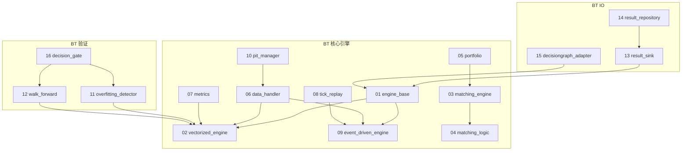

# 32 — D-BACKTEST 回测引擎域

> **状态**: ACTIVE v1.3.3 | **核心层**: L_BACKTEST 回测引擎层 | **成熟度**: L4 🟢 production
> **一句话**: 过去怎样——回测引擎统一归口，双模式架构+Tick回放
> **蓝图**: MOD-BT-001 v1.3.3 | **实际代码**: src/zephyr/backtest/ (16/16 core+io production)
> **架构决策**（2026-07-02）: 回测引擎统一归口D_BACKTEST域，消除research/intelligence/rollback多处置放；回测与仿真正交分离——回测（过去怎样）归D_BACKTEST，仿真（如果怎样）归D-SIMULATION

## §0 域定义

| 维度 | 内容 |
|------|------|
| 域ID | D_BACKTEST |
| 域名 | 回测引擎域 |
| 职责 | 离线回测、策略验证、因子IC/IR评估、Walk-Forward分析、过拟合检测 |
| 核心层 | L_BACKTEST 回测引擎层 |
| 优先级 | P1 |
| 核心Aggregate | BacktestResult (CTR-P1-016) |
| 核心事件 | E-BT-01 BacktestCompleted / E-BT-02 BacktestPassed / E-BT-03 OverfittingDetected |
| 开发状态 | ✅ production——16/16核心+io模块production，10个services模块planned |
| 激活前提 | D-DATA就绪 + D-FACTOR部分就绪 + D-AUTONOMY就绪 |
| 解除限制 | 2026-07-02解除ARB-11 T2-deferred限制，允许施工 |

### 与D-SIMULATION的边界

| 概念 | 回测 (D_BACKTEST) | 仿真 (D-SIMULATION) |
|------|-------------------|---------------------|
| 问题 | 过去怎样 | 如果怎样 |
| 数据 | 历史数据（重放） | 生成数据+历史数据 |
| 方法 | 事件重放+向量化 | What-if分析+蒙特卡洛 |
| 归属 | D_BACKTEST | D-SIMULATION |
| 状态 | ✅ 16/16 production | ⬜ 未启动 |

## §1 子模块清单

### Phase 1 (MVP v1.1.0) — 核心回测链路+Tick回放（10模块，全部✅production）

| ID | 文件 | 行数 | 职责 |
|----|------|:----:|------|
| BT-01 | core/engine_base.py | 111 | BacktestEngineBase ABC + BacktestResult契约(CTR-P1-016) + FactorDiscovery |
| BT-02 | implementations/vectorized_engine.py | 433 | DefaultBacktestEngine向量化回测（快速IC/IR筛选） |
| BT-03 | core/matching_engine.py | 474 | 撮合引擎（市价/限价/滑点/Tick级5档撮合） |
| BT-04 | core/matching_logic.py | 441 | A股约束（T+1/万三/5元/1bp滑点） |
| BT-05 | core/portfolio.py | 247 | 持仓/现金/PnL/净值曲线 |
| BT-06 | core/data_handler.py | 531 | 多源数据：D_DATA MiniQMT Provider(Tick+5档) + ClickHouse(日线批量) |
| BT-07 | core/metrics.py | 344 | Sharpe/Sortino/MaxDD/IC/IR/胜率 |
| BT-08 | core/tick_replay.py | 440 | Tick回放引擎（秒级做T，30秒/5秒级） |
| BT-09 | implementations/event_driven_engine.py | 414 | 事件驱动回测（Tick级，与tick_replay协同） |
| BT-10 | core/pit_manager.py | 296 | PIT铁律管理器（三公理+AS OF JOIN+Embargo期） |

### Phase 2 (v1.2.0) — 过拟合检测与Walk-Forward（2模块，全部✅production）

| ID | 文件 | 行数 | 职责 |
|----|------|:----:|------|
| BT-11 | core/overfitting_detector.py | 386 | 过拟合检测（三维度+三层：SIM-18/38/56） |
| BT-12 | core/walk_forward.py | 277 | Walk-Forward优化（滚动窗口+样本外验证） |

### v1.3.0 — io/子目录可视化产物（3模块，全部✅production）

| ID | 文件 | 行数 | 职责 |
|----|------|:----:|------|
| BT-13 | io/backtest_result_sink.py | 174 | BacktestResult→可视化数据(BacktestSinkData) |
| BT-14 | io/result_repository.py | 252 | BacktestRunArtifact持久化/检索(CTR-P1-017) |
| BT-15 | io/decisiongraph_adapter.py | 156 | BacktestResult→decisiongraph L5决策节点适配 |
| BT-16 | core/decision_gate.py | 686 | 3阶段决策门控（IS→WFA→OOS不可跳级+参数稳定性区域） |

### v2.0备忘 — 辅助工具模块（10模块，⬜planned，按需开发）

| ID | 文件 | 来源 | 职责 |
|----|------|------|------|
| BT-17 | services/scheduler.py | SIM-26 | 自动回测调度器（批量+参数网格+队列） |
| BT-18 | services/decay_monitor.py | SIM-27 | 策略衰减监控告警器 |
| BT-19 | services/report_generator.py | SIM-48 | 回测报告自动生成（PDF/HTML）[P2] |
| BT-20 | services/cache_manager.py | SIM-49 | 回测缓存管理器（结果缓存与复用）[P2] |
| BT-21 | services/param_analyzer.py | SIM-50 | 参数优化结果分析器（显著性+过拟合） |
| BT-22 | services/data_quality_checker.py | SIM-51 | 回测数据质量检查器（缺失+异常检测） |
| BT-23 | services/anomaly_diagnoser.py | SIM-52 | 回测异常诊断（错误诊断+修复建议）[P2] |
| BT-24 | services/result_comparator.py | SIM-53 | 回测结果对比（多次回测差异分析）[P2] |
| BT-25 | services/result_deployer.py | SIM-54 | 回测结果一键部署（策略部署到实盘） |
| BT-26 | services/nan_processor.py | SIM-55 | 指标计算NaN处理器（智能填充+清洗） |

## §2 域内依赖图



## §3 域间依赖

### 消费依赖

| 消费什么 | 来自哪个域 | 契约/事件 | 类型 |
|---------|-----------|---------|:----:|
| NormalizedMarketData | D-DATA | CTR-001 | H |
| FactorSignal | D-FACTOR | CTR-002 | S |
| Tick+5档盘口 | D-DATA | MiniQMT Provider | H |
| 历史日线批量 | D-DATA | ClickHouse c1_market | H |
| 权限/审计/遥测 | D-AUTONOMY | CTR-TRACE-001 | H |

### 产出依赖

| 产出什么 | 去往哪个域 | 契约/事件 | 类型 |
|---------|-----------|---------|:----:|
| BacktestResult | D-PORTFOLIO-CORE | CTR-P1-016 | H |
| BacktestResult | D-RISK | CTR-P1-016 | S |
| BacktestRunArtifact | D-FRONTEND | CTR-P1-017 | E |
| BacktestCompleted | D-GOVERNANCE/D-OPS | E-BT-01 | E |
| BacktestPassed | D-PORTFOLIO-CORE | E-BT-02 | E |
| OverfittingDetected | D-GOVERNANCE | E-BT-03 | E |

## §4 核心契约

### CTR-P1-016 BacktestResult

```python
@dataclass(frozen=True)
class BacktestResult:
    annual_return: float
    end_date: datetime
    idempotency_key: str
    max_drawdown: float
    sharpe_ratio: float
    start_date: datetime
    strategy_id: str
    timestamp: datetime
    total_return: float
    trades_count: int
    win_rate: float
    benchmark_symbol: Optional[str] = None
    overfitting_flag: bool = False
    schema_version: str = "1.0"
    trace_context: Optional[TraceContext] = None
```

### CTR-P1-017 BacktestRunArtifact

持久化回测运行产物（source=D_BACKTEST, target=[D_FRONTEND]），供前端可视化组件消费。

## §5 设计决策

| 编号 | 决策 | 理由 |
|------|------|------|
| ADR-BT-001 | 回测引擎统一归口D_BACKTEST | 消除research/intelligence/rollback多处置放（2026-07-02已执行：删除5处碎片化代码） |
| ADR-BT-002 | 回测与仿真正交分离 | 回测（过去怎样）归D_BACKTEST，仿真（如果怎样）归D_SIMULATION |
| ADR-BT-003 | 双模式架构 | 向量化回测（快速筛选因子IC/IR）+事件驱动回测（精确验证策略PnL） |
| ADR-BT-004 | Tick回放引擎 | 支持秒级做T场景（30秒/5秒冲高回落） |
| ADR-BT-005 | data_handler多源化 | D_DATA MiniQMT Provider(Tick+5档盘口) + ClickHouse(历史日线批量) |
| ADR-BT-006 | 回测=实盘一致性 | matching_engine撮合规则与D_EX_CORE的MiniQMT Broker保持一致 |
| ADR-BT-007 | 3阶段决策门控 | IS→WFA→OOS不可跳级+参数稳定性区域+回测-实盘偏差监控 |

## §6 版本历史

| 版本 | 日期 | 变更 |
|------|------|------|
| v1.0.0 | 2026-07-02 | MVP基线：engine_base + vectorized_engine |
| v1.1.0 | 2026-07-04 | Tick回放+多源data_handler+event_driven_engine提升到Phase 1 |
| v1.2.0 | 2026-07-04 | PIT铁律+过拟合检测+Walk-Forward+3阶段决策门控 |
| v1.3.0 | 2026-07-04 | io/子目录新增（#ARCH-047前端重构配合）+CTR-P1-017 |
| v1.3.3 | 2026-07-19 | 12/12 Phase 1+2核心模块 + 4/4 io/模块均已production；28+测试通过 |
