# 53_d_trading / 交易运营

> **文档作用 / Purpose**: 展示 交易运营（D-TRADING）功能域的模块清单、域内依赖关系和跨域依赖关系，供架构审查和域治理参考。

> 本文档由 generate_domain_doc.py 从 depgraph.db 自动生成
> 最后更新: 2026-06-24 20:41:46
> 数据源: depgraph.db nodes表 + edges表

## 域基本信息 / Domain Overview

| 字段 | 值 | Field | Value |
|------|------|-------|-------|
| 编号 | 53 | Number | 53 |
| 域ID | D-TRADING | Domain ID | D-TRADING |
| 域名称 | 交易运营 | Domain Name | 交易运营 |
| 层级 | L2_domain | Layer | L2_domain |
| 模块数 | 249 | Module Count | 249 |
| 域内依赖 | 225 | Internal Dependencies | 225 |
| 跨域入边 | 472 | Cross-domain Incoming | 472 |
| 跨域出边 | 187 | Cross-domain Outgoing | 187 |
| 设计态模块 | 89 | Design Modules | 89 |
| 原型态模块 | 137 | Prototype Modules | 137 |
| 生产态模块 | 17 | Production Modules | 17 |
| 容量 | 249/150 (超容) | Capacity | 249/150 (超容) |
| 描述 | 交易会话、交易接口、交易日志、交易复盘。交易运营中枢。合规检查由D-GOV-ENFORCEMENT门禁层执行。 | Description | 交易会话、交易接口、交易日志、交易复盘。交易运营中枢。合规检查由D-GOV-ENFORCEMENT门禁层执行。 |

## 模块清单 / Module List

共 249 个模块（按路径排序，全部显示）

| 模块路径 / Module Path | 模块名称 / Module Name | 设计成熟度 / Maturity | 构建状态 / Build Status |
|---------|---------|-----------|---------|
| D-TRADING/7 Architecture Decisions 架构决策7项 | 7 Architecture Decisions 架构决策7项 | design | design_only |
| D-TRADING/A-Share Pre-Market Standardized Workflow A股盘前标准化工作流 | A-Share Pre-Market Standardized Workf... | design | design_only |
| D-TRADING/Annual Statistics 年度统计 | Annual Statistics 年度统计 | design | design_only |
| D-TRADING/Approval Flow 审批流 | Approval Flow 审批流 | design | design_only |
| D-TRADING/Approval Token Verification 审批令牌验证 | Approval Token Verification 审批令牌验证 | design | design_only |
| D-TRADING/Autonomy Core Dependency Edge 自治核心依赖边 | Autonomy Core Dependency Edge 自治核心依赖边 | design | design_only |
| D-TRADING/Cash Flow Manager 现金流管理器 | Cash Flow Manager 现金流管理器 | design | design_only |
| D-TRADING/Cash Management 资金与现金管理 | Cash Management 资金与现金管理 | design | design_only |
| D-TRADING/Chase High Prevention 踏空追高防范 | Chase High Prevention 踏空追高防范 | design | design_only |
| D-TRADING/Closed Loop Optimization 15 Dimensions 闭环优化15维度 | Closed Loop Optimization 15 Dimension... | design | design_only |
| D-TRADING/Config Signature Verification 配置签名验证 | Config Signature Verification 配置签名验证 | design | design_only |
| D-TRADING/CorporateActionAdjusted 公司行为调整 | CorporateActionAdjusted 公司行为调整 | design | design_only |
| D-TRADING/Cross Layer Runtime Architecture 横切层运行时架构 | Cross Layer Runtime Architecture 横切层运... | design | design_only |
| D-TRADING/D-TRADING | D-TRADING | design | design_only |
| D-TRADING/DORA ICT Event Report DORA ICT事件报告 | DORA ICT Event Report DORA ICT事件报告 | design | design_only |
| D-TRADING/Data Degradation Processing 数据降级处理 | Data Degradation Processing 数据降级处理 | design | design_only |
| D-TRADING/Data Signature Verification 数据签名验证 | Data Signature Verification 数据签名验证 | design | design_only |
| D-TRADING/Deterministic Validation 确定性校验 | Deterministic Validation 确定性校验 | design | design_only |
| D-TRADING/EOD Processor日终处理器 | EOD Processor日终处理器 | design | design_only |
| D-TRADING/End-of-Day Processor 日终处理器 | End-of-Day Processor 日终处理器 | design | design_only |
| D-TRADING/Execution Core Dependency Edge 执行核心依赖边 | Execution Core Dependency Edge 执行核心依赖边 | design | design_only |
| D-TRADING/Fee PnL Data 费率PnL数据 | Fee PnL Data 费率PnL数据 | design | design_only |
| D-TRADING/GOV-TRD-001 单票持仓集中度规则 | GOV-TRD-001 单票持仓集中度规则 | design | design_only |
| D-TRADING/Gift Declaration Form Engine 礼品申报表引擎 | Gift Declaration Form Engine 礼品申报表引擎 | design | design_only |
| D-TRADING/Global State Aggregator 全局状态聚合器 | Global State Aggregator 全局状态聚合器 | design | design_only |
| D-TRADING/Hard Boundary Constraints 硬边界约束 | Hard Boundary Constraints 硬边界约束 | design | design_only |
| D-TRADING/Infra Runtime Dependency Edge 基础设施运行时依赖边 | Infra Runtime Dependency Edge 基础设施运行时依赖边 | design | design_only |
| D-TRADING/Intraday Instant Reaction Decision Engine 盘中即时反应决策引擎 | Intraday Instant Reaction Decision En... | design | design_only |
| D-TRADING/Intraday PnL Monitor 日内盈亏监控 | Intraday PnL Monitor 日内盈亏监控 | design | design_only |
| D-TRADING/Intraday Trading Agent 日内交易代理 | Intraday Trading Agent 日内交易代理 | design | design_only |
| D-TRADING/L0 L1 L2 Data Flow Artery L0→L1→L2数据流主动脉 | L0 L1 L2 Data Flow Artery L0→L1→L2数据流主动脉 | design | design_only |
| D-TRADING/L2数据流主动脉 | L2数据流主动脉 | design | design_only |
| D-TRADING/LP-020 Trading Operations Domain Substitute 交易运营域替代 | LP-020 Trading Operations Domain Subs... | design | design_only |
| D-TRADING/Log Signature 日志签名 | Log Signature 日志签名 | design | design_only |
| D-TRADING/Loss Revenge Prevention 亏损报复防范 | Loss Revenge Prevention 亏损报复防范 | design | design_only |
| D-TRADING/Margin Calculator保证金计算器 | Margin Calculator保证金计算器 | design | design_only |
| D-TRADING/MarginAccount 保证金账户 | MarginAccount 保证金账户 | design | design_only |
| D-TRADING/MarginUnavailable 保证金不可用 | MarginUnavailable 保证金不可用 | design | design_only |
| D-TRADING/MarginWarning 保证金预警 | MarginWarning 保证金预警 | design | design_only |
| D-TRADING/Market Data 行情数据 | Market Data 行情数据 | design | design_only |
| D-TRADING/MultiAccountAllocated 多账户分配完成 | MultiAccountAllocated 多账户分配完成 | design | design_only |
| D-TRADING/Order Status 订单状态 | Order Status 订单状态 | design | design_only |
| D-TRADING/Portfolio Core Dependency Edge 组合核心依赖边 | Portfolio Core Dependency Edge 组合核心依赖边 | design | design_only |
| D-TRADING/Position Accountant持仓会计 | Position Accountant持仓会计 | design | design_only |
| D-TRADING/Position Accounting 持仓会计 | Position Accounting 持仓会计 | design | design_only |
| D-TRADING/Position Data 持仓数据 | Position Data 持仓数据 | design | design_only |
| D-TRADING/Post-Market Review 盘后复盘 | Post-Market Review 盘后复盘 | design | design_only |
| D-TRADING/Pre-Market Checker盘前检查器 | Pre-Market Checker盘前检查器 | design | design_only |
| D-TRADING/Pre-Market Review 盘前复核 | Pre-Market Review 盘前复核 | design | design_only |
| D-TRADING/Process-Level Isolation 进程级隔离 | Process-Level Isolation 进程级隔离 | design | design_only |
| D-TRADING/Profit Pride Warning 盈利骄傲警告 | Profit Pride Warning 盈利骄傲警告 | design | design_only |
| D-TRADING/Reconciliation Engine对账引擎 | Reconciliation Engine对账引擎 | design | design_only |
| D-TRADING/ReconciliationCompleted 对账完成 | ReconciliationCompleted 对账完成 | design | design_only |
| D-TRADING/Reference Data Manager 参考数据管理 | Reference Data Manager 参考数据管理 | design | design_only |
| D-TRADING/Reporting Dependency Edge 报告域依赖边 | Reporting Dependency Edge 报告域依赖边 | design | design_only |
| D-TRADING/Risk Dependency Edge 风控依赖边 | Risk Dependency Edge 风控依赖边 | design | design_only |
| D-TRADING/Settlement Manager结算管理器 | Settlement Manager结算管理器 | design | design_only |
| D-TRADING/Settlement Reconciliation 结算与对账 | Settlement Reconciliation 结算与对账 | design | design_only |
| D-TRADING/SettlementCompleted 结算完成 | SettlementCompleted 结算完成 | design | design_only |
| D-TRADING/SettlementRecord 结算记录 | SettlementRecord 结算记录 | design | design_only |
| D-TRADING/Signature Chain 签名链 | Signature Chain 签名链 | design | design_only |
| D-TRADING/Strategy Capacity Academic Framework 策略容量学术框架 | Strategy Capacity Academic Framework ... | design | design_only |
| D-TRADING/Strategy Parameters 策略参数 | Strategy Parameters 策略参数 | design | design_only |
| D-TRADING/Trader 交易员角色 | Trader 交易员角色 | design | design_only |
| D-TRADING/Trading Calendar Engine交易日历引擎 | Trading Calendar Engine交易日历引擎 | design | design_only |
| D-TRADING/Trading Cost Analyzer交易成本分析 | Trading Cost Analyzer交易成本分析 | design | design_only |
| D-TRADING/Trading Operations Data 交易运营数据 | Trading Operations Data 交易运营数据 | design | design_only |
| D-TRADING/Trading Operations Domain 交易运营域 | Trading Operations Domain 交易运营域 | design | design_only |
| D-TRADING/Trading Order 交易指令 | Trading Order 交易指令 | design | design_only |
| D-TRADING/TradingOrder 交易订单 | TradingOrder 交易订单 | design | design_only |
| D-TRADING/Trapped Position Adding Prevention 被套补仓防范 | Trapped Position Adding Prevention 被套... | design | design_only |
| D-TRADING/Treasury Manager 资金管理器 | Treasury Manager 资金管理器 | design | design_only |
| D-TRADING/WeChat Interaction Hub 微信交互中心 | WeChat Interaction Hub 微信交互中心 | design | design_only |
| D-TRADING/miniQMT Connection Credential miniQMT连接凭证 | miniQMT Connection Credential miniQMT... | design | design_only |
| D-TRADING/不做高频交易 No High-Frequency Trading | 不做高频交易 No High-Frequency Trading | design | design_only |
| D-TRADING/交易决策约束 Trading Decision Constraints | 交易决策约束 Trading Decision Constraints | design | design_only |
| D-TRADING/交易决策防漂移契约 Contract | 交易决策防漂移契约 Contract | design | design_only |
| D-TRADING/交易域规则目录 Trading Domain Rule Catalog | 交易域规则目录 Trading Domain Rule Catalog | design | design_only |
| D-TRADING/交易执行流程 Execution Workflow | 交易执行流程 Execution Workflow | design | design_only |
| D-TRADING/交易运营 Trading Operations | 交易运营 Trading Operations | design | design_only |
| D-TRADING/延迟归因器 Latency Attributor | 延迟归因器 Latency Attributor | design | design_only |
| D-TRADING/延迟预算分配器 Latency Budget Allocator | 延迟预算分配器 Latency Budget Allocator | design | design_only |
| D-TRADING/架构决策引用 Architecture Decision Reference | 架构决策引用 Architecture Decision Reference | design | design_only |
| D-TRADING/禁止AI自主执行大额下单 No AI Auto-Execute Large Order | 禁止AI自主执行大额下单 No AI Auto-Execute Large... | design | design_only |
| D-TRADING/禁止非交易时段提交订单 Order | 禁止非交易时段提交订单 Order | design | design_only |
| D-TRADING/纳秒级关键路径分析器 Nanosecond Critical Path Analyzer | 纳秒级关键路径分析器 Nanosecond Critical Path A... | design | design_only |
| src/zephyr/trading/__init__.py |  | production | draft |
| src/zephyr/trading/__init___from_orches.py |  | prototype | draft |
| src/zephyr/trading/__main__.py |  | prototype | draft |
| src/zephyr/trading/_extensions/__init__.py |  | scaffold_placeholder | orphan |
| src/zephyr/trading/action_dispatcher.py |  | prototype | draft |
| src/zephyr/trading/admission_controller.py |  | prototype | draft |
| src/zephyr/trading/ai_audit_logger.py |  | prototype | draft |
| src/zephyr/trading/api/__init__.py |  | scaffold_placeholder | orphan |
| src/zephyr/trading/auto_dispatcher.py |  | prototype | draft |
| src/zephyr/trading/auto_integrator.py |  | prototype | draft |
| src/zephyr/trading/auto_runtime_core.py |  | production | draft |
| src/zephyr/trading/auto_task_generator.py |  | prototype | draft |
| src/zephyr/trading/autopilot.py |  | prototype | draft |
| src/zephyr/trading/boot_cron_jobs.py |  | prototype | draft |
| src/zephyr/trading/boot_hooks.py |  | prototype | draft |
| src/zephyr/trading/capability_card.py |  | prototype | draft |
| src/zephyr/trading/capability_registry.py |  | prototype | draft |
| src/zephyr/trading/capability_sync.py |  | prototype | draft |
| src/zephyr/trading/circadian_scheduler.py |  | prototype | draft |
| src/zephyr/trading/conductor.py |  | prototype | draft |
| src/zephyr/trading/core/__init__.py |  | scaffold_placeholder | orphan |
| src/zephyr/trading/dream_cycle.py |  | prototype | draft |
| src/zephyr/trading/feedback_loop.py |  | prototype | draft |
| src/zephyr/trading/finalizer.py |  | prototype | draft |
| src/zephyr/trading/gpu_consensus_scheduler.py |  | prototype | draft |
| src/zephyr/trading/gpu_monitor.py |  | prototype | draft |
| src/zephyr/trading/health_monitor.py |  | prototype | draft |
| src/zephyr/trading/ide_health_daemon.py |  | prototype | draft |
| src/zephyr/trading/infrastructure/__init__.py |  | scaffold_placeholder | orphan |
| src/zephyr/trading/integration_registry.py |  | prototype | draft |
| src/zephyr/trading/lifecycle_manager.py |  | prototype | draft |
| src/zephyr/trading/models/__init__.py |  | scaffold_placeholder | orphan |
| src/zephyr/trading/module_onboarding_scanner.py |  | prototype | draft |
| src/zephyr/trading/night_shift_queue.py |  | prototype | draft |
| src/zephyr/trading/orchestrator/__init__.py |  | prototype | draft |
| src/zephyr/trading/orchestrator/agent_health_monitor.py |  | prototype | draft |
| src/zephyr/trading/orchestrator/agent_orchestrator.py |  | prototype | draft |
| src/zephyr/trading/orchestrator/agent_quality.py |  | prototype | draft |
| src/zephyr/trading/orchestrator/alert_handler.py |  | prototype | draft |
| src/zephyr/trading/orchestrator/autonomy_guard.py |  | prototype | draft |
| src/zephyr/trading/orchestrator/backup_manager.py |  | prototype | draft |
| src/zephyr/trading/orchestrator/batch_orchestrator.py |  | prototype | draft |
| src/zephyr/trading/orchestrator/benchmark_runner.py |  | prototype | draft |
| src/zephyr/trading/orchestrator/blind_spot_closure.py |  | prototype | draft |
| src/zephyr/trading/orchestrator/blueprint_health.py |  | prototype | draft |
| src/zephyr/trading/orchestrator/blueprint_scorer.py |  | prototype | draft |
| src/zephyr/trading/orchestrator/bulkhead_manager.py |  | prototype | draft |
| src/zephyr/trading/orchestrator/canary_manager.py |  | prototype | draft |
| src/zephyr/trading/orchestrator/capacity_budget.py |  | prototype | draft |
| src/zephyr/trading/orchestrator/chaos_engine.py |  | prototype | draft |
| src/zephyr/trading/orchestrator/chaos_hooks.py |  | prototype | draft |
| src/zephyr/trading/orchestrator/config_manager.py |  | prototype | draft |
| src/zephyr/trading/orchestrator/construction_guide.py |  | prototype | draft |
| src/zephyr/trading/orchestrator/context_bridge.py |  | prototype | draft |
| src/zephyr/trading/orchestrator/contract_registry.py |  | prototype | draft |
| src/zephyr/trading/orchestrator/contract_router.py |  | prototype | draft |
| src/zephyr/trading/orchestrator/core/__init__.py |  | prototype | draft |
| src/zephyr/trading/orchestrator/core/agent_orchestrator.py |  | prototype | draft |
| src/zephyr/trading/orchestrator/core/task_queue.py |  | prototype | draft |
| src/zephyr/trading/orchestrator/core/trigger_router.py |  | prototype | draft |
| src/zephyr/trading/orchestrator/core/wave_generator.py |  | prototype | draft |
| src/zephyr/trading/orchestrator/data_lifecycle.py |  | prototype | draft |
| src/zephyr/trading/orchestrator/deferred_queue.py |  | prototype | draft |
| src/zephyr/trading/orchestrator/degrade_cascade.py |  | prototype | draft |
| src/zephyr/trading/orchestrator/dependency_lock.py |  | prototype | draft |
| src/zephyr/trading/orchestrator/design_decisions.py |  | prototype | draft |
| src/zephyr/trading/orchestrator/disk_guard.py |  | prototype | draft |
| src/zephyr/trading/orchestrator/dlq_manager.py |  | prototype | draft |
| src/zephyr/trading/orchestrator/failure_matcher.py |  | prototype | draft |
| src/zephyr/trading/orchestrator/fault_types.py |  | prototype | draft |
| src/zephyr/trading/orchestrator/feature_flag.py |  | prototype | draft |
| src/zephyr/trading/orchestrator/file_task_mapper.py |  | prototype | draft |
| src/zephyr/trading/orchestrator/finding_bridge.py |  | prototype | draft |
| src/zephyr/trading/orchestrator/hallucination_detector.py |  | prototype | draft |
| src/zephyr/trading/orchestrator/housekeeping.py |  | prototype | draft |
| src/zephyr/trading/orchestrator/incident_postmortem.py |  | prototype | draft |
| src/zephyr/trading/orchestrator/ke_quality.py |  | prototype | draft |
| src/zephyr/trading/orchestrator/knowledge_freshness.py |  | prototype | draft |
| src/zephyr/trading/orchestrator/lean_scanner.py |  | prototype | draft |
| src/zephyr/trading/orchestrator/memory_writer.py |  | prototype | draft |
| src/zephyr/trading/orchestrator/model_registry.py |  | prototype | draft |
| src/zephyr/trading/orchestrator/network_partition.py |  | prototype | draft |
| src/zephyr/trading/orchestrator/path_index.py |  | prototype | draft |
| src/zephyr/trading/orchestrator/phase_executor.py |  | prototype | draft |
| src/zephyr/trading/orchestrator/prompt_version.py |  | prototype | draft |
| src/zephyr/trading/orchestrator/reconciliation_loop.py |  | prototype | draft |
| src/zephyr/trading/orchestrator/resilience/__init__.py |  | prototype | draft |
| src/zephyr/trading/orchestrator/resilience/deferred_queue.py |  | prototype | draft |
| src/zephyr/trading/orchestrator/resilience/failure_matcher.py |  | prototype | draft |
| src/zephyr/trading/orchestrator/resilience/hallucination_detector.py |  | prototype | draft |
| src/zephyr/trading/orchestrator/resilience/rollback_manager.py |  | prototype | draft |
| src/zephyr/trading/orchestrator/risk_registry.py |  | prototype | draft |
| src/zephyr/trading/orchestrator/rollback_manager.py |  | prototype | draft |
| src/zephyr/trading/orchestrator/rolling_upgrade.py |  | prototype | draft |
| src/zephyr/trading/orchestrator/schema_migration.py |  | prototype | draft |
| src/zephyr/trading/orchestrator/script_runner.py |  | prototype | draft |
| src/zephyr/trading/orchestrator/session_conflict.py |  | prototype | draft |
| src/zephyr/trading/orchestrator/session_handoff.py |  | prototype | draft |
| src/zephyr/trading/orchestrator/session_manager.py |  | prototype | draft |
| src/zephyr/trading/orchestrator/stability_guard.py |  | prototype | draft |
| src/zephyr/trading/orchestrator/startup_sequencer.py |  | prototype | draft |
| src/zephyr/trading/orchestrator/state/__init__.py |  | prototype | draft |
| src/zephyr/trading/orchestrator/state/agent_health_monitor.py |  | prototype | draft |
| src/zephyr/trading/orchestrator/state/file_task_mapper.py |  | prototype | draft |
| src/zephyr/trading/orchestrator/state/session_manager.py |  | prototype | draft |
| src/zephyr/trading/orchestrator/state/state_synchronizer.py |  | prototype | draft |
| src/zephyr/trading/orchestrator/state_propagation.py |  | prototype | draft |
| src/zephyr/trading/orchestrator/state_synchronizer.py |  | prototype | draft |
| src/zephyr/trading/orchestrator/system_transfer.py |  | prototype | draft |
| src/zephyr/trading/orchestrator/task_queue.py |  | prototype | draft |
| src/zephyr/trading/orchestrator/teardown_manager.py |  | prototype | draft |
| src/zephyr/trading/orchestrator/trigger_router.py |  | prototype | draft |
| src/zephyr/trading/orchestrator/version_manifest.py |  | prototype | draft |
| src/zephyr/trading/orchestrator/wave_generator.py |  | prototype | draft |
| src/zephyr/trading/orphan_detector.py |  | prototype | draft |
| src/zephyr/trading/ports.py |  | prototype | draft |
| src/zephyr/trading/protection_index.py |  | prototype | draft |
| src/zephyr/trading/resource_optimization.py |  | prototype | draft |
| src/zephyr/trading/runtime_config.py |  | prototype | draft |
| src/zephyr/trading/services/__init__.py |  | scaffold_placeholder | orphan |
| src/zephyr/trading/session_lifecycle.py |  | prototype | draft |
| src/zephyr/trading/speed_baseline_checker.py |  | prototype | draft |
| src/zephyr/trading/staging_area.py |  | prototype | draft |
| src/zephyr/trading/status_dashboard.py |  | prototype | draft |
| src/zephyr/trading/stop_gate.py |  | prototype | draft |
| src/zephyr/trading/task_gate.py |  | prototype | draft |
| src/zephyr/trading/trading_contracts/__init__.py |  | prototype | draft |
| src/zephyr/trading/trading_contracts/execution/__init__.py |  | prototype | draft |
| src/zephyr/trading/trading_contracts/execution/capital_allocation_result.py |  | production | draft |
| src/zephyr/trading/trading_contracts/execution/execution_rejection_error.py |  | prototype | draft |
| src/zephyr/trading/trading_contracts/execution/execution_report.py |  | production | draft |
| src/zephyr/trading/trading_contracts/execution/fill.py |  | production | draft |
| src/zephyr/trading/trading_contracts/execution/model_serving_request.py |  | production | draft |
| src/zephyr/trading/trading_contracts/execution/order.py |  | production | draft |
| src/zephyr/trading/trading_contracts/execution/position.py |  | production | draft |
| src/zephyr/trading/trading_contracts/factories.py |  | prototype | draft |
| src/zephyr/trading/trading_contracts/market/__init__.py |  | prototype | draft |
| src/zephyr/trading/trading_contracts/market/factor_monitor_report.py |  | prototype | draft |
| src/zephyr/trading/trading_contracts/market/factor_signal.py |  | production | draft |
| src/zephyr/trading/trading_contracts/market/instrument.py |  | prototype | draft |
| src/zephyr/trading/trading_contracts/market/macro_factor_signal.py |  | prototype | draft |
| src/zephyr/trading/trading_contracts/market/market_data.py |  | production | draft |
| src/zephyr/trading/trading_contracts/market/signal_degradation_warning.py |  | prototype | draft |
| src/zephyr/trading/trading_contracts/market/synthesized_signal.py |  | production | draft |
| src/zephyr/trading/trading_contracts/portfolio/contracts/__init__.py |  | prototype | draft |
| src/zephyr/trading/trading_contracts/portfolio/contracts/money.py |  | production | draft |
| ...ading/trading_contracts/portfolio/contracts/performance_attribution_report.py |  | prototype | draft |
| ...hyr/trading/trading_contracts/portfolio/contracts/strategy_lifecycle_event.py |  | prototype | draft |
| src/zephyr/trading/trading_contracts/risk/__init__.py |  | prototype | draft |
| src/zephyr/trading/trading_contracts/risk/compliance_rule.py |  | prototype | draft |
| src/zephyr/trading/trading_contracts/risk/risk_dashboard_snapshot.py |  | production | draft |
| src/zephyr/trading/trading_contracts/risk/risk_limit_violation_error.py |  | production | draft |
| src/zephyr/trading/trading_contracts/risk/risk_limits.py |  | production | draft |
| src/zephyr/trading/trading_contracts/risk/risk_metrics.py |  | production | draft |
| src/zephyr/trading/trading_contracts/risk/risk_validator_protocol.py |  | production | draft |
| src/zephyr/trading/verdict_engine.py |  | prototype | draft |
| src/zephyr/trading/windows_service.py |  | prototype | draft |
| src/zephyr/trading/work_dag.py |  | prototype | draft |
| src/zephyr/trading/work_orchestrator.py |  | prototype | draft |
| src/zephyr/trading/zombie_scanner.py |  | prototype | draft |
| 交易域-监控/D-TRADING-06 | Intraday P&L Monitor | design | design_only |
| 交易域-资金/D-TRADING-12 | Cash Flow Manager | design | design_only |
| 交易运营域/D-TRADING-04 | EOD Processor | design | design_only |

## 域内依赖图 / Internal Dependency Diagram

> 依赖图内嵌在本文档中，IDE 可直接渲染显示。每30个节点一组分页显示。
>
> **图例说明 / Legend**：
> - **实线边框 = 运营态模块**（production，已上线运行）
> - **虚线边框 = 设计态模块**（design，还在设计中）
> - **实线箭头 = 运营态依赖**（已生效的依赖关系）
> - **虚线箭头 = 设计态依赖**（计划中的依赖关系）

### 第 1 页 / 共 9 页 / Page 1 of 9

```mermaid
graph TD
    subgraph D_TRADING["D-TRADING 交易运营"]
        D_TRADING_7_Architecture_Decisions_7["7 Architecture Decisions 架构决策7项 design"]
        D_TRADING_A_Share_Pre_Market_Standardized_Workflow_A["A-Share Pre-Market Standardized Workflow A股盘前标准... design"]
        D_TRADING_Annual_Statistics["Annual Statistics 年度统计 design"]
        D_TRADING_Approval_Flow["Approval Flow 审批流 design"]
        D_TRADING_Approval_Token_Verification["Approval Token Verification 审批令牌验证 design"]
        D_TRADING_Autonomy_Core_Dependency_Edge["Autonomy Core Dependency Edge 自治核心依赖边 design"]
        D_TRADING_Cash_Flow_Manager["Cash Flow Manager 现金流管理器 design"]
        D_TRADING_Cash_Management["Cash Management 资金与现金管理 design"]
        D_TRADING_Chase_High_Prevention["Chase High Prevention 踏空追高防范 design"]
        D_TRADING_Closed_Loop_Optimization_15_Dimensions_15["Closed Loop Optimization 15 Dimensions 闭环优化15维度 design"]
        D_TRADING_Config_Signature_Verification["Config Signature Verification 配置签名验证 design"]
        D_TRADING_CorporateActionAdjusted["CorporateActionAdjusted 公司行为调整 design"]
        D_TRADING_Cross_Layer_Runtime_Architecture["Cross Layer Runtime Architecture 横切层运行时架构 design"]
        D_TRADING_D_TRADING["D-TRADING design"]
        D_TRADING_DORA_ICT_Event_Report_DORA_ICT["DORA ICT Event Report DORA ICT事件报告 design"]
        D_TRADING_Data_Degradation_Processing["Data Degradation Processing 数据降级处理 design"]
        D_TRADING_Data_Signature_Verification["Data Signature Verification 数据签名验证 design"]
        D_TRADING_Deterministic_Validation["Deterministic Validation 确定性校验 design"]
        D_TRADING_EOD_Processor["EOD Processor日终处理器 design"]
        D_TRADING_End_of_Day_Processor["End-of-Day Processor 日终处理器 design"]
        D_TRADING_Execution_Core_Dependency_Edge["Execution Core Dependency Edge 执行核心依赖边 design"]
        D_TRADING_Fee_PnL_Data_PnL["Fee PnL Data 费率PnL数据 design"]
        D_TRADING_GOV_TRD_001["GOV-TRD-001 单票持仓集中度规则 design"]
        D_TRADING_Gift_Declaration_Form_Engine["Gift Declaration Form Engine 礼品申报表引擎 design"]
        D_TRADING_Global_State_Aggregator["Global State Aggregator 全局状态聚合器 design"]
        D_TRADING_Hard_Boundary_Constraints["Hard Boundary Constraints 硬边界约束 design"]
        D_TRADING_Infra_Runtime_Dependency_Edge["Infra Runtime Dependency Edge 基础设施运行时依赖边 design"]
        D_TRADING_Intraday_Instant_Reaction_Decision_Engine["Intraday Instant Reaction Decision Engine 盘中即时反... design"]
        D_TRADING_Intraday_PnL_Monitor["Intraday PnL Monitor 日内盈亏监控 design"]
        D_TRADING_Intraday_Trading_Agent["Intraday Trading Agent 日内交易代理 design"]
    end
    D_TRADING_EOD_Processor -.->|event| D_TRADING_DORA_ICT_Event_Report_DORA_ICT
    D_TRADING_Intraday_Instant_Reaction_Decision_Engine -.->|import_depends| D_TRADING_Data_Degradation_Processing
    D_TRADING_Cash_Flow_Manager -.->|import_depends| D_TRADING_Global_State_Aggregator
    D_TRADING_Closed_Loop_Optimization_15_Dimensions_15 -.->|import_depends| D_TRADING_Intraday_PnL_Monitor
    D_TRADING_Cross_Layer_Runtime_Architecture -.->|import_depends| D_TRADING_Global_State_Aggregator
    D_TRADING_Global_State_Aggregator -.->|import_depends| D_TRADING_Intraday_Trading_Agent
    D_TRADING_Intraday_Trading_Agent -.->|import_depends| D_TRADING_Data_Signature_Verification
    D_TRADING_End_of_Day_Processor -.->|import_depends| D_TRADING_Gift_Declaration_Form_Engine
    D_TRADING_Gift_Declaration_Form_Engine -.->|import_depends| D_TRADING_Approval_Token_Verification
    D_EX_SOR["D-EX_SOR design"]
    D_TRADING_D_TRADING -.->|domain_dependency| D_EX_SOR
    D_TRADING_A_Share_Pre_Market_Standardized_Workflow_A -.->|config_depends| D_EX_SOR
    D_DATA_ENG["D-DATA_ENG design"]
    D_TRADING_Infra_Runtime_Dependency_Edge -.->|contract| D_DATA_ENG
    D_TRADING_Approval_Token_Verification -.->|contract| D_DATA_ENG
    D_SIGNAL["D-SIGNAL design"]
    D_SIGNAL -.->|event| D_TRADING_D_TRADING
    D_GOVERNANCE["D-GOVERNANCE design"]
    D_GOVERNANCE -.->|data| D_TRADING_D_TRADING
    D_POSITION["D-POSITION design"]
    D_POSITION -.->|domain_dependency| D_TRADING_D_TRADING
    D_AUTONOMY_CORE["D-AUTONOMY_CORE design"]
    D_AUTONOMY_CORE -.->|data| D_TRADING_A_Share_Pre_Market_Standardized_Workflow_A
    D_RISK["D-RISK design"]
    D_RISK -.->|config_depends| D_TRADING_A_Share_Pre_Market_Standardized_Workflow_A
    D_RISK -.->|event| D_TRADING_Intraday_Instant_Reaction_Decision_Engine
    D_GOVERNANCE -.->|contract| D_TRADING_Intraday_Instant_Reaction_Decision_Engine
    D_COMPLIANCE["D-COMPLIANCE design"]
    D_COMPLIANCE -.->|data| D_TRADING_Cash_Flow_Manager
    D_INTEGRATION["D-INTEGRATION design"]
    D_INTEGRATION -.->|contract| D_TRADING_Closed_Loop_Optimization_15_Dimensions_15
    D_RISK -.->|data| D_TRADING_Closed_Loop_Optimization_15_Dimensions_15
    D_INTELLIGENCE["D-INTELLIGENCE design"]
    D_INTELLIGENCE -.->|event| D_TRADING_Closed_Loop_Optimization_15_Dimensions_15
    D_EX_CORE["D-EX_CORE design"]
    D_EX_CORE -.->|contract| D_TRADING_7_Architecture_Decisions_7
    D_SECURITY["D-SECURITY design"]
    D_SECURITY -.->|contract| D_TRADING_7_Architecture_Decisions_7
    D_KNOWLEDGE["D-KNOWLEDGE design"]
    D_KNOWLEDGE -.->|contract| D_TRADING_7_Architecture_Decisions_7
    D_COMPLIANCE -.->|data| D_TRADING_7_Architecture_Decisions_7
    classDef production fill:#e1f5fe,stroke:#01579b,stroke-width:2px,color:#000
    classDef design fill:#fff3e0,stroke:#e65100,stroke-width:2px,color:#000,stroke-dasharray: 5 5
    classDef external_prod fill:#e8f5e9,stroke:#1b5e20,stroke-width:1px,color:#000
    classDef external_design fill:#fce4ec,stroke:#880e4f,stroke-width:1px,color:#000,stroke-dasharray: 5 5
    class D_TRADING_7_Architecture_Decisions_7,D_TRADING_A_Share_Pre_Market_Standardized_Workflow_A,D_TRADING_Annual_Statistics,D_TRADING_Approval_Flow,D_TRADING_Approval_Token_Verification,D_TRADING_Autonomy_Core_Dependency_Edge,D_TRADING_Cash_Flow_Manager,D_TRADING_Cash_Management,D_TRADING_Chase_High_Prevention,D_TRADING_Closed_Loop_Optimization_15_Dimensions_15,D_TRADING_Config_Signature_Verification,D_TRADING_CorporateActionAdjusted,D_TRADING_Cross_Layer_Runtime_Architecture,D_TRADING_D_TRADING,D_TRADING_DORA_ICT_Event_Report_DORA_ICT,D_TRADING_Data_Degradation_Processing,D_TRADING_Data_Signature_Verification,D_TRADING_Deterministic_Validation,D_TRADING_EOD_Processor,D_TRADING_End_of_Day_Processor,D_TRADING_Execution_Core_Dependency_Edge,D_TRADING_Fee_PnL_Data_PnL,D_TRADING_GOV_TRD_001,D_TRADING_Gift_Declaration_Form_Engine,D_TRADING_Global_State_Aggregator,D_TRADING_Hard_Boundary_Constraints,D_TRADING_Infra_Runtime_Dependency_Edge,D_TRADING_Intraday_Instant_Reaction_Decision_Engine,D_TRADING_Intraday_PnL_Monitor,D_TRADING_Intraday_Trading_Agent design
    class D_EX_SOR,D_DATA_ENG,D_SIGNAL,D_GOVERNANCE,D_POSITION,D_AUTONOMY_CORE,D_RISK,D_COMPLIANCE,D_INTEGRATION,D_INTELLIGENCE,D_EX_CORE,D_SECURITY,D_KNOWLEDGE external_design
```

### 第 2 页 / 共 9 页 / Page 2 of 9

```mermaid
graph TD
    subgraph D_TRADING["D-TRADING 交易运营"]
        D_TRADING_L0_L1_L2_Data_Flow_Artery_L0_L1_L2["L0 L1 L2 Data Flow Artery L0→L1→L2数据流主动脉 design"]
        D_TRADING_L2["L2数据流主动脉 design"]
        D_TRADING_LP_020_Trading_Operations_Domain_Substitute["LP-020 Trading Operations Domain Substitute 交易运... design"]
        D_TRADING_Log_Signature["Log Signature 日志签名 design"]
        D_TRADING_Loss_Revenge_Prevention["Loss Revenge Prevention 亏损报复防范 design"]
        D_TRADING_Margin_Calculator["Margin Calculator保证金计算器 design"]
        D_TRADING_MarginAccount["MarginAccount 保证金账户 design"]
        D_TRADING_MarginUnavailable["MarginUnavailable 保证金不可用 design"]
        D_TRADING_MarginWarning["MarginWarning 保证金预警 design"]
        D_TRADING_Market_Data["Market Data 行情数据 design"]
        D_TRADING_MultiAccountAllocated["MultiAccountAllocated 多账户分配完成 design"]
        D_TRADING_Order_Status["Order Status 订单状态 design"]
        D_TRADING_Portfolio_Core_Dependency_Edge["Portfolio Core Dependency Edge 组合核心依赖边 design"]
        D_TRADING_Position_Accountant["Position Accountant持仓会计 design"]
        D_TRADING_Position_Accounting["Position Accounting 持仓会计 design"]
        D_TRADING_Position_Data["Position Data 持仓数据 design"]
        D_TRADING_Post_Market_Review["Post-Market Review 盘后复盘 design"]
        D_TRADING_Pre_Market_Checker["Pre-Market Checker盘前检查器 design"]
        D_TRADING_Pre_Market_Review["Pre-Market Review 盘前复核 design"]
        D_TRADING_Process_Level_Isolation["Process-Level Isolation 进程级隔离 design"]
        D_TRADING_Profit_Pride_Warning["Profit Pride Warning 盈利骄傲警告 design"]
        D_TRADING_Reconciliation_Engine["Reconciliation Engine对账引擎 design"]
        D_TRADING_ReconciliationCompleted["ReconciliationCompleted 对账完成 design"]
        D_TRADING_Reference_Data_Manager["Reference Data Manager 参考数据管理 design"]
        D_TRADING_Reporting_Dependency_Edge["Reporting Dependency Edge 报告域依赖边 design"]
        D_TRADING_Risk_Dependency_Edge["Risk Dependency Edge 风控依赖边 design"]
        D_TRADING_Settlement_Manager["Settlement Manager结算管理器 design"]
        D_TRADING_Settlement_Reconciliation["Settlement Reconciliation 结算与对账 design"]
        D_TRADING_SettlementCompleted["SettlementCompleted 结算完成 design"]
        D_TRADING_SettlementRecord["SettlementRecord 结算记录 design"]
    end
    D_TRADING_Margin_Calculator -.->|import_depends| D_TRADING_Reconciliation_Engine
    D_TRADING_Reconciliation_Engine -.->|import_depends| D_TRADING_Settlement_Manager
    D_TRADING_Pre_Market_Checker -.->|event| D_TRADING_Portfolio_Core_Dependency_Edge
    D_TRADING_Position_Accountant -.->|event| D_TRADING_ReconciliationCompleted
    D_TRADING_Position_Accountant -.->|event| D_TRADING_MultiAccountAllocated
    D_TRADING_Reference_Data_Manager -.->|import_depends| D_TRADING_MarginAccount
    D_TRADING_Reference_Data_Manager -.->|event| D_TRADING_Reporting_Dependency_Edge
    D_TRADING_Reference_Data_Manager -.->|import_depends| D_TRADING_Post_Market_Review
    D_TRADING_Reference_Data_Manager -.->|import_depends| D_TRADING_Market_Data
    D_TRADING_Position_Accounting -.->|event| D_TRADING_MarginWarning
    D_EX_SOR["D-EX_SOR design"]
    D_TRADING_Pre_Market_Checker -.->|event| D_EX_SOR
    D_DATA_ENG["D-DATA_ENG design"]
    D_TRADING_Reference_Data_Manager -.->|config_depends| D_DATA_ENG
    D_INFRA_RUNTIME["D-INFRA_RUNTIME design"]
    D_TRADING_ReconciliationCompleted -.->|data| D_INFRA_RUNTIME
    D_TRADING_Portfolio_Core_Dependency_Edge -.->|data| D_INFRA_RUNTIME
    D_INTEGRATION["D-INTEGRATION design"]
    D_INTEGRATION -.->|event| D_TRADING_Margin_Calculator
    D_FRONTEND["D-FRONTEND design"]
    D_FRONTEND -.->|config_depends| D_TRADING_Margin_Calculator
    D_FACTOR["D-FACTOR design"]
    D_FACTOR -.->|contract| D_TRADING_Margin_Calculator
    D_INFRA_OPS["D-INFRA_OPS design"]
    D_INFRA_OPS -.->|data| D_TRADING_Reconciliation_Engine
    D_GOVERNANCE["D-GOVERNANCE design"]
    D_GOVERNANCE -.->|contract| D_TRADING_Settlement_Manager
    D_COMPLIANCE["D-COMPLIANCE design"]
    D_COMPLIANCE -.->|event| D_TRADING_Settlement_Manager
    D_ML_SERVE["D-ML_SERVE design"]
    D_ML_SERVE -.->|contract| D_TRADING_Settlement_Manager
    D_RISK["D-RISK design"]
    D_RISK -.->|contract| D_TRADING_Pre_Market_Checker
    D_COMPLIANCE -.->|data| D_TRADING_Pre_Market_Checker
    D_OPS["D-OPS design"]
    D_OPS -.->|contract| D_TRADING_Position_Accountant
    D_AUTONOMY_CORE["D-AUTONOMY_CORE design"]
    D_AUTONOMY_CORE -.->|event| D_TRADING_Position_Accountant
    D_COMPLIANCE -.->|contract| D_TRADING_Reference_Data_Manager
    D_PF_ALLOC["D-PF_ALLOC design"]
    D_PF_ALLOC -.->|contract| D_TRADING_Reference_Data_Manager
    D_ALT_DATA["D-ALT_DATA design"]
    D_ALT_DATA -.->|contract| D_TRADING_Reference_Data_Manager
    D_INTEGRATION -.->|event| D_TRADING_LP_020_Trading_Operations_Domain_Substitute
    classDef production fill:#e1f5fe,stroke:#01579b,stroke-width:2px,color:#000
    classDef design fill:#fff3e0,stroke:#e65100,stroke-width:2px,color:#000,stroke-dasharray: 5 5
    classDef external_prod fill:#e8f5e9,stroke:#1b5e20,stroke-width:1px,color:#000
    classDef external_design fill:#fce4ec,stroke:#880e4f,stroke-width:1px,color:#000,stroke-dasharray: 5 5
    class D_TRADING_L0_L1_L2_Data_Flow_Artery_L0_L1_L2,D_TRADING_L2,D_TRADING_LP_020_Trading_Operations_Domain_Substitute,D_TRADING_Log_Signature,D_TRADING_Loss_Revenge_Prevention,D_TRADING_Margin_Calculator,D_TRADING_MarginAccount,D_TRADING_MarginUnavailable,D_TRADING_MarginWarning,D_TRADING_Market_Data,D_TRADING_MultiAccountAllocated,D_TRADING_Order_Status,D_TRADING_Portfolio_Core_Dependency_Edge,D_TRADING_Position_Accountant,D_TRADING_Position_Accounting,D_TRADING_Position_Data,D_TRADING_Post_Market_Review,D_TRADING_Pre_Market_Checker,D_TRADING_Pre_Market_Review,D_TRADING_Process_Level_Isolation,D_TRADING_Profit_Pride_Warning,D_TRADING_Reconciliation_Engine,D_TRADING_ReconciliationCompleted,D_TRADING_Reference_Data_Manager,D_TRADING_Reporting_Dependency_Edge,D_TRADING_Risk_Dependency_Edge,D_TRADING_Settlement_Manager,D_TRADING_Settlement_Reconciliation,D_TRADING_SettlementCompleted,D_TRADING_SettlementRecord design
    class D_EX_SOR,D_DATA_ENG,D_INFRA_RUNTIME,D_INTEGRATION,D_FRONTEND,D_FACTOR,D_INFRA_OPS,D_GOVERNANCE,D_COMPLIANCE,D_ML_SERVE,D_RISK,D_OPS,D_AUTONOMY_CORE,D_PF_ALLOC,D_ALT_DATA external_design
```

### 第 3 页 / 共 9 页 / Page 3 of 9

```mermaid
graph TD
    subgraph D_TRADING["D-TRADING 交易运营"]
        D_TRADING_Signature_Chain["Signature Chain 签名链 design"]
        D_TRADING_Strategy_Capacity_Academic_Framework["Strategy Capacity Academic Framework 策略容量学术框架 design"]
        D_TRADING_Strategy_Parameters["Strategy Parameters 策略参数 design"]
        D_TRADING_Trader["Trader 交易员角色 design"]
        D_TRADING_Trading_Calendar_Engine["Trading Calendar Engine交易日历引擎 design"]
        D_TRADING_Trading_Cost_Analyzer["Trading Cost Analyzer交易成本分析 design"]
        D_TRADING_Trading_Operations_Data["Trading Operations Data 交易运营数据 design"]
        D_TRADING_Trading_Operations_Domain["Trading Operations Domain 交易运营域 design"]
        D_TRADING_Trading_Order["Trading Order 交易指令 design"]
        D_TRADING_TradingOrder["TradingOrder 交易订单 design"]
        D_TRADING_Trapped_Position_Adding_Prevention["Trapped Position Adding Prevention 被套补仓防范 design"]
        D_TRADING_Treasury_Manager["Treasury Manager 资金管理器 design"]
        D_TRADING_WeChat_Interaction_Hub["WeChat Interaction Hub 微信交互中心 design"]
        D_TRADING_miniQMT_Connection_Credential_miniQMT["miniQMT Connection Credential miniQMT连接凭证 design"]
        D_TRADING_No_High_Frequency_Trading["不做高频交易 No High-Frequency Trading design"]
        D_TRADING_Trading_Decision_Constraints["交易决策约束 Trading Decision Constraints design"]
        D_TRADING_Contract["交易决策防漂移契约 Contract design"]
        D_TRADING_Trading_Domain_Rule_Catalog["交易域规则目录 Trading Domain Rule Catalog design"]
        D_TRADING_Execution_Workflow["交易执行流程 Execution Workflow design"]
        D_TRADING_Trading_Operations["交易运营 Trading Operations design"]
        D_TRADING_Latency_Attributor["延迟归因器 Latency Attributor design"]
        D_TRADING_Latency_Budget_Allocator["延迟预算分配器 Latency Budget Allocator design"]
        D_TRADING_Architecture_Decision_Reference["架构决策引用 Architecture Decision Reference design"]
        D_TRADING_AI_No_AI_Auto_Execute_Large_Order["禁止AI自主执行大额下单 No AI Auto-Execute Large Order design"]
        D_TRADING_Order["禁止非交易时段提交订单 Order design"]
        D_TRADING_Nanosecond_Critical_Path_Analyzer["纳秒级关键路径分析器 Nanosecond Critical Path Analyzer design"]
        src_zephyr_trading_init_py["src/zephyr/trading/__init__.py production"]
        src_zephyr_trading_init_from_orches_py["src/zephyr/trading/__init___from_orches.py prototype"]
        src_zephyr_trading_main_py["src/zephyr/trading/__main__.py prototype"]
        src_zephyr_trading_extensions_init_py["src/zephyr/trading/_extensions/__init__.py scaffold_placeholder"]
    end
    src_zephyr_trading_main_py -.->|import_depends| src_zephyr_trading_init_py
    src_zephyr_trading_init_from_orches_py -.->|config_depends| src_zephyr_trading_init_py
    D_TRADING_Trading_Calendar_Engine -.->|import_depends| D_TRADING_Trading_Operations_Domain
    D_TRADING_Trading_Cost_Analyzer -.->|import_depends| D_TRADING_Trading_Order
    D_TRADING_Contract -.->|contract| D_TRADING_Trading_Domain_Rule_Catalog
    D_TRADING_Trading_Domain_Rule_Catalog -.->|import_depends| D_TRADING_Trader
    D_TRADING_Trader -.->|import_depends| D_TRADING_Latency_Budget_Allocator
    D_TRADING_Latency_Budget_Allocator -.->|import_depends| D_TRADING_Latency_Attributor
    D_TRADING_Latency_Budget_Allocator -.->|import_depends| D_TRADING_Signature_Chain
    D_TRADING_Latency_Attributor -.->|import_depends| D_TRADING_Nanosecond_Critical_Path_Analyzer
    D_DATA_ENG["D-DATA_ENG design"]
    D_TRADING_Trading_Operations -.->|data| D_DATA_ENG
    D_INFRA_RUNTIME["D-INFRA_RUNTIME design"]
    D_TRADING_Trading_Decision_Constraints -.->|event| D_INFRA_RUNTIME
    D_EX_SOR["D-EX_SOR design"]
    D_TRADING_AI_No_AI_Auto_Execute_Large_Order -.->|data| D_EX_SOR
    D_GOVERNANCE["D-GOVERNANCE prototype"]
    D_GOVERNANCE -.->|import_depends| src_zephyr_trading_init_py
    D_GOV_AUDIT["D-GOV_AUDIT prototype"]
    D_GOV_AUDIT -.->|import_depends| src_zephyr_trading_init_py
    D_GOV_AUDIT -->|import_depends| src_zephyr_trading_init_py
    D_INTEGRATION["D-INTEGRATION production"]
    D_INTEGRATION -->|import_depends| src_zephyr_trading_init_py
    D_INTEGRATION -.->|import_depends| src_zephyr_trading_init_py
    D_OPS["D-OPS prototype"]
    D_OPS -.->|import_depends| src_zephyr_trading_init_py
    D_SECURITY["D-SECURITY prototype"]
    D_SECURITY -.->|import_depends| src_zephyr_trading_init_py
    D_SECURITY -->|import_depends| src_zephyr_trading_init_py
    D_GOVERNANCE -.->|test_depends| src_zephyr_trading_init_py
    D_GOVERNANCE -.->|test_depends| src_zephyr_trading_init_py
    D_GOVERNANCE -.->|test_depends| src_zephyr_trading_init_py
    D_GOVERNANCE -.->|test_depends| src_zephyr_trading_init_py
    D_GOVERNANCE -.->|test_depends| src_zephyr_trading_init_py
    D_GOVERNANCE -.->|test_depends| src_zephyr_trading_init_py
    D_GOVERNANCE -.->|test_depends| src_zephyr_trading_init_py
    classDef production fill:#e1f5fe,stroke:#01579b,stroke-width:2px,color:#000
    classDef design fill:#fff3e0,stroke:#e65100,stroke-width:2px,color:#000,stroke-dasharray: 5 5
    classDef external_prod fill:#e8f5e9,stroke:#1b5e20,stroke-width:1px,color:#000
    classDef external_design fill:#fce4ec,stroke:#880e4f,stroke-width:1px,color:#000,stroke-dasharray: 5 5
    class src_zephyr_trading_init_py production
    class D_TRADING_Signature_Chain,D_TRADING_Strategy_Capacity_Academic_Framework,D_TRADING_Strategy_Parameters,D_TRADING_Trader,D_TRADING_Trading_Calendar_Engine,D_TRADING_Trading_Cost_Analyzer,D_TRADING_Trading_Operations_Data,D_TRADING_Trading_Operations_Domain,D_TRADING_Trading_Order,D_TRADING_TradingOrder,D_TRADING_Trapped_Position_Adding_Prevention,D_TRADING_Treasury_Manager,D_TRADING_WeChat_Interaction_Hub,D_TRADING_miniQMT_Connection_Credential_miniQMT,D_TRADING_No_High_Frequency_Trading,D_TRADING_Trading_Decision_Constraints,D_TRADING_Contract,D_TRADING_Trading_Domain_Rule_Catalog,D_TRADING_Execution_Workflow,D_TRADING_Trading_Operations,D_TRADING_Latency_Attributor,D_TRADING_Latency_Budget_Allocator,D_TRADING_Architecture_Decision_Reference,D_TRADING_AI_No_AI_Auto_Execute_Large_Order,D_TRADING_Order,D_TRADING_Nanosecond_Critical_Path_Analyzer,src_zephyr_trading_init_from_orches_py,src_zephyr_trading_main_py,src_zephyr_trading_extensions_init_py design
    class D_INTEGRATION external_prod
    class D_DATA_ENG,D_INFRA_RUNTIME,D_EX_SOR,D_GOVERNANCE,D_GOV_AUDIT,D_OPS,D_SECURITY external_design
```

### 第 4 页 / 共 9 页 / Page 4 of 9

### 第 5 页 / 共 9 页 / Page 5 of 9

### 第 6 页 / 共 9 页 / Page 6 of 9

### 第 7 页 / 共 9 页 / Page 7 of 9

### 第 8 页 / 共 9 页 / Page 8 of 9

```mermaid
graph TD
    subgraph D_TRADING["D-TRADING 交易运营"]
        src_zephyr_trading_stop_gate_py["src/zephyr/trading/stop_gate.py prototype"]
        src_zephyr_trading_task_gate_py["src/zephyr/trading/task_gate.py prototype"]
        src_zephyr_trading_trading_contracts_init_py["src/zephyr/trading/trading_contracts/__init__.py prototype"]
        src_zephyr_trading_trading_contracts_execution_init_py["src/zephyr/trading/trading_contracts/execution/... prototype"]
        src_zephyr_trading_trading_contracts_execution_capital_allocation_result_py["src/zephyr/trading/trading_contracts/execution/... production"]
        src_zephyr_trading_trading_contracts_execution_execution_rejection_error_py["src/zephyr/trading/trading_contracts/execution/... prototype"]
        src_zephyr_trading_trading_contracts_execution_execution_report_py["src/zephyr/trading/trading_contracts/execution/... production"]
        src_zephyr_trading_trading_contracts_execution_fill_py["src/zephyr/trading/trading_contracts/execution/... production"]
        src_zephyr_trading_trading_contracts_execution_model_serving_request_py["src/zephyr/trading/trading_contracts/execution/... production"]
        src_zephyr_trading_trading_contracts_execution_order_py["src/zephyr/trading/trading_contracts/execution/... production"]
        src_zephyr_trading_trading_contracts_execution_position_py["src/zephyr/trading/trading_contracts/execution/... production"]
        src_zephyr_trading_trading_contracts_factories_py["src/zephyr/trading/trading_contracts/factories.py prototype"]
        src_zephyr_trading_trading_contracts_market_init_py["src/zephyr/trading/trading_contracts/market/__i... prototype"]
        src_zephyr_trading_trading_contracts_market_factor_monitor_report_py["src/zephyr/trading/trading_contracts/market/fac... prototype"]
        src_zephyr_trading_trading_contracts_market_factor_signal_py["src/zephyr/trading/trading_contracts/market/fac... production"]
        src_zephyr_trading_trading_contracts_market_instrument_py["src/zephyr/trading/trading_contracts/market/ins... prototype"]
        src_zephyr_trading_trading_contracts_market_macro_factor_signal_py["src/zephyr/trading/trading_contracts/market/mac... prototype"]
        src_zephyr_trading_trading_contracts_market_market_data_py["src/zephyr/trading/trading_contracts/market/mar... production"]
        src_zephyr_trading_trading_contracts_market_signal_degradation_warning_py["src/zephyr/trading/trading_contracts/market/sig... prototype"]
        src_zephyr_trading_trading_contracts_market_synthesized_signal_py["src/zephyr/trading/trading_contracts/market/syn... production"]
        src_zephyr_trading_trading_contracts_portfolio_contracts_init_py["src/zephyr/trading/trading_contracts/portfolio/... prototype"]
        src_zephyr_trading_trading_contracts_portfolio_contracts_money_py["src/zephyr/trading/trading_contracts/portfolio/... production"]
        src_zephyr_trading_trading_contracts_portfolio_contracts_performance_attribution_report_py["src/zephyr/trading/trading_contracts/portfolio/... prototype"]
        src_zephyr_trading_trading_contracts_portfolio_contracts_strategy_lifecycle_event_py["src/zephyr/trading/trading_contracts/portfolio/... prototype"]
        src_zephyr_trading_trading_contracts_risk_init_py["src/zephyr/trading/trading_contracts/risk/__ini... prototype"]
        src_zephyr_trading_trading_contracts_risk_compliance_rule_py["src/zephyr/trading/trading_contracts/risk/compl... prototype"]
        src_zephyr_trading_trading_contracts_risk_risk_dashboard_snapshot_py["src/zephyr/trading/trading_contracts/risk/risk_... production"]
        src_zephyr_trading_trading_contracts_risk_risk_limit_violation_error_py["src/zephyr/trading/trading_contracts/risk/risk_... production"]
        src_zephyr_trading_trading_contracts_risk_risk_limits_py["src/zephyr/trading/trading_contracts/risk/risk_... production"]
        src_zephyr_trading_trading_contracts_risk_risk_metrics_py["src/zephyr/trading/trading_contracts/risk/risk_... production"]
    end
    src_zephyr_trading_trading_contracts_init_py -.->|import_depends| src_zephyr_trading_trading_contracts_execution_execution_rejection_error_py
    src_zephyr_trading_trading_contracts_init_py -.->|import_depends| src_zephyr_trading_trading_contracts_execution_execution_report_py
    src_zephyr_trading_trading_contracts_init_py -.->|import_depends| src_zephyr_trading_trading_contracts_execution_fill_py
    src_zephyr_trading_trading_contracts_init_py -.->|import_depends| src_zephyr_trading_trading_contracts_execution_model_serving_request_py
    src_zephyr_trading_trading_contracts_init_py -.->|import_depends| src_zephyr_trading_trading_contracts_execution_capital_allocation_result_py
    src_zephyr_trading_trading_contracts_init_py -.->|import_depends| src_zephyr_trading_trading_contracts_execution_position_py
    src_zephyr_trading_trading_contracts_init_py -.->|import_depends| src_zephyr_trading_trading_contracts_execution_order_py
    src_zephyr_trading_trading_contracts_init_py -.->|import_depends| src_zephyr_trading_trading_contracts_market_factor_monitor_report_py
    src_zephyr_trading_trading_contracts_init_py -.->|import_depends| src_zephyr_trading_trading_contracts_market_market_data_py
    src_zephyr_trading_trading_contracts_init_py -.->|import_depends| src_zephyr_trading_trading_contracts_market_factor_signal_py
    src_zephyr_trading_trading_contracts_init_py -.->|import_depends| src_zephyr_trading_trading_contracts_market_instrument_py
    src_zephyr_trading_trading_contracts_init_py -.->|import_depends| src_zephyr_trading_trading_contracts_market_signal_degradation_warning_py
    src_zephyr_trading_trading_contracts_init_py -.->|import_depends| src_zephyr_trading_trading_contracts_market_synthesized_signal_py
    src_zephyr_trading_trading_contracts_init_py -.->|import_depends| src_zephyr_trading_trading_contracts_market_macro_factor_signal_py
    src_zephyr_trading_trading_contracts_init_py -.->|import_depends| src_zephyr_trading_trading_contracts_portfolio_contracts_money_py
    src_zephyr_trading_trading_contracts_init_py -.->|import_depends| src_zephyr_trading_trading_contracts_portfolio_contracts_strategy_lifecycle_event_py
    src_zephyr_trading_trading_contracts_init_py -.->|import_depends| src_zephyr_trading_trading_contracts_risk_risk_limit_violation_error_py
    src_zephyr_trading_trading_contracts_init_py -.->|import_depends| src_zephyr_trading_trading_contracts_risk_risk_dashboard_snapshot_py
    src_zephyr_trading_trading_contracts_init_py -.->|import_depends| src_zephyr_trading_trading_contracts_risk_risk_metrics_py
    src_zephyr_trading_trading_contracts_init_py -.->|import_depends| src_zephyr_trading_trading_contracts_risk_risk_limits_py
    src_zephyr_trading_trading_contracts_factories_py -.->|import_depends| src_zephyr_trading_trading_contracts_execution_order_py
    src_zephyr_trading_trading_contracts_factories_py -.->|import_depends| src_zephyr_trading_trading_contracts_market_factor_signal_py
    src_zephyr_trading_trading_contracts_factories_py -.->|import_depends| src_zephyr_trading_trading_contracts_market_synthesized_signal_py
    src_zephyr_trading_trading_contracts_factories_py -.->|import_depends| src_zephyr_trading_trading_contracts_risk_risk_dashboard_snapshot_py
    src_zephyr_trading_trading_contracts_factories_py -.->|import_depends| src_zephyr_trading_trading_contracts_risk_risk_metrics_py
    src_zephyr_trading_trading_contracts_factories_py -.->|import_depends| src_zephyr_trading_trading_contracts_risk_risk_limits_py
    src_zephyr_trading_trading_contracts_execution_init_py -.->|import_depends| src_zephyr_trading_trading_contracts_execution_execution_rejection_error_py
    src_zephyr_trading_trading_contracts_execution_init_py -.->|import_depends| src_zephyr_trading_trading_contracts_execution_execution_report_py
    src_zephyr_trading_trading_contracts_execution_init_py -.->|import_depends| src_zephyr_trading_trading_contracts_execution_fill_py
    src_zephyr_trading_trading_contracts_execution_init_py -.->|import_depends| src_zephyr_trading_trading_contracts_execution_model_serving_request_py
    src_zephyr_trading_trading_contracts_execution_init_py -.->|import_depends| src_zephyr_trading_trading_contracts_execution_capital_allocation_result_py
    src_zephyr_trading_trading_contracts_execution_init_py -.->|import_depends| src_zephyr_trading_trading_contracts_execution_position_py
    src_zephyr_trading_trading_contracts_execution_init_py -.->|import_depends| src_zephyr_trading_trading_contracts_execution_order_py
    src_zephyr_trading_trading_contracts_market_init_py -.->|import_depends| src_zephyr_trading_trading_contracts_market_factor_monitor_report_py
    src_zephyr_trading_trading_contracts_market_init_py -.->|import_depends| src_zephyr_trading_trading_contracts_market_market_data_py
    src_zephyr_trading_trading_contracts_market_init_py -.->|import_depends| src_zephyr_trading_trading_contracts_market_factor_signal_py
    src_zephyr_trading_trading_contracts_market_init_py -.->|import_depends| src_zephyr_trading_trading_contracts_market_instrument_py
    src_zephyr_trading_trading_contracts_market_init_py -.->|import_depends| src_zephyr_trading_trading_contracts_market_signal_degradation_warning_py
    src_zephyr_trading_trading_contracts_market_init_py -.->|import_depends| src_zephyr_trading_trading_contracts_market_synthesized_signal_py
    src_zephyr_trading_trading_contracts_market_init_py -.->|import_depends| src_zephyr_trading_trading_contracts_market_macro_factor_signal_py
    src_zephyr_trading_trading_contracts_risk_compliance_rule_py -.->|config_depends| src_zephyr_trading_trading_contracts_risk_init_py
    src_zephyr_trading_trading_contracts_portfolio_contracts_init_py -.->|import_depends| src_zephyr_trading_trading_contracts_portfolio_contracts_money_py
    src_zephyr_trading_trading_contracts_portfolio_contracts_init_py -.->|import_depends| src_zephyr_trading_trading_contracts_portfolio_contracts_strategy_lifecycle_event_py
    src_zephyr_trading_trading_contracts_portfolio_contracts_performance_attribution_report_py -.->|config_depends| src_zephyr_trading_trading_contracts_portfolio_contracts_init_py
    src_zephyr_trading_trading_contracts_risk_init_py -.->|import_depends| src_zephyr_trading_trading_contracts_risk_risk_limit_violation_error_py
    src_zephyr_trading_trading_contracts_risk_init_py -.->|import_depends| src_zephyr_trading_trading_contracts_risk_risk_dashboard_snapshot_py
    src_zephyr_trading_trading_contracts_risk_init_py -.->|import_depends| src_zephyr_trading_trading_contracts_risk_risk_metrics_py
    src_zephyr_trading_trading_contracts_risk_init_py -.->|import_depends| src_zephyr_trading_trading_contracts_risk_risk_limits_py
    D_INTELLIGENCE["D-INTELLIGENCE production"]
    src_zephyr_trading_task_gate_py -.->|import_depends| D_INTELLIGENCE
    D_GOVERNANCE["D-GOVERNANCE prototype"]
    src_zephyr_trading_trading_contracts_init_py -.->|import_depends| D_GOVERNANCE
    src_zephyr_trading_trading_contracts_init_py -.->|import_depends| D_GOVERNANCE
    D_SHARED["D-SHARED prototype"]
    src_zephyr_trading_trading_contracts_factories_py -.->|import_depends| D_SHARED
    src_zephyr_trading_trading_contracts_portfolio_contracts_money_py -.->|import_depends| D_GOVERNANCE
    src_zephyr_trading_trading_contracts_portfolio_contracts_strategy_lifecycle_event_py -.->|import_depends| D_SHARED
    src_zephyr_trading_trading_contracts_portfolio_contracts_init_py -.->|import_depends| D_GOVERNANCE
    src_zephyr_trading_trading_contracts_risk_init_py -.->|import_depends| D_GOVERNANCE
    D_GOVERNANCE -.->|import_depends| src_zephyr_trading_trading_contracts_init_py
    D_RISK["D-RISK design"]
    D_RISK -.->|contract| src_zephyr_trading_trading_contracts_init_py
    D_ML_TRAIN["D-ML_TRAIN design"]
    D_ML_TRAIN -.->|contract| src_zephyr_trading_trading_contracts_init_py
    D_CROSS_ASSET["D-CROSS_ASSET design"]
    D_CROSS_ASSET -.->|contract| src_zephyr_trading_trading_contracts_init_py
    D_GOVERNANCE -.->|import_depends| src_zephyr_trading_trading_contracts_execution_execution_rejection_error_py
    D_GOVERNANCE -.->|import_depends| src_zephyr_trading_trading_contracts_execution_execution_report_py
    D_GOVERNANCE -.->|import_depends| src_zephyr_trading_trading_contracts_execution_execution_report_py
    D_GOVERNANCE -.->|import_depends| src_zephyr_trading_trading_contracts_execution_execution_report_py
    D_OPS["D-OPS prototype"]
    D_OPS -.->|import_depends| src_zephyr_trading_trading_contracts_execution_execution_report_py
    D_REPORTING["D-REPORTING prototype"]
    D_REPORTING -.->|import_depends| src_zephyr_trading_trading_contracts_execution_execution_report_py
    D_REPORTING -.->|import_depends| src_zephyr_trading_trading_contracts_execution_execution_report_py
    D_REPORTING -.->|import_depends| src_zephyr_trading_trading_contracts_execution_execution_report_py
    D_GOVERNANCE -.->|test_depends| src_zephyr_trading_trading_contracts_execution_execution_report_py
    D_GOVERNANCE -.->|test_depends| src_zephyr_trading_trading_contracts_execution_execution_report_py
    D_GOVERNANCE -.->|test_depends| src_zephyr_trading_trading_contracts_execution_execution_report_py
    classDef production fill:#e1f5fe,stroke:#01579b,stroke-width:2px,color:#000
    classDef design fill:#fff3e0,stroke:#e65100,stroke-width:2px,color:#000,stroke-dasharray: 5 5
    classDef external_prod fill:#e8f5e9,stroke:#1b5e20,stroke-width:1px,color:#000
    classDef external_design fill:#fce4ec,stroke:#880e4f,stroke-width:1px,color:#000,stroke-dasharray: 5 5
    class src_zephyr_trading_trading_contracts_execution_capital_allocation_result_py,src_zephyr_trading_trading_contracts_execution_execution_report_py,src_zephyr_trading_trading_contracts_execution_fill_py,src_zephyr_trading_trading_contracts_execution_model_serving_request_py,src_zephyr_trading_trading_contracts_execution_order_py,src_zephyr_trading_trading_contracts_execution_position_py,src_zephyr_trading_trading_contracts_market_factor_signal_py,src_zephyr_trading_trading_contracts_market_market_data_py,src_zephyr_trading_trading_contracts_market_synthesized_signal_py,src_zephyr_trading_trading_contracts_portfolio_contracts_money_py,src_zephyr_trading_trading_contracts_risk_risk_dashboard_snapshot_py,src_zephyr_trading_trading_contracts_risk_risk_limit_violation_error_py,src_zephyr_trading_trading_contracts_risk_risk_limits_py,src_zephyr_trading_trading_contracts_risk_risk_metrics_py production
    class src_zephyr_trading_stop_gate_py,src_zephyr_trading_task_gate_py,src_zephyr_trading_trading_contracts_init_py,src_zephyr_trading_trading_contracts_execution_init_py,src_zephyr_trading_trading_contracts_execution_execution_rejection_error_py,src_zephyr_trading_trading_contracts_factories_py,src_zephyr_trading_trading_contracts_market_init_py,src_zephyr_trading_trading_contracts_market_factor_monitor_report_py,src_zephyr_trading_trading_contracts_market_instrument_py,src_zephyr_trading_trading_contracts_market_macro_factor_signal_py,src_zephyr_trading_trading_contracts_market_signal_degradation_warning_py,src_zephyr_trading_trading_contracts_portfolio_contracts_init_py,src_zephyr_trading_trading_contracts_portfolio_contracts_performance_attribution_report_py,src_zephyr_trading_trading_contracts_portfolio_contracts_strategy_lifecycle_event_py,src_zephyr_trading_trading_contracts_risk_init_py,src_zephyr_trading_trading_contracts_risk_compliance_rule_py design
    class D_INTELLIGENCE external_prod
    class D_GOVERNANCE,D_SHARED,D_RISK,D_ML_TRAIN,D_CROSS_ASSET,D_OPS,D_REPORTING external_design
```

### 第 9 页 / 共 9 页 / Page 9 of 9

```mermaid
graph TD
    subgraph D_TRADING["D-TRADING 交易运营"]
        src_zephyr_trading_trading_contracts_risk_risk_validator_protocol_py["src/zephyr/trading/trading_contracts/risk/risk_... production"]
        src_zephyr_trading_verdict_engine_py["src/zephyr/trading/verdict_engine.py prototype"]
        src_zephyr_trading_windows_service_py["src/zephyr/trading/windows_service.py prototype"]
        src_zephyr_trading_work_dag_py["src/zephyr/trading/work_dag.py prototype"]
        src_zephyr_trading_work_orchestrator_py["src/zephyr/trading/work_orchestrator.py prototype"]
        src_zephyr_trading_zombie_scanner_py["src/zephyr/trading/zombie_scanner.py prototype"]
        D_TRADING_06["Intraday P&L Monitor design"]
        D_TRADING_12["Cash Flow Manager design"]
        D_TRADING_04["EOD Processor design"]
    end
    D_SHARED["D-SHARED prototype"]
    D_TRADING_04 -.->|contract| D_SHARED
    D_GOV_AUDIT["D-GOV_AUDIT production"]
    src_zephyr_trading_verdict_engine_py -.->|import_depends| D_GOV_AUDIT
    D_INTEGRATION["D-INTEGRATION production"]
    src_zephyr_trading_work_dag_py -.->|import_depends| D_INTEGRATION
    D_GOVERNANCE["D-GOVERNANCE prototype"]
    D_GOVERNANCE -.->|import_depends| src_zephyr_trading_trading_contracts_risk_risk_validator_protocol_py
    D_GOVERNANCE -.->|test_depends| src_zephyr_trading_trading_contracts_risk_risk_validator_protocol_py
    classDef production fill:#e1f5fe,stroke:#01579b,stroke-width:2px,color:#000
    classDef design fill:#fff3e0,stroke:#e65100,stroke-width:2px,color:#000,stroke-dasharray: 5 5
    classDef external_prod fill:#e8f5e9,stroke:#1b5e20,stroke-width:1px,color:#000
    classDef external_design fill:#fce4ec,stroke:#880e4f,stroke-width:1px,color:#000,stroke-dasharray: 5 5
    class src_zephyr_trading_trading_contracts_risk_risk_validator_protocol_py production
    class src_zephyr_trading_verdict_engine_py,src_zephyr_trading_windows_service_py,src_zephyr_trading_work_dag_py,src_zephyr_trading_work_orchestrator_py,src_zephyr_trading_zombie_scanner_py,D_TRADING_06,D_TRADING_12,D_TRADING_04 design
    class D_GOV_AUDIT,D_INTEGRATION external_prod
    class D_SHARED,D_GOVERNANCE external_design
```

## 跨域依赖 / Cross-domain Dependencies

### 本域依赖的其他域（出边）/ Depends On

| 目标域 / Target Domain | 依赖数 / Count | 依赖类型 / Type |
|--------|:---:|---------|
| D-INTEGRATION | 55 | import_depends |
| D-SHARED | 43 | contract,import_depends |
| D-GOVERNANCE | 29 | import_depends,runtime,contract |
| D-SECURITY | 12 | import_depends |
| D-GOV_AUDIT | 11 | import_depends,contract |
| D-INFRA_RUNTIME | 7 | import_depends,contract,event,data |
| D-INTELLIGENCE | 6 | import_depends |
| D-GOV_DRIFT | 5 | runtime,import_depends |
| D-GOV_RULE | 4 | import_depends,contract |
| D-EX_SOR | 4 | domain_dependency,event,config_depends,data |
| D-DATA_ENG | 4 | data,config_depends,contract |
| D-OPS | 3 | import_depends,runtime |
| D-AUTONOMY_CORE | 3 | import_depends |
| D-BEHAVIORAL_AUDIT | 1 | import_depends |

### 依赖本域的其他域（入边）/ Depended By

| 源域 / Source Domain | 依赖数 / Count | 依赖类型 / Type |
|------|:---:|---------|
| D-GOVERNANCE | 247 | import_depends,test_depends,data,contract,event,config_depends |
| D-RISK | 30 | contract,import_depends,config_depends,event,data |
| D-SECURITY | 23 | import_depends,contract,config_depends,data,event |
| D-AUTONOMY_CORE | 17 | contract,event,data,config_depends |
| D-COMPLIANCE | 16 | event,data,contract,config_depends |
| D-SIGNAL_FUNDAMENTAL | 15 | import_depends |
| D-SIGNAL | 14 | import_depends,event,contract,config_depends,data |
| D-INFRA_OPS | 12 | data,contract,event |
| D-REPORTING | 11 | import_depends,event,contract |
| D-OPS | 10 | import_depends,contract,data,config_depends |
| D-INTEGRATION | 10 | import_depends,event,contract,data,config_depends |
| D-MKT_DATA | 8 | config_depends,contract,data |
| D-POSITION | 7 | domain_dependency,data,contract,event |
| D-EX_CORE | 7 | import_depends,contract,data |
| D-ML_TRAIN | 6 | contract,import_depends,event |
| D-FACTOR | 5 | contract,event,data |
| D-CROSS_ASSET | 5 | contract,import_depends |
| D-PF_CORE | 4 | import_depends,data,event,contract |
| D-PF_ALLOC | 4 | import_depends,contract,data |
| D-FRONTEND | 4 | event,config_depends,contract |
| D-INTELLIGENCE | 3 | import_depends,event |
| D-SIMULATION | 2 | data,event |
| D-ML_SERVE | 2 | contract,config_depends |
| D-KNOWLEDGE | 2 | contract,data |
| D-GOV_AUDIT | 2 | import_depends |
| D-AUTONOMY_PERM | 2 | config_depends,contract |
| D-ALT_DATA | 2 | contract,event |
| D-DATA_SEC | 1 | event |
| D-DATA_GOV | 1 | config_depends |

## 说明 / Notes

- **数据源 / Data Source**: `depgraph.db` 的 `nodes`、`edges`、`domains` 表
- **生成器 / Generator**: `generate_domain_doc.py`
- **维护方式 / Maintenance**: 自动生成，全景图更新时刷新
- **文件名规则 / File Naming**: `{编号:02d}_{域ID小写}.md`，如 `16_d_trading.md`
