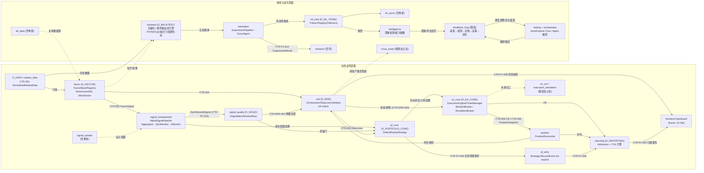

# 04 · 交易与策略域文档（Trading & Strategy Domains）

> 生成方式：静态代码审查（只读），覆盖 `src/zephyr/` 下 24 个交易/策略相关域。
> 数据库（ClickHouse/PostgreSQL）未连接实测——本文全部结论基于源码、文件头治理标记（`[A_module]`/`[BLUEPRINT]`/`[MATURITY]` 等）与模块 docstring，未做运行时验证。
> 行号以审查时点的文件版本为准；`__pycache__` 已排除。

## 目录

- [0. 总览：域清单与成熟度](#0-总览域清单与成熟度)
- [1. trading — AutoRuntime Core（系统大脑）](#1-trading--autoruntime-core系统大脑)
- [2. orchestrator — Agent 编排器](#2-orchestrator--agent-编排器)
- [3. backtest — 回测引擎域](#3-backtest--回测引擎域)
- [4. factor — Alpha 因子层](#4-factor--alpha-因子层)
- [5. signal_ashare — A 股信号域（骨架）](#5-signal_ashare--a-股信号域骨架)
- [6. signal_fundamental — 信号域实现主体](#6-signal_fundamental--信号域实现主体)
- [7. signal_quality — 信号质量域](#7-signal_quality--信号质量域)
- [8. pf_core — 组合构建域](#8-pf_core--组合构建域)
- [9. pf_alloc — 组合配置域](#9-pf_alloc--组合配置域)
- [10. position — 持仓域](#10-position--持仓域)
- [11. ex_core — 执行核心域](#11-ex_core--执行核心域)
- [12. ex_sor — 智能路由域（规划态）](#12-ex_sor--智能路由域规划态)
- [13. execution_simulation — 执行仿真域（规划态）](#13-execution_simulation--执行仿真域规划态)
- [14. risk — 风控域](#14-risk--风控域)
- [15. sell_decision — 卖出决策域（骨架）](#15-sell_decision--卖出决策域骨架)
- [16. simulation — 自动化实验域](#16-simulation--自动化实验域)
- [17. digital_twin — 数字孪生域（规划态）](#17-digital_twin--数字孪生域规划态)
- [18. ml_train — ML 训练域](#18-ml_train--ml-训练域)
- [19. ml_serve — ML 服务域（骨架）](#19-ml_serve--ml-服务域骨架)
- [20. reporting — 盘后分析报告域](#20-reporting--盘后分析报告域)
- [21. intelligence — 模型评估/智能域](#21-intelligence--模型评估智能域)
- [22. alt_data — 另类数据域（骨架）](#22-alt_data--另类数据域骨架)
- [23. cross_asset — 跨资产域（规划态）](#23-cross_asset--跨资产域规划态)
- [24. research — 研究创新核（空壳）](#24-research--研究创新核空壳)
- [25. feedback_loop — 反馈环引擎（跨层）](#25-feedback_loop--反馈环引擎跨层)
- [26. 域间数据流图（mermaid）](#26-域间数据流图mermaid)
- [27. 关键发现与风险提示](#27-关键发现与风险提示)

---

## 0. 总览：域清单与成熟度

| 包 | 域 ID / module_id | 蓝图 | 代码成熟度（实测） | 一句话职责 |
|---|---|---|---|---|
| `trading` | D_INFRA_RUNTIME / MOD-TRADING | `_cross_layer/auto_runtime_core` | prototype，代码量大 | AutoRuntime Core 系统大脑：三层运行时编排、调度、健康监控 |
| `orchestrator` | MOD-ORC-orchestrator | `_cross_layer/agent-orchestrator` | 有实现 | Agent 生命周期管理 + 任务调度 + 幻觉检测 |
| `backtest` | D_BACKTEST / MOD-BT-001 | `_domain_backtest` | 有实现（双引擎） | 回测引擎统一归口（向量化 + 事件驱动） |
| `factor` | D_FACTOR / MOD-L02-001 | `_domain_factor` | 骨架 + 2 个示例因子 | 因子基类/注册表/自动发现 |
| `signal_ashare` | D_ASHARE_SIGNAL / MOD-INF-038 | `_domain_signal` | **空骨架**（仅 `__init__.py`） | A 股信号（design 阶段） |
| `signal_fundamental` | D_FUNDAMENTAL_SIGNAL / MOD-INF-039 | `_domain_signal` | 有实现 | 信号聚合/合成/资本配置/管线（Signal 域实现主体） |
| `signal_quality` | D_SIGQC / MOD-INF-040 | `_domain_signal` | 仅基类 | 信号质量评估/降级监视 |
| `pf_core` | D_PORTFOLIO_CORE / MOD-PRT-pf_core | `_domain_portfolio_core` | 骨架 + 1 个默认策略 | 组合构建（策略基类指向 governance 真源） |
| `pf_alloc` | D_PF_ALLOC / MOD-UNK-pf_alloc | `_cross_layer/shared-core` | 仅 re-export | 组合配置；当前只转发 `StrategyLifecycleEvent` |
| `position` | MOD-POSITION | — | 单文件实现 | 持仓对账（PositionReconciler） |
| `ex_core` | D_EX_CORE / MOD-L06-001 | `_domain_execution_core` | 有实现 | 执行引擎 + 订单管理 + 券商适配器 |
| `ex_sor` | D_EX_SOR / MOD-EX_SOR | — | **规划态占位** | 智能订单路由（未施工） |
| `execution_simulation` | D_EXEC_SIM / MOD-EXEC_SIM | — | **规划态占位** | 执行仿真（未施工） |
| `risk` | D_RISK / MOD-L04-001 | `_domain-risk/risk-management-core` | 有实现 | 实时风控、止损、头寸校验、kill switch |
| `sell_decision` | D_SELL_DECISION / MOD-SELL_DECISION | — | **空骨架** | 卖出决策（design 阶段） |
| `simulation` | D_SIMULATION / MOD-L13-001 | `_domain_simulation` | 基类 + 默认实现 | 自动化实验（Scout/A-B/因子消融） |
| `digital_twin` | D_DIGITAL_TWIN / MOD-DIGITAL_TWIN | — | **规划态占位** | 数字孪生（未施工） |
| `ml_train` | D_ML_TRAIN / MOD-L11-001 | `_domain_machine_learning_train` | 基类 + 默认推理实现 | 模型训练/注册/推理抽象 |
| `ml_serve` | D_ML_SERVE / MOD-ML_SERVE | — | **空骨架** | 模型服务（design 阶段） |
| `reporting` | D_REPORTING / MOD-L07-001 | `_domain_reporting` | 基类 + 2 个默认引擎 | 盘后分析：PnL 归因 + TCA |
| `intelligence` | MOD-INF-036 | `_cross_layer/model-capability-exam` | 有实现 | 模型评估/画像/漂移检测（偏 LLM 能力评测） |
| `alt_data` | D_ALT_DATA / MOD-ALT_DATA | — | **空骨架** | 另类数据（design 阶段） |
| `cross_asset` | D_CROSS_ASSET / MOD-CROSS_ASSET | — | **规划态占位** | 跨资产（未施工） |
| `research` | MOD-L09-001 | `_domain_research` | **仅 3 行 `__init__.py`** | 研究创新核（无任何代码） |
| `feedback_loop` | D_FEEDBACK_LOOP / MOD-FEEDBACK_LOOP | `_cross_layer/feedback_loop` | 实现量大 | 反馈环：采集→检测→诊断→决策→演化闭环 |

> "空骨架"= 目录与 `api/core/models/services/infrastructure/_extensions` 子包齐全但全部只有空 `__init__.py`；"规划态占位"= `__init__.py` 内显式注明"已在 architecture_model/index.yaml 登记但未施工（无蓝图/无代码/无消费者）"（如 `src/zephyr/ex_sor/__init__.py`、`src/zephyr/digital_twin/__init__.py`）。

---

## 1. trading — AutoRuntime Core（系统大脑）

**职责**：系统大脑。三层运行时编排、节律调度、健康监控、审计日志、工作编排、模块自动接入。文件头标记 `module_id=MOD-TRADING | layer=infrastructure`（`src/zephyr/trading/__init__.py:4`）。注意：它名为 "trading" 但实际是**基础设施运行时域**（D_INFRA_RUNTIME），不是交易业务域。

**入口**：
- CLI：`python -m zephyr.trading`（`src/zephyr/trading/__main__.py`，argparse 入口，内部启动 `AutoRuntimeCore`；文件头注明 M02/M10 门禁豁免——常驻服务手动启动后自动运行 reconcile 循环）
- 启动接线：`boot_hooks.register_boot_hooks()`（`src/zephyr/trading/boot_hooks.py`，AGENTS.md 指明为基础设施永久系统启动接线点）

**关键类与函数**：

| 名称 | 一句话 | 位置 |
|---|---|---|
| `AutoRuntimeCore` | 运行时核心主类（含 Ollama 进程管理、本地模型引导、启动子系统注册、任务模型学习等内部组件） | `src/zephyr/trading/auto_runtime_core.py:100`（另 `_OllamaProcessManager` L514、`_LocalModelBootstrap` L585、`_BootSubsystemRegistrar` L683、`_TaskModelLearning` L795） |
| `Conductor` | 指挥器：编排下游任务路径收集与分发 | `src/zephyr/trading/conductor.py:70` |
| `PipelineDispatcherProtocol` / `PipelineStatusReporterProtocol` / `TaskDispatchProtocol` | 管线调度/状态上报/任务分发的端口协议（依赖倒置接口） | `src/zephyr/trading/ports.py:40/51/62` |
| `LifecycleManager` / `BootReport` | 启动生命周期管理 | `src/zephyr/trading/lifecycle_manager.py` |
| `HealthMonitor` | 健康监控 + 自愈（蓝图 §3.1） | `src/zephyr/trading/health_monitor.py` |
| `ActionDispatcher` | "大脑的手" v2.0：推理结果直接写回源文件 | `src/zephyr/trading/action_dispatcher.py` |
| autopilot | 任务认领循环（scan/status_report 只读 + claim_next 原子争抢） | `src/zephyr/trading/autopilot.py` |

其余常驻模块：`admission_controller.py`（准入控制）、`ai_audit_logger.py`、`capability_registry.py`/`capability_sync.py`（能力注册表）、`dream_cycle.py`、`night_shift_queue.py`、`orphan_detector.py`（孤儿模块检测，服务于"孤儿率→0%"目标）、`resource_optimization.py`（ResourceOptimizationEngine）、`ide_health_daemon.py`、`work_orchestrator.py`（`WorkOrchestrator`）等（完整清单见 `src/zephyr/trading/__init__.py` 的 `__all__`）。

**上下游**：上游为 Owner/CLI 与治理体系（gov_enforcement 规则桥）；下游驱动 `orchestrator`（Agent 调度）、`feedback_loop`（健康/演化信号）、`integration.pipeline_orchestrator`（M1-M11 管线）。本身不直接参与"数据→因子→信号"业务链。

---

## 2. orchestrator — Agent 编排器

**职责**：Agent 生命周期管理 + Agent 调度 + 沙箱执行 + 幻觉检测（`src/zephyr/orchestrator/__init__.py` docstring）。任务状态机真源在 `zephyr.gov_enforcement.rule_enforcement.task_types.TaskStatus`（PENDING→READY→IN_PROGRESS→COMPLETED→VERIFIED，分支 BLOCKED/FAILED/RETRY/WAITING/CANCELLED）。P0 降级红线 DEGRADE-003：沙箱创建失败 → 任务 FAIL，拒绝无沙箱运行。

**入口**：`from zephyr.orchestrator import AlertHandler, ContextBridge, ScriptRunner`（包级 re-export，`src/zephyr/orchestrator/__init__.py:4-6`）；核心类在 `agent_orchestrator.py`。

**关键类与函数**：

| 名称 | 一句话 | 位置 |
|---|---|---|
| `AgentOrchestrator` | 编排器主类：指令链执行 + 路由 + 健康监控 | `src/zephyr/orchestrator/agent_orchestrator.py:692` |
| `AgentRouter` | Agent 路由器（角色/策略路由） | `src/zephyr/orchestrator/agent_orchestrator.py:341` |
| `RoutingRole` / `RoutingStrategy` | 路由角色与策略枚举 | 同文件 L124/L139 |
| `AgentProfile` / `RouteDecision` / `OrchestrationResult` / `SLOSnapshot` | Agent 画像、路由决策、编排结果、SLO 快照（pydantic 模型） | 同文件 L230/L247/L275/L299 |
| `ToolInvoker` / `HallucinationCaller` | 工具调用与幻觉检测的协议接口 | 同文件 L319/L327 |
| `HealthMonitor` | Agent 健康监控 | 同文件 L518 |
| `_run_directive_chain` | 指令链执行器 | 同文件 L660 |

子包：`contracts/`（含 `alert_handler`）、`execution/`（`context_bridge`、`script_runner`）、`lifecycle/`、`fault_tolerance/`、`resilience/`、`quality/`、`governance/`、`deferred_queue.py`、`rollback_manager.py`、`task_queue.py`、`hallucination_detector.py`、`file_task_mapper.py`。

**上下游**：上游 `trading`（AutoRuntime Core 调度）与 TaskRepository（任务状态机，`zephyr.governance.task_repo`）；下游依赖 CE（上下文构建）、VMS（任务输出写入）、LSG（工具调用验证）——见 `__init__.py` docstring 依赖声明。属治理/编排面，不在行情业务数据链上。

---

## 3. backtest — 回测引擎域

**职责**：回测引擎统一归口 D_BACKTEST（`module_id=MOD-BT-001`，`src/zephyr/backtest/__init__.py:1-8`），消除 research/intelligence/rollback 多处置放。提供双引擎（向量化/事件驱动）、PIT 数据管理、走前分析、过拟合检测、决策门、结果持久化（供 Panel Dashboard 消费）。

**入口**：
- 包级 API：`from zephyr.backtest import DefaultBacktestEngine, BacktestConfig, BacktestEngineBase, BacktestResult, sink_backtest_result, save_artifact, ...`（`src/zephyr/backtest/__init__.py`）
- 无独立 CLI（`__main__` 检索无命中）；由前端 Dashboard（`src/zephyr/frontend/dashboard/app_panel.py` 回测 Tab）与管线调用。

**关键类与函数**：

| 名称 | 一句话 | 位置 |
|---|---|---|
| `BacktestEngineBase` / `BacktestResult` / `FactorDiscovery` | 引擎抽象基类 / 回测结果 / 因子发现结果 | `src/zephyr/backtest/core/engine_base.py:121/89/110` |
| `DefaultBacktestEngine` / `BacktestConfig` | 向量化回测引擎（默认实现）与配置 | `src/zephyr/backtest/implementations/vectorized_engine.py:84/65` |
| `EventDrivenEngine` | 事件驱动回测引擎 | `src/zephyr/backtest/implementations/event_driven_engine.py:90` |
| `BacktestDataHandler` / `MultiSourceDataHandler` | 回测数据加载（单源/多源） | `src/zephyr/backtest/core/data_handler.py:65/353` |
| `Portfolio` / `Position` / `BacktestFill` | 回测内组合/持仓/成交账本 | `src/zephyr/backtest/core/portfolio.py:106/55/74` |
| `MatchingEngine` | 撮合引擎（目标单构建 `_build_target_orders` L73） | `src/zephyr/backtest/core/matching_engine.py:121` |
| `MatchingLogic` / `OrderBookSnapshot` / `TickSnapshot` / `MatchingFill` | 逐 tick 撮合逻辑与快照模型 | `src/zephyr/backtest/core/matching_logic.py:202/97/120/167` |
| `TickReplayEngine` / `TickReplayConfig` / `TickEvent` / `ReplayStatistics` | tick 级回放引擎 | `src/zephyr/backtest/core/tick_replay.py:123/66/88/105` |
| `PITManager` / `PITConfig` | Point-in-Time 数据管理（防前视偏差） | `src/zephyr/backtest/core/pit_manager.py:92/71` |
| `WalkForwardAnalyzer` / `WalkForwardConfig` | 走前（walk-forward）分析 | `src/zephyr/backtest/core/walk_forward.py:87/55` |
| `OverfittingDetector` / `OverfittingConfig` / `OverfittingGateError` | 过拟合检测与门闸 | `src/zephyr/backtest/core/overfitting_detector.py:121/92/73` |
| `DecisionGate` 及 `ISStageResult`/`WFAStageResult`/`OOSStageResult`/`DecisionGateResult` | IS→WFA→OOS 三阶段决策门 | `src/zephyr/backtest/core/decision_gate.py:164`（结果类 L85/104/123/144） |
| `calculate_metrics` / `calculate_ic_ir` / `calculate_dsr` / `calculate_full_metrics` | 绩效指标（含 IC/IR、DSR deflate Sharpe） | `src/zephyr/backtest/core/metrics.py:72/175/239/333` |
| `sink_backtest_result` 及 `BacktestSinkData`/`EquityPoint`/`TradeRecord`/`DrawdownPoint`/`BenchmarkPoint` | 回测结果落盘（v1.3.0 io 子包，#ARCH-047 配合 Panel 重构） | `src/zephyr/backtest/io/backtest_result_sink.py:144`（模型 L57-92） |
| `save_artifact` / `get_artifact` / `list_artifacts` / `delete_artifact` / `build_artifact_from_data` / `BacktestRunArtifact` | 回测产物仓库（JSON 文件存储） | `src/zephyr/backtest/io/result_repository.py:113/153/189/230/256/68` |

**上下游**：上游消费 D_DATA 规范化行情（CTR-001 语义，经 `DataHandler`）与 `factor`/`signal_*` 产出的信号权重；下游产出 `BacktestRunArtifact` → 前端 Dashboard 回测 Tab 展示，并供 `simulation`（实验）与 `reporting`（归因口径）复用。

---

## 4. factor — Alpha 因子层

**职责**：因子基类/元类/注册表/自动发现（Phase B 骨架，`src/zephyr/factor/__init__.py` docstring）。CTR 承重墙：消费 CTR-001 NormalizedMarketData（←D_DATA），生产 CTR-002 FactorSignal（→D_SIGNAL/D_RISK/D_PORTFOLIO_CORE）、CTR-BP-001~003 背压信号（→D_DATA）、CTR-ERR-002 FactorComputationError。

**入口**：`from zephyr.factor import FactorBase, FactorRegistry, autodiscover_factors`；另有 `alpha_signal_pipeline`（实为 signal 域管线的 re-export shim）。

**关键类与函数**：

| 名称 | 一句话 | 位置 |
|---|---|---|
| `FactorBase` / `FactorMeta` | 因子抽象基类与元数据 | `src/zephyr/factor/factor_base.py:80/50` |
| `FactorRegistry` / `autodiscover_factors` | 因子注册表与包扫描自动发现 | `src/zephyr/factor/factor_base.py:130/200` |
| `Momentum20d` | 20 日动量因子（示例实现） | `src/zephyr/factor/momentum_factor.py:42` |
| `ValueFactor` | 价值因子（示例实现） | `src/zephyr/factor/value_factor.py:42` |
| `evaluate_bus_factor` / `ModuleOwnership` / `DecisionLog` / `OpsRunbook` | 巴士因子（人员单点）防御：模块归属评估、决策日志、运维手册生成 | `src/zephyr/factor/bus_factor_defense.py:70/32/53/62` |

注意：`src/zephyr/factor/alpha_signal_pipeline.py` 只是 re-export——真源为 `zephyr.signal_fundamental.pipeline`（文件头注明 "Re-export from signal domain SSoT"）。

**上下游**：上游 D_DATA（规范化行情）；下游 D_SIGNAL（信号聚合）、D_RISK、D_PORTFOLIO_CORE；并向 D_DATA 回传背压信号。

---

## 5. signal_ashare — A 股信号域（骨架）

**职责**：A 股专用信号（D_ASHARE_SIGNAL，`module_id=MOD-INF-038`，`[MATURITY] design`，`src/zephyr/signal_ashare/__init__.py:1-16`）。

**实测状态**：**空骨架**——`api/`、`core/`、`models/`、`services/`、`infrastructure/`、`_extensions/` 子包齐全但全部只有空 `__init__.py`，包级 `__all__ = []`。无任何类/函数可实现引用。

**上下游（设计意图）**：应与 `signal_fundamental` 并列作为 A 股信号来源，下游汇入信号聚合；当前无代码，无从验证。

---

## 6. signal_fundamental — 信号域实现主体

**职责**：Signal 域统一包：信号生成、策略、合成、组合、资本配置与管线（`src/zephyr/signal_fundamental/__init__.py` docstring）。`DegradationMonitorBase` 真源已于 2026-07-06 迁移至 D_SIGQC（`signal_quality`），本包仅 lazy 转发。

**入口**：包级 lazy import——`AlphaSignalPipeline`、`SignalAggregatorBase`、`SignalSynthesizerBase`、`DefaultSignalAggregator`、`DefaultCapitalAllocator`、`CapitalAllocationResult`、`SynthesizedSignal` 等（`src/zephyr/signal_fundamental/__init__.py` 的 `__getattr__` 映射表）。

**关键类与函数**：

| 名称 | 一句话 | 位置 |
|---|---|---|
| `AlphaSignalPipeline` / `PipelineResult` / `PipelineStage` | Alpha 信号管线主类（阶段枚举 + 结果模型） | `src/zephyr/signal_fundamental/pipeline.py:99/84/75` |
| `SignalAggregatorBase` | 信号聚合器抽象基类 | `src/zephyr/signal_fundamental/gen/aggregator_base.py:56` |
| `CapitalAllocatorBase` | 资本配置器抽象基类 | `src/zephyr/signal_fundamental/gen/aggregator_base.py:81` |
| `DefaultSignalAggregator` | 默认信号聚合器实现 | `src/zephyr/signal_fundamental/gen/implementations/default_signal_aggregator.py:52` |
| `SignalSynthesizerBase` | 信号合成器抽象基类 | `src/zephyr/signal_fundamental/synth/signal_synthesizer.py:55` |
| `DefaultCapitalAllocator` / `AllocationMethod` | 默认多策略资本配置器与配置方法枚举 | `src/zephyr/signal_fundamental/strategy/implementations/default_capital_allocator.py`（经 `__init__.py` lazy 映射） |
| `CapitalAllocationResult` | 资本配置结果模型 | `src/zephyr/signal_fundamental/capital/capital_allocation_result.py` |
| `SynthesizedSignal` | 合成信号模型 | `src/zephyr/signal_fundamental/combiner/`（经 lazy 映射） |

**上下游**：上游 `factor`（CTR-002 FactorSignal）；下游向 `pf_core`/`risk` 输出 `SynthesizedSignal`（CTR-P1-015）与资本配置结果；其管线被 `factor.alpha_signal_pipeline` re-export 供因子域引用。

---

## 7. signal_quality — 信号质量域

**职责**：信号质量评估/过滤/降级/冲突检测（D_SIGQC，`src/zephyr/signal_quality/__init__.py` docstring）。

**入口**：`from zephyr.signal_quality import DegradationMonitorBase`。

**关键类与函数**：

| 名称 | 一句话 | 位置 |
|---|---|---|
| `DegradationMonitorBase` | 信号质量降级监视器抽象基类（OCP D_SIGQC-DEG） | `src/zephyr/signal_quality/degradation_monitor_base.py:48` |

**实测状态**：仅此一个基类文件有实现；`api/core/models/services/infrastructure` 均为空 `__init__.py`。**尚无默认实现类**。

**上下游**：上游消费信号域产出（CTR-ERR-003 SignalDegradationWarning 语义）；下游向 `risk`、`pf_core` 发布降级告警。`signal_fundamental` 对 `DegradationMonitorBase` 的引用经 lazy 转发回本域。

---

## 8. pf_core — 组合构建域

**职责**：组合构建（D_PORTFOLIO_CORE，`module_id=MOD-PRT-pf_core`，`src/zephyr/pf_core/__init__.py:1`）。ARCH-GOV-SHIM-001 治理后，策略基类/合规规则/风险限额等真源已外迁，本包通过 lazy import 指向 canonical 路径。

**入口**：`from zephyr.pf_core import DefaultEquityStrategy, StrategyBase, StrategyRegistry, RiskLimits, ComplianceRule, ...`（lazy）。

**关键类与函数**：

| 名称 | 一句话 | 位置 |
|---|---|---|
| `DefaultEquityStrategy` / `RebalanceMode` | 默认股票策略与再平衡模式枚举 | `src/zephyr/pf_core/default_equity_strategy.py:65/57` |
| `StrategyBase` / `StrategyMeta` / `StrategyRegistry` / `autodiscover_strategies` | 策略基类/元类/注册表/自动发现——**真源在治理域** `zephyr.governance.strategies.strategy_base`（pf_core shim 已删除） | `src/zephyr/pf_core/__init__.py` 的 `_LAZY_IMPORTS` 映射 |
| `ComplianceRule` | 合规规则——真源 `zephyr.shared.contracts.compliance_rule` | 同上 |
| `RiskLimits` | 风险限额——真源 `zephyr.trading.trading_contracts.risk.risk_limits` | 同上 |
| `PerformanceAttributionReport` | 绩效归因报告——真源 `zephyr.shared.contracts.performance_attribution_report` | 同上 |

**实测状态**：`pf_core/strategies/` 与 `pf_core/strategy_engine/` 仅有空 `__init__.py`；实质策略代码仅 `default_equity_strategy.py`。

**上下游**：上游 `signal_fundamental`（SynthesizedSignal）、`risk`（CTR-003 RiskLimits、CTR-ERR-004 违约错误）；下游向 `ex_core` 下达目标持仓/订单意图，向 `reporting`/`pf_alloc` 发布 `StrategyLifecycleEvent`（CTR-P1-006）。

---

## 9. pf_alloc — 组合配置域

**职责**：组合配置（D_PF_ALLOC）。当前实质内容只有一个 re-export 文件。

**关键类与函数**：

| 名称 | 一句话 | 位置 |
|---|---|---|
| `StrategyLifecycleEvent`（re-export） | 策略生命周期事件——真源 `zephyr.shared.contracts.strategy_lifecycle_event`，标记 `[MATURITY] prototype / [STABILITY] stable / human_gated` | `src/zephyr/pf_alloc/strategy_lifecycle_event.py:19` |

**实测状态**：`api/core/models/services/infrastructure` 全空；包级 `__all__ = ["strategy_lifecycle_event"]`（`src/zephyr/pf_alloc/__init__.py`）。资本配置的实现实际在 `signal_fundamental.capital` / `signal_fundamental.strategy`——**域边界与实现位置存在错位**，是潜在治理议题。

**上下游**：上游 `pf_core`（策略生命周期）；下游 `reporting`（CTR-P1-006 事件消费）。

---

## 10. position — 持仓域

**职责**：持仓管理与对账（`module_id=MOD-POSITION | layer=infrastructure`，`src/zephyr/position/__init__.py:1`）。

**关键类与函数**：

| 名称 | 一句话 | 位置 |
|---|---|---|
| `PositionReconciler` | 持仓对账器（账面持仓 vs 实际持仓核对） | `src/zephyr/position/position_reconciler.py:40` |

**实测状态**：单文件实现，其余子包为空。

**上下游**：上游 `ex_core`（CTR-006 PositionSnapshot / Fill）；下游向 `risk`（头寸校验）、`reporting`（持仓风险评估）供数。

---

## 11. ex_core — 执行核心域

**职责**：交易执行（D_EX_CORE，`module_id=MOD-L06-001`，`src/zephyr/ex_core/__init__.py:1`）。docstring 注明 "All modules have been migrated to zephyr.execution_core.core. This package re-exports for backward compatibility (DM-298)"，但实际 `execution_engine.py`/`order_manager.py` 仍在包内持有实现；`BrokerInterface` 等契约真源在 `zephyr.trading.trading_contracts`。

**入口**：`from zephyr.ex_core import ExecutionEngine, OrderManager, ExecutionConfig, AlgoType, BrokerInterface`（lazy）。

**关键类与函数**：

| 名称 | 一句话 | 位置 |
|---|---|---|
| `ExecutionEngine` / `ExecutionConfig` / `ExecutionEngineRunRecord` / `AlgoType` | 执行引擎主类、执行配置、运行记录、算法类型枚举（TWAP/VWAP 等） | `src/zephyr/ex_core/execution_engine.py:110/73/86/61` |
| `OrderManager` / `OrderAction` | 订单管理器与订单动作枚举 | `src/zephyr/ex_core/order_manager.py:66/56` |
| `BrokerInterface` / `FillCallback` | 券商接口契约——真源 `zephyr.trading.trading_contracts.broker_interface` | `src/zephyr/ex_core/__init__.py` lazy 映射 |
| `MiniQmtBroker` / `MiniQmtBrokerError` | MiniQMT（迅投 QMT）实盘券商适配器 | `src/zephyr/ex_core/adapters/miniqmt_broker.py:121/111` |
| simulation_broker | 仿真券商适配器——re-export，真源 `zephyr.governance.adapters.simulation_broker` | `src/zephyr/ex_core/adapters/simulation_broker.py`（18 行 shim） |
| risk_validation_bridge | 风控校验桥——re-export，真源 `zephyr.governance.adapters.risk_validation_bridge` | `src/zephyr/ex_core/adapters/risk_validation_bridge.py`（18 行 shim） |

**上下游**：上游 `pf_core`（目标持仓/订单意图）、`risk`（前置风控校验，经 risk_validation_bridge）；下游券商/仿真撮合，产出 CTR-005 Fill 与 CTR-006 PositionSnapshot → `position`、`reporting`、`risk`。

---

## 12. ex_sor — 智能路由域（规划态）

**职责（设计意图）**：智能订单路由（Smart Order Routing，D_EX_SOR）。

**实测状态**：**规划态占位**——`src/zephyr/ex_sor/__init__.py` 明确注明"已在 architecture_model/index.yaml 登记为 D_EX_SOR (L2_domain)，但尚未施工（无蓝图/无代码/无消费者）。AI 如需实现执行路由功能，MUST 先创建 blueprint.md 再施工"。全部子包为空。

---

## 13. execution_simulation — 执行仿真域（规划态）

**职责（设计意图）**：执行层面仿真（撮合/滑点/冲击成本，D_EXEC_SIM）。

**实测状态**：**规划态占位**（同 ex_sor 的占位注释，`src/zephyr/execution_simulation/__init__.py`）。注意与 `backtest.core.matching_*`（回测内撮合）和 `ex_core.adapters.simulation_broker`（仿真券商）区分——后两者已有实现，本域是它们未来的归口候选。

---

## 14. risk — 风控域

**职责**：实时风控与止损执行：止损计算、头寸校验、风险敞口监控；D_PORTFOLIO_CORE 的约束提供者（`src/zephyr/risk/__init__.py` docstring）。CTR：消费 CTR-002 FactorSignal、CTR-006 PositionSnapshot、CTR-P1-015 SynthesizedSignal 等；生产 CTR-003 RiskLimits（→D_PORTFOLIO_CORE）、CTR-ERR-004 RiskLimitViolationError、CTR-P1-008 RiskDashboardSnapshot（→D_FRONTEND）。

**入口**：`from zephyr.risk import ...`（lazy import 机制，`__init__.py` 尾部）；实现类在 `implementations/`。

**关键类与函数**：

| 名称 | 一句话 | 位置 |
|---|---|---|
| `RiskManagerBase` | 风控管理器抽象基类 | `src/zephyr/risk/risk_manager.py:51` |
| `RiskManagerOrchestratorBase` / `RiskCheckResult` / `RiskReport` | 风控编排器基类与检查/报告模型 | `src/zephyr/risk/risk_manager_base.py:83/54/68` |
| `StopLossEngineBase` / `PositionLimitCheckerBase` | 止损引擎/头寸限额检查器基类 | `src/zephyr/risk/risk_manager_base.py:118/141` |
| `RiskLimitsCalculator` | 风险限额计算器抽象 | `src/zephyr/risk/risk_limits.py:55` |
| `RiskValidator` / `ViolationDetail` / `ViolatedConstraint` | 风险校验器抽象与违约明细模型 | `src/zephyr/risk/risk_validator.py:73/63/53` |
| `evaluate_stop_loss` / `trigger_kill_switch` / `reset_kill_switch` / `StopLossResult` | 止损判定与 kill switch 触发/复位（兼容层，委托 default_stop_loss_engine） | `src/zephyr/risk/stop_loss.py:56/76/104/45` |
| `DefaultRiskManagerOrchestrator` | 默认风控编排器 | `src/zephyr/risk/implementations/default_risk_manager_orchestrator.py:76` |
| `DefaultStopLossEngine` / `StopLossRules` | 默认止损引擎与规则集 | `src/zephyr/risk/implementations/default_stop_loss_engine.py:66/50` |
| `DefaultRiskValidator` | 默认风险校验器 | `src/zephyr/risk/implementations/default_risk_validator.py:53` |
| `DefaultRiskLimitsCalculator` | 默认限额计算器 | `src/zephyr/risk/implementations/default_risk_limits_calculator.py:54` |
| `DefaultPositionLimitChecker` | 默认头寸限额检查器 | `src/zephyr/risk/implementations/default_position_limit_checker.py:50` |

另：`src/zephyr/risk/cross_asset/cross_market_data_adapter/ml_experiment_pipeline.py` 是 re-export shim（真源 `zephyr.shared._cross_layer.ml_experiment_pipeline`）——跨资产 ML 实验管线目前**寄放在 risk 域下**，域归属存疑（见 §27）。

**上下游**：上游 `factor`/`signal_*`（信号）、`ex_core`（持仓快照）；下游约束 `pf_core`（限额）、拦截 `ex_core`（违约拒绝，经 risk_validation_bridge）、向 Dashboard 发 CTR-P1-008。Kill switch 真源在 `zephyr.security.access_control.kill_switch`（SSoT 单例）。

---

## 15. sell_decision — 卖出决策域（骨架）

**职责（设计意图）**：卖出决策（D_SELL_DECISION，`module_id=MOD-SELL_DECISION`，`[MATURITY] design`）。

**实测状态**：**空骨架**——五个子包全为空 `__init__.py`，包级 `__all__ = []`。卖出逻辑当前实际由 `risk.stop_loss`（止损）与 `pf_core` 策略再平衡覆盖。

---

## 16. simulation — 自动化实验域

**职责**：AI 时代的"自动化实验"层：Scout Agent 抓取外部资讯 + 内部 repo diff，设计并执行对照实验（A/B 测试、因子消融、策略变种），结论沉淀 KMS（`src/zephyr/simulation/__init__.py` docstring）。生产 CTR-P1-014 ExperimentResult（→D_RESEARCH/D_ML_TRAIN）；消费 CTR-001、CTR-P1-004/005（模型推断）、CTR-P1-013（遥测）。

**关键类与函数**：

| 名称 | 一句话 | 位置 |
|---|---|---|
| `ExperimentPipelineBase` / `ExperimentConfig` / `ExperimentMetric` | 实验管线抽象基类与配置/指标模型 | `src/zephyr/simulation/pipeline_base.py:81/54/68` |
| `ScoutAgentBase` | Scout Agent 抽象基类 | `src/zephyr/simulation/pipeline_base.py:104` |
| `DefaultExperimentPipeline` | 默认实验管线实现 | `src/zephyr/simulation/implementations/default_experiment_pipeline.py:45` |

**上下游**：上游 `backtest`（实验执行载体）、D_DATA、`ml_train`（模型推断）；下游 `research`（结论沉淀）、`ml_train`（实验驱动的再训练）。

---

## 17. digital_twin — 数字孪生域（规划态）

**职责（设计意图）**：系统/组合数字孪生（D_DIGITAL_TWIN）。

**实测状态**：**规划态占位**（`src/zephyr/digital_twin/__init__.py` 注明"未施工（无蓝图/无代码/无消费者）"）。

---

## 18. ml_train — ML 训练域

**职责**：ML 生命周期：训练/推理/模型注册（D_ML_TRAIN，`module_id=MOD-L11-001`，`src/zephyr/ml_train/__init__.py` docstring）。

**入口**：`from zephyr.ml_train import ModelTrainerBase, ModelRegistry, InferenceEngineBase, DefaultInferenceEngine`（lazy）。

**关键类与函数**：

| 名称 | 一句话 | 位置 |
|---|---|---|
| `ModelTrainerBase` / `ModelRegistry` / `ModelMetadata` | 训练器抽象、模型注册表、模型元数据 | `src/zephyr/ml_train/trainer_base.py:47/74/33` |
| `InferenceEngineBase` | 推理引擎抽象基类 | `src/zephyr/ml_train/inference_base.py:33` |
| `DefaultInferenceEngine` | 默认推理引擎实现 | `src/zephyr/ml_train/implementations/default_inference_engine.py:52` |

**实测状态**：**无默认训练器实现**（仅推理有 Default 实现）；`api/core/models/services` 为空。

**上下游**：上游 `factor`（特征）、`simulation`（实验结论）；下游 `ml_serve`（模型上线，目前空）、`intelligence`（评估/漂移检测）、`simulation`（CTR-P1-004/005 推断调用）。

---

## 19. ml_serve — ML 服务域（骨架）

**职责（设计意图）**：模型在线服务（D_ML_SERVE，`module_id=MOD-ML_SERVE`，`[MATURITY] design`）。

**实测状态**：**空骨架**（五个子包空 `__init__.py`，包级 `__all__ = []`）。模型服务能力目前由 `ml_train.DefaultInferenceEngine` 与 `intelligence.model_evaluation` 兜底。

---

## 20. reporting — 盘后分析报告域

**职责**：盘后分析报告：PnL 归因、交易成本分析（TCA）、执行质量评估、持仓风险评估（D_REPORTING，`src/zephyr/reporting/__init__.py` docstring，注明"[N/A — 骨架占位，尚未实现]"——但代码层面已有基类与默认引擎）。消费 CTR-005 Fill、CTR-006 PositionSnapshot、CTR-P1-006/007/011 等；生产 CTR-P1-009 PerformanceAttributionReport（→D_FRONTEND/D_GOV_ENFORCEMENT）。

**关键类与函数**：

| 名称 | 一句话 | 位置 |
|---|---|---|
| `AttributionEngineBase` | 绩效归因引擎抽象基类 | `src/zephyr/reporting/analytics_base.py:78` |
| `TCAEngineBase` | 交易成本分析引擎抽象基类 | `src/zephyr/reporting/analytics_base.py:54` |
| `DefaultAttributionEngine` | 默认归因引擎 | `src/zephyr/reporting/default_attribution_engine.py:48` |
| `DefaultTCAEngine` | 默认 TCA 引擎 | `src/zephyr/reporting/default_tca_engine.py:52` |
| `PerformanceAttributionReport`（re-export） | 归因报告契约——真源 `zephyr.shared.contracts.performance_attribution_report` | `src/zephyr/reporting/__init__.py` |

**上下游**：上游 `ex_core`（Fill/PositionSnapshot）、`pf_core`（策略生命周期事件）、`risk`（RiskMetricsReport）；下游前端 Dashboard 与治理域（归因报告作为治理证据）。

---

## 21. intelligence — 模型评估/智能域

**职责**：模型评估、推理、知识库统一域（`module_id=MOD-INF-036`，蓝图 `_cross_layer/model-capability-exam`，`src/zephyr/intelligence/__init__.py:1`）。实测内容偏 **LLM 能力评测/画像**（模型 Profiling、考试编排、Reranker），兼具模型漂移检测。

**关键类与函数**：

| 名称 | 一句话 | 位置 |
|---|---|---|
| `ModelDriftDetector` / `DriftResult` | 模型漂移检测器与结果模型 | `src/zephyr/intelligence/model_drift_detector.py:50/41` |
| model_profiling 子包 | 能力画像：`cli.py`、`benchmark_suite.py`、`capability_passport.py`、`case_assembler.py`、`exam_executor.py`、`exam_judge.py`、`exam_orchestrator.py`、`deepseek_v4_chat.py` | `src/zephyr/intelligence/model_profiling/` |
| model_evaluation 子包 | 评估与推理：`inference_base.py`、`implementations/default_inference_engine.py`、`reranker.py`、`sync_engine.py`、`unified_memory_api.py`、`activate.py` | `src/zephyr/intelligence/model_evaluation/` |

**入口**：`intelligence/model_profiling/cli.py`（能力画像 CLI）；包级导出 `model_drift_detector`。

**上下游**：上游 `ml_train`（被评模型）、知识库（VMS）；下游 `feedback_loop`（漂移/评估信号进入演化闭环）、`trading`（能力注册）。

---

## 22. alt_data — 另类数据域（骨架）

**职责（设计意图）**：另类数据接入与因子化（D_ALT_DATA，`module_id=MOD-ALT_DATA`，`[MATURITY] design`）。

**实测状态**：**空骨架**（子包全空，包级 `__all__ = []`）。数据供给目前全部由 `data`/`market_data`/`data_eng` 域承担。

---

## 23. cross_asset — 跨资产域（规划态）

**职责（设计意图）**：跨资产（股票/债券/商品/加密）统一建模与配置（D_CROSS_ASSET）。

**实测状态**：**规划态占位**（`src/zephyr/cross_asset/__init__.py` 注明未施工）。相关雏形代码寄放两处：`risk/cross_asset/cross_market_data_adapter/`（re-export shim）与 `risk/cross_asset/` 子包。

---

## 24. research — 研究创新核（空壳）

**职责（设计意图）**：Research Innovation Core（`MOD-L09-001`）。

**实测状态**：全包**仅一个 3 行 `__init__.py`**（`src/zephyr/research/__init__.py`，docstring + 空 `__all__`），无任何子目录与代码。是 24 个域中最空的域。实验结论沉淀（CTR-P1-014 → D_RESEARCH）目前无接收方实现。

---

## 25. feedback_loop — 反馈环引擎（跨层）

**职责**：反馈环引擎（MOD-FEEDBACK_LOOP，layer=cross_layer，由 ARCH-032 从 `src/zephyr/ops/` 迁入，`src/zephyr/feedback_loop/__init__.py`）。覆盖"采集 → 检测 → 诊断 → 决策 → 演化"自闭环：指标/反馈采集、异常检测、适应度函数、演化提案生成与灰度激活、SLO/错误预算管理、调度。

**入口**：`from zephyr.feedback_loop import FeedbackLoop, EvolutionProposal`（`src/zephyr/feedback_loop/__init__.py` re-export）。

**关键类与函数**：

| 名称 | 一句话 | 位置 |
|---|---|---|
| `FeedbackLoop` / `EvolutionProposal`（core） | 反馈环主类与演化提案模型 | `src/zephyr/feedback_loop/core.py:53/43` |
| `EvolutionEngine` / `EvolutionReport` / `Severity` / `FeedbackLayer` / `EvolutionSignal` / `evolve()` | 演化引擎：分层（L0-L3）信号评估与演化报告 | `src/zephyr/feedback_loop/evolution_engine.py:116/107/34/45/55/449` |
| `DecisionEngine` / `AnomalyReport` / `ScheduleAdjustment` / `reflect_on_blueprint()` | 决策引擎：异常定级与调度调整 | `src/zephyr/feedback_loop/decision_engine.py:99/64/75/163` |
| `FeedbackLoopScheduler` / `PeriodicGovernanceInspector` / `ExternalPersistenceWriter` / `FLEPipelineEvent` | 反馈环调度器（含定期治理巡检与外部持久化） | `src/zephyr/feedback_loop/scheduler.py:317/105/177/78` |
| `FeedbackCollector` / `FeedbackEntry` / `FeedbackSummary` / `FeedbackChannel` | 反馈采集与 Owner 确认通道 | `src/zephyr/feedback_loop/feedback_collector.py:88/56/78/205` |
| `MetricsCollector` / `MetricSnapshot` / `EMABaseline` | 指标采集与 EMA 基线 | `src/zephyr/feedback_loop/metrics_collector.py:47/254/262` |
| `FitnessFunctionFramework` 及 `fitness_*` 函数族 | 适应度函数框架（异常检测精度/误报率/MTTI/Owner 覆写率） | `src/zephyr/feedback_loop/fitness_functions.py:92/355/363/371/385` |

子包：`actors/`（13 个行动者：action_selector、agent_lifecycle、alert_router、global_action_scheduler、saga_compensator 等）、`collectors/`（calendar/config_timeline/data_quality/knowledge_* 等）、`detectors/`（anomaly/correlation/drift/guard/reliability）、`diagnosers/`（cognitive/diagnosis/health/reliability）、`evolution/`（18 个演化组件：conformal_prediction、dynamic_threshold、knowledge_distillation、prompt_self_optimization_loop、self_upgrade_canary 等）、`gates/`、`resilience/`、`security/`、`forensic/`。

**上下游**：上游全域（各域经 EventBus/遥测上报运行信号）；下游 `trading`（调度调整）、治理域（演化提案审批）、`intelligence`（漂移结论）。是"系统自我演化"的发动机。

---

## 26. 域间数据流图（mermaid）

链路：数据域 → 因子 → 信号 → 组合 → 执行 → 风控 → 报告（+ 离线回测/实验/ML/反馈环旁路）。契约编号（CTR-xxx）引自各域 `__init__.py` docstring 的 CTR 承重墙声明。

---

## 27. 关键发现与风险提示

1. **"trading" 名实不符**：`zephyr.trading` 是 AutoRuntime Core 基础设施域（D_INFRA_RUNTIME），并非交易业务域；真正的交易业务链是 `factor → signal_* → pf_core → ex_core → risk → reporting`。同时 `trading/trading_contracts/` 又承载着 `BrokerInterface`、`RiskLimits` 等业务契约真源（被 `ex_core`/`pf_core` lazy 引用），命名与归属容易误导。
2. **24 域中 8 个为空壳/规划态**：signal_ashare、sell_decision、ml_serve、alt_data（空骨架）；ex_sor、execution_simulation、digital_twin、cross_asset（显式规划态占位）；research 仅 3 行 `__init__.py`。业务链路的最小闭环实际为：factor（2 个示例因子）→ signal_fundamental → pf_core（1 个默认策略）→ ex_core → risk → reporting。
3. **域边界与实现错位**：资本配置实现位于 `signal_fundamental.capital/strategy` 而非 `pf_alloc`；跨资产 ML 实验管线寄放在 `risk/cross_asset/`（且只是 re-export shim）；`pf_core` 的 `StrategyBase`/`RiskLimits`/`ComplianceRule` 真源分别外迁至 `governance.strategies`、`trading.trading_contracts`、`shared.contracts`（ARCH-GOV-SHIM-001 治理结果，lazy 转发层较多，排障时需注意真源位置）。
4. **回测域是资产最完整的业务域**：双引擎 + PIT + walk-forward + 过拟合检测 + 三阶段决策门 + 结果持久化（io 子包直接服务 Panel Dashboard，#ARCH-047），与"当前数据库仅用于回测"的阶段定位吻合。
5. **实盘链路已有预留但未经实测验证**：`MiniQmtBroker`（QMT 券商适配器）已存在，配合 simulation_broker / risk_validation_bridge（均为 governance.adapters 真源的 shim）构成"仿真↔实盘"双适配器结构；本次审查未连接数据库/券商做任何运行时验证。
