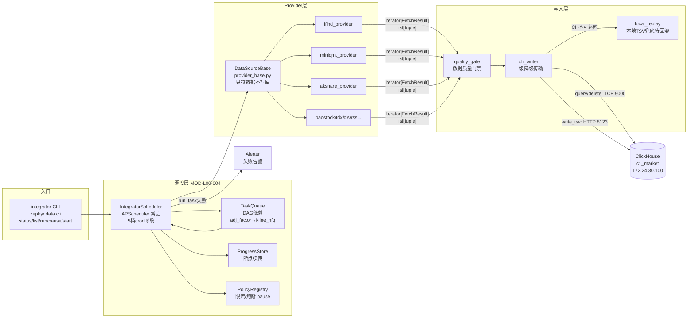
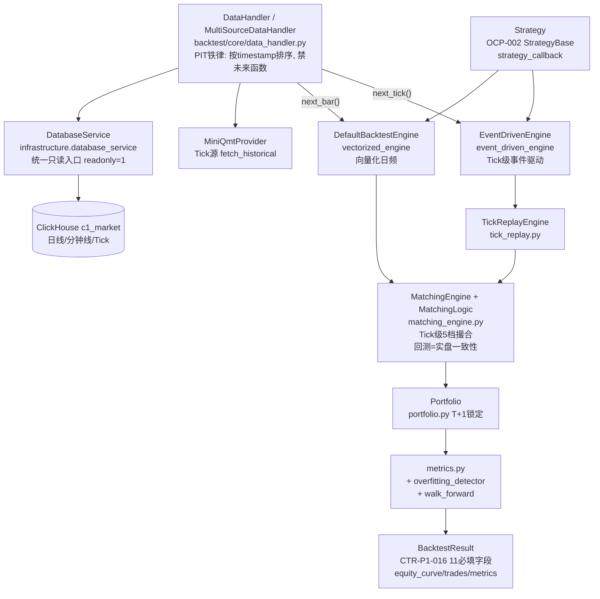
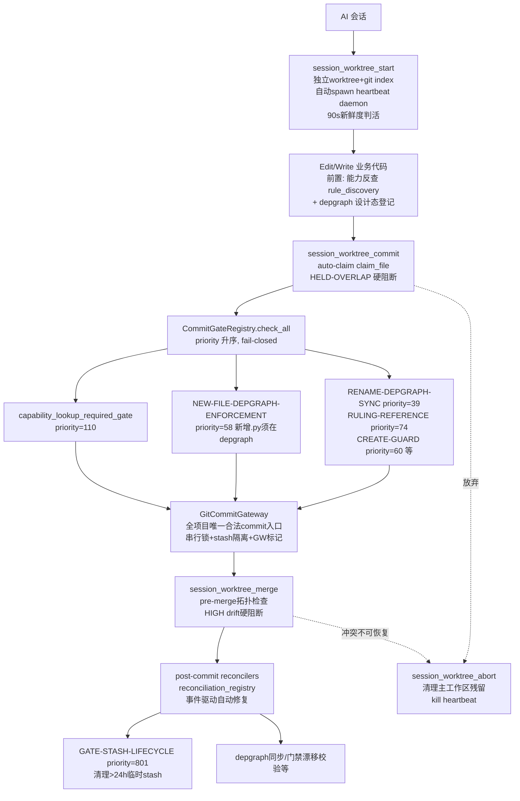

# 06 · 依赖关系图谱（Dependencies）

> 适用范围：ZephyrAlpha 2.0（个人单用户量化系统，当前数据库仅用于回测）。
> 本文基于 2026-07 工作区快照静态审查 + depgraph DB 实测生成；所有论断附证据路径。
> 审查方式：只读。`extract_depgraph.py --summary` **实测成功**（PostgreSQL depgraph 库可达）。

## 目录

- [1. 外部依赖（第三方库）](#1-外部依赖第三方库)
  - [1.1 依赖真源与镜像关系](#11-依赖真源与镜像关系)
  - [1.2 核心运行时](#12-核心运行时)
  - [1.3 数据层](#13-数据层)
  - [1.4 前端 / 可视化](#14-前端--可视化)
  - [1.5 AI / ML](#15-ai--ml)
  - [1.6 治理 / 开发工具链](#16-治理--开发工具链)
  - [1.7 幽灵依赖观察](#17-幽灵依赖观察)
- [2. 内部跨模块依赖](#2-内部跨模块依赖)
  - [2.1 跨模块依赖登记表（PS-REG-007）](#21-跨模块依赖登记表ps-reg-007)
  - [2.2 接口契约注册表（REG-INTF-001）](#22-接口契约注册表reg-intf-001)
  - [2.3 跨层契约（cross_layer_contracts.yaml）](#23-跨层契约cross_layer_contractsyaml)
- [3. depgraph 概览（实测）](#3-depgraph-概览实测)
- [4. 关键链路图（Mermaid）](#4-关键链路图mermaid)
  - [4.1 数据下载 → 入库链路](#41-数据下载--入库链路)
  - [4.2 回测调用链](#42-回测调用链)
  - [4.3 Commit 治理链](#43-commit-治理链)
- [5. 风险与观察](#5-风险与观察)

---

## 1. 外部依赖（第三方库）

### 1.1 依赖真源与镜像关系

- **SSoT 是 `pyproject.toml`**（`[project.dependencies]`，pyproject.toml L31-58）；`requirements.txt` 是其**镜像**（requirements.txt L1-2 注释："This file is a mirror of pyproject.toml; update pyproject.toml first, then sync here"）。
- `requirements-dev.txt` = `-r requirements.txt` + dev 工具（requirements-dev.txt L1-8）；`requirements-demo.txt` = `-r requirements.txt` + `akshare>=1.12.0`（requirements-demo.txt L1-3），与 `pyproject.toml [project.optional-dependencies] dev/demo`（pyproject.toml L67-78）对齐。
- **Python 版本契约**：`requires-python = ">=3.12"`（pyproject.toml L14），ruff `target-version = "py312"`（L121），mypy `python_version = "3.12"`（L214）。代码使用 `datetime.UTC` 等 3.11+ 特性，低版本解释器会直接崩溃（见 AGENTS.md RULE-ENV）。
- **版本约束风格**：全部运行时依赖都带主版本上界（如 `pandas>=2.0.0,<3.0.0`），防 breaking change（requirements.txt L3 注释）。
- **CLI 入口点**（pyproject.toml L63-65）：`zephyr = zephyr.trading.__main__:main`、`integrator = zephyr.data.cli:main`。

### 1.2 核心运行时

| 库 | 版本约束 | 用途（证据） |
|---|---|---|
| pydantic | `>=2.0.0,<3.0.0` | 数据模型/配置校验基座（pyproject.toml L32） |
| pyyaml | `>=6.0,<7.0` | 规则/registry YAML 解析（L33） |
| psutil | `>=5.9.0,<7.0` | 资源监控（ResourceOptimizationEngine）（L35） |
| structlog | `>=24.1.0,<25.0.0` | 结构化日志（L40） |
| python-dotenv | `>=1.0.0,<2.0.0` | `.env` 加载；曾是被 `__init__.py` 引用却未声明的"幽灵依赖"，5.30.4 修复补登记（L51-52） |
| apscheduler | `>=3.10.0,<4.0.0` | 数据源集成器调度器（MOD-L00-004）（L53-54） |
| sqlalchemy | `>=2.0.0,<3.0.0` | APScheduler JobStore（L55） |
| exchange_calendars | `>=4.13,<5.0` | XSHG 交易日历守卫（节假日/调休精确判断）（L56-57） |
| mcp | `>=1.0.0,<2.0.0` | MCP 服务器框架（10 个 MCP server）（L37） |

### 1.3 数据层

| 库 | 版本约束 | 用途 |
|---|---|---|
| pandas | `>=2.0.0,<3.0.0` | 数据处理基座（pyproject.toml L34） |
| pyarrow | `>=15.0.0,<20.0.0` | 列式数据交换（L41） |
| psycopg2-binary | `>=2.9.0,<3.0.0` | PostgreSQL depgraph 库连接（L42；depgraph 库 `localhost:5432/depgraph`，infrastructure_registry.yaml L273-278） |
| akshare | `>=1.12.0`（demo 可选） | L00 AkshareProvider 演示管线（pyproject.toml L76-78） |

**注意**：业务行情库 ClickHouse（`172.24.30.100:9000/c1_market`，infrastructure_registry.yaml L308-313）的访问驱动 `clickhouse-driver` **未在 pyproject.toml/requirements.txt 中声明**——见 §1.7。

### 1.4 前端 / 可视化

v3.0.0 技术栈切换（#ARCH-047，pyproject.toml L45 注释）：**Panel + HoloViz + plotly_resampler**。

| 库 | 版本约束 | 用途 |
|---|---|---|
| panel | `>=1.5.0,<2.0.0` | 仪表盘主框架（`src/zephyr/frontend/dashboard/app_panel.py`） |
| holoviews / hvplot | `>=1.19.0,<2.0.0` / `>=0.10.0,<1.0.0` | 声明式绘图（L47/L49） |
| datashader | `>=0.16.0,<1.0.0` | 大数据量栅格化渲染（L48） |
| plotly / plotly_resampler | `>=6.0.0,<7.0.0` / `>=0.9.0,<1.0.0` | 交互图 + 大规模时序降采样（L43/L50） |
| streamlit | `>=1.50.0,<2.0.0` | 遗留/辅助前端（L44） |

### 1.5 AI / ML

| 库 | 版本约束 | 用途 |
|---|---|---|
| openai | `>=1.0.0,<2.0.0` | LLM API 客户端（pyproject.toml L38） |
| chromadb | `>=0.4.24,<1.0.0` | 向量库（INFRA-DB-002，`data/vector_db/`，infrastructure_registry.yaml L147-152） |
| sentence-transformers | `>=3.0.0,<4.0.0` | 嵌入模型（L39） |
| torch（间接） | 未直接声明 | 项目代码 0 个 `import torch`，由 sentence-transformers 间接引入；裁定 #ARCH-TORCH-CPU-ONLY 已将其替换为 **CPU 版**（2.5.1+cu121 4.27GB → 2.13.0+cpu 0.48GB），`embedding_router.py` 明确 `device="cpu"`（requirements.txt L5-10 注释） |

### 1.6 治理 / 开发工具链

`[project.optional-dependencies] dev`（pyproject.toml L68-75）：

- **ruff** `>=0.4.0`：lint+format，规则集 E/W/F/I/UP/B/SIM/RUF/BLE（L124-135）；E722（bare except）与 B904（raise from err）已从 ignore 移除——silent failure 治本（L144-149 注释）。
- **mypy** `>=1.10.0`：`disallow_any_generics=true`、`warn_any_explicit=true`（L213-221），裸 Any 滥用检测。
- **pytest** `>=8.0.0` + pytest-asyncio + pytest-cov：自定义 marker 含 `security`/`financial`/`silent_failure`（L93-101）；覆盖率 `fail_under = 70`（L118）。
- **pre-commit** `>=3.7.0`。

### 1.7 幽灵依赖观察

历史上出现过"`__init__.py` 引用但未声明"的 python-dotenv 事故（pyproject.toml L51 注释）。当前静态审查发现**疑似同类缺口**：

1. **`clickhouse-driver`**：`src/zephyr/data/ch_writer.py` 头部声明 `[DEPENDENCIES] http.client(标准库); clickhouse-driver(pip); ...`，且 `ch_writer.py`、`kline_resampler.py`、`sector_ranking_engine.py`、`sector_snapshot_collector.py`、`tdx_provider.py` 等 5+ 文件实际 `import clickhouse_driver`，但 **pyproject.toml 与 requirements.txt 均未声明**。运行环境依赖手工安装，存在环境重建时 ImportError 风险。
2. **`baostock`**：`baostock_provider.py:90/103` 以函数级延迟导入 `import baostock`，同样未在任何依赖文件声明（与 akshare 进 demo 可选组的处理不一致）。

---

## 2. 内部跨模块依赖

项目用**三张互补的表**描述内部依赖，回答三个不同问题：

| 表 | 回答的问题 | 粒度 | 规模 |
|---|---|---|---|
| `cross_module_dependency_registry.yaml`（PS-REG-007） | "A 是否依赖 B" | 模块级关系存在性 | 124 条（summary，L1609-1618） |
| `interface_contract_registry.yaml`（REG-INTF-001） | "A 暴露什么接口给 B 调用" | 接口集级（签名+返回 schema+消费方） | 5 个接口集（L70-151） |
| `architecture_model/contracts/cross_layer_contracts.yaml` | "跨层流动的数据长什么样" | 数据契约字段级 | 6 种契约类型、40+ 条契约 |

### 2.1 跨模块依赖登记表（PS-REG-007）

证据：`docs/01_policies_and_standards/_registry/catalogs/cross_module_dependency_registry.yaml`，version 1.1.0，last_updated 2026-07-17（L15-18）。

**汇总统计**（L1609-1618）：

- total_dependencies: **124**
- by_type: runtime 87 / contract 25 / data 12
- by_strength: **hard 89** / soft 28 / medium 7

**依赖形态特征**：

- 类型枚举：runtime / data / build / contract（L27-31）；方向枚举：upstream / downstream / peer（L36-39）。
- 基础设施层是依赖中心：早期条目集中在 `MOD-INF-001`（capacity-assurance）、`MOD-INF-002`（runtime-integration）、`MOD-TASK_SYSTEM`（DEP-001~007，L41-141）——EventBus 容量 SLI/SLO、门禁超时阈值、任务事件发布等都锚定容量模型。
- 每条 hard 依赖可锚定契约：如 DEP-001 `contract_anchor: cross_layer_contracts.yaml §CL-002`（L51），DEP-003 锚定 `domain_events.yaml §EVT-TASK-001`（L77）。
- 表尾含 depgraph 自动生成的代码级 import 边（"ORPHAN-BP auto-generated edges"，如 `zephyr.a2a_protocol → zephyr.core`），说明模块级登记与代码扫描双轨并存。
- 最新增补（changelog v1.1.0，L1620-1623）：AI-07 审计补登 DEP-098~102——回测→模型基准（MOD-BT-001→MOD-INF-034）、ML 训练→能力护照、推理→训练产物等 ML 链路依赖。

### 2.2 接口契约注册表（REG-INTF-001）

证据：`docs/01_policies_and_standards/_registry/catalogs/interface_contract_registry.yaml`（ARCH-053 建立，对标 Backstage API kind，L18-22）。登记 5 个核心接口集（L70-151）：

| 接口集 | 暴露方 | 关键接口 | 消费方 |
|---|---|---|---|
| INTF-MOD-DATA-001 行情数据服务 | MOD-DATA | `get_daily_kline` / `get_tick_data`（数据源 ClickHouse c1_market） | MOD-BACKTEST、MOD-TRADING |
| INTF-MOD-BACKTEST-001 回测执行服务 | MOD-BACKTEST | `run_backtest(strategy, start, end, capital) -> BacktestResult` | MOD-TRADING |
| INTF-MOD-TRADING-001 交易执行服务 | MOD-TRADING | `submit_order(order) -> OrderResult` | （无，stability=evolving，实盘待开发） |
| INTF-MOD-GOVERNANCE-001 治理服务 | MOD-GOVERNANCE | `get_depgraph_pg_connection` / `sync_yaml_to_depgraph` | MOD-INF-012B |
| INTF-MOD-INF-012B-001 depgraph 数据库服务 | MOD-INF-012B | `query_nodes(domain_id, node_type)`（PostgreSQL 16，28 表） | MOD-GOVERNANCE、MOD-FEEDBACK_LOOP |

汇总：data_contract 2 / service_contract 3；stable 4 / evolving 1（L156-171）。粒度刻意保持接口集级——函数级签名真源是代码本身，重复登记会漂移（L33-34 注释）。

### 2.3 跨层契约（cross_layer_contracts.yaml）

证据：`architecture_model/contracts/cross_layer_contracts.yaml`，schema_version "3.0"，是**所有跨层数据契约的 SSoT**（L24-28：`physical_path` 字段为 codegen 目标路径，Python 接口文件由 codegen 自动生成，不得手工编辑）。

**契约族谱**（按契约 ID 整理）：

1. **P0 六大跨层数据契约**（frozen dataclass，locked-5yr）：
   - CTR-001 NormalizedMarketData（标准化行情，L78-79）——`physical_path: src/zephyr/shared/contracts/market_data.py`（L85），flow: Data Source → Factor，target_domains: D_FACTOR/D_ASHARE_SIGNAL/D_SIMULATION/D_BACKTEST（L82-84）。价格字段强制 Decimal（禁止 float 算术）、symbol 已标准化为 `600519.SH` 格式（L89-95 ai_prompt）。
   - CTR-002 FactorSignal（因子信号，L126）、CTR-003 RiskLimits（风险限额，L170）、CTR-004 Order（委托指令，L207）、CTR-005 Fill（成交回报，L250）、CTR-006 PositionSnapshot（持仓快照，L290）。
2. **CTR-TRACE-001 TraceContext**（全链路追踪上下文，L332）。
3. **P0 六大错误契约** CTR-ERR-001~006（L366-509）：DataQualityError / FactorComputationError / SignalDegradationWarning / RiskLimitViolationError / ExecutionRejectionError / ContractViolationError。
4. **P0 三大背压契约** CTR-BP-001~003（L540-592）：BackpressurePause / Throttle / Resume。
5. **P1 蓝图签名契约** CTR-P1-001~017（L615-1109）：含 CTR-P1-016 BacktestResult（回测结果，L1071-1072）、CTR-P1-017 BacktestRunArtifact（L1108）。
6. **OCP 扩展点**（L921-947）：StrategyBase + StrategyRegistry（策略扩展点）、BrokerInterface（券商扩展点）。
7. **遥测契约** CT-TEL-001~004（L1144-1213）+ 外部系统契约 EXT-001 起（L1237）。

**版本协商规则 CTR-VER-001**（L51-71）：同 MAJOR 前后兼容（VER-R1）、MAJOR 不匹配消费者 MUST 拒绝并触发 ContractViolationError（VER-R2）、新 MAJOR 提前 30 天通知（VER-R3）、双版本过渡窗口（VER-R4）、启动时经 ContractRegistry 查询 active 版本（VER-R5）。已发布 P0 接口字段只增不删（L48）。

---

## 3. depgraph 概览（实测）

执行（实测成功，PostgreSQL depgraph 库可达）：

```bash
PYTHONPATH=src python scripts/governance/extract_depgraph.py --summary
```

实测结果（JSON 输出）：

- **total_domains: 63**（架构域）
- **total_modules: 2728**（模块节点总数）
- **total_production_nodes: 1562**（production 状态节点；其余为 planned/generated 等设计/扫描态）

模块规模最大的域（module_count 降序前列）：

| 域 | 名称 | 模块数 | production 节点 |
|---|---|---|---|
| D_GOV_SCRIPTS | 脚本治理 | 377 | 11 |
| D_GOVERNANCE | 生命周期管理 | 218 | 97 |
| D_SHARED | 共享服务 | 184 | 116 |
| D_SECURITY | 对抗验证 | 166 | 100 |
| D_GOV_CODE_QUALITY | 代码质量治理 | 162 | 132 |
| D_INFRA_RUNTIME | 运行时集成 | 161 | 119 |
| D_AUTONOMY_CORE | 自治核心 | 130 | 125 |
| D_FEEDBACK_LOOP | 反馈循环引擎 | 125 | 111 |
| D_GOV_AUDIT | 审计追踪 | 122 | 72 |

业务链路相关域：D_DATA（数据接入层，64 模块/16 prod）、D_TRADING（37/20）、D_BACKTEST（17/9）、D_MKT_DATA（7/0）、D_FACTOR（5/2）、D_RISK（11/9）、D_FRONTEND（12/9）。

**结构观察**：模块数量 Top 9 全部是治理/安全/共享/自治域——代码体量上"治理系统 > 业务系统"，与 AGENTS.md"AI 治理框架"的定位一致；而 D_MKT_DATA、D_ASHARE_SIGNAL、D_ML_TRAIN 等业务域 production 节点为 0，说明这些域多为设计态登记（蓝图先行），实现尚未转正。

depgraph 治理机制（AGENTS.md RULE-DEPGRAPH）：施工前 MUST 先登记设计态（`apply_depgraph.py --add-design-node`），commit 有 NEW-FILE-DEPGRAPH-ENFORCEMENT 轻量预检，merge 前有拓扑硬阻断（HIGH drift：ORPHAN_MODULE_ID/MODULE_ID_DRIFT）。

---

## 4. 关键链路图（Mermaid）

### 4.1 数据下载 → 入库链路

证据：`src/zephyr/data/cli.py` 头部（8 子命令、`get_integrator()` 单例、PolicyRegistry 熔断）；`src/zephyr/data/scheduler.py` 头部（APScheduler 常驻、5 档 cron 时段、DAG 依赖、per-source 串行+跨源并行、断点续传、失败告警）；`src/zephyr/data/provider_base.py` 头部（Provider 只拉数据返回 list[tuple]，不写 ClickHouse）；`src/zephyr/data/ch_writer.py` 头部（二级降级：TCP 9000 / HTTP 8123 → 本地 TSV 落盘兜底，裁定 #ARCH-CH-013）。



要点：Provider 与写入严格分离（provider_base.py 头部 INVARIANTS）；断点续传 + 熔断 + 本地回灌三重韧性；交易日历由 `trading_calendar.py` + `exchange_calendars` 守卫。

### 4.2 回测调用链

证据：`src/zephyr/backtest/core/data_handler.py` 头部（PIT 铁律、经 DatabaseService 访问 ClickHouse、多源统一接口 next_bar/next_tick）；`src/zephyr/backtest/implementations/event_driven_engine.py` 头部（Tick 级事件驱动、MatchingLogic 共享=回测实盘一致性、产出 CTR-P1-016 BacktestResult）；契约见 cross_layer_contracts.yaml CTR-001/CTR-P1-016。



要点：双引擎（向量化日频 / 事件驱动 Tick）共用同一 MatchingLogic，保证"回测=实盘一致性"（event_driven_engine.py 头部 INVARIANTS）；数据入口强制走 DatabaseService 只读连接（infrastructure_registry.yaml L314：`settings={'readonly': 1}`）。

### 4.3 Commit 治理链

证据：AGENTS.md RULE-WORKTREE / RULE-DEPGRAPH / RULE-CAPABILITY-LOOKUP；`src/zephyr/gov_enforcement/rule_bridge/commit_gate_registry.py` 头部（声明式 GateSpec、按 priority 升序、单 gate 异常 fail-closed）；`src/zephyr/gov_enforcement/rule_bridge/` 目录（session_worktree.py / git_commit_gateway.py / heartbeat_daemon.py 等）。



要点：commit 治理是"君子协定 + 多层硬阻断"混合——能力反查审计落盘 `.runtime/lookup_audit/<session_id>.jsonl`（gate 读取，目录缺失 fail-closed）；逃生通道为 commit message 标记 `[no-lookup:<reason>]`，非白名单 reason 会被硬阻断（trae_077 场景分类）；merge 失败兜底路径为 abort + GitCommitGateway 直接提交。

---

## 5. 风险与观察

1. **幽灵依赖（中风险）**：`clickhouse-driver` 被 5+ 个数据层文件 import 且 ch_writer 头部自声明为 pip 依赖，但未进 pyproject.toml/requirements.txt——与 python-dotenv 历史事故同型（pyproject.toml L51 注释）。`baostock` 亦未声明（baostock_provider.py:90 延迟导入）。建议按 5.30.4 同款修复补登记。
2. **业务/治理体量倒挂**：depgraph 实测模块数 Top 域全为治理/安全/自治类（D_GOV_SCRIPTS 377、D_GOVERNANCE 218……），而 D_MKT_DATA、D_ASHARE_SIGNAL、D_ML_TRAIN 等域 production 节点为 0——业务实现落后于蓝图登记，与"回测先行、实盘后续"的现状吻合。
3. **接口契约覆盖率低**：interface_contract_registry 仅登记 5 个接口集（total_registered: 5，L47），而跨模块依赖有 124 条——大量"是否依赖"已登记但"怎么依赖"未细化，ARCH-053 补齐工作仍在早期。
4. **依赖登记双轨制**：cross_module_dependency_registry（人工登记，模块级）+ depgraph 自动生成 import 边（代码级，表尾 ORPHAN-BP 段）并存，二者一致性依赖审计补登流程（changelog 显示多次"审计治本补登记"）。
5. **版本纪律良好**：全部运行时依赖带主版本上界；P0 契约 locked-5yr + 只增不删 + CTR-VER-001 版本协商，跨层契约演进有明确治理框架。

---

*生成方式：静态审查 + `extract_depgraph.py --summary` 实测（depgraph DB 可达）；未连接 ClickHouse 实测（本次未探测 172.24.30.100:9000，链路图基于代码头与 registry 静态证据）。*
