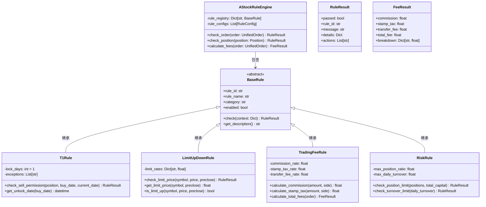

# A股规则引擎设计文档

> 清风量化系统 v5.0 - A股规则引擎详细设计
> **索引**: `DESIGN_A_STOCK_RULES_001`
> **设计时间**: 3-5天
> **核心定位**: 统一管理A股市场交易规则，确保模拟交易符合真实市场规则

## 1. 设计原则

| 原则 | 说明 | 实现方式 |
|------|------|----------|
| **规则即配置** | 所有规则以YAML配置定义，不写死代码 | 规则配置文件 + 动态加载 |
| **模块化设计** | 不同规则类型独立模块，便于维护扩展 | 规则分类体系 + 插件机制 |
| **高性能检查** | 规则检查需高性能，不影响交易执行 | 规则缓存 + 并行检查 |
| **完整覆盖** | 覆盖A股所有核心交易规则 | T+1、涨跌停、ST、费用、风险 |
| **精确模拟** | 规则执行结果与真实市场一致 | 基于真实交易规则验证 |

## 2. 规则分类体系

### 2.1 交易规则类（Trade Rules）
- **T+1规则**：当日买入次日可卖出
- **涨跌停规则**：主板10%、创业板/科创板20%、ST股5%
- **ST股票规则**：特殊交易限制
- **新股规则**：首日涨跌幅限制、临时停牌
- **大宗交易规则**：大宗交易限制

### 2.2 费用规则类（Fee Rules）
- **佣金规则**：万三，最低5元，双向收取
- **印花税规则**：千一，卖出时单向收取
- **过户费规则**：万0.1，沪深差异，双向收取
- **规费规则**：万0.2，双向收取
- **滑点模型**：基于流动性的动态滑点计算

### 2.3 风险规则类（Risk Rules）
- **单股仓位限制**：单票最大仓位比例
- **总仓位限制**：总持仓市值限制
- **日换手率限制**：当日最大换手率
- **黑名单限制**：禁止交易的股票列表
- **流动性限制**：最小成交量要求

### 2.4 市场规则类（Market Rules）
- **交易时间规则**：开盘、收盘、午间休市
- **集合竞价规则**：开盘/收盘集合竞价机制
- **连续竞价规则**：价格优先、时间优先
- **临时停牌规则**：涨跌停触发的临时停牌

## 3. 架构设计

### 3.1 类图设计



### 3.2 核心接口定义

```python
from abc import ABC, abstractmethod
from dataclasses import dataclass
from typing import Dict, List, Optional, Any
from datetime import datetime
from enum import Enum


class RuleCategory(str, Enum):
    """规则分类"""
    TRADE = "trade"      # 交易规则
    FEE = "fee"          # 费用规则
    RISK = "risk"        # 风险规则
    MARKET = "market"    # 市场规则


class RuleSeverity(str, Enum):
    """规则严重程度"""
    INFO = "info"        # 信息
    WARNING = "warning"  # 警告
    ERROR = "error"      # 错误
    CRITICAL = "critical" # 严重


@dataclass
class RuleResult:
    """规则检查结果"""
    passed: bool                    # 是否通过
    rule_id: str                    # 规则ID
    rule_name: str                  # 规则名称
    category: RuleCategory          # 规则分类
    severity: RuleSeverity          # 严重程度
    message: str                    # 检查结果消息
    details: Dict[str, Any] = None  # 详细结果
    actions: List[str] = None       # 建议动作


@dataclass
class FeeResult:
    """费用计算结果"""
    commission: float = 0.0          # 佣金
    stamp_tax: float = 0.0           # 印花税
    transfer_fee: float = 0.0        # 过户费
    misc_fee: float = 0.0            # 其他费用
    total_fee: float = 0.0           # 总费用
    breakdown: Dict[str, float] = None  # 费用明细


class BaseRule(ABC):
    """规则基类"""
    
    def __init__(self, rule_id: str, rule_name: str, category: RuleCategory, 
                 enabled: bool = True, config: Dict[str, Any] = None):
        self.rule_id = rule_id
        self.rule_name = rule_name
        self.category = category
        self.enabled = enabled
        self.config = config or {}
    
    @abstractmethod
    def check(self, context: Dict[str, Any]) -> RuleResult:
        """检查规则
        
        参数:
            context: 检查上下文，包含订单、持仓、市场数据等
            
        返回:
            RuleResult: 规则检查结果
        """
        pass
    
    def get_description(self) -> str:
        """获取规则描述"""
        return f"{self.rule_name} ({self.rule_id})"
    
    def enable(self):
        """启用规则"""
        self.enabled = True
    
    def disable(self):
        """禁用规则"""
        self.enabled = False


class AStockRuleEngine:
    """A股规则引擎"""
    
    def __init__(self, config_path: str = None):
        self.rule_registry: Dict[str, BaseRule] = {}
        self.rule_configs: List[Dict] = []
        
        if config_path:
            self.load_config(config_path)
            self._initialize_rules()
    
    def register_rule(self, rule: BaseRule):
        """注册规则"""
        self.rule_registry[rule.rule_id] = rule
    
    def check_order(self, order: Dict[str, Any], context: Dict[str, Any] = None) -> List[RuleResult]:
        """检查订单合规性
        
        参数:
            order: 订单数据
            context: 额外上下文（持仓、账户、市场数据等）
            
        返回:
            List[RuleResult]: 所有规则检查结果
        """
        results = []
        check_context = {"order": order}
        if context:
            check_context.update(context)
        
        for rule in self.rule_registry.values():
            if not rule.enabled:
                continue
            
            # 只检查与订单相关的规则
            if rule.category in [RuleCategory.TRADE, RuleCategory.FEE, RuleCategory.RISK]:
                result = rule.check(check_context)
                results.append(result)
        
        return results
    
    def calculate_fees(self, order: Dict[str, Any], market_data: Dict[str, Any] = None) -> FeeResult:
        """计算交易费用
        
        参数:
            order: 订单数据
            market_data: 市场数据（用于滑点计算等）
            
        返回:
            FeeResult: 费用计算结果
        """
        # 获取费用规则
        fee_rules = [r for r in self.rule_registry.values() 
                    if r.category == RuleCategory.FEE and r.enabled]
        
        # 默认费用结果
        fee_result = FeeResult()
        
        # 应用所有费用规则
        for rule in fee_rules:
            if hasattr(rule, 'calculate_fees'):
                rule_fee_result = rule.calculate_fees(order, market_data)
                # 合并费用结果
                fee_result.commission += rule_fee_result.commission
                fee_result.stamp_tax += rule_fee_result.stamp_tax
                fee_result.transfer_fee += rule_fee_result.transfer_fee
                fee_result.misc_fee += rule_fee_result.misc_fee
        
        fee_result.total_fee = (
            fee_result.commission + 
            fee_result.stamp_tax + 
            fee_result.transfer_fee + 
            fee_result.misc_fee
        )
        
        return fee_result
    
    def load_config(self, config_path: str):
        """加载规则配置"""
        import yaml
        with open(config_path, 'r', encoding='utf-8') as f:
            self.rule_configs = yaml.safe_load(f)
    
    def _initialize_rules(self):
        """根据配置初始化规则"""
        # 这里会根据配置创建具体的规则实例
        # 实际实现中会使用工厂模式
        pass
```

## 4. 现有代码整合方案

### 4.1 已有代码模块

#### 4.1.1 T+1交易系统（来自 technical_documentation.md）
```python
class T1TradingSystem:
    """T+1交易制度量化"""
    T1_RULES = {
        '当日买入锁定': True,
        '次日解除限制': True,
        '适用范围': 'A股市场所有品种',
        '例外情况': ['ETF基金', '可转债', '期权']
    }
    
    def check_sell_permission(self, position, buy_date, current_date):
        """检查卖出权限"""
        if buy_date == current_date:
            return {
                'can_sell': False,
                'reason': 'T+1制度：当日买入不能卖出',
                'available_date': self.next_trading_day(buy_date)
            }
        return {'can_sell': True}
```

**整合方案**：
- 重构为 `T1Rule` 类，继承 `BaseRule`
- 保留核心算法，适配统一接口
- 添加配置支持，支持例外品种配置

#### 4.1.2 涨跌停板系统（来自 technical_documentation.md）
```python
class LimitUpDownSystem:
    """涨跌停板制度量化"""
    LIMIT_RULES = {
        '主板（沪市60/深市000）': {
            '涨跌停幅度': 0.10,
            'ST股票幅度': 0.05,
            '首日上市幅度': 0.44
        },
        '创业板（300）': {
            '涨跌停幅度': 0.20,
            'ST股票幅度': 0.20,
            '首日上市幅度': 0.44
        },
        '科创板（688）': {
            '涨跌停幅度': 0.20,
            'ST股票幅度': 0.20,
            '首日上市幅度':无涨跌停
        }
    }
```

**整合方案**：
- 重构为 `LimitUpDownRule` 类
- 扩展规则配置，支持更多板类型
- 添加价格检查、涨跌停判断方法

#### 4.1.3 交易费用常量（来自 technical_documentation.md）
```python
TRADING_FEES = {
    '佣金': {'rate': 0.0003, 'min': 5, '双向': True},
    '印花税': {'rate': 0.001, 'min': 0, '单向': 'sell'},
    '过户费': {'rate': 0.00001, 'min': 1, '双向': True, 'market': 'SH'},
    '规费': {'rate': 0.00002, 'min': 0, '双向': True}
}
```

**整合方案**：
- 重构为 `TradingFeeRule` 类
- 实现精确的费用计算算法
- 支持沪深市场差异
- 添加最低费用、阶梯费率支持

#### 4.1.4 风控规则引擎（来自 RISK_RULE_ENGINE.md）
```python
class RiskRule:
    """风控规则"""
    def __init__(self, rule_id, name, category, severity, condition, action, enabled=True):
        self.rule_id = rule_id
        self.name = name
        self.category = category
        self.severity = severity
        self.condition = condition
        self.action = action
        self.enabled = enabled
```

**整合方案**：
- 重用现有 `RiskRule` 类设计
- 适配到统一规则接口
- 扩展为A股特定风险规则

#### 4.1.5 涨停板分析（来自 limit-up-analysis.md）
```python
class LimitUpAnalyzer:
    """涨停板分析"""
    def is_limit_up(self, stock_data, limit_rate=0.10):
        """判断是否涨停"""
        change_pct = stock_data['change_pct']
        return abs(change_pct - limit_rate * 100) < 0.1
```

**整合方案**：
- 整合到 `LimitUpDownRule` 中作为辅助方法
- 用于市场数据分析和规则验证

### 4.2 代码迁移计划

1. **第一阶段（1-2天）**：创建基础框架
   - 实现 `BaseRule`、`RuleResult`、`FeeResult` 等基础类
   - 实现 `AStockRuleEngine` 核心引擎

2. **第二阶段（2-3天）**：迁移现有规则
   - 迁移 T+1 规则为 `T1Rule`
   - 迁移涨跌停规则为 `LimitUpDownRule`
   - 迁移费用规则为 `TradingFeeRule`

3. **第三阶段（1-2天）**：扩展功能
   - 添加ST股票规则
   - 添加新股规则
   - 添加风险规则集成

## 5. 规则配置模板

### 5.1 YAML配置结构

```yaml
# config/rules/a_stock_rules.yaml
version: "1.0"
engine: "AStockRuleEngine"
last_updated: "2026-04-02"

rules:
  # ============ 交易规则 ============
  - rule_id: "TRADE_001"
    rule_name: "T+1交易规则"
    category: "trade"
    enabled: true
    severity: "error"
    class: "T1Rule"
    config:
      lock_days: 1
      exceptions: ["ETF", "可转债", "期权"]
      check_method: "check_sell_permission"
  
  - rule_id: "TRADE_002"
    rule_name: "涨跌停规则"
    category: "trade"
    enabled: true
    severity: "error"
    class: "LimitUpDownRule"
    config:
      limit_rates:
        "主板":
          normal: 0.10
          st: 0.05
          first_day: 0.44
        "创业板":
          normal: 0.20
          st: 0.20
          first_day: 0.44
        "科创板":
          normal: 0.20
          st: 0.20
          first_day: null  # 无涨跌停
      precision: 0.01  # 价格精度
  
  - rule_id: "TRADE_003"
    rule_name: "ST股票规则"
    category: "trade"
    enabled: true
    severity: "warning"
    class: "STRule"
    config:
      st_prefixes: ["*ST", "ST"]
      warning_days: 30
      delisting_threshold: 3  # 连续3年亏损
  
  # ============ 费用规则 ============
  - rule_id: "FEE_001"
    rule_name: "佣金规则"
    category: "fee"
    enabled: true
    severity: "info"
    class: "CommissionRule"
    config:
      rate: 0.0003  # 万三
      min_amount: 5.0
      both_sides: true
      calculate_method: "percentage_with_min"
  
  - rule_id: "FEE_002"
    rule_name: "印花税规则"
    category: "fee"
    enabled: true
    severity: "info"
    class: "StampTaxRule"
    config:
      rate: 0.001  # 千一
      apply_on: "sell"  # 卖出时收取
      exempt_categories: ["ETF", "国债"]
  
  - rule_id: "FEE_003"
    rule_name: "过户费规则"
    category: "fee"
    enabled: true
    severity: "info"
    class: "TransferFeeRule"
    config:
      sh_rate: 0.00001  # 沪市万0.1
      sz_rate: 0.00002  # 深市万0.2
      min_amount: 1.0
      both_sides: true
  
  - rule_id: "FEE_004"
    rule_name: "滑点模型"
    category: "fee"
    enabled: true
    severity: "info"
    class: "SlippageRule"
    config:
      base_rate: 0.0002  # 基础滑点率0.02%
      liquidity_factor: true
      volatility_factor: true
      market_cap_weight: true
  
  # ============ 风险规则 ============
  - rule_id: "RISK_001"
    rule_name: "单股仓位限制"
    category: "risk"
    enabled: true
    severity: "error"
    class: "PositionLimitRule"
    config:
      max_position_ratio: 0.10  # 单股最大10%
      max_position_value: 1000000  # 单股最大100万
      apply_to: ["A股", "港股"]
  
  - rule_id: "RISK_002"
    rule_name: "总仓位限制"
    category: "risk"
    enabled: true
    severity: "error"
    class: "TotalPositionRule"
    config:
      max_total_ratio: 0.80  # 总仓位最大80%
      cash_reserve_ratio: 0.05  # 现金储备5%
  
  - rule_id: "RISK_003"
    rule_name: "日换手率限制"
    category: "risk"
    enabled: true
    severity: "warning"
    class: "TurnoverLimitRule"
    config:
      max_daily_turnover: 0.30  # 日换手率不超过30%
      calculation_period: "daily"
  
  # ============ 市场规则 ============
  - rule_id: "MARKET_001"
    rule_name: "交易时间规则"
    category: "market"
    enabled: true
    severity: "error"
    class: "TradingHoursRule"
    config:
      market_hours:
        "A股":
          morning_open: "09:30"
          morning_close: "11:30"
          afternoon_open: "13:00"
          afternoon_close: "15:00"
        "港股":
          morning_open: "09:30"
          morning_close: "12:00"
          afternoon_open: "13:00"
          afternoon_close: "16:00"
      holidays: "config/holidays.yaml"
  
  - rule_id: "MARKET_002"
    rule_name: "集合竞价规则"
    category: "market"
    enabled: true
    severity: "info"
    class: "AuctionRule"
    config:
      auction_periods:
        "开盘竞价": "09:15-09:25"
        "收盘竞价": "14:57-15:00"
      price_discovery: "volume_weighted"
      match_method: "price_time_priority"
```

### 5.2 配置说明

1. **规则ID命名规范**：`{类别}_{序号}`，如 `TRADE_001`
2. **类别枚举**：`trade`、`fee`、`risk`、`market`
3. **严重程度**：`info`、`warning`、`error`、`critical`
4. **类名引用**：规则实现类的全路径名
5. **配置参数**：每个规则特有的配置参数

## 6. 集成到多引擎架构

### 6.1 与引擎适配器的集成

```python
class VnPySimulationAdapter(BaseEngineAdapter):
    """vn.py模拟交易适配器"""
    
    def __init__(self, config: VnPyConfig):
        super().__init__(config)
        # 初始化A股规则引擎
        self.rule_engine = AStockRuleEngine("config/rules/a_stock_rules.yaml")
    
    def submit_order(self, order: UnifiedOrder) -> Result:
        """提交订单"""
        # 1. 规则检查
        rule_results = self.rule_engine.check_order(order.to_dict())
        
        # 2. 检查是否有错误级别的规则违规
        critical_errors = [r for r in rule_results 
                          if r.severity in [RuleSeverity.ERROR, RuleSeverity.CRITICAL] 
                          and not r.passed]
        
        if critical_errors:
            error_msg = "; ".join([f"{r.rule_name}: {r.message}" for r in critical_errors])
            return Result.error(f"订单违反规则: {error_msg}")
        
        # 3. 计算费用
        fee_result = self.rule_engine.calculate_fees(order.to_dict())
        order.metadata['fees'] = fee_result
        
        # 4. 执行订单
        return self._execute_order(order)
```

### 6.2 统一规则检查点

1. **下单前检查**：订单合规性、风险限制
2. **费用计算**：精确计算交易成本
3. **成交后验证**：检查成交价格是否符合规则
4. **持仓监控**：持续监控持仓是否符合规则

## 7. 测试方案

### 7.1 单元测试

```python
import pytest
from a_stock_rules import AStockRuleEngine, T1Rule, LimitUpDownRule

class TestAStockRuleEngine:
    """A股规则引擎测试"""
    
    def setup_method(self):
        self.engine = AStockRuleEngine()
        self.engine.register_rule(T1Rule("TRADE_001", "T+1规则", RuleCategory.TRADE))
        self.engine.register_rule(LimitUpDownRule("TRADE_002", "涨跌停规则", RuleCategory.TRADE))
    
    def test_t1_rule_check(self):
        """测试T+1规则检查"""
        order = {
            "symbol": "000001.SZ",
            "side": "SELL",
            "quantity": 1000,
            "position_date": "2026-04-01",
            "current_date": "2026-04-01"
        }
        
        results = self.engine.check_order(order)
        t1_result = [r for r in results if r.rule_id == "TRADE_001"][0]
        
        assert not t1_result.passed
        assert "T+1制度" in t1_result.message
    
    def test_limit_up_rule_check(self):
        """测试涨跌停规则检查"""
        order = {
            "symbol": "000001.SZ",
            "side": "BUY",
            "quantity": 1000,
            "price": 11.00,
            "preclose": 10.00
        }
        
        results = self.engine.check_order(order)
        limit_result = [r for r in results if r.rule_id == "TRADE_002"][0]
        
        assert not limit_result.passed
        assert "涨停" in limit_result.message
    
    def test_fee_calculation(self):
        """测试费用计算"""
        order = {
            "symbol": "000001.SZ",
            "side": "BUY",
            "quantity": 10000,
            "price": 10.00
        }
        
        fee_result = self.engine.calculate_fees(order)
        
        assert fee_result.commission == max(100000 * 0.0003, 5.0)  # 30元或最低5元
        assert fee_result.stamp_tax == 0  # 买入不收印花税
        assert fee_result.total_fee > 0
```

### 7.2 集成测试

1. **与vn.py集成测试**：验证规则引擎在vn.py适配器中的正确性
2. **多规则组合测试**：测试多个规则同时生效的场景
3. **性能测试**：测试规则检查的性能影响
4. **边界条件测试**：测试各种边界情况

### 7.3 测试数据

- **正常交易场景**：普通买卖订单
- **规则违规场景**：T+1违规、涨跌停违规、仓位超限
- **边界场景**：最低佣金、最大仓位、涨停价成交
- **异常场景**：无效股票代码、异常价格、零数量

## 8. 实施计划

### 8.1 阶段划分

| 阶段 | 时间 | 目标 | 交付物 |
|------|------|------|--------|
| **设计阶段** | 3-5天 | 完成详细设计文档 | 本设计文档、接口定义、配置模板 |
| **开发阶段** | 10-15天 | 实现核心功能 | 规则引擎代码、规则实现类、单元测试 |
| **测试阶段** | 5-7天 | 完成全面测试 | 测试用例、性能报告、集成测试结果 |
| **集成阶段** | 3-5天 | 集成到多引擎架构 | 适配器集成代码、配置示例 |
| **优化阶段** | 3-5天 | 性能优化和功能完善 | 优化代码、文档完善、示例策略 |

### 8.2 资源需求

1. **开发资源**：
   - 核心开发工程师：1人（10-15天）
   - 测试工程师：0.5人（5-7天）
   - 架构师支持：0.2人（评审和指导）

2. **技术资源**：
   - 测试环境：A股历史数据、模拟交易环境
   - 开发工具：Python 3.8+、pytest、性能分析工具
   - 文档工具：Markdown、Mermaid图表

### 8.3 风险评估与缓解

| 风险 | 可能性 | 影响 | 缓解措施 |
|------|--------|------|----------|
| **规则复杂性** | 高 | 中 | 分阶段实现，先核心规则后扩展规则 |
| **性能问题** | 中 | 中 | 实现规则缓存，优化检查算法 |
| **配置复杂性** | 中 | 低 | 提供详细配置示例和验证工具 |
| **集成问题** | 低 | 高 | 设计清晰接口，提供集成示例 |
| **维护成本** | 低 | 中 | 模块化设计，良好文档 |

## 9. 后续扩展

### 9.1 短期扩展（3个月内）

1. **更多A股规则**：大宗交易规则、融资融券规则
2. **港股规则**：港股市场交易规则
3. **美股规则**：美股市场交易规则
4. **规则可视化**：规则配置和管理界面

### 9.2 中期扩展（6个月内）

1. **规则学习**：基于历史数据自动优化规则参数
2. **智能规则推荐**：根据市场状态推荐适用规则
3. **规则回测**：规则对策略绩效的影响分析
4. **分布式规则引擎**：支持分布式规则检查

### 9.3 长期扩展（1年内）

1. **AI规则生成**：使用AI生成交易规则
2. **实时规则调整**：根据市场波动实时调整规则
3. **跨市场规则**：支持多市场统一规则管理
4. **规则市场**：用户共享和交易规则模板

## 10. 文档维护

### 10.1 文档清单

1. **本设计文档**：架构设计和接口定义
2. **API文档**：规则引擎API参考
3. **配置指南**：规则配置详细指南
4. **集成指南**：与其他模块集成指南
5. **用户手册**：最终用户使用手册
6. **开发指南**：规则开发扩展指南

### 10.2 更新机制

1. **版本控制**：使用语义化版本控制
2. **变更日志**：记录所有设计变更
3. **评审流程**：重大变更需经架构评审
4. **文档同步**：代码变更时同步更新文档

```---

**设计评审要点**：
1. 规则分类体系是否完整覆盖A股需求
2. 接口设计是否清晰易用
3. 配置模板是否灵活且不易出错
4. 性能设计是否能满足实时交易需求
5. 集成方案是否与现有架构兼容

**下一步行动**：
1. 组织设计评审会议
2. 根据评审意见修改设计
3. 开始开发阶段任务分解
4. 创建开发环境和技术栈准备